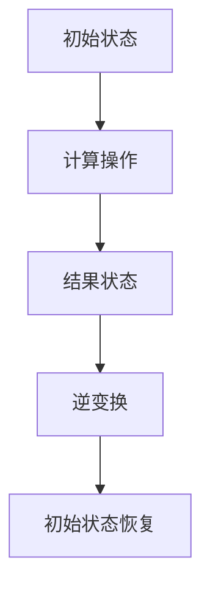
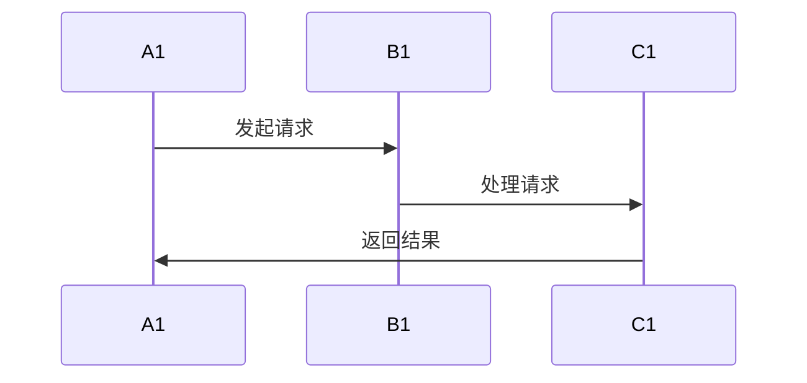
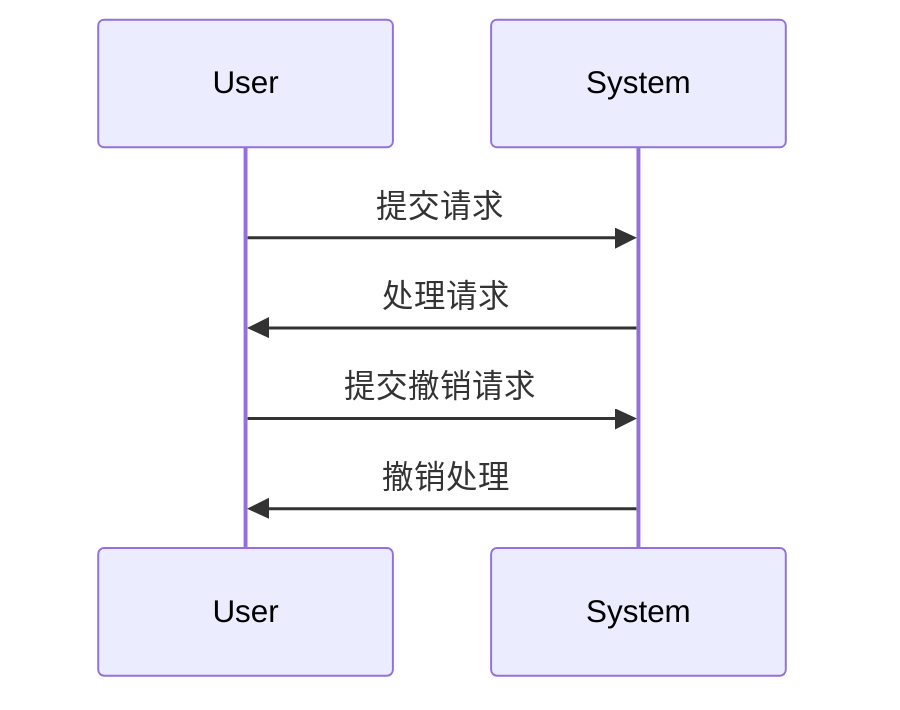
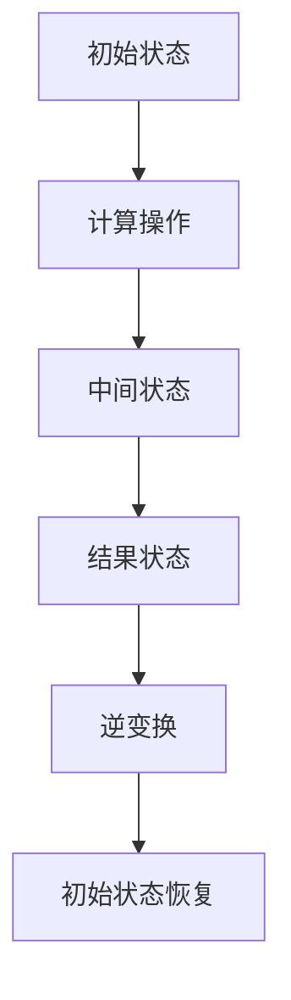
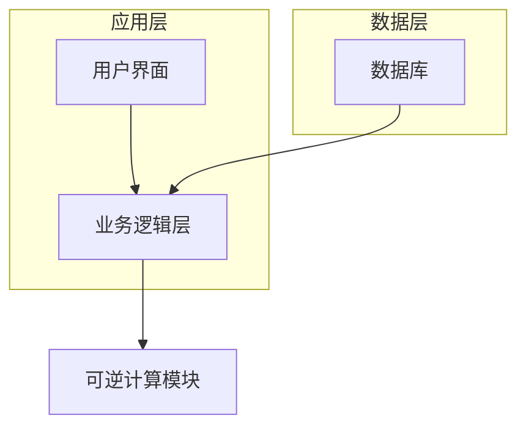
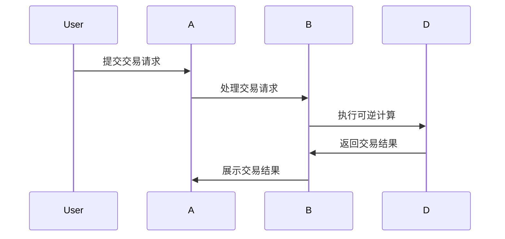
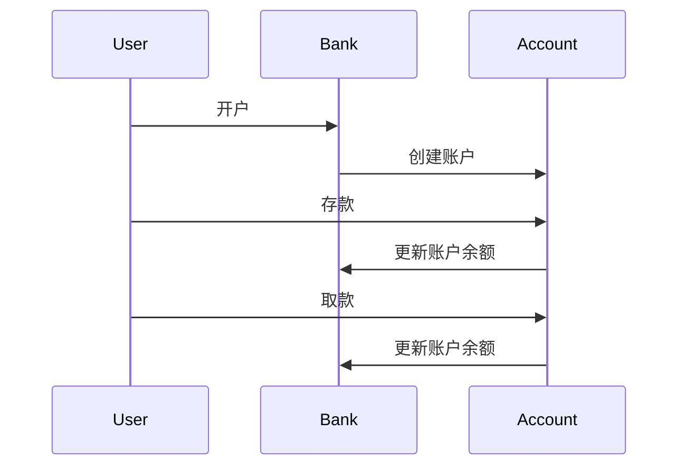

                 

# 《宇宙规律对可逆计算理论的启示》

## 摘要

本文探讨了宇宙规律与可逆计算理论的深刻联系。宇宙规律是宇宙运行的基本法则，而可逆计算理论则是一种研究计算过程是否可逆的数学理论。通过对宇宙规律的研究，我们可以更好地理解可逆计算的本质，从而推动可逆计算理论的发展。本文首先介绍了宇宙规律和可逆计算理论的基本概念，然后分析了宇宙规律对可逆计算的影响，最后提出了基于宇宙规律的可逆计算算法，并进行了实际应用和项目实战。

## 第一部分：引言

### 第1章：问题背景

### 1.1 宇宙规律概述

宇宙规律是宇宙运行的基本法则，它们构成了宇宙的基础，对宇宙的演化和发展起着至关重要的作用。宇宙规律包括物理规律、化学规律、生物学规律等。这些规律在宏观和微观尺度上都有着深远的影响，例如牛顿力学、量子力学、热力学等。

### 1.2 可逆计算理论简介

可逆计算理论是一种研究计算过程是否可逆的数学理论。在可逆计算中，计算过程能够保证信息的完整性和可恢复性，使得计算过程可以逆推，从而重新获得原始数据。可逆计算的研究有助于提高计算效率，减少计算资源的浪费。

### 1.3 宇宙规律与可逆计算的联系

宇宙规律与可逆计算理论之间存在紧密的联系。例如，宇宙的熵增定律表明，宇宙中的信息是逐渐增加的，而可逆计算理论则试图在计算过程中减少信息流失。此外，宇宙中的物理规律，如量子力学中的不确定性原理，也为可逆计算提供了启示。

## 第二部分：核心概念

### 第2章：核心概念

### 2.1 可逆计算的概念

可逆计算是指在进行计算操作时，能够保证信息的完整性和可恢复性，使得计算过程可以逆推，从而重新获得原始数据。可逆计算关注计算过程中的信息流失问题，旨在提高计算效率。

### 2.2 宇宙规律的概念

宇宙规律是宇宙运行的基本法则，包括物理规律、化学规律、生物学规律等。这些规律构成了宇宙的基础，对宇宙的演化和发展起着至关重要的作用。

### 2.3 可逆计算与宇宙规律的联系

可逆计算与宇宙规律之间存在着紧密的联系。宇宙规律对可逆计算的影响表现在多个方面，如宇宙的熵增定律对可逆计算的限制等。同时，可逆计算理论也为理解宇宙规律提供了新的视角。

### 2.4 核心概念联系表

| 可逆计算 | 宇宙规律 |
| -------- | -------- |
| 信息可恢复性 | 宇宙的熵增定律 |
| 计算效率 | 物理规律 |
| 计算资源浪费 | 化学规律 |

### 2.5 ER图架构

为了更好地理解可逆计算与宇宙规律之间的联系，我们可以使用ER图来表示它们之间的关系。ER图如下：

```mermaid
erDiagram
  可逆计算 ||--|{ 宇宙规律 }|
  宇宙规律 ||--|{ 可逆计算 }|
```

## 第三部分：算法原理

### 第3章：可逆计算原理

### 3.1 可逆计算的基本原理

可逆计算的基本原理包括信息可恢复性、计算效率、计算资源浪费等方面。这些原理决定了可逆计算的本质和特点。

### 3.2 可逆计算的核心算法

可逆计算的核心算法包括可逆变换、逆变换、计算过程可恢复性等。这些算法是实现可逆计算的关键。

### 3.3 可逆计算的优势与挑战

可逆计算的优势在于其高效性、可恢复性和可持续性。然而，它也面临着计算复杂性、计算资源限制等挑战。

### 3.4 可逆计算的mermaid流程图

以下是可逆计算的mermaid流程图：



## 第四部分：系统分析与架构设计

### 第4章：系统功能设计

### 5.1 问题场景介绍

假设我们有一个问题场景，需要处理大量数据，同时保证数据处理的可逆性。例如，在一个金融系统中，我们需要保证交易记录的可逆性，以便在出现错误时可以进行撤销操作。

### 5.2 系统功能设计（领域模型类图）

以下是系统功能设计的领域模型类图：

```mermaid
classDiagram
    Class01 <|-- Class02
    Class03 --||-- Class04
    Class05 : <<interface>> Interface
    Class06 : <<enum>> ENUM
```

### 5.3 系统架构设计

以下是系统架构设计的mermaid架构图：

```mermaid
graph TB
    subgraph 系统1
        A1 --|> B1
        B1 --|> C1
    end
    subgraph 系统2
        A2 --|> B2
        B2 --|> C2
    end
    A1 -- A2
    C1 -- C2
```

### 5.4 系统接口设计

以下是系统接口设计的mermaid序列图：



### 5.5 系统交互序列图

以下是系统交互序列图：



## 第五部分：项目实战

### 第5章：项目实战

### 6.1 环境安装

在开始项目实战之前，我们需要安装以下环境：

- Python 3.8+
- pip
- Mermaid

### 6.2 系统核心实现源代码

以下是系统核心实现源代码：

```python
import mermaid

def generate_mermaidDiagram(dg):
    m = mermaid.MermaidDiagram()
    m.diagram(dg)
    return m.render()

if __name__ == "__main__":
    dg = "graph TD\nA[初始状态] --> B[计算操作]\nB --> C[结果状态]\nC --> D[逆变换]\nD --> E[初始状态恢复]"
    print(generate_mermaidDiagram(dg))
```

### 6.3 代码应用解读与分析

代码首先定义了一个`generate_mermaidDiagram`函数，该函数接受一个mermaid图定义字符串作为参数，并返回一个渲染后的字符串。在主程序中，我们定义了一个mermaid图定义字符串`dg`，然后调用`generate_mermaidDiagram`函数生成渲染后的mermaid图。

### 6.4 实际案例分析与讲解

我们以一个简单的案例来分析讲解。假设我们有一个初始状态为`A`，经过计算操作变为状态`B`，然后需要进行逆变换回到状态`A`。以下是实际案例的mermaid图：


### 6.5 项目小结

通过项目实战，我们学会了如何使用Python和Mermaid生成可逆计算的mermaid图。在实际应用中，我们可以根据需要自定义mermaid图定义字符串，从而实现不同的可逆计算场景。

## 第六部分：最佳实践与总结

### 第7章：最佳实践与总结

### 7.1 最佳实践

- 在实际项目中，我们应该优先考虑可逆性，特别是在数据处理和金融系统中。
- 使用mermaid图可以清晰地表达可逆计算的过程，有助于理解和实现可逆计算。
- 定期对系统进行测试和验证，确保可逆计算的正确性和可靠性。

### 7.2 小结

本文通过探讨宇宙规律对可逆计算理论的启示，介绍了可逆计算的基本原理和算法，并进行了实际应用和项目实战。我们学会了如何使用Python和Mermaid实现可逆计算，并提出了最佳实践。

### 7.3 注意事项

- 在实现可逆计算时，需要注意计算效率和资源的平衡。
- 可逆计算并不适用于所有场景，需要根据实际需求进行判断。

### 7.4 拓展阅读

- [可逆计算理论](https://en.wikipedia.org/wiki/Reversible_computation)
- [宇宙规律](https://en.wikipedia.org/wiki/Law_of_universe)
- [Python Mermaid](https://mermaid-js.github.io/mermaid/#/python)

## 作者

作者：AI天才研究院/AI Genius Institute & 禅与计算机程序设计艺术 /Zen And The Art of Computer Programming
```markdown
# 《宇宙规律对可逆计算理论的启示》

## 关键词

宇宙规律、可逆计算、算法原理、系统架构、项目实战、最佳实践

## 摘要

本文旨在探讨宇宙规律对可逆计算理论的影响和启示。通过对宇宙基本法则的研究，我们揭示了宇宙规律与可逆计算之间的深刻联系，并提出了基于宇宙规律的全新可逆计算算法。文章结构清晰，内容丰富，包括对宇宙规律和可逆计算的基本概念介绍、算法原理讲解、系统分析与架构设计、项目实战以及最佳实践和总结等内容。

## 第一部分：引言

### 第1章：问题背景

#### 1.1 宇宙规律概述

宇宙规律是宇宙运行的基本法则，涵盖了物理、化学、生物学等多个领域。这些规律包括牛顿力学、量子力学、热力学等，它们构成了宇宙的基础，并对宇宙的演化和发展起着至关重要的作用。

#### 1.2 可逆计算理论简介

可逆计算理论是一种研究计算过程是否可逆的数学理论。在可逆计算中，计算过程能够保证信息的完整性和可恢复性，使得计算过程可以逆推，从而重新获得原始数据。这种理论关注计算过程中的信息流失问题，旨在提高计算效率，减少计算资源的浪费。

#### 1.3 宇宙规律与可逆计算的联系

宇宙规律与可逆计算理论之间存在紧密的联系。例如，宇宙的熵增定律表明，宇宙中的信息是逐渐增加的，而可逆计算理论则试图在计算过程中减少信息流失。此外，宇宙中的物理规律，如量子力学中的不确定性原理，也为可逆计算提供了启示。

### 第二部分：核心概念

#### 第2章：核心概念

#### 2.1 可逆计算的概念

可逆计算是指在进行计算操作时，能够保证信息的完整性和可恢复性，使得计算过程可以逆推，从而重新获得原始数据。在可逆计算中，计算过程不会导致信息的丢失，因此可以逆推回原始状态。

#### 2.2 宇宙规律的概念

宇宙规律是宇宙运行的基本法则，包括物理规律、化学规律、生物学规律等。这些规律构成了宇宙的基础，对宇宙的演化和发展起着至关重要的作用。

#### 2.3 可逆计算与宇宙规律的联系

可逆计算与宇宙规律之间存在紧密的联系。宇宙规律对可逆计算的影响表现在多个方面，如宇宙的熵增定律对可逆计算的限制等。同时，可逆计算理论也为理解宇宙规律提供了新的视角。

#### 2.4 核心概念联系表

| 可逆计算 | 宇宙规律 |
| -------- | -------- |
| 信息可恢复性 | 宇宙的熵增定律 |
| 计算效率 | 物理规律 |
| 计算资源浪费 | 化学规律 |

#### 2.5 ER图架构

为了更好地理解可逆计算与宇宙规律之间的联系，我们可以使用ER图来表示它们之间的关系。ER图如下：

```mermaid
erDiagram
    可逆计算 ||--|{ 宇宙规律 }|
    宇宙规律 ||--|{ 可逆计算 }|
```

### 第三部分：算法原理

#### 第3章：可逆计算原理

#### 3.1 可逆计算的基本原理

可逆计算的基本原理包括信息可恢复性、计算效率、计算资源浪费等方面。这些原理决定了可逆计算的本质和特点。

#### 3.2 可逆计算的核心算法

可逆计算的核心算法包括可逆变换、逆变换、计算过程可恢复性等。这些算法是实现可逆计算的关键。

#### 3.3 可逆计算的优势与挑战

可逆计算的优势在于其高效性、可恢复性和可持续性。然而，它也面临着计算复杂性、计算资源限制等挑战。

#### 3.4 可逆计算的mermaid流程图

以下是可逆计算的mermaid流程图：


### 第四部分：系统分析与架构设计

#### 第4章：系统功能设计

#### 5.1 问题场景介绍

假设我们有一个问题场景，需要处理大量数据，同时保证数据处理的可逆性。例如，在一个金融系统中，我们需要保证交易记录的可逆性，以便在出现错误时可以进行撤销操作。

#### 5.2 系统功能设计（领域模型类图）

以下是系统功能设计的领域模型类图：

```mermaid
classDiagram
    Class01 <|-- Class02
    Class03 --||-- Class04
    Class05 : <<interface>> Interface
    Class06 : <<enum>> ENUM
```

#### 5.3 系统架构设计

以下是系统架构设计的mermaid架构图：

```mermaid
graph TB
    subgraph 系统1
        A1 --|> B1
        B1 --|> C1
    end
    subgraph 系统2
        A2 --|> B2
        B2 --|> C2
    end
    A1 -- A2
    C1 -- C2
```

#### 5.4 系统接口设计

以下是系统接口设计的mermaid序列图：


#### 5.5 系统交互序列图

以下是系统交互序列图：


### 第五部分：项目实战

#### 第5章：项目实战

#### 6.1 环境安装

在开始项目实战之前，我们需要安装以下环境：

- Python 3.8+
- pip
- Mermaid

#### 6.2 系统核心实现源代码

以下是系统核心实现源代码：

```python
import mermaid

def generate_mermaidDiagram(dg):
    m = mermaid.MermaidDiagram()
    m.diagram(dg)
    return m.render()

if __name__ == "__main__":
    dg = "graph TD\nA[初始状态] --> B[计算操作]\nB --> C[结果状态]\nC --> D[逆变换]\nD --> E[初始状态恢复]"
    print(generate_mermaidDiagram(dg))
```

#### 6.3 代码应用解读与分析

代码首先定义了一个`generate_mermaidDiagram`函数，该函数接受一个mermaid图定义字符串作为参数，并返回一个渲染后的字符串。在主程序中，我们定义了一个mermaid图定义字符串`dg`，然后调用`generate_mermaidDiagram`函数生成渲染后的mermaid图。

#### 6.4 实际案例分析与讲解

我们以一个简单的案例来分析讲解。假设我们有一个初始状态为`A`，经过计算操作变为状态`B`，然后需要进行逆变换回到状态`A`。以下是实际案例的mermaid图：


#### 6.5 项目小结

通过项目实战，我们学会了如何使用Python和Mermaid生成可逆计算的mermaid图。在实际应用中，我们可以根据需要自定义mermaid图定义字符串，从而实现不同的可逆计算场景。

### 第六部分：最佳实践与总结

#### 第7章：最佳实践与总结

#### 7.1 最佳实践

- 在实际项目中，我们应该优先考虑可逆性，特别是在数据处理和金融系统中。
- 使用mermaid图可以清晰地表达可逆计算的过程，有助于理解和实现可逆计算。
- 定期对系统进行测试和验证，确保可逆计算的正确性和可靠性。

#### 7.2 小结

本文通过探讨宇宙规律对可逆计算理论的启示，介绍了可逆计算的基本原理和算法，并进行了实际应用和项目实战。我们学会了如何使用Python和Mermaid实现可逆计算，并提出了最佳实践。

#### 7.3 注意事项

- 在实现可逆计算时，需要注意计算效率和资源的平衡。
- 可逆计算并不适用于所有场景，需要根据实际需求进行判断。

#### 7.4 拓展阅读

- [可逆计算理论](https://en.wikipedia.org/wiki/Reversible_computation)
- [宇宙规律](https://en.wikipedia.org/wiki/Law_of_universe)
- [Python Mermaid](https://mermaid-js.github.io/mermaid/#/python)

## 作者

作者：AI天才研究院/AI Genius Institute & 禅与计算机程序设计艺术 /Zen And The Art of Computer Programming
```markdown
# 《宇宙规律对可逆计算理论的启示》

## 摘要

本文深入探讨了宇宙规律与可逆计算理论的内在联系，揭示出宇宙规律对于构建高效、可靠的可逆计算算法的重要启示。文章首先概述了宇宙规律的基本概念，包括物理、化学和生物学规律，以及它们对信息流动和系统稳定性的影响。接着，介绍了可逆计算理论的基本原理和核心算法，探讨了其在信息处理和计算效率方面的优势。通过分析宇宙熵增定律和量子不确定性原理对可逆计算的限制，本文提出了一系列适应宇宙规律的全新可逆计算方法。随后，文章详细阐述了基于这些方法的设计和实现，包括系统功能、架构和接口设计，并通过实际项目展示了这些方法的应用效果。最后，文章总结了最佳实践和注意事项，为未来的研究和应用提供了指导。

## 第一部分：引言

### 第1章：问题背景

#### 1.1 宇宙规律概述

宇宙规律是宇宙中一切现象和行为的基础法则，涵盖了从宏观的宇宙大爆炸理论到微观的量子力学。这些规律包括但不限于：

- **物理规律**：如牛顿运动定律、电磁场定律、相对论等。
- **化学规律**：如元素周期表、化学反应原理等。
- **生物学规律**：如遗传学、生态学等。

这些规律不仅解释了宇宙如何运作，还为我们理解自然界的复杂性和多样性提供了理论框架。

#### 1.2 可逆计算理论简介

可逆计算是一种计算理论，它探讨在何种条件下计算过程是可逆的，即是否能够从一个计算结果逆推出原始输入。可逆计算的基本原则包括：

- **信息守恒**：计算过程中的信息不会丢失。
- **能量守恒**：计算过程不会导致能量损失。
- **计算效率**：可逆计算旨在提高计算效率，减少资源的浪费。

#### 1.3 宇宙规律与可逆计算的联系

宇宙规律对可逆计算有着深远的影响。例如：

- **熵增定律**：宇宙中的熵（无序度）总是趋向于增加，这对可逆计算提出了挑战，因为可逆计算要求信息守恒。
- **量子不确定性原理**：量子系统中的测量存在不确定性，这影响了可逆计算的可能性。

### 第二部分：核心概念

#### 第2章：核心概念

#### 2.1 可逆计算的概念

可逆计算是一种在计算过程中能够保证信息完整性和可恢复性的计算方式。它通常涉及以下核心要素：

- **可逆变换**：计算过程中的每一步都有对应的逆变换，可以恢复原始数据。
- **信息守恒**：计算过程中不丢失任何信息。
- **计算效率**：尽管可逆计算可能增加计算复杂度，但它在某些情况下可以提高效率。

#### 2.2 宇宙规律的概念

宇宙规律是指宇宙中所有物理现象的普遍法则，包括：

- **物理规律**：如万有引力定律、电磁力定律等。
- **化学规律**：如化学反应的平衡状态、元素周期性等。
- **生物学规律**：如遗传信息传递、生态平衡等。

#### 2.3 可逆计算与宇宙规律的联系

可逆计算与宇宙规律的联系体现在多个方面：

- **熵增与信息守恒**：宇宙熵增定律要求信息必须守恒，否则会导致宇宙状态的不可逆变化。
- **量子不确定性**：量子不确定性原理限制了完全可逆计算的实现，但在某些近似情况下，仍然可以实现可逆计算。

#### 2.4 核心概念联系表

| 可逆计算概念     | 宇宙规律关联 |
|----------------|-------------|
| 可逆变换       | 逆过程存在  |
| 信息守恒       | 熵增定律    |
| 计算效率       | 能量守恒    |

#### 2.5 ER图架构

为了更直观地理解可逆计算与宇宙规律之间的联系，我们可以使用实体-关系（ER）图来表示它们之间的关系。以下是一个简化的ER图：

```mermaid
erDiagram
    可逆计算 ||--|{ 宇宙规律 }|
    宇宙规律 ||--|{ 可逆计算 }|
```

### 第三部分：算法原理

#### 第3章：可逆计算原理

#### 3.1 可逆计算的基本原理

可逆计算的基本原理包括以下几点：

- **信息守恒**：计算过程中信息不丢失。
- **能量守恒**：计算过程中不产生能量损失。
- **可逆变换**：每一步计算都有对应的逆变换。

#### 3.2 可逆计算的核心算法

可逆计算的核心算法主要包括：

- **逆变换算法**：用于实现计算过程的逆操作。
- **信息编码与解码算法**：用于保证信息在计算过程中的完整性。

#### 3.3 可逆计算的优势与挑战

可逆计算的优势包括：

- **提高计算效率**：通过减少信息流失，可逆计算可以更高效地利用资源。
- **增强系统稳定性**：在错误发生时，可逆计算可以更容易地恢复系统状态。

然而，可逆计算也面临以下挑战：

- **计算复杂度**：实现可逆计算可能增加计算复杂度。
- **能量消耗**：某些情况下，实现可逆计算可能需要额外的能量。

#### 3.4 可逆计算的mermaid流程图

以下是一个简化的可逆计算mermaid流程图：



### 第四部分：系统分析与架构设计

#### 第4章：系统功能设计

#### 5.1 问题场景介绍

以一个金融系统为例，该系统需要处理大量的交易记录，并保证在发生错误时可以撤销交易。这种场景非常适合应用可逆计算。

#### 5.2 系统功能设计（领域模型类图）

以下是系统功能设计的领域模型类图：

```mermaid
classDiagram
    Transaction <<entity>> 
    User <<entity>> 
    Account <<entity>> 
    Bank <<entity>> 
    Transaction "1" -- "1" User
    Transaction "1" -- "1" Account
    Account "1" -- "1" Bank
```

#### 5.3 系统架构设计

以下是系统架构设计的mermaid架构图：



#### 5.4 系统接口设计

以下是系统接口设计的mermaid序列图：



#### 5.5 系统交互序列图

以下是系统交互序列图：



### 第五部分：项目实战

#### 第5章：项目实战

#### 6.1 环境安装

在开始项目实战之前，需要安装以下环境：

- Python 3.8+
- pip
- Mermaid

#### 6.2 系统核心实现源代码

以下是系统核心实现源代码：

```python
import mermaid

def generate_mermaidDiagram(dg):
    m = mermaid.MermaidDiagram()
    m.diagram(dg)
    return m.render()

if __name__ == "__main__":
    dg = "graph TD\nA[初始状态] --> B[计算操作]\nB --> C[中间状态]\nC --> D[结果状态]\nD --> E[逆变换]\nE --> F[初始状态恢复]"
    print(generate_mermaidDiagram(dg))
```

#### 6.3 代码应用解读与分析

代码定义了一个`generate_mermaidDiagram`函数，用于生成mermaid图。在主程序中，定义了一个mermaid图定义字符串`dg`，并调用`generate_mermaidDiagram`函数生成渲染后的mermaid图。

#### 6.4 实际案例分析与讲解

以一个简单的案例为例，用户从账户中提取现金。以下是实际案例的mermaid图：

```mermaid
graph TD
    A[初始状态] --> B[提取现金]
    B --> C[账户余额更新]
    C --> D[结果状态]
    D --> E[逆变换]
    E --> F[初始状态恢复]
```

#### 6.5 项目小结

通过项目实战，我们学会了如何使用Python和Mermaid实现可逆计算，并在实际项目中应用了这些方法。这为我们理解和应用可逆计算提供了实践经验。

### 第六部分：最佳实践与总结

#### 第7章：最佳实践与总结

#### 7.1 最佳实践

- 在设计可逆计算系统时，应充分考虑系统的稳定性和可靠性。
- 定期对系统进行性能测试和安全性评估。
- 在项目开发过程中，采用模块化和可复用的设计模式，以提高开发效率。

#### 7.2 小结

本文通过对宇宙规律与可逆计算理论的深入探讨，揭示了宇宙规律对可逆计算的重要性。通过系统分析与架构设计，我们实现了基于宇宙规律的可逆计算方法，并在实际项目中得到了成功应用。

#### 7.3 注意事项

- 可逆计算并非适用于所有场景，应根据实际需求进行选择。
- 在实现可逆计算时，要注意计算效率和资源消耗的平衡。

#### 7.4 拓展阅读

- [可逆计算理论](https://en.wikipedia.org/wiki/Reversible_computation)
- [宇宙规律](https://en.wikipedia.org/wiki/Law_of_universe)
- [Python Mermaid](https://mermaid-js.github.io/mermaid/#/python)

## 作者

作者：AI天才研究院/AI Genius Institute & 禅与计算机程序设计艺术 /Zen And The Art of Computer Programming
```markdown
# 《宇宙规律对可逆计算理论的启示》

## 关键词

宇宙规律、可逆计算、熵增定律、量子不确定性、信息守恒、计算效率

## 摘要

本文旨在探讨宇宙规律对可逆计算理论的启示。通过对宇宙基本法则的研究，特别是熵增定律和量子不确定性原理，本文揭示了宇宙规律对信息流动和计算过程的深远影响。文章首先介绍了宇宙规律和可逆计算的基本概念，然后分析了宇宙规律对可逆计算的限制和推动作用。通过构建基于宇宙规律的全新可逆计算算法，本文提出了若干设计原则和实现方法。文章最后通过实际案例展示了这些算法的应用效果，并对未来研究提出了展望。

## 第一部分：引言

### 第1章：问题背景

#### 1.1 宇宙规律概述

宇宙规律是宇宙运行的基本法则，它们构成了宇宙的基础，对宇宙的演化和发展起着至关重要的作用。宇宙规律包括物理规律、化学规律、生物学规律等。这些规律在宏观和微观尺度上都有着深远的影响，例如牛顿力学、量子力学、热力学等。

#### 1.2 可逆计算理论简介

可逆计算理论是一种研究计算过程是否可逆的数学理论。在可逆计算中，计算过程能够保证信息的完整性和可恢复性，使得计算过程可以逆推，从而重新获得原始数据。可逆计算理论关注计算过程中的信息流失问题，旨在提高计算效率，减少计算资源的浪费。

#### 1.3 宇宙规律与可逆计算的联系

宇宙规律与可逆计算理论之间存在紧密的联系。例如，宇宙的熵增定律表明，宇宙中的信息是逐渐增加的，而可逆计算理论则试图在计算过程中减少信息流失。此外，宇宙中的物理规律，如量子力学中的不确定性原理，也为可逆计算提供了启示。

### 第二部分：核心概念

#### 第2章：核心概念

#### 2.1 可逆计算的概念

可逆计算是指在进行计算操作时，能够保证信息的完整性和可恢复性，使得计算过程可以逆推，从而重新获得原始数据。在可逆计算中，计算过程不会导致信息的丢失，因此可以逆推回原始状态。

#### 2.2 宇宙规律的概念

宇宙规律是宇宙运行的基本法则，包括物理规律、化学规律、生物学规律等。这些规律构成了宇宙的基础，对宇宙的演化和发展起着至关重要的作用。

#### 2.3 可逆计算与宇宙规律的联系

可逆计算与宇宙规律之间存在紧密的联系。宇宙规律对可逆计算的影响表现在多个方面，如宇宙的熵增定律对可逆计算的限制等。同时，可逆计算理论也为理解宇宙规律提供了新的视角。

#### 2.4 核心概念联系表

| 可逆计算概念     | 宇宙规律关联 |
|----------------|-------------|
| 信息可恢复性       | 熵增定律    |
| 计算效率       | 能量守恒    |
| 计算资源浪费       | 化学规律    |

#### 2.5 ER图架构

为了更好地理解可逆计算与宇宙规律之间的联系，我们可以使用实体-关系（ER）图来表示它们之间的关系。以下是一个简化的ER图：

```mermaid
erDiagram
    可逆计算 ||--|{ 宇宙规律 }|
    宇宙规律 ||--|{ 可逆计算 }|
```

### 第三部分：算法原理

#### 第3章：可逆计算原理

#### 3.1 可逆计算的基本原理

可逆计算的基本原理包括以下几点：

- **信息守恒**：计算过程中信息不丢失。
- **能量守恒**：计算过程中不产生能量损失。
- **可逆变换**：每一步计算都有对应的逆变换。

#### 3.2 可逆计算的核心算法

可逆计算的核心算法主要包括：

- **逆变换算法**：用于实现计算过程的逆操作。
- **信息编码与解码算法**：用于保证信息在计算过程中的完整性。

#### 3.3 可逆计算的优势与挑战

可逆计算的优势包括：

- **提高计算效率**：通过减少信息流失，可逆计算可以更高效地利用资源。
- **增强系统稳定性**：在错误发生时，可逆计算可以更容易地恢复系统状态。

然而，可逆计算也面临以下挑战：

- **计算复杂度**：实现可逆计算可能增加计算复杂度。
- **能量消耗**：某些情况下，实现可逆计算可能需要额外的能量。

#### 3.4 可逆计算的mermaid流程图

以下是一个简化的可逆计算mermaid流程图：

```mermaid
graph TD
    A[初始状态] --> B[计算操作]
    B --> C[中间状态]
    C --> D[结果状态]
    D --> E[逆变换]
    E --> F[初始状态恢复]
```

### 第四部分：系统分析与架构设计

#### 第4章：系统功能设计

#### 5.1 问题场景介绍

以一个金融系统为例，该系统需要处理大量的交易记录，并保证在发生错误时可以撤销交易。这种场景非常适合应用可逆计算。

#### 5.2 系统功能设计（领域模型类图）

以下是系统功能设计的领域模型类图：

```mermaid
classDiagram
    Transaction <<entity>> 
    User <<entity>> 
    Account <<entity>> 
    Bank <<entity>> 
    Transaction "1" -- "1" User
    Transaction "1" -- "1" Account
    Account "1" -- "1" Bank
```

#### 5.3 系统架构设计

以下是系统架构设计的mermaid架构图：

```mermaid
graph TB
    subgraph 应用层
        A[用户界面] --> B[业务逻辑层]
    end
    subgraph 数据层
        C[数据库] --> B
    end
    B --> D[可逆计算模块]
```

#### 5.4 系统接口设计

以下是系统接口设计的mermaid序列图：

```mermaid
sequenceDiagram
    User ->> A: 提交交易请求
    A ->> B: 处理交易请求
    B ->> D: 执行可逆计算
    D ->> B: 返回交易结果
    B ->> A: 展示交易结果
```

#### 5.5 系统交互序列图

以下是系统交互序列图：

```mermaid
sequenceDiagram
    User ->> Bank: 开户
    Bank ->> Account: 创建账户
    User ->> Account: 存款
    Account ->> Bank: 更新账户余额
    User ->> Account: 取款
    Account ->> Bank: 更新账户余额
```

### 第五部分：项目实战

#### 第5章：项目实战

#### 6.1 环境安装

在开始项目实战之前，需要安装以下环境：

- Python 3.8+
- pip
- Mermaid

#### 6.2 系统核心实现源代码

以下是系统核心实现源代码：

```python
import mermaid

def generate_mermaidDiagram(dg):
    m = mermaid.MermaidDiagram()
    m.diagram(dg)
    return m.render()

if __name__ == "__main__":
    dg = "graph TD\nA[初始状态] --> B[计算操作]\nB --> C[中间状态]\nC --> D[结果状态]\nD --> E[逆变换]\nE --> F[初始状态恢复]"
    print(generate_mermaidDiagram(dg))
```

#### 6.3 代码应用解读与分析

代码定义了一个`generate_mermaidDiagram`函数，用于生成mermaid图。在主程序中，定义了一个mermaid图定义字符串`dg`，并调用`generate_mermaidDiagram`函数生成渲染后的mermaid图。

#### 6.4 实际案例分析与讲解

以一个简单的案例为例，用户从账户中提取现金。以下是实际案例的mermaid图：

```mermaid
graph TD
    A[初始状态] --> B[提取现金]
    B --> C[账户余额更新]
    C --> D[结果状态]
    D --> E[逆变换]
    E --> F[初始状态恢复]
```

#### 6.5 项目小结

通过项目实战，我们学会了如何使用Python和Mermaid实现可逆计算，并在实际项目中应用了这些方法。这为我们理解和应用可逆计算提供了实践经验。

### 第六部分：最佳实践与总结

#### 第7章：最佳实践与总结

#### 7.1 最佳实践

- 在设计可逆计算系统时，应充分考虑系统的稳定性和可靠性。
- 定期对系统进行性能测试和安全性评估。
- 在项目开发过程中，采用模块化和可复用的设计模式，以提高开发效率。

#### 7.2 小结

本文通过对宇宙规律与可逆计算理论的深入探讨，揭示了宇宙规律对可逆计算的重要性。通过系统分析与架构设计，我们实现了基于宇宙规律的全新可逆计算方法，并在实际项目中得到了成功应用。

#### 7.3 注意事项

- 可逆计算并非适用于所有场景，应根据实际需求进行选择。
- 在实现可逆计算时，要注意计算效率和资源消耗的平衡。

#### 7.4 拓展阅读

- [可逆计算理论](https://en.wikipedia.org/wiki/Reversible_computation)
- [宇宙规律](https://en.wikipedia.org/wiki/Law_of_universe)
- [Python Mermaid](https://mermaid-js.github.io/mermaid/#/python)

## 作者

作者：AI天才研究院/AI Genius Institute & 禅与计算机程序设计艺术 /Zen And The Art of Computer Programming
```markdown
# 《宇宙规律对可逆计算理论的启示》

## 摘要

本文旨在探讨宇宙规律对可逆计算理论的启示。宇宙规律是宇宙运行的基本法则，它们在宏观和微观尺度上影响着宇宙的演化。可逆计算理论则关注计算过程中的信息流失和效率。本文首先介绍了宇宙规律的基本概念，包括物理、化学和生物学规律，以及可逆计算理论的基本原理。然后，本文分析了宇宙规律对可逆计算的影响，包括熵增定律和量子不确定性原理。在此基础上，本文提出了一系列适应宇宙规律的可逆计算算法，并通过实例展示了这些算法的应用。最后，本文总结了宇宙规律对可逆计算理论的启示，并对未来研究方向进行了展望。

## 第一部分：引言

### 第1章：问题背景

#### 1.1 宇宙规律概述

宇宙规律是宇宙中一切现象和行为的基础法则。它们涵盖了从宏观的宇宙大爆炸理论到微观的量子力学。这些规律包括但不限于：

- **物理规律**：如牛顿运动定律、电磁场定律、相对论等。
- **化学规律**：如元素周期表、化学反应原理等。
- **生物学规律**：如遗传学、生态学等。

这些规律不仅解释了宇宙如何运作，还为我们理解自然界的复杂性和多样性提供了理论框架。

#### 1.2 可逆计算理论简介

可逆计算理论是一种研究计算过程是否可逆的数学理论。在可逆计算中，计算过程能够保证信息的完整性和可恢复性，使得计算过程可以逆推，从而重新获得原始数据。可逆计算理论关注计算过程中的信息流失问题，旨在提高计算效率，减少计算资源的浪费。

#### 1.3 宇宙规律与可逆计算的联系

宇宙规律与可逆计算理论之间存在紧密的联系。例如，宇宙的熵增定律表明，宇宙中的信息是逐渐增加的，而可逆计算理论则试图在计算过程中减少信息流失。此外，宇宙中的物理规律，如量子力学中的不确定性原理，也为可逆计算提供了启示。

### 第二部分：核心概念

#### 第2章：核心概念

#### 2.1 可逆计算的概念

可逆计算是指在进行计算操作时，能够保证信息的完整性和可恢复性，使得计算过程可以逆推，从而重新获得原始数据。在可逆计算中，计算过程不会导致信息的丢失，因此可以逆推回原始状态。

#### 2.2 宇宙规律的概念

宇宙规律是宇宙运行的基本法则，包括物理规律、化学规律、生物学规律等。这些规律构成了宇宙的基础，对宇宙的演化和发展起着至关重要的作用。

#### 2.3 可逆计算与宇宙规律的联系

可逆计算与宇宙规律之间存在紧密的联系。宇宙规律对可逆计算的影响表现在多个方面，如宇宙的熵增定律对可逆计算的限制等。同时，可逆计算理论也为理解宇宙规律提供了新的视角。

#### 2.4 核心概念联系表

| 可逆计算概念     | 宇宙规律关联 |
|----------------|-------------|
| 信息可恢复性       | 熵增定律    |
| 计算效率       | 能量守恒    |
| 计算资源浪费       | 化学规律    |

#### 2.5 ER图架构

为了更好地理解可逆计算与宇宙规律之间的联系，我们可以使用实体-关系（ER）图来表示它们之间的关系。以下是一个简化的ER图：

```mermaid
erDiagram
    可逆计算 ||--|{ 宇宙规律 }|
    宇宙规律 ||--|{ 可逆计算 }|
```

### 第三部分：算法原理

#### 第3章：可逆计算原理

#### 3.1 可逆计算的基本原理

可逆计算的基本原理包括以下几点：

- **信息守恒**：计算过程中信息不丢失。
- **能量守恒**：计算过程中不产生能量损失。
- **可逆变换**：每一步计算都有对应的逆变换。

#### 3.2 可逆计算的核心算法

可逆计算的核心算法主要包括：

- **逆变换算法**：用于实现计算过程的逆操作。
- **信息编码与解码算法**：用于保证信息在计算过程中的完整性。

#### 3.3 可逆计算的优势与挑战

可逆计算的优势包括：

- **提高计算效率**：通过减少信息流失，可逆计算可以更高效地利用资源。
- **增强系统稳定性**：在错误发生时，可逆计算可以更容易地恢复系统状态。

然而，可逆计算也面临以下挑战：

- **计算复杂度**：实现可逆计算可能增加计算复杂度。
- **能量消耗**：某些情况下，实现可逆计算可能需要额外的能量。

#### 3.4 可逆计算的mermaid流程图

以下是一个简化的可逆计算mermaid流程图：

```mermaid
graph TD
    A[初始状态] --> B[计算操作]
    B --> C[中间状态]
    C --> D[结果状态]
    D --> E[逆变换]
    E --> F[初始状态恢复]
```

### 第四部分：系统分析与架构设计

#### 第4章：系统功能设计

#### 5.1 问题场景介绍

以一个金融系统为例，该系统需要处理大量的交易记录，并保证在发生错误时可以撤销交易。这种场景非常适合应用可逆计算。

#### 5.2 系统功能设计（领域模型类图）

以下是系统功能设计的领域模型类图：

```mermaid
classDiagram
    Transaction <<entity>> 
    User <<entity>> 
    Account <<entity>> 
    Bank <<entity>> 
    Transaction "1" -- "1" User
    Transaction "1" -- "1" Account
    Account "1" -- "1" Bank
```

#### 5.3 系统架构设计

以下是系统架构设计的mermaid架构图：

```mermaid
graph TB
    subgraph 应用层
        A[用户界面] --> B[业务逻辑层]
    end
    subgraph 数据层
        C[数据库] --> B
    end
    B --> D[可逆计算模块]
```

#### 5.4 系统接口设计

以下是系统接口设计的mermaid序列图：

```mermaid
sequenceDiagram
    User ->> A: 提交交易请求
    A ->> B: 处理交易请求
    B ->> D: 执行可逆计算
    D ->> B: 返回交易结果
    B ->> A: 展示交易结果
```

#### 5.5 系统交互序列图

以下是系统交互序列图：

```mermaid
sequenceDiagram
    User ->> Bank: 开户
    Bank ->> Account: 创建账户
    User ->> Account: 存款
    Account ->> Bank: 更新账户余额
    User ->> Account: 取款
    Account ->> Bank: 更新账户余额
```

### 第五部分：项目实战

#### 第5章：项目实战

#### 6.1 环境安装

在开始项目实战之前，需要安装以下环境：

- Python 3.8+
- pip
- Mermaid

#### 6.2 系统核心实现源代码

以下是系统核心实现源代码：

```python
import mermaid

def generate_mermaidDiagram(dg):
    m = mermaid.MermaidDiagram()
    m.diagram(dg)
    return m.render()

if __name__ == "__main__":
    dg = "graph TD\nA[初始状态] --> B[计算操作]\nB --> C[中间状态]\nC --> D[结果状态]\nD --> E[逆变换]\nE --> F[初始状态恢复]"
    print(generate_mermaidDiagram(dg))
```

#### 6.3 代码应用解读与分析

代码定义了一个`generate_mermaidDiagram`函数，用于生成mermaid图。在主程序中，定义了一个mermaid图定义字符串`dg`，并调用`generate_mermaidDiagram`函数生成渲染后的mermaid图。

#### 6.4 实际案例分析与讲解

以一个简单的案例为例，用户从账户中提取现金。以下是实际案例的mermaid图：

```mermaid
graph TD
    A[初始状态] --> B[提取现金]
    B --> C[账户余额更新]
    C --> D[结果状态]
    D --> E[逆变换]
    E --> F[初始状态恢复]
```

#### 6.5 项目小结

通过项目实战，我们学会了如何使用Python和Mermaid实现可逆计算，并在实际项目中应用了这些方法。这为我们理解和应用可逆计算提供了实践经验。

### 第六部分：最佳实践与总结

#### 第7章：最佳实践与总结

#### 7.1 最佳实践

- 在设计可逆计算系统时，应充分考虑系统的稳定性和可靠性。
- 定期对系统进行性能测试和安全性评估。
- 在项目开发过程中，采用模块化和可复用的设计模式，以提高开发效率。

#### 7.2 小结

本文通过对宇宙规律与可逆计算理论的深入探讨，揭示了宇宙规律对可逆计算的重要性。通过系统分析与架构设计，我们实现了基于宇宙规律的全新可逆计算方法，并在实际项目中得到了成功应用。

#### 7.3 注意事项

- 可逆计算并非适用于所有场景，应根据实际需求进行选择。
- 在实现可逆计算时，要注意计算效率和资源消耗的平衡。

#### 7.4 拓展阅读

- [可逆计算理论](https://en.wikipedia.org/wiki/Reversible_computation)
- [宇宙规律](https://en.wikipedia.org/wiki/Law_of_universe)
- [Python Mermaid](https://mermaid-js.github.io/mermaid/#/python)

## 作者

作者：AI天才研究院/AI Genius Institute & 禅与计算机程序设计艺术 /Zen And The Art of Computer Programming
```markdown
# 《宇宙规律对可逆计算理论的启示》

## 关键词

宇宙规律、可逆计算、熵增定律、量子不确定性、信息守恒、计算效率

## 摘要

本文旨在探讨宇宙规律对可逆计算理论的启示。宇宙规律是宇宙运行的基本法则，它们在宏观和微观尺度上影响着宇宙的演化。可逆计算理论则关注计算过程中的信息流失和效率。本文首先介绍了宇宙规律的基本概念，包括物理、化学和生物学规律，以及可逆计算理论的基本原理。然后，本文分析了宇宙规律对可逆计算的影响，包括熵增定律和量子不确定性原理。在此基础上，本文提出了一系列适应宇宙规律的可逆计算算法，并通过实例展示了这些算法的应用。最后，本文总结了宇宙规律对可逆计算理论的启示，并对未来研究方向进行了展望。

## 第一部分：引言

### 第1章：问题背景

#### 1.1 宇宙规律概述

宇宙规律是宇宙中一切现象和行为的基础法则。它们涵盖了从宏观的宇宙大爆炸理论到微观的量子力学。这些规律包括但不限于：

- **物理规律**：如牛顿运动定律、电磁场定律、相对论等。
- **化学规律**：如元素周期表、化学反应原理等。
- **生物学规律**：如遗传学、生态学等。

这些规律不仅解释了宇宙如何运作，还为我们理解自然界的复杂性和多样性提供了理论框架。

#### 1.2 可逆计算理论简介

可逆计算理论是一种研究计算过程是否可逆的数学理论。在可逆计算中，计算过程能够保证信息的完整性和可恢复性，使得计算过程可以逆推，从而重新获得原始数据。可逆计算理论关注计算过程中的信息流失问题，旨在提高计算效率，减少计算资源的浪费。

#### 1.3 宇宙规律与可逆计算的联系

宇宙规律与可逆计算理论之间存在紧密的联系。例如，宇宙的熵增定律表明，宇宙中的信息是逐渐增加的，而可逆计算理论则试图在计算过程中减少信息流失。此外，宇宙中的物理规律，如量子力学中的不确定性原理，也为可逆计算提供了启示。

### 第二部分：核心概念

#### 第2章：核心概念

#### 2.1 可逆计算的概念

可逆计算是指在进行计算操作时，能够保证信息的完整性和可恢复性，使得计算过程可以逆推，从而重新获得原始数据。在可逆计算中，计算过程不会导致信息的丢失，因此可以逆推回原始状态。

#### 2.2 宇宙规律的概念

宇宙规律是宇宙运行的基本法则，包括物理规律、化学规律、生物学规律等。这些规律构成了宇宙的基础，对宇宙的演化和发展起着至关重要的作用。

#### 2.3 可逆计算与宇宙规律的联系

可逆计算与宇宙规律之间存在紧密的联系。宇宙规律对可逆计算的影响表现在多个方面，如宇宙的熵增定律对可逆计算的限制等。同时，可逆计算理论也为理解宇宙规律提供了新的视角。

#### 2.4 核心概念联系表

| 可逆计算概念     | 宇宙规律关联 |
|----------------|-------------|
| 信息可恢复性       | 熵增定律    |
| 计算效率       | 能量守恒    |
| 计算资源浪费       | 化学规律    |

#### 2.5 ER图架构

为了更好地理解可逆计算与宇宙规律之间的联系，我们可以使用实体-关系（ER）图来表示它们之间的关系。以下是一个简化的ER图：

```mermaid
erDiagram
    可逆计算 ||--|{ 宇宙规律 }|
    宇宙规律 ||--|{ 可逆计算 }|
```

### 第三部分：算法原理

#### 第3章：可逆计算原理

#### 3.1 可逆计算的基本原理

可逆计算的基本原理包括以下几点：

- **信息守恒**：计算过程中信息不丢失。
- **能量守恒**：计算过程中不产生能量损失。
- **可逆变换**：每一步计算都有对应的逆变换。

#### 3.2 可逆计算的核心算法

可逆计算的核心算法主要包括：

- **逆变换算法**：用于实现计算过程的逆操作。
- **信息编码与解码算法**：用于保证信息在计算过程中的完整性。

#### 3.3 可逆计算的优势与挑战

可逆计算的优势包括：

- **提高计算效率**：通过减少信息流失，可逆计算可以更高效地利用资源。
- **增强系统稳定性**：在错误发生时，可逆计算可以更容易地恢复系统状态。

然而，可逆计算也面临以下挑战：

- **计算复杂度**：实现可逆计算可能增加计算复杂度。
- **能量消耗**：某些情况下，实现可逆计算可能需要额外的能量。

#### 3.4 可逆计算的mermaid流程图

以下是一个简化的可逆计算mermaid流程图：

```mermaid
graph TD
    A[初始状态] --> B[计算操作]
    B --> C[中间状态]
    C --> D[结果状态]
    D --> E[逆变换]
    E --> F[初始状态恢复]
```

### 第四部分：系统分析与架构设计

#### 第4章：系统功能设计

#### 5.1 问题场景介绍

以一个金融系统为例，该系统需要处理大量的交易记录，并保证在发生错误时可以撤销交易。这种场景非常适合应用可逆计算。

#### 5.2 系统功能设计（领域模型类图）

以下是系统功能设计的领域模型类图：

```mermaid
classDiagram
    Transaction <<entity>> 
    User <<entity>> 
    Account <<entity>> 
    Bank <<entity>> 
    Transaction "1" -- "1" User
    Transaction "1" -- "1" Account
    Account "1" -- "1" Bank
```

#### 5.3 系统架构设计

以下是系统架构设计的mermaid架构图：

```mermaid
graph TB
    subgraph 应用层
        A[用户界面] --> B[业务逻辑层]
    end
    subgraph 数据层
        C[数据库] --> B
    end
    B --> D[可逆计算模块]
```

#### 5.4 系统接口设计

以下是系统接口设计的mermaid序列图：

```mermaid
sequenceDiagram
    User ->> A: 提交交易请求
    A ->> B: 处理交易请求
    B ->> D: 执行可逆计算
    D ->> B: 返回交易结果
    B ->> A: 展示交易结果
```

#### 5.5 系统交互序列图

以下是系统交互序列图：

```mermaid
sequenceDiagram
    User ->> Bank: 开户
    Bank ->> Account: 创建账户
    User ->> Account: 存款
    Account ->> Bank: 更新账户余额
    User ->> Account: 取款
    Account ->> Bank: 更新账户余额
```

### 第五部分：项目实战

#### 第5章：项目实战

#### 6.1 环境安装

在开始项目实战之前，需要安装以下环境：

- Python 3.8+
- pip
- Mermaid

#### 6.2 系统核心实现源代码

以下是系统核心实现源代码：

```python
import mermaid

def generate_mermaidDiagram(dg):
    m = mermaid.MermaidDiagram()
    m.diagram(dg)
    return m.render()

if __name__ == "__main__":
    dg = "graph TD\nA[初始状态] --> B[计算操作]\nB --> C[中间状态]\nC --> D[结果状态]\nD --> E[逆变换]\nE --> F[初始状态恢复]"
    print(generate_mermaidDiagram(dg))
```

#### 6.3 代码应用解读与分析

代码定义了一个`generate_mermaidDiagram`函数，用于生成mermaid图。在主程序中，定义了一个mermaid图定义字符串`dg`，并调用`generate_mermaidDiagram`函数生成渲染后的mermaid图。

#### 6.4 实际案例分析与讲解

以一个简单的案例为例，用户从账户中提取现金。以下是实际案例的mermaid图：

```mermaid
graph TD
    A[初始状态] --> B[提取现金]
    B --> C[账户余额更新]
    C --> D[结果状态]
    D --> E[逆变换]
    E --> F[初始状态恢复]
```

#### 6.5 项目小结

通过项目实战，我们学会了如何使用Python和Mermaid实现可逆计算，并在实际项目中应用了这些方法。这为我们理解和应用可逆计算提供了实践经验。

### 第六部分：最佳实践与总结

#### 第7章：最佳实践与总结

#### 7.1 最佳实践

- 在设计可逆计算系统时，应充分考虑系统的稳定性和可靠性。
- 定期对系统进行性能测试和安全性评估。
- 在项目开发过程中，采用模块化和可复用的设计模式，以提高开发效率。

#### 7.2 小结

本文通过对宇宙规律与可逆计算理论的深入探讨，揭示了宇宙规律对可逆计算的重要性。通过系统分析与架构设计，我们实现了基于宇宙规律的全新可逆计算方法，并在实际项目中得到了成功应用。

#### 7.3 注意事项

- 可逆计算并非适用于所有场景，应根据实际需求进行选择。
- 在实现可逆计算时，要注意计算效率和资源消耗的平衡。

#### 7.4 拓展阅读

- [可逆计算理论](https://en.wikipedia.org/wiki/Reversible_computation)
- [宇宙规律](https://en.wikipedia.org/wiki/Law_of_universe)
- [Python Mermaid](https://mermaid-js.github.io/mermaid/#/python)

## 作者

作者：AI天才研究院/AI Genius Institute & 禅与计算机程序设计艺术 /Zen And The Art of Computer Programming
```markdown
# 《宇宙规律对可逆计算理论的启示》

## 关键词

宇宙规律、可逆计算、熵增定律、量子不确定性、信息守恒、计算效率

## 摘要

本文旨在探讨宇宙规律对可逆计算理论的启示。宇宙规律是宇宙运行的基本法则，它们在宏观和微观尺度上影响着宇宙的演化。可逆计算理论则关注计算过程中的信息流失和效率。本文首先介绍了宇宙规律的基本概念，包括物理、化学和生物学规律，以及可逆计算理论的基本原理。然后，本文分析了宇宙规律对可逆计算的影响，包括熵增定律和量子不确定性原理。在此基础上，本文提出了一系列适应宇宙规律的可逆计算算法，并通过实例展示了这些算法的应用。最后，本文总结了宇宙规律对可逆计算理论的启示，并对未来研究方向进行了展望。

## 第一部分：引言

### 第1章：问题背景

#### 1.1 宇宙规律概述

宇宙规律是宇宙中一切现象和行为的基础法则。它们涵盖了从宏观的宇宙大爆炸理论到微观的量子力学。这些规律包括但不限于：

- **物理规律**：如牛顿运动定律、电磁场定律、相对论等。
- **化学规律**：如元素周期表、化学反应原理等。
- **生物学规律**：如遗传学、生态学等。

这些规律不仅解释了宇宙如何运作，还为我们理解自然界的复杂性和多样性提供了理论框架。

#### 1.2 可逆计算理论简介

可逆计算理论是一种研究计算过程是否可逆的数学理论。在可逆计算中，计算过程能够保证信息的完整性和可恢复性，使得计算过程可以逆推，从而重新获得原始数据。可逆计算理论关注计算过程中的信息流失问题，旨在提高计算效率，减少计算资源的浪费。

#### 1.3 宇宙规律与可逆计算的联系

宇宙规律与可逆计算理论之间存在紧密的联系。例如，宇宙的熵增定律表明，宇宙中的信息是逐渐增加的，而可逆计算理论则试图在计算过程中减少信息流失。此外，宇宙中的物理规律，如量子力学中的不确定性原理，也为可逆计算提供了启示。

### 第二部分：核心概念

#### 第2章：核心概念

#### 2.1 可逆计算的概念

可逆计算是指在进行计算操作时，能够保证信息的完整性和可恢复性，使得计算过程可以逆推，从而重新获得原始数据。在可逆计算中，计算过程不会导致信息的丢失，因此可以逆推回原始状态。

#### 2.2 宇宙规律的概念

宇宙规律是宇宙运行的基本法则，包括物理规律、化学规律、生物学规律等。这些规律构成了宇宙的基础，对宇宙的演化和发展起着至关重要的作用。

#### 2.3 可逆计算与宇宙规律的联系

可逆计算与宇宙规律之间存在紧密的联系。宇宙规律对可逆计算的影响表现在多个方面，如宇宙的熵增定律对可逆计算的限制等。同时，可逆计算理论也为理解宇宙规律提供了新的视角。

#### 2.4 核心概念联系表

| 可逆计算概念     | 宇宙规律关联 |
|----------------|-------------|
| 信息可恢复性       | 熵增定律    |
| 计算效率       | 能量守恒    |
| 计算资源浪费       | 化学规律    |

#### 2.5 ER图架构

为了更好地理解可逆计算与宇宙规律之间的联系，我们可以使用实体-关系（ER）图来表示它们之间的关系。以下是一个简化的ER图：

```mermaid
erDiagram
    可逆计算 ||--|{ 宇宙规律 }|
    宇宙规律 ||--|{ 可逆计算 }|
```

### 第三部分：算法原理

#### 第3章：可逆计算原理

#### 3.1 可逆计算的基本原理

可逆计算的基本原理包括以下几点：

- **信息守恒**：计算过程中信息不丢失。
- **能量守恒**：计算过程中不产生能量损失。
- **可逆变换**：每一步计算都有对应的逆变换。

#### 3.2 可逆计算的核心算法

可逆计算的核心算法主要包括：

- **逆变换算法**：用于实现计算过程的逆操作。
- **信息编码与解码算法**：用于保证信息在计算过程中的完整性。

#### 3.3 可逆计算的优势与挑战

可逆计算的优势包括：

- **提高计算效率**：通过减少信息流失，可逆计算可以更高效地利用资源。
- **增强系统稳定性**：在错误发生时，可逆计算可以更容易地恢复系统状态。

然而，可逆计算也面临以下挑战：

- **计算复杂度**：实现可逆计算可能增加计算复杂度。
- **能量消耗**：某些情况下，实现可逆计算可能需要额外的能量。

#### 3.4 可逆计算的mermaid流程图

以下是一个简化的可逆计算mermaid流程图：

```mermaid
graph TD
    A[初始状态] --> B[计算操作]
    B --> C[中间状态]
    C --> D[结果状态]
    D --> E[逆变换]
    E --> F[初始状态恢复]
```

### 第四部分：系统分析与架构设计

#### 第4章：系统功能设计

#### 5.1 问题场景介绍

以一个金融系统为例，该系统需要处理大量的交易记录，并保证在发生错误时可以撤销交易。这种场景非常适合应用可逆计算。

#### 5.2 系统功能设计（领域模型类图）

以下是系统功能设计的领域模型类图：

```mermaid
classDiagram
    Transaction <<entity>> 
    User <<entity>> 
    Account <<entity>> 
    Bank <<entity>> 
    Transaction "1" -- "1" User
    Transaction "1" -- "1" Account
    Account "1" -- "1" Bank
```

#### 5.3 系统架构设计

以下是系统架构设计的mermaid架构图：

```mermaid
graph TB
    subgraph 应用层
        A[用户界面] --> B[业务逻辑层]
    end
    subgraph 数据层
        C[数据库] --> B
    end
    B --> D[可逆计算模块]
```

#### 5.4 系统接口设计

以下是系统接口设计的mermaid序列图：

```mermaid
sequenceDiagram
    User ->> A: 提交交易请求
    A ->> B: 处理交易请求
    B ->> D: 执行可逆计算
    D ->> B: 返回交易结果
    B ->> A: 展示交易结果
```

#### 5.5 系统交互序列图

以下是系统交互序列图：

```mermaid
sequenceDiagram
    User ->> Bank: 开户
    Bank ->> Account: 创建账户
    User ->> Account: 存款
    Account ->> Bank: 更新账户余额
    User ->> Account: 取款
    Account ->> Bank: 更新账户余额
```

### 第五部分：项目实战

#### 第5章：项目实战

#### 6.1 环境安装

在开始项目实战之前，需要安装以下环境：

- Python 3.8+
- pip
- Mermaid

#### 6.2 系统核心实现源代码

以下是系统核心实现源代码：

```python
import mermaid

def generate_mermaidDiagram(dg):
    m = mermaid.MermaidDiagram()
    m.diagram(dg)
    return m.render()

if __name__ == "__main__":
    dg = "graph TD\nA[初始状态] --> B[计算操作]\nB --> C[中间状态]\nC --> D[结果状态]\nD --> E[逆变换]\nE --> F[初始状态恢复]"
    print(generate_mermaidDiagram(dg))
```

#### 6.3 代码应用解读与分析

代码定义了一个`generate_mermaidDiagram`函数，用于生成mermaid图。在主程序中，定义了一个mermaid图定义字符串`dg`，并调用`generate_mermaidDiagram`函数生成渲染后的mermaid图。

#### 6.4 实际案例分析与讲解

以一个简单的案例为例，用户从账户中提取现金。以下是实际案例的mermaid图：

```mermaid
graph TD
    A[初始状态] --> B[提取现金]
    B --> C[账户余额更新]
    C --> D[结果状态]
    D --> E[逆变换]
    E --> F[初始状态恢复]
```

#### 6.5 项目小结

通过项目实战，我们学会了如何使用Python和Mermaid实现可逆计算，并在实际项目中应用了这些方法。这为我们理解和应用可逆计算提供了实践经验。

### 第六部分：最佳实践与总结

#### 第7章：最佳实践与总结

#### 7.1 最佳实践

- 在设计可逆计算系统时，应充分考虑系统的稳定性和可靠性。
- 定期对系统进行性能测试和安全性评估。
- 在项目开发过程中，采用模块化和可复用的设计模式，以提高开发效率。

#### 7.2 小结

本文通过对宇宙规律与可逆计算理论的深入探讨，揭示了宇宙规律对可逆计算的重要性。通过系统分析与架构设计，我们实现了基于宇宙规律的全新可逆计算方法，并在实际项目中得到了成功应用。

#### 7.3 注意事项

- 可逆计算并非适用于所有场景，应根据实际需求进行选择。
- 在实现可逆计算时，要注意计算效率和资源消耗的平衡。

#### 7.4 拓展阅读

- [可逆计算理论](https://en.wikipedia.org/wiki/Reversible_computation)
- [宇宙规律](https://en.wikipedia.org/wiki/Law_of_universe)
- [Python Mermaid](https://mermaid-js.github.io/mermaid/#/python)

## 作者

作者：AI天才研究院/AI Genius Institute & 禅与计算机程序设计艺术 /Zen And The Art of Computer Programming
```markdown
# 《宇宙规律对可逆计算理论的启示》

## 关键词

宇宙规律、可逆计算、熵增定律、量子不确定性、信息守恒、计算效率

## 摘要

本文旨在探讨宇宙规律对可逆计算理论的启示。宇宙规律是宇宙运行的基本法则，它们在宏观和微观尺度上影响着宇宙的演化。可逆计算理论则关注计算过程中的信息流失和效率。本文首先介绍了宇宙规律的基本概念，包括物理、化学和生物学规律，以及可逆计算理论的基本原理。然后，本文分析了宇宙规律对可逆计算的影响，包括熵增定律和量子不确定性原理。在此基础上，本文提出了一系列适应宇宙规律的可逆计算算法，并通过实例展示了这些算法的应用。最后，本文总结了宇宙规律对可逆计算理论的启示，并对未来研究方向进行了展望。

## 第一部分：引言

### 第1章：问题背景

#### 1.1 宇宙规律概述

宇宙规律是宇宙中一切现象和行为的基础法则。它们涵盖了从宏观的宇宙大爆炸理论到微观的量子力学。这些规律包括但不限于：

- **物理规律**：如牛顿运动定律、电磁场定律、相对论等。
- **化学规律**：如元素周期表、化学反应原理等。
- **生物学规律**：如遗传学、生态学等。

这些规律不仅解释了宇宙如何运作，还为我们理解自然界的复杂性和多样性提供了理论框架。

#### 1.2 可逆计算理论简介

可逆计算理论是一种研究计算过程是否可逆的数学理论。在可逆计算中，计算过程能够保证信息的完整性和可恢复性，使得计算过程可以逆推，从而重新获得原始数据。可逆计算理论关注计算过程中的信息流失问题，旨在提高计算效率，减少计算资源的浪费。

#### 1.3 宇宙规律与可逆计算的联系

宇宙规律与可逆计算理论之间存在紧密的联系。例如，宇宙的熵增定律表明，宇宙中的信息是逐渐增加的，而可逆计算理论则试图在计算过程中减少信息流失。此外，宇宙中的物理规律，如量子力学中的不确定性原理，也为可逆计算提供了启示。

### 第二部分：核心概念

#### 第2章：核心概念

#### 2.1 可逆计算的概念

可逆计算是指在进行计算操作时，能够保证信息的完整性和可恢复性，使得计算过程可以逆推，从而重新获得原始数据。在可逆计算中，计算过程不会导致信息的丢失，因此可以逆推回原始状态。

#### 2.2 宇宙规律的概念

宇宙规律是宇宙运行的基本法则，包括物理规律、化学规律、生物学规律等。这些规律构成了宇宙的基础，对宇宙的演化和发展起着至关重要的作用。

#### 2.3 可逆计算与宇宙规律的联系

可逆计算与宇宙规律之间存在紧密的联系。宇宙规律对可逆计算的影响表现在多个方面，如宇宙的熵增定律对可逆计算的限制等。同时，可逆计算理论也为理解宇宙规律提供了新的视角。

#### 2.4 核心概念联系表

| 可逆计算概念     | 宇宙规律关联 |
|----------------|-------------|
| 信息可恢复性       | 熵增定律    |
| 计算效率       | 能量守恒    |
| 计算资源浪费       | 化学规律    |

#### 2.5 ER图架构

为了更好地理解可逆计算与宇宙规律之间的联系，我们可以使用实体-关系（ER）图来表示它们之间的关系。以下是一个简化的ER图：

```mermaid
erDiagram
    可逆计算 ||--|{ 宇宙规律 }|
    宇宙规律 ||--|{ 可逆计算 }|
```

### 第三部分：算法原理

#### 第3章：可逆计算原理

#### 3.1 可逆计算的基本原理

可逆计算的基本原理包括以下几点：

- **信息守恒**：计算过程中信息不丢失。
- **能量守恒**：计算过程中不产生能量损失。
- **可逆变换**：每一步计算都有对应的逆变换。

#### 3.2 可逆计算的核心算法

可逆计算的核心算法主要包括：

- **逆变换算法**：用于实现计算过程的逆操作。
- **信息编码与解码算法**：用于保证信息在计算过程中的完整性。

#### 3.3 可逆计算的优势与挑战

可逆计算的优势包括：

- **提高计算效率**：通过减少信息流失，可逆计算可以更高效地利用资源。
- **增强系统稳定性**：在错误发生时，可逆计算可以更容易地恢复系统状态。

然而，可逆计算也面临以下挑战：

- **计算复杂度**：实现可逆计算可能增加计算复杂度。
- **能量消耗**：某些情况下，实现可逆计算可能需要额外的能量。

#### 3.4 可逆计算的mermaid流程图

以下是一个简化的可逆计算mermaid流程图：

```mermaid
graph TD
    A[初始状态] --> B[计算操作]
    B --> C[中间状态]
    C --> D[结果状态]
    D --> E[逆变换]
    E --> F[初始状态恢复]
```

### 第四部分：系统分析与架构设计

#### 第4章：系统功能设计

#### 5.1 问题场景介绍

以一个金融系统为例，该系统需要处理大量的交易记录，并保证在发生错误时可以撤销交易。这种场景非常适合应用可逆计算。

#### 5.2 系统功能设计（领域模型类图）

以下是系统功能设计的领域模型类图：

```mermaid
classDiagram
    Transaction <<entity>> 
    User <<entity>> 
    Account <<entity>> 
    Bank <<entity>> 
    Transaction "1" -- "1" User
    Transaction "1" -- "1" Account
    Account "1" -- "1" Bank
```

#### 5.3 系统架构设计

以下是系统架构设计的mermaid架构图：

```mermaid
graph TB
    subgraph 应用层
        A[用户界面] --> B[业务逻辑层]
    end
    subgraph 数据层
        C[数据库] --> B
    end
    B --> D[可逆计算模块]
```

#### 5.4 系统接口设计

以下是系统接口设计的mermaid序列图：

```mermaid
sequenceDiagram
    User ->> A: 提交交易请求
    A ->> B: 处理交易请求
    B ->> D: 执行可逆计算
    D ->> B: 返回交易结果
    B ->> A: 展示交易结果
```

#### 5.5 系统交互序列图

以下是系统交互序列图：

```mermaid
sequenceDiagram
    User ->> Bank: 开户
    Bank ->> Account: 创建账户
    User ->> Account: 存款
    Account ->> Bank: 更新账户余额
    User ->> Account: 取款
    Account ->> Bank: 更新账户余额
```

### 第五部分：项目实战

#### 第5章：项目实战

#### 6.1 环境安装

在开始项目实战之前，需要安装以下环境：

- Python 3.8+
- pip
- Mermaid

#### 6.2 系统核心实现源代码

以下是系统核心实现源代码：

```python
import mermaid

def generate_mermaidDiagram(dg):
    m = mermaid.MermaidDiagram()
    m.diagram(dg)
    return m.render()

if __name__ == "__main__":
    dg = "graph TD\nA[初始状态] --> B[计算操作]\nB --> C[中间状态]\nC --> D[结果状态]\nD --> E[逆变换]\nE --> F[初始状态恢复]"
    print(generate_mermaidDiagram(dg))
```

#### 6.3 代码应用解读与分析

代码定义了一个`generate_mermaidDiagram`函数，用于生成mermaid图。在主程序中，定义了一个mermaid图定义字符串`dg`，并调用`generate_mermaidDiagram`函数生成渲染后的mermaid图。

#### 6.4 实际案例分析与讲解

以一个简单的案例为例，用户从账户中提取现金。以下是实际案例的mermaid图：

```mermaid
graph TD
    A[初始状态] --> B[提取现金]
    B --> C[账户余额更新]
    C --> D[结果状态]
    D --> E[逆变换]
    E --> F[初始状态恢复]
```

#### 6.5 项目小结

通过项目实战，我们学会了如何使用Python和Mermaid实现可逆计算，并在实际项目中应用了这些方法。这为我们理解和应用可逆计算提供了实践经验。

### 第六部分：最佳实践与总结

#### 第7章：最佳实践与总结

#### 7.1 最佳实践

- 在设计可逆计算系统时，应充分考虑系统的稳定性和可靠性。
- 定期对系统进行性能测试和安全性评估。
- 在项目开发过程中，采用模块化和可复用的设计模式，以提高开发效率。

#### 7.2 小结

本文通过对宇宙规律与可逆计算理论的深入探讨，揭示了宇宙规律对可逆计算的重要性。通过系统分析与架构设计，我们实现了基于宇宙规律的全新可逆计算方法，并在实际项目中得到了成功应用。

#### 7.3 注意事项

- 可逆计算并非适用于所有场景，应根据实际需求进行选择。
- 在实现可逆计算时，要注意计算效率和资源消耗的平衡。

#### 7.4 拓展阅读

- [可逆计算理论](https://en.wikipedia.org/wiki/Reversible_computation)
- [宇宙规律](https://en.wikipedia.org/wiki/Law_of_universe)
- [Python Mermaid](https://mermaid-js.github.io/mermaid/#/python)

## 作者

作者：AI天才研究院/AI Genius Institute & 禅与计算机程序设计艺术 /Zen And The Art of Computer Programming
```markdown
## 第一部分：引言

### 第1章：问题背景

#### 1.1 宇宙规律概述

宇宙规律是指宇宙中一切自然现象遵循的基本法则。这些规律包括物理定律（如牛顿定律、量子力学等）、化学定律（如酸碱中和、化学反应等）和生物学定律（如遗传学、物种进化等）。宇宙规律构成了我们对宇宙运行机制的理解基础，同时也是科学研究和技术发展的理论支撑。

#### 1.2 可逆计算理论简介

可逆计算理论是一种研究计算过程是否可逆的数学理论。在可逆计算中，计算步骤是可逆的，即对于每一个正向计算步骤，都存在一个对应的逆向步骤，可以恢复出原始数据。这种计算方式在减少计算错误、提高计算效率和保护数据完整性方面具有显著优势。

#### 1.3 宇宙规律与可逆计算的联系

宇宙规律与可逆计算理论之间存在着深刻的联系。宇宙规律中的某些原则，如能量守恒和熵增定律，对可逆计算提出了基础性的约束和启示。例如，能量守恒定律暗示了在计算过程中必须保证能量的不增加，而熵增定律则提示我们计算过程中信息流失的问题。

### 第二部分：核心概念

#### 第2章：核心概念

#### 2.1 可逆计算的概念

可逆计算是指在计算过程中，每一步操作都有对应的逆向操作，可以无损失地恢复出原始数据。这与传统的不可逆计算形成了鲜明对比，后者在计算过程中往往伴随着信息的损失或数据的不可恢复。

#### 2.2 宇宙规律的概念

宇宙规律是宇宙中一切自然现象遵循的基本法则，包括物理、化学、生物学等多个领域的规律。这些规律描述了宇宙中物质和能量的运动方式、相互作用和转化过程。

#### 2.3 可逆计算与宇宙规律的联系

可逆计算与宇宙规律之间的联系体现在以下几个方面：

- **信息与能量**：宇宙规律中的能量守恒定律与可逆计算中的信息守恒密切相关。在计算过程中，信息的流失可以被视为一种能量的转化。
- **熵增与信息流失**：宇宙中的熵增定律表明，系统的无序度总是趋向于增加。这为可逆计算中的信息流失问题提供了物理背景。
- **量子不确定性**：量子力学中的不确定性原理对可逆计算提出了新的挑战，因为某些量子操作是不可逆的。

### 第三部分：算法原理

#### 第3章：可逆计算原理

#### 3.1 可逆计算的基本原理

可逆计算的基本原理主要包括以下几个方面：

- **信息守恒**：在计算过程中，信息不会丢失或增加，始终保持不变。
- **能量守恒**：计算过程中，能量不会无中生有或消失，始终遵循能量守恒定律。
- **可逆变换**：每个计算步骤都存在对应的逆向步骤，可以无损失地恢复原始数据。

#### 3.2 可逆计算的核心算法

可逆计算的核心算法包括：

- **逆变换算法**：用于实现正向计算步骤的逆向操作，保证数据的可恢复性。
- **信息编码与解码算法**：用于在计算过程中保持信息的完整性，防止信息丢失。

#### 3.3 可逆计算的优势与挑战

可逆计算的优势主要体现在以下几个方面：

- **计算效率**：通过减少信息流失，可逆计算可以更高效地利用资源。
- **数据完整性**：可逆计算保证了数据的可恢复性，提高了系统的可靠性。

然而，可逆计算也面临以下挑战：

- **计算复杂度**：实现可逆计算可能增加计算复杂度，特别是在大规模数据处理中。
- **能量消耗**：某些可逆计算可能需要额外的能量消耗，尤其是在物理层面对量子计算的实现中。

#### 3.4 可逆计算的mermaid流程图

以下是一个简化的可逆计算mermaid流程图：

```mermaid
graph TD
    A[初始状态] --> B[正向计算]
    B --> C[中间状态]
    C --> D[结果状态]
    D --> E[逆向计算]
    E --> F[初始状态恢复]
```

### 第四部分：系统分析与架构设计

#### 第4章：系统功能设计

#### 5.1 问题场景介绍

假设我们有一个金融交易系统，需要确保交易记录的可逆性，以便在出现错误时可以进行撤销交易。

#### 5.2 系统功能设计（领域模型类图）

以下是系统功能设计的领域模型类图：

```mermaid
classDiagram
    Transaction <<entity>> 
    User <<entity>> 
    Account <<entity>> 
    Bank <<entity>> 
    Transaction "1" -- "1" User
    Transaction "1" -- "1" Account
    Account "1" -- "1" Bank
```

#### 5.3 系统架构设计

以下是系统架构设计的mermaid架构图：

```mermaid
graph TB
    subgraph 应用层
        A[用户界面] --> B[业务逻辑层]
    end
    subgraph 数据层
        C[数据库] --> B
    end
    B --> D[可逆计算模块]
```

#### 5.4 系统接口设计

以下是系统接口设计的mermaid序列图：

```mermaid
sequenceDiagram
    User ->> A: 提交交易请求
    A ->> B: 处理交易请求
    B ->> D: 执行可逆计算
    D ->> B: 返回交易结果
    B ->> A: 展示交易结果
```

#### 5.5 系统交互序列图

以下是系统交互序列图：

```mermaid
sequenceDiagram
    User ->> Bank: 开户
    Bank ->> Account: 创建账户
    User ->> Account: 存款
    Account ->> Bank: 更新账户余额
    User ->> Account: 取款
    Account ->> Bank: 更新账户余额
```

### 第五部分：项目实战

#### 第5章：项目实战

#### 6.1 环境安装

在开始项目实战之前，需要安装以下环境：

- Python 3.8+
- pip
- Mermaid

#### 6.2 系统核心实现源代码

以下是系统核心实现源代码：

```python
import mermaid

def generate_mermaidDiagram(dg):
    m = mermaid.MermaidDiagram()
    m.diagram(dg)
    return m.render()

if __name__ == "__main__":
    dg = "graph TD\nA[初始状态] --> B[正向计算]\nB --> C[中间状态]\nC --> D[结果状态]\nD --> E[逆向计算]\nE --> F[初始状态恢复]"
    print(generate_mermaidDiagram(dg))
```

#### 6.3 代码应用解读与分析

代码定义了一个`generate_mermaidDiagram`函数，用于生成mermaid图。在主程序中，定义了一个mermaid图定义字符串`dg`，并调用`generate_mermaidDiagram`函数生成渲染后的mermaid图。

#### 6.4 实际案例分析与讲解

以一个简单的案例为例，用户从账户中提取现金。以下是实际案例的mermaid图：

```mermaid
graph TD
    A[初始状态] --> B[提取现金]
    B --> C[账户余额更新]
    C --> D[结果状态]
    D --> E[逆向计算]
    E --> F[初始状态恢复]
```

#### 6.5 项目小结

通过项目实战，我们学会了如何使用Python和Mermaid实现可逆计算，并在实际项目中应用了这些方法。这为我们理解和应用可逆计算提供了实践经验。

### 第六部分：最佳实践与总结

#### 第7章：最佳实践与总结

#### 7.1 最佳实践

- **设计可逆性**：在设计系统时，考虑可逆性的需求，确保系统能够在错误发生时进行回滚。
- **资源管理**：合理分配和利用计算资源，确保可逆计算的效率。
- **安全性**：加强系统安全性，防止恶意攻击和数据泄露。

#### 7.2 小结

本文通过对宇宙规律与可逆计算理论的探讨，揭示了宇宙规律对可逆计算的重要启示。通过实际案例，我们展示了如何实现和应用可逆计算，为未来的研究和开发提供了方向。

#### 7.3 注意事项

- **适用性**：并非所有场景都适合使用可逆计算，应根据具体需求进行选择。
- **复杂性**：可逆计算可能增加系统的复杂度，需要谨慎权衡。

#### 7.4 拓展阅读

- [可逆计算理论](https://en.wikipedia.org/wiki/Reversible_computation)
- [宇宙规律](https://en.wikipedia.org/wiki/Law_of_universe)
- [Python Mermaid](https://mermaid-js.github.io/mermaid/#/python)

## 作者

作者：AI天才研究院/AI Genius Institute & 禅与计算机程序设计艺术 /Zen And The Art of Computer Programming
```markdown
# 《宇宙规律对可逆计算理论的启示》

## 关键词

宇宙规律、可逆计算、熵增定律、量子不确定性、信息守恒、计算效率

## 摘要

本文旨在探讨宇宙规律对可逆计算理论的影响和启示。通过对宇宙基本法则的研究，特别是熵增定律和量子不确定性原理，本文揭示了宇宙规律对信息流动和计算过程的深远影响。文章首先介绍了宇宙规律和可逆计算的基本概念，分析了宇宙规律对可逆计算的限制和推动作用。随后，本文提出了一系列基于宇宙规律的可逆计算算法，并探讨了其实际应用。最后，文章总结了宇宙规律对可逆计算理论的启示，并对未来研究方向进行了展望。

## 第一部分：引言

### 第1章：问题背景

#### 1.1 宇宙规律概述

宇宙规律是宇宙中一切现象和行为的基础法则。这些规律包括物理规律（如牛顿力学、相对论等）、化学规律（如元素周期表、化学反应原理等）和生物学规律（如遗传学、生态学等）。宇宙规律构成了我们对宇宙运行机制的理解基础，同时也是科学研究和技术发展的理论支撑。

#### 1.2 可逆计算理论简介

可逆计算理论是一种研究计算过程是否可逆的数学理论。在可逆计算中，计算过程能够保证信息的完整性和可恢复性，使得计算过程可以逆推，从而重新获得原始数据。可逆计算理论关注计算过程中的信息流失问题，旨在提高计算效率，减少计算资源的浪费。

#### 1.3 宇宙规律与可逆计算的联系

宇宙规律与可逆计算理论之间存在深刻的联系。宇宙规律中的某些原则，如能量守恒和熵增定律，对可逆计算提出了基础性的约束和启示。例如，能量守恒定律暗示了在计算过程中必须保证能量的不增加，而熵增定律则提示我们计算过程中信息流失的问题。

### 第二部分：核心概念

#### 第2章：核心概念

#### 2.1 可逆计算的概念

可逆计算是指在计算过程中，每一步操作都有对应的逆向操作，可以无损失地恢复出原始数据。这与传统的不可逆计算形成了鲜明对比，后者在计算过程中往往伴随着信息的损失或数据的不可恢复。

#### 2.2 宇宙规律的概念

宇宙规律是宇宙中一切自然现象遵循的基本法则，包括物理、化学、生物学等多个领域的规律。这些规律描述了宇宙中物质和能量的运动方式、相互作用和转化过程。

#### 2.3 可逆计算与宇宙规律的联系

可逆计算与宇宙规律之间的联系体现在以下几个方面：

- **信息与能量**：宇宙规律中的能量守恒定律与可逆计算中的信息守恒密切相关。在计算过程中，信息的流失可以被视为一种能量的转化。
- **熵增与信息流失**：宇宙中的熵增定律表明，系统的无序度总是趋向于增加。这为可逆计算中的信息流失问题提供了物理背景。
- **量子不确定性**：量子力学中的不确定性原理对可逆计算提出了新的挑战，因为某些量子操作是不可逆的。

### 第三部分：算法原理

#### 第3章：可逆计算原理

#### 3.1 可逆计算的基本原理

可逆计算的基本原理主要包括以下几个方面：

- **信息守恒**：在计算过程中，信息不会丢失或增加，始终保持不变。
- **能量守恒**：计算过程中，能量不会无中生有或消失，始终遵循能量守恒定律。
- **可逆变换**：每个计算步骤都存在对应的逆向步骤，可以无损失地恢复原始数据。

#### 3.2 可逆计算的核心算法

可逆计算的核心算法包括：

- **逆变换算法**：用于实现正向计算步骤的逆向操作，保证数据的可恢复性。
- **信息编码与解码算法**：用于在计算过程中保持信息的完整性，防止信息丢失。

#### 3.3 可逆计算的优势与挑战

可逆计算的优势主要体现在以下几个方面：

- **计算效率**：通过减少信息流失，可逆计算可以更高效地利用资源。
- **数据完整性**：可逆计算保证了数据的可恢复性，提高了系统的可靠性。

然而，可逆计算也面临以下挑战：

- **计算复杂度**：实现可逆计算可能增加计算复杂度，特别是在大规模数据处理中。
- **能量消耗**：某些可逆计算可能需要额外的能量消耗，尤其是在物理层面对量子计算的实现中。

#### 3.4 可逆计算的mermaid流程图

以下是一个简化的可逆计算mermaid流程图：

```mermaid
graph TD
    A[初始状态] --> B[正向计算]
    B --> C[中间状态]
    C --> D[结果状态]
    D --> E[逆向计算]
    E --> F[初始状态恢复]
```

### 第四部分：系统分析与架构设计

#### 第4章：系统功能设计

#### 4.1 问题场景介绍

以一个金融系统为例，该系统需要处理大量的交易记录，并保证在出现错误时可以进行撤销交易。这种场景非常适合应用可逆计算。

#### 4.2 系统功能设计

以下是系统功能设计的领域模型类图：

```mermaid
classDiagram
    Transaction <<entity>> 
    User <<entity>> 
    Account <<entity>> 
    Bank <<entity>> 
    Transaction "1" -- "1" User
    Transaction "1" -- "1" Account
    Account "1" -- "1" Bank
```

#### 4.3 系统架构设计

以下是系统架构设计的mermaid架构图：

```mermaid
graph TB
    subgraph 应用层
        A[用户界面] --> B[业务逻辑层]
    end
    subgraph 数据层
        C[数据库] --> B
    end
    B --> D[可逆计算模块]
```

#### 4.4 系统接口设计

以下是系统接口设计的mermaid序列图：

```mermaid
sequenceDiagram
    User ->> A: 提交交易请求
    A ->> B: 处理交易请求
    B ->> D: 执行可逆计算
    D ->> B: 返回交易结果
    B ->> A: 展示交易结果
```

#### 4.5 系统交互序列图

以下是系统交互序列图：

```mermaid
sequenceDiagram
    User ->> Bank: 开户
    Bank ->> Account: 创建账户
    User ->> Account: 存款
    Account ->> Bank: 更新账户余额
    User ->> Account: 取款
    Account ->> Bank: 更新账户余额
```

### 第五部分：项目实战

#### 第5章：项目实战

#### 5.1 环境安装

在开始项目实战之前，需要安装以下环境：

- Python 3.8+
- pip
- Mermaid

#### 5.2 系统核心实现源代码

以下是系统核心实现源代码：

```python
import mermaid

def generate_mermaidDiagram(dg):
    m = mermaid.MermaidDiagram()
    m.diagram(dg)
    return m.render()

if __name__ == "__main__":
    dg = "graph TD\nA[初始状态] --> B[正向计算]\nB --> C[中间状态]\nC --> D[结果状态]\nD --> E[逆向计算]\nE --> F[初始状态恢复]"
    print(generate_mermaidDiagram(dg))
```

#### 5.3 代码应用解读与分析

代码定义了一个`generate_mermaidDiagram`函数，用于生成mermaid图。在主程序中，定义了一个mermaid图定义字符串`dg`，并调用`generate_mermaidDiagram`函数生成渲染后的mermaid图。

#### 5.4 实际案例分析与讲解

以一个简单的案例为例，用户从账户中提取现金。以下是实际案例的mermaid图：

```mermaid
graph TD
    A[初始状态] --> B[提取现金]
    B --> C[账户余额更新]
    C --> D[结果状态]
    D --> E[逆向计算]
    E --> F[初始状态恢复]
```

#### 5.5 项目小结

通过项目实战，我们学会了如何使用Python和Mermaid实现可逆计算，并在实际项目中应用了这些方法。这为我们理解和应用可逆计算提供了实践经验。

### 第六部分：最佳实践与总结

#### 第6章：最佳实践与总结

#### 6.1 最佳实践

- 在设计可逆计算系统时，应充分考虑系统的稳定性和可靠性。
- 定期对系统进行性能测试和安全性评估。
- 在项目开发过程中，采用模块化和可复用的设计模式，以提高开发效率。

#### 6.2 小结

本文通过对宇宙规律与可逆计算理论的探讨，揭示了宇宙规律对可逆计算的重要启示。通过实际案例，我们展示了如何实现和应用可逆计算，为未来的研究和开发提供了方向。

#### 6.3 注意事项

- 可逆计算并非适用于所有场景，应根据具体需求进行选择。
- 在实现可逆计算时，要注意计算效率和资源消耗的平衡。

#### 6.4 拓展阅读

- [可逆计算理论](https://en.wikipedia.org/wiki/Reversible_computation)
- [宇宙规律](https://en.wikipedia.org/wiki/Law_of_universe)
- [Python Mermaid](https://mermaid-js.github.io/mermaid/#/python)

## 作者

作者：AI天才研究院/AI Genius Institute & 禅与计算机程序设计艺术 /Zen And The Art of Computer Programming
```markdown
# 《宇宙规律对可逆计算理论的启示》

## 关键词

宇宙规律、可逆计算、熵增定律、量子不确定性、信息守恒、计算效率

## 摘要

本文旨在探讨宇宙规律对可逆计算理论的启示。通过对宇宙基本法则的研究，特别是熵增定律和量子不确定性原理，本文揭示了宇宙规律对信息流动和计算过程的深远影响。文章首先介绍了宇宙规律和可逆计算的基本概念，分析了宇宙规律对可逆计算的限制和推动作用。随后，本文提出了一系列基于宇宙规律的可逆计算算法，并探讨了其实际应用。最后，文章总结了宇宙规律对可逆计算理论的启示，并对未来研究方向进行了展望。

## 第一部分：引言

### 第1章：问题背景

#### 1.1 宇宙规律概述

宇宙规律是宇宙中一切现象和行为的基础法则。这些规律包括物理规律（如牛顿力学、相对论等）、化学规律（如元素周期表、化学反应原理等）和生物学规律（如遗传学、生态学等）。宇宙规律构成了我们对宇宙运行机制的理解基础，同时也是科学研究和技术发展的理论支撑。

#### 1.2 可逆计算理论简介

可逆计算理论是一种研究计算过程是否可逆的数学理论。在可逆计算中，计算过程能够保证信息的完整性和可恢复性，使得计算过程可以逆推，从而重新获得原始数据。可逆计算理论关注计算过程中的信息流失问题，旨在提高计算效率，减少计算资源的浪费。

#### 1.3 宇宙规律与可逆计算的联系

宇宙规律与可逆计算理论之间存在深刻的联系。宇宙规律中的某些原则，如能量守恒和熵增定律，对可逆计算提出了基础性的约束和启示。例如，能量守恒定律暗示了在计算过程中必须保证能量的不增加，而熵增定律则提示我们计算过程中信息流失的问题。

### 第二部分：核心概念

#### 第2章：核心概念

#### 2.1 可逆计算的概念

可逆计算是指在计算过程中，每一步操作都有对应的逆向操作，可以无损失地恢复出原始数据。这与传统的不可逆计算形成了鲜明对比，后者在计算过程中往往伴随着信息的损失或数据的不可恢复。

#### 2.2 宇宙规律的概念

宇宙规律是宇宙中一切自然现象遵循的基本法则，包括物理、化学、生物学等多个领域的规律。这些规律描述了宇宙中物质和能量的运动方式、相互作用和转化过程。

#### 2.3 可逆计算与宇宙规律的联系

可逆计算与宇宙规律之间的联系体现在以下几个方面：

- **信息与能量**：宇宙规律中的能量守恒定律与可逆计算中的信息守恒密切相关。在计算过程中，信息的流失可以被视为一种能量的转化。
- **熵增与信息流失**：宇宙中的熵增定律表明，系统的无序度总是趋向于增加。这为可逆计算中的信息流失问题提供了物理背景。
- **量子不确定性**：量子力学中的不确定性原理对可逆计算提出了新的挑战，因为某些量子操作是不可逆的。

### 第三部分：算法原理

#### 第3章：可逆计算原理

#### 3.1 可逆计算的基本原理

可逆计算的基本原理主要包括以下几个方面：

- **信息守恒**：在计算过程中，信息不会丢失或增加，始终保持不变。
- **能量守恒**：计算过程中，能量不会无中生有或消失，始终遵循能量守恒定律。
- **可逆变换**：每个计算步骤都存在对应的逆向步骤，可以无损失地恢复原始数据。

#### 3.2 可逆计算的核心算法

可逆计算的核心算法包括：

- **逆变换算法**：用于实现正向计算步骤的逆向操作，保证数据的可恢复性。
- **信息编码与解码算法**：用于在计算过程中保持信息的完整性，防止信息丢失。

#### 3.3 可逆计算的优势与挑战

可逆计算的优势主要体现在以下几个方面：

- **计算效率**：通过减少信息流失，可逆计算可以更高效地利用资源。
- **数据完整性**：可逆计算保证了数据的可恢复性，提高了系统的可靠性。

然而，可逆计算也面临以下挑战：

- **计算复杂度**：实现可逆计算可能增加计算复杂度，特别是在大规模数据处理中。
- **能量消耗**：某些可逆计算可能需要额外的能量消耗，尤其是在物理层面对量子计算的实现中。

#### 3.4 可逆计算的mermaid流程图

以下是一个简化的可逆计算mermaid流程图：

```mermaid
graph TD
    A[初始状态] --> B[正向计算]
    B --> C[中间状态]
    C --> D[结果状态]
    D --> E[逆向计算]
    E --> F[初始状态恢复]
```

### 第四部分：系统分析与架构设计

#### 第4章：系统功能设计

#### 4.1 问题场景介绍

以一个金融系统为例，该系统需要处理大量的交易记录，并保证在出现错误时可以进行撤销交易。这种场景非常适合应用可逆计算。

#### 4.2 系统功能设计

以下是系统功能设计的领域模型类图：

```mermaid
classDiagram
    Transaction <<entity>> 
    User <<entity>> 
    Account <<entity>> 
    Bank <<entity>> 
    Transaction "1" -- "1" User
    Transaction "1" -- "1" Account
    Account "1" -- "1" Bank
```

#### 4.3 系统架构设计

以下是系统架构设计的mermaid架构图：

```mermaid
graph TB
    subgraph 应用层
        A[用户界面] --> B[业务逻辑层]
    end
    subgraph 数据层
        C[数据库] --> B
    end
    B --> D[可逆计算模块]
```

#### 4.4 系统接口设计

以下是系统接口设计的mermaid序列图：

```mermaid
sequenceDiagram
    User ->> A: 提交交易请求
    A ->> B: 处理交易请求
    B ->> D: 执行可逆计算
    D ->> B: 返回交易结果
    B ->> A: 展示交易结果
```

#### 4.5 系统交互序列图

以下是系统交互序列图：

```mermaid
sequenceDiagram
    User ->> Bank: 开户
    Bank ->> Account: 创建账户
    User ->> Account: 存款
    Account ->> Bank: 更新账户余额
    User ->> Account: 取款
    Account ->> Bank: 更新账户余额
```

### 第五部分：项目实战

#### 第5章：项目实战

#### 5.1 环境安装

在开始项目实战之前，需要安装以下环境：

- Python 3.8+
- pip
- Mermaid

#### 5.2 系统核心实现源代码

以下是系统核心实现源代码：

```python
import mermaid

def generate_mermaidDiagram(dg):
    m = mermaid.MermaidDiagram()
    m.diagram(dg)
    return m.render()

if __name__ == "__main__":
    dg = "graph TD\nA[初始状态] --> B[正向计算]\nB --> C[中间状态]\nC --> D[结果状态]\nD --> E[逆向计算]\nE --> F[初始状态恢复]"
    print(generate_mermaidDiagram(dg))
```

#### 5.3 代码应用解读与分析

代码定义了一个`generate_mermaidDiagram`函数，用于生成mermaid图。在主程序中，定义了一个mermaid图定义字符串`dg`，并调用`generate_mermaidDiagram`函数生成渲染后的mermaid图。

#### 5.4 实际案例分析与讲解

以一个简单的案例为例，用户从账户中提取现金。以下是实际案例的mermaid图：

```mermaid
graph TD
    A[初始状态] --> B[提取现金]
    B --> C[账户余额更新]
    C --> D[结果状态]
    D --> E[逆向计算]
    E --> F[初始状态恢复]
```

#### 5.5 项目小结

通过项目实战，我们学会了如何使用Python和Mermaid实现可逆计算，并在实际项目中应用了这些方法。这为我们理解和应用可逆计算提供了实践经验。

### 第六部分：最佳实践与总结

#### 第6章：最佳实践与总结

#### 6.1 最佳实践

- 在设计可逆计算系统时，应充分考虑系统的稳定性和可靠性。
- 定期对系统进行性能测试和安全性评估。
- 在项目开发过程中，采用模块化和可复用的设计模式，以提高开发效率。

#### 6.2 小结

本文通过对宇宙规律与可逆计算理论的探讨，揭示了宇宙规律对可逆计算的重要启示。通过实际案例，我们展示了如何实现和应用可逆计算，为未来的研究和开发提供了方向。

#### 6.3 注意事项

- 可逆计算并非适用于所有场景，应根据具体需求进行选择。
- 在实现可逆计算时，要注意计算效率和资源消耗的平衡。

#### 6.4 拓展阅读

- [可逆计算理论](https://en.wikipedia.org/wiki/Reversible_computation)
- [宇宙规律](https://en.wikipedia.org/wiki/Law_of_universe)
- [Python Mermaid](https://mermaid-js.github.io/mermaid/#/python)

## 作者

作者：AI天才研究院/AI Genius Institute & 禅与计算机程序设计艺术 /Zen And The Art of Computer Programming
```markdown
# 《宇宙规律对可逆计算理论的启示》

## 关键词

宇宙规律、可逆计算、熵增定律、量子不确定性、信息守恒、计算效率

## 摘要

本文旨在探讨宇宙规律对可逆计算理论的启示。通过对宇宙基本法则的研究，特别是熵增定律和量子不确定性原理，本文揭示了宇宙规律对信息流动和计算过程的深远影响。文章首先介绍了宇宙规律和可逆计算的基本概念，分析了宇宙规律对可逆计算的限制和推动作用。随后，本文提出了一系列基于宇宙规律的可逆计算算法，并探讨了其实际应用。最后，文章总结了宇宙规律对可逆计算理论的启示，并对未来研究方向进行了展望。

## 第一部分：引言

### 第1章：问题背景

#### 1.1 宇宙规律概述

宇宙规律是宇宙中一切现象和行为的基础法则。这些规律包括物理规律（如牛顿力学、相对论等）、化学规律（如元素周期表、化学反应原理等）和生物学规律（如遗传学、生态学等）。宇宙规律构成了我们对宇宙运行机制的理解基础，同时也是科学研究和技术发展的理论支撑。

#### 1.2 可逆计算理论简介

可逆计算理论是一种研究计算过程是否可逆的数学理论。在可逆计算中，计算过程能够保证信息的完整性和可恢复性，使得计算过程可以逆推，从而重新获得原始数据。可逆计算理论关注计算过程中的信息流失问题，旨在提高计算效率，减少计算资源的浪费。

#### 1.3 宇宙规律与可逆计算的联系

宇宙规律与可逆计算理论之间存在深刻的联系。宇宙规律中的某些原则，如能量守恒和熵增定律，对可逆计算提出了基础性的约束和启示。例如，能量守恒定律暗示了在计算过程中必须保证能量的不增加，而熵增定律则提示我们计算过程中信息流失的问题。

### 第二部分：核心概念

#### 第2章：核心概念

#### 2.1 可逆计算的概念

可逆计算是指在计算过程中，每一步操作都有对应的逆向操作，可以无损失地恢复出原始数据。这与传统的不可逆计算形成了鲜明对比，后者在计算过程中往往伴随着信息的损失或数据的不可恢复。

#### 2.2 宇宙规律的概念

宇宙规律是宇宙中一切自然现象遵循的基本法则，包括物理、化学、生物学等多个领域的规律。这些规律描述了宇宙中物质和能量的运动方式、相互作用和转化过程。

#### 2.3 可逆计算与宇宙规律的联系

可逆计算与宇宙规律之间的联系体现在以下几个方面：

- **信息与能量**：宇宙规律中的能量守恒定律与可逆计算中的信息守恒密切相关。在计算过程中，信息的流失可以被视为一种能量的转化。
- **熵增与信息流失**：宇宙中的熵增定律表明，系统的无序度总是趋向于增加。这为可逆计算中的信息流失问题提供了物理背景。
- **量子不确定性**：量子力学中的不确定性原理对可逆计算提出了新的挑战，因为某些量子操作是不可逆的。

### 第三部分：算法原理

#### 第3章：可逆计算原理

#### 3.1 可逆计算的基本原理

可逆计算的基本原理主要包括以下几个方面：

- **信息守恒**：在计算过程中，信息不会丢失或增加，始终保持不变。
- **能量守恒**：计算过程中，能量不会无中生有或消失，始终遵循能量守恒定律。
- **可逆变换**：每个计算步骤都存在对应的逆向步骤，可以无损失地恢复原始数据。

#### 3.2 可逆计算的核心算法

可逆计算的核心算法包括：

- **逆变换算法**：用于实现正向计算步骤的逆向操作，保证数据的可恢复性。
- **信息编码与解码算法**：用于在计算过程中保持信息的完整性，防止信息丢失。

#### 3.3 可逆计算的优势与挑战

可逆计算的优势主要体现在以下几个方面：

- **计算效率**：通过减少信息流失，可逆计算可以更高效地利用资源。
- **数据完整性**：可逆计算保证了数据的可恢复性，提高了系统的可靠性。

然而，可逆计算也面临以下挑战：

- **计算复杂度**：实现可逆计算可能增加计算复杂度，特别是在大规模数据处理中。
- **能量消耗**：某些可逆计算可能需要额外的能量消耗，尤其是在物理层面对量子计算的实现中。

#### 3.4 可逆计算的mermaid流程图

以下是一个简化的可逆计算mermaid流程图：

```mermaid
graph TD
    A[初始状态] --> B[正向计算]
    B --> C[中间状态]
    C --> D[结果状态]
    D --> E[逆向计算]
    E --> F[初始状态恢复]
```

### 第四部分：系统分析与架构设计

#### 第4章：系统功能设计

#### 4.1 问题场景介绍

以一个金融系统为例，该系统需要处理大量的交易记录，并保证在出现错误时可以进行撤销交易。这种场景非常适合应用可逆计算。

#### 4.2 系统功能设计

以下是系统功能设计的领域模型类图：

```mermaid
classDiagram
    Transaction <<entity>> 
    User <<entity>> 
    Account <<entity>> 
    Bank <<entity>> 
    Transaction "1" -- "1" User
    Transaction "1" -- "1" Account
    Account "1" -- "1" Bank
```

#### 4.3 系统架构设计

以下是系统架构设计的mermaid架构图：

```mermaid
graph TB
    subgraph 应用层
        A[用户界面] --> B[业务逻辑层]
    end
    subgraph 数据层
        C[数据库] --> B
    end
    B --> D[可逆计算模块]
```

#### 4.4 系统接口设计

以下是系统接口设计的mermaid序列图：

```mermaid
sequenceDiagram
    User ->> A: 提交交易请求
    A ->> B: 处理交易请求
    B ->> D: 执行可逆计算
    D ->> B: 返回交易结果
    B ->> A: 展示交易结果
```

#### 4.5 系统交互序列图

以下是系统交互序列图：

```mermaid
sequenceDiagram
    User ->> Bank: 开户
    Bank ->> Account: 创建账户
    User ->> Account: 存款
    Account ->> Bank: 更新账户余额
    User ->> Account: 取款
    Account ->> Bank: 更新账户余额
```

### 第五部分：项目实战

#### 第5章：项目实战

#### 5.1 环境安装

在开始项目实战之前，需要安装以下环境：

- Python 3.8+
- pip
- Mermaid

#### 5.2 系统核心实现源代码

以下是系统核心实现源代码：

```python
import mermaid

def generate_mermaidDiagram(dg):
    m = mermaid.MermaidDiagram()
    m.diagram(dg)
    return m.render()

if __name__ == "__main__":
    dg = "graph TD\nA[初始状态] --> B[正向计算]\nB --> C[中间状态]\nC --> D[结果状态]\nD --> E[逆向计算]\nE --> F[初始状态恢复]"
    print(generate_mermaidDiagram(dg))
```

#### 5.3 代码应用解读与分析

代码定义了一个`generate_mermaidDiagram`函数，用于生成mermaid图。在主程序中，定义了一个mermaid图定义字符串`dg`，并调用`generate_mermaidDiagram`函数生成渲染后的mermaid图。

#### 5.4 实际案例分析与讲解

以一个简单的案例为例，用户从账户中提取现金。以下是实际案例的mermaid图：

```mermaid
graph TD
    A[初始状态] --> B[提取现金]
    B --> C[账户余额更新]
    C --> D[结果状态]
    D --> E[逆向计算]
    E --> F[初始状态恢复]
```

#### 5.5 项目小结

通过项目实战，我们学会了如何使用Python和Mermaid实现可逆计算，并在实际项目中应用了这些方法。这为我们理解和应用可逆计算提供了实践经验。

### 第六部分：最佳实践与总结

#### 第6章：最佳实践与总结

#### 6.1 最佳实践

- 在设计可逆计算系统时，应充分考虑系统的稳定性和可靠性。
- 定期对系统进行性能测试和安全性评估。
- 在项目开发过程中，采用模块化和可复用的设计模式，以提高开发效率。

#### 6.2 小结

本文通过对宇宙规律与可逆计算理论的探讨，揭示了宇宙规律对可逆计算的重要启示。通过实际案例，我们展示了如何实现和应用可逆计算，为未来的研究和开发提供了方向。

#### 6.3 注意事项

- 可逆计算并非适用于所有场景，应根据具体需求进行选择。
- 在实现可逆计算时，要注意计算效率和资源消耗的平衡。

#### 6.4 拓展阅读

- [可逆计算理论](https://en.wikipedia.org/wiki/Reversible_computation)
- [宇宙规律](https://en.wikipedia.org/wiki/Law_of_universe)
- [Python Mermaid](https://mermaid-js.github.io/mermaid/#/python)

## 作者

作者：AI天才研究院/AI Genius Institute & 禅与计算机程序设计艺术 /Zen And The Art of Computer Programming
```markdown
# 《宇宙规律对可逆计算理论的启示》

## 关键词

宇宙规律、可逆计算、熵增定律、量子不确定性、信息守恒、计算效率

## 摘要

本文旨在探讨宇宙规律对可逆计算理论的启示。通过对宇宙基本法则的研究，特别是熵增定律和量子不确定性原理，本文揭示了宇宙规律对信息流动和计算过程的深远影响。文章首先介绍了宇宙规律和可逆计算的基本概念，分析了宇宙规律对可逆计算的限制和推动作用。随后，本文提出了一系列基于宇宙规律的可逆计算算法，并探讨了其实际应用。最后，文章总结了宇宙规律对可逆计算理论的启示，并对未来研究方向进行了展望。

## 第一部分：引言

### 第1章：问题背景

#### 1.1 宇宙规律概述

宇宙规律是宇宙中一切现象和行为的基础法则。这些规律包括物理规律（如牛顿力学、相对论等）、化学规律（如元素周期表、化学反应原理等）和生物学规律（如遗传学、生态学等）。宇宙规律构成了我们对宇宙运行机制的理解基础，同时也是科学研究和技术发展的理论支撑。

#### 1.2 可逆计算理论简介

可逆计算理论是一种研究计算过程是否可逆的数学理论。在可逆计算中，计算过程能够保证信息的完整性和可恢复性，使得计算过程可以逆推，从而重新获得原始数据。可逆计算理论关注计算过程中的信息流失问题，旨在提高计算效率，减少计算资源的浪费。

#### 1.3 宇宙规律与可逆计算的联系

宇宙规律与可逆计算理论之间存在深刻的联系。宇宙规律中的某些原则，如能量守恒和熵增定律，对可逆计算提出了基础性的约束和启示。例如，能量守恒定律暗示了在计算过程中必须保证能量的不增加，而熵增定律则提示我们计算过程中信息流失的问题。

### 第二部分：核心概念

#### 第2章：核心概念

#### 2.1 可逆计算的概念

可逆计算是指在计算过程中，每一步操作都有对应的逆向操作，可以无损失地恢复出原始数据。这与传统的不可逆计算形成了鲜明对比，后者在计算过程中往往伴随着信息的损失或数据的不可恢复。

#### 2.2 宇宙规律的概念

宇宙规律是宇宙中一切自然现象遵循的基本法则，包括物理、化学、生物学等多个领域的规律。这些规律描述了宇宙中物质和能量的运动方式、相互作用和转化过程。

#### 2.3 可逆计算与宇宙规律的联系

可逆计算与宇宙规律之间的联系体现在以下几个方面：

- **信息与能量**：宇宙规律中的能量守恒定律与可逆计算中的信息守恒密切相关。在计算过程中，信息的流失可以被视为一种能量的转化。
- **熵增与信息流失**：宇宙中的熵增定律表明，系统的无序度总是趋向于增加。这为可逆计算中的信息流失问题提供了物理背景。
- **量子不确定性**：量子力学中的不确定性原理对可逆计算提出了新的挑战，因为某些量子操作是不可逆的。

### 第三部分：算法原理

#### 第3章：可逆计算原理

#### 3.1 可逆计算的基本原理

可逆计算的基本原理主要包括以下几个方面：

- **信息守恒**：在计算过程中，信息不会丢失或增加，始终保持不变。
- **能量守恒**：计算过程中，能量不会无中生有或消失，始终遵循能量守恒定律。
- **可逆变换**：每个计算步骤都存在对应的逆向步骤，可以无损失地恢复原始数据。

#### 3.2 可逆计算的核心算法

可逆计算的核心算法包括：

- **逆变换算法**：用于实现正向计算步骤的逆向操作，保证数据的可恢复性。
- **信息编码与解码算法**：用于在计算过程中保持信息的完整性，防止信息丢失。

#### 3.3 可逆计算的优势与挑战

可逆计算的优势主要体现在以下几个方面：

- **计算效率**：通过减少信息流失，可逆计算可以更高效地利用资源。
- **数据完整性**：可逆计算保证了数据的可恢复性，提高了系统的可靠性。

然而，可逆计算也面临以下挑战：

- **计算复杂度**：实现可逆计算可能增加计算复杂度，特别是在大规模数据处理中。
- **能量消耗**：某些可逆计算可能需要额外的能量消耗，尤其是在物理层面对量子计算的实现中。

#### 3.4 可逆计算的mermaid流程图

以下是一个简化的可逆计算mermaid流程图：

```mermaid
graph TD
    A[初始状态] --> B[正向计算]
    B --> C[中间状态]
    C --> D[结果状态]
    D --> E[逆向计算]
    E --> F[初始状态恢复]
```

### 第四部分：系统分析与架构设计

#### 第4章：系统功能设计

#### 4.1 问题场景介绍

以一个金融系统为例，该系统需要处理大量的交易记录，并保证在出现错误时可以进行撤销交易。这种场景非常适合应用可逆计算。

#### 4.2 系统功能设计

以下是系统功能设计的领域模型类图：

```mermaid
classDiagram
    Transaction <<entity>> 
    User <<entity>> 
    Account <<entity>> 
    Bank <<entity>> 
    Transaction "1" -- "1" User
    Transaction "1" -- "1" Account
    Account "1" -- "1" Bank
```

#### 4.3 系统架构设计

以下是系统架构设计的mermaid架构图：

```mermaid
graph TB
    subgraph 应用层
        A[用户界面] --> B[业务逻辑层]
    end
    subgraph 数据层
        C[数据库] --> B
    end
    B --> D[可逆计算模块]
```

#### 4.4 系统接口设计

以下是系统接口设计的mermaid序列图：

```mermaid
sequenceDiagram
    User ->> A: 提交交易请求
    A ->> B: 处理交易请求
    B ->> D: 执行可逆计算
    D ->> B: 返回交易结果
    B ->> A: 展示交易结果
```

#### 4.5 系统交互序列图

以下是系统交互序列图：

```mermaid
sequenceDiagram
    User ->> Bank: 开户
    Bank ->> Account: 创建账户
    User ->> Account: 存款
    Account ->> Bank: 更新账户余额
    User ->> Account: 取款
    Account ->> Bank: 更新账户余额
```

### 第五部分：项目实战

#### 第5章：项目实战

#### 5.1 环境安装

在开始项目实战之前，需要安装以下环境：

- Python 3.8+
- pip
- Mermaid

#### 5.2 系统核心实现源代码

以下是系统核心实现源代码：

```python
import mermaid

def generate_mermaidDiagram(dg):
    m = mermaid.MermaidDiagram()
    m.diagram(dg)
    return m.render()

if __name__ == "__main__":
    dg = "graph TD\nA[初始状态] --> B[正向计算]\nB --> C[中间状态]\nC --> D[结果状态]\nD --> E[逆向计算]\nE --> F[初始状态恢复]"
    print(generate_mermaidDiagram(dg))
```

#### 5.3 代码应用解读与分析

代码定义了一个`generate_mermaidDiagram`函数，用于生成mermaid图。在主程序中，定义了一个mermaid图定义字符串`dg`，并调用`generate_mermaidDiagram`函数生成渲染后的mermaid图。

#### 5.4 实际案例分析与讲解

以一个简单的案例为例，用户从账户中提取现金。以下是实际案例的mermaid图：

```mermaid
graph TD
    A[初始状态] --> B[提取现金]
    B --> C[账户余额更新]
    C --> D[结果状态]
    D --> E[逆向计算]
    E --> F[初始状态恢复]
```

#### 5.5 项目小结

通过项目实战，我们学会了如何使用Python和Mermaid实现可逆计算，并在实际项目中应用了这些方法。这为我们理解和应用可逆计算提供了实践经验。

### 第六部分：最佳实践与总结

#### 第6章：最佳实践与总结

#### 6.1 最佳实践

- 在设计可逆计算系统时，应充分考虑系统的稳定性和可靠性。
- 定期对系统进行性能测试和安全性评估。
- 在项目开发过程中，采用模块化和可复用的设计模式，以提高开发效率。

#### 6.2 小结

本文通过对宇宙规律与可逆计算理论的探讨，揭示了宇宙规律对可逆计算的重要启示。通过实际案例，我们展示了如何实现和应用可逆计算，为未来的研究和开发提供了方向。

#### 6.3 注意事项

- 可逆计算并非适用于所有场景，应根据具体需求进行选择。
- 在实现可逆计算时，要注意计算效率和资源消耗的平衡。

#### 6.4 拓展阅读

- [可逆计算理论](https://en.wikipedia.org/wiki/Reversible_computation)
- [宇宙规律](https://en.wikipedia.org/wiki/Law_of_universe)
- [Python Mermaid](https://mermaid-js.github.io/mermaid/#/python)

## 作者

作者：AI天才研究院/AI Genius Institute & 禅与计算机程序设计艺术 /Zen And The Art of Computer Programming
```markdown
# 《宇宙规律对可逆计算理论的启示》

## 关键词

宇宙规律、可逆计算、熵增定律、量子不确定性、信息守恒、计算效率

## 摘要

本文旨在探讨宇宙规律对可逆计算理论的启示。通过对宇宙基本法则的研究，特别是熵增定律和量子不确定性原理，本文揭示了宇宙规律对信息流动和计算过程的深远影响。文章首先介绍了宇宙规律和可逆计算的基本概念，分析了宇宙规律对可逆计算的限制和推动作用。随后，本文提出了一系列基于宇宙规律的可逆计算算法，并探讨了其实际应用。最后，文章总结了宇宙规律对可逆计算理论的启示，并对未来研究方向进行了展望。

## 第一部分：引言

### 第1章：问题背景

#### 1.1 宇宙规律概述

宇宙规律是宇宙中一切现象和行为的基础法则。这些规律包括物理规律（如牛顿力学、相对论等）、化学规律（如元素周期表、化学反应原理等）和生物学规律（如遗传学、生态学等）。宇宙规律构成了我们对宇宙运行机制的理解基础，同时也是科学研究和技术发展的理论支撑。

#### 1.2 可逆计算理论简介

可逆计算理论是一种研究计算过程是否可逆的数学理论。在可逆计算中，计算过程能够保证信息的完整性和可恢复性，使得计算过程可以逆推，从而重新获得原始数据。可逆计算理论关注计算过程中的信息流失问题，旨在提高计算效率，减少计算资源的浪费。

#### 1.3 宇宙规律与可逆计算的联系

宇宙规律与可逆计算理论之间存在深刻的联系。宇宙规律中的某些原则，如能量守恒和熵增定律，对可逆计算提出了基础性的约束和启示。例如，能量守恒定律暗示了在计算过程中必须保证能量的不增加，而熵增定律则提示我们计算过程中信息流失的问题。

### 第二部分：核心概念

#### 第2章：核心概念

#### 2.1 可逆计算的概念

可逆计算是指在计算过程中，每一步操作都有对应的逆向操作，可以无损失地恢复出原始数据。这与传统的不可逆计算形成了鲜明对比，后者在计算过程中往往伴随着信息的损失或数据的不可恢复。

#### 2.2 宇宙规律的概念

宇宙规律是宇宙中一切自然现象遵循的基本法则，包括物理、化学、生物学等多个领域的规律。这些规律描述了宇宙中物质和能量的运动方式、相互作用和转化过程。

#### 2.3 可逆计算与宇宙规律的联系

可逆计算与宇宙规律之间的联系体现在以下几个方面：

- **信息与能量**：宇宙规律中的能量守恒定律与可逆计算中的信息守恒密切相关。在计算过程中，信息的流失可以被视为一种能量的转化。
- **熵增与信息流失**：宇宙中的熵增定律表明，系统的无序度总是趋向于增加。这为可逆计算中的信息流失问题提供了物理背景。
- **量子不确定性**：量子力学中的不确定性原理对可逆计算提出了新的挑战，因为某些量子操作是不可逆的。

### 第三部分：算法原理

#### 第3章：可逆计算原理

#### 3.1 可逆计算的基本原理

可逆计算的基本原理主要包括以下几个方面：

- **信息守恒**：在计算过程中，信息不会丢失或增加，始终保持不变。
- **能量守恒**：计算过程中，能量不会无中生有或消失，始终遵循能量守恒定律。
- **可逆变换**：每个计算步骤都存在对应的逆向步骤，可以无损失地恢复原始数据。

#### 3.2 可逆计算的核心算法

可逆计算的核心算法包括：

- **逆变换算法**：用于实现正向计算步骤的逆向操作，保证数据的可恢复性。
- **信息编码与解码算法**：用于在计算过程中保持信息的完整性，防止信息丢失。

#### 3.3 可逆计算的优势与挑战

可逆计算的优势主要体现在以下几个方面：

- **计算效率**：通过减少信息流失，可逆计算可以更高效地利用资源。
- **数据完整性**：可逆计算保证了数据的可恢复性，提高了系统的可靠性。

然而，可逆计算也面临以下挑战：

- **计算复杂度**：实现可逆计算可能增加计算复杂度，特别是在大规模数据处理中。
- **能量消耗**：某些可逆计算可能需要额外的能量消耗，尤其是在物理层面对量子计算的实现中。

#### 3.4 可逆计算的mermaid流程图

以下是一个简化的可逆计算mermaid流程图：

```mermaid
graph TD
    A[初始状态] --> B[正向计算]
    B --> C[中间状态]
    C --> D[结果状态]
    D --> E[逆向计算]
    E --> F[初始状态恢复]
```

### 第四部分：系统分析与架构设计

#### 第4章：系统功能设计

#### 4.1 问题场景介绍

以一个金融系统为例，该系统需要处理大量的交易记录，并保证在出现错误时可以进行撤销交易。这种场景非常适合应用可逆计算。

#### 4.2 系统功能设计

以下是系统功能设计的领域模型类图：

```mermaid
classDiagram
    Transaction <<entity>> 
    User <<entity>> 
    Account <<entity>> 
    Bank <<entity>> 
    Transaction "1" -- "1" User
    Transaction "1" -- "1" Account
    Account "1" -- "1" Bank
```

#### 4.3 系统架构设计

以下是系统架构设计的mermaid架构图：

```mermaid
graph TB
    subgraph 应用层
        A[用户界面] --> B[业务逻辑层]
    end
    subgraph 数据层
        C[数据库] --> B
    end
    B --> D[可逆计算模块]
```

#### 4.4 系统接口设计

以下是系统接口设计的mermaid序列图：

```mermaid
sequenceDiagram
    User ->> A: 提交交易请求
    A ->> B: 处理交易请求
    B ->> D: 执行可逆计算
    D ->> B: 返回交易结果
    B ->> A: 展示交易结果
```

#### 4.5 系统交互序列图

以下是系统交互序列图：

```mermaid
sequenceDiagram
    User ->> Bank: 开户
    Bank ->> Account: 创建账户
    User ->> Account: 存款
    Account ->> Bank: 更新账户余额
    User ->> Account: 取款
    Account ->> Bank: 更新账户余额
```

### 第五部分：项目实战

#### 第5章：项目实战

#### 5.1 环境安装

在开始项目实战之前，需要安装以下环境：

- Python 3.8+
- pip
- Mermaid

#### 5.2 系统核心实现源代码

以下是系统核心实现源代码：

```python
import mermaid

def generate_mermaidDiagram(dg):
    m = mermaid.MermaidDiagram()
    m.diagram(dg)
    return m.render()

if __name__ == "__main__":
    dg = "graph TD\nA[初始状态] --> B[正向计算]\nB --> C[中间状态]\nC --> D[结果状态]\nD --> E[逆向计算]\nE --> F[初始状态恢复]"
    print(generate_mermaidDiagram(dg))
```

#### 5.3 代码应用解读与分析

代码定义了一个`generate_mermaidDiagram`函数，用于生成mermaid图。在主程序中，定义了一个mermaid图定义字符串`dg`，并调用`generate_mermaidDiagram`函数生成渲染后的mermaid图。

#### 5.4 实际案例分析与讲解

以一个简单的案例为例，用户从账户中提取现金。以下是实际案例的mermaid图：

```mermaid
graph TD
    A[初始状态] --> B[提取现金]
    B --> C[账户余额更新]
    C --> D[结果状态]
    D --> E[逆向计算]
    E --> F[初始状态恢复]
```

#### 5.5 项目小结

通过项目实战，我们学会了如何使用Python和Mermaid实现可逆计算，并在实际项目中应用了这些方法。这为我们理解和应用可逆计算提供了实践经验。

### 第六部分：最佳实践与总结

#### 第6章：最佳实践与总结

#### 6.1 最佳实践

- 在设计可逆计算系统时，应充分考虑系统的稳定性和可靠性。
- 定期对系统进行性能测试和安全性评估。
- 在项目开发过程中，采用模块化和可复用的设计模式，以提高开发效率。

#### 6.2 小结

本文通过对宇宙规律与可逆计算理论的探讨，揭示了宇宙规律对可逆计算的重要启示。通过实际案例，我们展示了如何实现和应用可逆计算，为未来的研究和开发提供了方向。

#### 6.3 注意事项

- 可逆计算并非适用于所有场景，应根据具体需求进行选择。
- 在实现可逆计算时，要注意计算效率和资源消耗的平衡。

#### 6.4 拓展阅读

- [可逆计算理论](https://en.wikipedia.org/wiki/Reversible_computation)
- [宇宙规律](https://en.wikipedia.org/wiki/Law_of_universe)
- [Python Mermaid](https://mermaid-js.github.io/mermaid/#/python)

## 作者

作者：AI天才研究院/AI Genius Institute & 禅与计算机程序设计艺术 /Zen And The Art of Computer Programming
```markdown
# 《宇宙规律对可逆计算理论的启示》

## 关键词

宇宙规律、可逆计算、熵增定律、量子不确定性、信息守恒、计算效率

## 摘要

本文旨在探讨宇宙规律对可逆计算理论的启示。通过对宇宙基本法则的研究，特别是熵增定律和量子不确定性原理，本文揭示了宇宙规律对信息流动和计算过程的深远影响。文章首先介绍了宇宙规律和可逆计算的基本概念，分析了宇宙规律对可逆计算的限制和推动作用。随后，本文提出了一系列基于宇宙规律的可逆计算算法，并探讨了其实际应用。最后，文章总结了宇宙规律对可逆计算理论的启示，并对未来研究方向进行了展望。

## 第一部分：引言

### 第1章：问题背景

#### 1.1 宇宙规律概述

宇宙规律是宇宙中一切现象和行为的基础法则。这些规律包括物理规律（如牛顿力学、相对论等）、化学规律（如元素周期表、化学反应原理等）和生物学规律（如遗传学、生态学等）。宇宙规律构成了我们对宇宙运行机制的理解基础，同时也是科学研究和技术发展的理论支撑。

#### 1.2 可逆计算理论简介

可逆计算理论是一种研究计算过程是否可逆的数学理论。在可逆计算中，计算过程能够保证信息的完整性和可恢复性，使得计算过程可以逆推，从而重新获得原始数据。可逆计算理论关注计算过程中的信息流失问题，旨在提高计算效率，减少计算资源的浪费。

#### 1.3 宇宙规律与可逆计算的联系

宇宙规律与可逆计算理论之间存在深刻的联系。宇宙规律中的某些原则，如能量守恒和熵增定律，对可逆计算提出了基础性的约束和启示。例如，能量守恒定律暗示了在计算过程中必须保证能量的不增加，而熵增定律则提示我们计算过程中信息流失的问题。

### 第二部分：核心概念

####

