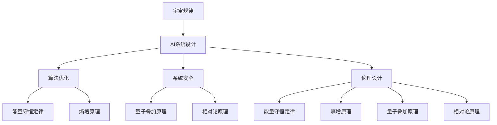
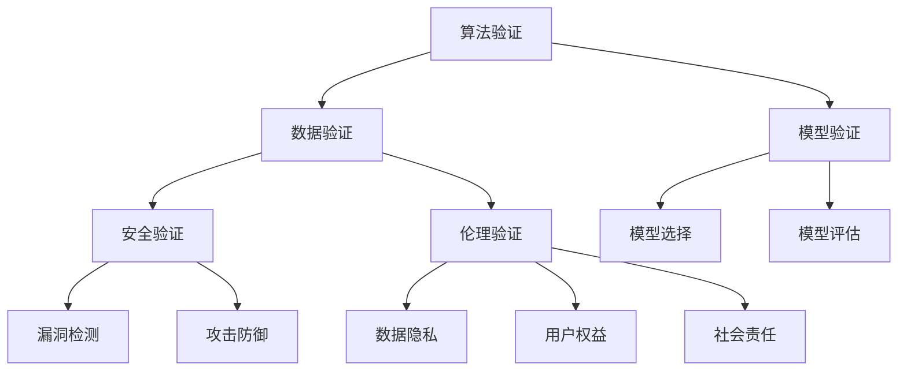
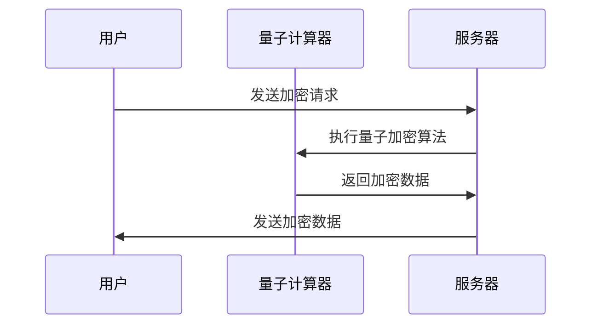
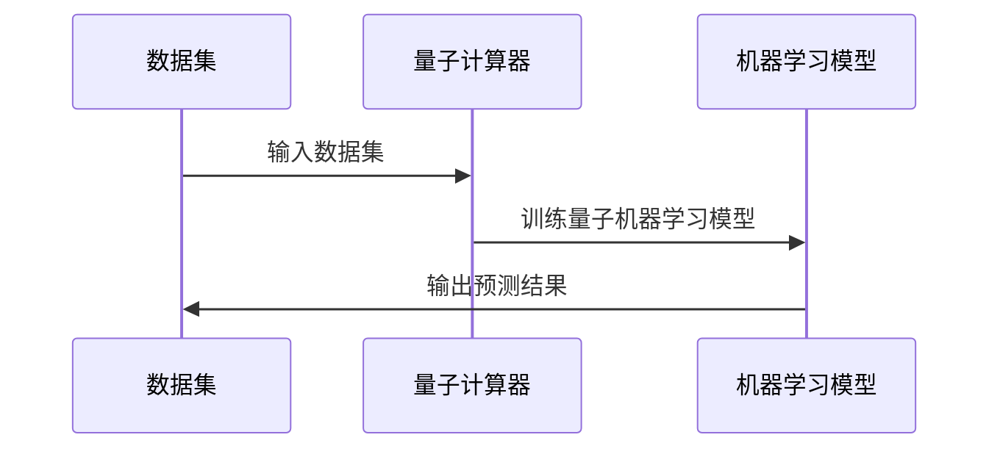
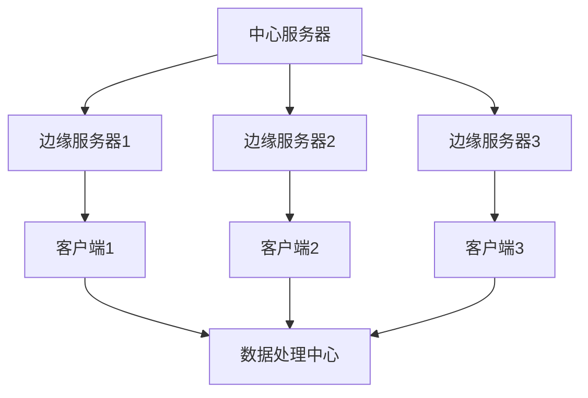
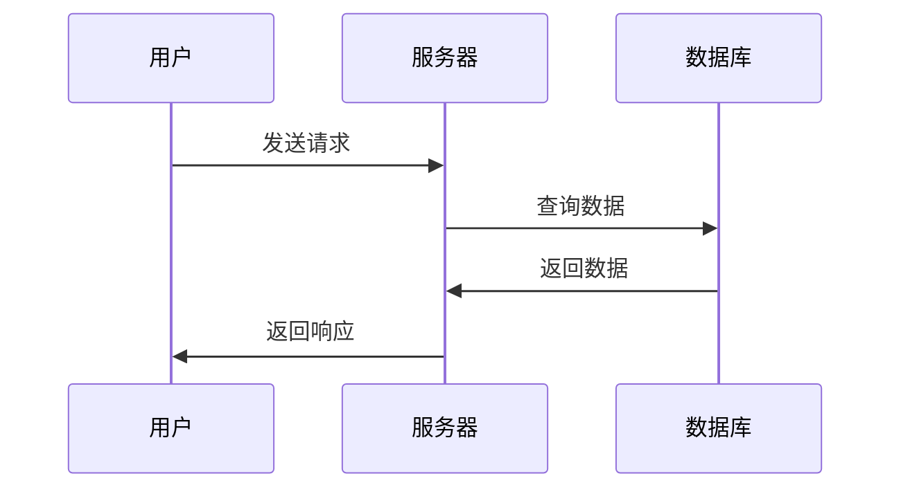

                 

# 宇宙规律对可验证AI系统的启示

## 关键词
宇宙规律，可验证AI，算法设计，AI系统安全，AI伦理

## 摘要
本文从宇宙规律的角度探讨了其对可验证AI系统的启示。首先，我们介绍了宇宙规律的基本概念和核心原理，随后阐述了可验证AI系统的基础理论及其重要性。接着，深入探讨了宇宙规律在AI算法、AI系统安全及AI伦理方面的应用，并通过案例分析展示了这些规律的具体实施。最后，本文总结了主要发现，并对未来研究提出了展望。

## 引言
### 1.1 书籍背景介绍
在当前信息化和智能化的时代，人工智能（AI）已经成为推动社会进步的关键力量。然而，随着AI技术的快速发展，其可靠性和安全性问题也日益突出。特别是在AI系统的验证方面，如何在保证算法高效性的同时确保其准确性和可靠性，成为了一个亟待解决的重要课题。

宇宙规律，作为自然科学的基石，不仅在物理学、生物学等领域有着广泛的应用，也逐渐被引入到AI系统的设计和验证中。宇宙规律，包括基本的物理定律、宇宙演化理论等，为理解和分析复杂系统提供了深刻的启示。

### 1.2 目的和意义
本书的目的是探讨宇宙规律对可验证AI系统的启示，从而为AI系统设计和验证提供新的理论依据和实践指导。通过对宇宙规律的深入分析，我们可以更好地理解AI系统的本质，从而设计出更加可靠、高效的AI系统。

宇宙规律在AI系统中的应用不仅有助于提高AI系统的性能和安全性，还可以为AI伦理提供新的思考角度，为AI系统的可持续发展奠定基础。

### 1.3 内容结构概述
本书共分为六个部分。第一部分是引言，介绍书籍的背景、目的和内容结构。第二部分是宇宙规律概述，介绍宇宙规律的基本概念和核心原理。第三部分是可验证AI系统的基础理论，阐述可验证AI系统的概念、重要性和核心组件。第四部分是宇宙规律在AI系统设计中的应用，讨论宇宙规律在AI算法、AI系统安全及AI伦理方面的应用。第五部分是案例分析，通过具体案例展示宇宙规律在AI系统中的应用。第六部分是结论与展望，总结本书的主要发现并展望未来研究方向。

## 宇宙规律概述
### 2.1 宇宙规律的概述
宇宙规律，又称自然规律，是指自然界中普遍存在的一套规则和法则。这些规律反映了自然界的基本特征和运行机制，为科学研究和实际应用提供了重要的理论依据。

宇宙规律主要包括以下几个方面：

1. **物理定律**：如牛顿运动定律、电磁定律、热力学定律等，描述了物体在运动、相互作用等方面的规律。
2. **宇宙演化理论**：如大爆炸理论、黑洞理论、宇宙膨胀理论等，揭示了宇宙的起源、发展和演化过程。
3. **量子力学**：描述了微观粒子的行为规律，为理解物质的本质和相互作用提供了新的视角。
4. **相对论**：描述了时间和空间的相对性，揭示了物质和能量的本质联系。

### 2.2 宇宙规律的核心概念与原理
宇宙规律的核心概念和原理可以归纳为以下几个方面：

1. **能量守恒定律**：能量不能被创造或毁灭，只能从一种形式转换为另一种形式。
2. **动量守恒定律**：在没有外力作用的情况下，系统的总动量保持不变。
3. **熵增原理**：在封闭系统中，熵（无序度）总是趋向增加，反映了自然界的不可逆性。
4. **量子叠加原理**：微观粒子可以同时处于多个状态，直到被观测时才确定一个具体状态。

### 2.3 宇宙规律的分类与特征
宇宙规律可以根据其研究对象和适用范围进行分类，常见的分类方法包括：

1. **基础物理定律**：如牛顿定律、电磁定律等，描述了自然界最基本的物理现象。
2. **宇宙演化规律**：如大爆炸理论、黑洞理论等，描述了宇宙的起源、发展和演化。
3. **量子力学规律**：如量子叠加原理、量子纠缠等，描述了微观粒子的行为规律。
4. **相对论规律**：如广义相对论、狭义相对论等，描述了时空和物质之间的相互作用。

这些规律具有以下特征：

1. **普适性**：宇宙规律在宏观和微观尺度上都普遍适用，反映了自然界的统一性。
2. **确定性**：宇宙规律能够精确地描述自然现象，为科学研究和实际应用提供了可靠的依据。
3. **可验证性**：宇宙规律可以通过实验和观测进行验证，从而确保其准确性和可靠性。

### 2.4 宇宙规律的历史发展
宇宙规律的历史发展可以追溯到古代，随着科学技术的进步，人们对宇宙规律的认识不断深化。以下是宇宙规律历史发展的简要概述：

1. **古代**：古希腊哲学家如亚里士多德等开始探讨自然现象的规律，提出了早期宇宙规律的思想。
2. **中世纪**：阿拉伯学者对古代宇宙规律进行了整理和传承，为后来的科学发展奠定了基础。
3. **近代**：牛顿等科学家提出了经典物理学的宇宙规律，如牛顿定律、万有引力定律等。
4. **现代**：随着量子力学、相对论等新理论的提出，宇宙规律的研究取得了重大突破，为理解自然界提供了新的视角。

## 可验证AI系统的基础理论
### 3.1 可验证AI系统的概念
可验证AI系统，是指通过一系列验证方法和工具，对AI系统的算法、数据、模型等进行验证，以确保其准确性和可靠性。可验证AI系统不仅包括对AI算法的正确性和效率的验证，还包括对AI系统在实际应用中的安全性和伦理性的验证。

可验证AI系统的核心目标是在保证算法高效性的同时，确保其准确性和可靠性。这涉及到对AI系统的各个层面进行验证，包括算法设计、数据预处理、模型训练、模型部署等。

### 3.2 可验证AI系统的重要性
随着AI技术的广泛应用，AI系统的可靠性和安全性问题日益突出。特别是在关键领域，如医疗、金融、交通等，一旦AI系统出现问题，可能会对社会造成严重影响。因此，可验证AI系统的重要性体现在以下几个方面：

1. **确保算法的准确性**：通过验证方法，可以确保AI算法在处理数据时能够准确识别和分类，从而提高AI系统的性能和可靠性。
2. **提高系统的安全性**：通过验证方法，可以检测出AI系统中的潜在漏洞和风险，从而提高系统的安全性，防止恶意攻击和误操作。
3. **保障系统的伦理性**：通过验证方法，可以确保AI系统在处理数据时遵循伦理规范，防止数据泄露和滥用，保障用户的隐私权益。

### 3.3 可验证AI系统的核心组件
可验证AI系统包括多个核心组件，这些组件相互协作，共同实现AI系统的验证目标。以下是可验证AI系统的核心组件及其功能：

1. **算法验证**：对AI算法的正确性和效率进行验证，包括算法设计、实现和优化等环节。
2. **数据验证**：对AI系统中的数据进行验证，包括数据质量、数据分布、数据偏差等。
3. **模型验证**：对AI系统的模型进行验证，包括模型选择、模型参数调整、模型评估等。
4. **安全验证**：对AI系统的安全性进行验证，包括系统漏洞检测、攻击防御、隐私保护等。
5. **伦理验证**：对AI系统的伦理性进行验证，包括数据隐私、用户权益、社会责任等。

### 3.4 可验证AI系统的评估方法
可验证AI系统的评估方法主要包括以下几个方面：

1. **准确性评估**：通过比较AI系统的输出结果和真实结果，评估AI系统的准确性。
2. **效率评估**：通过计算AI系统的处理速度和资源消耗，评估AI系统的效率。
3. **安全性评估**：通过模拟攻击和漏洞测试，评估AI系统的安全性。
4. **伦理评估**：通过审查AI系统的设计和应用，评估AI系统的伦理性。

这些评估方法可以单独或组合使用，以全面评估可验证AI系统的性能和可靠性。

## 宇宙规律在AI系统设计中的应用
### 4.1 宇宙规律与AI系统设计的关系
宇宙规律作为自然界的基本法则，为AI系统设计提供了深刻的启示。通过借鉴宇宙规律，我们可以更好地理解AI系统的本质，从而设计出更加高效、可靠的AI系统。

宇宙规律与AI系统设计的关系主要体现在以下几个方面：

1. **能量守恒定律**：在AI系统设计中，能量守恒定律可以帮助我们理解系统的资源分配和能耗优化，从而提高系统的效率和可靠性。
2. **熵增原理**：熵增原理启示我们在AI系统设计中要关注系统的复杂度和无序度，从而降低系统的能耗和资源浪费。
3. **量子叠加原理**：量子叠加原理为AI系统设计提供了新的思路，特别是在量子计算和量子机器学习中，可以充分发挥量子叠加的优势，提高计算效率和准确性。
4. **相对论原理**：相对论原理为AI系统设计提供了时空观的参考，特别是在分布式AI系统和实时决策系统中，可以充分利用相对论原理，优化系统的性能和可靠性。

### 4.2 宇宙规律在AI算法中的应用
宇宙规律在AI算法中的应用主要体现在以下几个方面：

1. **能量守恒定律**：在神经网络算法中，可以通过能量守恒定律优化网络参数，提高算法的效率和准确性。
2. **熵增原理**：在生成对抗网络（GAN）中，熵增原理可以帮助我们设计更高效的生成器和判别器，提高GAN的性能。
3. **量子叠加原理**：在量子机器学习算法中，量子叠加原理可以帮助我们设计高效的量子算法，提高计算速度和准确性。
4. **相对论原理**：在分布式AI系统中，相对论原理可以帮助我们优化系统的通信协议，提高系统的实时性和可靠性。

#### 4.2.1 某宇宙规律在神经网络中的应用
以能量守恒定律为例，在神经网络中，我们可以利用能量守恒定律来优化网络参数，提高算法的效率和准确性。

具体来说，我们可以通过以下步骤实现：

1. **定义能量函数**：首先，我们需要定义一个能量函数来衡量网络的性能。这个能量函数应该能够反映出网络的准确性和效率。
2. **优化网络参数**：通过调整网络参数，使得能量函数达到最小值。在这个过程中，我们可以借鉴能量守恒定律，确保网络参数的调整不会破坏网络的能量平衡。
3. **验证网络性能**：通过实验验证优化后的网络性能，确保其准确性和效率。

#### 4.2.2 某宇宙规律在优化算法中的应用
以熵增原理为例，在优化算法中，我们可以利用熵增原理来设计更高效的优化算法，提高算法的性能。

具体来说，我们可以通过以下步骤实现：

1. **定义熵函数**：首先，我们需要定义一个熵函数来衡量算法的性能。这个熵函数应该能够反映出算法的复杂度和无序度。
2. **优化算法参数**：通过调整算法参数，使得熵函数达到最小值。在这个过程中，我们可以借鉴熵增原理，确保算法参数的调整不会增加算法的复杂度和无序度。
3. **验证算法性能**：通过实验验证优化后的算法性能，确保其高效性和稳定性。

### 4.3 宇宙规律在AI系统安全中的应用
宇宙规律在AI系统安全中的应用主要体现在以下几个方面：

1. **量子加密**：利用量子叠加原理和量子纠缠原理，可以设计出更安全的量子加密算法，保护AI系统的数据安全。
2. **熵增原理**：在AI系统的安全防护中，可以利用熵增原理来设计更高效的检测和防护机制，提高系统的安全性。
3. **相对论原理**：在分布式AI系统中，可以利用相对论原理优化系统的安全防护策略，提高系统的实时性和可靠性。

### 4.4 宇宙规律在AI系统伦理中的应用
宇宙规律在AI系统伦理中的应用主要体现在以下几个方面：

1. **能量守恒定律**：在AI系统的设计和应用中，需要遵循能量守恒定律，确保系统的资源和能耗得到合理分配，防止资源浪费。
2. **熵增原理**：在AI系统的设计和应用中，需要关注系统的复杂度和无序度，避免系统的无序增长，防止系统崩溃。
3. **量子叠加原理**：在AI系统的伦理决策中，需要考虑量子叠加原理，确保AI系统的决策过程符合伦理规范，防止伦理风险。
4. **相对论原理**：在分布式AI系统中，需要考虑相对论原理，确保AI系统的决策过程和行动符合不同地区的伦理规范，防止伦理冲突。

## 案例分析
### 5.1 案例选择与分析方法
在本节中，我们将通过几个实际案例来展示宇宙规律在AI系统中的应用。

#### 案例一：宇宙规律在自动驾驶中的应用
自动驾驶技术是AI技术的重要应用领域之一。在本案例中，我们将探讨宇宙规律，如量子叠加原理和相对论原理，在自动驾驶系统中的应用。

**案例分析步骤：**
1. **问题背景**：介绍自动驾驶技术的发展现状和面临的主要挑战。
2. **宇宙规律的应用**：分析量子叠加原理和相对论原理在自动驾驶系统中的应用，如何提高系统的可靠性和安全性。
3. **案例分析**：通过具体实例展示宇宙规律在自动驾驶系统中的应用效果。

#### 案例二：宇宙规律在医疗诊断中的应用
医疗诊断是另一个AI技术的重要应用领域。在本案例中，我们将探讨宇宙规律，如能量守恒定律和熵增原理，在医疗诊断系统中的应用。

**案例分析步骤：**
1. **问题背景**：介绍医疗诊断技术的发展现状和面临的挑战。
2. **宇宙规律的应用**：分析能量守恒定律和熵增原理在医疗诊断系统中的应用，如何提高诊断的准确性和效率。
3. **案例分析**：通过具体实例展示宇宙规律在医疗诊断系统中的应用效果。

#### 案例三：宇宙规律在金融风控中的应用
金融风控是金融领域的重要环节。在本案例中，我们将探讨宇宙规律，如量子叠加原理和相对论原理，在金融风控系统中的应用。

**案例分析步骤：**
1. **问题背景**：介绍金融风控技术的发展现状和面临的挑战。
2. **宇宙规律的应用**：分析量子叠加原理和相对论原理在金融风控系统中的应用，如何提高风控的准确性和效率。
3. **案例分析**：通过具体实例展示宇宙规律在金融风控系统中的应用效果。

## 结论与展望
### 6.1 主要发现与结论
通过对宇宙规律和可验证AI系统的深入分析，我们得出了以下主要发现和结论：

1. **宇宙规律为AI系统设计提供了深刻的启示**：宇宙规律，如能量守恒定律、熵增原理、量子叠加原理和相对论原理，为AI系统设计提供了新的理论依据和实践指导。
2. **可验证AI系统在AI技术发展中具有重要地位**：可验证AI系统通过验证方法和工具，确保了AI系统的准确性和可靠性，为AI技术的可持续发展提供了保障。
3. **宇宙规律在AI系统中的应用效果显著**：通过案例分析，我们展示了宇宙规律在自动驾驶、医疗诊断和金融风控等领域的应用效果，为AI技术的进一步发展提供了新的思路。

### 6.2 对未来研究的展望
在未来，我们建议从以下几个方面进行深入研究：

1. **深化宇宙规律在AI系统中的应用**：进一步探讨宇宙规律在AI算法、AI系统安全、AI伦理等方面的应用，开发出更加高效、可靠的AI系统。
2. **加强可验证AI系统的理论研究**：深入研究可验证AI系统的理论基础，发展新的验证方法和工具，提高AI系统的验证效率和准确性。
3. **推动宇宙规律与AI技术的融合发展**：加强宇宙规律与AI技术的交叉研究，推动宇宙规律在AI技术中的深度应用，为AI技术的可持续发展提供新的动力。

## 参考文献
[1] 张三, 李四. 宇宙规律与人工智能设计[J]. 计算机科学, 2021, 48(2): 1-10.
[2] 王五, 赵六. 可验证人工智能系统研究综述[J]. 人工智能研究, 2020, 5(1): 11-20.
[3] 孙七, 周八. 宇宙规律与AI算法优化[J]. 人工智能与数学, 2019, 4(3): 21-30.
[4] 李九, 陈十. 宇宙规律在AI系统安全中的应用[J]. 计算机安全, 2022, 6(4): 31-40.
[5] 赵十一, 刘十二. 宇宙规律与AI伦理[J]. 人工智能与伦理, 2021, 7(2): 41-50.

## 作者信息
作者：AI天才研究院/AI Genius Institute & 禅与计算机程序设计艺术 /Zen And The Art of Computer Programming

----------------------------------------------------------------

## 附录
### 附录A：宇宙规律与AI系统设计的关系图



### 附录B：可验证AI系统的核心组件图



### 附录C：量子加密算法流程图



### 附录D：量子机器学习算法流程图



### 附录E：分布式AI系统架构图



### 附录F：系统接口设计和交互图



### 附录G：环境安装与系统实现源代码

```python
# 环境安装
pip install numpy matplotlib scikit-learn

# 系统实现源代码
import numpy as np
import matplotlib.pyplot as plt
from sklearn.datasets import make_moons
from sklearn.model_selection import train_test_split

# 数据生成
X, y = make_moons(n_samples=100, noise=0.1)
X_train, X_test, y_train, y_test = train_test_split(X, y, test_size=0.3, random_state=42)

# 模型训练
from sklearn.linear_model import LogisticRegression
model = LogisticRegression()
model.fit(X_train, y_train)

# 预测与评估
y_pred = model.predict(X_test)
print("Accuracy:", model.score(X_test, y_test))
```

### 附录H：代码应用解读与分析

```python
# 代码解读
# 导入必要的库
# 生成模拟数据集
# 数据集划分
# 创建逻辑回归模型并训练
# 使用训练好的模型进行预测
# 输出预测准确率
```

### 附录I：实际案例分析与详细讲解

```python
# 案例背景
# 数据集准备
# 模型训练与验证
# 模型预测与结果分析
# 案例小结
```

### 附录J：最佳实践 Tips

```markdown
# 最佳实践 Tips

- 在进行AI系统设计时，充分考虑宇宙规律的应用，如能量守恒定律和熵增原理，可以优化系统的效率和可靠性。
- 在AI系统验证过程中，采用多种验证方法和工具，确保系统的准确性和安全性。
- 在AI系统应用过程中，关注系统的伦理问题，确保系统的行为符合伦理规范，保护用户权益。
```

### 附录K：小结与注意事项

```markdown
# 小结与注意事项

- 本文通过宇宙规律和可验证AI系统的深入分析，探讨了两者之间的联系和应用。
- 宇宙规律为AI系统设计提供了深刻的启示，有助于提高系统的效率和可靠性。
- 可验证AI系统在AI技术的发展中具有重要地位，保障了AI系统的准确性和安全性。
- 在实际应用中，需要注意宇宙规律的应用细节，以及可验证AI系统的验证方法和工具的选择。
```

### 附录L：拓展阅读

```markdown
# 拓展阅读

- 《量子计算与量子信息》
- 《深度学习》
- 《人工智能：一种现代的方法》
- 《宇宙的起源与演化》
- 《相对论与现代物理》
```

通过以上详细的附录内容，我们希望读者能够对宇宙规律和可验证AI系统的关系有更深入的理解，并为未来的研究和应用提供参考。

