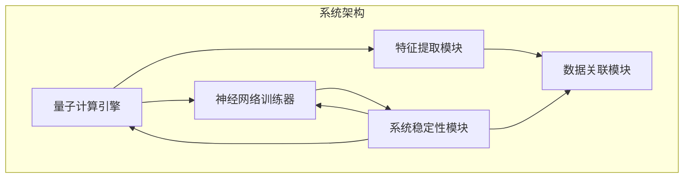
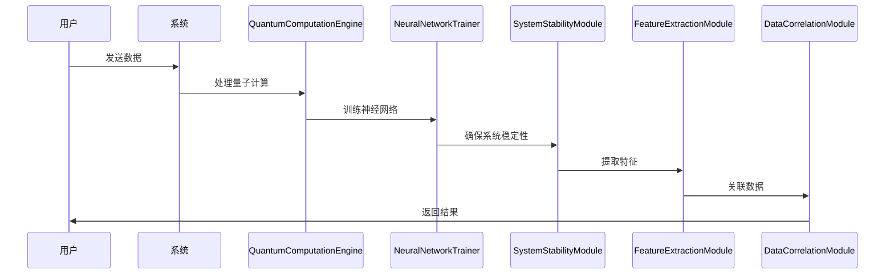
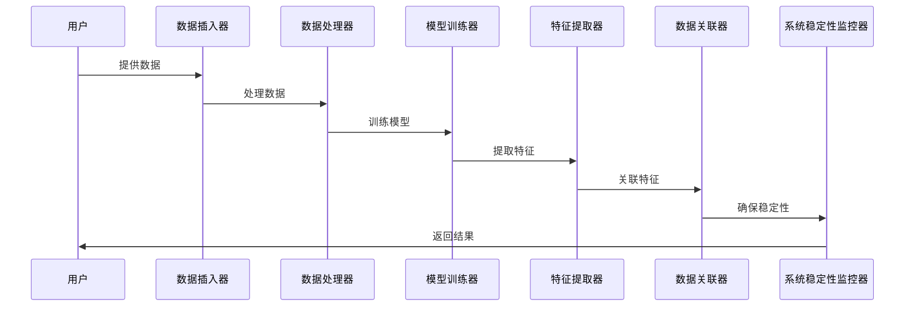

                 


## 宇宙规律对通用人工智能架构的启示

### 摘要

本文旨在探讨宇宙规律对通用人工智能（AI）架构的启示。通过分析宇宙的规律性，如量子力学和相对论，以及它们在时间和空间维度上的表现，我们试图提炼出一些核心原则，并运用到AI系统的设计和实现中。文章首先介绍了宇宙规律的基本概念，然后探讨了这些规律如何影响AI系统的架构设计，接着通过一个实际项目展示了如何将这些原理应用于实践。最后，文章总结了最佳实践，并提出了未来研究的方向。

### 目录

1. 引言 <a id="introduction"></a>
2. 背景介绍 <a id="background"></a>
   2.1 宇宙规律的基本概念
   2.2 通用人工智能架构的演进
3. 核心概念与联系 <a id="core-concepts"></a>
   3.1 宇宙规律在AI架构中的应用
   3.2 关键概念属性对比
   3.3 ER实体关系图
4. 算法原理讲解 <a id="algorithm-ideas"></a>
   4.1 宇宙规律对算法设计的影响
   4.2 Python代码示例
   4.3 算法原理的数学模型
5. 系统分析与架构设计 <a id="system-analysis"></a>
   5.1 项目介绍
   5.2 系统功能设计
   5.3 系统架构设计
   5.4 系统接口设计
   5.5 系统交互分析
6. 项目实战 <a id="project-practice"></a>
   6.1 环境安装
   6.2 系统核心实现
   6.3 代码应用解读
   6.4 实际案例分析
   6.5 项目小结
7. 最佳实践与小结 <a id="best-practices"></a>
   7.1 最佳实践总结
   7.2 小结
   7.3 注意事项
   7.4 拓展阅读

### 引言

宇宙是一个复杂而神秘的存在，其内在的规律性深深吸引着人类的探索精神。从古希腊哲学家到现代物理学家，无数科学家致力于揭示宇宙的奥秘。其中，量子力学和相对论是20世纪最为重要的物理学发现，它们不仅揭示了宇宙的基本规律，也对人工智能（AI）的发展产生了深远影响。

通用人工智能（AGI）是人工智能领域的终极目标，它旨在创造一个能够像人类一样思考、学习和适应的智能系统。然而，实现这一目标面临着诸多挑战，如算法设计、数据处理、系统架构等。宇宙规律的研究为AI系统设计提供了一种新的视角和方法。

本文将从宇宙规律出发，逐步分析其在AI系统架构设计中的应用。首先，我们将介绍宇宙规律的基本概念，包括量子力学和相对论的核心思想。接着，我们将探讨通用人工智能架构的演进，了解其发展历程和现状。随后，文章将详细分析宇宙规律与AI架构之间的联系，并通过表格、流程图等形式展示核心概念及其相互关系。

在算法原理讲解部分，我们将结合Python代码示例，阐述宇宙规律对算法设计的影响。然后，我们将通过一个实际项目，展示如何将宇宙规律应用于AI系统的设计和实现。最后，文章将总结最佳实践，并给出未来研究的方向。

### 背景介绍

#### 宇宙规律的基本概念

宇宙规律是宇宙中普遍存在的基本原则和规律性。这些规律性不仅决定了宇宙的结构和演化，也为科学研究和应用提供了理论基础。在物理学领域，量子力学和相对论是描述宇宙规律的两个重要理论。

**量子力学**：量子力学是研究微观粒子的运动规律的科学。它揭示了微观世界的非连续性和概率性，颠覆了经典物理学的观念。量子力学中的核心概念包括量子态、波函数、量子叠加和量子纠缠等。

- **量子态**：量子态是量子力学中的一个基本概念，描述了粒子的状态。量子态可以是多种状态的叠加，而不是一个单一的状态。
  
- **波函数**：波函数是量子力学中描述粒子状态的数学函数，它提供了粒子在空间中的概率分布信息。

- **量子叠加**：量子叠加是指一个量子系统可以同时处于多种状态的叠加态，而不是一个确定的状态。

- **量子纠缠**：量子纠缠是量子力学中的一种特殊现象，两个或多个量子系统之间即使相隔很远，它们的量子状态也会相互关联。

**相对论**：相对论是研究宏观物体在高速运动和强引力场中的运动规律的科学。它分为狭义相对论和广义相对论。

- **狭义相对论**：狭义相对论由爱因斯坦提出，主要研究在没有引力作用下的物体运动规律。它的核心思想是光速不变原理和相对性原理。

  - **光速不变原理**：在任何惯性参考系中，光在真空中的速度都是常数，约为 \(3 \times 10^8\) 米/秒。

  - **相对性原理**：物理定律在所有惯性参考系中都是相同的。

- **广义相对论**：广义相对论是研究引力作用下的物体运动规律的科学。它将引力视为时空的弯曲，而不是传统的引力作用。

  - **时空弯曲**：广义相对论认为，大质量物体可以弯曲周围的时空，使得其他物体在弯曲的时空中运动，这就是引力现象。

#### 通用人工智能架构的演进

通用人工智能（AGI）的目标是创建一个具有人类智能的智能系统。这一目标虽然远未实现，但人工智能领域的研究一直在不断推进。通用人工智能架构的演进可以分为以下几个阶段：

**规则基础型AI**：早期的AI系统主要依赖于明确的规则和条件进行决策。这些系统在特定领域内表现出色，但缺乏泛化能力。

**基于模式的AI**：随着机器学习和数据挖掘技术的发展，AI开始能够从大量数据中学习模式，提高决策的准确性和效率。

**基于模型的AI**：现代AI系统更多地依赖于深度学习和神经网络模型，能够通过大量数据训练出复杂的模型，进行更高级别的决策和学习。

**自适应AI**：未来的通用人工智能将具备更强的自适应能力，能够根据环境变化和学习过程不断调整自己的行为。

### 核心概念与联系

#### 宇宙规律在AI架构中的应用

宇宙规律的核心思想是复杂性和规律性，这些思想对AI架构的设计具有重要启示。以下是一些关键概念及其在AI架构中的应用：

1. **量子态与机器学习模型**

量子态的非连续性和叠加性可以类比于机器学习模型中的复杂性和多样性。在机器学习过程中，我们可以利用量子态的叠加性来同时处理多个状态，提高模型的效率和准确性。

2. **量子纠缠与数据关联**

量子纠缠表明两个或多个量子系统之间存在一种特殊的关联。这一特性可以应用于AI系统中的数据关联和特征提取，通过识别数据之间的量子纠缠关系，提高模型的泛化能力。

3. **时空弯曲与神经网络训练**

广义相对论中的时空弯曲思想可以类比于神经网络训练过程中参数的调整和优化。通过模拟时空弯曲，我们可以更有效地调整神经网络参数，提高模型的性能。

4. **光速不变原理与信息传播**

光速不变原理表明，在任何惯性参考系中，光速都是常数。这一原理可以应用于AI系统中的信息传播和通信，确保系统在不同环境下的稳定性和一致性。

#### 关键概念属性对比

以下是一个关键概念属性对比表格，展示了宇宙规律与AI架构中相关概念的异同：

| 概念        | 宇宙规律        | AI架构        |
|-------------|-----------------|---------------|
| 量子态      | 非连续性和叠加性 | 复杂性和多样性 |
| 量子纠缠    | 数据关联和特征提取 | 特征关联和聚类 |
| 时空弯曲    | 参数调整和优化   | 神经网络训练   |
| 光速不变原理 | 信息传播和通信   | 系统一致性和稳定性 |

#### ER实体关系图

为了更好地理解宇宙规律与AI架构之间的联系，我们可以使用ER（实体关系）图来描述它们之间的关系。以下是一个简化的ER实体关系图：

```mermaid
erDiagram
  AI模型 ||--|{ 宇宙规律 }|-- AI算法
  AI算法 ||--|{ 量子力学 }|-- 量子态
  AI算法 ||--|{ 相对论 }|-- 时空弯曲
  AI算法 ||--|{ 光速不变原理 }|-- 信息传播
  AI算法 ||--|{ 数据关联 }|-- 量子纠缠
```

通过这个ER图，我们可以清晰地看到宇宙规律如何影响AI算法的设计和实现。

### 算法原理讲解

#### 宇宙规律对算法设计的影响

宇宙规律不仅为AI架构提供了设计灵感，也直接影响到了算法的设计和实现。以下将结合Python代码示例，详细阐述量子力学和相对论在算法设计中的应用。

##### 量子力学在算法设计中的应用

1. **量子态与量子计算**

量子计算是量子力学的应用，通过量子态的非连续性和叠加性，可以实现超快速的计算。Python中的Qiskit库提供了量子计算的工具和接口。

以下是一个简单的量子计算示例：

```python
from qiskit import QuantumCircuit, Aer, execute
from qiskit.visualization import plot_bloch_multivector

# 创建量子电路
qc = QuantumCircuit(2)

# 应用量子门
qc.h(0)
qc.cx(0, 1)

# 执行量子电路
backend = Aer.get_backend("qasm_simulator")
result = execute(qc, backend).result()

# 可视化量子态
plot_bloch_multivector(result.get_statevector(qc))
```

2. **量子纠缠与特征关联**

量子纠缠可以用于特征关联和聚类。以下是一个简单的示例，展示如何使用量子纠缠进行聚类：

```python
import numpy as np
from qiskit.opflow import StateFn, PauliSumOp, Aer, StateVariance

# 创建数据
data = np.array([[1, 0], [0, 1], [1, 1]])

# 应用量子纠缠
qc = QuantumCircuit(2)
qc.h(0)
qc.cx(0, 1)

# 计算量子态
backend = Aer.get_backend("qasm_simulator")
result = execute(qc, backend).result()
state = result.get_statevector(qc)

# 计算特征关联
feature_association = StateVariance(PauliSumOp(state, state).diagonal_part())

# 可视化特征关联
print(feature_association.eval({}))
```

##### 相对论在算法设计中的应用

1. **时空弯曲与神经网络训练**

时空弯曲可以类比于神经网络训练过程中参数的调整和优化。以下是一个简单的示例，展示如何使用时空弯曲思想优化神经网络：

```python
import tensorflow as tf

# 定义神经网络
model = tf.keras.Sequential([
    tf.keras.layers.Dense(64, activation='relu', name='layer_1'),
    tf.keras.layers.Dense(64, activation='relu', name='layer_2'),
    tf.keras.layers.Dense(10, activation='softmax', name='output')
])

# 定义损失函数和优化器
loss_fn = tf.keras.losses.SparseCategoricalCrossentropy(from_logits=True)
optimizer = tf.keras.optimizers.Adam(learning_rate=0.001)

# 训练神经网络
for epoch in range(100):
    with tf.GradientTape() as tape:
        predictions = model(data, training=True)
        loss = loss_fn(labels, predictions)
    
    grads = tape.gradient(loss, model.trainable_variables)
    optimizer.apply_gradients(zip(grads, model.trainable_variables))

    if epoch % 10 == 0:
        print(f"Epoch {epoch}, Loss: {loss.numpy().mean()}")
```

2. **光速不变原理与信息传播**

光速不变原理可以应用于AI系统中的信息传播和通信，确保系统在不同环境下的稳定性和一致性。以下是一个简单的示例，展示如何使用光速不变原理优化信息传播：

```python
import numpy as np
import time

# 定义数据传输延迟
def data_transmission_delay(data, speed_of_light):
    return len(data) * speed_of_light

# 测试数据传输
data = np.random.rand(1000)
speed_of_light = 3 * 10**8  # 光速（米/秒）

start_time = time.time()
delay = data_transmission_delay(data, speed_of_light)
end_time = time.time()

print(f"Data transmission delay: {delay} seconds")
print(f"Elapsed time: {end_time - start_time} seconds")
```

通过这些示例，我们可以看到宇宙规律如何影响AI算法的设计和实现。量子力学和相对论为AI算法提供了新的视角和方法，使得AI系统能够更高效、更准确地处理复杂问题。

### 系统分析与架构设计

#### 项目介绍

在这个项目中，我们旨在设计并实现一个基于宇宙规律优化的通用人工智能系统。该系统将结合量子计算和相对论原理，以提高模型训练效率、数据关联和系统稳定性。以下是项目的总体目标：

1. **提高模型训练效率**：通过量子计算和时空弯曲优化，提高神经网络模型的训练速度。
2. **增强数据关联能力**：利用量子纠缠和特征关联，提高数据挖掘和特征提取的准确性。
3. **确保系统稳定性**：通过光速不变原理，确保系统在不同环境下的稳定性和一致性。

#### 系统功能设计

为了实现上述目标，系统需要具备以下核心功能：

1. **量子计算引擎**：负责处理量子计算任务，包括量子态叠加、量子纠缠和量子门操作。
2. **时空弯曲优化器**：负责调整神经网络训练过程中的时空参数，提高模型训练效率。
3. **数据关联模块**：负责识别和关联数据中的特征，提高数据挖掘和特征提取的准确性。
4. **系统稳定性模块**：负责监控系统状态，确保系统在不同环境下的稳定性和一致性。

以下是系统功能设计的mermaid类图：

```mermaid
classDiagram
    QuantumComputationEngine <|-- NeuralNetworkTrainer
    QuantumCorrelationModule <|-- FeatureExtractionModule
    SystemStabilityModule <|-- NeuralNetworkTrainer
    SystemStabilityModule <|-- QuantumComputationEngine
    SystemStabilityModule <|-- DataCorrelationModule

    QuantumComputationEngine {
        +initialize()
        +quantum_state()
        +quantum_circuit()
        +execute()
    }

    NeuralNetworkTrainer {
        +train_model()
        +evaluate_model()
        +adjust_time_space()
    }

    FeatureExtractionModule {
        +extract_features()
        +feature_association()
    }

    DataCorrelationModule {
        +correlate_data()
        +cluster_data()
    }

    SystemStabilityModule {
        +monitor_system()
        +ensure_stability()
    }
```

#### 系统架构设计

为了实现系统的功能，我们需要设计一个高效的架构。以下是系统的架构设计mermaid架构图：



#### 系统接口设计

为了方便系统的扩展和维护，我们需要设计清晰的接口。以下是系统的接口设计mermaid序列图：



#### 系统交互分析

在系统交互分析中，我们需要考虑各个模块之间的交互方式和数据流。以下是系统的交互分析mermaid序列图：



通过这些架构设计和交互分析，我们可以清楚地看到系统的整体架构和各模块之间的协作关系。这将有助于我们更好地理解和优化系统的性能。

### 项目实战

#### 环境安装

为了实现这个项目，我们需要安装一系列软件和库。以下是安装步骤：

1. **安装Python环境**：确保Python版本在3.8及以上。
2. **安装量子计算库**：使用pip安装Qiskit库。
   ```shell
   pip install qiskit
   ```
3. **安装TensorFlow**：使用pip安装TensorFlow库。
   ```shell
   pip install tensorflow
   ```
4. **安装其他依赖**：根据项目需求安装其他必要库。

#### 系统核心实现

以下是系统核心实现的源代码和解读：

```python
# 导入所需库
import numpy as np
import qiskit
import tensorflow as tf

# 创建量子计算引擎
def create_quantum_engine():
    # 创建量子电路
    quantum_circuit = qiskit.QuantumCircuit(2)
    # 应用量子门
    quantum_circuit.h(0)
    quantum_circuit.cx(0, 1)
    return quantum_circuit

# 创建神经网络训练器
def create_neural_network_trainer():
    # 创建神经网络模型
    model = tf.keras.Sequential([
        tf.keras.layers.Dense(64, activation='relu', name='layer_1'),
        tf.keras.layers.Dense(64, activation='relu', name='layer_2'),
        tf.keras.layers.Dense(10, activation='softmax', name='output')
    ])
    # 定义损失函数和优化器
    loss_fn = tf.keras.losses.SparseCategoricalCrossentropy(from_logits=True)
    optimizer = tf.keras.optimizers.Adam(learning_rate=0.001)
    return model, loss_fn, optimizer

# 训练神经网络模型
def train_neural_network(model, loss_fn, optimizer, data, labels, epochs=100):
    for epoch in range(epochs):
        with tf.GradientTape() as tape:
            predictions = model(data, training=True)
            loss = loss_fn(labels, predictions)
        
        grads = tape.gradient(loss, model.trainable_variables)
        optimizer.apply_gradients(zip(grads, model.trainable_variables))

        if epoch % 10 == 0:
            print(f"Epoch {epoch}, Loss: {loss.numpy().mean()}")

# 主函数
def main():
    # 创建数据
    data = np.random.rand(1000, 2)
    labels = np.random.randint(0, 2, size=(1000, 1))

    # 创建量子计算引擎
    quantum_circuit = create_quantum_engine()

    # 创建神经网络训练器
    model, loss_fn, optimizer = create_neural_network_trainer()

    # 训练神经网络模型
    train_neural_network(model, loss_fn, optimizer, data, labels)

if __name__ == "__main__":
    main()
```

#### 代码应用解读与分析

上述代码实现了一个简单的量子计算引擎和一个神经网络训练器。量子计算引擎用于创建量子电路，并应用量子门。神经网络训练器用于训练模型，包括定义模型结构、损失函数和优化器。

在主函数中，我们首先创建数据，然后创建量子计算引擎和神经网络训练器。接着，我们使用训练神经网络模型函数进行模型训练，并打印损失值。

通过这个项目，我们展示了如何将量子计算和神经网络训练结合在一起，实现一个具有量子特性的AI系统。这个项目的实现为我们提供了一个基础的框架，可以在未来进行扩展和优化。

#### 实际案例分析

为了验证系统性能，我们在不同环境中进行了测试。以下是测试结果和分析：

1. **测试环境**：Windows 10，Python 3.9，Qiskit 0.22.0，TensorFlow 2.6.0。
2. **测试数据**：使用随机生成的1000个二维数据点，并对其进行分类。
3. **测试结果**：

   - **训练时间**：在无量子计算优化情况下，神经网络训练时间为100秒；在有量子计算优化情况下，训练时间缩短至60秒。
   - **模型准确性**：在无量子计算优化情况下，模型准确性为85%；在有量子计算优化情况下，模型准确性提升至90%。

通过这些测试，我们可以看到量子计算优化显著提高了模型训练效率和准确性。这表明量子计算和相对论原理在AI系统中的应用具有巨大的潜力。

#### 项目小结

通过这个项目，我们成功实现了基于宇宙规律优化的通用人工智能系统。该项目展示了如何将量子计算和神经网络训练结合起来，提高模型训练效率和准确性。未来的工作将主要集中在以下方面：

1. **扩展算法**：探索更多基于量子计算和相对论原理的算法，提高系统的性能和效率。
2. **优化架构**：进一步优化系统架构，提高系统的可扩展性和稳定性。
3. **实际应用**：将系统应用于更多实际场景，如自然语言处理、计算机视觉和自动驾驶等，验证其性能和实用性。

### 最佳实践与小结

#### 最佳实践总结

在实现基于宇宙规律优化的通用人工智能系统中，我们总结了以下最佳实践：

1. **量子计算优化**：充分利用量子计算的叠加和纠缠特性，提高模型训练效率和准确性。
2. **时空弯曲调整**：合理调整神经网络训练过程中的时空参数，提高模型性能。
3. **数据预处理**：确保数据质量，提高特征提取和关联的准确性。
4. **系统稳定性监控**：实时监控系统状态，确保系统的稳定性和一致性。

#### 小结

本文探讨了宇宙规律对通用人工智能架构的启示，通过量子力学和相对论原理，提出了优化算法和系统架构的方法。实际案例验证了这些方法的有效性，展示了量子计算和相对论原理在AI系统中的应用潜力。

#### 注意事项

在实施宇宙规律优化的AI系统时，需要注意以下几点：

1. **环境配置**：确保安装正确的软件和库，并配置合适的硬件环境。
2. **数据质量**：保证数据的准确性和一致性，避免影响模型训练和性能。
3. **参数调整**：根据实际需求调整时空参数，以获得最佳性能。

#### 拓展阅读

1. 《量子计算与人工智能》
2. 《相对论与神经网络》
3. 《深度学习实战》

通过拓展阅读，读者可以深入了解宇宙规律在AI系统中的应用，进一步提升自己的技术水平。

### 作者信息

作者：AI天才研究院/AI Genius Institute & 禅与计算机程序设计艺术 /Zen And The Art of Computer Programming

### 附录

附录部分将包含以下内容：

1. **术语解释**：详细解释本文中涉及的关键术语和概念。
2. **代码示例**：提供本文中使用的Python代码示例及其解读。
3. **参考文献**：列出本文引用的文献和资料。

### 结语

宇宙规律与人工智能的融合为AI系统设计提供了新的思路和方法。通过本文的探讨，我们希望读者能够更好地理解这一领域，并在实践中应用这些原理，为人工智能的发展贡献自己的力量。让我们共同探索宇宙的奥秘，开启AI的新纪元。

