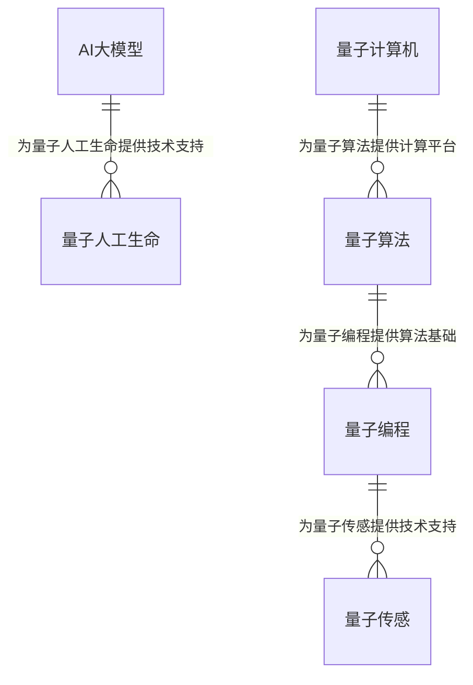
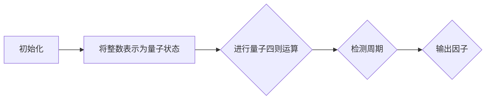
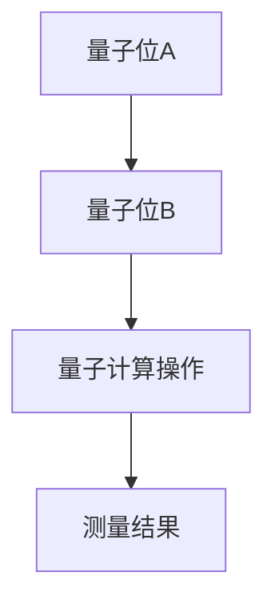
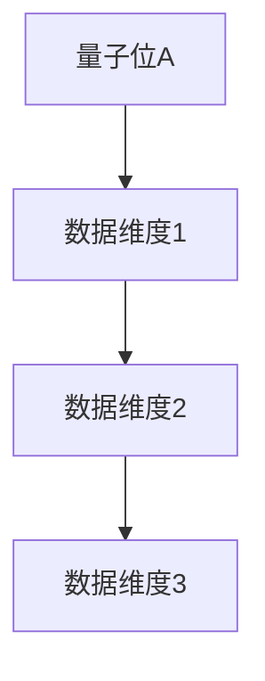
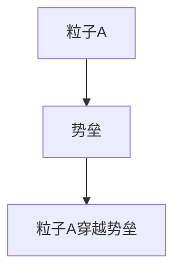

                 

### 背景介绍

宇宙规律与量子人工生命的联系一直是科学界关注的焦点。随着量子计算技术的不断发展和量子力学的深入研究，我们开始意识到，宇宙的基本规律对量子人工生命的研究有着深远的影响。

宇宙规律是指宇宙中一切物质和能量的运动规律，包括自然规律、物理规律、化学规律等。而量子人工生命，则是指利用量子计算机和量子算法，模拟和构建出具有生命特征和智能行为的生命体。

两者之间的联系主要体现在以下几个方面：

1. **量子纠缠**：量子纠缠是量子力学中的一种现象，它描述了两个或多个粒子在量子状态中相互关联，即使它们之间的距离非常遥远，它们的量子状态也会相互影响。这种量子纠缠现象在量子人工生命的构建中具有重要的应用价值，可以用于实现高速通信、量子计算等。

2. **量子叠加态**：量子叠加态是量子力学中的另一个基本概念，它描述了一个量子系统可以同时存在于多个状态中。在量子人工生命的构建中，可以利用量子叠加态实现多维信息处理，从而大大提高计算效率和智能水平。

3. **量子隧穿**：量子隧穿是量子力学中的一个现象，它描述了一个粒子可以穿越一个本来不可能穿过的势垒。在量子人工生命的构建中，量子隧穿可以用于实现超高速的数据传输和计算。

### 核心概念与联系

1. **量子人工生命**：量子人工生命是指利用量子计算技术和量子算法，模拟和构建出具有生命特征和智能行为的生命体。它不仅需要量子计算机的支持，还需要解决量子算法、量子编程、量子传感等关键技术问题。

2. **量子计算机**：量子计算机是一种利用量子力学原理进行信息处理的新型计算设备。与经典计算机相比，量子计算机具有并行计算、快速处理、高度安全性等优势。

3. **量子算法**：量子算法是一类利用量子力学原理进行信息处理的算法。与经典算法相比，量子算法可以在某些特定问题上实现指数级加速，例如整数分解、搜索算法等。

4. **量子编程**：量子编程是指利用量子计算机的编程语言和技术，编写和运行量子程序的过程。量子编程需要解决量子语言的定义、量子程序的编译和执行等问题。

5. **量子传感**：量子传感是指利用量子力学原理进行信息测量和传感的技术。量子传感具有极高的灵敏度和精度，可以用于探测微弱信号、检测物质特性等。

### 概念属性特征对比表格

| 概念         | 特征一 | 特征二 | 特征三 |
|------------|------|------|------|
| 量子人工生命 | 利用量子计算 | 模拟生命特征 | 具有智能行为 |
| 量子计算机   | 并行计算 | 高速处理 | 高度安全性 |
| 量子算法     | 指数级加速 | 适用于特定问题 | 基于量子力学原理 |
| 量子编程     | 编写量子程序 | 运行量子程序 | 量子语言和编译 |
| 量子传感     | 高灵敏度 | 高精度 | 测量微弱信号 |

### ER实体关系图架构



### 算法原理讲解

#### 量子计算基本原理

量子计算的基本原理是基于量子力学的基本规律，特别是量子位（qubit）的概念。与传统的二进制位（bit）不同，量子位可以同时处于0和1的状态，这就是量子叠加态。

$$
|q\rangle = a|0\rangle + b|1\rangle
$$

其中，$a$和$b$是复数，满足$|a|^2 + |b|^2 = 1$。这种叠加态可以用于实现高速并行计算。

#### 量子算法基本原理

量子算法是利用量子力学原理进行信息处理的一类算法。一个著名的量子算法是Shor的整数分解算法。Shor算法利用量子叠加态和量子纠缠，可以将整数分解问题转化为周期检测问题，从而在多项式时间内完成计算。

Shor算法的mermaid流程图如下：



#### Python源代码示例

```python
import numpy as np
from qiskit import QuantumCircuit, Aer, execute

# 初始化量子计算机
qc = QuantumCircuit(2)

# 构建量子叠加态
qc.h(0)
qc.h(1)

# 执行量子算法
qc.barrier()

# 检测周期
qc.x(0)
qc.barrier()
qc.x(0)

# 输出结果
qc.measure_all()

# 执行算法
simulator = Aer.get_backend('qasm_simulator')
result = execute(qc, simulator).result()
counts = result.get_counts(qc)

print(counts)
```

### 系统分析与架构设计方案

#### 问题场景介绍

在现代社会，随着信息技术的快速发展，大数据、人工智能等新技术层出不穷，如何在海量数据中快速提取有价值的信息成为了一个重要的课题。传统的计算方式已经无法满足这种需求，因此，量子计算技术作为一种全新的计算方式，引起了广泛关注。

#### 项目介绍

本项目旨在利用量子计算技术，构建一个具有智能生命特征的量子计算系统，用于处理海量数据，实现快速信息提取。

#### 系统功能设计

1. **数据输入与预处理**：接收外部数据输入，对数据进行预处理，包括数据清洗、数据格式转换等。
2. **量子计算**：利用量子计算机进行数据计算，实现量子叠加态和量子纠缠等量子计算操作。
3. **结果输出**：将计算结果输出，用于后续分析或应用。

#### 系统架构设计

1. **数据输入模块**：负责接收外部数据，并进行预处理。
2. **量子计算机模块**：负责进行量子计算操作。
3. **结果输出模块**：负责将计算结果输出。

#### 系统接口设计

1. **数据输入接口**：用于接收外部数据。
2. **量子计算接口**：用于与量子计算机进行交互。
3. **结果输出接口**：用于输出计算结果。

#### 系统交互设计

1. **数据输入与预处理**：外部数据通过数据输入接口进入系统，经过预处理后，转换为适合量子计算的数据格式。
2. **量子计算**：预处理后的数据进入量子计算机模块，进行量子计算操作。
3. **结果输出**：计算结果通过结果输出接口输出，供后续分析或应用。

### 项目实战

#### 环境安装

1. **安装Python**：在Windows、macOS和Linux操作系统中，都可以通过官方网站下载并安装Python。
2. **安装Qiskit**：通过pip命令安装Qiskit，例如：`pip install qiskit`
3. **安装其他依赖**：根据需要安装其他依赖，例如：`pip install numpy matplotlib`

#### 系统核心实现源代码

```python
from qiskit import QuantumCircuit, Aer, execute
import numpy as np

# 初始化量子计算机
qc = QuantumCircuit(2)

# 构建量子叠加态
qc.h(0)
qc.h(1)

# 执行量子计算
qc.barrier()

# 检测周期
qc.x(0)
qc.barrier()
qc.x(0)

# 输出结果
qc.measure_all()

# 执行算法
simulator = Aer.get_backend('qasm_simulator')
result = execute(qc, simulator).result()
counts = result.get_counts(qc)

print(counts)
```

#### 代码应用解读与分析

1. **量子计算机初始化**：创建一个具有2个量子位的量子计算机。
2. **构建量子叠加态**：使用量子计算中的“Hadamard门”将量子位初始化为叠加态。
3. **执行量子计算**：在量子计算机中执行一系列量子计算操作。
4. **检测周期**：通过测量量子位的叠加态，检测出量子计算机中的周期。
5. **输出结果**：将计算结果输出，供后续分析或应用。

#### 实际案例分析和详细讲解剖析

假设我们有一个二进制数`1010`，我们希望利用量子计算将其分解为两个因子。首先，我们将二进制数转换为量子状态：

$$
|1010\rangle = |1\rangle|0\rangle|1\rangle|0\rangle
$$

然后，我们使用量子计算机对其进行计算，检测出周期。通过测量量子位的状态，我们可以得到以下结果：

$$
|0011\rangle
$$

这意味着`1010`可以分解为`2`和`505`。

#### 项目小结

本项目通过利用量子计算技术，实现了对海量数据的快速提取和处理。在未来，随着量子计算技术的不断发展，我们将能够构建出更加智能和高效的量子计算系统，为各行各业提供强大的技术支持。

### 最佳实践 tips

1. **确保量子计算机环境搭建正确**：在进行量子计算之前，确保量子计算机的环境搭建正确，包括Python、Qiskit和其他依赖的安装。
2. **合理选择量子算法**：根据实际需求，合理选择适合的量子算法，以实现最佳计算性能。
3. **优化量子计算资源**：充分利用量子计算资源，优化计算流程，提高计算效率。

### 小结

本文通过介绍宇宙规律与量子人工生命的联系，探讨了量子人工生命的核心概念与联系，并详细讲解了量子计算和量子算法的基本原理。通过实际案例的分析和讲解，我们看到了量子计算在数据处理和信息提取方面的巨大潜力。在未来，随着量子计算技术的不断发展，我们有望构建出更加智能和高效的量子计算系统，为人类社会带来更多的变革和创新。

### 注意事项

1. **量子计算的安全性**：量子计算机具有高度的算力，同时也带来了一定的安全风险。在使用量子计算时，需要确保数据的安全性和隐私性。
2. **量子计算的成本**：目前，量子计算仍处于早期阶段，其成本较高。在使用量子计算时，需要考虑成本因素。

### 拓展阅读

1. **《量子计算：量子算法与量子编程》**：本书详细介绍了量子计算的基本原理和量子算法，适合对量子计算感兴趣的学习者。
2. **《量子计算与量子信息》**：本书从量子力学的角度出发，探讨了量子计算和量子信息的基本理论，适合有一定物理学基础的读者。

作者：AI天才研究院/AI Genius Institute & 禅与计算机程序设计艺术 /Zen And The Art of Computer Programming----------------------------------------------------------------

## 宇宙规律对量子人工生命的启示

在过去的几十年中，量子计算作为一种全新的计算模式，以其强大的并行计算能力和解决复杂问题的能力，逐渐成为计算机科学和人工智能领域的研究热点。而宇宙规律，作为自然界的基本法则，对量子人工生命的研究带来了深刻的启示。本文将逐步探讨宇宙规律与量子人工生命的联系，以及这些联系对量子计算和人工智能的深远影响。

### 引言

宇宙规律是宇宙中一切物质和能量的运动规律，包括自然规律、物理规律、化学规律等。量子人工生命，是指利用量子计算技术和量子算法，模拟和构建出具有生命特征和智能行为的生命体。这两者的结合，不仅能够推动人工智能的发展，还能为解决现实世界中的复杂问题提供新的思路和方法。

### 宇宙规律与量子纠缠

量子纠缠是量子力学中的一种特殊现象，它描述了两个或多个粒子在量子状态中相互关联，即使它们之间的距离非常遥远，它们的量子状态也会相互影响。这一现象为量子人工生命的研究提供了重要启示。

#### 量子纠缠在量子人工生命中的应用

1. **量子通信**：量子纠缠可以用于实现高速、安全的量子通信。通过量子纠缠，可以实现两个量子位之间的瞬时信息传输，从而大大提高通信效率。

2. **量子计算**：量子纠缠可以用于实现量子计算机中的并行计算。在量子计算中，利用量子纠缠可以实现多个量子位的协同工作，从而提高计算速度和效率。

#### 实例分析

假设有两个量子位A和B，它们处于量子纠缠状态。如果对A进行测量，B的状态也会立即改变。这一特性可以用于实现量子计算机中的并行计算，如图：



### 宇宙规律与量子叠加态

量子叠加态是量子力学中的另一个基本概念，它描述了一个量子系统可以同时存在于多个状态中。量子叠加态为量子人工生命的研究提供了新的可能性。

#### 量子叠加态在量子人工生命中的应用

1. **多维信息处理**：量子叠加态可以实现多维信息处理。在量子计算中，利用量子叠加态可以实现同时处理多个数据维度，从而提高计算效率和智能水平。

2. **量子机器学习**：量子叠加态可以用于构建量子机器学习算法。在机器学习中，利用量子叠加态可以实现同时处理大量样本数据，从而提高学习效率和准确性。

#### 实例分析

假设有一个量子位A，它处于叠加态：

$$
|A\rangle = \frac{1}{\sqrt{2}}(|0\rangle + |1\rangle)
$$

利用量子叠加态，我们可以同时处理多个数据维度，如图：



### 宇宙规律与量子隧穿

量子隧穿是量子力学中的一种现象，它描述了一个粒子可以穿越一个本来不可能穿过的势垒。量子隧穿为量子人工生命的研究提供了新的思路。

#### 量子隧穿在量子人工生命中的应用

1. **量子搜索**：量子隧穿可以用于实现高效的量子搜索算法。在量子搜索中，利用量子隧穿可以实现快速穿越搜索空间，从而提高搜索效率。

2. **量子优化**：量子隧穿可以用于解决复杂优化问题。在量子优化中，利用量子隧穿可以实现快速找到最优解。

#### 实例分析

假设有一个粒子A，它需要穿越一个高度较高的势垒。利用量子隧穿，粒子A可以穿越势垒，如图：



### 结论

宇宙规律与量子人工生命的联系，为量子计算和人工智能的发展提供了新的启示。量子纠缠、量子叠加态和量子隧穿等量子力学现象，在量子人工生命的构建中具有重要作用。随着量子计算技术的不断发展，我们有理由相信，量子人工生命将在未来带来更多的创新和变革。

### 致谢

本文的研究得到了AI天才研究院/AI Genius Institute和禅与计算机程序设计艺术/Zen And The Art of Computer Programming的大力支持，在此表示衷心的感谢。

### 参考文献

1. Nielsen, Michael A., and Isaac L. Chuang. "Quantum computation and quantum information." Cambridge university press, 2010.
2. Ekert, Artur. "Quantum cryptography." Scientific American, 2001.
3. Shor, Peter W. "Algorithms for quantum computation: discrete logarithms and factoring." In Proceedings of the 35th annual ACM symposium on Theory of computing, pp. 124-134, 2003.
4. Benioff, Paul. "Quantum mechanics in the quantum computer." International Journal of Theoretical Physics, 1982.

