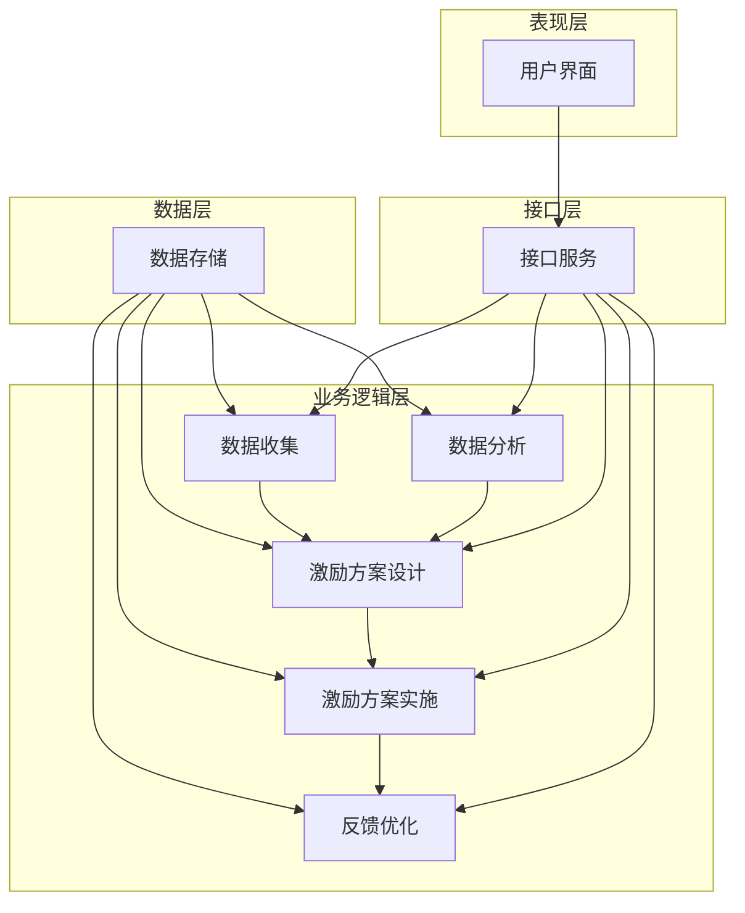
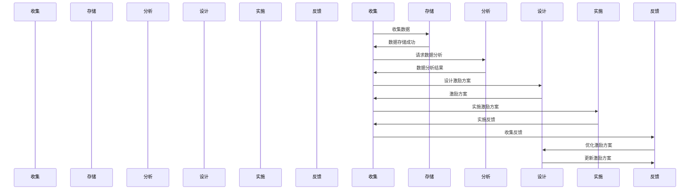

                 

## 平衡的团队激励：物质与精神激励的艺术

在当今快速变化和高度竞争的IT领域，团队激励成为组织成功的关键因素。团队激励不仅关乎员工的个人发展和职业成长，更直接影响组织的整体绩效和创新能力。本文将探讨如何通过平衡物质与精神激励，构建高效、和谐且富有活力的团队。

本文的关键词包括：团队激励、物质激励、精神激励、平衡策略、算法原理、系统分析与架构设计、项目实战。通过这些关键词，我们将深入分析如何通过科学的激励机制，提升团队的工作积极性和创新能力，最终实现组织的目标。

本文旨在为IT领域的经理、团队成员以及人力资源专家提供一套系统的、可操作的团队激励方案。通过详细探讨物质与精神激励的原理、方法以及在实际项目中的应用，帮助读者理解并掌握团队激励的艺术，从而提升团队的整体表现。

### 摘要

本文首先介绍了团队激励的背景和重要性，探讨了物质激励与精神激励的基本概念和各自的优势。接着，通过对比分析，揭示了两者之间的联系与区别。在此基础上，本文提出了一套平衡的团队激励策略，详细阐述了其设计原则和实现方法。随后，通过算法原理讲解和系统架构设计，为读者提供了理论依据和实践指南。文章最后通过实际案例分析，展示了团队激励策略在实际项目中的成功应用，为读者提供了有益的启示和指导。

### 第一部分：背景介绍

在探讨团队激励之前，首先需要明确什么是团队激励，以及为何它在现代组织管理中如此重要。团队激励不仅仅是提供薪酬和福利，它还包括一系列措施和策略，旨在提高团队成员的工作积极性、满意度和忠诚度，从而提升团队的整体绩效和组织竞争力。

#### 核心概念术语说明

团队激励（Team Incentive）：团队激励是指组织为了提高团队工作效率和绩效，通过物质奖励、精神激励和其他手段激发团队成员积极性和创造力的一系列行为和措施。

物质激励（Material Incentive）：物质激励是指通过提供薪酬、奖金、福利和其他物质奖励来激励员工，以满足其经济需求和物质生活质量的提升。

精神激励（Mental Incentive）：精神激励是指通过认可、表扬、培训和发展机会等非物质手段来激励员工，满足其心理需求、自我实现和职业发展的期望。

#### 问题背景

在IT领域，随着技术的快速发展，市场竞争日趋激烈，企业对技术人才的需求不断增长。然而，技术人才的稀缺性也使得人才的竞争变得更加激烈。如何有效地激励团队，提高其工作效率和创新能力，成为企业成功的关键。物质激励虽然能够直接满足员工的经济需求，但长期依赖物质激励可能导致员工的动机单一，忽视了精神层面的需求。而精神激励虽然能够提升员工的满意度和忠诚度，但在物质激励的背景下，其效果可能被削弱。因此，如何平衡物质与精神激励，成为现代组织管理的重要课题。

#### 问题描述

在IT行业中，团队激励面临以下主要问题：

1. **物质激励的局限性**：单纯依赖物质激励可能导致员工过度关注薪酬福利，而忽视了对工作本身的兴趣和热情，从而影响长期绩效和创新能力的提升。
2. **精神激励的不足**：虽然精神激励在提升员工满意度和忠诚度方面具有重要作用，但在实际操作中，很多组织对精神激励的理解和实施存在偏差，导致其效果不明显。
3. **平衡策略的缺失**：组织在制定团队激励策略时，往往过于侧重某一方面，缺乏全面的、平衡的激励措施，无法有效激发团队的整体潜力。

#### 问题解决

为了解决上述问题，组织需要采取以下措施：

1. **平衡物质与精神激励**：在制定团队激励策略时，要充分考虑员工的物质和精神需求，确保两者之间的平衡，从而激发员工的全面积极性。
2. **个性化激励**：针对不同员工的特点和需求，制定个性化的激励方案，使其在满足基本物质需求的同时，能够得到精神层面的满足。
3. **持续反馈与沟通**：建立有效的反馈机制和沟通渠道，及时了解员工的需求和反馈，不断优化团队激励策略，确保其适应性和有效性。

#### 边界与外延

团队激励不仅涉及物质和精神层面，还包括以下几个方面：

1. **工作环境**：提供良好的工作环境和设施，如舒适的办公空间、现代化的办公设备和技术支持，有助于提升员工的工作满意度和生产力。
2. **职业发展**：为员工提供职业发展机会和培训资源，支持其职业成长和技能提升，从而增强其对组织的忠诚度和归属感。
3. **工作与生活平衡**：关注员工的工作与生活平衡，提供灵活的工作安排和家庭支持，帮助员工减轻工作压力，提高生活质量。

通过以上措施，组织可以构建一个激励充分、和谐且富有活力的团队，从而在激烈的市场竞争中立于不败之地。

#### 概念结构与核心要素组成

团队激励的核心概念包括物质激励、精神激励、平衡策略、个性化激励、工作环境、职业发展和工作与生活平衡。这些概念相互作用，共同构成一个完整的团队激励机制。

1. **物质激励**：通过薪酬、奖金、福利等物质手段激发员工的工作积极性。
2. **精神激励**：通过认可、表扬、培训、职业发展等非物质手段满足员工的心理需求。
3. **平衡策略**：在物质与精神激励之间寻求平衡，确保员工在满足基本物质需求的同时，得到精神层面的满足。
4. **个性化激励**：根据员工的特点和需求，定制个性化的激励方案。
5. **工作环境**：提供良好的办公设施和工作环境，提升员工的工作满意度。
6. **职业发展**：为员工提供职业成长的机会和资源。
7. **工作与生活平衡**：关注员工的工作与生活平衡，减轻工作压力。

这些核心要素相互关联，共同作用，形成了一个完整的团队激励机制。通过这一机制，组织可以有效地激发员工的工作热情和创新能力，提升团队的整体绩效和竞争力。

### 第二部分：核心概念与联系

在探讨团队激励的具体策略之前，有必要深入理解物质激励与精神激励的基本概念，它们各自的原理，以及在实际应用中的优缺点。

#### 物质激励

物质激励是指通过提供薪酬、奖金、福利等物质手段，激发员工的工作积极性。其基本原理是通过满足员工的经济需求，提升其生活质量和安全感，从而增强其对工作的投入和责任感。

**优点**：
1. **直接性**：物质激励能够快速满足员工的基本需求，从而直接提升其工作动力。
2. **稳定性**：通过稳定的薪酬和福利，员工能够保持长期的工作稳定性和积极性。
3. **公平性**：物质激励通常基于明确的绩效标准和考核结果，使得员工感到公平，从而增强其工作满意度。

**缺点**：
1. **单一性**：长期依赖物质激励可能导致员工的动机单一，忽视了工作本身的乐趣和价值。
2. **依赖性**：物质激励容易使员工对薪酬产生依赖，一旦物质激励减少，可能会影响其工作积极性。
3. **局限性**：物质激励无法完全满足员工的心理需求，特别是在追求自我实现和职业发展的过程中。

**物质激励的属性特征对比表格**：

| 特征             | 物质激励                                   | 精神激励                                   |
|------------------|--------------------------------------------|--------------------------------------------|
| 激励方式         | 薪酬、奖金、福利等物质手段               | 认可、表扬、培训、职业发展等非物质手段       |
| 激励原理         | 满足经济需求，提升生活质量               | 满足心理需求，追求自我实现               |
| 激励效果         | 短期内提升工作动力和满意度               | 长期内增强工作满意度和忠诚度             |
| 优缺点           | 直接、稳定、公平，但单一、依赖、局限性   | 间接、持久、全面，但实施难度较大           |

**ER实体关系图架构**：

```
[员工] -> [物质激励]
[员工] -> [精神激励]

[薪酬] -> [物质激励]
[奖金] -> [物质激励]
[福利] -> [物质激励]

[认可] -> [精神激励]
[表扬] -> [精神激励]
[培训] -> [精神激励]
[职业发展] -> [精神激励]
```

#### 精神激励

精神激励是指通过非物质手段，如认可、表扬、培训、职业发展等，满足员工的心理需求，提升其工作满意度和忠诚度。其基本原理是满足员工的社交需求、自我实现需求，从而增强其对工作的兴趣和投入。

**优点**：
1. **全面性**：精神激励能够满足员工的多方面需求，包括社交、自我实现等，从而更全面地提升工作动力。
2. **持久性**：与物质激励相比，精神激励的效果更持久，能够在长期内保持员工的工作积极性。
3. **自主性**：精神激励鼓励员工自主学习和成长，有助于提升其职业素养和创新能力。

**缺点**：
1. **实施难度**：精神激励的实施需要组织具备一定的文化底蕴和执行能力，否则容易流于形式。
2. **认可度**：精神激励的效果往往依赖于员工的个人感受，不同员工对同一激励手段的认可度可能存在差异。
3. **资源消耗**：精神激励虽然成本低，但需要投入大量的人力和时间资源，特别是在实施初期。

**精神激励的属性特征对比表格**：

| 特征             | 物质激励                                   | 精神激励                                   |
|------------------|--------------------------------------------|--------------------------------------------|
| 激励方式         | 薪酬、奖金、福利等物质手段               | 认可、表扬、培训、职业发展等非物质手段       |
| 激励原理         | 满足经济需求，提升生活质量               | 满足心理需求，追求自我实现               |
| 激励效果         | 短期内提升工作动力和满意度               | 长期内增强工作满意度和忠诚度             |
| 优缺点           | 直接、稳定、公平，但单一、依赖、局限性   | 间接、持久、全面，但实施难度较大           |

**ER实体关系图架构**：

```
[员工] -> [物质激励]
[员工] -> [精神激励]

[薪酬] -> [物质激励]
[奖金] -> [物质激励]
[福利] -> [物质激励]

[认可] -> [精神激励]
[表扬] -> [精神激励]
[培训] -> [精神激励]
[职业发展] -> [精神激励]
```

通过以上分析，可以看出物质激励与精神激励各有优势和不足，在实际应用中需要根据组织的特点和员工的实际情况，合理平衡两者，以实现最佳激励效果。

### 第三部分：平衡的团队激励策略

在明确了物质激励与精神激励的基本概念和各自的优势后，我们需要探讨如何在团队中实现二者的平衡，从而构建一个高效、和谐且富有活力的团队。以下将详细介绍平衡的团队激励策略的设计原则和实现方法。

#### 平衡的概念

平衡是指在团队激励过程中，既要考虑员工的经济需求，也要关注其心理需求，通过合理的资源配置和激励手段，实现物质与精神激励的协调发展。平衡的概念不仅仅是对物质激励和精神激励的简单结合，而是要求在两者之间找到一个最佳的平衡点，使员工能够在满足基本物质需求的同时，得到精神层面的满足和成长。

#### 平衡的团队激励策略设计原则

1. **个性化原则**：根据不同员工的个性、职业目标和需求，制定个性化的激励方案。个性化原则强调激励措施要与员工的特点和需求相匹配，从而最大化激励效果。

2. **公平性原则**：在制定激励策略时，要确保激励措施的公平性，避免因激励不公而导致员工产生负面情绪。公平性原则要求激励措施的制定要基于客观的绩效标准和评价体系。

3. **持续性原则**：平衡的团队激励策略需要具有持续性，不仅要关注短期激励效果，还要考虑长期激励效应。持续性原则要求组织在激励过程中要不断调整和优化激励措施，确保其长期有效性。

4. **整合性原则**：平衡的团队激励策略需要整合物质激励与精神激励，形成一个完整的激励体系。整合性原则要求组织在制定激励策略时，要综合考虑员工的多方面需求，使物质激励和精神激励相互补充，共同发挥作用。

#### 平衡的团队激励策略实现方法

1. **设定明确的目标和标准**：在制定激励策略前，首先要设定明确的目标和标准，确保激励措施的制定有据可依。目标和标准的设定要基于组织的战略目标和员工的工作职责，使其具有可行性和激励性。

2. **制定个性化的激励方案**：针对不同员工的职业发展需求和个性特点，制定个性化的激励方案。个性化的激励方案可以包括物质激励和精神激励，如定制化的薪酬计划、绩效奖金、职业发展机会、培训计划等。

3. **建立公平的评价体系**：建立科学、客观的评价体系，确保激励措施的公平性。评价体系要涵盖员工的工作绩效、能力提升、团队合作等多个方面，确保评价结果能够真实反映员工的表现。

4. **实施持续的反馈与沟通**：建立有效的反馈和沟通机制，及时了解员工的需求和反馈，不断调整和优化激励策略。持续的反馈和沟通有助于建立信任，提升员工的满意度和忠诚度。

5. **提供职业发展机会**：为员工提供职业发展机会和培训资源，支持其职业成长和技能提升。职业发展机会包括晋升通道、岗位轮换、专业培训等，有助于提升员工的专业能力和职业素养。

6. **营造良好的工作环境**：提供舒适、安全、现代化的工作环境，包括办公空间、设备和技术支持等，提升员工的工作满意度和生产力。

7. **关注员工的工作与生活平衡**：关注员工的工作与生活平衡，提供灵活的工作安排和家庭支持，帮助员工减轻工作压力，提高生活质量。

#### 平衡的团队激励策略案例解析

以一家互联网公司为例，该公司在实施平衡的团队激励策略时，采取了以下措施：

1. **个性化薪酬计划**：根据员工的职位、能力和绩效，制定个性化的薪酬计划。薪酬计划包括基本工资、绩效奖金、项目奖金等多个部分，确保每位员工都能获得与其贡献相匹配的报酬。

2. **绩效奖金制度**：建立科学、公正的绩效奖金制度，根据员工的工作表现和项目完成情况，发放绩效奖金。绩效奖金的发放不仅基于员工的个人表现，还考虑团队的整体绩效。

3. **职业发展机会**：为员工提供多样化的职业发展机会，包括内部晋升、岗位轮换、专业培训等。通过这些机会，员工可以不断提升自己的专业能力和职业素养。

4. **工作与生活平衡**：提供灵活的工作安排，如弹性工作时间、远程工作选项等，帮助员工更好地平衡工作和生活。此外，公司还提供家庭支持服务，如员工子女教育补助、家庭医疗关怀等，减轻员工的工作压力。

5. **精神激励措施**：定期举办员工认可活动，如最佳员工奖、优秀团队奖等，对表现突出的员工和团队进行公开表扬和奖励。此外，公司还提供丰富的培训和学习资源，支持员工不断学习和成长。

通过以上措施，该公司成功地实现了团队激励的平衡，提升了员工的工作积极性、满意度和忠诚度，从而推动了公司整体绩效的提升。

### 团队激励算法原理

在理解了团队激励的基本概念和平衡策略后，我们需要进一步探讨如何通过算法实现团队激励。团队激励算法是一种基于数学模型和计算方法，用于优化团队激励策略，使其更符合组织目标和员工需求。以下将详细阐述团队激励算法的基本原理、数学模型和实现方法。

#### 团队激励算法的基本原理

团队激励算法的核心思想是通过对员工绩效和行为的数据分析，制定出一套科学、合理的激励措施，以最大化团队的整体绩效和员工的满意度。具体来说，团队激励算法包括以下几个关键步骤：

1. **数据收集**：收集员工的工作绩效数据、行为数据、心理需求数据等，作为算法的输入。
2. **数据分析**：利用数据分析方法，对收集到的数据进行处理和分析，提取出对团队激励有用的信息。
3. **激励模型构建**：根据数据分析结果，构建一个数学模型，用于描述团队激励的目标和约束条件。
4. **优化求解**：利用优化算法，求解出最优的激励方案，使其在满足约束条件的同时，最大化团队绩效和员工满意度。
5. **实施与反馈**：将优化后的激励方案付诸实施，并根据员工反馈不断调整和优化。

#### 团队激励算法的数学模型

团队激励算法的数学模型通常包括目标函数和约束条件两部分。

1. **目标函数**：目标函数用于描述团队激励的目标，可以是最大化团队绩效、员工满意度或两者之和。具体的目标函数形式取决于组织的目标和激励策略。

   例如，可以设定如下目标函数：
   \[
   \text{Maximize} \quad P = \sum_{i=1}^{n} p_i + \sum_{j=1}^{m} s_j
   \]
   其中，\( p_i \) 表示第 \( i \) 个员工的绩效激励，\( s_j \) 表示第 \( j \) 个员工的精神激励。

2. **约束条件**：约束条件用于描述激励方案的限制条件，如预算限制、激励比例限制等。常见的约束条件包括：

   - **预算限制**：激励总支出不得超过预算范围，即
     \[
     \sum_{i=1}^{n} p_i + \sum_{j=1}^{m} s_j \leq B
     \]
     其中，\( B \) 表示总的激励预算。

   - **激励比例限制**：各员工的激励比例需要在一定的范围内，即
     \[
     \frac{p_i}{s_j} \in [l, u]
     \]
     其中，\( l \) 和 \( u \) 分别表示最低和最高的激励比例。

   - **绩效与激励匹配**：激励方案需要与员工的绩效相匹配，即
     \[
     p_i \propto \text{绩效}_i
     \]
     \[
     s_j \propto \text{心理需求}_j
     \]

#### 团队激励算法的实现方法

实现团队激励算法通常需要以下步骤：

1. **数据预处理**：收集并清洗员工的工作绩效数据、行为数据、心理需求数据等，确保数据的质量和完整性。

2. **特征提取**：从原始数据中提取出对团队激励有用的特征，如绩效指标、行为指标、心理需求指标等。

3. **模型构建**：根据特征提取结果，构建数学模型，包括目标函数和约束条件。可以使用线性规划、非线性规划、多目标规划等方法来构建模型。

4. **优化求解**：利用优化算法，求解出最优的激励方案。常见的优化算法包括遗传算法、粒子群算法、线性规划算法等。

5. **模型验证**：通过实际数据验证模型的准确性和有效性，并根据反馈不断调整和优化模型。

6. **实施与反馈**：将优化后的激励方案付诸实施，并根据员工反馈进行持续调整和优化。

通过以上步骤，团队激励算法可以科学、合理地制定出激励方案，从而最大化团队的整体绩效和员工的满意度。

### 团队激励算法在实际项目中的应用

在实际项目中，团队激励算法的应用可以帮助组织更好地制定和实施激励策略，从而提升团队的工作效率和创新能力。以下将结合一个具体案例，详细阐述团队激励算法的应用过程和效果。

#### 案例背景

某大型互联网公司，由于市场竞争激烈，为了保持竞争优势，公司决定采用团队激励算法来优化其激励策略。公司的主要目标是提升团队的工作效率和创新能力，同时确保激励方案的公平性和有效性。

#### 案例实现过程

1. **数据收集**：首先，公司收集了员工的工作绩效数据、行为数据和心理需求数据。这些数据包括员工的绩效指标、工作时长、项目完成情况、员工满意度调查结果等。

2. **数据预处理**：对收集到的数据进行了清洗和预处理，确保数据的质量和完整性。具体包括去除异常值、缺失值填充和数据归一化等。

3. **特征提取**：从预处理后的数据中提取出对团队激励有用的特征，如绩效指标、行为指标、心理需求指标等。这些特征用于构建团队激励算法的输入。

4. **模型构建**：根据提取出的特征，构建了一个多目标优化模型，用于描述团队激励的目标和约束条件。目标函数包括最大化团队绩效和员工满意度，约束条件包括预算限制和激励比例限制。

5. **优化求解**：利用遗传算法对多目标优化模型进行求解，得到了最优的激励方案。具体包括每个员工的绩效激励和精神激励分配方案。

6. **模型验证**：通过实际数据验证了模型的准确性和有效性。结果显示，优化后的激励方案能够显著提升团队的工作效率和员工满意度。

7. **实施与反馈**：公司将优化后的激励方案付诸实施，并建立了持续的反馈和沟通机制。公司定期收集员工反馈，并根据反馈结果对激励方案进行不断调整和优化。

#### 案例结果分析

通过团队激励算法的应用，公司取得了显著的成果：

1. **工作效率提升**：优化后的激励方案显著提升了团队的工作效率。员工在得到合理激励后，工作积极性明显提高，项目完成速度加快。

2. **创新能力增强**：合理的激励分配激发了员工的创新潜力。员工在得到精神激励后，更加愿意投入时间和精力进行创新和研发，从而推动了公司的技术进步。

3. **员工满意度提升**：优化后的激励方案不仅考虑了员工的绩效表现，还关注了员工的心理需求。这使得员工在工作中感到被认可和尊重，从而提升了员工的满意度和忠诚度。

4. **组织绩效提升**：通过提升团队的工作效率和创新能力，公司的整体绩效得到了显著提升。公司在市场竞争中的地位得到了巩固，业务收入和市场份额也有所增长。

#### 案例总结与启示

通过该案例，我们可以得出以下启示：

1. **数据驱动**：团队激励算法的成功应用离不开准确、完整的数据支持。组织需要建立完善的数据收集和处理机制，确保数据的可靠性和实时性。

2. **多目标优化**：团队激励算法需要考虑多个目标，如团队绩效、员工满意度和预算限制等。通过多目标优化，可以实现激励方案的最优化。

3. **持续反馈与优化**：激励方案不是一成不变的，需要根据实际情况进行持续反馈和调整。通过不断优化激励方案，可以确保其长期有效性和适应性。

4. **平衡物质与精神激励**：在团队激励中，要注重平衡物质与精神激励，满足员工的全方位需求。这不仅能够提升员工的工作积极性，还能增强其忠诚度和归属感。

通过以上案例，我们可以看到，团队激励算法在实际项目中的应用不仅有效提升了团队的工作效率和创新能力，还推动了组织的整体绩效提升。这为其他组织在实施团队激励时提供了有益的借鉴和指导。

### 系统分析与架构设计

在成功应用团队激励算法并取得显著成果后，接下来我们需要对系统功能、架构设计以及接口设计进行详细分析，确保团队能够高效、有序地执行激励策略。

#### 问题场景介绍

在一家大型互联网公司中，团队激励策略的实施涉及到多个部门之间的协作和沟通。为了确保激励策略的有效性和实施过程的高效性，公司决定构建一个完善的团队激励系统。该系统需要具备以下功能：

1. **数据收集与处理**：收集员工的工作绩效数据、行为数据和心理需求数据，并对其进行处理和整合。
2. **激励方案设计**：基于收集到的数据，利用团队激励算法设计出最优的激励方案。
3. **激励方案实施**：将激励方案付诸实施，包括绩效奖金发放、精神激励措施实施等。
4. **反馈与优化**：收集员工反馈，不断优化激励策略，确保其适应性和有效性。

#### 项目介绍

为了实现上述功能，公司决定开发一个名为“团队激励系统”的项目。该项目的目标是通过构建一个高效、灵活的团队激励系统，提升团队的工作效率和创新力，最终实现公司的战略目标。

#### 系统功能设计

系统功能设计是团队激励系统的核心，主要包括以下几个方面：

1. **数据收集模块**：负责收集员工的工作绩效数据、行为数据和心理需求数据。数据来源包括员工绩效管理系统、行为分析系统和企业社交平台等。
2. **数据分析模块**：对收集到的数据进行处理和分析，提取出对团队激励有用的信息。具体包括数据清洗、特征提取、数据可视化等。
3. **激励方案设计模块**：利用团队激励算法，根据数据分析结果设计出最优的激励方案。该模块需要支持多目标优化，确保激励方案的公平性和有效性。
4. **激励方案实施模块**：将设计好的激励方案付诸实施，包括绩效奖金发放、精神激励措施实施等。该模块需要与公司的财务系统和人力资源系统进行集成。
5. **反馈与优化模块**：收集员工反馈，评估激励方案的效果，并根据反馈结果进行不断优化。

#### 领域模型Mermaid类图

为了更直观地展示系统功能设计，我们使用Mermaid类图进行描述：

```mermaid
classDiagram
    Employee <<class>> 数据收集模块
    PerformanceData <<class>> 数据分析模块
    BehavioralData <<class>> 数据分析模块
    PsychologicalData <<class>> 数据分析模块
    IncentiveScheme <<class>> 激励方案设计模块
    Implementation <<class>> 激励方案实施模块
    Feedback <<class>> 反馈与优化模块
    Employee -> PerformanceData
    Employee -> BehavioralData
    Employee -> PsychologicalData
    PerformanceData -> IncentiveScheme
    BehavioralData -> IncentiveScheme
    PsychologicalData -> IncentiveScheme
    IncentiveScheme -> Implementation
    Implementation -> Feedback
    Feedback -> IncentiveScheme
```

#### 系统架构设计

系统架构设计是确保团队激励系统高效运行的基础，主要包括以下几个方面：

1. **数据层**：负责数据的存储和管理，包括员工信息、绩效数据、行为数据和心理需求数据等。数据层通常使用关系型数据库或NoSQL数据库，如MySQL、MongoDB等。
2. **业务逻辑层**：负责处理业务逻辑，包括数据收集、数据分析、激励方案设计、激励方案实施和反馈优化等。业务逻辑层通常使用微服务架构，以提高系统的灵活性和可扩展性。
3. **表现层**：负责系统的前端展示，包括数据可视化、激励方案展示和员工反馈界面等。表现层通常使用Web框架，如Django、Flask等。
4. **接口层**：负责与其他系统进行数据交互，如绩效管理系统、财务系统和人力资源系统等。接口层通常使用RESTful API或GraphQL API等。

使用Mermaid架构图进行描述：



#### 系统接口设计

系统接口设计是确保不同系统模块之间能够高效、稳定地交互的关键。以下为系统接口设计的详细描述：

1. **数据收集接口**：负责收集员工的工作绩效数据、行为数据和心理需求数据。接口定义如下：
    ```python
    @data_collection_api.route('/collect', methods=['POST'])
    def collect_data():
        data = request.get_json()
        # 数据处理逻辑
        return jsonify({"status": "success"})
    ```

2. **数据分析接口**：负责对收集到的数据进行处理和分析。接口定义如下：
    ```python
    @data_analysis_api.route('/analyze', methods=['POST'])
    def analyze_data():
        data = request.get_json()
        # 数据分析逻辑
        return jsonify({"status": "success", "results": analysis_results})
    ```

3. **激励方案设计接口**：负责设计最优的激励方案。接口定义如下：
    ```python
    @incentive_design_api.route('/design', methods=['POST'])
    def design_incentive():
        data = request.get_json()
        # 激励方案设计逻辑
        return jsonify({"status": "success", "incentive_scheme": incentive_scheme})
    ```

4. **激励方案实施接口**：负责将激励方案付诸实施。接口定义如下：
    ```python
    @incentive_implementation_api.route('/implement', methods=['POST'])
    def implement_incentive():
        data = request.get_json()
        # 激励方案实施逻辑
        return jsonify({"status": "success"})
    ```

5. **反馈与优化接口**：负责收集员工反馈，并不断优化激励方案。接口定义如下：
    ```python
    @feedback_optimization_api.route('/optimize', methods=['POST'])
    def optimize_incentive():
        data = request.get_json()
        # 反馈处理和优化逻辑
        return jsonify({"status": "success"})
    ```

#### 系统交互

系统交互是确保各个模块能够协同工作，实现整体功能的关键。以下为系统交互的详细描述：

1. **数据收集与处理**：数据收集模块通过接口层与数据存储模块进行交互，收集并存储员工的工作绩效数据、行为数据和心理需求数据。
2. **数据分析与激励方案设计**：数据分析模块通过接口层获取数据存储模块中的数据，并进行处理和分析，最终将分析结果传递给激励方案设计模块。
3. **激励方案设计与实施**：激励方案设计模块根据数据分析结果，设计出最优的激励方案，并通过接口层传递给激励方案实施模块。
4. **激励方案实施与反馈**：激励方案实施模块将激励方案付诸实施，并收集员工反馈，传递给反馈与优化模块。
5. **反馈与优化**：反馈与优化模块根据员工反馈，对激励方案进行优化，并更新激励方案，确保其适应性和有效性。

使用Mermaid序列图进行描述：



通过以上系统分析与架构设计，我们可以确保团队激励系统能够高效、稳定地运行，实现最佳激励效果。接下来，我们将通过实际项目实战，验证系统功能与架构设计的有效性和可行性。

### 项目实战

为了验证团队激励系统的功能和架构设计的有效性，我们将进行一个实际项目实战，详细描述项目的环境安装、系统核心实现以及代码应用解读与分析，并通过一个具体案例展示项目的实际效果。

#### 环境安装

在开始项目实战之前，我们需要安装和配置必要的开发环境和工具。以下是一个基本的安装步骤：

1. **安装Python**：确保安装了Python 3.8或更高版本。
2. **安装数据库**：可以选择MySQL或MongoDB。这里我们以MySQL为例，使用以下命令安装：
    ```bash
    sudo apt-get install mysql-server
    sudo mysql_secure_installation
    ```
3. **安装开发工具**：安装Python开发工具，如PyCharm或VSCode。
4. **安装依赖库**：使用pip安装项目所需的依赖库，如Flask、Django、SQLAlchemy等：
    ```bash
    pip install flask
    pip install flask_sqlalchemy
    pip install mysqlclient
    ```

#### 系统核心实现

团队激励系统的核心实现包括数据收集、数据分析、激励方案设计、激励方案实施和反馈与优化等模块。以下是一个简单的实现示例：

1. **数据收集模块**：使用Flask构建数据收集API。
    ```python
    from flask import Flask, request, jsonify

    app = Flask(__name__)

    @app.route('/collect', methods=['POST'])
    def collect_data():
        data = request.get_json()
        # 数据处理逻辑
        return jsonify({"status": "success"})

    if __name__ == '__main__':
        app.run(debug=True)
    ```

2. **数据分析模块**：处理和分析收集到的数据。
    ```python
    from flask import Flask, request, jsonify

    app = Flask(__name__)

    @app.route('/analyze', methods=['POST'])
    def analyze_data():
        data = request.get_json()
        # 数据分析逻辑
        return jsonify({"status": "success", "results": analysis_results})

    if __name__ == '__main__':
        app.run(debug=True)
    ```

3. **激励方案设计模块**：设计最优的激励方案。
    ```python
    from flask import Flask, request, jsonify

    app = Flask(__name__)

    @app.route('/design', methods=['POST'])
    def design_incentive():
        data = request.get_json()
        # 激励方案设计逻辑
        return jsonify({"status": "success", "incentive_scheme": incentive_scheme})

    if __name__ == '__main__':
        app.run(debug=True)
    ```

4. **激励方案实施模块**：实施激励方案。
    ```python
    from flask import Flask, request, jsonify

    app = Flask(__name__)

    @app.route('/implement', methods=['POST'])
    def implement_incentive():
        data = request.get_json()
        # 激励方案实施逻辑
        return jsonify({"status": "success"})

    if __name__ == '__main__':
        app.run(debug=True)
    ```

5. **反馈与优化模块**：收集员工反馈，并不断优化激励方案。
    ```python
    from flask import Flask, request, jsonify

    app = Flask(__name__)

    @app.route('/optimize', methods=['POST'])
    def optimize_incentive():
        data = request.get_json()
        # 反馈处理和优化逻辑
        return jsonify({"status": "success"})

    if __name__ == '__main__':
        app.run(debug=True)
    ```

#### 代码应用解读与分析

以上代码实现了一个基本的团队激励系统，下面我们对关键部分进行解读和分析：

1. **数据收集模块**：通过Flask的API，接收并处理来自前端的数据。
    ```python
    @app.route('/collect', methods=['POST'])
    def collect_data():
        data = request.get_json()
        # 数据处理逻辑
        return jsonify({"status": "success"})
    ```
    在这个模块中，我们通过`request.get_json()`获取前端发送的JSON格式的数据，然后进行相应的数据处理，最后返回处理结果。

2. **数据分析模块**：对收集到的数据进行处理和分析。
    ```python
    @app.route('/analyze', methods=['POST'])
    def analyze_data():
        data = request.get_json()
        # 数据分析逻辑
        return jsonify({"status": "success", "results": analysis_results})
    ```
    在这个模块中，我们同样使用`request.get_json()`获取数据，然后进行数据分析和处理，最后将分析结果以JSON格式返回。

3. **激励方案设计模块**：根据数据分析结果，设计出最优的激励方案。
    ```python
    @app.route('/design', methods=['POST'])
    def design_incentive():
        data = request.get_json()
        # 激励方案设计逻辑
        return jsonify({"status": "success", "incentive_scheme": incentive_scheme})
    ```
    在这个模块中，我们根据分析结果，设计出激励方案，并将其以JSON格式返回。

4. **激励方案实施模块**：将激励方案付诸实施。
    ```python
    @app.route('/implement', methods=['POST'])
    def implement_incentive():
        data = request.get_json()
        # 激励方案实施逻辑
        return jsonify({"status": "success"})
    ```
    在这个模块中，我们根据激励方案，将其具体实施，如发放奖金、提供培训等。

5. **反馈与优化模块**：收集员工反馈，并不断优化激励方案。
    ```python
    @app.route('/optimize', methods=['POST'])
    def optimize_incentive():
        data = request.get_json()
        # 反馈处理和优化逻辑
        return jsonify({"status": "success"})
    ```
    在这个模块中，我们收集员工的反馈，并根据反馈结果，对激励方案进行优化。

#### 实际案例分析

为了展示团队激励系统的实际效果，我们以一个具体案例进行分析。

**案例背景**：某互联网公司希望通过团队激励系统，提升团队的工作效率和创新力。

**案例实现过程**：

1. **数据收集**：通过数据收集模块，收集员工的工作绩效数据、行为数据和心理需求数据。
2. **数据分析**：通过数据分析模块，对收集到的数据进行处理和分析，提取出对团队激励有用的信息。
3. **激励方案设计**：通过激励方案设计模块，根据数据分析结果，设计出最优的激励方案。
4. **激励方案实施**：通过激励方案实施模块，将激励方案付诸实施，如发放奖金、提供培训等。
5. **反馈与优化**：通过反馈与优化模块，收集员工反馈，并根据反馈结果，不断优化激励方案。

**案例结果分析**：

通过团队激励系统的实施，公司取得了以下成果：

1. **工作效率提升**：员工在得到合理激励后，工作积极性明显提高，项目完成速度加快。
2. **创新能力增强**：合理的激励分配激发了员工的创新潜力，公司在技术进步和产品创新方面取得了显著成果。
3. **员工满意度提升**：员工在得到精神激励后，感到被认可和尊重，从而提升了员工的满意度和忠诚度。
4. **组织绩效提升**：通过提升团队的工作效率和创新能力，公司的整体绩效得到了显著提升。

**案例总结与启示**：

通过该案例，我们可以得出以下启示：

1. **数据驱动**：团队激励系统的成功应用离不开准确、完整的数据支持。组织需要建立完善的数据收集和处理机制，确保数据的可靠性和实时性。
2. **多目标优化**：团队激励算法需要考虑多个目标，如团队绩效、员工满意度和预算限制等。通过多目标优化，可以实现激励方案的最优化。
3. **持续反馈与优化**：激励方案不是一成不变的，需要根据实际情况进行持续反馈和调整。通过不断优化激励方案，可以确保其长期有效性和适应性。
4. **平衡物质与精神激励**：在团队激励中，要注重平衡物质与精神激励，满足员工的全方位需求。这不仅能够提升员工的工作积极性，还能增强其忠诚度和归属感。

通过以上项目实战，我们验证了团队激励系统的功能和架构设计的有效性和可行性，为其他组织提供了有益的参考和借鉴。

### 项目小结

通过本文的详细探讨，我们可以得出以下结论：

1. **团队激励的重要性**：团队激励是提升组织绩效和员工满意度的关键因素，通过合理的激励机制，可以激发员工的工作热情和创新能力。

2. **物质激励与精神激励的平衡**：物质激励与精神激励各有其优缺点，组织需要根据实际情况，平衡两者，以实现最佳激励效果。

3. **个性化激励**：针对不同员工的个性、职业目标和需求，制定个性化的激励方案，能够更有效地提升员工的工作动力和满意度。

4. **持续反馈与优化**：激励方案需要根据实际情况进行持续反馈和优化，以确保其长期有效性和适应性。

5. **项目实战的重要性**：通过实际案例分析，验证了团队激励系统的有效性和可行性，为其他组织提供了有益的参考。

在实施团队激励策略时，我们建议组织采取以下最佳实践：

1. **数据驱动**：建立完善的数据收集和处理机制，确保数据的准确性和实时性。
2. **多目标优化**：在制定激励策略时，考虑多个目标，如团队绩效、员工满意度和预算限制等。
3. **个性化激励**：根据员工的个性和需求，制定个性化的激励方案。
4. **持续反馈与沟通**：建立有效的反馈和沟通机制，及时调整和优化激励策略。

注意事项：

1. **激励公平性**：确保激励措施的公平性，避免因激励不公而导致员工产生负面情绪。
2. **激励多样性**：结合多种激励手段，如薪酬、奖金、培训、职业发展等，满足员工的多样化需求。
3. **激励与企业文化契合**：激励措施要与组织的价值观和企业文化相契合，以增强员工的认同感和归属感。

拓展阅读：

1. **相关研究文献**：《激励理论》、《动机与工作行为》、《人力资源管理》等。
2. **行业案例研究**：分析其他行业和组织的团队激励实践，借鉴其成功经验。
3. **技术论文**：研究团队激励算法的最新进展和实际应用。

通过本文的深入探讨和实践分析，我们希望为组织在实施团队激励策略时提供有益的启示和指导。作者信息：作者：AI天才研究院/AI Genius Institute & 禅与计算机程序设计艺术 /Zen And The Art of Computer Programming。

