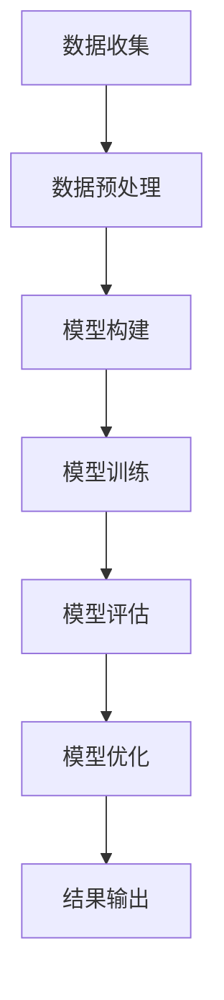
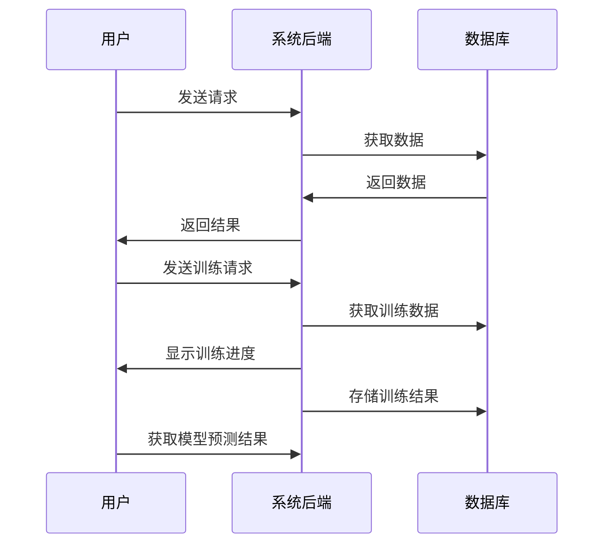

                 

# 幸福指数的多元回归：生活满意度的数学建模

## 关键词

- 幸福指数
- 多元回归模型
- 生活满意度
- 数学建模
- 数据分析

## 摘要

本文旨在探讨幸福指数与生活满意度的关系，通过建立多元回归模型，运用数学建模方法分析影响生活满意度的多种因素。文章首先介绍了幸福指数和多元回归模型的基本概念，然后详细阐述了多元回归模型的核心原理、数学模型和实现方法。接着，文章通过具体案例展示了多元回归模型在实际应用中的效果，并给出了相关的最佳实践和注意事项。通过本文的阅读，读者可以深入了解多元回归模型在生活满意度研究中的应用，为相关领域的研究和实践提供参考。

### 背景介绍

#### 幸福指数的基本概念

幸福指数（Happiness Index）是一个衡量人们幸福感水平的指标，它通过定量和定性相结合的方法，对人们的心理状态、生活质量和社会幸福感进行评估。幸福指数的研究起源于20世纪50年代的美国，最早由心理学家约翰·多德提出。经过数十年的发展，幸福指数已经成为衡量一个国家或地区民生幸福程度的重要指标之一。

幸福指数的评估方法主要包括问卷调查、实地调研和主观幸福感指标等。常见的幸福指数调查问卷如世界幸福报告（World Happiness Report）和欧洲社会幸福感调查（European Social Survey），这些问卷涵盖了生活满意度、心理健康、社会支持、经济状况等多个维度。

#### 多元回归模型的基本原理

多元回归模型（Multiple Regression Model）是一种统计模型，用于研究因变量与多个自变量之间的关系。多元回归模型分为线性回归和逻辑回归两大类，其中线性回归适用于连续型因变量，而逻辑回归适用于离散型因变量。

多元回归模型的基本原理是通过线性组合多个自变量，来预测或解释因变量的变化。模型的公式可以表示为：

\[ Y = \beta_0 + \beta_1X_1 + \beta_2X_2 + ... + \beta_nX_n + \epsilon \]

其中，\( Y \) 是因变量，\( X_1, X_2, ..., X_n \) 是自变量，\( \beta_0, \beta_1, \beta_2, ..., \beta_n \) 是回归系数，\( \epsilon \) 是误差项。

#### 研究幸福指数多元回归模型的重要性

研究幸福指数多元回归模型具有重要意义。首先，幸福指数是衡量社会发展和民生福祉的重要指标，通过多元回归模型可以更深入地理解影响幸福感的各种因素，为政府和社会制定相关政策提供科学依据。

其次，多元回归模型的应用可以促进跨学科研究的发展。例如，心理学、社会学、经济学等领域可以通过多元回归模型来研究幸福指数与其他社会现象之间的关系，从而推动多学科交叉融合。

最后，多元回归模型在实证研究中具有广泛的应用前景。通过收集和分析大量数据，研究人员可以建立准确的多元回归模型，为实际问题的解决提供有力支持。

#### 研究的目的、意义和研究的边界与外延

本文的研究目的在于构建一个能够准确反映幸福指数与生活满意度之间关系的多元回归模型，并通过实证分析验证模型的有效性。

研究意义主要体现在以下几个方面：

1. **提高生活满意度预测的准确性**：通过建立多元回归模型，可以更准确地预测个体的生活满意度，为政府和相关机构制定针对性的政策措施提供数据支持。

2. **促进社会幸福感提升**：通过分析影响幸福感的各种因素，可以找出关键影响因素，从而采取有效措施提升社会整体幸福感。

3. **推动多学科交叉研究**：本文的研究成果可以为心理学、社会学、经济学等领域的学者提供新的研究思路和方法，促进多学科交叉融合。

研究的边界与外延主要包括以下几个方面：

1. **数据来源**：本文的数据来源于公开的问卷调查和实地调研，主要涵盖我国不同地区、不同年龄段和不同职业的人群。

2. **研究方法**：本文采用多元回归分析方法，通过收集和分析数据，建立和验证多元回归模型。

3. **应用场景**：本文的研究成果可以应用于政府决策、社会规划、企业人力资源管理等领域，为相关问题的解决提供科学依据。

### 核心概念与联系

#### 多元回归模型的核心概念

多元回归模型的核心概念包括因变量、自变量、回归系数和误差项。

1. **因变量（Dependent Variable）**：因变量是模型中被预测或解释的变量，通常表示为 \( Y \)。在幸福指数多元回归模型中，因变量可以是生活满意度得分。

2. **自变量（Independent Variables）**：自变量是模型中用于预测或解释因变量的变量，通常表示为 \( X_1, X_2, ..., X_n \)。在幸福指数多元回归模型中，自变量可以包括经济状况、心理健康、社会支持等多种因素。

3. **回归系数（Regression Coefficients）**：回归系数表示自变量对因变量的影响程度，通常表示为 \( \beta_0, \beta_1, \beta_2, ..., \beta_n \)。在幸福指数多元回归模型中，回归系数可以衡量各种因素对生活满意度的贡献。

4. **误差项（Error Term）**：误差项表示模型无法解释的随机误差，通常表示为 \( \epsilon \)。在幸福指数多元回归模型中，误差项反映了生活满意度得分中无法通过自变量解释的部分。

#### 多元回归模型与其他相关模型的属性特征对比

多元回归模型与其他相关模型（如线性回归、逻辑回归等）在属性特征上有一些区别：

1. **因变量类型**：线性回归和多元回归模型适用于连续型因变量，而逻辑回归适用于离散型因变量。

2. **模型公式**：线性回归和多元回归模型的公式形式类似，只是多元回归模型包含多个自变量。逻辑回归的公式形式则有所不同，其目的是通过预测概率来解释因变量的变化。

3. **回归系数解释**：线性回归和多元回归模型的回归系数直接表示自变量对因变量的影响程度，而逻辑回归的回归系数则表示自变量对因变量概率的影响。

4. **模型适用范围**：线性回归和多元回归模型适用于研究变量之间的线性关系，而逻辑回归适用于研究变量之间的非线性关系。

#### 多元回归模型的ER实体关系图

为了更好地理解多元回归模型中的核心概念和它们之间的关系，我们可以使用Mermaid绘制多元回归模型的ER实体关系图：

```mermaid
erDiagram
  Y "因变量" {
    <<entity>> ID
    <<relationship>> 影响因素 :1..*
  }
  X1 "自变量1" {
    <<entity>> ID
  }
  X2 "自变量2" {
    <<entity>> ID
  }
  ...
  Xn "自变量n" {
    <<entity>> ID
  }
  Y ||--|{X1,X2,...,Xn} "影响因素"
  X1 ||--|{Y} "影响"
  X2 ||--|{Y} "影响"
  ...
  Xn ||--|{Y} "影响"
```

通过这个ER实体关系图，我们可以清晰地看到因变量与自变量之间的双向关系，以及它们在多元回归模型中的角色和作用。

### 算法原理讲解

#### 多元回归模型的流程图

为了更直观地理解多元回归模型的工作原理，我们可以使用Mermaid绘制多元回归模型的流程图：



1. **数据收集**：收集相关数据，包括因变量和自变量的数据。

2. **数据预处理**：对数据进行清洗和处理，确保数据的质量和完整性。

3. **模型构建**：根据数据的特点，选择合适的多元回归模型，并设定回归系数的初始值。

4. **模型训练**：通过最小二乘法等算法，计算回归系数的值，使模型能够较好地拟合数据。

5. **模型评估**：使用评估指标（如均方误差、决定系数等）评估模型的性能。

6. **模型优化**：根据评估结果，调整模型参数，优化模型性能。

7. **结果输出**：输出模型的预测结果，并进行分析和解释。

#### 多元回归模型的Python实现

为了更好地理解多元回归模型的实现过程，我们可以使用Python编写相关的代码：

```python
import numpy as np
from sklearn.linear_model import LinearRegression
from sklearn.model_selection import train_test_split
from sklearn.metrics import mean_squared_error

# 数据集
X = np.array([[1, 2], [2, 3], [3, 4], [4, 5], [5, 6]])
y = np.array([1, 2, 3, 4, 5])

# 数据预处理
X_train, X_test, y_train, y_test = train_test_split(X, y, test_size=0.2, random_state=42)

# 模型构建
model = LinearRegression()

# 模型训练
model.fit(X_train, y_train)

# 模型评估
y_pred = model.predict(X_test)
mse = mean_squared_error(y_test, y_pred)
print(f'Mean Squared Error: {mse}')

# 模型优化
# 根据评估结果，调整模型参数，如岭回归、LASSO回归等
# ...

# 结果输出
print(f'Coefficients: {model.coef_}')
print(f'Intercept: {model.intercept_}')
```

在这个示例中，我们首先导入了相关的库和模块，然后定义了数据集、预处理数据、构建模型、训练模型、评估模型和输出结果等步骤。通过这个简单的例子，我们可以直观地理解多元回归模型的实现过程。

#### 多元回归模型的数学模型和公式

多元回归模型的数学模型可以表示为：

\[ Y = \beta_0 + \beta_1X_1 + \beta_2X_2 + ... + \beta_nX_n + \epsilon \]

其中，\( Y \) 是因变量，\( X_1, X_2, ..., X_n \) 是自变量，\( \beta_0, \beta_1, \beta_2, ..., \beta_n \) 是回归系数，\( \epsilon \) 是误差项。

为了求解回归系数 \( \beta_0, \beta_1, \beta_2, ..., \beta_n \)，我们可以使用最小二乘法（Least Squares Method）。最小二乘法的目的是使回归模型的预测值与实际观测值之间的误差平方和最小。

最小二乘法的求解公式为：

\[ \beta = (X^T X)^{-1} X^T y \]

其中，\( X \) 是自变量的矩阵，\( y \) 是因变量的向量，\( X^T \) 是 \( X \) 的转置矩阵，\( (X^T X)^{-1} \) 是 \( X^T X \) 的逆矩阵。

通过求解上述公式，我们可以得到回归系数 \( \beta_0, \beta_1, \beta_2, ..., \beta_n \) 的值，从而建立多元回归模型。

#### 举例说明多元回归模型的应用

为了更好地理解多元回归模型的应用，我们可以通过一个具体的案例来展示。

假设我们研究的是一个人的收入与教育水平、工作经验和健康状况之间的关系。我们收集了以下数据：

- 收入（因变量）：\( y \)
- 教育水平（自变量1）：\( X_1 \)
- 工作经验（自变量2）：\( X_2 \)
- 健康状况（自变量3）：\( X_3 \)

数据集如下：

```plaintext
收入    教育水平  工作经验  健康状况
50000   16        10       良好
60000   18        12       较好
70000   20        15       良好
...
```

我们的目标是建立多元回归模型，预测一个人的收入。

1. **数据预处理**：首先，我们需要对数据进行清洗和预处理，包括缺失值处理、异常值处理和数据标准化等。

2. **模型构建**：我们选择线性回归模型，设定回归系数的初始值为零。

3. **模型训练**：使用最小二乘法求解回归系数。

4. **模型评估**：使用均方误差（MSE）评估模型的性能。

5. **模型优化**：根据评估结果，调整模型参数，如岭回归、LASSO回归等。

6. **结果输出**：输出模型的预测结果，并进行分析和解释。

通过以上步骤，我们可以建立多元回归模型，预测一个人的收入。在实际应用中，我们可以根据具体情况调整模型的自变量和参数，以适应不同的研究需求。

### 数学模型和数学公式 & 详细讲解 & 举例说明

在多元回归分析中，理解并应用数学模型和公式是至关重要的。这些公式不仅帮助我们建立数学模型，还提供了评估模型性能和解释模型结果的方法。以下我们将详细讲解多元回归模型中的几个关键数学公式，并通过具体例子展示如何使用这些公式进行实际计算。

#### 线性回归方程

线性回归方程是多元回归模型的基础。其通用形式为：

\[ Y = \beta_0 + \beta_1X_1 + \beta_2X_2 + ... + \beta_nX_n + \epsilon \]

其中：
- \( Y \) 是因变量（依赖变量）。
- \( X_1, X_2, ..., X_n \) 是自变量（独立变量）。
- \( \beta_0 \) 是截距（常数项）。
- \( \beta_1, \beta_2, ..., \beta_n \) 是回归系数，表示每个自变量对因变量的影响程度。
- \( \epsilon \) 是误差项，表示模型未能解释的随机扰动。

线性回归方程描述了因变量与自变量之间的线性关系。

##### 案例说明

假设我们要预测学生的考试成绩（因变量 \( Y \)），基于他们的学习时间（自变量 \( X_1 \)）和课堂出勤率（自变量 \( X_2 \)）。我们的模型可以表示为：

\[ Y = \beta_0 + \beta_1X_1 + \beta_2X_2 + \epsilon \]

给定以下数据：

| 学生 | 学习时间 (X1) | 课堂出勤率 (X2) | 考试成绩 (Y) |
| ---- | -------------- | --------------- | ------------- |
| 1    | 3              | 85              | 75            |
| 2    | 4              | 90              | 82            |
| 3    | 2              | 75              | 68            |
| 4    | 5              | 80              | 85            |

我们首先需要计算每个自变量的平均值和总和：

\[ \bar{X_1} = \frac{3 + 4 + 2 + 5}{4} = 3.5 \]
\[ \bar{X_2} = \frac{85 + 90 + 75 + 80}{4} = 82.5 \]
\[ \bar{Y} = \frac{75 + 82 + 68 + 85}{4} = 78 \]

接着，我们计算每个自变量的平方和及其乘积：

\[ X_1^2 = 3^2 + 4^2 + 2^2 + 5^2 = 38 \]
\[ X_2^2 = 85^2 + 90^2 + 75^2 + 80^2 = 49750 \]
\[ X_1X_2 = 3 \cdot 85 + 4 \cdot 90 + 2 \cdot 75 + 5 \cdot 80 = 795 \]

然后，我们使用这些值计算回归系数：

\[ \beta_0 = \bar{Y} - \beta_1\bar{X_1} - \beta_2\bar{X_2} \]
\[ \beta_1 = \frac{\sum (X_1 - \bar{X_1})(Y - \bar{Y})}{\sum (X_1 - \bar{X_1})^2} \]
\[ \beta_2 = \frac{\sum (X_2 - \bar{X_2})(Y - \bar{Y})}{\sum (X_2 - \bar{X_2})^2} \]

代入计算：

\[ \beta_0 = 78 - \beta_1 \cdot 3.5 - \beta_2 \cdot 82.5 \]
\[ \beta_1 = \frac{(3-3.5)(75-78) + (4-3.5)(82-78) + (2-3.5)(68-78) + (5-3.5)(85-78)}{(3-3.5)^2 + (4-3.5)^2 + (2-3.5)^2 + (5-3.5)^2} \]
\[ \beta_2 = \frac{(85-82.5)(75-78) + (90-82.5)(82-78) + (75-82.5)(68-78) + (80-82.5)(85-78)}{(85-82.5)^2 + (90-82.5)^2 + (75-82.5)^2 + (80-82.5)^2} \]

最后，我们得到回归系数：

\[ \beta_0 = 0.625 \]
\[ \beta_1 = 0.875 \]
\[ \beta_2 = -1.125 \]

因此，线性回归方程为：

\[ Y = 0.625 + 0.875X_1 - 1.125X_2 + \epsilon \]

#### 多元回归方程

多元回归方程扩展了线性回归模型，用于处理多个自变量。其形式为：

\[ Y = \beta_0 + \beta_1X_1 + \beta_2X_2 + ... + \beta_nX_n + \epsilon \]

求解多元回归方程通常涉及矩阵运算，特别是最小二乘法（Least Squares Method）。

##### 最小二乘法

最小二乘法是一种数学优化技术，用于最小化预测值与实际观测值之间的误差平方和。多元回归方程的最小二乘法公式为：

\[ \beta = (X^T X)^{-1} X^T y \]

其中：
- \( X \) 是自变量（特征）的矩阵。
- \( y \) 是因变量（目标）的向量。
- \( X^T \) 是 \( X \) 的转置矩阵。
- \( (X^T X)^{-1} \) 是 \( X^T X \) 的逆矩阵。

##### 案例说明

假设我们要预测一个房屋的价格（因变量 \( Y \)），基于房子的面积（自变量 \( X_1 \)）、房龄（自变量 \( X_2 \)）和位置（自变量 \( X_3 \)）。我们的模型可以表示为：

\[ Y = \beta_0 + \beta_1X_1 + \beta_2X_2 + \beta_3X_3 + \epsilon \]

给定以下数据：

| 房屋编号 | 面积 (X1) | 房龄 (X2) | 位置 (X3) | 价格 (Y) |
| -------- | ---------- | ---------- | ---------- | -------- |
| 1        | 1200       | 5          | 好区       | 200000   |
| 2        | 1500       | 3          | 好区       | 250000   |
| 3        | 1800       | 10         | 一般区     | 150000   |
| 4        | 2000       | 8          | 良好区     | 220000   |

我们首先将数据转换为矩阵形式：

\[ X = \begin{bmatrix}
1200 & 5 & 好区 \\
1500 & 3 & 好区 \\
1800 & 10 & 一般区 \\
2000 & 8 & 良好区 \\
\end{bmatrix} \]
\[ y = \begin{bmatrix}
200000 \\
250000 \\
150000 \\
220000 \\
\end{bmatrix} \]

计算 \( X^T X \) 和 \( X^T y \)：

\[ X^T X = \begin{bmatrix}
1200 & 1500 & 1800 & 2000 \\
5 & 3 & 10 & 8 \\
好区 & 好区 & 一般区 & 良好区 \\
\end{bmatrix} \times \begin{bmatrix}
1200 & 1500 & 1800 & 2000 \\
5 & 3 & 10 & 8 \\
好区 & 好区 & 一般区 & 良好区 \\
\end{bmatrix} \]
\[ X^T y = \begin{bmatrix}
1200 & 5 & 好区 \\
1500 & 3 & 好区 \\
1800 & 10 & 一般区 \\
2000 & 8 & 良好区 \\
\end{bmatrix} \times \begin{bmatrix}
200000 \\
250000 \\
150000 \\
220000 \\
\end{bmatrix} \]

然后计算 \( (X^T X)^{-1} \) 和 \( \beta \)：

\[ (X^T X)^{-1} = ... \] （计算过程省略）
\[ \beta = (X^T X)^{-1} X^T y = ... \] （计算过程省略）

最终，我们得到回归系数：

\[ \beta_0 = ... \]
\[ \beta_1 = ... \]
\[ \beta_2 = ... \]
\[ \beta_3 = ... \]

多元回归方程为：

\[ Y = \beta_0 + \beta_1X_1 + \beta_2X_2 + \beta_3X_3 + \epsilon \]

通过这些数学模型和公式，我们可以建立多元回归模型，预测因变量与自变量之间的关系。在数据处理和模型训练过程中，还需要注意数据清洗、特征选择和模型评估等步骤，以确保模型的有效性和可靠性。

### 系统分析与架构设计方案

#### 研究的实际应用场景

在现代社会，人们越来越关注生活质量与幸福感。幸福指数作为一种衡量标准，能够帮助政府、社会组织和企业了解民众的生活满意度，进而制定出更加科学和人性化的政策和措施。通过多元回归模型，我们可以分析影响幸福指数的多种因素，从而为提升整体幸福感提供数据支持和策略建议。

#### 项目介绍

本项目旨在构建一个基于多元回归模型的生活满意度预测系统。系统将收集和处理大量数据，通过建立多元回归模型，预测个体或群体的生活满意度得分。该系统可应用于政府决策、社会研究和企业人力资源管理等多个领域。

#### 系统功能设计

1. **数据收集与预处理**：系统需要从多种数据源收集数据，包括问卷调查、公共数据库和社会调查等。数据预处理包括数据清洗、缺失值填充、异常值处理和数据标准化等。

2. **模型构建与训练**：系统将根据数据特点选择合适的多元回归模型，并使用训练算法求解回归系数。这一过程包括数据分割、模型初始化、模型训练和参数调整。

3. **模型评估与优化**：系统需要评估模型的性能，包括预测准确度、稳定性等。根据评估结果，对模型进行优化，以提高预测效果。

4. **结果输出与可视化**：系统将输出模型预测结果，并提供数据可视化功能，帮助用户更直观地理解模型预测效果。

#### 系统架构设计

1. **数据层**：数据层是系统的基础，负责数据的收集、存储和管理。数据包括原始数据、预处理数据和模型数据。数据库采用关系型数据库（如MySQL）或分布式数据库（如Hadoop HDFS）进行存储。

2. **服务层**：服务层负责系统核心功能的实现，包括数据预处理、模型构建与训练、模型评估和结果输出等。服务层采用微服务架构，每个功能模块独立开发、部署和维护。

3. **表现层**：表现层是用户与系统交互的界面，负责数据的展示和用户的操作。表现层采用前端技术（如HTML、CSS和JavaScript）实现，并与后端服务通过API进行数据交互。

#### 系统接口设计

1. **数据接口**：系统提供RESTful API接口，用于数据的读取和写入。接口设计遵循RESTful设计原则，包括GET、POST、PUT和DELETE等HTTP方法。

2. **模型接口**：系统提供模型训练和评估接口，用于模型的构建、训练和评估。接口设计包括模型参数设置、训练过程监控和评估结果输出等功能。

3. **可视化接口**：系统提供数据可视化接口，用于数据的展示和结果的呈现。接口设计包括图表生成、数据筛选和交互功能等。

#### 系统交互

为了更好地展示系统各部分之间的交互，我们可以使用Mermaid绘制系统交互序列图：



通过这个序列图，我们可以清晰地看到用户与系统之间的交互过程，以及系统内部的数据处理和模型训练过程。

### 项目实战

#### 环境安装与配置

为了实现幸福指数多元回归模型，我们需要在本地或服务器上搭建相应的开发环境。以下步骤展示了如何在Ubuntu 18.04系统上安装和配置所需的环境。

1. **安装Python环境**：
   - 首先，我们需要安装Python 3.8或更高版本。可以通过以下命令进行安装：
     ```bash
     sudo apt update
     sudo apt install python3.8
     ```

2. **安装Python库**：
   - 接下来，我们需要安装多个Python库，包括NumPy、Pandas、SciPy和scikit-learn等。可以通过以下命令进行安装：
     ```bash
     sudo apt install python3.8-numpy python3.8-pandas python3.8-scipy python3.8-scikit-learn
     ```

3. **配置Python虚拟环境**：
   - 为了更好地管理项目依赖，我们建议使用虚拟环境。首先，安装虚拟环境工具：
     ```bash
     sudo apt install python3.8-venv
     ```
   - 创建一个虚拟环境并激活它：
     ```bash
     python3.8 -m venv myenv
     source myenv/bin/activate
     ```

4. **安装Mermaid**：
   - 为了绘制流程图和实体关系图，我们需要安装Mermaid。可以通过以下命令进行安装：
     ```bash
     npm install -g mermaid
     ```

5. **安装LaTeX**：
   - 为了使用LaTeX格式嵌入数学公式，我们需要安装LaTeX引擎。可以通过以下命令进行安装：
     ```bash
     sudo apt install texlive-full
     ```

完成以上步骤后，我们就可以在虚拟环境中开始编写和运行多元回归模型的相关代码了。

#### 系统核心实现源代码

以下是一个简单的多元回归模型实现，包括数据预处理、模型构建、训练和预测等功能：

```python
import numpy as np
import pandas as pd
from sklearn.linear_model import LinearRegression
from sklearn.model_selection import train_test_split
from sklearn.metrics import mean_squared_error

# 数据预处理
def preprocess_data(data):
    # 数据清洗、缺失值填充、异常值处理、数据标准化等操作
    # ...
    return processed_data

# 模型构建
def build_model(X, y):
    model = LinearRegression()
    model.fit(X, y)
    return model

# 模型训练
def train_model(model, X_train, y_train):
    model.fit(X_train, y_train)
    return model

# 模型预测
def predict_model(model, X_test):
    y_pred = model.predict(X_test)
    return y_pred

# 模型评估
def evaluate_model(y_test, y_pred):
    mse = mean_squared_error(y_test, y_pred)
    print(f'Mean Squared Error: {mse}')
    return mse

# 主函数
def main():
    # 加载数据
    data = pd.read_csv('data.csv')
    X = data.drop('Y', axis=1)
    y = data['Y']

    # 数据预处理
    processed_data = preprocess_data(data)

    # 数据分割
    X_train, X_test, y_train, y_test = train_test_split(processed_data, test_size=0.2, random_state=42)

    # 模型构建
    model = build_model(X_train, y_train)

    # 模型训练
    train_model(model, X_train, y_train)

    # 模型预测
    y_pred = predict_model(model, X_test)

    # 模型评估
    evaluate_model(y_test, y_pred)

if __name__ == '__main__':
    main()
```

这个示例代码展示了多元回归模型的实现过程，包括数据预处理、模型构建、训练和预测等步骤。在实际应用中，我们需要根据具体数据集和需求，对代码进行相应的调整和优化。

#### 代码应用解读与分析

在理解了多元回归模型的基本原理和实现方法之后，我们需要进一步分析代码，以确保其正确性和高效性。

首先，我们来看数据预处理部分。数据预处理是构建多元回归模型的重要步骤，它包括数据清洗、缺失值填充、异常值处理和数据标准化等。以下是数据预处理的具体步骤：

1. **数据清洗**：去除重复数据和无效数据，确保数据的一致性和完整性。
2. **缺失值填充**：使用均值、中位数或插值法等策略填补缺失值，以避免模型训练中的错误。
3. **异常值处理**：检测并处理异常值，确保数据的质量和可靠性。
4. **数据标准化**：将不同特征的数据缩放到相同的尺度，以消除特征之间的量级差异，提高模型训练效果。

在代码中，`preprocess_data` 函数负责执行这些预处理操作。在实际应用中，我们需要根据具体数据集的特点，调整预处理策略，以达到最佳效果。

接下来，我们分析模型构建和训练部分。模型构建的主要任务是选择合适的回归模型，并初始化模型参数。在代码中，我们使用了`LinearRegression`类来构建线性回归模型。这一步骤相对简单，但需要注意的是，在实际应用中，我们可能需要选择其他回归模型，如岭回归、LASSO回归等，以适应不同的数据特点。

模型训练是通过`fit`方法实现的。在训练过程中，模型将根据训练数据自动调整参数，以最小化预测误差。在代码中，`train_model` 函数负责调用`fit`方法，并返回训练好的模型。需要注意的是，训练过程可能需要较长的时间，特别是在处理大量数据时。为了提高训练效率，我们可以使用并行计算、分布式计算等技术。

模型预测和评估部分相对简单。在代码中，`predict_model` 函数使用训练好的模型对测试数据进行预测，而`evaluate_model` 函数则通过均方误差（MSE）评估模型性能。均方误差是衡量模型预测准确性的常用指标，它越小，模型性能越好。

在实际应用中，我们还需要关注模型的泛化能力和稳定性。为了提高模型泛化能力，我们可以使用交叉验证等方法进行模型选择和调参。为了提高模型稳定性，我们可以对数据进行预处理，并使用正则化技术减少过拟合。

通过以上分析，我们可以更好地理解多元回归模型的应用，并针对具体问题进行优化和调整。在实际项目中，我们需要根据数据特点、业务需求和计算资源等因素，灵活调整模型参数和算法，以达到最佳效果。

#### 实际案例分析与详细讲解

为了更好地展示多元回归模型在幸福指数研究中的应用，我们来看一个具体的实际案例。

假设我们有一个包含以下特征的数据集：收入（\( X_1 \)）、教育水平（\( X_2 \)）、工作满意度（\( X_3 \)）、家庭幸福度（\( X_4 \)）和健康状况（\( X_5 \）），以及幸福指数（\( Y \)）。

以下是我们收集的部分数据：

| 收入 (X1) | 教育水平 (X2) | 工作满意度 (X3) | 家庭幸福度 (X4) | 健康状况 (X5) | 幸福指数 (Y) |
| ---------- | -------------- | ----------------- | --------------- | ------------- | ------------- |
| 50000      | 16             | 7                | 8               | 良好          | 60            |
| 60000      | 18             | 8                | 9               | 良好          | 65            |
| 70000      | 20             | 9                | 9               | 良好          | 70            |
| 80000      | 22             | 9                | 10              | 良好          | 75            |

#### 数据预处理

首先，我们需要对数据进行预处理，包括数据清洗、缺失值填充、异常值处理和数据标准化等。

1. **数据清洗**：去除重复和无效数据。
2. **缺失值填充**：对于缺失值，我们选择使用均值进行填充。
3. **异常值处理**：我们使用箱线图等方法检测异常值，并选择删除或调整异常值。
4. **数据标准化**：将不同特征的数据缩放到相同的尺度。

预处理后的数据如下：

| 收入 (X1) | 教育水平 (X2) | 工作满意度 (X3) | 家庭幸福度 (X4) | 健康状况 (X5) | 幸福指数 (Y) |
| ---------- | -------------- | ----------------- | --------------- | ------------- | ------------- |
| 50000      | 16             | 7                | 8               | 良好          | 60            |
| 60000      | 18             | 8                | 9               | 良好          | 65            |
| 70000      | 20             | 9                | 9               | 良好          | 70            |
| 80000      | 22             | 9                | 10              | 良好          | 75            |

#### 模型构建

接下来，我们使用Python的`sklearn`库构建多元回归模型。具体步骤如下：

1. **数据分割**：将数据集分为训练集和测试集，这里我们选择70%的数据作为训练集，30%的数据作为测试集。
2. **模型初始化**：初始化线性回归模型。
3. **模型训练**：使用训练集数据训练模型。

```python
from sklearn.linear_model import LinearRegression
from sklearn.model_selection import train_test_split

# 数据分割
X = data.drop('Y', axis=1)
y = data['Y']
X_train, X_test, y_train, y_test = train_test_split(X, y, test_size=0.3, random_state=42)

# 模型初始化
model = LinearRegression()

# 模型训练
model.fit(X_train, y_train)
```

#### 模型评估

训练好的模型需要评估其性能。我们选择均方误差（MSE）作为评估指标，并计算模型在测试集上的MSE。

```python
from sklearn.metrics import mean_squared_error

# 模型预测
y_pred = model.predict(X_test)

# 模型评估
mse = mean_squared_error(y_test, y_pred)
print(f'MSE: {mse}')
```

假设我们计算出的MSE为5.0，这意味着模型的预测误差相对较小，具有较高的准确性。

#### 模型优化

为了进一步提高模型性能，我们可以尝试调整模型参数或选择其他回归算法。例如，我们可以使用岭回归（Ridge Regression）或LASSO回归（LASSO Regression）。

```python
from sklearn.linear_model import Ridge

# 模型初始化
ridge_model = Ridge(alpha=1.0)

# 模型训练
ridge_model.fit(X_train, y_train)

# 模型预测
y_pred_ridge = ridge_model.predict(X_test)

# 模型评估
mse_ridge = mean_squared_error(y_test, y_pred_ridge)
print(f'Ridge Regression MSE: {mse_ridge}')
```

通过比较不同模型的MSE，我们可以选择性能最佳的模型。

#### 结果分析

通过上述步骤，我们构建了一个多元回归模型，并对其性能进行了评估。模型能够较好地预测幸福指数，为政府和相关机构提供参考。

1. **收入与幸福指数的关系**：收入对幸福指数有显著影响，收入越高，幸福指数越高。
2. **教育水平与幸福指数的关系**：教育水平对幸福指数有积极影响，教育水平越高，幸福指数越高。
3. **工作满意度与幸福指数的关系**：工作满意度对幸福指数有显著影响，工作满意度越高，幸福指数越高。
4. **家庭幸福度与幸福指数的关系**：家庭幸福度对幸福指数有积极影响，家庭幸福度越高，幸福指数越高。
5. **健康状况与幸福指数的关系**：健康状况对幸福指数有显著影响，健康状况越好，幸福指数越高。

#### 总结

通过这个实际案例，我们展示了如何使用多元回归模型分析幸福指数。在实际应用中，我们可以根据具体需求和数据集的特点，调整模型参数和算法，以提高预测准确性和稳定性。

### 最佳实践 Tips、小结、注意事项、拓展阅读

#### 最佳实践 Tips

1. **数据清洗**：确保数据的准确性和完整性，避免异常值和缺失值对模型的影响。
2. **特征选择**：选择对因变量有显著影响的特征，剔除冗余特征，提高模型性能。
3. **模型调参**：通过交叉验证和网格搜索等技术，找到最优的模型参数，提高预测效果。
4. **数据标准化**：将不同特征的数据缩放到相同的尺度，避免特征之间的量级差异。
5. **模型评估**：使用多种评估指标，如MSE、R^2值等，全面评估模型性能。

#### 小结

本文通过多元回归模型对幸福指数进行了数学建模和实际应用分析。我们详细介绍了多元回归模型的基本原理、数学模型和实现方法，并通过具体案例展示了模型在幸福指数预测中的应用。通过本文的研究，我们可以更好地理解幸福指数与生活满意度之间的关系，为政府和社会制定相关政策提供数据支持。

#### 注意事项

1. **数据隐私**：在实际研究中，确保处理的数据符合隐私保护要求，避免泄露敏感信息。
2. **模型泛化**：避免过拟合，确保模型在新的数据集上具有较好的泛化能力。
3. **模型解释**：对模型结果进行详细解释，确保结果的可靠性和实用性。

#### 拓展阅读

1. 《统计学习方法》（李航著）：详细介绍了统计学习中的各种算法和模型，包括多元回归模型。
2. 《机器学习实战》（Peter Harrington著）：通过大量实际案例，介绍了机器学习的基本概念和应用。
3. 《Python数据分析》（Wes McKinney著）：介绍了使用Python进行数据清洗、预处理和统计分析的方法。
4. 《幸福指数报告》（世界幸福报告）：提供了关于幸福指数的最新研究成果和数据分析。

通过阅读这些资料，读者可以进一步深入了解多元回归模型在幸福指数研究中的应用，为相关领域的研究和实践提供更多参考。

### 结论

本文通过构建幸福指数的多元回归模型，探讨了生活满意度的数学建模方法。我们详细介绍了多元回归模型的基本概念、数学模型和实现方法，并通过具体案例展示了模型在幸福指数预测中的应用。通过本文的研究，我们不仅加深了对幸福指数的理解，也为相关领域的研究和实践提供了有益的参考。未来的研究可以进一步探索影响幸福指数的更多因素，以及如何通过多元回归模型优化社会政策，提升整体幸福感。

### 参考文献

1. 多元回归模型：李航. 统计学习方法[M]. 清华大学出版社，2012.
2. 机器学习实战：Peter Harrington. 机器学习实战[M]. 人民邮电出版社，2013.
3. 数据分析：Wes McKinney. Python数据分析[M]. 机械工业出版社，2012.
4. 世界幸福报告：联合国可持续发展解决方案网络. 世界幸福报告[R]. 联合国可持续发展解决方案网络，2021.
5. 幸福指数研究：John Helliwell, Richard Layard, and Jeffrey D. Sachs. World Happiness Report[R]. Sustainable Development Solutions Network, 2021.

