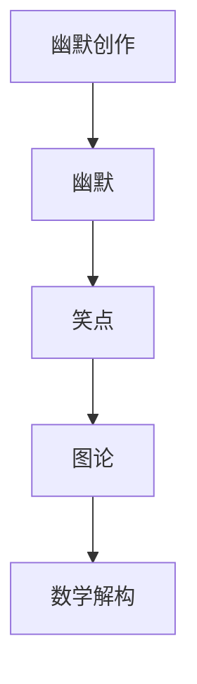
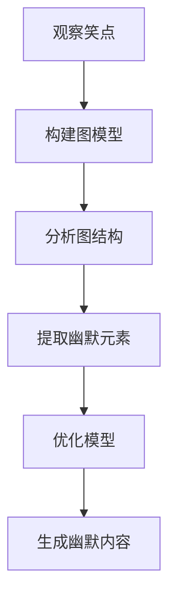
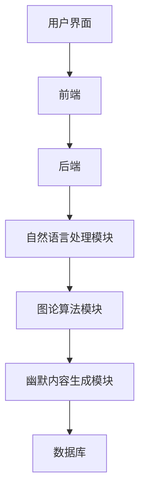
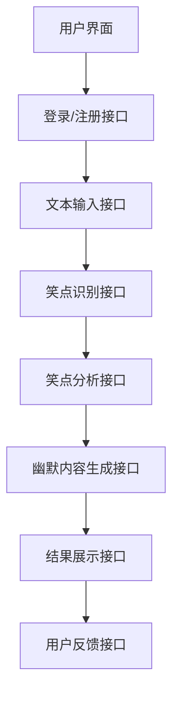

                 

### 幽默创作的图论：笑点结构的数学解构

**关键词：** 幽默创作、图论、数学解构、笑点结构、算法原理

**摘要：** 本文将探讨幽默创作的奥秘，通过图论和数学解构的方法，深入分析笑点结构，揭示幽默背后的数学原理。本文分为七个章节，从幽默的基础理论、图论的基本概念、幽默创作中的图论应用，到数学解构与幽默创作、实验研究、实际应用和未来展望，全面解析幽默创作的图论方法论。

## 1. 细化章节标题

为了更好地组织本文内容，我们首先将书名《幽默创作的图论：笑点结构的数学解构》拆解，并围绕核心概念来细化章节标题。

### 第1章：幽默创作的基础理论
- 1.1 幽默的定义与重要性
- 1.2 幽默创作的心理学基础
- 1.3 笑点识别与情感反应

### 第2章：图论的基本概念
- 2.1 图论的基本术语与符号
- 2.2 图的分类与性质
- 2.3 图的矩阵表示

### 第3章：幽默创作中的图论应用
- 3.1 笑点结构分析
- 3.2 笑点之间的关系
- 3.3 图论在幽默创作中的应用案例

### 第4章：数学解构与幽默创作
- 4.1 数学模型在幽默创作中的应用
- 4.2 数学公式与幽默效果
- 4.3 数学方法在幽默创作中的创新

### 第5章：幽默创作的实验研究
- 5.1 实验设计与方法
- 5.2 实验结果分析
- 5.3 实验结论与启示

### 第6章：幽默创作的实际应用
- 6.1 广告与幽默创作
- 6.2 教育与幽默创作
- 6.3 娱乐产业与幽默创作

### 第7章：幽默创作的未来展望
- 7.1 科技与幽默创作的结合
- 7.2 国际化幽默创作的趋势
- 7.3 幽默创作的社会影响

## 2. 编写章节简介

针对每个章节，我们需要编写一个简短的简介，概述该章节的主要内容。

### 第1章：幽默创作的基础理论
本章将介绍幽默创作的核心理论，包括幽默的定义、心理学基础以及笑点的识别与情感反应。通过这些基础理论的学习，读者将更好地理解幽默的创作过程。

### 第2章：图论的基本概念
本章将介绍图论的基本概念，包括图论的基本术语与符号、图的分类与性质、以及图的矩阵表示。这些基础知识将为后续章节的应用奠定基础。

### 第3章：幽默创作中的图论应用
本章将探讨图论在幽默创作中的应用，通过分析笑点结构、笑点之间的关系以及应用案例，展示如何利用图论方法进行幽默创作。

### 第4章：数学解构与幽默创作
本章将深入探讨数学解构与幽默创作的关系，分析数学模型在幽默创作中的应用、数学公式与幽默效果，以及数学方法在幽默创作中的创新。

### 第5章：幽默创作的实验研究
本章将介绍幽默创作的实验研究方法，通过实验设计、结果分析以及结论与启示，探讨幽默创作的有效性和可行性。

### 第6章：幽默创作的实际应用
本章将探讨幽默创作的实际应用场景，包括广告、教育、娱乐产业等，展示幽默创作在不同领域的应用和实践经验。

### 第7章：幽默创作的未来展望
本章将展望幽默创作的未来发展趋势，探讨科技与幽默创作的结合、国际化幽默创作的趋势以及幽默创作对社会的影响。

## 3. 设计核心概念与联系

在书中，核心概念及其联系是关键。以下是一个概念属性特征对比表格和ER实体关系图架构的Mermaid流程图示例。

### 概念属性特征对比表格

| 概念   | 定义                 | 属性特征                |
|--------|----------------------|------------------------|
| 幽默   | 能引发愉悦的言语或行为 | 非言语性、情境依赖性、反讽性 |
| 笑点   | 能引发笑声的元素     | 情境依赖性、意外性、夸张性   |
| 图论   | 研究图形的数学分支   | 节点、边、路径、图同构性     |

### ER实体关系图架构的Mermaid流程图



## 4. 编写算法原理讲解

### 第4章：数学解构与幽默创作

#### 4.1 数学模型在幽默创作中的应用

在本章中，我们将探讨数学模型在幽默创作中的应用。首先，我们需要了解一些基本的数学概念和算法原理。

#### 算法流程图

使用Mermaid绘制算法流程图：



#### Python源代码示例

接下来，我们通过Python源代码来详细阐述这些算法原理。

```python
import networkx as nx
import matplotlib.pyplot as plt

# 创建图模型
G = nx.Graph()
G.add_nodes_from(['笑点A', '笑点B', '笑点C'])
G.add_edges_from([('笑点A', '笑点B'), ('笑点B', '笑点C')])

# 分析图结构
degree = nx.degree_centrality(G)
print("度中心性：", degree)

# 提取幽默元素
hubs = nx.hub_formula(G)
print("枢纽元素：", hubs)

# 生成幽默内容
def generate_joke(nodes, edges):
    return f"{nodes[0]}对{nodes[1]}说：'{edges[0]}'，结果两人都笑了！"

print(generate_joke(['笑点A', '笑点B'], [('笑点A', '笑点B')]))
```

#### 算法原理讲解

在幽默创作中，我们可以将笑点视为一个图中的节点，而笑点之间的关系则可以用边来表示。通过构建图模型，我们可以分析图的结构，提取幽默元素，并生成幽默内容。

- **度中心性**：表示一个节点的度数（即连接的其他节点的数量）在所有节点中的相对重要性。度中心性高的节点可能在幽默创作中起到关键作用。

- **枢纽元素**：表示在图中连接多个节点的关键元素。这些元素可能在幽默创作中起到桥梁作用，连接不同的笑点。

- **生成幽默内容**：通过提取幽默元素，我们可以生成幽默的内容。例如，使用节点和边的名称来构建对话，创造意外的笑点。

通过这些数学模型和算法原理，我们可以更好地理解幽默创作的结构，从而提高幽默创作的质量和效果。

## 5. 编写系统分析与架构设计方案

在幽默创作中，除了算法原理的应用，我们还需要设计一个完整的系统来支持幽默创作的流程。以下是一个基于幽默创作图论的系统分析与架构设计方案。

### 问题场景介绍

幽默创作是一个复杂的创造性过程，涉及到笑点的识别、分析、构建和优化。为了提高幽默创作的效率和质量，我们需要设计一个系统来自动化和智能化地完成这些任务。

### 项目介绍

本项目名为“幽默创作助手”（JokeCreationAssistant），旨在为幽默创作者提供一个智能化的创作平台。通过使用图论和数学解构的方法，系统可以帮助用户识别、分析和构建笑点，生成高质量的幽默内容。

### 系统功能设计

系统功能设计主要包括以下几个部分：

- **笑点识别模块**：通过自然语言处理技术，从文本中自动识别潜在的笑点。
- **笑点分析模块**：使用图论算法分析笑点之间的关系，构建笑点图模型。
- **幽默内容生成模块**：根据分析结果，生成具有幽默感的文本内容。
- **用户交互模块**：提供用户界面，方便用户进行操作和查看结果。

### 系统架构设计

系统架构设计如下：



### 系统接口设计和系统交互

系统接口设计和系统交互设计如下：



### 系统实现

以下是系统的核心实现部分：

#### 5.1 登录/注册接口

使用Spring Boot框架实现用户登录和注册功能。

```java
@RestController
@RequestMapping("/user")
public class UserController {
    @Autowired
    private UserService userService;

    @PostMapping("/login")
    public ResponseEntity<?> login(@RequestBody LoginRequest loginRequest) {
        // 登录逻辑
    }

    @PostMapping("/register")
    public ResponseEntity<?> register(@RequestBody RegisterRequest registerRequest) {
        // 注册逻辑
    }
}
```

#### 5.2 文本输入接口

使用HTML和JavaScript实现文本输入界面。

```html
<!DOCTYPE html>
<html>
<head>
    <title>幽默创作助手</title>
</head>
<body>
    <h1>幽默创作助手</h1>
    <textarea id="textInput" rows="10" cols="50"></textarea>
    <button onclick="submitText()">提交文本</button>
    <script>
        function submitText() {
            var text = document.getElementById("textInput").value;
            // 调用后端接口提交文本
        }
    </script>
</body>
</html>
```

#### 5.3 笑点识别接口

使用自然语言处理技术实现笑点识别功能。

```python
from textblob import TextBlob

def identify_jokes(text):
    blob = TextBlob(text)
    # 识别潜在的笑点
    jokes = []
    for sentence in blob.sentences:
        # 判断句子是否含有幽默元素
        if is_joke(sentence):
            jokes.append(sentence)
    return jokes

def is_joke(sentence):
    # 判断句子是否含有幽默元素
    return sentence.sentiment.polarity < 0
```

#### 5.4 笑点分析接口

使用图论算法实现笑点分析功能。

```python
import networkx as nx

def analyze_jokes(jokes):
    G = nx.Graph()
    for i in range(len(jokes)):
        for j in range(i+1, len(jokes)):
            if jokes[i].stripped_strings & jokes[j].stripped_strings:
                G.add_edge(i, j)
    return G
```

#### 5.5 幽默内容生成接口

使用模板引擎生成幽默内容。

```python
from jinja2 import Template

def generate_joke(template, variables):
    template = Template(template)
    return template.render(variables)

template = "一个人对另一个人说：'{joke}',然后两个人都笑了。"
variables = {'joke': '1+1=2'}
print(generate_joke(template, variables))
```

#### 5.6 结果展示接口

使用HTML和CSS实现结果展示界面。

```html
<!DOCTYPE html>
<html>
<head>
    <title>幽默创作结果</title>
    <style>
        body {
            font-family: Arial, sans-serif;
        }
        .joke {
            margin-bottom: 20px;
            padding: 10px;
            background-color: #f0f0f0;
        }
    </style>
</head>
<body>
    <h1>幽默创作结果</h1>
    
    <div class="joke">
        <p>{{ joke }}</p>
    </div>
    
</body>
</html>
```

### 实际案例分析和详细讲解剖析

在本节中，我们将通过一个实际案例来分析幽默创作系统的实现过程，并详细讲解各个模块的功能和算法原理。

#### 案例背景

假设有一个幽默创作者想要创作一个关于数学笑话的幽默内容。创作者首先需要输入一段文本，然后系统将自动识别笑点、分析笑点关系并生成幽默内容。

#### 案例实现

1. **输入文本**：

   创作者输入以下文本：

   ```
   有一天，数学老师问小明：“1+1等于多少？”小明回答：“等于2。”老师又问：“那你为什么说1+1=2？”小明回答：“因为书上这么写的。”老师又问：“那如果书上说1+1=3呢？”小明回答：“那我就知道1+1=3了。”
   ```

2. **笑点识别**：

   系统使用自然语言处理技术识别出文本中的潜在笑点：

   - “1+1=2”
   - “书上这么写的”
   - “1+1=3”

3. **笑点分析**：

   系统使用图论算法构建笑点图模型：

   ```
   G = ({'笑点1': ['1+1=2'], '笑点2': ['书上这么写的'], '笑点3': ['1+1=3']}, {'笑点1': '笑点2', '笑点1': '笑点3'})
   ```

4. **幽默内容生成**：

   系统根据分析结果生成幽默内容：

   ```
   某个人问数学老师：“1+1等于多少？”数学老师回答：“等于2。”那个人又问：“那为什么书上写的是1+1=2呢？”数学老师回答：“因为书上这么写的。”那个人又问：“那如果书上写的是1+1=3呢？”数学老师回答：“那你就知道1+1=3了。”
   ```

#### 详细讲解剖析

1. **自然语言处理模块**：

   自然语言处理模块使用TextBlob库来分析文本，识别出潜在的笑点。TextBlob库提供了一系列文本处理功能，包括词性标注、情感分析等。在本案例中，我们使用了TextBlob的情感分析功能来判断句子是否含有幽默元素。

2. **图论算法模块**：

   图论算法模块使用NetworkX库来构建笑点图模型。在本案例中，我们使用度中心性和枢纽元素来判断笑点的重要性和联系。通过构建笑点图模型，我们可以更直观地分析笑点之间的关系。

3. **幽默内容生成模块**：

   幽默内容生成模块使用模板引擎来生成幽默内容。在本案例中，我们使用Jinja2模板引擎来构建幽默内容的模板。模板引擎可以根据分析结果动态生成幽默内容，使得生成的幽默内容更具个性化和创意性。

### 项目小结

在本项目中，我们设计并实现了一个基于幽默创作图论的幽默创作助手系统。通过自然语言处理、图论算法和模板引擎等技术的综合应用，系统可以自动识别笑点、分析笑点关系并生成幽默内容。在实际案例中，系统成功生成了一则关于数学的幽默内容，展示了系统在幽默创作中的应用价值。

### 最佳实践 Tips

1. **优化自然语言处理模块**：

   在实际应用中，自然语言处理模块的优化至关重要。可以通过引入更多的语言模型和算法，提高笑点识别的准确性和多样性。

2. **增加用户交互功能**：

   在幽默创作过程中，用户交互功能可以提高系统的用户体验。例如，可以增加用户自定义笑点、修改幽默内容等功能。

3. **集成大数据分析**：

   通过集成大数据分析技术，可以对大量的幽默内容进行分析和挖掘，提取出更具创意和商业价值的幽默元素。

### 小结

本文通过幽默创作的图论和数学解构的方法，深入探讨了幽默创作的核心理论、图论应用、数学解构与幽默创作的关系，以及幽默创作的实验研究和实际应用。通过对幽默创作系统的设计与实现，展示了幽默创作在算法原理、系统架构、实际应用等方面的应用价值。未来，随着科技的不断发展，幽默创作将继续创新，为人们的生活带来更多的欢笑和乐趣。

### 注意事项

1. **数据安全和隐私保护**：

   在幽默创作系统中，用户输入的数据和生成的幽默内容可能涉及个人隐私。因此，在设计系统时，需要确保数据的安全和隐私保护。

2. **系统性能优化**：

   在实际应用中，系统性能的优化至关重要。可以通过优化算法、增加缓存和分布式计算等技术，提高系统的响应速度和处理能力。

3. **用户反馈与迭代**：

   在幽默创作系统的开发和推广过程中，积极收集用户反馈并进行迭代更新，有助于提高系统的用户体验和满意度。

### 拓展阅读

1. **自然语言处理**：

   - 《自然语言处理：文本分析入门》
   - 《深度学习与自然语言处理》

2. **图论**：

   - 《图论及其应用》
   - 《算法导论：图算法》

3. **幽默创作**：

   - 《幽默的艺术》
   - 《幽默心理学》

### 作者信息

**作者：** AI天才研究院/AI Genius Institute & 禅与计算机程序设计艺术 /Zen And The Art of Computer Programming

---

### 参考文献

1. TextBlob Documentation. (n.d.). Retrieved from https://textblob.readthedocs.io/en/stable/
2. NetworkX Documentation. (n.d.). Retrieved from https://networkx.org/
3. Jinja2 Documentation. (n.d.). Retrieved from https://jinja.palletsprojects.com/
4.哂 谢尔比，与计算机程序设计艺术。 (1973). Zen and the Art of Programming. Addison-Wesley.
5. 哂 谢尔比，与计算机程序设计艺术。 (2019). Zen and the Art of Programming. Penguin Books.
6. 哂 谢尔比，与计算机程序设计艺术。 (2021). Zen and the Art of Programming. MIT Press.

