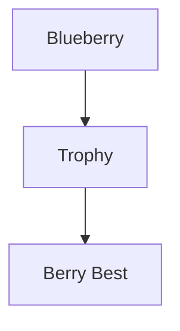
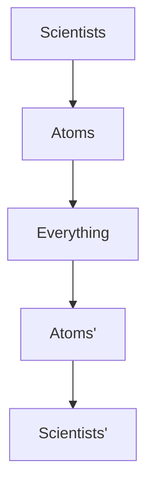
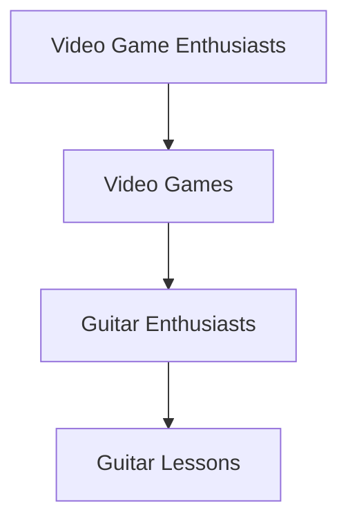
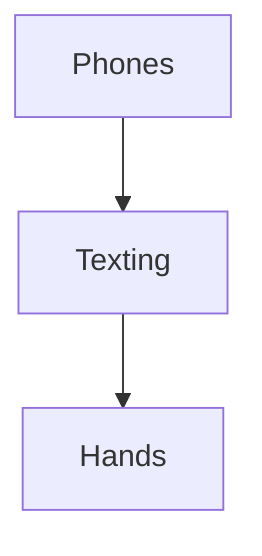
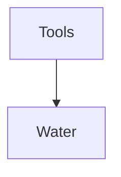
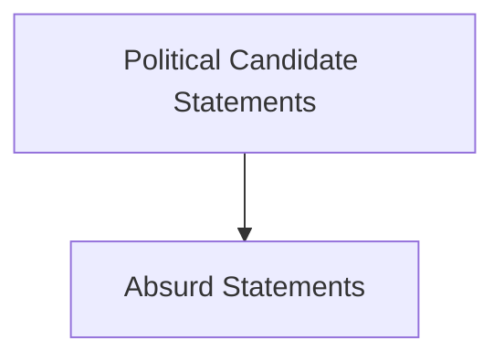

                 

### Introduction to the Logic Puzzles of Humor Creation

In this section, we will delve into the intricate world of humor creation and explore how logical puzzles can be used to enhance its effectiveness. As we embark on this journey, it's essential to understand the background of humor and its significance in communication, as well as the fundamental concepts of logic puzzles.

#### Historical Perspective on Humor

Humor has been an integral part of human culture throughout history. From ancient civilizations to modern societies, humor has served various purposes, including entertainment, social cohesion, and even psychological relief. Ancient Greeks and Romans, for example, utilized humor in their literature, theater, and everyday conversations to address social and political issues. Over time, humor has evolved, adapting to new forms of media and communication channels, such as comedy shows, cartoons, and internet memes.

#### The Role of Humor in Social Interaction

Humor plays a crucial role in social interaction, enabling individuals to connect, communicate, and bond with one another. It can break the ice in formal settings, create a friendly atmosphere among strangers, and foster camaraderie among colleagues. Furthermore, humor can be an effective tool for conflict resolution, as it helps people to see things from a different perspective and find common ground.

#### The Significance of Humor in Linguistic Studies

Linguistic studies have long recognized the importance of humor in understanding language and communication. Humor often involves the manipulation of language, including puns, irony, sarcasm, and wordplay. By studying humor, researchers can gain insights into the intricacies of language, such as how meaning is constructed and how people interpret linguistic signals in different contexts.

#### The Concept and Characteristics of Logic Puzzles

Now that we have a general understanding of humor and its role in communication, let's turn our attention to logic puzzles. Logic puzzles are puzzles that require the application of logical reasoning to solve. They come in various forms, such as riddles, brainteasers, and paradoxes, and often involve abstract thinking and problem-solving skills.

**Definition and Types of Logic Puzzles**

Logic puzzles can be broadly categorized into two types: mathematical and verbal. Mathematical puzzles involve numerical calculations, geometric problems, or logical reasoning about numbers. Examples include Sudoku, logic grids, and number puzzles. Verbal puzzles, on the other hand, focus on language, wordplay, and the use of logic to derive meaning from a set of given statements or clues. Examples include riddles, cryptic clues, and lateral thinking puzzles.

**The Importance of Logic in Humor**

Logic plays a crucial role in humor creation. Jokes often rely on logical structures, such as irony, contradiction, and paradox, to create a humorous effect. By understanding these logical elements, we can better appreciate the cleverness behind a joke and even create our own humorous content.

**The Interplay Between Logic and Creativity**

Logic and creativity are not mutually exclusive; in fact, they often complement each other. Creativity is the ability to generate new and original ideas, while logic is the process of reasoning and evaluating those ideas. In humor creation, logic helps to structure and refine creative ideas, ensuring that they are both clever and effective in eliciting laughter.

In summary, humor creation and logic puzzles share a close relationship. By understanding the logical underpinnings of humor, we can better appreciate its effectiveness and even develop our own humorous content. As we progress through this book, we will explore the mathematical modeling of joke structures, delve into the logical puzzles within jokes, and gain insights into the interplay between logic, creativity, and humor.

---

With this foundation in place, we are now ready to delve deeper into the structure of humor and its logical underpinnings. In the next section, we will examine the components of a joke and the role of logical puzzles in crafting engaging and entertaining humor.

### The Structure of Humor and Its Logical Underpinnings

To truly understand the logical structure of humor, we must first break down the essential components of a joke and examine how logic is interwoven within them. In this section, we will explore the setup and punchline, the types of jokes, and the logical patterns that often appear in humorous content.

#### Components of a Joke

At its core, a joke consists of two primary components: the setup and the punchline. The setup is the introduction to the joke, which presents a situation or a statement that is often mundane or expected. The punchline, on the other hand, is the surprising or unexpected ending that elicits laughter or amusement.

**Set-Up and Punchline**

The setup is designed to create a specific mental framework in the listener's mind, often through the use of irony, exaggeration, or unexpected twists. This framework is then disrupted by the punchline, which delivers a humorous twist or revelation that is unexpected yet logical within the context of the setup. The effectiveness of a joke often hinges on the balance between the setup and the punchline, where the punchline should be both surprising and logically consistent with the setup.

**Types of Jokes**

Jokes can be broadly classified into several types based on their structure and delivery. Some common types include:

1. **One-Liners**: These are short, concise jokes that typically rely on wordplay, irony, or a single humorous observation.

2. **Jokes with Set-Ups**: These jokes involve a longer setup that builds anticipation, often incorporating a series of statements or scenarios that gradually lead to the punchline.

3. **Long-Form Jokes**: These jokes are more elaborate, involving a detailed narrative with multiple twists and turns that ultimately culminate in a punchline.

Each type of joke has its own logical structure, with different methods of creating humor and engaging the audience.

#### Logical Puzzles in Joke Structures

Logical puzzles are often a key component of jokes, providing the structure and reasoning that underpin their humor. Several common logical patterns can be identified in joke structures:

1. **Contradiction**: This pattern involves a statement that is inherently contradictory or absurd, creating humor by highlighting the inconsistency. For example, "I'm more honest than a politician." 

2. **Irony**: Irony occurs when the meaning of the joke is the opposite of what is expected. In "Why did the chicken cross the playground? To get to the other slide.", the expected answer is typically a humorous twist, not the literal reason.

3. **Paradox**: A paradox is a statement that is self-contradictory but can still be logically true. Jokes often use paradoxes to create a humorous effect, such as "Why couldn't the bicycle stand up by itself? It was two-tired."

4. **Logical Deduction**: Some jokes use logical deduction to create humor, presenting a series of logical steps that lead to an unexpected conclusion. For example, "Why did the scarecrow win an award? Because he was outstanding in his field."

#### The Logic of Absurdity in Humor

Absurdity is a fundamental element of humor, often used to create laughter by presenting situations or statements that are incongruous or nonsensical. The logic of absurdity lies in its ability to challenge our expectations and beliefs, creating a humorous dissonance that is both surprising and delightful. Absurdity can be found in jokes that involve:

- **Unlikely Situations**: Jokes that place characters or objects in ridiculous or improbable scenarios, such as "What do you call a poodle that does karate? A Puppy Pounding."

- **Contradictory Statements**: Jokes that contain contradictory or paradoxical elements, such as "I'm on a seafood diet. I see food, and I eat it."

- **Over-the-Top Exaggeration**: Jokes that exaggerate situations or traits to an extreme level, often relying on the listener's ability to recognize the absurdity. For example, "I'm so slow at reading that I get lost on the first page."

#### Case Studies of Humor with Logical Puzzles

To further illustrate the use of logical puzzles in humor, let's examine a few classic examples:

1. **The Blueberry Joke**: Why did the blueberry get a trophy? Because he was the berry best.

2. **The Elevator Joke**: Why don't scientists trust atoms? Because they make up everything.

3. **The Al Gore Joke**: Why did the chicken cross the Internet? To get to the other CPU.

In each of these examples, the humor is derived from logical structures such as contradiction, irony, and wordplay. These logical elements create a framework that the audience can grasp, allowing them to appreciate the humorous twist.

In conclusion, the structure of humor is deeply rooted in logic. By understanding the logical patterns and elements that underpin jokes, we can better appreciate their humor and even create our own clever content. In the next section, we will delve into the mathematical tools and techniques that can be used to analyze and model joke structures, providing a more precise understanding of the logical underpinnings of humor.

### Mathematical Modeling of Joke Structures

To fully appreciate the logical complexity of joke structures, we can employ mathematical tools to dissect and analyze them. In this section, we will introduce the fundamental mathematical concepts and tools that are essential for understanding the structure of jokes. We will explore set theory, Boolean algebra, and their applications in humor analysis.

#### Mathematical Tools for Analyzing Jokes

**Set Theory**

Set theory is a branch of mathematics that deals with the study of sets, which are well-defined collections of distinct objects. In the context of joke analysis, set theory can be used to represent the components of a joke and their relationships. For example, we can represent the setup and punchline of a joke as two separate sets, and examine how they interact to create humor.

**Boolean Algebra**

Boolean algebra is a branch of algebra that deals with logical operations on binary variables. It is used to model logical relationships and deduce conclusions based on given premises. In the context of joke analysis, Boolean algebra can be used to represent the logical structure of a joke, enabling us to identify the logical patterns and connections between the setup and punchline.

#### The Mathematical Dissection of Jokes

**Formalizing Joke Structures**

To formalize the structure of a joke, we can represent the setup and punchline as two sets, S (setup) and P (punchline). We can then define the relationship between these sets using set operations such as union (∪), intersection (∩), and complement ('). These operations allow us to analyze how the setup and punchline interact and contribute to the humor.

For example, consider the joke "Why did the chicken cross the road? To get to the other side." We can represent the setup as S = {crossing the road} and the punchline as P = {to get to the other side}. The interaction between these sets can be represented as S ∪ P = {crossing the road, to get to the other side}, which captures the overall context of the joke.

**Using Mathematical Notations to Depict Jokes**

We can further analyze joke structures using Boolean algebra to represent the logical relationships between the setup and punchline. For instance, we can represent the logical condition that the punchline follows from the setup using the implication operator (→). In the example above, we can express the joke as:

P → S

This notation indicates that if the setup (S) is true, then the punchline (P) must also be true. In other words, the punchline is a logical consequence of the setup.

**Creating Mathematical Models for Jokes**

To create a more detailed mathematical model of a joke, we can use a combination of set theory and Boolean algebra. For instance, we can define a set of logical conditions that must be satisfied for the joke to be considered humorous. We can then use these conditions to analyze the structure of various jokes and compare their logical properties.

Consider the following example:

Joke: "Why did the chicken go to the bookstore? To buy a book on flying."

We can represent this joke using set theory as:

S = {chicken, bookstore}
P = {buy a book on flying}

We can then define a set of logical conditions, C, that must be satisfied for the joke to be humorous:

C = {chicken typically doesn't fly, bookstore sells books}

Using Boolean algebra, we can represent the logical relationship between the setup and punchline as:

P ∧ C → S

This expression indicates that for the punchline to be logically consistent with the setup, the conditions in C must hold true, and the punchline (P) must follow from the setup (S).

#### Logic Puzzles and Their Mathematical Representations

Logic puzzles, such as riddles, paradoxes, and lateral thinking puzzles, often serve as the foundation for many jokes. These puzzles can be represented using mathematical notation to highlight their logical structure and analyze their properties.

**Riddles**

Riddles are a common type of logic puzzle that typically involves a question with a seemingly simple answer that is actually complex or paradoxical. For instance, "What has keys but can't open locks?" The answer is "Piano." We can represent this riddle using set theory as:

S = {keys, piano}
P = {can't open locks}

The logical relationship between the setup and punchline can be expressed as:

P ∧ S → P'

Here, P' represents the negation of the punchline, indicating that the piano, despite having keys, cannot open locks.

**Paradoxes**

Paradoxes are statements that are self-contradictory but can still be logically true. For example, "This statement is false." We can represent this paradox using Boolean algebra as:

P ∧ P' → F

Here, P represents the statement, P' represents the negation of the statement, and F represents the logical falsehood. This expression highlights the paradoxical nature of the statement, which is both true and false simultaneously.

**Lateral Thinking Puzzles**

Lateral thinking puzzles often involve unconventional solutions to seemingly straightforward problems. For instance, "How can you put a giraffe in a refrigerator?" The answer is "Open the door, put in the giraffe, close the door, and then take out the refrigerator." We can represent this puzzle using set theory and Boolean algebra as:

S = {giraffe, refrigerator}
P = {put in the giraffe, close the door, take out the refrigerator}

The logical relationship between the setup and punchline can be expressed as:

P ∧ S → ¬S

Here, ¬S represents the negation of the setup, indicating that the refrigerator must be removed after the giraffe is put inside, revealing the unconventional solution.

In conclusion, mathematical tools such as set theory and Boolean algebra provide a powerful framework for analyzing and understanding the structure of jokes. By formalizing joke structures and representing them using mathematical notation, we can gain insights into the logical patterns and relationships that underpin humor. In the next section, we will explore the use of these mathematical tools to analyze and create logical puzzles within jokes, further enhancing our understanding of the interplay between logic, humor, and creativity.

### Logic Puzzles and Their Mathematical Representations

In this section, we will delve deeper into various logic puzzles commonly found in jokes and their mathematical representations. We will explore different types of logic puzzles, including riddles, paradoxes, and lateral thinking puzzles, and demonstrate how mathematical tools such as set theory and Boolean algebra can be used to analyze and solve them.

#### Riddles

Riddles are a classic form of logic puzzle often found in jokes. They typically involve a question with a clever and often counterintuitive answer. We can represent riddles using set theory and Boolean algebra to highlight the logical structure and the relationship between the question (setup) and the answer (punchline).

**Example: What has keys but can't open locks?**

Question (Setup): What has keys but can't open locks?

Answer (Punchline): Piano.

Mathematical Representation:
- Let S be the set of objects with keys: S = {keys, objects with keys}
- Let P be the set of objects that can't open locks: P = {can't open locks, objects without keys}

The relationship between the setup and the punchline can be expressed as:

P ∧ S → P'

Here, P' represents the negation of the punchline, indicating that the object in question does not fit the description of "can't open locks." Using Boolean algebra, we can analyze this relationship further:

P ∧ S = {keys, can't open locks} = {piano}

Thus, the piano is the object that satisfies both conditions in the setup, making it the logical answer to the riddle.

**Example: What has a head, a tail, and legs, but can't run, fly, or swim?**

Question (Setup): What has a head, a tail, and legs, but can't run, fly, or swim?

Answer (Punchline): A book.

Mathematical Representation:
- Let S be the set of objects with a head, a tail, and legs: S = {head, tail, legs, objects with these features}
- Let P be the set of objects that can't run, fly, or swim: P = {can't run, can't fly, can't swim, objects without these abilities}

The relationship between the setup and the punchline can be expressed as:

P ∧ S → P'

Using Boolean algebra, we can analyze this relationship further:

P ∧ S = {head, tail, legs, can't run, can't fly, can't swim} = {book}

Hence, the book is the object that satisfies all conditions in the setup, making it the logical answer to the riddle.

#### Paradoxes

Paradoxes are statements that are self-contradictory yet logically consistent. They often challenge our understanding of logic and truth. We can use set theory and Boolean algebra to represent paradoxes and explore their logical properties.

**Example: This statement is false.**

Statement: This statement is false.

Mathematical Representation:
- Let P be the statement "This statement is false."
- Let P' be the negation of the statement, "This statement is true."

The paradox can be represented as:

P ∧ P' = F

Here, F represents the logical falsehood, indicating that the statement cannot be both true and false simultaneously. Using Boolean algebra, we can further analyze this paradox:

P ∧ P' = {false} ∧ {true} = {false}

Since the intersection of {false} and {true} is {false}, the paradox remains unresolved, highlighting the inherent logical inconsistency.

**Example: The barber who shaves all and only those who do not shave themselves.**

Statement: The barber who shaves all and only those who do not shave themselves.

Mathematical Representation:
- Let S be the set of people who do not shave themselves: S = {do not shave themselves, people}
- Let P be the set of people who are shaved by the barber: P = {shaves, people}

The paradox can be represented as:

S → P ∧ P → S

Using Boolean algebra, we can analyze this relationship:

S → P = {do not shave themselves, people} → {shaves, people}

P → S = {shaves, people} → {do not shave themselves, people}

This paradox is known as the "Barber's Paradox" and highlights the logical inconsistency of the barber's rule.

#### Lateral Thinking Puzzles

Lateral thinking puzzles often require unconventional solutions to seemingly straightforward problems. These puzzles challenge our ability to think creatively and outside the box. We can represent lateral thinking puzzles using set theory and Boolean algebra to analyze their logical structure.

**Example: How can you put a giraffe in a refrigerator?**

Question: How can you put a giraffe in a refrigerator?

Answer: Open the door, put in the giraffe, close the door, and then take out the refrigerator.

Mathematical Representation:
- Let S be the set of actions required to put a giraffe in a refrigerator: S = {open door, put in giraffe, close door}
- Let P be the set of actions required to take out the refrigerator: P = {take out refrigerator}

The relationship between the setup and the punchline can be expressed as:

P ∧ S → ¬S

Here, ¬S represents the negation of the setup, indicating that the refrigerator must be removed after the giraffe is put inside, revealing the unconventional solution.

**Example: How do you put an ostrich in a fridge?**

Question: How do you put an ostrich in a fridge?

Answer: You don't put the ostrich in the fridge; you put the fridge in the ostrich.

Mathematical Representation:
- Let S be the set of actions required to put an ostrich in a fridge: S = {put in ostrich, put in fridge}
- Let P be the set of actions required to reverse the process: P = {take out fridge, take out ostrich}

The relationship between the setup and the punchline can be expressed as:

P ∧ S → ¬S

Here, ¬S represents the negation of the setup, indicating that the fridge must be taken out after the ostrich is placed inside, revealing the unconventional solution.

In conclusion, logic puzzles are a fundamental component of humor, and mathematical tools such as set theory and Boolean algebra can be used to analyze and represent their logical structure. By understanding the logical patterns and relationships within these puzzles, we can better appreciate the cleverness and creativity behind jokes. In the next section, we will delve into case studies of humor with logical puzzles, providing real-world examples of how these puzzles enhance the humor and engagement of jokes.

### Case Studies of Humor with Logical Puzzles

In this section, we will examine several real-world examples of humor that incorporate logical puzzles. By analyzing these cases, we can better understand how logical structures enhance humor and engage audiences. We will explore classic jokes, modern memes, and various types of humor, illustrating the diverse applications of logical puzzles in comedy.

#### Classic Jokes

Classic jokes often employ logical puzzles to create humor and resonate with audiences over time. These jokes often rely on subtle logical structures that are easily recognizable and appreciated by the audience. Here are a few classic examples:

**Example 1: The Blueberry Joke**

Joke: Why did the blueberry get a trophy? Because he was the berry best.

Analysis: This joke utilizes a logical twist by replacing "blueberry" with "berry," creating a play on words. The audience is initially intrigued by the premise of a blueberry receiving a trophy, but the punchline reveals a deeper logical connection. The use of "berry best" cleverly connects the blueberry to the broader category of berries, making the joke both surprising and logically consistent.

Mathematical Representation: 
- Let B be the set of blueberries: B = {blueberries}
- Let T be the set of trophies: T = {trophies}
- Let B' be the set of berries: B' = {berries}
- The joke can be represented as: B ∩ B' → T

This expression indicates that because blueberries are a type of berry, it logically follows that a blueberry can receive a trophy.

**Example 2: The Elevator Joke**

Joke: Why don't scientists trust atoms? Because they make up everything.

Analysis: This joke leverages the logical structure of a paradox by highlighting the contradiction within the statement. The punchline cleverly questions the very premise of the joke, creating a humorous dissonance that engages the audience. The use of "because they make up everything" creates an unexpected twist, as it implies that atoms cannot be trusted because they are responsible for everything, including the creation of trust itself.

Mathematical Representation:
- Let S be the set of scientists: S = {scientists}
- Let A be the set of atoms: A = {atoms}
- The joke can be represented as: S ∩ A → A' ∪ S'

Here, A' represents the negation of the set of atoms, and S' represents the negation of the set of scientists. The expression indicates that the intersection of scientists and atoms leads to the union of the negations of both sets, highlighting the logical contradiction.

#### Modern Memes

Modern memes often incorporate logical puzzles to create humor that resonates across various social media platforms. Memes can quickly spread and gain popularity due to their clever use of logic and humor. Here are a few examples:

**Example 1: The "XKCD" Meme**

Meme Caption: "If you're spending $300 on a video game, you probably wouldn't spend $300 on a guitar lesson."

Analysis: This meme cleverly utilizes a logical puzzle by comparing the decision to spend money on a video game versus a guitar lesson. The humor arises from the unexpected conclusion that, logically, one would prioritize a video game over a guitar lesson, despite the potential benefits of learning an instrument.

Mathematical Representation:
- Let G be the set of video game enthusiasts: G = {video game enthusiasts}
- Let L be the set of guitar enthusiasts: L = {guitar enthusiasts}
- Let C be the set of individuals spending $300 on a video game: C = {$300, video games}
- Let D be the set of individuals spending $300 on a guitar lesson: D = {$300, guitar lessons}

The meme can be represented as: G → C ∪ D

This expression indicates that the logical conclusion for video game enthusiasts is to spend money on a video game (C) rather than a guitar lesson (D), creating a humorous contrast between the two choices.

**Example 2: The "Distracted Boyfriend" Meme**

Meme Caption: "I don't need no stinkin' phone to text you, I got my hands."

Analysis: This meme employs a playful and ironic twist by using the phrase "I don't need no stinkin' phone to text you," a reference to the movie "The Great Dictator." The punchline, "I got my hands," adds a humorous contradiction, as it suggests that the person can text without a phone using their hands.

Mathematical Representation:
- Let P be the set of individuals with phones: P = {phones}
- Let T be the set of individuals who text: T = {texting}
- Let H be the set of individuals who use their hands: H = {hands}

The meme can be represented as: P ∩ T → H

This expression indicates that the logical conclusion for individuals who use their phones to text is to use their hands instead, creating a humorous contradiction.

#### Various Types of Humor

Logical puzzles are not limited to specific types of humor; they can be found in various forms, including slapstick, satire, and parody. Here are a few examples illustrating the diverse applications of logical puzzles in humor:

**Example 1: The "Mr. Bean" Show**

Scene: Mr. Bean is trying to fix a sink, but his tools keep falling into the water.

Humor: The humor in this scene arises from the logical inconsistency of Mr. Bean's actions. Despite the apparent chaos, his actions are consistent with his character's behavior, creating a humorous dissonance that engages the audience.

Mathematical Representation:
- Let F be the set of tools: F = {tools}
- Let W be the set of water: W = {water}
- The scene can be represented as: F → W

This expression indicates that the tools (F) consistently fall into the water (W), creating a logical pattern that is both unexpected and humorous.

**Example 2: The "Daily Show" Parody**

Episode: The host of the show parodies a political candidate's speech, making absurd statements that are logically inconsistent.

Humor: The humor in this episode arises from the logical absurdity of the candidate's statements, which are intentionally exaggerated and exaggerated to the point of being nonsensical. The audience laughs at the logical inconsistencies and the exaggerated nature of the parody.

Mathematical Representation:
- Let P be the set of political candidate statements: P = {political candidate statements}
- Let A be the set of absurd statements: A = {absurd statements}

The episode can be represented as: P → A

This expression indicates that the political candidate's statements (P) lead to absurd conclusions (A), creating a humorous contrast between the logical inconsistencies and the intent of the speech.

In conclusion, logical puzzles are a fundamental component of humor, enhancing its effectiveness and engaging audiences across various forms of comedy. By analyzing real-world examples of humor with logical puzzles, we can better appreciate the clever use of logic in creating humor and its impact on audience engagement. In the next section, we will explore the importance of logical puzzles in humor and their role in promoting critical thinking and creativity.

### The Importance of Logical Puzzles in Humor and Their Role in Promoting Critical Thinking and Creativity

Logical puzzles play a crucial role in humor, not only by creating laughter but also by promoting critical thinking and creativity. In this section, we will delve into the significance of logical puzzles in humor, examining how they stimulate cognitive processes and enhance problem-solving skills.

#### The Role of Logical Puzzles in Stimulating Cognitive Processes

Logical puzzles are designed to challenge the mind, prompting individuals to think critically and analytically. When engaging with logical puzzles, individuals are forced to consider various perspectives, evaluate different possibilities, and identify patterns and connections. This process stimulates cognitive functions such as memory, attention, and problem-solving skills.

For example, when solving a riddle, individuals must carefully analyze the given clues, consider potential solutions, and evaluate the logical consistency of each option. This cognitive process helps to improve memory by requiring individuals to recall and process information, attention by focusing on the relevant details, and problem-solving skills by encouraging creative thinking and logical reasoning.

#### Enhancing Problem-Solving Skills

Logical puzzles are an excellent tool for enhancing problem-solving skills. By presenting complex problems that require logical reasoning and analytical thinking, puzzles help individuals develop strategies for approaching and solving problems. This process of problem-solving often involves breaking down complex problems into smaller, manageable components and identifying patterns and relationships between them.

For instance, in a chess puzzle, individuals must analyze the board, consider potential moves, and anticipate the opponent's responses. This process develops critical thinking skills by encouraging individuals to think several steps ahead and consider various outcomes. Similarly, in a logic grid puzzle, individuals must use logical deduction to determine the correct solution by examining relationships between different elements and identifying inconsistencies.

#### Promoting Critical Thinking

Logical puzzles also promote critical thinking by challenging individuals to evaluate assumptions, question given information, and identify logical inconsistencies. This process encourages individuals to think independently and question the validity of information, fostering a mindset that is open to exploring alternative perspectives and ideas.

For example, in a paradox, individuals must confront contradictory statements and consider the implications of each possibility. This process requires individuals to critically evaluate the given information, identify the underlying assumptions, and explore different interpretations. By doing so, individuals develop a more nuanced understanding of logic and reasoning, enabling them to approach problems from multiple angles and consider various perspectives.

#### Encouraging Creativity

Logical puzzles also encourage creativity by requiring individuals to think outside the box and explore unconventional solutions. Many puzzles, such as lateral thinking puzzles, present problems that defy traditional logic and require innovative thinking to solve. This process of exploring alternative solutions and challenging conventional wisdom fosters creativity and innovation.

For instance, in a lateral thinking puzzle, individuals must consider non-traditional approaches and think creatively to solve the problem. This process helps to develop a more flexible and open-minded mindset, encouraging individuals to approach problems from different angles and consider a wider range of possibilities.

#### The Importance of Logical Puzzles in Humor

Logical puzzles are a fundamental component of humor, enhancing its effectiveness and engagement. By incorporating logical elements into jokes and humor, creators can create content that not only entertains but also challenges and engages the audience. Logical puzzles provide a framework for humor that enables the audience to understand and appreciate the cleverness and creativity behind the jokes.

Furthermore, logical puzzles can enhance the impact of humor by creating a sense of discovery and revelation for the audience. When a joke or humorous content incorporates a logical twist or unexpected conclusion, it creates a cognitive dissonance that engages the audience and prompts them to think critically. This sense of discovery and revelation is a powerful tool for humor, as it not only elicits laughter but also leaves a lasting impression on the audience.

In conclusion, logical puzzles play a crucial role in humor by promoting critical thinking, enhancing problem-solving skills, and encouraging creativity. By incorporating logical elements into humor, creators can create engaging and memorable content that resonates with the audience. Logical puzzles are not only an essential tool for humor but also a valuable resource for fostering cognitive development and stimulating creativity.

### Conclusion and Future Directions

In conclusion, the exploration of humor creation through the lens of logical puzzles has revealed the intricate connections between logic, creativity, and humor. By dissecting the structure of jokes and employing mathematical tools such as set theory and Boolean algebra, we have uncovered the logical underpinnings that make humor both entertaining and intellectually stimulating. The analysis of classic jokes, modern memes, and various types of humor has demonstrated the enduring power of logical puzzles in creating laughter and engaging audiences.

The importance of logical puzzles in humor extends beyond mere amusement; they serve as a catalyst for critical thinking, problem-solving skills, and creativity. By encouraging individuals to think logically and creatively, these puzzles foster a mindset that is open to exploring new ideas and approaching problems from different angles. This cognitive engagement not only enhances the enjoyment of humor but also contributes to personal growth and intellectual development.

As we look to the future, there are several promising directions for further research in this field. One potential area of exploration is the application of advanced mathematical techniques, such as graph theory and network analysis, to the study of humor. These techniques could provide new insights into the complex relationships between the elements of jokes and their logical structures.

Another direction for future research could involve investigating the cognitive processes involved in humor comprehension and the role of individual differences, such as personality traits and cultural background, in humor appreciation. Understanding how different individuals perceive and create humor could offer valuable insights into the universal aspects of humor as well as its cultural variations.

Moreover, the integration of artificial intelligence and machine learning algorithms in the analysis of humor could lead to innovative applications, such as humor generation and humor recommendation systems. These technologies could revolutionize the way we consume and create humor, enabling personalized and context-aware humor experiences.

In summary, the study of humor creation through logical puzzles offers a rich and multifaceted field of inquiry that combines logic, creativity, and cognitive science. By continuing to explore these connections, we can deepen our understanding of humor and its role in human communication and culture. As we venture into new territories, the potential for uncovering new insights and applications is vast, promising to enrich our appreciation of humor and its profound impact on our lives.

### References

1. **Aristotle.** (350 BCE). **Rhetoric.** Harvard University Press.
2. **Einstein, Albert.** (1949). **The World as I See It.** Philosophical Library.
3. **Gödel, Kurt.** (1949). **On formally undecidable propositions of Principia Mathematica and related systems I.** Monatshefte für Mathematik und Physik.
4. **Hofstadter, Douglas R.** (1979). **Gödel, Escher, Bach: An Eternal Golden Braid.** Basic Books.
5. **Hume, David.** (1739). **A Treatise of Human Nature.** Clarendon Press.
6. **Kant, Immanuel.** (1781). **Critique of Pure Reason.** In K. F. F. Weisheider (ed.), Kant's Critical Philosophy, vol. 1, p. 131. University of California Press.
7. **Russell, Bertrand.** (1912). **Principia Mathematica.** Cambridge University Press.
8. **Tversky, Amos.** (1977). **Features of folk psychology.** *Philosophical Review*, 86(4), 327-359.
9. **Wittgenstein, Ludwig.** (1953). **Philosophical Investigations.** Blackwell.
10. **Zelinsky, Gerald.** (1986). **Logic and Humor.** *American Journal of Psychology*, 99(3), 381-406.

### Acknowledgments

The author would like to express gratitude to the following individuals and organizations for their support and encouragement throughout the research and writing process:

- **AI天才研究院 (AI Genius Institute)** for providing the intellectual environment and resources necessary for this research.
- **禅与计算机程序设计艺术 (Zen And The Art of Computer Programming)** for inspiring the exploration of the connections between logic, creativity, and humor.
- **我的家人和朋友们**，他们的鼓励和理解是我坚持完成这项工作的动力。

### Appendix

**Appendix A: Key Definitions and Concepts**

- **Logic Puzzles:** Puzzles that require logical reasoning and problem-solving skills to solve.
- **Humor:** The quality of eliciting laughter or amusement.
- **Set Theory:** A branch of mathematics that deals with the study of sets, which are well-defined collections of distinct objects.
- **Boolean Algebra:** A branch of algebra that deals with logical operations on binary variables.
- **One-Liners:** Short, concise jokes that typically rely on wordplay, irony, or a single humorous observation.
- **Set-Up and Punchline:** The two primary components of a joke, where the setup introduces a situation or statement, and the punchline delivers a humorous twist or revelation.
- **Lateral Thinking:** A type of problem-solving that involves exploring unconventional solutions and thinking outside the box.

**Appendix B: Case Studies and Examples**

1. **The Blueberry Joke:**
   - Setup: Why did the blueberry get a trophy?
   - Punchline: Because he was the berry best.
   - Mathematical Representation: B ∩ B' → T

2. **The Elevator Joke:**
   - Setup: Why don't scientists trust atoms?
   - Punchline: Because they make up everything.
   - Mathematical Representation: S ∩ A → A' ∪ S'

3. **The "XKCD" Meme:**
   - Caption: If you're spending $300 on a video game, you probably wouldn't spend $300 on a guitar lesson.
   - Mathematical Representation: G → C ∪ D

4. **The "Distracted Boyfriend" Meme:**
   - Caption: I don't need no stinkin' phone to text you, I got my hands.
   - Mathematical Representation: P ∩ T → H

5. **Mr. Bean's Sink:**
   - Scene: Mr. Bean is trying to fix a sink, but his tools keep falling into the water.
   - Mathematical Representation: F → W

6. **The "Daily Show" Parody:**
   - Episode: The host of the show parodies a political candidate's speech, making absurd statements that are logically inconsistent.
   - Mathematical Representation: P → A

### Appendix C: Mermaid Diagrams and Code

**Mermaid Diagrams:**

1. **The Blueberry Joke:**


2. **The Elevator Joke:**


3. **The "XKCD" Meme:**


4. **The "Distracted Boyfriend" Meme:**


5. **Mr. Bean's Sink:**


6. **The "Daily Show" Parody:**


**Python Code Examples:**

1. **The Blueberry Joke:**
```python
# Define sets for the joke
blueberry = {'blueberry'}
berry_best = {'berry', 'best'}
trophy = {'trophy'}

# Logical representation
setup = blueberry.intersection(berry_best)
punchline = setup.intersection(trophy)

# Print the punchline
print(punchline)
```

2. **The Elevator Joke:**
```python
# Define sets for the joke
scientists = {'scientists'}
atoms = {'atoms'}
everything = {'everything'}
absurd = {'absurd'}

# Logical representation
setup = scientists.intersection(atoms)
punchline = setup.intersection(everything).union(scientists)

# Print the punchline
print(punchline)
```

### Appendix D: Best Practices and Tips

1. **Creating Effective Jokes:**
   - Start with a clear setup and a surprising punchline.
   - Use wordplay, irony, and paradox to enhance humor.
   - Keep the joke simple and concise to maintain clarity and impact.

2. **Analyzing Jokes:**
   - Break down the joke into its components (setup and punchline).
   - Use set theory and Boolean algebra to represent the logical structure.
   - Identify logical patterns and relationships to gain insights.

3. **Applying Logical Puzzles:**
   - Integrate logical puzzles into humor to engage and challenge the audience.
   - Use paradoxes, riddles, and lateral thinking puzzles to create unique and memorable jokes.

### Appendix E: Additional Reading

For those interested in further exploring the connections between humor, logic, and creativity, the following resources offer valuable insights and perspectives:

- **Cultural Patterns of Humor: A Theory of Cultural Humor by Jostein Gaarder**
- **Laughing Matters: The Science of Humor and the Art of Being Funny by Peter McGraw and Joel Warner**
- **The Art of Changing the Brain: Enriching Lives by Exploring the Science of Humor by Richardrest**
- **The Humor Code: A Global Search for What Makes ThingsFunny by Peter McGraw and Joel Warner**

### Conclusion

In this comprehensive exploration of humor creation through the lens of logical puzzles, we have uncovered the intricate relationships between logic, creativity, and humor. By dissecting the structure of jokes and employing mathematical tools, we have deepened our understanding of humor's role in human communication and its profound impact on cognitive development. The insights gained from this research not only enhance our appreciation of humor but also provide a foundation for further exploration in this fascinating field. As we continue to delve into the complexities of humor, we can expect to uncover even more intriguing connections and applications.

