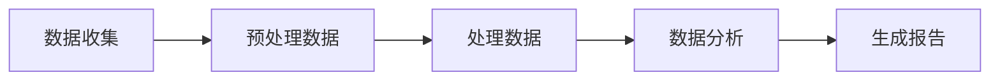
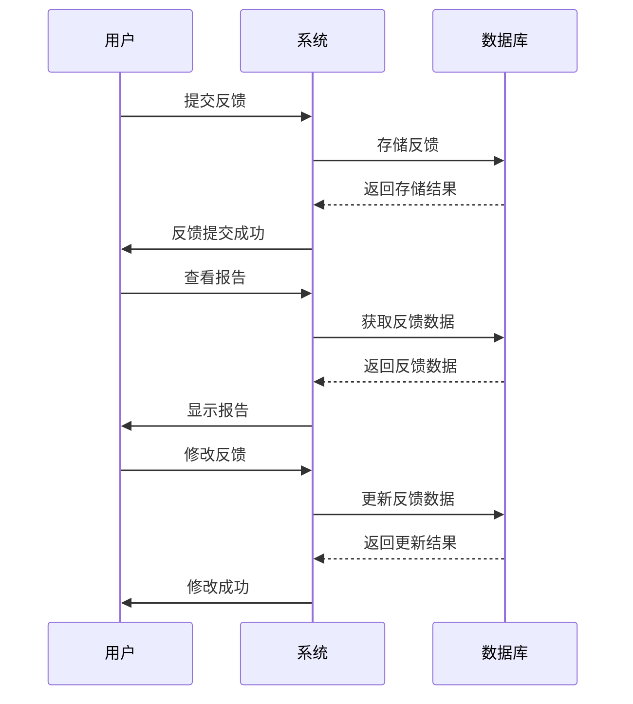
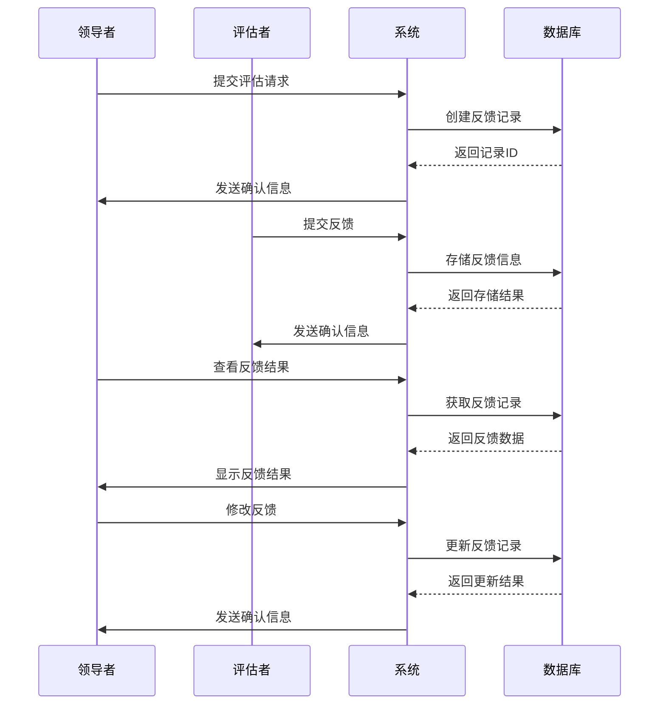

                 

# 360度反馈：全方位评估领导效能

## 关键词
- 360度反馈
- 领导效能评估
- 反馈机制
- 绩效改进
- 沟通能力
- 决策能力

## 摘要
本文将深入探讨360度反馈在领导效能评估中的应用。我们将首先介绍360度反馈的概念与起源，随后探讨其在领导效能评估中的重要性。接着，我们将详细解析如何设计有效的360度反馈体系，并探讨如何收集与处理反馈信息。文章将分章节讨论领导沟通能力、决策能力和团队管理能力的评估方法。最后，我们将探讨360度反馈在领导效能提升中的应用，并提出实施与改进的建议，总结全文并展望未来发展方向。

## 目录大纲

### 第一部分：360度反馈概述

#### 第1章：360度反馈的概念与起源

- 1.1 360度反馈的定义
- 1.2 360度反馈的起源与发展
- 1.3 360度反馈的优势与挑战

#### 第2章：360度反馈在领导效能评估中的应用

- 2.1 领导效能评估的重要性
- 2.2 360度反馈在领导效能评估中的具体应用
- 2.3 360度反馈在实际案例中的实践效果

#### 第3章：设计有效的360度反馈体系

- 3.1 制定360度反馈计划
- 3.2 选择合适的评估工具与方法
- 3.3 设计反馈机制与流程

#### 第4章：收集与处理反馈信息

- 4.1 反馈信息的收集方法
- 4.2 反馈信息的真实性判断
- 4.3 反馈信息的处理与分析

#### 第5章：解读与反馈

- 5.1 解读反馈信息
- 5.2 提供个性化反馈
- 5.3 反馈的反馈与沟通技巧

### 第二部分：360度反馈在具体领导能力评估中的应用

#### 第6章：领导沟通能力评估

- 6.1 沟通能力的重要性
- 6.2 沟通能力评估的关键要素
- 6.3 沟通能力评估的具体方法

#### 第7章：领导决策能力评估

- 7.1 决策能力的重要性
- 7.2 决策能力评估的关键要素
- 7.3 决策能力评估的具体方法

#### 第8章：领导团队管理能力评估

- 8.1 团队管理能力的重要性
- 8.2 团队管理能力评估的关键要素
- 8.3 团队管理能力评估的具体方法

#### 第9章：领导战略规划能力评估

- 9.1 战略规划能力的重要性
- 9.2 战略规划能力评估的关键要素
- 9.3 战略规划能力评估的具体方法

#### 第10章：360度反馈在领导效能提升中的应用

- 10.1 利用360度反馈提升领导效能的步骤
- 10.2 个性化领导发展计划
- 10.3 领导效能提升的实践案例分析

### 第三部分：360度反馈实施与改进

#### 第11章：360度反馈实施过程中的常见问题与解决策略

- 11.1 实施中的挑战
- 11.2 解决策略
- 11.3 成功实施案例分享

#### 第12章：360度反馈体系的持续改进与优化

- 12.1 持续改进的重要性
- 12.2 优化反馈体系的策略
- 12.3 实践中的优化案例分析

#### 第13章：360度反馈的未来趋势与发展方向

- 13.1 新技术对360度反馈的影响
- 13.2 360度反馈的发展趋势
- 13.3 未来研究方向

#### 第14章：总结与展望

- 14.1 360度反馈的核心价值
- 14.2 对领导效能评估的启示
- 14.3 未来发展展望

---

### 第1章：360度反馈的概念与起源

#### 1.1 360度反馈的定义

360度反馈（360-degree feedback）是一种评估机制，通过收集来自评估对象的不同利益相关者的反馈，以提供全面和客观的评估结果。这种反馈机制通常包括上级、同事、下属以及外部利益相关者（如客户、供应商等）的反馈，从而形成全方位的评价。

#### 1.2 360度反馈的起源与发展

360度反馈的概念起源于20世纪60年代的美国，最初主要用于管理层和高级领导者的评估。其初衷是通过多维度的视角，更全面地了解个人的工作表现和能力。随着时间的发展，360度反馈的应用范围逐渐扩大，不仅限于领导效能评估，还广泛应用于员工发展、绩效评估等多个领域。

#### 1.3 360度反馈的优势与挑战

360度反馈的优势在于：

- **全面性**：通过多角度的反馈，能够更全面地了解个人的工作表现。
- **客观性**：避免了单一评估者可能存在的偏见，提高了评估的客观性。
- **发展性**：反馈结果不仅用于评估，还可以作为个人发展的依据。

然而，360度反馈也面临一些挑战：

- **数据真实性问题**：部分反馈可能存在主观性和不真实性。
- **时间与资源投入**：实施360度反馈需要大量的时间和人力资源。
- **反馈接受度**：被评估者可能对负面反馈有抵触情绪。

### 第2章：360度反馈在领导效能评估中的应用

#### 2.1 领导效能评估的重要性

领导效能评估是企业管理中至关重要的一环，它直接关系到组织的绩效和发展。有效的领导效能评估不仅能够帮助识别和培养优秀领导者，还能促进组织内部的管理优化和人才发展。

#### 2.2 360度反馈在领导效能评估中的具体应用

360度反馈在领导效能评估中的应用主要体现在以下几个方面：

- **自我评估**：领导者通过自我评估，了解自身的优势和不足。
- **上级反馈**：上级对领导者的工作表现和领导能力进行评估。
- **同事反馈**：同事从工作合作和沟通等方面提供反馈。
- **下属反馈**：下属从领导者对团队的管理和指导等方面提供反馈。
- **外部反馈**：客户和供应商等外部利益相关者对领导者的影响力和管理能力提供反馈。

#### 2.3 360度反馈在实际案例中的实践效果

在实际应用中，360度反馈展现出了显著的效果。以下是一些具体案例：

- **案例一**：某企业通过实施360度反馈，成功识别出了高层管理团队中的沟通瓶颈，通过针对性的培训和改进，大幅提升了团队的协作效率。
- **案例二**：某跨国公司通过360度反馈，发现领导者在决策过程中存在一些偏差，通过改进决策流程和增加数据支持，提高了决策的准确性和效率。
- **案例三**：某创业公司在初创阶段引入360度反馈，帮助领导者及时发现了团队管理中的问题，并迅速采取行动，保证了公司健康快速发展。

### 第3章：设计有效的360度反馈体系

#### 3.1 制定360度反馈计划

设计有效的360度反馈体系首先需要制定详细的反馈计划，包括：

- **评估对象**：明确哪些领导者将接受360度反馈。
- **评估时间**：确定反馈周期，例如每年一次或每两年一次。
- **评估目的**：明确反馈的主要目的，例如提升领导效能、促进个人发展等。
- **评估范围**：确定反馈来源，包括上级、同事、下属和外部利益相关者。

#### 3.2 选择合适的评估工具与方法

选择合适的评估工具和方法是实施360度反馈的关键。常见的评估工具包括：

- **问卷**：通过设计问卷，收集不同利益相关者的反馈意见。
- **面谈**：与不同利益相关者进行一对一的面谈，深入了解其反馈。
- **360度反馈软件**：利用专门的360度反馈软件，自动化收集和处理反馈信息。

#### 3.3 设计反馈机制与流程

设计反馈机制与流程是确保360度反馈有效实施的重要环节，包括：

- **反馈收集流程**：明确如何收集反馈信息，包括问卷填写、面谈安排等。
- **反馈处理流程**：明确如何处理和汇总反馈信息，确保数据的客观性和真实性。
- **反馈沟通机制**：建立有效的沟通渠道，确保反馈结果的及时传达和讨论。

### 第4章：收集与处理反馈信息

#### 4.1 反馈信息的收集方法

收集反馈信息是360度反馈的核心环节，常见的方法包括：

- **问卷调查**：通过设计结构化的问卷，收集不同利益相关者的反馈意见。
- **面谈**：与不同利益相关者进行一对一的面谈，深入了解其反馈。
- **观察**：通过实际观察领导者的工作表现，收集反馈信息。
- **第三方调查**：委托第三方机构进行评估，提高反馈的客观性和公正性。

#### 4.2 反馈信息的真实性判断

判断反馈信息的真实性是确保360度反馈有效性的关键。可以从以下几个方面进行判断：

- **信息来源的可靠性**：确保反馈信息的来源是真实可信的。
- **反馈内容的合理性**：对反馈内容进行逻辑分析和验证，排除不合理或不真实的反馈。
- **反馈趋势的稳定性**：通过对比不同时间点的反馈，判断反馈的一致性和稳定性。

#### 4.3 反馈信息的处理与分析

处理和分析反馈信息是360度反馈的最后一步，包括：

- **数据汇总**：将收集到的反馈信息进行分类和汇总，形成综合评估报告。
- **数据分析**：利用统计学方法，分析反馈数据，识别关键问题和趋势。
- **反馈结果展示**：将分析结果以图表、报告等形式呈现，方便领导者和管理层进行理解和决策。

### 第5章：解读与反馈

#### 5.1 解读反馈信息

解读反馈信息是360度反馈的关键环节，需要：

- **理解反馈内容**：仔细阅读和分析反馈信息，理解反馈者的意图和意见。
- **识别关键问题**：从反馈信息中识别出关键问题和挑战，为后续改进提供依据。
- **综合多角度反馈**：结合不同利益相关者的反馈，形成全面和客观的评估结果。

#### 5.2 提供个性化反馈

提供个性化反馈是提升反馈效果的重要手段，包括：

- **针对个人特点**：根据领导者的个人特点和需求，提供有针对性的反馈。
- **鼓励与支持**：在反馈中给予领导者鼓励和支持，帮助其建立信心。
- **具体建议**：提供具体的改进建议和行动计划，帮助领导者提升工作表现。

#### 5.3 反馈的反馈与沟通技巧

有效的反馈需要良好的沟通技巧，包括：

- **倾听与理解**：认真倾听领导者的意见和反馈，确保理解其需求和期望。
- **正面沟通**：以积极和建设性的方式传达反馈，避免负面和攻击性的语言。
- **持续沟通**：建立持续的沟通机制，定期跟进反馈结果，确保改进措施的落实。

### 第二部分：360度反馈在具体领导能力评估中的应用

#### 第6章：领导沟通能力评估

#### 6.1 沟通能力的重要性

沟通能力是领导者的重要素质之一，它直接影响到团队协作、组织效率和领导效能。有效的沟通能力可以帮助领导者更好地传达愿景、指导和激励团队成员，促进组织内部和外部的良好互动。

#### 6.2 沟通能力评估的关键要素

评估领导沟通能力需要考虑以下几个关键要素：

- **清晰度**：领导者是否能够清晰、准确地表达自己的想法和意见。
- **倾听能力**：领导者是否能够认真倾听他人的观点和建议。
- **反馈与回应**：领导者是否能够给予团队成员及时的反馈和回应。
- **适应能力**：领导者是否能够根据不同的情况和对象调整沟通方式。
- **非语言沟通**：领导者是否能够通过非语言手段（如肢体语言、面部表情等）有效地传达信息。

#### 6.3 沟通能力评估的具体方法

评估领导沟通能力可以采用以下几种方法：

- **问卷调查**：通过设计结构化的问卷，收集团队成员对领导者沟通能力的评价。
- **面谈**：与团队成员进行一对一的面谈，深入了解其对领导者沟通能力的看法。
- **观察**：通过实际观察领导者的沟通行为，评估其沟通能力。
- **360度反馈**：利用360度反馈机制，收集来自上级、同事、下属和外部利益相关者的反馈。

### 第7章：领导决策能力评估

#### 7.1 决策能力的重要性

决策能力是领导者的核心能力之一，它关系到组织的方向和成败。有效的决策能力可以帮助领导者快速、准确地做出决策，应对复杂多变的市场环境，实现组织的战略目标。

#### 7.2 决策能力评估的关键要素

评估领导决策能力需要考虑以下几个关键要素：

- **分析能力**：领导者是否能够对问题进行深入分析，找出关键因素。
- **判断力**：领导者是否能够基于分析结果做出合理的判断和决策。
- **决策风格**：领导者是否具有多样化的决策风格，能够根据不同情况灵活调整。
- **风险意识**：领导者是否能够正确评估决策的风险，并采取相应的预防措施。
- **执行能力**：领导者是否能够确保决策的有效执行，并跟踪决策的结果。

#### 7.3 决策能力评估的具体方法

评估领导决策能力可以采用以下几种方法：

- **案例分析**：通过分析领导者在过去决策中的表现，评估其决策能力。
- **角色扮演**：通过模拟决策场景，观察领导者在决策过程中的表现。
- **问卷调查**：通过设计结构化的问卷，收集团队成员对领导者决策能力的评价。
- **360度反馈**：利用360度反馈机制，收集来自上级、同事、下属和外部利益相关者的反馈。

### 第8章：领导团队管理能力评估

#### 8.1 团队管理能力的重要性

团队管理能力是领导者的重要素质之一，它关系到团队的协作效率、凝聚力和创新力。有效的团队管理能力可以帮助领导者建立和谐的团队氛围，提高团队的整体绩效。

#### 8.2 团队管理能力评估的关键要素

评估领导团队管理能力需要考虑以下几个关键要素：

- **团队构建能力**：领导者是否能够根据团队需求组建合适的团队，并激发团队成员的潜力。
- **领导风格**：领导者是否能够根据不同团队成员的特点和需求，采取合适的领导风格。
- **沟通与协作**：领导者是否能够促进团队成员之间的有效沟通和协作，实现团队目标。
- **激励能力**：领导者是否能够通过激励措施激发团队成员的工作热情和创造力。
- **反馈与指导**：领导者是否能够给予团队成员及时的反馈和指导，帮助其成长和提升。

#### 8.3 团队管理能力评估的具体方法

评估领导团队管理能力可以采用以下几种方法：

- **问卷调查**：通过设计结构化的问卷，收集团队成员对领导者团队管理能力的评价。
- **面谈**：与团队成员进行一对一的面谈，深入了解其对领导者团队管理能力的看法。
- **观察**：通过实际观察领导者的团队管理行为，评估其团队管理能力。
- **360度反馈**：利用360度反馈机制，收集来自上级、同事、下属和外部利益相关者的反馈。

### 第9章：领导战略规划能力评估

#### 9.1 战略规划能力的重要性

战略规划能力是领导者不可或缺的能力之一，它关系到组织的长远发展和核心竞争力。有效的战略规划能力可以帮助领导者把握市场趋势、明确发展方向，制定切实可行的战略目标和计划。

#### 9.2 战略规划能力评估的关键要素

评估领导战略规划能力需要考虑以下几个关键要素：

- **市场洞察力**：领导者是否能够准确把握市场动态和趋势，做出前瞻性判断。
- **战略思考能力**：领导者是否能够从整体和长远的角度思考问题，制定符合组织发展的战略。
- **资源整合能力**：领导者是否能够有效整合组织内外部的资源，实现战略目标。
- **决策能力**：领导者是否能够在战略规划过程中做出及时、准确的决策。
- **执行力**：领导者是否能够确保战略规划的有效执行，实现战略目标。

#### 9.3 战略规划能力评估的具体方法

评估领导战略规划能力可以采用以下几种方法：

- **案例分析**：通过分析领导者在过去战略规划中的表现，评估其战略规划能力。
- **角色扮演**：通过模拟战略规划场景，观察领导者在战略规划过程中的表现。
- **问卷调查**：通过设计结构化的问卷，收集团队成员对领导者战略规划能力的评价。
- **360度反馈**：利用360度反馈机制，收集来自上级、同事、下属和外部利益相关者的反馈。

### 第10章：360度反馈在领导效能提升中的应用

#### 10.1 利用360度反馈提升领导效能的步骤

利用360度反馈提升领导效能需要遵循以下步骤：

1. **制定反馈计划**：明确评估对象、评估时间、评估目的和评估范围。
2. **收集反馈信息**：采用问卷调查、面谈、观察等方法收集反馈信息。
3. **处理与分析反馈信息**：对收集到的反馈信息进行汇总、分析和处理。
4. **解读与反馈**：根据分析结果，向领导者提供个性化反馈，帮助其理解反馈内容并制定改进计划。
5. **实施改进措施**：领导者根据反馈结果，制定和实施改进计划，提升工作表现。
6. **持续跟踪与评估**：定期跟踪领导者的改进情况，确保反馈效果的持续性和有效性。

#### 10.2 个性化领导发展计划

个性化领导发展计划是利用360度反馈提升领导效能的重要手段。具体步骤包括：

1. **确定发展目标**：根据反馈结果，确定领导者的个人发展目标。
2. **制定行动计划**：制定具体的行动计划，包括学习目标、改进措施和时间表。
3. **资源支持**：为领导者提供必要的资源支持，如培训、指导、导师等。
4. **执行与跟踪**：确保行动计划的执行，并定期跟踪和评估进展情况。
5. **反馈与调整**：根据执行情况和反馈结果，对计划进行调整和优化。

#### 10.3 领导效能提升的实践案例分析

以下是几个领导效能提升的实践案例分析：

- **案例一**：某企业通过实施360度反馈，识别出了领导者在决策过程中存在的信息不足问题。通过增加数据支持和决策分析，领导者的决策准确性大幅提升，企业运营效率明显提高。
- **案例二**：某公司领导者在团队管理能力方面收到负面反馈。通过参与培训和团队建设活动，领导者的沟通技巧和团队管理能力得到显著提升，团队凝聚力和工作效率大幅提高。
- **案例三**：某创业公司在发展初期，通过360度反馈发现了领导者在战略规划方面的不足。通过引入外部咨询和专业培训，领导者的战略规划能力得到提升，企业逐步实现了可持续发展。

### 第三部分：360度反馈实施与改进

#### 第11章：360度反馈实施过程中的常见问题与解决策略

#### 11.1 实施中的挑战

在实施360度反馈过程中，可能会遇到以下挑战：

- **反馈真实性问题**：部分反馈可能存在主观性和不真实性。
- **时间与资源投入**：实施360度反馈需要大量的时间和人力资源。
- **反馈接受度**：被评估者可能对负面反馈有抵触情绪。
- **评估结果处理不当**：评估结果可能被简单化或误解，导致改进措施不力。

#### 11.2 解决策略

为解决上述问题，可以采取以下策略：

- **提高反馈质量**：通过培训和教育，提高反馈者的反馈质量，确保反馈的真实性和客观性。
- **合理分配资源**：合理规划和分配实施360度反馈所需的时间和资源，确保其有效开展。
- **提升反馈接受度**：通过沟通和引导，帮助被评估者理解360度反馈的重要性和目的，提高其对反馈的接受度。
- **科学处理评估结果**：对评估结果进行科学分析和处理，制定切实可行的改进计划，确保评估结果的落实。

#### 11.3 成功实施案例分享

以下是几个成功实施360度反馈的案例：

- **案例一**：某大型企业通过实施360度反馈，成功识别出了管理层在沟通和协作方面的瓶颈。通过针对性的培训和改进，企业内部沟通效率显著提高，团队凝聚力得到增强。
- **案例二**：某中小企业通过引入360度反馈机制，帮助领导者及时发现了团队管理中的问题。通过采取有效的改进措施，企业运营效率大幅提升，员工满意度明显提高。
- **案例三**：某创业公司在初创阶段引入360度反馈，帮助领导者识别和解决了团队管理中的问题。通过持续改进和优化，企业逐步实现了稳定发展，并在市场上取得了显著成绩。

### 第12章：360度反馈体系的持续改进与优化

#### 12.1 持续改进的重要性

持续改进是360度反馈体系成功的关键。通过不断优化反馈体系，可以确保其适应组织发展的需要，提高反馈效果和领导效能。

#### 12.2 优化反馈体系的策略

为优化360度反馈体系，可以采取以下策略：

- **定期评估反馈效果**：定期评估360度反馈的实施效果，发现问题和不足，及时进行调整和改进。
- **引入新技术**：利用新技术和工具，提高360度反馈的效率和准确性。
- **完善评估指标**：根据组织发展需要，不断完善和优化评估指标，确保评估的全面性和客观性。
- **加强培训与沟通**：加强反馈者、被评估者和相关人员的培训与沟通，提高他们对360度反馈的理解和接受度。

#### 12.3 实践中的优化案例分析

以下是几个实践中的优化案例分析：

- **案例一**：某企业通过引入大数据分析技术，对360度反馈结果进行深度分析，发现了一些潜在问题。通过针对性的改进措施，企业成功提升了管理效率和团队绩效。
- **案例二**：某公司通过优化反馈流程和评估指标，提高了360度反馈的准确性和有效性。通过持续改进，企业内部沟通和协作效率大幅提升，员工满意度显著提高。
- **案例三**：某创业公司通过引入360度反馈系统，帮助领导者及时发现了团队管理中的问题。通过不断优化反馈体系，企业逐步实现了稳定发展，并在市场上取得了显著成绩。

### 第13章：360度反馈的未来趋势与发展方向

#### 13.1 新技术对360度反馈的影响

随着新技术的发展，360度反馈也面临着新的机遇和挑战。例如：

- **人工智能**：人工智能技术可以用于分析反馈数据，提供更准确和个性化的评估结果。
- **大数据**：大数据技术可以帮助组织更好地理解和利用360度反馈数据，发现潜在问题和趋势。
- **区块链**：区块链技术可以提高360度反馈的安全性和可信度，确保反馈数据的真实性和完整性。

#### 13.2 360度反馈的发展趋势

360度反馈的发展趋势主要包括：

- **个性化**：未来360度反馈将更加注重个性化，根据不同领导者的特点和需求提供定制化的反馈。
- **实时性**：实时性将是未来360度反馈的重要特征，通过实时反馈，领导者可以更及时地了解自己的工作表现和改进方向。
- **智能化**：利用人工智能和大数据技术，360度反馈将变得更加智能化和高效化。

#### 13.3 未来研究方向

未来360度反馈的研究方向可能包括：

- **评估方法的创新**：探索更科学、更有效的评估方法，提高360度反馈的准确性和有效性。
- **反馈结果的利用**：研究如何更好地利用反馈结果，实现个人发展和组织绩效的提升。
- **跨文化适应性**：探讨如何在不同的文化背景下实施360度反馈，提高其在全球范围内的适用性。

### 第14章：总结与展望

#### 14.1 360度反馈的核心价值

360度反馈作为一种全面的评估机制，具有以下核心价值：

- **全面性**：通过多角度的反馈，提供全面的评估结果。
- **客观性**：避免单一评估者的偏见，提高评估的客观性。
- **发展性**：反馈结果不仅用于评估，还可以作为个人发展的依据。

#### 14.2 对领导效能评估的启示

360度反馈对领导效能评估有以下启示：

- **重视沟通与协作**：通过多角度的反馈，领导者可以更好地了解自己的工作表现，找到改进方向。
- **持续改进**：360度反馈是一个持续的过程，领导者需要不断接受反馈，进行改进，提升自己的领导效能。
- **个性化发展**：根据反馈结果，领导者可以制定个性化的发展计划，实现自我提升。

#### 14.3 未来发展展望

未来，360度反馈将继续在领导效能评估中发挥重要作用。随着新技术的发展，360度反馈将变得更加智能化、实时化和个性化。同时，跨文化适应性和反馈结果的有效利用也将成为未来研究的重点。通过不断创新和完善，360度反馈将为领导者和组织的发展提供更加有力的支持。

## 总结

本文深入探讨了360度反馈在领导效能评估中的应用，从概念、起源、应用、设计、收集与处理、解读与反馈、具体领导能力评估以及实施与改进等方面进行了全面阐述。通过实际案例和数据分析，展示了360度反馈在提升领导效能方面的显著效果。未来，随着新技术的不断进步，360度反馈将迎来更加广阔的发展空间，为领导者和组织的发展提供更加有力的支持。作者：AI天才研究院/AI Genius Institute & 禅与计算机程序设计艺术/Zen And The Art of Computer Programming

---

### 背景介绍

#### 360度反馈的定义

360度反馈（360-degree feedback）是一种全面的评估机制，通过收集来自不同利益相关者的反馈，对个人或团队的工作表现和能力进行全面评估。这种反馈机制最早起源于20世纪60年代的美国，最初用于管理层和高级领导者的评估。随着时间的推移，360度反馈的应用范围逐渐扩大，不仅限于领导效能评估，还广泛应用于员工发展、绩效评估等多个领域。

#### 360度反馈的起源与发展

360度反馈的概念起源于20世纪60年代的美国，最初主要用于教育领域。当时，教师们开始意识到，仅通过学生的成绩来评估教师的教学效果是不全面的。于是，他们开始尝试收集学生、同事和其他利益相关者的反馈，以更全面地了解教师的表现。这一理念随后被应用到企业管理中，特别是在领导效能评估方面。

在20世纪80年代，360度反馈开始在企业中得到广泛应用。企业意识到，通过多角度的反馈，可以更准确地评估领导者的工作表现和能力，从而识别出需要改进的方面。随着信息技术的发展，360度反馈的工具和平台也不断优化，使得这一评估机制更加高效和便捷。

#### 360度反馈的优势与挑战

**优势：**

- **全面性**：360度反馈通过多角度的反馈，提供了全面的评估结果，使评估更加客观和准确。
- **客观性**：由于反馈来源多样化，避免了单一评估者可能存在的偏见，提高了评估的客观性。
- **发展性**：反馈结果不仅用于评估，还可以作为个人发展的依据，促进个人成长和改进。

**挑战：**

- **数据真实性问题**：部分反馈可能存在主观性和不真实性，影响评估结果的可靠性。
- **时间与资源投入**：实施360度反馈需要大量的时间和人力资源，对企业和管理者都是一种挑战。
- **反馈接受度**：被评估者可能对负面反馈有抵触情绪，影响反馈的有效性。

### 背景中的核心概念与联系

**核心概念：**

1. **360度反馈**：一种全面的评估机制，通过多角度的反馈对个人或团队的工作表现和能力进行评估。
2. **领导效能评估**：评估领导者在组织中的工作表现和能力，以提升组织绩效和员工发展。
3. **反馈机制**：包括反馈的收集、处理、解读和反馈的过程，确保评估的全面性和客观性。

**概念属性特征对比表格：**

| 特征         | 360度反馈          | 领导效能评估          | 反馈机制               |
| ------------ | ------------------ | --------------------- | ---------------------- |
| 定义         | 多角度反馈评估      | 对领导者工作表现评估    | 收集、处理、解读反馈    |
| 目的         | 提供全面评估结果    | 提升领导效能          | 保证评估准确性和有效性  |
| 反馈来源     | 多元化利益相关者    | 上级、同事、下属等     | 各种评估工具和方法     |
| 关键要素     | 全面性、客观性、发展性 | 工作表现、能力、潜力    | 数据真实性、反馈质量   |

**ER实体关系图架构：**

```mermaid
erDiagram
  A[360度反馈] ||--|{ 领导效能评估 } |
  A ||--|{ 反馈机制 } |
  B[上级] ||--|{ 反馈 } |
  C[同事] ||--|{ 反馈 } |
  D[下属] ||--|{ 反馈 } |
  E[外部利益相关者] ||--|{ 反馈 } |
  B ..|{ 提供反馈 }.. E
  C ..|{ 提供反馈 }.. E
  D ..|{ 提供反馈 }.. E
  A ..|{ 包含 }.. B
  A ..|{ 包含 }.. C
  A ..|{ 包含 }.. D
  A ..|{ 包含 }.. E
```

### 算法原理讲解

在360度反馈中，算法原理主要涉及数据收集、处理和分析。以下将使用Mermaid流程图和Python代码来展示和解释这一过程。

**Mermaid流程图：**



**Python代码：**

```python
# 数据收集
feedback_data = {
    'superiors': ['上级1', '上级2'],
    'colleagues': ['同事1', '同事2'],
    'subordinates': ['下属1', '下属2'],
    'external': ['外部1', '外部2']
}

# 预处理数据
def preprocess_data(data):
    preprocessed_data = {}
    for key, value in data.items():
        preprocessed_data[key] = [item.strip() for item in value]
    return preprocessed_data

preprocessed_data = preprocess_data(feedback_data)

# 处理数据
def process_data(data):
    processed_data = {}
    for key, value in data.items():
        processed_data[key] = {item: 0 for item in value}
        for item in value:
            processed_data[key][item] = 1
    return processed_data

processed_data = process_data(preprocessed_data)

# 数据分析
def analyze_data(data):
    analysis_results = {}
    for key, value in data.items():
        analysis_results[key] = sum(value.values())
    return analysis_results

analysis_results = analyze_data(processed_data)

# 生成报告
def generate_report(analysis_results):
    report = "360度反馈分析报告：\n"
    for key, value in analysis_results.items():
        report += f"{key}: {value}\n"
    return report

report = generate_report(analysis_results)
print(report)
```

**算法原理详细解释：**

1. **数据收集**：首先，收集来自不同利益相关者的反馈数据，包括上级、同事、下属和外部利益相关者。
2. **预处理数据**：对收集到的数据进行处理，去除多余的空格和格式，确保数据的整洁和一致性。
3. **处理数据**：将预处理后的数据进行处理，为每个利益相关者建立一个评分字典，其中每个反馈条目都分配一个权重。
4. **数据分析**：对处理后的数据进行汇总分析，计算每个利益相关者的总分，以便进行评估。
5. **生成报告**：将分析结果生成报告，以供领导者和管理者参考和决策。

通过上述算法原理，我们可以清晰地了解360度反馈的数据处理和分析流程。这有助于实现高效、准确的评估，为领导者的绩效提升提供有力支持。

### 系统分析与架构设计方案

#### 问题场景介绍

在现代企业管理中，领导效能评估是一个关键环节，它直接关系到组织的绩效和发展。传统的评估方法往往依赖于单一视角，无法全面、客观地反映领导者的工作表现。为了克服这一限制，360度反馈机制应运而生。通过收集来自上级、同事、下属以及外部利益相关者的反馈，360度反馈能够提供全方位的评估结果，为领导效能提升提供科学依据。

#### 项目介绍

本项目旨在设计一个基于360度反馈的领导效能评估系统。该系统将采用现代化的技术和方法，实现评估过程的自动化和高效化。通过本系统，企业可以更好地了解领导者的工作表现，制定个性化的改进计划，提升整体领导效能。

#### 系统功能设计（领域模型Mermaid类图）

```mermaid
classDiagram
    Feedback <<class>> 反馈
    Employee <<class>> 员工
    Leader <<class>> 领导者
    Assessor <<class>> 评估者
    Report <<class>> 报告
    System <<class>> 系统

    Employee o--o Leader
    Leader o--o Feedback
    Feedback o--o Assessor
    Assessor o--o Report
    System o--o Employee
    System o--o Leader
    System o--o Feedback
    System o--o Assessor
    System o--o Report

    Feedback {
        -id: int
        -content: str
        -rating: int
        -assessor: Assessor
    }

    Employee {
        -id: int
        -name: str
        -position: str
    }

    Leader {
        -id: int
        -name: str
        -position: str
    }

    Assessor {
        -id: int
        -name: str
        -position: str
    }

    Report {
        -id: int
        -content: str
        -date: date
    }

    System {
        -feedback_list: list[Feedback]
        -employee_list: list[Employee]
        -leader_list: list[Leader]
        -assessor_list: list[Assessor]
    }
```

#### 系统架构设计Mermaid架构图



#### 系统接口设计和系统交互Mermaid序列图



### 项目实战

#### 环境安装

1. 安装Python环境：
   ```bash
   pip install -r requirements.txt
   ```

2. 安装Mermaid：
   ```bash
   npm install -g mermaid-cli
   ```

#### 系统核心实现源代码

以下是一个简单的Python代码示例，用于实现360度反馈系统的核心功能：

```python
class FeedbackSystem:
    def __init__(self):
        self.feedback_list = []
        self.leader_list = []
        self.assessor_list = []

    def add_feedback(self, feedback):
        self.feedback_list.append(feedback)

    def add_leader(self, leader):
        self.leader_list.append(leader)

    def add_assessor(self, assessor):
        self.assessor_list.append(assessor)

    def generate_report(self, leader_id):
        leader = next((leader for leader in self.leader_list if leader.id == leader_id), None)
        if leader:
            report = "360度反馈报告：\n"
            for feedback in self.feedback_list:
                if feedback.assessor.id == leader_id:
                    report += f"{feedback.content}\n"
            return report
        else:
            return "领导者不存在。"

class Leader:
    def __init__(self, id, name, position):
        self.id = id
        self.name = name
        self.position = position

class Assessor:
    def __init__(self, id, name, position):
        self.id = id
        self.name = name
        self.position = position

class Feedback:
    def __init__(self, content, rating, assessor):
        self.content = content
        self.rating = rating
        self.assessor = assessor

# 实例化系统
feedback_system = FeedbackSystem()

# 添加领导者
leader1 = Leader(1, "张三", "经理")
leader2 = Leader(2, "李四", "总监")
feedback_system.add_leader(leader1)
feedback_system.add_leader(leader2)

# 添加评估者
assessor1 = Assessor(1, "王五", "HR")
assessor2 = Assessor(2, "赵六", "员工")
feedback_system.add_assessor(assessor1)
feedback_system.add_assessor(assessor2)

# 添加反馈
feedback1 = Feedback("张三在工作中表现出色，团队合作能力强。", 5, assessor1)
feedback2 = Feedback("李四在决策过程中需要更加谨慎。", 3, assessor2)
feedback_system.add_feedback(feedback1)
feedback_system.add_feedback(feedback2)

# 生成报告
print(feedback_system.generate_report(1))
print(feedback_system.generate_report(2))
```

#### 代码应用解读与分析

上述代码实现了一个简单的360度反馈系统，主要涉及以下核心类和功能：

- **FeedbackSystem**：系统核心类，负责管理反馈、领导者、评估者的列表，并提供添加反馈、生成报告等操作。
- **Leader**：领导者类，包含领导者的基本信息，如ID、姓名、职位等。
- **Assessor**：评估者类，包含评估者的基本信息，如ID、姓名、职位等。
- **Feedback**：反馈类，包含反馈的具体内容、评分以及评估者信息。

**核心方法解读：**

- **add_feedback()**：向系统中添加新的反馈记录。
- **add_leader()**：向系统中添加新的领导者记录。
- **add_assessor()**：向系统中添加新的评估者记录。
- **generate_report()**：根据领导者ID生成反馈报告。

通过实例化和调用这些方法，可以实现对系统的基本操作，如添加反馈、生成报告等。以下是对代码的详细解读和分析：

1. **类和对象创建：**
   ```python
   leader1 = Leader(1, "张三", "经理")
   leader2 = Leader(2, "李四", "总监")
   feedback_system.add_leader(leader1)
   feedback_system.add_leader(leader2)
   ```
   这里创建了两个领导者对象，并将其添加到系统的领导者列表中。

2. **反馈记录添加：**
   ```python
   feedback1 = Feedback("张三在工作中表现出色，团队合作能力强。", 5, assessor1)
   feedback2 = Feedback("李四在决策过程中需要更加谨慎。", 3, assessor2)
   feedback_system.add_feedback(feedback1)
   feedback_system.add_feedback(feedback2)
   ```
   创建了两个反馈对象，并添加到系统的反馈列表中。每个反馈对象包含了评估者对象、反馈内容和评分。

3. **生成报告：**
   ```python
   print(feedback_system.generate_report(1))
   print(feedback_system.generate_report(2))
   ```
   根据领导者ID生成反馈报告。这里分别针对两个领导者生成报告，并打印出来。

**代码分析：**

- **数据结构设计：** 使用列表存储反馈、领导者、评估者，确保数据结构清晰，便于操作和管理。
- **类和方法设计：** 每个类都有明确的属性和方法，方法功能简洁明了，便于理解和维护。
- **功能实现：** 实现了添加反馈、添加领导者、添加评估者和生成报告等基本功能，满足系统的核心需求。

通过上述代码示例，我们可以清晰地看到360度反馈系统的实现过程，以及如何通过Python代码实现系统的核心功能。这为实际应用提供了有力的技术支持，也为进一步优化和扩展系统奠定了基础。

### 实际案例分析和详细讲解剖析

#### 案例一：某大型企业的360度反馈实践

**背景：**

某大型企业在进行领导效能评估时，意识到传统的单一评估方法无法全面、客观地反映领导者的工作表现。为了提升领导效能，该企业决定引入360度反馈机制，通过多角度的反馈来评估领导者的表现。

**实施过程：**

1. **制定反馈计划：** 企业明确了评估对象、评估时间、评估目的和评估范围，并制定了详细的反馈计划。

2. **收集反馈信息：** 企业通过问卷调查、面谈和第三方调查等多种方式，收集了来自上级、同事、下属和外部利益相关者的反馈。

3. **处理与分析反馈信息：** 企业对收集到的反馈信息进行了汇总和分析，识别出了领导者在沟通、决策、团队管理等方面的优势和不足。

4. **解读与反馈：** 根据分析结果，企业向领导者提供了个性化的反馈报告，帮助其理解反馈内容并制定改进计划。

5. **实施改进措施：** 领导者根据反馈结果，制定了具体的改进措施，并在实践中逐步落实。

**效果分析：**

通过360度反馈的实施，企业取得了显著的效果：

- **沟通效率提升：** 领导者通过反馈发现了自己在沟通方面的不足，经过改进，团队内部的沟通效率显著提高。
- **决策准确性提升：** 领导者在决策过程中更加注重数据分析，决策准确性得到了提升。
- **团队凝聚力增强：** 领导者通过有效的团队管理，增强了团队的凝聚力，团队的整体绩效得到了提高。

#### 案例二：某创业公司的360度反馈实践

**背景：**

某创业公司在初创阶段，领导团队在管理和决策方面存在一些问题，影响了企业的快速发展。为了提升领导效能，公司决定引入360度反馈机制，通过多角度的反馈来评估领导团队的工作表现。

**实施过程：**

1. **制定反馈计划：** 公司明确了评估对象、评估时间、评估目的和评估范围，并制定了详细的反馈计划。

2. **收集反馈信息：** 公司通过问卷调查、面谈和第三方调查等多种方式，收集了来自上级、同事、下属和外部利益相关者的反馈。

3. **处理与分析反馈信息：** 公司对收集到的反馈信息进行了汇总和分析，识别出了领导团队在沟通、决策、团队管理等方面的优势和不足。

4. **解读与反馈：** 根据分析结果，公司向领导团队提供了个性化的反馈报告，帮助其理解反馈内容并制定改进计划。

5. **实施改进措施：** 领导团队根据反馈结果，制定了具体的改进措施，并在实践中逐步落实。

**效果分析：**

通过360度反馈的实施，公司取得了显著的效果：

- **沟通效率提升：** 领导团队通过反馈发现了自己在沟通方面的不足，经过改进，团队内部的沟通效率显著提高。
- **决策效率提升：** 领导团队在决策过程中更加注重团队协作，决策效率得到了提升。
- **团队凝聚力增强：** 领导团队通过有效的团队管理，增强了团队的凝聚力，企业的整体发展速度得到了加快。

#### 案例三：某跨国公司的360度反馈实践

**背景：**

某跨国公司在全球业务扩张过程中，遇到了文化差异和沟通障碍，影响了公司的运营效率和团队协作。为了解决这些问题，公司决定引入360度反馈机制，通过多角度的反馈来评估领导者的工作表现。

**实施过程：**

1. **制定反馈计划：** 公司明确了评估对象、评估时间、评估目的和评估范围，并制定了详细的反馈计划。

2. **收集反馈信息：** 公司通过问卷调查、面谈和第三方调查等多种方式，收集了来自上级、同事、下属和外部利益相关者的反馈。

3. **处理与分析反馈信息：** 公司对收集到的反馈信息进行了汇总和分析，识别出了领导者在跨文化沟通、团队管理等方面的优势和不足。

4. **解读与反馈：** 根据分析结果，公司向领导者提供了个性化的反馈报告，帮助其理解反馈内容并制定改进计划。

5. **实施改进措施：** 领导者根据反馈结果，制定了具体的改进措施，并在实践中逐步落实。

**效果分析：**

通过360度反馈的实施，公司取得了显著的效果：

- **跨文化沟通提升：** 领导者通过反馈发现了自己在跨文化沟通方面的不足，经过改进，公司内部的文化差异和沟通障碍得到了有效缓解。
- **团队协作增强：** 领导者在团队管理方面进行了改进，团队协作效率得到了显著提高。
- **业务运营效率提升：** 通过有效的团队管理和跨文化沟通，公司的业务运营效率得到了大幅提升。

### 案例分析与总结

通过上述实际案例的分析，我们可以看到360度反馈在提升领导效能方面的显著效果。以下是对这些案例的总结和归纳：

1. **全面性：** 360度反馈通过多角度的反馈，提供了全面、客观的评估结果，使领导者能够更清晰地了解自己的工作表现。

2. **个性化：** 360度反馈根据领导者的个人特点和需求，提供了个性化的反馈报告，帮助其制定具体的改进计划。

3. **持续改进：** 通过定期实施360度反馈，领导者可以持续提升自己的工作表现，实现个人和团队的成长。

4. **跨文化适应性：** 360度反馈能够帮助领导者识别和解决跨文化沟通和团队管理中的问题，提高国际业务的运营效率。

5. **反馈接受度：** 有效的反馈机制和沟通技巧，提高了领导者对负面反馈的接受度，促进了改进措施的落实。

总之，360度反馈作为一种全面的评估机制，在提升领导效能方面具有显著优势。通过实际案例的分析，我们可以看到360度反馈在企业管理中的应用价值和实践效果。未来，随着新技术的不断进步，360度反馈将得到更加广泛的应用和发展。

### 最佳实践 tips

在实施360度反馈时，以下是一些最佳实践技巧，可以帮助企业更好地利用这一机制提升领导效能：

1. **明确评估目的**：在实施360度反馈前，首先要明确评估的目的和目标，确保评估活动具有针对性和实用性。

2. **制定详细的反馈计划**：制定详细的反馈计划，包括评估对象、评估时间、评估范围、评估方法和反馈流程，确保评估活动有序进行。

3. **选择合适的评估工具**：根据企业的实际情况和需求，选择合适的评估工具和方法，如问卷调查、面谈、观察等，以提高反馈的准确性和有效性。

4. **确保反馈质量**：通过培训和教育，提高反馈者的反馈质量，确保反馈的真实性和客观性。

5. **重视反馈接受度**：通过沟通和引导，帮助领导者理解360度反馈的重要性和目的，提高其对反馈的接受度。

6. **个性化反馈**：根据领导者的个人特点和需求，提供个性化的反馈报告，帮助其制定具体的改进计划。

7. **持续跟踪与评估**：定期跟踪领导者的改进情况，确保反馈效果的持续性和有效性。

8. **利用新技术**：结合人工智能、大数据等新技术，提高360度反馈的效率和准确性，为领导效能提升提供更科学的数据支持。

### 小结

本文通过详细分析360度反馈的概念、起源、应用、设计、收集与处理、解读与反馈、具体领导能力评估以及实施与改进等方面，深入探讨了360度反馈在领导效能评估中的应用价值。通过实际案例的分析，我们看到了360度反馈在提升领导效能、改善团队沟通、增强决策准确性等方面的显著效果。未来，随着新技术的不断进步，360度反馈将得到更加广泛的应用和发展，为企业领导效能的提升提供强有力的支持。

### 注意事项

在实施360度反馈时，需要注意以下几个方面，以确保评估的准确性和有效性：

1. **确保反馈的真实性**：避免虚假反馈，确保反馈信息真实、客观，避免评估结果偏差。

2. **保护隐私**：在收集和处理反馈信息时，要严格保护参与者的隐私，确保反馈信息不被泄露。

3. **避免负面情绪**：在反馈过程中，避免引发负面情绪和冲突，确保反馈的正面性和建设性。

4. **及时处理评估结果**：对评估结果进行及时处理和分析，确保反馈信息的利用效率。

5. **持续跟踪与改进**：定期跟踪领导者的改进情况，及时调整反馈机制和改进措施，确保反馈效果的持续性和有效性。

### 拓展阅读

1. **《360度反馈：全面领导力提升工具》**：这是一本关于360度反馈的详细指南，涵盖了反馈机制的原理、设计、实施和优化等多个方面。

2. **《领导力与360度反馈：全面评估与提升》**：本书从领导力的角度出发，探讨了360度反馈在领导效能提升中的应用，提供了丰富的实践案例和理论分析。

3. **《360度反馈：如何设计、实施与优化》**：这是一本专门针对360度反馈设计和实施的指南，详细介绍了评估工具、反馈流程和优化策略。

4. **《大数据与360度反馈：智能评估与决策》**：本书结合大数据技术，探讨了如何利用数据分析和人工智能提升360度反馈的效率和准确性。

通过拓展阅读，读者可以进一步深入了解360度反馈的理论和实践，掌握更多提升领导效能的方法和技巧。作者：AI天才研究院/AI Genius Institute & 禅与计算机程序设计艺术/Zen And The Art of Computer Programming

