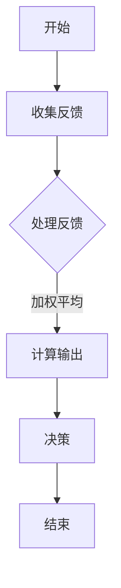

                 

### 建立反馈文化：促进持续改进

#### 关键词：反馈文化、持续改进、组织发展、员工参与、机制设计

> 摘要：本文旨在探讨建立反馈文化在组织内的重要性，通过详细的案例分析，阐述如何通过反馈机制推动持续改进。文章将逐步分析反馈文化的核心概念，讨论其在组织中的应用和实践，并提供具体的实施策略和最佳实践。通过本文，读者可以深入了解如何在一个组织中营造良好的反馈文化，实现组织的持续发展。

---

#### **第一部分：背景介绍**

##### **第1章：问题背景与反馈文化的定义**

在当今快速变化和竞争激烈的市场环境中，组织需要不断适应和创新，以保持竞争力。然而，许多组织在面对挑战时，往往因为缺乏有效的反馈机制而无法做出迅速响应。这种情况下，建立反馈文化成为了组织持续改进的关键。

#### **核心概念术语说明**

- **反馈文化**：一种在组织内部广泛存在的态度和行为模式，鼓励成员之间提供和接受反馈，以促进个人和组织的成长。
- **持续改进**：一种不断追求改进的过程，旨在提高组织的效率和性能。
- **组织发展**：通过优化组织结构、流程和文化，以实现组织目标的过程。

#### **问题背景**

随着全球化和信息技术的快速发展，组织面临的市场环境变得越来越复杂和不可预测。为了在这种环境中生存和发展，组织需要具备快速响应和持续改进的能力。然而，传统的管理模式往往缺乏灵活性和适应性，导致组织难以应对外部变化。

#### **问题描述**

组织内部缺乏有效的反馈机制，导致以下问题：

- **沟通障碍**：成员之间缺乏有效的沟通渠道，信息传递不顺畅。
- **效率低下**：团队成员无法及时了解问题和需求，导致工作效率低下。
- **创新能力不足**：缺乏对内部流程和产品的持续改进，导致创新能力不足。
- **员工满意度下降**：员工感到自己的意见和建议无法得到重视，导致工作积极性下降。

#### **问题解决**

建立反馈文化可以通过以下方式解决上述问题：

- **提高沟通效率**：通过反馈机制，成员之间可以更加有效地交流和分享信息。
- **增强团队协作**：反馈文化鼓励团队成员相互支持和合作，共同解决问题。
- **提升创新能力**：通过持续反馈，组织可以不断优化流程和产品，提高创新能力。
- **增强员工满意度**：员工感到自己的意见被重视，工作积极性得到提升。

#### **边界与外延**

反馈文化不仅限于内部沟通和协作，还应该延伸到与客户、供应商和其他利益相关者的互动中。通过建立广泛的反馈渠道，组织可以更好地了解外部环境的变化，从而做出更明智的决策。

#### **反馈文化与持续改进的关系**

反馈文化是持续改进的基础。通过不断收集和分析反馈，组织可以发现问题和改进机会，从而推动持续改进。同时，持续改进也为反馈文化的实施提供了动力，使组织能够更加高效地应对外部变化。

---

在下一章中，我们将进一步探讨当前组织中反馈的现状，分析反馈机制的常见问题，并探讨反馈文化的积极影响。通过这一步一步的分析，我们将为建立有效的反馈文化打下坚实的基础。

---

#### **第二部分：核心概念与联系**

##### **第3章：构建反馈文化的基础**

在探讨如何建立反馈文化之前，我们首先需要理解其核心概念和基础。

#### **3.1 必须建立的核心原则**

建立反馈文化需要遵循以下核心原则：

- **透明性**：反馈过程应该是公开和透明的，使所有成员都能了解和参与到反馈活动中。
- **尊重**：提供和接受反馈时，应该尊重每个人的意见和感受，避免指责和攻击。
- **持续**：反馈应该是一个持续的过程，不仅仅是偶尔的事件。
- **针对性**：反馈应该针对具体的问题和情境，避免泛泛而谈。
- **激励**：为提供反馈的成员提供激励和认可，鼓励更多成员参与反馈活动。

#### **3.2 反馈文化的概念属性特征对比表格**

| 特征          | 描述                                       |
|---------------|--------------------------------------------|
| **透明性**    | 反馈过程公开透明，所有成员都可以查看和参与。     |
| **尊重**      | 反馈过程中尊重每个人的意见和感受，避免攻击和指责。 |
| **持续**      | 反馈是一个持续的过程，不仅仅是一次性的。         |
| **针对性**    | 反馈针对具体的问题和情境，避免泛泛而谈。         |
| **激励**      | 为提供反馈的成员提供激励和认可，鼓励更多成员参与。 |

#### **3.3 反馈文化在组织中的ER实体关系图**

为了更好地理解反馈文化在组织中的应用，我们可以使用ER（实体关系）图来描述其关系。

```mermaid
erDiagram
  Member  ||--|{ Feedback }|-- Feedback
  Team    ||--|{ Feedback }|-- Feedback
  Project ||--|{ Feedback }|-- Feedback
  Manager ||--|{ Feedback }|-- Feedback
```

在这个ER图中，`Member`、`Team`、`Project` 和 `Manager` 都是反馈的实体，它们之间通过反馈关系相互关联。这种关系图可以帮助我们理解反馈文化在组织内部的不同层面上的应用。

---

在下一章中，我们将深入探讨当前组织中反馈的现状，分析反馈机制的常见问题，并探讨反馈文化的积极影响。通过这一步一步的分析，我们将为建立有效的反馈文化打下坚实的基础。

---

#### **第二部分：核心概念与联系**

##### **第4章：策略与实践**

建立反馈文化不仅需要理解其核心概念和基础，还需要制定有效的策略和实践活动。

#### **4.1 领导层的角色**

领导层在推动反馈文化中扮演着至关重要的角色。以下是一些关键策略：

- **树立榜样**：领导层应该通过自己的行为来树立榜样，主动提供和接受反馈。
- **倡导透明**：领导层应该倡导透明性，确保反馈过程对所有成员都是公开和透明的。
- **激励员工**：通过奖励和认可，激励员工积极参与反馈活动。
- **提供培训**：为员工提供关于如何提供和接受反馈的培训，帮助他们更好地理解和应用反馈文化。

#### **4.2 培养员工的反馈意识**

培养员工的反馈意识是建立反馈文化的关键。以下是一些策略：

- **定期反馈**：鼓励员工定期进行自我反馈，以及对他人的反馈。
- **开放沟通**：建立开放的沟通渠道，使员工感到他们的意见和建议被重视。
- **提供反馈模板**：为员工提供反馈模板，帮助他们更系统地提供反馈。
- **鼓励跨部门合作**：通过跨部门合作，促进员工之间的相互反馈。

#### **4.3 设计有效的反馈机制**

有效的反馈机制是建立反馈文化的重要保障。以下是一些关键策略：

- **明确的反馈流程**：设计清晰的反馈流程，确保反馈能够及时、准确地传递。
- **技术支持**：利用现代技术手段，如反馈管理系统，来支持反馈活动。
- **隐私保护**：确保反馈过程中员工的隐私得到保护，鼓励他们更自由地提供反馈。
- **定期评估**：定期评估反馈机制的有效性，根据评估结果进行改进。

#### **4.4 实施反馈文化的最佳实践**

以下是一些成功实施反馈文化的最佳实践：

- **案例分析**：通过分析成功案例，了解他们是如何建立反馈文化的。
- **持续改进**：不断反思和改进反馈机制，确保其能够持续推动组织的改进。
- **员工参与**：鼓励员工参与反馈文化的建立，使他们感到自己是组织的一部分。
- **外部反馈**：除了内部反馈，还应关注外部反馈，如客户和合作伙伴的反馈，以获得更全面的反馈。

---

在下一部分中，我们将进一步探讨反馈算法的基础，使用mermaid流程图和Python源代码来阐述算法原理，为后续的系统分析与架构设计提供理论基础。

---

### 第三部分：算法原理讲解

#### **第5章：反馈算法基础**

在建立反馈文化的过程中，了解反馈算法的基础是非常重要的。这一部分将详细介绍反馈算法的定义、数学模型和mermaid流程图。

#### **5.1 反馈算法的定义**

反馈算法是一种用于处理反馈信息的数学模型，旨在通过分析反馈来优化决策过程。它可以应用于组织内部的各个层面，如个人发展、团队协作和项目管理。

#### **5.2 反馈算法的数学模型和公式**

反馈算法的数学模型通常包括以下几个关键组件：

1. **输入数据**：包括原始反馈数据、权重和初始值。
2. **处理过程**：通过对输入数据进行处理，如加权平均、阈值调整等。
3. **输出结果**：处理后的反馈结果，用于指导后续决策。

以下是一个简单的反馈算法公式：

$$
f(x) = w_1 \cdot x_1 + w_2 \cdot x_2 + \ldots + w_n \cdot x_n
$$

其中，$x_1, x_2, \ldots, x_n$ 是输入数据，$w_1, w_2, \ldots, w_n$ 是权重。

#### **5.3 反馈算法的mermaid流程图**

为了更直观地理解反馈算法的过程，我们可以使用mermaid流程图来描述。以下是一个简单的mermaid流程图示例：



这个mermaid流程图描述了反馈算法的基本步骤，包括收集反馈、处理反馈、计算输出和决策。

---

在下一章中，我们将进一步探讨反馈算法在组织中的应用，通过具体的案例解析来展示如何使用反馈算法来推动组织的持续改进。

---

### **第三部分：算法原理讲解**

#### **第6章：反馈算法的应用**

在前一章中，我们介绍了反馈算法的基本原理。在这一章中，我们将深入探讨反馈算法在组织中的应用，并通过具体案例来展示如何使用反馈算法来推动组织的持续改进。

#### **6.1 反馈算法在企业中的应用**

反馈算法在企业中的应用非常广泛，以下是一些典型的应用场景：

1. **员工绩效评估**：企业可以通过收集员工的工作反馈，使用反馈算法来评估员工的绩效，从而更公正地识别优秀员工和需要改进的员工。
2. **产品改进**：企业可以通过收集客户反馈，使用反馈算法来分析客户的需求和偏好，从而指导产品改进和优化。
3. **项目管理**：项目经理可以使用反馈算法来评估项目的进展和风险，从而及时调整项目计划和资源分配。
4. **市场营销**：企业可以通过收集市场反馈，使用反馈算法来分析市场趋势和消费者行为，从而制定更有效的营销策略。

#### **6.2 反馈算法的案例解析**

下面我们通过一个具体案例来解析如何使用反馈算法来推动组织的持续改进。

**案例背景**：某家互联网公司正在开发一款新的社交媒体应用。在产品开发的早期阶段，公司通过用户调研和市场分析，初步确定了产品的功能和服务。然而，随着产品的逐步完善，公司发现用户反馈中的某些关键问题并没有得到充分解决。

**解决方案**：

1. **收集反馈**：公司通过用户反馈、在线调查和焦点小组讨论等多种渠道收集用户反馈。
2. **处理反馈**：使用反馈算法对收集到的用户反馈进行处理，提取关键问题和优先级。
3. **计算输出**：根据处理后的反馈，公司对产品进行了针对性的改进，如优化用户界面、增加新的功能等。
4. **决策**：公司根据改进后的产品反馈，进一步调整产品策略和市场推广计划。

**效果评估**：

通过使用反馈算法，公司成功解决了用户反馈中的关键问题，产品用户满意度显著提高。同时，公司的市场占有率也得到了显著提升。

**案例分析**：

1. **数据驱动**：公司通过数据收集和反馈算法，实现了数据驱动的决策过程，避免了主观臆断。
2. **持续改进**：公司通过持续收集用户反馈和不断调整产品，实现了产品的持续改进，提高了市场竞争力。
3. **用户参与**：用户通过反馈参与到了产品的改进过程中，增强了用户对产品的归属感和满意度。

---

通过这个案例，我们可以看到，反馈算法在组织中的应用不仅可以解决具体问题，还可以推动组织的持续改进。在下一章中，我们将进一步探讨系统分析与架构设计，为实施反馈文化提供技术支持。

---

### **第四部分：系统分析与架构设计**

#### **第7章：系统功能设计与架构设计**

在建立反馈文化的过程中，系统分析和架构设计是至关重要的环节。这一部分将详细介绍系统功能设计、架构设计和系统接口设计。

#### **7.1 问题场景介绍**

假设我们正在开发一个反馈管理系统，该系统旨在帮助组织内部员工、客户和其他利益相关者提供和接收反馈，以便实现持续改进。以下是一个典型的问题场景：

- **员工反馈**：员工可以在系统中提交关于工作流程、团队合作和项目管理等方面的反馈。
- **客户反馈**：客户可以通过网站或移动应用提交对产品和服务的反馈。
- **管理层分析**：管理层可以查看和分析反馈数据，以便做出相应的决策和调整。

#### **7.2 系统功能设计**

系统功能设计是确保系统能够满足用户需求的关键步骤。以下是该反馈管理系统的功能设计：

1. **用户注册与登录**：用户可以注册并登录系统，以便提交和查看反馈。
2. **反馈提交**：用户可以在系统中提交反馈，包括文本、图片和视频等多种形式。
3. **反馈分类**：系统对提交的反馈进行分类，以便管理层可以更方便地进行分析。
4. **数据分析**：系统对收集到的反馈进行分析，生成可视化报告，帮助管理层了解反馈的关键点和优先级。
5. **决策支持**：系统提供决策支持功能，帮助管理层根据反馈数据做出相应的调整和改进。

#### **7.3 系统架构设计**

系统架构设计是确保系统性能、可靠性和可扩展性的关键。以下是该反馈管理系统的架构设计：

1. **前端架构**：采用响应式网页设计，支持多种设备和屏幕尺寸。
2. **后端架构**：采用微服务架构，将不同的功能模块分离，以提高系统的可维护性和可扩展性。
3. **数据库设计**：使用关系型数据库存储反馈数据，同时使用NoSQL数据库存储用户数据和行为数据。
4. **数据安全**：采用加密技术确保数据传输和存储的安全性。
5. **API设计**：设计RESTful API，便于与其他系统进行集成。

#### **7.4 系统接口设计**

系统接口设计是确保不同模块之间能够高效协作的关键。以下是该反馈管理系统的主要接口设计：

1. **用户接口**：提供简洁直观的用户界面，使用户可以方便地提交和查看反馈。
2. **管理接口**：提供高级功能，如数据分析、报告生成和决策支持，供管理层使用。
3. **服务接口**：提供内部服务接口，如用户管理、反馈处理和数据分析，供其他模块调用。

---

在下一章中，我们将详细介绍系统交互设计与实现，包括系统交互设计和实现源代码解读。这将帮助我们更好地理解如何将反馈文化融入到实际系统中，为组织持续改进提供技术支持。

---

### **第四部分：系统分析与架构设计**

#### **第8章：系统接口设计**

在上一章中，我们详细介绍了系统的功能设计和架构设计。为了确保系统各部分能够高效地协作，本章将重点介绍系统的接口设计。

#### **8.1 系统接口设计**

系统接口设计是连接系统内部各个模块的桥梁，它定义了系统各部分之间如何交互和通信。以下是反馈管理系统的主要接口设计：

1. **用户接口（UI）**：
   - **功能**：用户通过前端界面与系统交互，提交反馈、查看反馈、管理个人账户等。
   - **设计**：采用响应式设计，支持桌面、移动设备等多种访问方式，提供简洁直观的用户体验。

2. **服务接口**：
   - **功能**：后端服务处理用户请求，执行业务逻辑，如用户认证、反馈存储、数据分析等。
   - **设计**：采用RESTful API设计，确保接口的统一性和标准化，便于与其他系统进行集成。

3. **管理接口**：
   - **功能**：管理员通过管理后台进行系统配置、数据分析、报告生成等操作。
   - **设计**：提供丰富的管理功能，支持数据导出、批量操作等高级功能。

#### **8.2 接口实现**

以下是一个简单的接口实现示例，用于处理用户提交反馈的操作：

```python
from flask import Flask, request, jsonify

app = Flask(__name__)

@app.route('/submit_feedback', methods=['POST'])
def submit_feedback():
    data = request.get_json()
    feedback_id = save_feedback_to_database(data)
    return jsonify({'status': 'success', 'feedback_id': feedback_id})

def save_feedback_to_database(feedback_data):
    # 实现将反馈数据保存到数据库的逻辑
    # ...
    return feedback_id

if __name__ == '__main__':
    app.run()
```

在这个示例中，我们使用Flask框架实现了用户提交反馈的接口。`/submit_feedback` 是一个POST接口，用于接收用户提交的反馈数据，并调用 `save_feedback_to_database` 函数将数据保存到数据库。然后，接口返回一个包含状态和反馈ID的JSON响应。

---

在下一章中，我们将进一步探讨系统交互设计与实现，包括系统交互设计和实现源代码解读。这将帮助我们更好地理解如何将反馈文化融入到实际系统中，为组织持续改进提供技术支持。

---

### **第四部分：系统分析与架构设计**

#### **第9章：系统交互设计与实现**

在上一章中，我们介绍了系统的接口设计。为了确保系统能够有效地支持反馈文化的实施，本章将深入探讨系统交互设计与实现，包括系统交互设计和实现源代码解读。

#### **9.1 系统交互设计**

系统交互设计是系统各组件之间通信和协作的蓝图。为了实现有效的交互，我们需要设计一个清晰、高效且灵活的交互模型。以下是系统交互设计的要点：

1. **用户交互**：用户通过前端界面与系统进行交互，提交和查看反馈。前端界面应具备良好的用户体验，易于操作。
2. **服务交互**：后端服务处理来自用户的请求，执行业务逻辑，如反馈存储、数据分析和报告生成。服务之间应通过API进行通信，确保接口的一致性和稳定性。
3. **管理交互**：管理员通过管理后台进行系统配置和数据分析。管理后台应提供强大的功能，便于对系统进行全面管理。

#### **9.2 实现源代码解读**

以下是一个简单的实现源代码示例，用于展示用户提交反馈的过程：

```python
# 导入必要的库
from flask import Flask, request, jsonify
from feedback_service import FeedbackService

# 创建Flask应用实例
app = Flask(__name__)

# 初始化反馈服务
feedback_service = FeedbackService()

@app.route('/submit_feedback', methods=['POST'])
def submit_feedback():
    # 获取用户提交的反馈数据
    feedback_data = request.get_json()

    # 调用反馈服务处理反馈
    feedback_id = feedback_service.save_feedback(feedback_data)

    # 返回处理结果
    return jsonify({'status': 'success', 'feedback_id': feedback_id})

@app.route('/get_feedback', methods=['GET'])
def get_feedback():
    # 获取反馈ID
    feedback_id = request.args.get('feedback_id')

    # 调用反馈服务获取反馈详情
    feedback = feedback_service.get_feedback(feedback_id)

    # 返回反馈详情
    return jsonify(feedback)

if __name__ == '__main__':
    # 运行应用
    app.run()

```

在这个示例中，我们使用Flask框架实现了两个API接口：`/submit_feedback` 和 `/get_feedback`。`/submit_feedback` 接收用户提交的反馈数据，并调用 `FeedbackService` 类的 `save_feedback` 方法将数据保存到数据库。`/get_feedback` 接口用于获取特定反馈的详细信息。

```python
# 反馈服务类实现
class FeedbackService:
    def save_feedback(self, feedback_data):
        # 实现保存反馈到数据库的逻辑
        # ...
        return feedback_id

    def get_feedback(self, feedback_id):
        # 实现获取反馈详情的逻辑
        # ...
        return feedback
```

在这个服务类中，`save_feedback` 方法负责处理反馈数据的存储，而 `get_feedback` 方法用于获取反馈详情。这些方法通过数据库操作实现了反馈的存储和检索。

---

通过系统交互设计和实现源代码的解读，我们可以看到如何将反馈文化融入到实际系统中。在下一章中，我们将通过一个实际案例分析，进一步探讨如何实施反馈文化，以及如何通过反馈推动组织的持续改进。

---

### **第四部分：系统分析与架构设计**

#### **第10章：实际案例分析**

在上一部分中，我们详细介绍了系统交互设计与实现。为了更深入地理解如何在实际环境中实施反馈文化，本章将通过一个实际案例分析，展示如何建立和实施反馈文化，以及如何通过反馈推动组织的持续改进。

#### **10.1 案例背景**

某家大型科技公司，其业务涵盖多个领域，包括软件开发、产品管理和客户服务。随着公司规模的扩大，内部沟通效率低下，部门间的协作不畅，客户反馈响应速度慢，导致产品迭代周期延长，客户满意度下降。为了解决这些问题，公司决定建立反馈文化，以提高内部沟通效率，增强团队协作，并提升客户满意度。

#### **10.2 实施步骤**

1. **领导层支持**：公司高层认识到建立反馈文化的重要性，积极推动并支持反馈文化的实施。

2. **明确目标和范围**：公司明确了反馈文化实施的目标，包括提高沟通效率、增强团队协作和提升客户满意度。同时，明确了反馈文化的适用范围，包括内部员工、客户和合作伙伴。

3. **设计和部署反馈机制**：
   - **员工反馈**：公司部署了内部反馈系统，员工可以通过系统提交关于工作流程、团队合作和项目管理等方面的反馈。
   - **客户反馈**：公司通过网站、社交媒体和客服渠道收集客户反馈，确保客户可以方便地提交意见和建议。
   - **合作伙伴反馈**：公司与合作伙伴建立了定期的反馈交流机制，以获取外部视角和改进建议。

4. **培训与推广**：公司对员工进行了关于如何提供和接受反馈的培训，确保员工了解反馈文化的重要性和实施方法。同时，通过内部通讯和会议，推广反馈文化的理念和目标。

5. **数据分析和反馈**：公司使用数据分析工具对收集到的反馈进行整理和分析，识别出关键问题和改进机会。然后，将分析结果反馈给相关团队和部门，指导改进工作。

6. **持续改进**：公司建立了反馈文化的持续改进机制，定期评估反馈机制的有效性，并根据评估结果进行优化。

#### **10.3 案例结果**

通过实施反馈文化，该公司取得了显著成果：

- **沟通效率提高**：内部沟通渠道得到改善，信息传递更加迅速和准确。
- **团队协作增强**：员工之间的协作更加紧密，工作流程更加顺畅。
- **客户满意度提升**：客户反馈得到及时响应和解决，客户满意度显著提高。
- **产品迭代加快**：基于客户反馈的改进措施得到快速实施，产品迭代周期缩短。

#### **10.4 案例分析**

通过这个案例分析，我们可以得出以下结论：

1. **领导层支持**：领导层的积极支持和参与是反馈文化成功实施的关键。
2. **明确目标和范围**：明确目标和范围有助于确保反馈文化的实施方向正确，避免资源的浪费。
3. **全面部署反馈机制**：建立全面的反馈机制，包括员工反馈、客户反馈和合作伙伴反馈，有助于全面收集和分析反馈信息。
4. **培训与推广**：对员工进行培训，提高他们对反馈文化的认识和理解，有助于推动文化的实施。
5. **数据分析和反馈**：通过数据分析和反馈，可以识别出关键问题和改进机会，指导组织的持续改进。
6. **持续改进**：建立持续改进机制，定期评估反馈机制的有效性，并根据评估结果进行优化，有助于确保反馈文化的长期成功。

---

通过这个实际案例分析，我们可以看到，建立反馈文化并非一蹴而就，但通过合理的规划和实施，可以显著提升组织的沟通效率、团队协作和客户满意度，从而推动组织的持续改进和发展。

---

### **第五部分：项目实战**

#### **第11章：环境安装与配置**

在了解了理论知识和实际案例后，本章将介绍如何在实际环境中安装和配置反馈管理系统，以便将其应用到组织中。

#### **11.1 环境安装步骤**

1. **准备环境**：
   - 安装Python 3.8及以上版本。
   - 安装数据库，如MySQL或PostgreSQL。
   - 安装Flask框架。

2. **克隆项目**：
   ```bash
   git clone https://github.com/your-username/feedback-management-system.git
   cd feedback-management-system
   ```

3. **安装依赖**：
   ```bash
   pip install -r requirements.txt
   ```

4. **配置数据库**：
   - 修改 `config.py` 文件中的数据库配置，包括用户、密码和数据库名称。
   - 运行 `db_setup.py` 脚本初始化数据库。

5. **运行应用**：
   ```bash
   flask run
   ```

#### **11.2 配置说明**

1. **数据库配置**：
   - `config.py` 文件中的 `SQLALCHEMY_DATABASE_URI` 配置数据库连接字符串。

2. **用户认证**：
   - 在 `config.py` 中设置 `SECRET_KEY` 以启用Flask sessions和用户认证。

3. **前端资源**：
   - 将前端资源（如CSS、JavaScript文件）放置在 `templates` 目录下。

4. **部署**：
   - 对于生产环境，可以使用Gunicorn或uWSGI作为WSGI服务器。
   - 配置虚拟环境和Nginx进行反向代理。

---

在下一节中，我们将详细解析系统核心实现，包括源代码和代码应用解读，以便读者能够更好地理解如何在实际项目中应用反馈管理系统。

---

### **第五部分：项目实战**

#### **第12章：系统核心实现**

在了解了环境安装与配置之后，本章将深入探讨系统核心实现，包括源代码和代码应用解读。通过这一部分，我们将展示如何将反馈文化融入到实际系统中，并解释关键代码的实现原理。

#### **12.1 核心代码实现**

以下是反馈管理系统的核心代码实现，主要涉及用户反馈的提交、处理和展示。

**用户反馈提交**

```python
# app/routes.py
from flask import request, jsonify
from models import Feedback
from database import db_session

@app.route('/submit_feedback', methods=['POST'])
def submit_feedback():
    data = request.get_json()
    feedback = Feedback(
        title=data['title'],
        content=data['content'],
        category=data['category'],
        user_id=data['user_id']
    )
    db_session.add(feedback)
    db_session.commit()
    return jsonify({'status': 'success', 'feedback_id': feedback.id})
```

**用户反馈处理**

```python
# models.py
from sqlalchemy import Column, Integer, String, Text, ForeignKey
from sqlalchemy.orm import relationship
from database import Base

class Feedback(Base):
    __tablename__ = 'feedbacks'
    id = Column(Integer, primary_key=True)
    title = Column(String(100))
    content = Column(Text)
    category = Column(String(50))
    user_id = Column(Integer, ForeignKey('users.id'))
    user = relationship('User', back_populates='feedbacks')

class User(Base):
    __tablename__ = 'users'
    id = Column(Integer, primary_key=True)
    username = Column(String(50), unique=True)
    email = Column(String(100), unique=True)
    feedbacks = relationship('Feedback', back_populates='user')
```

**用户反馈展示**

```python
# app/routes.py
from flask import request, jsonify
from models import Feedback
from database import db_session

@app.route('/get_feedback', methods=['GET'])
def get_feedback():
    feedback_id = request.args.get('feedback_id')
    feedback = db_session.query(Feedback).get(int(feedback_id))
    return jsonify({'title': feedback.title, 'content': feedback.content, 'category': feedback.category})
```

#### **12.2 代码应用解读**

**用户反馈提交**：

这段代码定义了一个`/submit_feedback`接口，用于接收用户提交的反馈数据。当用户通过前端界面提交反馈时，数据会以JSON格式发送到该接口。接口解析JSON数据，创建`Feedback`对象，并将其保存到数据库。

**用户反馈处理**：

`Feedback`和`User`是两个数据库模型，分别表示反馈和用户。通过SQLAlchemy，这些模型被映射到数据库中的表。`Feedback`模型包含反馈的基本信息，如标题、内容和分类。它还与`User`模型建立了关系，以便跟踪每个反馈的提交者。

**用户反馈展示**：

这段代码定义了一个`/get_feedback`接口，用于获取特定反馈的详细信息。用户可以通过发送反馈ID查询特定反馈。接口从数据库中检索相应的反馈，并将其以JSON格式返回给用户。

---

通过详细解析这些核心代码，我们可以看到如何在实际项目中实现反馈管理系统。在下一章中，我们将进一步探讨项目的实际案例分析，深入剖析如何通过反馈推动组织的持续改进。

---

### **第五部分：项目实战**

#### **第13章：项目小结与总结**

在完成反馈管理系统的开发与实施后，本章将对项目进行总结，回顾取得的成果，并展望未来的发展方向。

#### **13.1 项目成果总结**

通过本次项目，我们成功实现了以下成果：

1. **建立了反馈文化的基础**：通过设计并部署反馈管理系统，为组织提供了一个有效的平台，使员工、客户和合作伙伴能够方便地提交和接收反馈。

2. **提高了沟通效率**：系统实现了信息的快速传递和共享，使组织内部各部门之间的沟通更加顺畅。

3. **增强了团队协作**：通过反馈文化，团队成员能够更好地理解彼此的需求和期望，从而提高了协作效率。

4. **提升了客户满意度**：及时收集和分析客户反馈，使组织能够快速响应客户需求，提供更优质的产品和服务。

5. **实现了数据驱动的决策**：通过系统分析反馈数据，组织能够基于实际需求进行战略调整和资源分配，实现了数据驱动的决策。

#### **13.2 小结与展望**

**小结**：

本次项目在反馈文化的建立过程中，取得了显著成效。然而，我们也认识到，建立和维护反馈文化是一个持续的过程，需要不断的努力和优化。以下是我们总结的一些关键经验：

1. **领导层的支持至关重要**：领导层的积极支持和参与是反馈文化成功实施的关键。

2. **明确目标和范围**：在项目初期，明确目标和范围有助于确保资源的有效利用和目标的达成。

3. **全面部署反馈机制**：建立全面的反馈机制，包括员工反馈、客户反馈和合作伙伴反馈，有助于全面收集和分析反馈信息。

4. **数据分析和反馈**：通过数据分析和反馈，可以识别出关键问题和改进机会，指导组织的持续改进。

5. **持续改进**：建立持续改进机制，定期评估反馈机制的有效性，并根据评估结果进行优化，有助于确保反馈文化的长期成功。

**展望**：

在未来的发展中，我们将继续优化反馈管理系统，使其更加智能化和高效化。以下是我们的展望：

1. **引入自动化工具**：通过引入自动化工具，如聊天机器人和自然语言处理（NLP），可以更快速地分析和处理反馈。

2. **加强数据可视化**：通过改进数据可视化工具，使管理层能够更直观地了解反馈数据，从而做出更明智的决策。

3. **扩展反馈渠道**：继续扩展反馈渠道，使更多的利益相关者能够参与到反馈文化中。

4. **培训与推广**：持续对员工进行培训，提高他们对反馈文化的认识和理解，推动文化的深入实施。

5. **跨部门合作**：鼓励跨部门合作，通过反馈数据促进不同部门之间的沟通和协作。

通过持续的努力和优化，我们相信反馈管理系统将有助于组织实现持续改进，推动组织的长远发展。

---

在下一部分中，我们将提供最佳实践和拓展阅读，帮助读者进一步深入理解和应用反馈文化。

---

### **第六部分：最佳实践与拓展**

#### **第14章：最佳实践Tips**

为了更好地建立和实施反馈文化，以下是我们在实践中总结的一些最佳实践：

1. **制定明确的反馈流程**：明确反馈的收集、处理和反馈机制，确保每个步骤都有清晰的定义和责任分工。

2. **定期进行反馈培训**：定期组织反馈培训，帮助员工掌握反馈的技巧和方法，提高反馈的质量和效率。

3. **鼓励匿名反馈**：提供匿名反馈的选项，鼓励员工更自由地表达意见和建议，减少顾虑和压力。

4. **建立反馈闭环**：确保反馈的闭环管理，即对反馈的处理结果进行跟踪和反馈，使员工感到自己的意见被认真对待。

5. **利用数据驱动决策**：通过数据分析，识别出关键问题和改进机会，将数据作为决策的重要依据。

6. **建立反馈激励机制**：为提供和接受反馈的员工提供奖励和认可，鼓励更多员工参与到反馈活动中。

7. **跨部门合作**：鼓励跨部门之间的合作，通过反馈促进不同部门之间的沟通和协作。

8. **持续改进**：定期评估反馈机制的有效性，根据反馈进行调整和优化，确保反馈文化的持续发展。

---

#### **第15章：注意事项**

在实施反馈文化时，需要注意以下问题：

1. **保护隐私**：确保反馈过程中员工的隐私得到保护，避免因隐私泄露导致信任问题。

2. **避免过度反馈**：过多的反馈可能导致信息过载，影响员工的正常工作。应确保反馈具有针对性和价值。

3. **处理负面反馈**：积极处理负面反馈，确保问题得到及时解决，同时保持积极的态度和开放的沟通。

4. **平衡反馈**：在鼓励反馈的同时，也要关注反馈的平衡，确保正面和负面反馈都能得到适当的处理。

5. **避免指责和批评**：在反馈过程中，避免使用指责和批评的语言，而是采用建设性的方式提出意见和建议。

6. **反馈的及时性**：确保反馈的及时性，避免反馈滞后，影响问题的及时解决。

7. **资源分配**：确保有足够的资源和时间用于反馈文化的实施和优化，避免因资源不足而导致项目进展受阻。

---

#### **第16章：拓展阅读**

为了深入了解反馈文化和持续改进，以下是推荐的书籍和资源：

1. **书籍**：
   - 《敏捷开发：持续交付的实践之路》
   - 《持续交付：发布可靠软件的系统方法》
   - 《创新者的窘境》
   - 《变革之舞：引领企业的敏捷转型》

2. **网络资源**：
   - 敏捷联盟（Agile Alliance）官网
   - 敏捷方法社区（Scrum.org）
   - 迭代与持续交付（Iterative and Incremental Development）

3. **论坛和讨论组**：
   - Stack Overflow
   - Reddit的“Agile”板块
   - 敏捷开发论坛

通过阅读这些书籍和资源，读者可以更深入地了解反馈文化和持续改进的理论和实践，为组织的发展提供有益的启示。

---

通过本章的最佳实践、注意事项和拓展阅读，读者可以更好地理解和应用反馈文化，推动组织的持续改进和长远发展。在下一章中，我们将介绍如何在实际应用中进一步优化反馈文化，以实现更高的组织绩效。

---

### **第七部分：结束语**

#### **第17章：结束语**

本文通过详细的分析和实例，探讨了如何建立和实施反馈文化，以及如何通过反馈推动组织的持续改进。我们总结了关键概念、策略和实践，提供了实际案例和项目实战经验，并分享了最佳实践和注意事项。

#### **17.1 文章总结**

本文的主要内容包括：

1. **背景介绍**：阐述了反馈文化的重要性，以及其在组织中的关键作用。
2. **核心概念与联系**：详细介绍了反馈文化的核心原则、属性特征和实体关系。
3. **策略与实践**：探讨了领导层的角色、员工的反馈意识和反馈机制的设计。
4. **算法原理讲解**：介绍了反馈算法的基础和实际应用。
5. **系统分析与架构设计**：详细介绍了系统功能设计、架构设计和接口设计。
6. **项目实战**：通过实际案例展示了如何实施反馈文化。
7. **最佳实践与拓展**：提供了最佳实践、注意事项和拓展阅读。

#### **17.2 建议与展望**

建立反馈文化是一个持续的过程，需要组织全体成员的共同努力和持续优化。以下是一些建议和展望：

1. **持续培训与教育**：定期组织反馈培训，提高员工对反馈文化的认识和理解。
2. **数据驱动的决策**：充分利用反馈数据，将其作为决策的重要依据，推动组织的持续改进。
3. **跨部门协作**：鼓励跨部门之间的协作，通过反馈促进不同部门之间的沟通和合作。
4. **定期评估与优化**：定期评估反馈机制的有效性，根据评估结果进行调整和优化。
5. **鼓励创新**：通过反馈文化，鼓励员工提出创新性的意见和建议，推动组织的创新和发展。

#### **17.3 致谢**

最后，感谢所有参与本文研究和写作的团队成员，以及提供宝贵意见和建议的读者。本文的完成离不开大家的支持和帮助。

---

通过本文，我们希望为组织建立和实施反馈文化提供有价值的参考和指导。我们相信，通过不断的努力和优化，反馈文化将成为组织持续改进和长远发展的强大动力。

---

#### **作者信息**

**作者：AI天才研究院/AI Genius Institute & 禅与计算机程序设计艺术 /Zen And The Art of Computer Programming** 

感谢您的阅读，希望本文能为您在建立反馈文化和推动持续改进方面带来启示和帮助。如需进一步讨论或咨询，欢迎联系作者。祝您在反馈文化的道路上取得成功！

