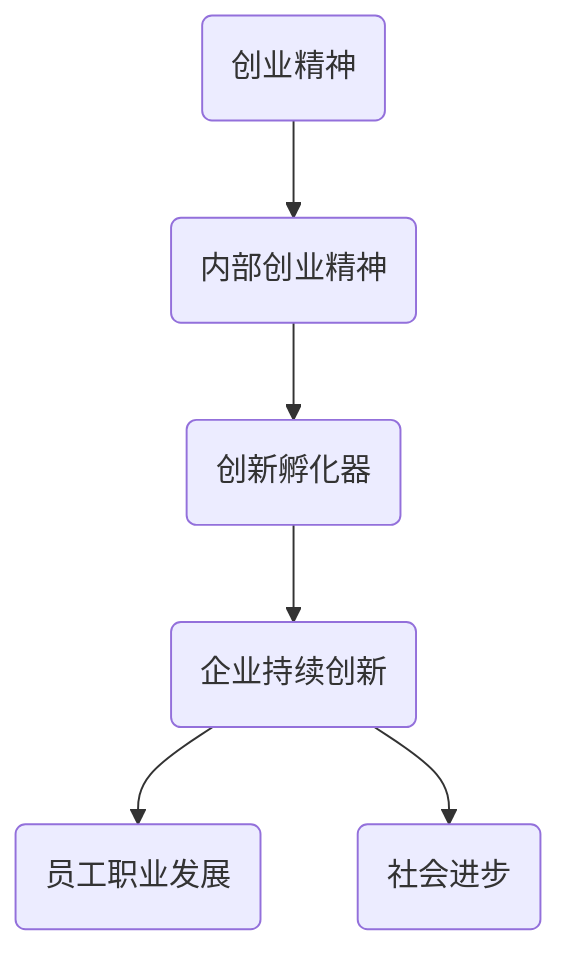

                 

# 建立创新孵化器：培养内部创业精神

## 关键词

- 创新孵化器
- 内部创业精神
- 企业文化
- 创新项目
- 管理机制
- 激励机制
- 成功案例

## 摘要

本文旨在探讨如何建立创新孵化器以培养内部创业精神，推动企业持续创新。首先，我们分析了创业精神和内部创业精神的定义及其重要性。接着，本文详细介绍了创新孵化器的设计原则、架构设计、运营管理和内部创业精神的培养与激励机制。随后，通过国内外成功案例的分享，我们总结了建立创新孵化器的关键要素和运营注意事项。最后，对内部创业精神的认识、创新孵化器建设的关键点进行了小结，并对未来创新孵化器的发展趋势和企业内部创业的挑战与机遇进行了展望。

## 第一部分：问题背景与核心概念

### 第1章：问题背景与核心概念

#### 1.1 创业精神的定义与重要性

创业精神，是指那些勇于冒险、追求创新、拥抱变化的态度和行为。其核心在于应对不确定性，以及在面对挑战时展现出的坚持和决心。从经济学的角度来看，创业精神是企业发展的催化剂，它能够推动市场创新、创造就业机会，并促进经济增长（Bhide, 2000）。具体来说，创业精神体现在以下几个方面：

1. **创新驱动**：创业精神鼓励员工不断探索新的业务模式、技术和产品，以满足市场需求。
2. **自主性**：创业者通常具有高度的自主性，能够在企业内部自主决策、承担责任。
3. **适应性**：在快速变化的市场环境中，创业精神使企业能够迅速调整策略，以应对外部环境的变化。
4. **持续学习**：创业精神强调不断学习和成长，以保持企业的竞争力和创新能力。

重要性方面，创业精神对于企业和个人发展具有深远的影响。对企业而言，拥有创业精神的团队能够更快速地适应市场变化，抓住新的商业机会，从而实现持续增长。对个人而言，创业精神能够激发员工的创造力和潜力，提高职业满意度和成就感（Shane & Venkatraman, 2000）。

#### 1.2 内部创业精神的内涵

内部创业精神，指的是员工在企业内部自主创业、创新和解决问题的意愿和能力。这种精神不仅体现在创业型企业中，也在传统的大型企业中发挥着重要作用。内部创业精神具有以下几个特点：

1. **主动性**：员工主动寻找创新机会，提出改进建议，并积极参与创新项目的实施。
2. **团队协作**：内部创业精神强调团队协作，通过跨部门合作实现创新目标。
3. **持续改进**：内部创业精神鼓励员工不断优化现有产品和服务，提高企业竞争力。
4. **风险承担**：员工愿意承担创新过程中的风险，并在失败中吸取教训。

内部创业精神的重要性体现在以下几个方面：

1. **促进企业创新**：内部创业精神能够激发员工的创新潜力，推动企业持续创新。
2. **提高员工满意度**：通过提供创新和创业的机会，提高员工的职业满意度和忠诚度。
3. **增强企业活力**：内部创业精神使企业保持活力和竞争力，适应快速变化的市场环境。

#### 1.3 建立创新孵化器的必要性

创新孵化器，是指为创新项目和创业团队提供全方位支持的平台。它不仅提供物理空间，还包括资金、技术、市场资源、管理支持等多种服务。建立创新孵化器的必要性主要体现在以下几个方面：

1. **激发内部创业精神**：创新孵化器为企业内部员工提供了实践创业精神的平台，激发了员工的创新热情。
2. **推动企业持续创新**：通过孵化器，企业能够迅速将创新想法转化为实际产品和服务，推动企业持续创新。
3. **降低创业风险**：创新孵化器为创业团队提供了必要的资源和支持，降低了创业风险，提高了项目成功的可能性。
4. **培养创新型人才**：创新孵化器为员工提供了锻炼和成长的机会，培养了一批具备创新精神和实践能力的人才。

综上所述，建立创新孵化器是培养内部创业精神、推动企业持续创新的重要手段。接下来，我们将进一步探讨创新孵化器的设计原则与架构，以及如何进行运营管理。

### 1.4 建立创新孵化器的意义

建立创新孵化器不仅对企业发展具有重要意义，也对员工成长和社会进步产生了深远的影响。

1. **企业发展的驱动力**：创新孵化器作为企业内部创新的重要平台，能够为企业提供源源不断的创新项目，推动企业在竞争激烈的市场中保持领先地位。通过孵化器，企业可以快速响应市场变化，抢占先机，实现持续增长。

2. **员工职业发展的机会**：创新孵化器为员工提供了广阔的发展空间和多样化的职业选择。员工可以通过参与孵化器项目，锻炼自己的创新能力和项目管理能力，提升个人职业素养。同时，内部创业机会也为员工实现职业晋升和薪酬增长提供了可能。

3. **社会进步的推动力**：创新孵化器不仅能够推动企业技术创新，还能够促进社会经济的全面发展。通过孵化器，企业能够将科技成果转化为实际生产力，推动产业升级和经济增长。同时，创新孵化器也为创业者提供了创业环境和资源支持，激发了全社会创新创业的热情。

4. **创新的生态系统**：创新孵化器不仅是企业内部创新的发源地，也是外部创新资源的汇聚地。通过建立创新孵化器，企业可以与高校、科研机构、投资机构等外部合作伙伴建立紧密合作关系，形成一个开放、共享的创新生态系统，共同推动技术创新和产业进步。

### 1.5 建立创新孵化器的挑战

尽管建立创新孵化器具有诸多优势，但在实施过程中也面临一些挑战。

1. **资源整合困难**：建立创新孵化器需要整合多种资源，包括资金、技术、市场资源和管理支持等。对于一些中小企业而言，资源整合可能成为难题，影响孵化器建设的顺利进行。

2. **管理机制不完善**：创新孵化器的运营需要一套完善的管理机制，包括项目筛选、评估、支持等环节。如果管理机制不完善，可能导致项目进展缓慢、资源浪费等问题。

3. **文化冲突**：在传统企业中建立创新孵化器，可能会面临企业文化与创业文化之间的冲突。创业者需要自由、开放的环境，而传统企业可能更加注重规范和流程。如何平衡两者之间的关系，确保创新孵化器的顺利运行，是企业管理者需要面对的挑战。

4. **风险控制**：创新孵化器中的项目往往具有较大的不确定性，如何合理评估和控制项目风险，确保孵化器的稳定运行，是企业管理者需要重视的问题。

### 1.6 核心概念与联系

为了更好地理解创新孵化器与内部创业精神之间的关系，我们可以使用Mermaid流程图来展示核心概念之间的联系。

图1：创业精神、内部创业精神、创新孵化器与企业持续创新、员工职业发展、社会进步之间的联系

通过上述Mermaid流程图，我们可以清晰地看到，创业精神是内部创业精神的基础，而创新孵化器则是培养内部创业精神、推动企业持续创新的重要平台。内部创业精神的培养不仅有助于企业实现持续创新，也有利于员工个人职业发展和社会进步。

## 第二部分：创新孵化器的设计与运营

### 第2章：创新孵化器的设计原则与架构

#### 2.1 创新孵化器的设计原则

创新孵化器的设计原则是确保其能够有效支持创新项目和创业团队的关键。以下是一些主要的设计原则：

1. **灵活性**：创新孵化器应具备灵活的空间布局，以适应不同项目的需求。例如，可以设置开放式办公区、会议室、实验室等，以便员工根据项目需要自由选择工作环境。

2. **资源共享**：创新孵化器应提供共享资源，如会议室、实验室、设备等，以降低创业项目的成本，提高资源利用率。

3. **技术支持**：为孵化项目提供必要的技术支持，包括云计算、大数据、人工智能等技术，以帮助创业团队快速实现技术创新。

4. **市场推广**：创新孵化器应帮助创业团队进行市场推广，提供市场调研、品牌推广、市场营销等支持，以提高项目的市场竞争力。

5. **资金支持**：创新孵化器可以提供一定的资金支持，包括创业资金、贷款担保等，以帮助创业项目顺利启动。

6. **政策支持**：创新孵化器应了解并利用相关政策，如税收优惠、资金补贴等，为创业项目提供政策支持。

#### 2.2 创新孵化器的架构设计

创新孵化器的架构设计包括硬件设施和软件设施两个层面。以下是一些关键的设计要素：

1. **硬件设施**：
   - **办公空间**：提供足够的办公空间，以满足不同团队的办公需求。空间设计应注重灵活性和舒适度，如开放式办公区、会议室、讨论区等。
   - **实验室**：为技术型创业项目提供实验室空间，配备必要的实验设备和工具，以支持技术创新。
   - **会议室**：设置多个会议室，供团队会议、项目讨论和商务洽谈使用。

2. **软件设施**：
   - **管理信息系统**：建立有效的管理信息系统，包括项目管理系统、人力资源管理系统、财务管理系统等，以支持孵化器的运营和管理。
   - **技术支持平台**：为创业团队提供技术支持平台，包括技术文档、在线培训、技术咨询等，以帮助团队解决技术难题。
   - **市场推广平台**：建立市场推广平台，包括品牌推广、市场营销、客户关系管理等，以支持项目的市场推广。

#### 2.3 设计原则与架构设计的关系

设计原则与架构设计之间存在着密切的关系。设计原则为架构设计提供了指导思想，确保架构设计能够满足创新孵化器的功能需求。例如，灵活性原则要求硬件设施能够适应不同项目的需求，这体现在办公空间、实验室和会议室的设计上。而资源共享原则则体现在硬件设施和软件设施的设计中，确保资源能够被高效利用。

同时，架构设计也需要遵循设计原则。例如，在硬件设施方面，办公空间的设计应考虑灵活性，提供可移动的隔断和可调节的照明，以满足不同团队的需求。在软件设施方面，管理信息系统的设计应确保资源共享，如项目管理系统应能够支持多项目并行，人力资源管理系统应能够支持灵活的人员调度等。

综上所述，创新孵化器的设计原则与架构设计相互关联，共同确保孵化器的功能实现和运营效率。通过遵循设计原则和进行合理的架构设计，创新孵化器能够为创业团队提供全方位的支持，推动企业持续创新。

### 2.4 创新孵化器的设计原则与架构设计之间的关系

设计原则与架构设计之间的关系是创新孵化器成功运作的关键。设计原则为孵化器的整体布局和功能设定了方向，而架构设计则将这些原则转化为实际操作和实施手段。

#### 1. 设计原则对架构设计的影响

- **灵活性**：设计原则中的灵活性要求孵化器能够适应快速变化的需求。架构设计需要考虑到办公空间的模块化设计，便于调整布局；技术平台需要具备可扩展性，支持新技术的快速集成。
- **资源共享**：这一原则要求硬件和软件资源的有效分配与利用。架构设计需考虑资源的集中管理与分配机制，如共享实验室、云服务平台的搭建，以及技术支持平台的建立。
- **技术支持**：技术支持的设计原则要求孵化器提供强大的技术基础设施。架构设计则需确保技术平台的稳定性、安全性和灵活性，如采用分布式架构以提高系统的可靠性和可扩展性。
- **市场推广**：市场推广原则要求孵化器具备有效的市场资源。架构设计需集成市场分析、品牌推广和客户关系管理功能，提供一站式服务。
- **资金支持**：资金支持原则要求孵化器能够提供财务和管理支持。架构设计则需集成财务管理系统，确保资金使用的透明和高效。

#### 2. 架构设计对设计原则的实现

- **灵活性**：架构设计通过模块化组件和灵活的接口，实现了办公空间和技术的快速调整和重新配置，满足了灵活性原则。
- **资源共享**：架构设计通过集成管理信息系统，实现了资源的高效共享和分配，如通过虚拟化技术实现计算资源的高效利用。
- **技术支持**：架构设计通过构建强大的技术基础设施，如云平台和集成开发环境（IDE），确保了技术支持原则的实现，提供了快速的技术响应和问题解决。
- **市场推广**：架构设计通过集成营销自动化工具和客户关系管理（CRM）系统，提供了全面的市场推广支持，满足了市场推广原则。
- **资金支持**：架构设计通过集成财务管理软件和资金管理系统，实现了资金使用的透明化和高效管理，满足了资金支持原则。

#### 3. 两者之间的协调与优化

设计原则与架构设计之间的协调与优化是确保孵化器成功运作的关键。以下是一些优化策略：

- **定期评估**：定期对设计原则和架构设计进行评估，确保两者的一致性和适应性。通过用户反馈和性能指标，及时调整架构设计以满足新的需求。
- **迭代开发**：采用迭代开发方法，逐步完善架构设计，确保其能够持续适应变化。每次迭代都应基于当前的设计原则，确保架构的持续优化。
- **跨部门协作**：鼓励不同部门之间的协作，确保设计原则在架构设计中的落实。如IT部门和市场部门共同合作，优化市场推广平台的架构设计。
- **培训与沟通**：定期组织培训，提高团队成员对设计原则和架构设计的理解，确保他们能够在实际操作中有效应用。同时，加强部门间的沟通，确保设计原则在架构设计中的有效传达和执行。

通过上述策略，设计原则和架构设计之间可以形成良好的协同效应，确保创新孵化器能够有效地支持内部创业精神，推动企业持续创新。

### 第3章：创新孵化器的运营管理

#### 3.1 创新项目的筛选与评估

创新项目的筛选与评估是创新孵化器运营管理的核心环节。有效的项目筛选与评估机制能够确保孵化器资源的合理利用，提高项目的成功率。以下是创新项目的筛选与评估流程：

1. **项目申请**：创新项目的发起者需提交项目申请，包括项目概述、市场前景、技术路线、团队组成、资金需求等内容。

2. **初步筛选**：孵化器管理团队对项目申请进行初步筛选，主要关注项目的创新性、可行性、市场潜力以及团队的专业背景。对于不符合要求的项目，将直接拒绝。

3. **详细评估**：对于通过初步筛选的项目，管理团队将进行详细评估。评估内容包括：
   - **技术创新性**：项目的创新程度及其在市场中的竞争力。
   - **市场前景**：项目的市场容量、目标用户群体、市场需求分析等。
   - **团队实力**：团队的专业技能、项目管理经验、合作能力等。
   - **资金预算**：项目的资金需求、预算分配、资金使用计划等。

4. **立项决策**：根据评估结果，管理团队将做出立项决策。通过立项的项目将获得孵化器的资源支持，包括办公空间、技术支持、市场推广等。

5. **项目跟踪与评估**：项目立项后，管理团队将对项目进展进行定期跟踪与评估，确保项目按计划进行。项目评估指标包括项目进度、技术实现情况、市场反馈、资金使用情况等。

#### 3.2 创新项目的管理与支持

创新项目的管理与支持是确保项目成功实施的关键。以下是创新项目管理和支持体系的主要内容：

1. **项目管理**：
   - **项目计划**：制定详细的项目计划，包括项目目标、时间表、任务分配、资源需求等。
   - **进度跟踪**：建立项目进度跟踪系统，定期检查项目进展情况，确保项目按计划进行。
   - **风险管理**：识别和评估项目风险，制定风险应对策略，降低项目风险。

2. **技术支持**：
   - **技术咨询**：为项目团队提供技术咨询服务，解决项目在技术实现过程中遇到的问题。
   - **技术培训**：组织技术培训，提高项目团队的技术能力，确保项目顺利进行。

3. **市场推广**：
   - **市场调研**：进行市场调研，了解目标用户需求，为项目提供市场方向指导。
   - **品牌推广**：为项目提供品牌推广支持，提高项目在市场中的知名度。
   - **客户关系管理**：建立客户关系管理系统，管理项目客户信息，维护客户关系。

4. **资金支持**：
   - **财务监督**：对项目的资金使用进行监督，确保资金使用的合规性和有效性。
   - **融资支持**：为项目提供融资支持，包括股权融资、债务融资等，帮助项目解决资金问题。

#### 3.3 创新项目的评估与退出机制

创新项目的评估与退出机制是孵化器运营管理的重要组成部分。以下是创新项目评估与退出机制的主要内容：

1. **项目评估**：
   - **定期评估**：定期对项目进行评估，包括项目进度、技术实现、市场反馈、资金使用等方面。
   - **绩效评估**：对项目团队的绩效进行评估，包括项目完成情况、创新能力、团队合作等。

2. **项目退出机制**：
   - **成功退出**：当项目成功实现预期目标时，项目团队可以选择成功退出孵化器，继续在市场上独立发展。
   - **失败退出**：当项目未能实现预期目标时，孵化器可以采取以下措施：
     - **项目终止**：对于无法继续推进的项目，孵化器可以终止项目，确保资源不被浪费。
     - **团队解散**：对项目团队进行解散，团队成员可以选择加入其他项目或回到原岗位。
     - **经验总结**：对项目失败原因进行总结，为未来项目提供经验教训。

通过建立有效的创新项目筛选与评估机制、完善的项目管理与支持体系，以及科学的评估与退出机制，创新孵化器能够确保项目的高效运作，推动企业持续创新。

### 3.4 创新项目的管理与支持体系

创新项目的管理与支持体系是孵化器成功运作的关键。以下是创新项目的管理与支持体系的主要内容和实施步骤：

#### 1. **项目管理流程**

- **项目启动会**：在项目启动时，组织项目启动会议，明确项目目标、里程碑、任务分配和职责分工。
- **定期项目评审**：每季度或每月召开项目评审会议，评估项目进度、风险、预算和团队绩效，确保项目按计划推进。
- **风险管理**：建立风险管理机制，定期识别和评估项目风险，制定相应的风险应对措施。

#### 2. **技术支持**

- **技术培训**：为项目团队提供专业培训，提升团队成员的技术能力和知识水平。
- **技术咨询**：建立技术咨询团队，为项目团队提供技术难题的解决方案，确保项目的技术可行性。
- **技术协作平台**：搭建技术协作平台，促进团队成员之间的沟通和合作，提高项目效率。

#### 3. **市场推广**

- **市场调研**：进行市场调研，了解目标市场的需求、竞争对手情况等，为项目提供市场方向指导。
- **品牌建设**：为项目提供品牌建设支持，包括品牌定位、品牌形象设计、品牌传播等。
- **市场推广活动**：组织市场推广活动，如产品发布会、参展等，提升项目的市场知名度和影响力。

#### 4. **资金管理**

- **资金预算**：制定详细的资金预算计划，明确项目各阶段的资金需求和使用计划。
- **资金审批**：建立资金审批流程，确保资金使用的合规性和透明性。
- **融资支持**：为项目提供融资支持，包括股权融资、债务融资等，帮助项目解决资金问题。

#### 5. **绩效评估**

- **绩效指标**：制定项目绩效指标，包括项目进度、技术实现、市场反馈、资金使用等。
- **绩效评估**：定期对项目团队和项目进行绩效评估，根据评估结果调整项目计划和资源配置。

#### 6. **支持体系实施步骤**

1. **制定支持体系策略**：根据孵化器的目标和资源情况，制定创新项目的支持体系策略。
2. **建立支持体系组织架构**：明确各个支持职能部门的职责和角色，建立有效的沟通和协作机制。
3. **实施支持体系流程**：制定支持体系的具体流程和操作规范，确保支持活动的有序进行。
4. **监控和评估支持体系效果**：定期对支持体系的效果进行监控和评估，根据反馈调整和支持体系的优化。

通过建立完善的管理与支持体系，创新孵化器能够为创业团队提供全方位的支持，确保项目的顺利推进和成功孵化。

### 3.5 创新项目的管理与支持系统：系统架构设计

为了确保创新项目的管理与支持系统能够高效运作，我们需要进行系统架构设计。以下是创新项目管理与支持系统的架构设计：

#### 1. **系统功能模块**

创新项目管理系统应包括以下主要功能模块：

- **项目规划模块**：用于项目立项、任务分配、时间规划和资源调度。
- **进度跟踪模块**：用于实时监控项目进度，提供进度报告和预警机制。
- **风险控制模块**：用于识别、评估和管理项目风险。
- **技术支持模块**：提供技术咨询、技术培训和技术协作平台。
- **市场推广模块**：进行市场调研、品牌建设和市场推广活动。
- **财务管理模块**：进行资金预算、审批和融资支持。
- **绩效评估模块**：用于项目绩效评估和团队绩效评估。

#### 2. **系统架构设计**

系统架构设计应考虑以下几个方面：

- **分布式架构**：采用分布式架构，以提高系统的可扩展性和容错性。
- **微服务架构**：将系统划分为多个微服务，每个微服务负责特定的功能，以提高系统的模块化和灵活性。
- **前端技术**：采用现代前端技术，如React、Vue.js等，提供友好的用户界面和高效的交互体验。
- **后端技术**：采用Spring Boot、Django等后端框架，提供强大的数据处理能力和接口服务。
- **数据库设计**：采用关系数据库（如MySQL、PostgreSQL）和非关系数据库（如MongoDB、Redis），以满足不同类型的数据存储需求。

#### 3. **系统接口设计**

系统接口设计应考虑以下几个方面：

- **RESTful API**：采用RESTful API设计，提供标准化、可扩展的接口服务。
- **数据接口**：设计数据接口，实现系统模块之间的数据交换和共享。
- **安全接口**：设计安全接口，确保系统数据的安全性和完整性。

#### 4. **系统交互设计**

系统交互设计应考虑以下几个方面：

- **用户交互**：设计友好的用户交互界面，提供便捷的操作体验。
- **系统交互**：设计系统模块之间的交互流程，确保系统各模块协同工作，提高系统效率。
- **自动化流程**：设计自动化流程，减少人工操作，提高系统运行效率。

通过上述系统架构设计，创新项目管理系统将能够高效运作，为创新项目的管理与支持提供坚实的基础。

### 3.6 创新项目的管理与支持系统：实际案例分析

为了更好地理解创新项目的管理与支持系统的实际应用，以下我们通过一个实际案例进行详细分析。

#### 案例背景

某企业创新孵化器决定启动一个名为“智能医疗诊断系统”的创新项目。该项目旨在通过人工智能技术，开发一款能够自动识别和诊断医疗影像的系统，以提高医疗诊断的效率和准确性。

#### 项目启动

1. **项目申请**：项目发起者提交了项目申请，包括项目概述、市场前景、技术路线、团队组成和资金需求等内容。
2. **初步筛选**：孵化器管理团队对项目申请进行初步筛选，评估其创新性和可行性，最终决定立项。
3. **详细评估**：管理团队对项目进行详细评估，确认项目的技术创新性、市场潜力以及团队的专业背景，并批准项目立项。

#### 项目管理

1. **项目启动会**：在项目启动时，组织项目启动会议，明确项目目标、里程碑、任务分配和职责分工。
2. **进度跟踪**：建立项目进度跟踪系统，定期检查项目进展情况，确保项目按计划进行。
3. **风险管理**：识别和评估项目风险，制定相应的风险应对措施，如技术难题、数据隐私等。

#### 技术支持

1. **技术培训**：为项目团队提供人工智能和医疗影像处理的专业培训，提升团队的技术能力。
2. **技术咨询**：建立技术咨询团队，为项目团队提供技术难题的解决方案，确保项目的技术可行性。
3. **技术协作平台**：搭建技术协作平台，促进团队成员之间的沟通和合作，提高项目效率。

#### 市场推广

1. **市场调研**：进行市场调研，了解目标市场的需求、竞争对手情况等，为项目提供市场方向指导。
2. **品牌建设**：为项目提供品牌建设支持，包括品牌定位、品牌形象设计、品牌传播等。
3. **市场推广活动**：组织市场推广活动，如产品发布会、参展等，提升项目的市场知名度和影响力。

#### 资金管理

1. **资金预算**：制定详细的资金预算计划，明确项目各阶段的资金需求和使用计划。
2. **资金审批**：建立资金审批流程，确保资金使用的合规性和透明性。
3. **融资支持**：为项目提供融资支持，包括股权融资、债务融资等，帮助项目解决资金问题。

#### 项目评估与退出

1. **定期评估**：定期对项目进行评估，包括项目进度、技术实现、市场反馈、资金使用等方面。
2. **项目绩效评估**：对项目团队和项目进行绩效评估，根据评估结果调整项目计划和资源配置。
3. **项目退出**：当项目成功实现预期目标时，项目团队可以选择成功退出孵化器，继续在市场上独立发展。

通过上述实际案例，我们可以看到，创新项目的管理与支持系统在项目启动、管理、支持、评估和退出等各个环节中都发挥了重要作用，确保了项目的顺利推进和成功孵化。

### 3.7 创新孵化器的运营注意事项

创新孵化器的运营成功不仅依赖于其设计和管理体系的完善，还需要在运营过程中注意以下几个方面：

#### 1. **资源整合**

资源整合是创新孵化器运营的关键。孵化器需要充分利用内部和外部资源，包括资金、技术、人才和市场资源。通过与高校、科研机构、行业合作伙伴和投资机构的合作，孵化器可以获取更多资源，为创新项目提供全方位的支持。同时，孵化器内部应建立资源共享机制，确保资源的高效利用。

#### 2. **风险管理**

创新项目的成功往往伴随着较大的不确定性，因此，风险管理是创新孵化器运营的重要环节。孵化器需要建立完善的风险评估和管理机制，对项目的风险进行识别、评估和监控，并制定相应的风险应对策略。例如，可以通过设置风险预警机制、建立风险缓冲资金、引入外部专家进行风险评估等方式来降低项目风险。

#### 3. **激励机制**

激励机制对于激发内部创业精神和促进项目成功至关重要。孵化器应建立与创业贡献相关的激励机制，包括薪酬激励、股权激励、荣誉激励等。例如，可以设立项目奖金、绩效奖金等，以奖励在项目中表现突出的团队成员。此外，还可以通过晋升机会、培训机会等激励措施，提高员工的积极性和创造力。

#### 4. **文化建设**

创新孵化器的文化建设对于营造良好的创新氛围至关重要。孵化器应建立开放、包容、支持的创新文化，鼓励员工勇于尝试、持续创新。例如，可以通过定期举办创新竞赛、创新分享会等活动，激发员工的创新热情。同时，孵化器应鼓励跨部门合作，促进信息共享和资源整合。

#### 5. **持续优化**

创新孵化器的运营是一个持续优化的过程。孵化器需要不断收集用户反馈和市场信息，对运营模式和管理体系进行评估和调整。例如，可以通过定期进行用户满意度调查、市场趋势分析等方式，了解用户需求和市场竞争态势，从而优化孵化器的服务内容和运营策略。

通过关注资源整合、风险管理、激励机制、文化建设和持续优化等方面，创新孵化器可以更好地支持内部创业精神，推动企业持续创新。

### 第4章：内部创业精神的培养与激励机制

#### 4.1 培养内部创业精神的方法

内部创业精神的培养是确保创新孵化器成功运作的关键。以下是一些有效的方法：

1. **培训与教育**：通过定期开展创业培训和教育，提高员工对创业精神的理解和实践能力。培训内容可以包括创业基础、市场营销、财务管理、团队建设等，帮助员工掌握必要的知识和技能。

2. **项目制管理**：通过项目制管理，让员工参与到实际项目中，亲身体验创业过程。项目制管理不仅能够锻炼员工的实践能力，还能增强团队的协作精神和创新意识。

3. **鼓励尝试与失败**：鼓励员工勇于尝试新想法，并接受失败。在创新孵化器中，失败被视为学习和成长的机会，而非失败的标志。这种开放的氛围有助于员工敢于冒险，勇于创新。

4. **跨部门合作**：通过跨部门合作，促进不同领域知识的交流和融合，激发员工的创新思维。跨部门合作可以打破部门壁垒，形成创新合力。

5. **提供资源支持**：为员工提供必要的资源支持，包括资金、技术、市场资源等。资源支持有助于降低员工的创业风险，提高项目的成功率。

6. **构建支持网络**：建立内部创业支持网络，包括导师制、同事互助等，为员工提供专业的指导和支持。支持网络有助于员工在创业过程中获得及时的帮助和反馈，提高创业成功率。

#### 4.2 内部创业激励机制的构建

内部创业激励机制是确保员工积极参与创新项目的关键。以下是一些有效的激励机制：

1. **薪酬激励**：设立与创业贡献挂钩的薪酬激励，包括基本工资、绩效奖金、股权激励等。薪酬激励可以提高员工的积极性和创造力，激励他们为企业创造更大的价值。

2. **荣誉激励**：通过设立荣誉奖项，如“创新之星”、“最佳创业者”等，表彰在创新项目中表现突出的员工。荣誉激励不仅可以提高员工的荣誉感，还能激发他们的自豪感和归属感。

3. **职业发展**：为员工提供职业发展机会，包括晋升机会、培训机会等。职业发展机会可以帮助员工看到企业的长期发展前景，增强他们的长期忠诚度。

4. **股权激励**：通过股权激励，让员工分享企业成长的成果。股权激励不仅能够提高员工的积极性，还能增强他们的企业归属感。

5. **创新支持**：为员工提供创新支持，包括时间支持、资源支持、技术支持等。创新支持可以降低员工的创业风险，提高项目的成功率。

6. **工作环境**：营造有利于创新的工作环境，包括开放的工作氛围、灵活的工作安排、良好的沟通机制等。良好的工作环境有助于员工放松心情，发挥创造力。

通过培训与教育、项目制管理、鼓励尝试与失败、跨部门合作、提供资源支持、构建支持网络等培养内部创业精神的方法，以及薪酬激励、荣誉激励、职业发展、股权激励、创新支持和良好的工作环境等内部创业激励机制，创新孵化器可以有效地激发内部创业精神，推动企业持续创新。

### 4.3 内部创业激励机制的构建：详细策略与实施步骤

内部创业激励机制的有效构建是激发员工创新潜力、促进企业持续发展的重要手段。以下详细阐述构建内部创业激励机制的策略与实施步骤：

#### 1. **制定明确的激励机制目标**

在构建内部创业激励机制之前，首先要明确激励机制的总体目标。这些目标应包括：

- **激励创新行为**：通过激励措施鼓励员工提出创新想法、参与创新项目。
- **提高员工满意度**：确保员工在参与创新过程中感受到企业对其贡献的认可，提升工作满意度。
- **增强企业竞争力**：通过激励机制激发员工的创造力，推动企业技术创新，提升市场竞争力。

#### 2. **设计多样化的激励措施**

根据不同员工的兴趣、能力和需求，设计多样化的激励措施，包括：

- **薪酬激励**：提供与创业贡献挂钩的绩效奖金、股权激励等，直接提高员工收入。
- **荣誉激励**：设立创新奖项，如“年度创新明星”、“最佳团队”等，提升员工的荣誉感和成就感。
- **职业发展**：为员工提供职业晋升机会、培训机会和职业发展规划，增强员工的职业发展信心。
- **工作环境**：营造开放、自由的工作环境，鼓励员工大胆创新，提供必要的设备和技术支持。

#### 3. **制定详细的激励计划**

激励计划的制定应考虑以下几个方面：

- **激励对象**：明确激励对象，如参与创新项目的全体员工、项目负责人等。
- **激励额度**：根据项目的重要性和员工贡献程度，制定合理的激励额度，确保激励的公平性。
- **激励频率**：确定激励发放的时间节点，如项目里程碑、年度评估等。
- **激励方式**：选择合适的激励方式，如现金奖励、股权奖励、荣誉证书等。

#### 4. **实施步骤**

构建内部创业激励机制的实施步骤如下：

1. **调研和分析**：调研员工的需求和动机，分析企业现有的激励机制，为激励计划的制定提供依据。
2. **制定激励计划**：根据调研结果和激励目标，制定具体的激励计划，包括激励措施、激励额度、发放方式等。
3. **内部宣传**：通过内部邮件、会议、海报等形式，向全体员工宣传激励政策，确保员工了解并认可激励计划。
4. **实施与反馈**：按照激励计划进行实施，并及时收集员工反馈，对激励计划进行评估和调整。
5. **持续优化**：根据激励效果和员工反馈，不断优化激励计划，确保其持续适应企业和员工的需求。

#### 5. **案例分析与最佳实践**

以下通过两个案例，分析内部创业激励机制的构建与实施：

**案例一：华为的内部创业激励机制**

华为通过设立“创新奖金”、“股权激励”等多种激励措施，鼓励员工积极参与创新项目。华为每年设立专项创新基金，对在技术创新、产品创新等方面表现突出的团队和个人进行奖励。此外，华为还推行“内部创业计划”，允许员工利用企业资源自主创业，成功后可以获得相应的股权激励。这一系列激励机制极大地激发了员工的创新热情，推动了华为的持续技术创新。

**案例二：谷歌的X实验室**

谷歌的X实验室通过“股权激励”和“荣誉激励”等措施，构建了完善的内部创业激励机制。X实验室的项目负责人和关键贡献者可以获得大量股权激励，从而分享企业成长的收益。同时，谷歌还设立了“X大奖”，表彰在技术创新方面取得突破的团队和个人。这些激励机制不仅激发了员工的工作热情，还增强了团队凝聚力和企业竞争力。

通过以上案例，我们可以看到，构建内部创业激励机制需要结合企业的实际情况，设计多样化的激励措施，并确保激励计划的公平性和有效性。只有在这样的基础上，企业才能有效地激发内部创业精神，推动持续创新。

### 第5章：国内外成功案例分享

#### 5.1 国外成功案例

**谷歌的X实验室**

谷歌的X实验室（Google X）是全球最著名的创新孵化器之一，以其大胆的创新项目和颠覆性技术而闻名。X实验室成立于2010年，专注于探索和研发未来科技，包括人工智能、机器人技术、可再生能源等领域。以下是X实验室的一些成功案例：

- **谷歌眼镜**：谷歌眼镜是一款革命性的可穿戴设备，通过智能眼镜提供实时的视觉增强信息。该项目在2012年首次亮相，虽然面临一系列挑战，但最终成为谷歌的重要产品。
- **Loon项目**：Loon项目旨在通过高空气球提供互联网接入服务。该项目在2013年启动，目前已在全球多个国家和地区进行测试和部署，为偏远地区带来了互联网连接。
- **Waymo自动驾驶汽车**：Waymo是谷歌的自动驾驶汽车项目，其目标是实现完全自动化的驾驶体验。该项目自2009年开始，经过多年的研发和测试，已成为全球领先的自动驾驶技术之一。

X实验室的成功经验在于其开放的文化、强大的技术支持和长期的战略眼光。谷歌为X实验室提供了充足的资源，鼓励员工大胆创新，并允许项目失败。这种宽容失败、持续探索的文化环境，使得X实验室能够不断推出突破性的技术。

**微软的内部创业计划**

微软的内部创业计划（Microsoft Innovation Lab，简称iLab）是一个旨在激发员工创新潜力的孵化器。iLab成立于2006年，为员工提供资金、技术支持和市场资源，鼓励他们实现自己的创新想法。以下是iLab的一些成功案例：

- **Surface平板电脑**：Surface是微软的一款标志性产品，最初由iLab项目团队开发。该团队利用微软的技术优势，将平板电脑的设计、软件和硬件完美结合，最终成为微软的重要产品线之一。
- **LinkedIn**：LinkedIn最初是由微软的一名员工在2002年创办的，当时作为微软内部创业项目运营。2003年，微软将LinkedIn独立出来，并在2016年以262亿美元的价格将其收购，成为微软企业服务战略的重要组成部分。

iLab的成功经验在于其创新文化、灵活的管理机制和强大的资源支持。微软为员工提供了充分的自由度，允许他们自主决定项目方向，并提供必要的资源和支持，确保项目的顺利推进。

#### 5.2 国内成功案例

**阿里巴巴的创新孵化器计划**

阿里巴巴的创新孵化器计划是阿里巴巴集团推动内部创业和外部创新的重要手段。阿里巴巴创新孵化器（Alibaba Innovation Center）成立于2015年，旨在为阿里巴巴的员工和外部创业者提供全方位的支持，包括资金、技术、市场资源和品牌推广等。以下是阿里巴巴孵化器的一些成功案例：

- **盒马鲜生**：盒马鲜生是阿里巴巴旗下的一个新零售项目，它结合线上订单和线下体验，提供快速、便捷的购物体验。该项目由阿里巴巴内部创业团队发起，经过几年的发展，已成为中国新零售领域的领军企业之一。
- **飞猪**：飞猪是阿里巴巴旗下的一个在线旅行服务平台，它通过技术创新和大数据分析，为用户提供个性化的旅行服务。该项目由阿里巴巴内部创业团队发起，现已成为中国在线旅行市场的领先品牌之一。

阿里巴巴孵化器的成功经验在于其创新文化、强大的资源支持和开放的市场导向。阿里巴巴通过孵化器计划，不仅激发了内部创业热情，还积极拥抱外部创新，推动了整个企业的持续创新。

**华为的内部创业大赛**

华为的内部创业大赛是华为集团推动内部创新的重要活动之一。自2014年起，华为每年举办一次内部创业大赛，鼓励员工提出创新项目，并给予获奖团队资金、技术、市场等方面的支持。以下是华为内部创业大赛的一些成功案例：

- **华为云**：华为云是华为内部创业大赛中的一个获奖项目，它通过提供云计算、大数据、人工智能等服务，帮助企业和开发者实现数字化和智能化转型。该项目经过几年的发展，已成为中国云计算市场的领军企业之一。
- **华为数字能源**：华为数字能源是华为内部创业大赛中的另一个获奖项目，它专注于能源领域的创新，提供智慧能源解决方案。该项目通过技术创新和业务模式创新，已成为华为在能源领域的重要业务板块之一。

华为内部创业大赛的成功经验在于其创新的文化氛围、完善的机制和强大的支持体系。华为通过内部创业大赛，激发了员工的创新潜力，推动了企业的持续创新。

通过国内外成功案例的分享，我们可以看到，无论是谷歌的X实验室、微软的内部创业计划，还是阿里巴巴的创新孵化器计划、华为的内部创业大赛，这些成功的创新孵化器都具备一些共同的特点：开放的文化氛围、强大的资源支持、灵活的机制和明确的目标。这些特点为内部创业精神的培养提供了坚实的基础，推动了企业的持续创新。

### 第6章：最佳实践与注意事项

#### 6.1 建立创新孵化器的关键要素

建立创新孵化器需要考虑多个关键要素，这些要素是确保孵化器有效运作和成功孵化的基础。

1. **企业文化的塑造**：企业文化的塑造是创新孵化器的关键。孵化器需要营造开放、包容、支持的创新氛围，鼓励员工勇于创新和接受失败。例如，谷歌的X实验室通过宽容失败、鼓励尝试的文化，激发了员工的创新热情。

2. **资源整合**：孵化器需要整合内部和外部资源，包括资金、技术、人才和市场资源。资源整合可以借助外部合作伙伴，如高校、科研机构、行业龙头企业等，形成创新生态系统。例如，阿里巴巴通过整合互联网资源，为新零售项目提供了强大的支持。

3. **灵活的运营机制**：灵活的运营机制是孵化器成功的重要保障。孵化器需要建立快速响应和调整的机制，以适应快速变化的市场环境。例如，华为内部创业大赛通过灵活的机制，激励员工提出创新项目，并给予资金、技术等多方面的支持。

4. **专业的管理团队**：专业的管理团队是孵化器成功的关键。管理团队需要具备丰富的创新孵化经验，能够为企业提供专业的指导和帮助。例如，微软的iLab通过专业的管理团队，确保了创新项目的顺利推进。

5. **明确的目标和规划**：孵化器需要明确目标和规划，确保资源的有效利用。例如，谷歌的X实验室通过设立明确的创新目标，吸引了大量优秀人才，推动了多个颠覆性技术的研发。

#### 6.2 创新孵化器的运营注意事项

1. **风险管理**：创新孵化器在运营过程中需要高度重视风险管理。应建立完善的风险评估和管理机制，对项目进行全程监控和风险预警。例如，华为通过建立风险预警机制，确保了内部创业项目的顺利推进。

2. **激励机制**：建立与创业贡献挂钩的激励机制，可以提高员工的积极性和创造力。例如，华为通过设立创新奖金和股权激励，激励员工积极参与内部创业项目。

3. **文化建设**：创新文化建设是孵化器成功的关键。应营造开放、包容、支持的创新氛围，鼓励员工勇于创新和接受失败。例如，谷歌通过鼓励员工大胆创新、宽容失败的文化，激发了员工的创新热情。

4. **市场导向**：孵化器应密切关注市场动态，确保创新项目与市场需求相匹配。例如，阿里巴巴通过密切关注市场变化，调整创新项目的方向，确保项目的市场竞争力。

5. **持续优化**：孵化器的运营是一个持续优化的过程。应定期对运营效果进行评估和反馈，根据实际情况进行调整和改进。例如，阿里巴巴通过定期评估创新项目的效果，不断优化孵化器运营策略。

通过以上最佳实践和注意事项，企业可以更好地建立和运营创新孵化器，培养内部创业精神，推动企业持续创新。

### 第7章：小结与展望

#### 7.1 小结

本文通过系统分析，全面探讨了如何建立创新孵化器以培养内部创业精神。我们首先明确了创业精神和内部创业精神的定义及其重要性，并探讨了建立创新孵化器的必要性。接着，详细介绍了创新孵化器的设计原则与架构，包括灵活性、资源共享、技术支持、市场推广和资金支持等。我们还阐述了创新孵化器的运营管理，包括项目筛选与评估、项目管理与支持、评估与退出机制等。此外，本文通过国内外成功案例，分享了创新孵化器的最佳实践。最后，我们总结了建立创新孵化器的关键要素和运营注意事项。

#### 7.2 展望

未来，创新孵化器的发展趋势将更加注重数字化和智能化。随着人工智能、大数据、物联网等技术的发展，孵化器将更加依赖数字化工具和平台，提高运营效率和管理水平。同时，创新孵化器将更加重视生态系统的建设，通过搭建开放、共享的创新平台，吸引更多外部资源和合作伙伴，形成多方共赢的格局。在挑战方面，企业需要面对资源整合难度、管理机制不完善、文化冲突和风险控制等挑战。然而，通过持续优化和创新，企业可以克服这些挑战，实现内部创业精神的培养和企业的持续创新。

#### 7.3 结论

总之，建立创新孵化器是培养内部创业精神、推动企业持续创新的重要手段。通过本文的分析和探讨，我们不仅了解了创新孵化器的设计原则和运营管理，还学习了国内外成功案例的实践经验。我们希望本文能为企业在建立和创新孵化器过程中提供有益的参考和启示，推动企业实现更高水平的创新和成长。

## 作者信息

作者：AI天才研究院/AI Genius Institute & 禅与计算机程序设计艺术 /Zen And The Art of Computer Programming

