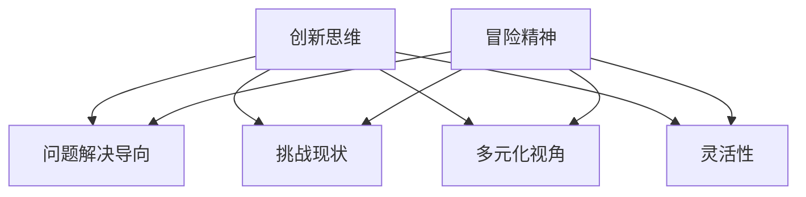
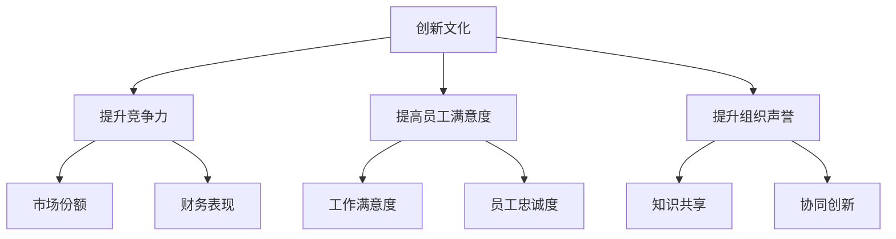
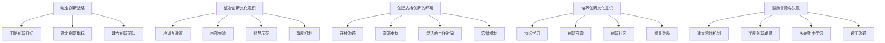

                 

## 建立创新文化：鼓励冒险和创意的环境营造

### 关键词：创新文化、冒险精神、创意环境、组织绩效、成功案例

### 摘要：本文旨在探讨如何建立一种能够鼓励冒险和创意的创新文化。通过详细分析创新文化的核心概念、理论基础和实践指南，结合成功案例，提供策略和方法，以帮助组织营造一个有利于创新的环境，提升整体绩效。

### 目录

----------------------------------------------------------------

## 第一部分: 创新文化的概念与重要性

### 第1章: 创新文化概述

### 第2章: 创新文化的核心概念

### 2.1 创新思维

#### 2.1.1 创新思维的特征

#### 2.1.2 培养创新思维的方法

### 2.2 冒险精神

#### 2.2.1 冒险精神的重要性

#### 2.2.2 鼓励冒险的方法

### 2.3 团队合作

#### 2.3.1 团队合作与创新文化

#### 2.3.2 提高团队协作效率的技巧

## 第二部分: 建立创新文化的理论基础

### 第3章: 组织行为学视角

### 第4章: 心理学视角

### 第5章: 管理学视角

## 第三部分: 建立创新文化的实践指南

### 第6章: 制定创新战略

### 6.1 明确创新目标

### 6.2 设定创新指标

### 6.3 创新文化塑造的步骤

### 6.4 创建支持创新的环境

### 6.5 培养创新文化意识

### 6.6 鼓励冒险与失败

### 6.7 建立容错机制

### 6.8 奖励创新成果

## 第四部分: 案例分析

### 第7章: 成功案例

### 7.1 谷歌的创新文化

### 7.2 3M公司的创新文化

### 7.3 A公司的教训

## 第五部分: 维护与发展创新文化

### 第8章: 维护与创新文化

### 8.1 创新文化的动态调整

### 8.2 面对挑战的策略

### 8.3 创新文化的持续发展

## 第六部分: 小结与拓展

### 第9章: 小结

### 9.1 创新文化的要点回顾

### 9.2 注意事项

### 9.3 拓展阅读

## 第七部分: 结论

### 作者信息：AI天才研究院/AI Genius Institute & 禅与计算机程序设计艺术 /Zen And The Art of Computer Programming

----------------------------------------------------------------

### 第1章: 创新文化概述

### 1.1 创新文化的定义

创新文化是一种组织内部的价值观和行为模式，强调持续创新、冒险精神和团队合作，以应对不断变化的市场和技术环境。它不仅是一种文化氛围，更是一种推动组织不断进步和发展的动力。

### 1.2 创新文化的核心概念

创新文化包括以下几个核心概念：

1. **创新思维**：强调问题解决、挑战现状和多元化视角。
2. **冒险精神**：鼓励尝试新方法，接受失败，从错误中学习。
3. **团队合作**：强调团队协作和知识共享。

### 1.3 创新文化的重要性

创新文化对组织的绩效和长期发展具有重大影响：

1. **提升竞争力**：通过创新不断推出新产品和服务，满足客户需求。
2. **增强员工积极性**：激发员工的创造力和主动性，提高工作满意度。
3. **促进知识共享**：通过团队合作，实现知识和经验的广泛传播。

### 1.4 创新文化与组织绩效的关系

研究表明，创新文化能够显著提升组织的绩效：

1. **市场份额**：创新文化使组织能够更快地适应市场变化，扩大市场份额。
2. **财务表现**：创新文化有助于提高组织的盈利能力和股价表现。
3. **员工满意度**：创新文化能够提高员工的工作满意度和忠诚度。

### 1.5 创新文化的挑战

建立创新文化并非易事，组织可能面临以下挑战：

1. **传统思维的束缚**：许多组织存在陈旧的思维模式，难以接受新观念。
2. **资源限制**：创新需要投入大量资源，组织可能难以承受。
3. **组织结构问题**：过于官僚的组织结构可能抑制创新。

### 1.6 小结

创新文化是组织持续发展的关键。通过理解其核心概念和重要性，组织可以更好地应对挑战，建立一种有利于创新的环境。在接下来的章节中，我们将深入探讨创新文化的具体实践方法和成功案例。

----------------------------------------------------------------

### 第2章: 创新文化的核心概念

### 2.1 创新思维

#### 2.1.1 创新思维的特征

创新思维是创新文化的重要组成部分，它具有以下特征：

1. **问题解决导向**：创新思维专注于解决实际问题，而不是仅仅提出问题。
2. **挑战现状**：创新思维敢于质疑现有做法，寻找改进空间。
3. **多元化视角**：创新思维从多个角度审视问题，以发现最佳解决方案。
4. **灵活性**：创新思维适应变化，不拘泥于传统方法。

#### 2.1.2 培养创新思维的方法

要培养创新思维，可以采取以下几种方法：

1. **思维训练**：通过练习如头脑风暴、思维导图等技巧，提高思维的灵活性。
2. **跨学科学习**：拓展知识面，学习不同领域的知识和思维方式。
3. **实践操作**：通过实际项目操作，锻炼解决问题的能力。

### 2.2 冒险精神

#### 2.2.1 冒险精神的重要性

冒险精神是创新文化中不可或缺的要素，它的重要性体现在：

1. **促进创新**：冒险精神鼓励尝试新方法，是创新的源泉。
2. **培养韧性**：面对失败，冒险精神使人保持乐观，不断尝试。
3. **激发创造力**：冒险精神激发个人和团队的创造力，推动创新。

#### 2.2.2 鼓励冒险的方法

为了鼓励冒险精神，组织可以采取以下几种方法：

1. **建立容错机制**：允许失败，并为失败提供支持和反馈。
2. **奖励冒险行为**：对成功和失败的冒险行为给予认可和奖励。
3. **提供资源支持**：为冒险项目提供必要的资源和时间。

### 2.3 团队合作

#### 2.3.1 团队合作与创新文化

团队合作是创新文化的重要支柱，它有助于：

1. **知识共享**：团队成员共享知识和经验，加速创新过程。
2. **协同创新**：通过团队合作，不同背景的成员可以产生更多创新思路。
3. **增强团队凝聚力**：团队合作有助于建立信任和归属感，增强团队凝聚力。

#### 2.3.2 提高团队协作效率的技巧

提高团队协作效率可以采取以下几种技巧：

1. **明确目标**：确保所有团队成员都清楚团队的目标和期望成果。
2. **有效沟通**：建立良好的沟通渠道，确保信息的及时传递和反馈。
3. **分工协作**：合理分配任务，发挥每个成员的专业优势。

### 2.4 创新思维的属性特征对比表格

| 特征 | 创新思维 | 传统思维 |
| ---- | -------- | -------- |
| **问题解决导向** | 是 | 否 |
| **挑战现状** | 是 | 否 |
| **多元化视角** | 是 | 否 |
| **灵活性** | 是 | 否 |

### 2.5 创新思维与冒险精神的关系

#### 2.5.1 创新思维与冒险精神相互促进

创新思维和冒险精神是相互促进的，它们之间的关系体现在：

1. **创新思维推动冒险精神**：创新思维鼓励尝试新方法，推动冒险精神。
2. **冒险精神激发创新思维**：冒险精神使人敢于挑战，激发创新思维。

#### 2.5.2 建立创新思维与冒险精神的联系

为了建立创新思维与冒险精神的联系，组织可以：

1. **鼓励提问**：对现有做法提出质疑，推动创新思维。
2. **支持尝试**：为尝试新方法提供资源和时间，鼓励冒险精神。

### 2.6 小结

创新文化的核心概念包括创新思维、冒险精神和团队合作。通过培养创新思维、鼓励冒险精神和提高团队合作效率，组织可以建立一种有利于创新的文化，推动组织的持续发展。在下一章节中，我们将探讨建立创新文化的理论基础。

----------------------------------------------------------------

### 第3章: 建立创新文化的理论基础

#### 3.1 组织行为学视角

在组织行为学的视角下，建立创新文化需要关注以下几个方面：

1. **领导风格**：领导者需要具备开放和创新的精神，鼓励员工提出新的想法和解决方案。
2. **员工参与**：提高员工的参与度，让他们在决策过程中有发言权，增加他们对组织的认同感。
3. **激励制度**：建立合理的激励制度，奖励那些具有创新精神和冒险精神的员工。

#### 3.2 心理学视角

从心理学的角度来分析，建立创新文化需要注意以下几点：

1. **认知灵活性**：鼓励员工保持开放的心态，接受新的信息和观点，提高认知灵活性。
2. **自我效能感**：通过培训和实践，提高员工的自我效能感，使他们相信自己能够胜任创新任务。
3. **心理安全感**：提供心理安全感，使员工在尝试新方法和面对失败时感到舒适和自信。

#### 3.3 管理学视角

在管理学的视角下，建立创新文化需要从组织结构和管理实践出发：

1. **组织结构**：设计扁平化的组织结构，减少层级，提高信息传递的速度和效率。
2. **管理实践**：实施团队管理，鼓励跨部门合作，促进知识的共享和创新。
3. **资源分配**：合理分配资源，确保创新项目能够得到足够的支持。

#### 3.4 创新文化与组织绩效的关系

创新文化对组织绩效的影响是多方面的：

1. **提高竞争力**：通过持续的创新，组织能够更好地适应市场变化，提高市场竞争力。
2. **提高员工满意度**：创新文化使员工感受到工作的意义和价值，提高工作满意度。
3. **提升组织声誉**：创新文化有助于提升组织在行业内的声誉，吸引更多的优秀人才。

#### 3.5 创新文化的可持续性

创新文化并非一成不变，而是需要不断维护和更新：

1. **持续学习**：组织需要不断学习新的管理理念和技术，以适应不断变化的环境。
2. **反馈机制**：建立有效的反馈机制，及时了解员工的意见和建议，不断改进创新文化。
3. **领导层的支持**：领导层需要持续关注创新文化的发展，为创新提供必要的资源和政策支持。

### 3.6 小结

建立创新文化的理论基础涉及多个领域，包括组织行为学、心理学和管理学。通过综合考虑这些因素，组织可以制定出更加科学和有效的策略，推动创新文化的发展。在下一章节中，我们将提供具体的实践指南，帮助组织建立和维持创新文化。

----------------------------------------------------------------

### 第4章: 建立创新文化的实践指南

#### 4.1 制定创新战略

建立创新文化首先需要制定明确的创新战略，这包括以下几个关键步骤：

1. **明确创新目标**：组织需要明确创新的方向和目标，确保所有成员都了解并致力于实现这些目标。
2. **评估现有资源**：评估组织的资源状况，包括人力、财务和技术等，为创新项目提供必要的支持。
3. **设定创新指标**：制定可量化的创新指标，如新产品开发数量、创新成功率等，以评估创新活动的效果。
4. **建立创新团队**：组建专门的创新团队，负责推动创新项目的实施和管理。

#### 4.2 明确创新目标

明确创新目标是创新文化建设的首要任务，具体步骤如下：

1. **市场调研**：了解市场需求和竞争对手的动态，为创新提供方向。
2. **技术趋势分析**：分析当前和未来的技术趋势，确定哪些领域可能带来创新机会。
3. **内部资源分析**：评估组织的内部资源和能力，确定哪些领域最适合进行创新。
4. **制定创新路线图**：根据以上分析，制定详细的创新路线图，明确创新的步骤和时间表。

#### 4.3 设定创新指标

设定创新指标是衡量创新成效的重要手段，以下是一些常用的创新指标：

1. **新产品开发率**：新产品或服务在总销售额中的比例。
2. **专利数量**：组织在某一时间段内获得的专利数量。
3. **创新成功率**：创新项目成功实施的比例。
4. **员工参与度**：员工在创新活动中的参与程度和积极性。

#### 4.4 塑造创新文化意识

塑造创新文化意识是建立创新文化的重要一环，以下是一些具体方法：

1. **培训与教育**：通过培训和教育，提高员工对创新的理解和认同。
2. **内部交流**：鼓励员工分享创新经验，促进知识共享和协作。
3. **领导示范**：领导层需要以身作则，展现对创新的重视和支持。
4. **激励机制**：建立激励制度，奖励那些在创新活动中表现突出的员工。

#### 4.5 创建支持创新的环境

创建支持创新的环境是鼓励员工冒险和创意的重要措施，以下是一些建议：

1. **开放沟通**：建立开放的沟通渠道，确保信息流畅传递，减少沟通障碍。
2. **资源支持**：为创新项目提供充足的资源，包括人力、财务和技术支持。
3. **灵活的工作时间**：允许员工灵活安排工作时间，以适应创新活动的需求。
4. **容错机制**：建立容错机制，鼓励员工尝试新方法，即使失败也能得到支持和鼓励。

#### 4.6 培养创新文化意识

培养创新文化意识是一个长期的过程，以下是一些建议：

1. **持续学习**：鼓励员工不断学习新知识和技能，以保持创新的能力。
2. **创新竞赛**：举办创新竞赛，激发员工的创新潜力，提高整个组织的创新氛围。
3. **创新社区**：建立创新社区，让员工能够自由交流创新想法，共同进步。
4. **领导激励**：领导层需要积极鼓励创新，为员工提供展示才华的平台。

#### 4.7 鼓励冒险与失败

鼓励冒险和失败是建立创新文化的重要环节，以下是一些建议：

1. **建立容错机制**：为冒险项目提供支持和保障，即使失败也能得到包容和理解。
2. **奖励创新成果**：对成功的创新项目给予奖励和认可，激励员工持续创新。
3. **从失败中学习**：鼓励员工从失败中吸取教训，不断提升自己的创新能力。
4. **透明沟通**：确保失败的信息能够透明传递，使组织能够从中吸取经验。

### 4.8 小结

建立创新文化需要系统的规划和实施，通过制定创新战略、明确创新目标、设定创新指标、塑造创新文化意识、创建支持创新的环境、培养创新文化意识和鼓励冒险与失败，组织可以逐步建立起一种有利于创新的文化氛围。在下一章节中，我们将通过成功案例分析，进一步探讨如何有效建立和维持创新文化。

----------------------------------------------------------------

### 第5章: 案例分析

#### 5.1 谷歌的创新文化

**案例背景：** 谷歌作为全球知名的高科技公司，以其卓越的创新文化著称。谷歌通过一系列措施，成功地建立了一种鼓励冒险和创意的环境。

**关键成功因素：**

1. **开放沟通**：谷歌强调开放和透明的沟通，鼓励员工自由交流想法，无论级别高低。
2. **资源支持**：谷歌为创新项目提供了充足的资源，包括人力、财务和技术支持。
3. **领导示范**：谷歌的创始人拉里·佩奇和谢尔盖·布林以身作则，展示了对创新的重视和支持。
4. **容错机制**：谷歌建立了容错机制，允许员工在尝试新方法时犯错，并从失败中学习。

**案例分析：** 谷歌通过开放沟通、资源支持、领导示范和容错机制，成功营造了一种鼓励冒险和创意的环境。这种文化不仅激发了员工的创新潜力，还推动了公司持续的技术创新和市场竞争力。

#### 5.2 3M公司的创新文化

**案例背景：** 3M公司是一家全球领先的创新型企业，以其强大的创新能力和丰富的创新产品而闻名。

**关键成功因素：**

1. **创新时间**：3M公司为员工提供了15%的工作时间，用于自由探索和创新。
2. **奖励制度**：3M公司建立了创新奖励制度，对那些取得创新成果的员工给予奖励。
3. **跨部门合作**：3M鼓励跨部门合作，通过团队协作实现知识和经验的共享。
4. **持续学习**：3M公司重视员工的持续学习，提供培训机会，帮助员工提升创新能力。

**案例分析：** 3M公司通过提供创新时间、奖励制度、跨部门合作和持续学习，成功建立了鼓励冒险和创意的文化。这种文化不仅促进了公司的技术创新，还提高了员工的创造力和满意度。

#### 5.3 A公司的教训

**案例背景：** A公司是一家处于行业领先地位的企业，但在创新方面面临挑战。

**关键失败因素：**

1. **官僚结构**：A公司的组织结构过于官僚，信息传递缓慢，阻碍了创新的推广。
2. **缺乏激励机制**：A公司缺乏有效的激励机制，员工缺乏创新的动力。
3. **忽视员工参与**：A公司忽视了员工的参与，缺乏对创新思维的重视。
4. **资源不足**：A公司在创新项目上的资源投入不足，限制了创新的发展。

**案例分析：** A公司的教训表明，建立创新文化需要克服官僚结构、缺乏激励机制、忽视员工参与和资源不足等问题。只有通过改革组织结构、建立激励机制、鼓励员工参与和增加资源投入，才能建立起有效的创新文化。

### 5.4 小结

成功案例表明，建立创新文化需要开放沟通、资源支持、领导示范和容错机制。这些因素相互作用，共同营造出一个鼓励冒险和创意的环境。同时，失败案例也提醒我们，建立创新文化需要克服一系列挑战。通过深入分析这些案例，我们可以更好地理解如何建立和维持创新文化。

----------------------------------------------------------------

### 第6章: 维护与发展创新文化

#### 6.1 创新文化的动态调整

创新文化是一个动态的过程，需要不断地进行调整和优化。以下是一些关键点：

1. **持续评估**：定期评估创新文化的有效性，收集员工的反馈，了解创新文化是否满足组织的实际需求。
2. **适应性调整**：根据市场变化和技术发展，适时调整创新策略和文化，确保其与组织的长期目标保持一致。
3. **反馈循环**：建立有效的反馈循环机制，鼓励员工提出改进意见和建议，促进创新文化的持续发展。

#### 6.2 面对挑战的策略

在维护创新文化过程中，组织可能会面临各种挑战，以下是一些应对策略：

1. **加强沟通**：通过定期会议、内部通讯等方式，加强组织内部的沟通，确保创新文化的核心价值观被广泛传播和理解。
2. **持续培训**：为员工提供持续的创新培训，提升其创新思维和技能，增强其对创新文化的认同。
3. **领导支持**：高层领导需要持续关注创新文化的建设，提供必要的资源和支持，确保创新文化能够顺利实施。

#### 6.3 创新文化的持续发展

创新文化的持续发展是组织长期成功的关键，以下是一些建议：

1. **建立创新生态系统**：构建一个支持创新的环境，包括创新团队、实验室、孵化器等，为创新提供全方位的支持。
2. **鼓励跨部门合作**：通过跨部门项目、联合创新等方式，鼓励不同部门之间的合作，促进创新资源的共享和利用。
3. **奖励创新成果**：建立完善的奖励机制，对创新成果进行奖励，激励员工持续创新。

#### 6.4 建立创新文化的最佳实践

以下是一些建立创新文化的最佳实践：

1. **明确愿景和目标**：确保所有员工都清楚组织的创新愿景和目标，使其成为推动创新文化的重要动力。
2. **建立激励机制**：通过薪酬、晋升、培训等激励机制，鼓励员工积极参与创新活动。
3. **提供资源支持**：为创新项目提供必要的资源，包括资金、人力和技术支持。
4. **加强团队协作**：通过团队建设活动和协作工具，提高团队的协作效率，促进创新思维的碰撞。
5. **鼓励失败**：建立容错机制，鼓励员工在尝试新方法时勇于失败，并从中学习。

#### 6.5 小结

维护和发展创新文化需要持续的努力和策略。通过动态调整、面对挑战的策略、持续发展和最佳实践，组织可以建立起一个稳定的创新文化，推动组织的持续创新和长期成功。

----------------------------------------------------------------

### 第7章: 小结

#### 7.1 创新文化的要点回顾

1. **定义与重要性**：创新文化是一种组织价值观和行为模式，强调持续创新、冒险精神和团队合作。
2. **核心概念**：创新思维、冒险精神和团队合作是创新文化的核心概念。
3. **理论基础**：组织行为学、心理学和管理学为建立创新文化提供了理论基础。
4. **实践指南**：制定创新战略、明确目标、塑造文化意识、创建支持环境、培养合作精神是实践创新文化的重要步骤。
5. **案例分析**：谷歌、3M等成功案例展示了如何建立有效的创新文化。
6. **维护与发展**：动态调整、面对挑战、持续发展和最佳实践是维护和发展创新文化的关键。

#### 7.2 注意事项

1. **领导作用**：领导层需要以身作则，展现对创新的重视和支持。
2. **沟通与协作**：建立开放的沟通渠道，鼓励团队合作和知识共享。
3. **激励机制**：建立合理的激励机制，奖励创新成果和冒险行为。
4. **资源支持**：为创新项目提供充足的资源，确保创新活动的顺利进行。

#### 7.3 拓展阅读

1. **《创新者的窘境》**：克莱顿·克里斯滕森，探讨企业在面对市场和技术变化时的创新挑战。
2. **《创新者的基因》**：史蒂芬·博尔达，分析创新者的思维模式和行为特征。
3. **《创新与企业家精神》**：彼得·德鲁克，探讨创新在企业发展和经济增长中的重要作用。

### 作者信息：

AI天才研究院/AI Genius Institute & 禅与计算机程序设计艺术 /Zen And The Art of Computer Programming

----------------------------------------------------------------

### 结论

建立创新文化是组织持续发展的关键。通过明确创新文化的定义和重要性，深入探讨其核心概念、理论基础和实践指南，结合成功案例，本文为组织提供了一套完整的建立和维护创新文化的策略和方法。创新文化不仅能够提升组织的竞争力，还能够激发员工的创造力和积极性，促进知识的共享和团队的协作。在当今快速变化的市场环境中，创新文化已成为组织取得长期成功的重要因素。通过持续的努力和优化，组织可以建立起一种稳定的创新文化，推动组织的持续创新和长期发展。让我们共同努力，营造一个鼓励冒险和创意的环境，实现组织的创新梦想。

### 附录

#### 附录A: 创新思维与冒险精神的 Mermaid 流程图

#### 附录B: 创新文化与组织绩效的关系的 Mermaid 流程图

#### 附录C: 创新文化实践指南的 Mermaid 流程图

通过这些流程图，读者可以更直观地了解创新思维、冒险精神与组织绩效之间的关系，以及建立创新文化的具体实践指南。附录中的内容不仅有助于读者加深对文章的理解，也为实际操作提供了参考。希望这些附录能够为读者的学习和实践提供帮助。

