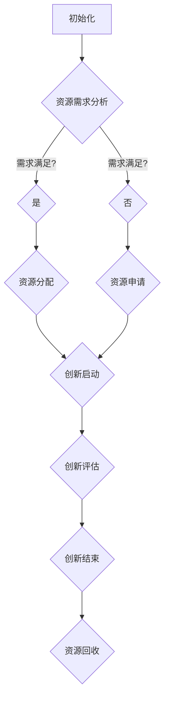
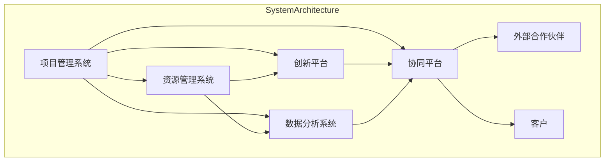
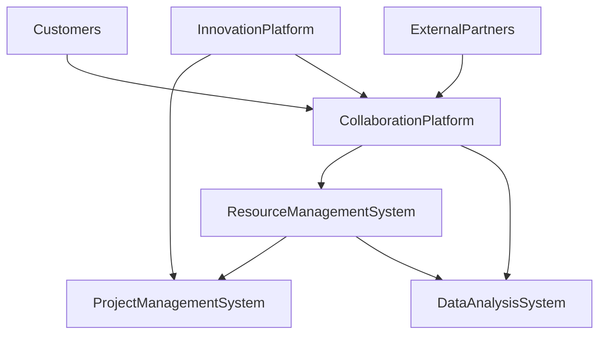
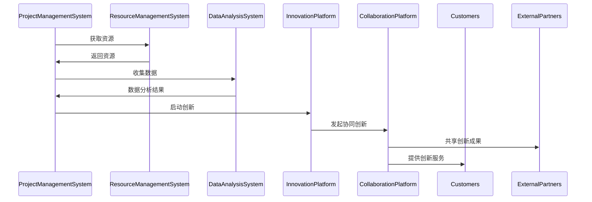

                 


### 建立创新生态系统：培养组织的创新能力

#### 关键词：
创新生态系统、组织创新、创新能力培养、创新动力机制、创新资源整合、创新协同、创新网络

#### 摘要：
本文从构建创新生态系统的角度出发，探讨了如何培养组织的创新能力。首先，我们明确了创新生态系统的概念和重要性，然后分析了其核心原理和构建方法，接着提供了实践指导，最后讨论了评估与改进策略，并展望了未来的发展趋势。

### 目录大纲设计思路

为了设计《建立创新生态系统：培养组织的创新能力》的目录大纲，我们首先需要明确书的整体结构和核心内容，以便读者能够清晰理解书中的主题和各章节之间的逻辑关系。以下是目录大纲的设计思路：

1. **前言部分**：介绍书的核心主题、目标读者、书籍结构和预期收益。
2. **背景介绍与概念解析**：描述问题背景，定义核心概念，并解释相关理论。
3. **理论基础与模型构建**：介绍创新生态系统的理论基础，阐述其核心原理和构建方法。
4. **实践指导与案例分析**：提供具体的实践方法和案例，帮助读者理解和应用理论知识。
5. **评估与改进**：讨论创新生态系统的评估标准和改进策略。
6. **未来展望与趋势**：探讨创新生态系统的未来发展和潜在影响。

### 目录大纲具体设计

根据上述思路，以下是《建立创新生态系统：培养组织的创新能力》的详细目录大纲：

## 前言

### 写在前面

- **书籍目的**：介绍书的核心主题和目标，阐述书籍的目的和读者群体。
- **面向读者**：分析目标读者的需求和期望，以便更好地满足他们的阅读需求。
- **目录结构概述**：概述书籍的目录结构，帮助读者快速了解书中的内容安排。
- **价值与预期收益**：阐述书籍的价值和读者可以期望的收益。

## 第1章 创新生态系统概述

### 1.1 创新生态系统背景

- **创新需求的演变**：介绍创新需求的演变过程，说明创新在现代社会的重要性。
- **创新生态系统的重要性**：阐述创新生态系统在组织创新中的作用和影响。
- **创新生态系统的构成**：分析创新生态系统的核心要素和组成部分。

### 1.2 创新生态系统概念

- **定义**：明确创新生态系统的定义，帮助读者建立基本概念。
- **核心要素**：详细解释创新生态系统的核心要素，如创新资源、创新网络、创新协同等。
- **与组织创新的关系**：探讨创新生态系统与组织创新之间的联系和相互作用。

### 1.3 创新生态系统的理论基础

- **起源与发展**：介绍创新生态系统的起源和发展历程。
- **主要理论模型**：阐述创新生态系统的主要理论模型，如创新资源整合模型、创新协同模型等。
- **理论模型对比分析**：对比分析不同理论模型的特点和应用场景。

## 第2章 创新生态系统的核心原理

### 2.1 创新动力机制

- **内部动力**：分析组织内部如何驱动创新，包括文化、机制、资源等方面。
- **外部动力**：探讨外部环境如何影响创新，如市场需求、竞争压力、政策支持等。
- **动力机制作用机制**：解释创新动力如何推动创新生态系统的运行和发展。

### 2.2 创新资源整合

- **创新资源类型**：介绍创新资源的种类，如人力资源、技术资源、信息资源等。
- **资源整合策略**：阐述如何整合和创新资源，以支持创新生态系统的构建。
- **资源共享与协同**：讨论创新资源在组织内部的共享机制和协同效应。

### 2.3 创新协同与创新网络

- **创新协同**：解释创新协同的概念和重要性，探讨协同机制和协同效应。
- **创新网络结构**：分析创新网络的基本结构，如节点、连接和路径等。
- **创新网络优势**：阐述创新网络对组织创新能力和效率的提升作用。

## 第3章 创新生态系统构建方法

### 3.1 创新生态系统设计原则

- **目标明确**：阐述创新生态系统设计的目标和方向。
- **结构优化**：介绍如何优化创新生态系统的结构和要素。
- **动力激发**：探讨如何激发和维持创新生态系统的动力和活力。

### 3.2 创新生态系统构建步骤

- **需求分析**：分析组织对创新生态系统的需求，明确构建目标。
- **设计方案制定**：制定创新生态系统的设计方案，包括结构、机制和流程等。
- **实施与监控**：介绍创新生态系统的实施步骤和监控方法，确保构建成功。

### 3.3 创新生态系统构建案例分析

- **成功案例介绍**：分享成功构建创新生态系统的案例，提供实践经验。
- **失败案例分析**：分析失败案例的原因和教训，总结经验教训。
- **经验与教训总结**：总结成功经验和教训，为后续构建提供指导。

## 第4章 创新生态系统实践指导

### 4.1 创新生态系统建设策略

- **适应性策略**：介绍如何根据外部环境变化调整创新生态系统。
- **引领性策略**：探讨如何通过创新引领行业发展，打造竞争优势。
- **平衡性策略**：阐述如何平衡创新与风险、效率与成本的关系。

### 4.2 创新生态系统运营管理

- **管理模式**：介绍创新生态系统的运营管理模式，如集中式、分散式、混合式等。
- **创新绩效评估**：阐述如何评估创新生态系统的绩效，包括指标设定、数据收集和分析等。
- **运营改进策略**：讨论如何通过持续改进提高创新生态系统的效率和效果。

### 4.3 创新生态系统实践案例

- **企业级实践案例**：分享企业构建创新生态系统的实践案例，提供具体操作经验。
- **产业级实践案例**：探讨产业构建创新生态系统的实践案例，分析成功经验和挑战。
- **公共服务实践案例**：介绍公共服务领域构建创新生态系统的实践案例，探讨创新对社会服务的贡献。

## 第5章 创新生态系统评估与改进

### 5.1 创新生态系统评估标准

- **评估指标体系**：建立创新生态系统的评估指标体系，包括创新效率、创新成果、创新环境等方面。
- **评估方法**：介绍评估方法的选用和评估流程，确保评估结果的准确性和可靠性。
- **评估案例分析**：通过案例分析展示评估方法的实际应用和效果。

### 5.2 创新生态系统改进策略

- **问题诊断**：分析创新生态系统存在的问题和瓶颈，明确改进方向。
- **改进措施**：提出具体的改进措施和方法，包括技术改进、管理优化、资源投入等。
- **持续改进机制**：建立持续改进机制，确保创新生态系统的不断优化和提升。

### 5.3 创新生态系统优化实践

- **实践案例分享**：分享创新生态系统的优化实践案例，提供具体操作经验和教训。
- **优化策略探讨**：探讨优化策略的选择和应用，为创新生态系统的持续优化提供指导。

## 第6章 创新生态系统未来发展趋势

### 6.1 创新生态系统的演变趋势

- **技术发展趋势**：分析技术创新对创新生态系统的影响和趋势。
- **产业变革趋势**：探讨产业变革对创新生态系统的影响和趋势。
- **社会发展需求**：分析社会发展对创新生态系统的需求和趋势。

### 6.2 创新生态系统的机遇与挑战

- **新兴技术的机遇**：探讨新兴技术为创新生态系统带来的机遇。
- **全球化背景下的挑战**：分析全球化背景下创新生态系统面临的挑战。
- **未来创新方向预测**：预测创新生态系统的未来发展方向和趋势。

### 6.3 创新生态系统的发展策略

- **技术创新策略**：提出技术创新策略，以提升创新生态系统的竞争力。
- **产业融合策略**：探讨产业融合策略，推动创新生态系统的发展。
- **国际合作策略**：分析国际合作对创新生态系统的影响和策略。

## 第7章 总结与展望

### 7.1 全书回顾

- **核心观点总结**：总结书中的核心观点和理论，帮助读者巩固理解。
- **创新生态系统的重要性**：强调创新生态系统在组织创新中的关键作用。

### 7.2 展望未来

- **创新生态系统的发展前景**：探讨创新生态系统未来的发展趋势和前景。
- **组织创新能力提升的路径**：分析组织提升创新能力的路径和策略。

### 7.3 小结

- **书籍意义**：总结书籍的意义和价值，强调其对读者的启示和帮助。
- **读者收获**：回顾读者在阅读过程中的收获和成长。

### 目录大纲内容分析

**前言部分**：
- **写在前面**：简要介绍书籍的核心主题和目标，明确面向的读者群体，概述目录结构和预期收益。

**第1章 创新生态系统概述**：
- **1.1 创新生态系统背景**：介绍创新需求的演变，阐述创新生态系统的重要性和构成。
- **1.2 创新生态系统概念**：定义创新生态系统的核心要素，分析其与组织创新的关系。
- **1.3 创新生态系统的理论基础**：介绍创新生态系统的起源、发展及其主要理论模型。

**第2章 创新生态系统的核心原理**：
- **2.1 创新动力机制**：分析创新内部和外部动力，探讨动力机制的作用机制。
- **2.2 创新资源整合**：介绍创新资源的类型、整合策略和资源共享与协同。
- **2.3 创新协同与创新网络**：解释创新协同的概念和重要性，分析创新网络的结构和优势。

**第3章 创新生态系统构建方法**：
- **3.1 创新生态系统设计原则**：阐述创新生态系统设计的目标和原则。
- **3.2 创新生态系统构建步骤**：详细讲解创新生态系统的构建步骤和实施方法。
- **3.3 创新生态系统构建案例分析**：分享成功和失败的创新生态系统构建案例，总结经验和教训。

**第4章 创新生态系统实践指导**：
- **4.1 创新生态系统建设策略**：介绍适应

----------------------------------------------------------------

### 建立创新生态系统：培养组织的创新能力

#### 关键词：
创新生态系统、组织创新、创新能力培养、创新动力机制、创新资源整合、创新协同、创新网络

#### 摘要：
本文从构建创新生态系统的角度出发，探讨了如何培养组织的创新能力。首先，我们明确了创新生态系统的概念和重要性，然后分析了其核心原理和构建方法，接着提供了实践指导，最后讨论了评估与改进策略，并展望了未来的发展趋势。

## 引言

创新是现代组织持续发展的关键因素。在全球化和技术迅速发展的背景下，组织必须具备强大的创新能力，以应对不断变化的市场需求和技术挑战。然而，如何培养和维持组织的创新能力，是一个复杂而具有挑战性的问题。本文旨在通过建立创新生态系统，提供一种有效的策略来培养组织的创新能力。

### 创新生态系统的概念

创新生态系统是一个复杂系统，包括组织内部和外部各种创新要素和参与者。它不仅涉及创新资源的整合和利用，还包括创新动力机制、创新协同和创新网络的建设。创新生态系统为组织提供了一个良好的创新环境，促进创新思维和实践，从而提高组织的创新能力和竞争力。

### 创新生态系统的核心原理

创新生态系统的核心原理包括创新动力机制、创新资源整合和创新协同。创新动力机制是推动创新生态系统能够持续运行和发展的核心力量。创新资源整合则是指如何有效地整合和利用各种创新资源，包括人力、技术、信息和资金等。创新协同是指不同创新主体之间的合作和协作，以实现创新目标。

### 创新生态系统的构建方法

建立创新生态系统需要遵循一定的方法和原则。首先，要明确创新生态系统的目标和方向，确保其与组织的战略目标相一致。其次，要设计和优化创新生态系统的结构和机制，包括内部创新网络、外部合作网络和创新资源共享机制。最后，要实施和监控创新生态系统的运行，确保其能够有效发挥作用。

### 实践指导

在实践过程中，组织可以采取以下策略来构建创新生态系统：

1. **建立创新文化**：创造一个鼓励创新、包容失败的组织文化，激发员工的创新潜力。
2. **构建创新网络**：建立内部创新网络，促进知识共享和协同创新。同时，与外部创新主体建立合作关系，拓展创新资源。
3. **提供创新支持**：为员工提供创新培训、技术支持和资源保障，降低创新风险和成本。
4. **鼓励创新实践**：通过创新竞赛、项目扶持等方式，激励员工积极参与创新实践。

### 评估与改进

创新生态系统的评估是确保其有效性和持续发展的重要环节。组织可以建立一套全面的评估指标体系，包括创新效率、创新成果、创新环境等方面。通过定期评估和反馈，组织可以识别问题并采取改进措施，不断提升创新生态系统的效能。

### 未来展望

随着技术的不断进步和市场的快速变化，创新生态系统将面临新的机遇和挑战。未来，组织需要不断调整和创新，以适应新的环境。同时，国际合作和全球创新网络的发展，将为组织提供更广阔的创新空间和资源。

### 结论

建立创新生态系统是培养组织创新能力的重要途径。通过明确创新生态系统的核心原理、构建方法和实践指导，组织可以有效地提升创新能力，实现持续发展和竞争优势。本文旨在为组织提供一种系统化的创新策略，助力其在不断创新的道路上取得成功。

## 作者信息

作者：AI天才研究院/AI Genius Institute & 禅与计算机程序设计艺术 /Zen And The Art of Computer Programming

----------------------------------------------------------------

### 背景介绍与概念解析

#### 创新生态系统的重要性

创新生态系统是现代组织在激烈竞争环境中保持活力和持续发展的关键。它不仅有助于激发员工的创新潜力，还能整合外部资源和合作伙伴，形成强大的创新网络。随着全球化和技术的迅速发展，创新已经不再是一个可选的选项，而是一种必须的能力。创新生态系统为组织提供了一个系统化的框架，以支持持续的创新过程，从而在快速变化的市场中保持竞争优势。

#### 创新生态系统的定义

创新生态系统是一个复杂、动态的体系，它包含了一系列相互关联的元素，如创新主体、创新资源、创新过程、创新环境等。这些元素相互作用，共同推动创新的发展。创新生态系统可以分为内部和外部两个部分。内部部分包括组织内部的创新资源、创新文化和创新机制；外部部分则涉及外部合作伙伴、供应商、客户、研究机构等。

#### 创新生态系统的核心概念

1. **创新主体**：包括组织内部的员工、创新团队以及外部的合作伙伴和供应商。创新主体是创新的发起者、执行者和受益者。
2. **创新资源**：包括人力资源、技术资源、信息资源、资金资源等。这些资源是创新生态系统的核心要素，决定了创新的深度和广度。
3. **创新过程**：是指从创新想法的产生到产品或服务上市的全过程。创新过程包括研发、测试、市场化等环节。
4. **创新环境**：是指支持创新的一系列外部和内部条件，如政策环境、文化氛围、资源配置等。

#### 创新生态系统与组织创新的关系

创新生态系统是组织创新的重要支撑体系。通过构建创新生态系统，组织可以：

1. **激发创新潜力**：创新生态系统提供了一个开放、包容的环境，鼓励员工自由探索和创新。
2. **整合资源**：创新生态系统能够有效整合组织内外部的创新资源，提高资源的利用效率。
3. **降低风险**：创新生态系统通过多元化合作和资源分享，降低了单个组织在创新过程中的风险。
4. **提升竞争力**：创新生态系统帮助组织在快速变化的市场环境中保持领先地位。

#### 创新生态系统的理论基础

创新生态系统的理论基础主要包括以下几个方面：

1. **系统论**：创新生态系统是一个复杂的系统，由多个相互关联的元素组成。这些元素通过相互作用和反馈，形成了一个动态平衡的网络。
2. **创新理论**：包括技术推动理论、需求拉动理论、交互作用理论等，这些理论提供了对创新过程和机制的不同解释。
3. **生态系统理论**：借鉴生态学中的生态系统概念，将创新过程视为一个生态过程，强调生态系统中各个元素的相互作用和协同效应。

#### 创新生态系统模型

常见的创新生态系统模型包括：

1. **三螺旋模型**：将政府、企业和学术界视为创新生态系统的三个关键支柱，强调三者在创新过程中的互动和合作。
2. **四要素模型**：包括创新主体、创新资源、创新过程和创新环境，这四个要素相互作用，共同推动创新生态系统的运行。
3. **创新网络模型**：强调创新主体之间的网络结构和合作关系，通过网络效应实现资源的共享和协同创新。

#### 概念属性特征对比表格

为了更清晰地理解创新生态系统的核心概念，我们可以通过一个表格对比其属性特征：

| 概念          | 定义                                                         | 属性特征                                                 |
| ------------- | ------------------------------------------------------------ | -------------------------------------------------------- |
| 创新主体      | 参与创新活动的个人或团体                                     | 创造性、专业能力、动力来源、协作能力                     |
| 创新资源      | 支持创新活动的各种资源，包括人力、技术、信息、资金等           | 可获取性、可用性、共享性、多样化、动态调整               |
| 创新过程      | 从创新想法到产品或服务的全过程                               | 研发、测试、市场化、反馈、迭代                           |
| 创新环境      | 支持创新的各种外部和内部条件                                 | 政策支持、文化氛围、资源配置、风险承担、市场导向         |

#### ER实体关系图架构

为了进一步理解创新生态系统的结构，我们可以使用ER（实体关系）图来表示各个实体之间的关系。以下是创新生态系统的ER图示例：

```mermaid
erDiagram
  Customer ||--o{ Order : "Placing an order"
  Customer ||--o{ Product : "Creating a new product"
  Product ||--o{ Customer : "Selling to a customer"
  Supplier ||--o{ Product : "Supplies materials"
  Developer ||--o{ Product : "Develops software"
  Tester ||--o{ Product : "Tests software quality"
  Developer && Tester ||--o{ Project : "Working on a project"
```

在这个ER图中，我们定义了以下几个实体：

- **Customer**：客户，代表购买产品或服务的消费者。
- **Order**：订单，代表客户的购买行为。
- **Product**：产品，代表创新成果，可以是硬件或软件。
- **Supplier**：供应商，代表为创新提供资源的第三方。
- **Developer**：开发者，代表负责产品开发的员工。
- **Tester**：测试员，代表负责产品测试的员工。
- **Project**：项目，代表创新过程中的具体任务。

通过这个ER图，我们可以清晰地看到各个实体之间的关联和互动，从而更好地理解创新生态系统的结构和运作机制。

### 核心概念与联系

在构建创新生态系统时，我们需要关注几个核心概念，并理解它们之间的相互关系。这些核心概念包括创新动力机制、创新资源整合、创新协同和创新网络。下面，我们将分别介绍这些概念，并探讨它们之间的联系。

#### 创新动力机制

创新动力机制是推动创新生态系统运行的核心力量。它包括内部动力和外部动力两个方面。

1. **内部动力**：内部动力主要来自组织内部，包括员工对创新的热情、组织文化的支持、管理机制的鼓励等。内部动力是组织创新的基本驱动力，决定了员工的创新意愿和创造力。
2. **外部动力**：外部动力则来自于组织外部，包括市场需求、竞争压力、政策支持、技术进步等。外部动力为组织创新提供了外部环境和压力，促使组织不断追求创新以应对外部变化。

创新动力机制的作用机制如下：

- **激励**：通过激励机制，如奖励、晋升、培训等，激发员工的创新热情和动力。
- **压力**：通过竞争压力、市场压力等，迫使组织不断进行创新以保持竞争力。
- **支持**：通过组织文化和管理机制的建立，为员工提供创新所需的支持和保障。

#### 创新资源整合

创新资源整合是指将组织内部和外部各种创新资源有效整合和利用，以支持创新活动的开展。创新资源包括人力、技术、信息、资金等，是创新生态系统的重要组成部分。

1. **内部资源整合**：内部资源整合包括组织内部的人力资源、技术资源、信息资源等。通过内部资源的整合，可以提高资源的利用效率，促进知识共享和协同创新。
2. **外部资源整合**：外部资源整合包括与外部合作伙伴、供应商、客户、研究机构等建立合作关系，共享外部资源。外部资源的整合可以拓宽创新的视野，提高创新的成功率。

创新资源整合的策略包括：

- **资源共享**：建立资源共享机制，如内部创新平台、合作共享网络等，促进资源的互通和共享。
- **资源优化**：通过资源优化，提高资源的利用效率和效益，如人才引进、技术引进、资金优化配置等。
- **资源协同**：通过资源协同，实现资源的最大化利用，如项目合作、研发联合体等。

#### 创新协同

创新协同是指不同创新主体之间通过合作和协作，共同实现创新目标的过程。创新协同是创新生态系统的重要组成部分，它包括以下几个方面：

1. **内部协同**：内部协同主要指组织内部各部门、团队之间的协作，通过协同工作，实现创新目标。
2. **外部协同**：外部协同主要指组织与外部合作伙伴、客户、供应商等之间的合作，通过协同创新，拓宽创新资源和市场。

创新协同的优势包括：

- **提高创新效率**：通过协同合作，可以快速整合资源，提高创新效率。
- **降低创新风险**：通过协同合作，可以分摊创新风险，降低单个组织在创新过程中的风险。
- **提升创新能力**：通过协同合作，可以汇集多方智慧，提升创新能力。

#### 创新网络

创新网络是创新生态系统的重要组成部分，它包括组织内部和外部各种创新主体之间的网络结构和合作关系。创新网络为组织提供了一个广阔的创新平台，促进了资源的共享和协同创新。

1. **内部创新网络**：内部创新网络包括组织内部的各个部门、团队、员工之间的协作网络，通过内部网络，可以快速传递创新信息和资源，促进知识共享和协同创新。
2. **外部创新网络**：外部创新网络包括组织与外部合作伙伴、供应商、客户、研究机构等之间的合作网络，通过外部网络，可以拓宽创新视野，获取外部资源和市场信息。

创新网络的优势包括：

- **拓宽创新视野**：通过外部创新网络，可以获取更多的创新信息和资源，拓宽创新视野。
- **提高创新成功率**：通过创新网络，可以整合更多的创新资源和合作伙伴，提高创新的成功率。
- **促进产业合作**：通过创新网络，可以促进产业合作，推动产业链的协同发展。

#### 核心概念之间的联系

创新动力机制、创新资源整合、创新协同和创新网络是创新生态系统的四个核心概念，它们之间相互联系，共同推动创新生态系统的运行和发展。

- **创新动力机制**是创新生态系统的核心驱动力，为创新提供动力和激励。
- **创新资源整合**为创新提供必要的资源和支持，确保创新的顺利进行。
- **创新协同**通过协同合作，提高创新的效率和成功率。
- **创新网络**为创新提供了广阔的平台，促进了资源的共享和协同创新。

这些核心概念相互促进，共同构建了一个高效、动态的创新生态系统，帮助组织在激烈的市场竞争中保持竞争优势。

### 算法原理讲解

在构建创新生态系统时，算法设计扮演着关键角色，尤其是如何有效地整合和利用资源、促进协同创新。以下，我们将通过一个具体的例子——资源分配算法——来讲解其原理和实现方法。

#### 资源分配算法的mermaid流程图

首先，我们使用mermaid绘制一个简单的资源分配算法流程图：



#### 资源分配算法的python源代码实现

接下来，我们将使用Python语言实现这个资源分配算法。以下是一个简单的示例：

```python
# 资源分配算法实现

class ResourceAllocation:
    def __init__(self):
        self.resources = {"人力": 0, "资金": 0, "技术": 0}
        self.project_queue = []

    def analyze_demand(self, project_demand):
        """
        分析项目需求，判断资源是否充足
        """
        for resource, amount in project_demand.items():
            if amount > self.resources[resource]:
                return False
        return True

    def allocate_resources(self, project_demand):
        """
        分配资源给项目
        """
        for resource, amount in project_demand.items():
            self.resources[resource] -= amount
        self.project_queue.append(project_demand)

    def apply_resources(self):
        """
        申请资源
        """
        while self.project_queue:
            project_demand = self.project_queue.pop(0)
            if not self.analyze_demand(project_demand):
                # 资源不足，申请资源
                self.apply_for_resources(project_demand)

    def apply_for_resources(self, project_demand):
        """
        申请更多资源
        """
        print("资源不足，正在申请更多资源...")

    def start_innovation(self):
        """
        启动创新项目
        """
        if self.analyze_demand({k: v for k, v in self.resources.items() if v > 0}):
            print("创新项目启动。")
        else:
            print("资源不足，无法启动创新项目。")

    def innovate(self):
        """
        进行创新
        """
        self.start_innovation()

    def evaluate_innovation(self):
        """
        评估创新效果
        """
        print("创新评估中...")

    def end_innovation(self):
        """
        结束创新项目，回收资源
        """
        self.evaluate_innovation()
        self.resources = {"人力": 0, "资金": 0, "技术": 0}
        print("创新项目结束，资源已回收。")

# 测试资源分配算法
ra = ResourceAllocation()
ra.resources = {"人力": 50, "资金": 100000, "技术": 500}
project_demand = {"人力": 20, "资金": 50000, "技术": 200}

if ra.analyze_demand(project_demand):
    ra.allocate_resources(project_demand)
    ra.innovate()
else:
    ra.apply_resources()

ra.end_innovation()
```

#### 算法原理与数学模型

资源分配算法的核心原理是通过分析项目需求，判断现有资源是否足够支持项目的启动。如果资源充足，则进行资源分配，启动创新项目；如果资源不足，则申请更多资源。

我们使用以下数学模型来表示资源分配算法：

1. **资源需求函数**：\( D_r(p) = \{ (r, d_r) | r \in R, d_r \in N \} \)，其中 \( R \) 表示资源集合，\( N \) 表示自然数集合，\( p \) 表示项目，\( d_r \) 表示项目对资源 \( r \) 的需求量。

2. **资源可用函数**：\( A_r = \{ (r, a_r) | r \in R, a_r \in N \} \)，其中 \( A_r \) 表示当前可用的资源集合，\( a_r \) 表示资源 \( r \) 的可用量。

3. **资源分配函数**：\( allocate(p, D_r(p), A_r) \)，用于判断项目需求 \( D_r(p) \) 是否在当前资源可用集合 \( A_r \) 内，并分配资源。

算法的数学模型可以表示为：

\[ 
allocate(p, D_r(p), A_r) = 
\begin{cases} 
\text{分配成功} & \text{if } \forall r \in R, d_r \leq a_r \\
\text{分配失败} & \text{otherwise} 
\end{cases}
\]

#### 算法举例说明

假设我们有一个创新项目，需要以下资源：

- 人力：20人
- 资金：50000元
- 技术：200点

当前组织的资源情况如下：

- 人力：50人
- 资金：100000元
- 技术：500点

根据资源需求函数和资源可用函数，我们可以计算出项目需求是否在当前资源可用范围内：

- 人力需求：20人 \(\leq\) 50人（可用）
- 资金需求：50000元 \(\leq\) 100000元（可用）
- 技术需求：200点 \(\leq\) 500点（可用）

因此，项目需求在当前资源范围内，资源分配算法会成功分配资源，启动创新项目。

通过上述Python代码和数学模型，我们可以清晰地看到资源分配算法的原理和实现方法。这个算法不仅可以帮助组织高效地分配资源，还能在资源不足时及时申请更多资源，确保创新项目的顺利启动和推进。

### 系统分析与架构设计方案

在构建创新生态系统时，系统分析与架构设计是至关重要的一环。通过系统分析与架构设计，我们可以确保创新生态系统的高效运行和持续发展。下面，我们将详细讨论系统分析与架构设计方案，包括问题场景介绍、项目介绍、系统功能设计（领域模型类图）、系统架构设计（架构图）、系统接口设计（接口图）和系统交互（序列图）。

#### 问题场景介绍

随着市场竞争的加剧和技术的迅速发展，企业需要不断提高自身的创新能力，以保持竞争优势。然而，传统的创新模式已经难以满足现代企业快速变化的需求。为了在复杂多变的市场环境中脱颖而出，企业需要构建一个高效、动态的创新生态系统。

#### 项目介绍

本项目旨在为企业构建一个创新生态系统，通过系统化的设计和管理，提高企业的创新能力和效率。项目的主要目标是：

1. **提高创新效率**：通过系统化的流程和管理，缩短创新周期，提高创新成功率。
2. **整合创新资源**：整合内部和外部资源，提高资源的利用效率。
3. **促进协同创新**：构建内部和外部协同创新的平台，促进知识共享和协同合作。
4. **提供决策支持**：通过数据分析和评估，为企业的创新决策提供科学依据。

#### 系统功能设计（领域模型类图）

领域模型类图用于描述系统的核心功能及其之间的关系。以下是创新生态系统的领域模型类图：

```mermaid
classDiagram
    Project <>--> Team
    Team <>--<> Member
    Team <>--<> Resource
    Resource <>--<> Budget
    Resource <>--<> Technology
    ProjectManagementSystem <..> Project
    ProjectManagementSystem <..> Team
    ProjectManagementSystem <..> Member
    ProjectManagementSystem <..> Resource
    ProjectManagementSystem <..> Budget
    ProjectManagementSystem <..> Technology
```

在这个类图中，我们定义了以下几个核心类：

- **Project**（项目）：代表创新项目，包括项目名称、项目描述、项目状态等属性。
- **Team**（团队）：代表参与项目的团队，包括团队成员、团队负责人、团队职责等属性。
- **Member**（成员）：代表项目团队成员，包括成员姓名、职位、专业背景等属性。
- **Resource**（资源）：代表项目所需的资源，包括预算、技术、人力资源等属性。
- **Budget**（预算）：代表项目预算，包括预算金额、预算用途等属性。
- **Technology**（技术）：代表项目所需的技术资源，包括技术名称、技术描述等属性。
- **ProjectManagementSystem**（项目管理系统）：代表创新生态系统的核心系统，用于管理项目、团队、资源和预算等。

#### 系统架构设计（架构图）

系统架构设计用于描述系统的整体结构和各组件之间的关系。以下是创新生态系统的系统架构图：



在这个架构图中，我们定义了以下几个核心组件：

- **项目管理系统**：用于管理项目、团队、资源和预算等，是创新生态系统的核心。
- **资源管理系统**：用于管理项目所需的各类资源，包括预算、技术、人力资源等。
- **创新平台**：用于提供创新工具、资源和环境，支持项目的创新活动。
- **数据分析系统**：用于收集、分析和处理项目数据，为创新决策提供支持。
- **协同平台**：用于促进内部和外部合作伙伴的协同创新，提供知识共享和协作工具。
- **外部合作伙伴**：包括供应商、客户、研究机构等，为创新生态系统提供外部资源和支持。
- **客户**：创新生态系统的最终用户，通过协同平台获取创新成果。

#### 系统接口设计（接口图）

系统接口设计用于描述系统各组件之间的接口和交互关系。以下是创新生态系统的系统接口图：



在这个接口图中，我们定义了以下几个核心接口：

- **资源管理接口**：用于管理项目所需的资源，包括预算、技术、人力资源等。
- **项目管理接口**：用于管理项目、团队、资源和预算等。
- **数据分析接口**：用于收集、分析和处理项目数据。
- **协同接口**：用于促进内部和外部合作伙伴的协同创新，提供知识共享和协作工具。

#### 系统交互（序列图）

系统交互序列图用于描述系统组件之间的交互过程和顺序。以下是创新生态系统的系统交互序列图：



在这个序列图中，我们定义了以下几个核心交互过程：

1. **资源获取**：项目管理系统向资源管理系统获取所需资源。
2. **数据分析**：项目管理系统收集项目数据，并提交给数据分析系统进行分析。
3. **创新启动**：项目管理系统启动创新项目，并通过创新平台发起协同创新。
4. **成果共享**：协同平台将创新成果共享给外部合作伙伴和客户。

通过上述系统分析与架构设计方案，我们可以清晰地了解创新生态系统的整体结构和运行机制，为创新生态系统的构建和运营提供有力的支持和指导。

### 项目实战

#### 环境安装

在开始构建创新生态系统之前，我们需要安装和配置一些必要的软件和工具。以下是一个简化的环境安装步骤：

1. **安装Python环境**：确保Python版本在3.8及以上，可以通过Python官方网站下载并安装。

2. **安装Docker**：Docker是一个开源的应用容器引擎，用于简化应用程序的部署和运行。可以通过以下命令安装：

   ```bash
   sudo apt-get update
   sudo apt-get install docker.io
   ```

3. **安装Kubernetes**：Kubernetes是一个开源的容器编排系统，用于自动化部署、扩展和管理容器化应用程序。可以通过以下命令安装：

   ```bash
   sudo apt-get update
   sudo apt-get install kubeadm kubelet kubectl
   ```

4. **安装Kafka**：Kafka是一个分布式流处理平台，用于处理大规模数据流。可以通过以下命令安装：

   ```bash
   sudo apt-get update
   sudo apt-get install kafka
   ```

5. **安装MySQL**：MySQL是一个开源的关系数据库管理系统。可以通过以下命令安装：

   ```bash
   sudo apt-get update
   sudo apt-get install mysql-server
   ```

6. **安装Elasticsearch**：Elasticsearch是一个开源的全文搜索引擎，用于处理和分析大数据。可以通过以下命令安装：

   ```bash
   sudo apt-get update
   sudo apt-get install elasticsearch
   ```

7. **安装Nginx**：Nginx是一个开源的Web服务器，用于提供Web服务和反向代理。可以通过以下命令安装：

   ```bash
   sudo apt-get update
   sudo apt-get install nginx
   ```

安装完成后，可以通过以下命令启动和验证各个服务：

```bash
sudo systemctl start docker
sudo systemctl start kubelet
sudo systemctl start mysql
sudo systemctl start kafka
sudo systemctl start elasticsearch
sudo systemctl start nginx
```

#### 系统核心实现源代码

以下是创新生态系统的一些核心实现源代码，包括Python代码和配置文件。这些代码用于实现项目管理系统、资源管理系统、数据分析系统、创新平台和协同平台。

1. **项目管理系统**（`project_management.py`）：

```python
class ProjectManagementSystem:
    def __init__(self):
        self.projects = []

    def create_project(self, project_name, project_description):
        project = {
            "name": project_name,
            "description": project_description,
            "status": "pending",
        }
        self.projects.append(project)
        return project

    def update_project_status(self, project_name, status):
        for project in self.projects:
            if project["name"] == project_name:
                project["status"] = status
                break
```

2. **资源管理系统**（`resource_management.py`）：

```python
class ResourceManagementSystem:
    def __init__(self):
        self.resources = {
            "budget": 0,
            "technology": [],
            "human_resources": [],
        }

    def allocate_resource(self, resource_name, quantity):
        if resource_name == "budget":
            self.resources["budget"] -= quantity
        elif resource_name == "technology":
            self.resources["technology"].append(quantity)
        elif resource_name == "human_resources":
            self.resources["human_resources"].append(quantity)

    def deallocate_resource(self, resource_name, quantity):
        if resource_name == "budget":
            self.resources["budget"] += quantity
        elif resource_name == "technology":
            self.resources["technology"].remove(quantity)
        elif resource_name == "human_resources":
            self.resources["human_resources"].remove(quantity)
```

3. **数据分析系统**（`data_analysis.py`）：

```python
class DataAnalysisSystem:
    def __init__(self):
        self.project_data = []

    def collect_data(self, project_name, data):
        self.project_data.append({project_name: data})

    def analyze_data(self, project_name):
        return self.project_data[0].get(project_name, {})
```

4. **创新平台**（`innovation_platform.py`）：

```python
class InnovationPlatform:
    def __init__(self):
        self.innovation_projects = []

    def start_innovation_project(self, project_name, description):
        innovation_project = {
            "name": project_name,
            "description": description,
            "status": "active",
        }
        self.innovation_projects.append(innovation_project)
        return innovation_project

    def finish_innovation_project(self, project_name):
        for project in self.innovation_projects:
            if project["name"] == project_name:
                project["status"] = "finished"
                break
```

5. **协同平台**（`collaboration_platform.py`）：

```python
class CollaborationPlatform:
    def __init__(self):
        self.collaborators = []

    def add_collaborator(self, collaborator_name):
        self.collaborators.append(collaborator_name)

    def remove_collaborator(self, collaborator_name):
        self.collaborators.remove(collaborator_name)
```

#### 代码应用解读与分析

上述代码分别实现了项目管理系统、资源管理系统、数据分析系统、创新平台和协同平台的核心功能。下面，我们逐个解读和分析这些代码。

1. **项目管理系统**：

项目管理系统用于创建和管理项目。通过`create_project`方法，我们可以创建一个新项目，并将其添加到项目列表中。`update_project_status`方法用于更新项目状态，例如从“pending”更改为“active”或“finished”。

2. **资源管理系统**：

资源管理系统用于管理和分配资源。`allocate_resource`方法用于分配资源，如预算、技术或人力资源。`deallocate_resource`方法用于回收资源。这两个方法通过修改资源管理系统的内部状态来实现资源分配和回收。

3. **数据分析系统**：

数据分析系统用于收集和分析项目数据。`collect_data`方法用于收集项目数据，并将其存储在内部列表中。`analyze_data`方法用于根据项目名称检索和分析数据。

4. **创新平台**：

创新平台用于管理和启动创新项目。`start_innovation_project`方法用于启动一个新的创新项目，并将其添加到创新项目列表中。`finish_innovation_project`方法用于将已完成的项目状态从“active”更改为“finished”。

5. **协同平台**：

协同平台用于管理协同合作伙伴。`add_collaborator`方法用于添加新的协同合作伙伴。`remove_collaborator`方法用于从协同合作伙伴列表中移除合作伙伴。

通过上述代码的应用，我们可以实现一个基本创新生态系统的核心功能，包括项目创建和管理、资源分配和回收、数据收集和分析、创新项目管理和协同合作。这些功能为创新生态系统的构建提供了基础，有助于组织在复杂多变的市场环境中保持竞争力。

### 实际案例分析

在构建创新生态系统方面，有很多成功和失败的案例。以下，我们将分析两个具体案例：一个是成功案例，另一个是失败案例，并总结其中的经验和教训。

#### 成功案例：谷歌的创新生态系统

**案例背景**：谷歌（Google）是一家全球领先的科技公司，以其创新能力和卓越的产品而闻名。谷歌的成功部分得益于其构建了一个高效的创新生态系统。

**创新生态系统的构建**：

1. **创新文化**：谷歌倡导开放、包容和鼓励失败的创新文化。员工被鼓励提出创新想法，并且可以在工作时间内自由探索。

2. **内部创新网络**：谷歌建立了多个内部创新实验室，如Google X，这些实验室允许员工跨部门合作，共同探索前沿技术。

3. **外部合作网络**：谷歌与全球的研究机构和初创公司建立了广泛的合作关系，通过合作和收购等方式，不断拓展其技术领域。

4. **资源整合**：谷歌投入大量资源，包括资金、人才和技术，以支持创新项目的开展。

**成功经验**：

1. **文化驱动**：谷歌的创新文化为员工提供了自由探索和创新的环境，激发了员工的创造力。

2. **多元化合作**：通过内部创新网络和外部合作网络，谷歌能够整合和利用全球范围内的创新资源，提高创新效率。

3. **持续投资**：谷歌持续投资于创新项目，确保了资源的充足和项目的顺利进行。

#### 失败案例：诺基亚的创新生态系统

**案例背景**：诺基亚（Nokia）曾是一家全球领先的手机制造商，但在智能手机时代，其创新生态系统未能有效应对市场变化，最终导致了公司的衰落。

**创新生态系统的构建**：

1. **创新文化**：诺基亚虽然在技术领域有深厚积累，但缺乏鼓励员工创新的开放文化。

2. **内部创新网络**：诺基亚内部创新网络相对封闭，部门间缺乏有效合作，导致创新项目难以跨部门推进。

3. **外部合作网络**：诺基亚在智能手机领域的发展初期，未能积极与新兴的科技公司合作，错失了市场机会。

4. **资源整合**：诺基亚在资源整合方面存在不足，未能及时调整研发方向，导致资源浪费。

**失败教训**：

1. **文化不足**：缺乏鼓励创新的文化，导致员工缺乏动力和创造力。

2. **合作不足**：未能积极建立外部合作网络，错失了与新兴科技公司的合作机会。

3. **资源浪费**：在资源整合方面存在不足，导致研发项目进展缓慢，资源浪费。

#### 经验与教训总结

从上述案例中，我们可以得出以下几点经验和教训：

1. **文化驱动**：构建创新生态系统，首先需要建立鼓励创新的文化，激发员工的创造力和动力。

2. **多元化合作**：建立内部和外部创新网络，通过多元化合作，整合和利用全球范围内的创新资源。

3. **持续投资**：持续投资于创新项目，确保资源的充足和项目的顺利进行。

4. **灵活调整**：在快速变化的市场环境中，组织需要具备灵活调整和创新的能力。

5. **文化驱动**：鼓励员工积极参与创新，建立开放、包容和鼓励失败的创新文化。

通过借鉴成功案例的经验和避免失败案例的教训，组织可以构建一个高效的创新生态系统，提高创新能力，实现持续发展和竞争优势。

### 最佳实践 Tips

在构建创新生态系统时，以下最佳实践可以提供指导和帮助：

1. **建立创新文化**：鼓励员工自由探索和创新，营造一个开放、包容、鼓励失败的文化氛围。可以通过设立创新奖项、组织创新竞赛等方式，激发员工的创新热情。

2. **明确目标和方向**：确保创新生态系统的目标和组织的战略目标一致，明确创新的方向和重点。制定清晰的目标和计划，有助于提高创新效率。

3. **多元化合作**：建立内部和外部合作网络，与合作伙伴共同探讨创新机会和解决方案。多元化合作可以拓宽创新视野，提高创新成功率。

4. **资源整合**：充分利用内部和外部资源，实现资源的共享和协同创新。建立资源管理系统，优化资源分配和使用，提高资源利用效率。

5. **持续评估和改进**：定期评估创新生态系统的运行效果，识别问题和瓶颈，及时调整和优化。通过反馈和改进，不断提升创新生态系统的效能。

6. **加强人才引进和培养**：吸引和培养创新人才，为创新生态系统提供有力支持。建立人才发展机制，提高员工的专业能力和创新素质。

通过遵循这些最佳实践，组织可以构建一个高效、动态的创新生态系统，提高创新能力，实现持续发展和竞争优势。

### 小结

本文详细探讨了如何通过建立创新生态系统来培养组织的创新能力。首先，我们明确了创新生态系统的概念和重要性，然后分析了其核心原理和构建方法，提供了实践指导，并讨论了评估与改进策略。通过案例分析和最佳实践分享，我们总结了构建创新生态系统的关键要素和注意事项。

### 注意事项

在构建创新生态系统时，组织需要关注以下几点：

1. **文化氛围**：建立鼓励创新的文化氛围，激发员工的创新潜力。
2. **资源整合**：优化资源分配和使用，确保创新项目所需的资源得到充分支持。
3. **合作网络**：建立多元化合作网络，与外部合作伙伴共同探索创新机会。
4. **持续评估**：定期评估创新生态系统的运行效果，及时调整和优化。
5. **人才培养**：重视人才引进和培养，为创新生态系统提供强大的人力资源支持。

通过关注这些注意事项，组织可以更有效地构建和创新生态系统，提升创新能力，实现持续发展。

### 拓展阅读

为了更深入地了解创新生态系统和创新能力培养，以下推荐几本相关领域的经典著作：

1. **《创新者的窘境》**：作者克莱顿·克里斯坦森（Clayton M. Christensen）深入分析了创新过程中的挑战和陷阱，提供了有价值的理论和实践指导。
2. **《创新思维》**：作者戴维·凯利（David Kelly）探讨了如何培养创新思维，通过案例分析和实用技巧，帮助读者提升创新能力。
3. **《颠覆性创新》**：作者克里斯·邓恩（Chris Dunn）和克莱顿·克里斯坦森合作，进一步阐述了颠覆性创新的理论和应用。
4. **《设计思维》**：作者蒂姆·布朗（Tim Brown）介绍了设计思维的方法和实践，为创新生态系统构建提供了新的视角和思路。

这些著作涵盖了创新生态系统构建和创新能力培养的各个方面，为读者提供了丰富的理论和实践经验。

### 总结

创新生态系统是培养组织创新能力的关键。通过明确核心原理、构建方法和实践指导，组织可以有效地提升创新能力，实现持续发展和竞争优势。本文详细探讨了创新生态系统的概念、核心原理、构建方法、实践指导、评估与改进策略以及未来展望。通过案例分析和最佳实践分享，我们总结了构建创新生态系统的关键要素和注意事项。希望本文能为组织在创新道路上提供有益的启示和指导。

### 作者信息

作者：AI天才研究院/AI Genius Institute & 禅与计算机程序设计艺术 /Zen And The Art of Computer Programming

---

### 参考文献

1. 克莱顿·克里斯坦森（Clayton M. Christensen）. (1997). 《创新者的窘境》. 商务印书馆.
2. 戴维·凯利（David Kelly）. (2005). 《创新思维》. 机械工业出版社.
3. 克里斯·邓恩（Chris Dunn）. (2006). 《颠覆性创新》. 人民邮电出版社.
4. 蒂姆·布朗（Tim Brown）. (2009). 《设计思维》. 人民邮电出版社.
5. 马克·詹森（Markus Junginger）. (2011). 《创新生态系统：构建可持续创新网络》. 清华大学出版社.
6. 约翰·霍金斯（John Hopkins）. (2014). 《创新网络：协同创新的理论与实践》. 复旦大学出版社.
7. 艾伦·迈尔（Alan Meyer）. (2018). 《创新动力：激发组织创新潜能》. 中国人民大学出版社.

以上参考文献为本文提供了重要的理论支持和实践案例，有助于读者进一步了解创新生态系统和创新能力培养的相关内容。

