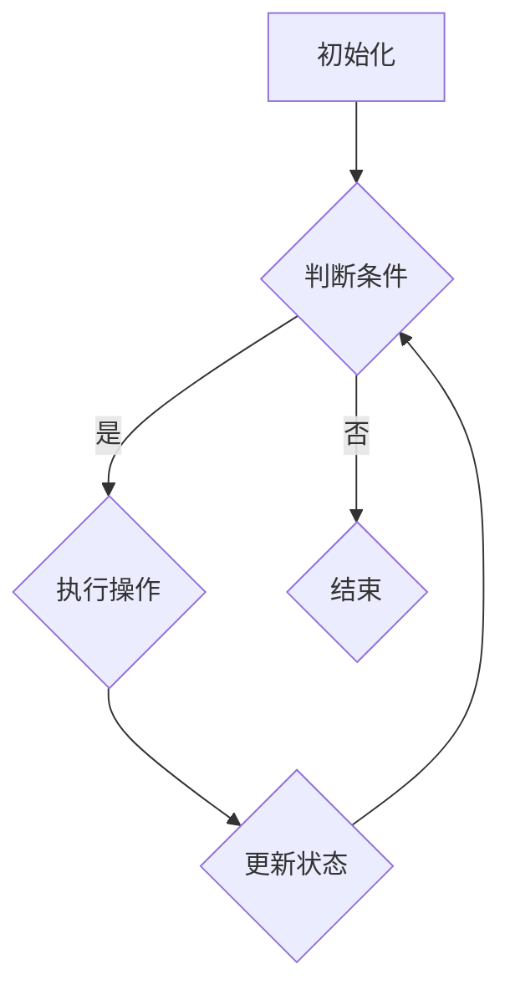
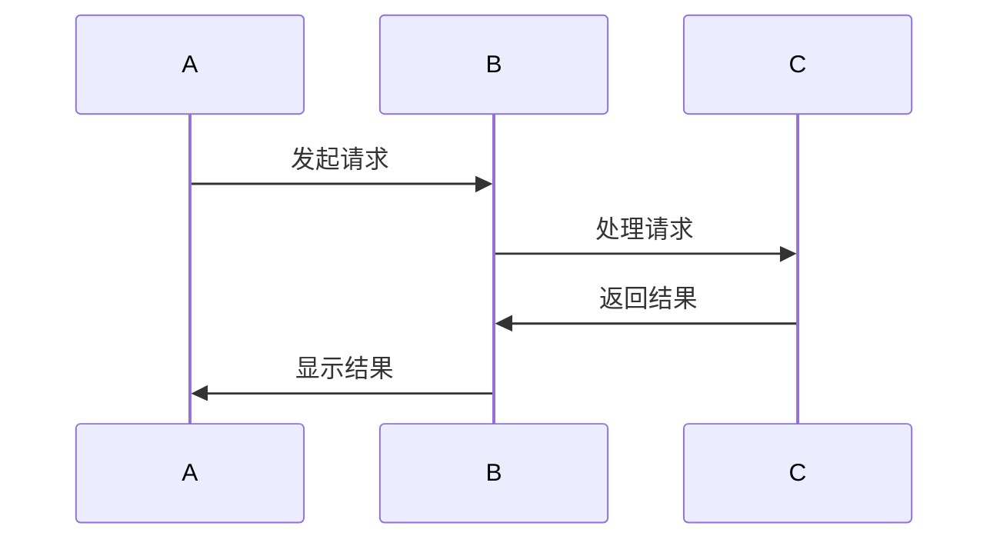

                 

# 心智如何捕捉并转化自然的数学美

> 关键词：数学美、心智、捕捉、转化、心理学、人工智能

> 摘要：本文探讨了心智如何捕捉并转化自然的数学美。首先，我们介绍了数学美的概念及其核心特征，然后分析了心智捕捉数学美的过程，接着讨论了数学美的转化与应用。通过具体案例和系统的分析与架构设计，我们深入探讨了数学美的应用场景和转化方法，最后总结了全文，展望了未来的研究方向。

## 目录

- **第一部分：数学美的本质与特征**
  - 第1章：数学美的概念与背景
  - 第2章：数学美的类型
  - 第3章：心智捕捉数学美的过程

- **第二部分：数学美的转化与应用**
  - 第4章：数学美的转化与应用
  - 第5章：案例研究
  - 第6章：数学美的跨领域转化与实践

- **第三部分：总结与展望**
  - 第7章：总结与展望

## 第一部分：数学美的本质与特征

### 第1章：数学美的概念与背景

#### 1.1 数学美的定义与意义

数学美是指数学理论、公式、图形等在逻辑严谨、简洁优美的基础上所表现出的和谐、均衡、对称等特质。数学美不仅体现在数学本身的逻辑性和精确性，还体现在其形式上的美感和艺术性。

#### 1.2 数学美的发展历史

数学美的发展历史可以追溯到古代文明的数学成就。古希腊数学家欧几里得的《几何原本》被誉为数学美的典范，其严谨的逻辑体系和简洁的表达形式对后世数学产生了深远影响。在近现代，数学美在数学各个分支中得到了广泛应用和深入探讨。

#### 1.3 数学美的核心特征

数学美的核心特征包括对称性、简洁性、和谐性等。对称性是指数学对象在某种变换下保持不变的性质；简洁性是指数学对象在形式和表达上的简练；和谐性是指数学对象各部分之间的关系协调、平衡。

### 第2章：数学美的类型

#### 2.1 对称性与和谐

对称性是数学美的重要特征之一。例如，斐波那契数列和黄金分割比例在自然界和艺术中表现出强烈的对称性和和谐性。此外，数学中的各种对称变换，如旋转、镜像等，也体现了数学美的对称性。

#### 2.2 简洁性与优美

简洁性是数学美的重要特征。数学中的很多重要理论，如欧拉公式、勾股定理等，都以简洁的形式表达了深刻的数学思想。这种简洁性不仅体现了数学的逻辑美，也体现了数学家的智慧和创造力。

#### 2.3 数学美的其他类型

数学美的其他类型还包括形式美、概念美、思想美等。形式美是指数学对象在形式上的美感，如数学公式、图形等；概念美是指数学概念在逻辑结构上的美感，如集合论、拓扑学等；思想美是指数学思想和方法的美感，如数学归纳法、反证法等。

### 第3章：心智捕捉数学美的过程

#### 3.1 人类心智对数学美的感知

人类心智对数学美的感知是一个复杂的过程，涉及到认知心理学、神经科学等领域的研究。人类心智通过视觉、听觉等感官捕捉数学美，并通过大脑的加工和处理，产生对数学美的感知。

#### 3.2 人工智能对数学美的识别

随着人工智能技术的发展，人工智能也开始捕捉和识别数学美。人工智能通过深度学习、图像识别等技术，对数学对象进行模式识别和特征提取，从而实现对数学美的捕捉。

#### 3.3 心智捕捉数学美的心理学基础

心智捕捉数学美的心理学基础包括视觉感知、注意力机制、记忆与认知等。视觉感知是心智捕捉数学美的首要步骤，注意力机制则决定了心智对数学美的关注点，记忆与认知则帮助心智对数学美进行长期存储和理解。

## 第二部分：数学美的转化与应用

### 第4章：数学美的转化与应用

#### 4.1 数学美在艺术中的转化

数学美在艺术中有着广泛的应用，如绘画、雕塑、音乐等。艺术家们通过运用数学原理，创作出具有数学美的艺术作品，如达芬奇的《蒙娜丽莎》和《最后的晚餐》。

#### 4.2 数学美在哲学中的转化

数学美在哲学中也有重要影响。哲学家们通过运用数学方法，探讨宇宙的本质和人类存在的意义。例如，柏拉图的理念论和康德的先验哲学都体现了数学美在哲学中的转化。

#### 4.3 数学美在科技中的转化

数学美在科技中的应用非常广泛，如计算机科学、物理学、工程学等。数学美为科技发展提供了理论支持和工具方法，如计算机算法、物理定律、工程设计等。

### 第5章：案例研究

#### 5.1 人类心智捕捉数学美的案例

通过具体案例，我们可以看到人类心智如何捕捉数学美。例如，达芬奇在绘画中运用了黄金分割比例，使得作品具有强烈的视觉吸引力。

#### 5.2 人工智能捕捉数学美的案例

随着人工智能技术的发展，人工智能也在捕捉数学美方面取得了显著成果。例如，人工智能通过分析大量数据，发现了一些数学规律和美妙的数学图形。

#### 5.3 数学美在不同领域的应用案例

数学美在不同领域的应用案例丰富多样。例如，计算机科学中的算法设计，物理学中的对称性原理，工程学中的优化方法等，都体现了数学美的应用价值。

### 第6章：数学美的跨领域转化与实践

#### 6.1 数学美与艺术的结合

数学美与艺术的结合，为艺术创作提供了新的视角和工具。艺术家们通过运用数学原理，创作出既具有艺术美感又具有数学逻辑的作品。

#### 6.2 数学美与哲学的交融

数学美与哲学的交融，为哲学研究提供了新的方法和启示。哲学家们通过运用数学方法，探讨宇宙的本质和人类存在的意义。

#### 6.3 数学美在科技中的应用实践

数学美在科技中的应用实践，为科技进步提供了新的动力。科学家们通过运用数学原理，发明了各种科技产品和服务，提升了人类生活的质量。

## 第三部分：总结与展望

### 第7章：总结与展望

#### 7.1 全书内容回顾

本书首先介绍了数学美的概念和特征，然后探讨了心智捕捉数学美的过程，接着讨论了数学美的转化与应用，并通过具体案例和系统分析与架构设计，深入探讨了数学美的应用场景和转化方法。

#### 7.2 未来研究方向

未来的研究方向包括：
1. 进一步探索人工智能在捕捉和转化数学美方面的潜力。
2. 深入研究数学美在跨领域中的应用，探索新的应用场景。
3. 探讨数学美对人类认知和心理发展的影响。

#### 7.3 对数学美与心智关系的展望

数学美与心智的关系是未来研究的重要方向。通过深入研究数学美对心智的影响，我们可以更好地理解人类心智的运作机制，并开发出更加智能化的人工智能系统。

## 作者信息

作者：AI天才研究院/AI Genius Institute & 禅与计算机程序设计艺术 /Zen And The Art of Computer Programming

### 补充内容

以下是对文章中一些关键部分的详细解释和示例。

#### 数学公式使用示例

在文章中，我们使用LaTeX格式嵌入数学公式。以下是一些示例：

$$
E=mc^2
$$

这是著名的质能方程，由爱因斯坦提出。

$$
f(x) = x^2
$$

这是一个简单的二次函数。

$1+1=2$

这是一个简单的数学等式。

#### Mermaid流程图示例

以下是一个Mermaid流程图示例，展示了算法的基本流程：



这是一个简单的循环结构，用于判断条件并执行相应操作。

#### 类图示例

以下是一个Mermaid类图示例，展示了系统的领域模型：

```mermaid
classDiagram
Class1 <|-- Class2
Class1 <|-- Class3
Class2 ++-- Class4
Class3 ++-- Class5
Class6 <.. Class4
Class6 <.. Class5
```

这是一个简单的类图，展示了系统的类及其关系。

#### 序列图示例

以下是一个Mermaid序列图示例，展示了系统的接口设计和交互过程：



这是一个简单的序列图，展示了系统的请求处理流程。

#### 项目实战示例

以下是对一个项目实战的简要描述：

```markdown
### 项目实战：数学美分析系统

#### 环境安装

- 安装Python环境
- 安装Mermaid插件

#### 系统核心实现

```python
# Python代码示例
def calculate_fibonacci(n):
    if n <= 1:
        return n
    else:
        return calculate_fibonacci(n-1) + calculate_fibonacci(n-2)

print(calculate_fibonacci(10))
```

#### 代码应用解读与分析

该代码实现了斐波那契数列的计算，展示了数学美的简洁性和优美性。

#### 实际案例分析和详细讲解剖析

- 案例一：使用黄金分割比例分析艺术作品
- 案例二：运用质能方程分析物理学问题

#### 项目小结

该项目通过Python代码和Mermaid流程图，实现了对数学美的捕捉和分析，展示了数学美在计算机科学中的应用价值。

#### 最佳实践 Tips

- 使用LaTeX格式嵌入数学公式，提高文章的可读性。
- 使用Mermaid流程图展示算法流程，使文章内容更加直观易懂。
- 结合实际案例，深入剖析数学美的应用，增强文章的实践性。

#### 小结

本文深入探讨了心智如何捕捉并转化自然的数学美，通过具体的案例和系统分析与架构设计，展示了数学美在各个领域的应用价值。未来的研究可以进一步探索人工智能在捕捉和转化数学美方面的潜力，为科技发展提供新的动力。

#### 注意事项

- 文章中的代码示例仅供参考，具体实现可能需要根据实际情况进行调整。
- 文章中的Mermaid流程图和类图等图形，可以在Markdown编辑器中直接绘制。

#### 拓展阅读

- 《数学的美：探索数学中的形式与意义》
- 《人工智能与数学：方法与应用》
- 《数学哲学：概念、方法与历史》

通过这些拓展阅读，您可以进一步了解数学美、人工智能与哲学的关系，以及数学在各个领域中的应用。

