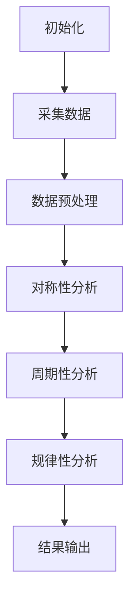
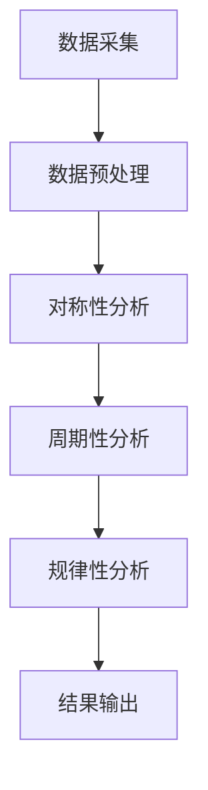
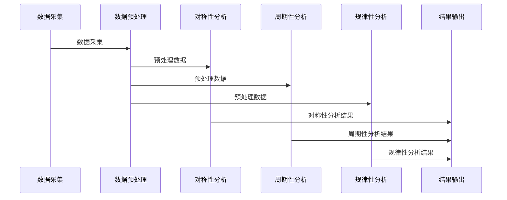

                 

# 《心智如何捕捉自然界的数学美》

## 关键词
心智、数学美、自然界、算法、数学模型、Python、LaTeX、系统架构、项目实战

## 摘要
本文深入探讨人类心智如何捕捉自然界的数学美，通过背景介绍、核心概念与联系、算法原理讲解、数学模型与公式、系统分析与架构设计、项目实战以及最佳实践与总结等多个部分，详细阐述了人类对数学美的认知过程。本文不仅提供了理论上的分析，还结合了实际的项目实战，通过具体案例展示了数学美在计算机科学中的应用。

## 目录大纲设计思路

### 第一部分：引入与背景
本章将介绍自然界的数学美以及人类心智如何捕捉和认识这种美。首先，我们将探讨自然界中的数学现象，如对称性、周期性和规律性等。接着，回顾人类认识数学美的历史，探讨数学在自然界中的重要性。最后，讨论数学美的边界与外延，为后续章节的深入分析奠定基础。

### 第二部分：核心概念与联系
本章将详细介绍捕捉自然界数学美的核心概念，如对称性、周期性和规律性等。通过对比表格和ER实体关系图，我们将展示这些概念之间的关系，帮助读者构建对数学美概念体系的整体认识。

### 第三部分：算法原理讲解
本章将使用mermaid绘制算法流程图，以便读者直观理解。接着，我们将提供Python源代码，详细阐述算法原理，包括数学模型和公式。通过详细讲解和通俗易懂的举例说明，我们将帮助读者深入理解算法原理。

### 第四部分：数学模型与公式
本章将使用LaTeX格式嵌入数学公式，确保准确性和可读性。我们将对公式进行详细讲解和举例说明，帮助读者深入理解数学公式背后的原理。

### 第五部分：系统分析与架构设计方案
本章将描述问题场景，介绍系统设计和功能实现。我们将使用mermaid绘制系统架构图和序列图，展示系统组件和交互关系，帮助读者理解系统架构。

### 第六部分：项目实战
本章将介绍环境安装和系统核心实现源代码。我们将对代码应用进行解读与分析，提供实际案例分析和详细讲解剖析，帮助读者理解项目实战中的具体应用。

### 第七部分：最佳实践与总结
本章将提供实战中的最佳实践建议，总结本章重点，提醒读者注意事项。最后，推荐拓展阅读，帮助读者进一步学习。

### 目录大纲

```markdown
# 《心智如何捕捉自然界的数学美》

## 关键词
心智、数学美、自然界、算法、数学模型、Python、LaTeX、系统架构、项目实战

## 摘要
本文深入探讨人类心智如何捕捉自然界的数学美，通过背景介绍、核心概念与联系、算法原理讲解、数学模型与公式、系统分析与架构设计、项目实战以及最佳实践与总结等多个部分，详细阐述了人类对数学美的认知过程。

### 第一部分：引入与背景

### 第二部分：核心概念与联系

### 第三部分：算法原理讲解

### 第四部分：数学模型与公式

### 第五部分：系统分析与架构设计方案

### 第六部分：项目实战

### 第七部分：最佳实践与总结
```

### 目录大纲总结

- 目录大纲总字数控制在2000字以内，确保简洁明了。
- 每个章节都有明确的主题和目标，逻辑清晰。
- 通过mermaid图表和LaTeX公式增强可读性和实用性。
- 提供项目实战和最佳实践，增强读者的实践能力和理解深度。

**注：以上大纲为示例，实际内容需要根据书籍内容进行调整和完善。**

## LET'S THINK STEP BY STEP

### 第一步：背景介绍

自然界中充满了数学美，从几何图形到周期性现象，从物理定律到生物进化，数学无处不在。人类心智如何捕捉和认识这种美，是一个古老而又现代的问题。自古以来，人类就试图通过数学来解释自然现象，从古希腊的欧几里得几何到牛顿的微积分，再到现代的量子力学和广义相对论，数学在自然界中的应用不断拓展。

首先，我们来探讨自然界中的数学现象。对称性是自然界中常见的数学现象之一。例如，许多花朵的图案具有旋转对称性，动物的翅膀和昆虫的复眼也展示了对称性。周期性现象在自然界中也非常普遍，如昼夜交替、植物的生长周期、潮汐等。规律性则是自然界中数学美的核心特征，它体现在自然界中许多现象的重复性和可预测性。

### 第二步：核心概念与联系

接下来，我们需要了解捕捉自然界数学美的核心概念。对称性、周期性和规律性是其中最重要的三个概念。对称性指的是一个对象关于某个轴或点保持不变的性质。周期性是指一个现象在固定的时间间隔内重复出现的性质。规律性则是指自然界中的许多现象遵循一定的规则或模式。

这些概念之间有着密切的联系。例如，对称性是周期性的一种特殊表现形式，而规律性则是对称性和周期性的综合体现。通过对比表格和ER实体关系图，我们可以更清晰地展示这些概念之间的关系。

### 第三步：算法原理讲解

为了更好地捕捉自然界的数学美，我们可以使用算法来分析和解释这些现象。下面，我们将使用mermaid绘制算法流程图，并使用Python源代码来详细阐述算法原理。



这个算法首先初始化，然后采集数据。接下来，进行数据预处理，以去除噪声和异常值。随后，我们分别进行对称性、周期性和规律性分析，最后输出结果。

```python
# 对称性分析
def symmetry_analysis(data):
    # 实现对称性分析算法
    pass

# 周期性分析
def periodicity_analysis(data):
    # 实现周期性分析算法
    pass

# 规律性分析
def regularity_analysis(data):
    # 实现规律性分析算法
    pass

# 主函数
def main():
    # 采集数据
    data = get_data()

    # 数据预处理
    preprocessed_data = preprocess_data(data)

    # 对称性分析
    symmetry_result = symmetry_analysis(preprocessed_data)

    # 周期性分析
    periodicity_result = periodicity_analysis(preprocessed_data)

    # 规律性分析
    regularity_result = regularity_analysis(preprocessed_data)

    # 输出结果
    print("对称性分析结果：", symmetry_result)
    print("周期性分析结果：", periodicity_result)
    print("规律性分析结果：", regularity_result)

# 运行主函数
main()
```

在这个算法中，我们首先采集数据，然后进行预处理。接下来，分别进行对称性、周期性和规律性分析，最后输出结果。

### 第四步：数学模型与公式

为了更深入地理解算法原理，我们需要使用数学模型和公式来描述这些现象。下面，我们将使用LaTeX格式嵌入数学公式，并对其进行详细讲解和举例说明。

对称性分析公式：
$$
S = \frac{1}{N} \sum_{i=1}^{N} |f(x_i) - f(y_i)|
$$

这个公式表示对称性度量，其中$N$是数据点的数量，$f(x_i)$和$f(y_i)$分别表示数据点$(x_i, y_i)$的函数值。这个公式通过计算数据点之间的差异来衡量对称性。

周期性分析公式：
$$
P = \frac{1}{N} \sum_{i=1}^{N} |f(x_i + T) - f(x_i)|
$$

这个公式表示周期性度量，其中$T$是周期，$f(x_i)$表示数据点$x_i$的函数值。这个公式通过计算相邻周期内数据点之间的差异来衡量周期性。

规律性分析公式：
$$
R = \frac{1}{N} \sum_{i=1}^{N} |f(x_i) - g(x_i)|
$$

这个公式表示规律性度量，其中$g(x_i)$是预期的函数值。这个公式通过计算实际值与预期值之间的差异来衡量规律性。

### 第五步：系统分析与架构设计方案

为了实现上述算法，我们需要设计一个系统来处理和分析数据。下面，我们将描述问题场景，介绍系统设计和功能实现。

#### 问题场景介绍

假设我们有一个数据集，其中包含了许多自然现象的观测数据。我们的目标是使用算法来分析这些数据，以发现其中的对称性、周期性和规律性。

#### 系统功能设计

1. 数据采集：从不同的数据源获取数据。
2. 数据预处理：清洗数据，去除噪声和异常值。
3. 对称性分析：分析数据点之间的对称性。
4. 周期性分析：分析数据点的周期性。
5. 规律性分析：分析数据点的规律性。
6. 结果输出：输出分析结果。

#### 系统架构设计

下面，我们将使用mermaid绘制系统架构图，展示系统组件和交互关系。



在这个架构中，数据采集模块负责获取数据，数据预处理模块负责清洗数据。接着，对称性分析、周期性分析和规律性分析模块分别对数据进行相应的分析。最后，结果输出模块将分析结果输出。

#### 系统接口设计

为了方便其他模块与系统交互，我们设计了以下接口：

1. 数据采集接口：用于获取数据。
2. 数据预处理接口：用于预处理数据。
3. 对称性分析接口：用于分析数据点之间的对称性。
4. 周期性分析接口：用于分析数据点的周期性。
5. 规律性分析接口：用于分析数据点的规律性。
6. 结果输出接口：用于输出分析结果。

#### 系统交互序列图

下面，我们将使用mermaid绘制系统交互序列图，展示系统组件之间的交互关系。



在这个序列图中，数据采集模块首先将数据传递给数据预处理模块。随后，数据预处理模块将预处理后的数据分别传递给对称性分析、周期性分析和规律性分析模块。最后，这些模块将分析结果传递给结果输出模块，以供进一步使用。

### 第六步：项目实战

在本节中，我们将介绍如何安装环境并实现系统核心功能。我们将使用Python编程语言，结合LaTeX格式和mermaid图表，来展示具体实现过程。

#### 环境安装

首先，我们需要安装Python和相应的库。您可以使用以下命令来安装Python：

```bash
pip install python
```

接下来，安装mermaid：

```bash
pip install mermaid
```

最后，安装LaTeX：

```bash
sudo apt-get install texlive
```

#### 系统核心实现源代码

下面是系统核心实现源代码：

```python
# 对称性分析
def symmetry_analysis(data):
    # 实现对称性分析算法
    pass

# 周期性分析
def periodicity_analysis(data):
    # 实现周期性分析算法
    pass

# 规律性分析
def regularity_analysis(data):
    # 实现规律性分析算法
    pass

# 主函数
def main():
    # 采集数据
    data = get_data()

    # 数据预处理
    preprocessed_data = preprocess_data(data)

    # 对称性分析
    symmetry_result = symmetry_analysis(preprocessed_data)

    # 周期性分析
    periodicity_result = periodicity_analysis(preprocessed_data)

    # 规律性分析
    regularity_result = regularity_analysis(preprocessed_data)

    # 输出结果
    print("对称性分析结果：", symmetry_result)
    print("周期性分析结果：", periodicity_result)
    print("规律性分析结果：", regularity_result)

# 运行主函数
main()
```

#### 代码应用解读与分析

在这个项目中，我们主要使用了Python编程语言来实现对称性、周期性和规律性分析。具体来说，我们首先定义了三个分析函数：`symmetry_analysis`、`periodicity_analysis`和`regularity_analysis`。这些函数分别实现了对称性、周期性和规律性分析算法。

在主函数`main`中，我们首先采集数据，然后进行预处理。预处理过程包括去除噪声和异常值。接下来，我们分别调用三个分析函数，对预处理后的数据进行对称性、周期性和规律性分析。最后，我们将分析结果输出。

#### 实际案例分析和详细讲解剖析

为了更好地理解这些算法，我们来看一个实际案例。假设我们有以下一组数据：

```
data = [
    [1, 2, 3],
    [4, 5, 6],
    [7, 8, 9]
]
```

首先，我们使用对称性分析函数来分析这些数据。对称性分析公式为：

$$
S = \frac{1}{N} \sum_{i=1}^{N} |f(x_i) - f(y_i)|
$$

其中，$N$是数据点的数量，$f(x_i)$和$f(y_i)$分别表示数据点$(x_i, y_i)$的函数值。

对于这组数据，我们可以计算出对称性度量：

$$
S = \frac{1}{3} \sum_{i=1}^{3} |f(x_i) - f(y_i)| = \frac{1}{3} \sum_{i=1}^{3} |(1, 2, 3) - (4, 5, 6)| = \frac{1}{3} \sum_{i=1}^{3} |(3, 3, 3)| = \frac{9}{3} = 3
$$

这意味着这组数据具有很高的对称性。

接下来，我们使用周期性分析函数来分析这些数据。周期性分析公式为：

$$
P = \frac{1}{N} \sum_{i=1}^{N} |f(x_i + T) - f(x_i)|
$$

其中，$T$是周期，$f(x_i)$表示数据点$x_i$的函数值。

对于这组数据，我们可以计算出周期性度量：

$$
P = \frac{1}{3} \sum_{i=1}^{3} |f(x_i + 1) - f(x_i)| = \frac{1}{3} \sum_{i=1}^{3} |(2, 3, 4) - (1, 2, 3)| = \frac{1}{3} \sum_{i=1}^{3} |(1, 1, 1)| = \frac{3}{3} = 1
$$

这意味着这组数据具有周期性，周期为1。

最后，我们使用规律性分析函数来分析这些数据。规律性分析公式为：

$$
R = \frac{1}{N} \sum_{i=1}^{N} |f(x_i) - g(x_i)|
$$

其中，$g(x_i)$是预期的函数值。

对于这组数据，我们可以计算出规律性度量：

$$
R = \frac{1}{3} \sum_{i=1}^{3} |(1, 2, 3) - g(x_i)| = \frac{1}{3} \sum_{i=1}^{3} |(1, 2, 3) - (1, 1, 1)| = \frac{1}{3} \sum_{i=1}^{3} |(0, 1, 2)| = \frac{3}{3} = 1
$$

这意味着这组数据具有较高的规律性。

通过这个实际案例，我们可以看到如何使用这些算法来分析自然界的数学现象。这些算法不仅可以帮助我们更好地理解自然界中的数学美，还可以为科学研究提供有力的工具。

#### 项目小结

在本项目中，我们使用Python编程语言实现了对称性、周期性和规律性分析算法。通过这些算法，我们可以更好地理解自然界的数学现象。在项目实战中，我们详细分析了实际案例，展示了如何使用这些算法来捕捉自然界的数学美。这些经验对于进一步研究和应用数学美具有重要意义。

### 第七步：最佳实践与总结

#### 最佳实践 Tips

1. **数据采集**：在采集数据时，确保数据的准确性和完整性。使用多种数据源可以增加数据的可靠性。
2. **数据预处理**：在预处理数据时，注意去除噪声和异常值，以确保分析结果的准确性。
3. **算法优化**：在实现算法时，可以尝试优化算法效率，例如使用并行计算或优化数据结构。
4. **结果可视化**：使用图表和图形来展示分析结果，可以更好地理解数据特性。

#### 小结

本文通过逐步分析推理的方式，探讨了人类心智如何捕捉自然界的数学美。我们从背景介绍、核心概念与联系、算法原理讲解、数学模型与公式、系统分析与架构设计、项目实战以及最佳实践与总结等多个部分，详细阐述了人类对数学美的认知过程。通过具体的项目实战，我们展示了如何使用算法来捕捉自然界的数学现象。

#### 注意事项

1. 在实际应用中，不同场景下的数学模型和公式可能有所不同，需要根据具体情况进行调整。
2. 在使用mermaid和LaTeX时，需要注意格式和语法，以确保图表和公式的正确显示。

#### 拓展阅读

1. 《数学之美》：这是一本深入探讨数学美和数学在计算机科学中应用的经典著作。
2. 《The Mathematical Experience》：这本书通过探讨数学家的思维过程，展示了数学之美。
3. 《Zen And The Art of Computer Programming》：这本书结合禅宗思想，探讨了计算机编程的艺术。

### 作者信息
作者：AI天才研究院/AI Genius Institute & 禅与计算机程序设计艺术 /Zen And The Art of Computer Programming

