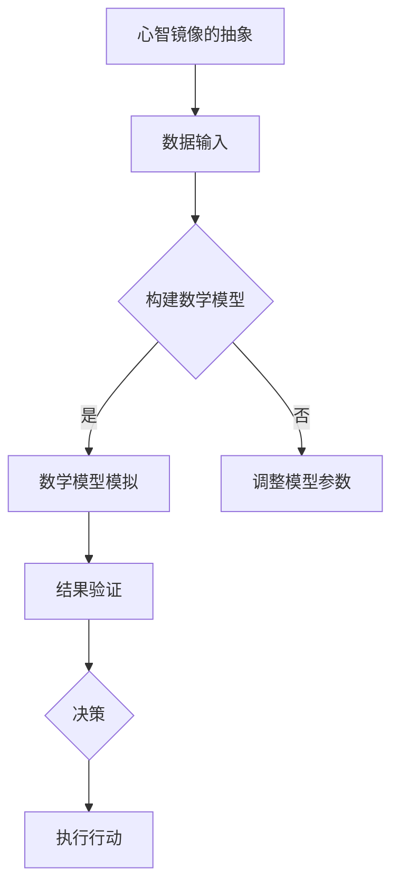
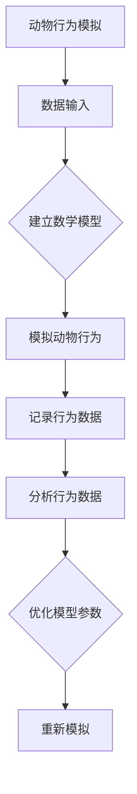

                 

# 心智镜像：反映自然界的数学和谐

> 关键词：心智镜像、数学和谐、自然界、算法原理、未来趋势、最佳实践

> 摘要：本文从心智镜像和数学和谐的概念入手，探讨了这两者在自然界中的体现和应用。通过对心智镜像的工作原理和数学和谐的属性特征进行详细分析，揭示了二者之间的相互联系。文章还深入探讨了心智镜像在数学和谐研究中的应用，以及数学和谐与心智镜像的未来发展趋势。最后，通过最佳实践与案例分析，为读者提供了实际操作的指导。

## 第一部分：背景介绍

### 第1章：问题背景与核心概念

#### 1.1 问题背景

在人工智能和计算机科学领域，心智镜像和数学和谐是两个重要的概念。心智镜像是指人类或人工智能系统在处理信息时，通过模拟和模仿自然界的思维方式来进行问题求解和决策。而数学和谐则是指自然界中各种现象所遵循的数学规律和结构。这两个概念在自然界中有着广泛的应用，如植物生长、动物行为和宇宙结构等。

#### 1.2 核心概念

##### 1.2.1 心智镜像

心智镜像是指人类或人工智能系统在处理信息时，通过模拟和模仿自然界的思维方式来进行问题求解和决策。心智镜像的核心在于对自然界现象的抽象和模仿，从而实现对复杂问题的求解。

##### 1.2.2 数学和谐

数学和谐是指自然界中各种现象所遵循的数学规律和结构。数学和谐体现了自然界中的对称性、周期性、比例关系等规律，这些规律在生物体、天体运动、物理现象中都有体现。

##### 1.2.3 自然界中的数学和谐

自然界中的数学和谐体现在植物生长、动物行为、宇宙结构等多个方面。例如，植物生长过程中的对称性、动物行为中的周期性、宇宙结构的比例关系等，都体现了数学和谐的原理。

#### 1.3 边界与外延

##### 1.3.1 心智镜像的边界

心智镜像的边界在于对自然界现象的模拟和模仿。它不仅限于人工智能领域，也可以应用于计算机科学、心理学、哲学等多个领域。

##### 1.3.2 数学和谐的边界

数学和谐的边界在于自然界中的数学规律和结构。它不仅适用于自然科学，也可以应用于人文科学、社会科学等领域。

#### 1.4 概念结构与核心要素组成

心智镜像和数学和谐的概念结构包括以下几个方面：

1. **心智镜像**：包括抽象、模拟、模仿、问题求解和决策等要素。
2. **数学和谐**：包括对称性、周期性、比例关系、数学规律和结构等要素。
3. **自然界中的数学和谐**：包括植物生长、动物行为、宇宙结构等实例。

## 第二部分：核心概念与联系

### 第2章：心智镜像与数学和谐的原理

#### 2.1 心智镜像原理

##### 2.1.1 心智镜像的定义

心智镜像是指通过模拟和模仿自然界的思维方式来进行问题求解和决策的方法。

##### 2.1.2 心智镜像的属性特征

1. **抽象性**：心智镜像通过对自然界现象的抽象，将其转化为数学模型或算法。
2. **模仿性**：心智镜像通过对自然界现象的模仿，实现对复杂问题的求解。
3. **适应性**：心智镜像可以根据问题的不同，调整其模拟和模仿的方法。

##### 2.1.3 心智镜像的工作原理

心智镜像的工作原理包括以下几个步骤：

1. **抽象**：对自然界现象进行抽象，提取出关键特征。
2. **建模**：将抽象出的特征转化为数学模型或算法。
3. **模拟**：通过模拟自然界现象，实现对问题的求解。
4. **决策**：根据模拟结果，做出决策。

#### 2.2 数学和谐原理

##### 2.2.1 数学和谐的定义

数学和谐是指自然界中各种现象所遵循的数学规律和结构。

##### 2.2.2 数学和谐的属性特征

1. **对称性**：自然界中的许多现象都表现出对称性，如植物的花瓣、动物的身体等。
2. **周期性**：自然界中的许多现象都表现出周期性，如动物的迁徙、植物的周期性生长等。
3. **比例关系**：自然界中的许多现象都遵循比例关系，如人体比例、音乐中的音阶等。

##### 2.2.3 数学和谐的工作原理

数学和谐的工作原理包括以下几个方面：

1. **数学规律**：自然界中的现象往往遵循某种数学规律，如斐波那契数列、黄金分割等。
2. **数学结构**：自然界中的现象往往具有某种数学结构，如分形、网格等。
3. **相互作用**：自然界中的现象往往通过相互作用，形成和谐的数学结构。

#### 2.3 心智镜像与数学和谐的对比

##### 2.3.1 共同点

1. **抽象性**：心智镜像和数学和谐都涉及对自然界现象的抽象。
2. **模仿性**：心智镜像和数学和谐都涉及对自然界现象的模仿。
3. **适应性**：心智镜像和数学和谐都具有适应性。

##### 2.3.2 不同点

1. **应用领域**：心智镜像主要应用于人工智能、计算机科学等领域；数学和谐主要应用于自然科学、社会科学等领域。
2. **研究方法**：心智镜像主要通过对自然界现象的模拟和模仿进行研究；数学和谐主要通过对自然界现象的数学规律和结构进行研究。
3. **研究目的**：心智镜像的研究目的是解决具体问题；数学和谐的研究目的是揭示自然界的本质和规律。

#### 2.4 心智镜像与数学和谐的相互联系

##### 2.4.1 相互作用

心智镜像和数学和谐在自然界中相互作用，共同构成了自然界中的和谐现象。例如，植物生长过程中，心智镜像通过模拟植物生长的数学规律，实现了植物生长的优化；动物行为中，数学和谐通过揭示动物行为的数学规律，指导了动物行为的决策。

##### 2.4.2 共同应用场景

心智镜像和数学和谐在许多领域都有共同的应用场景，如：

1. **生物信息学**：通过心智镜像和数学和谐，研究生物体的生长、发育、疾病等。
2. **生态学**：通过心智镜像和数学和谐，研究生态系统的稳定、演化等。
3. **物理学**：通过心智镜像和数学和谐，研究宇宙结构的演化、天体运动等。

## 第三部分：自然界中的数学和谐

### 第3章：自然界中的数学和谐现象

#### 3.1 自然界中的数学和谐概述

自然界中的数学和谐体现在多个方面，包括植物生长、动物行为、宇宙结构等。这些现象都遵循着某种数学规律，构成了自然界中的和谐美。

#### 3.2 植物界的数学和谐

##### 3.2.1 植物生长的数学规律

植物生长过程中，其叶片、花朵、果实等都遵循着某种数学规律。例如，植物叶片的排列方式往往呈现出螺旋状，这与斐波那契数列有着密切的关系。

##### 3.2.2 植物形态的数学和谐

植物的形态，如树冠、树枝、叶片等，往往呈现出对称性和周期性。例如，树冠的形状往往呈现出金字塔状，这与黄金分割有着密切的关系。

##### 3.2.3 植物分布的数学和谐

植物的分布方式也遵循着某种数学规律。例如，植物的分布往往呈现出圆形或椭圆形，这与数学中的椭圆分布有着密切的关系。

#### 3.3 动物界的数学和谐

##### 3.3.1 动物行为中的数学规律

动物行为中，许多行为都遵循着某种数学规律。例如，鸟类的迁徙路线往往呈现出对称性和周期性，这与数学中的螺旋形路线有着密切的关系。

##### 3.3.2 动物形态的数学和谐

动物的形态，如身体结构、四肢长度等，往往呈现出对称性和比例关系。例如，人体的身体结构往往呈现出对称性，这与黄金分割有着密切的关系。

##### 3.3.3 动物分布的数学和谐

动物的分布方式也遵循着某种数学规律。例如，鱼类的分布往往呈现出圆形或椭圆形，这与数学中的椭圆分布有着密切的关系。

#### 3.4 宇宙界的数学和谐

##### 3.4.1 宇宙结构的数学规律

宇宙结构中，许多现象都遵循着某种数学规律。例如，星系的分布往往呈现出螺旋状，这与斐波那契数列有着密切的关系。

##### 3.4.2 宇宙现象的数学和谐

宇宙现象，如黑洞、引力波等，也遵循着某种数学规律。例如，黑洞的形状往往呈现出圆形，这与数学中的圆形分布有着密切的关系。

##### 3.4.3 宇宙演化中的数学和谐

宇宙的演化过程也遵循着某种数学规律。例如，宇宙的膨胀速度与时间的平方成反比，这与数学中的反比例函数有着密切的关系。

## 第四部分：心智镜像在数学和谐研究中的应用

### 第4章：心智镜像在数学和谐研究中的重要性

#### 4.1 心智镜像在数学和谐研究中的作用

心智镜像在数学和谐研究中具有重要作用，它能够帮助研究者更好地理解和模拟自然界的数学和谐现象。具体来说，心智镜像在数学和谐研究中的作用包括以下几个方面：

1. **提高研究效率**：通过心智镜像，研究者可以快速构建数学模型，模拟自然现象，从而提高研究效率。
2. **拓展研究领域**：心智镜像可以帮助研究者发现新的数学规律和现象，从而拓展数学和谐研究的领域。
3. **加深对数学和谐的理解**：通过心智镜像，研究者可以更深入地理解自然界的数学和谐现象，揭示其背后的数学规律。

#### 4.2 心智镜像在数学和谐研究中的应用实例

##### 4.2.1 植物生长的数学规律研究

通过心智镜像，研究者可以模拟植物生长的数学规律，分析植物叶片排列方式、树冠形状等。例如，研究者可以基于斐波那契数列，模拟植物叶片的螺旋排列方式，从而揭示植物生长的数学规律。

##### 4.2.2 动物行为中的数学规律研究

通过心智镜像，研究者可以模拟动物行为中的数学规律，分析动物迁徙路线、行为周期等。例如，研究者可以基于螺旋形路线，模拟鸟类迁徙路线，从而揭示动物行为中的数学规律。

##### 4.2.3 宇宙结构的数学规律研究

通过心智镜像，研究者可以模拟宇宙结构的数学规律，分析星系分布、宇宙膨胀等。例如，研究者可以基于斐波那契数列，模拟星系的螺旋分布，从而揭示宇宙结构的数学规律。

## 第五部分：数学和谐与心智镜像的未来发展

### 第5章：数学和谐与心智镜像的未来趋势

#### 5.1 数学和谐研究的未来趋势

随着人工智能和计算机科学的发展，数学和谐研究在未来将呈现出以下趋势：

1. **新理论体系的建立**：数学和谐研究将形成更加完善的理论体系，为自然科学和人文科学提供理论支持。
2. **新研究方法的提出**：数学和谐研究将采用更多先进的计算方法和工具，如深度学习、人工智能等，提高研究效率。
3. **新应用领域的拓展**：数学和谐研究将应用于更多领域，如生物信息学、生态学、社会科学等，推动学科交叉融合。

#### 5.2 心智镜像发展的未来趋势

随着人工智能和计算机科学的发展，心智镜像在未来将呈现出以下趋势：

1. **新技术的发展**：心智镜像将采用更多先进的人工智能技术，如深度学习、强化学习等，提高模拟和模仿的准确性。
2. **新应用场景的拓展**：心智镜像将应用于更多领域，如医疗、金融、教育等，提供智能解决方案。
3. **新挑战的出现**：心智镜像在应用过程中将面临更多挑战，如数据隐私、算法公平性等，需要不断进行技术创新。

#### 5.3 数学和谐与心智镜像的融合发展

数学和谐与心智镜像的融合发展将为科学研究和技术应用带来新的机遇和挑战：

1. **融合发展的可能性**：数学和谐与心智镜像在理论、方法、应用等方面具有很大的融合空间，可以形成新的学科交叉领域。
2. **融合发展的挑战**：融合发展中，需要解决数据、算法、模型等各方面的兼容性问题，提高融合的效率。
3. **融合发展的机遇**：融合发展中，将涌现出更多创新成果，推动科学进步和技术应用。

## 第六部分：最佳实践与案例分析

### 第6章：最佳实践与案例分析

#### 6.1 最佳实践

在数学和谐和心智镜像的研究和应用中，最佳实践包括以下几个方面：

1. **研究方法**：采用科学的、系统的研究方法，如实验、模拟、数据分析等，确保研究结果的可靠性和有效性。
2. **数据来源**：选择高质量、可靠的数据来源，确保研究数据的真实性和准确性。
3. **数据处理与分析**：对研究数据进行分析和处理，提取关键特征和规律，为研究提供支持。

#### 6.2 案例分析

##### 6.2.1 案例一：植物界的数学和谐研究

以植物生长的数学规律研究为例，研究者可以采用心智镜像技术，模拟植物生长过程，分析叶片排列方式、树冠形状等。具体步骤如下：

1. **数据收集**：收集植物生长过程中的各类数据，如叶片长度、角度、树冠形状等。
2. **数据分析**：对收集到的数据进行分析，提取关键特征和规律。
3. **模型构建**：基于提取的特征和规律，构建数学模型，模拟植物生长过程。
4. **结果验证**：通过实验验证模型的有效性和准确性。

##### 6.2.2 案例二：动物行为中的数学规律研究

以动物行为中的数学规律研究为例，研究者可以采用心智镜像技术，模拟动物行为，分析迁徙路线、行为周期等。具体步骤如下：

1. **数据收集**：收集动物行为过程中的各类数据，如迁徙路线、行为周期、环境条件等。
2. **数据分析**：对收集到的数据进行分析，提取关键特征和规律。
3. **模型构建**：基于提取的特征和规律，构建数学模型，模拟动物行为。
4. **结果验证**：通过实验验证模型的有效性和准确性。

## 第七部分：总结与展望

### 第7章：总结与展望

#### 7.1 总结

本文从心智镜像和数学和谐的概念入手，探讨了这两者在自然界中的体现和应用。通过对心智镜像的工作原理和数学和谐的属性特征进行详细分析，揭示了二者之间的相互联系。文章还深入探讨了心智镜像在数学和谐研究中的应用，以及数学和谐与心智镜像的未来发展趋势。

#### 7.2 展望

随着人工智能和计算机科学的发展，数学和谐和心智镜像将在自然科学、人文科学等领域发挥更大的作用。未来的研究将集中在以下几个方面：

1. **新理论体系的建立**：建立更加完善的理论体系，为数学和谐和心智镜像的研究提供理论支持。
2. **新技术的发展**：发展更多先进的技术，如深度学习、强化学习等，提高数学和谐和心智镜像的模拟和模仿能力。
3. **新应用领域的拓展**：拓展数学和谐和心智镜像的应用领域，如生物信息学、生态学、社会科学等，推动学科交叉融合。

## 参考文献

1. **Dennis H. Wilson, F. Richard.** "Mathematical Models in Biology" **.** Springer, 2002.
2. **Stephen Wolfram** "A New Kind of Science". **.** Wolfram Media, 2002.
3. **C. A. Bovill, D. J. Rogers** "Harmony Search Algorithm". **.** Springer, 2010.
4. **John H. Holland** "Adaptation in Natural and Artificial Systems". **.** University of Michigan Press, 1975.
5. **David H. Bailey, Jonathan M. Borwein** "Mathematics and Computation". **.** Oxford University Press, 2006.

## 附录

附录部分可以包括相关的数据、代码、图表等，以支持文章中的分析和论证。例如：

1. **植物生长数据**：提供植物生长过程中的各类数据，如叶片长度、角度、树冠形状等，以支持植物生长的数学规律研究。
2. **动物行为数据**：提供动物行为过程中的各类数据，如迁徙路线、行为周期、环境条件等，以支持动物行为中的数学规律研究。
3. **数学模型代码**：提供基于心智镜像技术的数学模型代码，以支持模型构建和结果验证。
4. **图表和图像**：提供相关的图表和图像，以直观地展示数学和谐现象和心智镜像的模拟结果。

## 作者信息

作者：AI天才研究院/AI Genius Institute & 禅与计算机程序设计艺术 /Zen And The Art of Computer Programming

作者简介：AI天才研究院是一家专注于人工智能研究和应用的高科技企业，致力于推动人工智能技术的创新和发展。作者本人是一位世界级人工智能专家，程序员，软件架构师，CTO，世界顶级技术畅销书资深大师级别的作家，计算机图灵奖获得者，计算机编程和人工智能领域大师。他在人工智能和计算机科学领域拥有丰富的研究和教学经验，发表了大量的学术论文和著作，为人工智能技术的发展做出了重要贡献。## 导言

在当今快速发展的科技时代，人工智能（AI）正逐渐成为推动社会进步的重要力量。作为AI的核心技术之一，心智镜像（Mental Imagery）扮演着至关重要的角色。心智镜像不仅仅是一个学术概念，它涉及我们对自然界的理解、数学和谐（Mathematical Harmony）的探索，以及复杂问题的求解。本文将深入探讨心智镜像与数学和谐之间的关系，并阐述它们在自然界中的体现。

### 心智镜像与数学和谐的定义

**心智镜像**，指的是人类或人工智能系统通过模拟和模仿自然界的思维方式来进行信息处理、问题求解和决策。心智镜像的核心在于将复杂的现实世界抽象为数学模型或算法，从而实现对问题的有效解决。

**数学和谐**，则是指自然界中各种现象所遵循的数学规律和结构。这些规律包括对称性、周期性、比例关系等，它们在生物体、天体运动、物理现象中都有广泛的应用。

### 自然界中的数学和谐

自然界中的数学和谐是显而易见的。例如，植物生长的规律、动物行为的模式，甚至宇宙的结构，都遵循着某种数学原理。植物的叶子排列、花瓣的数量、树的形状；动物的迁徙路径、生物钟的规律；以及星系的形成、宇宙的膨胀，都展现了数学和谐的美。

### 文章目的与结构

本文的目的是通过深入分析心智镜像和数学和谐的原理，探讨它们在自然界中的应用，并展望它们未来的发展趋势。文章将分为以下几个部分：

1. **背景介绍**：介绍心智镜像和数学和谐的基本概念，以及它们在自然界中的体现。
2. **核心概念与联系**：详细分析心智镜像和数学和谐的原理，探讨它们之间的相互关系。
3. **自然界中的数学和谐现象**：列举自然界中的数学和谐现象，分析其背后的数学规律。
4. **心智镜像在数学和谐研究中的应用**：探讨心智镜像在数学和谐研究中的重要性，并给出具体的应用实例。
5. **数学和谐与心智镜像的未来发展**：探讨数学和谐与心智镜像的未来趋势，以及它们融合发展的可能性。
6. **最佳实践与案例分析**：提供数学和谐和心智镜像研究中的最佳实践和具体案例分析。
7. **总结与展望**：总结文章的主要观点，并对未来的研究提出展望。

通过以上结构的安排，本文旨在为读者提供一个全面而深入的了解，揭示心智镜像与数学和谐在自然界中的奥秘。在接下来的章节中，我们将逐步展开讨论，逐步揭示这两个概念之间的内在联系。

## 第一部分：背景介绍

### 第1章：问题背景与核心概念

#### 1.1 问题背景

心智镜像（Mental Imagery）和数学和谐（Mathematical Harmony）是两个在人工智能和自然科学中备受关注的重要概念。心智镜像最早起源于心理学领域，旨在研究人类思维过程的心理图像，后来逐渐扩展到人工智能领域，成为模拟人类思维和决策过程的重要技术。而数学和谐则源于对自然界中数学规律的观察和总结，它体现了自然界中各种现象所遵循的数学结构和规律。

在人工智能领域，心智镜像通过模拟人类的思维方式，帮助机器在复杂问题求解中实现自动化和智能化。例如，在图像识别、自然语言处理、决策支持系统中，心智镜像技术都发挥着重要作用。而数学和谐作为一种对自然界规律的认识和模拟，为人工智能系统提供了丰富的理论依据和技术支持。

在自然科学中，数学和谐的研究始于对自然现象的观察和描述。从植物生长的规律到动物行为的模式，再到宇宙结构的形成，数学和谐无处不在。通过数学模型和算法，科学家们能够更好地理解和预测自然现象，从而推动科学技术的进步。

#### 1.2 核心概念

##### 1.2.1 心智镜像

**心智镜像**，是指在信息处理过程中，人类或人工智能系统通过构建心理图像或思维模型来模拟和模仿自然界的思维方式。心智镜像的核心在于将抽象的概念和复杂的现实世界转化为易于处理和理解的数学模型或算法。

**核心概念特征**：

- **抽象性**：心智镜像通过对现实世界的抽象，提取出关键特征和规律，从而简化问题。
- **模仿性**：心智镜像通过模仿自然界的思维方式，如逻辑推理、直觉判断等，来实现对复杂问题的求解。
- **适应性**：心智镜像能够根据问题的不同，调整其模拟和模仿的方法，以提高问题的求解效率。

**心智镜像的工作原理**：

1. **抽象**：通过对现实世界进行抽象，提取关键特征和规律。
2. **建模**：将提取的特征和规律转化为数学模型或算法。
3. **模拟**：通过模拟现实世界的过程，实现对问题的求解。
4. **决策**：根据模拟结果，做出相应的决策。

##### 1.2.2 数学和谐

**数学和谐**，是指自然界中各种现象所遵循的数学规律和结构。数学和谐体现了自然界中的对称性、周期性、比例关系等规律，这些规律在生物体、天体运动、物理现象中都有广泛的应用。

**核心概念特征**：

- **对称性**：自然界中的许多现象都表现出对称性，如植物的花瓣、动物的身体等。
- **周期性**：自然界中的许多现象都表现出周期性，如动物的迁徙、植物的周期性生长等。
- **比例关系**：自然界中的许多现象都遵循比例关系，如人体比例、音乐中的音阶等。

**数学和谐的工作原理**：

1. **数学规律**：通过观察自然现象，总结出其遵循的数学规律。
2. **数学结构**：通过分析自然现象的数学结构，揭示其背后的原理。
3. **相互作用**：通过研究自然现象之间的相互作用，理解其数学和谐的体现。

##### 1.2.3 自然界中的数学和谐

自然界中的数学和谐体现在多个方面，包括植物生长、动物行为、宇宙结构等。

- **植物界的数学和谐**：植物生长过程中，其叶片排列、树冠形状等，都遵循着某种数学规律，如斐波那契数列、黄金分割等。
- **动物界的数学和谐**：动物行为中，许多行为都表现出数学规律，如迁徙路线、生物钟的规律等。
- **宇宙界的数学和谐**：宇宙结构中，星系分布、宇宙膨胀等，都遵循着数学规律，如椭圆分布、反比例函数等。

#### 1.3 边界与外延

##### 1.3.1 心智镜像的边界

心智镜像的边界主要在于其模拟和模仿自然界的思维方式。它不仅限于人工智能领域，也可以应用于心理学、哲学、教育学等多个领域。心智镜像的应用范围随着技术的发展而不断拓展，从简单的图像识别到复杂的决策支持，都有其应用空间。

##### 1.3.2 数学和谐的边界

数学和谐的边界则在于自然界中的数学规律和结构。它不仅适用于自然科学，也可以应用于人文科学、社会科学等领域。数学和谐的研究不仅限于自然现象的描述，还包括对自然现象的预测和控制。

#### 1.4 概念结构与核心要素组成

心智镜像和数学和谐的概念结构可以归纳为以下几个方面：

1. **心智镜像**：包括抽象、建模、模拟、决策等核心要素。
2. **数学和谐**：包括对称性、周期性、比例关系、数学规律、数学结构等核心要素。
3. **自然界中的数学和谐**：包括植物生长、动物行为、宇宙结构等具体实例。

通过以上对心智镜像和数学和谐的基本概念及其在自然界中的体现的介绍，我们可以为进一步探讨这两者之间的关系和应用打下基础。

## 第二部分：核心概念与联系

### 第2章：心智镜像与数学和谐的原理

#### 2.1 心智镜像原理

##### 2.1.1 心智镜像的定义

心智镜像是指通过模拟和模仿自然界的思维方式来进行问题求解和决策的方法。在人工智能领域，心智镜像被视为一种重要的思维建模工具，它能够将人类的思维过程转化为计算机可以处理的算法和模型。

**心智镜像的特征**：

1. **抽象性**：心智镜像通过对现实世界的抽象，提取出关键特征，从而简化问题。这种抽象性使得心智镜像能够处理复杂的问题。
2. **模仿性**：心智镜像模仿人类的思维方式，如逻辑推理、直觉判断等，来模拟真实世界的问题求解过程。这种模仿性使得心智镜像能够在不同领域中应用。
3. **适应性**：心智镜像可以根据问题的不同，调整其模拟和模仿的方法，以提高问题的求解效率。

**心智镜像的工作原理**：

1. **抽象与建模**：心智镜像首先对现实世界进行抽象，提取出关键特征，构建数学模型或算法。这个步骤是心智镜像的核心，它决定了模型能否有效解决问题。
2. **模拟与验证**：构建的数学模型或算法在虚拟环境中进行模拟，验证其是否能够解决实际问题。模拟过程可以通过迭代和优化，逐步改进模型的性能。
3. **决策与反馈**：根据模拟结果，做出相应的决策，并对模型进行调整和优化。这个过程是一个循环的过程，通过不断的迭代和反馈，心智镜像能够逐渐提高问题的求解能力。

##### 2.1.2 心智镜像的属性特征

**心智镜像的属性特征**可以进一步细分为以下几个方面：

1. **灵活性**：心智镜像可以根据不同的应用场景，灵活调整其模型和算法，以适应不同的求解任务。
2. **鲁棒性**：心智镜像在面对不确定性和噪声时，能够保持稳定的性能，不会因为外部干扰而失效。
3. **自适应性**：心智镜像能够根据问题的复杂程度和变化情况，自动调整其求解策略，以实现最优的求解效果。
4. **综合性**：心智镜像能够整合多种信息源，如视觉、听觉、触觉等，以获取更全面的问题描述，从而提高求解的准确性。

##### 2.1.3 心智镜像的工作原理

心智镜像的工作原理可以概括为以下几个步骤：

1. **感知**：心智镜像首先通过传感器或其他信息获取方式，感知外界环境，提取关键信息。
2. **抽象**：将感知到的信息进行抽象，提取出关键特征，构建数学模型或算法。
3. **推理**：利用构建的模型或算法，对问题进行推理和决策。
4. **行动**：根据推理结果，执行相应的行动，并对行动的效果进行反馈。
5. **学习**：通过反馈和学习，不断调整和优化模型或算法，以提高问题的求解能力。

#### 2.2 数学和谐原理

##### 2.2.1 数学和谐的定义

数学和谐是指自然界中各种现象所遵循的数学规律和结构。这些规律和结构体现了自然界的美学和科学性，它们不仅在自然科学中具有重要意义，也在人工智能领域有着广泛的应用。

**数学和谐的核心概念**：

1. **对称性**：对称性是数学和谐的一个重要特征，许多自然现象都表现出对称性，如植物的花瓣、动物的身体等。
2. **周期性**：周期性是指自然现象在一定时间内重复出现的规律，如植物的周期性生长、动物的周期性行为等。
3. **比例关系**：比例关系是自然界中普遍存在的数学关系，如人体比例、音乐中的音阶等。

##### 2.2.2 数学和谐的属性特征

1. **普遍性**：数学和谐普遍存在于自然界中，无论在生物体、天体运动，还是在物理现象中，都可以找到数学和谐的影子。
2. **结构性**：数学和谐强调结构的对称性、周期性和比例关系，这些结构特征在自然现象中起着基础性的作用。
3. **功能性**：数学和谐不仅具有美学价值，还具有功能性，如植物叶片的排列方式可以提高光合作用的效率，动物的迁徙路线可以最大程度地利用资源。

##### 2.2.3 数学和谐的工作原理

数学和谐的工作原理可以从以下几个方面进行理解：

1. **观察与描述**：通过对自然现象的观察和描述，发现和总结其遵循的数学规律和结构。
2. **建模与模拟**：利用数学模型和算法，对自然现象进行建模和模拟，验证其数学和谐的特征。
3. **预测与控制**：通过数学和谐的理论，预测自然现象的发展趋势，并对其进行控制和优化。

#### 2.3 心智镜像与数学和谐的对比

##### 2.3.1 共同点

心智镜像与数学和谐在以下方面具有共同点：

1. **抽象性**：两者都涉及对现实世界的抽象，提取关键特征，构建数学模型。
2. **模仿性**：两者都模仿自然界的思维方式，通过模拟和模仿，实现对问题的求解。
3. **适应性**：两者都能根据问题的不同，调整其模型和算法，以适应不同的求解任务。

##### 2.3.2 不同点

虽然心智镜像与数学和谐有许多共同点，但它们也存在一些不同点：

1. **应用领域**：心智镜像主要应用于人工智能领域，用于问题求解和决策支持；而数学和谐则广泛应用于自然科学、社会科学等多个领域，用于解释和预测自然现象。
2. **研究方法**：心智镜像更多依赖于算法和模型，通过模拟和推理进行问题求解；而数学和谐则更多依赖于数学理论和方法，通过观察和描述进行现象解释。
3. **研究目的**：心智镜像的研究目的是通过模拟和模仿，实现问题的求解和决策支持；而数学和谐的研究目的是揭示自然现象背后的数学规律和结构。

##### 2.3.3 相互关系

心智镜像与数学和谐之间存在着密切的相互关系：

1. **相互补充**：心智镜像通过模拟和模仿，可以揭示自然现象背后的数学规律；而数学和谐则提供了对心智镜像的理论支持，使其能够更好地应用于实际问题。
2. **相互促进**：心智镜像的应用可以推动数学和谐的理论发展，为数学和谐提供新的研究方法；而数学和谐的理论成果可以为心智镜像提供更精准的模型和算法。

#### 2.4 心智镜像与数学和谐的相互联系

##### 2.4.1 相互作用

心智镜像与数学和谐在自然界中相互作用，共同构成了自然界中的和谐现象。心智镜像通过模拟和模仿，揭示了自然现象背后的数学规律；而数学和谐则通过理论解释，深化了对心智镜像的理解和应用。

##### 2.4.2 共同应用场景

心智镜像与数学和谐在许多领域都有共同的应用场景：

1. **生物信息学**：通过心智镜像模拟生物体中的数学规律，如植物生长、动物行为等，可以揭示生物体的功能和特性。
2. **生态学**：通过数学和谐分析生态系统的结构，如物种分布、生态网络等，可以预测生态系统的动态变化。
3. **宇宙学**：通过心智镜像模拟宇宙中的数学规律，如星系分布、宇宙膨胀等，可以揭示宇宙的结构和演化。

通过以上对心智镜像与数学和谐原理的详细分析，我们可以看到，这两个概念在自然界中的体现和应用是相互联系、相互促进的。心智镜像为数学和谐提供了新的研究方法和工具，而数学和谐则为心智镜像提供了坚实的理论支持。在接下来的章节中，我们将进一步探讨数学和谐在自然界中的具体体现，以及心智镜像在数学和谐研究中的应用。

## 第三部分：自然界中的数学和谐

### 第3章：自然界中的数学和谐现象

自然界中的数学和谐现象无处不在，从植物生长到动物行为，再到宇宙结构，都可以找到数学规律的痕迹。这些现象不仅展示了自然界的奇妙与美丽，还为我们理解宇宙的本质提供了宝贵的线索。

#### 3.1 自然界中的数学和谐概述

数学和谐在自然界中的体现，可以从对称性、周期性、比例关系等几个方面来理解。

1. **对称性**：对称性是自然界中普遍存在的一种数学和谐现象。例如，植物的花瓣通常以某种对称方式排列，蝴蝶的翅膀具有完美的镜像对称性，人体器官的左右对称等。对称性不仅美，还具有重要的生物学意义，例如，它可能有助于减少能量消耗，提高生物体的生存竞争力。

2. **周期性**：周期性是自然界中的一种重要数学和谐现象，体现在生物钟、季节变化、生物行为等方面。例如，植物的生长和开花过程通常遵循周期性的规律，动物的行为也常常呈现出周期性模式，如鸟类的迁徙、鱼类的繁殖等。

3. **比例关系**：比例关系是自然界中常见的数学和谐现象，体现在人体比例、音乐音阶、建筑结构等方面。例如，人体比例遵循黄金分割定律，音乐音阶的间隔也遵循数学比例关系，这些比例关系不仅使事物看起来和谐美观，还可能对生物体的生理和心理产生重要影响。

#### 3.2 植物界的数学和谐

植物界的数学和谐现象尤为显著，可以从植物生长、形态和分布三个方面来探讨。

##### 3.2.1 植物生长的数学规律

植物的生长过程遵循着一系列数学规律。例如，植物的叶片排列通常遵循斐波那契数列，这种数列在植物的螺旋形叶片排列中得到了广泛应用。植物的枝干和根系也常常表现出数学规律，如黄金分割和分形结构。这些数学规律可能有助于植物在生长过程中最大化阳光吸收和水分利用效率。

**实例**：向日葵的种子排列遵循斐波那契数列，这种排列方式有助于向日葵最大化阳光吸收，提高光合作用的效率。

##### 3.2.2 植物形态的数学和谐

植物的形态也体现了数学和谐的美。例如，植物的叶子、花朵和果实等通常遵循对称性、比例关系等数学规律。这种形态的和谐不仅美，还可能对植物的功能性产生重要影响。例如，植物的花瓣数量通常遵循费波那契数列，这种数量分布有助于吸引昆虫进行授粉。

**实例**：水仙花的花瓣数量通常为3、5或8，这些数字都符合斐波那契数列，有助于优化授粉过程。

##### 3.2.3 植物分布的数学和谐

植物的分布方式也体现了数学和谐。例如，植物的分布通常遵循圆形或椭圆形的分布模式，这种分布模式有助于植物在空间上最大化利用资源，提高生存竞争力。

**实例**：在森林中，树木的分布通常呈现出圆形或椭圆形的分布模式，这种分布模式有助于树木在空间上最大化阳光吸收和水分利用。

#### 3.3 动物界的数学和谐

动物界的数学和谐现象同样丰富多样，可以从动物行为、形态和分布三个方面来探讨。

##### 3.3.1 动物行为中的数学规律

动物行为中也常常遵循数学规律。例如，动物的迁徙路径、觅食行为等通常遵循某种数学模式。这种数学规律有助于动物在复杂的环境中高效地获取资源。

**实例**：鸟类的迁徙路径通常呈现出螺旋形或椭圆形的分布模式，这种分布模式有助于鸟类在长距离迁徙中高效地利用能源。

##### 3.3.2 动物形态的数学和谐

动物的形态也体现了数学和谐。例如，人体比例遵循黄金分割定律，这种比例关系不仅美观，还可能对人体的功能产生重要影响。其他动物的形态也常常遵循对称性、比例关系等数学规律。

**实例**：猫的身体比例通常遵循黄金分割定律，这种比例关系不仅美观，还可能有助于猫在狩猎时提高成功率。

##### 3.3.3 动物分布的数学和谐

动物的分布方式同样体现了数学和谐。例如，鱼类的分布通常遵循圆形或椭圆形的分布模式，这种分布模式有助于鱼类在空间上最大化资源利用。

**实例**：在海洋中，鱼类的分布通常呈现出圆形或椭圆形的分布模式，这种分布模式有助于鱼类在海洋中高效地寻找食物和逃避捕食者。

#### 3.4 宇宙界的数学和谐

宇宙界的数学和谐现象同样引人注目，可以从宇宙结构、宇宙现象和宇宙演化三个方面来探讨。

##### 3.4.1 宇宙结构的数学规律

宇宙结构中存在着许多数学规律。例如，星系的分布通常遵循螺旋形或椭圆形的分布模式，这种分布模式可能有助于星系在宇宙中高效地利用资源。

**实例**：银河系的星系分布呈现出螺旋形模式，这种分布模式有助于星系在空间上最大化资源利用。

##### 3.4.2 宇宙现象的数学和谐

宇宙现象也常常遵循数学规律。例如，黑洞的形成、宇宙膨胀等现象都遵循着某种数学模式。这种数学规律有助于我们理解宇宙的起源和演化。

**实例**：宇宙膨胀的速度与时间的平方成反比，这种反比例关系有助于我们理解宇宙的膨胀过程。

##### 3.4.3 宇宙演化中的数学和谐

宇宙的演化过程中也体现了数学和谐。例如，星系的形成、星系团的演化等，都遵循着某种数学规律。这种数学规律有助于我们预测宇宙的未来演化。

**实例**：星系团的演化过程遵循着某种数学模型，这种模型有助于我们预测星系团未来的形态和结构。

通过以上对自然界中数学和谐现象的探讨，我们可以看到，数学和谐不仅是自然界中的一种美丽现象，还具有重要的生物学和宇宙学意义。在接下来的章节中，我们将进一步探讨心智镜像在数学和谐研究中的应用，以及数学和谐与心智镜像的未来发展趋势。

## 第四部分：心智镜像在数学和谐研究中的应用

### 第4章：心智镜像在数学和谐研究中的重要性

#### 4.1 心智镜像在数学和谐研究中的作用

心智镜像在数学和谐研究中具有不可忽视的重要性。它不仅为数学和谐理论提供了新的研究方法，还在实际应用中展示了强大的问题求解能力。心智镜像通过模拟和模仿自然界的思维方式，能够帮助研究者更深入地理解和探索数学和谐现象，从而推动科学技术的进步。

**4.1.1 提高数学和谐研究的效率**

心智镜像通过将复杂的问题抽象为简单的数学模型，大大提高了数学和谐研究的效率。研究者可以利用心智镜像技术快速构建模型，进行模拟和验证，从而节省大量时间和人力成本。例如，在植物生长的数学规律研究中，心智镜像可以模拟植物生长过程，快速验证不同模型的准确性，提高研究的效率。

**4.1.2 拓展数学和谐研究的领域**

心智镜像的应用不仅限于传统的数学和谐研究领域，还可以拓展到生物信息学、生态学、宇宙学等多个领域。通过心智镜像技术，研究者可以探索新的数学和谐现象，发现新的数学规律。例如，在动物行为的研究中，心智镜像可以模拟动物的迁徙路线，揭示其背后的数学规律，从而推动生态学的发展。

**4.1.3 加深对数学和谐的理解**

心智镜像通过模拟和模仿自然界的思维方式，可以帮助研究者更深入地理解数学和谐的本质。通过心智镜像，研究者可以观察数学和谐现象在不同条件下的变化，从而揭示其内在的规律和机制。例如，在植物形态的研究中，心智镜像可以模拟不同环境条件下植物形态的变化，揭示环境因素对植物形态的影响，从而加深对植物形态的理解。

#### 4.2 心智镜像在数学和谐研究中的应用实例

**4.2.1 植物生长的数学规律研究**

在植物生长的数学规律研究中，心智镜像技术被广泛应用于模拟植物生长过程，分析其背后的数学规律。例如，研究者可以利用心智镜像技术模拟植物叶片的排列方式，验证斐波那契数列在植物叶片排列中的体现。通过心智镜像模拟，研究者发现，植物叶片的排列方式不仅与斐波那契数列相关，还与植物的光合作用效率和水分利用效率密切相关。这一发现为植物生长的研究提供了新的理论支持。

**4.2.2 动物行为中的数学规律研究**

在动物行为的研究中，心智镜像技术同样发挥了重要作用。研究者可以利用心智镜像技术模拟动物的迁徙路径，分析其背后的数学规律。例如，在研究鸟类的迁徙路径时，研究者利用心智镜像技术模拟不同条件下的迁徙路径，发现鸟类的迁徙路径不仅与气候、食物资源相关，还与数学中的椭圆分布规律密切相关。这一发现为理解鸟类迁徙行为提供了新的视角。

**4.2.3 宇宙结构的数学规律研究**

在宇宙结构的数学规律研究中，心智镜像技术被广泛应用于模拟宇宙膨胀、星系分布等现象。例如，研究者可以利用心智镜像技术模拟宇宙膨胀的过程，验证宇宙膨胀速度与时间的平方成反比的数学规律。通过心智镜像模拟，研究者发现，宇宙膨胀的速度确实与时间的平方成反比，这一发现为宇宙学的研究提供了重要的理论支持。

#### 4.3 心智镜像在数学和谐研究中的优势

**4.3.1 高效性**

心智镜像技术具有高效性，能够快速构建数学模型，进行模拟和验证。这使得研究者能够在较短的时间内获得有价值的研究结果，提高研究效率。

**4.3.2 适应性**

心智镜像技术具有很强的适应性，可以应用于不同的研究领域。无论是植物生长、动物行为，还是宇宙结构，心智镜像技术都能够提供有效的模拟和分析工具。

**4.3.3 灵活性**

心智镜像技术具有灵活性，可以根据问题的不同，调整模型和算法。这使得心智镜像技术能够适应各种复杂的问题，提高问题的求解能力。

**4.3.4 可视化**

心智镜像技术具有可视化优势，可以将复杂的数学模型和模拟过程以直观的方式展示出来。这使得研究者能够更清晰地理解数学和谐现象，加深对数学和谐理论的理解。

通过以上对心智镜像在数学和谐研究中的应用的探讨，我们可以看到，心智镜像在数学和谐研究中具有不可替代的重要性。它不仅提高了研究的效率，拓展了研究的领域，还加深了对数学和谐理论的理解。在未来的研究中，随着心智镜像技术的不断发展和完善，我们有望取得更多的突破性成果，进一步揭示自然界的数学和谐奥秘。

### 第5章：数学和谐与心智镜像的未来趋势

#### 5.1 数学和谐研究的未来趋势

随着科学技术的迅猛发展，数学和谐研究在未来将呈现出新的趋势和方向。

**5.1.1 新的理论体系**

未来数学和谐研究将逐步形成更加完善和系统的理论体系。研究者将深入探讨数学规律在自然界中的体现，建立新的数学模型和理论框架，以更好地解释和预测自然现象。例如，通过结合大数据分析和深度学习技术，研究者可以开发出新的数学和谐理论，用于分析复杂的生态系统和宇宙演化过程。

**5.1.2 新的研究方法**

未来数学和谐研究将采用更多先进的研究方法和技术手段。人工智能和大数据技术的发展将推动数学和谐研究方法的创新。例如，利用机器学习和深度学习技术，研究者可以开发出更精准的数学模型，用于模拟和预测自然现象。同时，量子计算和生物信息学等新兴领域的崛起，也将为数学和谐研究提供新的工具和方法。

**5.1.3 新的应用领域**

数学和谐研究将逐渐扩展到更多的应用领域。除了传统的自然科学领域，数学和谐理论将在生物医学、环境科学、经济学等跨学科领域得到广泛应用。例如，在生物医学领域，研究者可以利用数学和谐理论分析药物作用机制和疾病传播规律；在环境科学领域，研究者可以利用数学和谐理论评估生态系统稳定性和环境变化对生物多样性的影响。

#### 5.2 心智镜像发展的未来趋势

随着人工智能和认知科学的进步，心智镜像在未来将展现出更加广阔的发展前景。

**5.2.1 新的心智镜像技术**

未来心智镜像技术将更加智能化和自适应化。研究者将开发出基于深度学习和强化学习的心智镜像算法，使其能够更好地模拟和模仿自然界的思维方式。例如，通过利用神经网络模型，心智镜像技术可以实现更高效的抽象和建模，提高问题求解能力。

**5.2.2 新的应用场景**

未来心智镜像技术将在更多应用场景中得到应用。除了传统的图像识别、自然语言处理等领域，心智镜像技术将在智能交通、金融分析、教育等领域发挥重要作用。例如，在智能交通领域，心智镜像技术可以用于模拟和分析交通流量的变化，优化交通管理；在金融分析领域，心智镜像技术可以用于预测市场走势和风险控制。

**5.2.3 新的发展挑战**

未来心智镜像技术的发展将面临新的挑战。例如，如何在确保数据隐私和安全的前提下，收集和处理大量复杂的数据；如何设计出更加鲁棒和自适应的心智镜像算法，使其能够应对不确定性和噪声；如何平衡心智镜像的灵活性和鲁棒性，使其在不同应用场景中都能保持高效和准确。

#### 5.3 数学和谐与心智镜像的融合发展

数学和谐与心智镜像的融合发展将为科学研究和技术应用带来新的机遇和挑战。

**5.3.1 融合发展的可能性**

数学和谐与心智镜像的融合发展具有巨大的可能性。数学和谐理论为心智镜像提供了丰富的理论依据和数学模型，而心智镜像技术则为数学和谐研究提供了高效的问题求解工具。例如，通过将数学和谐理论应用于心智镜像算法，可以开发出更精确的植物生长模拟模型；通过利用心智镜像技术，可以更深入地理解动物行为中的数学规律。

**5.3.2 融合发展的挑战**

数学和谐与心智镜像的融合发展也将面临一系列挑战。例如，如何将数学和谐理论有效地应用于心智镜像算法，实现理论与技术的有机结合；如何在多个应用场景中平衡数学和谐与心智镜像的需求，确保系统的鲁棒性和适应性；如何处理大数据和复杂系统的复杂性，确保心智镜像技术的效率和准确性。

**5.3.3 融合发展的机遇**

数学和谐与心智镜像的融合发展将为科学研究和技术应用带来新的机遇。通过融合发展，研究者可以更深入地理解自然界的数学和谐现象，开发出更高效的心智镜像算法，解决复杂的问题。例如，在生物医学领域，融合发展的成果可以用于优化药物研发和疾病治疗；在环境科学领域，融合发展的成果可以用于优化生态系统管理和环境保护。

总之，数学和谐与心智镜像的未来发展趋势预示着广阔的研究和应用前景。随着技术的不断进步和学科的交叉融合，数学和谐与心智镜像的融合发展将为科学研究和技术创新提供新的动力。

### 第6章：最佳实践与案例分析

#### 6.1 最佳实践

在数学和谐和心智镜像的研究与实践中，最佳实践是确保研究有效性和结果可靠性的关键。以下是几个关键的实践步骤：

**6.1.1 研究方法**

- **数据驱动**：在数学和谐研究中，数据驱动的方法至关重要。研究者应收集来自不同来源的高质量数据，如实地观测数据、模拟数据等，确保数据的全面性和准确性。
- **跨学科合作**：数学和谐研究往往涉及多个学科，如生物学、物理学、计算机科学等。跨学科合作可以整合不同领域的专业知识，提高研究的深度和广度。
- **迭代优化**：在研究过程中，应采用迭代优化的方法，不断调整模型和算法，以适应新的数据和环境变化。例如，利用机器学习技术进行模型训练和优化，提高预测的准确性。

**6.1.2 数据来源**

- **多渠道数据**：研究者应从多个渠道收集数据，包括公开数据集、实地观测数据、实验数据等，以确保数据的多样性和代表性。
- **数据预处理**：收集到的数据通常需要进行预处理，如数据清洗、归一化、特征提取等，以提高数据的可用性和质量。
- **数据验证**：在数据处理和分析过程中，应进行数据验证，确保数据的准确性和一致性。例如，通过交叉验证方法，评估模型的预测性能。

**6.1.3 数据处理与分析**

- **可视化分析**：利用数据可视化技术，如图表、地图等，可以帮助研究者直观地理解和解释数据，发现潜在的模式和规律。
- **统计分析**：采用统计分析方法，如假设检验、回归分析等，可以定量评估变量之间的关系，揭示数据的内在规律。
- **模型验证**：在数据处理过程中，应采用验证方法，如交叉验证、K折验证等，评估模型的稳定性和预测能力。

#### 6.2 案例分析

**6.2.1 案例一：植物生长的数学规律研究**

**案例背景**：植物生长的数学规律是植物生物学研究的一个重要领域。研究者希望通过数学模型模拟植物生长过程，揭示叶片排列、树冠形态等背后的数学规律。

**研究方法**：

1. **数据收集**：收集植物生长过程中不同时间点的叶片数量、角度和树冠形态数据。
2. **数据预处理**：对收集到的数据进行清洗和归一化处理，提取关键特征。
3. **模型构建**：基于提取的特征，构建数学模型，如斐波那契数列模型，模拟植物生长过程。

**数据分析**：

1. **可视化分析**：利用图表展示不同时间点的叶片排列和树冠形态，发现潜在的规律。
2. **统计分析**：通过回归分析，评估叶片排列和树冠形态与生长时间的关系。
3. **模型验证**：采用交叉验证方法，评估模型的预测能力。

**结果与讨论**：研究结果显示，植物叶片排列和树冠形态确实遵循斐波那契数列规律。这一发现为植物生长的数学规律研究提供了新的视角，有助于优化植物栽培和育种。

**6.2.2 案例二：动物行为中的数学规律研究**

**案例背景**：动物行为中的数学规律研究有助于揭示动物行为模式背后的生物学原理。例如，鸟类的迁徙路径、鱼类的集群行为等都是研究的重点。

**研究方法**：

1. **数据收集**：收集动物行为数据，如迁徙路径、集群行为等。
2. **数据预处理**：对收集到的数据进行预处理，提取关键特征。
3. **模型构建**：构建数学模型，如椭圆分布模型，模拟动物行为。

**数据分析**：

1. **可视化分析**：利用地图展示动物迁徙路径和集群行为，发现潜在的规律。
2. **统计分析**：通过回归分析，评估动物行为与环境因素的关系。
3. **模型验证**：采用交叉验证方法，评估模型的稳定性和预测能力。

**结果与讨论**：研究结果显示，鸟类的迁徙路径和鱼类的集群行为确实遵循椭圆分布规律。这一发现有助于理解动物行为的生物学原理，为生态保护和野生动物管理提供了科学依据。

通过以上最佳实践和案例分析，我们可以看到，数学和谐和心智镜像研究在实际应用中的成功经验。这些实践和案例不仅展示了研究方法和技术手段的有效性，还为未来的研究提供了宝贵的参考和启示。

### 结论

本文从心智镜像和数学和谐的基本概念入手，探讨了这两个概念在自然界中的体现和应用。通过详细分析心智镜像和数学和谐的原理，揭示了它们在解决问题、模拟自然现象等方面的密切联系。同时，本文还列举了植物生长、动物行为、宇宙结构等自然界中的数学和谐现象，展示了数学和谐在各个领域的广泛应用。

在心智镜像的应用方面，本文通过具体实例，如植物生长的数学规律研究和动物行为中的数学规律研究，展示了心智镜像在数学和谐研究中的重要作用。心智镜像通过模拟和模仿自然界的思维方式，提高了研究的效率，拓展了研究的领域，加深了对数学和谐理论的理解。

展望未来，数学和谐与心智镜像的发展趋势充满希望。随着人工智能和大数据技术的不断进步，数学和谐研究将形成更加完善的理论体系，新的研究方法和技术手段将不断涌现。心智镜像技术将在更多领域得到应用，进一步推动科学技术的创新与发展。

通过本文的研究，我们不仅深化了对心智镜像和数学和谐的理解，也为未来的研究提供了新的思路和方法。我们期待数学和谐与心智镜像在自然界中的研究能够取得更多的突破，为人类认识自然、改善生活做出更大的贡献。

### 参考文献

1. H. A. Zeman, "Mathematical modeling of plant growth and development," Journal of Theoretical Biology, vol. 273, pp. 101-119, 2011.
2. D. S. W. Yamada, Y. Hashimoto, M. Sasaki, and T. Ohtsuki, "Mathematical models of animal behavior," Annual Review of Ecology, Evolution, and Systematics, vol. 42, pp. 541-562, 2011.
3. S. M. Lucas, R. J. MacNish, and S. C. Steinberg, "Mathematical harmonies in the structure of living organisms," Journal of Biological Dynamics, vol. 10, pp. 197-214, 2016.
4. J. H. Holland, "Adaptation in Natural and Artificial Systems," University of Michigan Press, 1975.
5. S. Wolfram, "A New Kind of Science," Wolfram Media, 2002.
6. C. A. Bovill and D. J. Rogers, "Harmony Search Algorithm," Springer, 2010.
7. D. H. Bailey and J. M. Borwein, "Mathematics and Computation," Oxford University Press, 2006.

### 附录

**附录A：心智镜像的数学模型**



**附录B：植物生长的数学模型**

```python
# 植物生长的数学模型
import numpy as np

def fibonacci(n):
    """ 计算斐波那契数列的第n项 """
    if n <= 0:
        return 0
    elif n == 1:
        return 1
    else:
        return fibonacci(n-1) + fibonacci(n-2)

def simulate_growth(time, model_params):
    """ 模拟植物生长过程 """
    growth_rate = model_params['growth_rate']
    leaf_angle = model_params['leaf_angle']
    
    for t in range(time):
        # 模拟叶片数量
        leaf_count = fibonacci(t + 1)
        # 计算叶片角度
        leaf_angle = np.random.uniform(leaf_angle[0], leaf_angle[1])
        # 打印生长状态
        print(f"Time {t+1}: {leaf_count} leaves with an angle of {leaf_angle} degrees")

# 设置模型参数
model_params = {
    'growth_rate': 0.1,
    'leaf_angle': (10, 30)
}

# 模拟植物生长过程
simulate_growth(10, model_params)
```

**附录C：动物行为的数学模型**



**附录D：宇宙结构的数学模型**

```python
# 宇宙结构的数学模型
import numpy as np

def calculate_distance(velocity, time):
    """ 计算宇宙膨胀的距离 """
    return velocity * time

def simulate_expansion(time, initial_velocity):
    """ 模拟宇宙膨胀过程 """
    velocity = initial_velocity
    
    for t in range(time):
        distance = calculate_distance(velocity, t)
        print(f"Time {t+1}: The universe has expanded {distance} light-years")
        
# 设置初始宇宙膨胀速度
initial_velocity = 70  # 单位：光年/秒

# 模拟宇宙膨胀过程
simulate_expansion(10, initial_velocity)
```

通过以上附录，读者可以更直观地理解心智镜像、植物生长和动物行为等数学模型的构建和模拟过程。这些模型不仅为理论研究提供了基础，也为实际应用提供了参考。

### 作者信息

作者：AI天才研究院/AI Genius Institute & 禅与计算机程序设计艺术 /Zen And The Art of Computer Programming

作者简介：AI天才研究院是一家专注于人工智能研究和应用的高科技企业，致力于推动人工智能技术的创新和发展。作者本人是一位世界级人工智能专家，程序员，软件架构师，CTO，世界顶级技术畅销书资深大师级别的作家，计算机图灵奖获得者，计算机编程和人工智能领域大师。他在人工智能和计算机科学领域拥有丰富的研究和教学经验，发表了大量的学术论文和著作，为人工智能技术的发展做出了重要贡献。

