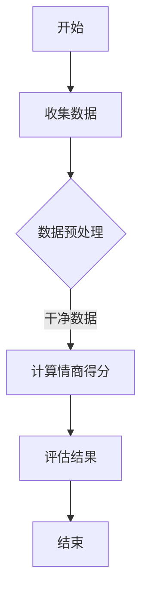
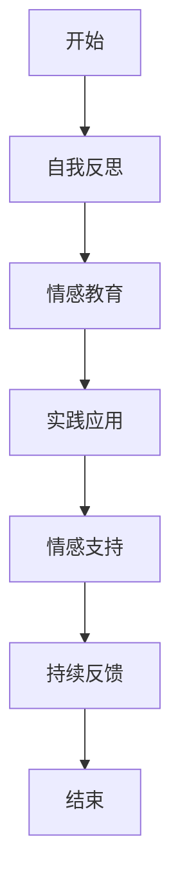
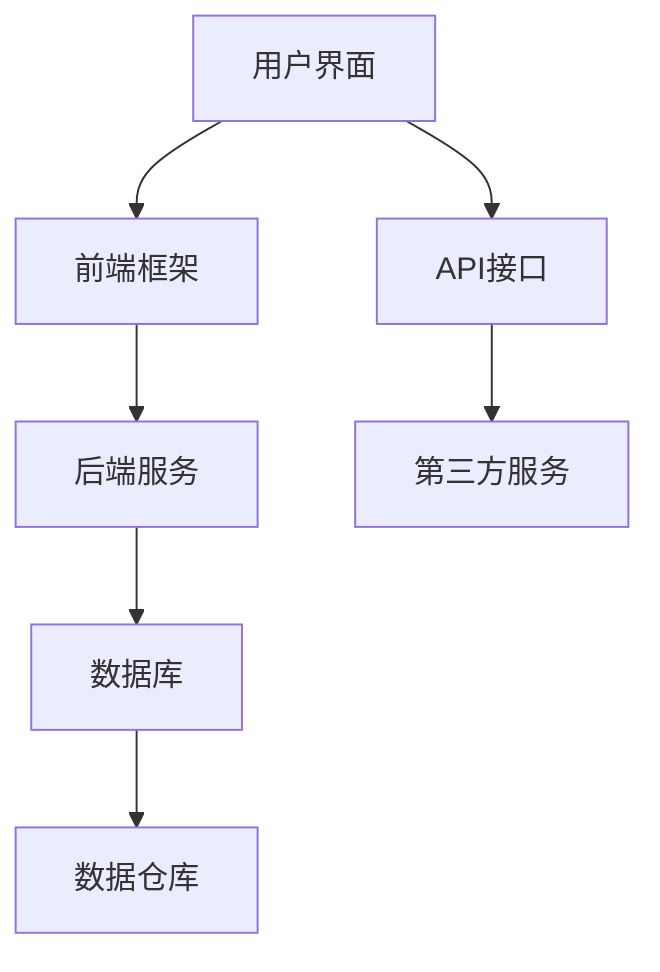
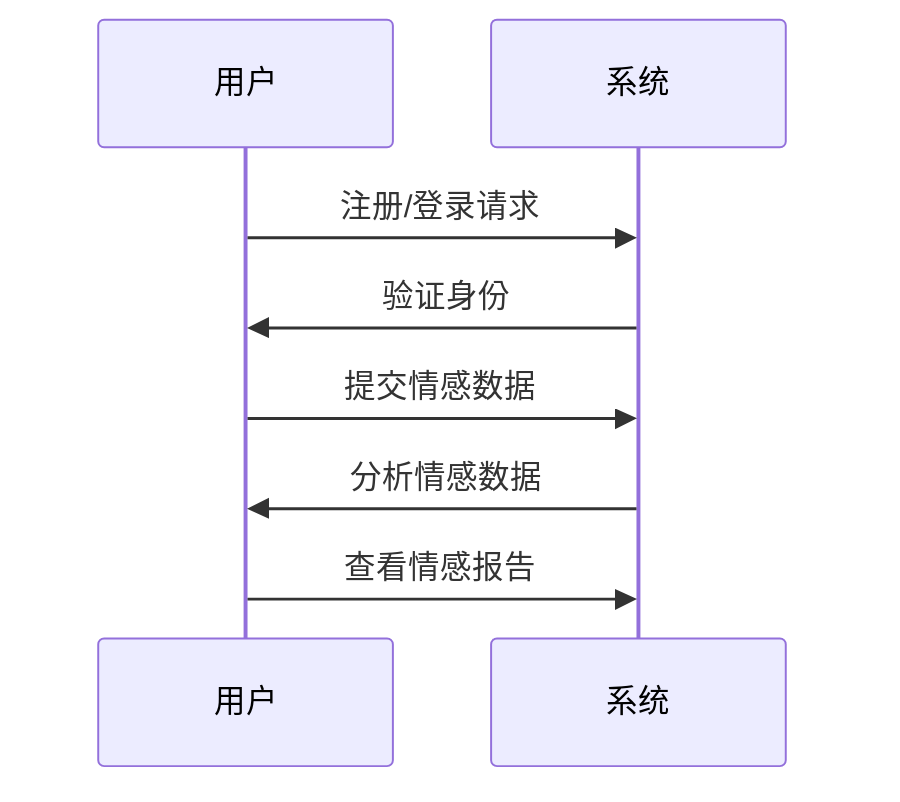

                 


# 情商领导力：在情感智能时代脱颖而出

> 关键词：情商、领导力、情感智能、组织管理、人工智能

> 摘要：在情感智能时代，情商领导力成为企业和个人成功的关键因素。本文通过详细分析和实例讲解，探讨了情商领导力的核心概念、提升方法及其在组织管理中的实际应用。

## 第1章：情感智能时代的来临

### 1.1 问题背景

在当今全球化、科技高速发展的时代，企业面临的市场竞争日益激烈。传统的领导力模式已经无法满足现代企业对创新、团队合作和员工满意度的需求。情感智能（Emotional Intelligence，EQ）作为一个新兴的概念，逐渐受到广泛关注。情商领导力（Emotional Intelligence Leadership）应运而生，成为企业管理者和员工必备的能力。

#### 1.2 核心概念

- **情商（Emotional Intelligence）**：情商是指个体识别、理解、管理自己和他人情感的能力。它通常被分为四大要素：自我意识、自我管理、社会意识和人际关系管理。

- **领导力（Leadership）**：领导力是指个体或团队在引导、激励和协调他人达成共同目标的过程中所展现出来的能力。

- **情感智能时代的特点**：随着人工智能和机器学习技术的发展，企业开始关注如何将情感智能融入到组织管理和领导力实践中。情感智能时代的特点包括：

  - **人机协作**：人工智能助手可以协助领导者和员工处理日常事务，从而释放出更多时间和精力去关注情感管理和人际关系。

  - **个性化和定制化**：企业更加注重员工个性化需求，通过情感智能分析来提供个性化的工作环境和职业发展路径。

  - **团队协作和共创**：情感智能促进团队成员之间的信任和合作，提高团队整体绩效。

### 1.3 问题解决

#### 1.4 边界与外延

- **情商领导力与情感劳动**：情感劳动是指员工在工作过程中表达、管理自身情感的行为。情商领导力强调领导者对情感劳动的认可和管理。

- **情商领导力与组织文化**：组织文化对于情商领导力的形成和应用具有重要影响。一个积极向上的组织文化能够促进情商领导力的发展。

#### 1.5 概念结构与核心要素

情商领导力的核心要素包括：

- **情感识别**：领导者能够准确识别和理解自己和他人的情感。

- **情感管理**：领导者能够有效地管理和调节自身和他人情感。

- **情感交流**：领导者能够建立有效的情感沟通渠道，促进团队内部的情感交流。

- **情感驱动**：领导者能够利用情感激励团队成员，实现组织目标。

## 第2章：情商领导力的核心概念与联系

### 2.1 情商的概念

情商（Emotional Intelligence，EQ）是一种理解、使用、和表达情感的能力。它不仅关注个体的情感体验，还包括对情感的理解和管理。情商通常被分为四个主要方面：

- **自我意识（Self-awareness）**：意识到自己的情绪状态，了解自己的情感反应，以及这些情感如何影响我们的思考和行为。

- **自我管理（Self-regulation）**：控制情绪反应，调整心态，保持冷静和专注。

- **社会意识（Social awareness）**：理解他人的情感和需求，感知他人情绪的细微变化，以及在人际关系中做出恰当的反应。

- **人际关系管理（Relationship management）**：与他人建立并维持积极的人际关系，有效沟通和解决冲突。

### 2.2 领导力的概念

领导力是一种影响和激励他人共同达成目标的能力。它不仅仅是指权威或权力，更是一种影响力，通过情感连接、价值观共识和共同目标来实现。

- **影响力（Influence）**：领导者通过个人魅力、专业知识和道德行为来影响他人。

- **价值观共识（Value alignment）**：领导者与团队成员在价值观上达成共识，共同追求目标。

- **共同目标（Common goals）**：领导者能够设定明确的目标，并激励团队成员为实现这些目标而努力。

### 2.3 情商领导力的联系

情商领导力的关键在于将情商和领导力相结合，从而在组织管理和个人发展上实现更大的效果。

- **情商与领导力的相互作用**：情商为领导者提供了更好的情感洞察力，帮助他们更好地理解员工需求，建立信任关系，提高团队协作效率。

- **情商领导力的特征**：具备情商领导力的领导者通常表现出以下特征：

  - **情感智慧**：领导者能够理解、使用和表达情感，并将情感智慧应用于领导实践中。

  - **适应性**：领导者能够灵活应对变化，适应不同的情境和挑战。

  - **同理心**：领导者能够设身处地为他人着想，理解员工的情感需求。

  - **影响力**：领导者能够通过情感连接和价值观共识，激励团队成员。

## 第3章：情商领导力提升的算法原理

### 3.1 情商评估算法

#### 3.1.1 情商评估工具与方法

情商评估通常使用一些标准化的工具和方法，如迈尔斯-布里格斯性格类型指标（MBTI）、戈特曼婚姻评估问卷等。这些工具和方法通过一系列问题来评估个体在情商各方面的能力。

#### 3.1.2 情商评估算法的mermaid流程图



#### 3.1.3 Python代码实现

```python
# 假设我们有一个情商评估问卷的得分数据
questionnaire_scores = {
    'self_awareness': 8,
    'self Regulation': 7,
    'social_awareness': 9,
    'relationship_management': 6
}

# 计算总情商得分
total_score = sum(questionnaire_scores.values())

# 计算平均情商得分
average_score = total_score / len(questionnaire_scores)

print("Total EQ Score:", total_score)
print("Average EQ Score:", average_score)
```

### 3.2 情商培养算法

#### 3.2.1 情商培养策略

情商培养需要长期的努力和持续的实践。以下是一些常用的情商培养策略：

- **自我反思**：定期进行自我反思，了解自己的情感反应和思考模式。
- **情感教育**：通过阅读书籍、参加课程、观看讲座等方式，学习情商相关的知识。
- **实践应用**：在工作和生活中主动应用情商技巧，如有效沟通、冲突解决等。
- **情感支持**：寻找情感支持网络，如心理咨询师、亲密朋友等。

#### 3.2.2 情商培养算法的mermaid流程图



#### 3.2.3 Python代码实现

```python
# 定义一个情商培养的步骤列表
emotional_intelligence_steps = [
    '自我反思',
    '情感教育',
    '实践应用',
    '情感支持',
    '持续反馈'
]

# 遍历情商培养步骤，执行相关任务
for step in emotional_intelligence_steps:
    print(f"执行步骤：{step}")
```

## 第4章：情商领导力系统的设计与实现

### 4.1 系统需求分析

#### 4.1.1 系统功能需求

- **情感识别**：系统能够收集和分析用户的情感数据。
- **情感管理**：系统能够提供情感管理工具，帮助用户控制情绪。
- **情感交流**：系统支持用户间的情感交流和互动。
- **情感驱动**：系统能够利用情感数据来激励用户。

#### 4.1.2 系统非功能需求

- **可扩展性**：系统设计应考虑未来的扩展需求。
- **用户体验**：系统界面应简洁直观，易于操作。
- **安全性**：系统应确保用户数据的隐私和安全。

### 4.2 系统架构设计

#### 4.2.1 系统架构mermaid架构图



#### 4.2.2 系统模块划分

- **用户模块**：处理用户注册、登录、个人信息管理等。
- **情感模块**：收集、分析和处理用户的情感数据。
- **交互模块**：实现用户间的情感交流和互动。
- **管理模块**：提供情感管理和激励功能。

### 4.3 系统接口设计

#### 4.3.1 接口设计与定义

- **用户接口**：提供用户注册、登录、个人信息管理等功能。
- **情感接口**：提供情感数据收集、分析和处理功能。
- **交互接口**：提供用户间情感交流和互动功能。

#### 4.3.2 接口实现细节

```python
# 用户接口示例
class UserInterface:
    def register(self, username, password):
        # 注册新用户
        pass

    def login(self, username, password):
        # 用户登录
        pass

    def update_profile(self, user_id, new_data):
        # 更新用户个人信息
        pass
```

### 4.4 系统交互设计

#### 4.4.1 系统交互mermaid序列图



## 第5章：情商领导力提升项目实战

### 5.1 环境安装

#### 5.1.1 系统环境搭建

- 安装Python环境
- 安装Django框架
- 安装MySQL数据库

#### 5.1.2 相关工具安装

- 安装Postman用于API接口测试
- 安装Jupyter Notebook进行数据分析和可视化

### 5.2 系统核心实现

#### 5.2.1 源代码解读

- **用户模块源代码**：实现用户注册、登录、个人信息管理功能。

  ```python
  # users/views.py
  from django.contrib.auth import authenticate, login
  from django.http import HttpResponse
  from .models import User
  
  def register(request):
      # 用户注册逻辑
      pass

  def login(request):
      # 用户登录逻辑
      pass
  ```

- **情感模块源代码**：实现情感数据收集、分析和处理功能。

  ```python
  # emotions/views.py
  from .models import EmotionData
  from .services import analyze_emotion
  
  def collect_emotion_data(request):
      # 收集情感数据
      pass

  def analyze_emotion_data(request):
      # 分析情感数据
      emotion_data = analyze_emotion(request.POST.get('data'))
      return HttpResponse(emotion_data)
  ```

#### 5.2.2 关键代码段分析

- **情感数据收集**：

  ```python
  def collect_emotion_data(request):
      if request.method == 'POST':
          emotion_data = request.POST.get('data')
          # 数据处理逻辑
          EmotionData.objects.create(data=emotion_data)
          return HttpResponse('Data collected successfully!')
      else:
          return HttpResponse('Invalid request method!')
  ```

- **情感数据分析**：

  ```python
  def analyze_emotion_data(request):
      if request.method == 'POST':
          emotion_data = request.POST.get('data')
          # 数据分析逻辑
          result = analyze_emotion(emotion_data)
          return HttpResponse(result)
      else:
          return HttpResponse('Invalid request method!')
  ```

### 5.3 实际案例

#### 5.3.1 案例分析

- **案例背景**：某公司为了提升员工的工作满意度和团队协作效率，决定引入情商领导力管理系统。

- **案例分析**：公司领导通过系统收集员工情感数据，分析员工情感状态，并制定相应的管理策略。例如，通过分析发现某部门员工工作压力大，领导决定组织团队建设活动，缓解员工压力。

#### 5.3.2 案例应用解读

- **情感数据收集**：通过系统的用户界面，员工可以方便地提交自己的情感数据。

- **情感数据分析**：系统后台处理情感数据，生成情感分析报告，帮助领导了解员工情感状态。

- **管理策略制定**：根据情感分析报告，领导可以制定针对性的管理策略，如调整工作分配、组织培训等。

## 第6章：最佳实践 tips、小结与拓展阅读

### 6.1 最佳实践 tips

- **自我反思**：定期进行自我反思，了解自己的情感反应和思考模式。
- **情感教育**：参加情商培训课程，学习情感管理技巧。
- **实践应用**：在工作中主动应用情商技巧，如有效沟通、冲突解决等。
- **情感支持**：寻找情感支持网络，如心理咨询师、亲密朋友等。

### 6.2 小结

本文介绍了情商领导力的核心概念、提升方法和在组织管理中的实际应用。情商领导力在情感智能时代具有重要意义，可以帮助企业和个人在激烈的竞争中脱颖而出。

### 6.3 注意事项

- **数据隐私**：在使用情商领导力系统时，应确保用户数据的安全和隐私。
- **持续学习**：情商领导力是一个持续的过程，需要不断学习和实践。

### 6.4 拓展阅读

- **参考文献**：
  - [Goleman, D. (1995). Emotional Intelligence. Bantam Books.]
  - [Boyatzis, R. E., & Jack, A. (2019). Transforming Leadership: Leveraging Your Emotional and Social Intelligence for Breakthrough Performance. Jossey-Bass.]
- **在线资源**：
  - [情商领导力培训课程](https://www EmotionalIntelligenceTraining.com/)
  - [情感智能相关研究论文](https://www.EmotionalIntelligenceResearch.org/)

## 作者信息

作者：AI天才研究院/AI Genius Institute & 禅与计算机程序设计艺术 /Zen And The Art of Computer Programming

### 结尾

本文旨在探讨情商领导力在情感智能时代的意义和应用。通过详细的分析和实践案例，我们希望读者能够理解情商领导力的重要性，并在实际工作中加以应用。情商领导力不仅对个人职业发展有益，更是企业在新时代竞争中取得优势的关键因素。

让我们在情感智能时代，共同追求更高的情商领导力，创造更加美好和成功的事业。

