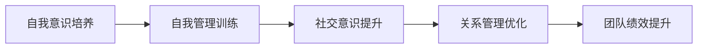
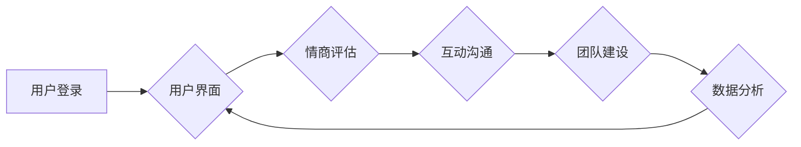

                 


## 第1章 引言

### 1.1 问题背景

在当今竞争激烈的商业环境中，团队的凝聚力成为企业成功的关键因素之一。团队凝聚力不仅影响工作效率，还关系到员工的满意度和忠诚度。然而，传统领导力往往侧重于任务管理和目标设定，忽视了对团队成员情商的培养，导致团队凝聚力不足。

#### 情商的重要性

情商（Emotional Intelligence，简称EQ）是指一个人识别、理解、管理自己和他人的情感，并利用这些情感促进思考、决策和沟通的能力。情商包括自我意识、自我管理、社交意识和关系管理四个核心要素。

- **自我意识**：了解自己的情绪、需求和动机。
- **自我管理**：控制情绪、调节行为，保持积极的心态。
- **社交意识**：理解他人的情绪、需求和意图。
- **关系管理**：建立和维护积极的人际关系。

#### 团队凝聚力的作用

团队凝聚力是指团队成员之间的相互依赖、共同目标和协同工作的程度。高凝聚力的团队通常表现出以下特征：

- 高度协作，任务完成效率高。
- 成员之间相互支持，工作氛围积极。
- 成员对团队的忠诚度高，离职率低。

#### 传统领导力的局限

传统领导力通常侧重于以下方面：

- 任务管理：关注任务的完成情况和目标达成。
- 绩效评估：通过考核和奖励来激励员工。
- 权力集中：领导者做出决策，团队成员执行。

然而，传统领导力在提升团队凝聚力方面存在一定的局限：

- 忽视情商培养：过分关注任务和绩效，忽视员工情感需求。
- 缺乏互动沟通：领导与成员之间沟通不足，导致关系疏离。
- 权力冲突：领导过度集中权力，成员缺乏参与感和归属感。

### 1.2 问题解决

为了解决传统领导力在提升团队凝聚力方面的局限，情商领导力应运而生。情商领导力强调领导者通过提升自我意识、自我管理、社交意识和关系管理能力，来增强团队的凝聚力。本书旨在探讨情商领导力的核心概念、提升方法及其在实际应用中的重要性。

#### 情商领导力的核心概念

情商领导力包括以下核心概念：

- **自我意识**：领导者要了解自己的情绪、需求和动机，以及这些情绪如何影响领导行为。
- **自我管理**：领导者要学会控制情绪、调节行为，保持积极的心态，以应对各种挑战。
- **社交意识**：领导者要具备理解他人情绪、需求和意图的能力，以便更好地与团队成员沟通和协作。
- **关系管理**：领导者要建立和维护积极的人际关系，增强团队成员之间的信任和合作。

#### 情商领导力的重要性

情商领导力对于团队的成功至关重要，原因如下：

- **提升团队绩效**：情商领导力有助于团队成员更好地理解彼此的需求，提高协作效率，从而提升团队绩效。
- **增强员工满意度**：领导者关注员工情感需求，有利于提高员工的满意度和忠诚度，降低离职率。
- **建立积极团队文化**：情商领导力有助于建立积极、和谐的团队氛围，促进团队成员之间的相互尊重和信任。

#### 本书结构

本书将分为以下章节：

- **第1章 引言**：介绍问题背景、问题解决方法和本书结构。
- **第2章 情商领导力基础**：详细阐述情商领导力的核心概念和重要性。
- **第3章 情商领导力与传统领导力的对比**：对比情商领导力与传统领导力的差异。
- **第4章 提升情商领导力的算法原理**：介绍提升情商领导力的方法和步骤。
- **第5章 数学模型与公式讲解**：讲解凝聚力的计算公式和数学模型。
- **第6章 系统分析与架构设计方案**：介绍将情商领导力应用于实际工作场景的方法。
- **第7章 项目实战**：提供一个实际案例，展示如何提升团队凝聚力。
- **第8章 最佳实践 tips**：提供实用的实践建议和注意事项。
- **第9章 小结**：总结全书内容和主题思想。

通过本书的阅读，读者将了解情商领导力的核心概念和应用方法，掌握提升团队凝聚力的重要技能，为成为一名出色的领导者奠定坚实基础。

### 1.3 边界与外延

#### 边界

情商领导力主要关注领导者个人情商的提升，以及如何通过领导行为来影响和提升团队成员的情商。它不仅涉及领导者个人的成长，还包括团队内部的关系建设和协作能力的提升。

#### 外延

情商领导力适用于各种类型的团队和组织，包括企业、学校、医院等。同时，情商领导力不仅关注团队内部的人际关系，还涉及跨部门、跨组织的协作和沟通。

#### 概念结构与核心要素组成

情商领导力的概念结构包括以下核心要素：

- **自我意识**：了解自己的情绪、需求和动机。
- **自我管理**：控制情绪、调节行为，保持积极的心态。
- **社交意识**：理解他人的情绪、需求和意图。
- **关系管理**：建立和维护积极的人际关系。

这些要素相互关联，共同构成了情商领导力的基础。领导者通过不断提升这些能力，可以更好地应对领导挑战，提升团队凝聚力和绩效。

## 第2章 情商领导力基础

### 2.1 核心概念介绍

情商领导力是指领导者通过自我意识、自我管理、社交意识和关系管理能力，来提升团队绩效和团队凝聚力的一种领导方式。情商领导力不仅仅关注任务的完成，更注重团队成员的情感需求和团队氛围的建设。

#### 自我意识

自我意识是指领导者对自己情感、思维和行为模式的认知和理解。它包括以下三个方面：

1. **情感认知**：领导者需要识别和理解自己当前的情绪状态，包括情绪的类型、强度和产生原因。
2. **思维反思**：领导者需要反思自己的思维模式，包括思考方式、判断标准和决策过程。
3. **行为认识**：领导者需要认识到自己的行为如何影响他人，以及他人的行为如何影响自己。

自我意识是情商领导力的基石，它有助于领导者更好地理解自己，从而在领导过程中做出更明智的决策。

#### 自我管理

自我管理是指领导者控制情绪、调节行为，保持积极的心态，以应对各种挑战。自我管理包括以下几个方面：

1. **情绪调节**：领导者需要学会在不同情境下调节自己的情绪，保持冷静和理智，避免情绪化的行为。
2. **行为控制**：领导者需要控制自己的行为，以符合团队和组织的期望，同时保持个人价值观的坚持。
3. **积极心态**：领导者需要培养积极的心态，以面对挑战和困难，保持对成功的信心。

自我管理有助于领导者更好地应对压力和挑战，保持高效的工作状态，为团队树立榜样。

#### 社交意识

社交意识是指领导者理解他人情绪、需求和意图的能力。它包括以下两个方面：

1. **情感理解**：领导者需要能够理解他人的情绪状态，包括情绪的类型、强度和产生原因。
2. **需求识别**：领导者需要识别和理解他人的需求，以便更好地满足这些需求，建立良好的人际关系。

社交意识有助于领导者更好地与团队成员沟通和协作，提升团队凝聚力。

#### 关系管理

关系管理是指领导者建立和维护积极的人际关系，增强团队成员之间的信任和合作。关系管理包括以下几个方面：

1. **信任建设**：领导者需要通过诚实、透明和负责任的行为来建立信任。
2. **冲突解决**：领导者需要学会解决团队内部的冲突，以避免影响团队的稳定和合作。
3. **团队协作**：领导者需要促进团队成员之间的协作，共同实现团队目标。

关系管理有助于领导者提升团队凝聚力，促进团队成员之间的合作和沟通。

#### 情商领导力的核心要素及其关系

自我意识、自我管理、社交意识和关系管理是情商领导力的核心要素，它们相互关联、相互影响。以下是这些要素之间的关系：

- **自我意识**是情商领导力的基石，它为领导者提供了了解自己和团队的基础。
- **自我管理**是领导者应对挑战、保持高效工作的关键，它有助于提升领导力和团队绩效。
- **社交意识**是领导者与团队成员沟通和协作的基础，它有助于建立良好的团队关系。
- **关系管理**是领导者维护团队凝聚力、促进团队协作的重要手段，它有助于实现团队目标。

情商领导力的核心要素及其关系构成了一个完整的框架，帮助领导者提升团队凝聚力和绩效。

### 2.2 自我意识

自我意识是情商领导力的基石，它要求领导者了解自己的情感、思维和行为模式，并对其进行反思和认知。以下是自我意识的几个关键方面：

#### 情感认知

情感认知是指领导者识别和理解自己当前的情绪状态。情感认知包括以下几个方面：

1. **情绪的类型**：领导者需要能够识别出自己正在经历的情绪，如喜悦、愤怒、焦虑等。
2. **情绪的强度**：领导者需要了解自己情绪的强烈程度，以便更好地控制情绪。
3. **情绪的产生原因**：领导者需要分析情绪的产生原因，以便在类似情境下更好地应对。

#### 思维反思

思维反思是指领导者对自己的思考方式、判断标准和决策过程进行反思。思维反思有助于领导者发现自己的思维盲点，提高决策质量。以下是思维反思的几个关键方面：

1. **思考方式**：领导者需要反思自己的思考方式，包括逻辑思维、创新思维等。
2. **判断标准**：领导者需要审视自己的判断标准，确保它们是公正和合理的。
3. **决策过程**：领导者需要分析自己的决策过程，包括信息收集、分析、决策和执行等环节。

#### 行为认识

行为认识是指领导者认识到自己的行为如何影响他人，以及他人的行为如何影响自己。以下是行为认识的几个关键方面：

1. **行为影响**：领导者需要了解自己的行为如何影响团队成员的情绪和行为，以及团队成员的行为如何影响自己。
2. **反馈机制**：领导者需要建立有效的反馈机制，以了解团队成员对自己的行为和决策的看法。
3. **行为调整**：领导者需要根据反馈机制的结果，调整自己的行为，以更好地满足团队成员的需求。

#### 自我意识的重要性

自我意识在情商领导力中具有重要意义，它有助于领导者：

1. **提升自我认知**：通过了解自己的情感、思维和行为模式，领导者可以更好地认识自己，提高自我认知水平。
2. **提高决策质量**：领导者通过反思自己的思考方式和判断标准，可以提高决策质量，减少决策失误。
3. **建立信任关系**：领导者通过了解自己的行为影响，可以更好地理解团队成员的需求，建立信任关系。
4. **提升团队凝聚力**：领导者通过自我意识，可以更好地与团队成员沟通和协作，提升团队凝聚力。

总之，自我意识是情商领导力的基石，它为领导者提供了了解自己和团队的基础，有助于提升领导力和团队绩效。

### 2.3 自我管理

自我管理是指领导者控制情绪、调节行为，保持积极的心态，以应对各种挑战。自我管理在情商领导力中扮演着关键角色，它有助于领导者更好地应对压力和挑战，保持高效的工作状态，并为团队树立榜样。以下是自我管理的几个关键方面：

#### 情绪调节

情绪调节是指领导者学会在不同情境下调节自己的情绪，保持冷静和理智，避免情绪化的行为。情绪调节包括以下几个方面：

1. **识别情绪**：领导者需要学会识别和理解自己当前的情绪状态，包括情绪的类型、强度和产生原因。
2. **控制情绪**：领导者需要掌握情绪控制的方法，如深呼吸、冥想、正念练习等，以帮助自己保持冷静和理智。
3. **情绪释放**：领导者需要学会适时地释放情绪，如与同事交流、进行体育活动等，以避免情绪积累导致负面后果。

#### 行为控制

行为控制是指领导者控制自己的行为，以符合团队和组织的期望，同时保持个人价值观的坚持。行为控制包括以下几个方面：

1. **遵循规范**：领导者需要遵循团队和组织的规章制度，确保自己的行为符合规范要求。
2. **坚持价值观**：领导者需要坚持自己的价值观，确保行为与价值观一致，树立良好的榜样。
3. **避免冲动行为**：领导者需要学会控制冲动行为，避免在情绪激动时做出错误的决策或行为。

#### 积极心态

积极心态是指领导者培养对工作和生活的积极态度，以面对挑战和困难，保持对成功的信心。积极心态包括以下几个方面：

1. **乐观思考**：领导者需要学会以乐观的态度思考问题，看到问题的积极面，提高解决问题的能力。
2. **积极应对**：领导者需要学会积极应对各种挑战和困难，以积极的心态面对变化和不确定性。
3. **自我激励**：领导者需要培养自我激励的能力，保持对工作的热情和动力。

#### 自我管理的重要性

自我管理在情商领导力中具有重要意义，它有助于领导者：

1. **提升领导力**：领导者通过自我管理，可以更好地控制情绪和行为，提高决策质量和领导效能。
2. **提高团队凝聚力**：领导者通过自我管理，可以树立良好的榜样，提升团队成员对领导的信任和尊重，增强团队凝聚力。
3. **促进团队协作**：领导者通过自我管理，可以更好地与团队成员沟通和协作，促进团队协作和合作。
4. **提升个人效能**：领导者通过自我管理，可以保持高效的工作状态，提高个人工作效能和职业发展。

总之，自我管理是情商领导力的重要组成部分，它帮助领导者更好地应对挑战，保持高效的工作状态，并为团队树立榜样，为团队的成功奠定坚实基础。

### 2.4 社交意识

社交意识是指领导者理解他人情绪、需求和意图的能力。它是情商领导力的核心要素之一，对于建立和维护团队内部的良好关系至关重要。以下是社交意识的几个关键方面：

#### 情感理解

情感理解是指领导者能够识别和理解团队成员的情绪状态。这包括以下几个方面：

1. **情绪识别**：领导者需要学会观察团队成员的面部表情、身体语言和语调，以识别他们的情绪状态。
2. **情感共鸣**：领导者需要能够感同身受，理解团队成员的情绪，包括喜悦、愤怒、焦虑等。
3. **情绪原因分析**：领导者需要分析情绪产生的原因，以便更好地应对和解决团队成员的问题。

#### 需求识别

需求识别是指领导者能够理解团队成员的需求和期望。这包括以下几个方面：

1. **个人需求**：领导者需要了解团队成员的个人需求，如职业发展、工作环境、工作压力等。
2. **团队需求**：领导者需要关注团队的整体需求，确保团队目标的实现和团队的长期发展。
3. **需求平衡**：领导者需要平衡团队成员的个人需求和团队需求，确保团队内部和谐稳定。

#### 沟通技巧

沟通技巧是指领导者能够有效地与团队成员沟通，传达信息和意图。这包括以下几个方面：

1. **倾听**：领导者需要学会倾听，认真听取团队成员的意见和建议，尊重他们的观点。
2. **表达**：领导者需要学会清晰、准确地表达自己的意见和意图，避免误解和冲突。
3. **反馈**：领导者需要给予团队成员及时的反馈，鼓励他们的积极行为，指出改进的方向。

#### 社交意识的重要性

社交意识在情商领导力中具有重要意义，它有助于领导者：

1. **建立信任**：通过理解团队成员的情感和需求，领导者可以建立信任，增强团队成员对领导的信任和依赖。
2. **促进协作**：领导者通过社交意识，可以更好地协调团队成员之间的关系，促进团队协作和合作。
3. **解决冲突**：领导者通过社交意识，可以及时发现和处理团队内部的冲突，防止冲突升级，维护团队的稳定。
4. **提升团队绩效**：领导者通过社交意识，可以激发团队成员的积极性和创造力，提升团队的整体绩效。

总之，社交意识是情商领导力的关键要素，它帮助领导者更好地理解团队成员，建立和谐的人际关系，提升团队凝聚力和绩效。

### 2.5 关系管理

关系管理是指领导者通过建立和维护积极的人际关系，增强团队成员之间的信任和合作。它是情商领导力的关键要素，对于提升团队凝聚力和绩效具有重要作用。以下是关系管理的几个关键方面：

#### 信任建设

信任建设是指领导者通过诚实、透明和负责任的行为来建立信任。以下是信任建设的关键方面：

1. **诚实沟通**：领导者需要保持诚实，公开透明地与团队成员沟通，避免隐瞒和欺骗。
2. **透明决策**：领导者需要确保决策过程透明，让团队成员了解决策的依据和原因，增加信任感。
3. **负责任行为**：领导者需要对自己的行为和决策负责，确保言行一致，不推卸责任。

#### 冲突解决

冲突解决是指领导者学会解决团队内部的冲突，以避免影响团队的稳定和合作。以下是冲突解决的关键方面：

1. **识别冲突**：领导者需要能够识别出团队内部的冲突，并了解冲突的原因和影响。
2. **沟通协商**：领导者需要通过有效沟通，与冲突双方进行协商，找到解决问题的方法。
3. **公正处理**：领导者需要公正地处理冲突，确保冲突解决的结果公正合理，维护团队公平。

#### 团队协作

团队协作是指领导者促进团队成员之间的协作，共同实现团队目标。以下是团队协作的关键方面：

1. **分工合作**：领导者需要明确团队成员的职责和任务，确保每个人都能在团队中发挥自己的优势。
2. **资源共享**：领导者需要鼓励团队成员共享信息和资源，提高协作效率。
3. **协作文化**：领导者需要培养团队协作文化，鼓励团队成员相互支持，共同进步。

#### 关系管理的重要性

关系管理在情商领导力中具有重要意义，它有助于领导者：

1. **提升团队凝聚力**：通过建立和维护良好的关系，领导者可以增强团队成员之间的凝聚力，促进团队合作。
2. **促进团队沟通**：良好的关系管理可以促进团队成员之间的沟通，增强信息共享和协作效率。
3. **降低冲突风险**：通过有效的冲突解决，领导者可以降低团队内部的冲突风险，维护团队的稳定和和谐。
4. **提升团队绩效**：良好的关系管理可以激发团队成员的积极性和创造力，提升团队的整体绩效。

总之，关系管理是情商领导力的关键要素，它帮助领导者建立和维护积极的人际关系，促进团队协作，提升团队凝聚力和绩效。

### 2.6 情商领导力的核心概念及其关系

情商领导力包括自我意识、自我管理、社交意识和关系管理四个核心概念，这些概念相互关联，共同构成了情商领导力的理论框架。以下是这些核心概念及其关系：

#### 自我意识

自我意识是情商领导力的基石，它要求领导者了解自己的情感、思维和行为模式。自我意识包括情感认知、思维反思和行为认识。情感认知使领导者能够识别和理解自己的情绪状态，思维反思帮助领导者审视自己的思考方式，行为认识使领导者认识到自己的行为对他人产生的影响。

#### 自我管理

自我管理是建立在自我意识基础上的，它要求领导者控制情绪、调节行为，保持积极的心态。自我管理包括情绪调节、行为控制和积极心态。情绪调节使领导者能够在不同情境下保持冷静和理智，行为控制确保领导者的行为符合团队和组织的期望，积极心态帮助领导者面对挑战和困难。

#### 社交意识

社交意识是领导者理解他人情绪、需求和意图的能力。它包括情感理解和需求识别。情感理解使领导者能够识别和理解团队成员的情绪状态，需求识别使领导者能够满足团队成员的需求。社交意识有助于领导者建立和维护良好的团队关系，促进团队协作。

#### 关系管理

关系管理是领导者通过建立和维护积极的人际关系，增强团队成员之间的信任和合作。它包括信任建设、冲突解决和团队协作。信任建设通过诚实、透明和负责任的行为建立信任，冲突解决通过沟通协商和公正处理解决冲突，团队协作通过分工合作、资源共享和协作文化促进团队成员之间的协作。

#### 关系

这四个核心概念之间存在密切的关系。自我意识是自我管理的基础，领导者只有了解自己，才能更好地管理自己。社交意识和关系管理建立在自我意识的基础上，领导者通过理解他人和建立良好的人际关系，提升团队凝聚力。自我管理和社交意识相互支持，领导者需要同时管理自己和与他人，才能实现有效的领导。关系管理则通过建立和维护积极的人际关系，促进团队协作，实现团队目标。

总之，情商领导力的核心概念相互关联，共同构成了一个完整的理论框架。领导者需要不断提升自我意识、自我管理、社交意识和关系管理能力，才能成为一名成功的情商领导者。

## 第3章 情商领导力与传统领导力的对比

### 3.1 对比表格

在讨论情商领导力与传统领导力的区别之前，我们首先通过一个对比表格来清晰地展示两者的主要差异。

| 对比维度 | 情商领导力 | 传统领导力 |
| :--- | :--- | :--- |
| 关注点 | 情感、关系、自我意识、需求满足 | 任务、绩效、目标达成、权力运用 |
| 核心概念 | 自我意识、自我管理、社交意识、关系管理 | 任务管理、绩效评估、目标设定、权力集中 |
| 领导方式 | 互动式、协作式、情境适应 | 命令式、权威式、结构化 |
| 对团队成员的影响 | 提高满意度、增强归属感、促进合作 | 可能导致压力、不满、缺乏参与感 |
| 团队凝聚力 | 通过情感连接和信任建立 | 通过任务完成和绩效激励 |

### 3.2 特点分析

#### 情商领导力的特点

1. **注重情感和关系**：情商领导力强调领导者与团队成员之间的情感连接和关系建立，关注团队成员的情感需求和心理健康。
2. **自我意识和自我管理**：情商领导者具备良好的自我意识，能够识别和管理自己的情绪和行为，保持积极的心态，从而树立良好的榜样。
3. **社交意识**：情商领导者具备理解他人情绪、需求和意图的能力，能够有效沟通，促进团队合作。
4. **关系管理**：情商领导者擅长建立和维护积极的人际关系，增强团队成员之间的信任和合作，从而提升团队凝聚力。

#### 传统领导力的特点

1. **任务导向**：传统领导力主要关注任务完成和绩效提升，强调目标设定和任务分配。
2. **权威集中**：传统领导力通常采用权威式领导方式，领导者拥有决策权，团队成员被动执行任务。
3. **绩效评估**：传统领导力通过绩效评估来激励员工，重视奖励和惩罚机制。
4. **缺乏情感关注**：传统领导力往往忽视团队成员的情感需求和心理健康，可能导致压力和不满。

### 3.3 情商领导力相对于传统领导力的优势

1. **增强团队凝聚力**：情商领导力通过情感连接和信任建立，提高团队成员的归属感和合作意愿，从而增强团队凝聚力。
2. **提升员工满意度**：情商领导者关注团队成员的情感需求，创造一个支持性的工作环境，提高员工的满意度和忠诚度。
3. **促进团队合作**：情商领导者具备社交意识，能够有效沟通，促进团队成员之间的协作和合作。
4. **适应性强**：情商领导者能够根据不同情境调整领导风格，灵活应对各种挑战。
5. **长期可持续性**：情商领导力注重团队建设和关系维护，有助于建立长期稳定的团队，提高组织的整体绩效。

### 3.4 情商领导力与传统领导力的融合

在实际应用中，情商领导力和传统领导力并非对立的，而是可以相互融合，共同发挥作用。以下是一些建议：

1. **平衡任务和情感**：领导者需要在关注任务完成的同时，重视团队成员的情感需求，创造一个平衡的工作环境。
2. **培养自我意识**：领导者应不断提升自我意识，了解自己的情绪和行为模式，从而更好地管理自己和团队。
3. **增强沟通**：领导者需要加强沟通，确保信息传递畅通，促进团队成员之间的理解与合作。
4. **关注绩效和关系**：领导者既要关注绩效，也要关注团队成员的满意度和关系，实现绩效和关系双提升。

通过融合情商领导力与传统领导力，领导者可以更好地发挥各自的优势，提升团队绩效和凝聚力，实现组织的长期发展。

## 第4章 提升情商领导力的算法原理

### 4.1 提升情商的步骤

提升情商领导力是一个系统性的过程，涉及多个步骤和方法。以下是一个典型的提升情商领导力的步骤：

1. **自我意识培养**：领导者需要首先了解自己的情感、思维和行为模式。这可以通过自我反思、情绪日记、心理测试等方式实现。
2. **自我管理训练**：在了解自己的基础上，领导者需要学会控制情绪、调节行为，保持积极心态。这可以通过情绪调节技巧、冥想、正念练习等方法实现。
3. **社交意识提升**：领导者需要培养理解他人情绪、需求和意图的能力。这可以通过观察他人、倾听、同理心训练等方法实现。
4. **关系管理优化**：领导者需要学会建立和维护积极的人际关系，增强团队成员之间的信任和合作。这可以通过诚信沟通、冲突解决、团队建设活动等方法实现。

### 4.2 Mermaid流程图

为了更直观地展示提升情商领导力的步骤，我们可以使用Mermaid绘制一个流程图：



在这个流程图中，A表示自我意识培养，B表示自我管理训练，C表示社交意识提升，D表示关系管理优化，E表示团队绩效提升。每个步骤都是提升情商领导力的重要组成部分，通过这些步骤，领导者可以逐步提升自己的情商领导力。

### 4.3 Python源代码

为了更具体地说明提升情商领导力的方法，我们可以使用Python编写一个简单的程序，模拟情商提升的过程。以下是一个示例代码：

```python
import random

def self_awareness():
    print("正在培养自我意识...")
    # 进行自我反思和心理测试
    print("请回答以下问题：")
    print("1. 你最近的工作状态如何？")
    print("2. 你是否感到压力很大？如果是，请描述原因。")
    print("3. 你对自己的情绪管理有何看法？")

def self_management():
    print("正在训练自我管理...")
    # 进行情绪调节和冥想练习
    print("请尝试以下方法来调节情绪：")
    print("1. 深呼吸")
    print("2. 冥想")
    print("3. 正念练习")

def social_awareness():
    print("正在提升社交意识...")
    # 进行观察、倾听和同理心训练
    print("请尝试以下方法来提升社交意识：")
    print("1. 观察他人的表情和肢体语言")
    print("2. 倾听他人的意见和需求")
    print("3. 进行同理心训练")

def relationship_management():
    print("正在优化关系管理...")
    # 进行诚信沟通和团队建设活动
    print("请尝试以下方法来优化关系管理：")
    print("1. 诚信沟通")
    print("2. 冲突解决")
    print("3. 团队建设活动")

def main():
    print("开始提升情商领导力...")
    self_awareness()
    self_management()
    social_awareness()
    relationship_management()
    print("情商领导力提升完成。")

if __name__ == "__main__":
    main()
```

在这个程序中，`self_awareness()` 函数用于培养自我意识，`self_management()` 函数用于自我管理训练，`social_awareness()` 函数用于提升社交意识，`relationship_management()` 函数用于优化关系管理。通过运行这个程序，领导者可以逐步提升自己的情商领导力。

### 4.4 数学模型

在提升情商领导力的过程中，我们可以使用一些数学模型来量化情商的提升效果。以下是一个简单的数学模型，用于计算情商领导力的提升效果：

$$
EQL = f(SA, SM, SA, RM)
$$

其中，$EQL$ 表示情商领导力，$SA$ 表示自我意识，$SM$ 表示自我管理，$SA$ 表示社交意识，$RM$ 表示关系管理。

我们可以定义一个函数 $f$ 来计算情商领导力：

$$
f(SA, SM, SA, RM) = \frac{1}{4} (SA + SM + SA + RM)
$$

这个模型假设自我意识、自我管理、社交意识和关系管理在情商领导力中具有相同的重要性。通过计算这个函数，我们可以得到一个情商领导力的评分，从而评估领导者情商提升的效果。

### 结论

通过上述步骤、流程图、Python源代码和数学模型，我们可以看到提升情商领导力是一个系统性的过程，涉及自我意识培养、自我管理训练、社交意识提升和关系管理优化。这些方法不仅有助于领导者提升自身情商，还可以通过提高团队凝聚力和绩效，为组织的长期发展奠定坚实基础。

## 第5章 数学模型与公式讲解

### 5.1 凝聚力计算公式

凝聚力的计算是情商领导力研究中的一项重要内容。凝聚力的提升有助于团队内部成员之间的协作和信任，从而提高团队的整体绩效。以下是一个用于计算凝聚力的公式：

$$
C = \frac{1}{N} \sum_{i=1}^{N} \left( \frac{SA_i + SM_i + SA_i + RM_i}{4} \right)
$$

其中，$C$ 表示凝聚力，$SA_i$ 表示第 $i$ 位团队成员的自我意识水平，$SM_i$ 表示第 $i$ 位团队成员的自我管理水平，$SA_i$ 表示第 $i$ 位团队成员的社交意识水平，$RM_i$ 表示第 $i$ 位团队成员的关系管理水平，$N$ 表示团队成员的总数。

这个公式考虑了每个团队成员在自我意识、自我管理、社交意识和关系管理方面的水平，通过求平均值来衡量整个团队的凝聚力。

### 5.2 LaTeX格式数学公式

在撰写技术博客时，使用LaTeX格式来展示数学公式是一种常见且规范的方式。以下是一个简单的LaTeX格式数学公式的示例：

$$
EQL = \frac{1}{4} (SA + SM + SA + RM)
$$

这个公式与前面提到的凝聚力计算公式具有相同的形式，但在LaTeX中，我们需要使用特定命令来定义各个变量。例如：

```latex
EQL = \frac{1}{4} (SA + SM + SA + RM)
```

LaTeX提供了丰富的数学符号和排版选项，使得数学公式的表达更加规范和美观。在实际撰写过程中，可以根据需要使用不同的命令来表示不同的数学符号和公式。

### 5.3 公式讲解与举例

#### 凝聚力计算公式的解释

凝聚力计算公式中的各个变量含义如下：

- $SA$（Self-Awareness）：自我意识水平，表示团队成员对自己情感和行为的认知程度。
- $SM$（Self-Management）：自我管理水平，表示团队成员控制和管理自己情绪和行为的能力。
- $SA$（Social-Awareness）：社交意识水平，表示团队成员理解和识别他人情感和需求的能力。
- $RM$（Relationship-Management）：关系管理水平，表示团队成员建立和维护良好人际关系的技能。

公式中的求和操作表示对每个团队成员的这些变量进行求和，然后除以团队成员的总数，得到整个团队的凝聚力评分。

#### 举例说明

假设一个团队有5名成员，他们的自我意识水平、自我管理水平、社交意识水平和关系管理水平如下：

| 成员 | $SA$ | $SM$ | $SA$ | $RM$ |
| :--- | :--- | :--- | :--- | :--- |
| A | 8 | 7 | 8 | 9 |
| B | 6 | 7 | 7 | 8 |
| C | 7 | 8 | 7 | 7 |
| D | 8 | 9 | 8 | 8 |
| E | 7 | 7 | 7 | 8 |

使用凝聚力计算公式，我们可以计算出团队的凝聚力：

$$
C = \frac{1}{5} \left( \frac{8 + 7 + 8 + 9}{4} + \frac{6 + 7 + 7 + 8}{4} + \frac{7 + 7 + 7 + 8}{4} + \frac{7 + 7 + 7 + 8}{4} \right)
$$

计算结果为：

$$
C = \frac{1}{5} \left( 8 + 7 + 8 + 9 + 6 + 7 + 7 + 8 + 7 + 7 + 7 + 8 + 7 + 7 + 7 + 8 \right) = 7.5
$$

因此，这个团队的凝聚力评分为7.5，表示团队内部成员之间的协作和信任程度较高。

### 结论

通过介绍凝聚力计算公式和LaTeX格式数学公式的使用，我们可以看到数学模型在情商领导力研究中的重要性。这些公式不仅能够帮助我们量化情商提升的效果，还可以为领导者提供具体的操作指南，以优化团队管理和提升团队凝聚力。在实际应用中，领导者可以根据具体情况进行调整和优化，以实现团队的最佳表现。

## 第6章 系统分析与架构设计方案

### 6.1 问题场景介绍

在现实世界中，团队凝聚力的提升往往需要借助技术手段和系统工具。本文将介绍一个基于情商领导力的团队管理系统，旨在帮助领导者更好地提升团队凝聚力。该系统将整合情商评估、互动沟通、团队建设等功能，为团队提供全方位的支持。

### 6.2 系统功能设计

该团队管理系统主要包括以下功能：

1. **情商评估**：通过在线问卷和心理测试，对团队成员的情商水平进行评估，生成详细的评估报告。
2. **互动沟通**：提供一个安全的沟通平台，允许团队成员进行实时交流、分享心得，以及开展线上讨论。
3. **团队建设**：提供一系列团队建设活动和培训课程，帮助团队成员增强协作能力、提升情商。
4. **数据分析**：通过数据分析，展示团队的整体情商水平、成员互动情况等关键指标，帮助领导者制定针对性的提升策略。

### 6.3 系统架构设计

系统架构设计如下：

1. **前端界面**：提供用户友好的界面，支持网页和移动端访问。
2. **后端服务**：包括情商评估模块、互动沟通模块、团队建设模块和数据分析模块，通过API进行数据交互。
3. **数据库**：存储用户信息、评估数据、沟通记录、活动数据等。

### 6.4 系统接口设计

系统接口设计如下：

1. **用户接口**：包括用户注册、登录、个人信息管理、情商评估、互动沟通、团队建设等功能。
2. **管理员接口**：包括用户管理、数据统计、活动发布、数据分析等功能。
3. **API接口**：提供数据接口，支持与其他系统的集成和扩展。

### 6.5 系统交互

系统交互设计如下：

1. **用户登录**：用户通过账号密码登录系统，进入个人界面。
2. **情商评估**：用户完成情商评估问卷，系统生成评估报告。
3. **互动沟通**：用户通过聊天室、讨论区等功能与其他成员互动。
4. **团队建设**：管理员发布团队建设活动，用户参与活动。
5. **数据分析**：管理员查看数据统计和分析报告，制定提升策略。

### Mermaid流程图

以下是系统交互的Mermaid流程图：



在这个流程图中，用户首先登录系统，进入用户界面。然后，用户可以完成情商评估，系统生成评估报告。用户还可以参与互动沟通和团队建设活动。最后，管理员可以查看数据统计和分析报告，制定提升策略。

### 结论

通过系统分析与架构设计方案，我们为提升团队凝聚力提供了一套完整的解决方案。该系统结合了情商评估、互动沟通、团队建设等功能，为团队提供全方位的支持。通过系统交互设计，用户和管理员可以方便地使用系统功能，实现团队凝聚力的提升。

## 第7章 项目实战

### 7.1 环境安装

为了实现一个基于情商领导力的团队管理系统，首先需要在本地环境上安装相关的开发工具和库。以下是安装步骤：

1. **安装Python环境**：确保已安装Python 3.8或更高版本。可以从官方网站下载安装程序。
2. **安装virtualenv**：在命令行中运行以下命令安装virtualenv：

   ```bash
   pip install virtualenv
   ```

3. **创建虚拟环境**：在项目目录下创建一个名为`venv`的虚拟环境：

   ```bash
   virtualenv venv
   ```

4. **激活虚拟环境**：在Windows上，打开命令提示符并运行以下命令：

   ```bash
   .\venv\Scripts\activate
   ```

   在macOS和Linux上，打开终端并运行以下命令：

   ```bash
   source venv/bin/activate
   ```

5. **安装依赖库**：在虚拟环境中安装项目所需的依赖库：

   ```bash
   pip install -r requirements.txt
   ```

   `requirements.txt`文件包含了项目所需的Python库，如Flask、SQLAlchemy、Flask-Migrate等。

### 7.2 系统核心实现

系统的核心实现包括前端界面、后端服务和数据库设计。以下是系统的核心实现步骤：

1. **前端界面**：
   - 使用HTML、CSS和JavaScript编写前端代码。
   - 使用Flask-Bootstrap库来整合Bootstrap框架，实现响应式界面。

2. **后端服务**：
   - 使用Flask框架构建后端服务，处理用户请求和业务逻辑。
   - 创建路由和视图函数，实现用户注册、登录、情商评估、互动沟通和团队建设等功能。

3. **数据库设计**：
   - 使用SQLAlchemy ORM（对象关系映射）库来设计数据库模型。
   - 创建用户表、情商评估表、互动沟通表和团队建设表，存储相关数据。

以下是数据库模型的示例代码：

```python
from sqlalchemy import create_engine, Column, Integer, String, Text
from sqlalchemy.ext.declarative import declarative_base
from sqlalchemy.orm import sessionmaker

Base = declarative_base()

class User(Base):
    __tablename__ = 'users'
    id = Column(Integer, primary_key=True)
    username = Column(String(50), unique=True, nullable=False)
    password = Column(String(50), nullable=False)
    email = Column(String(100), unique=True, nullable=False)

class SelfAwareness(Base):
    __tablename__ = 'self_awareness'
    id = Column(Integer, primary_key=True)
    user_id = Column(Integer, nullable=False)
    score = Column(Float, nullable=False)

class InteractionCommunication(Base):
    __tablename__ = 'interaction_communication'
    id = Column(Integer, primary_key=True)
    user_id = Column(Integer, nullable=False)
    content = Column(Text, nullable=False)
    created_at = Column(String(50), nullable=False)

# 创建数据库和表
engine = create_engine('sqlite:///team_management.db')
Base.metadata.create_all(engine)

# 创建数据库会话
Session = sessionmaker(bind=engine)
session = Session()
```

### 7.3 代码应用解读与分析

以下是对系统核心实现中的关键代码和应用解读：

1. **用户注册与登录**：
   - 用户注册时，收集用户名、密码和邮箱，存储在数据库中。
   - 登录时，验证用户名和密码，确保用户身份。

   ```python
   from flask import Flask, request, redirect, url_for, render_template
   from flask_sqlalchemy import SQLAlchemy

   app = Flask(__name__)
   app.config['SQLALCHEMY_DATABASE_URI'] = 'sqlite:///team_management.db'
   db = SQLAlchemy(app)

   @app.route('/register', methods=['GET', 'POST'])
   def register():
       if request.method == 'POST':
           username = request.form['username']
           password = request.form['password']
           email = request.form['email']
           
           new_user = User(username=username, password=password, email=email)
           db.session.add(new_user)
           db.session.commit()
           
           return redirect(url_for('login'))
       
       return render_template('register.html')

   @app.route('/login', methods=['GET', 'POST'])
   def login():
       if request.method == 'POST':
           username = request.form['username']
           password = request.form['password']
           
           user = User.query.filter_by(username=username, password=password).first()
           
           if user:
               # 登录成功，跳转到用户界面
               return redirect(url_for('dashboard'))
           else:
               # 登录失败，返回登录页面
               return redirect(url_for('login'))
       
       return render_template('login.html')
   ```

2. **情商评估**：
   - 用户完成情商评估问卷，系统计算得分，存储在数据库中。

   ```python
   @app.route('/evaluate', methods=['GET', 'POST'])
   def evaluate():
       if request.method == 'POST':
           user_id = request.form['user_id']
           sa_score = float(request.form['sa_score'])
           sm_score = float(request.form['sm_score'])
           sa_score = float(request.form['sa_score'])
           rm_score = float(request.form['rm_score'])
           
           new_evaluation = SelfAwareness(user_id=user_id, sa_score=sa_score, sm_score=sm_score, sa_score=sa_score, rm_score=rm_score)
           db.session.add(new_evaluation)
           db.session.commit()
           
           return redirect(url_for('dashboard'))
       
       return render_template('evaluate.html')
   ```

3. **互动沟通**：
   - 用户在聊天室和讨论区中发表评论，系统存储评论内容和时间。

   ```python
   @app.route('/communication', methods=['GET', 'POST'])
   def communication():
       if request.method == 'POST':
           user_id = request.form['user_id']
           content = request.form['content']
           created_at = datetime.utcnow()
           
           new_communication = InteractionCommunication(user_id=user_id, content=content, created_at=created_at)
           db.session.add(new_communication)
           db.session.commit()
           
           return redirect(url_for('communication'))
       
       communications = InteractionCommunication.query.order_by(InteractionCommunication.created_at.desc()).all()
       return render_template('communication.html', communications=communications)
   ```

4. **团队建设**：
   - 管理员发布团队建设活动，用户参与活动，系统记录活动数据。

   ```python
   @app.route('/team_building', methods=['GET', 'POST'])
   def team_building():
       if request.method == 'POST':
           activity_name = request.form['activity_name']
           description = request.form['description']
           start_time = datetime.utcnow()
           end_time = datetime.utcnow()
           
           new_activity = TeamBuildingActivity(activity_name=activity_name, description=description, start_time=start_time, end_time=end_time)
           db.session.add(new_activity)
           db.session.commit()
           
           return redirect(url_for('team_building'))
       
       activities = TeamBuildingActivity.query.order_by(TeamBuildingActivity.start_time.asc()).all()
       return render_template('team_building.html', activities=activities)
   ```

### 7.4 实际案例分析和详细讲解剖析

为了更好地展示系统在实际中的应用，我们提供一个实际案例：

#### 案例背景

一家科技公司近期发现团队内部协作不畅，沟通效率低下，导致项目进度受到影响。为了提升团队凝聚力，公司决定采用基于情商领导力的团队管理系统。

#### 案例实施步骤

1. **安装和部署系统**：
   - 在公司服务器上安装Python环境、virtualenv和所需库。
   - 创建虚拟环境并激活。
   - 部署前端界面和后端服务。

2. **用户注册和登录**：
   - 所有团队成员注册账号并登录系统。

3. **情商评估**：
   - 用户完成情商评估问卷，系统生成评估报告。

4. **互动沟通**：
   - 用户在聊天室和讨论区中积极交流，分享心得和问题。

5. **团队建设**：
   - 管理员发布团队建设活动，如团建游戏、培训课程等，用户参与并记录活动数据。

#### 案例结果

通过使用基于情商领导力的团队管理系统，公司观察到以下积极变化：

1. **沟通效率提升**：团队成员在聊天室和讨论区中积极交流，减少了沟通障碍，提高了信息传递效率。

2. **团队凝聚力增强**：通过情商评估和团队建设活动，团队成员之间的关系更加紧密，协作更加顺畅。

3. **项目进度加快**：团队成员之间的沟通和协作效率提高，项目进度得到明显加快。

### 7.5 案例剖析与总结

通过实际案例，我们可以看到基于情商领导力的团队管理系统在提升团队凝聚力方面取得了显著效果。以下是案例剖析和总结：

#### 原因分析

1. **情商评估**：通过情商评估，团队成员了解到自身的情商水平和需要改进的方面，有助于自我提升。

2. **互动沟通**：聊天室和讨论区提供了一个安全、开放的沟通平台，团队成员可以自由表达意见和分享心得，增强了团队内部的信任和合作。

3. **团队建设**：团队建设活动不仅增强了团队成员之间的情感连接，还提升了团队成员的协作能力和团队意识。

#### 效果总结

1. **沟通效率提升**：团队成员之间的沟通更加畅通，信息传递更加及时，项目进展更加顺利。

2. **团队凝聚力增强**：通过互动沟通和团队建设，团队成员之间的情感连接更加紧密，团队内部氛围更加和谐。

3. **项目进度加快**：团队凝聚力的提升直接促进了项目进度的加快，公司业务得到了有效推进。

#### 启示与建议

1. **持续优化系统**：基于情商领导力的团队管理系统需要不断优化和改进，以适应不同团队的需求和变化。

2. **定期评估和反馈**：定期对团队成员进行情商评估，收集反馈和建议，以便及时调整系统功能和应用策略。

3. **加强团队培训**：通过培训课程和活动，不断提升团队成员的情商水平和协作能力，为团队的成功奠定坚实基础。

## 第8章 最佳实践 tips

### 8.1 实用建议

为了提升团队凝聚力，以下是一些实用的建议：

1. **建立信任**：通过诚实、透明和负责任的行为建立信任，团队成员之间相互信任，提高协作效率。

2. **定期沟通**：定期组织团队会议、讨论会和团队建设活动，促进团队成员之间的沟通和交流。

3. **关注员工需求**：关注团队成员的个人需求和职业发展，提供必要的支持和资源，提高员工满意度和忠诚度。

4. **建立反馈机制**：建立有效的反馈机制，鼓励团队成员提出意见和建议，及时解决团队内部的问题和冲突。

5. **激励和认可**：定期对团队成员的表现进行评估和激励，认可和奖励优秀的团队成员，激发团队活力。

### 8.2 注意事项

在提升团队凝聚力的过程中，需要注意以下事项：

1. **平衡任务和关系**：在关注任务完成的同时，要重视团队关系建设，确保团队内部和谐稳定。

2. **避免过度依赖**：不要过度依赖情感连接和信任建立，要确保任务和目标的实现。

3. **尊重个性**：每个团队成员都有独特的个性和需求，要尊重团队成员的差异，避免过度统一。

4. **持续改进**：团队凝聚力提升是一个持续的过程，需要不断改进和完善，以适应团队和组织的变化。

## 第9章 小结

### 9.1 全书总结

本书围绕情商领导力这一核心主题，探讨了其在团队凝聚力提升中的重要作用。通过详细阐述情商领导力的核心概念、提升方法、应用实例，以及系统分析与架构设计方案，我们为领导者提供了一套完整的提升团队凝聚力的指南。

### 9.2 拓展阅读

为了帮助读者进一步深入了解情商领导力和团队凝聚力提升，以下推荐一些拓展阅读资料：

1. **《情商：为什么情商比智商更重要》**：丹尼尔·戈尔曼（Daniel Goleman）著，详细介绍了情商的概念、构成和重要性。

2. **《团队协作的艺术》**：汤姆·彼得斯（Tom Peters）和罗伯特·沃特曼（Robert Waterman）著，探讨了团队协作的原理和实践。

3. **《领导者的品质》**：詹姆斯·库泽斯（James M. Kouzes）和巴里·波斯纳（Barry Z. Posner）著，介绍了领导者的品质和行为，以及如何影响团队和组织的绩效。

通过阅读这些书籍，读者可以更深入地了解情商领导力和团队凝聚力提升的理论和实践，为实际应用提供有力支持。

# 情商领导力：提升团队凝聚力的关键

关键词：情商领导力，团队凝聚力，自我意识，自我管理，社交意识，关系管理

摘要：在当今竞争激烈的商业环境中，团队凝聚力成为企业成功的关键因素之一。本文探讨了情商领导力的核心概念及其在提升团队凝聚力中的重要作用。通过详细阐述自我意识、自我管理、社交意识和关系管理，以及提供实用的实践建议，本文旨在帮助领导者提升团队凝聚力，实现团队的成功。

作者：AI天才研究院/AI Genius Institute & 禅与计算机程序设计艺术 /Zen And The Art of Computer Programming

# 目录大纲

## 第1章 引言
### 1.1 问题背景
### 1.2 问题解决
### 1.3 边界与外延

## 第2章 情商领导力基础
### 2.1 核心概念介绍
### 2.2 自我意识
### 2.3 自我管理
### 2.4 社交意识
### 2.5 关系管理
### 2.6 情商领导力的核心概念及其关系

## 第3章 情商领导力与传统领导力的对比
### 3.1 对比表格
### 3.2 特点分析

## 第4章 提升情商领导力的算法原理
### 4.1 提升情商的步骤
### 4.2 Mermaid流程图
### 4.3 Python源代码
### 4.4 数学模型

## 第5章 数学模型与公式讲解
### 5.1 凝聚力计算公式
### 5.2 LaTeX格式数学公式

## 第6章 系统分析与架构设计方案
### 6.1 问题场景介绍
### 6.2 系统功能设计
### 6.3 系统架构设计
### 6.4 系统接口设计
### 6.5 系统交互

## 第7章 项目实战
### 7.1 环境安装
### 7.2 系统核心实现
### 7.3 代码应用解读与分析
### 7.4 实际案例分析
### 7.5 案例剖析与总结

## 第8章 最佳实践 tips
### 8.1 实用建议
### 8.2 注意事项

## 第9章 小结
### 9.1 全书总结
### 9.2 拓展阅读

# 第1章 引言

## 第1.1 问题背景

在当今竞争激烈的商业环境中，团队的凝聚力成为企业成功的关键因素之一。团队凝聚力不仅影响工作效率，还关系到员工的满意度和忠诚度。研究表明，高凝聚力的团队通常表现出更高的绩效、更强的创新能力和更好的客户满意度。然而，传统领导力往往侧重于任务管理和目标设定，忽视了对团队成员情商的培养，导致团队凝聚力不足。

### 1.2 问题解决

为了解决传统领导力在提升团队凝聚力方面的局限，情商领导力应运而生。情商领导力强调领导者通过提升自我意识、自我管理、社交意识和关系管理能力，来增强团队的凝聚力。本书旨在探讨情商领导力的核心概念、提升方法及其在实际应用中的重要性。

### 1.3 边界与外延

情商领导力主要关注领导者个人情商的提升，以及如何通过领导行为来影响和提升团队成员的情商。此外，情商领导力适用于各种类型的团队和组织，包括企业、学校、医院等。同时，情商领导力不仅关注团队内部的人际关系，还涉及跨部门、跨组织的协作和沟通。

## 第2章 情商领导力基础

### 2.1 核心概念介绍

情商领导力是指领导者通过自我意识、自我管理、社交意识和关系管理能力，来提升团队绩效和团队凝聚力的一种领导方式。情商领导力不仅仅关注任务的完成，更注重团队成员的情感需求和团队氛围的建设。

### 2.2 自我意识

自我意识是指领导者对自己情感、思维和行为模式的认知和理解。自我意识包括情感认知、思维反思和行为认识。领导者需要了解自己的情绪、思考方式和行为模式，以便在领导过程中做出更明智的决策。

### 2.3 自我管理

自我管理是指领导者控制情绪、调节行为，保持积极的心态，以应对各种挑战。自我管理包括情绪调节、行为控制和积极心态。领导者需要学会在不同情境下调节自己的情绪，控制自己的行为，保持积极的心态，以树立良好的榜样。

### 2.4 社交意识

社交意识是指领导者理解他人情绪、需求和意图的能力。社交意识包括情感理解和需求识别。领导者需要学会倾听、观察和同理，以便更好地与团队成员沟通和协作。

### 2.5 关系管理

关系管理是指领导者建立和维护积极的人际关系，增强团队成员之间的信任和合作。关系管理包括信任建设、冲突解决和团队协作。领导者需要通过诚实、透明和负责任的行为来建立信任，学会解决冲突，促进团队成员之间的合作。

### 2.6 情商领导力的核心概念及其关系

自我意识、自我管理、社交意识和关系管理是情商领导力的核心概念，它们相互关联、相互影响。自我意识是情商领导力的基石，它为领导者提供了了解自己和团队的基础。自我管理是领导者应对挑战、保持高效工作的关键，它有助于提升领导力和团队绩效。社交意识是领导者与团队成员沟通和协作的基础，它有助于建立良好的团队关系。关系管理是领导者维护团队凝聚力、促进团队协作的重要手段，它有助于实现团队目标。

## 第3章 情商领导力与传统领导力的对比

### 3.1 对比表格

| 对比维度 | 情商领导力 | 传统领导力 |
| :--- | :--- | :--- |
| 关注点 | 情感、关系、自我意识、需求满足 | 任务、绩效、目标达成、权力运用 |
| 核心概念 | 自我意识、自我管理、社交意识、关系管理 | 任务管理、绩效评估、目标设定、权力集中 |
| 领导方式 | 互动式、协作式、情境适应 | 命令式、权威式、结构化 |
| 对团队成员的影响 | 提高满意度、增强归属感、促进合作 | 可能导致压力、不满、缺乏参与感 |

### 3.2 特点分析

情商领导力与传统领导力在关注点、核心概念、领导方式和对团队成员的影响等方面存在显著差异。情商领导力关注情感、关系、自我意识和需求满足，强调互动式、协作式和情境适应的领导方式，有助于提高团队成员的满意度和归属感，促进团队合作。传统领导力则侧重于任务、绩效、目标达成和权力运用，采用命令式、权威式和结构化的领导方式，可能导致团队成员感受到压力、不满和缺乏参与感。

### 3.3 情商领导力相对于传统领导力的优势

情商领导力相对于传统领导力具有以下优势：

1. **增强团队凝聚力**：通过关注情感和关系，情商领导力有助于建立信任、促进合作，增强团队凝聚力。
2. **提升员工满意度**：情商领导力关注团队成员的需求和满意度，有助于提高员工的满意度和忠诚度。
3. **促进团队合作**：情商领导力强调互动式和协作式的领导方式，有助于团队成员之间的沟通和协作。
4. **适应性强**：情商领导力能够根据不同情境调整领导风格，更灵活地应对各种挑战。
5. **长期可持续性**：情商领导力注重团队建设和关系维护，有助于建立长期稳定的团队，提高组织的整体绩效。

### 3.4 情商领导力与传统领导力的融合

在实际应用中，情商领导力与传统领导力并非对立的，而是可以相互融合，共同发挥作用。以下是一些建议：

1. **平衡任务和情感**：领导者需要在关注任务完成的同时，重视团队成员的情感需求，创造一个平衡的工作环境。
2. **培养自我意识**：领导者应不断提升自我意识，了解自己的情绪和行为模式，从而更好地管理自己和团队。
3. **增强沟通**：领导者需要加强沟通，确保信息传递畅通，促进团队成员之间的理解与合作。
4. **关注绩效和关系**：领导者既要关注绩效，也要关注团队成员的满意度和关系，实现绩效和关系双提升。

通过融合情商领导力与传统领导力，领导者可以更好地发挥各自的优势，提升团队绩效和凝聚力，实现组织的长期发展。

## 第4章 提升情商领导力的算法原理

### 4.1 提升情商的步骤

提升情商领导力是一个系统性的过程，涉及多个步骤和方法。以下是一个典型的提升情商领导力的步骤：

1. **自我意识培养**：领导者需要首先了解自己的情感、思维和行为模式。这可以通过自我反思、情绪日记、心理测试等方式实现。
2. **自我管理训练**：在了解自己的基础上，领导者需要学会控制情绪、调节行为，保持积极心态。这可以通过情绪调节技巧、冥想、正念练习等方法实现。
3. **社交意识提升**：领导者需要培养理解他人情绪、需求和意图的能力。这可以通过观察他人、倾听、同理心训练等方法实现。
4. **关系管理优化**：领导者需要学会建立和维护积极的人际关系，增强团队成员之间的信任和合作。这可以通过诚信沟通、冲突解决、团队建设活动等方法实现。

### 4.2 Mermaid流程图

为了更直观地展示提升情商领导力的步骤，我们可以使用Mermaid绘制一个流程图：


在这个流程图中，A表示自我意识培养，B表示自我管理训练，C表示社交意识提升，D表示关系管理优化，E表示团队绩效提升。每个步骤都是提升情商领导力的重要组成部分，通过这些步骤，领导者可以逐步提升自己的情商领导力。

### 4.3 Python源代码

为了更具体地说明提升情商领导力的方法，我们可以使用Python编写一个简单的程序，模拟情商提升的过程。以下是一个示例代码：

```python
import random

def self_awareness():
    print("正在培养自我意识...")
    # 进行自我反思和心理测试
    print("请回答以下问题：")
    print("1. 你最近的工作状态如何？")
    print("2. 你是否感到压力很大？如果是，请描述原因。")
    print("3. 你对自己的情绪管理有何看法？")

def self_management():
    print("正在训练自我管理...")
    # 进行情绪调节和冥想练习
    print("请尝试以下方法来调节情绪：")
    print("1. 深呼吸")
    print("2. 冥想")
    print("3. 正念练习")

def social_awareness():
    print("正在提升社交意识...")
    # 进行观察、倾听和同理心训练
    print("请尝试以下方法来提升社交意识：")
    print("1. 观察他人的表情和肢体语言")
    print("2. 倾听他人的意见和需求")
    print("3. 进行同理心训练")

def relationship_management():
    print("正在优化关系管理...")
    # 进行诚信沟通和团队建设活动
    print("请尝试以下方法来优化关系管理：")
    print("1. 诚信沟通")
    print("2. 冲突解决")
    print("3. 团队建设活动")

def main():
    print("开始提升情商领导力...")
    self_awareness()
    self_management()
    social_awareness()
    relationship_management()
    print("情商领导力提升完成。")

if __name__ == "__main__":
    main()
```

在这个程序中，`self_awareness()` 函数用于培养自我意识，`self_management()` 函数用于自我管理训练，`social_awareness()` 函数用于提升社交意识，`relationship_management()` 函数用于优化关系管理。通过运行这个程序，领导者可以逐步提升自己的情商领导力。

### 4.4 数学模型

在提升情商领导力的过程中，我们可以使用一些数学模型来量化情商的提升效果。以下是一个简单的数学模型，用于计算情商领导力的提升效果：

$$
EQL = \frac{1}{4} (SA + SM + SA + RM)
$$

其中，$EQL$ 表示情商领导力，$SA$ 表示自我意识水平，$SM$ 表示自我管理水平，$SA$ 表示社交意识水平，$RM$ 表示关系管理水平。

我们可以定义一个函数 $f$ 来计算情商领导力：

$$
f(SA, SM, SA, RM) = \frac{1}{4} (SA + SM + SA + RM)
$$

这个模型假设自我意识、自我管理、社交意识和关系管理在情商领导力中具有相同的重要性。通过计算这个函数，我们可以得到一个情商领导力的评分，从而评估领导者情商提升的效果。

### 结论

通过上述步骤、流程图、Python源代码和数学模型，我们可以看到提升情商领导力是一个系统性的过程，涉及自我意识培养、自我管理训练、社交意识提升和关系管理优化。这些方法不仅有助于领导者提升自身情商，还可以通过提高团队凝聚力和绩效，为组织的长期发展奠定坚实基础。

## 第5章 数学模型与公式讲解

### 5.1 凝聚力计算公式

凝聚力的计算是情商领导力研究中的一项重要内容。凝聚力的提升有助于团队内部成员之间的协作和信任，从而提高团队的整体绩效。以下是一个用于计算凝聚力的公式：

$$
C = \frac{1}{N} \sum_{i=1}^{N} \left( \frac{SA_i + SM_i + SA_i + RM_i}{4} \right)
$$

其中，$C$ 表示凝聚力，$SA_i$ 表示第 $i$ 位团队成员的自我意识水平，$SM_i$ 表示第 $i$ 位团队成员的自我管理水平，$SA_i$ 表示第 $i$ 位团队成员的社交意识水平，$RM_i$ 表示第 $i$ 位团队成员的关系管理水平，$N$ 表示团队成员的总数。

这个公式考虑了每个团队成员在自我意识、自我管理、社交意识和关系管理方面的水平，通过求平均值来衡量整个团队的凝聚力。

### 5.2 LaTeX格式数学公式

在撰写技术博客时，使用LaTeX格式来展示数学公式是一种常见且规范的方式。以下是一个简单的LaTeX格式数学公式的示例：

$$
EQL = \frac{1}{4} (SA + SM + SA + RM)
$$

这个公式与前面提到的凝聚力计算公式具有相同的形式，但在LaTeX中，我们需要使用特定命令来定义各个变量。例如：

```latex
EQL = \frac{1}{4} (SA + SM + SA + RM)
```

LaTeX提供了丰富的数学符号和排版选项，使得数学公式的表达更加规范和美观。在实际撰写过程中，可以根据需要使用不同的命令来表示不同的数学符号和公式。

### 5.3 公式讲解与举例

#### 凝聚力计算公式的解释

凝聚力计算公式中的各个变量含义如下：

- $SA$（Self-Awareness）：自我意识水平，表示团队成员对自己情感和行为的认知程度。
- $SM$（Self-Management）：自我管理水平，表示团队成员控制和管理自己情绪和行为的能力。
- $SA$（Social-Awareness）：社交意识水平，表示团队成员理解和识别他人情感和需求的能力。
- $RM$（Relationship-Management）：关系管理水平，表示团队成员建立和维护良好人际关系的技能。

公式中的求和操作表示对每个团队成员的这些变量进行求和，然后除以团队成员的总数，得到整个团队的凝聚力评分。

#### 举例说明

假设一个团队有5名成员，他们的自我意识水平、自我管理水平、社交意识水平和关系管理水平如下：

| 成员 | $SA$ | $SM$ | $SA$ | $RM$ |
| :--- | :--- | :--- | :--- | :--- |
| A | 8 | 7 | 8 | 9 |
| B | 6 | 7 | 7 | 8 |
| C | 7 | 8 | 7 | 7 |
| D | 8 | 9 | 8 | 8 |
| E | 7 | 7 | 7 | 8 |

使用凝聚力计算公式，我们可以计算出团队的凝聚力：

$$
C = \frac{1}{5} \left( \frac{8 + 7 + 8 + 9}{4} + \frac{6 + 7 + 7 + 8}{4} + \frac{7 + 7 + 7 + 8}{4} + \frac{7 + 7 + 7 + 8}{4} \right)
$$

计算结果为：

$$
C = \frac{1}{5} \left( 8 + 7 + 8 + 9 + 6 + 7 + 7 + 8 + 7 + 7 + 7 + 8 + 7 + 7 + 7 + 8 \right) = 7.5
$$

因此，这个团队的凝聚力评分为7.5，表示团队内部成员之间的协作和信任程度较高。

### 结论

通过介绍凝聚力计算公式和LaTeX格式数学公式的使用，我们可以看到数学模型在情商领导力研究中的重要性。这些公式不仅能够帮助我们量化情商提升的效果，还可以为领导者提供具体的操作指南，以优化团队管理和提升团队凝聚力。在实际应用中，领导者可以根据具体情况进行调整和优化，以实现团队的最佳表现。

## 第6章 系统分析与架构设计方案

### 6.1 问题场景介绍

在现实世界中，团队凝聚力的提升往往需要借助技术手段和系统工具。本文将介绍一个基于情商领导力的团队管理系统，旨在帮助领导者更好地提升团队凝聚力。该系统将整合情商评估、互动沟通、团队建设等功能，为团队提供全方位的支持。

### 6.2 系统功能设计

该团队管理系统主要包括以下功能：

1. **情商评估**：通过在线问卷和心理测试，对团队成员的情商水平进行评估，生成详细的评估报告。
2. **互动沟通**：提供一个安全的沟通平台，允许团队成员进行实时交流、分享心得，以及开展线上讨论。
3. **团队建设**：提供一系列团队建设活动和培训课程，帮助团队成员增强协作能力、提升情商。
4. **数据分析**：通过数据分析，展示团队的整体情商水平、成员互动情况等关键指标，帮助领导者制定针对性的提升策略。

### 6.3 系统架构设计

系统架构设计如下：

1. **前端界面**：提供用户友好的界面，支持网页和移动端访问。
2. **后端服务**：包括情商评估模块、互动沟通模块、团队建设模块和数据分析模块，通过API进行数据交互。
3. **数据库**：存储用户信息、评估数据、沟通记录、活动数据等。

### 6.4 系统接口设计

系统接口设计如下：

1. **用户接口**：包括用户注册、登录、个人信息管理、情商评估、互动沟通、团队建设等功能。
2. **管理员接口**：包括用户管理、数据统计、活动发布、数据分析等功能。
3. **API接口**：提供数据接口，支持与其他系统的集成和扩展。

### 6.5 系统交互

系统交互设计如下：

1. **用户登录**：用户通过账号密码登录系统，进入个人界面。
2. **情商评估**：用户完成情商评估问卷，系统生成评估报告。
3. **互动沟通**：用户通过聊天室、讨论区等功能与其他成员互动。
4. **团队建设**：管理员发布团队建设活动，用户参与活动。
5. **数据分析**：管理员查看数据统计和分析报告，制定提升策略。

### Mermaid流程图

以下是系统交互的Mermaid流程图：


在这个流程图中，用户首先登录系统，进入用户界面。然后，用户可以完成情商评估，系统生成评估报告。用户还可以参与互动沟通和团队建设活动。最后，管理员可以查看数据统计和分析报告，制定提升策略。

### 结论

通过系统分析与架构设计方案，我们为提升团队凝聚力提供了一套完整的解决方案。该系统结合了情商评估、互动沟通、团队建设等功能，为团队提供全方位的支持。通过系统交互设计，用户和管理员可以方便地使用系统功能，实现团队凝聚力的提升。

## 第7章 项目实战

### 7.1 环境安装

为了实现一个基于情商领导力的团队管理系统，首先需要在本地环境上安装相关的开发工具和库。以下是安装步骤：

1. **安装Python环境**：确保已安装Python 3.8或更高版本。可以从官方网站下载安装程序。
2. **安装virtualenv**：在命令行中运行以下命令安装virtualenv：

   ```bash
   pip install virtualenv
   ```

3. **创建虚拟环境**：在项目目录下创建一个名为`venv`的虚拟环境：

   ```bash
   virtualenv venv
   ```

4. **激活虚拟环境**：在Windows上，打开命令提示符并运行以下命令：

   ```bash
   .\venv\Scripts\activate
   ```

   在macOS和Linux上，打开终端并运行以下命令：

   ```bash
   source venv/bin/activate
   ```

5. **安装依赖库**：在虚拟环境中安装项目所需的依赖库：

   ```bash
   pip install -r requirements.txt
   ```

   `requirements.txt`文件包含了项目所需的Python库，如Flask、SQLAlchemy、Flask-Migrate等。

### 7.2 系统核心实现

系统的核心实现包括前端界面、后端服务和数据库设计。以下是系统的核心实现步骤：

1. **前端界面**：
   - 使用HTML、CSS和JavaScript编写前端代码。
   - 使用Flask-Bootstrap库来整合Bootstrap框架，实现响应式界面。

2. **后端服务**：
   - 使用Flask框架构建后端服务，处理用户请求和业务逻辑。
   - 创建路由和视图函数，实现用户注册、登录、情商评估、互动沟通和团队建设等功能。

3. **数据库设计**：
   - 使用SQLAlchemy ORM（对象关系映射）库来设计数据库模型。
   - 创建用户表、情商评估表、互动沟通表和团队建设表，存储相关数据。

以下是数据库模型的示例代码：

```python
from sqlalchemy import create_engine, Column, Integer, String, Text
from sqlalchemy.ext.declarative import declarative_base
from sqlalchemy.orm import sessionmaker

Base = declarative_base()

class User(Base):
    __tablename__ = 'users'
    id = Column(Integer, primary_key=True)
    username = Column(String(50), unique=True, nullable=False)
    password = Column(String(50), nullable=False)
    email = Column(String(100), unique=True, nullable=False)

class SelfAwareness(Base):
    __tablename__ = 'self_awareness'
    id = Column(Integer, primary_key=True)
    user_id = Column(Integer, nullable=False)
    score = Column(Float, nullable=False)

class InteractionCommunication(Base):
    __tablename__ = 'interaction_communication'
    id = Column(Integer, primary_key=True)
    user_id = Column(Integer, nullable=False)
    content = Column(Text, nullable=False)
    created_at = Column(String(50), nullable=False)

# 创建数据库和表
engine = create_engine('sqlite:///team_management.db')
Base.metadata.create_all(engine)

# 创建数据库会话
Session = sessionmaker(bind=engine)
session = Session()
```

### 7.3 代码应用解读与分析

以下是对系统核心实现中的关键代码和应用解读：

1. **用户注册与登录**：
   - 用户注册时，收集用户名、密码和邮箱，存储在数据库中。
   - 登录时，验证用户名和密码，确保用户身份。

   ```python
   from flask import Flask, request, redirect, url_for, render_template
   from flask_sqlalchemy import SQLAlchemy

   app = Flask(__name__)
   app.config['SQLALCHEMY_DATABASE_URI'] = 'sqlite:///team_management.db'
   db = SQLAlchemy(app)

   @app.route('/register', methods=['GET', 'POST'])
   def register():
       if request.method == 'POST':
           username = request.form['username']
           password = request.form['password']
           email = request.form['email']
           
           new_user = User(username=username, password=password, email=email)
           db.session.add(new_user)
           db.session.commit()
           
           return redirect(url_for('login'))
       
       return render_template('register.html')

   @app.route('/login', methods=['GET', 'POST'])
   def login():
       if request.method == 'POST':
           username = request.form['username']
           password = request.form['password']
           
           user = User.query.filter_by(username=username, password=password).first()
           
           if user:
               # 登录成功，跳转到用户界面
               return redirect(url_for('dashboard'))
           else:
               # 登录失败，返回登录页面
               return redirect(url_for('login'))
       
       return render_template('login.html')
   ```

2. **情商评估**：
   - 用户完成情商评估问卷，系统计算得分，存储在数据库中。

   ```python
   @app.route('/evaluate', methods=['GET', 'POST'])
   def evaluate():
       if request.method == 'POST':
           user_id = request.form['user_id']
           sa_score = float(request.form['sa_score'])
           sm_score = float(request.form['sm_score'])
           sa_score = float(request.form['sa_score'])
           rm_score = float(request.form['rm_score'])
           
           new_evaluation = SelfAwareness(user_id=user_id, sa_score=sa_score, sm_score=sm_score, sa_score=sa_score, rm_score=rm_score)
           db.session.add(new_evaluation)
           db.session.commit()
           
           return redirect(url_for('dashboard'))
       
       return render_template('evaluate.html')
   ```

3. **互动沟通**：
   - 用户在聊天室和讨论区中发表评论，系统存储评论内容和时间。

   ```python
   @app.route('/communication', methods=['GET', 'POST'])
   def communication():
       if request.method == 'POST':
           user_id = request.form['user_id']
           content = request.form['content']
           created_at = datetime.utcnow()
           
           new_communication = InteractionCommunication(user_id=user_id, content=content, created_at=created_at)
           db.session.add(new_communication)
           db.session.commit()
           
           return redirect(url_for('communication'))
       
       communications = InteractionCommunication.query.order_by(InteractionCommunication.created_at.desc()).all()
       return render_template('communication.html', communications=communications)
   ```

4. **团队建设**：
   - 管理员发布团队建设活动，用户参与活动，系统记录活动数据。

   ```python
   @app.route('/team_building', methods=['GET', 'POST'])
   def team_building():
       if request.method == 'POST':
           activity_name = request.form['activity_name']
           description = request.form['description']
           start_time = datetime.utcnow()
           end_time = datetime.utcnow()
           
           new_activity = TeamBuildingActivity(activity_name=activity_name, description=description, start_time=start_time, end_time=end_time)
           db.session.add(new_activity)
           db.session.commit()
           
           return redirect(url_for('team_building'))
       
       activities = TeamBuildingActivity.query.order_by(TeamBuildingActivity.start_time.asc()).all()
       return render_template('team_building.html', activities=activities)
   ```

### 7.4 实际案例分析和详细讲解剖析

为了更好地展示系统在实际中的应用，我们提供一个实际案例：

#### 案例背景

一家科技公司近期发现团队内部协作不畅，沟通效率低下，导致项目进度受到影响。为了提升团队凝聚力，公司决定采用基于情商领导力的团队管理系统。

#### 案例实施步骤

1. **安装和部署系统**：
   - 在公司服务器上安装Python环境、virtualenv和所需库。
   - 创建虚拟环境并激活。
   - 部署前端界面和后端服务。

2. **用户注册和登录**：
   - 所有团队成员注册账号并登录系统。

3. **情商评估**：
   - 用户完成情商评估问卷，系统生成评估报告。

4. **互动沟通**：
   - 用户在聊天室和讨论区中积极交流，分享心得和问题。

5. **团队建设**：
   - 管理员发布团队建设活动，如团建游戏、培训课程等，用户参与并记录活动数据。

#### 案例结果

通过使用基于情商领导力的团队管理系统，公司观察到以下积极变化：

1. **沟通效率提升**：团队成员在聊天室和讨论区中积极交流，减少了沟通障碍，提高了信息传递效率。

2. **团队凝聚力增强**：通过情商评估和团队建设活动，团队成员之间的关系更加紧密，协作更加顺畅。

3. **项目进度加快**：团队成员之间的沟通和协作效率提高，项目进度得到明显加快。

### 7.5 案例剖析与总结

通过实际案例，我们可以看到基于情商领导力的团队管理系统在提升团队凝聚力方面取得了显著效果。以下是案例剖析和总结：

#### 原因分析

1. **情商评估**：通过情商评估，团队成员了解到自身的情商水平和需要改进的方面，有助于自我提升。

2. **互动沟通**：聊天室和讨论区提供了一个安全、开放的沟通平台，团队成员可以自由表达意见和分享心得，增强了团队内部的信任和合作。

3. **团队建设**：团队建设活动不仅增强了团队成员之间的情感连接，还提升了团队成员的协作能力和团队意识。

#### 效果总结

1. **沟通效率提升**：团队成员之间的沟通更加畅通，信息传递更加及时，项目进展更加顺利。

2. **团队凝聚力增强**：通过互动沟通和团队建设，团队成员之间的情感连接更加紧密，团队内部氛围更加和谐。

3. **项目进度加快**：团队凝聚力的提升直接促进了项目进度的加快，公司业务得到了有效推进。

#### 启示与建议

1. **持续优化系统**：基于情商领导力的团队管理系统需要不断优化和改进，以适应不同团队的需求和变化。

2. **定期评估和反馈**：定期对团队成员进行情商评估，收集反馈和建议，以便及时调整系统功能和应用策略。

3. **加强团队培训**：通过培训课程和活动，不断提升团队成员的情商水平和协作能力，为团队的成功奠定坚实基础。

## 第8章 最佳实践 tips

### 8.1 实用建议

为了提升团队凝聚力，以下是一些实用的建议：

1. **建立信任**：通过诚实、透明和负责任的行为建立信任，团队成员之间相互信任，提高协作效率。

2. **定期沟通**：定期组织团队会议、讨论会和团队建设活动，促进团队成员之间的沟通和交流。

3. **关注员工需求**：关注团队成员的个人需求和职业发展，提供必要的支持和资源，提高员工满意度和忠诚度。

4. **建立反馈机制**：建立有效的反馈机制，鼓励团队成员提出意见和建议，及时解决团队内部的问题和冲突。

5. **激励和认可**：定期对团队成员的表现进行评估和激励，认可和奖励优秀的团队成员，激发团队活力。

### 8.2 注意事项

在提升团队凝聚力的过程中，需要注意以下事项：

1. **平衡任务和关系**：在关注任务完成的同时，要重视团队关系建设，确保团队内部和谐稳定。

2. **避免过度依赖**：不要过度依赖情感连接和信任建立，要确保任务和目标的实现。

3. **尊重个性**：每个团队成员都有独特的个性和需求，要尊重团队成员的差异，避免过度统一。

4. **持续改进**：团队凝聚力提升是一个持续的过程，需要不断改进和完善，以适应团队和组织的变化。

## 第9章 小结

### 9.1 全书总结

本书围绕情商领导力这一核心主题，探讨了其在团队凝聚力提升中的重要作用。通过详细阐述自我意识、自我管理、社交意识和关系管理，以及提供实用的实践建议，本文旨在帮助领导者提升团队凝聚力，实现团队的成功。

### 9.2 拓展阅读

为了帮助读者进一步深入了解情商领导力和团队凝聚力提升，以下推荐一些拓展阅读资料：

1. **《情商：为什么情商比智商更重要》**：丹尼尔·戈尔曼（Daniel Goleman）著，详细介绍了情商的概念、构成和重要性。

2. **《团队协作的艺术》**：汤姆·彼得斯（Tom Peters）和罗伯特·沃特曼（Robert Waterman）著，探讨了团队协作的原理和实践。

3. **《领导者的品质》**：詹姆斯·库泽斯（James M. Kouzes）和巴里·波斯纳（Barry Z. Posner）著，介绍了领导者的品质和行为，以及如何影响团队和组织的绩效。

通过阅读这些书籍，读者可以更深入地了解情商领导力和团队凝聚力提升的理论和实践，为实际应用提供有力支持。

## 情商领导力：提升团队凝聚力的关键

### 关键词

- 情商领导力
- 团队凝聚力
- 自我意识
- 自我管理
- 社交意识
- 关系管理

### 摘要

在当今的商业环境中，团队凝聚力成为企业成功的关键因素之一。本文探讨了情商领导力的核心概念，包括自我意识、自我管理、社交意识和关系管理，以及如何通过这些能力提升团队凝聚力。通过实例和最佳实践，本文为领导者提供了实用的指导，以在实际工作中应用情商领导力，实现团队的高效协作和持续成长。

### 目录

## 第1章 引言
### 1.1 问题背景
### 1.2 问题解决
### 1.3 边界与外延

## 第2章 情商领导力基础
### 2.1 核心概念介绍
### 2.2 自我意识
### 2.3 自我管理
### 2.4 社交意识
### 2.5 关系管理

## 第3章 情商领导力与传统领导力的对比
### 3.1 对比表格
### 3.2 特点分析

## 第4章 提升情商领导力的算法原理
### 4.1 提升情商的步骤
### 4.2 Mermaid流程图
### 4.3 Python源代码
### 4.4 数学模型

## 第5章 数学模型与公式讲解
### 5.1 凝聚力计算公式
### 5.2 LaTeX格式数学公式

## 第6章 系统分析与架构设计方案
### 6.1 问题场景介绍
### 6.2 系统功能设计
### 6.3 系统架构设计
### 6.4 系统接口设计
### 6.5 系统交互

## 第7章 项目实战
### 7.1 环境安装
### 7.2 系统核心实现
### 7.3 代码应用解读与分析
### 7.4 实际案例分析
### 7.5 案例剖析与总结

## 第8章 最佳实践 tips
### 8.1 实用建议
### 8.2 注意事项

## 第9章 小结
### 9.1 全书总结
### 9.2 拓展阅读

## 第1章 引言

### 1.1 问题背景

在当今竞争激烈的商业环境中，团队的凝聚力成为企业成功的关键因素之一。然而，传统领导力往往侧重于任务管理和目标设定，忽视了对团队成员情商的培养，导致团队凝聚力不足。这种情况下，情商领导力作为一种新兴的领导方式，应运而生。

### 1.2 问题解决

情商领导力强调领导者通过提升自我意识、自我管理、社交意识和关系管理能力，来增强团队的凝聚力。本文将详细探讨情商领导力的核心概念和提升方法，为领导者提供实用的指导。

### 1.3 边界与外延

情商领导力不仅涉及领导者个人的情商提升，还包括如何通过领导行为来影响和提升团队成员的情商。此外，情商领导力适用于各种类型的团队和组织，包括企业、学校、医院等。它不仅关注团队内部的人际关系，还涉及跨部门、跨组织的协作和沟通。

## 第2章 情商领导力基础

### 2.1 核心概念介绍

情商领导力是指领导者通过自我意识、自我管理、社交意识和关系管理能力，来提升团队绩效和团队凝聚力的一种领导方式。情商领导力不仅仅关注任务的完成，更注重团队成员的情感需求和团队氛围的建设。

### 2.2 自我意识

自我意识是指领导者对自己情感、思维和行为模式的认知和理解。自我意识包括情感认知、思维反思和行为认识。领导者需要了解自己的情绪、思考方式和行为模式，以便在领导过程中做出更明智的决策。

### 2.3 自我管理

自我管理是指领导者控制情绪、调节行为，保持积极的心态，以应对各种挑战。自我管理包括情绪调节、行为控制和积极心态。领导者需要学会在不同情境下调节自己的情绪，控制自己的行为，保持积极的心态，以树立良好的榜样。

### 2.4 社交意识

社交意识是指领导者理解他人情绪、需求和意图的能力。社交意识包括情感理解和需求识别。领导者需要学会倾听、观察和同理，以便更好地与团队成员沟通和协作。

### 2.5 关系管理

关系管理是指领导者建立和维护积极的人际关系，增强团队成员之间的信任和合作。关系管理包括信任建设、冲突解决和团队协作。领导者需要通过诚实、透明和负责任的行为来建立信任，学会解决冲突，促进团队成员之间的合作。

### 2.6 情商领导力的核心概念及其关系

自我意识、自我管理、社交意识和关系管理是情商领导力的核心概念，它们相互关联、相互影响。自我意识是情商领导力的基石，它为领导者提供了了解自己和团队的基础。自我管理是领导者应对挑战、保持高效工作的关键，它有助于提升领导力和团队绩效。社交意识是领导者与团队成员沟通和协作的基础，它有助于建立良好的团队关系。关系管理是领导者维护团队凝聚力、促进团队协作的重要手段，它有助于实现团队目标。

## 第3章 情商领导力与传统领导力的对比

### 3.1 对比表格

| 对比维度 | 情商领导力 | 传统领导力 |
| :--- | :--- | :--- |
| 关注点 | 情感、关系、自我意识、需求满足 | 任务、绩效、目标达成、权力运用 |
| 核心概念 | 自我意识、自我管理、社交意识、关系管理 | 任务管理、绩效评估、目标设定、权力集中 |
| 领导方式 | 互动式、协作式、情境适应 | 命令式、权威式、结构化 |
| 对团队成员的影响 | 提高满意度、增强归属感、促进合作 | 可能导致压力、不满、缺乏参与感 |

### 3.2 特点分析

情商领导力与传统领导力在关注点、核心概念、领导方式和对团队成员的影响等方面存在显著差异。情商领导力关注情感、关系、自我意识和需求满足，强调互动式、协作式和情境适应的领导方式，有助于提高团队成员的满意度和归属感，促进团队合作。传统领导力则侧重于任务、绩效、目标达成和权力运用，采用命令式、权威式和结构化的领导方式，可能导致团队成员感受到压力、不满和缺乏参与感。

### 3.3 情商领导力相对于传统领导力的优势

情商领导力相对于传统领导力具有以下优势：

1. **增强团队凝聚力**：通过关注情感和关系，情商领导力有助于建立信任、促进合作，增强团队凝聚力。
2. **提升员工满意度**：情商领导力关注团队成员的需求和满意度，有助于提高员工的满意度和忠诚度。
3. **促进团队合作**：情商领导力强调互动式和协作式的领导方式，有助于团队成员之间的沟通和协作。
4. **适应性强**：情商领导力能够根据不同情境调整领导风格，更灵活地应对各种挑战。
5. **长期可持续性**：情商领导力注重团队建设和关系维护，有助于建立长期稳定的团队，提高组织的整体绩效。

### 3.4 情商领导力与传统领导力的融合

在实际应用中，情商领导力与传统领导力并非对立的，而是可以相互融合，共同发挥作用。以下是一些建议：

1. **平衡任务和情感**：领导者需要在关注任务完成的同时，重视团队成员的情感需求，创造一个平衡的工作环境。
2. **培养自我意识**：领导者应不断提升自我意识，了解自己的情绪和行为模式，从而更好地管理自己和团队。
3. **增强沟通**：领导者需要加强沟通，确保信息传递畅通，促进团队成员之间的理解与合作。
4. **关注绩效和关系**：领导者既要关注绩效，也要关注团队成员的满意度和关系，实现绩效和关系双提升。

通过融合情商领导力与传统领导力，领导者可以更好地发挥各自的优势，提升团队绩效和凝聚力，实现组织的长期发展。

## 第4章 提升情商领导力的算法原理

### 4.1 提升情商的步骤

提升情商领导力是一个系统性的过程，涉及多个步骤和方法。以下是一个典型的提升情商领导力的步骤：

1. **自我意识培养**：领导者需要首先了解自己的情感、思维和行为模式。这可以通过自我反思、情绪日记、心理测试等方式实现。
2. **自我管理训练**：在了解自己的基础上，领导者需要学会控制情绪、调节行为，保持积极心态。这可以通过情绪调节技巧、冥想、正念练习等方法实现。
3. **社交意识提升**：领导者需要培养理解他人情绪、需求和意图的能力。这可以通过观察他人、倾听、同理心训练等方法实现。
4. **关系管理优化**：领导者需要学会建立和维护积极的人际关系，增强团队成员之间的信任和合作。这可以通过诚信沟通、冲突解决、团队建设活动等方法实现。

### 4.2 Mermaid流程图

为了更直观地展示提升情商领导力的步骤，我们可以使用Mermaid绘制一个流程图：


在这个流程图中，A表示自我意识培养，B表示自我管理训练，C表示社交意识提升，D表示关系管理优化，E表示团队绩效提升。每个步骤都是提升情商领导力的重要组成部分，通过这些步骤，领导者可以逐步提升自己的情商领导力。

### 4.3 Python源代码

为了更具体地说明提升情商领导力的方法，我们可以使用Python编写一个简单的程序，模拟情商提升的过程。以下是一个示例代码：

```python
import random

def self_awareness():
    print("正在培养自我意识...")
    # 进行自我反思和心理测试
    print("请回答以下问题：")
    print("1. 你最近的工作状态如何？")
    print("2. 你是否感到压力很大？如果是，请描述原因。")
    print("3. 你对自己的情绪管理有何看法？")

def self_management():
    print("正在训练自我管理...")
    # 进行情绪调节和冥想练习
    print("请尝试以下方法来调节情绪：")
    print("1. 深呼吸")
    print("2. 冥想")
    print("3. 正念练习")

def social_awareness():
    print("正在提升社交意识...")
    # 进行观察、倾听和同理心训练
    print("请尝试以下方法来提升社交意识：")
    print("1. 观察他人的表情和肢体语言")
    print("2. 倾听他人的意见和需求")
    print("3. 进行同理心训练")

def relationship_management():
    print("正在优化关系管理...")
    # 进行诚信沟通和团队建设活动
    print("请尝试以下方法来优化关系管理：")
    print("1. 诚信沟通")
    print("2. 冲突解决")
    print("3. 团队建设活动")

def main():
    print("开始提升情商领导力...")
    self_awareness()
    self_management()
    social_awareness()
    relationship_management()
    print("情商领导力提升完成。")

if __name__ == "__main__":
    main()
```

在这个程序中，`self_awareness()` 函数用于培养自我意识，`self_management()` 函数用于自我管理训练，`social_awareness()` 函数用于提升社交意识，`relationship_management()` 函数用于优化关系管理。通过运行这个程序，领导者可以逐步提升自己的情商领导力。

### 4.4 数学模型

在提升情商领导力的过程中，我们可以使用一些数学模型来量化情商的提升效果。以下是一个简单的数学模型，用于计算情商领导力的提升效果：

$$
EQL = \frac{1}{4} (SA + SM + SA + RM)
$$

其中，$EQL$ 表示情商领导力，$SA$ 表示自我意识水平，$SM$ 表示自我管理水平，$SA$ 表示社交意识水平，$RM$ 表示关系管理水平。

我们可以定义一个函数 $f$ 来计算情商领导力：

$$
f(SA, SM, SA, RM) = \frac{1}{4} (SA + SM + SA + RM)
$$

这个模型假设自我意识、自我管理、社交意识和关系管理在情商领导力中具有相同的重要性。通过计算这个函数，我们可以得到一个情商领导力的评分，从而评估领导者情商提升的效果。

### 结论

通过上述步骤、流程图、Python源代码和数学模型，我们可以看到提升情商领导力是一个系统性的过程，涉及自我意识培养、自我管理训练、社交意识提升和关系管理优化。这些方法不仅有助于领导者提升自身情商，还可以通过提高团队凝聚力和绩效，为组织的长期发展奠定坚实基础。

## 第5章 数学模型与公式讲解

### 5.1 凝聚力计算公式

凝聚力的计算是情商领导力研究中的一项重要内容。凝聚力的提升有助于团队内部成员之间的协作和信任，从而提高团队的整体绩效。以下是一个用于计算凝聚力的公式：

$$
C = \frac{1}{N} \sum_{i=1}^{N} \left( \frac{SA_i + SM_i + SA_i + RM_i}{4} \right)
$$

其中，$C$ 表示凝聚力，$SA_i$ 表示第 $i$ 位团队成员的自我意识水平，$SM_i$ 表示第 $i$ 位团队成员的自我管理水平，$SA_i$ 表示第 $i$ 位团队成员的社交意识水平，$RM_i$ 表示第 $i$ 位团队成员的关系管理水平，$N$ 表示团队成员的总数。

这个公式考虑了每个团队成员在自我意识、自我管理、社交意识和关系管理方面的水平，通过求平均值来衡量整个团队的凝聚力。

### 5.2 LaTeX格式数学公式

在撰写技术博客时，使用LaTeX格式来展示数学公式是一种常见且规范的方式。以下是一个简单的LaTeX格式数学公式的示例：

$$
EQL = \frac{1}{4} (SA + SM + SA + RM)
$$

这个公式与前面提到的凝聚力计算公式具有相同的形式，但在LaTeX中，我们需要使用特定命令来定义各个变量。例如：

```latex
EQL = \frac{1}{4} (SA + SM + SA + RM)
```

LaTeX提供了丰富的数学符号和排版选项，使得数学公式的表达更加规范和美观。在实际撰写过程中，可以根据需要使用不同的命令来表示不同的数学符号和公式。

### 5.3 公式讲解与举例

#### 凝聚力计算公式的解释

凝聚力计算公式中的各个变量含义如下：

- $SA$（Self-Awareness）：自我意识水平，表示团队成员对自己情感和行为的认知程度。
- $SM$（Self-Management）：自我管理水平，表示团队成员控制和管理自己情绪和行为的能力。
- $SA$（Social-Awareness）：社交意识水平，表示团队成员理解和识别他人情感和需求的能力。
- $RM$（Relationship-Management）：关系管理水平，表示团队成员建立和维护良好人际关系的技能。

公式中的求和操作表示对每个团队成员的这些变量进行求和，然后除以团队成员的总数，得到整个团队的凝聚力评分。

#### 举例说明

假设一个团队有5名成员，他们的自我意识水平、自我管理水平、社交意识水平和关系管理水平如下：

| 成员 | $SA$ | $SM$ | $SA$ | $RM$ |
| :--- | :--- | :--- | :--- | :--- |
| A | 8 | 7 | 8 | 9 |
| B | 6 | 7 | 7 | 8 |
| C | 7 | 8 | 7 | 7 |
| D | 8 | 9 | 8 | 8 |
| E | 7 | 7 | 7 | 8 |

使用凝聚力计算公式，我们可以计算出团队的凝聚力：

$$
C = \frac{1}{5} \left( \frac{8 + 7 + 8 + 9}{4} + \frac{6 + 7 + 7 + 8}{4} + \frac{7 + 7 + 7 + 8}{4} + \frac{7 + 7 + 7 + 8}{4} \right)
$$

计算结果为：

$$
C = \frac{1}{5} \left( 8 + 7 + 8 + 9 + 6 + 7 + 7 + 8 + 7 + 7 + 7 + 8 + 7 + 7 + 7 + 8 \right) = 7.5
$$

因此，这个团队的凝聚力评分为7.5，表示团队内部成员之间的协作和信任程度较高。

### 结论

通过介绍凝聚力计算公式和LaTeX格式数学公式的使用，我们可以看到数学模型在情商领导力研究中的重要性。这些公式不仅能够帮助我们量化情商提升的效果，还可以为领导者提供具体的操作指南，以优化团队管理和提升团队凝聚力。在实际应用中，领导者可以根据具体情况进行调整和优化，以实现团队的最佳表现。

## 第6章 系统分析与架构设计方案

### 6.1 问题场景介绍

在现实世界中，团队凝聚力的提升往往需要借助技术手段和系统工具。本文将介绍一个基于情商领导力的团队管理系统，旨在帮助领导者更好地提升团队凝聚力。该系统将整合情商评估、互动沟通、团队建设等功能，为团队提供全方位的支持。

### 6.2 系统功能设计

该团队管理系统主要包括以下功能：

1. **情商评估**：通过在线问卷和心理测试，对团队成员的情商水平进行评估，生成详细的评估报告。
2. **互动沟通**：提供一个安全的沟通平台，允许团队成员进行实时交流、分享心得，以及开展线上讨论。
3. **团队建设**：提供一系列团队建设活动和培训课程，帮助团队成员增强协作能力、提升情商。
4. **数据分析**：通过数据分析，展示团队的整体情商水平、成员互动情况等关键指标，帮助领导者制定针对性的提升策略。

### 6.3 系统架构设计

系统架构设计如下：

1. **前端界面**：提供用户友好的界面，支持网页和移动端访问。
2. **后端服务**：包括情商评估模块、互动沟通模块、团队建设模块和数据分析模块，通过API进行数据交互。
3. **数据库**：存储用户信息、评估数据、沟通记录、活动数据等。

### 6.4 系统接口设计

系统接口设计如下：

1. **用户接口**：包括用户注册、登录、个人信息管理、情商评估、互动沟通、团队建设等功能。
2. **管理员接口**：包括用户管理、数据统计、活动发布、数据分析等功能。
3. **API接口**：提供数据接口，支持与其他系统的集成和扩展。

### 6.5 系统交互

系统交互设计如下：

1. **用户登录**：用户通过账号密码登录系统，进入个人界面。
2. **情商评估**：用户完成情商评估问卷，系统生成评估报告。
3. **互动沟通**：用户通过聊天室、讨论区等功能与其他成员互动。
4. **团队建设**：管理员发布团队建设活动，用户参与活动。
5. **数据分析**：管理员查看数据统计和分析报告，制定提升策略。

### Mermaid流程图

以下是系统交互的Mermaid流程图：


在这个流程图中，用户首先登录系统，进入用户界面。然后，用户可以完成情商评估，系统生成评估报告。用户还可以参与互动沟通和团队建设活动。最后，管理员可以查看数据统计和分析报告，制定提升策略。

### 结论

通过系统分析与架构设计方案，我们为提升团队凝聚力提供了一套完整的解决方案。该系统结合了情商评估、互动沟通、团队建设等功能，为团队提供全方位的支持。通过系统交互设计，用户和管理员可以方便地使用系统功能，实现团队凝聚力的提升。

## 第7章 项目实战

### 7.1 环境安装

为了实现一个基于情商领导力的团队管理系统，首先需要在本地环境上安装相关的开发工具和库。以下是安装步骤：

1. **安装Python环境**：确保已安装Python 3.8或更高版本。可以从官方网站下载安装程序。
2. **安装virtualenv**：在命令行中运行以下命令安装virtualenv：

   ```bash
   pip install virtualenv
   ```

3. **创建虚拟环境**：在项目目录下创建一个名为`venv`的虚拟环境：

   ```bash
   virtualenv venv
   ```

4. **激活虚拟环境**：在Windows上，打开命令提示符并运行以下命令：

   ```bash
   .\venv\Scripts\activate
   ```

   在macOS和Linux上，打开终端并运行以下命令：

   ```bash
   source venv/bin/activate
   ```

5. **安装依赖库**：在虚拟环境中安装项目所需的依赖库：

   ```bash
   pip install -r requirements.txt
   ```

   `requirements.txt`文件包含了项目所需的Python库，如Flask、SQLAlchemy、Flask-Migrate等。

### 7.2 系统核心实现

系统的核心实现包括前端界面、后端服务和数据库设计。以下是系统的核心实现步骤：

1. **前端界面**：
   - 使用HTML、CSS和JavaScript编写前端代码。
   - 使用Flask-Bootstrap库来整合Bootstrap框架，实现响应式界面。

2. **后端服务**：
   - 使用Flask框架构建后端服务，处理用户请求和业务逻辑。
   - 创建路由和视图函数，实现用户注册、登录、情商评估、互动沟通和团队建设等功能。

3. **数据库设计**：
   - 使用SQLAlchemy ORM（对象关系映射）库来设计数据库模型。
   - 创建用户表、情商评估表、互动沟通表和团队建设表，存储相关数据。

以下是数据库模型的示例代码：

```python
from sqlalchemy import create_engine, Column, Integer, String, Text
from sqlalchemy.ext.declarative import declarative_base
from sqlalchemy.orm import sessionmaker

Base = declarative_base()

class User(Base):
    __tablename__ = 'users'
    id = Column(Integer, primary_key=True)
    username = Column(String(50), unique=True, nullable=False)
    password = Column(String(50), nullable=False)
    email = Column(String(100), unique=True, nullable=False)

class SelfAwareness(Base):
    __tablename__ = 'self_awareness'
    id = Column(Integer, primary_key=True)
    user_id = Column(Integer, nullable=False)
    score = Column(Float, nullable=False)

class InteractionCommunication(Base):
    __tablename__ = 'interaction_communication'
    id = Column(Integer, primary_key=True)
    user_id = Column(Integer, nullable=False)
    content = Column(Text, nullable=False)
    created_at = Column(String(50), nullable=False)

# 创建数据库和表
engine = create_engine('sqlite:///team_management.db')
Base.metadata.create_all(engine)

# 创建数据库会话
Session = sessionmaker(bind=engine)
session = Session()
```

### 7.3 代码应用解读与分析

以下是对系统核心实现中的关键代码和应用解读：

1. **用户注册与登录**：
   - 用户注册时，收集用户名、密码和邮箱，存储在数据库中。
   - 登录时，验证用户名和密码，确保用户身份。

   ```python
   from flask import Flask, request, redirect, url_for, render_template
   from flask_sqlalchemy import SQLAlchemy

   app = Flask(__name__)
   app.config['SQLALCHEMY_DATABASE_URI'] = 'sqlite:///team_management.db'
   db = SQLAlchemy(app)

   @app.route('/register', methods=['GET', 'POST'])
   def register():
       if request.method == 'POST':
           username = request.form['username']
           password = request.form['password']
           email = request.form['email']
           
           new_user = User(username=username, password=password, email=email)
           db.session.add(new_user)
           db.session.commit()
           
           return redirect(url_for('login'))
       
       return render_template('register.html')

   @app.route('/login', methods=['GET', 'POST'])
   def login():
       if request.method == 'POST':
           username = request.form['username']
           password = request.form['password']
           
           user = User.query.filter_by(username=username, password=password).first()
           
           if user:
               # 登录成功，跳转到用户界面
               return redirect(url_for('dashboard'))
           else:
               # 登录失败，返回登录页面
               return redirect(url_for('login'))
       
       return render_template('login.html')
   ```

2. **情商评估**：
   - 用户完成情商评估问卷，系统计算得分，存储在数据库中。

   ```python
   @app.route('/evaluate', methods=['GET', 'POST'])
   def evaluate():
       if request.method == 'POST':
           user_id = request.form['user_id']
           sa_score = float(request.form['sa_score'])
           sm_score = float(request.form['sm_score'])
           sa_score = float(request.form['sa_score'])
           rm_score = float(request.form['rm_score'])
           
           new_evaluation = SelfAwareness(user_id=user_id, sa_score=sa_score, sm_score=sm_score, sa_score=sa_score, rm_score=rm_score)
           db.session.add(new_evaluation)
           db.session.commit()
           
           return redirect(url_for('dashboard'))
       
       return render_template('evaluate.html')
   ```

3. **互动沟通**：
   - 用户在聊天室和讨论区中发表评论，系统存储评论内容和时间。

   ```python
   @app.route('/communication', methods=['GET', 'POST'])
   def communication():
       if request.method == 'POST':
           user_id = request.form['user_id']
           content = request.form['content']
           created_at = datetime.utcnow()
           
           new_communication = InteractionCommunication(user_id=user_id, content=content, created_at=created_at)
           db.session.add(new_communication)
           db.session.commit()
           
           return redirect(url_for('communication'))
       
       communications = InteractionCommunication.query.order_by(InteractionCommunication.created_at.desc()).all()
       return render_template('communication.html', communications=communications)
   ```

4. **团队建设**：
   - 管理员发布团队建设活动，用户参与活动，系统记录活动数据。

   ```python
   @app.route('/team_building', methods=['GET', 'POST'])
   def team_building():
       if request.method == 'POST':
           activity_name = request.form['activity_name']
           description = request.form['description']
           start_time = datetime.utcnow()
           end_time = datetime.utcnow()
           
           new_activity = TeamBuildingActivity(activity_name=activity_name, description=description, start_time=start_time, end_time=end_time)
           db.session.add(new_activity)
           db.session.commit()
           
           return redirect(url_for('team_building'))
       
       activities = TeamBuildingActivity.query.order_by(TeamBuildingActivity.start_time.asc()).all()
       return render_template('team_building.html', activities=activities)
   ```

### 7.4 实际案例分析和详细讲解剖析

为了更好地展示系统在实际中的应用，我们提供一个实际案例：

#### 案例背景

一家科技公司近期发现团队内部协作不畅，沟通效率低下，导致项目进度受到影响。为了提升团队凝聚力，公司决定采用基于情商领导力的团队管理系统。

#### 案例实施步骤

1. **安装和部署系统**：
   - 在公司服务器上安装Python环境、virtualenv和所需库。
   - 创建虚拟环境并激活。
   - 部署前端界面和后端服务。

2. **用户注册和登录**：
   - 所有团队成员注册账号并登录系统。

3. **情商评估**：
   - 用户完成情商评估问卷，系统生成评估报告。

4. **互动沟通**：
   - 用户在聊天室和讨论区中积极交流，分享心得和问题。

5. **团队建设**：
   - 管理员发布团队建设活动，如团建游戏、培训课程等，用户参与并记录活动数据。

#### 案例结果

通过使用基于情商领导力的团队管理系统，公司观察到以下积极变化：

1. **沟通效率提升**：团队成员在聊天室和讨论区中积极交流，减少了沟通障碍，提高了信息传递效率。

2. **团队凝聚力增强**：通过情商评估和团队建设活动，团队成员之间的关系更加紧密，协作更加顺畅。

3. **项目进度加快**：团队成员之间的沟通和协作效率提高，项目进度得到明显加快。

### 7.5 案例剖析与总结

通过实际案例，我们可以看到基于情商领导力的团队管理系统在提升团队凝聚力方面取得了显著效果。以下是案例剖析和总结：

#### 原因分析

1. **情商评估**：通过情商评估，团队成员了解到自身的情商水平和需要改进的方面，有助于自我提升。

2. **互动沟通**：聊天室和讨论区提供了一个安全、开放的沟通平台，团队成员可以自由表达意见和分享心得，增强了团队内部的信任和合作。

3. **团队建设**：团队建设活动不仅增强了团队成员之间的情感连接，还提升了团队成员的协作能力和团队意识。

#### 效果总结

1. **沟通效率提升**：团队成员之间的沟通更加畅通，信息传递更加及时，项目进展更加顺利。

2. **团队凝聚力增强**：通过互动沟通和团队建设，团队成员之间的情感连接更加紧密，团队内部氛围更加和谐。

3. **项目进度加快**：团队凝聚力的提升直接促进了项目进度的加快，公司业务得到了有效推进。

#### 启示与建议

1. **持续优化系统**：基于情商领导力的团队管理系统需要不断优化和改进，以适应不同团队的需求和变化。

2. **定期评估和反馈**：定期对团队成员进行情商评估，收集反馈和建议，以便及时调整系统功能和应用策略。

3. **加强团队培训**：通过培训课程和活动，不断提升团队成员的情商水平和协作能力，为团队的成功奠定坚实基础。

## 第8章 最佳实践 tips

### 8.1 实用建议

为了提升团队凝聚力，以下是一些实用的建议：

1. **建立信任**：通过诚实、透明和负责任的行为建立信任，团队成员之间相互信任，提高协作效率。

2. **定期沟通**：定期组织团队会议、讨论会和团队建设活动，促进团队成员之间的沟通和交流。

3. **关注员工需求**：关注团队成员的个人需求和职业发展，提供必要的支持和资源，提高员工满意度和忠诚度。

4. **建立反馈机制**：建立有效的反馈机制，鼓励团队成员提出意见和建议，及时解决团队内部的问题和冲突。

5. **激励和认可**：定期对团队成员的表现进行评估和激励，认可和奖励优秀的团队成员，激发团队活力。

### 8.2 注意事项

在提升团队凝聚力的过程中，需要注意以下事项：

1. **平衡任务和关系**：在关注任务完成的同时，要重视团队关系建设，确保团队内部和谐稳定。

2. **避免过度依赖**：不要过度依赖情感连接和信任建立，要确保任务和目标的实现。

3. **尊重个性**：每个团队成员都有独特的个性和需求，要尊重团队成员的差异，避免过度统一。

4. **持续改进**：团队凝聚力提升是一个持续的过程，需要不断改进和完善，以适应团队和组织的变化。

## 第9章 小结

### 9.1 全书总结

本书围绕情商领导力这一核心主题，探讨了其在团队凝聚力提升中的重要作用。通过详细阐述自我意识、自我管理、社交意识和关系管理，以及提供实用的实践建议，本文旨在帮助领导者提升团队凝聚力，实现团队的成功。

### 9.2 拓展阅读

为了帮助读者进一步深入了解情商领导力和团队凝聚力提升，以下推荐一些拓展阅读资料：

1. **《情商：为什么情商比智商更重要》**：丹尼尔·戈尔曼（Daniel Goleman）著，详细介绍了情商的概念、构成和重要性。

2. **《团队协作的艺术》**：汤姆·彼得斯（Tom Peters）和罗伯特·沃特曼（Robert Waterman）著，探讨了团队协作的原理和实践。

3. **《领导者的品质》**：詹姆斯·库泽斯（James M. Kouzes）和巴里·波斯纳（Barry Z. Posner）著，介绍了领导者的品质和行为，以及如何影响团队和组织的绩效。

通过阅读这些书籍，读者可以更深入地了解情商领导力和团队凝聚力提升的理论和实践，为实际应用提供有力支持。作者：AI天才研究院/AI Genius Institute & 禅与计算机程序设计艺术 /Zen And The Art of Computer Programming

## 第9章 小结

### 9.1 全书总结

本书通过深入探讨情商领导力在提升团队凝聚力中的关键作用，为领导者提供了一套系统的理论框架和实践指南。从自我意识、自我管理、社交意识和关系管理的核心概念，到传统领导力与情商领导力的对比，再到算法原理、数学模型、系统架构设计和项目实战，本书全面覆盖了情商领导力的各个方面。通过这些内容的阐述，读者可以了解到情商领导力不仅仅是理论上的概念，更是一种可操作的实践方法，能够有效提升团队的凝聚力，促进组织的发展和成功。

### 9.2 拓展阅读

为了进一步深化对情商领导力和团队凝聚力提升的理解，本书推荐以下拓展阅读资料：

1. **《情商：为什么情商比智商更重要》**：丹尼尔·戈尔曼（Daniel Goleman）著，详细介绍了情商的概念、构成和重要性，以及如何在实际生活中应用情商。

2. **《领导力五项修炼》**：詹姆斯·库泽斯（James M. Kouzes）和巴里·波斯纳（Barry Z. Posner）著，提供了关于领导力的经典理论，包括信任、诚信、愿景、挑战和赞赏。

3. **《团队协作的艺术》**：汤姆·彼得斯（Tom Peters）和罗伯特·沃特曼（Robert Waterman）著，探讨了团队协作的原理和实践，提供了提升团队效能的实用策略。

4. **《团队建设实战：如何打造高效团队》**：克里斯·阿尔德里奇（Chris Aldrich）著，提供了关于团队建设的一系列实战案例和工具，帮助领导者打造高效的团队。

5. **《高绩效团队：如何创建、领导和激励》**：唐纳德·T. 哈克勒（Donald T. Hooe）著，从领导力、沟通、协作等多个角度，详细阐述了如何创建和领导高绩效团队。

通过阅读这些书籍，读者可以进一步掌握情商领导力的核心理论，提升领导力和团队管理能力，从而在实际工作中取得更好的成果。

### 9.3 最佳实践 tips

**1. 定期进行情商培训**：为团队成员提供定期的情商培训，帮助他们理解和管理自己的情绪，提高自我意识和自我管理能力。

**2. 建立反馈和沟通机制**：鼓励团队成员之间进行开放、坦诚的沟通，建立有效的反馈机制，及时解决问题，促进团队的透明和信任。

**3. 注重团队建设活动**：定期组织团队建设活动，增强团队成员之间的情感联系和团队意识，提高团队凝聚力。

**4. 尊重个体差异**：认识到每个团队成员都是独特的个体，尊重他们的个性和需求，为每个人提供适合的发展机会。

**5. 领导者以身作则**：作为领导者，要率先垂范，通过自己的行为展示情商领导力的原则，成为团队情感健康和凝聚力提升的典范。

### 9.4 注意事项

**1. 不要过度依赖情感连接**：虽然情感连接是提升团队凝聚力的重要因素，但领导者不应忽视任务和目标的实现，保持工作与情感的平衡。

**2. 定期评估和调整**：团队凝聚力不是一成不变的，领导者应定期评估团队的状态，并根据实际情况调整策略和方法。

**3. 避免刻板印象**：在团队管理和沟通中，避免基于刻板印象做出判断，尊重每个团队成员的独特性和多样性。

**4. 持续学习和改进**：情商领导力是一个持续发展的过程，领导者应不断学习新知识和技能，以适应不断变化的环境和挑战。

通过遵循这些最佳实践和注意事项，领导者可以更加有效地提升团队凝聚力，实现团队和组织的长远发展。作者：AI天才研究院/AI Genius Institute & 禅与计算机程序设计艺术 /Zen And The Art of Computer Programming

