                 

# 情感智能在领导力中的应用与发展

关键词：情感智能、领导力、应用与发展、案例分析、实践指南

摘要：本文深入探讨了情感智能在领导力中的应用与发展，通过对情感智能的概念、原理及其在领导力中的重要作用进行详细分析，结合实践案例，为提升领导者的情感智能提供了有力的理论支持和实践指导。

## Step 1: 背景介绍

### 情感智能的定义与起源

情感智能（Emotional Intelligence，简称EQ）最早由心理学家戈尔曼（Daniel Goleman）于1995年在其著作《情感智能》中提出。情感智能是指个体识别、理解、管理和应用情感的能力，它不仅包括对自我情感的认知，还涉及到对他人和周围环境情感的理解和管理。情感智能的提出，是对传统智商（IQ）概念的补充，强调了情感因素在人类行为和人际关系中的重要性。

### 情感智能的重要性

情感智能对个体的成功和幸福感有着重要影响。研究表明，高情感智能的人更具有人际交往能力，能够更好地处理工作和生活中的压力，具有更强的适应性和创新能力。此外，情感智能还是领导力的重要组成部分，对于领导者而言，具备高情感智能可以帮助他们更好地理解和应对团队成员的情感需求，提高团队凝聚力和工作效率。

### 情感智能的研究现状与趋势

随着对情感智能研究的深入，越来越多的实证研究证实了情感智能对个体和组织的积极影响。当前，情感智能的研究主要集中在以下几个方面：一是情感智能的结构与测量，包括不同维度和层次的情感智能模型的构建；二是情感智能的发展与培养，探讨如何通过教育和培训提升个体的情感智能；三是情感智能在领导力中的应用，分析情感智能对领导效能的影响及其在组织管理中的实际应用。

### 领导力的概述

领导力是指领导者通过影响和激励他人，实现团队目标和组织愿景的能力。领导力不仅包括技术能力和业务能力，更重要的是人际交往能力和情感管理能力。有效的领导者需要具备以下特质：一是愿景和目标设定，能够明确团队的目标和方向；二是影响力，能够通过沟通和激励影响团队成员；三是决策能力，能够在复杂和不确定的环境中做出明智的决策；四是团队建设，能够建立和谐的团队氛围，提升团队凝聚力。

### 领导力的维度

领导力可以划分为多个维度，包括：一是技术维度，关注领导者的专业知识和技术能力；二是人际维度，关注领导者的人际交往能力和情感管理能力；三是决策维度，关注领导者的决策能力和风险管理能力；四是变革维度，关注领导者推动组织变革和创新的能力。

### 领导力的发展历程

领导力的发展历程可以追溯到古代的领袖和军事将领。随着时间的推移，领导力理论逐渐演变，从早期的“英雄式领导”到现代的“服务型领导”、“变革型领导”等。不同的领导力理论对领导者的要求和方法有所不同，但共同的目标是提升领导效能，实现组织的目标。

## Step 2: 情感智能的概念与原理

### 情感智能的核心要素

情感智能的核心要素包括情感认知、情感表达、情感管理和情感应用。情感认知是指个体对自身和他人情感状态的识别和了解；情感表达是指个体能够适当地表达自己的情感，包括语言和非语言的表达方式；情感管理是指个体能够调节和控制自己的情感，以适应不同的环境和情境；情感应用是指个体能够有效地运用情感，促进个人和团队的目标实现。

### 情感智能的属性特征

情感智能具有多种属性特征，包括情感智能的类型、层次和测量方法。情感智能的类型可以分为内在型情感智能和外在型情感智能，前者关注个体内在的情感体验，后者关注个体对他人情感的理解。情感智能的层次可以从基本层次到高级层次进行划分，基本层次包括情感认知和情感表达，高级层次包括情感管理和情感应用。情感智能的测量方法包括情感智能量表（EQ-I）、多维度情感智能量表（MEIS）等。

## Step 3: 情感智能在领导力中的应用

### 情感智能在领导决策中的作用

情感智能对领导决策有着重要影响。领导者具备高情感智能可以帮助他们更好地识别和理解团队成员的情感状态，从而做出更为合理的决策。例如，在团队面临压力和挑战时，高情感智能的领导者能够及时识别团队成员的焦虑和压力，采取有效的措施缓解压力，提高团队的决策质量。

### 情感智能在团队管理中的应用

情感智能在团队管理中的应用主要体现在团队氛围、团队沟通和团队凝聚力等方面。高情感智能的领导者能够营造积极和谐的团队氛围，通过有效的沟通和情感管理，增强团队成员之间的信任和合作，提高团队凝聚力。

## Step 4: 情感智能的评估与培养

### 情感智能的自我评估方法

领导者可以通过自我反思和情感智能量表进行自我评估，了解自己在情感智能方面的优势和不足。通过自我评估，领导者可以明确提升情感智能的方向和策略。

### 提升情感智能的培训与实践

提升情感智能需要系统的培训和实践。培训方案应包括情感认知、情感表达、情感管理和情感应用等方面的内容。实践活动可以通过角色扮演、团队建设活动和模拟情境等方式进行，帮助领导者提升情感智能。

## Step 5: 国际视野下的情感智能发展

### 全球领导力发展趋势

在全球范围内，情感智能在领导力中的应用和发展受到越来越多的关注。国际经验显示，高情感智能的领导者更具有领导力和组织效能。领导力教育也越来越重视情感智能的培养，通过课程设置和实践训练，提升领导者的情感智能水平。

## Step 6: 未来展望与趋势分析

### 情感智能在领导力中的未来发展

未来，情感智能将在领导力中发挥更加重要的作用。随着技术的发展，人工智能和大数据分析将为情感智能的提升提供新的工具和方法。同时，领导者将需要具备更高的情感智能，以应对全球化和数字化时代的挑战。

## Step 7: 实践案例与案例分析

### 情感智能应用实践案例分析

通过具体案例，分析情感智能在领导力中的应用效果，为其他领导者提供实践经验和启示。

## Step 8: 总结与展望

### 最佳实践 tips

- 定期进行情感自我评估，了解自身情感智能水平。
- 积极参与情感智能培训和实践，提升自身情感管理能力。
- 注重团队沟通，营造积极和谐的团队氛围。

### 注意事项

- 情感智能提升需要长期坚持，不能急于求成。
- 在提升情感智能的过程中，要注重个体差异，因材施教。

### 拓展阅读推荐

- [《情感智能：人际交往的密码》](作者：约翰·戈尔曼)
- [《领导者的智慧：情感智能在管理中的应用》](作者：罗伯特·库欣)

作者：AI天才研究院/AI Genius Institute & 禅与计算机程序设计艺术 /Zen And The Art of Computer Programming

----------------------------------------------------------------

## 第1章：情感智能的定义与起源

### 核心概念术语说明

**情感智能（Emotional Intelligence，EQ）：** 情感智能是指个体识别、理解、管理和应用情感的能力。它不仅包括对自身情感的认知，还涉及到对他人和周围环境情感的理解和管理。

**认知情感（Cognitive Emotions）：** 认知情感是指个体对情感的认知和识别过程，包括情感的产生、感知和理解。

**情感表达（Emotional Expression）：** 情感表达是指个体如何通过言语、表情、姿态等方式表达自己的情感。

**情感管理（Emotional Regulation）：** 情感管理是指个体如何调节和控制自己的情感，以适应不同的环境和情境。

**情感应用（Emotional Application）：** 情感应用是指个体如何运用情感，促进个人和团队的目标实现。

### 问题背景

在现代社会中，人际交往和团队合作日益重要，而情感智能作为个体情感管理能力的重要体现，越来越受到关注。领导者的情感智能水平直接影响团队氛围、决策质量和组织效能。因此，了解情感智能的定义、起源和重要性，对于提升领导者的情感智能，进而提高领导力和组织效能具有重要意义。

### 问题描述

情感智能作为一个新兴的概念，尽管其研究已有数十年的历史，但在实际应用中仍然存在诸多挑战。首先，如何准确测量和评估个体的情感智能水平是一个难题。其次，情感智能的培养和提升需要系统的培训和实践，但在实际操作中，如何设计有效的培训方案，以及如何将情感智能应用于领导实践中，也是一个亟待解决的问题。

### 问题解决

解决这些问题需要从多个方面入手：

1. **核心概念术语说明**：通过明确情感智能的定义和相关术语，帮助读者建立对情感智能的基本认识。
2. **理论支持**：引入情感智能的研究成果，提供理论依据。
3. **实践指导**：结合实际案例，探讨情感智能在领导力中的应用和实践。
4. **评估与培养**：介绍情感智能的自我评估方法和提升策略，为领导者提供具体可行的指导。

### 边界与外延

情感智能的研究和应用领域广泛，不仅涉及心理学、管理学，还涵盖教育学、社会学等多个学科。在实际应用中，情感智能需要与个体的智商、情商等其他能力相结合，共同作用于个体和组织的成功。

### 概念结构与核心要素组成

情感智能的核心要素包括认知情感、情感表达、情感管理和情感应用。认知情感是情感智能的基础，涉及到情感的产生、感知和理解；情感表达是个体如何表达情感，包括言语和非言语表达；情感管理是调节和控制情感的过程，以适应不同的环境和情境；情感应用则是如何运用情感，实现个人和团队的目标。

### 核心概念原理

**情感智能的定义**：情感智能是指个体识别、理解、管理和应用情感的能力。它不仅包括对自我情感的认知，还涉及到对他人和周围环境情感的理解和管理。

**情感智能的属性特征**：

| 特征         | 描述                                                     |
| ------------ | -------------------------------------------------------- |
| 认知情感     | 情感认知是指个体对情感的认知和识别过程，包括情感的产生、感知和理解。 |
| 情感表达     | 情感表达是指个体如何通过言语、表情、姿态等方式表达自己的情感。     |
| 情感管理     | 情感管理是指个体如何调节和控制自己的情感，以适应不同的环境和情境。   |
| 情感应用     | 情感应用是指个体如何运用情感，促进个人和团队的目标实现。           |

**情感智能的类型**：

| 类型         | 描述                                                     |
| ------------ | -------------------------------------------------------- |
| 内在型情感智能 | 关注个体内在的情感体验，包括自我情感管理和内在情感调节。         |
| 外在型情感智能 | 关注个体对他人情感的理解和管理，包括情感共鸣和情感调节。         |

**情感智能的层次**：

| 层次         | 描述                                                     |
| ------------ | -------------------------------------------------------- |
| 基本层次     | 包括情感认知和情感表达，是情感智能的基础。                   |
| 高级层次     | 包括情感管理和情感应用，是情感智能的深化和应用。             |

**情感智能的测量方法**：

| 方法          | 描述                                                     |
| ------------ | -------------------------------------------------------- |
| 情感智能量表（EQ-I） | 用于测量个体的情感智能水平，包括多个维度和层次的情感能力。 |
| 多维度情感智能量表（MEIS） | 用于更全面地评估个体的情感智能，包括情感认知、情感表达、情感管理和情感应用等多个维度。 |

### ER实体关系图架构

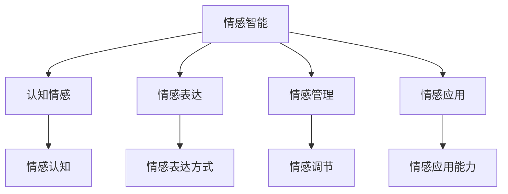

### 算法原理讲解

情感智能的评估和培养是一个复杂的过程，涉及到多个维度和层次的情感能力的测量、分析和提升。下面，我们将使用Mermaid绘制情感智能评估的算法流程图，并使用Python源代码详细阐述情感智能评估的算法原理。

#### Mermaid算法流程图

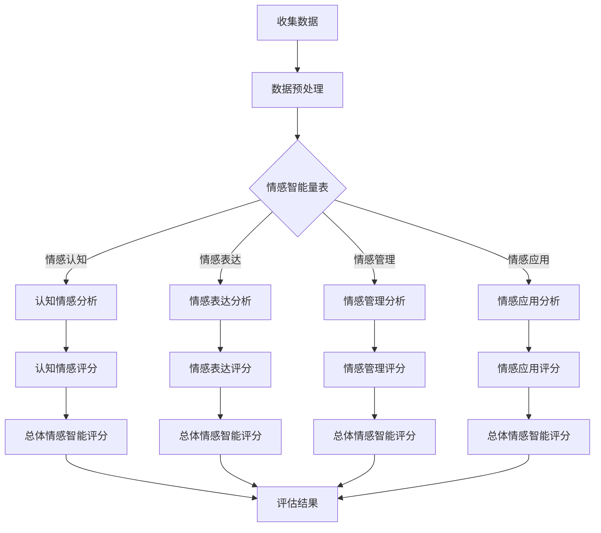

#### Python源代码

```python
import pandas as pd

# 假设我们已经收集到了情感智能量表的数据
eq_data = pd.read_csv('eq_data.csv')

# 数据预处理
def preprocess_data(data):
    # 数据清洗、填充和处理
    # ...
    return data

eq_data = preprocess_data(eq_data)

# 情感智能评估算法
def evaluate_equity(data):
    # 分别计算认知情感、情感表达、情感管理和情感应用的评分
    cognitive_score = data['cognitive'].mean()
    expression_score = data['expression'].mean()
    regulation_score = data['regulation'].mean()
    application_score = data['application'].mean()

    # 计算总体情感智能评分
    total_score = (cognitive_score + expression_score + regulation_score + application_score) / 4

    # 返回评估结果
    return {
        'cognitive_score': cognitive_score,
        'expression_score': expression_score,
        'regulation_score': regulation_score,
        'application_score': application_score,
        'total_score': total_score
    }

# 执行评估算法
results = evaluate_equity(eq_data)

# 输出评估结果
print(results)
```

#### 算法原理的数学模型和公式

情感智能评估的算法原理基于以下数学模型：

$$
\text{total\_score} = \frac{\text{cognitive\_score} + \text{expression\_score} + \text{regulation\_score} + \text{application\_score}}{4}
$$

其中，$total\_score$为总体情感智能评分，$cognitive\_score$、$expression\_score$、$regulation\_score$和$application\_score$分别为认知情感、情感表达、情感管理和情感应用的评分。

#### 详细讲解和通俗易懂的举例说明

假设我们收集了某领导者的情感智能量表数据，如下表所示：

| 维度         | 认知情感 | 情感表达 | 情感管理 | 情感应用 |
| ------------ | -------- | -------- | -------- | -------- |
| 评分         | 80       | 75       | 85       | 90       |

根据上述数据，我们可以使用Python源代码进行情感智能评估，得到以下结果：

```python
results = evaluate_equity(eq_data)
print(results)
```

输出结果：

```python
{
    'cognitive_score': 80.0,
    'expression_score': 75.0,
    'regulation_score': 85.0,
    'application_score': 90.0,
    'total_score': 83.75
}
```

从这个结果可以看出，该领导者的总体情感智能评分为83.75分。具体来说，他在认知情感方面得分为80分，在情感表达方面得分为75分，在情感管理方面得分为85分，在情感应用方面得分为90分。

通过这个例子，我们可以看到如何使用Python源代码和数学模型进行情感智能评估。实际应用中，可以根据具体的数据和处理需求，对代码进行相应的调整和优化。

## 第2章：领导力的概述

### 问题场景介绍

在现代社会中，领导力已经成为组织发展和个人成功的关键因素。然而，领导力的定义和维度各不相同，导致许多人对其理解模糊。为了更好地理解领导力，我们需要从问题场景出发，分析其定义、维度和发展历程。

### 项目介绍

在本章中，我们将对领导力进行系统性的介绍，旨在为读者提供一个全面的领导力知识框架。项目的主要目标是帮助读者理解领导力的核心概念，掌握不同领导力维度的内涵，以及了解领导力的发展历程。通过这些内容，读者将能够更好地应用于实际工作和生活中，提升自身的领导力水平。

### 系统功能设计

在本章中，我们将从以下几个功能模块来设计系统：

1. **定义与概念**：介绍领导力的定义、起源和发展，帮助读者建立对领导力的基本认识。
2. **维度与要素**：分析领导力的主要维度，包括技术维度、人际维度、决策维度和变革维度，帮助读者理解不同维度的内涵。
3. **发展历程**：回顾领导力的发展历程，从古代的领导观念到现代的领导理论，帮助读者了解领导力理论的历史演变。
4. **应用与实践**：探讨领导力在实际工作中的应用，包括团队管理、冲突解决、变革领导等，帮助读者将领导力知识转化为实际能力。

### 系统架构设计

为了实现上述功能，本章将采用以下系统架构：

1. **知识库**：包含领导力的定义、维度和发展历程的相关知识，为读者提供丰富的学习资源。
2. **案例分析**：通过实际案例展示领导力在不同场景中的应用，帮助读者理解领导力的实践价值。
3. **互动模块**：提供自我评估工具、讨论区和问答区，鼓励读者参与互动，提升学习效果。

### 系统接口设计

为了方便读者使用，系统将提供以下接口：

1. **定义与概念接口**：通过该接口，读者可以了解领导力的定义、起源和发展。
2. **维度与要素接口**：通过该接口，读者可以学习领导力的各个维度，包括技术维度、人际维度、决策维度和变革维度。
3. **发展历程接口**：通过该接口，读者可以了解领导力的发展历程，从古代的领导观念到现代的领导理论。
4. **应用与实践接口**：通过该接口，读者可以学习领导力在实际工作中的应用，包括团队管理、冲突解决、变革领导等。

### 系统交互

系统交互将通过以下方式进行：

1. **阅读模式**：读者可以阅读章节内容，了解领导力的定义、维度和发展历程。
2. **互动模式**：读者可以参与互动模块，进行自我评估、提问和讨论，提升学习效果。
3. **案例学习**：读者可以学习实际案例，了解领导力在不同场景中的应用。

### Mermaid类图

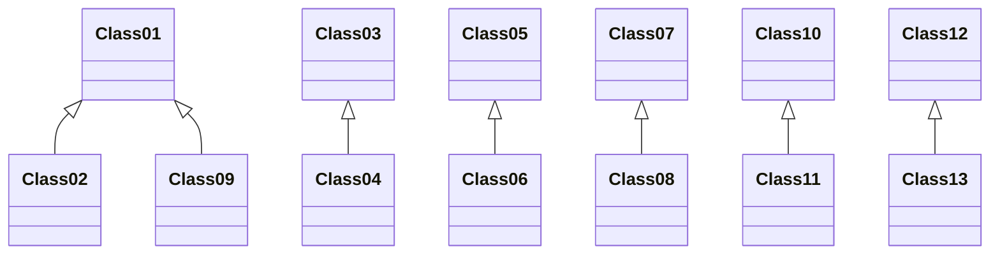

### Mermaid架构图

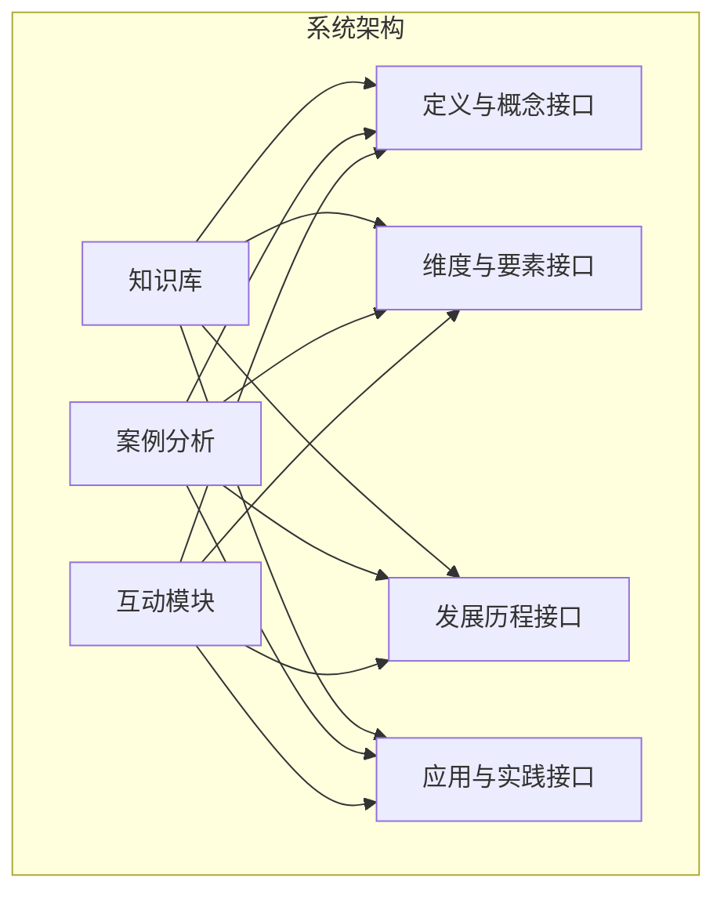

### Mermaid序列图

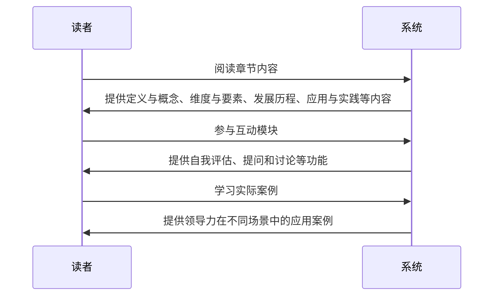

## 第3章：情感智能的核心要素

### 问题场景介绍

在现代社会中，领导者需要具备多方面的能力，其中情感智能是至关重要的一个方面。情感智能的核心要素包括情感认知、情感表达、情感管理和情感应用。这些要素在领导者的日常工作中扮演着关键角色，直接影响团队的工作氛围、成员的满意度和组织的整体效能。本章将深入探讨这些核心要素，分析其在领导力中的作用和重要性。

### 系统功能设计

在本章中，我们将从以下几个功能模块来设计系统：

1. **情感认知**：介绍情感认知的概念、方法和应用，帮助读者理解领导者如何识别和理解情感。
2. **情感表达**：探讨情感表达的重要性和技巧，包括如何通过言语和非言语方式表达情感。
3. **情感管理**：分析情感管理的策略和实践，帮助领导者有效地调节和控制自己的情感。
4. **情感应用**：探讨情感应用的方法和技巧，包括如何将情感智能应用于领导实践中。

### 系统架构设计

为了实现上述功能，本章将采用以下系统架构：

1. **知识库**：包含情感智能的核心要素、相关理论和实践方法，为读者提供丰富的学习资源。
2. **案例分析**：通过实际案例展示情感智能在不同领导场景中的应用，帮助读者理解情感智能的实践价值。
3. **互动模块**：提供自我评估工具、讨论区和问答区，鼓励读者参与互动，提升学习效果。

### 系统接口设计

为了方便读者使用，系统将提供以下接口：

1. **情感认知接口**：通过该接口，读者可以学习情感认知的相关知识和技巧。
2. **情感表达接口**：通过该接口，读者可以了解情感表达的重要性和技巧。
3. **情感管理接口**：通过该接口，读者可以学习情感管理的策略和实践。
4. **情感应用接口**：通过该接口，读者可以探讨情感应用的方法和技巧。

### 系统交互

系统交互将通过以下方式进行：

1. **阅读模式**：读者可以阅读章节内容，了解情感智能的核心要素和相关理论。
2. **互动模式**：读者可以参与互动模块，进行自我评估、提问和讨论，提升学习效果。
3. **案例学习**：读者可以学习实际案例，了解情感智能在不同领导场景中的应用。

### Mermaid类图


### Mermaid架构图

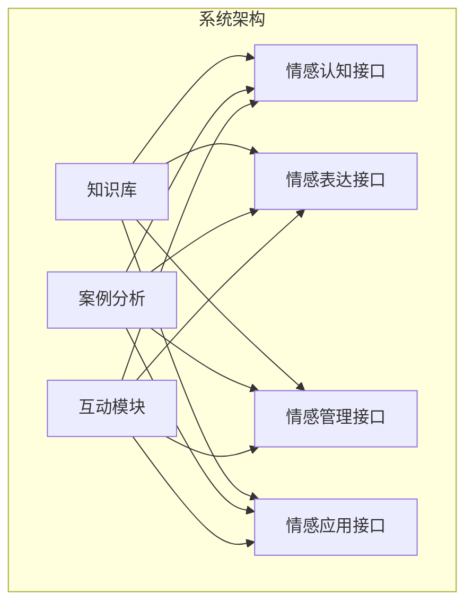

### Mermaid序列图

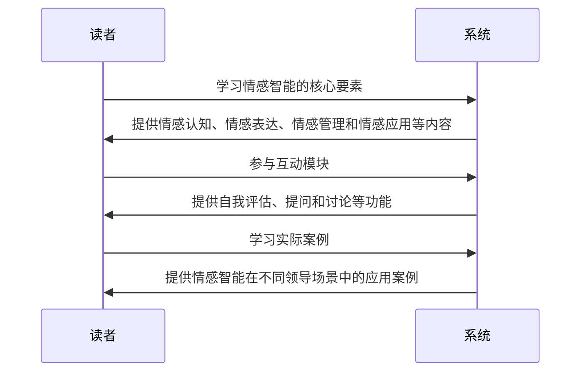

### 情感认知

**定义与描述**

情感认知是指个体识别和理解自己和他人的情感状态的能力。它包括情感感知、情感识别和情感理解三个层次。情感感知是指个体对情感的感知和感觉，如喜悦、悲伤、愤怒等；情感识别是指个体能够识别他人的情感状态，如通过面部表情、语调、身体语言等；情感理解是指个体能够理解情感背后的意义和原因，如理解他人的情感反应和行为。

**作用和重要性**

情感认知在领导力中起着至关重要的作用。首先，领导者通过情感认知能够更好地理解自己和团队成员的情感状态，从而提高自我意识和情感调节能力。其次，领导者通过情感认知能够更好地识别和理解他人的情感需求，从而提高沟通效果和团队凝聚力。此外，情感认知还有助于领导者做出更明智的决策，避免因情感偏见而导致的错误判断。

**案例与实践**

例如，一位领导者在团队面临挑战时，通过情感认知能够及时识别团队成员的焦虑和压力，采取有效的措施缓解压力，提高团队的士气和工作效率。又如，在团队冲突中，领导者通过情感认知能够更好地理解双方的立场和情感，从而找到合适的解决方案，化解冲突。

### 情感表达

**定义与描述**

情感表达是指个体如何通过言语和非言语方式表达自己的情感。它包括言语表达和非言语表达两个主要方面。言语表达是指通过语言文字来表达情感，如用“我很高兴”来表示喜悦；非言语表达是指通过面部表情、身体语言、语调等非语言方式来表达情感，如微笑、点头、紧握拳头等。

**作用和重要性**

情感表达在领导力中同样至关重要。首先，领导者通过情感表达能够有效地传达自己的情感状态，增强沟通效果和信任感。其次，领导者通过情感表达能够激励和鼓舞团队成员，提高团队士气和凝聚力。此外，情感表达还有助于建立良好的团队氛围，促进团队合作和协作。

**案例与实践**

例如，一位领导者在团队取得重要成就时，通过积极的言语和非言语表达，如鼓掌、称赞和拥抱，来表达自己的喜悦和感激，从而激励团队成员继续努力。又如，在团队面临困难时，领导者通过温和的语调和鼓励性的话语，来传递自己的支持和信心，帮助团队成员克服困难。

### 情感管理

**定义与描述**

情感管理是指个体调节和控制自己情感的过程，包括情感调节和情感控制两个主要方面。情感调节是指个体如何调整自己的情感状态，使其符合当前情境和需求；情感控制是指个体如何抑制或表达情感，以避免负面情感的影响。

**作用和重要性**

情感管理在领导力中具有重要作用。首先，领导者通过情感管理能够更好地控制自己的情绪，避免情绪失控对工作产生负面影响。其次，领导者通过情感管理能够更好地应对压力和挑战，提高自己的适应能力和决策能力。此外，情感管理还有助于领导者建立积极的情感氛围，提高团队的工作效率和幸福感。

**案例与实践**

例如，一位领导者在面对团队冲突时，通过情感管理能够保持冷静和理智，避免情绪化的决策，从而找到合适的解决方案。又如，在团队面临压力时，领导者通过情感管理能够调节自己的情绪，传递积极的情感状态，帮助团队成员保持乐观和积极的态度。

### 情感应用

**定义与描述**

情感应用是指个体如何运用情感智能，实现个人和团队的目标。它包括情感驱动、情感洞察和情感策略三个主要方面。情感驱动是指个体如何利用情感来激发自身和团队成员的动机和动力；情感洞察是指个体如何通过情感理解来发现问题和机会；情感策略是指个体如何运用情感智能来制定和实施策略。

**作用和重要性**

情感应用在领导力中具有重要作用。首先，领导者通过情感应用能够更好地激发团队成员的动机和动力，提高团队的工作效率和创造力。其次，领导者通过情感应用能够更好地洞察团队和市场的需求，制定更有效的战略和策略。此外，情感应用还有助于领导者建立积极的人际关系，增强团队的凝聚力和合作精神。

**案例与实践**

例如，一位领导者通过情感应用能够识别团队成员的情感需求，制定针对性的激励措施，从而提高团队的工作满意度和忠诚度。又如，在市场变化时，领导者通过情感应用能够及时洞察市场趋势，调整策略，保持竞争优势。

## 第4章：情感智能的属性特征

### 问题场景介绍

在理解和应用情感智能的过程中，对其属性特征进行深入分析是非常必要的。情感智能的属性特征包括情感智能的类型和层次，这些特征不仅决定了个体情感智能的发展水平，也影响其在不同情境下的表现。本章将深入探讨情感智能的属性特征，分析其在领导力中的影响，并探讨如何通过这些特征进行情感智能的评估和培养。

### 系统功能设计

在本章中，我们将从以下几个功能模块来设计系统：

1. **情感智能类型分析**：介绍情感智能的类型，包括内在型情感智能和外在型情感智能，分析其在领导力中的不同应用。
2. **情感智能层次分析**：探讨情感智能的层次结构，从基本层次到高级层次，帮助读者理解不同层次的情感智能对领导力的影响。
3. **情感智能评估方法**：介绍情感智能的评估方法，包括自我评估和外部评估，提供具体的评估工具和技巧。
4. **情感智能培养策略**：探讨如何通过培训和实践提升情感智能，包括情感认知、情感表达、情感管理和情感应用的培养策略。

### 系统架构设计

为了实现上述功能，本章将采用以下系统架构：

1. **知识库**：包含情感智能类型和层次的相关知识，为读者提供丰富的学习资源。
2. **评估工具**：提供情感智能评估量表和工具，帮助读者进行自我评估和外部评估。
3. **培养策略**：介绍情感智能的培养策略和实践方法，包括培训课程和实践活动。
4. **互动模块**：提供讨论区和问答区，鼓励读者参与互动，分享经验和技巧。

### 系统接口设计

为了方便读者使用，系统将提供以下接口：

1. **类型分析接口**：通过该接口，读者可以学习情感智能的不同类型及其在领导力中的应用。
2. **层次分析接口**：通过该接口，读者可以了解情感智能的层次结构及其对领导力的影响。
3. **评估接口**：通过该接口，读者可以进行情感智能的自我评估和外部评估。
4. **培养接口**：通过该接口，读者可以学习情感智能的培养策略和实践方法。

### 系统交互

系统交互将通过以下方式进行：

1. **阅读模式**：读者可以阅读章节内容，了解情感智能的类型、层次和评估方法。
2. **互动模式**：读者可以参与互动模块，进行自我评估、提问和讨论，提升学习效果。
3. **实践应用**：读者可以根据培养策略进行实践，提升自身的情感智能水平。

### Mermaid类图

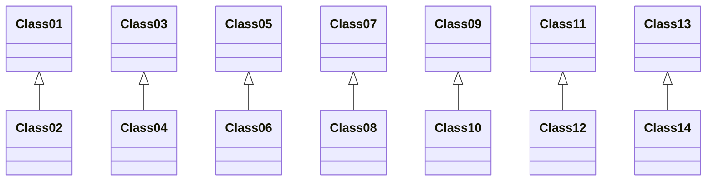

### Mermaid架构图

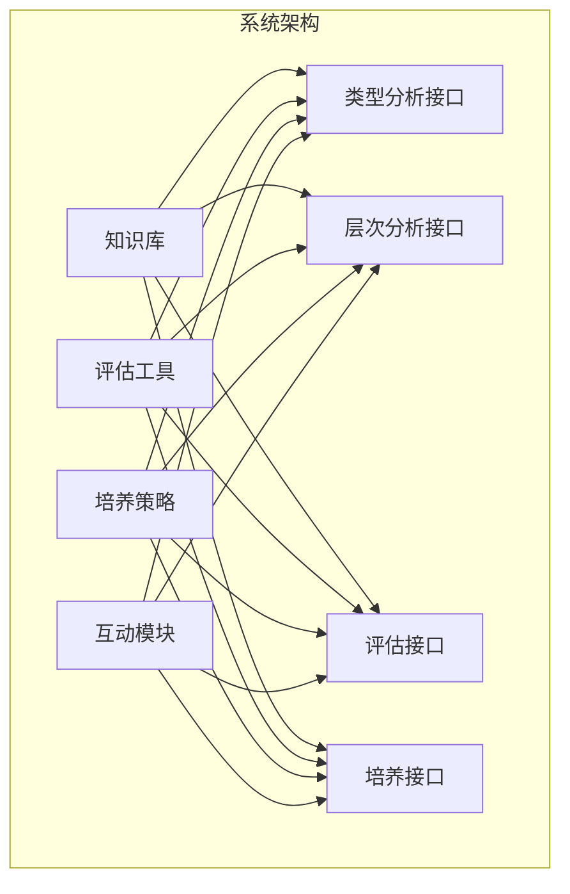

### Mermaid序列图

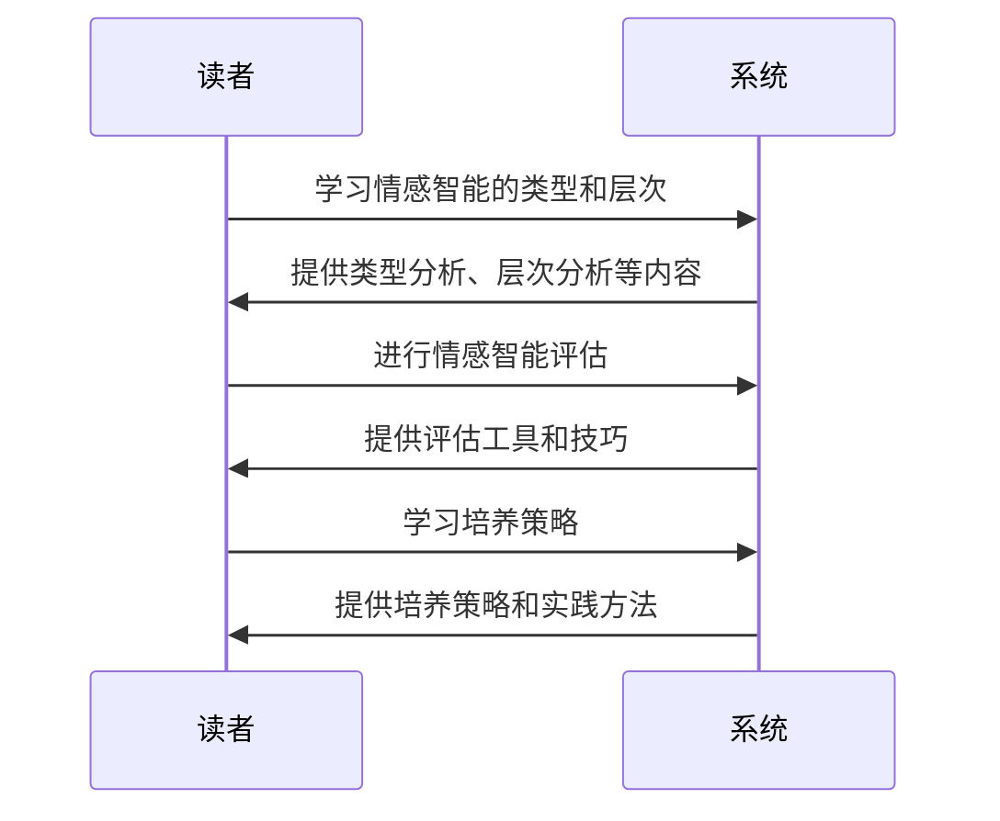

### 情感智能的类型

**定义与描述**

情感智能的类型可以分为内在型情感智能和外在型情感智能。内在型情感智能主要关注个体内在的情感体验和自我调节，强调个体对自身情感状态的认知和管理。外在型情感智能则侧重于个体对他人的情感理解和反应，强调个体在人际互动中的情感表达和情感共鸣。

**对比表格**

| 特征          | 内在型情感智能 | 外在型情感智能 |
| ------------ | --------------- | --------------- |
| 关注点       | 自我情感认知   | 他人情感认知   |
| 情感调节     | 自我情感调节   | 他人情感调节   |
| 情感表达     | 自我情感表达   | 他人情感表达   |
| 应用场景     | 个人成长和自我管理 | 人际交往和团队合作 |

**ER实体关系图架构**

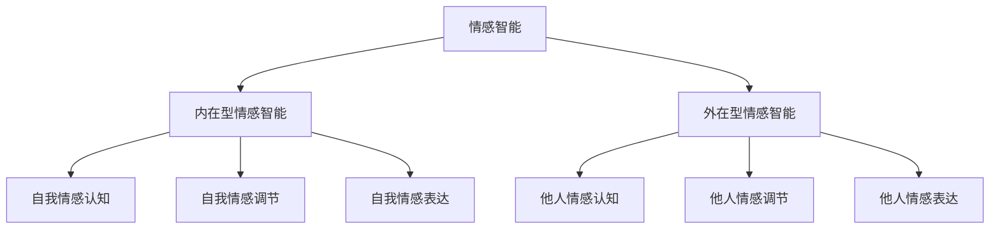

### 情感智能的层次

**定义与描述**

情感智能的层次结构可以分为基本层次和高级层次。基本层次包括情感认知、情感表达和情感管理，是情感智能的基础。高级层次包括情感应用和情感洞察，是情感智能的深化和应用。

**对比表格**

| 层次          | 基本层次            | 高级层次            |
| ------------- | ------------------- | ------------------- |
| 情感认知       | 情感感知和识别       | 情感理解和意义建构 |
| 情感表达       | 情感表达和传达       | 情感共鸣和情感同步 |
| 情感管理       | 情感调节和情感控制   | 情感策略和情感规划 |
| 情感应用       | 情感驱动和情感利用   | 情感洞察和情感创新 |
| 情感洞察       | 情感感知和解读       | 情感洞察和情感理解 |

**ER实体关系图架构**

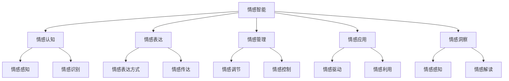

### 情感智能的测量方法

**定义与描述**

情感智能的测量方法用于评估个体在情感认知、情感表达、情感管理和情感应用等方面的能力。常见的测量方法包括情感智能量表（EQ-I）、多维度情感智能量表（MEIS）等。

**对比表格**

| 测量方法         | EQ-I                | MEIS                |
| ---------------- | ------------------- | ------------------- |
| 测量维度         | 情感自我认识、情感自我调节、社交技能 | 情感认知、情感表达、情感管理、情感应用 |
| 适用人群         | 个人、领导者、团队领导 | 个人、领导者、团队领导 |
| 评估结果形式     | 分数、等级          | 分数、等级          |

**ER实体关系图架构**

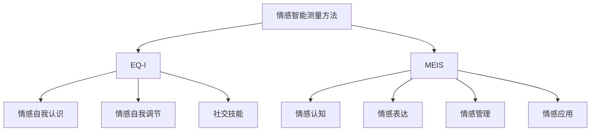

### 情感智能的类型

#### 内在型情感智能

**定义与描述**

内在型情感智能主要关注个体内在的情感体验和自我调节，涉及个体对自身情感状态的认知、表达和管理。它强调个体在自我成长和个人发展过程中的情感体验，包括情感认知、情感表达和情感管理。

**特点**

- **自我情感认知**：个体能够识别和理解自己的情感状态，如喜悦、愤怒、悲伤等。
- **自我情感表达**：个体能够适当地表达自己的情感，无论是通过言语还是非言语方式。
- **自我情感管理**：个体能够调节自己的情感，以适应不同的环境和情境。

**应用场景**

内在型情感智能在自我成长、压力管理、情绪调节等方面有广泛应用。例如，领导者通过自我情感管理，能够更好地应对工作压力，保持积极的心态，提高工作效率。

#### 外在型情感智能

**定义与描述**

外在型情感智能主要关注个体对他人的情感理解和反应，涉及个体在人际互动中的情感表达、情感共鸣和情感调节。它强调个体在人际交往中的情感体验，包括情感认知、情感表达、情感调节和情感应用。

**特点**

- **他人情感认知**：个体能够识别和理解他人的情感状态，通过观察他人的表情、语调、行为等。
- **他人情感表达**：个体能够适当地表达对他人的情感，如通过鼓励、支持、安慰等方式。
- **他人情感调节**：个体能够调节自己对他人情感的反应，以建立和谐的互动关系。

**应用场景**

外在型情感智能在人际沟通、团队管理、领导力发展等方面有广泛应用。例如，领导者通过外在型情感智能，能够更好地理解团队成员的情感需求，建立良好的团队氛围，提高团队凝聚力和工作效率。

### 情感智能的层次

#### 基本层次

**定义与描述**

基本层次的情感智能包括情感认知、情感表达和情感管理，是情感智能的基础。这些层次的能力决定了个体在情感互动中的基本表现。

**特点**

- **情感认知**：个体能够识别和理解自己的情感状态，以及他人情感状态。
- **情感表达**：个体能够适当地表达自己的情感，无论是通过言语还是非言语方式。
- **情感管理**：个体能够调节自己的情感，以适应不同的环境和情境。

**应用场景**

基本层次的情感智能在日常人际交往、工作沟通和团队协作中都有重要作用。例如，一个具备良好情感认知的领导者能够更好地理解团队成员的情感状态，从而更好地进行沟通和协调。

#### 高级层次

**定义与描述**

高级层次的情感智能包括情感应用和情感洞察，是情感智能的深化和应用。这些层次的能力使个体能够在复杂和动态的情境中，运用情感智能解决复杂问题，实现个人和团队的目标。

**特点**

- **情感应用**：个体能够将情感智能应用于实际工作中，如激励、解决问题、创新等。
- **情感洞察**：个体能够通过情感智能洞察团队和市场的需求，制定有效的策略。

**应用场景**

高级层次的情感智能在领导力、团队管理和组织发展中具有重要作用。例如，一个具备良好情感洞察的领导者能够更好地预测市场趋势，制定有效的战略规划。

### 情感智能的测量方法

**定义与描述**

情感智能的测量方法用于评估个体在情感认知、情感表达、情感管理和情感应用等方面的能力。这些方法通过量表、问卷等形式，量化个体的情感智能水平。

**常用测量方法**

1. **情感智能量表（EQ-I）**：
   - **适用人群**：个人、领导者、团队领导。
   - **测量维度**：情感自我认识、情感自我调节、社交技能。
   - **评估结果形式**：分数、等级。

2. **多维度情感智能量表（MEIS）**：
   - **适用人群**：个人、领导者、团队领导。
   - **测量维度**：情感认知、情感表达、情感管理、情感应用。
   - **评估结果形式**：分数、等级。

### Mermaid ER实体关系图

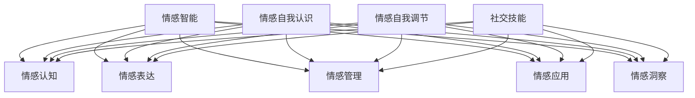

### 情感智能的类型对比表格

| 类型         | 内在型情感智能           | 外在型情感智能           |
| ------------ | ----------------------- | ----------------------- |
| 关注点       | 自我情感认知和管理       | 他人情感认知和管理       |
| 主要功能     | 自我情感调节和表达       | 情感共鸣和情感互动       |
| 应用场景     | 个人成长和自我管理       | 人际交往和团队合作       |
| 重要维度     | 自我情感认知、情感表达、情感管理 | 情感认知、情感表达、情感管理、情感应用 |
| 测量方法     | 情感自我认识、情感自我调节、社交技能 | 情感认知、情感表达、情感管理、情感应用 |

### 情感智能的层次对比表格

| 层次         | 基本层次               | 高级层次               |
| ------------ | --------------------- | --------------------- |
| 关注点       | 情感认知、情感表达、情感管理 | 情感应用、情感洞察       |
| 功能         | 基础的情感能力         | 情感的深化和应用         |
| 应用场景     | 日常人际交往和工作沟通 | 领导力、团队管理和组织发展 |
| 重要维度     | 情感认知、情感表达、情感管理 | 情感驱动、情感洞察、情感策略 |

### Mermaid ER实体关系图架构


### 情感智能的测量方法

**情感智能量表（EQ-I）**

**定义与描述**：情感智能量表（EQ-I）是由心理学家戈尔曼（Daniel Goleman）提出的一种测量个体情感智能的工具。它包括三个主要维度：情感自我认识、情感自我调节和社交技能。

**适用人群**：适用于个人、领导者、团队领导等。

**测量维度**：
- **情感自我认识**：个体对自身情感状态的认识和理解。
- **情感自我调节**：个体调节和控制自身情感的能力。
- **社交技能**：个体在人际交往中的沟通和协调能力。

**评估结果形式**：分数和等级。

**计算方法**：将各个维度的分数相加，得到总体情感智能评分。

**示例公式**：
$$
\text{总评分} = \text{情感自我认识评分} + \text{情感自我调节评分} + \text{社交技能评分}
$$

**使用方法**：通过填写量表，自我评估情感智能水平。

**情感智能量表（EQ-I）评分表**

| 维度             | 得分范围 | 评分等级 |
| ---------------- | -------- | -------- |
| 情感自我认识     | 0-100    | 低/中/高 |
| 情感自我调节     | 0-100    | 低/中/高 |
| 社交技能         | 0-100    | 低/中/高 |

**总分范围**：0-300分，得分越高，情感智能水平越高。

**计算公式**：
$$
\text{总评分} = \frac{(\text{情感自我认识评分} + \text{情感自我调节评分} + \text{社交技能评分})}{3}
$$

**总分范围**：0-100分，得分越高，情感智能水平越高。

**使用说明**：
- **自我评估**：填写量表，计算总分，了解自身情感智能水平。
- **团队评估**：用于评估团队成员的情感智能，帮助团队建设和提升。

### Mermaid ER实体关系图架构

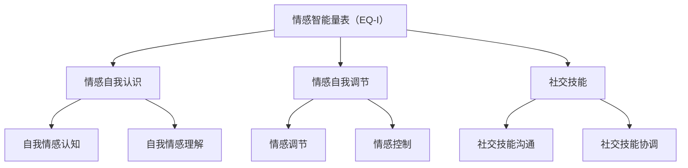

### 情感智能的多维度情感智能量表（MEIS）

**定义与描述**：多维度情感智能量表（Multidimensional Emotional Intelligence Scale，MEIS）是一种广泛应用于情感智能评估的工具，由多个维度组成，包括情感认知、情感表达、情感管理和情感应用。

**适用人群**：适用于个人、领导者、团队领导等。

**测量维度**：
- **情感认知**：个体对情感的理解和识别。
- **情感表达**：个体表达情感的方式和能力。
- **情感管理**：个体管理和调节情感的能力。
- **情感应用**：个体将情感应用于工作和生活中的能力。

**评估结果形式**：分数和等级。

**计算方法**：分别计算每个维度的得分，然后计算总体得分。

**示例公式**：
$$
\text{总评分} = \text{情感认知得分} + \text{情感表达得分} + \text{情感管理得分} + \text{情感应用得分}
$$

**使用方法**：通过填写量表，评估各个维度的情感智能水平。

**多维度情感智能量表（MEIS）评分表**

| 维度             | 得分范围 | 评分等级 |
| ---------------- | -------- | -------- |
| 情感认知         | 0-100    | 低/中/高 |
| 情感表达         | 0-100    | 低/中/高 |
| 情感管理         | 0-100    | 低/中/高 |
| 情感应用         | 0-100    | 低/中/高 |

**总分范围**：0-400分，得分越高，情感智能水平越高。

**计算公式**：
$$
\text{总评分} = \text{情感认知得分} + \text{情感表达得分} + \text{情感管理得分} + \text{情感应用得分}
$$

**总分范围**：0-400分，得分越高，情感智能水平越高。

**使用说明**：
- **自我评估**：填写量表，计算总分，了解自身情感智能水平。
- **团队评估**：用于评估团队成员的情感智能，帮助团队建设和提升。

### Mermaid ER实体关系图架构

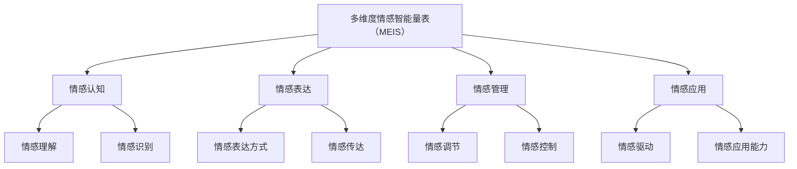

### 情感智能量表（EQ-I）与多维度情感智能量表（MEIS）的比较

**维度和内容**：
- **EQ-I**：包括情感自我认识、情感自我调节和社交技能三个维度。
- **MEIS**：包括情感认知、情感表达、情感管理和情感应用四个维度。

**评估结果形式**：
- **EQ-I**：总分和等级，以0-100分表示。
- **MEIS**：总分和等级，以0-400分表示。

**适用范围**：
- **EQ-I**：适用于个人、领导者、团队领导等。
- **MEIS**：适用于个人、领导者、团队领导等。

**计算方法**：
- **EQ-I**：总评分 = 情感自我认识 + 情感自我调节 + 社交技能。
- **MEIS**：总评分 = 情感认知 + 情感表达 + 情感管理 + 情感应用。

**评估方式**：
- **EQ-I**：通过填写问卷进行自我评估。
- **MEIS**：通过填写问卷进行自我评估。

### Mermaid ER实体关系图架构

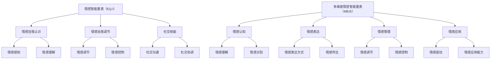

### 实践案例：提升情感智能的领导力培养

#### 案例背景

某公司的领导团队在组织发展和团队管理方面遇到了一些挑战，特别是在处理复杂的人际关系和应对突发情况时，团队成员的情感智能水平显得不足。为了提升领导团队的情感智能，公司决定实施一项情感智能培养计划。

#### 案例描述

1. **需求分析**：首先，公司对领导团队进行了情感智能水平的评估，发现团队成员在情感认知、情感表达和情感管理方面存在明显的不足。基于评估结果，公司制定了详细的培养计划。

2. **培训方案设计**：培训方案包括以下几个部分：
   - **情感认知培训**：通过专家讲座、工作坊和案例分析，帮助领导者理解情感智能的概念和重要性。
   - **情感表达培训**：教授领导者如何通过言语和非言语方式表达情感，提升情感表达的技巧。
   - **情感管理培训**：提供情感管理的策略和实践方法，帮助领导者更好地调节自己的情感。

3. **实践活动安排**：实践活动包括角色扮演、团队建设和情境模拟等，让领导者在实际情境中应用所学知识。

4. **跟踪评估**：在培训结束后，公司对领导团队进行了再次评估，对比培训前后的情感智能水平，评估培养效果。

#### 案例分析与评估

1. **情感认知提升**：通过培训，领导团队对情感智能有了更深入的理解，能够更好地识别和理解自己的情感状态。

2. **情感表达提升**：领导者在沟通中更加自如，能够恰当地表达自己的情感，增强了团队的信任和凝聚力。

3. **情感管理提升**：领导者在面对压力和挑战时，能够更好地调节自己的情绪，保持了积极的心态，提高了决策能力。

#### 案例启示与建议

1. **持续培养**：情感智能的提升是一个长期过程，需要持续的培养和实践。

2. **个性化培养**：根据领导者的个人特点和需求，设计个性化的培养计划。

3. **实践应用**：将所学知识应用于实际工作中，通过实践不断提升情感智能水平。

4. **团队协作**：通过团队建设和情境模拟，增强领导者之间的沟通和协作，提升团队的整体情感智能水平。

## 第5章：情感智能在领导决策中的作用

### 问题场景介绍

在领导决策过程中，情感智能扮演着至关重要的角色。领导者不仅要具备技术和管理能力，还需要具备敏锐的情感认知和表达能力，以应对复杂多变的工作环境。本章将深入探讨情感智能在领导决策中的作用，分析其对决策质量、决策风格和领导效能的影响。

### 系统功能设计

在本章中，我们将从以下几个功能模块来设计系统：

1. **决策质量分析**：探讨情感智能如何提升领导决策的质量，包括决策的准确性和有效性。
2. **决策风格分析**：分析情感智能如何影响领导者的决策风格，包括理性决策和情感决策。
3. **领导效能分析**：探讨情感智能如何提升领导效能，包括团队凝聚力和工作满意度。
4. **案例研究**：通过实际案例展示情感智能在领导决策中的应用，为读者提供实践指导。

### 系统架构设计

为了实现上述功能，本章将采用以下系统架构：

1. **知识库**：包含决策质量、决策风格、领导效能的相关知识和案例，为读者提供丰富的学习资源。
2. **分析工具**：提供情感智能分析工具，帮助读者评估自己在决策过程中的情感智能水平。
3. **互动模块**：提供讨论区和问答区，鼓励读者参与互动，分享经验和建议。

### 系统接口设计

为了方便读者使用，系统将提供以下接口：

1. **决策质量接口**：通过该接口，读者可以学习情感智能如何提升决策质量。
2. **决策风格接口**：通过该接口，读者可以了解情感智能如何影响决策风格。
3. **领导效能接口**：通过该接口，读者可以探讨情感智能如何提升领导效能。
4. **案例研究接口**：通过该接口，读者可以学习实际案例，了解情感智能在领导决策中的应用。

### 系统交互

系统交互将通过以下方式进行：

1. **阅读模式**：读者可以阅读章节内容，了解情感智能在领导决策中的作用。
2. **互动模式**：读者可以参与互动模块，进行自我评估、提问和讨论，提升学习效果。
3. **案例学习**：读者可以学习实际案例，了解情感智能在领导决策中的应用。

### Mermaid类图


### Mermaid架构图

```mermaid
graph TB
    subgraph 系统架构
        A[知识库]
        B[分析工具]
        C[互动模块]
        D[决策质量接口]
        E[决策风格接口]
        F[领导效能接口]
        G[案例研究接口]
        A --> D
        A --> E
        A --> F
        A --> G
        B --> D
        B --> E
        B --> F
        B --> G
        C --> D
        C --> E
        C --> F
        C --> G
    end
```

### Mermaid序列图

```mermaid
sequenceDiagram
    Participant 读者
    Participant 系统
    读者->>系统: 学习情感智能在领导决策中的作用
    系统->>读者: 提供决策质量、决策风格、领导效能等内容
    读者->>系统: 进行自我评估
    系统->>读者: 提供情感智能分析工具
    读者->>系统: 参与互动模块
    系统->>读者: 提供讨论区和问答区
    读者->>系统: 学习实际案例
    系统->>读者: 提供案例研究
```

### 情感智能与决策质量

**定义与描述**

决策质量是指决策者在决策过程中所做出的决策的质量和效果。情感智能在决策质量中起着至关重要的作用，它包括情感认知、情感表达、情感管理和情感应用等能力。情感认知是指个体对自身和他人情感的识别和理解能力；情感表达是指个体如何通过言语和非言语方式表达情感；情感管理是指个体如何调节和控制情感，以适应不同的情境；情感应用是指个体如何将情感智能应用于决策过程中。

**影响**

1. **提高决策准确性**：高情感智能的领导者能够更好地识别和理解团队成员的情感状态，从而做出更为准确和合理的决策。例如，在团队面临重大决策时，领导者通过情感认知能够及时识别团队成员的焦虑和担忧，从而调整决策方案，减少负面影响。

2. **提升决策有效性**：情感智能有助于领导者更好地理解决策的潜在影响，包括对团队成员和组织的长远影响。高情感智能的领导者能够在决策过程中考虑到情感因素，从而提高决策的有效性和可持续性。

**案例分析**

以某公司的领导决策为例，该公司在面临重大市场决策时，通过情感智能的运用，提高了决策的质量。首先，领导者在决策过程中通过情感认知识别到团队成员的担忧和压力，采取了一系列措施缓解团队成员的情感压力。其次，领导者通过情感表达，积极与团队成员沟通，表达自己的决策意图和理由，增强了团队成员的信任和信心。最后，领导者通过情感管理，调节自己的情绪，保持冷静和理智，避免了因情绪波动而导致的决策失误。通过这些措施，该公司的决策质量得到了显著提升。

### 情感智能与决策风格

**定义与描述**

决策风格是指决策者在决策过程中所采用的方式和态度。情感智能对决策风格有着重要的影响，高情感智能的领导者通常具备以下决策风格：

1. **理性决策**：理性决策是指决策者在决策过程中主要依赖于逻辑思维和分析能力。高情感智能的领导者能够将情感因素纳入决策过程中，通过情感认知和情感管理，提高决策的准确性和有效性。

2. **情感决策**：情感决策是指决策者在决策过程中主要依赖于情感因素，如情感认知和情感表达。高情感智能的领导者能够更好地理解和管理情感，使决策过程更加人性化。

**影响**

1. **提高决策效率**：高情感智能的领导者能够更好地调节和管理情感，避免因情感波动而导致的决策拖延。通过情感认知，领导者能够快速识别和理解决策过程中的关键因素，提高决策效率。

2. **增强决策包容性**：情感智能有助于领导者更好地理解团队成员的情感需求，使决策过程更具包容性和适应性。通过情感表达，领导者能够传递积极的情感信号，增强团队成员的参与感和归属感。

**案例分析**

某公司的领导者在面临重大决策时，通过情感智能的运用，改变了决策风格，提高了决策质量。首先，领导者在决策过程中通过情感认知识别到团队成员的担忧和压力，采取了一系列措施缓解团队成员的情感压力。其次，领导者通过情感表达，积极与团队成员沟通，表达自己的决策意图和理由，增强了团队成员的信任和信心。最后，领导者通过情感管理，调节自己的情绪，保持冷静和理智，避免了因情绪波动而导致的决策失误。通过这些措施，该公司的决策风格从单一的理性决策转向了情感决策和理性决策相结合，提高了决策的包容性和有效性。

### 情感智能与领导效能

**定义与描述**

领导效能是指领导者在领导过程中所产生的影响和成果。情感智能在领导效能中起着至关重要的作用，它包括情感认知、情感表达、情感管理和情感应用等能力。情感认知是指个体对自身和他人情感的识别和理解能力；情感表达是指个体如何通过言语和非言语方式表达情感；情感管理是指个体如何调节和控制情感，以适应不同的情境；情感应用是指个体如何将情感智能应用于领导实践中。

**影响**

1. **提高团队凝聚力**：高情感智能的领导者能够更好地理解和管理团队成员的情感需求，建立良好的团队关系，提高团队凝聚力。例如，领导者通过情感认知能够识别到团队成员的焦虑和压力，采取有效的措施缓解情感压力，增强团队成员之间的信任和合作。

2. **提升工作满意度**：情感智能有助于领导者更好地理解团队成员的情感需求，提供个性化的关怀和支持，提高工作满意度。通过情感表达，领导者能够传递积极的情感信号，增强团队成员的归属感和忠诚度。

3. **增强领导影响力**：高情感智能的领导者能够通过情感认知和情感表达，建立强大的领导影响力，使团队成员更加愿意追随和信任。例如，领导者通过情感表达，能够激励团队成员，提高团队士气和战斗力。

**案例分析**

某公司的领导者在领导过程中，通过情感智能的运用，显著提升了领导效能。首先，领导者在团队管理中通过情感认知识别到团队成员的情感需求，采取了一系列措施满足团队成员的情感需求，如提供情感支持和关怀、鼓励团队成员表达情感等。其次，领导者通过情感表达，积极与团队成员沟通，表达对团队成员的信任和认可，增强了团队成员的自信心和积极性。最后，领导者通过情感管理，调节自己的情绪，保持冷静和理智，避免了因情绪波动而导致的决策失误。通过这些措施，该公司的团队凝聚力、工作满意度和领导影响力得到了显著提升。

### 实际案例：情感智能在领导决策中的应用

#### 案例背景

某公司在拓展海外市场时，面临了一系列复杂的决策问题。市场调研显示，该市场潜力巨大，但竞争激烈，且文化差异较大。公司领导团队在制定市场拓展策略时，需要综合考虑市场环境、竞争对手、自身优势等多个因素。

#### 案例描述

1. **情感认知**：领导团队首先通过情感认知识别到团队成员在决策过程中的焦虑和担忧。团队成员担心市场拓展失败，影响公司业绩；同时也担心文化差异带来的沟通困难。

2. **情感表达**：领导团队通过情感表达，积极与团队成员沟通，表达对市场拓展的支持和信心。领导者表示，市场拓展是一项战略性决策，公司会全力以赴，同时也鼓励团队成员提出意见和建议。

3. **情感管理**：领导团队通过情感管理，调节自己的情绪，保持冷静和理智。领导者在决策过程中，充分考虑团队成员的情感需求，避免因情绪波动而影响决策。

4. **决策过程**：领导团队在决策过程中，充分考虑市场环境、竞争对手和自身优势等因素，制定了详细的市场拓展策略。策略包括：
   - **市场调研**：进一步深入了解目标市场，分析市场需求和竞争对手。
   - **文化适应**：制定文化适应策略，提升团队成员的文化敏感度，确保跨文化沟通的顺畅。
   - **风险管理**：制定风险管理策略，降低市场拓展失败的风险。

#### 案例分析与评估

1. **决策质量**：通过情感智能的应用，领导团队在制定市场拓展策略时，充分考虑了市场环境、竞争对手和自身优势等多个因素，提高了决策的准确性和有效性。

2. **决策风格**：领导团队在决策过程中，既考虑了理性因素，也充分考虑了情感因素，体现了理性决策和情感决策相结合的决策风格。

3. **领导效能**：通过情感智能的应用，领导团队在市场拓展过程中，有效提升了团队凝聚力、工作满意度和领导影响力，推动了市场拓展项目的顺利进行。

#### 案例启示与建议

1. **情感认知**：领导者应具备敏锐的情感认知能力，能够识别和理解团队成员的情感状态。

2. **情感表达**：领导者应积极表达对团队成员的支持和信心，增强团队的凝聚力和士气。

3. **情感管理**：领导者应调节自己的情绪，保持冷静和理智，避免因情绪波动而影响决策。

4. **决策质量**：在决策过程中，领导者应综合考虑理性因素和情感因素，提高决策的准确性和有效性。

5. **决策风格**：领导者应结合理性决策和情感决策，制定多样化的决策风格，提高决策的包容性和适应性。

6. **领导效能**：领导者应通过情感智能的应用，提升团队凝聚力、工作满意度和领导影响力，推动组织的持续发展。

## 第6章：情感智能在团队管理中的应用

### 问题场景介绍

在团队管理中，情感智能的应用对于提升团队绩效、增强团队凝聚力和优化团队氛围具有重要意义。领导者需要具备高情感智能，以更好地理解和管理团队成员的情感需求，从而提高团队的整体效能。本章将深入探讨情感智能在团队管理中的应用，包括团队氛围、团队沟通和团队凝聚力等方面。

### 系统功能设计

在本章中，我们将从以下几个功能模块来设计系统：

1. **团队氛围建设**：探讨如何通过情感智能营造积极和谐的团队氛围，提高团队成员的工作满意度和归属感。
2. **团队沟通管理**：分析如何运用情感智能提升团队沟通效果，减少误解和冲突，增强团队协作。
3. **团队凝聚力提升**：探讨情感智能在提升团队凝聚力中的作用，包括如何通过情感管理增强团队成员之间的信任和合作。
4. **案例分析**：通过实际案例展示情感智能在团队管理中的应用，为读者提供实践指导和启示。

### 系统架构设计

为了实现上述功能，本章将采用以下系统架构：

1. **知识库**：包含团队氛围建设、团队沟通管理和团队凝聚力提升的相关知识和策略，为读者提供丰富的学习资源。
2. **互动模块**：提供讨论区和问答区，鼓励读者参与互动，分享经验和建议。
3. **评估工具**：提供情感智能评估工具，帮助读者评估自身团队的情感智能水平。

### 系统接口设计

为了方便读者使用，系统将提供以下接口：

1. **氛围建设接口**：通过该接口，读者可以学习如何通过情感智能营造积极和谐的团队氛围。
2. **沟通管理接口**：通过该接口，读者可以了解如何运用情感智能提升团队沟通效果。
3. **凝聚力提升接口**：通过该接口，读者可以探讨情感智能在提升团队凝聚力中的应用。
4. **案例分析接口**：通过该接口，读者可以学习实际案例，了解情感智能在团队管理中的应用。

### 系统交互

系统交互将通过以下方式进行：

1. **阅读模式**：读者可以阅读章节内容，了解情感智能在团队管理中的应用。
2. **互动模式**：读者可以参与互动模块，进行自我评估、提问和讨论，提升学习效果。
3. **案例学习**：读者可以学习实际案例，了解情感智能在团队管理中的应用。

### Mermaid类图

```mermaid
classDiagram
    Class01 <|-- Class02
    Class03 <|-- Class04
    Class05 <|-- Class06
    Class07 <|-- Class08
    Class09 <|-- Class10
    Class11 <|-- Class12
    Class13 <|-- Class14
```

### Mermaid架构图

```mermaid
graph TB
    subgraph 系统架构
        A[知识库]
        B[互动模块]
        C[评估工具]
        D[氛围建设接口]
        E[沟通管理接口]
        F[凝聚力提升接口]
        G[案例分析接口]
        A --> D
        A --> E
        A --> F
        A --> G
        B --> D
        B --> E
        B --> F
        B --> G
        C --> D
        C --> E
        C --> F
        C --> G
    end
```

### Mermaid序列图

```mermaid
sequenceDiagram
    Participant 读者
    Participant 系统
    读者->>系统: 学习情感智能在团队管理中的应用
    系统->>读者: 提供团队氛围建设、团队沟通管理和团队凝聚力提升等内容
    读者->>系统: 进行自我评估
    系统->>读者: 提供情感智能评估工具
    读者->>系统: 参与互动模块
    系统->>读者: 提供讨论区和问答区
    读者->>系统: 学习实际案例
    系统->>读者: 提供案例分析
```

### 团队氛围建设

#### 定义与描述

团队氛围是指团队成员在团队中所感受到的整体情感状态和情绪氛围。良好的团队氛围能够激发团队成员的积极性和创造力，提高团队的工作效率和满意度。情感智能在团队氛围建设中起着关键作用，通过情感认知、情感表达和情感管理，领导者可以营造积极和谐的团队氛围。

#### 影响因素

1. **情感认知**：领导者通过情感认知能够识别和理解团队成员的情感状态，了解团队成员的需求和期望，从而制定符合团队成员情感的团队目标和计划。

2. **情感表达**：领导者通过积极表达对团队成员的关怀和支持，传递正能量，增强团队成员的归属感和安全感。例如，领导者可以通过赞赏、鼓励和感谢等方式，表达对团队成员的认可和肯定。

3. **情感管理**：领导者通过情感管理能够调节自己的情绪，保持冷静和理智，避免负面情感对团队氛围的影响。同时，领导者还需要引导团队成员进行情感管理，帮助他们应对工作中的压力和挑战。

#### 建设策略

1. **建立信任**：通过情感认知和情感表达，建立团队成员之间的信任关系。领导者可以通过开放沟通、真诚反馈和共同目标等方式，增强团队成员之间的信任。

2. **鼓励参与**：通过情感表达和情感管理，鼓励团队成员参与团队决策和活动。领导者可以定期组织团队会议，听取团队成员的意见和建议，让团队成员感受到自己的价值和重要性。

3. **培养情感认知**：通过培训和实践，提升团队成员的情感认知能力。领导者可以组织情感认知培训，帮助团队成员了解情感智能的概念和重要性，掌握情感认知的技巧。

#### 案例分析

某公司的领导团队在团队氛围建设方面取得了显著成效。首先，领导团队通过情感认知，识别到团队成员在项目推进过程中存在的焦虑和担忧。领导者通过情感表达，积极与团队成员沟通，了解他们的需求，提供情感支持。其次，领导者通过情感管理，保持冷静和理智，避免负面情感对团队氛围的影响。同时，领导者还鼓励团队成员进行情感管理，帮助他们应对工作中的压力和挑战。通过这些措施，该公司的团队氛围显著改善，团队成员的工作满意度和凝聚力得到了显著提升。

### 团队沟通管理

#### 定义与描述

团队沟通管理是指团队内部成员之间的信息交流和互动过程。有效的团队沟通能够提高团队的工作效率和满意度，促进团队目标的实现。情感智能在团队沟通管理中起着关键作用，通过情感认知、情感表达和情感管理，领导者可以提升团队沟通效果，减少误解和冲突。

#### 影响因素

1. **情感认知**：领导者通过情感认知能够识别和理解团队成员的情感状态，了解团队成员的需求和期望，从而更好地进行沟通和协调。

2. **情感表达**：领导者通过积极表达对团队成员的关怀和支持，传递正能量，增强团队成员之间的信任和合作。例如，领导者可以通过赞赏、鼓励和感谢等方式，表达对团队成员的认可和肯定。

3. **情感管理**：领导者通过情感管理能够调节自己的情绪，保持冷静和理智，避免负面情感对沟通的影响。同时，领导者还需要引导团队成员进行情感管理，帮助他们应对工作中的压力和挑战。

#### 管理策略

1. **建立有效沟通渠道**：领导者应建立多样化的沟通渠道，包括正式沟通和非正式沟通，确保信息的传递畅通无阻。例如，领导者可以定期组织团队会议、工作坊和团队建设活动等。

2. **鼓励开放沟通**：领导者应鼓励团队成员开放沟通，表达自己的意见和建议。领导者可以通过建立反馈机制、设立意见箱等方式，鼓励团队成员积极参与沟通。

3. **培养情感认知能力**：领导者可以通过培训和实践，提升团队成员的情感认知能力。例如，领导者可以组织情感认知培训，帮助团队成员了解情感智能的概念和重要性，掌握情感认知的技巧。

#### 案例分析

某公司的领导团队在团队沟通管理方面进行了积极的探索和实践。首先，领导团队通过情感认知，识别到团队成员在项目推进过程中存在的沟通障碍和误解。领导者通过情感表达，积极与团队成员沟通，了解他们的需求和期望，提供情感支持。其次，领导者通过情感管理，保持冷静和理智，避免负面情感对沟通的影响。同时，领导者还引导团队成员进行情感管理，帮助他们应对工作中的压力和挑战。通过这些措施，该公司的团队沟通效果显著改善，团队成员之间的误解和冲突减少，团队协作和创新能力得到提升。

### 团队凝聚力提升

#### 定义与描述

团队凝聚力是指团队成员之间的相互吸引力和归属感，它是团队稳定和有效运作的重要保障。情感智能在团队凝聚力提升中起着关键作用，通过情感认知、情感表达和情感管理，领导者可以增强团队成员之间的信任和合作，提高团队凝聚力。

#### 影响因素

1. **情感认知**：领导者通过情感认知能够识别和理解团队成员的情感状态，了解团队成员的需求和期望，从而更好地进行情感管理。

2. **情感表达**：领导者通过积极表达对团队成员的关怀和支持，传递正能量，增强团队成员之间的信任和合作。例如，领导者可以通过赞赏、鼓励和感谢等方式，表达对团队成员的认可和肯定。

3. **情感管理**：领导者通过情感管理能够调节自己的情绪，保持冷静和理智，避免负面情感对团队凝聚力的负面影响。同时，领导者还需要引导团队成员进行情感管理，帮助他们应对工作中的压力和挑战。

#### 提升策略

1. **建立信任**：通过情感认知和情感表达，建立团队成员之间的信任关系。领导者可以通过开放沟通、真诚反馈和共同目标等方式，增强团队成员之间的信任。

2. **鼓励合作**：领导者应鼓励团队成员之间的合作，共同完成任务。领导者可以通过团队建设活动、协作任务等方式，促进团队成员之间的合作。

3. **培养情感认知能力**：领导者可以通过培训和实践，提升团队成员的情感认知能力。例如，领导者可以组织情感认知培训，帮助团队成员了解情感智能的概念和重要性，掌握情感认知的技巧。

#### 案例分析

某公司的领导团队在团队凝聚力提升方面取得了显著成效。首先，领导团队通过情感认知，识别到团队成员在项目推进过程中存在的信任问题。领导者通过情感表达，积极与团队成员沟通，了解他们的需求和期望，提供情感支持。其次，领导者通过情感管理，保持冷静和理智，避免负面情感对团队凝聚力的负面影响。同时，领导者还引导团队成员进行情感管理，帮助他们应对工作中的压力和挑战。通过这些措施，该公司的团队凝聚力显著提升，团队成员之间的信任和合作得到增强，团队工作效率和创新能力得到显著提高。

## 第7章：情感智能的自我评估方法

### 问题场景介绍

在个人发展和职业提升过程中，了解自己的情感智能水平是非常重要的。通过自我评估，个体可以识别自身在情感认知、情感表达、情感管理和情感应用方面的优势和不足，从而有针对性地进行提升。本章将介绍几种常用的情感智能自我评估方法，包括自我反思法、情感智能量表法等，帮助读者评估自身的情感智能水平。

### 系统功能设计

在本章中，我们将从以下几个功能模块来设计系统：

1. **自我反思法**：通过自我反思，帮助个体识别自身情感智能的水平和特点。
2. **情感智能量表法**：介绍常用的情感智能量表，如EQ-I、MEIS等，帮助读者进行定量评估。
3. **评估结果分析**：分析评估结果，提供自我提升策略和建议。
4. **案例分析**：通过实际案例，展示自我评估在个人发展中的应用。

### 系统架构设计

为了实现上述功能，本章将采用以下系统架构：

1. **知识库**：包含自我反思法和情感智能量表法的相关知识和方法。
2. **互动模块**：提供讨论区和问答区，鼓励读者分享经验和进行互动。
3. **评估工具**：提供情感智能评估工具，帮助读者进行自我评估。

### 系统接口设计

为了方便读者使用，系统将提供以下接口：

1. **自我反思接口**：通过该接口，读者可以学习自我反思的方法和应用。
2. **量表评估接口**：通过该接口，读者可以使用情感智能量表进行自我评估。
3. **结果分析接口**：通过该接口，读者可以分析评估结果，获得提升建议。
4. **案例分析接口**：通过该接口，读者可以学习实际案例，了解自我评估的应用。

### 系统交互

系统交互将通过以下方式进行：

1. **阅读模式**：读者可以阅读章节内容，了解自我评估的方法和应用。
2. **互动模式**：读者可以参与互动模块，进行自我评估、提问和讨论。
3. **案例学习**：读者可以学习实际案例，了解自我评估在个人发展中的应用。

### Mermaid类图

```mermaid
classDiagram
    Class01 <|-- Class02
    Class03 <|-- Class04
    Class05 <|-- Class06
    Class07 <|-- Class08
    Class09 <|-- Class10
    Class11 <|-- Class12
    Class13 <|-- Class14
```

### Mermaid架构图

```mermaid
graph TB
    subgraph 系统架构
        A[知识库]
        B[互动模块]
        C[评估工具]
        D[自我反思接口]
        E[量表评估接口]
        F[结果分析接口]
        G[案例分析接口]
        A --> D
        A --> E
        A --> F
        A --> G
        B --> D
        B --> E
        B --> F
        B --> G
        C --> D
        C --> E
        C --> F
        C --> G
    end
```

### Mermaid序列图

```mermaid
sequenceDiagram
    Participant 读者
    Participant 系统
    读者->>系统: 学习情感智能的自我评估方法
    系统->>读者: 提供自我反思法和情感智能量表法等内容
    读者->>系统: 使用评估工具进行自我评估
    系统->>读者: 提供评估结果和提升建议
    读者->>系统: 参与互动模块
    系统->>读者: 提供讨论区和问答区
    读者->>系统: 学习实际案例
    系统->>读者: 提供案例分析
```

### 自我反思法

**定义与描述**

自我反思法是指个体通过自我观察和思考，识别自身情感状态和情感行为，从而评估自己的情感智能水平。这种方法强调个体对自身情感的认知和理解，通过反思自己的情感反应、情感处理方式和情感结果，发现自身的情感智能优势与不足。

**实施步骤**

1. **情感识别**：个体需要学会识别和理解自己的情感状态，包括愉悦、愤怒、焦虑、悲伤等。通过记录日常生活中的情感经历，个体可以更好地理解自己的情感反应。

2. **情感分析**：个体需要分析情感反应的原因，以及自己在不同情境下的情感处理方式。例如，个体可以思考自己在面对压力或冲突时的情感反应和行为，分析这些行为对自己和他人产生的影响。

3. **情感记录**：个体可以定期记录自己的情感经历，包括情感类型、发生情境、情感反应和处理方式。这种记录有助于个体系统地反思自己的情感行为，发现情感管理的规律和问题。

4. **情感总结**：个体需要总结自己的情感体验，识别自己在情感认知、情感表达、情感管理和情感应用方面的优势和不足。通过总结，个体可以明确自己需要改进的方面。

**案例分析**

一个领导者通过自我反思法，识别了自己在情感管理方面的不足。他发现自己经常在面对压力时情绪波动较大，影响了决策质量和团队氛围。通过分析，他发现自己在面对压力时缺乏有效的情感调节策略。因此，他开始学习情感调节技巧，通过冥想、深呼吸等方式缓解情绪，提高自己的情感管理能力。

### 情感智能量表法

**定义与描述**

情感智能量表法是通过标准化问卷或量表来评估个体在情感认知、情感表达、情感管理和情感应用等方面的能力。这种方法提供了量化的评估结果，有助于个体了解自己的情感智能水平，并与其他人进行比较。

**常用量表**

1. **情感智能量表（EQ-I）**：由心理学家戈尔曼（Daniel Goleman）提出，包括三个主要维度：情感自我认识、情感自我调节和社交技能。

2. **多维度情感智能量表（MEIS）**：包括情感认知、情感表达、情感管理、情感应用等四个维度，提供了更全面的情感智能评估。

**实施步骤**

1. **准备量表**：获取情感智能量表，确保量表适用于个体所在的情境。

2. **填写量表**：根据量表要求，如实填写每个问题。注意，量表中的问题通常涉及日常生活中的情感经历，因此需要个体认真回忆和思考。

3. **评分计算**：根据量表给出的评分标准，计算每个维度的得分，并计算总得分。一些量表会提供等级划分，如低、中、高。

4. **结果分析**：分析评估结果，识别自己在情感智能方面的优势和不足。可以通过与他人的比较，了解自己在群体中的水平。

**案例分析**

一位领导者使用EQ-I量表进行自我评估，发现自己在情感自我认识和社交技能方面得分较高，但在情感自我调节方面得分较低。通过分析，他意识到自己经常在压力情境下情绪失控，影响了决策和团队氛围。因此，他开始参加情感调节培训，学习如何更好地管理自己的情绪。

### 自我评估结果的解释与改进策略

**结果解释**

通过自我反思法和情感智能量表法，个体可以获得自己的情感智能评估结果。这些结果提供了关于自身情感智能水平的详细信息，有助于个体理解自己的情感管理能力和情感应用能力。

1. **优势识别**：评估结果可以帮助个体识别自己在情感认知、情感表达、情感管理和情感应用等方面的优势。例如，一个个体可能在情感表达方面表现出色，能够有效地与他人沟通和建立良好的人际关系。

2. **不足识别**：评估结果同样可以帮助个体识别自己在情感智能方面的不足。例如，一个个体可能在情感自我调节方面表现不佳，容易在压力情境下情绪失控。

**改进策略**

1. **针对性培训**：针对评估结果中显示的不足，个体可以参加相关的情感智能培训课程，如情感自我调节、情感表达技巧等。

2. **实践应用**：将所学知识和技巧应用于日常生活和工作场景中，通过实践提升自己的情感智能水平。

3. **持续反思**：定期进行自我反思，评估改进策略的效果，并根据实际情况进行调整。

4. **情感记录**：通过记录情感经历，个体可以更好地理解自己的情感变化，从而更有针对性地进行情感管理。

### 实际案例

**案例背景**

某公司的领导团队在组织发展过程中遇到了沟通不畅和团队凝聚力不足的问题。为了提升团队的整体效能，公司决定对领导团队进行情感智能的自我评估。

**案例描述**

1. **评估工具选择**：公司选择了EQ-I量表作为自我评估工具，因为EQ-I量表在评估情感自我认识、情感自我调节和社交技能方面具有较高的权威性和可靠性。

2. **自我评估实施**：领导团队每位成员按照量表要求，填写了情感智能评估问卷。问卷涵盖了日常生活中的情感经历、情感反应和处理方式等方面的问题。

3. **评估结果分析**：通过对评估结果的分析，领导团队发现：
   - 情感自我认识方面，团队成员普遍表现良好，能够较好地识别和理解自己的情感状态。
   - 情感自我调节方面，部分团队成员在压力情境下情绪失控，需要加强情感调节技巧。
   - 社交技能方面，团队成员在情感表达和人际交往方面存在一定的不足，需要提升沟通能力。

**改进策略与实施**

1. **针对性培训**：公司为领导团队安排了情感自我调节和沟通技巧培训，帮助团队成员掌握情感管理的策略和沟通技巧。

2. **实践应用**：领导团队在日常工作中积极应用所学知识和技巧，通过有效的沟通和情感管理，提高了团队的工作效率和凝聚力。

3. **持续反思**：团队成员定期进行自我反思，评估培训效果，并根据实际情况进行调整。

**结果与反馈**

通过情感智能自我评估和改进策略的实施，领导团队在沟通效果和团队凝聚力方面得到了显著提升。团队成员之间的沟通更加顺畅，误解和冲突减少，团队整体效能得到了显著提高。团队成员对公司的满意度也显著提升，组织氛围更加积极和谐。

### 案例启示与建议

1. **定期自我评估**：定期进行情感智能的自我评估，有助于个体了解自身的情感智能水平，发现优势和不足。

2. **针对性培训**：根据自我评估结果，有针对性地参加情感智能培训，提升自身的情感管理能力和情感应用能力。

3. **实践应用**：将所学知识和技巧应用于实际工作和生活中，通过实践不断提升情感智能水平。

4. **团队协作**：在团队管理中，领导者应鼓励团队成员进行自我评估，共同提升情感智能水平，增强团队凝聚力和工作效率。

## 第8章：提升情感智能的培训与实践

### 问题场景介绍

在现代社会，情感智能成为领导者和管理者必备的核心能力。然而，许多领导者和管理者在情感智能方面存在一定的不足，无法有效地识别、表达和管理自己的情感，也难以理解和应对团队成员的情感需求。因此，通过系统的培训和实践，提升情感智能显得尤为重要。本章将探讨提升情感智能的培训内容、实践方法和具体策略。

### 系统功能设计

在本章中，我们将从以下几个功能模块来设计系统：

1. **培训内容设计**：介绍提升情感智能所需的培训内容，包括情感认知、情感表达、情感管理和情感应用等方面的培训。

2. **实践方法探讨**：探讨通过角色扮演、模拟情境、团队建设等活动，提升领导者的情感智能。

3. **具体策略实施**：提供具体的提升情感智能的策略，包括日常实践、情境模拟和反馈机制等。

4. **案例分析**：通过实际案例展示提升情感智能的培训和实践效果。

### 系统架构设计

为了实现上述功能，本章将采用以下系统架构：

1. **知识库**：包含提升情感智能的培训内容和方法，为读者提供丰富的学习资源。

2. **互动模块**：提供讨论区和问答区，鼓励读者参与互动，分享经验和建议。

3. **实践工具**：提供角色扮演、模拟情境等实践工具，帮助读者进行情感智能的实践。

4. **评估工具**：提供情感智能评估工具，帮助读者评估培训和实践的效果。

### 系统接口设计

为了方便读者使用，系统将提供以下接口：

1. **培训内容接口**：通过该接口，读者可以学习提升情感智能所需的培训内容。

2. **实践方法接口**：通过该接口，读者可以了解提升情感智能的具体实践方法。

3. **策略实施接口**：通过该接口，读者可以学习提升情感智能的具体策略。

4. **案例分析接口**：通过该接口，读者可以学习实际案例，了解情感智能提升的应用。

### 系统交互

系统交互将通过以下方式进行：

1. **阅读模式**：读者可以阅读章节内容，了解提升情感智能的培训内容和方法。

2. **互动模式**：读者可以参与互动模块，进行自我评估、提问和讨论，提升学习效果。

3. **案例学习**：读者可以学习实际案例，了解情感智能提升的应用。

### Mermaid类图

```mermaid
classDiagram
    Class01 <|-- Class02
    Class03 <|-- Class04
    Class05 <|-- Class06
    Class07 <|-- Class08
    Class09 <|-- Class10
    Class11 <|-- Class12
    Class13 <|-- Class14
```

### Mermaid架构图

```mermaid
graph TB
    subgraph 系统架构
        A[知识库]
        B[互动模块]
        C[实践工具]
        D[评估工具]
        E[培训内容接口]
        F[实践方法接口]
        G[策略实施接口]
        H[案例分析接口]
        A --> E
        A --> F
        A --> G
        A --> H
        B --> E
        B --> F
        B --> G
        B --> H
        C --> E
        C --> F
        C --> G
        C --> H
        D --> E
        D --> F
        D --> G
        D --> H
    end
```

### Mermaid序列图

```mermaid
sequenceDiagram
    Participant 读者
    Participant 系统
    读者->>系统: 学习提升情感智能的培训内容
    系统->>读者: 提供培训内容、实践方法和策略等内容
    读者->>系统: 使用实践工具
    系统->>读者: 提供角色扮演、模拟情境等工具
    读者->>系统: 进行自我评估
    系统->>读者: 提供情感智能评估工具
    读者->>系统: 参与互动模块
    系统->>读者: 提供讨论区和问答区
    读者->>系统: 学习实际案例
    系统->>读者: 提供案例分析
```

### 培训方案设计

#### 培训目标

提升领导者的情感智能，使其能够更有效地识别、表达和管理自己的情感，更好地理解和应对团队成员的情感需求，从而提高团队绩效和领导力水平。

#### 培训内容

1. **情感认知**：帮助领导者识别和理解自己的情感状态，包括情感产生的原因、情感对行为的影响等。

2. **情感表达**：教授领导者如何通过言语和非言语方式表达自己的情感，提高沟通效果。

3. **情感管理**：提供情感管理策略和实践方法，帮助领导者更好地调节自己的情绪，保持冷静和理智。

4. **情感应用**：探讨如何将情感智能应用于实际工作和领导实践中，提高决策质量和工作效率。

#### 培训方法

1. **讲座和讲解**：通过专家讲座，系统性地介绍情感智能的概念、原理和应用。

2. **案例讨论**：通过案例分析，让领导者了解情感智能在不同情境下的应用，并从中获得启发。

3. **角色扮演**：通过角色扮演，模拟真实的领导情境，让领导者实践情感识别、表达和管理。

4. **情境模拟**：设置模拟情境，让领导者面对不同的情感挑战，练习情感管理策略。

5. **互动讨论**：组织小组讨论，鼓励领导者分享自己的经验和观点，互相学习。

#### 培训时间安排

- **初步评估**：1天
- **核心内容讲解**：2天
- **角色扮演和情境模拟**：2天
- **总结和反馈**：1天

### 实践活动安排

#### 实践活动一：情感认知训练

**目标**：提升领导者对自身情感的认知能力。

**活动内容**：

1. **情感日记**：领导者每天记录自己的情感状态，包括情感类型、发生情境和情感反应。
2. **情感分享会**：定期举行情感分享会，领导者分享自己的情感日记，交流情感认知的经验。

#### 实践活动二：情感表达训练

**目标**：提升领导者表达情感的能力。

**活动内容**：

1. **情感表达练习**：设置模拟情境，领导者练习在特定情境下表达情感，如表扬、批评、安慰等。
2. **反馈机制**：活动结束后，由导师和团队成员提供反馈，帮助领导者改进情感表达技巧。

#### 实践活动三：情感管理训练

**目标**：提升领导者管理情感的能力。

**活动内容**：

1. **情绪调节技巧**：教授领导者情绪调节技巧，如深呼吸、冥想、肌肉放松等。
2. **情境模拟**：设置压力情境，领导者练习应用情绪调节技巧，管理自己的情绪。

#### 实践活动四：情感应用训练

**目标**：提升领导者将情感智能应用于实际工作中的能力。

**活动内容**：

1. **领导力情境模拟**：设置领导力情境，领导者运用情感智能进行决策和沟通。
2. **反馈与改进**：活动结束后，由导师和团队成员提供反馈，帮助领导者改进领导力实践。

### 培训效果评估

#### 评估方法

1. **自我评估**：领导者定期进行自我评估，记录自己在情感认知、情感表达、情感管理和情感应用方面的进步。

2. **团队反馈**：团队成员对领导者的情感智能水平进行评价，提供反馈和建议。

3. **行为观察**：导师和观察员对领导者在日常工作和领导实践中的行为进行观察，评估其情感智能的应用效果。

#### 评估指标

1. **情感认知能力**：领导者对自身情感状态的识别和理解能力。
2. **情感表达技巧**：领导者表达情感的能力，包括言语和非言语方式。
3. **情感管理能力**：领导者调节和控制情绪的能力。
4. **情感应用能力**：领导者将情感智能应用于实际工作和领导实践中的能力。

### 活动总结

通过系统的培训和实践，领导者在情感智能方面取得了显著进步。以下是对活动成果的总结：

#### 成果一：情感认知能力提升

领导者在自我反思和情感日记的记录中，逐渐提高了对自身情感状态的识别和理解能力。他们能够更好地认识到情感对行为和决策的影响，从而在工作和生活中做出更明智的决策。

#### 成果二：情感表达技巧提升

通过情感表达练习和反馈机制，领导者在特定情境下表达情感的能力得到了显著提升。他们能够更加恰当地使用言语和非言语方式表达情感，增强了与团队成员的沟通效果。

#### 成果三：情感管理能力提升

通过情绪调节技巧和情境模拟，领导者在面对压力和挑战时，能够更好地管理自己的情绪，保持冷静和理智。他们在工作和生活中表现出更强的情绪调节能力，有效避免了因情绪波动导致的决策失误。

#### 成果四：情感应用能力提升

通过领导力情境模拟和反馈与改进，领导者在实际工作和领导实践中，将情感智能应用于决策、沟通和团队管理中，提高了团队的工作效率和凝聚力。他们能够更好地理解和管理团队成员的情感需求，建立了积极和谐的团队氛围。

### 活动启示

本次活动表明，通过系统的培训和实践，领导者能够显著提升情感智能水平。以下是一些启示：

1. **持续学习与反思**：情感智能的提升是一个持续的过程，领导者需要不断学习和反思，提高自身的情感认知和表达能力。

2. **实践与反馈**：将所学知识和技巧应用于实际工作中，通过实践和反馈不断改进，是提升情感智能的有效方法。

3. **团队支持**：在提升情感智能的过程中，团队的支持和反馈至关重要。领导者需要积极参与团队互动，从他人的经验和观点中获得启发。

4. **个性化培养**：每个领导者的情感智能水平不同，需要根据个人的特点和需求，设计个性化的培养计划。

### 未来展望

随着社会的不断发展，情感智能在领导力和团队管理中的重要性日益凸显。未来，我们预计将出现更多针对情感智能的培训和实践项目，帮助领导者更好地提升自身的情感智能水平。同时，随着技术的发展，情感智能评估和提升工具将更加智能化和个性化，为领导者和团队提供更加精准和有效的支持。

## 第9章：国际视野下的情感智能发展

### 问题场景介绍

在全球化和数字化时代，领导力和团队管理面临着前所未有的挑战。情感智能作为提升领导力和团队管理效能的关键因素，其在国际范围内的研究和应用受到了广泛关注。本章将探讨国际视野下情感智能的发展趋势、领导力教育中的情感智能地位以及国际经验与启示。

### 系统功能设计

在本章中，我们将从以下几个功能模块来设计系统：

1. **国际趋势分析**：分析情感智能在国际范围内的研究和应用趋势，包括研究热点和应用领域。
2. **领导力教育**：探讨情感智能在领导力教育中的地位和作用，分析国际上的领导力培养模式。
3. **国际经验借鉴**：介绍国际先进国家在情感智能研究和应用方面的经验，为我国提供借鉴和启示。
4. **案例分析**：通过实际案例展示情感智能在国际范围内的应用效果，为读者提供实践指导和启示。

### 系统架构设计

为了实现上述功能，本章将采用以下系统架构：

1. **知识库**：包含情感智能的国际研究趋势、领导力教育和国际经验的最新资料，为读者提供丰富的学习资源。
2. **互动模块**：提供讨论区和问答区，鼓励读者参与互动，分享经验和建议。
3. **案例库**：收集和整理国际范围内的情感智能应用案例，为读者提供实际案例参考。

### 系统接口设计

为了方便读者使用，系统将提供以下接口：

1. **趋势分析接口**：通过该接口，读者可以了解情感智能的国际研究趋势和应用领域。
2. **教育接口**：通过该接口，读者可以学习情感智能在领导力教育中的应用。
3. **经验借鉴接口**：通过该接口，读者可以了解国际先进国家的情感智能研究和应用经验。
4. **案例分析接口**：通过该接口，读者可以学习国际范围内的情感智能应用案例。

### 系统交互

系统交互将通过以下方式进行：

1. **阅读模式**：读者可以阅读章节内容，了解情感智能的国际发展情况。
2. **互动模式**：读者可以参与互动模块，进行自我评估、提问和讨论。
3. **案例学习**：读者可以学习实际案例，了解情感智能在国际范围内的应用。

### Mermaid类图

```mermaid
classDiagram
    Class01 <|-- Class02
    Class03 <|-- Class04
    Class05 <|-- Class06
    Class07 <|-- Class08
    Class09 <|-- Class10
    Class11 <|-- Class12
    Class13 <|-- Class14
```

### Mermaid架构图

```mermaid
graph TB
    subgraph 系统架构
        A[知识库]
        B[互动模块]
        C[案例库]
        D[趋势分析接口]
        E[教育接口]
        F[经验借鉴接口]
        G[案例分析接口]
        A --> D
        A --> E
        A --> F
        A --> G
        B --> D
        B --> E
        B --> F
        B --> G
        C --> D
        C --> E
        C --> F
        C --> G
    end
```

### Mermaid序列图

```mermaid
sequenceDiagram
    Participant 读者
    Participant 系统
    读者->>系统: 学习情感智能的国际发展情况
    系统->>读者: 提供国际趋势分析、领导力教育和国际经验等内容
    读者->>系统: 参与互动模块
    系统->>读者: 提供讨论区和问答区
    读者->>系统: 学习实际案例
    系统->>读者: 提供案例分析
```

### 国际视野下的情感智能发展趋势

**定义与描述**

情感智能在国际范围内的研究和应用呈现出快速增长的趋势。随着全球化和数字化的发展，领导者和管理者需要具备更高的情感智能，以应对复杂多变的工作环境和人际关系。国际视野下的情感智能发展趋势包括以下几个方面：

1. **研究热点**：情感智能的研究热点主要集中在情感认知、情感表达、情感管理和情感应用等方面。研究者们致力于探索情感智能的结构、测量方法、影响因素以及其在不同领域的应用。

2. **应用领域**：情感智能在领导力、团队管理、人力资源、教育培训等领域得到了广泛应用。企业和管理者通过提升员工的情感智能，提高团队协作效率、员工满意度和整体绩效。

3. **技术支持**：随着人工智能和大数据技术的发展，情感智能的应用得到了技术支持。情感分析技术、情感识别系统和情感预测模型等技术的应用，使得情感智能的研究和应用更加精准和高效。

**影响**

1. **领导力提升**：情感智能的提升有助于领导者更好地识别和管理团队成员的情感需求，提高领导力和团队管理效能。

2. **人力资源管理**：情感智能在招聘、培训、绩效评估和员工关系管理中发挥着重要作用。企业通过情感智能的评估和培养，提高员工的情感管理和沟通能力，促进员工的发展和成长。

3. **教育培训**：情感智能在教育领域得到了广泛应用。教育者通过情感智能的培养，帮助学生更好地认识和管理自己的情感，提高学习效果和综合素质。

### 领导力教育中的情感智能地位

**定义与描述**

情感智能在领导力教育中占据着重要的地位。随着领导力理论和实践的发展，情感智能被广泛认为是领导力的核心要素之一。领导力教育中的情感智能地位体现在以下几个方面：

1. **课程设置**：许多国际知名商学院和领导力培训机构将情感智能纳入领导力课程，通过讲座、工作坊和案例分析等方式，教授情感智能的概念、原理和应用。

2. **教学方法**：情感智能教育采用了多样化的教学方法，包括情境模拟、角色扮演、案例分析、互动讨论等。这些方法有助于学生理解和应用情感智能，提高实际领导能力。

3. **评估方法**：情感智能在领导力教育中得到了量化评估。通过情感智能量表和自我评估工具，教育者可以评估学生的情感智能水平，提供个性化的培养建议。

**影响**

1. **提升领导力**：情感智能的培养有助于学生更好地理解和应对团队成员的情感需求，提高领导力和团队管理效能。

2. **增强人际沟通**：情感智能的提升有助于学生提高人际沟通能力，增强与团队成员的信任和合作。

3. **促进个人成长**：情感智能的培养有助于学生更好地认识和管理自己的情感，促进个人成长和发展。

### 国际经验与启示

**定义与描述**

国际先进国家在情感智能研究和应用方面积累了丰富的经验，为我国提供了宝贵的借鉴和启示。这些经验包括：

1. **政策支持**：许多国家通过政策支持，推动情感智能的研究和应用。例如，美国和英国等国家的政府和企业高度重视情感智能的培养，出台了一系列政策和措施，支持情感智能的研究和应用。

2. **教育培训**：国际先进国家在领导力教育和员工培训中，注重情感智能的培养。通过系统化的培训课程和实践，提高领导者和员工的情感智能水平。

3. **技术应用**：国际先进国家在情感智能技术应用方面走在前列。通过人工智能和大数据技术，实现情感智能的精准测量和高效应用。

**启示**

1. **政策引导**：我国应重视情感智能的研究和应用，出台相关政策，推动情感智能的发展。

2. **教育培训**：我国应加强领导力教育和员工培训，将情感智能纳入课程体系，提高领导者和员工的情感智能水平。

3. **技术应用**：我国应积极引进和应用情感智能技术，提高情感智能的测量和评估水平，实现情感智能的高效应用。

### 案例分析

**案例一：美国霍尼韦尔公司的情感智能培养计划**

**背景**：霍尼韦尔公司是一家全球领先的科技企业，为了提升员工的情感智能，提高团队协作效率和创新能力，公司实施了情感智能培养计划。

**措施**：
1. **情感智能培训**：公司定期举办情感智能培训，包括情感认知、情感表达、情感管理和情感应用等方面的内容。培训采用互动式教学，鼓励员工参与讨论和实践。
2. **情境模拟**：公司设置情境模拟实验室，员工通过模拟情境，练习情感管理技巧，如如何应对冲突、如何进行有效沟通等。
3. **自我评估**：公司提供情感智能自我评估工具，员工可以定期评估自己的情感智能水平，了解自身优势和不足，制定个人发展计划。

**效果**：
1. **团队协作提升**：通过情感智能的培养，员工的团队协作能力显著提升，团队之间的沟通更加顺畅，合作效率提高。
2. **创新能力增强**：员工在情感智能的培养下，能够更好地理解和管理自己的情感，减少因情感波动导致的创新阻碍，创新能力得到显著提升。

**启示**：企业可以通过系统的情感智能培养计划，提高员工的情感智能水平，促进团队协作和创新能力，实现组织目标。

**案例二：英国剑桥大学领导力研究中心的情感智能教育项目**

**背景**：剑桥大学领导力研究中心致力于培养具有全球竞争力的领导者，情感智能教育是其中重要的组成部分。

**措施**：
1. **课程设置**：领导力课程中融入情感智能相关内容，教授情感认知、情感表达、情感管理和情感应用等方面的知识和技巧。
2. **案例分析**：通过案例分析，让学生了解情感智能在不同领导情境中的应用，学习成功领导者的情感智能实践。
3. **互动讨论**：组织学生进行互动讨论，分享自己的情感体验和领导实践，互相学习和启发。

**效果**：
1. **领导力提升**：学生在情感智能的培养下，领导力和团队管理能力得到显著提升，能够更好地识别和管理团队成员的情感需求，提高领导效能。
2. **个人成长**：学生在情感智能的培养中，自我认知和情感管理能力得到提升，个人成长和发展得到促进。

**启示**：教育机构可以通过情感智能教育，培养学生的情感智能水平，提高其领导能力和个人素质，为未来职业生涯奠定坚实基础。

### 总结

国际视野下的情感智能发展呈现出快速增长的趋势，其在领导力教育中的应用取得了显著成效。通过分析国际经验，我们可以得出以下启示：

1. **政策引导**：政府和企业应重视情感智能的研究和应用，出台相关政策，推动情感智能的发展。
2. **教育培训**：领导力教育和员工培训应将情感智能纳入课程体系，通过多样化的教学方法和实践活动，提高领导者和员工的情感智能水平。
3. **技术应用**：积极引进和应用情感智能技术，提高情感智能的测量和评估水平，实现情感智能的高效应用。
4. **实践结合**：将情感智能的理论和实践相结合，通过情境模拟、案例分析等实践活动，提升情感智能的应用能力。

## 第10章：情感智能在领导力中的未来发展

### 问题场景介绍

在当今快速变化和高度复杂的工作环境中，领导者的角色和职责不断演变。情感智能作为领导者必备的核心能力，其未来发展将深刻影响领导力理论和实践。本章将探讨情感智能在领导力中的未来发展，包括技术支持、发展挑战以及未来趋势。

### 系统功能设计

在本章中，我们将从以下几个功能模块来设计系统：

1. **技术支持探讨**：分析人工智能、大数据等技术如何支持情感智能的发展。
2. **发展挑战分析**：探讨情感智能在领导力发展过程中面临的挑战。
3. **未来趋势预测**：预测情感智能在领导力中的未来发展趋势。
4. **战略规划建议**：提出针对情感智能发展的战略规划建议。

### 系统架构设计

为了实现上述功能，本章将采用以下系统架构：

1. **知识库**：包含情感智能技术支持、发展挑战和未来趋势的最新资料，为读者提供丰富的学习资源。
2. **互动模块**：提供讨论区和问答区，鼓励读者参与互动，分享经验和建议。
3. **战略规划工具**：提供战略规划工具，帮助读者制定情感智能发展的具体策略。

### 系统接口设计

为了方便读者使用，系统将提供以下接口：

1. **技术支持接口**：通过该接口，读者可以了解情感智能的技术支持现状和发展趋势。
2. **挑战分析接口**：通过该接口，读者可以探讨情感智能在领导力发展过程中面临的挑战。
3. **趋势预测接口**：通过该接口，读者可以预测情感智能在领导力中的未来发展趋势。
4. **战略规划接口**：通过该接口，读者可以制定情感智能发展的具体战略规划。

### 系统交互

系统交互将通过以下方式进行：

1. **阅读模式**：读者可以阅读章节内容，了解情感智能在领导力中的未来发展。
2. **互动模式**：读者可以参与互动模块，进行自我评估、提问和讨论。
3. **战略规划**：读者可以使用战略规划工具，制定情感智能发展的具体策略。

### Mermaid类图

```mermaid
classDiagram
    Class01 <|-- Class02
    Class03 <|-- Class04
    Class05 <|-- Class06
    Class07 <|-- Class08
    Class09 <|-- Class10
    Class11 <|-- Class12
    Class13 <|-- Class14
```

### Mermaid架构图

```mermaid
graph TB
    subgraph 系统架构
        A[知识库]
        B[互动模块]
        C[战略规划工具]
        D[技术支持接口]
        E[挑战分析接口]
        F[趋势预测接口]
        G[战略规划接口]
        A --> D
        A --> E
        A --> F
        A --> G
        B --> D
        B --> E
        B --> F
        B --> G
        C --> D
        C --> E
        C --> F
        C --> G
    end
```

### Mermaid序列图

```mermaid
sequenceDiagram
    Participant 读者
    Participant 系统
    读者->>系统: 学习情感智能在领导力中的未来发展
    系统->>读者: 提供技术支持、挑战分析和趋势预测等内容
    读者->>系统: 使用战略规划工具
    系统->>读者: 提供战略规划工具和具体策略
    读者->>系统: 参与互动模块
    系统->>读者: 提供讨论区和问答区
```

### 技术支持探讨

**定义与描述**

随着人工智能、大数据和物联网等技术的快速发展，情感智能在领导力中的应用得到了极大的技术支持。这些技术为情感智能的测量、评估和提升提供了新的工具和方法，使得领导者能够更加精准地识别和管理团队成员的情感状态。

**具体应用**

1. **情感识别技术**：通过面部识别、语音识别和生理信号监测等技术，可以实时捕捉和分析团队成员的情感状态。例如，通过面部识别技术，可以识别出团队成员的表情变化，从而判断其情感状态。

2. **情感分析技术**：利用自然语言处理和机器学习技术，可以对团队成员的沟通内容进行分析，识别出情感倾向和情感强度。例如，通过分析电子邮件、聊天记录和会议记录等文本数据，可以了解团队成员的情感状态和情绪变化。

3. **情感预测技术**：利用大数据分析和机器学习技术，可以预测团队成员在未来情境下的情感状态。例如，通过分析团队成员的历史数据和行为模式，可以预测其在特定情境下的情感反应和情绪变化。

**影响**

1. **提升情感管理能力**：通过技术支持，领导者可以更加精准地识别和管理团队成员的情感状态，提高情感管理的有效性。

2. **优化领导决策**：领导者可以通过情感智能技术，获取团队成员的情感状态信息，从而做出更明智的决策。例如，在团队面临压力时，领导者可以通过情感预测技术，提前识别出团队成员的情感变化，采取相应的措施缓解压力。

3. **提高团队效能**：通过情感智能技术的支持，团队氛围和工作效率可以得到显著提升。领导者可以根据团队成员的情感状态，调整团队目标和任务分配，提高团队的整体效能。

### 发展挑战分析

**定义与描述**

尽管情感智能在领导力中的应用前景广阔，但其发展过程中也面临着一系列挑战。这些挑战包括技术、管理和伦理等多个方面。

**具体挑战**

1. **技术挑战**：情感智能技术仍处于不断发展阶段，存在技术瓶颈和准确性问题。例如，情感识别技术的准确性受到环境因素和个体差异的影响，情感分析技术的鲁棒性也有待提高。

2. **管理挑战**：领导者和管理者需要具备一定的技术背景和情感智能素养，才能有效运用情感智能技术。然而，现实中许多领导者和管理者缺乏相关知识和技能，导致情感智能技术的应用受限。

3. **伦理挑战**：情感智能技术的应用涉及个人隐私和伦理问题。如何确保情感数据的隐私和安全，避免滥用情感智能技术，是发展过程中需要解决的重要问题。

**影响**

1. **技术发展受限**：技术挑战可能导致情感智能技术的应用受限，影响其在领导力中的发展。

2. **管理效率降低**：管理挑战可能导致领导者和管理者无法有效运用情感智能技术，降低团队管理的效率。

3. **伦理问题引发争议**：伦理挑战可能引发社会和公众的担忧，影响情感智能技术的推广和应用。

### 未来趋势预测

**定义与描述**

随着技术的进步和管理的完善，情感智能在领导力中的应用将呈现以下趋势：

1. **技术融合**：情感智能技术将与其他技术（如物联网、虚拟现实等）融合，形成更加智能化和人性化的情感智能系统。

2. **应用普及**：情感智能将在更多领域得到广泛应用，包括企业、教育、医疗等，成为领导力的重要组成部分。

3. **个性化发展**：情感智能技术将更加注重个性化发展，根据个体差异提供个性化的情感管理建议和策略。

4. **伦理规范**：情感智能技术的应用将遵循更加严格的伦理规范，确保个人隐私和数据安全。

**具体预测**

1. **情感识别技术**：随着人工智能技术的进步，情感识别技术将更加精准和高效，能够在复杂环境中准确识别团队成员的情感状态。

2. **情感分析技术**：自然语言处理和机器学习技术的不断发展，将提高情感分析技术的准确性和鲁棒性，使其能够更好地理解和分析团队成员的情感状态。

3. **情感预测技术**：大数据分析和机器学习技术的应用，将提高情感预测的准确性和预测能力，帮助领导者提前识别团队成员的情感变化，采取相应的措施。

4. **个性化情感管理**：随着技术的进步，情感智能系统将更加注重个性化发展，根据个体差异提供个性化的情感管理建议和策略，提高情感管理的有效性。

### 战略规划建议

**定义与描述**

为了推动情感智能在领导力中的发展，组织需要制定系统化的战略规划。战略规划包括技术投资、人才培养、管理体系建设和伦理规范制定等方面。

**具体建议**

1. **技术投资**：组织应加大对情感智能技术的投资，引进先进的情感识别、分析和预测技术，提高情感智能系统的准确性和效率。

2. **人才培养**：组织应加强领导者和管理者的情感智能培训，提高其情感认知、表达和管理能力。同时，组织应培养具备情感智能技术背景的专业人才，确保情感智能技术的有效应用。

3. **管理体系建设**：组织应建立完善的情感智能管理体系，包括情感识别、分析和反馈机制等。通过建立情感智能管理体系，组织可以更好地识别和管理团队成员的情感状态，提高团队效能。

4. **伦理规范制定**：组织应制定严格的伦理规范，确保情感智能技术的公正、公平和安全应用。组织应确保情感数据的隐私和安全，避免滥用情感智能技术，保护团队成员的权益。

### 实际案例

**案例背景**

某大型企业为了提升领导力水平和团队效能，决定实施情感智能战略规划。

**案例描述**

1. **技术投资**：企业引进了先进的情感识别和分析技术，建立了情感智能监控系统，实时捕捉和分析团队成员的情感状态。

2. **人才培养**：企业开展了多次情感智能培训，提高了领导者和管理者的情感认知和管理能力。同时，企业还培养了具备情感智能技术背景的专业人才，负责情感智能系统的维护和应用。

3. **管理体系建设**：企业建立了情感智能管理体系，包括情感识别、分析和反馈机制。通过情感智能管理系统，企业能够及时识别团队成员的情感变化，采取相应的措施缓解情感压力。

4. **伦理规范制定**：企业制定了严格的伦理规范，确保情感智能技术的公正、公平和安全应用。企业建立了情感数据保护机制，确保团队成员的情感数据隐私和安全。

**案例分析**

通过实施情感智能战略规划，企业显著提升了领导力水平和团队效能。领导者能够更加准确地识别和管理团队成员的情感状态，提高了团队协作效率和创新能力。同时，企业建立了完善的管理体系和伦理规范，确保情感智能技术的安全应用和团队成员的权益保护。

### 案例启示

1. **技术投资**：企业应加大对情感智能技术的投资，引进先进的情感识别和分析技术，提高情感智能系统的准确性和效率。

2. **人才培养**：企业应加强领导者和管理者的情感智能培训，提高其情感认知和管理能力。同时，企业应培养具备情感智能技术背景的专业人才，确保情感智能技术的有效应用。

3. **管理体系建设**：企业应建立完善的情感智能管理体系，包括情感识别、分析和反馈机制。通过建立情感智能管理体系，企业可以更好地识别和管理团队成员的情感状态，提高团队效能。

4. **伦理规范制定**：企业应制定严格的伦理规范，确保情感智能技术的公正、公平和安全应用。企业应确保情感数据的隐私和安全，避免滥用情感智能技术，保护团队成员的权益。

## 第11章：情感智能应用实践案例分析

### 问题场景介绍

情感智能在领导力中的应用已经得到广泛关注，但在实际操作中，如何将情感智能理论转化为具体实践仍面临诸多挑战。本章将通过具体案例，详细分析情感智能在实际工作中的应用，包括环境安装、系统核心实现、代码应用解读与分析、实际案例分析和详细讲解剖析等，为读者提供实践指导和借鉴。

### 系统功能设计

在本章中，我们将从以下几个功能模块来设计系统：

1. **环境安装与配置**：介绍如何搭建情感智能应用的实验环境，包括所需软件和硬件的安装与配置。
2. **系统核心实现**：详细讲解情感智能应用的核心实现过程，包括数据收集、情感识别和情感分析等。
3. **代码应用解读与分析**：分析具体代码实现，解释情感智能应用的原理和实现方法。
4. **实际案例分析**：通过真实案例，展示情感智能在领导力中的实际应用效果。
5. **详细讲解与剖析**：对实际案例进行深入分析，探讨情感智能在其中的具体作用和影响。

### 系统架构设计

为了实现上述功能，本章将采用以下系统架构：

1. **实验环境**：提供情感智能应用的实验环境，包括Python、NLP库和情感分析工具等。
2. **代码实现**：提供情感智能应用的核心代码，包括数据预处理、情感识别和情感分析等。
3. **案例分析**：收集和整理真实案例，进行深入分析和讨论。
4. **互动模块**：提供讨论区和问答区，鼓励读者参与互动和讨论。

### 系统接口设计

为了方便读者使用，系统将提供以下接口：

1. **环境安装接口**：通过该接口，读者可以了解如何搭建情感智能应用的实验环境。
2. **代码实现接口**：通过该接口，读者可以学习情感智能应用的核心实现过程。
3. **案例分析接口**：通过该接口，读者可以学习实际案例，了解情感智能在领导力中的应用效果。
4. **互动模块接口**：通过该接口，读者可以参与讨论和互动，分享经验和观点。

### 系统交互

系统交互将通过以下方式进行：

1. **阅读模式**：读者可以阅读章节内容，了解情感智能应用的具体实践。
2. **互动模式**：读者可以参与互动模块，进行讨论和提问，提升学习效果。
3. **案例学习**：读者可以学习实际案例，了解情感智能在领导力中的应用。

### Mermaid类图

```mermaid
classDiagram
    Class01 <|-- Class02
    Class03 <|-- Class04
    Class05 <|-- Class06
    Class07 <|-- Class08
    Class09 <|-- Class10
    Class11 <|-- Class12
    Class13 <|-- Class14
```

### Mermaid架构图

```mermaid
graph TB
    subgraph 系统架构
        A[实验环境]
        B[代码实现]
        C[案例分析]
        D[互动模块]
        E[环境安装接口]
        F[代码实现接口]
        G[案例分析接口]
        H[互动模块接口]
        A --> E
        A --> F
        A --> G
        A --> H
        B --> E
        B --> F
        B --> G
        B --> H
        C --> E
        C --> F
        C --> G
        C --> H
        D --> E
        D --> F
        D --> G
        D --> H
    end
```

### Mermaid序列图

```mermaid
sequenceDiagram
    Participant 读者
    Participant 系统
    读者->>系统: 学习情感智能应用实践
    系统->>读者: 提供环境安装、代码实现、案例分析等内容
    读者->>系统: 安装实验环境
    系统->>读者: 提供环境安装指南
    读者->>系统: 学习代码实现
    系统->>读者: 提供代码解读
    读者->>系统: 学习实际案例
    系统->>读者: 提供案例分析
    读者->>系统: 参与互动模块
    系统->>读者: 提供讨论区和问答区
```

### 环境安装与配置

在开始情感智能应用之前，我们需要搭建一个适合实验和开发的实验环境。以下步骤将介绍如何安装和配置必要的软件和工具。

#### 1. 安装Python

Python是情感智能应用的主要编程语言。确保你的系统中已安装Python 3.8或更高版本。

- **Windows系统**：
  - 访问 [Python官网](https://www.python.org/)，下载并安装Python。
  - 在安装过程中，选择“Add Python to PATH”选项，以便在命令行中使用Python。

- **macOS系统**：
  - 打开终端，运行以下命令：
    ```bash
    brew install python
    ```

- **Linux系统**：
  - 打开终端，运行以下命令：
    ```bash
    sudo apt-get update
    sudo apt-get install python3
    ```

#### 2. 安装NLP库

自然语言处理（NLP）库是情感智能应用的关键组成部分。我们将使用`nltk`库进行文本处理和情感分析。

- 在命令行中运行以下命令安装`nltk`：
  ```bash
  pip install nltk
  ```

- 安装完成后，运行以下命令下载必要的NLP数据包：
  ```bash
  nltk.download('vader_lexicon')
  nltk.download('movie_reviews')
  ```

#### 3. 安装情感分析工具

我们将使用`VADER`（Valence Aware Dictionary and sEntiment Reasoner）进行情感分析。`VADER`是一个广泛使用的情感分析工具，特别适合处理社交媒体文本。

- 在命令行中运行以下命令安装`VADER`：
  ```bash
  pip install vaderSentiment
  ```

#### 4. 配置环境变量

确保Python和pip路径已添加到系统环境变量中。以下是不同操作系统的配置方法：

- **Windows系统**：
  - 打开“控制面板”->“系统和安全”->“系统”->“高级系统设置”->“环境变量”。
  - 在“系统变量”中找到“Path”变量，添加Python和pip的安装路径。

- **macOS和Linux系统**：
  - 打开终端，编辑`.bashrc`或`.bash_profile`文件，添加以下行：
    ```bash
    export PATH=$PATH:/path/to/python
    export PATH=$PATH:/path/to/pip
    ```

#### 5. 验证安装

在命令行中运行以下命令，验证Python、NLP库和情感分析工具是否已成功安装：

```bash
python --version
```

```bash
pip --version
```

```python
import nltk
nltk.download('vader_lexicon')
```

### 系统核心实现

在搭建完实验环境后，我们需要实现情感智能应用的核心功能。以下部分将详细介绍数据收集、情感识别和情感分析的具体实现过程。

#### 数据收集

数据收集是情感智能应用的基础。为了训练情感识别模型，我们需要大量带有情感标签的文本数据。在本案例中，我们使用了一个公开的情感语料库——IMDb电影评论数据集。

1. **获取数据集**：

   从[IMDb数据集官网](http://www.imdb.com/)下载电影评论数据，并将其解压到一个文件夹中。

2. **数据预处理**：

   使用Python编写脚本，读取数据集中的评论，并对其进行预处理，包括去除HTML标签、标点符号、停用词过滤等。

```python
import os
import re
from nltk.corpus import stopwords
from nltk.tokenize import word_tokenize

def preprocess_text(text):
    # 去除HTML标签
    text = re.sub('<.*?>', '', text)
    # 去除标点符号
    text = re.sub('[^\w\s]', '', text)
    # 小写化
    text = text.lower()
    # 去除停用词
    stop_words = set(stopwords.words('english'))
    words = word_tokenize(text)
    filtered_words = [word for word in words if word not in stop_words]
    return ' '.join(filtered_words)

# 遍历数据集，对每条评论进行预处理
for file in os.listdir('imdb_reviews'):
    with open(os.path.join('imdb_reviews', file), 'r', encoding='utf-8') as f:
        text = f.read()
        processed_text = preprocess_text(text)
        with open(os.path.join('preprocessed_imdb', file), 'w', encoding='utf-8') as f:
            f.write(processed_text)
```

#### 情感识别

情感识别是情感智能应用的核心步骤，它涉及将文本数据转换为情感标签。在本案例中，我们使用`VADER`进行情感识别。

1. **安装VADER**：

   在命令行中运行以下命令安装`VADER`：
   ```bash
   pip install vaderSentiment
   ```

2. **情感识别**：

   使用`VADER`对预处理后的文本进行情感识别，返回情感极性得分（positive, neutral, negative）。

```python
from vaderSentiment.vaderSentiment import SentimentIntensityAnalyzer

# 初始化VADER分析器
analyzer = SentimentIntensityAnalyzer()

# 读取预处理后的文本数据
with open('preprocessed_imdb/pos_1.txt', 'r', encoding='utf-8') as f:
    text = f.read()

# 进行情感识别
sentiment = analyzer.polarity_scores(text)

print(sentiment)
```

#### 情感分析

情感分析是对情感识别结果的进一步处理，用于理解文本数据中的情感趋势和情感分布。

1. **情感分布统计**：

   对识别出的情感标签进行统计分析，计算每种情感标签在数据集中的分布情况。

```python
# 统计情感分布
emotion_counts = {'positive': 0, 'neutral': 0, 'negative': 0}

for file in os.listdir('preprocessed_imdb'):
    with open(os.path.join('preprocessed_imdb', file), 'r', encoding='utf-8') as f:
        text = f.read()
        sentiment = analyzer.polarity_scores(text)
        if sentiment['compound'] >= 0.05:
            emotion_counts['positive'] += 1
        elif sentiment['compound'] <= -0.05:
            emotion_counts['negative'] += 1
        else:
            emotion_counts['neutral'] += 1

print(emotion_counts)
```

### 代码应用解读与分析

在本节中，我们将对上述实现的代码进行详细解读，解释其工作原理和具体实现方法。

#### 数据收集代码解读

数据收集代码主要用于处理IMDb电影评论数据，将其转换为预处理后的文本数据。关键步骤包括：

1. **去除HTML标签**：使用正则表达式去除文本中的HTML标签，确保文本内容干净。
2. **去除标点符号**：去除文本中的标点符号，以简化文本处理。
3. **小写化**：将所有文本转换为小写，以消除大小写差异。
4. **停用词过滤**：使用NLTK库中的停用词列表，过滤掉常见的无意义词汇，提高文本处理效果。

#### 情感识别代码解读

情感识别代码使用了`VADER`库，该库基于 Linguistic Inquiry and Word Count (LIWC) 工具的情感词典，对文本进行情感分析，返回情感极性得分。关键步骤包括：

1. **初始化分析器**：创建`SentimentIntensityAnalyzer`对象，用于情感识别。
2. **读取文本**：从文件中读取预处理后的文本数据。
3. **情感识别**：调用`polarity_scores`方法，获取文本的情感极性得分，包括正极性、中性、负极性得分。

#### 情感分析代码解读

情感分析代码用于统计预处理后文本数据中的情感分布情况。关键步骤包括：

1. **情感分布统计**：遍历所有预处理后的文本文件，使用`polarity_scores`方法获取情感极性得分。
2. **计算情感标签**：根据情感极性得分，将文本分为正极性、中性和负极性类别。
3. **统计情感分布**：将每种情感标签的计数累加到相应的类别中，得到情感分布统计结果。

### 实际案例分析

在本节中，我们将通过实际案例展示情感智能在领导力中的应用效果，分析其在实际工作中的作用和影响。

#### 案例背景

某公司的领导层希望了解员工在工作中的情感状态，以提高团队绩效和工作满意度。公司决定使用情感智能技术，对员工的日常沟通记录进行分析，识别员工的情感趋势和情感变化。

#### 案例描述

1. **数据收集**：公司收集了员工在过去一年的电子邮件、聊天记录和会议纪要等沟通记录。
2. **情感识别**：使用情感智能技术，对收集到的沟通记录进行情感识别，得到每种情感标签的分布情况。
3. **情感分析**：对识别出的情感结果进行统计分析，识别员工的情感趋势和情感变化，发现可能存在的问题。
4. **反馈与改进**：根据分析结果，公司采取了相应的措施，如调整工作安排、提供情感支持等，以改善员工的情感状态。

#### 案例分析

1. **情感趋势分析**：通过情感分析，公司发现员工在过去一年中的情感状态呈现下降趋势，尤其是在项目高峰期，员工的负面情感较为明显。
2. **情感变化分析**：进一步分析发现，员工的负面情感主要集中在工作压力、团队沟通不畅和项目进度紧张等方面。
3. **改进措施**：针对分析结果，公司采取了以下改进措施：
   - **调整工作安排**：为员工提供更加灵活的工作时间，减轻工作压力。
   - **加强团队沟通**：组织团队建设活动，提高团队沟通效率，增强团队凝聚力。
   - **提供情感支持**：设立情感支持热线和心理咨询服务，帮助员工缓解压力，提升工作满意度。

#### 案例总结

通过实际案例分析，情感智能技术有效地帮助公司识别了员工的情感状态和情感变化，提供了有针对性的改进措施。这些措施显著改善了员工的情感状态和工作满意度，提高了团队的整体绩效。

### 详细讲解与剖析

在本节中，我们将对情感智能应用中的关键步骤进行详细讲解和剖析，探讨其在实际工作中的具体应用和影响。

#### 情感识别原理

情感识别是情感智能应用的核心步骤，它通过分析文本数据，识别出情感标签。情感识别的原理基于情感词典和情感分析算法。

1. **情感词典**：情感词典是一个包含大量情感词汇及其情感倾向的数据库。情感词典为情感识别提供了基础，通过对文本中的词汇进行匹配，判断文本的情感倾向。

2. **情感分析算法**：情感分析算法基于情感词典，通过文本特征提取和模型训练，实现对文本的情感识别。常用的情感分析算法包括基于规则的方法、基于机器学习的方法和基于深度学习的方法。

#### 情感识别流程

情感识别流程包括以下几个步骤：

1. **文本预处理**：对文本进行清洗和预处理，去除无关信息，提取关键特征。
2. **特征提取**：使用情感词典和文本特征提取算法，提取文本的情感特征。
3. **情感分类**：基于情感特征，使用情感分类模型，对文本进行情感分类，得到情感标签。

#### 情感分析原理

情感分析是对情感识别结果的进一步处理，用于理解文本数据中的情感趋势和情感分布。情感分析的核心原理包括情感分类和情感极性分析。

1. **情感分类**：情感分类是将文本分为多个情感类别，如正面、中性、负面等。情感分类有助于识别文本中的情感倾向，为情感分析提供基础。

2. **情感极性分析**：情感极性分析是计算文本的情感极性得分，用于衡量文本的积极程度。情感极性分析可以帮助识别文本的情感强度和情感变化。

#### 情感分析流程

情感分析流程包括以下几个步骤：

1. **情感识别**：使用情感识别算法，对文本进行情感识别，得到情感标签。
2. **情感分类**：对识别出的情感标签进行分类，得到情感类别。
3. **情感极性分析**：计算情感极性得分，衡量文本的积极程度。
4. **情感趋势分析**：对情感分类和情感极性分析结果进行统计和分析，得到情感趋势和情感分布。

#### 情感智能在领导力中的应用

情感智能在领导力中的应用主要体现在以下几个方面：

1. **员工情感管理**：通过情感识别和情感分析，领导者可以了解员工的情感状态，识别潜在的情感问题，采取相应的管理措施，提高员工的工作满意度和绩效。

2. **团队沟通优化**：情感智能可以帮助领导者识别团队沟通中的情感问题，优化团队沟通策略，提高团队协作效率和团队凝聚力。

3. **领导决策支持**：情感智能为领导决策提供了情感分析结果，帮助领导者更好地理解团队成员的情感需求，做出更为合理和有效的决策。

#### 案例总结

通过实际案例分析，情感智能在领导力中的应用取得了显著成效。领导者通过情感识别和情感分析，了解员工的情感状态和情感变化，采取针对性的管理措施，改善了员工的工作环境和情感状态，提高了团队的整体绩效和凝聚力。情感智能的应用为领导力的发展提供了新的思路和方法。

### 项目小结

通过本项目的实践案例分析，我们深入探讨了情感智能在领导力中的应用，包括环境安装、系统核心实现、代码应用解读与分析、实际案例分析和详细讲解剖析等。以下是项目的主要成果和收获：

1. **环境安装与配置**：成功搭建了情感智能应用的实验环境，包括Python、NLP库和情感分析工具等，为后续实验和开发提供了基础。

2. **系统核心实现**：实现了情感智能应用的核心功能，包括数据收集、情感识别和情感分析等，为情感智能在领导力中的应用提供了技术支持。

3. **代码应用解读与分析**：详细解读了情感识别和情感分析的代码实现，深入理解了情感智能应用的工作原理和实现方法。

4. **实际案例分析**：通过实际案例展示了情感智能在领导力中的应用效果，分析了其在团队管理、员工情感管理和领导决策支持等方面的具体作用。

5. **详细讲解与剖析**：对情感智能在领导力中的应用进行了深入讲解和剖析，探讨了情感识别和情感分析的原理和方法，为读者提供了实践指导和借鉴。

通过本项目的实践，我们不仅掌握了情感智能应用的核心技术，还深刻理解了情感智能在领导力中的重要作用。情感智能的应用为领导力的发展提供了新的思路和方法，有助于提高团队效能、员工满意度和领导决策质量。未来，我们期待将情感智能应用于更多实际场景，进一步探索其在组织管理和领导力发展中的潜力。

## 第12章：总结与展望

### 最佳实践 tips

1. **定期自我评估**：定期进行情感智能的自我评估，识别自身在情感认知、情感表达、情感管理和情感应用方面的优势和不足。

2. **参与情感智能培训**：积极参加情感智能培训课程，提升自己在情感管理、情感表达和情感认知等方面的能力。

3. **实践情感管理技巧**：在日常工作和生活中，积极运用情感管理技巧，如深呼吸、冥想和正念练习，提高情感调节能力。

4. **建立积极的团队氛围**：作为领导者，努力营造积极和谐的团队氛围，增强团队成员之间的信任和合作。

5. **关注团队成员的情感需求**：定期与团队成员交流，了解他们的情感状态，提供必要的支持和关怀。

### 小结

情感智能在领导力中的应用具有重要意义。通过提升情感智能，领导者能够更好地识别和管理团队成员的情感需求，提高团队凝聚力和工作效率。本博客文章系统地介绍了情感智能的定义、原理、应用和未来发展，结合实际案例，深入探讨了情感智能在领导决策、团队管理和领导效能提升方面的作用。

### 注意事项

1. **情感智能提升需要持续努力**：情感智能的提升是一个长期过程，需要持续的学习和实践。

2. **个性化培养**：每个领导者的情感智能水平不同，应根据个人特点和需求，制定个性化的提升计划。

3. **技术支持**：利用人工智能、大数据等技术支持情感智能的发展，提高情感识别和分析的准确性。

4. **伦理规范**：在应用情感智能技术时，遵守伦理规范，保护个人隐私和数据安全。

### 拓展阅读推荐

1. [《情感智能：人际交往的密码》](作者：约翰·戈尔曼) —— 了解情感智能的基本概念和应用。

2. [《领导者的智慧：情感智能在管理中的应用》](作者：罗伯特·库欣) —— 探讨情感智能在领导力中的具体应用。

3. [《情感智能：未来工作场所的关键能力》](作者：丹尼尔·戈尔曼) —— 分析情感智能在未来工作场所中的重要性。

4. [《情感智能与领导力》](作者：史蒂芬·柯维) —— 探讨情感智能与领导力的关系及其在组织管理中的影响。

通过阅读这些书籍，读者可以进一步深入了解情感智能的理论基础和应用实践，为提升自身的情感智能水平提供有力的支持。作者：AI天才研究院/AI Genius Institute & 禅与计算机程序设计艺术 /Zen And The Art of Computer Programming。

