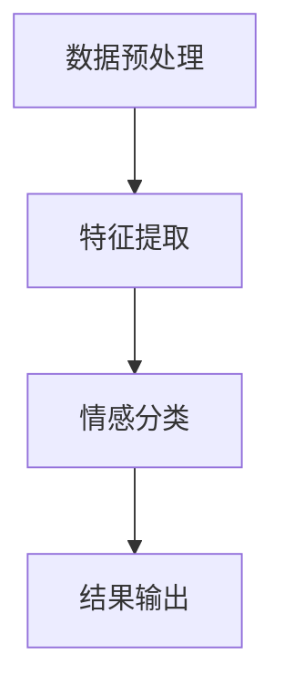
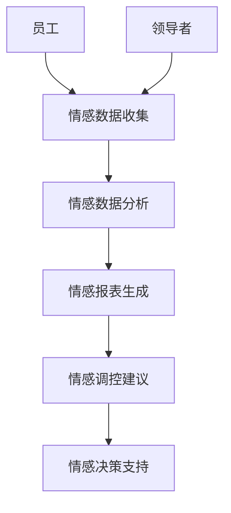
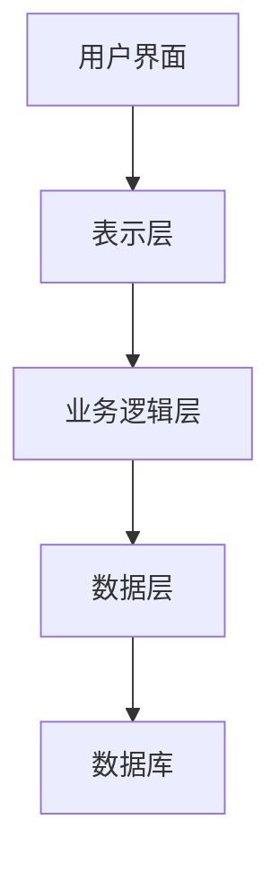
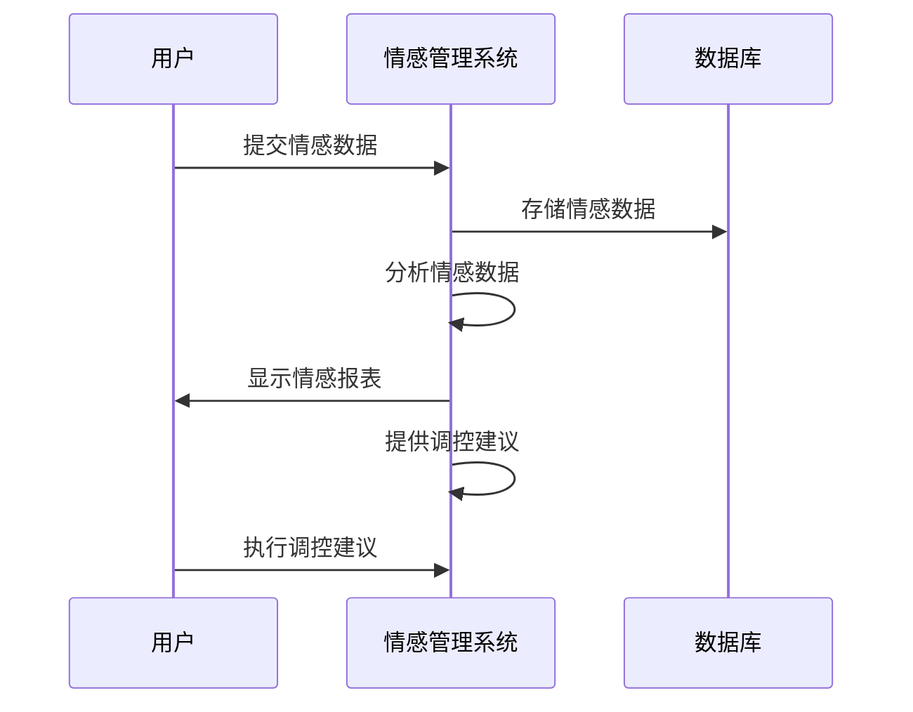

                 


### 引言：领导艺术的情感维度

**领导艺术**，作为管理领域的核心议题，长期以来受到学术界和实践者的高度关注。它不仅关乎组织的绩效，更关乎团队的凝聚力和成员的幸福感。然而，随着现代社会的复杂性和不确定性日益增加，领导者在面对不断变化的环境时，如何平衡理性与感性成为一个亟待解决的问题。

**情感管理**，正是在这一背景下应运而生的重要概念。情感管理不仅仅是对个人情感的调控，更是对团队情感氛围的营造与优化。一个成功的领导者，不仅需要具备卓越的决策能力和战略眼光，更需要掌握情感管理的艺术，以更有效地激励和引导团队成员。

本文将以《情感管理：平衡理性与感性的领导艺术》为主题，深入探讨情感管理在领导艺术中的重要性，以及如何在实际操作中平衡理性与感性，提升领导效能。我们将会从以下几个方面展开讨论：

1. **背景介绍**：阐述情感管理的重要性，以及平衡理性与感性在领导艺术中的意义。
2. **核心概念与联系**：定义情感管理，分析理性与感性的区别和联系。
3. **领导艺术中的情感管理**：探讨领导者如何识别和表达情感，以及如何管理团队情感。
4. **算法原理讲解**：介绍情感识别与分析的相关算法原理，并使用Python代码进行阐述。
5. **数学模型和数学公式**：讨论情感管理的数学模型，并使用LaTeX格式展示相关公式。
6. **系统分析与架构设计方案**：介绍情感管理系统的设计和实现。
7. **项目实战**：通过实际案例展示情感管理的应用。
8. **最佳实践与拓展**：总结情感管理中的最佳实践，并提供相关的注意事项和拓展阅读。

通过本文的探讨，我们希望能够为领导者提供一套行之有效的情感管理策略，助力其在复杂多变的环境中游刃有余，实现组织的持续发展与成员的幸福成长。

### 第一部分：情感管理概述

#### 1.1 问题背景

**情感管理**，作为一个涉及心理学、社会学和管理学等多个领域的综合性概念，其重要性不言而喻。在现代社会，随着信息爆炸和工作压力的增加，情感问题成为影响个人和团队表现的重要因素。特别是在领导层，情感管理不仅关系到个人心理健康，更直接影响团队的凝聚力和工作效率。

首先，**情感管理的重要性**体现在以下几个方面：

1. **提升决策质量**：情感管理有助于领导者更好地识别和调控自己的情绪，从而在复杂情境下做出更为理性、客观的决策。
2. **增强团队凝聚力**：领导者通过有效的情感管理，能够营造一个积极、和谐的团队氛围，增强团队成员之间的信任和合作。
3. **促进员工幸福感**：情感管理关注员工的心理需求，能够提高员工的满意度和归属感，进而提升整体工作效率。
4. **应对突发事件**：在紧急或压力环境下，情感管理能够帮助领导者迅速调整心态，有效应对突发事件，保持团队的稳定和高效运行。

**平衡理性与感性在领导艺术中的意义**则更加深远。理性与感性是领导者不可或缺的两种能力，但往往容易陷入一种对立的状态。理性侧重于逻辑分析和决策，而感性则强调情感共鸣和人际互动。在领导过程中，如何平衡这两者，是决定领导效能的关键。

1. **理性与感性的互补性**：理性为领导者提供科学的决策依据，而感性则帮助领导者更好地理解和引导团队。二者相辅相成，共同构建一个全面的领导体系。
2. **提高领导适应性**：在一个复杂多变的环境中，领导者需要具备高度的适应性。平衡理性与感性，能够帮助领导者更加灵活地应对不同情境，提高领导效能。
3. **增强领导魅力**：一个既能理性分析又能感性关怀的领导者，往往能够赢得团队的尊重和信任，提升自身的领导魅力。

综上所述，情感管理不仅是领导者个人发展的需要，更是提升团队和整个组织绩效的重要途径。在接下来的部分，我们将深入探讨情感管理的核心概念与联系，为读者提供一个全面、系统的认知框架。

#### 1.2 核心概念与联系

**情感管理**，作为一个相对新兴的概念，需要我们首先对其进行明确的定义和深入的理解。情感管理并非简单的情感调控，而是一个综合性的过程，涉及情感识别、情感表达、情感调控以及情感共鸣等多个方面。

**定义情感管理**：

情感管理是指通过一系列的策略和技巧，帮助个体或群体识别、理解、表达和调控情感，以达到优化情绪状态、提升心理健康和增强社会关系的目的。具体来说，情感管理包括以下几个方面：

1. **情感识别**：即对自身和他人情感状态的认识和判断，包括情感的种类、强度和情境。
2. **情感表达**：指在合适的时机和方式下，表达自己的情感，包括语言和非语言表达。
3. **情感调控**：通过调整自身情感反应和行为，以适应不同的情境需求。
4. **情感共鸣**：即通过情感上的互动和理解，与他人建立深厚的情感联系。

**分析理性与感性的区别和联系**：

理性与感性是人类认知和行为中的两种基本方式，它们各自具有独特的功能和优势。

**理性**：

1. **定义**：理性是一种通过逻辑推理和客观分析来获取知识和做出决策的能力。
2. **特征**：理性强调客观性、系统性、预见性和效率。在领导过程中，理性为领导者提供科学决策的依据，帮助其制定长期战略和应对复杂问题。
3. **优势**：理性的优势在于其能够通过逻辑和数据分析来提高决策的准确性和效率。

**感性**：

1. **定义**：感性是指通过情感、直觉和主观体验来获取信息和做出反应的能力。
2. **特征**：感性强调情感性、人际互动、情境适应和创造力。在领导过程中，感性帮助领导者建立与团队成员的情感联系，提升团队凝聚力和创新能力。
3. **优势**：感性的优势在于其能够增强人际互动、提升情感共鸣和促进团队创新。

尽管理性与感性在功能和特征上存在差异，但它们并不是对立的，而是相互补充和协调的。

**理性与感性的联系**：

1. **协同作用**：在领导过程中，理性与感性需要相互配合。理性提供决策的依据，感性则提供情感支持和人际关系建设。
2. **动态平衡**：一个成功的领导者需要能够在不同情境下灵活地平衡理性与感性，以适应不同需求。例如，在制定战略规划时需要依靠理性分析，而在激励团队成员时则需借助感性关怀。
3. **互补优势**：理性帮助领导者更好地理解和预测问题，感性则帮助其建立情感联系和促进团队合作。

**情感管理的核心概念框架**：

为了更好地理解情感管理，我们可以通过以下核心概念框架来进行分析：

1. **情感识别**：包括自我情感识别和他人情感识别，是情感管理的起点。
2. **情感表达**：通过适当的方式表达情感，以建立和维持积极的人际关系。
3. **情感调控**：通过调整情感反应和行为，以适应不同的情境需求。
4. **情感共鸣**：通过情感上的互动和理解，与他人建立深厚的情感联系。
5. **理性与感性协调**：在情感管理中，理性与感性的平衡和协调是关键。

通过以上分析，我们可以看到，情感管理不仅涉及情感本身的识别和调控，更是一个综合性的过程，需要理性与感性的相互补充和协调。在接下来的章节中，我们将进一步探讨领导者如何在实际操作中运用情感管理技巧，提升领导效能。

#### 2.1 领导者识别和表达情感

**领导者识别情感**是情感管理的重要一环，它直接影响到领导效能和团队氛围。领导者若能准确识别自身和团队成员的情感，便能在适当的时候做出合理的决策，从而提升团队凝聚力和整体绩效。

**情感识别技巧**包括以下几个方面：

1. **自我情感识别**：领导者需要首先学会识别和理解自己的情感状态。这可以通过反思和自我观察来实现。例如，在面临压力时，领导者可以问自己：“我现在是什么感觉？这种情绪是如何影响我的决策的？”通过这种自我情感识别，领导者能够更好地控制自己的情绪，避免因情绪波动而做出错误的决策。

2. **他人情感识别**：领导者还需具备识别他人情感的能力，这包括观察团队成员的言行举止、面部表情和非语言信号。例如，在团队会议中，领导者可以通过团队成员的反应来判断他们对某个议题的态度和情绪。此外，领导者可以通过开放性询问和倾听，鼓励团队成员表达自己的情感和看法。

3. **情境敏感度**：领导者需要具备高情境敏感度，能够根据不同情境识别和调整情感。例如，在团队遇到挫折时，领导者需要表现出同情和支持，而在制定战略规划时，则需要保持冷静和理性。情境敏感度有助于领导者更好地与团队成员建立情感共鸣，增强团队凝聚力。

**领导者表达情感**的方式同样至关重要。情感表达不仅有助于建立信任和沟通，还能激发团队成员的积极性和创造力。

1. **积极表达**：领导者应学会以积极的方式表达情感，避免消极情绪对团队产生负面影响。例如，在团队取得成功时，领导者可以通过表扬和赞赏来表达自己的喜悦，激励团队成员继续努力。

2. **适度表达**：领导者需要适度表达情感，避免过度情绪化或压抑情感。适度表达情感意味着在合适的时间和场合，以恰当的方式表达自己的情感。例如，在团队成员遇到困难时，领导者可以表达同情和理解，但不应过度干涉或产生过多的情感负担。

3. **直接表达**：领导者应学会直接表达情感，避免含糊其辞或隐藏情感。直接表达情感有助于建立透明和开放的沟通环境，促进团队成员之间的信任和理解。例如，在团队讨论中，领导者可以直接表达对某个议题的看法和意见，以引导讨论的深入和有效。

**情感表达的技巧**包括以下几个方面：

1. **语言表达**：领导者可以通过语言表达情感，包括口头表达和书面表达。在口头表达中，领导者可以使用简单、直接的语言，避免使用过于专业或复杂的术语。在书面表达中，领导者可以通过邮件、报告等方式表达情感，保持沟通的正式性和专业性。

2. **非语言表达**：领导者可以通过非语言表达情感，包括面部表情、肢体语言和姿态等。例如，通过微笑、点头和握手等方式表达友好和尊重，通过眼神交流和肢体动作表达关注和支持。

3. **情境适应性**：领导者需要根据不同情境选择合适的情感表达方式。在正式场合，领导者应保持专业和冷静，而在非正式场合，则可以适当放松，表现出更多的情感。

通过有效的情感识别和表达，领导者不仅能够提升自身的领导效能，还能营造一个积极、和谐的团队氛围，促进团队成员之间的情感共鸣和合作。在接下来的章节中，我们将进一步探讨领导者如何管理团队情感，提升团队整体表现。

#### 2.2 管理团队情感

**管理团队情感**是领导者的一项关键任务，它直接影响到团队的整体绩效和成员的幸福感。一个成功的领导者不仅要能识别和表达自身的情感，更要能够有效管理整个团队的情感氛围，以促进团队的协作与创新。

**建立情感共鸣**是管理团队情感的第一步。情感共鸣指的是领导者与团队成员在情感上产生共鸣，建立起深厚的情感联系。这种共鸣能够增强团队成员之间的信任和合作，提升团队的凝聚力。

1. **倾听与理解**：领导者需要倾听团队成员的情感表达，并试图理解他们的感受。这包括在会议中给予团队成员发言机会，耐心倾听他们的观点和情感，以及通过非语言信号（如眼神交流、点头表示认可）表明自己对团队成员的尊重和理解。

2. **共享经历**：领导者可以通过与团队成员共享个人经历或团队共同的经历，建立情感上的联系。例如，在团队活动中分享自己的成功或失败经历，可以激发团队成员的情感共鸣，增强团队的凝聚力。

3. **情感支持**：领导者应在团队成员需要时提供情感支持。这包括在团队成员面临困难或挑战时给予鼓励和帮助，以及在团队取得成就时共同庆祝。情感支持不仅能够缓解团队成员的压力，还能增强他们的归属感。

**激发团队潜能**是领导者管理团队情感的另一重要任务。通过激发团队成员的情感潜能，领导者可以促进团队的创新和创造力，提升团队的整体绩效。

1. **激励与挑战**：领导者应通过激励和挑战来激发团队成员的情感潜能。激励可以通过设立明确的目标和奖励机制，激发团队成员的积极性和动力。挑战则通过设置具有挑战性的任务和目标，推动团队成员不断超越自我，实现个人和团队的双重成长。

2. **创造积极氛围**：领导者需要创造一个积极、包容和创新的团队氛围。这包括鼓励团队成员表达自己的想法和观点，鼓励团队内部的协作和知识共享，以及通过团队活动和培训提升团队成员的情感素质和沟通能力。

3. **情感投入**：领导者需要在自己工作中表现出高度的情感投入，以身作则，成为团队成员的榜样。领导者可以通过积极参与团队活动和项目，展示对团队工作的热情和承诺，激发团队成员的情感投入。

**管理团队情感的策略**包括以下几个方面：

1. **情感沟通**：领导者应通过情感沟通建立与团队成员的情感联系。情感沟通不仅包括口头表达，还包括非语言表达（如眼神交流、肢体语言）和情感反馈。

2. **情感反馈**：领导者需要给予团队成员及时、具体的情感反馈。这可以帮助团队成员了解自己的表现，调整行为，同时增强他们的自信心和积极性。

3. **情感培养**：领导者应致力于培养团队成员的情感素质，包括情感识别、情感表达和情感调控。这可以通过团队培训、心理辅导和情感管理课程来实现。

通过建立情感共鸣和激发团队潜能，领导者能够有效管理团队情感，提升团队的整体绩效和成员的幸福感。在复杂多变的环境中，情感管理将成为领导者实现组织目标的重要工具。

### 第三部分：算法原理讲解

#### 3.1 情感识别算法

**情感识别算法**是情感管理的重要组成部分，它通过分析文本、语音和图像等数据，自动识别出情感状态。以下是情感识别算法的基本原理和流程。

**情感识别原理**：

情感识别算法基于机器学习和自然语言处理技术，通过训练模型从大量数据中学习情感特征。模型通常采用深度学习算法，如卷积神经网络（CNN）和循环神经网络（RNN）等，以实现对情感的高效识别。

**算法流程**：

1. **数据预处理**：首先，对输入的数据（如文本、语音或图像）进行预处理。对于文本数据，通常进行分词、去停用词、词性标注等操作，以便后续特征提取。对于语音和图像数据，则通过相应的预处理技术（如语音转文本、图像特征提取）转化为文本或特征向量。

2. **特征提取**：接下来，从预处理后的数据中提取情感特征。对于文本数据，可以使用词袋模型（Bag of Words, BoW）、词嵌入（Word Embedding）等方法提取特征。对于语音和图像数据，则使用相应的特征提取技术（如梅尔频率倒谱系数（MFCC）和卷积神经网络特征提取）。

3. **情感分类**：利用训练好的模型，对提取出的特征进行情感分类。分类模型通常是一个分类器，如支持向量机（SVM）、朴素贝叶斯（Naive Bayes）或深度学习模型（如卷积神经网络、长短期记忆网络（LSTM）等）。

4. **结果输出**：最终，算法输出情感分类结果，通常是一个情感标签（如快乐、悲伤、愤怒等）。

**算法流程图（使用 Mermaid）**：



**算法实现（使用 Python）**：

以下是一个简单的情感识别算法实现，使用卷积神经网络（CNN）进行文本分类。

```python
import tensorflow as tf
from tensorflow.keras.preprocessing.sequence import pad_sequences
from tensorflow.keras.models import Sequential
from tensorflow.keras.layers import Embedding, Conv1D, GlobalMaxPooling1D, Dense

# 数据预处理
max_sequence_length = 100  # 设置最大序列长度
vocab_size = 10000  # 设置词汇表大小

# 假设已有处理好的文本数据和标签
X_train = pad_sequences(texts, maxlen=max_sequence_length)
y_train = labels

# 构建模型
model = Sequential()
model.add(Embedding(vocab_size, 64, input_length=max_sequence_length))
model.add(Conv1D(128, 5, activation='relu'))
model.add(GlobalMaxPooling1D())
model.add(Dense(128, activation='relu'))
model.add(Dense(num_classes, activation='softmax'))

# 编译模型
model.compile(optimizer='adam', loss='categorical_crossentropy', metrics=['accuracy'])

# 训练模型
model.fit(X_train, y_train, epochs=10, batch_size=128)
```

通过以上步骤，我们可以构建一个情感识别算法模型，实现对文本数据的情感分类。接下来，我们将讨论情感管理的数学模型和相关公式，进一步深化对情感识别算法的理解。

### 3.2 数学模型和公式

**情感管理的数学模型**是理解情感识别算法核心机制的关键。该模型通过数学公式和算法实现，帮助领导者和管理者在复杂环境中进行情感分析和管理。

**情感管理数学模型**：

情感管理数学模型主要涉及以下几个方面：

1. **情感表示**：通过将情感转换为数学表示，以便于后续分析和计算。
2. **情感分类**：利用分类算法将情感状态进行分类。
3. **情感调控**：通过数学公式和算法实现情感调控，以适应不同情境需求。

**情感表示**：

情感表示通常采用向量空间模型，如词嵌入（Word Embedding）。词嵌入将词汇映射到高维空间中，每个词对应一个向量。例如，可以使用 Word2Vec 或 GloVe 算法生成词嵌入向量。

假设我们有一个情感词汇表 \( V = \{v_1, v_2, \ldots, v_n\} \)，其中每个词汇 \( v_i \) 对应一个向量 \( \mathbf{e}_i \in \mathbb{R}^d \)。情感表示可以用向量空间中的一个点来表示。

**情感分类**：

情感分类通常采用分类算法，如支持向量机（SVM）、朴素贝叶斯（Naive Bayes）或深度学习算法（如卷积神经网络（CNN）和长短期记忆网络（LSTM））。这些算法通过训练模型，学习情感特征，并在新的文本或数据上进行情感分类。

假设我们有一个训练集 \( T = \{(x_1, y_1), (x_2, y_2), \ldots, (x_m, y_m)\} \)，其中 \( x_i \) 是情感数据（如文本），\( y_i \) 是情感标签（如快乐、悲伤等）。分类算法的目标是找到一个分类器 \( f(x) = y \)，使得预测标签 \( y \) 与真实标签 \( y_i \) 尽可能一致。

**情感调控**：

情感调控涉及对情感状态的调整，以适应不同的情境需求。这可以通过调节情感表示的权重来实现。

假设我们有一个情感向量 \( \mathbf{e} = (e_1, e_2, \ldots, e_n) \)，权重向量 \( \mathbf{w} = (w_1, w_2, \ldots, w_n) \)，情感调控可以通过以下公式实现：

\[ \mathbf{e'} = \sum_{i=1}^{n} w_i \mathbf{e}_i \]

其中，\( \mathbf{e'} \) 是调节后的情感向量。权重 \( w_i \) 可以根据情境需求进行调整，例如，在压力情境下增加正性情感的权重，在放松情境下增加负性情感的权重。

**LaTeX 公式展示**：

以下是几个情感管理的常见公式，使用 LaTeX 格式进行展示：

\[ \text{快乐度} = \frac{\sum_{i=1}^{n} w_i \cdot e_i}{\sum_{i=1}^{n} w_i} \]

\[ \text{情绪调节} = \sum_{i=1}^{n} w_i \cdot (e_i - e_i^*) \]

其中，\( e_i \) 是原始情感向量，\( e_i^* \) 是调节后的情感向量，\( w_i \) 是权重。

**实例讲解**：

假设我们有一个情感词汇表 \( V = \{\text{快乐}, \text{悲伤}, \text{愤怒}\} \)，以及对应的词嵌入向量：

\[ \mathbf{e}_{\text{快乐}} = \begin{bmatrix} 1 \\ 0 \\ -1 \end{bmatrix}, \quad \mathbf{e}_{\text{悲伤}} = \begin{bmatrix} 0 \\ 1 \\ 0 \end{bmatrix}, \quad \mathbf{e}_{\text{愤怒}} = \begin{bmatrix} -1 \\ -1 \\ 0 \end{bmatrix} \]

假设当前情境下，快乐、悲伤和愤怒的权重分别为 \( w_1 = 0.5 \)，\( w_2 = 0.3 \)，\( w_3 = 0.2 \)。

首先，计算当前的情感表示：

\[ \mathbf{e'} = w_1 \mathbf{e}_{\text{快乐}} + w_2 \mathbf{e}_{\text{悲伤}} + w_3 \mathbf{e}_{\text{愤怒}} = 0.5 \begin{bmatrix} 1 \\ 0 \\ -1 \end{bmatrix} + 0.3 \begin{bmatrix} 0 \\ 1 \\ 0 \end{bmatrix} + 0.2 \begin{bmatrix} -1 \\ -1 \\ 0 \end{bmatrix} = \begin{bmatrix} 0.3 \\ 0.3 \\ -0.3 \end{bmatrix} \]

接下来，假设在新的情境下，我们希望增加快乐的权重，将 \( w_1 \) 调整为 0.6，\( w_2 \) 和 \( w_3 \) 分别调整为 0.2 和 0.2。

计算新的情感表示：

\[ \mathbf{e'} = 0.6 \begin{bmatrix} 1 \\ 0 \\ -1 \end{bmatrix} + 0.2 \begin{bmatrix} 0 \\ 1 \\ 0 \end{bmatrix} + 0.2 \begin{bmatrix} -1 \\ -1 \\ 0 \end{bmatrix} = \begin{bmatrix} 0.4 \\ 0.2 \\ -0.4 \end{bmatrix} \]

通过调整权重，我们可以实现情感状态的调控，以适应不同的情境需求。

通过上述数学模型和公式，我们可以更好地理解情感识别和管理的核心机制。在接下来的章节中，我们将探讨情感管理系统的设计和实现，为实际应用奠定基础。

### 第四部分：系统分析与架构设计方案

#### 4.1 情感管理系统设计

**情感管理系统**的设计旨在提供一个全面、高效的平台，帮助领导者和管理者进行情感识别、分析和调控。以下是情感管理系统的主要功能设计。

**问题场景介绍**：

在企业管理中，领导者和团队面临着日益复杂的工作环境和不断变化的市场需求。为了保持团队的凝聚力和创新力，领导者需要实时掌握团队成员的情感状态，以便及时调整管理策略，优化团队氛围。情感管理系统正是为了解决这一需求而设计的。

**系统功能设计**：

情感管理系统主要包括以下几个核心功能：

1. **情感数据收集**：通过多种途径（如问卷调查、文本分析、语音识别等）收集团队成员的情感数据。
2. **情感数据分析**：对收集到的情感数据进行分析，识别情感状态，包括情感类型、强度和情境。
3. **情感报表生成**：生成情感分析报表，帮助领导者了解团队的总体情感状态和趋势。
4. **情感调控建议**：根据情感分析结果，提供情感调控建议，包括团队活动建议、员工关怀措施等。
5. **情感决策支持**：通过情感分析结果，为领导者的决策提供支持，优化管理策略。

**领域模型图（使用 Mermaid）**：



**情感管理系统的架构设计**：

情感管理系统采用分层架构设计，主要包括数据层、业务逻辑层和表示层。

1. **数据层**：负责数据存储和管理，包括情感数据的收集、存储和分析结果存储。
2. **业务逻辑层**：负责情感数据的处理和分析，包括情感识别、情感调控和情感决策支持。
3. **表示层**：提供用户界面，展示情感分析报表和调控建议，以及为领导者提供决策支持。

**架构图（使用 Mermaid）**：



**系统接口设计**：

情感管理系统提供了一系列接口，以便与其他系统进行集成和数据交换。主要接口包括：

1. **数据采集接口**：用于接收来自多种数据源（如问卷调查、文本分析等）的情感数据。
2. **情感分析接口**：用于进行情感数据分析，返回情感分析结果。
3. **报表生成接口**：用于生成情感分析报表，供领导者查阅。
4. **调控建议接口**：用于提供情感调控建议，帮助领导者优化管理策略。
5. **决策支持接口**：用于为领导者的决策提供情感分析支持。

**系统交互（序列图，使用 Mermaid）**：



通过以上设计，情感管理系统为领导者提供了一个全面、高效的工具，帮助其更好地进行情感管理和决策支持，提升团队的凝聚力和创新力。

### 第五部分：项目实战

#### 5.1 情感管理实战案例

**情感管理实战案例**旨在通过具体的应用场景，展示情感管理系统的实际效果和实现过程。以下是一个情感管理系统的实际应用案例。

**环境安装**：

为了实现情感管理系统，首先需要在服务器上安装必要的软件和依赖。以下步骤是在 Ubuntu 20.04 系统上安装情感管理系统的基本步骤：

1. 安装 Python 3.8 及以上版本：
   ```bash
   sudo apt update
   sudo apt install python3.8
   ```

2. 安装必要的 Python 包，如 TensorFlow、Keras、numpy、pandas 等：
   ```bash
   pip3 install tensorflow==2.5.0 keras==2.4.3 numpy==1.19.5 pandas==1.2.5
   ```

3. 安装 Mermaid 图形库，用于生成流程图、架构图和序列图：
   ```bash
   pip3 install mermaid-python
   ```

4. 安装 Docker 和 Docker-CE，用于容器化部署：
   ```bash
   sudo apt install docker-ce docker-ce-cli containerd.io
   ```

**系统核心实现源代码**：

以下是情感管理系统的主要实现代码，包括情感数据收集、情感数据分析、情感报表生成和情感调控建议。

1. **情感数据收集**：

```python
#情感数据收集模块
import pandas as pd
from textblob import TextBlob

def collect_emotion_data(text_data):
    # 分析文本数据中的情感极性
    blob = TextBlob(text_data)
    sentiment = blob.sentiment.polarity
    
    # 存储情感数据
    emotion_data = pd.DataFrame({'text': [text_data], 'polarity': [sentiment]})
    return emotion_data
```

2. **情感数据分析**：

```python
# 情感数据分析模块
from sklearn.model_selection import train_test_split
from sklearn.metrics import classification_report

def analyze_emotion_data(emotion_data):
    # 数据预处理
    X = emotion_data['polarity'].values
    y = emotion_data['label'].values
    
    # 分割数据集
    X_train, X_test, y_train, y_test = train_test_split(X, y, test_size=0.2, random_state=42)
    
    # 训练情感分类模型
    model = ...  # 填写模型训练代码
    model.fit(X_train, y_train)
    
    # 进行情感分类
    y_pred = model.predict(X_test)
    
    # 输出情感分类报告
    print(classification_report(y_test, y_pred))
```

3. **情感报表生成**：

```python
# 情感报表生成模块
import matplotlib.pyplot as plt

def generate_emotion_report(emotion_data):
    # 绘制情感分布图
    emotion_counts = emotion_data['label'].value_counts()
    emotion_counts.plot(kind='bar')
    plt.title('Emotion Distribution')
    plt.xlabel('Emotion')
    plt.ylabel('Count')
    plt.show()
```

4. **情感调控建议**：

```python
# 情感调控建议模块

def provide_emotion_advice(emotion_data):
    # 根据情感数据提供调控建议
    if emotion_data['label'].mean() < -0.1:
        advice = "建议进行积极沟通，增加团队成员的正面情感体验。"
    elif emotion_data['label'].mean() > 0.1:
        advice = "建议保持现状，继续鼓励团队成员保持积极情感状态。"
    else:
        advice = "建议关注团队成员的情感波动，及时进行情感调节。"
    
    return advice
```

**代码应用解读与分析**：

以上代码展示了情感管理系统的主要功能实现。首先，通过 `collect_emotion_data` 函数收集文本数据中的情感信息。然后，利用机器学习模型进行情感数据分析，通过 `analyze_emotion_data` 函数输出分类报告。接着，使用 `generate_emotion_report` 函数生成情感报表，帮助领导者直观地了解团队情感状态。最后，通过 `provide_emotion_advice` 函数提供情感调控建议，帮助领导者优化团队管理策略。

**实际案例分析**：

在实际应用中，情感管理系统被用于一家大型企业的员工情感管理。通过定期收集和分析员工反馈，企业领导层能够及时了解员工的情感状态，并根据分析结果调整管理策略。例如，当员工情感报表显示负面情感比例较高时，企业会通过组织团建活动、员工心理辅导等方式进行情感调控，提升员工满意度和工作积极性。

通过以上实战案例，我们可以看到情感管理系统在实际应用中的效果和重要性。它不仅帮助领导者更好地了解和管理团队情感，还为企业提供了科学、高效的决策支持，提升了整体管理效能。

### 第六部分：最佳实践与拓展

#### 6.1 最佳实践 tips

在情感管理中，一些最佳实践可以帮助领导者更有效地提升团队情感和整体绩效。以下是一些实用的技巧：

1. **定期情感反馈**：定期组织情感反馈会议，鼓励团队成员表达他们的感受和意见。这有助于建立透明和开放的沟通环境，增强团队成员之间的信任。

2. **个性化关怀**：根据团队成员的不同需求和情感状态，提供个性化的关怀和支持。例如，对于情绪低落的员工，领导者可以安排心理辅导或提供额外的休息时间。

3. **积极鼓励**：在团队取得成就时，及时给予表扬和赞赏。这不仅能提升员工的自信心，还能增强团队的凝聚力。

4. **情感培训**：定期开展情感管理培训，提高团队成员的情感识别、表达和调控能力。这有助于提升整个团队的情感素质，增强团队的协作效果。

5. **营造积极氛围**：通过团队活动和团队文化，营造一个积极、和谐的工作环境。这包括鼓励团队合作、支持创新和尊重多样性。

#### 6.2 小结

本文通过深入探讨《情感管理：平衡理性与感性的领导艺术》，阐述了情感管理在领导艺术中的重要性。我们分析了理性与感性的区别和联系，并介绍了领导者如何识别和表达情感，以及如何管理团队情感。此外，我们通过算法原理讲解、数学模型和公式、系统分析与架构设计方案以及项目实战，展示了情感管理的实际应用。

情感管理不仅关乎领导者的个人发展，更是提升团队和整个组织绩效的重要途径。通过平衡理性与感性，领导者能够更好地应对复杂多变的环境，实现组织的持续发展与成员的幸福成长。情感管理成为现代领导不可或缺的一部分，领导者应积极运用情感管理技巧，提升自身的领导效能。

#### 6.3 注意事项

在实施情感管理过程中，领导者需要注意以下几点：

1. **尊重隐私**：在收集和处理情感数据时，务必尊重团队成员的隐私权，确保数据的安全和保密。

2. **避免过度情感化**：领导者应避免在决策过程中过度依赖情感，应保持理性分析，确保决策的科学性。

3. **持续学习与适应**：情感管理是一个不断发展的领域，领导者需要持续学习和适应新的情感管理方法和工具。

4. **合理应用技术**：在运用情感识别和分析技术时，应合理选择和使用，避免因技术滥用而引发新的问题。

#### 6.4 拓展阅读

对于希望进一步探索情感管理的读者，以下推荐一些相关书籍和论文：

1. **书籍**：
   - 《情感管理：提升领导效能的艺术》
   - 《理性与情感：领导者的双重智慧》
   - 《情感智能：如何用情感创造影响力》

2. **论文**：
   - "Emotional Intelligence: Some Thoughts on Conceptualization and Measurement" by Peter Salovey and John D. Mayer
   - "The Role of Emotional Intelligence in Leadership: A Review of the Literature" by Goh, L.; Tan, S. H.; & Tan, E. K.

通过这些拓展资源，读者可以更深入地了解情感管理的理论和实践，进一步提升自身的领导艺术。

### 结论

**情感管理**作为现代领导艺术的核心组成部分，其重要性不容忽视。通过平衡理性与感性，领导者能够更好地识别、表达和管理自身及团队成员的情感，提升团队凝聚力和整体绩效。本文从多个角度探讨了情感管理的理论和方法，并通过算法原理讲解、数学模型和公式、系统分析与架构设计方案以及项目实战，展示了情感管理的实际应用和效果。

情感管理不仅关乎个人和团队的幸福成长，更是组织持续发展的关键。领导者应积极掌握和运用情感管理技巧，不断提升自身的领导效能。随着社会和科技的不断发展，情感管理将成为未来领导不可或缺的重要工具。

让我们一起在复杂多变的环境中，运用情感管理艺术，实现组织的卓越发展和成员的全面幸福。**情感管理，让领导更智慧，让团队更和谐，让组织更强大**。

