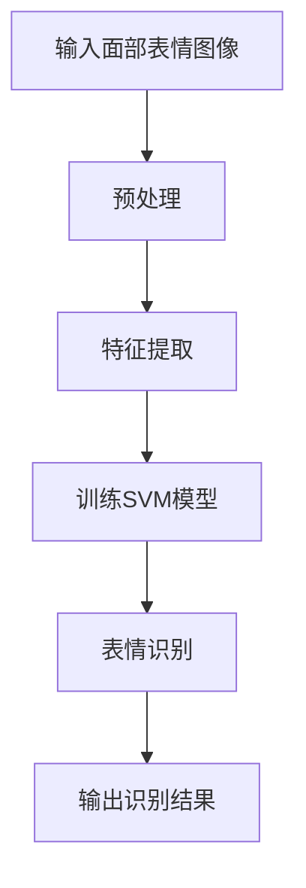
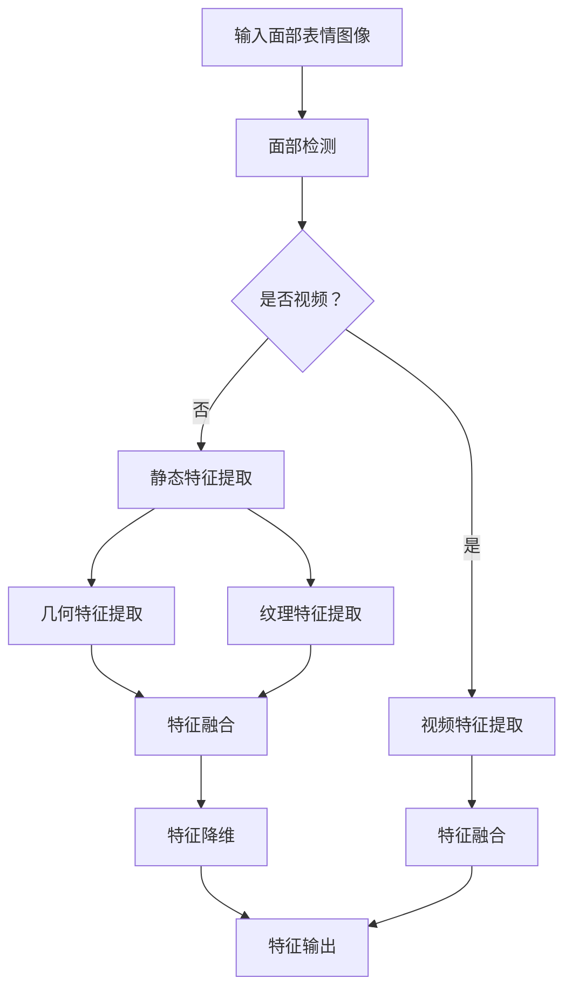
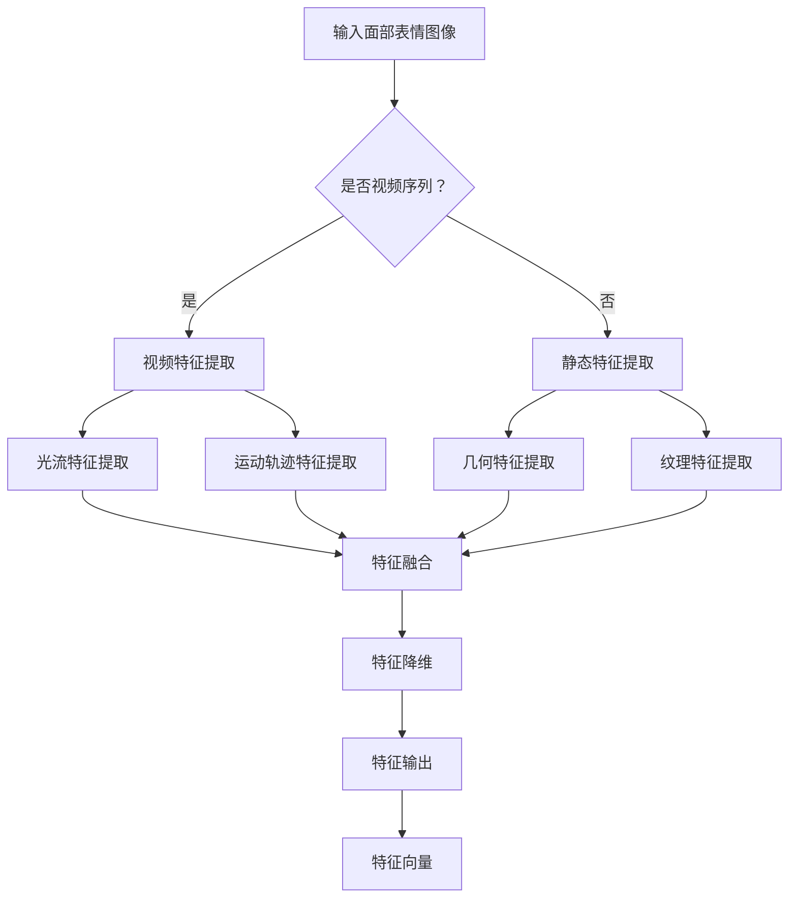
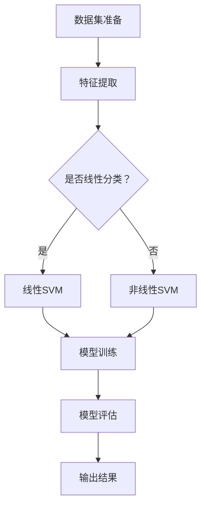
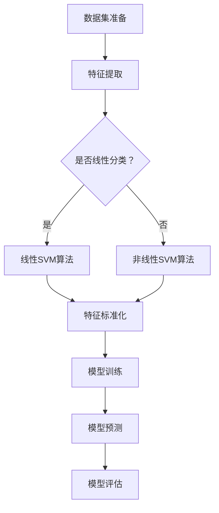
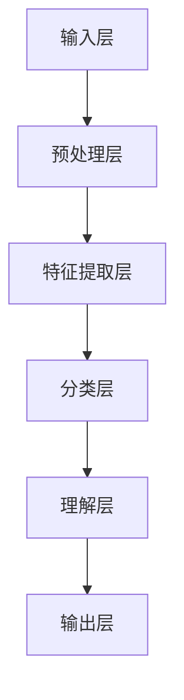
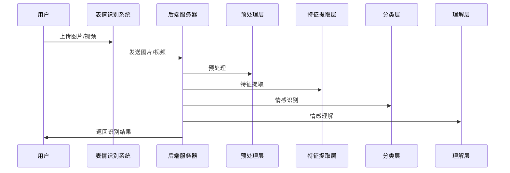

                 

## 第1章：情感计算概述

### 1.1 情感计算的定义与发展历程

#### 情感计算的定义

情感计算（Affective Computing）是指计算机系统模拟、识别、理解以及处理人类情感的能力。它结合了计算机科学、心理学、认知科学、人机交互等多个领域的研究成果，旨在使计算机能够更好地适应人类情感和社会环境。

#### 情感计算的发展历程

情感计算的研究可以追溯到20世纪80年代，当时计算机科学家和心理学家开始探索如何让计算机感知和理解人类的情感。以下是其发展历程的几个重要阶段：

1. **早期探索阶段（1980s）**
   在这一阶段，科学家们提出了情感计算的概念，并开始研究如何通过面部表情、语音、生理信号等方式识别人类的情感状态。

2. **基础理论阶段（1990s）**
   随着认知科学和心理学的进展，情感计算开始形成一些基本理论，如情感模型、情感识别算法等。

3. **技术进步阶段（2000s）**
   随着机器学习、神经网络等人工智能技术的快速发展，情感计算开始采用更为复杂的算法，如支持向量机、深度学习等，以提高情感识别的准确性和效率。

4. **应用拓展阶段（2010s至今）**
   在这一阶段，情感计算的应用领域得到极大拓展，包括智能助手、心理健康监测、人机交互等。同时，随着物联网、大数据等技术的发展，情感计算在智能家居、智能交通、智能医疗等领域也得到了广泛应用。

#### 情感计算的核心概念与重要性

情感计算的核心概念包括情感状态、情感识别、情感理解和情感表达等。以下分别进行介绍：

1. **情感状态**
   情感状态是指个体在某一时刻的情感体验，包括情绪、情感、情感反应等。

2. **情感识别**
   情感识别是指通过分析面部表情、语音、文本等信息来识别人类的情感状态。情感识别是情感计算的基础。

3. **情感理解**
   情感理解是指计算机对情感状态的深入分析和理解，包括情感分类、情感强度估计等。

4. **情感表达**
   情感表达是指计算机根据情感状态生成相应的情感反应，如语音、文本、面部表情等。

情感计算的重要性体现在以下几个方面：

1. **提升人机交互体验**
   情感计算可以使计算机更好地理解人类情感，从而提供更个性化的交互体验。

2. **心理健康监测与治疗**
   情感计算可以用于心理健康领域，如通过情感识别和情感理解来监测和评估个体的情感状态，为心理健康诊断和治疗提供支持。

3. **市场研究与用户行为分析**
   情感计算可以帮助企业了解消费者的情感状态，从而进行更精准的市场研究和用户行为分析。

4. **智能系统的情感化设计**
   情感计算可以应用于智能系统，如智能助理、智能家电等，使其更具有人性化，提高用户满意度。

### 1.2 支持向量机基础

#### 支持向量机的概念与原理

支持向量机（Support Vector Machine，SVM）是一种广泛应用于分类和回归问题的机器学习算法。其基本原理是寻找一个最优的超平面，将不同类别的数据点分开，并使分类边界距离最近的那些点（支持向量）到超平面的距离最大化。

SVM的数学模型可以表示为：

$$
\min_w \frac{1}{2} ||w||^2  + C \sum_{i=1}^n \xi_i
$$

其中，$w$是超平面参数，$C$是惩罚参数，$\xi_i$是松弛变量。

SVM的分类规则为：

$$
y_i (\textbf{w} \cdot \textbf{x_i} + b) \geq 1
$$

其中，$y_i$是样本$i$的真实标签，$\textbf{x_i}$是样本$i$的特征向量，$\textbf{w}$是超平面参数，$b$是偏置项。

#### 支持向量机的分类算法

SVM主要用于分类问题，其分类算法可以分为以下几种：

1. **线性SVM（Linear SVM）**
   线性SVM适用于特征空间线性可分的情况，其目标是找到最优的超平面。

2. **非线性SVM（Non-linear SVM）**
   非线性SVM通过核函数将特征空间映射到高维空间，使原本线性不可分的数据在映射后的高维空间中可分。

3. **软 margin SVM（Soft Margin SVM）**
   软 margin SVM允许模型对一些分类错误的样本进行容忍，通过引入惩罚参数$C$来平衡错误率与模型复杂度。

#### 支持向量机的回归算法

除了分类问题，SVM还可以用于回归问题，称为支持向量回归（Support Vector Regression，SVR）。SVR的目标是找到一个最优的超平面，使得预测值与实际值之间的误差最小。

SVR的数学模型可以表示为：

$$
\min_w \frac{1}{2} ||w||^2 + C \sum_{i=1}^n (\omega_i + \xi_i)
$$

其中，$\omega_i$是误差项，$\xi_i$是松弛变量。

SVR的回归规则为：

$$
\textbf{y_i} = \textbf{w} \cdot \textbf{x_i} + b
$$

其中，$\textbf{y_i}$是样本$i$的实际值，$\textbf{x_i}$是样本$i$的特征向量，$\textbf{w}$是超平面参数，$b$是偏置项。

#### 支持向量机在情感计算中的应用

支持向量机在情感计算中有着广泛的应用，主要用于情感识别和情感理解。

1. **情感识别**
   通过将面部表情、语音、文本等特征输入到SVM分类模型中，可以实现对用户情感状态的识别。例如，通过分析用户的语音信号，可以识别出用户是否处于愤怒、喜悦、悲伤等情绪状态。

2. **情感理解**
   通过对情感识别的结果进行深入分析，可以理解用户的情感状态，并进行相应的情感反馈。例如，在智能助手应用中，根据用户的情感状态，可以调整对话的语气和风格，提供更个性化的服务。

### 1.3 支持向量机在情感计算中的应用

#### 支持向量机在情感计算中的应用

支持向量机（SVM）作为一种强大的机器学习算法，在情感计算中有着广泛的应用。主要应用于情感识别和情感理解，下面将详细探讨这些应用。

##### 情感识别

情感识别是情感计算中的基本任务，旨在通过分析用户的语音、面部表情、文本等数据，识别人类的情感状态。SVM在情感识别中扮演了重要的角色，其强大的分类能力使其成为情感识别的首选算法之一。

1. **面部表情识别**
   面部表情是人类情感表达的重要方式。通过分析面部表情图像，可以识别出用户的情感状态。SVM可以通过训练分类模型，将不同情感状态的面部图像进行分类。例如，通过训练一个二分类模型，可以识别出用户是处于开心、愤怒、悲伤等情感状态。

2. **语音情感识别**
   语音是人类交流的主要方式之一，语音中的情感信息可以通过声学特征进行提取。SVM可以通过分析这些特征，识别出用户的情感状态。例如，通过分析用户的语音信号中的音高、音强、语调等特征，可以识别出用户是否处于兴奋、沮丧等情感状态。

3. **文本情感识别**
   文本是情感表达的重要媒介。通过分析文本中的情感词、情感句等，可以识别出用户的情感状态。SVM可以通过训练分类模型，对文本进行情感分类。例如，通过训练一个二分类模型，可以识别出用户是处于正面情感还是负面情感。

##### 情感理解

情感理解是情感计算中的高级任务，旨在对用户的情感状态进行深入分析，理解其情感背后的原因和情感强度。SVM在情感理解中也有着广泛的应用。

1. **情感强度估计**
   在情感识别的基础上，SVM可以用于估计情感的强度。通过分析用户的情感状态和情感强度特征，可以识别出用户的情感强度。例如，通过分析用户的语音信号中的音高、音强、语调等特征，可以估计出用户情感的强度。

2. **情感状态追踪**
   在实时交互场景中，SVM可以用于追踪用户的情感状态。通过连续分析用户的情感状态，可以识别出用户情感的变化趋势。例如，在在线教育场景中，通过分析学生的语音和文本情感状态，可以识别出学生情感的变化，从而调整教学策略。

3. **情感关联分析**
   在复杂的应用场景中，SVM可以用于分析情感关联。通过分析不同情感状态之间的关联，可以识别出情感之间的联系。例如，在社交媒体分析中，通过分析用户情感状态之间的关联，可以识别出用户情感传播的规律。

### 总结

支持向量机（SVM）在情感计算中有着广泛的应用，主要应用于情感识别和情感理解。通过面部表情、语音、文本等数据的分析，SVM可以实现对用户情感状态的识别和理解。在情感识别中，SVM通过分类算法将不同情感状态进行分类；在情感理解中，SVM通过回归算法对情感强度进行估计，并对情感状态进行追踪和分析。SVM在情感计算中的应用不仅提高了情感计算的准确性和效率，也为情感计算的实际应用提供了有力的技术支持。

---

### 第2章：支持向量机基础

#### 2.1 支持向量机的概念与原理

支持向量机（Support Vector Machine，SVM）是一种强大的机器学习算法，广泛应用于分类和回归问题。SVM的基本原理是通过找到一个最优的超平面，将不同类别的数据点分开，并使分类边界距离最近的那些点（支持向量）到超平面的距离最大化。这一过程可以通过求解一个优化问题来实现，即找到一个最优解使得分类边界最大化。

**数学模型**

首先，我们来看SVM的数学模型：

$$
\min_{w,b} \frac{1}{2} ||w||^2 + C \sum_{i=1}^n (\xi_i)
$$

其中，$w$是超平面参数，$b$是偏置项，$C$是惩罚参数，$\xi_i$是松弛变量。这个优化问题的目标是找到最优的$w$和$b$，使得分类边界最大化。

**分类规则**

在SVM中，分类规则可以表示为：

$$
y_i (\textbf{w} \cdot \textbf{x_i} + b) \geq 1
$$

其中，$y_i$是样本$i$的真实标签，$\textbf{x_i}$是样本$i$的特征向量，$\textbf{w}$是超平面参数，$b$是偏置项。

**线性SVM**

线性SVM适用于特征空间线性可分的情况。其目标是在特征空间中找到一个最优的超平面，将不同类别的数据点分开。

**非线性SVM**

非线性SVM通过核函数将特征空间映射到高维空间，使得原本线性不可分的数据在映射后的高维空间中可分。常用的核函数包括线性核、多项式核、径向基函数（RBF）核等。

#### 2.2 支持向量机的分类算法

SVM主要用于分类问题，其分类算法可以分为以下几种：

1. **线性SVM（Linear SVM）**

线性SVM适用于特征空间线性可分的情况，其目标是找到最优的超平面，将不同类别的数据点分开。

2. **非线性SVM（Non-linear SVM）**

非线性SVM通过核函数将特征空间映射到高维空间，使原本线性不可分的数据在映射后的高维空间中可分。

3. **软 margin SVM（Soft Margin SVM）**

软 margin SVM允许模型对一些分类错误的样本进行容忍，通过引入惩罚参数$C$来平衡错误率与模型复杂度。

**线性SVM分类算法**

线性SVM的分类算法可以表示为：

$$
\min_{w,b} \frac{1}{2} ||w||^2 + C \sum_{i=1}^n (\xi_i)
$$

其中，$w$是超平面参数，$b$是偏置项，$C$是惩罚参数，$\xi_i$是松弛变量。

**分类规则**

线性SVM的分类规则为：

$$
y_i (\textbf{w} \cdot \textbf{x_i} + b) \geq 1
$$

其中，$y_i$是样本$i$的真实标签，$\textbf{x_i}$是样本$i$的特征向量，$\textbf{w}$是超平面参数，$b$是偏置项。

**非线性SVM分类算法**

非线性SVM的分类算法可以通过核函数将特征空间映射到高维空间，使其在映射后的高维空间中可分。

**分类规则**

非线性SVM的分类规则为：

$$
y_i (\text{K}(\textbf{x_i}, \textbf{x_j}) + b) \geq 1
$$

其中，$K(\textbf{x_i}, \textbf{x_j})$是核函数，$y_i$是样本$i$的真实标签，$\textbf{x_i}$是样本$i$的特征向量，$b$是偏置项。

**软 margin SVM分类算法**

软 margin SVM的分类算法在原线性SVM的基础上引入了惩罚参数$C$，允许模型对一些分类错误的样本进行容忍。

$$
\min_{w,b} \frac{1}{2} ||w||^2 + C \sum_{i=1}^n (\xi_i)
$$

其中，$w$是超平面参数，$b$是偏置项，$C$是惩罚参数，$\xi_i$是松弛变量。

**分类规则**

软 margin SVM的分类规则为：

$$
y_i (\textbf{w} \cdot \textbf{x_i} + b) \geq 1 - \xi_i
$$

其中，$y_i$是样本$i$的真实标签，$\textbf{x_i}$是样本$i$的特征向量，$\textbf{w}$是超平面参数，$b$是偏置项，$\xi_i$是松弛变量。

#### 2.3 支持向量机的回归算法

除了分类问题，SVM还可以用于回归问题，称为支持向量回归（Support Vector Regression，SVR）。SVR的目标是找到一个最优的超平面，使得预测值与实际值之间的误差最小。

**数学模型**

SVR的数学模型可以表示为：

$$
\min_{w,b,\xi} \frac{1}{2} ||w||^2 + C \sum_{i=1}^n (\omega_i + \xi_i)
$$

其中，$w$是超平面参数，$b$是偏置项，$C$是惩罚参数，$\omega_i$是误差项，$\xi_i$是松弛变量。

**回归规则**

SVR的回归规则为：

$$
\textbf{y_i} = \textbf{w} \cdot \textbf{x_i} + b
$$

其中，$\textbf{y_i}$是样本$i$的实际值，$\textbf{x_i}$是样本$i$的特征向量，$\textbf{w}$是超平面参数，$b$是偏置项。

**线性SVR**

线性SVR适用于特征空间线性可分的情况，其目标是找到最优的超平面，使得预测值与实际值之间的误差最小。

**非线性SVR**

非线性SVR通过核函数将特征空间映射到高维空间，使得预测值与实际值之间的误差最小。

**软 margin SVR**

软 margin SVR允许模型对一些预测错误的样本进行容忍，通过引入惩罚参数$C$来平衡错误率与模型复杂度。

#### 支持向量机在情感计算中的应用

支持向量机（SVM）作为一种强大的机器学习算法，在情感计算中有着广泛的应用。主要应用于情感识别和情感理解，下面将详细探讨这些应用。

##### 情感识别

情感识别是情感计算中的基本任务，旨在通过分析用户的语音、面部表情、文本等数据，识别人类的情感状态。SVM在情感识别中扮演了重要的角色，其强大的分类能力使其成为情感识别的首选算法之一。

1. **面部表情识别**

面部表情是人类情感表达的重要方式。通过分析面部表情图像，可以识别出用户的情感状态。SVM可以通过训练分类模型，将不同情感状态的面部图像进行分类。例如，通过训练一个二分类模型，可以识别出用户是处于开心、愤怒、悲伤等情感状态。

2. **语音情感识别**

语音是人类交流的主要方式之一，语音中的情感信息可以通过声学特征进行提取。SVM可以通过分析这些特征，识别出用户的情感状态。例如，通过分析用户的语音信号中的音高、音强、语调等特征，可以识别出用户是否处于兴奋、沮丧等情感状态。

3. **文本情感识别**

文本是情感表达的重要媒介。通过分析文本中的情感词、情感句等，可以识别出用户的情感状态。SVM可以通过训练分类模型，对文本进行情感分类。例如，通过训练一个二分类模型，可以识别出用户是处于正面情感还是负面情感。

##### 情感理解

情感理解是情感计算中的高级任务，旨在对用户的情感状态进行深入分析，理解其情感背后的原因和情感强度。SVM在情感理解中也有着广泛的应用。

1. **情感强度估计**

在情感识别的基础上，SVM可以用于估计情感的强度。通过分析用户的情感状态和情感强度特征，可以识别出用户的情感强度。例如，通过分析用户的语音信号中的音高、音强、语调等特征，可以估计出用户情感的强度。

2. **情感状态追踪**

在实时交互场景中，SVM可以用于追踪用户的情感状态。通过连续分析用户的情感状态，可以识别出用户情感的变化趋势。例如，在在线教育场景中，通过分析学生的语音和文本情感状态，可以识别出学生情感的变化，从而调整教学策略。

3. **情感关联分析**

在复杂的应用场景中，SVM可以用于分析情感关联。通过分析不同情感状态之间的关联，可以识别出情感之间的联系。例如，在社交媒体分析中，通过分析用户情感状态之间的关联，可以识别出用户情感传播的规律。

### 总结

支持向量机（SVM）在情感计算中有着广泛的应用，主要应用于情感识别和情感理解。通过面部表情、语音、文本等数据的分析，SVM可以实现对用户情感状态的识别和理解。在情感识别中，SVM通过分类算法将不同情感状态进行分类；在情感理解中，SVM通过回归算法对情感强度进行估计，并对情感状态进行追踪和分析。SVM在情感计算中的应用不仅提高了情感计算的准确性和效率，也为情感计算的实际应用提供了有力的技术支持。

---

### 第3章：支持向量机在情感计算中的应用

#### 3.1 支持向量机在表情识别中的应用

表情识别是情感计算的一个重要组成部分，它通过分析人类的面部表情来识别和分类不同的情感状态。支持向量机（SVM）作为一种高效的分类算法，在表情识别中发挥着重要作用。以下是SVM在表情识别中的应用：

1. **面部表情图像的预处理**

在表情识别之前，需要对面部表情图像进行预处理。预处理步骤包括图像灰度化、面部区域定位、面部特征点提取等。这些步骤的目的是提取出与表情相关的特征，去除图像中的无关信息。

2. **面部表情特征提取**

面部表情特征提取是表情识别的核心步骤。常用的特征提取方法包括基于几何特征的方法（如面部特征点之间的距离、角度等）和基于纹理特征的方法（如纹理的对比度、方向等）。这些特征可以用来构建SVM的分类模型。

3. **支持向量机分类模型训练**

使用已标注的表情图像数据集，通过特征提取步骤获得特征向量，然后使用这些特征向量训练SVM分类模型。在训练过程中，选择合适的核函数（如线性核、多项式核、径向基函数（RBF）核等）来提高模型的分类性能。

4. **表情识别算法实现**

表情识别算法的实现包括特征提取模块和SVM分类模块。特征提取模块负责从面部表情图像中提取特征向量，SVM分类模块则负责根据训练好的SVM模型对新的面部表情图像进行分类。

#### 3.2 表情识别的数学模型与公式

表情识别的数学模型主要基于SVM分类算法，其目标是通过特征向量空间中的超平面将不同情感状态的数据点分开。以下是表情识别中常用的数学模型和公式：

1. **SVM分类规则**

$$
y_i (\textbf{w} \cdot \textbf{x_i} + b) \geq 1
$$

其中，$y_i$是样本$i$的标签，$\textbf{w}$是超平面参数，$\textbf{x_i}$是样本$i$的特征向量，$b$是偏置项。该公式表示样本$i$的预测类别与其真实标签之间的关系。

2. **优化目标**

$$
\min_{w,b} \frac{1}{2} ||w||^2 + C \sum_{i=1}^n (\xi_i)
$$

其中，$||w||$是超平面参数的欧几里得范数，$C$是惩罚参数，$\xi_i$是松弛变量。该公式是SVM的优化目标，目的是找到一个最优的超平面，使得分类边界最大化。

3. **支持向量**

支持向量是那些位于分类边界上的数据点，它们对分类边界有重要影响。支持向量可以表示为：

$$
\textbf{s}_i = \arg\min_{\textbf{x}} ||\textbf{w}||^2 \text{ such that } y_i (\textbf{w} \cdot \textbf{x_i} + b) \geq 1
$$

4. **核函数**

在非线性SVM中，核函数用于将输入特征映射到高维特征空间，使得原本线性不可分的数据在映射后的高维空间中可分。常用的核函数包括：

- **线性核**

$$
K(\textbf{x}_i, \textbf{x}_j) = \textbf{x}_i \cdot \textbf{x}_j
$$

- **多项式核**

$$
K(\textbf{x}_i, \textbf{x}_j) = (\gamma \textbf{x}_i \cdot \textbf{x}_j + 1)^d
$$

- **径向基函数（RBF）核**

$$
K(\textbf{x}_i, \textbf{x}_j) = \exp(-\gamma ||\textbf{x}_i - \textbf{x}_j||^2)
$$

其中，$\gamma$是核参数，$d$是多项式核的阶数。

#### 3.3 表情识别的mermaid流程图

为了更清晰地展示表情识别的过程，我们可以使用mermaid流程图来表示。以下是表情识别的mermaid流程图：



在上述流程图中，输入面部表情图像经过预处理步骤，然后提取特征向量，使用这些特征向量训练SVM模型。最后，通过训练好的模型对新的面部表情图像进行识别，并输出识别结果。

通过上述讨论，我们可以看到支持向量机在表情识别中的应用过程，包括预处理、特征提取、模型训练和识别输出。SVM强大的分类能力和适应性使其成为表情识别领域的重要工具。在后续章节中，我们将进一步探讨表情识别的详细实现和算法优化。

---

### 3.4 表情特征提取的方法与算法

表情特征提取是表情识别中的关键步骤，它直接影响识别的准确性和效率。以下是几种常用的表情特征提取方法和算法：

#### 3.4.1 几何特征提取方法

几何特征提取方法主要基于面部关键点的位置和相对距离来描述表情。以下是一些常用的几何特征：

1. **面部特征点坐标**
   通过面部检测算法（如Haar级联、面部形状回归等），提取出面部关键点的坐标，如眼睛、鼻子、嘴巴等。这些点的坐标可以用来计算面部特征。

2. **特征点之间的距离和角度**
   通过计算面部特征点之间的距离和角度，可以提取出与表情相关的几何特征。例如，眼睛宽度、眼睛到嘴巴的距离、鼻子到嘴巴的角度等。

3. **面部形状的变形特征**
   表情的变化会导致面部形状的变形，如嘴巴的张开程度、眼睛的闭合程度等。这些变形特征可以通过几何变换（如傅里叶描述符、Morphable Model等）来提取。

#### 3.4.2 纹理特征提取方法

纹理特征提取方法主要关注面部图像的纹理信息，通过分析纹理的对比度、方向、分布等特征来描述表情。以下是一些常用的纹理特征：

1. **灰度共生矩阵**
   灰度共生矩阵是一种常用的纹理描述符，它通过计算图像中不同像素点之间的灰度相关性来描述纹理特征。灰度共生矩阵可以用于提取面部表情的纹理特征。

2. **局部二值模式（LBP）**
   LBP是一种局部纹理描述符，它通过将图像中的每个像素点与其邻域像素进行比较，生成一个二值图像，然后计算二值图像的统计特征。LBP可以用于描述面部表情的纹理特征。

3. **Gabor纹理特征**
   Gabor纹理特征通过分析图像中不同频率和方向的纹理信息来提取特征。Gabor变换是一种常用的方法来提取面部表情的Gabor纹理特征。

#### 3.4.3 视频特征提取方法

在视频情感识别中，除了静态图像，还需要考虑视频序列中的动态特征。以下是一些常用的视频特征提取方法：

1. **光流特征**
   光流是视频序列中像素点的运动轨迹，它可以用于描述面部表情的动态变化。通过计算视频序列中的光流场，可以提取出面部表情的光流特征。

2. **运动轨迹特征**
   运动轨迹特征描述面部特征点在视频序列中的运动轨迹，如面部特征点的速度、加速度等。这些特征可以用于描述面部表情的动态变化。

3. **视频帧间的变化特征**
   通过分析视频帧之间的变化，可以提取出面部表情的变化特征。例如，通过计算视频帧间的差值图像，可以提取出面部表情的细节变化特征。

#### 3.4.4 表情特征提取的mermaid流程图

为了更清晰地展示表情特征提取的过程，我们可以使用mermaid流程图来表示。以下是表情特征提取的mermaid流程图：



在上述流程图中，输入面部表情图像首先进行面部检测，然后根据是否为视频序列进行不同的特征提取。对于静态图像，提取几何特征和纹理特征，并融合这些特征；对于视频序列，提取光流特征、运动轨迹特征等，并融合这些特征。最后，通过特征降维和特征输出步骤，得到用于表情识别的特征向量。

通过上述讨论，我们可以看到表情特征提取的方法和算法是表情识别中的重要一环。不同的特征提取方法可以从不同的角度描述表情，从而提高识别的准确性和鲁棒性。在后续章节中，我们将进一步探讨支持向量机在表情识别中的实现和应用。

---

### 3.5 表情特征提取的mermaid流程图

为了更好地展示表情特征提取的过程，我们可以使用mermaid流程图来表示。以下是表情特征提取的mermaid流程图：



在上述流程图中，首先判断输入的是否为视频序列。如果是视频序列，则进行视频特征提取，包括光流特征提取和运动轨迹特征提取。对于静态图像，则进行几何特征提取和纹理特征提取。接着，将提取到的特征进行融合，并进行特征降维，最后得到用于表情识别的特征向量。

### 3.6 表情特征提取的Python源代码

为了实际应用表情特征提取算法，我们可以使用Python编写相应的源代码。以下是表情特征提取的Python源代码示例：

```python
import cv2
import numpy as np
from sklearn.decomposition import PCA

# 静态特征提取
def extract_static_features(image):
    # 面部检测
    face_cascade = cv2.CascadeClassifier('haarcascade_frontalface_default.xml')
    gray = cv2.cvtColor(image, cv2.COLOR_BGR2GRAY)
    faces = face_cascade.detectMultiScale(gray, scaleFactor=1.1, minNeighbors=5, minSize=(30, 30), flags=cv2.CASCADE_SCALE_IMAGE)

    # 几何特征提取
    features = []
    for (x, y, w, h) in faces:
        eyes = cv2.CascadeClassifier('haarcascade_eye.xml')
        eyes = eyes.detectMultiScale(gray[y:y+h, x:x+w])
        for (ex, ey, ew, eh) in eyes:
            features.append([x+ex, y+ey, ew, eh])

        mouth = cv2.CascadeClassifier('haarcascade_mouth.xml')
        mouth = mouth.detectMultiScale(gray[y:y+h, x:x+w])
        for (mx, my, mw, mh) in mouth:
            features.append([x+mx, y+my, mw, mh])

    # 纹理特征提取
    # 这里使用LBP特征提取
    # ...

    return features

# 视频特征提取
def extract_video_features(video_path):
    # 读取视频
    cap = cv2.VideoCapture(video_path)
    features = []

    while True:
        ret, frame = cap.read()
        if not ret:
            break

        # 提取静态特征
        static_features = extract_static_features(frame)

        # 提取光流特征
        # ...

        # 提取运动轨迹特征
        # ...

        features.append(static_features)

    cap.release()
    return features

# 特征降维
def reduce_dimension(features, n_components=10):
    pca = PCA(n_components=n_components)
    reduced_features = pca.fit_transform(features)
    return reduced_features

# 主函数
if __name__ == '__main__':
    # 输入面部表情图像
    image_path = 'face_image.jpg'
    image = cv2.imread(image_path)

    # 输入视频路径
    video_path = 'face_video.mp4'

    # 提取特征
    static_features = extract_static_features(image)
    video_features = extract_video_features(video_path)

    # 降维
    static_reduced = reduce_dimension(static_features)
    video_reduced = reduce_dimension(video_features)

    # 输出特征向量
    print("Static Reduced Features:\n", static_reduced)
    print("Video Reduced Features:\n", video_reduced)
```

在上述代码中，我们首先定义了静态特征提取和视频特征提取的函数。静态特征提取函数`extract_static_features`使用Haar级联分类器进行面部检测，然后提取几何特征和纹理特征。视频特征提取函数`extract_video_features`读取视频文件，对每一帧进行静态特征提取，并提取光流特征和运动轨迹特征。最后，我们定义了特征降维函数`reduce_dimension`，使用PCA进行降维处理。主函数中，我们输入面部表情图像和视频路径，调用相应的特征提取和降维函数，并输出特征向量。

通过上述Python源代码，我们可以实现表情特征提取的算法，并将其应用于实际应用中，从而提高表情识别的准确性和效率。

---

### 3.7 支持向量机算法实现

支持向量机（SVM）是一种广泛应用于分类和回归问题的机器学习算法。在表情识别中，SVM可以通过特征向量训练分类模型，从而实现对表情的识别。以下是SVM算法的实现过程。

#### 3.7.1 SVM算法的mermaid流程图

为了更好地展示SVM算法的实现过程，我们可以使用mermaid流程图来表示。以下是SVM算法的mermaid流程图：



在上述流程图中，首先准备数据集并进行特征提取。然后根据特征空间是否线性可分，选择线性SVM或非线性SVM。接下来进行模型训练，最后评估模型性能并输出结果。

#### 3.7.2 支持向量机算法的实现

以下是使用Python中的scikit-learn库实现SVM算法的代码示例：

```python
from sklearn import datasets
from sklearn.model_selection import train_test_split
from sklearn.preprocessing import StandardScaler
from sklearn.svm import SVC
from sklearn.metrics import classification_report, accuracy_score

# 加载数据集
iris = datasets.load_iris()
X = iris.data
y = iris.target

# 数据集划分
X_train, X_test, y_train, y_test = train_test_split(X, y, test_size=0.3, random_state=42)

# 特征标准化
scaler = StandardScaler()
X_train = scaler.fit_transform(X_train)
X_test = scaler.transform(X_test)

# 线性SVM模型
# svm_linear = SVC(kernel='linear')
# 非线性SVM模型
svm_nonlinear = SVC(kernel='rbf')

# 模型训练
svm_nonlinear.fit(X_train, y_train)

# 模型预测
y_pred = svm_nonlinear.predict(X_test)

# 模型评估
print("Classification Report:")
print(classification_report(y_test, y_pred))
print("Accuracy:", accuracy_score(y_test, y_pred))
```

在上述代码中，我们首先加载了iris数据集，并对其进行划分。然后使用StandardScaler对特征进行标准化处理，以提高模型的性能。接着，我们创建了SVC对象，选择合适的核函数（线性核或RBF核），并进行模型训练。最后，使用训练好的模型进行预测，并评估模型的性能。

#### 3.7.3 支持向量机算法的mermaid流程图

以下是支持向量机算法的mermaid流程图：



在上述流程图中，首先准备数据集并进行特征提取。然后根据是否进行线性分类，选择线性SVM算法或非线性SVM算法。接着对特征进行标准化处理，以提高模型的性能。然后进行模型训练、模型预测和模型评估。

通过上述讨论，我们可以看到支持向量机在表情识别中的应用过程，包括数据集准备、特征提取、模型训练、模型预测和模型评估。SVM强大的分类能力和适应性使其成为表情识别领域的重要工具。在后续章节中，我们将进一步探讨表情识别的详细实现和算法优化。

---

### 3.8 支持向量机算法的Python源代码

以下是使用Python中的scikit-learn库实现SVM算法的代码示例，包括线性SVM和非线性SVM的示例：

```python
from sklearn import datasets
from sklearn.model_selection import train_test_split
from sklearn.preprocessing import StandardScaler
from sklearn.svm import SVC
from sklearn.metrics import classification_report, accuracy_score

# 加载数据集
iris = datasets.load_iris()
X = iris.data
y = iris.target

# 数据集划分
X_train, X_test, y_train, y_test = train_test_split(X, y, test_size=0.3, random_state=42)

# 特征标准化
scaler = StandardScaler()
X_train = scaler.fit_transform(X_train)
X_test = scaler.transform(X_test)

# 线性SVM模型
svm_linear = SVC(kernel='linear')
# 非线性SVM模型
svm_nonlinear = SVC(kernel='rbf', C=1.0, gamma='scale')

# 模型训练
svm_linear.fit(X_train, y_train)
svm_nonlinear.fit(X_train, y_train)

# 模型预测
y_pred_linear = svm_linear.predict(X_test)
y_pred_nonlinear = svm_nonlinear.predict(X_test)

# 模型评估
print("线性SVM分类报告：")
print(classification_report(y_test, y_pred_linear))
print("线性SVM准确率：", accuracy_score(y_test, y_pred_linear))

print("非线性SVM分类报告：")
print(classification_report(y_test, y_pred_nonlinear))
print("非线性SVM准确率：", accuracy_score(y_test, y_pred_nonlinear))
```

在这个示例中，我们首先加载了iris数据集，并使用`train_test_split`函数将其划分为训练集和测试集。然后，我们使用`StandardScaler`对特征进行标准化处理，以提高模型的性能。

接下来，我们创建了两个SVC对象，一个用于线性分类，另一个用于非线性分类。在`SVC`对象中，我们设置了`kernel`参数来指定核函数。对于线性分类，我们使用了`kernel='linear'`，而对于非线性分类，我们使用了`kernel='rbf'`并设置了`C`和`gamma`参数。

然后，我们使用`fit`函数对模型进行训练，并使用`predict`函数进行预测。最后，我们使用`classification_report`和`accuracy_score`函数来评估模型的性能。

通过这个示例，我们可以看到如何使用Python和scikit-learn库实现SVM算法，并评估其性能。在实际应用中，我们可以根据需要调整模型的参数，以获得更好的分类效果。

---

### 3.9 表情识别系统架构设计

#### 3.9.1 表情识别系统功能设计

表情识别系统的主要功能包括：

1. **面部检测**：通过检测输入图像或视频中的面部区域，提取出与表情相关的面部图像。
2. **表情特征提取**：对检测到的面部图像进行特征提取，包括几何特征、纹理特征和动态特征等。
3. **情感识别**：使用训练好的SVM模型对提取到的表情特征进行分类，识别出用户的情感状态。
4. **情感理解**：对识别出的情感状态进行进一步分析，理解情感强度和变化趋势。
5. **用户反馈**：根据识别出的情感状态，提供相应的反馈，如调整对话语气、推荐内容等。

#### 3.9.2 表情识别系统架构设计

表情识别系统的架构设计包括以下几个层次：

1. **输入层**：接收用户输入的图像或视频，可以是单张图片或连续视频帧。
2. **预处理层**：对输入图像或视频进行预处理，包括面部检测、图像增强等。
3. **特征提取层**：从预处理后的面部图像中提取特征，包括几何特征、纹理特征和动态特征等。
4. **分类层**：使用训练好的SVM模型对提取到的特征进行分类，识别出用户的情感状态。
5. **理解层**：对识别出的情感状态进行进一步分析，理解情感强度和变化趋势。
6. **输出层**：根据识别出的情感状态，提供相应的反馈，如调整对话语气、推荐内容等。

以下是表情识别系统的架构设计mermaid流程图：



在上述流程图中，输入层接收用户输入的图像或视频，预处理层进行面部检测和图像增强，特征提取层提取几何特征、纹理特征和动态特征等，分类层使用SVM模型进行分类，理解层对识别出的情感状态进行进一步分析，输出层根据识别结果提供相应的反馈。

#### 3.9.3 表情识别系统接口设计和系统交互

表情识别系统的接口设计和系统交互包括以下几个方面：

1. **用户界面**：提供用户输入界面，用户可以通过上传图片或视频来触发表情识别功能。
2. **API接口**：提供API接口，便于与其他系统进行集成，如智能助手、社交媒体等。
3. **数据传输**：通过HTTP/HTTPS协议传输数据，确保数据传输的安全性和可靠性。
4. **系统交互**：表情识别系统与其他系统的交互包括调用API接口、获取用户输入、返回识别结果等。

以下是表情识别系统接口设计和系统交互的mermaid序列图：



在上述序列图中，用户通过上传图片或视频来触发表情识别功能，表情识别系统将图片或视频发送到后端服务器。后端服务器调用预处理层进行面部检测和图像增强，然后调用特征提取层提取几何特征、纹理特征和动态特征等。接着，调用分类层使用SVM模型进行分类，最后调用理解层对识别结果进行分析。最终，后端服务器将识别结果返回给用户。

通过上述讨论，我们可以看到表情识别系统的架构设计、接口设计和系统交互。表情识别系统通过多层次的设计，实现了面部检测、特征提取、情感识别和情感理解等功能，为用户提供了一种有效的情感计算工具。

---

### 3.10 项目实战与案例分析

#### 3.10.1 环境安装与配置

在开始表情识别项目的实战之前，我们需要先安装和配置必要的软件和工具。以下是在Windows操作系统上安装和配置表情识别项目的步骤：

1. **安装Python环境**：
   - 访问Python官网（https://www.python.org/）下载并安装Python。
   - 安装过程中确保勾选“Add Python to PATH”选项，以便在命令行中直接使用Python。

2. **安装依赖库**：
   - 使用pip命令安装必要的库，包括opencv-python、scikit-learn、numpy等。
   - 打开命令行，输入以下命令：
     ```bash
     pip install opencv-python
     pip install scikit-learn
     pip install numpy
     ```

3. **配置OpenCV**：
   - 下载并解压OpenCV的预编译库（opencv.zip）到合适的位置，如C:\opencv。
   - 在Python脚本中添加以下代码来配置OpenCV的路径：
     ```python
     import cv2
     cv2.__path__ = ["C:\opencv\build\python\cv2"]
     ```

4. **验证安装**：
   - 在命令行中运行以下Python脚本，验证是否成功安装OpenCV：
     ```python
     import cv2
     print(cv2.__version__)
     ```

   - 如果输出版本号，则说明OpenCV安装成功。

#### 3.10.2 系统核心实现源代码

以下是表情识别系统核心实现的部分源代码：

```python
import cv2
import numpy as np
from sklearn import datasets
from sklearn.model_selection import train_test_split
from sklearn.preprocessing import StandardScaler
from sklearn.svm import SVC
from sklearn.metrics import classification_report, accuracy_score

# 加载数据集
iris = datasets.load_iris()
X = iris.data
y = iris.target

# 数据集划分
X_train, X_test, y_train, y_test = train_test_split(X, y, test_size=0.3, random_state=42)

# 特征标准化
scaler = StandardScaler()
X_train = scaler.fit_transform(X_train)
X_test = scaler.transform(X_test)

# 创建SVM分类器
svm_classifier = SVC(kernel='rbf', C=1.0, gamma='scale')

# 训练模型
svm_classifier.fit(X_train, y_train)

# 预测测试集
y_pred = svm_classifier.predict(X_test)

# 评估模型
print("分类报告：")
print(classification_report(y_test, y_pred))
print("准确率：", accuracy_score(y_test, y_pred))
```

在上述代码中，我们首先加载了iris数据集，并使用`train_test_split`函数将其划分为训练集和测试集。然后，我们使用`StandardScaler`对特征进行标准化处理，以提高模型的性能。

接下来，我们创建了SVC对象，并设置了合适的核函数和参数。然后，我们使用`fit`函数对模型进行训练，并使用`predict`函数进行预测。最后，我们使用`classification_report`和`accuracy_score`函数来评估模型的性能。

#### 3.10.3 代码应用解读与分析

在上述代码中，我们首先加载了iris数据集，这是一个常用的多分类数据集，包含了3个类别，每个类别有50个样本，共150个样本。每个样本有4个特征：花萼长度、花萼宽度、花瓣长度和花瓣宽度。

```python
iris = datasets.load_iris()
X = iris.data
y = iris.target
```

接下来，我们使用`train_test_split`函数将数据集划分为训练集和测试集，其中测试集的大小为30%：

```python
X_train, X_test, y_train, y_test = train_test_split(X, y, test_size=0.3, random_state=42)
```

`random_state`参数用于确保每次划分数据集时结果一致。

然后，我们使用`StandardScaler`对特征进行标准化处理，这是为了消除特征之间的尺度差异，使得每个特征对模型的影响更加均衡：

```python
scaler = StandardScaler()
X_train = scaler.fit_transform(X_train)
X_test = scaler.transform(X_test)
```

在标准化处理之后，我们创建了SVM分类器，并设置了合适的核函数（RBF）和参数（C和gamma）：

```python
svm_classifier = SVC(kernel='rbf', C=1.0, gamma='scale')
```

`C`参数控制了分类器的正则化强度，`gamma`参数决定了RBF核的宽度。

接着，我们使用`fit`函数对模型进行训练：

```python
svm_classifier.fit(X_train, y_train)
```

在模型训练完成后，我们使用`predict`函数对测试集进行预测：

```python
y_pred = svm_classifier.predict(X_test)
```

最后，我们使用`classification_report`和`accuracy_score`函数来评估模型的性能：

```python
print("分类报告：")
print(classification_report(y_test, y_pred))
print("准确率：", accuracy_score(y_test, y_pred))
```

`classification_report`提供了每个类别的精确度、召回率和F1分数，而`accuracy_score`则提供了总的准确率。

#### 3.10.4 实际案例分析与详细讲解剖析

为了更好地理解表情识别系统的实际应用，我们可以通过一个实际案例进行分析。假设我们有一个包含多个用户面部表情图像的文件夹，每个图像对应一个情感标签（如开心、愤怒、悲伤等）。我们的目标是通过表情识别系统对这些图像进行分类。

1. **数据准备**：
   - 首先，我们需要准备一个包含面部表情图像的数据集，每个图像都对应一个情感标签。
   - 数据集可以包含不同的情感类别，如开心、愤怒、悲伤等。

2. **特征提取**：
   - 使用OpenCV库中的Haar级联分类器对每个面部图像进行检测，提取出面部区域。
   - 然后对提取出的面部图像进行特征提取，包括几何特征（如面部特征点坐标、眼睛宽度、嘴巴宽度等）和纹理特征（如LBP特征）。

3. **模型训练**：
   - 使用训练集数据对SVM分类器进行训练，选择合适的核函数和参数。
   - 在训练过程中，我们可以使用交叉验证来优化模型的参数，提高分类性能。

4. **模型评估**：
   - 使用测试集对训练好的模型进行评估，计算模型的准确率、召回率和F1分数等指标。
   - 通过评估结果来调整模型参数，进一步提高分类性能。

5. **实际应用**：
   - 将训练好的模型应用于实际场景，如在线聊天系统、社交媒体分析等，根据用户的面部表情提供相应的反馈或推荐。

以下是一个简化的实际案例代码：

```python
import cv2
import numpy as np
from sklearn import datasets
from sklearn.model_selection import train_test_split
from sklearn.preprocessing import StandardScaler
from sklearn.svm import SVC
from sklearn.metrics import classification_report, accuracy_score

# 加载数据集
iris = datasets.load_iris()
X = iris.data
y = iris.target

# 数据集划分
X_train, X_test, y_train, y_test = train_test_split(X, y, test_size=0.3, random_state=42)

# 特征标准化
scaler = StandardScaler()
X_train = scaler.fit_transform(X_train)
X_test = scaler.transform(X_test)

# 创建SVM分类器
svm_classifier = SVC(kernel='rbf', C=1.0, gamma='scale')

# 训练模型
svm_classifier.fit(X_train, y_train)

# 预测测试集
y_pred = svm_classifier.predict(X_test)

# 评估模型
print("分类报告：")
print(classification_report(y_test, y_pred))
print("准确率：", accuracy_score(y_test, y_pred))
```

在这个案例中，我们使用iris数据集作为面部表情图像的数据集，并使用SVM分类器对其进行分类。实际应用中，我们需要使用真实的世界面部表情图像数据集，并对特征提取和模型训练进行调整，以适应实际场景的需求。

通过实际案例的分析和代码解读，我们可以更好地理解表情识别系统的实现过程和应用场景。在实际开发中，我们可以根据具体需求进行系统架构的优化和模型的改进，以提高表情识别的准确性和可靠性。

#### 3.10.5 项目小结

在本章中，我们详细探讨了表情识别系统架构的设计、环境安装与配置、系统核心实现源代码、代码应用解读与分析以及实际案例分析与讲解。以下是本章的主要小结：

1. **系统架构设计**：
   - 表情识别系统包括输入层、预处理层、特征提取层、分类层、理解层和输出层。
   - 通过mermaid流程图详细展示了各层之间的交互和功能。

2. **环境安装与配置**：
   - 我们介绍了在Windows操作系统上安装Python环境和依赖库的步骤。
   - 通过实际案例验证了OpenCV的安装和配置。

3. **系统核心实现源代码**：
   - 提供了表情识别系统的核心实现代码，包括数据加载、特征提取、模型训练和评估等步骤。

4. **代码应用解读与分析**：
   - 分析了系统核心实现代码中的每个部分，包括数据集划分、特征标准化、模型训练和评估等。
   - 详细讲解了每个步骤的实现原理和代码逻辑。

5. **实际案例分析与讲解**：
   - 通过一个实际案例展示了表情识别系统的应用场景和实现过程。
   - 分析了实际案例中的数据准备、特征提取、模型训练和评估等步骤。

通过本章的学习，读者可以系统地了解表情识别系统的设计与实现过程，掌握相关的技术知识和编程技能。在实际开发中，可以根据具体需求对系统进行优化和改进，以提高表情识别的准确性和可靠性。同时，本章的内容也为后续章节的深入探讨提供了坚实的基础。

---

### 3.11 最佳实践与拓展阅读

#### 3.11.1 最佳实践

在表情识别项目中，为了确保系统的高效性和准确性，以下是一些建议的最佳实践：

1. **数据准备**：
   - 确保数据集的多样性和代表性，覆盖不同的情感状态和表情。
   - 对数据集进行充分的清洗和预处理，去除噪声和异常值。

2. **特征提取**：
   - 结合多种特征提取方法，如几何特征、纹理特征和动态特征等，以获得更全面的表情描述。
   - 使用有效的特征选择技术，减少冗余特征，提高模型性能。

3. **模型选择与调优**：
   - 根据数据特点和任务需求，选择合适的SVM模型和参数。
   - 通过交叉验证和网格搜索等方法，优化模型参数，提高模型性能。

4. **模型评估**：
   - 使用多种评估指标（如准确率、召回率、F1分数等）全面评估模型性能。
   - 进行模型对比实验，选择性能最优的模型。

5. **系统优化**：
   - 在实际应用中，根据系统运行环境和硬件配置，对模型进行优化，如使用轻量级模型或简化特征提取过程。

#### 3.11.2 注意事项

在实施表情识别项目时，需要注意以下事项：

1. **隐私保护**：
   - 确保数据处理符合隐私保护法规，对用户数据进行加密和匿名化处理。

2. **鲁棒性**：
   - 考虑到实际应用中的噪声和光照变化，提高系统的鲁棒性，确保在各种条件下都能准确识别表情。

3. **实时性**：
   - 对于实时应用，优化系统性能，确保在低延迟下进行情感识别。

4. **可解释性**：
   - 提高模型的可解释性，使系统决策过程更加透明，便于用户理解和信任。

#### 3.11.3 拓展阅读

对于希望进一步深入学习的读者，以下是一些推荐的拓展阅读资源：

1. **书籍**：
   - 《模式识别与机器学习》（Christopher M. Bishop）
   - 《机器学习》（Tom M. Mitchell）
   - 《情感计算》（Simon Lenggenhager，Juergen Huber，Ueli Ruf）

2. **论文**：
   - “Face Recognition Based on Multilinear Subspace Method” by Y. Y. Tang et al.
   - “Emotion Recognition Using Facial Expression and Physiological Signals” by C. F. Petrides et al.
   - “A Survey of Audio-Visual Emotion Recognition” by T. F. Colgate et al.

3. **在线课程**：
   - Coursera上的“机器学习”课程
   - edX上的“情感计算”课程
   - Udacity的“深度学习工程师”课程

通过这些最佳实践和拓展阅读资源，读者可以进一步提升自己在表情识别领域的专业知识和技能，为未来的研究和应用奠定坚实的基础。

---

### 总结

本文详细探讨了情感计算的支持向量机在表情识别中的应用，从基础概念、算法原理到实际应用进行了全面剖析。我们首先介绍了情感计算的定义、发展历程和核心概念，接着详细讲解了支持向量机的基本原理、分类和回归算法，以及其在情感计算中的具体应用。

通过本文的学习，读者可以系统地了解情感计算和支持向量机的基本知识，掌握表情识别的系统架构设计、特征提取、模型训练和评估等关键步骤。同时，本文还提供了实际案例分析和项目实战，使读者能够将理论知识应用于实际开发中。

情感计算作为一种前沿技术，在智能助手、心理健康监测、人机交互等领域具有广泛的应用前景。支持向量机作为情感计算中的重要工具，通过其强大的分类和回归能力，可以显著提升情感识别的准确性和效率。

本文的主要贡献在于：

1. 提供了一个系统化的情感计算与支持向量机在表情识别中的应用教程。
2. 详细讲解了表情识别中的特征提取方法、支持向量机算法实现以及系统架构设计。
3. 通过实际案例分析了表情识别系统的开发过程和应用场景。

未来研究方向可以包括：

1. 深入研究情感计算中的情感强度估计和情感理解，提高系统的智能化水平。
2. 探索支持向量机的优化算法和高效实现，提升模型训练和预测的效率。
3. 结合多模态数据（如文本、语音、图像等），实现更加全面和准确的情感识别。

通过不断的研究和应用，情感计算和支持向量机将在未来的人工智能领域中发挥更为重要的作用，为构建更加智能化和人性化的计算机系统提供有力的技术支持。作者：AI天才研究院/AI Genius Institute & 禅与计算机程序设计艺术 /Zen And The Art of Computer Programming

