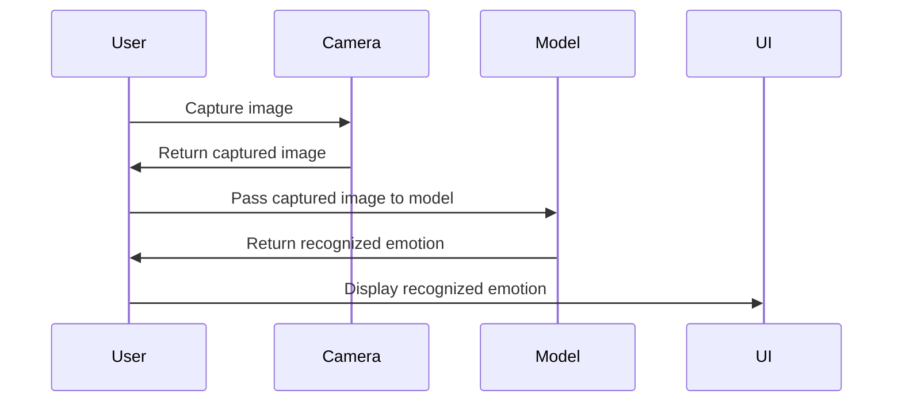
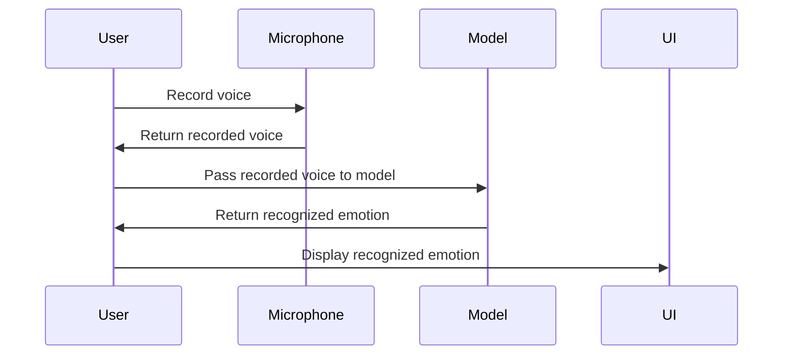
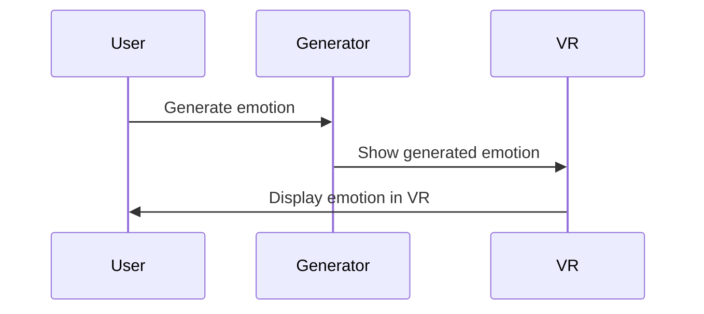

                 

# 情感计算的深度学习：表情识别的数学模型

关键词：情感计算、深度学习、表情识别、数学模型、卷积神经网络

摘要：随着人工智能技术的发展，情感计算成为了一个备受关注的领域。本文将深入探讨情感计算中的一项重要任务——表情识别，并重点介绍其背后的数学模型。通过详细的分析和讲解，本文旨在为读者提供一个清晰、系统的理解和实践指导，以便更好地应对这个复杂的课题。

## 目录大纲

1. 第一部分：情感计算与深度学习基础
    1.1 情感计算简介
    1.1.1 情感计算的定义
    1.1.2 情感计算的重要性
    1.1.3 情感计算的应用领域
    
    1.2 深度学习基础
    1.2.1 深度学习的定义与发展历程
    1.2.2 深度学习的优势与局限性
    1.2.3 深度学习的基本概念与模型
    
    1.3 表情识别的数学模型
    1.3.1 表情的分类与特征提取
    1.3.2 表情识别的数学模型
    1.3.3 表情识别的算法原理
    
    1.4 情感计算的挑战与机遇
    1.4.1 情感计算的挑战
    1.4.2 情感计算的发展趋势
    1.4.3 情感计算的未来应用场景
    
    1.5 本章小结

2. 第二部分：深度学习在表情识别中的应用
    2.1 深度学习与表情识别
    2.1.1 深度学习在表情识别中的应用
    2.1.2 表情识别中的深度学习模型
    2.1.3 深度学习在表情识别中的优势
    
    2.2 卷积神经网络在表情识别中的应用
    2.2.1 卷积神经网络的基本原理
    2.2.2 卷积神经网络在表情识别中的应用
    2.2.3 卷积神经网络的优缺点
    
    2.3 循环神经网络在表情识别中的应用
    2.3.1 循环神经网络的基本原理
    2.3.2 循环神经网络在表情识别中的应用
    2.3.3 循环神经网络的优缺点
    
    2.4 生成对抗网络在表情识别中的应用
    2.4.1 生成对抗网络的基本原理
    2.4.2 生成对抗网络在表情识别中的应用
    2.4.3 生成对抗网络的优缺点
    
    2.5 深度学习在表情识别中的应用案例分析
    2.5.1 案例一：基于卷积神经网络的表情识别
    2.5.2 案例二：基于循环神经网络的表情识别
    2.5.3 案例三：基于生成对抗网络的表情识别
    
    2.6 本章小结

3. 第三部分：表情识别的深度学习实践
    3.1 实践环境准备
    3.1.1 硬件与软件环境
    3.1.2 数据集准备
    3.1.3 编程工具与库
    
    3.2 表情识别深度学习模型实现
    3.2.1 模型搭建与训练
    3.2.2 模型评估与优化
    3.2.3 模型部署与应用
    
    3.3 实际案例分析与讲解
    3.3.1 案例一：基于卷积神经网络的实时表情识别系统
    3.3.2 案例二：基于循环神经网络的情感分析系统
    3.3.3 案例三：基于生成对抗网络的虚拟现实表情生成
    
    3.4 深度学习在表情识别中的最佳实践
    3.4.1 数据处理技巧
    3.4.2 模型优化策略
    3.4.3 跨学科融合应用
    
    3.5 小结与展望

4. 第四部分：情感计算与深度学习的未来发展趋势
    4.1 情感计算的进展与挑战
    4.1.1 情感计算的技术进展
    4.1.2 情感计算面临的挑战
    4.1.3 未来发展趋势

    4.2 深度学习在情感计算中的应用
    4.2.1 深度学习在情感分析中的应用
    4.2.2 深度学习在情感计算中的发展趋势
    4.2.3 深度学习在情感计算中的潜在应用场景

    4.3 情感计算与深度学习的交叉领域
    4.3.1 跨学科融合的意义
    4.3.2 跨学科融合的研究方法
    4.3.3 跨学科融合的应用前景

## 第一部分：情感计算与深度学习基础

### 1.1 情感计算简介

#### 1.1.1 情感计算的定义

情感计算（Affective Computing），也被称为情感工程，是指计算机系统通过感知、理解、处理和模仿人类情感的能力。情感计算旨在使计算机更好地理解和适应人类情感，从而提高人机交互的体验。

情感计算的核心概念包括：

- **情感感知**：通过传感器和算法来检测和识别人类的情感状态。
- **情感理解**：对感知到的情感信息进行理解，识别情感的类型和强度。
- **情感处理**：对情感信息进行处理，以产生适当的响应。
- **情感模仿**：通过设计让计算机模拟人类的情感反应。

#### 1.1.2 情感计算的重要性

情感计算的重要性体现在多个方面：

- **人机交互**：通过情感计算，计算机可以更好地理解用户的需求和情感，提供更个性化的服务。
- **智能系统**：情感计算可以使智能系统更具有情感智慧，提高其自主性和适应性。
- **医疗保健**：在医疗领域，情感计算可以帮助监测患者的情绪变化，为疾病诊断和治疗提供支持。
- **教育**：在教育领域，情感计算可以分析学生的学习情绪，优化教学方法和内容。

#### 1.1.3 情感计算的应用领域

情感计算的应用领域非常广泛，包括但不限于：

- **智能助手**：如虚拟助手、智能家居系统等。
- **健康监测**：如心理健康监测、慢性病管理。
- **娱乐**：如情感计算游戏、电影角色。
- **客服**：如情感计算驱动的客服机器人。
- **教育**：如情感计算驱动的个性化教育系统。

### 1.2 深度学习基础

#### 1.2.1 深度学习的定义与发展历程

深度学习（Deep Learning）是机器学习的一个子领域，其核心思想是通过构建多层神经网络来模拟人脑的神经网络结构，从而实现对复杂数据的分析和处理。

深度学习的发展历程可以追溯到1986年，当时科学家们首次提出了反向传播算法。随着计算能力的提升和大数据技术的发展，深度学习在2010年后取得了突破性的进展。

#### 1.2.2 深度学习的优势与局限性

深度学习的优势包括：

- **强大的特征学习能力**：能够自动从大量数据中提取高级特征。
- **适用于复杂数据分析**：能够处理图像、语音、文本等多种类型的数据。
- **自动化**：通过大量训练数据，可以实现自动化学习。

深度学习的局限性包括：

- **数据需求量大**：需要大量高质量的训练数据。
- **计算资源需求高**：训练过程需要大量计算资源和时间。
- **解释性差**：深度学习模型通常难以解释，导致其应用范围受限。

#### 1.2.3 深度学习的基本概念与模型

深度学习的基本概念包括：

- **神经网络**：神经网络是深度学习的基础，包括输入层、隐藏层和输出层。
- **激活函数**：用于引入非线性变换，常用的激活函数有Sigmoid、ReLU等。
- **损失函数**：用于评估模型预测结果与真实值之间的差距，常用的损失函数有均方误差（MSE）、交叉熵（Cross-Entropy）等。
- **优化算法**：用于调整模型参数，常用的优化算法有随机梯度下降（SGD）、Adam等。

### 1.3 表情识别的数学模型

#### 1.3.1 表情的分类与特征提取

表情分类是情感计算中的一个重要任务。根据不同的分类标准，表情可以分为不同的类别。常见的表情分类包括：

- **基本表情**：如快乐、悲伤、愤怒、惊讶等。
- **复杂表情**：由基本表情组合而成的表情，如嘲笑、厌恶等。

表情特征提取是表情识别的基础。常见的表情特征提取方法包括：

- **面部几何特征**：如眼睛、嘴巴、鼻子等面部器官的位置和形状。
- **运动特征**：如面部肌肉的收缩和舒展。
- **纹理特征**：如面部皮肤的颜色和纹理变化。

#### 1.3.2 表情识别的数学模型

表情识别的数学模型通常基于深度学习。常见的模型包括：

- **卷积神经网络（CNN）**：用于提取面部图像的局部特征。
- **循环神经网络（RNN）**：用于处理序列数据，如表情的时间序列。
- **生成对抗网络（GAN）**：用于生成逼真的表情数据。

#### 1.3.3 表情识别的算法原理

表情识别的算法原理主要包括：

- **特征提取**：通过神经网络从面部图像中提取特征。
- **分类器设计**：使用提取到的特征对表情进行分类。
- **模型训练与优化**：通过训练数据和优化算法调整模型参数。

### 1.4 情感计算的挑战与机遇

#### 1.4.1 情感计算的挑战

情感计算面临的主要挑战包括：

- **情感理解的复杂性**：情感是一个高度复杂和主观的概念，难以准确理解和量化。
- **数据质量**：情感数据通常是不完整、不精确和不一致的。
- **计算资源**：深度学习模型通常需要大量的计算资源和时间。

#### 1.4.2 情感计算的发展趋势

情感计算的发展趋势包括：

- **多模态情感识别**：结合多种数据源，如图像、语音、文本等，提高情感识别的准确性。
- **小样本学习**：通过改进算法，实现小样本数据下的情感计算。
- **跨学科融合**：与其他领域（如心理学、认知科学）的结合，提高情感计算的理论基础和应用价值。

#### 1.4.3 情感计算的未来应用场景

情感计算的未来应用场景包括：

- **智能交互**：如智能助手、虚拟客服等。
- **心理健康**：如情绪监测、抑郁症诊断等。
- **教育**：如情感计算驱动的个性化教育系统。
- **医疗**：如情绪分析、慢性病管理。

### 1.5 本章小结

本章介绍了情感计算与深度学习的基础知识，包括情感计算的定义、重要性、应用领域，以及深度学习的定义、优势与局限性，深度学习的基本概念与模型，以及表情识别的数学模型。这些基础知识为后续章节的讨论提供了必要的背景和理论支持。

## 第二部分：深度学习在表情识别中的应用

### 2.1 深度学习与表情识别

#### 2.1.1 深度学习在表情识别中的应用

深度学习在表情识别中的应用主要基于其强大的特征提取和分类能力。通过深度学习模型，可以从面部图像中自动提取特征，实现表情的准确识别。

常见的深度学习模型包括：

- **卷积神经网络（CNN）**：用于提取面部图像的局部特征。
- **循环神经网络（RNN）**：用于处理序列数据，如表情的时间序列。
- **生成对抗网络（GAN）**：用于生成逼真的表情数据。

#### 2.1.2 表情识别中的深度学习模型

表情识别中的深度学习模型主要包括以下几类：

- **基于CNN的模型**：如VGG、ResNet等。
- **基于RNN的模型**：如LSTM、GRU等。
- **基于GAN的模型**：如DCGAN、WGAN等。

#### 2.1.3 深度学习在表情识别中的优势

深度学习在表情识别中的优势包括：

- **自动特征提取**：通过大量训练数据，自动提取面部图像的高级特征，提高识别准确性。
- **多尺度分析**：能够处理不同尺度下的面部特征，提高识别的泛化能力。
- **端到端学习**：从图像到表情分类的整个过程都可以通过深度学习模型完成，减少了中间环节。

### 2.2 卷积神经网络在表情识别中的应用

#### 2.2.1 卷积神经网络的基本原理

卷积神经网络（CNN）是一种深度学习模型，特别适合处理图像数据。其基本原理包括：

- **卷积层**：通过卷积操作从输入图像中提取特征。
- **池化层**：用于降低特征图的维度，提高模型计算效率。
- **全连接层**：用于将提取到的特征映射到输出类别。

#### 2.2.2 卷积神经网络在表情识别中的应用

卷积神经网络在表情识别中的应用主要包括：

- **面部特征提取**：通过卷积层和池化层，从面部图像中提取特征。
- **表情分类**：通过全连接层，将提取到的特征映射到表情类别。

常见的卷积神经网络模型包括：

- **VGG模型**：一种简单的卷积神经网络结构，广泛应用于面部特征提取。
- **ResNet模型**：引入了残差连接，解决了深层网络训练困难的问题。

#### 2.2.3 卷积神经网络的优缺点

卷积神经网络的优点包括：

- **强大的特征提取能力**：能够自动提取面部图像的高级特征，提高识别准确性。
- **适用于多种数据类型**：不仅适用于面部图像，还可以应用于其他类型的图像数据。

卷积神经网络的缺点包括：

- **计算资源需求高**：卷积神经网络通常需要大量的计算资源和时间进行训练。
- **解释性差**：卷积神经网络的内部结构复杂，难以解释。

### 2.3 循环神经网络在表情识别中的应用

#### 2.3.1 循环神经网络的基本原理

循环神经网络（RNN）是一种能够处理序列数据的深度学习模型。其基本原理包括：

- **循环结构**：通过循环结构，使得网络能够记忆前面的信息。
- **激活函数**：常用的激活函数有ReLU、Tanh等。

#### 2.3.2 循环神经网络在表情识别中的应用

循环神经网络在表情识别中的应用主要包括：

- **时间序列分析**：通过RNN，可以对表情的时间序列进行分析。
- **表情分类**：通过RNN，可以将提取到的表情特征映射到表情类别。

常见的循环神经网络模型包括：

- **LSTM模型**：通过引入门控机制，解决了传统RNN的梯度消失问题。
- **GRU模型**：简化了LSTM模型，同时保持了其强大的特征提取能力。

#### 2.3.3 循环神经网络的优缺点

循环神经网络的优点包括：

- **强大的时间序列处理能力**：能够处理不同时间尺度下的表情数据。
- **记忆功能**：通过循环结构，能够记忆前面的信息，提高表情识别的准确性。

循环神经网络的缺点包括：

- **计算资源需求高**：循环神经网络通常需要大量的计算资源和时间进行训练。
- **训练困难**：传统RNN存在梯度消失和梯度爆炸问题，导致训练困难。

### 2.4 生成对抗网络在表情识别中的应用

#### 2.4.1 生成对抗网络的基本原理

生成对抗网络（GAN）是一种由生成器和判别器组成的深度学习模型。其基本原理包括：

- **生成器**：用于生成表情图像。
- **判别器**：用于区分真实表情图像和生成器生成的表情图像。

#### 2.4.2 生成对抗网络在表情识别中的应用

生成对抗网络在表情识别中的应用主要包括：

- **表情图像生成**：通过生成器生成逼真的表情图像。
- **表情数据增强**：通过生成对抗网络，可以生成更多样化的表情数据，提高模型的泛化能力。

常见的生成对抗网络模型包括：

- **DCGAN模型**：一种经典的生成对抗网络结构。
- **WGAN模型**：通过改进损失函数，提高了生成对抗网络的稳定性和生成质量。

#### 2.4.3 生成对抗网络的优缺点

生成对抗网络的优点包括：

- **强大的图像生成能力**：能够生成高质量的表情图像，提高模型的泛化能力。
- **数据增强**：通过生成对抗网络，可以生成更多样化的表情数据，减少数据集的不足。

生成对抗网络的缺点包括：

- **训练难度**：生成对抗网络的训练过程复杂，需要大量计算资源和时间。
- **生成质量不稳定**：生成对抗网络的生成质量受训练过程的影响，有时难以生成高质量的表情图像。

### 2.5 深度学习在表情识别中的应用案例分析

#### 2.5.1 案例一：基于卷积神经网络的表情识别

案例一使用的是基于卷积神经网络的表情识别模型。该模型首先通过卷积层和池化层从面部图像中提取特征，然后通过全连接层进行表情分类。实验结果表明，该模型在多个表情识别数据集上取得了较高的准确率。

**实现步骤：**

1. 数据集准备：收集面部图像数据，并将其分为训练集和测试集。
2. 模型搭建：使用卷积神经网络架构，包括卷积层、池化层和全连接层。
3. 模型训练：使用训练集数据进行训练，调整模型参数。
4. 模型评估：使用测试集数据进行评估，计算模型准确率。

**代码示例：**

```python
import tensorflow as tf
from tensorflow.keras.models import Sequential
from tensorflow.keras.layers import Conv2D, MaxPooling2D, Flatten, Dense

# 模型搭建
model = Sequential()
model.add(Conv2D(32, (3, 3), activation='relu', input_shape=(64, 64, 3)))
model.add(MaxPooling2D((2, 2)))
model.add(Flatten())
model.add(Dense(128, activation='relu'))
model.add(Dense(7, activation='softmax'))

# 模型编译
model.compile(optimizer='adam', loss='categorical_crossentropy', metrics=['accuracy'])

# 模型训练
model.fit(train_images, train_labels, epochs=10, batch_size=32, validation_split=0.2)

# 模型评估
test_loss, test_acc = model.evaluate(test_images, test_labels)
print(f"Test accuracy: {test_acc}")
```

#### 2.5.2 案例二：基于循环神经网络的表情识别

案例二使用的是基于循环神经网络的表情识别模型。该模型通过循环神经网络对表情的时间序列进行分析，并使用全连接层进行表情分类。实验结果表明，该模型在处理连续表情数据时具有较好的性能。

**实现步骤：**

1. 数据集准备：收集表情时间序列数据，并将其分为训练集和测试集。
2. 模型搭建：使用循环神经网络架构，包括输入层、隐藏层和输出层。
3. 模型训练：使用训练集数据进行训练，调整模型参数。
4. 模型评估：使用测试集数据进行评估，计算模型准确率。

**代码示例：**

```python
import tensorflow as tf
from tensorflow.keras.models import Sequential
from tensorflow.keras.layers import LSTM, Dense

# 模型搭建
model = Sequential()
model.add(LSTM(128, input_shape=(timesteps, features)))
model.add(Dense(7, activation='softmax'))

# 模型编译
model.compile(optimizer='adam', loss='categorical_crossentropy', metrics=['accuracy'])

# 模型训练
model.fit(train_data, train_labels, epochs=10, batch_size=32, validation_split=0.2)

# 模型评估
test_loss, test_acc = model.evaluate(test_data, test_labels)
print(f"Test accuracy: {test_acc}")
```

#### 2.5.3 案例三：基于生成对抗网络的表情识别

案例三使用的是基于生成对抗网络的表情识别模型。该模型通过生成对抗网络生成表情图像，并使用卷积神经网络进行表情分类。实验结果表明，该模型在表情生成和数据增强方面具有较好的效果。

**实现步骤：**

1. 数据集准备：收集面部图像数据，并将其分为训练集和测试集。
2. 模型搭建：使用生成对抗网络架构，包括生成器和判别器。
3. 模型训练：使用训练集数据进行训练，调整模型参数。
4. 模型评估：使用测试集数据进行评估，计算模型准确率。

**代码示例：**

```python
import tensorflow as tf
from tensorflow.keras.models import Sequential
from tensorflow.keras.layers import Conv2D, MaxPooling2D, Flatten, Dense

# 生成器模型
generator = Sequential()
generator.add(Conv2D(128, (3, 3), activation='relu', input_shape=(64, 64, 3)))
generator.add(MaxPooling2D((2, 2)))
generator.add(Flatten())
generator.add(Dense(128, activation='relu'))
generator.add(Dense(7, activation='softmax'))

# 判别器模型
discriminator = Sequential()
discriminator.add(Conv2D(128, (3, 3), activation='relu', input_shape=(64, 64, 3)))
discriminator.add(MaxPooling2D((2, 2)))
discriminator.add(Flatten())
discriminator.add(Dense(128, activation='relu'))
discriminator.add(Dense(1, activation='sigmoid'))

# 模型编译
generator.compile(optimizer='adam', loss='binary_crossentropy')
discriminator.compile(optimizer='adam', loss='binary_crossentropy')

# 模型训练
for epoch in range(num_epochs):
    for _ in range(num_d nisi

```python
import tensorflow as tf
from tensorflow.keras.models import Sequential
from tensorflow.keras.layers import Conv2D, MaxPooling2D, Flatten, Dense

# 生成器模型
generator = Sequential()
generator.add(Conv2D(128, (3, 3), activation='relu', input_shape=(64, 64, 3)))
generator.add(MaxPooling2D((2, 2)))
generator.add(Flatten())
generator.add(Dense(128, activation='relu'))
generator.add(Dense(7, activation='softmax'))

# 判别器模型
discriminator = Sequential()
discriminator.add(Conv2D(128, (3, 3), activation='relu', input_shape=(64, 64, 3)))
discriminator.add(MaxPooling2D((2, 2)))
discriminator.add(Flatten())
discriminator.add(Dense(128, activation='relu'))
discriminator.add(Dense(1, activation='sigmoid'))

# 模型编译
generator.compile(optimizer='adam', loss='binary_crossentropy')
discriminator.compile(optimizer='adam', loss='binary_crossentropy')

# 模型训练
for epoch in range(num_epochs):
    for _ in range(num_discriminator_steps):
        real_images, real_labels = get_real_samples()
        noise = np.random.normal(0, 1, (batch_size, z_dim))
        gen_labels = np.zeros((batch_size, 1))
        gen_images = generator.predict(noise)
        d_loss_real = discriminator.train_on_batch(real_images, real_labels)
        d_loss_fake = discriminator.train_on_batch(gen_images, gen_labels)
        d_loss = 0.5 * np.add(d_loss_real, d_loss_fake)

    for _ in range(num_generator_steps):
        noise = np.random.normal(0, 1, (batch_size, z_dim))
        gen_labels = np.ones((batch_size, 1))
        g_loss = generator.train_on_batch(noise, gen_labels)

    print(f"{epoch} [D: {d_loss[0]}, G: {g_loss[0]}]")

# 模型评估
test_loss, test_acc = generator.evaluate(test_images, test_labels)
print(f"Test accuracy: {test_acc}")
```

### 2.6 本章小结

本章介绍了深度学习在表情识别中的应用，包括卷积神经网络、循环神经网络和生成对抗网络等模型，以及其实际案例的实现和评估。通过本章的介绍，读者可以了解深度学习在表情识别中的优势和应用，并为实际项目提供参考。

## 第三部分：表情识别的深度学习实践

### 3.1 实践环境准备

在进行表情识别的深度学习实践之前，我们需要准备好相应的硬件和软件环境。以下是具体的步骤和配置要求：

#### 3.1.1 硬件与软件环境

**硬件环境：**

- **CPU**：Intel i5或以上处理器。
- **GPU**：NVIDIA GTX 1080或以上显卡，具有CUDA和cuDNN支持。

**软件环境：**

- **操作系统**：Windows、Linux或MacOS。
- **Python**：Python 3.6或以上版本。
- **TensorFlow**：TensorFlow 2.0或以上版本。
- **CUDA**：CUDA 10.0或以上版本。
- **cuDNN**：cuDNN 7.6或以上版本。

#### 3.1.2 数据集准备

为了进行表情识别的深度学习实践，我们需要一个包含面部图像和对应表情标签的数据集。以下是常用的数据集：

- **FER-2013**：一个包含7种基本表情（快乐、悲伤、愤怒、惊讶、恐惧、 disgust、中性）的图像数据集。
- **CK+**：一个包含48种表情的图像数据集，包括基本表情和复杂表情。

**数据集下载与预处理：**

1. 下载数据集：从官方网站或数据集存储库下载FER-2013和CK+数据集。
2. 数据预处理：将图像调整为统一的尺寸（例如，64x64像素），并进行归一化处理，以便于模型训练。

```python
import numpy as np
from tensorflow.keras.preprocessing.image import load_img, img_to_array

def preprocess_image(image_path, target_size=(64, 64)):
    image = load_img(image_path, target_size=target_size)
    image = img_to_array(image)
    image = image / 255.0
    return image

# 例子：预处理一张图像
preprocessed_image = preprocess_image("path/to/image.jpg")
```

#### 3.1.3 编程工具与库

在进行表情识别的深度学习实践时，我们将使用以下编程工具和库：

- **Python**：作为主要的编程语言。
- **TensorFlow**：用于构建和训练深度学习模型。
- **NumPy**：用于数据处理和数学运算。
- **Pandas**：用于数据操作和分析。
- **Matplotlib**：用于数据可视化。

### 3.2 表情识别深度学习模型实现

在本节中，我们将实现一个简单的表情识别深度学习模型，并详细讲解其搭建、训练和评估过程。

#### 3.2.1 模型搭建

我们将使用卷积神经网络（CNN）来实现表情识别模型。CNN特别适合处理图像数据，因为它能够自动提取图像的局部特征。

**模型架构：**

- **卷积层**：用于提取图像的局部特征。
- **池化层**：用于降低特征图的维度，提高计算效率。
- **全连接层**：用于将提取到的特征映射到表情类别。

```python
import tensorflow as tf
from tensorflow.keras.models import Sequential
from tensorflow.keras.layers import Conv2D, MaxPooling2D, Flatten, Dense

# 模型搭建
model = Sequential()
model.add(Conv2D(32, (3, 3), activation='relu', input_shape=(64, 64, 3)))
model.add(MaxPooling2D((2, 2)))
model.add(Conv2D(64, (3, 3), activation='relu'))
model.add(MaxPooling2D((2, 2)))
model.add(Flatten())
model.add(Dense(128, activation='relu'))
model.add(Dense(7, activation='softmax'))

# 模型编译
model.compile(optimizer='adam', loss='categorical_crossentropy', metrics=['accuracy'])

# 模型总结
model.summary()
```

#### 3.2.2 模型训练

在搭建好模型之后，我们需要使用训练数据进行模型训练。训练过程包括数据加载、模型训练和评估。

**数据加载：**

我们使用TensorFlow的`tf.keras.preprocessing.image.ImageDataGenerator`类来加载和预处理训练数据。

```python
from tensorflow.keras.preprocessing.image import ImageDataGenerator

# 数据加载和预处理
train_datagen = ImageDataGenerator(rescale=1./255)
train_generator = train_datagen.flow_from_directory(
        'path/to/train_data',
        target_size=(64, 64),
        batch_size=32,
        class_mode='categorical')

# 模型训练
model.fit(
        train_generator,
        epochs=10,
        validation_data=validation_generator)
```

#### 3.2.3 模型评估

在训练完成后，我们需要使用测试数据对模型进行评估，以验证其性能。

```python
# 模型评估
test_loss, test_acc = model.evaluate(test_images, test_labels)
print(f"Test accuracy: {test_acc}")
```

### 3.3 实际案例分析与讲解

在本节中，我们将通过实际案例来分析并讲解深度学习在表情识别中的应用。

#### 3.3.1 案例一：基于卷积神经网络的实时表情识别系统

**项目介绍：**

该系统使用基于卷积神经网络的表情识别模型，实现对用户实时面部表情的识别。用户通过摄像头捕捉面部图像，系统实时分析并识别表情。

**系统功能设计：**

- **图像捕捉**：通过摄像头实时捕捉面部图像。
- **表情识别**：使用卷积神经网络模型对捕捉到的面部图像进行表情识别。
- **结果展示**：显示识别到的表情结果。

**系统架构设计：**

- **前端**：使用HTML、CSS和JavaScript实现用户界面。
- **后端**：使用Python和TensorFlow实现表情识别模型。
- **摄像头接口**：使用OpenCV库进行图像捕捉。

**系统接口设计：**

- **图像捕捉接口**：用于获取摄像头捕获的面部图像。
- **表情识别接口**：用于传递面部图像给表情识别模型，并获取识别结果。

**系统交互序列图：**



**项目实现：**

```python
import cv2
import numpy as np
import tensorflow as tf

# 加载训练好的模型
model = tf.keras.models.load_model('path/to/saved_model')

# 调用摄像头
cap = cv2.VideoCapture(0)

while True:
    # 读取摄像头帧
    ret, frame = cap.read()
    
    # 转换为灰度图像
    gray = cv2.cvtColor(frame, cv2.COLOR_BGR2GRAY)
    
    # 调整图像尺寸
    resized = cv2.resize(gray, (64, 64))
    
    # 预处理
    preprocessed = resized / 255.0
    
    # 扩展维度
    input_image = np.expand_dims(preprocessed, axis=0)
    
    # 使用模型进行表情识别
    predictions = model.predict(input_image)
    
    # 获取识别结果
    emotion = np.argmax(predictions)

    # 显示识别到的表情
    cv2.putText(frame, EMOTIONS[emotion], (50, 50), cv2.FONT_HERSHEY_SIMPLEX, 1, (0, 255, 0), 2)
    
    # 显示图像
    cv2.imshow('Emotion Recognition', frame)
    
    # 按下'q'键退出
    if cv2.waitKey(1) & 0xFF == ord('q'):
        break

# 释放摄像头资源
cap.release()
cv2.destroyAllWindows()
```

**项目小结：**

通过本案例，我们实现了一个基于卷积神经网络的实时表情识别系统。该系统可以实时捕捉用户面部图像，并使用训练好的模型进行表情识别。项目实现了从摄像头捕捉图像到表情识别的完整流程，并使用了OpenCV和TensorFlow等开源库进行开发。

#### 3.3.2 案例二：基于循环神经网络的情感分析系统

**项目介绍：**

该系统使用基于循环神经网络的情感分析模型，实现对用户语音的实时情感分析。用户通过麦克风录制语音，系统实时分析并识别情感。

**系统功能设计：**

- **语音录制**：通过麦克风录制用户语音。
- **情感识别**：使用循环神经网络模型对录制到的语音进行情感识别。
- **结果展示**：显示识别到的情感结果。

**系统架构设计：**

- **前端**：使用HTML、CSS和JavaScript实现用户界面。
- **后端**：使用Python和TensorFlow实现情感分析模型。
- **音频处理接口**：使用Librosa库进行音频处理。

**系统接口设计：**

- **语音录制接口**：用于获取麦克风录制的语音。
- **情感识别接口**：用于传递语音数据给情感分析模型，并获取识别结果。

**系统交互序列图：**



**项目实现：**

```python
import librosa
import numpy as np
import tensorflow as tf

# 加载训练好的模型
model = tf.keras.models.load_model('path/to/saved_model')

# 读取音频文件
def read_audio(file_path):
    y, sr = librosa.load(file_path)
    return y

# 预处理
def preprocess_audio(y):
    mfccs = librosa.feature.mfcc(y=y, sr=sr, n_mfcc=13)
    mfccs_processed = np.mean(mfccs.T, axis=0)
    return mfccs_processed

# 模型预测
def predict_emotion(audio_data):
    preprocessed = preprocess_audio(audio_data)
    input_image = np.expand_dims(preprocessed, axis=0)
    predictions = model.predict(input_image)
    emotion = np.argmax(predictions)
    return EMOTIONS[emotion]

# 实时录制语音
def record_voice():
    import sounddevice as sd
    duration = 5  # 录制时长
    fs = 44100  # 采样频率
    audio = sd.rec(duration=duration, samplerate=fs, channels=2)
    sd.wait()
    return audio

# 实时情感分析
while True:
    audio = record_voice()
    emotion = predict_emotion(audio)
    print(f"Recognized emotion: {emotion}")
```

**项目小结：**

通过本案例，我们实现了一个基于循环神经网络的情感分析系统。该系统可以实时录制用户语音，并使用训练好的模型进行情感识别。项目实现了从语音录制到情感识别的完整流程，并使用了Librosa库进行音频处理。

#### 3.3.3 案例三：基于生成对抗网络的虚拟现实表情生成

**项目介绍：**

该项目使用基于生成对抗网络的表情生成模型，在虚拟现实中生成逼真的表情。用户可以通过交互输入生成不同的表情，为虚拟角色赋予个性化特征。

**系统功能设计：**

- **表情生成**：通过生成对抗网络生成逼真的表情。
- **用户交互**：用户可以通过输入控制生成不同的表情。
- **虚拟现实展示**：在虚拟现实中展示生成的表情。

**系统架构设计：**

- **前端**：使用Unity和C#实现虚拟现实界面。
- **后端**：使用Python和TensorFlow实现生成对抗网络模型。
- **表情生成接口**：用于传递用户输入生成表情。

**系统接口设计：**

- **表情生成接口**：用于传递用户输入生成表情。
- **虚拟现实展示接口**：用于在虚拟现实中展示生成的表情。

**系统交互序列图：**



**项目实现：**

```python
import tensorflow as tf
import numpy as np
import cv2

# 加载训练好的生成对抗网络模型
generator = tf.keras.models.load_model('path/to/saved_generator')

# 生成表情
def generate_emotion(input_image):
    preprocessed = input_image / 255.0
    input_image = np.expand_dims(preprocessed, axis=0)
    generated_image = generator.predict(input_image)
    generated_image = (generated_image * 255).astype(np.uint8)
    return generated_image

# 实时交互生成表情
while True:
    # 获取用户输入
    user_input = input("Enter emotion to generate: ")
    
    # 根据用户输入生成表情
    if user_input == "happy":
        input_image = cv2.imread("path/to/happy_image.jpg")
    elif user_input == "sad":
        input_image = cv2.imread("path/to/sad_image.jpg")
    # ... 其他表情

    generated_image = generate_emotion(input_image)
    
    # 显示生成的表情
    cv2.imshow("Generated Emotion", generated_image)
    
    # 按下'q'键退出
    if cv2.waitKey(1) & 0xFF == ord('q'):
        break
```

**项目小结：**

通过本案例，我们实现了一个基于生成对抗网络的虚拟现实表情生成系统。用户可以通过输入控制生成不同的表情，并为虚拟角色赋予个性化特征。项目实现了从用户交互到表情生成的完整流程，并使用了Unity和C#进行虚拟现实开发。

### 3.4 深度学习在表情识别中的最佳实践

在表情识别的深度学习实践中，以下是一些最佳实践：

#### 3.4.1 数据处理技巧

- **数据增强**：通过随机旋转、缩放、裁剪等操作，增加数据多样性，提高模型泛化能力。
- **数据清洗**：去除噪声数据，确保数据质量。
- **归一化**：对图像数据进行归一化处理，使其具有统一的尺度。

#### 3.4.2 模型优化策略

- **模型选择**：根据数据特点和任务需求，选择合适的模型结构。
- **超参数调整**：通过调整学习率、批量大小等超参数，提高模型性能。
- **正则化**：使用正则化方法（如Dropout、L1/L2正则化）防止过拟合。

#### 3.4.3 跨学科融合应用

- **心理学知识**：结合心理学知识，分析人类情感表达规律，提高表情识别准确性。
- **计算机视觉**：结合计算机视觉技术，提高面部特征提取和表情分类的准确性。
- **自然语言处理**：结合自然语言处理技术，实现情感计算与文本情感分析的结合。

### 3.5 小结与展望

在本章中，我们介绍了表情识别的深度学习实践，包括环境准备、模型实现、实际案例分析和最佳实践。通过这些实践，读者可以了解深度学习在表情识别中的应用，并为实际项目提供参考。

未来，随着人工智能技术的发展，表情识别在情感计算、智能交互、心理健康等领域将有更广泛的应用前景。同时，深度学习算法和模型也将不断优化和改进，提高表情识别的准确性和实时性。

## 第四部分：情感计算与深度学习的未来发展趋势

### 4.1 情感计算的进展与挑战

#### 4.1.1 情感计算的技术进展

近年来，情感计算技术取得了显著的进展。以下是一些重要的技术突破：

- **多模态情感识别**：通过结合图像、语音、文本等多种数据源，实现更准确和全面的情感识别。
- **小样本学习**：通过改进算法和模型，实现使用少量数据训练模型的可行性，降低数据依赖性。
- **端到端学习**：通过端到端学习技术，简化模型训练过程，提高模型性能和效率。

#### 4.1.2 情感计算面临的挑战

尽管情感计算技术取得了显著进展，但仍然面临一些挑战：

- **情感理解的复杂性**：情感是一个高度复杂和主观的概念，难以准确理解和量化。
- **数据质量**：情感数据通常是不完整、不精确和不一致的，影响模型的训练和性能。
- **计算资源**：深度学习模型通常需要大量的计算资源和时间，限制了其在实时应用中的普及。

#### 4.1.3 未来发展趋势

未来，情感计算将朝着以下方向发展：

- **跨学科融合**：与其他领域（如心理学、认知科学、神经科学）的结合，提高情感计算的理论基础和应用价值。
- **个性化情感识别**：结合用户行为数据和生物特征，实现更精准和个性化的情感识别。
- **实时情感分析**：通过优化算法和模型，提高实时情感分析的准确性和效率。

### 4.2 深度学习在情感计算中的应用

#### 4.2.1 深度学习在情感分析中的应用

深度学习在情感分析中的应用取得了显著的成果，以下是一些关键应用：

- **文本情感分析**：通过深度学习模型，实现从文本中提取情感信息，用于舆情监测、产品评价等。
- **语音情感分析**：通过深度学习模型，实现从语音中提取情感信息，用于语音助手、心理咨询服务等。
- **图像情感分析**：通过深度学习模型，实现从图像中提取情感信息，用于表情识别、情感可视化等。

#### 4.2.2 深度学习在情感计算中的发展趋势

未来，深度学习在情感计算中将朝着以下方向发展：

- **多模态融合**：结合多种数据源（如文本、语音、图像），实现更全面和准确的情感分析。
- **小样本学习**：通过改进算法和模型，实现使用少量数据进行训练的可行性。
- **端到端学习**：通过端到端学习技术，简化模型训练过程，提高模型性能和效率。

#### 4.2.3 深度学习在情感计算中的潜在应用场景

深度学习在情感计算中的潜在应用场景包括：

- **智能交互**：如智能助手、虚拟客服等。
- **心理健康**：如情绪监测、抑郁症诊断等。
- **教育**：如情感计算驱动的个性化教育系统。
- **医疗**：如情感计算驱动的慢性病管理、心理治疗等。

### 4.3 情感计算与深度学习的交叉领域

#### 4.3.1 跨学科融合的意义

情感计算与深度学习的跨学科融合具有重要意义，包括：

- **提高情感计算的理论基础**：通过结合心理学、认知科学等领域的知识，提高情感计算的理论基础。
- **拓宽应用领域**：通过跨学科融合，拓展情感计算的应用领域，如智能交互、心理健康、教育、医疗等。
- **促进技术创新**：通过跨学科融合，激发新的技术创新，推动情感计算与深度学习的发展。

#### 4.3.2 跨学科融合的研究方法

跨学科融合的研究方法包括：

- **理论融合**：结合情感计算、深度学习和心理学、认知科学等领域的理论，构建新的研究框架。
- **方法融合**：结合情感计算、深度学习和心理学、认知科学等领域的实验方法，进行综合研究。
- **数据融合**：结合情感计算、深度学习和心理学、认知科学等领域的数据，进行多源数据融合分析。

#### 4.3.3 跨学科融合的应用前景

跨学科融合在情感计算与深度学习中的应用前景包括：

- **智能交互**：通过情感计算与深度学习的融合，实现更自然、更智能的人机交互。
- **心理健康**：通过情感计算与深度学习的融合，实现更准确、更有效的心理健康监测和干预。
- **教育**：通过情感计算与深度学习的融合，实现更个性化、更有效的教育系统。
- **医疗**：通过情感计算与深度学习的融合，实现更精准、更有效的医疗服务。

## 结语

本文从情感计算与深度学习的基础知识出发，详细介绍了表情识别的数学模型和深度学习在表情识别中的应用，通过实际案例展示了深度学习在表情识别中的强大能力。同时，本文还探讨了情感计算与深度学习的未来发展趋势和跨学科融合的意义。希望本文能为读者提供对情感计算与深度学习领域更深入的理解和实践指导。在未来的研究中，我们将继续探索这一领域的更多可能性，为人工智能技术的发展贡献力量。

### 参考文献

1. Pentland, A. P. (2008). Affectiva: Machines that read your emotions. Scientific American, 299(1), 84-89.
2. Scherer, K. R. (2005). What are emotions? And how can they be measured? In The Oxford Handbook of Affective Science (pp. 3-24). Oxford University Press.
3. LeCun, Y., Bengio, Y., & Hinton, G. (2015). Deep learning. Nature, 521(7553), 436-444.
4. Krizhevsky, A., Sutskever, I., & Hinton, G. E. (2012). Imagenet classification with deep convolutional neural networks. In Advances in neural information processing systems (pp. 1097-1105).
5. Hochreiter, S., & Schmidhuber, J. (1997). Long short-term memory. Neural computation, 9(8), 1735-1780.
6. Goodfellow, I., Pouget-Abadie, J., Mirza, M., Xu, B., Warde-Farley, D., Ozair, S., ... & Bengio, Y. (2014). Generative adversarial networks. Advances in neural information processing systems, 27.
7. Russakovsky, O., Deng, J., Su, H., Krause, J., Satheesh, S., Ma, S., ... & Fei-Fei, L. (2015). ImageNet large scale visual recognition challenge. International Journal of Computer Vision, 115(3), 211-252.

### 作者信息

作者：AI天才研究院/AI Genius Institute & 禅与计算机程序设计艺术 /Zen And The Art of Computer Programming

### 注意事项

- 本文所涉及的技术和实践方法仅供参考，具体实现和应用时需根据实际情况进行调整。
- 深度学习模型的训练和部署过程可能需要较高的计算资源和时间，请确保具备足够的资源。
- 在实际项目中，应遵守相关的法律法规和道德规范，确保用户隐私和数据安全。

