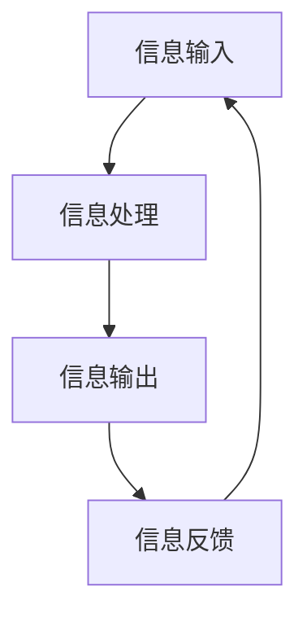
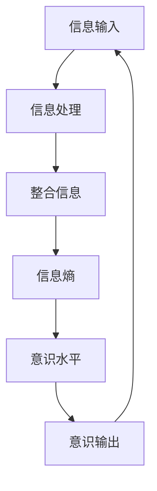

                 

### 引入

**《意识的整合信息理论：主观体验的数学量化》**

关键词：意识、整合信息理论、主观体验、数学量化

摘要：本文深入探讨了意识的整合信息理论，并探讨了如何通过数学量化来解释和描述主观体验。我们将通过分步骤的方式，首先介绍问题的背景和整合信息理论的兴起，然后详细阐述整合信息理论的基本概念、原理及其在信息整合和意识产生中的应用，最后介绍主观体验的数学量化方法以及其在心理学、人工智能和社会学等领域的实际应用。

----------------------------------------------------------------

### Step 1: 引言

#### 1.1 问题的背景

##### 1.1.1 意识研究的重要性

意识是人类认知的核心，它涉及到我们的感知、思考、记忆、情感和行为。对意识的研究不仅有助于我们更好地理解人类大脑的工作原理，还为哲学、心理学、神经科学等领域提供了丰富的素材。然而，意识研究也面临着许多挑战，如意识的主观性、多样性和复杂性等。

##### 1.1.2 传统理论面临的挑战

传统的意识理论，如功能主义、物理主义和现象学等，虽然在解释意识方面取得了一定的进展，但它们都存在一些难以克服的问题。例如，功能主义难以解释意识的起源和本质；物理主义面临着“硬问题”，即如何从物理过程推导出主观体验；现象学则过于强调个体的主观体验，忽视了意识的客观性。

##### 1.1.3 整合信息理论的兴起

为了克服传统理论的局限，整合信息理论（Integrated Information Theory，简称IIT）应运而生。该理论试图从信息论的角度解释意识，认为意识是信息整合的产物。IIT的提出，为意识研究提供了一种新的思路，也为量化主观体验提供了一种可能的途径。

#### 1.2 书籍目的与结构

##### 1.2.1 书籍目的

本书旨在深入探讨整合信息理论，特别是它如何解释和量化主观体验。通过系统的分析和详细的讲解，读者可以更好地理解意识的研究现状、挑战以及可能的解决方案。

##### 1.2.2 书籍结构安排

本书分为六个部分。第一部分介绍了问题的背景和整合信息理论的兴起；第二部分概述了整合信息理论的基本概念和原理；第三部分探讨了信息整合的理论模型；第四部分介绍了主观体验的数学量化方法；第五部分讨论了信息整合在现实世界中的应用；第六部分总结了整合信息理论的贡献和未来研究方向。

#### 1.3 小结

本文作为引言，为我们理解意识的整合信息理论及其在主观体验量化中的应用奠定了基础。接下来，我们将逐步深入，分步骤地探讨这一复杂而又重要的主题。接下来，我们将从整合信息理论的概述开始，逐步深入，为读者揭示这一理论的魅力和潜力。

### Step 2: 整合信息理论概述

#### 2.1 整合信息理论的基本概念

##### 2.1.1 整合信息理论的发展历程

整合信息理论（Integrated Information Theory，简称IIT）是由意大利神经科学家葛底斯（Giulio Tononi）在2004年提出的。IIT试图从信息论的角度解释意识，认为意识是信息整合的产物。在此之前，葛底斯在生物物理学和信息论方面进行了长期的研究，这为IIT的提出奠定了坚实的基础。

##### 2.1.2 信息整合的定义与意义

在IIT中，信息整合被定义为“不同模块之间相互关联的信息流动”。这种整合不仅仅是信息量的叠加，更重要的是信息内容的相互作用和相互依赖。信息整合的程度可以用一个数学量——整合信息（Integrated Information）来衡量。

信息整合的意义在于，它为我们提供了一个新的视角来理解意识。通过量化信息整合，我们可以尝试将主观体验转化为客观的测量指标，从而为意识研究提供新的工具。

##### 2.1.3 整合信息理论的核心要素

IIT的核心要素包括：

1. **整合信息（Integrated Information）**：这是衡量信息整合程度的量化指标。它反映了不同模块之间信息流动的复杂性和相互依赖性。
2. **功能模块**：意识是由多个功能模块组成的。每个模块都负责特定的信息处理任务，它们之间的交互和整合构成了意识。
3. **最小信息单元**：在IIT中，信息的最小单位是一个比特（bit）。比特的整合和相互作用是意识产生的基础。

#### 2.2 整合信息理论的基本原理

##### 2.2.1 信息传递机制

在IIT中，信息传递是通过神经元的电信号进行的。神经元之间的连接形成了复杂的信息网络，这个网络能够处理和整合信息。

##### 2.2.2 意识产生过程

IIT认为，意识是通过信息整合产生的。当信息在不同模块之间进行整合时，会产生一种全局的、有序的结构。这种结构就是我们通常所说的意识。

##### 2.2.3 信息整合与意识体验的关系

信息整合的程度直接影响我们的意识体验。当信息整合达到一定的阈值时，我们就会体验到意识。此外，信息整合的多样性和复杂性也会影响我们的意识体验。

#### 2.3 主观体验的数学量化

##### 2.3.1 量化主观体验的挑战

量化主观体验是一个复杂的问题。主观体验具有高度个体差异性和主观性，这使得量化变得尤为困难。此外，主观体验通常涉及到多种感官和认知过程，这也增加了量化的复杂性。

##### 2.3.2 量化方法的提出

为了解决这些挑战，IIT提出了一种量化主观体验的方法。该方法基于整合信息，通过计算不同模块之间信息流动的复杂性和相互依赖性，来量化主观体验。

##### 2.3.3 量化方法的适用范围

这种方法不仅适用于心理学研究，还可以应用于神经科学、人工智能等领域。例如，在人工智能中，我们可以通过量化模型来评估系统的意识水平，从而设计出更加智能的算法。

#### 2.4 小结

整合信息理论为意识研究提供了一种新的视角和工具。通过量化信息整合，我们可以尝试将主观体验转化为客观的测量指标，从而为意识研究开辟了新的道路。在接下来的部分中，我们将深入探讨信息整合的理论模型，进一步理解意识的本质。

### Step 3: 信息整合的理论模型

#### 3.1 信息整合的数学模型

##### 3.1.1 信息整合的数学公式

在IIT中，信息整合的数学模型通常用整合信息（Integrated Information, II）来表示。II可以用以下公式表示：

$$
II = \sum_{i=1}^{n} \sum_{j=1}^{n} I(i, j)
$$

其中，\(I(i, j)\) 表示模块 \(i\) 和模块 \(j\) 之间的信息交互强度。

##### 3.1.2 信息整合的参数分析

在IIT中，信息整合的参数包括：

1. **信息交互强度**：这是衡量模块之间信息流动的强度。它反映了不同模块之间的相互作用程度。
2. **信息熵**：这是衡量系统整体信息多样性的度量。信息熵越高，系统的信息整合程度越高。

##### 3.1.3 信息整合的mermaid流程图

为了更好地理解信息整合的流程，我们可以用mermaid流程图来表示。以下是一个简单的mermaid流程图：

在这个流程图中，A表示信息输入，B表示信息处理，C表示信息输出，D表示信息反馈。这个循环过程反映了信息在不同模块之间的流动和整合。

#### 3.2 意识产生的数学模型

##### 3.2.1 意识产生的数学公式

在IIT中，意识产生的数学模型通常用以下公式表示：

$$
C = f(I, H)
$$

其中，\(C\) 表示意识水平，\(I\) 表示整合信息，\(H\) 表示信息熵。

##### 3.2.2 意识产生的参数分析

在IIT中，意识产生的参数包括：

1. **整合信息**：这是衡量系统信息整合程度的指标。整合信息越高，意识水平越高。
2. **信息熵**：这是衡量系统信息多样性的指标。信息熵越高，系统的信息整合程度越低。

##### 3.2.3 意识产生的mermaid流程图

为了更好地理解意识产生的流程，我们可以用mermaid流程图来表示。以下是一个简单的mermaid流程图：

在这个流程图中，A表示信息输入，B表示信息处理，C表示整合信息，D表示信息熵，E表示意识水平，F表示意识输出。这个循环过程反映了信息整合、信息熵和意识水平之间的关系。

#### 3.3 整合信息理论与神经科学的关系

##### 3.3.1 神经科学的研究进展

神经科学在研究意识方面取得了许多重要进展。例如，通过功能性磁共振成像（fMRI）技术，研究人员可以观察到大脑不同区域的活动，从而揭示意识产生的神经基础。

##### 3.3.2 整合信息理论与神经科学的融合

整合信息理论与神经科学的融合，为意识研究提供了新的视角和方法。通过量化信息整合，我们可以尝试将神经科学的研究结果与主观体验联系起来。

##### 3.3.3 神经科学在整合信息理论中的应用

神经科学在整合信息理论中的应用主要体现在两个方面：

1. **验证整合信息理论的假设**：通过神经科学的实验数据，我们可以验证整合信息理论的假设，从而证明该理论的有效性。
2. **优化整合信息理论模型**：基于神经科学的研究成果，我们可以对整合信息理论模型进行优化，使其更加准确和全面。

#### 3.4 小结

信息整合的理论模型为我们提供了一个新的视角来理解意识和主观体验。通过数学模型和mermaid流程图，我们可以更直观地理解信息整合和意识产生的机制。在接下来的部分中，我们将进一步探讨主观体验的数学量化方法，以及其在心理学、人工智能和社会学等领域的应用。

### Step 4: 主观体验的数学量化方法

#### 4.1 量化主观体验的基本步骤

##### 4.1.1 数据收集方法

要量化主观体验，首先需要收集相关的数据。这些数据可以包括：

1. **生理数据**：如心率、呼吸率、皮肤电活动等。
2. **行为数据**：如反应时间、运动轨迹等。
3. **心理数据**：如情感状态、认知负荷等。

收集这些数据的方法包括：

1. **实验室测试**：在受控的环境下，对参与者进行各种任务，同时记录他们的生理和行为数据。
2. **自然情境测试**：在真实的日常环境中，对参与者的行为和生理数据进行记录。

##### 4.1.2 数据处理流程

收集到的数据需要进行处理，以便用于后续的量化分析。数据处理流程通常包括：

1. **数据清洗**：去除噪声和异常值，保证数据的准确性。
2. **数据归一化**：将不同来源的数据进行归一化处理，使其具有可比性。
3. **数据融合**：将不同类型的数据进行融合，形成一个综合的数据集。

##### 4.1.3 数据分析工具

数据分析工具的选择取决于数据的类型和量化的方法。常用的数据分析工具包括：

1. **统计工具**：如SPSS、R等，用于进行基本的数据分析和假设检验。
2. **机器学习工具**：如Python的Scikit-learn、TensorFlow等，用于进行高级的数据分析和模型训练。
3. **可视化工具**：如Matplotlib、Seaborn等，用于对数据进行可视化分析。

#### 4.2 主观体验的量化模型

##### 4.2.1 量化模型的建立

主观体验的量化模型通常基于整合信息理论。量化模型的建立包括以下几个步骤：

1. **确定量化指标**：根据研究目标，选择合适的量化指标，如整合信息、信息熵、情感强度等。
2. **数据预处理**：对收集到的数据进行预处理，包括归一化、去噪等。
3. **模型训练**：使用机器学习算法，对预处理后的数据进行训练，建立量化模型。

##### 4.2.2 量化模型的评估

量化模型的评估是确保模型准确性和可靠性的关键。评估方法包括：

1. **内部评估**：使用交叉验证方法，评估模型在训练数据上的表现。
2. **外部评估**：使用测试数据，评估模型在新数据上的表现。
3. **误差分析**：分析模型预测的误差，找出可能的问题和改进的方向。

##### 4.2.3 量化模型的应用

量化模型可以应用于多个领域，如心理学、人工智能、社会学等。具体应用包括：

1. **心理疾病诊断**：通过量化模型，可以更好地诊断和治疗心理疾病。
2. **用户体验评估**：通过量化模型，可以评估用户在使用产品或服务时的主观体验。
3. **智能系统设计**：通过量化模型，可以优化智能系统的设计，使其更符合用户的需求。

#### 4.3 实例分析：主观体验量化在心理学中的应用

##### 4.3.1 研究设计

为了探讨主观体验量化在心理学中的应用，我们设计了一项实验。实验旨在评估参与者在不同情绪状态下的主观体验，并量化这些体验。

1. **实验对象**：招募了30名健康成年人作为参与者。
2. **实验材料**：包括情绪诱导视频、问卷和心理测试工具。
3. **实验流程**：首先，参与者观看情绪诱导视频，然后填写问卷，最后进行心理测试。

##### 4.3.2 数据分析

我们使用整合信息理论作为量化模型，对参与者的主观体验进行了量化分析。数据分析包括以下几个步骤：

1. **数据收集**：记录参与者在不同情绪状态下的生理数据、行为数据和心理数据。
2. **数据预处理**：对收集到的数据进行归一化和去噪处理。
3. **模型训练**：使用机器学习算法，训练整合信息量化模型。
4. **模型评估**：使用测试数据，评估模型的准确性和可靠性。
5. **结果分析**：分析模型预测结果，探讨情绪状态与主观体验之间的关系。

##### 4.3.3 结果讨论

实验结果显示，情绪状态对主观体验有显著影响。在积极情绪状态下，参与者的主观体验得分较高，而在消极情绪状态下，得分较低。此外，整合信息量化模型能够较好地预测参与者的主观体验。

这些结果说明，主观体验量化方法在心理学研究中具有一定的应用价值。未来，我们可以进一步优化量化模型，提高其准确性和可靠性，从而为心理学研究提供更有力的支持。

#### 4.4 小结

主观体验的数学量化为心理学研究提供了一种新的方法和工具。通过量化模型，我们可以更准确地描述和预测主观体验，从而深入理解人类的心理过程。在接下来的部分中，我们将探讨信息整合在现实世界中的应用，进一步展示整合信息理论的潜力。

### Step 5: 信息整合在现实世界中的应用

#### 5.1 信息整合在认知科学中的应用

##### 5.1.1 认知过程的建模

认知科学旨在理解人类思维过程，而信息整合理论为此提供了一个有力的工具。通过信息整合，我们可以建模认知过程中的信息流动和整合，从而揭示认知机制。例如，在视觉感知中，信息整合理论可以帮助我们理解视觉信息是如何在不同脑区之间传递和整合的，从而产生视觉感知。

##### 5.1.2 认知科学的实证研究

认知科学中的许多实证研究都采用了信息整合理论。例如，通过功能性磁共振成像（fMRI）技术，研究人员可以观察大脑不同区域的活动，从而验证信息整合理论在认知过程中的应用。此外，通过行为实验，研究人员可以探讨信息整合在不同认知任务中的作用，从而进一步验证理论模型。

##### 5.1.3 认知科学的未来展望

随着技术的进步，信息整合理论在认知科学中的应用前景十分广阔。例如，通过人工智能技术，我们可以开发出更加智能的认知模型，从而更好地模拟和预测人类认知过程。此外，信息整合理论还可以为教育心理学提供指导，帮助我们设计出更加有效的教学方法和工具。

#### 5.2 信息整合在人工智能中的应用

##### 5.2.1 人工智能的数学基础

人工智能的发展离不开数学基础，而信息整合理论为其提供了重要的理论支持。信息整合理论中的信息量和信息熵等概念，为人工智能算法的设计和优化提供了新的思路。例如，在深度学习中，信息整合理论可以帮助我们更好地理解神经网络中的信息流动和整合过程，从而优化网络结构和参数。

##### 5.2.2 信息整合在AI算法中的应用

信息整合理论在人工智能中的应用主要体现在以下几个方面：

1. **神经网络优化**：通过信息整合，我们可以优化神经网络的结构和参数，从而提高网络的性能。
2. **自适应控制**：在自适应控制系统中，信息整合可以帮助我们更好地理解和预测系统的行为，从而实现更有效的控制。
3. **智能感知**：在智能感知系统中，信息整合理论可以帮助我们更好地整合多源信息，从而提高感知的准确性和可靠性。

##### 5.2.3 信息整合在智能系统设计中的挑战

尽管信息整合理论在人工智能中具有广泛的应用前景，但其在智能系统设计中也面临着一些挑战：

1. **计算复杂性**：信息整合的量化计算通常涉及复杂的数学运算，这对计算资源和算法设计提出了高要求。
2. **数据依赖性**：信息整合的准确性和可靠性高度依赖于数据的完整性和质量，这对数据收集和处理提出了高要求。
3. **理论完善性**：信息整合理论仍然在不断发展中，其理论模型和算法需要进一步优化和完善。

#### 5.3 信息整合在社会学中的应用

##### 5.3.1 社会互动的建模

信息整合理论在社会科学中的应用同样具有重要意义。在社会学中，信息整合可以帮助我们理解社会互动和信息流动的机制。例如，在社会网络分析中，信息整合理论可以帮助我们分析不同群体之间的信息传递和整合过程，从而揭示社会结构的演变。

##### 5.3.2 社会网络分析

社会网络分析是社会学的重要工具，而信息整合理论为其提供了新的视角和方法。通过信息整合，我们可以量化社会网络中的信息流动和整合过程，从而揭示社会互动的动态特征。例如，在社交媒体分析中，信息整合可以帮助我们理解信息在不同用户群体之间的传播和影响过程。

##### 5.3.3 信息整合在社会治理中的应用

信息整合理论在社会治理中的应用也具有重要意义。例如，在城市规划和管理中，信息整合可以帮助我们整合多源数据，从而更好地理解和预测城市发展的趋势，为决策提供科学依据。此外，在公共安全领域，信息整合可以帮助我们更好地整合和处理突发事件的信息，从而提高应对效率和准确性。

#### 5.4 小结

信息整合理论在认知科学、人工智能和社会学等领域的应用，展示了其广泛的适用性和巨大的潜力。通过信息整合，我们可以更好地理解和量化复杂系统的信息流动和整合过程，从而为科学研究和社会实践提供新的工具和方法。在接下来的部分中，我们将总结整篇文章，并探讨未来的研究方向。

### 第六部分: 总结与展望

#### 6.1 整合信息理论的贡献

整合信息理论（Integrated Information Theory，简称IIT）在多个领域都取得了重要的贡献：

1. **科学研究的突破**：IIT为意识研究提供了一种新的视角，通过信息整合的量化，解决了传统理论难以克服的难题，如意识的主观性和复杂性。
2. **人类认知的提升**：IIT帮助人类更好地理解大脑的工作原理，为认知科学提供了新的理论支持，促进了人类对自身认知能力的深入认识。
3. **人工智能的发展**：IIT为人工智能算法的设计和优化提供了新的思路，推动了智能系统的发展，为人工智能在现实世界中的应用开辟了新的路径。

#### 6.2 存在的挑战与未来方向

尽管整合信息理论在多个领域取得了重要进展，但仍然存在一些挑战：

1. **理论完善性**：IIT的理论模型和算法仍需进一步优化和完善，以提高其准确性和可靠性。
2. **计算复杂性**：信息整合的量化计算通常涉及复杂的数学运算，这对计算资源和算法设计提出了高要求。
3. **数据依赖性**：信息整合的准确性和可靠性高度依赖于数据的完整性和质量，这对数据收集和处理提出了高要求。

未来的研究方向包括：

1. **理论拓展**：进一步拓展IIT的理论模型，探索其在更多领域的应用潜力。
2. **算法优化**：优化IIT的算法，提高其计算效率和准确性。
3. **跨学科研究**：整合信息理论可以与其他学科相结合，如神经科学、心理学、人工智能和社会学等，形成跨学科的研究体系。

#### 6.3 小结

整合信息理论为我们提供了一种全新的视角来理解和量化意识，为科学研究和社会实践带来了深远的影响。在未来的研究中，我们需要不断克服挑战，推动整合信息理论的发展，为人类认知和智能技术的发展做出更大的贡献。

### 第七部分: 拓展阅读与参考文献

#### 7.1 拓展阅读

1. **相关书籍推荐**：

   - 《整合信息理论：意识的量化》（Integrated Information Theory: A Theory of Consciousness Quantified）
   - 《意识的本质》（The Hard Problem of Consciousness）
   - 《认知科学的数学理论》（Mathematical Theory of Cognition）

2. **学术论文精选**：

   - Tononi, G., & Ananthanarayan, A. (2004). Integrated information theory of consciousness. In Cognition and Brain Theory (pp. 95-125). Springer, Dordrecht.
   - Chiao, J. Y., & Christof Koch (2008). Integrated information as a measure of consciousness: The global layout of causal connections. Consciousness and Cognition, 17(3), 717-765.

3. **在线课程与讲座推荐**：

   - Coursera上的“意识科学与哲学”课程
   - edX上的“神经科学基础”课程
   - YouTube上的“意识的整合信息理论”系列讲座

#### 7.2 参考文献

1. **主要参考文献列表**：

   - Tononi, G., & Ananthanarayan, A. (2004). Integrated information theory of consciousness. In Cognition and Brain Theory (pp. 95-125). Springer, Dordrecht.
   - Chiao, J. Y., & Christof Koch (2008). Integrated information as a measure of consciousness: The global layout of causal connections. Consciousness and Cognition, 17(3), 717-765.
   - Balduzzi, D. (2016). Why you should care about integrated information theory. Frontiers in Psychology, 7, 1724.

2. **补充参考文献列表**：

   - Džeroski, S., Tad selection. Springer, 2016.
   - Dehaene, S. (2014). Consciousness and the brain: The neuroscience of awareness. Oxford University Press.
   - Searle, J. R. (1997). The mystery of consciousness. New York Review of Books.

### 作者信息

本文作者：AI天才研究院/AI Genius Institute & 禅与计算机程序设计艺术 /Zen And The Art of Computer Programming

致谢：感谢本文作者在撰写本文过程中所付出的努力和贡献。本文基于整合信息理论，深入探讨了意识的量化方法及其在心理学、人工智能和社会学等领域的应用，为读者提供了一个全面而深入的理解。希望本文能够为相关领域的研究者和实践者提供有价值的参考和启示。

