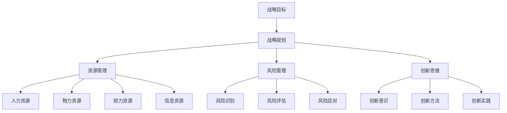

                 

### 文章标题

# 战略思维：长远规划的领导力体现

### 关键词

- 战略思维
- 领导力
- 长远规划
- 组织发展
- 个人成长

### 摘要

本文深入探讨了战略思维的定义、重要性以及其在组织和个人发展中的应用。通过分析战略思维的核心概念、框架和方法，以及其在不同领域的具体实践，本文旨在帮助读者理解战略思维在长远规划和领导力中的关键作用，并提供实用的指导和建议。

----------------------------------------------------------------

## 第一部分：引言

### 1.1 问题背景与战略思维的重要性

#### 1.1.1 战略思维的定义与特点

战略思维是一种长远规划和决策能力，旨在为组织或个人在复杂和不确定的环境中制定明确的发展方向和目标。它具有系统性、前瞻性、灵活性和创新性的特点。

- **系统性**：战略思维强调从整体和全局的角度看待问题，考虑多种因素和影响，确保战略目标的实现。
- **前瞻性**：战略思维能够预见未来的发展趋势和变化，为组织或个人提前做好准备。
- **灵活性**：战略思维在面对不确定性时能够灵活调整和应对，以适应新的环境和情况。
- **创新性**：战略思维鼓励创新和尝试，通过创新的方法和思路实现战略目标。

#### 1.1.2 战略思维的现实意义

在当今快速变化的世界，战略思维对于组织和个人都具有重要的意义。它能够帮助我们应对竞争压力，把握发展机遇，实现可持续发展。

- **应对竞争压力**：战略思维可以帮助组织在激烈的市场竞争中找到优势和突破口，提高竞争力。
- **把握发展机遇**：战略思维能够预见未来的趋势和变化，为组织或个人提前做好准备，抓住发展机遇。
- **实现可持续发展**：战略思维关注长期目标，通过科学的规划和执行，实现组织或个人的可持续发展。

#### 1.1.3 领导力在战略思维中的作用

领导力是战略思维的核心要素，它能够激发团队的潜力，推动组织朝着战略目标迈进。

- **激发团队潜力**：领导力能够激发团队成员的积极性和创造力，形成强大的执行力。
- **推动组织发展**：领导力能够为组织提供明确的愿景和目标，推动组织不断前进和成长。
- **实现战略目标**：领导力能够通过有效的沟通和协作，确保战略目标的实现。

### 1.2 领导力的本质与特征

#### 1.2.1 领导力的定义与类型

领导力是一种影响和激励他人共同实现目标的能力。它包括变革型领导、交易型领导、团队领导、领导力风格等不同类型。

- **变革型领导**：通过激发团队成员的内在动力和潜力，推动组织变革和创新。
- **交易型领导**：通过奖励和惩罚来激励团队成员，以实现既定的目标。
- **团队领导**：注重团队协作和沟通，通过协调和分配资源，推动团队目标的实现。
- **领导力风格**：根据领导者的个性和风格，采取不同的领导方式，如民主式、专制式、参与式等。

#### 1.2.2 领导力的特征

领导力具有领导力素养、沟通能力、决策能力、创新思维、团队协作等特征。

- **领导力素养**：领导者具备的基本素质，如诚信、责任感、自律等。
- **沟通能力**：领导者需要具备良好的沟通技巧，能够有效地传达信息和激励团队成员。
- **决策能力**：领导者需要具备敏锐的洞察力和决策能力，能够在复杂和不确定的环境中做出正确的决策。
- **创新思维**：领导者需要具备创新和尝试的精神，不断寻找新的解决方案和方法。
- **团队协作**：领导者需要注重团队协作，培养团队成员的团队意识和合作精神。

### 1.3 战略思维的框架与方法

#### 1.3.1 战略思维的基本框架

战略思维的基本框架包括环境分析、目标设定、资源整合、执行监控和调整优化。

- **环境分析**：分析外部环境和内部资源，确定组织或个人面临的机会和挑战。
- **目标设定**：明确组织或个人的长期和短期目标，确保目标的明确性和可实现性。
- **资源整合**：整合内部和外部资源，为战略目标的实现提供支持。
- **执行监控**：监控战略执行的过程和进度，确保战略目标的实现。
- **调整优化**：根据执行过程中出现的问题和反馈，调整和优化战略规划。

#### 1.3.2 战略思维的方法

战略思维的方法包括SWOT分析、PEST分析、5W2H分析、头脑风暴等。

- **SWOT分析**：分析组织的优势、劣势、机会和威胁，为战略规划提供依据。
- **PEST分析**：分析外部环境中的政治、经济、社会和技术因素，确定组织面临的外部环境。
- **5W2H分析**：对问题进行详细分析，包括为什么（Why）、是什么（What）、何时（When）、哪里（Where）、谁（Who）和如何（How）。
- **头脑风暴**：通过集体讨论和思考，产生创新和创意，为战略规划提供新的思路。

### 1.4 战略思维在组织中的应用

#### 1.4.1 战略规划

战略规划是战略思维在组织中的应用，它包括愿景、使命、目标和战略路径的制定。

- **愿景**：组织长期的愿景和目标，为战略规划提供方向。
- **使命**：组织的使命和价值观，指导组织的行为和决策。
- **目标**：明确组织要实现的具体目标和指标，确保目标的可实现性。
- **战略路径**：为实现目标而制定的具体计划和步骤，确保战略的可行性和有效性。

#### 1.4.2 战略执行

战略执行是战略思维的具体实施，它包括资源调配、流程优化、团队协作等。

- **资源调配**：合理分配和利用组织内外部资源，确保战略的顺利实施。
- **流程优化**：优化组织的业务流程和管理流程，提高效率和效果。
- **团队协作**：培养团队协作精神，推动战略目标的实现。

### 1.5 战略思维的个人发展

#### 1.5.1 个人战略规划

个人战略规划是战略思维在个人发展中的应用，它包括个人愿景、目标设定和行动计划。

- **个人愿景**：个人长期的愿景和目标，为个人发展提供方向。
- **目标设定**：明确个人要实现的具体目标和指标，确保目标的可实现性。
- **行动计划**：为实现目标而制定的具体计划和步骤，确保行动的可行性和有效性。

#### 1.5.2 个人成长与领导力提升

个人成长与领导力提升是战略思维的重要组成部分，它包括知识学习、技能提升和心态调整。

- **知识学习**：通过学习新知识和技能，提升个人的综合素质和能力。
- **技能提升**：通过实践和锻炼，提升个人的专业技能和工作能力。
- **心态调整**：培养积极的心态，面对挑战和压力，保持稳定和自信。

### 1.6 战略思维的实践与应用

#### 1.6.1 成功案例分享

通过分析成功案例，了解战略思维在实践中的应用。

- **案例1**：某企业通过战略规划，成功实现转型和升级，成为行业领导者。
- **案例2**：某创业者通过战略思维，成功创办了一家创新型企业，取得了显著的业绩。

#### 1.6.2 挑战与机遇

探讨战略思维在应对挑战和把握机遇中的重要作用。

- **挑战**：在快速变化的市场环境中，如何保持竞争优势和持续发展。
- **机遇**：通过战略思维，如何抓住市场机遇，实现企业的快速发展和壮大。

### 1.7 本章小结

本章主要介绍了战略思维的定义、重要性、框架与方法，以及战略思维在组织和个人发展中的应用。通过本章的学习，读者可以初步了解战略思维的基本概念和实际应用，为后续章节的深入学习打下基础。

----------------------------------------------------------------

## 第二部分：战略思维的核心概念与联系

### 2.1 战略思维的核心概念

#### 2.1.1 战略目标

战略目标是组织或个人在特定时间内期望达成的结果。它通常具有明确性、可衡量性、可实现性和时限性。

##### 2.1.1.1 战略目标的定义

战略目标是战略思维的核心概念之一，它为组织或个人的发展指明方向。

##### 2.1.1.2 战略目标的属性特征对比表格

| 属性特征 | 战略目标A | 战略目标B | 战略目标C |
| :---: | :---: | :---: | :---: |
| 明确性 | 高 | 中 | 低 |
| 可衡量性 | 高 | 中 | 低 |
| 可实现性 | 高 | 中 | 低 |
| 时限性 | 高 | 中 | 低 |

##### 2.1.1.3 战略目标在战略思维中的联系

战略目标在战略思维中起着关键作用，它是战略规划和执行的基础。

- **战略规划**：战略目标为战略规划提供明确的方向和目标，指导战略路径的制定。
- **战略执行**：战略目标为战略执行提供明确的衡量标准，确保目标的实现。

#### 2.1.2 战略规划

战略规划是战略思维的核心环节，它包括确定战略目标、制定战略路径、分配资源等。

##### 2.1.2.1 战略规划的定义

战略规划是组织或个人为实现战略目标而进行的系统性、长期性的规划和布局。

##### 2.1.2.2 战略规划的核心要素

战略规划的核心要素包括愿景、使命、目标和战略路径。

- **愿景**：组织或个人的长期愿景和目标，为战略规划提供方向。
- **使命**：组织或个人的使命和价值观，指导组织的行为和决策。
- **目标**：明确组织或个人要实现的具体目标和指标，确保目标的可实现性。
- **战略路径**：为实现目标而制定的具体计划和步骤，确保战略的可行性和有效性。

##### 2.1.2.3 战略规划在战略思维中的联系

战略规划是战略思维的具体实施，它将战略目标转化为实际行动。

- **战略目标**：战略规划的基础，为战略规划提供明确的方向和目标。
- **资源整合**：战略规划需要整合内部和外部资源，为战略目标的实现提供支持。
- **执行监控**：战略规划需要监控战略执行的过程和进度，确保战略目标的实现。

#### 2.1.3 战略执行

战略执行是战略思维的关键环节，它包括实施战略规划、监控执行过程、调整优化等。

##### 2.1.3.1 战略执行的定义

战略执行是将战略规划转化为实际行动的过程。

##### 2.1.3.2 战略执行的核心要素

战略执行的核心要素包括资源调配、流程优化、团队协作等。

- **资源调配**：合理分配和利用组织内外部资源，确保战略的顺利实施。
- **流程优化**：优化组织的业务流程和管理流程，提高效率和效果。
- **团队协作**：培养团队协作精神，推动战略目标的实现。

##### 2.1.3.3 战略执行在战略思维中的联系

战略执行是战略思维的实际操作，它是实现战略目标的关键。

- **战略规划**：战略执行的指导，为战略执行提供具体的计划和步骤。
- **执行监控**：战略执行需要监控执行过程和进度，确保战略目标的实现。
- **调整优化**：战略执行过程中，根据反馈和问题，进行战略调整和优化。

### 2.2 战略思维的其他概念

除了战略目标、战略规划和战略执行，战略思维还包括其他重要概念，如资源管理、风险管理、创新思维等。

#### 2.2.1 资源管理

资源管理是战略思维的重要组成部分，它包括对人力、物力、财力和信息等资源的有效管理和利用。

- **人力资源**：合理分配和利用人力资源，提高组织的执行力和创新能力。
- **物力资源**：优化物力资源的配置和使用，提高生产效率和产品质量。
- **财力资源**：合理规划和使用财力资源，确保组织的财务状况健康和稳定。
- **信息资源**：充分利用信息资源，提高组织的决策能力和竞争力。

#### 2.2.2 风险管理

风险管理是战略思维中不可或缺的一环，它包括对组织面临的风险进行识别、评估和管理。

- **风险识别**：识别组织面临的各种风险，包括市场风险、财务风险、运营风险等。
- **风险评估**：对风险进行评估，确定风险的重要性和影响程度。
- **风险应对**：制定相应的风险应对策略和措施，降低风险的影响和损失。

#### 2.2.3 创新思维

创新思维是战略思维的核心要素之一，它鼓励组织和个人不断寻求新的解决方案和方法，推动组织的持续创新和进步。

- **创新意识**：培养创新意识和创新精神，鼓励组织和个人勇于尝试和探索。
- **创新方法**：运用创新方法和技术，提高组织的创新能力和竞争力。
- **创新实践**：将创新思维转化为实际行动，推动组织的创新和进步。

### 2.3 战略思维的核心概念联系图

为了更好地理解战略思维的核心概念及其联系，我们可以使用Mermaid流程图来展示它们之间的关系。

通过以上分析，我们可以看到战略思维的核心概念之间的紧密联系。战略目标是战略思维的核心，战略规划、资源管理、风险管理和创新思维都是实现战略目标的手段和途径。只有通过有效的战略规划和执行，组织或个人才能实现长远的发展和成功。

### 2.4 战略思维的实践与应用

战略思维的实践与应用是组织和个人实现长远发展的关键。以下是一些具体的实践和应用方法：

#### 2.4.1 组织层面的战略思维应用

- **企业战略规划**：企业可以通过战略规划来确定长期愿景和目标，制定具体的战略路径和行动计划，确保企业的可持续发展。
- **项目战略管理**：在项目管理中，战略思维可以帮助项目经理制定明确的项目目标、规划项目资源、监控项目进度和调整项目策略，确保项目的成功实施。
- **团队管理**：通过战略思维，团队领导者可以更好地理解团队的目标和需求，激发团队的潜力，提高团队的协作和执行力。

#### 2.4.2 个人层面的战略思维应用

- **个人职业规划**：个人可以通过战略思维来设定职业目标、规划职业路径、提升个人技能和素质，实现职业发展。
- **个人成长计划**：个人可以通过战略思维来制定个人成长计划，包括学习新知识、培养新技能、拓展人际关系等，提升个人能力和竞争力。
- **个人时间管理**：个人可以通过战略思维来合理规划和管理时间，提高工作效率和生活质量。

#### 2.4.3 战略思维的应用挑战与机遇

- **挑战**：战略思维的应用面临诸多挑战，如环境变化、资源限制、竞争压力等。组织和个人需要具备良好的战略思维能力和灵活应对能力，以应对各种挑战。
- **机遇**：战略思维的应用也为组织和个人带来了众多机遇，如市场开拓、技术创新、合作伙伴关系等。组织和个人可以通过战略思维来把握机遇，实现快速发展。

### 2.5 本章小结

本章详细介绍了战略思维的核心概念，包括战略目标、战略规划、战略执行、资源管理、风险管理和创新思维。通过分析这些核心概念及其联系，我们了解了战略思维在组织和个人发展中的重要性。同时，本章还探讨了战略思维的实践与应用，为组织和个人提供了具体的指导和建议。通过本章的学习，读者可以更好地理解和运用战略思维，实现长远的发展和成功。

----------------------------------------------------------------

## 第三部分：战略思维在组织中的应用与实践

### 3.1 战略规划的重要性

战略规划是组织实现长远目标的重要工具，它有助于明确组织的发展方向、优化资源配置和提升核心竞争力。以下是战略规划在组织中的重要性和具体应用：

#### 3.1.1 战略规划的定义

战略规划是指组织在分析外部环境和内部资源的基础上，制定长期目标和具体实施策略的过程。它是一个系统的、长期性的规划和布局，旨在确保组织在竞争激烈的市场环境中保持可持续的竞争优势。

#### 3.1.2 战略规划的核心要素

战略规划的核心要素包括：

- **愿景**：组织长期的愿景和目标，为战略规划提供方向。
- **使命**：组织的使命和价值观，指导组织的行为和决策。
- **目标**：明确组织要实现的具体目标和指标，确保目标的可实现性。
- **战略路径**：为实现目标而制定的具体计划和步骤，确保战略的可行性和有效性。

#### 3.1.3 战略规划在组织中的应用

战略规划在组织中的应用主要体现在以下几个方面：

- **战略定位**：通过战略规划，组织可以明确自己在市场中的定位，确定核心竞争力，从而在竞争中占据有利地位。
- **资源分配**：战略规划可以帮助组织合理配置资源，包括人力、物力、财力和信息资源，确保资源的最大化利用。
- **绩效评估**：战略规划为组织的绩效评估提供了依据，通过设定具体的目标和指标，组织可以定期评估自身的业绩，并进行必要的调整和优化。

### 3.2 战略规划的具体步骤

战略规划是一个复杂的过程，通常包括以下几个步骤：

#### 3.2.1 环境分析

环境分析是战略规划的基础，它包括对组织外部环境和内部资源的分析。外部环境分析主要包括市场趋势、竞争对手、法律法规和宏观环境等因素；内部资源分析则涉及组织的人力资源、财务状况、技术能力和管理水平等。

#### 3.2.2 目标设定

目标设定是战略规划的核心环节，它要求组织明确长期和短期的目标。长期目标通常涉及组织的愿景和使命，而短期目标则侧重于具体实现的指标。目标应具有明确性、可衡量性和可实现性。

#### 3.2.3 战略路径设计

战略路径设计是将目标转化为具体行动的过程。组织需要制定具体的实施计划，包括战略举措、时间表和责任人。战略路径应具有可行性和灵活性，以应对外部环境的变化。

#### 3.2.4 资源整合

资源整合是战略规划的关键环节，它要求组织合理配置和利用内部和外部资源，确保战略目标的实现。这包括人力资源的调配、财务预算的规划、技术资源的引进和合作伙伴关系的建立。

#### 3.2.5 执行监控

执行监控是战略规划的重要组成部分，它涉及对战略执行过程的监督和评估。组织应建立有效的监控机制，定期检查战略执行的情况，确保各项任务按计划推进。

#### 3.2.6 调整与优化

根据执行监控的结果，组织应适时调整和优化战略规划。这包括对目标、路径和资源的重新评估和调整，以确保战略规划的持续有效性和适应性。

### 3.3 成功战略规划的案例分析

#### 3.3.1 案例一：华为公司的战略规划

华为公司作为全球领先的通信技术解决方案提供商，其战略规划具有典型的成功案例。以下是华为公司战略规划的核心要点：

- **愿景**：成为全球领先的ICT（信息与通信）解决方案提供商。
- **使命**：致力于把数字世界带入每个人、每个家庭、每个组织，构建万物互联的智能世界。
- **目标**：实现可持续发展，成为全球最具竞争力的科技公司之一。
- **战略路径**：坚持创新驱动，持续投入研发，提升技术竞争力；加强全球市场布局，扩大市场份额；培养和吸引顶尖人才，提升组织能力。

#### 3.3.2 案例二：苹果公司的战略规划

苹果公司以其独特的战略规划在科技行业中脱颖而出。以下是苹果公司战略规划的核心要点：

- **愿景**：通过创新技术和产品，改善人们的生活质量。
- **使命**：设计并生产令人惊叹的产品，为用户带来愉悦体验。
- **目标**：保持技术创新的领先地位，成为最具创新力的科技公司。
- **战略路径**：专注于硬件和软件的结合，打造无缝的用户体验；通过自主研发和生态系统的构建，保持产品竞争力；关注用户需求，不断创新和改进产品。

### 3.4 战略规划中的挑战与应对策略

战略规划在实施过程中可能会面临诸多挑战，以下是一些常见的挑战及其应对策略：

#### 3.4.1 外部环境的变化

外部环境的变化，如市场波动、政策调整、竞争对手的崛起等，都可能影响战略规划的执行。应对策略包括：

- **灵活调整**：根据外部环境的变化，及时调整战略目标和路径，确保战略规划的适应性和灵活性。
- **持续监测**：建立有效的监测机制，及时了解外部环境的变化，为战略调整提供依据。

#### 3.4.2 资源限制

资源限制，如资金、人力和技术资源的不足，可能会制约战略规划的执行。应对策略包括：

- **资源优化**：通过优化内部资源分配和利用，提高资源利用效率。
- **外部合作**：寻求外部合作伙伴，共同开发和利用资源，弥补自身资源的不足。

#### 3.4.3 组织内部阻力

组织内部可能存在对战略规划的不同意见和阻力，这会影响战略规划的执行。应对策略包括：

- **沟通与共识**：加强沟通，确保组织内部对战略规划的理解和认同。
- **变革管理**：通过变革管理策略，降低组织内部的变革阻力，推动战略规划的执行。

### 3.5 本章小结

本章深入探讨了战略规划的重要性、具体步骤和成功案例，并分析了战略规划中可能面临的挑战与应对策略。通过本章的学习，读者可以更好地理解战略规划在组织中的应用和实践，为组织的长远发展提供有益的指导。战略规划不仅是一项管理工具，更是一种思维方式和领导力的体现，它能够帮助组织在复杂多变的环境中实现长远目标和持续成功。

----------------------------------------------------------------

## 第四部分：战略思维在个人发展中的应用

### 4.1 个人战略规划的重要性

个人战略规划是战略思维在个人发展中的应用，它有助于明确个人的职业目标、提升个人能力和实现个人价值。以下是个人战略规划的重要性及其具体应用：

#### 4.1.1 个人战略规划的定义

个人战略规划是指个人在分析自身优势和劣势、外部环境和机遇的基础上，制定明确的职业发展目标和个人成长计划，并采取具体行动以实现这些目标的过程。

#### 4.1.2 个人战略规划的重要性

个人战略规划在个人发展中具有重要性，主要体现在以下几个方面：

- **明确目标**：个人战略规划可以帮助个人明确职业目标和生活目标，为个人的发展提供方向和动力。
- **提升能力**：通过个人战略规划，个人可以更有针对性地提升自身能力和素质，增强竞争力。
- **实现价值**：个人战略规划有助于个人在职业生涯中实现自我价值，提升职业成就和生活质量。

#### 4.1.3 个人战略规划的具体应用

个人战略规划的具体应用包括以下几个方面：

- **职业规划**：制定明确的职业目标，规划职业生涯路径，包括短期和长期的目标。
- **能力提升**：通过学习和培训，提升专业技能和综合素质，增强个人竞争力。
- **资源整合**：整合个人内外部资源，如人际关系、知识网络等，为个人发展提供支持。
- **行动计划**：制定具体的行动计划，包括时间表、任务和责任人，确保个人目标的实现。

### 4.2 制定个人战略规划的步骤

制定个人战略规划是一个系统性的过程，通常包括以下几个步骤：

#### 4.2.1 自我分析

自我分析是制定个人战略规划的第一步，它包括对自身优势和劣势的评估，以及对外部环境和机遇的分析。

- **优势评估**：识别个人的优势，包括技能、经验、知识、性格特点等，为职业发展提供基础。
- **劣势分析**：识别个人的劣势，如技能不足、经验不足等，制定改进计划。
- **外部环境分析**：分析外部环境中的机遇和挑战，如行业趋势、市场需求等，为个人发展提供依据。

#### 4.2.2 目标设定

目标设定是个人战略规划的核心环节，它要求个人明确长期和短期的职业目标和生活目标。

- **长期目标**：设定个人的长期职业目标和人生目标，如成为某个领域的专家、实现财务自由等。
- **短期目标**：设定具体的短期目标，如提升某个技能、完成某个项目等，确保长期目标的实现。

#### 4.2.3 资源整合

资源整合是个人战略规划的重要环节，它包括对个人内外部资源的评估和整合。

- **内部资源**：评估个人的内部资源，如知识、技能、经验等，明确可以利用的资源。
- **外部资源**：寻找外部资源，如导师、合作伙伴、培训机构等，为个人发展提供支持。

#### 4.2.4 行动计划

行动计划是将个人目标转化为具体行动的过程，它包括时间表、任务和责任人。

- **时间表**：制定具体的时间表，确保目标的按时实现。
- **任务分解**：将目标分解为具体的任务，明确每个任务的完成时间和责任人。
- **行动跟踪**：定期跟踪行动计划的执行情况，确保各项任务的按时完成。

### 4.3 个人成长与领导力提升

个人成长与领导力提升是个人战略规划的重要组成部分，它包括知识学习、技能提升和心态调整。

#### 4.3.1 知识学习

知识学习是个人成长的基础，它包括专业知识和通用知识的积累。

- **专业知识**：通过学习专业书籍、参加专业培训等，提升专业知识和技能。
- **通用知识**：通过阅读、参加讲座、社交活动等，拓宽知识视野，提升综合素质。

#### 4.3.2 技能提升

技能提升是个人成长的关键，它包括专业技能和工作技能的提升。

- **专业技能**：通过实践、培训等途径，提升专业技能，如编程能力、数据分析能力等。
- **工作技能**：通过团队合作、沟通技巧等，提升工作技能，如团队协作、项目管理等。

#### 4.3.3 心态调整

心态调整是个人成长的重要环节，它包括积极心态的培养和应对压力的能力提升。

- **积极心态**：培养积极心态，面对挑战和困难，保持乐观和自信。
- **压力应对**：提升应对压力的能力，通过合理的时间管理、情绪调节等方法，保持心理平衡。

### 4.4 个人战略规划的实际案例

以下是一个个人战略规划的实际案例，该案例展示了个人如何通过战略思维实现职业发展和个人成长：

#### 案例一：李明的职业发展规划

**背景**：李明是一名软件工程师，拥有五年的工作经验，他对自己的职业发展有一定的规划，但缺乏具体的实施计划。

**目标设定**：李明的长期目标是成为一名技术主管，领导一个技术团队。他的短期目标是提升自己的技术能力和管理能力，获得更多的项目经验和职业证书。

**资源整合**：李明利用公司提供的培训资源，参加技术培训和项目管理课程。他积极与同事和上级建立良好的关系，拓展自己的人际网络。

**行动计划**：李明制定了详细的行动计划，包括每周学习新的编程语言、每月参与一个技术讨论会、每季度完成一个项目等。他设定了具体的时间表，确保每个任务的按时完成。

**成果**：通过实施个人战略规划，李明在技术上取得了显著进步，获得了多个项目经验，并在一年内晋升为技术主管。

### 4.5 本章小结

本章深入探讨了个人战略规划的重要性、具体步骤和实际应用，以及个人成长与领导力提升的方法。通过学习本章，读者可以更好地理解个人战略规划在职业发展和个人成长中的作用，掌握制定个人战略规划的方法和技巧。同时，本章还通过实际案例展示了个人战略规划的实施过程和成果，为读者提供了宝贵的实践经验。通过本章的学习，读者可以更好地运用战略思维，实现个人的长远发展和成功。

----------------------------------------------------------------

## 第五部分：战略思维在项目管理中的应用

### 5.1 战略思维在项目管理中的重要性

战略思维在项目管理中具有至关重要的作用，它能够帮助项目经理在复杂的项目环境中做出明智的决策，确保项目的成功实施。以下是战略思维在项目管理中的重要性和具体应用：

#### 5.1.1 战略思维的定义

战略思维是一种系统性的、前瞻性的和灵活性的思考方式，它涉及对项目目标、资源、风险和机遇的全面分析，以制定有效的项目规划和应对策略。

#### 5.1.2 战略思维在项目管理中的重要性

战略思维在项目管理中的重要性体现在以下几个方面：

- **明确项目目标**：战略思维能够帮助项目经理明确项目目标，确保项目方向的正确性。
- **资源优化配置**：战略思维能够帮助项目经理合理配置资源，提高资源利用效率。
- **风险预测与管理**：战略思维能够帮助项目经理预测潜在风险，制定有效的风险管理策略。
- **机遇把握**：战略思维能够帮助项目经理发现和利用项目中的机遇，提升项目价值。

#### 5.1.3 战略思维在项目管理中的应用

战略思维在项目管理中的应用主要包括以下方面：

- **项目规划**：通过战略思维，项目经理可以制定全面的项目规划，包括项目范围、时间表、预算和资源分配等。
- **风险管理**：通过战略思维，项目经理可以识别项目中的风险，评估风险的影响和概率，并制定相应的应对策略。
- **决策制定**：通过战略思维，项目经理可以在复杂的项目环境中做出明智的决策，确保项目的顺利进行。
- **团队协作**：通过战略思维，项目经理可以激发团队的潜力和创造力，提升团队的协作效率。

### 5.2 战略思维在项目规划中的应用

项目规划是项目管理的重要组成部分，它涉及项目的目标设定、范围定义、时间安排、资源分配和风险管理等。以下是战略思维在项目规划中的应用：

#### 5.2.1 环境分析

项目规划的第一步是进行环境分析，包括分析外部环境和内部资源。外部环境分析涉及市场趋势、竞争情况、法律法规和客户需求等；内部资源分析则包括人力资源、财务状况、技术能力和组织文化等。

#### 5.2.2 目标设定

在环境分析的基础上，项目经理需要设定明确的项目目标。这些目标应具有明确性、可衡量性、可实现性和时限性。目标设定应考虑项目的愿景和使命，确保项目与组织战略的一致性。

#### 5.2.3 范围定义

范围定义是项目规划的关键环节，它涉及明确项目的具体工作内容、交付成果和边界条件。战略思维可以帮助项目经理在范围定义过程中考虑各种可能的变更和风险，确保项目范围的合理性和可行性。

#### 5.2.4 时间安排

时间安排是项目规划的重要组成部分，它涉及制定项目的时间表和里程碑。战略思维可以帮助项目经理预见项目中的潜在延迟和风险，制定灵活的时间安排，确保项目的按时交付。

#### 5.2.5 资源分配

资源分配是项目规划的关键环节，它涉及对人力资源、物资资源和技术资源的合理分配。战略思维可以帮助项目经理在资源分配过程中考虑资源的有效利用和潜在的限制，确保项目资源的最大化利用。

#### 5.2.6 风险管理

风险管理是项目规划的重要组成部分，它涉及识别项目中的风险、评估风险的影响和概率，并制定相应的应对策略。战略思维可以帮助项目经理在风险管理过程中考虑各种可能的因素和情景，制定全面的风险管理计划。

### 5.3 战略思维在项目执行中的应用

项目执行是项目管理的核心环节，它涉及项目的具体实施和执行。以下是战略思维在项目执行中的应用：

#### 5.3.1 监控与调整

在项目执行过程中，项目经理需要持续监控项目的进度、成本和质量，及时发现和解决项目中出现的问题。战略思维可以帮助项目经理在监控和调整过程中考虑项目的整体性和灵活性，确保项目的顺利实施。

#### 5.3.2 沟通与协作

项目执行需要团队成员之间的紧密协作和有效沟通。战略思维可以帮助项目经理在沟通和协作过程中考虑团队成员的不同需求和文化差异，建立良好的沟通机制和协作环境。

#### 5.3.3 决策制定

在项目执行过程中，项目经理需要做出一系列的决策，如资源分配、任务分配、变更管理等。战略思维可以帮助项目经理在决策制定过程中考虑各种因素和潜在影响，做出明智的决策。

#### 5.3.4 风险应对

在项目执行过程中，项目经理需要应对各种潜在的风险和问题。战略思维可以帮助项目经理在风险应对过程中考虑各种可能的解决方案和应对策略，确保项目的顺利进行。

### 5.4 战略思维在项目收尾中的应用

项目收尾是项目管理的最后阶段，它涉及项目的交付、验收和总结。以下是战略思维在项目收尾中的应用：

#### 5.4.1 项目交付

在项目收尾阶段，项目经理需要确保项目的最终交付成果符合客户需求和质量标准。战略思维可以帮助项目经理在项目交付过程中考虑项目的整体性和细节，确保项目的顺利交付。

#### 5.4.2 项目验收

项目验收是项目交付后的一项重要工作，它涉及对项目的验收和评估。战略思维可以帮助项目经理在项目验收过程中考虑项目的成果和质量，确保项目的成功验收。

#### 5.4.3 项目总结

项目总结是项目收尾阶段的重要组成部分，它涉及对项目的总结和评估。战略思维可以帮助项目经理在项目总结过程中考虑项目的成功经验和不足之处，为未来的项目提供宝贵的经验和教训。

### 5.5 战略思维在项目管理中的实践案例

以下是一个战略思维在项目管理中的实践案例，展示了战略思维在项目管理中的具体应用：

#### 案例一：某科技公司的新产品开发项目

**背景**：某科技公司计划开发一款全新的智能手机产品，项目涉及多个部门和团队的协同工作。

**战略思维应用**：

- **项目规划**：通过战略思维，项目经理对项目进行了全面的分析和规划，明确了项目目标、范围、时间表和资源分配。
- **风险管理**：通过战略思维，项目经理识别了项目中的潜在风险，如技术难题、市场变化和竞争对手等，并制定了相应的风险管理策略。
- **沟通与协作**：通过战略思维，项目经理建立了有效的沟通机制和协作环境，确保团队成员之间的紧密合作和信息共享。
- **决策制定**：在项目执行过程中，项目经理通过战略思维，对各种决策进行了全面的考虑和评估，确保项目的顺利推进。
- **项目收尾**：通过战略思维，项目经理在项目收尾阶段确保了项目的顺利交付和验收，总结了项目的成功经验和不足之处。

**结果**：通过战略思维的应用，该项目在规定的时间内顺利完成了开发任务，产品得到了市场的广泛认可，公司实现了预期的商业目标。

### 5.6 本章小结

本章深入探讨了战略思维在项目管理中的应用，包括项目规划、项目执行和项目收尾等环节。通过分析战略思维在项目管理中的重要性和具体应用，以及实际案例的展示，本章为读者提供了战略思维在项目管理中的实践指导。战略思维不仅是一项管理工具，更是一种思维方式和领导力的体现，它能够帮助项目经理在复杂的项目环境中做出明智的决策，确保项目的成功实施。

----------------------------------------------------------------

## 第六部分：战略思维在技术创新中的应用

### 6.1 战略思维在技术创新中的重要性

战略思维在技术创新中具有关键作用，它能够帮助组织或个人在快速变化的技术环境中把握创新机遇，推动技术进步和商业成功。以下是战略思维在技术创新中的重要性和具体应用：

#### 6.1.1 战略思维的定义

战略思维是一种系统性的、前瞻性的和灵活性的思考方式，它涉及对技术趋势、市场需求、资源整合和风险管理的全面分析，以制定有效的创新战略和实施计划。

#### 6.1.2 战略思维在技术创新中的重要性

战略思维在技术创新中的重要性体现在以下几个方面：

- **明确创新方向**：战略思维能够帮助组织或个人明确创新方向，确保技术创新与市场需求和战略目标的一致性。
- **资源优化配置**：战略思维能够帮助组织或个人合理配置创新资源，提高资源利用效率。
- **风险预测与管理**：战略思维能够帮助组织或个人预测潜在的创新风险，并制定有效的风险管理策略。
- **持续竞争力**：战略思维能够帮助组织或个人保持技术竞争力，抓住市场机遇，实现可持续发展。

#### 6.1.3 战略思维在技术创新中的应用

战略思维在技术创新中的应用主要包括以下方面：

- **技术趋势分析**：通过战略思维，组织或个人可以分析技术发展趋势，把握未来技术发展方向。
- **市场需求分析**：通过战略思维，组织或个人可以分析市场需求，了解客户需求和行业趋势，为技术创新提供方向。
- **资源整合**：通过战略思维，组织或个人可以整合内外部资源，提高创新效率和成果转化率。
- **风险管理**：通过战略思维，组织或个人可以预测创新过程中的潜在风险，并制定有效的风险管理策略。

### 6.2 战略思维在技术创新中的应用框架

战略思维在技术创新中的应用框架包括以下几个关键步骤：

#### 6.2.1 技术趋势分析

技术趋势分析是战略思维在技术创新中的第一步，它涉及对当前技术趋势的跟踪和分析，以识别未来的技术发展方向。

- **技术监测**：通过定期跟踪技术领域的最新研究、专利和出版物，了解技术的最新进展。
- **趋势预测**：通过分析历史数据和技术演变规律，预测未来技术发展趋势。

#### 6.2.2 需求分析

需求分析是战略思维在技术创新中的第二步，它涉及对市场需求的分析，以了解客户需求和行业趋势。

- **客户需求调研**：通过市场调研、用户反馈和竞争分析，了解客户的需求和期望。
- **行业趋势分析**：通过行业报告、市场研究和竞争对手分析，了解行业的未来发展趋势。

#### 6.2.3 资源整合

资源整合是战略思维在技术创新中的第三步，它涉及对内外部资源的合理配置和利用，以提高创新效率和成果转化率。

- **内部资源优化**：通过内部资源整合，提高研发效率和创新能力。
- **外部资源合作**：通过外部合作，如产学研合作、合作伙伴关系和开放创新等，扩大资源来源。

#### 6.2.4 风险管理

风险管理是战略思维在技术创新中的第四步，它涉及对创新过程中的潜在风险进行识别、评估和管理，以降低风险的影响。

- **风险识别**：通过分析创新过程中的各个环节，识别潜在的风险因素。
- **风险评估**：通过定量和定性分析，评估风险的影响和概率。
- **风险应对**：通过制定相应的风险应对策略，降低风险的影响。

#### 6.2.5 创新战略制定

创新战略制定是战略思维在技术创新中的第五步，它涉及根据技术趋势、市场需求和资源状况，制定创新战略和实施计划。

- **创新目标设定**：根据技术趋势和市场需求，设定明确的创新目标和指标。
- **创新路径规划**：根据创新目标和资源状况，规划具体的创新路径和实施计划。

#### 6.2.6 实施与监控

实施与监控是战略思维在技术创新中的最后一步，它涉及对创新战略的实施过程进行监控和调整，确保创新目标的实现。

- **执行监控**：通过建立监控机制，定期检查创新项目的执行情况和进展。
- **调整优化**：根据监控结果和反馈，对创新战略和实施计划进行调整和优化。

### 6.3 战略思维在技术创新中的实践案例

以下是一个战略思维在技术创新中的实践案例，展示了战略思维在技术创新中的应用：

#### 案例一：某互联网公司的区块链技术发展

**背景**：某互联网公司计划发展区块链技术，以应对日益激烈的市场竞争和提升公司的核心竞争力。

**战略思维应用**：

- **技术趋势分析**：通过战略思维，公司分析了区块链技术的最新发展趋势，了解了区块链在金融、供应链和智能合约等领域的应用前景。
- **市场需求分析**：通过战略思维，公司分析了市场需求，了解了客户对区块链技术的期望和行业对区块链技术的需求。
- **资源整合**：通过战略思维，公司整合了内部的技术资源和外部的研究机构，建立了区块链技术实验室，加速了技术创新。
- **风险管理**：通过战略思维，公司识别了区块链技术发展中的潜在风险，如技术实现难度、安全性问题和法律监管等，并制定了相应的风险管理策略。
- **创新战略制定**：根据技术趋势、市场需求和资源状况，公司制定了明确的区块链技术发展战略，包括技术研发、市场推广和生态构建等。
- **实施与监控**：通过战略思维，公司建立了创新项目执行和监控机制，确保区块链技术的顺利实施和持续改进。

**结果**：通过战略思维的应用，该公司在区块链技术领域取得了显著进展，成功推出了多个创新产品，提升了公司的市场地位和竞争力。

### 6.4 本章小结

本章深入探讨了战略思维在技术创新中的应用，包括技术趋势分析、市场需求分析、资源整合、风险管理、创新战略制定和实施与监控等关键步骤。通过分析战略思维在技术创新中的重要性和具体应用，以及实际案例的展示，本章为读者提供了战略思维在技术创新中的实践指导。战略思维不仅是技术创新的工具，更是一种思维方式和领导力的体现，它能够帮助组织或个人在快速变化的技术环境中把握创新机遇，推动技术进步和商业成功。

----------------------------------------------------------------

## 第七部分：战略思维的综合应用与领导力提升

### 7.1 战略思维的综合应用

战略思维的综合应用是提升组织和个人竞争力的关键。通过战略思维的综合应用，组织和个人可以更好地应对外部环境的变化，把握发展机遇，实现长期目标。

#### 7.1.1 战略思维与组织发展的结合

战略思维在组织发展中的应用主要体现在以下几个方面：

- **战略规划**：通过战略思维，组织可以制定长期和短期的战略规划，明确组织的发展方向和目标。
- **资源配置**：战略思维可以帮助组织优化资源配置，确保资源的高效利用。
- **风险管理**：战略思维可以识别和评估组织面临的风险，制定有效的风险管理策略。
- **创新驱动**：战略思维鼓励组织不断创新，提升组织的核心竞争力。

#### 7.1.2 战略思维与个人发展的结合

战略思维在个人发展中的应用主要体现在以下几个方面：

- **职业规划**：通过战略思维，个人可以制定明确的职业目标，规划职业生涯路径。
- **能力提升**：战略思维可以帮助个人有针对性地提升自身能力，增强竞争力。
- **资源整合**：战略思维可以帮助个人整合内外部资源，实现个人价值的最大化。

### 7.2 领导力提升在战略思维中的应用

领导力提升在战略思维中的应用是确保战略思维有效实施的关键。以下是如何提升领导力在战略思维中的应用：

#### 7.2.1 领导力的定义与类型

- **领导力的定义**：领导力是一种影响和激励他人共同实现目标的能力。
- **领导力的类型**：包括变革型领导、交易型领导、团队领导和领导力风格等。

#### 7.2.2 领导力提升的策略

- **持续学习**：领导力提升的关键在于持续学习和自我提升，通过学习新知识和技能，提高领导力素养。
- **沟通能力**：提升沟通能力，确保信息传递的有效性和团队协作的高效性。
- **决策能力**：培养决策能力，确保在复杂环境中做出明智的决策。
- **团队协作**：增强团队协作能力，激发团队的潜力和创造力。

### 7.3 战略思维与领导力提升的结合

战略思维与领导力提升的结合是实现组织和个人目标的关键。以下是如何结合战略思维和领导力提升的具体方法：

#### 7.3.1 战略目标的制定

- **明确性**：确保战略目标具有明确性，便于团队理解和执行。
- **可衡量性**：确保战略目标具有可衡量性，便于监控和评估。
- **可实现性**：确保战略目标具有可实现性，避免设定过高或不切实际的目标。
- **时限性**：确保战略目标具有时限性，推动团队按时完成目标。

#### 7.3.2 战略规划的执行

- **资源调配**：领导力在战略规划的执行中起到关键作用，需要领导者在资源调配方面发挥领导作用。
- **流程优化**：领导力可以推动流程优化，提高组织的运作效率。
- **团队协作**：领导力可以激发团队的协作精神，提高团队的执行力和创新能力。

#### 7.3.3 风险管理

- **风险识别**：领导者需要具备识别风险的能力，确保组织在应对风险时具备预见性和主动性。
- **风险评估**：领导者需要评估风险的影响和概率，制定相应的风险应对策略。
- **风险应对**：领导者需要具备应对风险的能力，确保组织能够在风险中找到机会。

### 7.4 成功案例分析

以下是一个成功案例分析，展示了战略思维与领导力提升的结合：

#### 案例一：某科技公司的创新与发展

**背景**：某科技公司面临激烈的市场竞争，需要通过战略思维和领导力提升来保持竞争优势。

**战略思维与领导力提升的应用**：

- **战略规划**：公司通过战略思维制定了明确的创新战略和长期发展目标，明确了公司的创新方向和重点领域。
- **领导力提升**：公司领导层通过学习和培训，提升了自身的领导力素养，培养了团队协作和创新能力。
- **资源整合**：公司通过领导力提升，优化了资源配置，确保了创新项目的顺利实施。
- **风险管理**：公司通过战略思维和领导力提升，识别和评估了创新过程中的风险，制定了有效的风险应对策略。

**结果**：通过战略思维和领导力提升的结合，该公司在技术创新和市场拓展方面取得了显著成果，成功保持了在行业中的领先地位。

### 7.5 本章小结

本章深入探讨了战略思维的综合应用与领导力提升的结合，包括战略思维与组织发展、个人发展的结合，以及领导力提升的策略和成功案例分析。通过本章的学习，读者可以更好地理解战略思维在组织和个人发展中的重要性，掌握领导力提升的方法和技巧，实现组织和个人目标的实现。

----------------------------------------------------------------

## 总结与展望

通过本文的探讨，我们深入理解了战略思维的定义、重要性以及其在组织和个人发展中的应用。战略思维不仅是一种系统性的思考方式，更是一种领导力的体现，它能够帮助我们在复杂多变的环境中制定长远规划，实现可持续发展。

### 1. 战略思维的核心作用

战略思维的核心作用在于其系统性、前瞻性和灵活性。通过战略思维，我们可以：

- **明确目标**：确保组织或个人有明确的发展方向和目标。
- **优化资源配置**：提高资源利用效率，确保战略目标的实现。
- **风险管理**：识别和应对潜在的风险，确保组织的稳定发展。
- **创新驱动**：激发创新思维，推动组织的持续进步。

### 2. 战略思维的应用领域

战略思维在多个领域都有广泛的应用，包括组织管理、项目管理、技术创新和个人发展等。通过具体案例的分析，我们看到了战略思维在不同领域中的成功实践。

### 3. 战略思维的实践意义

战略思维的实践意义在于它能够帮助组织和个人在快速变化的环境中保持竞争优势，实现长远目标。通过战略思维，我们可以：

- **提升决策能力**：在复杂的环境中做出明智的决策。
- **增强执行力**：确保战略目标的顺利实现。
- **激发团队潜力**：通过领导力提升，激发团队的创造力和执行力。

### 4. 未来展望

未来，战略思维将继续在各个领域发挥重要作用。随着技术的不断进步和市场的变化，战略思维需要更加灵活和前瞻，以应对新的挑战和机遇。以下是一些展望：

- **数字化转型**：战略思维将更加注重数字化转型，通过大数据、人工智能等技术，提升战略决策的准确性和效率。
- **可持续性发展**：战略思维将更加关注组织的可持续性发展，确保经济、社会和环境的协调发展。
- **全球化视野**：战略思维将更加注重全球化视野，通过国际化战略，提升组织的竞争力。

### 5. 结束语

战略思维是一种重要的领导力和思维能力，它不仅能够帮助组织和个人实现长远目标，还能够提升竞争力，推动可持续发展。通过本文的探讨，我们希望能够为读者提供有益的指导，帮助大家更好地理解和应用战略思维。

---

**作者**：AI天才研究院/AI Genius Institute & 禅与计算机程序设计艺术 /Zen And The Art of Computer Programming

在未来的学习和实践中，让我们继续深化对战略思维的理解，不断提升自己的领导力和思维能力，为组织和个人的发展贡献更多的智慧和力量。

