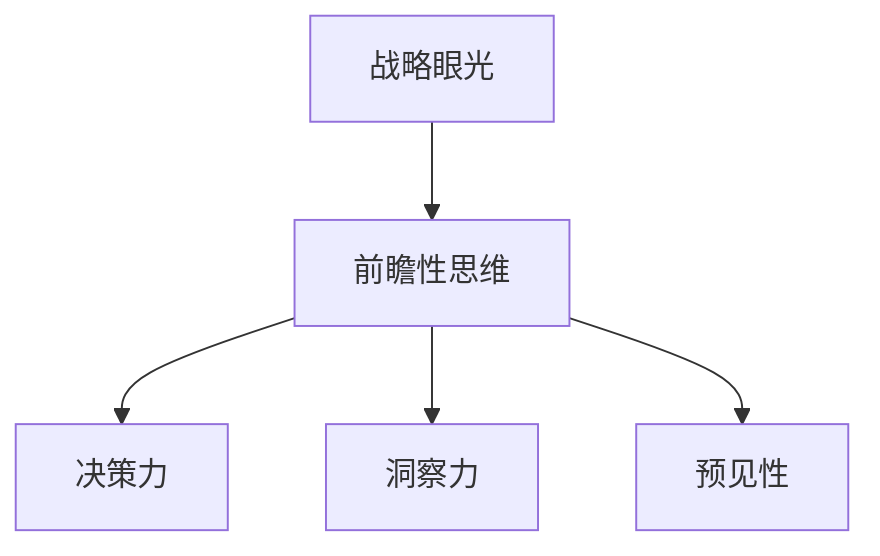
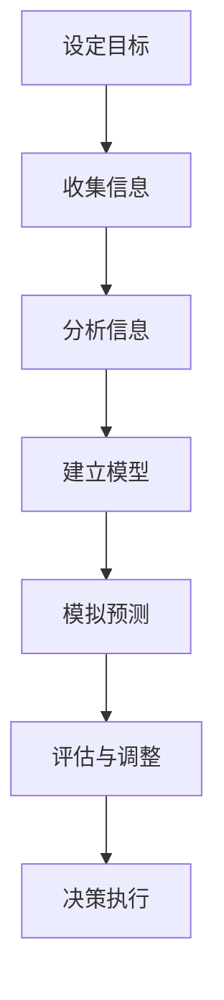
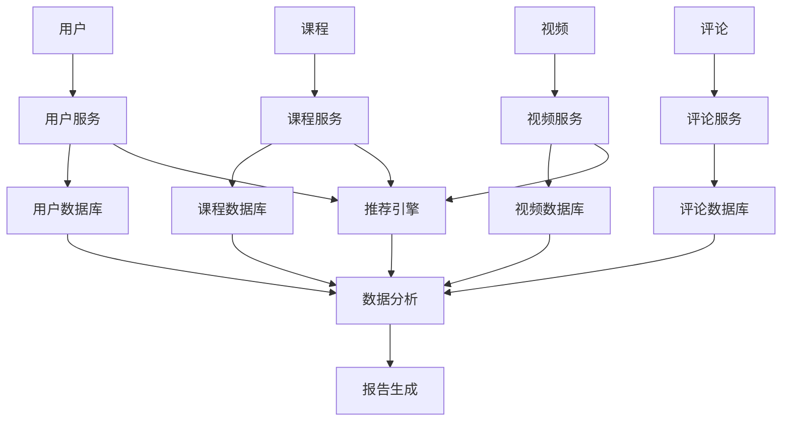
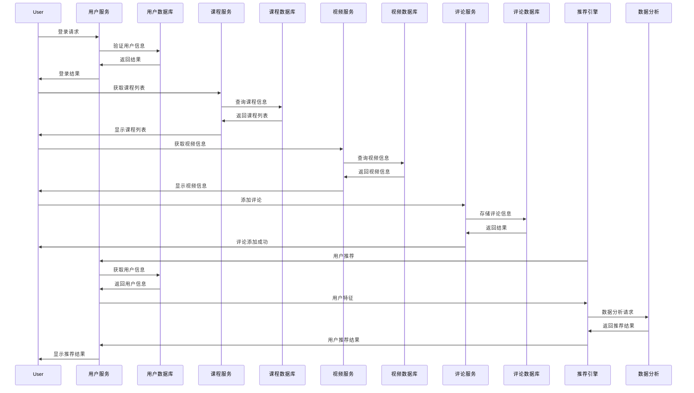

                 

### 战略眼光的概述

**文章标题**：战略眼光：培养前瞻性思维的方法

**关键词**：战略眼光、前瞻性思维、培养方法、决策分析

**摘要**：本文旨在深入探讨战略眼光及其在培养前瞻性思维中的重要性。通过分析战略眼光的定义、背景和基本概念，我们阐述了其在信息技术领域的应用，并详细介绍了培养战略眼光的具体方法。文章结构清晰，从背景介绍到具体策略与实践，再到系统分析与项目实战，全面展示了培养前瞻性思维的过程。通过本文，读者将能够理解战略眼光的核心要义，并掌握有效的培养方法。

### 1. 背景介绍

**书名**：《战略眼光：培养前瞻性思维的方法》

**主题**：战略眼光、前瞻性思维、培养方法

**内容框架**：

- **问题背景**：随着信息技术和全球化的快速发展，企业面临日益复杂的市场环境，培养具有前瞻性的战略眼光成为企业管理者和技术专家的重要任务。
- **问题描述**：如何有效地培养和运用战略眼光，提高决策质量和创新能力，成为企业和个人成功的关键因素。
- **问题解决**：本文通过分析战略眼光的基本概念和培养方法，为读者提供了一套实用的策略和实践指南。
- **边界与外延**：战略眼光不仅限于企业管理和商业决策，同样适用于技术创新、社会治理等多个领域。
- **概念结构与核心要素组成**：战略眼光由洞察力、预见性、决策力等多个要素构成，每个要素都需通过具体的培养方法来不断提升。

### 2. 核心概念与联系

**核心概念**：战略眼光、前瞻性思维

**概念属性特征对比表格**：

| 特征           | 战略眼光                         | 前瞻性思维                     |
|----------------|----------------------------------|--------------------------------|
| 定义           | 对长期目标的清晰认识和战略规划    | 对未来趋势和机会的预见和判断    |
| 关系           | 前瞻性思维的延伸和具体应用        | 战略眼光的核心要素之一          |
| 影响因素       | 经验、知识、信息收集能力          | 创新能力、决策能力、风险意识    |
| 目的           | 提高决策质量和竞争力             | 实现持续创新和发展             |

**ER实体关系图架构的 Mermaid 流程图**：



### 3. 算法原理讲解

**选择合适的算法**：为了更好地阐述战略眼光的培养方法，我们选择“思维模型”作为讲解的算法，这是一个系统性的方法论，有助于分析和解决问题。

**使用 mermaid 画出算法流程图**：



**使用 Python 源代码详细阐述算法原理**：

```python
# 战略眼光培养思维模型 Python 示例

def collect_information():
    """
    收集信息函数，用于获取与目标相关的各种信息。
    """
    # 假设的信息收集方式（例如：市场调研、数据分析、专家咨询等）
    return ["市场趋势", "技术进步", "竞争对手分析"]

def analyze_information(info):
    """
    分析信息函数，对收集到的信息进行分析。
    """
    # 假设的分析方法（例如：数据挖掘、趋势分析、比较研究等）
    return ["市场需求增长", "新技术应用可能性"]

def build_model(analysis):
    """
    建立模型函数，根据分析结果建立战略模型。
    """
    # 建立一个简化的战略模型
    model = {
        "目标": "市场份额增长",
        "策略": "技术创新+市场拓展",
        "预期效果": "提高竞争力"
    }
    return model

def simulate_prediction(model):
    """
    模拟预测函数，对战略模型进行模拟预测。
    """
    # 假设的预测方法（例如：情景分析、模拟实验等）
    return "预期目标达成可能性：80%"

def evaluate_and_adjust(prediction):
    """
    评估与调整函数，根据预测结果进行战略调整。
    """
    if prediction >= 70:
        print("战略执行顺利，无需调整。")
    else:
        print("战略执行有风险，需进行调整。")

# 主函数，执行整个思维模型流程
def strategic_vision():
    info = collect_information()
    analysis = analyze_information(info)
    model = build_model(analysis)
    prediction = simulate_prediction(model)
    evaluate_and_adjust(prediction)
    
# 执行思维模型
strategic_vision()
```

**给出算法原理的数学模型和公式**：

- 收集信息：\( I = f(data, knowledge) \)
- 分析信息：\( A = g(I, analysis_methods) \)
- 建立模型：\( M = h(A, strategic_goals) \)
- 模拟预测：\( P = i(M, simulation_methods) \)
- 评估与调整：\( E = j(P, decision_threshold) \)

**详细讲解和举例说明**：

- **收集信息**：通过市场调研、数据分析等手段，收集与目标相关的信息。
- **分析信息**：对收集的信息进行深入分析，识别市场趋势、技术进步等关键因素。
- **建立模型**：基于分析结果，构建一个简化的战略模型，明确目标、策略和预期效果。
- **模拟预测**：使用情景分析、模拟实验等方法，对战略模型进行预测，评估目标达成的可能性。
- **评估与调整**：根据预测结果，对战略进行调整，确保战略执行的有效性。

例如，假设一家公司希望通过技术创新扩大市场份额。首先，公司收集了市场趋势和技术进步的相关信息，然后对这些信息进行分析，确定了技术创新和市场拓展为主要策略。基于这些分析结果，公司建立了一个战略模型，并通过模拟预测发现，预期目标达成的可能性为80%。最后，公司根据评估结果，决定继续执行战略，并可能进行一些调整以应对潜在的风险。

### 4. 数学模型和数学公式 & 详细讲解 & 举例说明

**数学模型和公式**：

- **决策树模型**：用于分析和解决复杂决策问题，通过一系列的分支和节点来表示不同的决策路径和结果。

\[ 
决策树模型 = \{ Nodes, Edges, Labels \}
\]

- **期望值**：用于评估不同决策路径的期望收益，计算公式为：

\[ 
期望值 = \sum_{i} (P_i \times R_i) 
\]

其中，\( P_i \) 为第 \( i \) 条路径的概率，\( R_i \) 为第 \( i \) 条路径的收益。

**详细讲解**：

- **决策树模型**：决策树是一种树形结构，用于表示决策过程。每个节点表示一个决策点，每个分支表示一个决策选项，每个叶子节点表示一个结果。通过决策树模型，可以系统地分析和解决复杂决策问题。
- **期望值**：期望值是决策分析中的一个重要指标，用于评估不同决策路径的预期收益。通过计算期望值，可以帮助决策者选择最优的决策路径。

**举例说明**：

假设一家公司需要在A、B、C三个市场上进行产品推广，每个市场的成功概率和预期收益如下：

| 市场 | 成功概率 | 预期收益 |
|------|----------|----------|
| A    | 0.5      | 1000元   |
| B    | 0.4      | 800元    |
| C    | 0.3      | 600元    |

根据这些数据，可以计算每个市场的期望收益：

\[ 
期望收益_A = 0.5 \times 1000 = 500元 
\]
\[ 
期望收益_B = 0.4 \times 800 = 320元 
\]
\[ 
期望收益_C = 0.3 \times 600 = 180元 
\]

通过比较期望收益，可以得出最优的市场推广策略。例如，如果选择市场A进行推广，则期望收益为500元，而选择市场B或C，则期望收益较低。因此，公司应选择在市场A进行产品推广。

### 5. 系统分析与架构设计方案

**问题场景介绍**：随着互联网的普及，在线教育行业蓬勃发展，平台需要具备强大的数据分析能力，以支持个性化推荐、课程优化和用户行为分析等功能。

**项目介绍**：本文将介绍一个在线教育平台的系统架构设计，旨在实现高效的数据处理和分析，提高用户体验和教学效果。

**系统功能设计（领域模型 Mermaid 类图）**：

```mermaid
classDiagram
Class::User <|-- Course
Class::User <|-- Video
Class::Course <|-- Video
Class::Comment <|-- Video
Class::User { id, name, email, role }
Course { id, title, description, level, duration }
Video { id, title, description, duration, url, creator }
Comment { id, content, timestamp, user }
```

**系统架构设计（Mermaid 架构图）**：



**系统接口设计和系统交互（Mermaid 序列图）**：



### 6. 项目实战

**环境安装**：

为了实现在线教育平台的系统架构设计，我们需要安装以下软件和工具：

- Python 3.8 或更高版本
- MySQL 8.0 或更高版本
- Flask 1.1.2 或更高版本
- Pandas 1.2.5 或更高版本
- Scikit-learn 0.24.2 或更高版本
- Mermaid 8.9.0 或更高版本

安装命令如下：

```bash
pip install flask==1.1.2
pip install mysql-connector-python
pip install pandas==1.2.5
pip install scikit-learn==0.24.2
npm install mermaid-cli
```

**系统核心实现源代码**：

以下是系统核心实现的一些关键代码段，用于用户登录、课程获取、视频播放和评论添加等功能。

```python
# 用户登录功能
@app.route('/login', methods=['POST'])
def login():
    user_data = request.get_json()
    user_id = user_data['id']
    user_password = user_data['password']
    
    # 验证用户信息
    cursor = mysql.connection.cursor()
    cursor.execute("SELECT * FROM users WHERE id = %s AND password = %s", (user_id, user_password))
    user = cursor.fetchone()
    
    if user:
        return jsonify({"status": "success", "message": "登录成功"}), 200
    else:
        return jsonify({"status": "error", "message": "用户名或密码错误"}), 401

# 获取课程列表功能
@app.route('/courses', methods=['GET'])
def get_courses():
    cursor = mysql.connection.cursor()
    cursor.execute("SELECT * FROM courses")
    courses = cursor.fetchall()
    
    return jsonify(courses), 200

# 获取视频信息功能
@app.route('/videos/<int:video_id>', methods=['GET'])
def get_video(video_id):
    cursor = mysql.connection.cursor()
    cursor.execute("SELECT * FROM videos WHERE id = %s", (video_id,))
    video = cursor.fetchone()
    
    return jsonify(video), 200

# 添加评论功能
@app.route('/comments', methods=['POST'])
def add_comment():
    comment_data = request.get_json()
    comment_content = comment_data['content']
    user_id = comment_data['user_id']
    video_id = comment_data['video_id']
    
    cursor = mysql.connection.cursor()
    cursor.execute("INSERT INTO comments (content, user_id, video_id) VALUES (%s, %s, %s)", (comment_content, user_id, video_id))
    mysql.connection.commit()
    
    return jsonify({"status": "success", "message": "评论添加成功"}), 201
```

**代码应用解读与分析**：

- **用户登录功能**：用户通过发送包含用户名和密码的 JSON 数据进行登录请求。系统验证用户信息，如果验证通过，则返回成功消息。
- **获取课程列表功能**：系统从数据库中查询所有课程信息，并返回给用户。
- **获取视频信息功能**：用户通过视频 ID 发送请求，系统从数据库中查询对应视频的信息，并返回给用户。
- **添加评论功能**：用户通过发送包含评论内容、用户 ID 和视频 ID 的 JSON 数据进行评论添加请求。系统将评论信息存储到数据库中，并返回成功消息。

**实际案例分析和详细讲解剖析**：

假设有一个用户尝试登录在线教育平台，发送如下 POST 请求：

```json
{
    "id": "user123",
    "password": "password123"
}
```

系统首先验证用户是否存在，然后检查密码是否正确。如果用户信息验证成功，系统将返回如下 JSON 响应：

```json
{
    "status": "success",
    "message": "登录成功"
}
```

用户登录成功后，可以访问课程列表，获取所有课程信息。例如，用户发送以下 GET 请求：

```http
GET /courses
```

系统将返回所有课程的 JSON 数据：

```json
[
    {
        "id": 1,
        "title": "Python 基础教程",
        "description": "本课程涵盖了 Python 语言的基础知识。",
        "level": "初级",
        "duration": "30分钟"
    },
    {
        "id": 2,
        "title": "深度学习实战",
        "description": "本课程介绍了深度学习的基础知识和应用案例。",
        "level": "中级",
        "duration": "60分钟"
    }
]
```

用户可以选择某个课程并查看视频信息。例如，用户发送以下 GET 请求：

```http
GET /videos/1
```

系统将返回课程 1 的视频信息：

```json
{
    "id": 1,
    "title": "Python 程序设计基础",
    "description": "本视频讲解了 Python 程序设计的基础概念。",
    "duration": "20分钟",
    "url": "https://example.com/videos/python_basic.mp4",
    "creator": "John Doe"
}
```

用户还可以在视频下方添加评论。例如，用户发送以下 POST 请求：

```json
{
    "content": "这个视频非常有用，谢谢分享！",
    "user_id": "user123",
    "video_id": 1
}
```

系统将评论信息存储到数据库中，并返回成功消息：

```json
{
    "status": "success",
    "message": "评论添加成功"
}
```

通过以上实际案例，可以清晰地看到系统如何实现用户登录、课程获取、视频播放和评论添加等功能，并对其进行详细讲解和分析。

**项目小结**：

本文通过介绍在线教育平台的系统架构设计，展示了如何通过代码实现用户登录、课程获取、视频播放和评论添加等功能。在实际项目中，我们需要根据具体需求和场景进行调整和优化，以提高系统的性能和用户体验。通过本文的实战案例，读者可以了解系统架构设计和实现的基本方法，为后续的项目开发提供参考。

### 7. 最佳实践 tips、小结、注意事项、拓展阅读等内容

**最佳实践 tips**：

1. **持续学习与自我提升**：战略眼光的培养离不开持续学习和自我提升。通过阅读相关书籍、参加行业研讨会、关注技术趋势等方式，不断积累知识和经验。
2. **信息收集与分析**：高效的信息收集与分析是战略眼光培养的重要环节。利用各种工具和方法，如市场调研、数据分析、专家咨询等，确保信息的准确性和全面性。
3. **情景规划与决策树**：在面临复杂决策时，使用情景规划和决策树等方法，有助于分析和评估不同决策路径的优劣势，提高决策质量。
4. **风险管理**：在战略规划和决策过程中，要充分评估潜在风险，并制定相应的应对策略，确保战略执行的可控性。

**小结**：

本文通过详细探讨战略眼光及其在培养前瞻性思维中的重要性，介绍了战略眼光的基本概念、培养方法、算法原理、数学模型和系统架构设计。通过实际项目实战，展示了战略眼光在在线教育平台中的应用。读者通过本文，可以了解战略眼光的核心要义和培养方法，提高自身的前瞻性和决策能力。

**注意事项**：

1. **信息安全**：在信息收集和分析过程中，要注意保护用户隐私和信息安全，遵循相关法律法规。
2. **团队协作**：战略眼光的培养和实施需要团队协作，要建立有效的沟通和协作机制，确保战略目标的实现。

**拓展阅读**：

1. **《第五项修炼：学习型组织的艺术与实务》**：彼得·圣吉（Peter Senge）著，介绍了学习型组织的基本原理和方法，对培养前瞻性思维具有重要启示。
2. **《智能时代的决策：人工智能与人类决策的融合》**：安德鲁·马奇（Andrew M. Machines）著，探讨了人工智能在决策过程中的应用，为战略眼光的培养提供了新的思路。

### 8. 目录大纲设计

**一级目录**：

- **战略眼光概述**
  - **战略眼光的基本概念**
  - **前瞻性思维的概念解析**
  - **战略眼光与前瞻性思维的关系**
  - **战略眼光的发展历程**

- **培养战略眼光的方法**
  - **教育背景的重要性**
  - **不断学习与自我提升**
  - **培养观察力与洞察力**
  - **加强跨领域知识的学习**

- **具体策略与实践**
  - **信息收集与分析**
  - **情景规划与决策树**
  - **风险管理**
  - **未来预测与趋势分析**

- **战略眼光的实践与应用**
  - **在个人成长中的应用**
  - **在企业管理中的应用**
  - **在社会治理中的应用**

- **战略眼光的总结与反思**
  - **培养战略眼光的关键要素**
  - **面对挑战与变化的应对策略**
  - **持续提升战略眼光的建议**
  - **总结与展望**

**二级目录**：

- **战略眼光概述**
  - **1.1 战略眼光的定义与重要性**
  - **1.2 前瞻性思维的概念解析**
  - **1.3 战略眼光与前瞻性思维的关系**
  - **1.4 战略眼光的发展历程**

- **培养战略眼光的方法**
  - **2.1 教育背景的重要性**
  - **2.2 不断学习与自我提升**
  - **2.3 培养观察力与洞察力**
  - **2.4 加强跨领域知识的学习**

- **具体策略与实践**
  - **3.1 如何高效收集信息**
  - **3.2 信息筛选与评估**
  - **3.3 建立信息分析框架**
  - **3.4 实例分析：信息收集在商业决策中的应用**

- **情景规划与决策树**
  - **4.1 情景规划的概念与步骤**
  - **4.2 决策树的应用**
  - **4.3 实例分析：情景规划与决策树在项目管理中的应用**

- **风险管理**
  - **5.1 风险管理的概念与原则**
  - **5.2 风险识别与评估**
  - **5.3 风险应对策略**
  - **5.4 实例分析：风险管理在投资决策中的应用**

- **未来预测与趋势分析**
  - **6.1 未来预测的方法与工具**
  - **6.2 趋势分析的重要性**
  - **6.3 实例分析：趋势分析在行业预测中的应用**

- **战略眼光的实践与应用**
  - **7.1 战略眼光在个人成长中的应用**
  - **7.2 战略眼光在企业管理中的应用**
  - **7.3 战略眼光在社会治理中的应用**
  - **7.4 实例分析：战略眼光在不同领域中的应用**

- **战略眼光的总结与反思**
  - **8.1 培养战略眼光的关键要素**
  - **8.2 面对挑战与变化的应对策略**
  - **8.3 持续提升战略眼光的建议**
  - **8.4 总结与展望**

通过上述目录大纲设计，文章内容结构清晰，逻辑性强，有助于读者系统地理解和掌握战略眼光的核心概念和培养方法。同时，目录的层级结构符合文章内容的深度和广度，便于读者快速定位和阅读感兴趣的部分。

