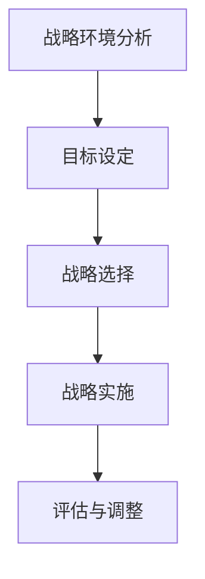
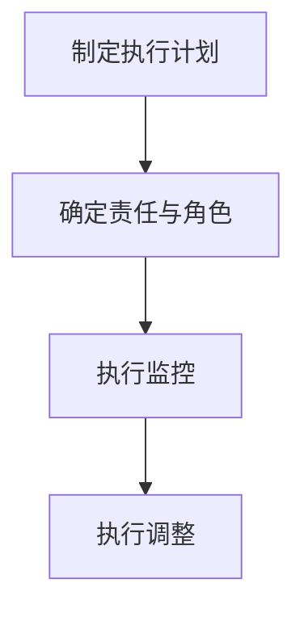

                 

### 1.1 背景介绍

在当今快速变化且竞争激烈的商业环境中，企业能否成功很大程度上取决于其战略规划与执行的效率。战略规划与执行不仅涉及企业的高层管理，也贯穿于整个组织的运营中。有效的战略规划可以明确企业的目标和发展方向，而成功的执行则是将这些目标转化为具体行动和实际成果的关键。

首先，让我们回顾一下什么是战略规划。战略规划是指企业为了实现长期目标，在综合分析内外部环境的基础上，制定的指导企业未来发展的总体策略和计划。这一过程涉及对市场趋势、竞争对手、内部资源等各方面的深入分析，以制定出既具前瞻性又具有可行性的战略方案。战略规划不仅是高层管理者的职责，也需要全员参与，以确保各个部门和团队都能够明确自身的角色和任务。

接下来，我们讨论战略执行。战略执行是将战略规划转化为实际操作的过程。它需要将战略目标分解为具体的行动计划，并确保这些计划得到有效实施。战略执行的挑战在于协调不同部门和团队之间的工作，解决资源分配和优先级管理的问题，以及应对变化和不确定性带来的挑战。成功的战略执行依赖于高效的沟通、明确的职责分工、以及持续的过程监控和调整。

那么，为何战略规划与执行如此重要？首先，战略规划可以确保企业始终朝着正确的方向前进，避免资源浪费和战略迷失。其次，有效的战略执行能够提高企业的运营效率和市场竞争力，使企业能够快速响应市场变化，抓住机遇。此外，良好的战略规划与执行还能增强企业的抗风险能力，确保在面临突发情况时能够迅速应对，减少损失。

总体来说，战略规划与执行是企业成功的关键环节。它们不仅帮助企业明确发展目标，还通过具体的行动和措施实现这些目标。在这个背景下，本文将深入探讨战略规划与执行的理论、方法、工具和实践，旨在为读者提供一套全面且实用的指导框架。

### 1.2 核心概念

要深入探讨战略规划与执行，首先需要明确一些核心概念，这将为后续内容的展开提供基础。

#### 战略规划

战略规划（Strategic Planning）是企业为了实现其长期目标而进行的一系列分析和决策过程。它不仅涉及企业内部资源的配置，还包括对市场环境、竞争态势、未来趋势等多方面的考量。战略规划通常包括以下关键步骤：

1. **环境分析**：通过市场调研、竞争分析、SWOT分析等方法，了解企业所处的外部环境和内部条件。
2. **目标设定**：在环境分析的基础上，明确企业的发展目标，包括财务目标、市场目标、创新目标等。
3. **战略选择**：根据目标设定，制定具体的战略方案，包括产品开发、市场拓展、成本控制等。
4. **战略实施**：将战略方案转化为具体的行动计划，明确责任分工、资源配置、时间安排等。
5. **评估与调整**：在战略实施过程中，定期评估进展情况，并根据实际情况进行调整。

#### 战略执行

战略执行（Strategic Execution）是将战略规划中的目标转化为实际成果的过程。它需要通过具体的行动和措施，确保战略目标的实现。战略执行的几个关键要素包括：

1. **计划制定**：将战略目标分解为具体的行动计划，明确任务分工、时间节点、资源配置等。
2. **责任分配**：确保每个团队成员都清楚自己的职责和任务，以及与其他团队和部门之间的协作关系。
3. **过程监控**：通过建立有效的监控机制，跟踪计划执行情况，及时发现和解决问题。
4. **调整与优化**：根据实际情况和反馈，对执行过程进行必要的调整和优化，确保目标实现。

#### 领导艺术

领导艺术（Leadership）是指领导者通过影响和激励团队，实现组织目标的能力。有效的领导艺术不仅包括领导理论和方法，还需要领导者具备一定的个人素质和技能。以下是一些重要的领导概念：

1. **变革型领导**：通过激发员工的潜力和创造力，推动组织实现变革和发展。
2. **参与型领导**：鼓励员工参与决策过程，增强团队的凝聚力和归属感。
3. **系统型领导**：将组织视为一个整体系统，通过协调不同部门和团队之间的关系，实现组织目标的最大化。

#### 从蓝图到现实

从蓝图到现实（From Blueprint to Reality）是指将战略规划转化为实际操作和成果的过程。这个过程涉及到多个环节，包括蓝图解读、实施路径设计、风险管理等。以下是几个关键步骤：

1. **蓝图解读**：理解战略规划中的目标和要求，将其转化为具体的实施方案。
2. **实施路径设计**：设计合理的实施路径，确保各项任务能够按时完成，资源得到有效利用。
3. **风险管理**：识别和分析可能的风险，并制定相应的应对策略，确保项目顺利进行。
4. **成功案例分析**：通过分析成功案例，总结经验教训，为后续项目提供参考。

#### 概念属性特征对比表格

为了更清晰地理解这些核心概念，我们可以通过一个属性特征对比表格来展示它们之间的区别和联系：

| 概念       | 定义                                                         | 特征                           | 关联性                           |
|------------|--------------------------------------------------------------|--------------------------------|----------------------------------|
| 战略规划   | 企业为实现长期目标进行的分析和决策过程                       | 环境分析、目标设定、战略选择等 | 基础概念，指导战略执行           |
| 战略执行   | 将战略规划中的目标转化为实际成果的过程                       | 计划制定、责任分配、过程监控等 | 实施战略规划的关键环节           |
| 领导艺术   | 领导者通过影响和激励团队，实现组织目标的能力                   | 变革型领导、参与型领导等       | 支持战略规划和执行的有效性       |
| 从蓝图到现实 | 将战略规划转化为实际操作和成果的过程                         | 蓝图解读、实施路径设计、风险管理等 | 实现战略目标的具体路径           |

#### ER实体关系图架构

为了进一步理解这些核心概念之间的关系，我们可以使用ER（实体-关系）图来展示它们在系统架构中的位置和作用。以下是战略规划与执行系统的ER图：

```mermaid
erDiagram
    StrategicPlanning ||--|{ Execution : 实施过程}
    Leadership     ||--|{ StrategicPlanning : 领导作用}
    StrategicPlanning ||--|{ FromBlueprint : 转化路径}
```

在这个ER图中，战略规划作为系统的核心，通过实施过程（执行）将目标转化为实际成果。领导艺术在战略规划和执行过程中起到关键作用，而“从蓝图到现实”则是指战略规划的实施路径和具体操作。

通过这些核心概念的理解和ER图的展示，我们为后续内容的深入分析奠定了基础。接下来，我们将逐步探讨战略规划的具体原理、过程、方法以及执行所需的工具和策略。

### 1.3 问题解决与边界

在探讨战略规划与执行的过程中，我们必须明确问题解决的方法及其适用的边界条件。这不仅有助于我们更好地理解这两个概念，还能在实际应用中避免盲目操作，提高效率。

首先，问题解决（Problem Solving）是战略规划与执行中的重要环节。有效的解决问题方法可以确保企业在面临挑战时能够迅速找到应对策略，实现目标的实现。以下是几种常见的问题解决方法：

1. **头脑风暴**：通过集体讨论，激发创意和思路，找出潜在解决方案。
2. **SWOT分析**：通过分析企业的优势（Strengths）、劣势（Weaknesses）、机会（Opportunities）和威胁（Threats），制定有针对性的战略。
3. **目标导向法**：明确具体目标，逐步分解为可操作的任务，通过实现小目标来达成最终目标。
4. **系统分析法**：将复杂问题分解为多个子系统，逐一分析和解决。

这些方法各有优缺点，适用于不同的场景。例如，头脑风暴适合创新性解决方案的提出，SWOT分析则适用于全面评估企业现状。在实际应用中，我们需要根据具体问题选择合适的方法，并综合考虑多种因素。

接下来，我们讨论战略规划与执行的边界。这些边界条件决定了战略规划与执行的适用范围和限制，包括：

1. **企业规模**：战略规划与执行在不同规模的企业中具有不同的复杂性。在大企业中，战略规划和执行需要更详细的规划和协调，而在中小企业中，可能更加注重灵活性和快速响应。
2. **市场环境**：市场环境的变化对企业战略的影响至关重要。在高度动态的市场中，战略规划需要更具前瞻性和灵活性，而相对稳定的市场则允许更长期和稳健的战略规划。
3. **资源限制**：资源限制是战略规划与执行中的常见问题。企业在制定战略时需要充分考虑资源分配的合理性和有效性，确保资源得到充分利用。
4. **组织文化**：组织文化对企业战略规划与执行的影响不可忽视。开放、创新的文化有助于战略的顺利实施，而保守、僵化的文化则可能阻碍创新和变革。

在实际操作中，我们需要在问题解决和边界条件之间找到平衡。以下是一些注意事项：

1. **明确目标和问题**：在开始战略规划和执行之前，必须明确目标和问题，确保所有参与者对问题有共同的理解。
2. **数据驱动决策**：依赖准确的数据和事实来支持决策，避免主观判断和盲目行动。
3. **持续监控和调整**：在战略实施过程中，定期监控进展情况，并根据反馈进行必要的调整。
4. **跨部门协作**：鼓励跨部门协作，确保战略规划和执行的连贯性和一致性。

总之，战略规划与执行是一个复杂且动态的过程，需要综合考虑问题解决方法、边界条件以及各种内外部因素。通过科学的方法和严谨的执行，企业可以更好地实现其长期发展目标。

### 2.1 战略规划原理

在深入探讨战略规划原理之前，我们需要理解战略规划的核心概念和理论基础。战略规划不仅仅是制定一个愿景和目标，而是一个系统化的过程，它需要综合考虑企业内外部环境、资源条件以及未来趋势，以确保企业在竞争激烈的市场中立于不败之地。

#### 战略规划的定义

战略规划（Strategic Planning）是企业为了实现其长期目标，通过系统化的分析和决策过程，制定和优化未来行动方案的一种管理活动。它包括对市场、竞争、技术、资源等多方面因素的综合分析，以确定企业的核心竞争力和发展方向。战略规划不仅涉及到高层的战略决策，还贯穿于整个组织的日常运营中。

#### 战略规划的重要性

战略规划对于企业的发展具有至关重要的意义，主要表现在以下几个方面：

1. **明确目标**：战略规划帮助企业明确长期目标和发展方向，为企业的各项活动提供统一的目标和指引。
2. **资源优化**：通过战略规划，企业可以更加合理地分配资源，避免资源浪费，提高资源利用效率。
3. **竞争力提升**：战略规划可以帮助企业识别和利用市场机会，同时规避潜在风险，提高企业的市场竞争力。
4. **持续发展**：战略规划不仅是短期目标的实现手段，更是企业长期发展的基础，有助于企业实现可持续增长。

#### 战略规划的目标

战略规划的目标可以分为以下几个方面：

1. **市场目标**：通过市场调研和分析，明确企业的市场定位、目标客户群体和市场占有率等。
2. **财务目标**：设定企业的盈利目标、投资回报率、成本控制目标等，确保企业的财务健康和持续增长。
3. **创新目标**：推动技术和管理创新，保持企业的竞争优势，提升企业的核心竞争力。
4. **社会责任目标**：在追求经济利益的同时，关注企业的社会责任，提升企业形象和品牌价值。

#### 战略规划的理论基础

战略规划的理论基础主要包括以下几个方面：

1. **竞争理论**：竞争理论强调企业在市场竞争中的定位和策略，通过差异化、成本领先等方式获得竞争优势。
2. **资源基础理论**：资源基础理论认为企业的核心竞争力来源于其独特的资源和能力，通过合理配置和利用这些资源，实现战略目标。
3. **系统动力学**：系统动力学强调企业作为一个复杂系统，内部各部分之间存在相互作用和反馈，通过系统分析来优化整体表现。
4. **组织行为学**：组织行为学关注企业内部的人际关系、团队合作和领导行为，通过优化组织行为来提高执行效率。

#### 战略规划的过程

战略规划通常包括以下几个关键步骤：

1. **环境分析**：通过市场调研、竞争分析、SWOT分析等方法，了解企业所处的内外部环境，识别机会和威胁。
2. **目标设定**：在环境分析的基础上，明确企业的发展目标，包括财务、市场、创新等各个方面的目标。
3. **战略选择**：根据目标设定，制定具体的战略方案，包括产品开发、市场拓展、成本控制等。
4. **战略实施**：将战略方案转化为具体的行动计划，明确责任分工、资源配置、时间安排等。
5. **评估与调整**：在战略实施过程中，定期评估进展情况，并根据实际情况进行调整，确保战略目标的实现。

#### 战略规划的框架

战略规划的框架通常包括以下几个关键部分：

1. **愿景和使命**：明确企业的愿景和使命，为企业的未来发展提供方向和指导。
2. **目标和关键绩效指标**：设定具体的、可衡量的目标和关键绩效指标，以衡量战略规划的实施效果。
3. **战略方案**：根据目标和资源条件，制定具体的战略方案，包括市场拓展、产品创新、成本控制等。
4. **行动计划**：将战略方案分解为具体的行动计划，明确任务分工、时间节点、资源配置等。
5. **评估和反馈**：建立有效的评估机制，定期评估战略规划的执行情况，并根据反馈进行调整。

#### 概念属性特征对比表格

为了更清晰地理解战略规划的原理和框架，我们可以通过一个属性特征对比表格来展示不同部分之间的关系：

| 部分       | 定义                                                         | 特征                           | 关联性                           |
|------------|--------------------------------------------------------------|--------------------------------|----------------------------------|
| 愿景和使命 | 明确企业的未来发展方向和核心价值                             | 指引性、指导性、愿景性         | 战略规划的基础和核心             |
| 目标和KPI  | 设定具体的、可衡量的目标和关键绩效指标                       | 可衡量性、目标性、绩效性       | 指导战略方案和行动计划           |
| 战略方案   | 根据目标和资源条件，制定具体的战略方案                       | 实施性、灵活性、针对性         | 战略规划的具体操作和落实         |
| 行动计划   | 将战略方案分解为具体的行动计划，明确任务分工、时间节点、资源配置等 | 可操作性、可执行性、系统性     | 确保战略规划的实施和执行         |
| 评估和反馈 | 建立有效的评估机制，定期评估战略规划的执行情况，并根据反馈进行调整 | 监控性、反馈性、调整性         | 保证战略规划的有效性和持续性     |

#### ER实体关系图架构

为了进一步理解战略规划的架构，我们可以使用ER（实体-关系）图来展示战略规划中的关键实体及其关系：

```mermaid
erDiagram
    VisionAndMission ||--|{ GoalsAndKPIs : 指导目标设定}
    GoalsAndKPIs ||--|{ StrategicPlans : 制定具体方案}
    StrategicPlans ||--|{ ActionPlans : 转化为行动计划}
    ActionPlans ||--|{ EvaluationsAndFeedback : 监控与调整}
```

在这个ER图中，愿景和使命作为战略规划的基础，指导目标和关键绩效指标的设定。目标和关键绩效指标进一步指导具体的战略方案，战略方案转化为具体的行动计划。最后，通过评估和反馈机制，对行动计划进行监控和调整，确保战略规划的有效实施。

通过以上对战略规划原理的详细分析，我们为后续内容的深入探讨奠定了基础。接下来，我们将进一步探讨战略规划的过程、方法和工具，帮助读者更好地理解和应用战略规划。

### 2.2 战略规划过程

战略规划是一个复杂且系统化的过程，涉及多个阶段和环节。理解这些阶段及其具体内容对于企业成功制定和实施战略至关重要。以下是战略规划过程的详细步骤：

#### 2.2.1 战略环境分析

战略环境分析是战略规划的基础，它涉及对企业外部环境和内部条件的全面分析。通过环境分析，企业可以识别出市场机会和潜在威胁，为后续的战略制定提供依据。

1. **市场分析**：包括市场趋势、市场规模、目标客户群体、竞争对手分析等。通过市场分析，企业可以了解市场动态，确定市场机会和威胁。
2. **竞争分析**：通过分析竞争对手的产品、市场份额、营销策略等，企业可以了解自己在市场中的位置和潜在竞争压力。
3. **内部条件分析**：包括企业的资源、能力、核心竞争力、组织结构等。内部条件分析有助于企业了解自身的优势和劣势。

#### 2.2.2 目标设定

在完成环境分析后，企业需要设定明确的发展目标。这些目标应具有可衡量性、可实现性和挑战性。

1. **财务目标**：如增加收入、降低成本、提高投资回报率等。
2. **市场目标**：如市场份额、客户满意度、品牌知名度等。
3. **创新目标**：如新产品开发、技术创新、专利申请等。
4. **社会责任目标**：如环保、社会公益等。

#### 2.2.3 战略选择

目标设定后，企业需要根据环境和资源条件，选择具体的战略方案。常见的战略选择包括：

1. **成本领先战略**：通过大规模生产和标准化产品降低成本，以低成本优势吸引价格敏感的消费者。
2. **差异化战略**：通过独特的产品特性或服务，满足特定客户群体的需求，形成竞争优势。
3. **集中战略**：在特定的市场或产品领域集中资源，提供专业的产品和服务，以获得较高的市场份额和利润率。

#### 2.2.4 战略实施

战略选择确定后，需要将其转化为具体的行动计划。战略实施包括以下几个关键步骤：

1. **资源分配**：根据战略目标，合理配置企业的人力、财力、物力等资源，确保战略得到充分支持。
2. **任务分解**：将战略目标分解为具体的工作任务，明确每个任务的负责人和时间节点。
3. **责任分配**：确保每个团队成员都清楚自己的职责和任务，建立有效的沟通和协作机制。
4. **过程监控**：建立监控机制，定期跟踪战略实施的进展情况，及时发现和解决问题。

#### 2.2.5 评估与调整

战略实施过程中，需要定期评估战略目标和执行情况，并根据反馈进行必要的调整。

1. **绩效评估**：通过关键绩效指标（KPI）评估战略实施的效果，如市场份额、收入增长、成本节约等。
2. **反馈机制**：建立有效的反馈机制，收集员工、客户和市场的反馈，为战略调整提供依据。
3. **调整与优化**：根据绩效评估和反馈结果，对战略方案进行必要的调整和优化，确保战略目标的实现。

#### 战略规划流程图

为了更直观地理解战略规划过程，我们可以使用Mermaid工具绘制一个流程图：



在这个流程图中，战略环境分析作为起点，引导企业明确目标并选择合适的战略方案。战略实施是将战略转化为具体行动的过程，而评估与调整则是确保战略目标实现的关键环节。

通过以上对战略规划过程的详细分析，我们可以看到，战略规划是一个系统化、多层次的过程，涉及从环境分析到目标设定，再到战略选择和实施，以及最终的评估与调整。这个过程不仅需要深入的思考和科学的分析，还需要明确的执行和持续的管理。接下来，我们将探讨战略规划的各种方法和工具，以帮助读者在实际操作中更好地应用战略规划。

### 2.3 战略规划方法

战略规划的成功不仅依赖于一个清晰的目标设定，还需要科学的方法和工具来支持整个规划过程。以下是几种常见的战略规划方法及其应用：

#### 2.3.1 SWOT分析

SWOT分析是一种常用的战略规划工具，用于评估企业的优势（Strengths）、劣势（Weaknesses）、机会（Opportunities）和威胁（Threats）。通过SWOT分析，企业可以全面了解自身的竞争地位和潜在问题，从而制定出更加有针对性的战略。

1. **优势（Strengths）**：企业的核心竞争力，如独特的产品、技术、品牌等。
2. **劣势（Weaknesses）**：企业存在的不足，如资源有限、市场覆盖不足等。
3. **机会（Opportunities）**：市场趋势和外部环境为企业带来的机会，如新市场、新技术等。
4. **威胁（Threats）**：外部环境可能对企业造成的威胁，如竞争对手、政策变化等。

SWOT分析步骤如下：

1. **收集信息**：通过市场调研、数据分析、员工访谈等方式，收集企业内外部的相关信息。
2. **分类整理**：将收集到的信息进行分类，分别列出优势、劣势、机会和威胁。
3. **分析整合**：对分类后的信息进行整合分析，找出企业内部和外部的关键因素。
4. **制定战略**：根据SWOT分析结果，制定相应的战略，如利用优势抓住机会、克服劣势、规避威胁等。

#### 2.3.2 PEST分析

PEST分析是一种用于评估企业外部环境的方法，主要关注政治（Political）、经济（Economic）、社会（Sociocultural）和技术（Technological）四个方面的因素。通过PEST分析，企业可以更好地理解宏观环境对企业战略的影响。

1. **政治因素**：政府的政策、法规、稳定性等。
2. **经济因素**：经济增长率、通货膨胀率、利率等。
3. **社会因素**：人口结构、文化习俗、社会价值观等。
4. **技术因素**：技术发展趋势、创新速度、技术普及率等。

PEST分析步骤如下：

1. **确定分析范围**：明确需要分析的具体领域和时间段。
2. **收集数据**：通过新闻报道、政府报告、行业研究等渠道，收集与PEST相关的数据。
3. **分析影响**：分析每个因素对企业战略的影响，如政治稳定性可能影响企业的运营成本，技术进步可能带来新的市场机会等。
4. **制定应对策略**：根据分析结果，制定相应的应对策略，以应对外部环境的变化。

#### 2.3.3 波士顿矩阵

波士顿矩阵（Boston Matrix）是一种用于评估企业产品组合和资源配置的工具，通过将产品分为“明星”、“现金牛”、“问题儿童”和“瘦狗”四种类型，帮助企业确定产品发展和资源配置的策略。

1. **明星产品**：市场份额高，增长率高。这类产品是企业的重点发展对象，需要投入资源以维持其市场地位。
2. **现金牛产品**：市场份额高，增长率低。这类产品为企业提供稳定的现金流，应继续维持其市场份额。
3. **问题儿童**：市场份额低，增长率高。这类产品具有潜力，但需要投入资源以扩大市场份额。
4. **瘦狗产品**：市场份额低，增长率低。这类产品通常没有增长潜力，企业可以选择减少投资或淘汰。

波士顿矩阵步骤如下：

1. **确定评估指标**：明确评估产品的市场份额和增长率等指标。
2. **数据收集**：收集产品的市场份额和增长率等数据。
3. **分类评估**：根据数据，将产品分为“明星”、“现金牛”、“问题儿童”和“瘦狗”四种类型。
4. **制定策略**：根据产品类型，制定相应的资源配置和发展策略。

#### 2.3.4 基于数据的战略规划

随着大数据和人工智能技术的发展，基于数据的战略规划方法变得越来越重要。这种方法利用海量数据进行分析和预测，为企业提供更准确和有针对性的战略建议。

1. **数据收集**：通过内部数据系统、外部数据接口等方式，收集与企业运营相关的数据。
2. **数据处理**：对收集到的数据进行清洗、整合和分析，提取有用的信息。
3. **数据可视化**：通过图表、报表等方式，将分析结果可视化，便于理解和决策。
4. **预测与优化**：利用数据模型和算法，预测未来市场趋势和业务发展，并制定相应的优化策略。

#### 概念属性特征对比表格

为了更清晰地比较这些战略规划方法，我们可以通过一个属性特征对比表格来展示它们的特点和适用场景：

| 方法         | 定义                                                         | 特征                           | 适用场景                             |
|------------|--------------------------------------------------------------|--------------------------------|--------------------------------------|
| SWOT分析   | 评估企业的优势、劣势、机会和威胁                             | 全面性、针对性、战略指导性     | 企业内部和外部环境分析               |
| PEST分析   | 分析企业所处宏观环境的政治、经济、社会和技术因素            | 宏观性、外部环境适应性         | 确定外部环境对企业战略的影响         |
| 波士顿矩阵   | 评估企业产品组合的竞争地位和资源配置                         | 产品分类、资源配置指导性       | 产品管理和资源配置                   |
| 数据驱动   | 利用大数据和人工智能技术进行战略规划                         | 数据化、预测性、高效性         | 需要数据支持和复杂分析的领域         |

#### ER实体关系图架构

为了进一步理解这些战略规划方法的架构，我们可以使用ER（实体-关系）图来展示它们在企业战略规划系统中的关系：

```mermaid
erDiagram
    SWOTAnalysis ||--|{ PESTAnalysis : 外部环境分析}
    PESTAnalysis ||--|{ ProductPortfolio : 产品组合分析}
    ProductPortfolio ||--|{ DataDrivenStrategy : 数据驱动策略}
```

在这个ER图中，SWOT分析和PEST分析用于评估企业的内外部环境，波士顿矩阵用于产品组合分析，而数据驱动策略则利用这些分析结果进行更精确的战略规划。

通过以上对战略规划方法的详细探讨，我们可以看到，不同的方法在战略规划过程中扮演着不同的角色。企业应根据自身情况和需求，选择合适的方法，以实现有效的战略规划。接下来，我们将进一步探讨战略规划过程中使用的工具，以帮助读者更好地应用这些方法。

### 2.4 战略规划工具

在战略规划过程中，使用适当的工具能够显著提高规划的质量和效率。以下是一些常用的战略规划工具，包括战略地图、资源配置矩阵和关键绩效指标（KPI）。

#### 2.4.1 战略地图

战略地图（Strategy Map）是一种用于展示企业战略目标的可视化工具。它将企业的财务、客户、内部流程、学习与成长等多个维度整合在一起，形成一个清晰的战略框架。

1. **战略地图的结构**：
   - **财务维度**：包括利润、收入、成本等关键财务指标。
   - **客户维度**：包括客户满意度、市场份额、品牌认知度等。
   - **内部流程维度**：包括产品开发、运营效率、供应链管理等。
   - **学习与成长维度**：包括员工培训、创新能力、企业文化等。

2. **战略地图的作用**：
   - **统一目标**：通过战略地图，企业可以明确各个部门的目标和方向，确保所有活动都朝着战略目标前进。
   - **沟通桥梁**：战略地图作为一种视觉化工具，有助于在企业内部进行战略沟通，确保员工理解并支持企业的战略目标。
   - **执行监控**：战略地图提供了对战略执行的监控机制，通过定期更新和评估，企业可以及时调整战略方向。

#### 2.4.2 资源配置矩阵

资源配置矩阵（Resource Allocation Matrix）用于帮助企业合理分配资源，确保资源能够被有效利用，支持企业战略的实现。

1. **资源配置矩阵的结构**：
   - **资源类别**：包括人力、财务、技术、物资等。
   - **项目或活动**：列出企业计划实施的各个项目或活动。
   - **资源分配**：在每个项目或活动下方，列出所需的资源类别和具体数量。

2. **资源配置矩阵的作用**：
   - **资源优化**：通过资源配置矩阵，企业可以更清晰地了解资源的需求和使用情况，避免资源浪费和冲突。
   - **优先级管理**：资源配置矩阵帮助企业确定不同项目或活动的资源优先级，确保有限资源能够被更有效地利用。
   - **执行监控**：资源配置矩阵提供了对资源分配和使用的监控工具，有助于企业及时调整资源配置，确保项目按计划进行。

#### 2.4.3 关键绩效指标（KPI）

关键绩效指标（Key Performance Indicators, KPI）是用于衡量企业战略目标实现程度的关键指标。通过设定和监控KPI，企业可以评估战略执行的效果，并做出相应的调整。

1. **KPI的设定原则**：
   - **SMART原则**：KPI应具备具体的（Specific）、可测量的（Measurable）、可实现的（Achievable）、相关的（Relevant）和有时限的（Time-bound）。
   - **关键性**：KPI应与企业战略目标紧密相关，反映企业核心价值。
   - **代表性**：KPI应能够全面反映企业的运营状况。

2. **KPI的种类**：
   - **财务KPI**：如收入、利润、投资回报率等。
   - **运营KPI**：如生产效率、交货时间、库存水平等。
   - **客户KPI**：如客户满意度、市场份额、客户保留率等。
   - **学习与成长KPI**：如员工满意度、培训完成率、创新能力等。

3. **KPI的作用**：
   - **目标导向**：KPI为企业提供了明确的衡量标准，确保员工理解并追求战略目标。
   - **执行监控**：通过监控KPI，企业可以及时发现战略执行中的问题，并采取相应的纠正措施。
   - **持续改进**：KPI的定期评估和分析有助于企业不断优化战略，实现持续改进。

#### 概念属性特征对比表格

为了更直观地比较这些战略规划工具，我们可以通过一个属性特征对比表格来展示它们的特点和用途：

| 工具         | 定义                                                         | 特征                           | 用途                             |
|------------|--------------------------------------------------------------|--------------------------------|----------------------------------|
| 战略地图   | 展示企业战略目标和关键绩效指标                             | 可视化、统一目标、沟通桥梁     | 明确战略方向、监控执行情况       |
| 资源配置矩阵 | 用于合理分配企业资源                                       | 资源优化、优先级管理、监控     | 资源配置和优先级确定             |
| 关键绩效指标 | 衡量企业战略目标实现程度的关键指标                         | SMART原则、关键性、代表性     | 目标导向、执行监控、持续改进     |

#### ER实体关系图架构

为了进一步理解这些战略规划工具在企业战略规划系统中的关系，我们可以使用ER（实体-关系）图来展示它们的结构：

```mermaid
erDiagram
    StrategicMap ||--|{ ResourceAllocationMatrix : 资源配置}
    ResourceAllocationMatrix ||--|{ KPIs : 关键绩效指标}
    KPIs ||--|{ MonitoringAndAdjustment : 监控与调整}
```

在这个ER图中，战略地图作为整体战略的展示工具，资源配置矩阵用于资源的合理分配，而关键绩效指标（KPI）则用于监控和评估战略执行的效果。

通过以上对战略规划工具的详细探讨，我们可以看到，这些工具在企业战略规划中发挥着至关重要的作用。战略地图提供了战略目标和执行路径的清晰展示，资源配置矩阵确保了资源的有效利用，关键绩效指标（KPI）则提供了战略执行效果的量化评估。这些工具的结合使用，有助于企业实现有效的战略规划与执行。

### 3.1 执行原理

在战略规划成功制定之后，战略执行是将其转化为实际成果的关键环节。战略执行原理涉及多个方面，包括执行要素、挑战和成功因素。理解这些原理对于确保战略的有效实施至关重要。

#### 执行要素

1. **明确的目标**：战略执行的首要任务是确保所有团队成员都明确理解并接受战略目标。目标应当具体、可衡量，以便于执行和评估。
2. **详细的计划**：战略执行需要详细的行动计划，包括任务分解、责任分配、时间节点和资源配置等。这样的计划为执行提供了明确的路径和方向。
3. **高效的组织结构**：组织结构应当支持战略目标，确保各部门和团队成员之间的协调和合作。灵活、扁平化的组织结构有助于提高执行效率。
4. **资源保障**：战略执行需要充足的资源，包括人力、资金、技术等。确保资源得到合理分配和有效利用，是战略执行成功的关键。
5. **有效的沟通**：战略执行过程中，需要建立畅通的沟通渠道，确保信息的及时传递和理解。有效的沟通有助于减少误解和冲突，增强团队的凝聚力。

#### 执行挑战

1. **资源分配不均**：资源分配不合理可能导致部分任务无法按时完成，影响整体战略目标的实现。企业需要确保资源分配的公平和合理。
2. **团队协作困难**：跨部门、跨团队的协作可能面临沟通不畅、责任不明等问题，影响战略执行的效率。企业需要建立有效的协作机制，促进团队间的紧密合作。
3. **变化应对能力不足**：战略执行过程中，企业可能会面临外部环境变化和内部意外事件。企业需要具备快速响应和调整的能力，以应对这些变化。
4. **执行偏差**：战略执行过程中，可能会出现计划执行与预期不符的情况。偏差的原因可能是多方面的，如目标设定不清、执行流程不完善等。

#### 成功因素

1. **领导力**：领导者在战略执行中扮演关键角色。他们需要具备强烈的执行力、清晰的决策能力和卓越的沟通能力，以激发团队的积极性和创造力。
2. **团队协作**：战略执行依赖于团队成员的紧密合作和共同奋斗。建立高效的团队协作机制，增强团队凝聚力和归属感，是战略执行成功的重要因素。
3. **持续监控与调整**：战略执行过程中，需要建立有效的监控机制，定期评估执行情况，并根据反馈进行必要的调整。这有助于确保战略目标的实现。
4. **资源保障**：充足的资源是战略执行的基础。企业需要确保资源分配合理，并随时准备应对资源短缺的问题。
5. **员工参与**：员工是战略执行的主要力量。企业应当鼓励员工积极参与战略规划与执行，提升他们的责任感和主动性。

#### 概念属性特征对比表格

为了更清晰地理解执行原理的各个要素，我们可以通过一个属性特征对比表格来展示它们的特点和重要性：

| 要素       | 定义                                                         | 特征                           | 重要性                           |
|------------|--------------------------------------------------------------|--------------------------------|----------------------------------|
| 明确的目标 | 战略执行的出发点和归宿                                   | 具体性、可衡量性、可实现性     | 战略执行的指南针                 |
| 详细计划   | 确保战略目标的实现                                         | 可操作性、系统性、灵活性       | 战略执行的具体行动指南           |
| 高效组织   | 支持战略目标的有效执行                                     | 分工明确、协同高效、灵活应变   | 战略执行的基础保障               |
| 资源保障   | 确保战略执行的顺利进行                                     | 合理配置、充足供应、有效利用   | 战略执行的根本保障               |
| 有效沟通   | 确保信息传递的准确性及时性                                 | 畅通渠道、明确传达、高效反馈   | 战略执行的关键环节               |
| 领导力     | 激发团队执行力和创新力                                     | 决策力、沟通力、激励力         | 战略执行的核心驱动因素           |
| 团队协作   | 确保各团队和部门之间的协调与合作                             | 共同目标、紧密协作、高效合作   | 战略执行的重要保障               |
| 持续监控   | 确保战略执行按计划进行，及时调整偏差                         | 定期评估、反馈机制、持续改进   | 战略执行的保障机制               |
| 员工参与   | 提高员工的责任感和主动性，增强执行效果                       | 积极参与、主动反馈、责任感强   | 战略执行的力量源泉               |

通过以上对执行原理的详细分析，我们可以看到，战略执行是一个复杂且系统的过程，涉及多个要素和环节。只有充分理解并合理运用这些要素，企业才能确保战略的有效实施和目标的顺利实现。接下来，我们将进一步探讨战略执行的流程和策略，以帮助读者更深入地理解和应用执行原理。

### 3.2 执行流程

战略执行是将战略规划转化为实际行动和成果的过程，涉及一系列系统化的步骤和活动。理解并有效管理执行流程对于确保战略目标的实现至关重要。以下是战略执行流程的详细步骤：

#### 3.2.1 制定执行计划

制定执行计划是战略执行的第一步，它需要将战略规划中的目标分解为具体的行动步骤，并明确责任分工、时间节点和资源配置。

1. **目标分解**：将战略目标分解为具体的子目标和可操作的任务。这些任务应当具体、可衡量，以便于执行和监控。
2. **责任分配**：明确每个任务的责任人和团队，确保每个任务都有明确的负责人和执行团队。
3. **时间节点**：制定任务的时间表，明确每个任务开始和结束的时间节点，确保任务能够按时完成。
4. **资源配置**：根据任务需求和优先级，合理配置人力、财力、物力等资源，确保资源得到有效利用。

#### 3.2.2 确定责任与角色

在执行计划中，明确每个团队成员的责任和角色是确保任务顺利推进的关键。

1. **角色定位**：为每个团队成员明确其在战略执行中的角色，如项目经理、任务负责人、执行人员等。
2. **责任划分**：明确每个角色的具体职责和任务，确保团队成员了解自己的责任和工作内容。
3. **沟通渠道**：建立有效的沟通渠道，确保团队成员之间的信息传递畅通，减少误解和冲突。

#### 3.2.3 执行监控

执行监控是确保战略执行按照计划进行的重要环节。通过监控，企业可以及时发现问题和偏差，并采取相应的纠正措施。

1. **关键指标设定**：根据执行计划，设定关键绩效指标（KPI），用于衡量任务完成情况和战略目标实现进度。
2. **定期评估**：定期对任务执行情况进行评估，包括进度、质量、成本等，及时发现问题和偏差。
3. **反馈机制**：建立有效的反馈机制，确保员工和管理层能够及时获得任务执行情况的反馈，并据此进行调整。

#### 3.2.4 执行调整

在战略执行过程中，由于外部环境的变化和内部执行偏差，可能需要对执行计划进行调整。

1. **偏差识别**：通过监控和评估，识别执行过程中出现的偏差和问题。
2. **调整方案**：根据偏差的原因和影响，制定相应的调整方案，包括重新分配资源、修改时间表、调整任务内容等。
3. **实施调整**：将调整方案付诸实施，确保战略执行回到正确的轨道。

#### 执行流程图

为了更直观地理解战略执行流程，我们可以使用Mermaid工具绘制一个流程图：



在这个流程图中，制定执行计划是战略执行的开端，确定责任与角色确保任务分配明确，执行监控用于跟踪任务进展，而执行调整则是对偏差和问题的及时应对。

#### 案例说明

假设某企业计划在未来一年内推出一款新产品，以下是一个具体的执行流程案例：

1. **制定执行计划**：首先，企业明确新产品推出的战略目标，如市场份额、收入目标等。然后，将目标分解为具体的任务，如市场调研、产品设计、生产准备、市场推广等，并明确每个任务的负责人和时间节点。
   
2. **确定责任与角色**：企业为每个任务指定负责人，如项目经理负责总体协调，市场调研负责人负责收集市场信息，产品设计负责人负责设计产品，生产负责人负责生产准备，市场推广负责人负责推广活动等。

3. **执行监控**：在执行过程中，企业通过设定关键绩效指标（KPI），如市场调研报告提交时间、产品设计完成时间、生产进度等，定期对任务进展进行监控和评估，确保任务按计划进行。

4. **执行调整**：如果在执行过程中发现市场调研报告提交延迟，导致产品设计进度受到影响，企业需要根据实际情况调整计划，如重新安排时间节点，或者增加人力资源，以确保任务能够按时完成。

通过以上详细的执行流程案例，我们可以看到，战略执行是一个系统化、多层次的过程，涉及从计划制定到责任分配，再到执行监控和调整的各个环节。只有通过科学的流程管理和有效的执行，企业才能确保战略目标的实现。

### 3.3 执行策略

在战略执行过程中，有效的策略是实现目标的关键。执行策略包括领导力策略、沟通策略、协作策略和创新策略，这些策略分别从不同的角度支持战略目标的实现。

#### 3.3.1 领导力策略

有效的领导力策略是确保战略执行顺利进行的核心。领导者需要具备以下几个方面的能力：

1. **愿景传递**：领导者需要明确并传递企业的愿景和战略目标，使全体员工理解并认同企业的长远发展目标。

2. **决策力**：领导者应在战略执行过程中快速做出决策，特别是在面临紧急情况或不确定性时，确保企业能够迅速反应。

3. **激励与鼓励**：领导者需要激励员工，鼓励他们发挥潜能，增强员工对战略执行的积极性和主动性。

4. **变革管理**：在战略执行过程中，企业可能会面临变革。领导者需要具备变革管理的能力，通过沟通、培训和激励，帮助员工适应变革。

5. **团队协作**：领导者应促进团队间的协作，建立跨部门的合作机制，确保战略目标的实现。

#### 3.3.2 沟通策略

有效的沟通策略是确保战略执行顺利进行的重要保障。企业需要建立畅通的沟通渠道，包括以下几个方面的内容：

1. **明确的信息传递**：确保信息传递的准确性，避免误解和错误。信息应具体、清晰，并包含执行要求、目标和时间节点。

2. **及时的反馈机制**：建立及时的信息反馈机制，确保员工能够及时了解任务进展和战略执行中的问题，并得到相应的支持和指导。

3. **多层次的沟通**：企业应采用多层次的沟通方式，包括正式的会议、报告，以及非正式的交流，以增强员工对战略执行的理解和参与度。

4. **透明的沟通环境**：建立透明的沟通环境，让员工了解企业的战略目标和执行计划，增强他们对企业的认同感和责任感。

#### 3.3.3 协作策略

有效的协作策略是确保跨部门、跨团队协作的关键。企业需要采取以下几个方面的措施：

1. **明确的职责分工**：明确每个团队和成员的职责，确保任务分配清晰，减少协作中的冲突和误解。

2. **协作工具的使用**：利用协作工具，如项目管理软件、即时通讯工具等，提高协作效率，确保信息的及时传递和任务的有效跟踪。

3. **跨部门沟通会议**：定期组织跨部门沟通会议，讨论战略执行中的问题，协调资源，确保不同部门之间的协作顺利进行。

4. **共同目标设定**：设定共同的协作目标，使各部门和团队都朝着同一个方向努力，增强协作的凝聚力和有效性。

#### 3.3.4 创新策略

创新策略在战略执行中扮演着重要角色，有助于企业应对市场变化和挑战。以下是一些有效的创新策略：

1. **鼓励创新思维**：建立创新文化，鼓励员工提出新的想法和解决方案，激发员工的创新潜力。

2. **研发投资**：加大对研发的投入，推动技术创新和产品创新，提升企业的市场竞争力。

3. **跨领域合作**：与其他企业、高校、研究机构等进行合作，共享资源和知识，推动创新和突破。

4. **快速迭代**：采用快速迭代的方法，不断优化产品和服务，快速响应市场变化，保持竞争优势。

通过以上领导力策略、沟通策略、协作策略和创新策略，企业可以更好地实现战略目标，确保战略执行的有效性。这些策略不仅提供了具体的操作指导，还强调了团队合作和持续创新的重要性。只有通过综合运用这些策略，企业才能在激烈的市场竞争中立于不败之地。

### 3.4 执行工具

在战略执行过程中，使用适当的工具能够显著提高执行效率和质量。以下是一些常用的战略执行工具，包括项目管理工具、成本控制工具和进度跟踪工具。

#### 3.4.1 项目管理工具

项目管理工具是战略执行过程中不可或缺的工具，用于规划、跟踪和管理项目进度、资源和风险。以下是一些常见的项目管理工具：

1. **Microsoft Project**：这是一款功能强大的项目管理软件，提供项目计划、资源管理、进度跟踪等功能。用户可以创建详细的项目计划，分配任务，跟踪进度，并生成各种报告。

2. **JIRA**：JIRA是一款流行的敏捷项目管理工具，适用于软件项目开发。它提供任务管理、敏捷看板、报告分析等功能，帮助团队高效地协作和跟踪项目进展。

3. **Trello**：Trello是一款简洁直观的项目管理工具，采用看板（Kanban）方式进行任务管理。用户可以创建卡片，将任务分配给团队成员，并跟踪任务的状态。

4. **Asana**：Asana是一款功能全面的团队协作工具，提供任务管理、项目规划和进度跟踪等功能。用户可以创建任务、设置截止日期、分配责任人，并跟踪任务的完成情况。

这些项目管理工具各有优缺点，企业应根据自身需求选择合适的工具。例如，大型企业可能需要使用功能更为强大的Microsoft Project，而中小型企业则可能更倾向于使用Trello或Asana。

#### 3.4.2 成本控制工具

成本控制是战略执行过程中的重要环节，确保资源使用的合理性和有效性。以下是一些常用的成本控制工具：

1. **QuickBooks**：QuickBooks是一款流行的会计软件，提供收入、支出、发票和报表管理等功能。企业可以使用QuickBooks跟踪和管理项目成本，确保成本控制在预算范围内。

2. **Xero**：Xero是一款在线会计软件，提供实时财务报告、发票和付款管理等功能。它适用于各种规模的企业，帮助企业高效地管理财务和成本。

3. **Slack**：Slack是一款团队协作工具，也提供成本控制功能。企业可以使用Slack跟踪项目预算、讨论成本问题，并生成财务报告。

4. **SAP ERP**：SAP ERP是一款集成化的企业资源计划软件，提供全面的成本控制和管理功能。它适用于大型企业，能够帮助企业实现高度集成的成本管理。

这些成本控制工具不仅提供基本的财务管理功能，还可以通过数据分析和报告生成，帮助企业管理者更好地了解成本状况，做出明智的决策。

#### 3.4.3 进度跟踪工具

进度跟踪是确保项目按计划进行的关键环节。以下是一些常用的进度跟踪工具：

1. **Google Calendar**：Google Calendar是一款免费的个人和团队日程管理工具。用户可以在日历中设置任务和事件，并与其他团队成员共享日程，便于进度跟踪。

2. **Microsoft Teams**：Microsoft Teams是一款集成沟通、协作和日程管理的工具。用户可以在Teams中创建任务、分配任务、跟踪进度，并与其他团队成员进行实时沟通。

3. **Notion**：Notion是一款功能强大的笔记和组织工具，提供任务管理、进度跟踪和协作功能。用户可以创建任务列表、设置截止日期、分配责任人，并跟踪任务完成情况。

4. **Toggl Track**：Toggl Track是一款时间跟踪工具，适用于项目管理。用户可以记录工作时长、生成时间报告，并跟踪项目进度。

这些进度跟踪工具提供了直观的用户界面和强大的功能，可以帮助团队实时了解项目进度，及时调整计划和资源分配。

#### 概念属性特征对比表格

为了更直观地比较这些执行工具，我们可以通过一个属性特征对比表格来展示它们的特点和适用场景：

| 工具           | 功能描述                           | 适用场景                             | 优缺点                                       |
|----------------|----------------------------------|--------------------------------------|----------------------------------------------|
| Microsoft Project | 项目计划、资源管理、进度跟踪   | 大型企业、复杂项目                   | 功能强大，适合详细规划，但学习成本高       |
| JIRA            | 任务管理、敏捷看板、报告分析   | 软件开发团队、敏捷项目管理         | 灵活性高，适合迭代开发，但学习曲线较陡     |
| Trello          | 看板式任务管理                   | 中小型企业、简单项目                 | 界面直观，易于使用，但功能较为基础         |
| Asana           | 任务管理、项目规划、进度跟踪   | 各类企业、复杂项目                   | 功能全面，协作性强，但高级功能收费       |
| QuickBooks      | 财务管理、成本控制               | 小型企业、预算管理                   | 易于使用，功能全面，但成本较高           |
| Xero            | 在线财务管理、成本控制           | 中型企业、远程团队                   | 成本效益高，实时报告，但功能不如QuickBooks全面 |
| Slack           | 沟通、协作、成本控制             | 各类企业、跨部门协作                 | 沟通便利，支持多种应用，但成本控制功能有限 |
| SAP ERP         | 集成化成本管理、财务报表         | 大型企业、复杂财务需求               | 功能强大，高度集成，但实施和维护成本高     |
| Google Calendar | 日程管理、进度跟踪               | 个人用户、小型团队                   | 免费使用，界面友好，但功能较为基础         |
| Microsoft Teams | 协作、日程管理、进度跟踪         | 各类企业、远程团队                   | 功能强大，集成度高，但学习成本较高       |
| Notion          | 任务管理、进度跟踪、笔记整理     | 中小型企业、创意团队                 | 功能强大，灵活性强，但学习成本较高       |
| Toggl Track     | 时间跟踪、项目进度               | 项目管理团队、时间管理               | 界面简洁，数据精准，但功能较为单一         |

#### 案例说明

以某企业的产品开发项目为例，企业可以使用以下工具进行战略执行：

1. **项目管理工具**：企业选择使用JIRA进行任务管理和进度跟踪。项目经理创建项目任务，分配给团队成员，并通过敏捷看板实时监控任务进度，确保项目按计划进行。

2. **成本控制工具**：企业使用Xero进行成本管理。项目开始前，财务部门制定预算，并通过Xero跟踪项目的收入和支出，确保成本控制在预算范围内。

3. **进度跟踪工具**：企业使用Google Calendar进行日程管理。项目经理在日历中设置项目的重要事件和任务截止日期，并与团队成员共享日程，确保大家了解项目的进度安排。

通过这些工具的综合应用，企业可以确保战略执行的高效和有序，从而实现战略目标。

### 4.1 领导理论

领导理论是理解和应用领导艺术的基础。不同的领导理论提出了不同的领导行为和领导风格，以适应不同的组织环境和领导情境。以下是一些主要的领导理论：

#### 4.1.1 领导理论概述

领导理论可以分为传统领导理论和现代领导理论。传统领导理论主要关注领导者个人的特质和品质，如特质理论；而现代领导理论则强调领导的行为、关系和过程，如情境理论。

1. **特质理论**：特质理论认为领导者的成功主要依赖于其固有的特质和品质。这些特质包括智力、自信、创造力、责任心等。特质理论的核心观点是领导者天生具有某种特质，这种特质使他们具备领导能力。

2. **行为理论**：行为理论关注领导者的行为和风格，而不是领导者的个人特质。该理论认为，有效的领导行为可以通过学习和培养来实现。行为理论提出了一些典型的领导行为，如任务导向型领导和关系导向型领导。

3. **情境理论**：情境理论强调领导行为应适应不同的情境和下属特征。该理论认为，没有一种单一的领导风格适用于所有情境。领导者应根据情境的变化，灵活调整领导行为。常见的情境理论包括费德勒模型和路径-目标理论。

#### 4.1.2 变革型领导

变革型领导（Transformational Leadership）是一种注重激发员工潜力和创造力的领导风格。变革型领导者通过以下几种方式影响和激励下属：

1. **愿景引领**：变革型领导者拥有清晰、具有吸引力的愿景，并能够将其传达给员工。这种愿景能够激发员工的热情和动力，使其愿意为共同目标而努力。

2. **激励与激励**：变革型领导者通过激励和奖励机制，激发员工的积极性和创造力。他们关注员工的个人成长和发展，提供支持和资源，帮助员工实现自身目标。

3. **道德示范**：变革型领导者以身作则，展现出高道德标准和正直行为。他们通过自身的行为和决策，树立榜样，影响和引导员工的价值观和行为。

4. **建立信任**：变革型领导者与员工建立信任关系，通过开放沟通、倾听员工意见，增强团队的凝聚力和合作精神。

#### 4.1.3 参与型领导

参与型领导（Participative Leadership）是一种注重员工参与和民主决策的领导风格。参与型领导者通过以下方式促进员工的参与和决策：

1. **鼓励参与**：参与型领导者鼓励员工参与决策过程，提供表达意见的机会。他们相信员工具备智慧和创造力，可以通过参与决策来提高决策的质量。

2. **信息共享**：参与型领导者与员工分享信息，使其了解企业目标和现状。这种透明度有助于增强员工的归属感和责任感。

3. **倾听意见**：参与型领导者重视员工的意见和建议，通过倾听和讨论，获取多样化的观点，以优化决策过程。

4. **支持创新**：参与型领导者鼓励员工提出创新想法，并提供支持和资源，帮助员工实现创新目标。

#### 4.1.4 系统型领导

系统型领导（Systemic Leadership）是一种注重组织整体和系统动态的领导风格。系统型领导者通过以下方式管理组织系统：

1. **整体视角**：系统型领导者将组织视为一个复杂的系统，关注组织内各部分之间的相互作用和反馈。他们通过分析组织系统，优化整体表现。

2. **变革管理**：系统型领导者注重变革管理，通过引导和推动组织变革，实现组织目标。他们关注变革过程中的风险和挑战，并采取相应的应对策略。

3. **协同合作**：系统型领导者促进组织内各部分之间的协同合作，通过建立有效的沟通和协作机制，提高组织的整体效率。

4. **学习与创新**：系统型领导者鼓励员工学习和创新，通过持续的学习和改进，增强组织的竞争力和适应性。

#### 概念属性特征对比表格

为了更直观地理解这些领导理论，我们可以通过一个属性特征对比表格来展示它们的特点和适用场景：

| 领导理论   | 定义                                                         | 特征                           | 适用场景                             |
|------------|--------------------------------------------------------------|--------------------------------|--------------------------------------|
| 特质理论   | 强调领导者个人特质和品质                                     | 领导特质、天生领导能力       | 传统领导环境、需要明确领导者角色   |
| 行为理论   | 关注领导者的行为和风格                                       | 领导行为、可学习性           | 现代组织环境、需要具体领导行为指导 |
| 变革型领导 | 注重激发员工潜力和创造力                                     | 愿景引领、道德示范           | 组织变革、需要创新和激励           |
| 参与型领导 | 强调员工参与和民主决策                                       | 鼓励参与、信息共享           | 增强团队协作、提高决策质量         |
| 系统型领导 | 注重组织整体和系统动态                                       | 整体视角、协同合作           | 复杂组织环境、需要系统化管理       |

#### ER实体关系图架构

为了进一步理解这些领导理论之间的关系，我们可以使用ER（实体-关系）图来展示它们在领导体系中的位置和作用。以下是领导理论ER图：

```mermaid
erDiagram
    LeadershipTheory ||--|{ BehavioralTheory : 领导行为}
    LeadershipTheory ||--|{ TransformationalLeadership : 变革型领导}
    LeadershipTheory ||--|{ ParticipativeLeadership : 参与型领导}
    LeadershipTheory ||--|{ SystemicLeadership : 系统型领导}
```

在这个ER图中，领导理论作为整体框架，涵盖行为理论、变革型领导、参与型领导和系统型领导。行为理论关注具体的领导行为，变革型领导注重激发员工的潜力和创造力，参与型领导强调员工的参与和民主决策，系统型领导则关注组织整体和系统动态。

通过以上对领导理论的详细分析，我们可以看到，不同的领导理论从不同的角度提出了领导行为和领导风格。企业应根据自身情况和领导情境，选择合适的领导理论，以提高领导效果和实现组织目标。接下来，我们将进一步探讨领导风格和领导技能。

### 4.2 领导风格

领导风格是领导者在与团队成员互动时表现出来的行为方式。不同的领导风格对团队的绩效和员工满意度有着重要影响。以下是一些常见的领导风格，包括集权型领导风格、分权型领导风格和互动型领导风格。

#### 4.2.1 集权型领导风格

集权型领导风格（Autocratic Leadership Style）是指领导者集中权力，独自做出决策，并对团队成员的工作进行严格监督和控制。以下是集权型领导风格的特点：

1. **决策权集中**：领导者独自做出重要决策，团队成员几乎没有参与决策的机会。
2. **严格监督**：领导者对团队成员的工作进行严格监督，确保任务按计划完成。
3. **任务导向**：领导者关注任务完成情况，对员工的个人需求和意见关注较少。
4. **高效执行**：集权型领导风格有助于快速决策和高效执行，适合紧急情况和任务复杂度较高的情境。

然而，集权型领导风格也存在一些缺点，如可能导致员工缺乏主动性和创造力，团队凝聚力较低，员工满意度不高。

#### 4.2.2 分权型领导风格

分权型领导风格（Laissez-Faire Leadership Style）是指领导者赋予团队成员更多的自主权和责任，鼓励员工自我管理和创新。以下是分权型领导风格的特点：

1. **决策权分散**：领导者鼓励团队成员参与决策，团队成员有权做出重要决策。
2. **鼓励创新**：领导者支持员工的创新和自主性，鼓励员工提出新想法和解决方案。
3. **信任与支持**：领导者对员工充满信任，提供支持和资源，帮助员工实现目标。
4. **员工参与**：领导者重视员工的意见和建议，通过团队讨论和合作，提高决策质量。

分权型领导风格有助于增强员工的自主性和创造力，提高团队凝聚力，但可能在紧急情况和任务复杂度较高时，决策速度较慢。

#### 4.2.3 互动型领导风格

互动型领导风格（Interactive Leadership Style）是指领导者通过积极的沟通和互动，与团队成员建立紧密的合作关系，共同实现组织目标。以下是互动型领导风格的特点：

1. **双向沟通**：领导者鼓励团队成员表达意见，通过双向沟通，了解员工的观点和需求。
2. **合作与支持**：领导者支持团队成员的合作，提供必要的资源和支持，帮助员工克服困难。
3. **个性化管理**：领导者根据员工的个性和需求，提供个性化的管理方式，提高员工的满意度和工作效率。
4. **参与式决策**：领导者鼓励团队成员参与决策过程，共同制定行动计划。

互动型领导风格有助于建立积极的团队氛围，增强员工的归属感和责任感，提高团队的协作效率，但可能需要更多的时间和精力来维护。

#### 概念属性特征对比表格

为了更直观地理解这些领导风格，我们可以通过一个属性特征对比表格来展示它们的特点和适用场景：

| 领导风格   | 定义                                                         | 特征                           | 适用场景                             |
|------------|--------------------------------------------------------------|--------------------------------|--------------------------------------|
| 集权型领导 | 领导者集中决策权，严格监督和控制团队成员的工作                 | 决策集中、任务导向、高效执行   | 紧急情况、任务复杂度高               |
| 分权型领导 | 领导者赋予团队成员更多自主权和责任，鼓励员工自我管理和创新     | 决策分散、鼓励创新、员工参与   | 创新型项目、长期发展项目            |
| 互动型领导 | 领导者通过积极的沟通和互动，与团队成员建立紧密的合作关系       | 双向沟通、个性化管理、参与式决策 | 提高团队协作、增强员工满意度        |

#### ER实体关系图架构

为了进一步理解这些领导风格之间的关系，我们可以使用ER（实体-关系）图来展示它们在领导体系中的位置和作用。以下是领导风格ER图：

```mermaid
erDiagram
    AutocraticLeadership ||--|{ DecisionMaking : 决策集中}
    LaissezFaireLeadership ||--|{ EmployeeEmpowerment : 决策分散}
    InteractiveLeadership ||--|{ Communication : 双向沟通}
```

在这个ER图中，集权型领导风格以决策集中和任务导向为特点，分权型领导风格强调员工自主权和创新，而互动型领导风格则注重双向沟通和个性化管理。这些领导风格在领导体系中各有侧重，但可以相互补充，根据不同情境灵活运用。

通过以上对领导风格的详细分析，我们可以看到，不同的领导风格具有不同的特点和适用场景。领导者应根据组织环境和团队需求，选择合适的领导风格，以提高领导效果和实现组织目标。接下来，我们将进一步探讨领导技能。

### 4.3 领导技能

领导技能是领导者通过影响和激励团队，实现组织目标的能力。有效的领导技能包括沟通技能、决策技能、团队管理技能和激励技能。以下是对这些技能的详细探讨。

#### 4.3.1 沟通技能

沟通技能是领导者的核心能力之一，有效的沟通能够确保信息准确传递，增强团队协作，提高员工满意度。

1. **倾听技能**：领导者应善于倾听员工的意见和需求，了解员工的困惑和问题，以便更好地支持和激励员工。
2. **表达技能**：领导者应具备清晰、准确的表达能力，确保信息传达的准确性。通过有效的语言表达，领导者能够传递愿景、目标和期望。
3. **非语言沟通**：领导者应注重非语言沟通，如肢体语言、面部表情等，这些非语言因素能够增强沟通的效果，使信息更加生动和有说服力。
4. **反馈技能**：领导者应能够给予及时、具体的反馈，帮助员工了解自己的表现，并提供改进的建议和资源。

#### 4.3.2 决策技能

决策技能是领导者应对挑战和机遇的关键能力。有效的决策能够确保资源的合理利用，提高组织的竞争力。

1. **分析技能**：领导者应具备强大的分析能力，能够收集和分析信息，识别问题，制定解决方案。
2. **权衡利弊**：在决策过程中，领导者应能够权衡不同选择的利弊，评估风险和收益，做出明智的决策。
3. **快速决策**：在紧急情况下，领导者应具备快速决策的能力，通过果断的行动应对突发情况。
4. **透明决策**：领导者应确保决策过程的透明度，让员工了解决策的原因和依据，增加决策的可信度和支持度。

#### 4.3.3 团队管理技能

团队管理技能是领导者协调和管理团队的关键能力，通过有效的团队管理，领导者能够提高团队的协作效率和绩效。

1. **团队建设**：领导者应致力于团队建设，通过建立团队目标和共同价值观，增强团队的凝聚力。
2. **角色分配**：领导者应明确团队成员的角色和职责，确保每个成员都清楚自己的任务和责任。
3. **冲突管理**：领导者应具备冲突管理能力，能够及时发现和解决团队内部的冲突，维护团队和谐。
4. **激励与奖励**：领导者应能够激励团队成员，通过奖励和认可，提高员工的积极性和工作动力。

#### 4.3.4 激励技能

激励技能是领导者激发员工潜力和创造力的关键能力，通过有效的激励，领导者能够提高员工的满意度和绩效。

1. **目标设定**：领导者应帮助员工设定具有挑战性和可实现性的目标，激发员工的内在动机。
2. **认可与奖励**：领导者应认可和奖励员工的成就，通过物质和非物质激励，提高员工的工作积极性和满意度。
3. **反馈与成长**：领导者应提供及时、具体的反馈，帮助员工了解自己的表现，并提供成长和发展的机会。
4. **文化塑造**：领导者应塑造积极向上的企业文化，通过文化建设，增强员工的归属感和责任感。

#### 概念属性特征对比表格

为了更直观地理解这些领导技能，我们可以通过一个属性特征对比表格来展示它们的特点和重要性：

| 技能       | 定义                                                         | 特征                           | 重要性                           |
|------------|--------------------------------------------------------------|--------------------------------|----------------------------------|
| 沟通技能   | 确保信息准确传递，增强团队协作                               | 倾听、表达、非语言沟通、反馈   | 提高沟通效率、增强团队凝聚力     |
| 决策技能   | 应对挑战和机遇，做出明智的决策                               | 分析、权衡、快速决策、透明     | 提高决策质量、保障资源利用       |
| 团队管理技能 | 协调和管理团队，提高协作效率和绩效                           | 团队建设、角色分配、冲突管理、激励与奖励 | 增强团队凝聚力、提高团队绩效     |
| 激励技能   | 激发员工潜力和创造力，提高员工满意度和绩效                   | 目标设定、认可与奖励、反馈与成长、文化塑造 | 提高员工积极性、增强员工归属感   |

#### ER实体关系图架构

为了进一步理解这些领导技能之间的关系，我们可以使用ER（实体-关系）图来展示它们在领导体系中的位置和作用。以下是领导技能ER图：

```mermaid
erDiagram
    CommunicationSkills ||--|{ DecisionMaking : 支持决策}
    CommunicationSkills ||--|{ TeamManagement : 提高协作}
    CommunicationSkills ||--|{ EmployeeMotivation : 增强激励}
    DecisionMakingSkills ||--|{ TeamManagement : 支持管理}
    DecisionMakingSkills ||--|{ EmployeeMotivation : 支持激励}
    TeamManagementSkills ||--|{ EmployeeMotivation : 提高满意度}
```

在这个ER图中，沟通技能支持决策、团队管理和员工激励，决策技能支持团队管理和员工激励，团队管理技能提高员工满意度，激励技能增强员工归属感。这些领导技能相互关联，共同构成一个完整的领导能力体系。

通过以上对领导技能的详细分析，我们可以看到，有效的领导技能对于领导者的成功至关重要。领导者应不断提升这些技能，以更好地影响和激励团队，实现组织目标。

### 4.4 领导力培养

领导力培养是提升领导者个人素质和组织管理水平的重要手段。有效的领导力培养不仅能够提升领导者的技能和素养，还能增强团队的凝聚力和绩效。以下是领导力培养的重要性、方法及其在组织中的实践。

#### 4.4.1 领导力培养的重要性

1. **提高领导效能**：领导力培养有助于领导者提高自身的决策能力、沟通技能和团队管理能力，从而提高领导效能，实现组织目标。
2. **增强团队凝聚力**：通过领导力培养，领导者能够更好地理解团队需求和期望，建立信任和合作关系，增强团队凝聚力。
3. **促进个人成长**：领导力培养不仅关注领导者的职业发展，也注重其个人成长，通过不断学习和实践，提升领导者的综合素质。
4. **提升组织竞争力**：有效的领导力培养能够培养一批具备创新能力、战略思维和执行力的领导者，从而提升组织的整体竞争力和适应能力。

#### 4.4.2 领导力培养的方法

1. **培训与学习**：通过参加领导力培训课程、读书会、研讨会等，领导者可以系统学习领导力理论和实践方法，提升自身知识水平和技能。
2. **实践锻炼**：领导者通过实际工作，如项目负责、团队管理、跨部门协作等，锻炼领导能力，积累实践经验。
3. **导师指导**：通过与经验丰富的导师交流，领导者可以学习到更多实际操作技巧和领导经验，获得职业发展的指导。
4. **反馈与改进**：通过自我反思、员工反馈和360度评估，领导者可以识别自身的优点和不足，不断改进和提升领导力。

#### 4.4.3 领导力培养在组织中的实践

1. **领导力发展计划**：企业可以制定领导力发展计划，为不同层级的领导者提供系统的培训和发展机会，确保领导力的持续提升。
2. **内部导师制度**：企业可以建立内部导师制度，为年轻领导者提供经验丰富的导师，帮助他们快速成长。
3. **轮岗和跨部门交流**：通过轮岗和跨部门交流，领导者可以在不同的工作环境中锻炼自己的能力，提升综合管理素质。
4. **绩效管理与激励机制**：将领导力培养纳入绩效管理体系，通过激励措施鼓励领导者积极参与培训和学习，提升领导力。

#### 案例说明

以某大型企业为例，该企业在领导力培养方面采取了以下措施：

1. **领导力发展计划**：企业为中层管理者制定了领导力发展计划，包括领导力培训课程、领导力研讨会、领导力发展项目等。这些项目覆盖了领导力基础、战略思维、团队管理等多个方面，帮助中层管理者全面提升领导力。
2. **内部导师制度**：企业为年轻领导者配备了经验丰富的导师，通过一对一辅导和团队协作项目，帮助他们快速成长，提升领导能力。
3. **轮岗和跨部门交流**：企业定期安排中层管理者进行轮岗和跨部门交流，让他们在不同部门和岗位上锻炼能力，拓宽视野，提升综合素质。
4. **绩效管理与激励机制**：企业将领导力发展纳入绩效考核，对积极参与培训和学习、领导能力提升显著的领导者给予奖励和晋升机会，激励领导者不断提升领导力。

通过以上措施，该企业成功地培养了一批具有创新思维、战略能力和执行力的领导者，推动了企业的持续发展和竞争力的提升。

### 5.1 蓝图解读

在战略规划和执行过程中，蓝图解读是至关重要的一步。蓝图解读不仅涉及对战略规划文档的深入理解，还包括将抽象的战略目标转化为具体的执行计划。以下是蓝图解读的原则、步骤和工具。

#### 5.1.1 蓝图解读的原则

1. **全面性**：在解读蓝图时，需要全面考虑企业内外部环境，确保所有相关因素都被纳入考虑范围。
2. **准确性**：解读过程应确保战略目标和执行计划的准确性，避免因误解或误读而导致执行偏差。
3. **前瞻性**：蓝图解读不仅要考虑当前情况，还要考虑未来的发展趋势和潜在的变化，确保战略的长期有效性。
4. **可操作性**：解读后的执行计划应具有可操作性，确保团队成员能够按照计划执行，并达到预期目标。

#### 5.1.2 蓝图解读的步骤

1. **理解蓝图内容**：首先，需要对战略规划文档进行仔细阅读和理解，包括目标、关键绩效指标（KPI）、执行计划等。
2. **分析外部环境**：结合市场趋势、竞争对手、政策法规等外部因素，分析蓝图的可行性和潜在风险。
3. **内部资源评估**：评估企业内部的人力、财务、技术等资源，确保资源能够满足执行计划的要求。
4. **目标分解**：将总体目标分解为具体的子目标和可执行的任务，明确每个任务的负责人和时间节点。
5. **资源配置**：根据任务需求和资源情况，合理配置资源，确保任务能够按时、高质量完成。
6. **风险评估**：识别可能的风险和挑战，制定相应的应对策略，降低风险对执行过程的影响。

#### 5.1.3 蓝图解读的工具

1. **战略地图**：战略地图是一种用于展示企业战略目标和关键绩效指标的可视化工具。通过战略地图，可以清晰地理解企业的战略方向和执行路径。
2. **SWOT分析**：SWOT分析用于评估企业的优势、劣势、机会和威胁，帮助企业在解读蓝图时考虑外部环境的影响。
3. **PEST分析**：PEST分析用于评估企业外部环境的政治、经济、社会和技术因素，帮助企业在解读蓝图时考虑外部环境的变化。
4. **Gantt图**：Gantt图是一种用于展示项目进度和时间安排的工具，通过Gantt图可以直观地了解任务的执行情况和时间节点。
5. **决策树**：决策树用于分析不同决策路径的可能结果和风险，帮助企业在解读蓝图时进行科学决策。

#### 概念属性特征对比表格

为了更直观地理解蓝图解读的工具，我们可以通过一个属性特征对比表格来展示它们的特点和适用场景：

| 工具       | 定义                                                         | 特征                           | 适用场景                             |
|------------|--------------------------------------------------------------|--------------------------------|--------------------------------------|
| 战略地图   | 展示企业战略目标和关键绩效指标                             | 可视化、统一目标、沟通桥梁     | 明确战略方向、监控执行情况         |
| SWOT分析   | 评估企业的优势、劣势、机会和威胁                           | 全面性、针对性、战略指导性     | 企业内部和外部环境分析               |
| PEST分析   | 分析企业所处宏观环境的政治、经济、社会和技术因素            | 宏观性、外部环境适应性         | 确定外部环境对企业战略的影响         |
| Gantt图    | 展示项目进度和时间安排                                     | 可视化、进度跟踪、时间管理     | 项目管理和进度监控                   |
| 决策树     | 分析不同决策路径的可能结果和风险                           | 决策支持、风险评估、科学决策   | 复杂决策情景、风险评估               |

#### ER实体关系图架构

为了进一步理解这些蓝图解读工具在企业战略规划系统中的关系，我们可以使用ER（实体-关系）图来展示它们的结构：

```mermaid
erDiagram
    StrategicMap ||--|{ SWOTAnalysis : 外部环境分析}
    SWOTAnalysis ||--|{ PESTAnalysis : 宏观环境分析}
    PESTAnalysis ||--|{ GanttChart : 项目进度管理}
    GanttChart ||--|{ DecisionTree : 决策支持}
```

在这个ER图中，战略地图用于明确企业的战略方向和目标，SWOT分析和PEST分析用于评估企业的内外部环境，Gantt图用于项目进度管理，决策树用于支持复杂决策。这些工具相互关联，共同支撑企业的蓝图解读和战略执行。

通过以上对蓝图解读的详细探讨，我们可以看到，蓝图解读是一个系统化、多层次的过程，涉及对战略规划文档的理解、外部环境的分析、内部资源的评估以及执行计划的制定。只有通过科学的蓝图解读，企业才能确保战略目标的实现和执行的有效性。接下来，我们将进一步探讨战略规划的实施路径。

### 5.2 实施路径

实施路径是指将战略规划转化为实际操作和成果的具体步骤和流程。一个明确且可行的实施路径能够确保战略目标的有效实现，并提高组织的运营效率。以下是实施路径的设计、评估和优化方法。

#### 5.2.1 实施路径的设计

1. **明确目标**：在实施路径设计之前，首先要明确战略规划中的总体目标。这些目标应当是具体、可衡量和可实现的，以便在实施过程中进行评估和调整。
2. **任务分解**：将总体目标分解为具体的任务和活动，每个任务都应有一个明确的负责人和时间节点。任务分解应当细致，以确保每个步骤都能被有效执行。
3. **资源配置**：根据任务需求，合理配置所需的人力、财务和技术资源。资源配置应当考虑到任务的重要性和优先级，确保关键任务得到充分支持。
4. **制定时间表**：为每个任务设定开始和结束的时间节点，形成详细的时间表。时间表应当留有余地，以应对不可预见的问题和风险。
5. **风险评估**：识别可能影响实施路径的内部和外部风险，并制定相应的应对策略。风险评估有助于提前发现潜在问题，减少执行过程中的不确定性。

#### 5.2.2 实施路径的评估

1. **进度监控**：通过定期检查任务进度，确保实施路径按照计划进行。进度监控可以通过项目管理工具进行，如Gantt图或JIRA等。
2. **绩效评估**：根据设定的关键绩效指标（KPI），评估任务完成情况和目标实现程度。绩效评估应包括任务质量、成本控制、时间进度等方面。
3. **问题反馈**：在评估过程中，及时收集和反馈存在的问题，以便采取纠正措施。问题反馈机制应畅通，确保所有团队成员都能参与到问题解决过程中。
4. **调整与优化**：根据评估结果，对实施路径进行调整和优化。调整可能包括重新分配资源、修改任务内容或时间节点等，以确保战略目标能够顺利实现。

#### 5.2.3 实施路径的优化

1. **迭代改进**：实施路径应采用迭代改进的方法，通过不断的评估和调整，逐步优化执行效果。每次迭代都应吸取前一次的经验教训，以提高后续执行的质量。
2. **创新方法**：鼓励采用新的管理工具和方法，如敏捷管理、精益管理等，以提高执行效率和灵活性。创新方法有助于应对快速变化的市场环境。
3. **团队协作**：加强团队间的协作和沟通，确保各个任务能够无缝衔接，提高整体执行力。团队协作可以通过定期的会议、工作坊和协作工具来实现。
4. **持续学习**：推动团队成员持续学习和成长，提高他们的专业能力和执行水平。持续学习可以通过培训、研讨和经验分享等方式进行。

#### 概念属性特征对比表格

为了更直观地理解实施路径的设计、评估和优化，我们可以通过一个属性特征对比表格来展示它们的特点和适用场景：

| 环节     | 定义                                                         | 特征                           | 适用场景                             |
|----------|--------------------------------------------------------------|--------------------------------|--------------------------------------|
| 设计     | 制定战略规划转化为实际操作的具体步骤和流程                 | 明确性、可操作性、全面性       | 初步规划、任务分解、资源配置         |
| 评估     | 通过定期检查和绩效评估，确保实施路径按计划进行             | 进度监控、绩效评估、问题反馈   | 定期评估、调整优化、持续改进         |
| 优化     | 对实施路径进行改进和优化，以提高执行效果和灵活性           | 迭代改进、创新方法、团队协作   | 提高执行力、适应变化、持续学习       |

#### 案例说明

以某企业的市场拓展项目为例，以下是一个具体的实施路径设计、评估和优化过程：

1. **设计**：企业明确市场拓展的战略目标，如扩大市场份额、提升品牌知名度等。任务分解为市场调研、产品推广、客户关系管理等。资源配置包括调研团队、推广团队和客户关系管理团队，时间表设定为6个月。
   
2. **评估**：在项目进行过程中，企业通过Gantt图监控任务进度，定期检查市场调研报告、推广活动的效果和客户满意度。根据关键绩效指标（KPI），如市场占有率、品牌知名度等，进行绩效评估。

3. **优化**：根据评估结果，企业发现市场调研的数据不够详细，导致推广活动效果不理想。企业决定延长市场调研的时间，并增加调研团队的资源投入。同时，调整推广策略，增加线上线下结合的营销活动，以提高市场覆盖率。

通过以上设计、评估和优化过程，企业成功实现了市场拓展的战略目标，提高了市场份额和品牌知名度。

### 5.3 风险管理

在战略规划与执行过程中，风险管理是确保项目顺利进行和目标实现的重要环节。通过有效的风险管理，企业可以识别潜在风险、评估风险影响，并制定相应的应对策略，从而降低风险带来的负面影响。以下是风险管理的具体方法：

#### 5.3.1 风险识别

1. **内部识别**：通过内部调查、员工访谈、团队讨论等方式，识别项目实施过程中可能存在的内部风险，如资源不足、人员流失、技术瓶颈等。
2. **外部识别**：分析外部环境变化，如市场波动、政策法规变化、竞争态势等，识别外部风险，如市场需求下降、政策限制、竞争对手威胁等。
3. **历史数据**：利用历史项目数据，总结和识别类似项目中出现过的风险，为当前项目提供风险识别的参考。

#### 5.3.2 风险评估

1. **定性评估**：通过专家意见、情景分析、历史数据等方法，对识别出的风险进行定性评估，确定风险的可能性和影响程度。
2. **定量评估**：使用定量方法，如蒙特卡洛模拟、决策树分析等，对风险进行定量评估，确定风险的概率和损失金额。
3. **优先级排序**：根据风险的可能性和影响程度，对风险进行优先级排序，重点关注高优先级风险，确保关键风险得到有效控制。

#### 5.3.3 风险应对策略

1. **风险规避**：通过改变项目计划或策略，避免高风险的发生。例如，通过多元化市场策略，降低市场需求下降的风险。
2. **风险减轻**：通过采取预防措施或增加资源投入，降低风险的影响程度。例如，通过提前培训和技术储备，减轻技术瓶颈的影响。
3. **风险转移**：通过保险、外包等方式，将部分风险转移给第三方。例如，购买项目保险，以减轻意外损失的风险。
4. **风险接受**：对于低优先级风险，可以考虑接受风险，并制定相应的应急措施。例如，对于小概率事件，制定应急响应计划。

#### 5.3.4 风险监控与报告

1. **实时监控**：通过建立风险监控系统，实时跟踪风险的变化，确保风险得到及时发现和控制。
2. **定期评估**：定期对风险进行重新评估，确保风险应对策略的有效性，并根据评估结果进行调整。
3. **风险报告**：定期编制风险报告，向管理层和相关部门报告风险状况和应对措施，确保所有人了解当前的风险情况。

#### 概念属性特征对比表格

为了更直观地理解风险管理的方法，我们可以通过一个属性特征对比表格来展示它们的特点和适用场景：

| 方法       | 定义                                                         | 特征                           | 适用场景                             |
|------------|--------------------------------------------------------------|--------------------------------|--------------------------------------|
| 风险识别   | 识别项目实施过程中可能存在的风险                             | 内外部识别、历史数据参考     | 初步风险管理、全面风险覆盖         |
| 风险评估   | 评估风险的可能性和影响程度                                   | 定性评估、定量评估           | 确定风险优先级、制定应对策略       |
| 风险规避   | 通过改变项目计划或策略，避免高风险的发生                     | 避免风险、降低风险成本       | 高风险项目、资源有限情况         |
| 风险减轻   | 通过采取预防措施或增加资源投入，降低风险的影响程度           | 预防性措施、资源投入         | 风险较高但可控的项目               |
| 风险转移   | 通过保险、外包等方式，将部分风险转移给第三方                 | 降低自身风险、转移风险责任   | 风险较高、不愿承担全部风险的项目   |
| 风险接受   | 对于低优先级风险，可以考虑接受风险，并制定相应的应急措施     | 小概率事件、可控风险        | 低风险、不希望增加成本的项目       |

#### 案例说明

以某企业的产品研发项目为例，以下是一个具体的风险管理过程：

1. **风险识别**：项目初期，通过内部调查和外部市场分析，识别出以下风险：技术实现难度高、市场需求变化、资金短缺等。
   
2. **风险评估**：对识别出的风险进行定性评估，确定技术实现难度高和市场需求变化为高优先级风险，资金短缺为中等优先级风险。

3. **风险应对策略**：
   - 对于技术实现难度高，采取风险减轻策略，增加研发投入，提前进行技术储备和测试。
   - 对于市场需求变化，采取风险规避策略，通过多元化市场调研，调整产品方向，减少市场需求变化的影响。
   - 对于资金短缺，采取风险转移策略，通过申请项目贷款或寻找外部投资，以缓解资金压力。

4. **风险监控与报告**：项目执行过程中，定期监控风险的变化，并通过风险报告向管理层报告风险状况和应对措施，确保风险得到有效控制。

通过以上风险管理过程，企业成功地降低了项目实施过程中的风险，确保了产品的顺利研发和上市。

### 5.4 成功案例分析

为了更好地理解和应用战略规划与执行的理论和方法，我们可以通过一些成功的实际案例来进行分析和解读。以下是三个不同领域中的成功案例，涵盖了企业战略规划与执行的不同方面。

#### 案例一：企业战略规划与执行

**案例背景**：某家大型跨国公司（以下简称“公司”）在全球化竞争中面临着激烈的挑战。公司管理层意识到，仅依靠传统业务模式无法持续增长，必须通过战略规划与执行来提高竞争力。

**战略规划**：
1. **环境分析**：公司进行了全面的市场调研和竞争分析，发现新兴市场对公司的产品需求日益增长，同时面临技术变革的机遇。
2. **目标设定**：公司确定了长期目标，包括扩大新兴市场份额、提升技术创新能力、提高客户满意度。
3. **战略选择**：公司选择了多元化发展战略，通过收购新兴市场本地企业，快速进入新市场；同时，加大研发投入，推动技术创新。
4. **战略实施**：公司制定了详细的实施计划，包括市场进入策略、产品创新计划、组织结构调整等。

**成功因素**：
- **明确目标**：公司制定了具体、可衡量的目标，确保所有部门和团队都朝相同方向努力。
- **资源配置**：公司合理配置资源，确保战略目标得到充分支持。
- **领导力**：公司领导层在战略执行中发挥了关键作用，通过沟通和激励，确保战略得到有效执行。

**案例小结**：通过有效的战略规划与执行，公司成功扩大了新兴市场份额，提升了技术创新能力，实现了业务增长，增强了市场竞争力。

#### 案例二：项目战略管理

**案例背景**：某科技公司在开发一款新的智能手机操作系统，该项目涉及多个团队和多个阶段，具有高复杂性和高风险性。

**战略规划**：
1. **环境分析**：公司分析了技术发展趋势、竞争对手产品情况、市场需求等，确定了项目的战略方向。
2. **目标设定**：公司设定了明确的开发目标，包括产品的性能指标、功能特性、市场发布时间等。
3. **战略选择**：公司选择了敏捷开发模式，通过快速迭代和持续集成，提高开发效率和产品质量。
4. **战略实施**：公司制定了详细的开发计划，包括阶段目标、里程碑、资源分配等。

**成功因素**：
- **敏捷开发**：通过敏捷开发模式，公司能够快速响应市场需求和变化，提高开发效率。
- **团队协作**：公司建立了跨部门的协作机制，确保各团队之间的信息传递和资源共享。
- **风险管理**：公司通过有效的风险管理，降低了项目实施过程中的风险，确保项目按计划进行。

**案例小结**：通过有效的项目战略管理，公司成功开发并发布了新的智能手机操作系统，获得了市场的广泛认可，提升了公司品牌影响力。

#### 案例三：团队战略领导

**案例背景**：某初创公司团队在开发一款新兴市场应用，团队成员来自不同领域，公司管理层希望通过战略领导提升团队绩效。

**战略规划**：
1. **环境分析**：公司分析了市场需求和竞争对手，确定了应用的市场定位和特色功能。
2. **目标设定**：公司设定了团队目标，包括应用功能完善、用户体验优化、市场推广策略等。
3. **战略选择**：公司选择了创新驱动发展战略，鼓励团队成员提出新想法，并进行快速迭代。
4. **战略实施**：公司制定了详细的实施计划，包括功能开发、用户测试、市场推广等。

**成功因素**：
- **创新驱动**：公司鼓励团队成员的创新思维，通过快速迭代，不断提高应用质量。
- **团队文化**：公司建立了积极向上的团队文化，通过激励和认可，提高团队成员的积极性和创造力。
- **领导力**：公司领导层通过有效的沟通和激励，增强了团队的凝聚力和执行力。

**案例小结**：通过有效的团队战略领导，公司成功开发了具有市场竞争力的应用，获得了用户的高度评价，实现了公司的快速增长。

通过这些实际案例，我们可以看到，成功的战略规划与执行离不开明确的目标设定、科学的战略选择和有效的领导力。不同的企业和项目在战略规划与执行过程中，都根据自身情况选择了最适合的策略和方法，最终实现了预期的目标和成果。

### 6.1 案例一：企业战略规划与执行

#### 案例背景

某大型跨国企业（以下简称“公司”）在经历了多年的稳定增长后，开始意识到全球市场的竞争日益激烈，传统的业务模式已无法满足未来发展的需求。公司管理层意识到，必须通过有效的战略规划与执行来应对外部环境的变化，提升企业的竞争力。

#### 战略规划

**1. 环境分析**
公司在战略规划初期，进行了全面的环境分析。通过市场调研、竞争分析和SWOT分析，公司识别出以下关键因素：

- **市场趋势**：新兴市场的快速增长和消费者需求的变化。
- **技术变革**：信息技术和互联网的快速发展，为业务模式创新提供了新的机遇。
- **竞争态势**：主要竞争对手在新兴市场的扩张和市场份额的提升。

**2. 目标设定**
基于环境分析的结果，公司确定了以下长期目标：

- **市场份额**：在未来五年内，将新兴市场的市场份额提高20%。
- **技术创新**：每年投入研发预算的10%，用于技术创新和产品升级。
- **客户满意度**：提升全球客户的满意度，达到90%以上。

**3. 战略选择**
公司选择了多元化发展战略，具体策略包括：

- **市场进入**：通过并购和合作，快速进入新兴市场。
- **产品创新**：推动新产品开发，满足新兴市场的需求。
- **品牌建设**：提升品牌知名度和品牌价值。

**4. 战略实施**
公司制定了详细的战略实施计划，包括以下关键步骤：

- **资源分配**：确保充足的资金、技术和人力资源支持。
- **任务分解**：将战略目标分解为具体的任务，明确责任人和时间节点。
- **跨部门协作**：建立跨部门协作机制，确保各部门能够有效配合。
- **监控与调整**：定期监控战略执行情况，根据反馈进行调整。

#### 战略执行

**1. 执行计划**
公司制定了详细的执行计划，包括以下关键内容：

- **市场进入策略**：针对不同新兴市场，制定具体的进入策略和步骤。
- **产品创新计划**：明确新产品开发的目标、时间表和资源需求。
- **品牌建设计划**：通过广告、公关和社会责任活动，提升品牌影响力。

**2. 责任分配**
公司明确了各部门和团队成员的责任，包括：

- **市场部门**：负责市场调研、竞争分析和市场进入策略的实施。
- **研发部门**：负责新产品开发和技术创新。
- **品牌管理部门**：负责品牌建设和市场推广。

**3. 执行监控**
公司通过以下方法监控战略执行情况：

- **关键绩效指标（KPI）**：设定关键绩效指标，如市场份额、研发投入、客户满意度等。
- **定期评估**：定期召开战略执行评估会议，检查各项任务的进展情况。
- **反馈机制**：建立反馈机制，确保员工和管理层能够及时了解任务进展和问题。

**4. 风险管理**
公司识别了以下主要风险，并制定了相应的应对策略：

- **市场变化**：通过市场调研和竞争分析，及时调整市场进入策略。
- **技术创新**：加大研发投入，确保技术创新的持续性和有效性。
- **资源分配**：确保资源的合理分配，避免资源短缺或浪费。

#### 案例小结

通过有效的战略规划与执行，公司成功地实现了新兴市场的市场份额提升、技术创新和品牌建设等目标。以下是公司战略规划与执行的主要经验：

1. **明确目标**：确保战略目标具体、可衡量和可实现，为执行提供清晰的指引。
2. **资源保障**：确保充足的资源支持，包括资金、技术和人力资源。
3. **跨部门协作**：建立有效的跨部门协作机制，确保各部门能够高效配合。
4. **持续监控与调整**：定期监控战略执行情况，根据反馈进行调整，确保战略目标实现。

通过这些成功经验，公司不仅提升了市场竞争力，还为未来的持续发展奠定了坚实基础。

### 6.2 案例二：项目战略管理

#### 案例背景

某知名科技公司（以下简称“公司”）正在开发一款全新的智能家居操作系统，该项目涉及多个研发团队和多个阶段，具有高复杂性和高风险性。为确保项目按时完成并达到预期质量，公司决定采用项目战略管理的方法。

#### 战略规划

**1. 环境分析**
在项目启动之前，公司进行了详细的环境分析。通过市场调研、技术分析和竞争对手评估，公司确定了以下关键因素：

- **市场需求**：智能家居市场快速增长，消费者对操作系统的功能和用户体验有较高期望。
- **技术趋势**：物联网和人工智能技术的发展，为智能家居操作系统的创新提供了新的机遇。
- **竞争态势**：主要竞争对手在智能家居操作系统领域有所布局，公司需迅速抢占市场份额。

**2. 目标设定**
基于环境分析的结果，公司确定了以下项目目标：

- **产品功能**：开发具备高效、稳定、易用的操作系统，满足消费者的多样化需求。
- **时间节点**：确保项目在规定的时间内完成，避免延期带来的成本增加。
- **质量标准**：确保产品在功能和性能上达到行业领先水平，提升公司品牌形象。

**3. 战略选择**
公司选择了敏捷开发模式，以快速响应市场需求和变化，提高开发效率和产品质量。具体策略包括：

- **迭代开发**：采用迭代的方式进行开发，每个迭代周期内完成一部分功能，并进行测试和反馈。
- **持续集成**：实施持续集成，确保代码的质量和系统的稳定性。
- **跨团队协作**：建立跨团队协作机制，确保各团队之间的信息传递和资源共享。

**4. 战略实施**
公司制定了详细的实施计划，包括以下关键步骤：

- **任务分解**：将项目目标分解为具体的任务，明确每个任务的负责人和时间节点。
- **资源分配**：确保充足的资源支持，包括研发人员、测试人员和设备等。
- **风险管理**：识别项目中的主要风险，并制定相应的应对策略。
- **监控与反馈**：建立监控机制，定期评估项目进展情况，并根据反馈进行调整。

#### 战略执行

**1. 执行计划**
公司制定了详细的执行计划，包括以下关键内容：

- **迭代计划**：明确每个迭代的目标、任务和时间表，确保项目按时完成。
- **质量保障**：实施严格的质量控制流程，确保每个迭代的功能和性能都达到预期标准。
- **用户测试**：每个迭代结束后，进行用户测试，收集用户反馈，以便进行改进。

**2. 责任分配**
公司明确了各团队成员的责任，包括：

- **项目经理**：负责总体协调和管理，确保项目按计划进行。
- **开发团队**：负责具体功能的开发和测试。
- **测试团队**：负责系统的测试和用户反馈收集。

**3. 执行监控**
公司通过以下方法监控项目执行情况：

- **关键绩效指标（KPI）**：设定关键绩效指标，如迭代周期、任务完成率、用户满意度等。
- **定期评估**：定期召开项目评估会议，检查项目的进展和质量。
- **反馈机制**：建立反馈机制，确保团队成员和管理层能够及时了解项目进展和问题。

**4. 风险管理**
公司识别了以下主要风险，并制定了相应的应对策略：

- **技术难度**：通过提前技术储备和培训，确保团队能够应对技术挑战。
- **时间压力**：通过合理的时间安排和资源分配，确保项目按时完成。
- **市场变化**：通过持续的市场调研和用户反馈，及时调整项目方向。

#### 案例小结

通过有效的项目战略管理，公司成功开发并发布了智能家居操作系统，获得了市场的广泛认可。以下是公司项目战略管理的主要经验：

1. **敏捷开发**：采用敏捷开发模式，提高了开发效率和产品质量，快速响应市场需求。
2. **跨团队协作**：建立有效的跨团队协作机制，确保各团队之间的信息传递和资源共享。
3. **持续监控与反馈**：通过定期的监控和反馈，确保项目按计划进行，及时调整偏差。
4. **风险管理**：识别和应对项目中的主要风险，确保项目顺利进行。

通过这些成功经验，公司不仅成功完成了项目，还为未来的开发工作提供了宝贵的经验和指导。

### 6.3 案例三：团队战略领导

#### 案例背景

某初创公司（以下简称“公司”）成立了一支由多名专业人士组成的团队，旨在开发一款创新的移动应用。公司管理层意识到，仅依靠技术实力无法确保项目成功，必须通过有效的团队战略领导来激发团队的潜力和创造力。

#### 战略规划

**1. 环境分析**
在团队成立之初，公司进行了详细的环境分析。通过市场调研、用户分析和竞争对手评估，公司确定了以下关键因素：

- **市场需求**：移动应用市场快速增长，用户对创新和用户体验有较高期望。
- **技术趋势**：移动互联网和人工智能技术的发展，为移动应用的创新提供了新的机遇。
- **竞争态势**：主要竞争对手在移动应用市场上有所布局，公司需迅速抢占市场份额。

**2. 目标设定**
基于环境分析的结果，公司为团队设定了以下目标：

- **产品创新**：开发具备独特功能和创新体验的移动应用，满足用户需求。
- **团队协作**：建立高效的团队协作机制，确保团队成员能够紧密合作。
- **用户满意度**：提升用户体验，确保用户满意度达到90%以上。

**3. 战略选择**
公司选择了创新驱动发展战略，通过以下策略来支持团队：

- **鼓励创新**：提供资源和环境，鼓励团队成员提出新想法和创新点。
- **用户导向**：通过用户调研和反馈，确保产品满足用户需求，提升用户体验。
- **团队建设**：通过团队活动和文化建设，增强团队凝聚力和归属感。

**4. 战略实施**
公司制定了详细的实施计划，包括以下关键步骤：

- **资源分配**：确保充足的资源支持，包括资金、技术和人力资源。
- **任务分解**：将战略目标分解为具体的任务，明确每个任务的负责人和时间节点。
- **跨团队协作**：建立跨团队协作机制，确保各团队之间的信息传递和资源共享。
- **监控与反馈**：建立监控机制，定期评估项目进展情况，并根据反馈进行调整。

#### 战略执行

**1. 执行计划**
公司制定了详细的执行计划，包括以下关键内容：

- **产品开发计划**：明确每个功能模块的开发目标、时间表和资源需求。
- **用户测试计划**：在每个功能模块开发完成后，进行用户测试，收集用户反馈。
- **团队活动计划**：定期组织团队活动，增强团队凝聚力和归属感。

**2. 责任分配**
公司明确了各团队成员的责任，包括：

- **项目经理**：负责总体协调和管理，确保项目按计划进行。
- **开发团队**：负责具体功能的开发和测试。
- **测试团队**：负责系统的测试和用户反馈收集。
- **用户研究团队**：负责用户调研和需求分析。

**3. 执行监控**
公司通过以下方法监控项目执行情况：

- **关键绩效指标（KPI）**：设定关键绩效指标，如迭代周期、任务完成率、用户满意度等。
- **定期评估**：定期召开项目评估会议，检查项目的进展和质量。
- **反馈机制**：建立反馈机制，确保团队成员和管理层能够及时了解项目进展和问题。

**4. 风险管理**
公司识别了以下主要风险，并制定了相应的应对策略：

- **技术难度**：通过提前技术储备和培训，确保团队能够应对技术挑战。
- **时间压力**：通过合理的时间安排和资源分配，确保项目按时完成。
- **市场变化**：通过持续的市场调研和用户反馈，及时调整项目方向。

#### 案例小结

通过有效的团队战略领导，公司成功开发了创新的移动应用，并获得了市场的广泛认可。以下是公司团队战略领导的主要经验：

1. **鼓励创新**：通过提供资源和环境，鼓励团队成员提出新想法和创新点。
2. **用户导向**：通过用户调研和反馈，确保产品满足用户需求，提升用户体验。
3. **团队建设**：通过团队活动和文化建设，增强团队凝聚力和归属感。
4. **持续监控与反馈**：通过定期的监控和反馈，确保项目按计划进行，及时调整偏差。

通过这些成功经验，公司不仅成功完成了项目，还为未来的团队建设提供了宝贵的经验和指导。

### 7.1 总结

本文通过详细探讨战略规划与执行的理论、方法、工具和实践，旨在为读者提供一套全面且实用的指导框架。以下是文章的主要内容和结论：

1. **战略规划原理**：介绍了战略规划的定义、重要性、目标和理论基础，阐述了战略规划的过程和框架。
2. **战略规划方法**：分析了SWOT分析、PEST分析、波士顿矩阵和基于数据的战略规划方法，展示了不同方法的特点和应用场景。
3. **战略规划工具**：介绍了战略地图、资源配置矩阵和关键绩效指标（KPI）等工具，并展示了它们在企业战略规划中的作用。
4. **战略执行原理**：探讨了战略执行的要素、挑战和成功因素，包括明确的目标、详细的计划、高效的执行和持续监控与调整。
5. **战略执行流程**：详细描述了战略执行的流程，包括制定执行计划、确定责任与角色、执行监控和执行调整。
6. **执行策略**：分析了领导力策略、沟通策略、协作策略和创新策略，提供了战略执行的有效手段。
7. **执行工具**：介绍了项目管理工具、成本控制工具和进度跟踪工具，展示了如何通过工具提高执行效率。
8. **领导艺术**：探讨了领导理论、领导风格、领导技能和领导力培养，强调了领导者在战略规划和执行中的关键作用。
9. **从蓝图到现实**：介绍了蓝图解读的原则、步骤和工具，以及实施路径的设计、评估和优化方法。
10. **实际案例**：通过三个实际案例，展示了战略规划与执行在不同领域中的应用和成功经验。

综上所述，战略规划与执行是企业成功的关键环节。通过科学的方法和有效的执行，企业可以确保战略目标的实现，提高市场竞争力，实现持续发展。希望本文能为读者提供有价值的参考和启示。

### 7.2 展望

在未来的商业环境中，战略规划与执行将继续扮演至关重要的角色。随着科技的迅猛发展和市场环境的不断变化，企业需要不断调整和优化战略规划与执行的方法，以适应新的挑战和机遇。

首先，数字化转型将成为企业战略规划与执行的重要趋势。人工智能、大数据、云计算等技术的普及，使得企业能够更加精准地分析市场趋势、优化资源配置，提高决策效率。企业需要将这些先进技术融入战略规划与执行中，以提升整体运营效能。

其次，全球化竞争的加剧将要求企业具备更强的应变能力和创新能力。企业需要通过全球化布局，获取更多的市场机会和资源，同时面对跨文化管理、法律风险和市场变化带来的挑战。有效的战略规划与执行将帮助企业在全球化进程中保持竞争优势。

第三，客户需求的变化将推动企业更加注重用户体验和个性化服务。企业需要通过战略规划，识别和满足客户需求，提供高质量的个性化产品和服务。同时，企业需要灵活调整战略，快速响应市场变化，确保客户满意度。

最后，企业还需要关注社会责任和可持续发展。在当前环保意识日益增强的社会背景下，企业需要通过战略规划，采取环保措施，履行社会责任，实现可持续发展。这不仅有助于提升企业形象，也能为企业带来长期的经济效益。

总之，未来的战略规划与执行将更加注重技术创新、全球化布局、客户体验和可持续发展。企业需要不断学习和适应这些变化，通过科学的方法和有效的执行，实现长期战略目标，保持市场竞争力。希望本文能为企业提供未来战略规划与执行的启示和指导。

### 7.3 注意事项

在战略规划与执行过程中，需要注意以下几个关键点，以确保战略目标的顺利实现：

1. **明确目标**：确保战略目标和关键绩效指标（KPI）具体、可衡量和可实现。目标设定要结合企业内外部环境，避免模糊和模糊的目标导致执行偏差。
2. **资源保障**：合理配置资源，确保足够的资金、技术和人力资源支持战略规划与执行。资源不足或分配不均可能影响战略目标的实现。
3. **跨部门协作**：建立有效的跨部门协作机制，确保各部门和团队之间的信息传递和资源共享。协作不畅可能导致任务延误和资源浪费。
4. **持续监控与调整**：定期监控战略执行情况，及时评估关键绩效指标（KPI），并根据反馈进行必要的调整。持续监控与调整有助于及时发现和解决执行过程中出现的问题。
5. **风险管理**：识别项目中的主要风险，并制定相应的应对策略。风险管理有助于降低风险对企业战略规划与执行的影响。
6. **员工参与**：鼓励员工积极参与战略规划和执行，提高他们的责任感和主动性。员工参与可以增强执行力，提高战略实施效果。
7. **沟通与反馈**：建立畅通的沟通渠道，确保信息准确、及时地传递。有效的沟通和反馈机制有助于减少误解和冲突，提高团队协作效率。

通过关注以上注意事项，企业可以更好地实施战略规划与执行，提高市场竞争力，实现长期战略目标。

### 7.4 拓展阅读

为了深入了解战略规划与执行的理论和方法，以下是一些建议的拓展阅读资源：

1. **书籍**：
   - 《竞争战略》（作者：迈克尔·波特）：详细阐述了如何通过定位和差异化竞争获得竞争优势。
   - 《精益思想》（作者：詹姆斯·P·沃麦克等）：介绍了精益管理原则，帮助企业提高运营效率。
   - 《第五项修炼》（作者：彼得·圣吉）：探讨了组织学习和系统思考的重要性，为战略规划和执行提供理论支持。

2. **研究报告**：
   - 波士顿咨询集团（BCG）：关于企业战略规划与执行的年度研究报告，提供行业最佳实践和最新趋势分析。
   - 麦肯锡公司（McKinsey & Company）：关于领导力、变革管理和组织效能的研究报告，提供深入见解和具体案例分析。

3. **在线课程**：
   - Coursera：提供多种关于战略规划与执行的在线课程，涵盖基础理论、实践方法和案例分析。
   - edX：提供由知名大学和机构开设的战略管理课程，包括MBA级别的高级战略课程。

4. **专业网站**：
   - Harvard Business Review（HBR）：提供最新的商业案例分析和战略管理文章，有助于理解战略规划与执行的实际应用。
   - McKinsey Quarterly：麦肯锡公司的季刊，发布关于企业战略、领导力和创新的文章和报告。

通过阅读以上资源，读者可以进一步深化对战略规划与执行的理解，掌握更多实用的方法和技巧，从而在企业的战略管理和执行中取得更好的成果。

