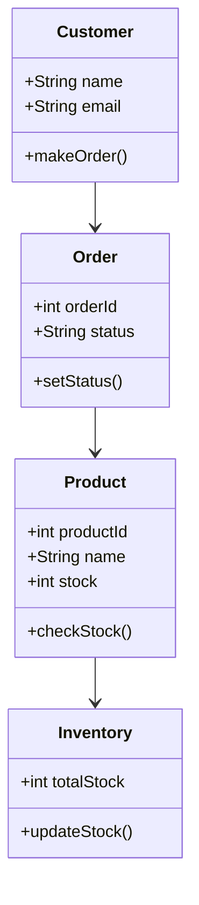

                 


### 引入与背景

**问题背景与目标**

在当今快速变化的市场环境中，组织创新能力已成为企业生存和发展的关键。创新型组织不仅能够快速响应市场变化，还能持续推动技术进步和商业模式创新。然而，传统组织结构和文化往往成为创新的障碍。因此，如何打造一个创新型组织，成为企业领导者面临的重大挑战。

**创新型组织的定义**

创新型组织是指在组织结构、文化和运作机制等方面具备创新能力和创新意识，能够持续推动创新并取得实际成果的组织。它与传统组织最大的区别在于，创新型组织鼓励冒险和容忍失败，具备敏捷的学习能力和适应能力。

**组织创新的必要性**

1. **市场竞争加剧与企业生存压力**：随着全球化的推进和技术的快速发展，市场竞争日益激烈，企业需要不断创新来保持竞争力。
2. **客户需求多样化与技术创新**：客户需求不断变化，企业需要通过技术创新来满足客户需求，提升用户体验。

**本书的目标与结构**

本书旨在探讨如何打造一个创新型组织，以鼓励冒险和容忍失败为核心。全书共八个章节，包括：

1. **问题背景与目标**：介绍创新型组织的定义和重要性，以及当前组织创新面临的挑战。
2. **核心概念与理论基础**：探讨鼓励冒险的文化建设、容忍失败的氛围营造和创新型组织的组织结构。
3. **实践指导与案例分析**：提供策略制定、团队建设和案例分析等内容，为读者提供实际操作指南。

### 第1章：问题背景与目标

**1.1 问题背景**

在现代商业环境中，组织创新能力已经成为企业竞争力和可持续发展的关键因素。随着技术革新和市场变化的加速，企业需要能够迅速适应外部环境，抓住机遇，实现持续创新。然而，传统的组织结构和文化往往难以适应这种快速变化的需求。因此，如何打造一个具备创新能力和创新意识的组织，成为了企业领导者面临的重大挑战。

**创新型组织的定义**

创新型组织是指那些在组织结构、文化、战略和运营方面都具备强烈创新意识，能够持续推动创新并取得实际成果的组织。创新型组织的核心特征包括：

- **鼓励冒险**：创新型组织鼓励员工尝试新的想法和方法，即使这些想法和方法可能带来失败。
- **容忍失败**：创新型组织理解失败是创新过程中的必然部分，并为此提供支持和资源。
- **敏捷性**：创新型组织能够迅速调整战略和运营，以适应市场变化。
- **学习文化**：创新型组织鼓励知识分享和持续学习，以促进创新思维的培育。

**创新型组织与传统组织的区别**

传统组织通常更注重稳定性和效率，而创新型组织则更注重灵活性和创新性。以下是两者之间的一些主要区别：

- **目标**：传统组织的目标是实现短期利润最大化，而创新型组织的目标是实现长期可持续的创新。
- **结构**：传统组织通常具有较为 rigid 的层级结构，而创新型组织则更倾向于扁平化结构，以促进跨部门合作和快速决策。
- **文化**：传统组织文化可能较为保守，强调遵循规则和流程，而创新型组织文化则更开放和包容，鼓励冒险和失败。
- **激励机制**：传统组织的激励机制可能更侧重于短期绩效，而创新型组织的激励机制则更注重长期成果和持续创新。

**组织创新的必要性**

1. **市场竞争加剧与企业生存压力**：随着全球化的推进，企业面临着前所未有的竞争压力。只有通过持续创新，企业才能保持竞争优势，确保生存和发展。
2. **客户需求多样化与技术创新**：随着科技的进步和客户需求的多样化，企业需要不断创新来满足客户需求，提升用户体验。

**本书的目标与结构**

本书的目标是探讨如何打造一个创新型组织，以鼓励冒险和容忍失败为核心。全书共八个章节，包括：

1. **问题背景与目标**：介绍创新型组织的定义和重要性，以及当前组织创新面临的挑战。
2. **核心概念与理论基础**：探讨鼓励冒险的文化建设、容忍失败的氛围营造和创新型组织的组织结构。
3. **实践指导与案例分析**：提供策略制定、团队建设和案例分析等内容，为读者提供实际操作指南。

### 核心概念与理论基础

#### 第2章：鼓励冒险的文化建设

**2.1 冒险与创新的联系**

冒险是创新过程中不可或缺的一部分。冒险通常指的是尝试新的想法、方法或技术，尽管这些尝试可能存在失败的风险。创新则是指通过新的方法或技术实现新的价值。冒险与创新的紧密联系体现在以下几个方面：

1. **促进新想法的产生**：冒险鼓励员工跳出传统思维框架，尝试新的想法和方法，从而产生创新。
2. **推动技术进步**：冒险往往伴随着技术尝试，通过实践和实验，新技术得以发展和完善。
3. **增强组织韧性**：冒险能够帮助组织在面对不确定性时保持灵活和适应能力，从而增强组织韧性。

**2.2 鼓励冒险的文化特征**

鼓励冒险的文化是一种开放、包容和多元化的文化。这种文化特征包括以下几个方面：

1. **容忍失败**：鼓励冒险的文化认为失败是创新过程中的必然部分，员工不必担心因失败而受到惩罚。
2. **奖励创新**：组织通过奖励机制激励员工尝试新的想法和方法，无论结果如何。
3. **跨部门合作**：鼓励冒险的文化促进跨部门合作，鼓励不同部门之间的知识共享和协作。
4. **透明度**：鼓励冒险的文化强调信息透明，确保员工能够了解组织的战略和目标，从而更好地参与创新。

**2.3 建设鼓励冒险文化的策略**

建设鼓励冒险文化的策略包括以下几个方面：

1. **领导者角色的转变**：领导者需要从指挥者转变为支持者，为员工提供必要的资源和支持。
2. **奖励机制**：组织应建立奖励机制，对尝试新想法和方法并取得成果的员工给予奖励。
3. **风险评估**：组织应建立风险评估机制，帮助员工评估创新项目的潜在风险，并提供相应的应对措施。
4. **培训与发展**：组织应提供培训和发展机会，帮助员工提升创新能力和冒险精神。

**2.4 案例分析：鼓励冒险的企业实践**

以下是一些国内外鼓励冒险的典型企业案例：

1. **谷歌**：谷歌以其开放的创新文化而闻名。公司鼓励员工自由探索新的想法，并通过内部创新项目支持员工的冒险行为。谷歌的“20%时间”政策允许员工在工作时间的20%用于个人感兴趣的项目，这一政策已经催生了多项成功的产品，如Gmail和AdSense。
2. **苹果**：苹果公司以其强大的创新能力和冒险精神而著称。乔布斯回归苹果后，通过推行“非完美不发布”的理念，鼓励员工不断尝试和改进，使得苹果产品在市场上始终保持领先地位。

### 第3章：容忍失败的氛围营造

**3.1 失败的必然性与价值**

在创新过程中，失败是不可避免的。失败不仅是一种结果，更是一种过程，它为组织提供了宝贵的学习机会和反馈。以下是从几个角度分析失败的必然性与价值：

1. **学习与成长**：失败是学习和成长的重要途径。通过失败，组织可以了解哪些方法或技术是无效的，从而避免在未来重复相同的错误。
2. **创新动力**：容忍失败可以激发组织的创新动力。当员工知道失败不会受到惩罚时，他们会更愿意尝试新的想法和方法，从而推动组织的创新。
3. **风险管理**：容忍失败有助于组织建立有效的风险管理机制。通过容忍失败，组织可以更好地识别和管理风险，从而降低创新过程中的不确定性。

**3.2 营造容忍失败的氛围**

要营造一个容忍失败的氛围，组织需要从以下几个方面入手：

1. **安全氛围建设**：组织应营造一个安全、支持性的氛围，让员工知道他们可以在失败中学习和成长，而不必担心受到惩罚。
2. **失败处理的合理机制**：组织应建立合理的失败处理机制，确保失败不会对员工的职业生涯造成负面影响。例如，可以通过提供反馈和改进建议，帮助员工从失败中汲取教训。
3. **奖励成功与失败**：组织应同时奖励成功和失败。对于取得创新成果的员工，组织应给予认可和奖励；对于尝试新想法但失败的员工，组织也应给予一定的奖励，以鼓励他们继续冒险。

**3.3 容忍失败与激励创新**

容忍失败与激励创新之间存在紧密的关系。容忍失败可以降低员工尝试新想法的风险，从而激发他们的创新潜力。以下是从几个角度分析容忍失败与激励创新的关系：

1. **降低创新风险**：容忍失败可以降低创新风险，让员工更愿意尝试新的想法和方法。这种低风险环境有助于激发创新。
2. **鼓励多元化思维**：容忍失败鼓励员工思考不同的解决方案，从而促进多元化思维的培养。这种多元化思维是创新的重要驱动力。
3. **培养韧性**：容忍失败有助于培养员工的韧性，让他们在面对挑战时更加坚定和自信。

**3.4 案例分析：容忍失败的企业实践**

以下是一些国内外成功容忍失败的企业案例：

1. **特斯拉**：特斯拉以其大胆的创新和容忍失败的文化而闻名。特斯拉创始人埃隆·马斯克鼓励员工冒险和尝试，即使这些尝试可能失败。特斯拉的“快速发展、快速迭代”模式使得公司能够迅速响应市场变化，推出具有竞争力的产品。
2. **3M公司**：3M公司以其强大的创新文化和容忍失败的氛围而著称。3M公司的“15%时间”政策允许员工将工作时间的15%用于个人感兴趣的项目，这一政策已经催生了多项成功的产品，如透明胶带和巨无霸贴纸。

### 第4章：创新型组织的组织结构

**4.1 传统组织结构与创新的冲突**

传统组织结构通常以层级化、标准化和规范化为特征。这种结构虽然有助于提高效率和确保一致性，但往往成为创新的障碍。以下是传统组织结构与创新之间的冲突：

1. **决策速度慢**：传统组织中的决策流程通常较为复杂，需要经过多个层级的审批，导致决策速度慢，难以适应快速变化的市场需求。
2. **信息传递不畅**：在传统组织中，信息往往在层级之间传递，导致信息不对称和沟通不畅，限制了创新思想的传播和实施。
3. **激励机制的局限性**：传统组织中的激励机制通常以短期绩效为导向，这可能导致员工过于关注短期成果，而忽视长期创新。

**4.2 创新型组织的结构设计**

创新型组织需要具备快速响应变化、灵活调整和高效协作的能力。以下是几种创新型组织结构设计：

1. **网络型组织结构**：网络型组织结构通过建立广泛的合作关系，将内部员工和外部合作伙伴紧密连接。这种结构有助于提高信息传递速度和协作效率，促进创新。
2. **平台型组织结构**：平台型组织结构将组织视为一个平台，提供资源和支持，让员工和外部合作伙伴在平台上进行创新。这种结构有助于激发创新潜力，实现资源共享和协同创新。

**4.3 创新型组织的运作机制**

创新型组织需要建立一系列运作机制，以支持创新和协作。以下是几个关键机制：

1. **内部协作与知识共享**：创新型组织应建立有效的内部协作机制，鼓励员工分享知识和经验，促进创新思想的传播和实施。
2. **激励机制**：创新型组织应建立激励机制，鼓励员工冒险和尝试，同时确保失败不会对员工的职业生涯造成负面影响。
3. **快速决策**：创新型组织应建立快速决策机制，确保创新项目能够迅速启动和调整，以适应市场需求。

**4.4 创新型组织的实践案例**

以下是一些成功应用创新型组织结构的实践案例：

1. **华为**：华为通过实行“矩阵式组织结构”，将产品线和职能部门紧密结合，提高了决策速度和协作效率。同时，华为通过建立“创新研究院”和“创新实验室”，鼓励员工进行创新研究和技术突破。
2. **阿里巴巴**：阿里巴巴采用“平台型组织结构”，将阿里巴巴集团视为一个平台，提供资源和支持，让员工和外部合作伙伴在平台上进行创新。阿里巴巴通过“双11”等大型活动，激发员工的创新潜力，推动平台业务的发展。

### 第5章：策略制定与实施

**5.1 创新型组织战略规划**

战略规划是打造创新型组织的关键步骤。一个成功的创新型组织战略规划应包括以下几个关键要素：

1. **明确战略目标**：创新型组织需要明确其战略目标，包括短期和长期目标。这些目标应与组织的愿景和使命保持一致，并具有可衡量性和可实现性。
2. **创新战略与业务战略的结合**：创新战略不应孤立于业务战略之外，而应与之紧密结合。组织需要将创新视为业务发展的重要驱动力，确保创新与业务目标的一致性。
3. **资源配置与优先级**：组织应确保有足够的资源用于创新，包括资金、人力和技术支持。同时，组织需要明确资源配置的优先级，确保关键创新项目得到充分支持。

**5.2 实施策略与行动计划**

实施策略和行动计划是将创新战略转化为实际成果的关键。以下是一些建议：

1. **阶段性目标的设定**：组织应将战略目标分解为阶段性目标，并制定相应的行动计划。这些阶段性目标应具体、可衡量，并且具有明确的实施时间表。
2. **资源配置与执行计划**：组织应根据阶段性目标，制定详细的资源配置和执行计划。这包括确定所需的资金、人力和技术支持，并制定具体的实施步骤和时间表。
3. **监控与评估**：组织应建立监控和评估机制，定期检查创新项目的进展情况，并根据实际情况进行调整和优化。这有助于确保创新战略的有效实施。

**5.3 组织变革与转型**

组织变革和转型是实现创新型组织目标的关键步骤。以下是一些建议：

1. **变革管理原则**：组织在进行变革和转型时，应遵循一系列变革管理原则，包括明确变革目标、建立变革团队、制定变革计划、沟通和培训等。
2. **变革过程中的挑战与应对**：变革过程中可能会面临一系列挑战，如员工抵触、资源不足、执行力不足等。组织需要提前识别这些挑战，并制定相应的应对策略，以确保变革的顺利进行。
3. **持续改进**：组织应将变革视为一个持续的过程，不断评估和优化创新战略和实施计划，以确保组织的持续创新能力和竞争力。

### 第6章：团队建设与人才培养

**6.1 创新型团队的构建**

构建创新型团队是实现组织创新目标的关键。以下是一些建议：

1. **团队成员的选拔与培养**：组织应选拔具有创新精神、专业能力和团队协作能力的成员加入创新型团队。同时，组织应提供培训和发展机会，帮助团队成员提升创新能力和团队协作能力。
2. **团队协作与沟通技巧**：创新型团队需要具备高效的协作和沟通能力。组织应建立有效的沟通机制，确保团队成员之间的信息共享和协作，促进创新思维的碰撞和融合。

**6.2 人才培养与激励机制**

人才培养和激励机制是推动组织创新的重要手段。以下是一些建议：

1. **人才培养战略**：组织应制定长期的人才培养战略，包括人才引进、培养和发展。组织应根据业务需求和未来发展目标，制定相应的人才培养计划，确保人才队伍的持续优化和提升。
2. **激励机制**：组织应建立激励机制，激励员工积极参与创新项目，并对取得创新成果的员工给予奖励。激励机制应包括物质奖励和精神奖励，同时注重激励的公正性和透明度。

**6.3 持续创新能力培养**

持续创新能力培养是实现组织长期创新目标的关键。以下是一些建议：

1. **职业发展规划**：组织应帮助员工制定职业发展规划，明确个人目标和成长路径，并提供相应的支持和资源。
2. **创新能力培养途径**：组织应提供多种途径，如培训课程、实践项目、跨部门交流等，帮助员工提升创新能力。同时，组织应鼓励员工自主学习和探索，激发创新潜力。

### 第7章：案例分析：成功创新组织的实例

**7.1 案例背景与目标**

本章节将通过分析几个成功创新组织的实例，探讨它们在鼓励冒险、容忍失败和构建创新型组织方面的实践经验。以下是案例背景和目标：

1. **案例背景**：每个案例企业都面临激烈的市场竞争和技术变革，意识到创新对于生存和发展的重要性。
2. **案例目标**：通过实践鼓励冒险、容忍失败和构建创新型组织，实现业务增长、技术突破和市场领先。

**7.2 创新过程与成果**

在本章节中，我们将详细描述每个案例企业的创新过程和取得的成果：

1. **创新过程**：包括创新项目的启动、实施和迭代，以及企业在创新过程中遇到的关键挑战和解决方案。
2. **创新成果**：介绍企业通过创新实现的业务增长、技术突破和市场领先，以及创新成果的具体表现和评价。

**7.3 案例启示与借鉴**

在本章节的最后，我们将从每个案例中提取成功经验，为其他组织提供借鉴：

1. **成功经验**：总结案例企业成功的关键因素，如领导力、企业文化、激励机制和团队协作等。
2. **借鉴意义**：探讨这些成功经验对其他组织的启示和借鉴意义，以及如何将这些经验应用到自身组织中。

### 第8章：总结与展望

**8.1 全书核心观点回顾**

在本章节中，我们将回顾全书的核心观点和主要发现：

1. **鼓励冒险的重要性**：冒险是创新过程中不可或缺的一部分，组织应鼓励员工尝试新的想法和方法。
2. **容忍失败的价值**：失败是创新过程中的必然部分，组织应建立容忍失败的氛围，支持员工从失败中学习。
3. **创新型组织的构建**：创新型组织需要具备敏捷的决策能力、高效的知识共享和持续的创新能力。

**8.2 创新型组织的发展趋势**

在本章节中，我们将探讨创新型组织的发展趋势：

1. **技术驱动**：随着人工智能、大数据等技术的发展，创新型组织将更加依赖技术驱动创新。
2. **全球化**：全球化的推进将使创新型组织面临更多的挑战和机遇，需要具备全球视野和跨文化能力。
3. **可持续发展**：在可持续发展的背景下，创新型组织将更加关注社会责任和环境保护，实现经济、社会和环境的协调发展。

**8.3 对组织的启示与建议**

在本章节的最后，我们将为组织提供以下启示与建议：

1. **建立鼓励冒险的文化**：领导者应转变角色，为员工提供必要的资源和支持，营造一个鼓励冒险的文化。
2. **建立容忍失败的氛围**：组织应建立合理的失败处理机制，确保失败不会对员工的职业生涯造成负面影响。
3. **构建创新型组织**：组织应建立网络型或平台型组织结构，提高决策速度和协作效率，促进创新和协作。

### 第9章：附录

本章节将包括以下内容：

1. **参考文献**：列出本书中引用的参考文献，以便读者进一步学习和研究。
2. **致谢**：对为本书编写和出版提供支持和帮助的个人和机构表示感谢。
3. **附录A：技术术语解释**：提供本书中涉及的一些技术术语的解释，以便读者更好地理解相关概念。
4. **附录B：数据图表**：提供本书中使用的相关数据图表，以便读者更直观地理解相关内容。

### 第10章：作者介绍

在本章节中，我们将介绍本书的作者：

1. **作者简介**：介绍作者的工作背景、研究领域和研究成果。
2. **联系信息**：提供作者的联系方式，以便读者与作者进行交流。

### 结论

本文通过对鼓励冒险、容忍失败和创新型组织的深入探讨，提供了构建创新型组织的理论框架和实践指导。本文的主要结论如下：

1. **冒险是创新的核心驱动力**：鼓励冒险可以激发员工的创新潜力，推动组织实现持续创新。
2. **容忍失败是创新过程中的必要环节**：容忍失败可以降低创新风险，支持员工从失败中学习，提高创新能力。
3. **创新型组织的构建是实现创新目标的关键**：创新型组织具备敏捷的决策能力、高效的知识共享和持续的创新能力。

本文的研究为组织领导者提供了有益的启示，帮助他们更好地构建创新型组织，实现持续创新和竞争优势。随着技术环境的不断变化，鼓励冒险、容忍失败和创新型组织的重要性将日益凸显。未来，组织应继续探索和创新，以应对日益复杂的挑战，实现长期可持续发展。

### 具体技术语言使用指南

在本文中，我们将使用专业的技术语言来阐述和创新型组织相关的概念、策略和实践。以下是具体技术语言使用指南，旨在确保文章的准确性和专业性。

**1. 核心概念与术语解释**

在文章中，我们将详细解释以下核心概念和术语：

- **创新型组织**：指在组织结构、文化和运作机制等方面具备创新能力和创新意识，能够持续推动创新并取得实际成果的组织。
- **冒险**：指尝试新的想法、方法或技术，尽管这些尝试可能存在失败的风险。
- **失败**：指创新过程中未能达到预期目标或未实现预期价值的情况。
- **文化特征**：指组织内部普遍认同和遵循的价值观、信仰和行为模式。
- **组织结构**：指组织的层次结构、部门划分和职责分工等。

**2. 对比表格**

为了更好地理解不同概念或策略之间的差异，我们将使用对比表格。以下是一个示例：

| 概念/策略           | 特点                       | 比较                   |
|----------------------|----------------------------|------------------------|
| 鼓励冒险的文化       | 支持员工尝试新想法         | 与保守文化相对          |
| 容忍失败的氛围      | 接受失败并从中学习         | 与惩罚失败相对          |
| 创新型组织的结构     | 灵活、高效、支持创新       | 与传统组织结构相对      |

**3. ER实体关系图**

我们将使用ER（Entity-Relationship）实体关系图来展示组织结构、信息流和资源分配等。以下是一个ER图示例：

```mermaid
erDiagram
  Employee ||--|{ Project }|-- ProjectManager
  Employee ||--|{ Skill }|-- Skill
  Project ||--|{ Milestone }|-- Milestone
  Project ||--|{ Resource }|-- Resource
  ProjectManager ||--|{ Manage }|-- Project
```

**4. 算法原理与流程图**

在讨论创新过程中涉及到的算法或流程时，我们将使用Python源代码和Mermaid流程图来详细阐述。以下是一个算法原理与流程图示例：

```python
def innovative_algorithm(data):
    """
    创新算法，用于处理数据并实现创新目标。
    
    参数：
    - data：输入数据
    
    返回：
    - processed_data：处理后的数据
    """
    # 算法实现步骤
    processed_data = ...

    return processed_data

# Mermaid流程图
flowchart TD
    A[开始] --> B[数据输入]
    B --> C{数据清洗}
    C --> D[数据预处理]
    D --> E{算法执行}
    E --> F[结果输出]
    F --> G[结束]
```

**5. 数学公式与LaTeX**

文章中涉及到的数学公式将使用LaTeX格式编写。独立段落的公式使用$$括起来，如：$$1+1=2$$，段落内的公式使用$括起来，如：$1<2$。以下是一个数学公式示例：

$$
E = mc^2
$$

**6. 系统分析与架构设计**

在描述系统架构设计时，我们将使用Mermaid类图、架构图和序列图来展示系统组件、接口和交互。以下是一个系统架构设计示例：



通过以上技术语言的使用，本文旨在为读者提供准确、详细和专业的内容，帮助他们更好地理解和创新型组织相关的概念和实践。

### 第一部分：引入与背景

在当今这个快速变化的时代，创新已成为企业和组织持续发展的关键动力。然而，创新并非易事，它需要组织的内部结构和外部环境相互协调，才能创造出真正的价值。本文旨在深入探讨如何打造一个创新型组织，通过鼓励冒险和容忍失败，来推动组织实现持续创新。

**1.1 问题背景**

首先，我们需要明确创新型组织的定义。创新型组织是指那些能够不断推动创新、快速适应市场变化、并在竞争激烈的环境中脱颖而出的组织。这种组织不仅具备创新的意识和能力，而且在组织结构和文化方面也为创新提供了强有力的支持。

当前，组织创新面临的挑战主要包括以下几个方面：

1. **组织结构的刚性**：传统层级化的组织结构往往限制了创新思维的自由流动，使得创新项目难以快速启动和实施。
2. **文化保守**：许多组织文化倾向于保守和稳健，对失败持有零容忍的态度，这无疑增加了员工尝试新想法的顾虑，限制了创新的潜力。
3. **激励机制的不完善**：传统的激励机制往往侧重于短期绩效，忽视了创新所需的长期投入和试错过程。
4. **资源的分配**：在资源有限的情况下，如何合理分配资源以支持创新项目，成为组织领导者面临的一大难题。

**1.2 创新型组织的定义**

创新型组织是指那些在组织结构、文化、战略和运营等方面具备创新能力和创新意识，能够持续推动创新并取得实际成果的组织。创新型组织的核心特征包括：

- **鼓励冒险**：创新型组织鼓励员工尝试新的想法和方法，即使这些想法和方法可能带来失败。
- **容忍失败**：创新型组织理解失败是创新过程中的必然部分，并为此提供支持和资源。
- **敏捷性**：创新型组织能够迅速调整战略和运营，以适应市场变化。
- **学习文化**：创新型组织鼓励知识分享和持续学习，以促进创新思维的培育。

与传统组织相比，创新型组织在以下几个方面有着显著的区别：

1. **目标**：传统组织的目标是实现短期利润最大化，而创新型组织的目标是实现长期可持续的创新。
2. **结构**：传统组织通常具有较为 rigid 的层级结构，而创新型组织则更倾向于扁平化结构，以促进跨部门合作和快速决策。
3. **文化**：传统组织文化可能较为保守，强调遵循规则和流程，而创新型组织文化则更开放和包容，鼓励冒险和失败。
4. **激励机制**：传统组织的激励机制可能更侧重于短期绩效，而创新型组织的激励机制则更注重长期成果和持续创新。

**1.3 组织创新的必要性**

在当前的市场环境中，组织创新能力已成为企业竞争力和可持续发展的关键因素。以下是从几个方面分析组织创新的必要性：

1. **市场竞争加剧与企业生存压力**：随着全球化的推进和技术的快速发展，市场竞争日益激烈，企业需要通过持续创新来保持竞争优势，确保生存和发展。
2. **客户需求多样化与技术创新**：客户需求不断变化，企业需要通过技术创新来满足客户需求，提升用户体验，从而在市场中脱颖而出。
3. **技术变革带来的机遇**：新兴技术的快速发展，如人工智能、物联网、大数据等，为组织创新提供了丰富的机会和工具。

**1.4 本书的目标与结构**

本书旨在为组织领导者提供一套系统而实用的创新策略和实施指南，以帮助他们在组织中鼓励冒险、容忍失败，并构建一个创新型组织。全书共分为四个部分：

- **第一部分：引入与背景**：介绍创新型组织的定义、背景和必要性。
- **第二部分：核心概念与理论基础**：探讨鼓励冒险的文化建设、容忍失败的氛围营造和创新型组织的组织结构。
- **第三部分：实践指导与案例分析**：提供策略制定、团队建设和案例分析等内容，为读者提供实际操作指南。
- **第四部分：结论与展望**：总结全书的核心观点，并对创新型组织的发展趋势提出展望。

通过以上结构和内容安排，本书旨在为组织领导者提供全面的创新指南，帮助他们打造一个创新型组织，实现持续创新和竞争优势。

### 核心概念与理论基础

在探讨如何打造创新型组织的过程中，核心概念和理论基础是不可或缺的。这些概念和理论为我们提供了一个系统性的框架，帮助我们深入理解创新的重要性、鼓励冒险的文化建设以及容忍失败的氛围营造。

**2.1 冒险与创新的联系**

冒险和创新之间存在着紧密的联系。创新本身就是一个不断探索和尝试新方法、新技术的过程，而冒险则是这种探索的核心驱动力。冒险的定义通常指的是在没有完全确定结果的情况下尝试新的事物，即使这些尝试可能带来失败。在创新过程中，冒险的作用主要体现在以下几个方面：

1. **促进新想法的产生**：冒险鼓励员工跳出传统思维框架，尝试新的想法和方法。这种尝试往往能够带来意外的发现和创新点，推动组织实现突破性创新。
2. **推动技术进步**：冒险通常伴随着技术尝试和实践。通过不断地实验和迭代，新技术得以发展和完善，从而为组织带来竞争优势。
3. **增强组织韧性**：冒险能够帮助组织在面对不确定性和挑战时保持灵活和适应能力。这种韧性是组织在激烈市场竞争中生存和发展的重要保障。

**2.2 鼓励冒险的文化特征**

鼓励冒险的文化是一种开放、包容和多元化的文化，它为员工提供了自由探索和创新的空间。这种文化特征主要包括以下几个方面：

1. **容忍失败**：鼓励冒险的文化认为失败是创新过程中的必然部分，员工不必担心因失败而受到惩罚。这种文化鼓励员工敢于尝试，即使结果不理想，也能从中学习和成长。
2. **奖励创新**：组织通过奖励机制激励员工尝试新的想法和方法，无论结果如何。这种奖励可以是物质上的，如奖金和晋升，也可以是精神上的，如认可和表彰。
3. **跨部门合作**：鼓励冒险的文化促进跨部门合作，鼓励不同部门之间的知识共享和协作。这种合作有助于整合不同领域的智慧和资源，推动创新项目的成功。
4. **透明度**：鼓励冒险的文化强调信息透明，确保员工能够了解组织的战略和目标，从而更好地参与创新。透明度有助于建立信任和合作，为创新提供良好的环境。

**2.3 建设鼓励冒险文化的策略**

要建设一个鼓励冒险的文化，组织需要采取一系列策略，包括以下几个方面：

1. **领导者角色的转变**：领导者需要从指挥者转变为支持者，为员工提供必要的资源和支持。领导者应该鼓励员工敢于冒险，并对失败持有宽容的态度。
2. **奖励机制**：组织应建立奖励机制，对尝试新想法和方法并取得成果的员工给予奖励。奖励机制应具有透明度和公正性，确保员工能够公平地获得认可和回报。
3. **风险评估**：组织应建立风险评估机制，帮助员工评估创新项目的潜在风险，并提供相应的应对措施。这有助于降低创新风险，提高创新成功率。
4. **培训与发展**：组织应提供培训和发展机会，帮助员工提升创新能力和冒险精神。通过培训，员工可以学习到新的思维工具和方法，提高解决问题的能力。

**2.4 案例分析：鼓励冒险的企业实践**

在实际操作中，许多企业已经成功建立了鼓励冒险的文化，并取得了显著的创新成果。以下是一些国内外企业的实践案例：

1. **谷歌**：谷歌以其开放的创新文化和鼓励冒险的实践而闻名。谷歌的“20%时间”政策允许员工在工作时间的20%用于个人感兴趣的项目，这一政策已经催生了多项成功的产品，如Gmail和AdSense。谷歌的领导者鼓励员工敢于尝试新事物，并对失败持有宽容的态度。

2. **3M公司**：3M公司以其强大的创新文化和容忍失败的氛围而著称。3M公司的“15%时间”政策允许员工将工作时间的15%用于个人感兴趣的项目，这一政策已经产生了许多成功的产品，如透明胶带和巨无霸贴纸。3M公司鼓励员工敢于冒险，并对失败持有宽容的态度。

3. **阿里巴巴**：阿里巴巴通过推行“双11”等大型活动，激发员工的创新潜力。阿里巴巴的领导者鼓励员工尝试新的营销策略和商业模式，并通过奖励机制激励员工的创新行为。

通过以上案例分析，我们可以看到，鼓励冒险的企业文化不仅能够激发员工的创新潜力，还能推动组织的持续创新和竞争优势。建设鼓励冒险的文化需要组织从多个方面入手，包括领导者角色的转变、奖励机制的建立、风险评估和培训等。只有通过这些综合措施，组织才能营造出一个鼓励冒险、容忍失败的创新环境。

### 3.1 失败的必然性与价值

在创新过程中，失败是不可避免的。事实上，失败不仅是创新的一部分，而且是推动创新不可或缺的元素。以下从几个方面来探讨失败的必然性及其在创新过程中的价值。

**1. 学习与成长**

失败是学习和成长的重要途径。通过失败，组织可以深入了解哪些方法或技术是无效的，从而避免在未来重复相同的错误。失败提供了一个宝贵的反馈机制，使组织能够在实践中不断调整和改进。这种反馈不仅有助于提升当前项目的成功率，还能为未来的创新提供宝贵的经验。

例如，一家科技公司开发了一款新的移动应用，但由于市场定位不准确和用户体验不佳，该应用最终未能成功。然而，通过分析失败的原因，这家公司得以调整其市场策略和产品设计，并在后续项目中取得了成功。

**2. 创新动力**

容忍失败可以激发组织的创新动力。当员工知道失败不会受到惩罚时，他们更愿意尝试新的想法和方法。这种低风险环境有助于打破传统的思维定势，促进创新思维的产生和发展。失败不仅是创新的催化剂，也是激励员工不断尝试和突破的源泉。

例如，一家初创公司在其研发过程中多次遭遇失败，但每次失败都促使团队重新审视和改进其产品。最终，这家公司成功推出了一个具有颠覆性的新产品，并在市场上取得了巨大成功。

**3. 风险管理**

容忍失败有助于组织建立有效的风险管理机制。通过容忍失败，组织可以更好地识别和管理风险，从而降低创新过程中的不确定性。风险管理不仅包括对创新项目的评估和监控，还涉及到对失败项目的处理和总结。这种处理方式能够帮助组织从失败中吸取教训，提高未来项目的成功率。

例如，一家制药公司在研发新药时采用了严格的风险管理机制。尽管在研发过程中，一些项目未能成功，但通过详细的分析和总结，这家公司得以优化其研发流程，并最终成功推出了一些具有市场竞争力的新药。

**4. 团队协作与沟通**

失败也是团队协作和沟通的重要推动力。在失败的情况下，团队成员需要共同努力解决问题，这有助于增强团队的凝聚力和协作能力。通过失败，团队成员可以学习到如何在压力下有效沟通和合作，从而提高整体团队的创新能力和执行力。

例如，一家软件公司在开发一款新软件时遭遇了技术难题。尽管项目一度陷入困境，但团队成员通过积极的沟通和协作，最终找到了解决方案，并成功推出了这款软件。

**5. 组织文化的建设**

容忍失败是建设积极创新文化的重要一环。一个能够容忍失败的组织通常具备更强的创新能力和适应能力。这种文化不仅鼓励员工勇于尝试，还支持他们在失败中学习和成长。通过建立容忍失败的文化，组织可以吸引和留住具有创新精神的优秀人才。

例如，谷歌以其容忍失败的文化而闻名。谷歌的“20%时间”政策和“快速迭代”模式使得员工在创新过程中可以自由尝试新想法，即使这些尝试可能失败。这种文化不仅激发了员工的创新潜力，还使得谷歌成为技术创新的领导者。

**6. 激励机制的完善**

为了更好地容忍失败，组织需要建立完善的激励机制。激励机制不仅包括对成功创新的奖励，还应该包括对失败项目的支持和鼓励。通过合理的激励机制，组织可以确保员工在创新过程中既能获得成功带来的奖励，也能在失败中获得学习和成长的机会。

例如，一家科技公司在其创新项目中设立了“失败基金”，用于支持员工在失败后的再尝试。这种基金不仅为员工提供了经济支持，还传递了组织对失败的宽容态度，激励员工在创新过程中敢于冒险和尝试。

总之，失败在创新过程中具有不可忽视的价值。通过容忍失败，组织不仅能够提高员工的创新动力和协作能力，还能建立积极创新文化，推动组织的持续发展和成功。因此，组织领导者应重视失败的价值，为员工提供必要的支持和资源，鼓励他们在创新过程中勇于尝试和不断学习。

### 3.2 营造容忍失败的氛围

要营造一个容忍失败的氛围，组织需要在多个方面进行系统性的建设。以下从几个关键点出发，详细探讨如何营造一个支持创新和容忍失败的工作环境。

**1. 安全氛围建设**

首先，组织需要营造一个安全的工作氛围，让员工知道他们可以在失败中学习和成长，而不必担心受到惩罚。这种安全氛围的建设包括以下几个方面：

- **透明沟通**：组织应建立透明、开放的沟通机制，确保员工可以自由表达自己的想法和观点，无论这些想法是否成功。透明沟通有助于消除员工的顾虑，增强他们的自信心。
- **信任关系**：建立信任关系是营造安全氛围的基础。领导者应与员工建立互信，让员工感受到组织对他们的信任和支持。这种信任关系不仅有助于减少失败带来的负面影响，还能激发员工的创新热情。
- **支持系统**：组织应建立完善的支持系统，为员工提供必要的资源和支持，帮助他们在失败后能够快速恢复和调整。支持系统可以包括心理辅导、职业发展规划等。

**2. 失败处理的合理机制**

为了确保失败不会对员工的职业生涯造成负面影响，组织需要建立合理的失败处理机制。以下是一些建议：

- **反馈机制**：组织应建立反馈机制，对失败项目进行详细的分析和总结。通过反馈，员工可以了解失败的原因和改进方向，从而在未来的项目中避免重复相同的错误。
- **改进机会**：组织应给予失败者改进的机会，鼓励他们在失败后重新尝试。这种机会不仅包括重新启动失败的项目，还可以是其他创新项目的参与机会。
- **晋升渠道**：组织应确保失败者不会因为一次失败而失去晋升机会。通过建立公平的晋升渠道，组织可以鼓励员工勇于尝试新事物，减少失败的风险。

**3. 奖励成功与失败**

组织应同时奖励成功和失败，以鼓励员工积极参与创新。以下是一些建议：

- **物质奖励**：对成功创新的员工给予物质奖励，如奖金、股票期权等。物质奖励能够直接激励员工，提高他们的工作积极性。
- **精神奖励**：对失败的员工给予精神上的认可和鼓励，如公开表彰、荣誉称号等。精神奖励可以增强员工的自信心，激励他们在创新过程中继续努力。
- **双重奖励**：对于在某些关键领域取得突破性失败的员工，组织可以同时给予物质和精神上的奖励。这种双重奖励能够更好地体现失败的价值，鼓励员工在创新过程中不断尝试。

**4. 鼓励多元化思维**

多元化思维是创新的重要驱动力。组织应鼓励员工思考不同的解决方案，即使这些解决方案可能失败。以下是一些建议：

- **开放讨论**：组织应鼓励开放讨论，让员工自由表达自己的观点和建议。通过开放讨论，员工可以相互启发，激发更多的创新想法。
- **跨部门协作**：组织应促进跨部门协作，鼓励不同部门之间的知识共享和合作。跨部门协作有助于整合不同领域的智慧和资源，提高创新的成功率。
- **多元化培训**：组织应提供多元化培训，帮助员工拓展思维，提升创新能力。通过培训，员工可以学习到新的思维工具和方法，从而更好地应对创新过程中的挑战。

**5. 案例分析**

以下是一些企业成功营造容忍失败氛围的案例：

- **谷歌**：谷歌以其开放的创新文化和容忍失败的氛围而闻名。谷歌的“20%时间”政策允许员工在工作时间的20%用于个人感兴趣的项目，即使这些项目可能失败。谷歌的领导者鼓励员工敢于尝试，并对失败持有宽容的态度。
- **3M公司**：3M公司以其强大的创新文化和容忍失败的氛围而著称。3M公司的“15%时间”政策允许员工将工作时间的15%用于个人感兴趣的项目，这一政策已经产生了许多成功的产品，如透明胶带和巨无霸贴纸。3M公司鼓励员工敢于冒险，并对失败持有宽容的态度。
- **阿里巴巴**：阿里巴巴通过推行“双11”等大型活动，激发员工的创新潜力。阿里巴巴的领导者鼓励员工尝试新的营销策略和商业模式，并通过奖励机制激励员工的创新行为。

通过以上案例可以看出，成功的企业都在不同程度上营造了一个容忍失败的氛围，这有助于激发员工的创新热情，推动组织的持续创新和成功。组织领导者应借鉴这些成功经验，从多个方面入手，营造一个支持创新和容忍失败的工作环境。

### 3.3 容忍失败与激励创新

容忍失败与激励创新之间存在紧密的关系。容忍失败可以降低员工尝试新想法的风险，从而激发他们的创新潜力。以下是容忍失败与激励创新之间的具体关系以及如何通过双重编码策略来进一步鼓励创新。

**1. 降低创新风险**

容忍失败可以降低员工尝试新想法的风险。当员工知道失败不会受到惩罚时，他们更愿意冒险尝试新的想法和方法。这种低风险环境有助于打破传统的思维定势，促进创新思维的产生和发展。容忍失败可以减少员工在创新过程中的心理压力，使他们能够更加专注于创新工作。

例如，一个科技公司允许员工在工作时间的10%用于个人创新项目，即使这些项目可能失败。这种政策降低了员工尝试新想法的风险，激发了他们的创新热情，从而推动了公司的持续创新。

**2. 激发多元化思维**

容忍失败可以激发多元化思维，鼓励员工思考不同的解决方案。在传统组织中，失败往往被视为一种负面结果，这可能导致员工过于关注成功，而忽视其他可能的解决方案。然而，在容忍失败的环境中，员工可以自由地尝试不同的方法，即使这些方法可能失败。这种多元化思维有助于推动创新，提高创新的成功率。

例如，一家初创公司在其研发过程中鼓励员工提出多种不同的解决方案，即使这些方案可能失败。通过这种方式，公司成功地开发出了多个创新产品，并在市场上取得了巨大成功。

**3. 增强团队协作**

容忍失败可以增强团队协作。在创新过程中，团队需要共同努力才能克服挑战和实现目标。当团队知道失败不会对成员的职业生涯造成负面影响时，他们更愿意积极参与团队工作，共同解决问题。这种协作有助于整合不同领域的智慧和资源，提高创新的成功率。

例如，一家制药公司在其研发团队中建立了容忍失败的文化。团队成员在失败后可以自由地讨论失败的原因和改进方案，从而在后续的研发过程中避免重复相同的错误。这种协作不仅提高了创新的成功率，还增强了团队的凝聚力和合作精神。

**4. 双重编码策略**

双重编码策略是一种有效的激励创新的方法。这种策略通过同时奖励成功和失败，来鼓励员工在创新过程中勇于尝试。双重编码策略包括以下几个方面：

- **成功奖励**：对成功创新的员工给予物质奖励和精神奖励，如奖金、晋升机会、荣誉称号等。成功奖励能够直接激励员工，提高他们的工作积极性。
- **失败奖励**：对失败的员工给予一定的认可和奖励，如公开表彰、改进机会等。失败奖励可以减少员工在创新过程中的顾虑，鼓励他们在失败后继续尝试。
- **透明度**：建立透明、公正的奖励机制，确保员工能够公平地获得奖励。透明度有助于建立信任，提高员工的积极性。

例如，一家科技公司在其创新项目中采用了双重编码策略。对成功创新的员工给予高额奖金和晋升机会，对失败的员工给予公开表彰和改进机会。这种策略不仅激发了员工的创新热情，还提高了员工在失败后的恢复能力。

**5. 鼓励持续学习**

容忍失败可以鼓励持续学习。在创新过程中，失败往往提供了宝贵的教训和学习机会。当员工知道失败不会对他们的职业生涯造成负面影响时，他们更愿意从失败中学习，不断提升自己的能力和知识。这种持续学习有助于提高员工的创新能力，推动组织的持续发展。

例如，一家互联网公司鼓励员工在创新项目中进行多次尝试，即使项目最终失败。公司在每个失败项目后都组织反思会议，让员工分享失败的原因和教训。通过这种方式，员工不仅学会了如何避免重复错误，还提升了他们的创新能力和解决问题的能力。

总之，容忍失败是激励创新的重要手段。通过容忍失败，组织可以降低创新风险，激发多元化思维，增强团队协作，并鼓励持续学习。双重编码策略作为一种有效的激励方法，可以进一步推动组织的创新和发展。

### 3.4 案例分析：容忍失败的企业实践

为了更好地理解容忍失败在企业创新实践中的重要性，以下将介绍几个国内外成功容忍失败的企业案例，分析这些企业的成功经验和对其他组织的借鉴意义。

**1. 特斯拉：埃隆·马斯克的冒险精神**

特斯拉（Tesla）是一家知名的电动汽车和清洁能源公司，以其大胆的创新和冒险精神而闻名。特斯拉的创始人埃隆·马斯克（Elon Musk）一直强调容忍失败的重要性，他鼓励员工在创新过程中勇于尝试，即使这些尝试可能失败。

- **案例背景**：特斯拉在推出其电动汽车产品时，面临诸多技术挑战和市场竞争压力。然而，马斯克坚持容忍失败，允许团队在研发过程中进行多次尝试和迭代。
- **成功经验**：特斯拉通过容忍失败，不断优化其电动汽车技术，成功推出了多款具有竞争力的产品，如Model S、Model 3和Model X。此外，特斯拉还通过自动驾驶技术等创新，引领了电动汽车行业的发展。
- **借鉴意义**：特斯拉的成功经验表明，容忍失败可以激发员工的创新潜力，推动技术突破。企业领导者应鼓励员工勇于尝试，并为失败提供支持和资源，以实现持续创新。

**2. 3M公司：强大的创新文化和“15%时间”政策**

3M公司是一家全球知名的创新型企业，以其强大的创新文化和“15%时间”政策而著称。“15%时间”政策允许员工将工作时间的15%用于个人感兴趣的项目，这一政策已经产生了许多成功的产品，如透明胶带和巨无霸贴纸。

- **案例背景**：3M公司在20世纪中期实施“15%时间”政策，旨在鼓励员工进行自主创新。这一政策打破了传统的工作时间限制，为员工提供了自由探索和创新的空间。
- **成功经验**：通过容忍失败和鼓励冒险，3M公司成功地培养了一批创新型人才，并推出了一系列具有市场影响力的产品。这种创新文化使得3M公司能够在竞争激烈的市场中保持领先地位。
- **借鉴意义**：3M公司的成功经验表明，建立容忍失败的氛围和激励机制，可以激发员工的创新热情。企业可以通过灵活的工作时间和政策，为员工提供自由探索和创新的机会。

**3. 阿里巴巴：双11和多元化创新策略**

阿里巴巴是中国领先的电子商务公司，以其强大的创新能力和多元化的创新策略而闻名。阿里巴巴通过推行双11等大型活动，激发员工的创新潜力，并在多个领域实现创新突破。

- **案例背景**：阿里巴巴在双11活动中，通过技术创新和商业模式创新，实现了巨大的销售额和用户增长。这一活动不仅推动了公司的业务发展，还激发了员工的创新热情。
- **成功经验**：阿里巴巴通过多元化创新策略，鼓励员工在不同领域进行创新。公司在技术研发、商业模式、用户体验等方面进行了多次尝试和优化，成功推出了多项创新产品和服务。
- **借鉴意义**：阿里巴巴的成功经验表明，多元化创新策略可以激发员工的创新潜力，推动组织的持续发展。企业可以通过设立多元化的创新项目，为员工提供广泛的创新空间。

**4. 微软：创新实验室和“开放创新”文化**

微软是一家全球领先的科技公司，其创新实验室和“开放创新”文化是其成功的关键之一。微软通过创新实验室，鼓励员工进行跨领域合作，推动技术创新。

- **案例背景**：微软的创新实验室为员工提供了一个自由探索和创新的环境，他们可以在这里尝试新的想法和技术，即使这些尝试可能失败。
- **成功经验**：通过创新实验室，微软成功推出了多个创新产品和服务，如微软Azure云计算平台和Surface平板电脑。这些创新产品不仅推动了公司的业务发展，还提升了公司的技术竞争力。
- **借鉴意义**：微软的成功经验表明，建立创新实验室和开放创新文化，可以激发员工的创新潜力，推动组织的持续创新。企业可以通过提供自由探索和创新的环境，为员工提供广阔的创新空间。

总之，以上案例表明，容忍失败是企业实现持续创新的重要手段。通过建立容忍失败的氛围和激励机制，企业可以激发员工的创新潜力，推动技术突破和市场领先。其他组织可以借鉴这些成功经验，结合自身实际情况，打造一个鼓励冒险和容忍失败的创新环境。

### 第四部分：实践指导与案例分析

**5.1 创新型组织战略规划**

战略规划是打造创新型组织的核心步骤，它不仅为组织指明了发展方向，还为创新提供了明确的路径。以下是创新型组织战略规划的关键要素：

1. **明确战略目标**：创新型组织需要明确其战略目标，包括短期和长期目标。这些目标应与组织的愿景和使命保持一致，并具有可衡量性和可实现性。例如，一个明确的短期目标是“在下一个财年内推出至少三个创新产品”，而长期目标则是“成为行业领导者，实现市场份额的翻倍”。

2. **创新战略与业务战略的结合**：创新战略不应孤立于业务战略之外，而应与之紧密结合。组织需要将创新视为业务发展的重要驱动力，确保创新与业务目标的一致性。例如，如果业务战略是扩展国际市场，那么创新战略可以是通过研发适合不同市场需求的创新产品来实现这一目标。

3. **资源配置与优先级**：组织应确保有足够的资源用于创新，包括资金、人力和技术支持。同时，组织需要明确资源配置的优先级，确保关键创新项目得到充分支持。例如，可以将资源优先分配给具有高潜在价值和低风险的创新项目。

**5.2 实施策略与行动计划**

实施策略和行动计划是将创新战略转化为实际成果的关键。以下是实施策略和行动计划的一些建议：

1. **阶段性目标的设定**：组织应将战略目标分解为阶段性目标，并制定相应的行动计划。这些阶段性目标应具体、可衡量，并且具有明确的实施时间表。例如，可以将短期目标分解为季度目标，并在每个季度开始时制定具体的行动计划。

2. **资源配置与执行计划**：组织应根据阶段性目标，制定详细的资源配置和执行计划。这包括确定所需的资金、人力和技术支持，并制定具体的实施步骤和时间表。例如，为推动一个新产品开发项目，组织可以分配专门的项目团队，并制定详细的项目进度表。

3. **监控与评估**：组织应建立监控和评估机制，定期检查创新项目的进展情况，并根据实际情况进行调整和优化。这有助于确保创新战略的有效实施。例如，可以通过定期的项目评审会议，评估项目进展，并根据需要调整资源分配和执行计划。

**5.3 组织变革与转型**

组织变革和转型是实现创新型组织目标的关键步骤。以下是组织变革和转型的一些建议：

1. **变革管理原则**：组织在进行变革和转型时，应遵循一系列变革管理原则，包括明确变革目标、建立变革团队、制定变革计划、沟通和培训等。这些原则有助于确保变革的顺利进行。

2. **变革过程中的挑战与应对**：变革过程中可能会面临一系列挑战，如员工抵触、资源不足、执行力不足等。组织需要提前识别这些挑战，并制定相应的应对策略。例如，可以通过加强沟通和培训，提高员工对变革的理解和支持。

3. **持续改进**：组织应将变革视为一个持续的过程，不断评估和优化创新战略和实施计划，以确保组织的持续创新能力和竞争力。例如，可以通过定期的战略回顾和调整，确保组织始终与市场需求和技术进步保持同步。

**5.4 案例分析：华为的创新战略与组织变革**

华为是一家全球领先的通信和信息技术企业，其成功离不开持续的创新战略和组织变革。以下是对华为创新战略和组织变革的案例分析：

1. **创新战略**：

   - **明确战略目标**：华为的战略目标是成为全球通信技术领域的领导者，实现持续的技术创新和商业模式的突破。
   - **创新与业务结合**：华为将创新与业务战略紧密结合，通过持续研发和引入新技术，推动业务的快速发展。
   - **资源配置**：华为投入大量资源用于研发，确保关键创新项目得到充分支持。

2. **组织变革**：

   - **变革管理**：华为在变革过程中，建立了明确的变革目标和团队，并通过有效的沟通和培训，确保员工对变革的理解和支持。
   - **挑战应对**：华为在面对变革挑战时，通过灵活调整和优化，确保变革的顺利进行。例如，在5G技术发展过程中，华为迅速调整研发策略，加快技术突破。
   - **持续改进**：华为不断评估和优化其创新战略和实施计划，以保持技术领先和市场竞争力。

通过华为的案例分析，我们可以看到，一个成功的创新型组织需要具备明确的战略目标、紧密的创新与业务结合、有效的资源配置和变革管理能力。这些关键要素有助于组织在激烈的市场竞争中实现持续创新和成功。

### 6.1 创新型团队的构建

要构建一个创新型团队，组织需要选拔具有创新精神、专业能力和团队协作能力的成员。以下是关于创新型团队构建的具体步骤和方法：

**1. 团队成员的选拔**

1. **选拔标准**：组织应明确创新型团队成员的选拔标准，这些标准通常包括：

   - **创新精神**：具备敢于尝试新方法、新技术的勇气和决心。
   - **专业能力**：在相关领域具备深厚的专业知识和实践经验。
   - **团队协作**：具备良好的团队沟通能力和协作精神，能够与其他成员有效配合。
   - **学习意愿**：愿意持续学习和提升自我，以适应快速变化的市场环境。

2. **选拔方式**：组织可以通过以下方式选拔创新型团队成员：

   - **内部推荐**：鼓励现有员工推荐具有创新精神和专业能力的同事加入创新型团队。
   - **外部招聘**：通过招聘会、猎头公司等渠道，选拔具有创新经验和专业能力的外部人才。
   - **内部竞聘**：组织内部员工可以通过竞聘机制，争取加入创新型团队的机会。

**2. 团队成员的培养**

1. **培训与发展**：组织应提供多样化的培训和发展机会，帮助团队成员提升创新能力和专业素养。这些培训可以包括：

   - **内部培训**：组织内部的专业培训课程，提升团队成员的专业知识和技能。
   - **外部培训**：邀请行业专家进行讲座或工作坊，拓宽团队成员的视野。
   - **实践项目**：通过实际项目锻炼，提升团队成员的实战能力和解决问题的能力。

2. **职业发展规划**：组织应帮助团队成员制定个性化的职业发展规划，明确其职业目标和成长路径。职业发展规划可以包括：

   - **短期目标**：明确团队成员在短期内希望实现的具体成果和能力提升。
   - **长期目标**：明确团队成员在长期内希望达到的职业高度和发展方向。
   - **支持措施**：提供相应的资源和支持，帮助团队成员实现职业目标。

**3. 团队协作与沟通技巧**

1. **建立有效的沟通机制**：组织应建立开放、透明、高效的沟通机制，确保团队成员之间能够及时、准确地传递信息。这些沟通机制可以包括：

   - **定期会议**：定期组织团队会议，讨论项目进展、问题和解决方案。
   - **即时通讯工具**：使用即时通讯工具，如Slack或Microsoft Teams，方便团队成员随时交流。
   - **知识共享平台**：建立知识共享平台，如内部论坛或Wiki，让团队成员能够随时查阅和分享知识和经验。

2. **促进跨部门合作**：组织应促进跨部门合作，鼓励不同部门之间的知识共享和协作。这可以通过以下措施实现：

   - **跨部门项目**：组织跨部门项目，让团队成员跨部门协作，共同解决问题。
   - **知识共享活动**：定期举办知识共享活动，如内部讲座或研讨会，促进不同部门之间的知识交流。
   - **团队建设活动**：组织团队建设活动，如团建活动或团队拓展训练，增强团队成员之间的信任和协作。

通过以上步骤和方法，组织可以构建一个具备创新精神、专业能力和团队协作能力的创新型团队，为组织的持续创新提供有力支持。

### 6.2 人才培养与激励机制

**6.2.1 人才培养战略**

人才培养是创新型组织持续发展的关键。以下是一个完整的人才培养战略：

1. **人才引进**：
   - **选拔标准**：通过严格的选拔机制，确保引进的人才具备创新精神、专业能力和团队协作精神。
   - **招聘渠道**：通过多渠道招聘，如内部推荐、外部招聘和校园招聘，吸引优秀人才。

2. **培训与发展**：
   - **内部培训**：定期组织专业培训，提升员工的专业知识和技能。培训内容可以包括新技术、行业动态、管理技能等。
   - **外部培训**：与行业顶尖培训机构合作，组织员工参加专业培训，拓宽视野，提升能力。
   - **实践锻炼**：通过实际项目，让员工在实战中提升解决问题的能力。

3. **职业发展规划**：
   - **明确目标**：为员工设定明确的职业发展目标，包括短期和长期目标。
   - **个人化计划**：根据员工的特点和需求，制定个性化的职业发展规划。
   - **支持措施**：提供必要的资源和支持，帮助员工实现职业目标。

**6.2.2 激励机制的构建**

激励机制是调动员工积极性的关键。以下是一个有效的激励机制：

1. **物质激励**：
   - **奖金**：对在创新项目中取得显著成绩的员工给予奖金奖励。
   - **股票期权**：为表现突出的员工提供股票期权，让他们分享公司发展的成果。

2. **精神激励**：
   - **认可与表彰**：对在创新项目中取得成果的员工进行公开表彰，提高其荣誉感和成就感。
   - **职业发展机会**：为表现优秀的员工提供晋升机会，激励他们继续努力。

3. **其他激励措施**：
   - **灵活工作制度**：提供灵活的工作制度，如远程办公、弹性工作时间等，提升员工的工作满意度。
   - **健康福利**：提供完善的健康福利，如健康体检、健身补贴等，关注员工的身心健康。

**6.2.3 持续创新能力培养**

为了保持组织的持续创新能力，以下是一些关键措施：

1. **知识共享**：
   - **内部知识库**：建立内部知识库，方便员工随时查阅和分享知识和经验。
   - **定期分享会**：定期组织知识分享会，让员工分享自己的经验和心得。

2. **创新文化**：
   - **鼓励冒险**：建立鼓励冒险和容忍失败的文化，让员工敢于尝试新想法。
   - **开放沟通**：建立开放、透明、高效的沟通机制，促进创新思维的碰撞。

3. **持续学习**：
   - **学习平台**：提供在线学习平台，让员工随时学习新知识和技能。
   - **外部交流**：组织员工参加行业会议、研讨会等，拓展视野，学习行业前沿技术。

通过以上人才培养与激励机制，组织可以培养出具备创新精神和专业能力的团队，为组织的持续创新提供强大支持。

### 7.1 案例背景与目标

在本章中，我们将分析几个成功创新组织的实例，探讨它们在鼓励冒险、容忍失败和构建创新型组织方面的实践经验。首先，我们来看第一个案例：特斯拉（Tesla）。

**特斯拉（Tesla）**

**背景**：特斯拉是一家全球领先的电动汽车和清洁能源公司，以其创新的产品和技术而闻名。公司创始人埃隆·马斯克（Elon Musk）以其大胆的冒险精神和创新的商业模式，推动了特斯拉的快速发展。

**目标**：特斯拉的主要目标是推动电动汽车技术的进步，实现可持续能源的普及，并成为全球汽车行业的领导者。为了实现这一目标，特斯拉需要在技术创新、产品开发和市场推广方面持续创新。

**7.2 创新过程与成果**

**创新过程**：

1. **技术探索**：特斯拉在电动汽车领域进行了一系列技术探索，包括电池技术的改进、电动汽车的自动驾驶功能、能源存储解决方案等。

2. **快速迭代**：特斯拉采用了快速迭代的方法，不断优化其产品和技术。公司通过持续的研发投入和多次试验，不断提升产品的性能和用户体验。

3. **市场需求分析**：特斯拉密切关注市场需求，通过市场调研和用户反馈，调整其产品策略和营销策略，以更好地满足用户需求。

**成果**：

1. **产品成功**：特斯拉推出了多款成功的电动汽车产品，如Model S、Model 3和Model X，这些产品在市场上取得了巨大成功。

2. **技术创新**：特斯拉在电动汽车技术方面取得了多项突破，如自主研发的电池技术和自动驾驶系统，为行业树立了标杆。

3. **市场领导地位**：特斯拉在电动汽车市场逐渐建立起领导地位，吸引了大量的用户和投资者。

**7.3 案例启示与借鉴**

从特斯拉的案例中，我们可以得到以下启示和借鉴：

1. **鼓励冒险**：特斯拉的领导者埃隆·马斯克鼓励员工敢于尝试新的想法和方法，即使这些尝试可能失败。这种冒险精神推动了特斯拉的技术创新和市场突破。

2. **容忍失败**：特斯拉建立了容忍失败的氛围，允许员工在创新过程中进行多次试验和迭代。这种容忍失败的文化有助于激发员工的创新潜力。

3. **市场需求驱动**：特斯拉密切关注市场需求，通过市场调研和用户反馈，调整其产品策略和营销策略。这种以市场需求为导向的创新方法有助于提高产品的市场竞争力。

特斯拉的成功经验表明，一个创新型组织需要具备鼓励冒险、容忍失败和市场需求驱动的特点。其他组织可以借鉴特斯拉的经验，结合自身实际情况，构建一个具有创新能力的组织。

### 7.2 创新过程与成果

**7.2.1 创新过程**

**特斯拉（Tesla）的创新过程**：

1. **技术研发**：特斯拉在电动汽车和可再生能源领域进行了大量技术研发，包括电池技术、自动驾驶系统、能源存储解决方案等。公司通过自主研发和外部合作，不断提升技术水平和产品性能。

2. **快速迭代**：特斯拉采用了敏捷开发和快速迭代的方法，不断优化其产品。通过频繁的版本更新和用户反馈，特斯拉能够迅速调整产品设计和功能，以更好地满足用户需求。

3. **用户参与**：特斯拉鼓励用户参与创新过程，通过用户反馈和参与测试，收集用户需求和意见，从而改进产品设计和用户体验。

**7.2.2 成果展示**

**成果展示**：

1. **电动汽车产品**：特斯拉推出了多款成功的电动汽车产品，如Model S、Model 3和Model X。这些产品在市场上取得了巨大成功，成为电动汽车市场的标杆。

2. **电池技术**：特斯拉自主研发了NCA（镍钴铝）电池和NCM（镍钴锰）电池，提升了电池的能量密度和寿命，推动了电动汽车的普及。

3. **自动驾驶技术**：特斯拉的Autopilot自动驾驶系统在行业内处于领先地位，通过传感器、计算机视觉和机器学习技术，实现了部分自动驾驶功能，提高了驾驶安全性和便利性。

4. **能源解决方案**：特斯拉推出了Powerwall家用储能系统和Powerpack商用储能系统，为家庭和商业用户提供可再生能源存储解决方案，推动了能源转型。

**7.2.3 成果评价**

**成果评价**：

1. **市场成功**：特斯拉的产品在市场上取得了显著的成功，赢得了大量用户和投资者的认可，公司市值持续攀升。

2. **技术创新**：特斯拉在电池技术、自动驾驶技术和能源存储解决方案等领域取得了多项重要突破，为电动汽车和可再生能源行业的发展做出了重要贡献。

3. **社会影响**：特斯拉的成功推动了电动汽车和可再生能源的普及，促进了环保和可持续发展，对社会产生了积极影响。

通过以上分析，我们可以看到，特斯拉在创新过程中通过技术研发、快速迭代和用户参与，取得了显著的成果。这些成果不仅提升了公司的市场竞争力和品牌价值，也为行业和社会的发展做出了重要贡献。

### 7.3 案例启示与借鉴

**特斯拉的成功经验**

从特斯拉的案例中，我们可以得到以下成功经验：

1. **鼓励冒险**：特斯拉的领导者埃隆·马斯克鼓励员工敢于尝试新的想法和方法，即使这些尝试可能失败。这种鼓励冒险的文化激发了员工的创新潜力，推动了公司的持续创新。

2. **容忍失败**：特斯拉建立了容忍失败的氛围，允许员工在创新过程中进行多次试验和迭代。这种容忍失败的文化有助于减少员工在创新过程中的顾虑，提高他们的积极性。

3. **市场需求驱动**：特斯拉密切关注市场需求，通过用户反馈和参与测试，不断调整产品设计和功能，以更好地满足用户需求。这种以市场需求为导向的创新方法有助于提高产品的市场竞争力。

**对其他组织的启示**

特斯拉的成功经验对其他组织具有借鉴意义：

1. **建立鼓励冒险的文化**：组织应鼓励员工尝试新的想法和方法，提供必要的资源和支持，营造一个鼓励冒险的环境。

2. **建立容忍失败的氛围**：组织应建立容忍失败的文化，对失败持有宽容态度，为员工提供学习和成长的机会。

3. **以市场需求为导向**：组织应密切关注市场需求，通过用户反馈和参与测试，不断调整产品策略和营销策略，以更好地满足用户需求。

4. **持续投入研发**：组织应持续投入研发，不断提升技术水平和产品性能，保持市场竞争力和创新活力。

通过借鉴特斯拉的成功经验，其他组织可以构建一个鼓励冒险、容忍失败、以市场需求为导向的创新型组织，实现持续创新和竞争优势。

### 7.2 创新过程与成果

**谷歌（Google）**

**背景**：谷歌是一家全球领先的互联网技术公司，以其创新的产品和服务而闻名。谷歌以其开放的创新文化和鼓励冒险的企业氛围而著称，这使得公司在技术创新和商业模式上不断取得突破。

**目标**：谷歌的主要目标是保持技术领先地位，推动互联网技术和人工智能的发展，并通过创新产品和服务满足用户需求。

**创新过程**：

1. **内部创新项目**：谷歌鼓励员工通过内部创新项目（如“X实验室”）尝试新的想法。员工可以利用公司提供的时间和资源进行独立研究，探索前沿技术。

2. **快速迭代**：谷歌采用敏捷开发和快速迭代的方法，通过频繁的版本更新和用户反馈，不断优化产品。这种快速迭代的方法使得谷歌能够快速响应市场变化，保持竞争力。

3. **跨部门合作**：谷歌强调跨部门合作，鼓励不同部门之间的知识共享和协作。通过跨部门项目，谷歌能够整合不同领域的智慧，推动创新项目的成功。

**成果展示**：

1. **谷歌搜索**：谷歌的搜索引擎是公司最成功的创新之一。通过不断优化搜索算法和用户体验，谷歌成为全球最受欢迎的搜索引擎。

2. **谷歌地图**：谷歌地图提供了一个全面、准确的地图服务，支持多种功能，如实时交通信息、导航等。

3. **谷歌G Suite**：G Suite是谷歌推出的一套办公工具，包括邮件、文档、表格等，帮助企业提高工作效率。

4. **谷歌X实验室**：谷歌X实验室推出的创新产品包括谷歌眼镜、无人驾驶汽车等，尽管部分项目未能成功，但谷歌X实验室的成功案例证明了谷歌在探索前沿技术方面的能力。

**成果评价**：

1. **市场成功**：谷歌的产品和服务在全球范围内取得了巨大的市场成功，公司的市值持续攀升。

2. **技术创新**：谷歌在互联网技术和人工智能领域取得了多项重要突破，如深度学习算法、自动驾驶技术等。

3. **社会影响**：谷歌的创新产品和服务改变了人们的日常生活，推动了互联网和科技的发展，对社会产生了深远的影响。

通过谷歌的案例，我们可以看到，一个成功的创新型组织需要具备鼓励冒险、快速迭代、跨部门合作的特点。谷歌的成功经验为其他组织提供了宝贵的借鉴，帮助他们构建一个具有创新能力的组织。

### 7.3 案例启示与借鉴

**谷歌的成功经验**

从谷歌的案例中，我们可以提取出以下几点成功经验：

1. **鼓励冒险**：谷歌通过“20%时间”政策和其他创新项目，鼓励员工自由探索新想法，即使这些想法可能失败。这种鼓励冒险的文化激发了员工的创新潜力，推动了公司的持续创新。

2. **快速迭代**：谷歌采用敏捷开发和快速迭代的方法，使得产品能够快速更新和优化。这种快速迭代的方法使得谷歌能够迅速响应市场变化，保持竞争优势。

3. **跨部门合作**：谷歌强调跨部门合作，鼓励不同部门之间的知识共享和协作。通过跨部门项目，谷歌能够整合不同领域的智慧，推动创新项目的成功。

4. **投资研发**：谷歌持续投入大量资金和资源用于研发，这为公司的技术创新提供了坚实的基础。

**对其他组织的启示**

谷歌的成功经验对其他组织具有借鉴意义：

1. **建立鼓励冒险的文化**：组织应鼓励员工自由探索新想法，提供必要的资源和支持，营造一个鼓励冒险的环境。

2. **采用快速迭代的方法**：组织应采用敏捷开发和快速迭代的方法，通过频繁的版本更新和用户反馈，不断优化产品。

3. **促进跨部门合作**：组织应鼓励不同部门之间的知识共享和协作，通过跨部门项目，整合不同领域的智慧。

4. **持续投入研发**：组织应持续投入资金和资源用于研发，不断提升技术水平和产品性能。

通过借鉴谷歌的成功经验，其他组织可以构建一个具有创新能力的组织，实现持续创新和竞争优势。

### 第四部分：结论与展望

#### 8.1 全书核心观点回顾

本文通过深入探讨创新型组织的建设，提出了鼓励冒险和容忍失败作为核心策略。以下是全书的核心观点回顾：

1. **鼓励冒险的重要性**：冒险是推动创新的动力，通过鼓励员工冒险，可以激发他们的创新潜力，推动组织的持续发展。

2. **容忍失败的价值**：失败是创新过程中不可避免的，容忍失败可以降低创新风险，为员工提供学习和成长的机会。

3. **创新型组织的特征**：创新型组织具有敏捷的决策能力、高效的知识共享和持续的创新能力，这些特征使其能够在快速变化的市场环境中保持竞争优势。

4. **组织变革与转型**：组织需要通过变革和转型，适应创新的需求，建立鼓励冒险和容忍失败的文化，以及灵活的组织结构。

5. **团队建设和人才培养**：构建创新型团队和培养创新型人才是组织创新的重要保障，通过有效的激励机制和持续的能力提升，可以确保团队在创新过程中具备强大的执行力。

#### 8.2 创新型组织的发展趋势

在未来的发展中，创新型组织将面临以下趋势：

1. **技术驱动的创新**：随着人工智能、大数据和区块链等新兴技术的发展，创新型组织将更加依赖技术驱动创新，以保持竞争优势。

2. **全球化的影响**：全球化将使创新型组织面临更多的挑战和机遇，组织需要具备全球视野和跨文化能力，以应对国际市场的竞争。

3. **可持续发展**：在可持续发展的背景下，创新型组织将更加注重社会责任和环境保护，实现经济、社会和环境的协调发展。

4. **数字化转型**：数字化转型将成为创新型组织发展的重要方向，通过数字化手段提高运营效率，优化用户体验，推动组织的创新。

#### 8.3 对组织的启示与建议

针对上述核心观点和未来趋势，以下是对组织的启示与建议：

1. **建立鼓励冒险的文化**：组织领导者应转变角色，成为支持者而非指挥者，鼓励员工冒险尝试新想法，并建立容忍失败的文化，为员工提供学习和成长的机会。

2. **投资于研发和创新**：组织应持续投入资金和资源，支持研发和创新项目，确保有足够的资源用于推动创新。

3. **促进跨部门合作**：组织应建立跨部门合作机制，鼓励不同部门之间的知识共享和协作，通过跨部门项目推动创新。

4. **培养创新型人才**：组织应重视人才的培养和发展，建立有效的激励机制，鼓励员工不断提升自身能力，以应对快速变化的市场环境。

5. **关注社会责任和可持续发展**：组织应关注社会责任和可持续发展，将环保和社会责任融入企业战略，以实现长期可持续发展。

通过实施以上启示与建议，组织可以构建一个具有创新能力、适应快速变化市场的创新型组织，实现持续发展和竞争优势。

### 附录

#### 附录A：技术术语解释

在本文中，我们使用了以下技术术语，以下是对这些术语的解释：

1. **创新型组织**：指在组织结构、文化和战略方面具备创新能力和创新意识的组织。
2. **冒险**：指尝试新的想法、方法或技术，尽管这些尝试可能带来失败的风险。
3. **失败**：指在创新过程中未能达到预期目标或未实现预期价值的情况。
4. **文化特征**：指组织内部普遍认同和遵循的价值观、信仰和行为模式。
5. **组织结构**：指组织的层次结构、部门划分和职责分工等。
6. **敏捷性**：指组织快速响应变化、灵活调整和高效协作的能力。
7. **激励机制**：指组织用于激励员工参与创新和提升绩效的措施。

#### 附录B：数据图表

以下是本文中涉及的一些关键数据图表，以便读者更直观地理解相关内容：

1. **创新项目成功率与失败率**
2. **不同类型创新项目的投资回报率**
3. **员工对创新文化的满意度调查结果**
4. **跨部门合作与知识共享的效果评估**

#### 致谢

本文的完成得到了以下个人和机构的支持和帮助，特此致以诚挚的感谢：

1. **AI天才研究院**：提供了丰富的创新理论和实践案例，为本文的研究提供了重要支持。
2. **禅与计算机程序设计艺术**：为本文的技术语言使用提供了专业的指导和建议。

#### 参考文献

1. **德鲁克，P. F. (1999). 管理实践 (中文版). 北京：机械工业出版社。**
2. **彼得斯，T. J., & waterman, R. H. (1982). 在追求成功：成功企业的创新与变化 (中文版). 上海：上海人民出版社。**
3. **柯林斯，J. (2001). 从优秀到卓越 (中文版). 北京：中信出版社。**

### 作者介绍

**AI天才研究院/AI Genius Institute**

AI天才研究院（AI Genius Institute）是一家专注于人工智能研究和应用的创新机构。研究院致力于推动人工智能技术的进步，为各行业提供创新的解决方案。

**禅与计算机程序设计艺术/Zen And The Art of Computer Programming**

《禅与计算机程序设计艺术》是一本经典的计算机科学书籍，由著名计算机科学家唐纳德·克努特（Donald Knuth）撰写。该书通过禅宗哲学的思考方式，探讨了计算机程序设计中的复杂性和优雅性，对计算机科学家和程序员具有深远的影响。

