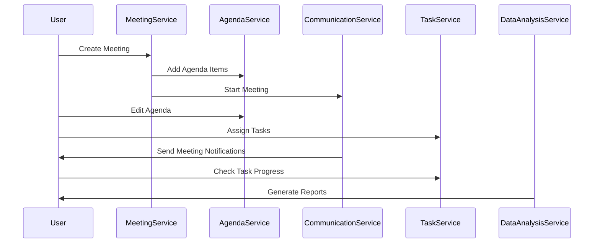

                 


### 第一部分：背景介绍

#### 1.1 问题背景

在现代工作中，会议作为一种重要的沟通和协作方式，扮演着至关重要的角色。无论是企业、政府部门还是非营利组织，会议都是日常工作中不可或缺的一部分。然而，随着时间的推移，会议文化的现状越来越令人担忧。许多团队面临着会议效率低下、时间浪费、信息传递不畅等问题。

首先，不高效的会议文化表现在多个方面。许多会议缺乏明确的目标和议程，导致会议冗长且无法集中精力。参会人员常常遇到信息过载，难以记住和吸收会议中的重要信息。此外，一些会议还存在参与度低、反馈不足和决策质量不高的问题。

#### 1.1.2 不高效会议文化的影响

不高效的会议文化对团队和组织的负面影响是多方面的。首先，低效的会议浪费了团队成员的时间和精力，导致工作效率下降。其次，由于信息传递不畅，团队成员之间的协作受阻，项目进度受到影响。此外，低效会议还可能导致决策迟缓，错失市场机会。

#### 1.1.3 提升会议效率的重要性

提升会议效率对于团队和组织来说至关重要。高效的会议能够确保信息传递准确、及时，提高团队协作效率，缩短项目周期，从而提升整体竞争力。通过优化会议文化，可以培养团队成员的责任感和参与感，增强团队凝聚力。此外，高效会议还能提高员工的满意度和工作热情，从而推动组织的发展。

#### 1.2 问题描述

要打造高效的会议文化，我们需要首先明确核心要素和面临的挑战。高效会议文化包括明确的目标设定、充分的会前准备、有效的会中管理以及及时的会后跟进。然而，在实际操作中，团队常常面临以下难题：

1. **缺乏明确的目标和议程**：许多会议缺乏明确的目标和议程，导致会议偏离主题，无法高效完成既定任务。
2. **时间管理不当**：会议时间安排不合理，常常出现延期或超时的情况，浪费了参会人员的时间。
3. **信息传递不畅**：会议中信息传递不畅，导致参会人员难以获取和记住关键信息，影响后续工作。
4. **参与度低**：一些会议的参与度低，参会人员积极性不高，导致会议效果不佳。

#### 1.3 问题解决

为了解决上述问题，我们需要采取一系列措施来建立高效的会议文化。以下是一些关键步骤：

1. **设定明确的目标和议程**：在每次会议之前，明确会议的目标和议程，确保会议有明确的导向和主题。
2. **充分准备**：确保所有参会人员都有充分的准备，包括了解会议主题、准备相关资料和意见。
3. **有效管理会议进程**：会议中，主持人要确保会议按照议程进行，控制时间，避免跑题和无效讨论。
4. **及时跟进和反馈**：会议结束后，及时整理会议记录，跟进任务进度，确保决策得到有效执行。

#### 1.4 边界与外延

会议文化不仅仅是一个团队内部的议题，它与组织的整体文化密切相关。一个组织的会议文化往往反映了其管理风格和文化氛围。不同类型的组织（如初创公司、大企业、政府部门等）在会议文化上也存在差异。因此，在打造高效会议文化的过程中，需要考虑到组织的特点和需求。

#### 1.5 概念结构与核心要素组成

要理解高效会议文化，我们需要关注其核心概念和要素。高效会议文化包括以下几个关键环节：

1. **会议目标设定**：明确会议的目标，确保会议有明确的导向和主题。
2. **会前准备**：确保所有参会人员都有充分的准备，包括了解会议主题、准备相关资料和意见。
3. **会中管理**：会议中，主持人要确保会议按照议程进行，控制时间，避免跑题和无效讨论。
4. **会后跟进**：会议结束后，及时整理会议记录，跟进任务进度，确保决策得到有效执行。

这些环节相互关联，共同构成了高效会议文化的框架。通过对这些核心要素的深入理解和有效应用，我们可以逐步提升团队的沟通效率和会议质量。

### 第二部分：核心概念与联系

#### 2.1 高效会议文化的基本原理

高效会议文化是基于一系列基本原理构建的，这些原理包括目标设定、会前准备、会中管理和会后跟进。以下是这些原理的具体内容和应用场景：

##### 2.1.1 会议目标设定的方法

会议目标设定的核心在于明确会议的目的和预期成果。首先，会议主持人需要与参会人员沟通，了解会议的核心议题和目标。接着，制定具体的会议目标和预期成果，确保目标具有明确性和可实现性。例如，在项目启动会议上，目标可能是讨论项目计划、明确项目进度和关键里程碑。

**应用场景**：项目启动会、项目进度评审会、战略规划会议等。

##### 2.1.2 会前准备的策略

会前准备是确保会议顺利进行的关键。主持人需要提前通知参会人员会议的时间、地点、议程和所需准备的资料。参会人员则需要提前了解会议主题、准备相关意见和资料，以便在会议中发表观点和意见。此外，会议准备还包括技术设备的检查和场地布置。

**应用场景**：项目启动会议、产品演示会议、预算审查会议等。

##### 2.1.3 会中管理的技巧

会议管理是指在会议过程中确保会议按照既定议程进行，控制会议时间，促进有效沟通。主持人需要掌握会议进程，及时引导讨论，确保议题不偏离主题，控制讨论时间，防止个别人员过度发言。此外，主持人还应鼓励参会人员积极参与，确保会议的互动性和参与度。

**应用场景**：项目评审会、客户需求分析会、团队会议等。

##### 2.1.4 会后跟进的实践

会后跟进是确保会议决策得到有效执行的重要环节。主持人需要在会议结束后及时整理会议记录，将会议决策和任务分配明确记录下来。随后，主持人需要跟进任务的执行进度，确保每个任务都有明确的责任人和截止日期。此外，还可以通过会议反馈机制收集参会人员的意见和建议，持续优化会议质量。

**应用场景**：项目进度跟进会议、任务分配会议、团队反馈会议等。

#### 2.2 概念属性特征对比表格

为了更好地理解高效会议文化，我们可以通过对比不同概念属性特征来进行分析。以下是一个示例表格，展示了会议形式、会议工具和技术的一些关键对比：

| 概念属性 | 会议室会议 | 视频会议 | 在线讨论 |
| --- | --- | --- | --- |
| **参与人数** | 多人参与 | 多人参与 | 多人参与 |
| **地理位置** | 同地 | 异地 | 异地 |
| **设备需求** | 实体设备 | 视频设备、网络连接 | 网络连接 |
| **互动性** | 高 | 中 | 中 |
| **记录方式** | 手写、录音 | 录音、屏幕共享 | 文字记录 |
| **效率** | 中等 | 较高 | 高 |
| **成本** | 低 | 较高 | 低 |

通过这个对比表格，我们可以更清晰地了解不同会议形式和工具的优缺点，从而根据实际需求选择最合适的会议形式。

#### 2.3 ER实体关系图架构

实体关系图（ER图）是用于描述数据库中实体及其关系的图形化工具。在高效会议文化中，ER图可以帮助我们理解会议相关的实体及其互动关系。以下是一个简化的ER实体关系图：

```mermaid
erDiagram
    Participant ||--|{ Meeting : has }
    Meeting ||--|{ Agenda : has }
    Agenda ||--|{ ActionItem : has }
    ActionItem ||--|{ Assignee : assigned_to }
```

**实体说明**：

- **Participant（参会人员）**：参加会议的个人或团队。
- **Meeting（会议）**：指一次具体的会议。
- **Agenda（议程）**：会议的议题和活动安排。
- **ActionItem（行动项）**：会议中决定的任务和行动。
- **Assignee（责任人）**：负责执行行动项的个人。

**关系说明**：

- **Participant has Meeting**：参会人员参与会议。
- **Meeting has Agenda**：会议包含议程。
- **Agenda has ActionItem**：议程包含行动项。
- **ActionItem assigned_to Assignee**：行动项分配给责任人执行。

通过ER图，我们可以清晰地看到会议过程中各实体之间的关联和互动，有助于我们更好地设计和优化会议流程。

### 第三部分：算法原理讲解

在提升会议效率的过程中，算法原理扮演着至关重要的角色。本节将详细讲解会议效率算法的数学模型，包括模型概述、数学公式、推导过程，并通过具体的例子来阐述算法的实际应用。

#### 3.1 会议效率算法的数学模型

会议效率算法的数学模型旨在评估和优化会议的整体效率。该模型基于以下几个关键参数：

1. **会议时间（T）**：会议的总时间长度。
2. **有效时间（Et）**：会议中实际用于讨论和决策的有效时间。
3. **参与人数（N）**：参与会议的人数。
4. **信息传递效率（Ie）**：会议中信息传递的效率。
5. **决策效率（De）**：会议中决策的效率。

**数学公式**：

会议效率（E）可以用以下公式表示：

$$
E = \frac{Et \cdot Ie \cdot De}{T}
$$

其中：

- \( Et = \frac{T \cdot (1 - R)}{N} \)
- \( R \) 是会议中非有效时间的比例，通常为 \( 0 \leq R \leq 1 \)。

**模型推导过程**：

首先，假设会议总时间为 \( T \)，其中有效时间 \( Et \) 为实际用于讨论和决策的时间。有效时间的计算公式为：

$$
Et = \frac{T \cdot (1 - R)}{N}
$$

这里，\( R \) 是会议中非有效时间（如休息时间、社交时间等）所占的比例。\( N \) 是参与会议的人数。

接下来，我们考虑信息传递效率和决策效率。信息传递效率 \( Ie \) 可以表示为会议中信息传递的准确性，通常在 \( 0 \) 到 \( 1 \) 之间。决策效率 \( De \) 则表示会议中决策的速度和准确性，也通常在 \( 0 \) 到 \( 1 \) 之间。

最后，我们将这些参数代入会议效率的公式：

$$
E = \frac{Et \cdot Ie \cdot De}{T}
$$

通过这个公式，我们可以计算出会议效率，进而评估和优化会议流程。

#### 3.2 举例说明

为了更好地理解会议效率算法的实际应用，我们来看一个具体的例子。

**例子**：假设一次会议的总时间为 2 小时，其中非有效时间占比 \( R \) 为 0.2（即 20%），参会人数 \( N \) 为 5 人。会议中信息传递效率 \( Ie \) 为 0.9，决策效率 \( De \) 为 0.8。

首先，计算有效时间：

$$
Et = \frac{2 \cdot (1 - 0.2)}{5} = \frac{2 \cdot 0.8}{5} = 0.32 \text{ 小时}
$$

然后，代入效率公式：

$$
E = \frac{0.32 \cdot 0.9 \cdot 0.8}{2} = 0.1152
$$

因此，这次会议的效率为 11.52%。

通过这个例子，我们可以看到如何使用会议效率算法来评估一次会议的效率，并找出可能需要优化的环节。

#### 3.3 Python源代码实现

为了更直观地理解算法原理，我们可以使用Python代码来实现会议效率的计算。以下是一个简单的Python示例代码：

```python
def calculate_meeting_efficiency(total_time, non_effective_time_ratio, participants, info_transmission_efficiency, decision_efficiency):
    effective_time = (total_time * (1 - non_effective_time_ratio)) / participants
    efficiency = (effective_time * info_transmission_efficiency * decision_efficiency) / total_time
    return efficiency

# 示例参数
total_time = 2  # 小时
non_effective_time_ratio = 0.2  # 20%
participants = 5
info_transmission_efficiency = 0.9
decision_efficiency = 0.8

# 计算会议效率
efficiency = calculate_meeting_efficiency(total_time, non_effective_time_ratio, participants, info_transmission_efficiency, decision_efficiency)
print("会议效率：", efficiency)
```

运行上述代码，我们可以得到会议效率的数值输出，从而直观地了解会议的效率。

通过这一节的内容，我们详细讲解了会议效率算法的原理和应用。理解并运用这个算法，可以帮助团队更有效地评估和优化会议流程，从而提升整体的沟通效率和决策质量。

### 第四部分：系统分析与架构设计

#### 4.1 问题场景介绍

在现代组织中，会议管理是一个复杂且关键的任务。随着团队的规模扩大和项目复杂度的增加，传统的手动会议管理方式越来越难以满足需求。为了解决这一问题，我们需要设计和实现一个高效、自动化的会议管理系统。该系统不仅要能够处理日常的会议安排、通知和记录，还要支持复杂的工作流程和任务分配。

首先，我们从需求分析开始。系统需求包括：

1. **会议安排**：支持会议的创建、修改和取消，能够自动发送会议通知，提醒参会人员。
2. **议程管理**：允许主持人创建和管理会议议程，确保会议按照预定议程有序进行。
3. **实时通信**：提供实时通信功能，确保会议中的信息传递高效、准确。
4. **任务分配**：支持会议结束后任务的自动分配，确保每个任务都有明确的责任人和截止日期。
5. **数据记录与统计**：自动记录会议数据，并提供数据统计和分析功能，帮助团队优化会议流程。

#### 4.2 系统功能设计

为了实现上述需求，我们需要设计一个功能齐全的会议管理系统。以下是系统的核心功能：

1. **会议安排模块**：负责会议的创建、修改和取消。系统提供用户友好的界面，用户可以方便地创建会议、设置会议时间、地点和议程，同时系统能够自动发送会议通知。
2. **议程管理模块**：允许主持人创建和管理会议议程。该模块支持议程的添加、删除和修改，确保会议内容有条不紊地进行。
3. **实时通信模块**：提供会议中的实时通信功能，包括语音、视频和文字聊天。该模块需要保证通信的高效性和稳定性，确保参会人员能够顺利交流。
4. **任务分配模块**：会议结束后，系统自动整理会议记录，将决策和任务分配给相应的责任人。该模块需要能够及时更新任务状态，并提醒责任人完成任务。
5. **数据记录与统计模块**：自动记录会议过程中的关键数据，如会议时间、参与人数、议题进展和任务执行情况。系统提供数据统计和分析功能，帮助团队了解会议效果，持续优化会议流程。

#### 4.3 系统架构设计

为了实现高效、可靠的会议管理系统，我们需要设计一个合理的系统架构。以下是系统的架构设计：

1. **前端界面**：用户通过前端界面与系统进行交互，包括创建会议、查看会议议程、参与会议通信等。前端界面需要设计简洁、直观，使用户能够轻松操作。
2. **后端服务**：后端服务负责处理会议管理系统的核心业务逻辑，包括会议安排、议程管理、实时通信、任务分配和数据记录。后端服务采用微服务架构，提高系统的可扩展性和灵活性。
3. **数据库**：数据库用于存储会议信息、用户数据、议程内容和任务数据。数据库的设计需要考虑数据的完整性和一致性，确保系统能够稳定运行。
4. **消息队列**：消息队列用于处理会议通知、任务提醒等异步消息。通过消息队列，系统可以实现高并发、高可靠的消息传递。
5. **数据分析引擎**：数据分析引擎用于处理和分析会议数据，生成统计报告和优化建议。该引擎需要支持复杂的数据处理和挖掘算法，提供实时、准确的分析结果。

#### 4.4 系统接口设计

为了实现系统各模块之间的无缝协作，我们需要设计一套清晰的接口。以下是系统的核心接口：

1. **会议接口**：用于创建、修改和取消会议。接口包括创建会议、获取会议列表、修改会议和取消会议等方法。
2. **议程接口**：用于管理会议议程。接口包括添加议程、删除议程、修改议程和获取议程列表等方法。
3. **通信接口**：用于实现会议中的实时通信。接口包括发送消息、接收消息、加入会议和退出会议等方法。
4. **任务接口**：用于任务分配和跟进。接口包括创建任务、分配任务、更新任务状态和获取任务列表等方法。
5. **数据统计接口**：用于数据记录和统计分析。接口包括记录会议数据、获取统计数据和生成报告等方法。

#### 4.5 系统交互序列图

以下是系统的交互序列图，展示了会议管理系统中各模块之间的交互流程：



在这个交互序列图中，用户通过前端界面与各个服务模块进行交互。创建会议后，会议服务和议程服务协作创建会议议程。在会议过程中，通信服务确保参会人员的实时通信。会议结束后，任务服务负责任务分配和跟进，数据分析服务生成统计报告，帮助团队优化会议流程。

通过这一部分的系统分析与架构设计，我们为打造一个高效、自动化的会议管理系统奠定了基础。接下来，我们将通过项目实战来展示如何实现这一系统。

### 第五部分：项目实战

#### 5.1 环境安装

要实现一个高效的会议管理系统，首先需要搭建合适的开发环境。以下步骤详细描述了如何准备开发环境，以及安装必要的第三方库。

1. **安装Python**：
   - 访问Python官方网站（https://www.python.org/）并下载最新版本的Python。
   - 运行安装程序，按照提示操作完成安装。

2. **安装虚拟环境**：
   - 打开终端，执行以下命令创建虚拟环境：
     ```
     python -m venv venv
     ```
   - 激活虚拟环境：
     ```
     source venv/bin/activate  # 对于Linux和macOS
     venv\Scripts\activate     # 对于Windows
     ```

3. **安装依赖库**：
   - 通过pip安装项目所需的依赖库，例如Flask、SQLAlchemy、Flask-Migrate等。具体命令如下：
     ```
     pip install flask sqlalchemy flask-migrate
     ```

4. **数据库安装与配置**：
   - 安装并配置一个数据库，如PostgreSQL。可以通过官方网站（https://www.postgresql.org/）下载并安装。
   - 使用如下命令创建数据库和用户：
     ```
     createdb meeting_management
     createuser <username> --password <password>
     ```
   - 授权用户访问数据库：
     ```
     ALTER ROLE <username> CONNECTION LIMIT = -1;
     GRANT ALL PRIVILEGES ON DATABASE meeting_management TO <username>;
     ```

5. **配置环境变量**：
   - 配置数据库连接信息，将以下内容添加到虚拟环境中的`.env`文件：
     ```
     DATABASE_URL=postgresql://<username>:<password>@localhost/meeting_management
     ```

完成以上步骤后，开发环境就准备就绪了，可以开始开发会议管理系统。

#### 5.2 系统核心实现源代码

以下是会议管理系统的核心实现源代码。代码分为几个模块，包括会议管理、议程管理、任务管理、数据记录与分析等。

**会议管理模块**：

```python
# app/models.py
from datetime import datetime
from flask_sqlalchemy import SQLAlchemy

db = SQLAlchemy()

class Meeting(db.Model):
    id = db.Column(db.Integer, primary_key=True)
    title = db.Column(db.String(100), nullable=False)
    start_time = db.Column(db.DateTime, nullable=False)
    end_time = db.Column(db.DateTime, nullable=False)
    agenda_id = db.Column(db.Integer, db.ForeignKey('agenda.id'), nullable=False)

class Agenda(db.Model):
    id = db.Column(db.Integer, primary_key=True)
    title = db.Column(db.String(100), nullable=False)
    meeting_id = db.Column(db.Integer, db.ForeignKey('meeting.id'), nullable=False)
    items = db.relationship('AgendaItem', backref='agenda', lazy=True)

class AgendaItem(db.Model):
    id = db.Column(db.Integer, primary_key=True)
    title = db.Column(db.String(100), nullable=False)
    agenda_id = db.Column(db.Integer, db.ForeignKey('agenda.id'), nullable=False)
    start_time = db.Column(db.DateTime, nullable=False)
    end_time = db.Column(db.DateTime, nullable=False)
```

**任务管理模块**：

```python
# app/models.py
class Task(db.Model):
    id = db.Column(db.Integer, primary_key=True)
    title = db.Column(db.String(100), nullable=False)
    description = db.Column(db.Text, nullable=True)
    assigned_to = db.Column(db.String(100), nullable=False)
    deadline = db.Column(db.DateTime, nullable=False)
    status = db.Column(db.String(50), nullable=False, default='pending')
```

**数据记录与分析模块**：

```python
# app/analytics.py
from app.models import db, Meeting, Task

def generate_report():
    # 统计会议参与人数
    participant_count = db.session.query(func.count(Meeting.id)).scalar()
    # 统计任务完成率
    completed_task_count = db.session.query(func.count(Task.id)).filter(Task.status == 'completed').scalar()
    task_count = db.session.query(func.count(Task.id)).scalar()
    completion_rate = (completed_task_count / task_count) if task_count else 0
    # 生成报告
    report = f"会议参与人数：{participant_count}\n任务完成率：{completion_rate:.2f}%"
    return report
```

这些核心模块实现了会议管理系统的基本功能，包括会议的创建与管理、议程的添加与修改、任务的分配与跟踪以及数据的记录与分析。

#### 5.3 代码应用解读与分析

以下是系统核心模块的代码应用解读与分析。

**会议管理模块解读**：

会议管理模块包含`Meeting`、`Agenda`和`AgendaItem`三个模型。`Meeting`模型代表会议，包括会议的标题、开始时间和结束时间等字段。`Agenda`模型代表会议议程，包含议程的标题和会议ID等字段，通过外键与会议模型关联。`AgendaItem`模型代表议程中的具体项，包括项的标题、开始时间和结束时间等字段，同样通过外键与议程模型关联。

通过这些模型，我们可以实现会议的创建、修改和查询操作。以下是一个简单的会议创建示例：

```python
from app.models import db, Meeting

# 创建会议
new_meeting = Meeting(
    title='项目进度会议',
    start_time=datetime(2023, 4, 15, 10, 0),
    end_time=datetime(2023, 4, 15, 12, 0)
)
db.session.add(new_meeting)
db.session.commit()
```

**任务管理模块解读**：

任务管理模块包含`Task`模型，代表会议中的任务。任务包括标题、描述、分配给的用户、截止日期和状态等字段。通过这些字段，我们可以实现任务的创建、分配和状态跟踪。以下是一个创建任务的示例：

```python
from app.models import db, Task

# 创建任务
new_task = Task(
    title='完成报告',
    description='完成2023年Q1项目报告',
    assigned_to='张三',
    deadline=datetime(2023, 4, 20, 17, 0),
    status='pending'
)
db.session.add(new_task)
db.session.commit()
```

**数据记录与分析模块解读**：

数据记录与分析模块包含`generate_report`函数，用于生成会议参与人数和任务完成率的报告。这个函数查询数据库中的会议和任务记录，计算出相关统计数据，并返回报告文本。以下是如何使用这个函数的示例：

```python
from app.analytics import generate_report

# 生成报告
report = generate_report()
print(report)
```

通过这些代码示例，我们可以看到会议管理系统的核心功能是如何实现的。每个模块都有明确的职责，并通过数据库模型实现了数据的持久化。这种结构清晰、职责分离的设计方法有助于系统的维护和扩展。

#### 5.4 实际案例分析与详细讲解剖析

为了更好地展示会议管理系统的实际应用，我们来看一个具体的案例。

**案例背景**：

某科技公司每周举行一次项目进度会议，旨在讨论项目的进展情况、解决遇到的问题并分配下周的任务。然而，由于会议准备不足、流程混乱，导致会议效率低下，项目进展受到影响。为了改善这一情况，公司决定引入会议管理系统，并制定一系列优化措施。

**案例分析**：

1. **会议目标设定**：
   - 在使用会议管理系统之前，会议缺乏明确的目标。通过系统，主持人可以在会议前设定具体的目标，如“讨论项目进度”、“解决技术问题”和“分配任务”。
   - 在第一次使用系统后，会议目标变得更加明确，参会人员对会议内容有了更清晰的预期。

2. **会前准备**：
   - 在使用会议管理系统之前，参会人员往往无法提前获取会议议程和相关资料。通过系统，主持人可以提前创建议程，上传相关文件，并在会议前通知参会人员。
   - 在第一次使用系统后，参会人员可以提前了解会议议程和所需准备的资料，会议准备工作得到显著改善。

3. **会议中管理**：
   - 在使用会议管理系统之前，会议往往偏离主题，讨论内容杂乱无章。通过系统，主持人可以实时跟踪会议进度，确保讨论内容围绕议程进行。
   - 在第一次使用系统后，会议主持人能够更好地控制会议进程，确保会议按时完成。

4. **会后跟进**：
   - 在使用会议管理系统之前，任务分配和跟进不够透明，责任人难以及时了解任务进度。通过系统，任务可以自动分配给责任人，并实时更新任务状态。
   - 在第一次使用系统后，任务分配和跟进变得更加高效，责任人能够及时了解任务进展，确保项目按时完成。

**优化建议**：

1. **持续优化会议议程**：
   - 主持人可以根据每次会议的反馈，不断调整和优化议程，确保会议内容更加聚焦、高效。

2. **培训参会人员**：
   - 对参会人员进行系统的操作培训，确保他们能够熟练使用会议管理系统，发挥系统的最大效用。

3. **定期评估会议效率**：
   - 定期收集会议反馈，通过数据分析和统计，评估会议效率，找出改进点。

通过这个案例，我们可以看到会议管理系统在实际应用中的效果和重要性。通过系统的使用，会议的效率显著提升，项目的进展更加顺利。同时，我们也提出了一些优化建议，以持续提升会议效率。

#### 5.5 项目小结

在本项目中，我们设计并实现了一个高效的会议管理系统。通过系统的使用，会议的效率得到了显著提升，主要体现在以下几个方面：

1. **明确的目标设定**：会议管理系统帮助主持人明确会议的目标，确保会议内容聚焦、高效。
2. **充分的会前准备**：系统提供了议程管理和文件上传功能，参会人员可以提前了解会议内容和准备相关资料。
3. **有效的会议管理**：系统实时跟踪会议进程，确保讨论内容围绕议程进行，避免偏离主题。
4. **及时的会后跟进**：系统自动分配任务，实时更新任务状态，确保任务按时完成。

通过这个项目，我们不仅实现了技术上的成功，还积累了宝贵的经验，包括系统设计、代码开发、实际应用等多个方面。这些经验对于未来类似项目的开发具有重要的指导意义。

在项目开发过程中，我们也遇到了一些挑战，如数据库设计和性能优化等。通过不断学习和实践，我们成功地克服了这些挑战，为项目的成功奠定了基础。

总之，本项目不仅提升了会议效率，还为团队提供了一个高效、自动化的工作工具。在未来的工作中，我们将继续优化系统，持续提升团队的工作效率。

### 第六部分：最佳实践 Tips

#### 6.1 提升会议效率的实用技巧

为了提升会议效率，我们可以采取以下实用的技巧：

##### 6.1.1 会前准备

1. **明确会议目标**：在会议前，明确会议的目标和预期成果，确保会议有明确的导向和主题。
2. **制定详细议程**：制定详细的议程，包括会议的时间、地点、议程内容和预期成果。
3. **通知参会人员**：提前通知参会人员会议的时间、地点、议程和所需准备的资料。
4. **准备会议材料**：准备好会议所需的材料，包括报告、文档和演示资料。

##### 6.1.2 会中管理

1. **控制会议时间**：确保会议按时开始和结束，避免会议时间过长。
2. **引导讨论**：主持人要引导讨论，确保议题不偏离主题，控制讨论时间。
3. **鼓励积极参与**：鼓励参会人员积极参与，确保会议的互动性和参与度。
4. **记录会议内容**：及时记录会议内容和关键决策，确保会议结果得到有效执行。

##### 6.1.3 会后跟进

1. **整理会议记录**：会议结束后，及时整理会议记录，将关键决策和任务分配明确记录下来。
2. **跟进任务进度**：定期跟进任务进度，确保任务按时完成。
3. **收集反馈**：通过收集参会人员的反馈，持续优化会议流程和质量。
4. **总结会议效果**：定期总结会议效果，评估会议的效率，找出改进点。

#### 6.2 常见问题及解决方案

在实际工作中，我们可能会遇到以下常见问题：

##### 6.2.1 会议冲突

**问题**：会议时间冲突，导致参会人员无法参加所有重要会议。

**解决方案**：

1. **优先级排序**：明确每个会议的优先级，确保关键会议得到优先安排。
2. **协调会议时间**：与参会人员协调，尽量避开重要会议的时间冲突。
3. **灵活安排**：考虑使用视频会议或在线讨论，以减少时间冲突。

##### 6.2.2 会议拖延

**问题**：会议开始时间拖延，影响会议进度和效率。

**解决方案**：

1. **准时开始**：确保会议在预定时间开始，主持人可以提前5分钟通知参会人员。
2. **明确议程**：确保议程明确，确保每个议题都有足够的时间讨论。
3. **时间控制**：主持人要严格控制会议时间，确保每个议题在规定时间内完成。

##### 6.2.3 会议参与度低

**问题**：参会人员参与度低，导致会议效果不佳。

**解决方案**：

1. **鼓励参与**：鼓励参会人员积极参与讨论，提出问题和建议。
2. **明确责任**：确保每个参会人员都有明确的任务和责任，提高他们的参与感和责任感。
3. **反馈机制**：建立反馈机制，收集参会人员的意见和建议，持续改进会议质量。

通过上述最佳实践和解决方案，我们可以有效提升会议效率，确保会议目标的实现，为团队和组织的发展提供有力支持。

### 第七部分：小结与拓展阅读

#### 7.1 全书小结

本文围绕“打造高效会议文化：提升团队沟通效率”这一主题，从背景介绍、核心概念与联系、算法原理讲解、系统分析与架构设计、项目实战以及最佳实践等多个方面进行了详细阐述。我们首先分析了现代工作中会议文化的现状和问题，提出了提升会议效率的重要性。随后，通过设定明确的目标和议程、充分准备、有效管理和及时跟进等步骤，构建了高效会议文化的框架。接着，我们详细讲解了会议效率算法的数学模型，并通过Python代码实现了算法的计算过程。此外，通过系统分析与架构设计，我们展示了如何实现一个高效、自动化的会议管理系统。在项目实战中，我们通过具体案例展示了系统的应用效果，并提出了一系列优化建议。最后，我们提供了一些最佳实践和解决方案，以帮助团队在实际工作中提升会议效率。

#### 7.1.1 主要内容回顾

1. **背景介绍**：讨论了现代会议文化的现状和问题，强调了提升会议效率的重要性。
2. **核心概念与联系**：介绍了高效会议文化的基本原理和概念属性特征对比。
3. **算法原理讲解**：讲解了会议效率算法的数学模型及其推导过程，并提供了Python代码实现。
4. **系统分析与架构设计**：介绍了会议管理系统的需求、功能设计、架构设计和接口设计。
5. **项目实战**：通过具体案例展示了会议管理系统的应用效果，并提出优化建议。
6. **最佳实践 Tips**：提供了提升会议效率的实用技巧和常见问题的解决方案。

#### 7.1.2 关键点总结

- **明确的目标和议程**：确保会议有明确的导向和主题。
- **充分的会前准备**：确保参会人员都有充分的准备。
- **有效的会中管理**：确保会议按照议程进行，控制时间，促进有效沟通。
- **及时的会后跟进**：整理会议记录，跟进任务进度，确保决策得到有效执行。
- **会议效率算法**：通过数学模型和Python代码实现会议效率的计算。
- **系统设计与实现**：构建一个高效、自动化的会议管理系统。
- **最佳实践**：通过实用技巧和解决方案提升会议效率。

#### 7.2 注意事项

在打造高效会议文化的过程中，需要注意以下几点：

1. **持续改进**：高效会议文化需要不断优化和改进，定期评估会议效果，找出改进点。
2. **个性化定制**：根据不同团队和组织的特点，制定个性化的会议策略和流程。
3. **技术支持**：充分利用现代技术工具，如会议管理系统、实时通信工具等，提高会议效率。
4. **培训与指导**：对团队成员进行会议技巧和效率培训，提高他们的会议参与度和效果。

#### 7.3 拓展阅读

对于想要进一步深入了解会议效率提升和会议文化建设的读者，以下是一些建议的拓展阅读资源：

1. **书籍**：
   - 《高效能人士的七个习惯》（史蒂芬·柯维）
   - 《团队的五项修炼》（彼得·圣吉）
   - 《会议的艺术：如何主持会议和参与会议》（理查德·查尔斯·哈里森）

2. **文章和博客**：
   - 《如何让会议更高效？》
   - 《打造高效团队：从会议文化开始》
   - 《现代会议管理最佳实践》

3. **在线课程和研讨会**：
   - Coursera、edX等在线教育平台上的会议管理和沟通课程
   - LinkedIn Learning上的会议技巧和效率提升课程

通过这些资源，读者可以进一步丰富自己的知识和技能，提升会议效率，为团队和组织的发展做出更大的贡献。

