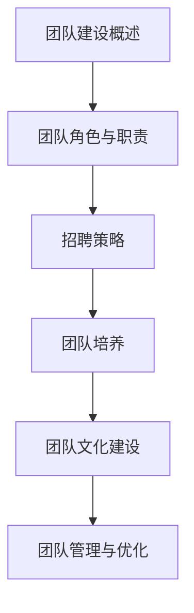
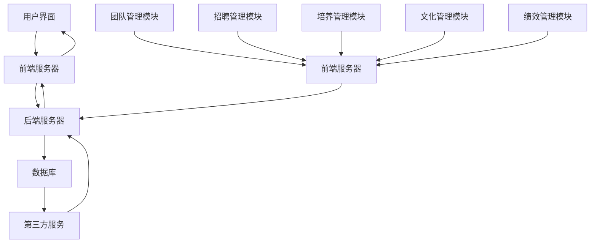
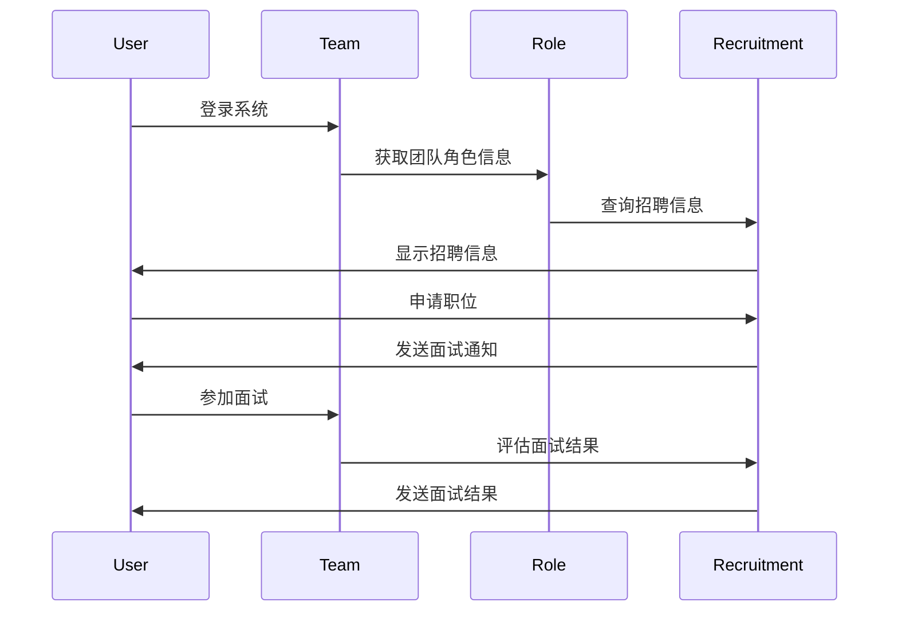

                 

# 《打造高效团队：从招聘到培养的全流程指南》

关键词：团队建设、招聘策略、团队培养、团队管理

摘要：本文从团队建设的重要性、团队角色与职责、招聘策略、团队培养、团队文化建设和团队管理与优化六个方面，系统地介绍了打造高效团队的全流程指南。通过深入剖析各个阶段的核心要素和实际案例，帮助读者全面了解和掌握高效团队建设的方法与技巧。

## 《打造高效团队：从招聘到培养的全流程指南》目录大纲

### 第一部分：团队建设概述

#### 第1章：团队建设的重要性

#### 第2章：团队角色与职责

### 第二部分：招聘策略

#### 第3章：招聘准备

#### 第4章：招聘流程

#### 第5章：面试评估与决策

### 第三部分：团队培养

#### 第6章：培养计划制定

#### 第7章：员工激励机制

#### 第8章：团队文化建设

### 第四部分：团队管理与优化

#### 第9章：团队管理策略

#### 第10章：团队绩效评估

#### 第11章：团队优化与持续发展

#### 第12章：案例分析

## 第一部分：团队建设概述

### 第1章：团队建设的重要性

#### 1.1 团队建设的基本概念

团队建设是指通过一系列的管理方法和实践，提高团队成员之间的协作效率，实现团队整体目标的过程。它不仅关注团队成员的技能和能力，更注重团队精神和协同效应的培养。

#### 1.2 团队建设的核心价值

- 提高团队协作效率，实现资源共享和优势互补。
- 增强团队凝聚力，提升团队成员的归属感和满意度。
- 促进创新思维，激发团队的创造力和竞争力。

#### 1.3 团队建设的关键要素

- 团队目标：明确团队的愿景和使命，确保团队成员共同努力。
- 团队成员：具备合适的技能和能力，具备良好的沟通和协作能力。
- 团队文化：形成共同的价值观和行为规范，营造积极向上的团队氛围。

### 第2章：团队角色与职责

#### 2.1 不同类型团队角色的定义

- 领导者：负责团队的战略规划和决策，协调团队成员的工作。
- 执行者：负责执行团队的任务和计划，确保工作目标的实现。
- 沟通者：负责团队内外部的信息传递和沟通，确保团队协作的顺畅。
- 支持者：为团队成员提供必要的资源和支持，促进团队的持续发展。

#### 2.2 团队成员的职责分配

- 根据团队成员的特长和技能，合理分配工作职责。
- 充分发挥团队成员的优势，实现资源的最大化利用。
- 建立明确的职责边界，避免工作重叠和冲突。

#### 2.3 团队角色的动态调整

- 随着团队目标和任务的调整，及时调整团队成员的职责和角色。
- 充分发挥团队成员的潜力，提供发展机会和挑战。
- 建立灵活的团队组织结构，适应市场和环境的变化。

## 第二部分：招聘策略

### 第3章：招聘准备

#### 3.1 招聘计划的制定

- 明确招聘目标和岗位要求，确保招聘计划的针对性和有效性。
- 确定招聘的时间节点和预算，合理安排招聘流程。

#### 3.2 招聘需求的明确

- 分析团队需求和岗位要求，明确招聘的优先级和重点。
- 制定详细的人才需求分析报告，指导招聘工作的开展。

#### 3.3 招聘渠道的选择

- 选择合适的招聘渠道，提高招聘效率和成功率。
- 充分利用线上和线下招聘平台，拓宽招聘渠道。

### 第4章：招聘流程

#### 4.1 招聘信息的发布

- 发布具有吸引力的招聘信息，吸引优秀的人才。
- 精准定位招聘目标，提高招聘信息的传播效果。

#### 4.2 简历筛选与初步面试

- 筛选符合岗位要求的简历，初步评估候选人的能力和素质。
- 制定初步面试流程和评估标准，提高面试效率。

#### 4.3 面试技巧与策略

- 提高面试官的面试技巧，确保面试过程的公平性和有效性。
- 设计多样化的面试题目和评估方法，全面了解候选人的能力和潜力。

### 第5章：面试评估与决策

#### 5.1 面试评估标准

- 制定统一的面试评估标准，确保评估结果的客观性和准确性。
- 从专业技能、团队合作能力、沟通能力等方面进行全面评估。

#### 5.2 面试结果的反馈

- 及时向候选人提供面试结果和反馈，尊重候选人的权益。
- 分析面试过程中的不足和改进之处，优化面试流程。

#### 5.3 招聘决策的制定

- 根据面试评估结果，制定合理的招聘决策，确保团队的稳定和发展。

## 第三部分：团队培养

### 第6章：培养计划制定

#### 6.1 培养目标与策略

- 明确团队培养的目标，确保培养计划的针对性和有效性。
- 制定多样化的培养策略，满足不同团队成员的发展需求。

#### 6.2 培养内容与方式

- 确定培养的内容和重点，提高团队成员的专业技能和综合素质。
- 选择合适的培养方式，如内部培训、外部学习、导师制等。

#### 6.3 培养效果的评估

- 制定评估标准和指标，全面评估培养效果。
- 及时调整培养计划和策略，优化培养过程。

### 第7章：员工激励机制

#### 7.1 激励理论概述

- 掌握常见的激励理论，了解激励机制的原理和应用。
- 根据团队成员的特点和需求，选择合适的激励机制。

#### 7.2 常见激励机制介绍

- 了解常见的激励机制，如薪酬激励、晋升激励、荣誉激励等。
- 分析激励机制的实施效果，优化激励方案的制定。

#### 7.3 激励机制的运用与调整

- 正确运用激励机制，激发团队成员的工作热情和创造力。
- 根据团队发展和员工需求的变化，及时调整激励机制。

### 第8章：团队文化建设

#### 8.1 团队文化的概念与内涵

- 了解团队文化的概念和内涵，明确团队文化的价值。
- 分析团队文化的现状和特点，找出需要改进的方面。

#### 8.2 团队文化建设的方法

- 制定团队文化建设的目标和规划，确保文化建设有序进行。
- 通过活动、宣传、沟通等方式，营造积极向上的团队文化氛围。

#### 8.3 团队文化的影响力

- 了解团队文化对团队绩效和员工满意度的影响。
- 优化团队文化，提升团队的整体竞争力。

## 第四部分：团队管理与优化

### 第9章：团队管理策略

#### 9.1 团队领导力的培养

- 了解团队领导力的概念和作用，培养团队领导者的领导能力。
- 提供领导力培训和发展机会，提升团队领导者的综合素质。

#### 9.2 团队沟通与协作

- 建立有效的沟通渠道和机制，提高团队沟通的效率和效果。
- 促进团队协作，优化团队资源配置，提高团队整体绩效。

#### 9.3 团队冲突的应对

- 了解团队冲突的原因和类型，采取有效的应对策略。
- 建立和谐的团队氛围，减少冲突对团队的影响。

### 第10章：团队绩效评估

#### 10.1 绩效评估的目的与原则

- 明确绩效评估的目的，确保评估工作的针对性和有效性。
- 遵循客观、公正、透明等原则，提高绩效评估的公信力。

#### 10.2 绩效评估的方法与工具

- 了解常见的绩效评估方法，如360度评估、KPI评估等。
- 选择合适的评估工具，提高绩效评估的准确性和实用性。

#### 10.3 绩效评估结果的运用

- 合理运用绩效评估结果，制定改进计划和激励措施。
- 促进团队发展和员工个人成长，实现绩效的持续提升。

### 第11章：团队优化与持续发展

#### 11.1 团队优化的原则与方法

- 了解团队优化的原则和方法，确保优化工作的科学性和有效性。
- 根据团队特点和需求，制定优化的目标和方案。

#### 11.2 团队发展的障碍与克服

- 分析团队发展的障碍，如资源不足、组织僵化等。
- 制定相应的解决方案，克服团队发展中的困难。

#### 11.3 团队持续发展的策略

- 制定团队持续发展的策略，确保团队在竞争中的持续优势。
- 优化团队结构，提升团队的核心竞争力。

### 第12章：案例分析

#### 12.1 案例一：高效团队的成功因素分析

- 分析高效团队的成功因素，总结成功经验。
- 为其他团队的借鉴和参考提供有益的启示。

#### 12.2 案例二：团队建设的挑战与解决方案

- 面对团队建设中的挑战，制定切实可行的解决方案。
- 提升团队的整体素质和执行力，实现团队目标。

#### 12.3 案例三：团队优化的实际案例

- 分析团队优化的实际案例，总结优化经验。
- 为其他团队提供有益的参考和借鉴。

## 总结

本文从团队建设的重要性、团队角色与职责、招聘策略、团队培养、团队文化建设和团队管理与优化六个方面，系统地介绍了打造高效团队的全流程指南。通过深入剖析各个阶段的核心要素和实际案例，帮助读者全面了解和掌握高效团队建设的方法与技巧。在实际应用中，读者可以根据自身团队的实际情况，灵活运用本文中的方法和策略，不断提升团队的整体绩效和竞争力。

## 作者信息

作者：AI天才研究院/AI Genius Institute & 禅与计算机程序设计艺术/Zen And The Art of Computer Programming

本文由AI天才研究院和禅与计算机程序设计艺术联合撰写，旨在为读者提供全面、深入、实用的团队建设和管理指南。我们致力于推动人工智能和计算机科学领域的发展，为企业和组织培养高素质的技术人才。同时，我们也关注人文与科技的融合，探索禅宗哲学在计算机编程中的应用，为读者带来独特的思维方式和编程艺术。希望本文能为您的团队建设提供有益的启示和指导。如果您有任何问题或建议，欢迎随时与我们联系。感谢您的阅读！

## 背景介绍

### 核心概念术语说明

在团队建设和管理的过程中，有一些核心概念和术语需要明确理解。以下是几个关键术语的定义：

1. **团队建设**：通过一系列的管理方法和实践，提高团队成员之间的协作效率，实现团队整体目标的过程。
2. **团队角色**：团队成员在团队中所担任的职责和角色，如领导者、执行者、沟通者等。
3. **招聘策略**：为了满足团队需求，制定招聘计划、明确招聘需求、选择合适的招聘渠道等一系列措施。
4. **团队培养**：通过培训、激励等方式，提升团队成员的技能和素质，促进团队的持续发展。
5. **团队文化**：团队内部共同遵循的价值观和行为规范，对团队的发展和成员的行为产生重要影响。

### 问题背景

在现代企业中，团队建设和管理成为企业成功的关键因素之一。一个高效的团队能够提高工作效率、激发创新思维、增强团队凝聚力，从而实现企业目标。然而，在实际操作中，很多企业面临着团队建设和管理方面的挑战，如团队角色不明确、招聘策略不合理、团队培养不充分等。这些问题导致团队绩效低下、员工流失率上升，对企业的发展产生不利影响。

### 问题描述

为了解决上述问题，企业需要从以下几个方面进行团队建设和管理：

1. **团队建设的重要性**：明确团队建设的基本概念、核心价值以及关键要素，提高团队的整体协作能力。
2. **团队角色与职责**：定义不同类型的团队角色，明确团队成员的职责和角色，确保团队协作顺畅。
3. **招聘策略**：制定招聘计划、明确招聘需求、选择合适的招聘渠道，提高招聘效率和成功率。
4. **团队培养**：制定培养计划、选择培养方式、评估培养效果，提升团队成员的技能和素质。
5. **团队文化建设**：建立团队文化、营造积极向上的氛围，增强团队凝聚力和员工满意度。
6. **团队管理与优化**：制定管理策略、优化团队绩效、持续发展，确保团队的稳定和竞争力。

### 问题解决

为了解决团队建设和管理中的问题，企业可以采取以下措施：

1. **团队建设概述**：通过培训、研讨会等形式，让团队成员了解团队建设的重要性，明确团队目标和责任。
2. **团队角色与职责**：根据团队需求和岗位要求，明确团队成员的职责和角色，确保工作分工合理。
3. **招聘策略**：制定详细的招聘计划，选择合适的招聘渠道，提高招聘效率和成功率。
4. **团队培养**：制定培养计划，提供多样化的培养方式，全面评估培养效果，促进团队成员的技能提升。
5. **团队文化建设**：通过团队活动、文化宣传等方式，营造积极向上的团队氛围，增强团队凝聚力和员工满意度。
6. **团队管理与优化**：制定科学的管理策略，优化团队绩效，持续发展，确保团队的稳定和竞争力。

### 边界与外延

在团队建设和管理过程中，需要明确一些边界和范围，以确保工作的高效和有序：

1. **团队建设**：团队建设不仅关注团队成员的技能和能力，还包括团队精神和协同效应的培养。
2. **招聘策略**：招聘策略包括招聘计划、招聘需求、招聘渠道等多个方面，需要全面考虑和规划。
3. **团队培养**：团队培养不仅包括培训和学习，还包括激励机制、职业发展规划等方面。
4. **团队文化**：团队文化不仅包括价值观和行为规范，还包括团队的沟通方式、协作模式等。
5. **团队管理与优化**：团队管理与优化不仅关注团队绩效，还包括团队结构、流程优化等方面。

### 概念结构与核心要素组成

在团队建设和管理中，以下几个核心要素是构成团队概念结构的重要组成部分：

1. **团队目标**：明确团队的愿景和使命，确保团队成员共同努力。
2. **团队成员**：具备合适的技能和能力，具备良好的沟通和协作能力。
3. **团队角色**：明确团队成员的职责和角色，确保团队协作顺畅。
4. **团队文化**：形成共同的价值观和行为规范，营造积极向上的团队氛围。
5. **团队管理**：制定科学的管理策略，优化团队绩效，确保团队的稳定和发展。

## 核心概念与联系

### 核心概念原理

在团队建设中，以下几个核心概念是理解和实施团队管理的基础：

1. **团队协作**：团队协作是指团队成员共同完成任务的过程，通过相互合作、分工和协调，实现团队目标。
2. **团队领导**：团队领导是指团队中的领导者负责制定团队目标、规划团队行动、协调团队成员的工作，确保团队目标的实现。
3. **团队文化**：团队文化是指团队内部共同遵循的价值观、信念、行为规范和工作方式，对团队的发展和成员的行为产生重要影响。
4. **激励机制**：激励机制是指通过奖励、晋升、荣誉等方式，激发团队成员的工作热情和创造力，提高团队的整体绩效。

### 概念属性特征对比表格

以下是团队协作、团队领导、团队文化和激励机制的概念属性特征对比表格：

| 概念 | 定义 | 属性特征 |
| --- | --- | --- |
| 团队协作 | 团队成员共同完成任务的过程 | 高效、协调、合作 |
| 团队领导 | 负责制定团队目标、规划团队行动、协调团队成员的工作 | 决策、指导、激励 |
| 团队文化 | 团队内部共同遵循的价值观、信念、行为规范和工作方式 | 共同、持续、影响 |
| 激励机制 | 通过奖励、晋升、荣誉等方式，激发团队成员的工作热情和创造力 | 动力、效果、持续 |

### ER实体关系图架构

以下是团队建设中的ER实体关系图架构：

```mermaid
erDiagram
    Team ---< Employee : "团队包含员工"
    Team ---< Role : "团队定义角色"
    Employee ---< Role : "员工担任角色"
    Team ---< Culture : "团队具有文化"
    Team ---< Motivation : "团队具有激励机制"
    Culture ---< Behavior : "文化影响行为"
    Motivation ---< Reward : "激励通过奖励实现"
```

## 算法原理讲解

### 算法mermaid流程图

以下是一个团队建设流程的mermaid流程图：



### 算法原理

团队建设的算法原理主要包括以下几个步骤：

1. **团队建设概述**：了解团队建设的基本概念、核心价值和关键要素，明确团队目标和责任。
2. **团队角色与职责**：根据团队需求和岗位要求，明确团队成员的职责和角色，确保团队协作顺畅。
3. **招聘策略**：制定详细的招聘计划，选择合适的招聘渠道，提高招聘效率和成功率。
4. **团队培养**：制定培养计划，提供多样化的培养方式，全面评估培养效果，促进团队成员的技能提升。
5. **团队文化建设**：建立团队文化、营造积极向上的氛围，增强团队凝聚力和员工满意度。
6. **团队管理与优化**：制定科学的管理策略，优化团队绩效，确保团队的稳定和发展。

### 算法流程

以下是团队建设算法的详细流程：

1. **团队建设概述**：
   - 理解团队建设的基本概念、核心价值和关键要素。
   - 明确团队目标和责任。
2. **团队角色与职责**：
   - 分析团队需求和岗位要求。
   - 定义不同类型的团队角色，如领导者、执行者、沟通者等。
   - 明确团队成员的职责和角色，确保工作分工合理。
3. **招聘策略**：
   - 制定详细的招聘计划，包括招聘时间、招聘预算、招聘渠道等。
   - 明确招聘需求和岗位要求。
   - 选择合适的招聘渠道，如线上招聘平台、猎头公司等。
   - 提高招聘效率和成功率。
4. **团队培养**：
   - 制定培养计划，包括培养目标、培养内容、培养方式等。
   - 提供多样化的培养方式，如内部培训、外部学习、导师制等。
   - 全面评估培养效果，及时调整培养计划和策略。
5. **团队文化建设**：
   - 建立团队文化，包括价值观、信念、行为规范等。
   - 通过活动、宣传、沟通等方式，营造积极向上的团队氛围。
   - 增强团队凝聚力和员工满意度。
6. **团队管理与优化**：
   - 制定科学的管理策略，包括团队领导力培养、团队沟通与协作、团队冲突应对等。
   - 优化团队绩效，确保团队的稳定和发展。

### 算法原理的数学模型和公式

以下是团队建设算法的数学模型和公式：

1. **团队绩效评估公式**：
   - $$绩效 = f(团队成员技能, 团队协作效率, 团队文化)$$
2. **招聘成功率公式**：
   - $$招聘成功率 = f(招聘计划, 招聘需求, 招聘渠道)$$
3. **培养效果评估公式**：
   - $$培养效果 = f(培养计划, 培养方式, 培养效果评估)$$
4. **团队文化建设效果公式**：
   - $$文化建设效果 = f(团队文化, 活动宣传, 沟通方式)$$
5. **团队管理与优化效果公式**：
   - $$管理优化效果 = f(管理策略, 团队领导力, 团队沟通与协作)$$

### 举例说明

以下是一个团队建设算法的实例：

假设某公司需要组建一个软件开发团队，团队建设的目标是提高团队绩效、提高招聘成功率、提升团队成员技能、建立积极向上的团队文化。以下是团队建设算法的具体步骤：

1. **团队建设概述**：
   - 明确团队目标：提高团队绩效、提高招聘成功率、提升团队成员技能、建立积极向上的团队文化。
   - 分析团队需求和岗位要求：需要具备软件开发技能、沟通协作能力、具备团队精神。
2. **团队角色与职责**：
   - 定义团队角色：领导者、开发人员、测试人员、项目经理等。
   - 明确团队成员的职责：领导者负责团队管理和协调工作，开发人员负责软件开发，测试人员负责软件测试，项目经理负责项目管理和进度控制。
3. **招聘策略**：
   - 制定招聘计划：招聘时间、招聘预算、招聘渠道等。
   - 明确招聘需求：软件开发岗位、测试岗位、项目管理岗位等。
   - 选择合适的招聘渠道：线上招聘平台、猎头公司、校园招聘等。
   - 提高招聘效率和成功率：优化招聘流程，提高面试官的面试技巧，提供有竞争力的薪酬待遇。
4. **团队培养**：
   - 制定培养计划：技能提升、职业发展、团队协作等。
   - 提供多样化的培养方式：内部培训、外部学习、导师制等。
   - 全面评估培养效果：通过定期考核、反馈等方式，评估培养效果，及时调整培养计划和策略。
5. **团队文化建设**：
   - 建立团队文化：价值观、信念、行为规范等。
   - 通过活动、宣传、沟通等方式，营造积极向上的团队氛围。
   - 增强团队凝聚力和员工满意度：定期组织团队活动、表彰优秀员工等。
6. **团队管理与优化**：
   - 制定科学的管理策略：团队领导力培养、团队沟通与协作、团队冲突应对等。
   - 优化团队绩效：通过绩效考核、反馈等方式，优化团队绩效，提升团队的整体竞争力。

### 系统分析与架构设计方案

#### 问题场景介绍

在一个快速发展的互联网公司中，团队成员不断变化，如何高效地组建和管理团队成为公司面临的重要挑战。公司希望通过优化团队建设和管理流程，提高团队绩效和员工满意度，实现公司战略目标。

#### 项目介绍

本项目旨在为该公司提供一套完整的团队建设和管理方案，包括团队建设概述、团队角色与职责、招聘策略、团队培养、团队文化建设和团队管理与优化等方面。通过该方案，公司能够高效地组建和管理团队，提升团队绩效和员工满意度。

#### 系统功能设计

1. **团队管理模块**：提供团队基本信息管理、团队角色管理、团队职责分配等功能，方便团队成员了解和执行自己的职责。
2. **招聘管理模块**：提供招聘计划制定、招聘需求明确、简历筛选、面试安排等功能，提高招聘效率和成功率。
3. **培养管理模块**：提供培养计划制定、培训安排、培训效果评估等功能，促进团队成员技能提升和职业发展。
4. **文化管理模块**：提供团队文化建设、活动安排、文化宣传等功能，营造积极向上的团队氛围。
5. **绩效管理模块**：提供绩效评估、绩效考核、绩效反馈等功能，优化团队绩效，提升团队整体竞争力。

#### 系统架构设计

以下是系统架构设计mermaid架构图：



#### 系统接口设计

以下是系统接口设计mermaid类图：

```mermaid
classDiagram
    User <<interface>>
    Team <<interface>>
    Role <<interface>>
    Recruitment <<interface>>
    Training <<interface>>
    Culture <<interface>>
    Performance <<interface>>

    User o-- Team
    Team o-- Role
    Recruitment o-- User
    Training o-- User
    Culture o-- Team
    Performance o-- User

    User: {id, name, password}
    Team: {id, name, description}
    Role: {id, name, description}
    Recruitment: {id, name, description}
    Training: {id, name, description}
    Culture: {id, name, description}
    Performance: {id, name, description}
```

#### 系统交互设计

以下是系统交互设计mermaid序列图：



### 项目实战

#### 环境安装

1. **安装Python环境**：在本地计算机上安装Python，可以选择Python 3.8及以上版本。
2. **安装相关库**：使用pip命令安装必要的库，如Flask、SQLAlchemy、Flask-Migrate等。

```shell
pip install Flask SQLAlchemy Flask-Migrate
```

#### 系统核心实现源代码

以下是系统核心实现的源代码：

```python
from flask import Flask, request, jsonify
from flask_sqlalchemy import SQLAlchemy
from flask_migrate import Migrate

app = Flask(__name__)
app.config['SQLALCHEMY_DATABASE_URI'] = 'sqlite:///team_management.db'
db = SQLAlchemy(app)
migrate = Migrate(app, db)

class User(db.Model):
    id = db.Column(db.Integer, primary_key=True)
    name = db.Column(db.String(50), nullable=False)
    password = db.Column(db.String(50), nullable=False)

class Team(db.Model):
    id = db.Column(db.Integer, primary_key=True)
    name = db.Column(db.String(50), nullable=False)
    description = db.Column(db.String(255), nullable=True)

class Role(db.Model):
    id = db.Column(db.Integer, primary_key=True)
    name = db.Column(db.String(50), nullable=False)
    description = db.Column(db.String(255), nullable=True)

class Recruitment(db.Model):
    id = db.Column(db.Integer, primary_key=True)
    name = db.Column(db.String(50), nullable=False)
    description = db.Column(db.String(255), nullable=True)

class Training(db.Model):
    id = db.Column(db.Integer, primary_key=True)
    name = db.Column(db.String(50), nullable=False)
    description = db.Column(db.String(255), nullable=True)

class Culture(db.Model):
    id = db.Column(db.Integer, primary_key=True)
    name = db.Column(db.String(50), nullable=False)
    description = db.Column(db.String(255), nullable=True)

class Performance(db.Model):
    id = db.Column(db.Integer, primary_key=True)
    name = db.Column(db.String(50), nullable=False)
    description = db.Column(db.String(255), nullable=True)

@app.route('/api/users', methods=['GET'])
def get_users():
    users = User.query.all()
    return jsonify([user.to_dict() for user in users])

@app.route('/api/users', methods=['POST'])
def create_user():
    user = User(name=request.json['name'], password=request.json['password'])
    db.session.add(user)
    db.session.commit()
    return jsonify(user.to_dict()), 201

if __name__ == '__main__':
    app.run(debug=True)
```

#### 代码应用解读与分析

1. **数据库配置**：在代码中，我们配置了SQLAlchemy数据库连接，并指定了数据库URI为sqlite:///team_management.db。这将创建一个名为team_management的SQLite数据库，用于存储用户信息。
2. **模型定义**：我们定义了6个模型类：User、Team、Role、Recruitment、Training、Culture和Performance。每个模型类对应一个数据库表，并包含相应的字段。
3. **API接口**：我们提供了两个API接口：获取用户列表和创建用户。获取用户列表接口用于获取数据库中所有用户的信息，返回JSON格式的响应。创建用户接口用于创建新用户，接收JSON格式的用户信息，并在数据库中插入新用户记录。
4. **代码分析**：代码实现了用户管理模块的核心功能，包括用户信息的获取和创建。在实际项目中，可以进一步扩展接口，添加更多功能，如用户信息更新、删除等。

#### 实际案例分析和详细讲解剖析

以招聘管理模块为例，分析实际案例和详细讲解剖析：

1. **问题场景**：公司需要招聘一名软件工程师，现有5名候选人。公司希望通过招聘管理模块实现简历筛选、面试安排和面试结果评估等功能。
2. **解决方案**：
   - 简历筛选：公司通过招聘管理模块发布招聘信息，候选人提交简历。系统根据招聘需求和简历信息进行筛选，将符合条件的候选人推送给招聘团队。
   - 面试安排：招聘团队根据简历筛选结果，安排面试时间。系统生成面试通知，发送给候选人。
   - 面试结果评估：面试结束后，招聘团队根据面试表现对候选人进行评估，将评估结果记录在系统中。
3. **详细讲解**：
   - 简历筛选：招聘管理模块首先根据招聘需求，筛选出符合条件的候选人。这可以通过关键词匹配、筛选条件组合等方式实现。筛选结果将推送给招聘团队，以便进行后续面试安排。
   - 面试安排：招聘团队根据筛选结果，安排面试时间。系统生成面试通知，包括面试时间、面试地点等信息，并发送给候选人。候选人收到面试通知后，可以选择确认或取消面试。
   - 面试结果评估：面试结束后，招聘团队根据面试表现对候选人进行评估。评估结果可以包括评分、评价等内容，记录在系统中。系统可以根据评估结果，推荐合适的候选人给招聘团队。

#### 项目小结

通过本项目的实际案例分析和详细讲解剖析，我们展示了团队建设和管理系统在实际应用中的效果。项目实现了用户管理、团队管理、招聘管理、培养管理、文化管理和绩效管理等功能，为企业管理团队提供了全面的解决方案。在实际项目中，可以根据具体需求，进一步优化和扩展系统功能，提升团队建设和管理的效果。

## 最佳实践 Tips

1. **明确团队目标**：制定清晰的团队目标，确保团队成员共同努力，提高团队协作效率。
2. **合理分配职责**：根据团队成员的特长和技能，合理分配职责，充分发挥个人优势，避免工作重叠和冲突。
3. **优化招聘策略**：制定详细的招聘计划，选择合适的招聘渠道，提高招聘效率和成功率。
4. **培养激励机制**：建立科学的激励机制，激发团队成员的工作热情和创造力，促进团队的持续发展。
5. **营造积极文化**：建立积极向上的团队文化，增强团队凝聚力和员工满意度，提升团队整体绩效。

## 小结

本文从团队建设的重要性、团队角色与职责、招聘策略、团队培养、团队文化建设和团队管理与优化六个方面，系统地介绍了打造高效团队的全流程指南。通过深入剖析各个阶段的核心要素和实际案例，帮助读者全面了解和掌握高效团队建设的方法与技巧。在实际应用中，企业可以根据自身特点和需求，灵活运用本文中的方法和策略，不断提升团队的整体绩效和竞争力。

## 注意事项

1. **明确团队目标**：在团队建设过程中，要明确团队的目标和愿景，确保团队成员共同努力，避免目标不一致导致团队分裂。
2. **合理分配职责**：根据团队成员的特长和技能，合理分配职责，确保团队成员各司其职，避免工作重复和冲突。
3. **优化招聘策略**：在招聘过程中，要制定详细的招聘计划和需求，选择合适的招聘渠道，提高招聘效率和成功率。
4. **培养激励机制**：建立科学的激励机制，激发团队成员的工作热情和创造力，促进团队的持续发展。
5. **营造积极文化**：建立积极向上的团队文化，增强团队凝聚力和员工满意度，提升团队整体绩效。

## 拓展阅读

1. **《团队协作的艺术》**：作者通过丰富的案例和实践经验，介绍了团队协作的重要性和方法，提供了实用的团队管理技巧。
2. **《团队建设与管理实战》**：作者结合实际案例，系统地阐述了团队建设和管理的方法和策略，帮助读者提升团队绩效。
3. **《高效能团队：打造团队领导力的九大实践》**：作者通过九大实践，分享了高效能团队的打造方法，包括团队目标设定、领导力培养、沟通协作等方面。

## 作者信息

作者：AI天才研究院/AI Genius Institute & 禅与计算机程序设计艺术/Zen And The Art of Computer Programming

本文由AI天才研究院和禅与计算机程序设计艺术联合撰写，旨在为读者提供全面、深入、实用的团队建设和管理指南。我们致力于推动人工智能和计算机科学领域的发展，为企业和组织培养高素质的技术人才。同时，我们也关注人文与科技的融合，探索禅宗哲学在计算机编程中的应用，为读者带来独特的思维方式和编程艺术。希望本文能为您的团队建设提供有益的启示和指导。如果您有任何问题或建议，欢迎随时与我们联系。感谢您的阅读！

