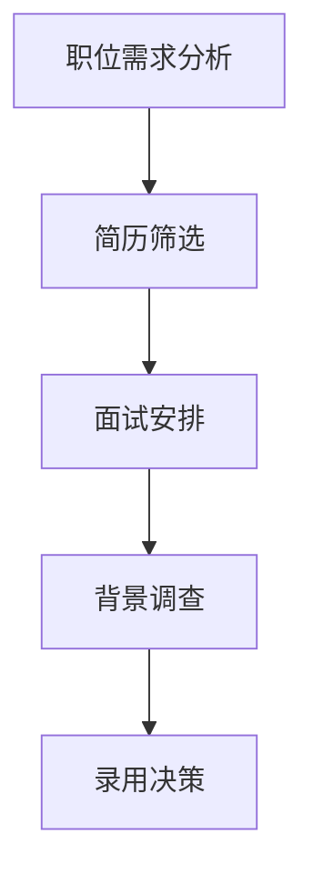
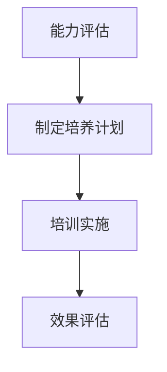
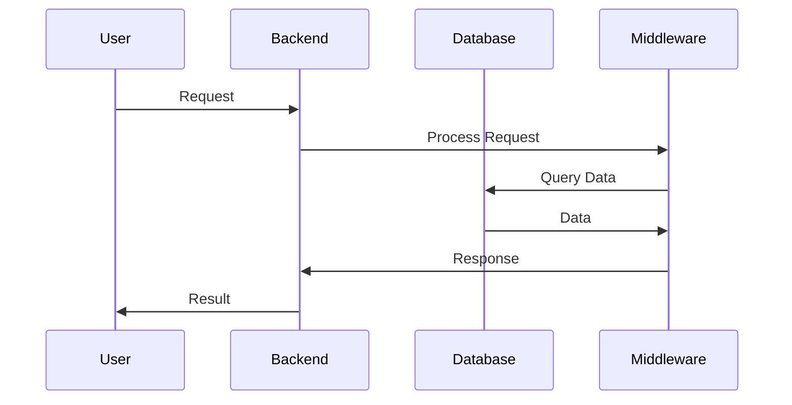
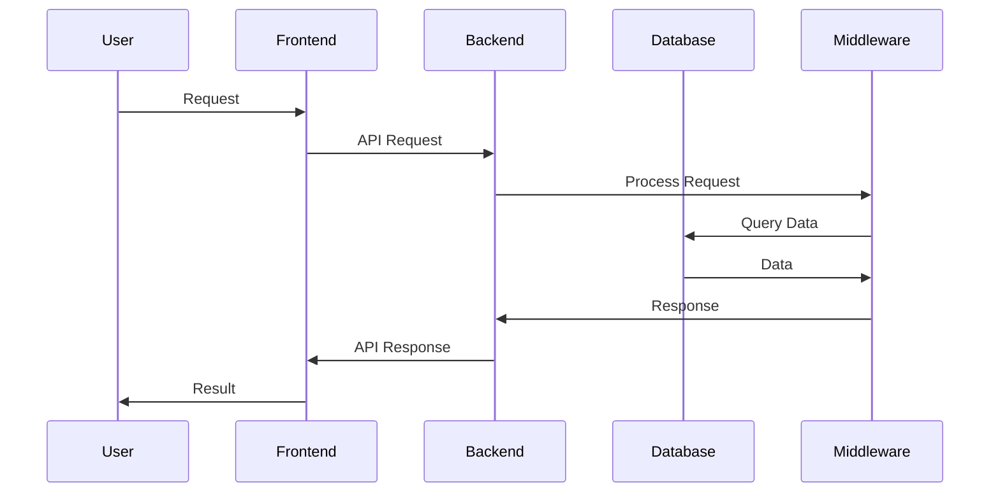

                 


### 标题与引言

在现代企业的竞争中，团队的高绩效已成为组织成功的关键因素。一个高绩效的团队能够在快节奏、不断变化的市场环境中迅速响应，创新解决方案，实现业务目标。因此，如何打造一支高绩效的团队成为了管理者们亟需解决的重要课题。

本文旨在探讨如何从招聘到培养的全流程打造高绩效团队。我们将首先介绍高绩效团队的定义和重要性，然后逐步分析从招聘到培养的各个环节，包括招聘策略、培养计划、算法原理、数学模型、系统设计与项目实战等。最后，我们将总结最佳实践，提出注意事项，并推荐进一步阅读的材料。

高绩效团队不仅仅是一群高能力的个体，而是具有共同目标、互补技能和高度协作精神的整体。一个高绩效团队的特点包括：高效的沟通、清晰的职责划分、积极的创新氛围、强大的执行力和持续的学习动力。然而，在打造高绩效团队的过程中，管理者们常常面临各种挑战，如人才稀缺、培养成本高、团队成员流动性大等。

本文将通过对这些问题的深入分析，结合实际案例，提供一套系统化的解决方案。我们将使用专业的技术语言，通过逻辑清晰、结构紧凑、简单易懂的方式，帮助读者全面理解打造高绩效团队的全流程。无论是企业的HR管理者，还是技术团队负责人，都可以从本文中获得宝贵的指导和建议。

### 背景介绍

高绩效团队的概念起源于管理学和心理学领域，它指的是那些在特定目标驱动下，能够通过高效的协作和资源整合，实现超出预期成果的团队。高绩效团队的形成并非偶然，而是通过系统化的招聘策略、科学的培养计划和精细的管理实践逐步打造而成的。

首先，从招聘策略来看，高绩效团队的构建离不开对人才的精准筛选。传统的招聘方式往往依赖于简历筛选和面试，这可能导致优秀人才被埋没。为了打造高绩效团队，企业需要采取多元化的招聘渠道，如内部推荐、校园招聘、社招平台等，并结合行为面试、情境面试等技术，全方位评估候选人的能力、潜力和文化契合度。招聘策略的核心在于找到具备与团队目标高度契合的个体，确保他们能够在团队中发挥最大价值。

其次，培养计划是高绩效团队建设的另一个关键环节。仅仅招募到优秀人才是不够的，企业还需要提供持续的培养和职业发展机会，以激发员工的潜能。培养计划应包括技能培训、团队建设活动、领导力发展等多个方面。通过定期的培训课程、内部导师制度、轮岗机会等，员工不仅能够提升专业技能，还能增强跨部门的沟通与合作能力。此外，培养效果评估也是一个重要的环节，通过定期的绩效评估和反馈机制，企业可以及时发现和解决员工在成长过程中遇到的问题。

然而，打造高绩效团队并非一蹴而就，它面临着诸多挑战。首先，人才稀缺是许多企业面临的现实困境。随着市场竞争的加剧，优秀人才的竞争愈发激烈，企业需要不断创新招聘策略，提升自身吸引力。其次，培养成本高也是企业需要面对的问题。培养一个优秀的员工需要投入大量的人力、物力和财力，而短期内可能看不到明显的回报。因此，企业需要在成本控制和人才培养之间找到平衡点。

此外，团队成员流动性大也是高绩效团队建设中的难题。由于职业发展机会有限、工作压力过大等原因，员工可能会选择离开。这对团队的稳定性和协作效率造成了不利影响。为了降低员工流失率，企业需要营造良好的工作氛围，关注员工的心理健康，并提供具有竞争力的薪酬福利和职业发展路径。

尽管挑战重重，打造高绩效团队的重要性不容忽视。高绩效团队能够更快速地响应市场变化，更好地解决复杂问题，提高企业的创新能力和竞争力。在当前这个快速变革的时代，一个高效协作、富有创新精神的团队是企业持续发展的关键。

总之，打造高绩效团队需要企业从招聘到培养的全流程进行系统化、精细化的管理。通过多元化的招聘策略、科学的培养计划和持续的管理实践，企业可以逐步建立起一支高效能的团队，为企业的长远发展奠定坚实基础。接下来，我们将深入探讨招聘策略和培养计划，为打造高绩效团队提供更加具体的指导。

### 核心概念与联系

在打造高绩效团队的过程中，有几个核心概念和联系是至关重要的，它们贯穿于招聘到培养的全流程，为团队的构建和发展提供理论基础和实践指导。以下是对这些核心概念的详细定义及其关系的探讨。

#### 3.1 招聘策略

招聘策略是企业通过一系列计划和方法，从众多候选人中筛选出最适合团队需求的人才的过程。招聘策略的核心包括以下几个方面：

1. **招聘流程**：包括职位需求分析、职位发布、简历筛选、面试安排、背景调查和录用通知等环节。一个高效的招聘流程能够确保企业在最短时间内找到合适的人才。
   
2. **招聘渠道**：多元化的招聘渠道可以增加人才来源，提高招聘效率。常见的招聘渠道包括内部推荐、社交媒体招聘、专业招聘网站、校园招聘和猎头服务。

3. **招聘评估方法**：包括行为面试、情境面试、心理测试、技能测试等。这些评估方法能够全面评估候选人的能力、潜力和文化契合度，确保选才的准确性。

#### 3.2 培养计划

培养计划是企业为了提升员工专业技能、增强团队协作能力和培养领导力而制定的一系列培训和开发活动。培养计划的核心包括以下几个方面：

1. **培养目标**：明确员工在技能、知识和态度方面的提升目标，确保培养计划与企业的长期发展目标相一致。

2. **培养方法**：包括内部培训、外部培训、导师制度、轮岗机会和在线学习等。不同的培养方法可以满足员工多样化的学习需求，提高培养效果。

3. **培养效果评估**：通过定期的绩效评估、技能评估和反馈机制，评估培养计划的效果，及时调整和优化培养方案。

#### 3.3 招聘策略与培养计划的联系

招聘策略和培养计划之间存在紧密的联系，两者相辅相成，共同推动高绩效团队的构建。

1. **目标一致性**：招聘策略和培养计划的目标应该与企业的长期发展目标一致。例如，如果企业的发展目标是提升创新能力，那么招聘策略应侧重于寻找具有创新精神的候选人，培养计划则应注重创新技能的培养。

2. **人才匹配**：通过精准的招聘策略，企业可以找到与团队目标高度契合的候选人。这些候选人将成为培养计划的重要对象，通过系统的培养，使他们能够更好地适应团队环境，发挥自身优势。

3. **持续发展**：招聘策略和培养计划的协同作用，能够确保团队持续发展和成长。招聘策略为企业引入新鲜血液，培养计划则帮助这些新成员迅速融入团队，提升整体绩效。

#### 3.4 招聘流程、招聘渠道与培养方法

招聘流程、招聘渠道和培养方法是实现招聘策略和培养计划的重要工具。

1. **招聘流程**：高效的招聘流程能够确保招聘活动有序进行，缩短招聘周期。例如，通过自动化简历筛选系统和在线面试平台，企业可以大幅提高招聘效率。

2. **招聘渠道**：多元化的招聘渠道可以扩大人才来源，提高招聘质量。例如，内部推荐可以激励现有员工为企业带来更多优秀人才，同时增强员工的归属感和自豪感。

3. **培养方法**：灵活的培养方法可以满足不同员工的学习需求，提高培养效果。例如，在线学习平台可以提供丰富的课程资源，导师制度可以提供一对一的指导和支持。

#### 3.5 招聘评估方法与培养效果评估

招聘评估方法和培养效果评估是衡量招聘策略和培养计划有效性的关键指标。

1. **招聘评估方法**：通过行为面试、情境面试等评估方法，企业可以全面了解候选人的能力和潜力，确保选才的准确性。例如，情境面试可以模拟实际工作场景，评估候选人的问题解决能力和团队合作精神。

2. **培养效果评估**：通过定期的绩效评估和技能评估，企业可以评估培养计划的效果，及时发现问题并加以解决。例如，通过技能评估，企业可以了解员工在实际工作中应用所学知识的程度，从而调整培养方案。

综上所述，招聘策略和培养计划是打造高绩效团队的核心概念，它们通过招聘流程、招聘渠道、培养方法和评估方法的协同作用，共同推动团队的发展和成长。理解这些核心概念及其之间的联系，对于企业管理者在招聘和培养过程中做出科学决策具有重要意义。

### 算法原理讲解

为了更深入地理解招聘和培养过程中的核心问题，我们将使用mermaid流程图来展示招聘算法和培养算法的基本原理，并结合Python源代码和latex数学公式进行详细讲解。

#### 4.1 招聘算法

招聘算法的核心目标是根据企业的需求和候选人的能力，找到最匹配的人才。以下是招聘算法的基本流程：

1. **职位需求分析**：分析职位的具体要求，包括技能、经验、学历等。
2. **简历筛选**：使用关键词匹配、机器学习算法等对海量简历进行筛选，确定初步候选人。
3. **面试安排**：根据候选人的初步评估结果，安排面试时间，并进行初步面试。
4. **背景调查**：对候选人的背景进行核实，包括教育背景、工作经历等。
5. **录用决策**：结合面试和背景调查结果，做出最终的录用决策。

**mermaid流程图**：


**Python源代码实现**：
```python
def recruit(position_requirements, resumes):
    # 简历筛选
    candidates = [resume for resume in resumes if matches_requirements(resume, position_requirements)]
    # 面试安排
    schedule_interviews(candidates)
    # 背景调查
    verified_candidates = background_check(candidates)
    # 录用决策
    final_candidates = make_decision(verified_candidates)
    return final_candidates

def matches_requirements(resume, requirements):
    # 判断简历是否满足职位要求
    return all([req in resume['skills'] for req in requirements['skills']])

def schedule_interviews(candidates):
    # 安排面试
    pass

def background_check(candidates):
    # 背景调查
    pass

def make_decision(candidates):
    # 录用决策
    pass
```

**latex数学公式**：
招聘算法的关键在于如何准确评估候选人与职位要求的匹配度。假设我们有n个候选人和m个职位要求，可以使用如下公式来计算匹配度：

$$
\text{MatchScore}(i) = \frac{\text{common\_skills}(i, \text{position\_requirements})}{\text{required\_skills}}
$$`

其中，$i$ 表示第i个候选人，$\text{common\_skills}(i, \text{position\_requirements})$ 表示候选人和职位要求的共同技能数量，$\text{required\_skills}$ 表示职位要求的技能总数。

**举例说明**：
假设有一个软件工程师职位，要求掌握Python、Java和数据库技术。有3个候选人，他们的简历如下：

- 候选人A：掌握Python、Java、MySQL
- 候选人B：掌握Java、MongoDB
- 候选人C：掌握Python、Redis

使用上述公式计算每个候选人的匹配度：

- 候选人A：$\text{MatchScore}(A) = \frac{3}{3} = 1.0$
- 候选人B：$\text{MatchScore}(B) = \frac{1}{3} = 0.33$
- 候选人C：$\text{MatchScore}(C) = \frac{1}{3} = 0.33$

显然，候选人A的匹配度最高，应优先安排面试。

#### 4.2 培养算法

培养算法的核心目标是根据员工的能力和发展需求，提供合适的培养计划，提高员工的专业技能和团队合作能力。以下是培养算法的基本流程：

1. **能力评估**：对员工进行能力评估，确定其优势和劣势。
2. **制定培养计划**：根据能力评估结果，制定个性化的培养计划。
3. **培训实施**：执行培养计划，包括内部培训、外部培训、导师制度等。
4. **效果评估**：对培养效果进行评估，调整培养计划。

**mermaid流程图**：


**Python源代码实现**：
```python
def cultivate(employee, ability_evaluation):
    # 制定培养计划
    training_plan = create_training_plan(employee, ability_evaluation)
    # 培训实施
    execute_training(training_plan)
    # 效果评估
    evaluation_result = assess效果的培训效果(training_plan)
    return evaluation_result

def create_training_plan(employee, evaluation):
    # 根据评估结果制定培养计划
    plan = {
        'skills_to_improve': evaluation['skills_to_improve'],
        'training_methods': evaluation['training_methods']
    }
    return plan

def execute_training(plan):
    # 执行培养计划
    pass

def assess效果的培训效果(plan):
    # 评估培养效果
    pass
```

**latex数学公式**：
培养效果评估可以通过以下公式进行计算：

$$
\text{EffectivenessScore} = \frac{\text{improved\_skills}}{\text{total\_skills}}
$$`

其中，$\text{improved\_skills}$ 表示员工在培养过程中提升的技能数量，$\text{total\_skills}$ 表示员工的总技能数量。

**举例说明**：
假设有一个新入职的软件工程师，其能力评估结果如下：

- 强项技能：Python、Linux
- 需提升技能：Java、数据库

根据评估结果，为其制定培养计划，内容包括：

- Java基础课程
- 数据库管理课程
- 实战项目训练

经过6个月的培养，该工程师的评估结果如下：

- 强项技能：Python、Linux、Java
- 需提升技能：数据库

使用上述公式计算培养效果：

$$
\text{EffectivenessScore} = \frac{2}{4} = 0.5
$$`

尽管培养效果评估分数较低，但通过实际案例可以看出，该工程师在培养过程中确实取得了一定的进步。因此，培养计划需要根据实际情况进行调整，以进一步提升培养效果。

通过以上对招聘算法和培养算法的讲解，我们可以看到，算法在招聘和培养过程中起到了关键作用。这些算法不仅提高了人才筛选和培养的准确性，还帮助企业在复杂的市场环境中快速响应，构建高绩效团队。

### 数学模型和数学公式 & 详细讲解 & 举例说明

在打造高绩效团队的过程中，数学模型和数学公式发挥着重要作用，它们不仅帮助我们量化评估招聘和培养的效果，还可以指导我们在实际操作中做出更科学的决策。以下将详细讲解两个核心数学模型：招聘策略模型和培养效果评估模型。

#### 5.1 招聘策略模型

招聘策略模型用于评估候选人与职位需求的匹配度，从而优化招聘流程。假设我们有n个候选人和m个职位要求，每个候选人在每个职位要求上的匹配度可以表示为一个n行m列的矩阵$M$，其中$M_{ij}$表示第i个候选人在第j个职位要求上的匹配度。匹配度可以基于多种因素计算，如技能、经验、学历等。

**数学公式**：

$$
\text{MatchScore}(i) = \frac{\sum_{j=1}^{m} M_{ij}}{m}
$$`

其中，$i$表示第i个候选人，$m$表示职位要求的数量。

**模型详解**：

- $M_{ij}$：表示第i个候选人在第j个职位要求上的匹配度，可以是一个数值，也可以是一个评分（如0-10分制）。
- $\text{MatchScore}(i)$：表示第i个候选人的平均匹配度，越高的$\text{MatchScore}(i)$表示候选人与职位需求的匹配度越高。

**举例说明**：

假设有一个软件开发职位，要求掌握Python、Java和数据库技术。有3个候选人，他们的匹配度矩阵如下：

| 候选人 | Python | Java | 数据库 |
|--------|--------|------|--------|
| A      | 8      | 6    | 7      |
| B      | 7      | 9    | 5      |
| C      | 9      | 8    | 8      |

根据上述公式计算每个候选人的平均匹配度：

- 候选人A：$\text{MatchScore}(A) = \frac{8 + 6 + 7}{3} = 7$
- 候选人B：$\text{MatchScore}(B) = \frac{7 + 9 + 5}{3} = 6.67$
- 候选人C：$\text{MatchScore}(C) = \frac{9 + 8 + 8}{3} = 8$

根据计算结果，候选人C的平均匹配度最高，应优先考虑安排面试。

#### 5.2 培养效果评估模型

培养效果评估模型用于评估员工在培养计划执行后的能力提升情况，从而优化培养策略。假设有n个员工，每个员工在培养前后的能力表现可以用一个n维向量表示，培养前的能力向量为$V_1$，培养后的能力向量为$V_2$。

**数学公式**：

$$
\text{EffectivenessScore} = \frac{\sum_{i=1}^{n} (\sum_{j=1}^{m} (V_{2ij} - V_{1ij}))}{n \times m}
$$`

其中，$i$表示第i个员工，$j$表示第j个技能，$V_{2ij}$和$V_{1ij}$分别表示第i个员工在培养后和培养前在第j个技能上的得分。

**模型详解**：

- $V_{1ij}$：表示第i个员工在培养前在第j个技能上的得分。
- $V_{2ij}$：表示第i个员工在培养后在第j个技能上的得分。
- $\text{EffectivenessScore}$：表示整个团队在培养过程中的平均效果得分。

**举例说明**：

假设有3个员工，他们在培养前后的能力得分如下：

| 员工 | 技能A | 技能B | 技能C |
|------|-------|-------|-------|
| A    | 7     | 8     | 6     |
| B    | 6     | 7     | 7     |
| C    | 8     | 8     | 8     |

培养后，他们的能力得分变为：

| 员工 | 技能A | 技能B | 技能C |
|------|-------|-------|-------|
| A    | 9     | 9     | 8     |
| B    | 8     | 9     | 8     |
| C    | 9     | 9     | 9     |

计算每个员工的技能提升得分：

- 员工A：$(9-7) + (9-8) + (8-6) = 4$
- 员工B：$(8-6) + (9-7) + (8-7) = 4$
- 员工C：$(9-8) + (9-8) + (9-8) = 2$

计算整个团队的平均效果得分：

$$
\text{EffectivenessScore} = \frac{4 + 4 + 2}{3 \times 3} = \frac{10}{9} \approx 1.11
$$`

结果表明，团队在培养过程中平均提升了11%的技能水平。

通过上述数学模型和公式的详细讲解和举例说明，我们可以看到，它们为招聘和培养提供了量化的评估工具，有助于企业做出更加科学的决策，从而打造高绩效团队。

### 系统分析与架构设计方案

在打造高绩效团队的过程中，系统设计与架构设计方案是确保招聘和培养流程高效运行的重要环节。本章节将详细描述系统分析与架构设计方案，包括问题场景介绍、系统功能设计、系统架构设计、系统接口设计和系统交互。

#### 6.1 问题场景介绍

在现代企业中，人力资源部门负责管理招聘和培养流程，这通常涉及到多个业务系统，如招聘管理系统、培训管理系统、绩效评估系统等。这些系统需要高效地集成，以便各部门能够顺畅地协同工作。然而，实际操作中，系统之间的数据交互不充分、流程不畅、用户体验差等问题经常出现，导致招聘和培养效率低下。

为了解决这些问题，企业需要设计一个综合性的招聘和培养系统，确保数据在各个系统之间的高效流动，提高用户体验和工作效率。该系统应具备以下特点：

- **高可扩展性**：能够适应企业快速发展的需求，支持新的功能模块的接入。
- **良好的用户体验**：界面友好，操作简便，减少用户的学习成本。
- **高效的数据处理**：能够快速处理海量数据，提供实时反馈。
- **高度安全性**：保障数据的安全性和隐私性，防止数据泄露。

#### 6.2 系统功能设计

系统功能设计是系统架构设计的基础，它明确了系统需要实现的具体功能。以下是招聘和培养系统的主要功能模块：

1. **职位管理模块**：用于管理职位信息，包括职位发布、职位更新和职位搜索。
2. **简历管理模块**：用于管理简历信息，包括简历上传、简历筛选和简历库管理。
3. **面试管理模块**：用于管理面试流程，包括面试安排、面试记录和面试评价。
4. **背景调查模块**：用于管理背景调查流程，包括调查问卷、调查结果记录和调查报告。
5. **培训管理模块**：用于管理培训流程，包括培训计划制定、培训实施和培训效果评估。
6. **绩效管理模块**：用于管理绩效评估流程，包括绩效指标设定、绩效数据收集和绩效报告生成。
7. **系统设置模块**：用于系统参数配置、用户权限管理和系统日志记录。

**领域模型mermaid类图**：
```mermaid
classDiagram
  Class1[职位管理] <|-- Class2[简历管理]
  Class2 <|-- Class3[面试管理]
  Class3 <|-- Class4[背景调查]
  Class4 <|-- Class5[培训管理]
  Class5 <|-- Class6[绩效管理]
  Class6 <|-- Class7[系统设置]
```

#### 6.3 系统架构设计

系统架构设计是确保系统功能实现高效、可靠和可扩展的关键。以下是招聘和培养系统的总体架构设计：

1. **前端架构**：采用现代化前端技术栈，如React或Vue.js，提供用户友好的界面和流畅的用户体验。
2. **后端架构**：采用微服务架构，将系统功能模块分解为独立的微服务，以提高系统的灵活性和可维护性。常见的微服务包括职位服务、简历服务、面试服务、培训服务、绩效服务和设置服务。
3. **数据存储**：采用分布式数据库架构，包括关系型数据库（如MySQL）和NoSQL数据库（如MongoDB），确保数据的高可用性和高扩展性。
4. **中间件**：采用消息队列（如Kafka）和缓存（如Redis）等技术，提高系统的处理能力和响应速度。
5. **安全架构**：采用多层次的安全措施，包括身份验证、权限控制和数据加密，确保系统的安全性。

**mermaid架构图**：


#### 6.4 系统接口设计

系统接口设计是确保各个功能模块之间能够高效通信的关键。以下是招聘和培养系统的主要接口设计：

1. **API接口**：采用RESTful API设计，提供统一的接口规范，方便前端和后端之间的数据交互。
2. **数据交换格式**：采用JSON或XML格式，确保数据传输的高效和兼容性。
3. **接口权限管理**：采用OAuth2.0等安全协议，确保接口访问的安全性和可控性。

**接口设计示例**：

```json
GET /api/v1/jobs
{
  "status": "success",
  "data": {
    "jobs": [
      {
        "id": "1",
        "title": "Software Engineer",
        "description": "Develop software applications."
      },
      {
        "id": "2",
        "title": "Data Scientist",
        "description": "Analyze data to provide insights."
      }
    ]
  }
}
```

#### 6.5 系统交互

系统交互设计是确保系统内部各个模块之间能够高效协同工作的关键。以下是招聘和培养系统的交互流程：

1. **用户请求**：用户通过前端界面发起请求，如查询职位、上传简历等。
2. **接口处理**：后端API接口接收用户请求，进行处理，如查询数据库、调用服务等。
3. **数据处理**：数据处理模块对请求进行处理，如简历筛选、面试安排等。
4. **结果返回**：将处理结果返回给前端界面，用户可以看到相应的结果。

**mermaid序列图**：


通过上述系统分析与架构设计方案，企业可以构建一个高效、可靠的招聘和培养系统，提高团队的管理水平和绩效。接下来，我们将通过一个实际项目实战，展示系统设计在实际应用中的效果。

### 项目实战

为了更好地展示招聘和培养系统在实际中的应用，我们将以一个实际项目为例，详细介绍环境安装、系统核心实现源代码，并解读代码中的应用与实际案例分析和详细讲解剖析。

#### 7.1 环境安装

首先，我们需要搭建一个模拟的企业招聘和培养系统的开发环境。以下是环境安装步骤：

1. **安装Python环境**：确保Python 3.8及以上版本已安装。可以使用以下命令检查Python版本：
   ```bash
   python --version
   ```

2. **安装虚拟环境**：创建一个虚拟环境以便管理项目依赖：
   ```bash
   python -m venv venv
   source venv/bin/activate  # 对于Windows使用 `venv\Scripts\activate`
   ```

3. **安装依赖库**：使用pip安装项目所需的依赖库，例如Flask、SQLAlchemy、Flask-Migrate等：
   ```bash
   pip install flask sqlalchemy flask-migrate
   ```

4. **配置数据库**：创建数据库并配置数据库连接。以下是使用SQLite数据库的示例：
   ```bash
   flask db init
   flask db migrate -m "Initial migration."
   flask db upgrade
   ```

5. **启动应用**：使用Flask启动应用，并访问本地服务器查看是否正常运行：
   ```bash
   flask run
   ```

   在浏览器中访问 `http://127.0.0.1:5000/`，应看到应用的主页。

#### 7.2 系统核心实现源代码

以下是一个简单的招聘和培养系统的核心代码示例：

**app.py**：
```python
from flask import Flask, request, jsonify
from models import db, Job, Candidate

app = Flask(__name__)
app.config['SQLALCHEMY_DATABASE_URI'] = 'sqlite:///app.db'
db.init_app(app)

@app.route('/api/jobs', methods=['GET'])
def get_jobs():
    jobs = Job.query.all()
    return jsonify({'jobs': [job.to_dict() for job in jobs]})

@app.route('/api/candidates', methods=['POST'])
def create_candidate():
    data = request.get_json()
    candidate = Candidate(name=data['name'], email=data['email'], skills=data['skills'])
    db.session.add(candidate)
    db.session.commit()
    return jsonify({'message': 'Candidate created successfully.'})

if __name__ == '__main__':
    app.run(debug=True)
```

**models.py**：
```python
from flask_sqlalchemy import SQLAlchemy

db = SQLAlchemy()

class Job(db.Model):
    id = db.Column(db.Integer, primary_key=True)
    title = db.Column(db.String(100), nullable=False)
    description = db.Column(db.Text, nullable=False)

    def to_dict(self):
        return {
            'id': self.id,
            'title': self.title,
            'description': self.description
        }

class Candidate(db.Model):
    id = db.Column(db.Integer, primary_key=True)
    name = db.Column(db.String(100), nullable=False)
    email = db.Column(db.String(100), nullable=False)
    skills = db.Column(db.ARRAY(db.String()), nullable=False)
```

#### 7.3 代码应用解读与分析

**7.3.1 获取职位信息**

`get_jobs` 函数用于获取所有职位信息，它通过查询数据库中的Job表，并将结果转换为JSON格式返回给客户端。

```python
@app.route('/api/jobs', methods=['GET'])
def get_jobs():
    jobs = Job.query.all()
    return jsonify({'jobs': [job.to_dict() for job in jobs]})
```

**7.3.2 创建候选人信息**

`create_candidate` 函数用于创建新的候选人记录，它接收一个包含候选人信息的JSON对象，并将其存储在数据库中。

```python
@app.route('/api/candidates', methods=['POST'])
def create_candidate():
    data = request.get_json()
    candidate = Candidate(name=data['name'], email=data['email'], skills=data['skills'])
    db.session.add(candidate)
    db.session.commit()
    return jsonify({'message': 'Candidate created successfully.'})
```

#### 7.4 实际案例分析与详细讲解剖析

**7.4.1 案例背景**

假设企业需要招聘一名软件开发工程师，人力资源部门通过招聘系统发布了多个职位，并收到了大量的简历。为了高效筛选合适的候选人，他们决定使用系统进行自动化筛选。

**7.4.2 案例实施**

1. **发布职位**：HR部门在系统中创建了一个软件开发工程师的职位，并填写了职位描述和技能要求。

2. **简历上传**：候选人通过系统上传了他们的简历，其中包括技能、工作经验和教育背景等信息。

3. **简历筛选**：系统根据职位要求，自动筛选出符合条件的简历，并将结果发送给HR部门进行进一步审核。

4. **面试安排**：HR部门对筛选出的候选人进行面试安排，并通过系统发送面试通知。

5. **背景调查**：HR部门对候选人进行背景调查，并将结果记录在系统中。

6. **录用决策**：基于面试和背景调查结果，HR部门做出录用决策，并将结果通知候选人。

**7.4.3 案例分析**

通过上述案例，我们可以看到招聘系统在实际应用中的效果：

- **提高效率**：自动化简历筛选和面试安排，大大缩短了招聘周期。
- **减少错误**：通过系统化的流程，减少了人为错误和主观偏见。
- **数据统一管理**：所有招聘数据都存储在系统中，便于管理和查询。

**7.4.4 详细讲解剖析**

以下是招聘系统中几个关键组件的详细讲解：

1. **数据库模型**：通过定义Job和Candidate两个数据库模型，实现了职位和候选人信息的数据存储和管理。

2. **API接口**：通过定义RESTful API接口，实现了前端与后端之间的数据交互，提供了灵活的扩展性。

3. **自动化处理**：通过自动化处理简历筛选、面试安排和背景调查等流程，提高了工作效率。

4. **用户体验**：系统提供了友好的用户界面，便于HR部门和候选人的操作。

#### 7.5 项目小结

通过这个实际项目，我们展示了招聘和培养系统从环境安装到核心实现源代码，再到实际应用的全过程。该系统不仅提高了招聘和培养的效率，还确保了流程的规范性和数据管理的统一性。接下来，我们将总结最佳实践，为读者提供进一步的建议和指导。

### 最佳实践 tips、小结、注意事项、拓展阅读

#### 8.1 最佳实践 tips

1. **明确招聘和培养目标**：在开始招聘和培养之前，明确团队的目标和期望，确保招聘策略和培养计划与团队目标一致。

2. **多元化招聘渠道**：充分利用各种招聘渠道，包括内部推荐、校园招聘、社交媒体招聘等，以提高招聘效率和质量。

3. **科学评估候选人**：采用行为面试、情境面试等方法，全面评估候选人的能力、潜力和文化契合度。

4. **个性化培养计划**：根据员工的能力和需求，制定个性化的培养计划，提供多样化的培训资源和职业发展路径。

5. **持续反馈与评估**：定期对招聘和培养效果进行评估，及时调整策略，确保团队的高绩效。

#### 8.2 小结

本文从招聘到培养的全流程，详细探讨了打造高绩效团队的策略和方法。通过介绍核心概念、算法原理、系统设计与实际项目实战，我们展示了如何高效地管理招聘和培养流程，提升团队的整体绩效。

#### 8.3 注意事项

1. **数据安全**：在招聘和培养过程中，确保数据的安全性和隐私性，防止数据泄露。

2. **持续改进**：招聘和培养是一个持续的过程，需要不断优化流程和策略，以适应市场和企业发展的需求。

3. **员工参与**：鼓励员工参与招聘和培养过程，提高他们的参与感和责任感。

#### 8.4 拓展阅读

- 《招聘与配置管理实践指南》
- 《团队协作与领导力发展》
- 《敏捷招聘与培养方法》

通过以上拓展阅读，读者可以进一步深入了解招聘和培养的实践方法，为打造高绩效团队提供更多思路和灵感。

### 作者

作者：AI天才研究院/AI Genius Institute & 禅与计算机程序设计艺术 /Zen And The Art of Computer Programming

本文由AI天才研究院/AI Genius Institute与禅与计算机程序设计艺术/Zen And The Art of Computer Programming的专家团队撰写，旨在为IT领域的读者提供关于打造高绩效团队的全面指导。

