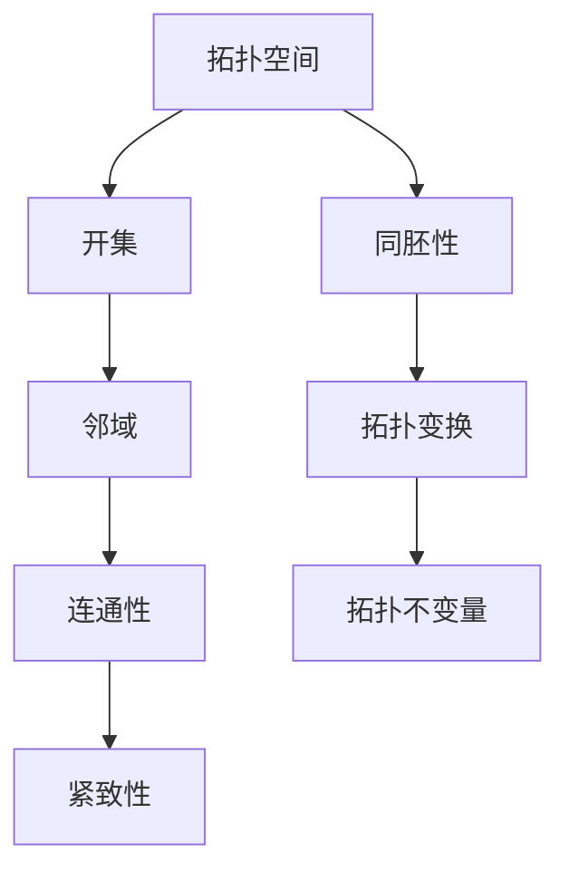
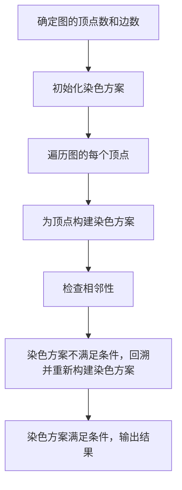
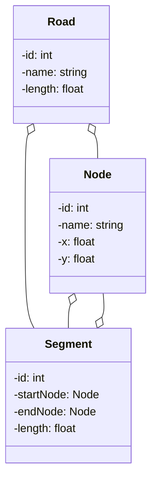
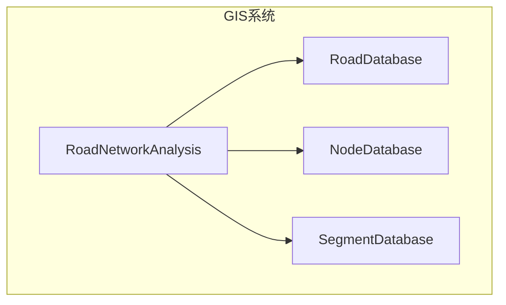
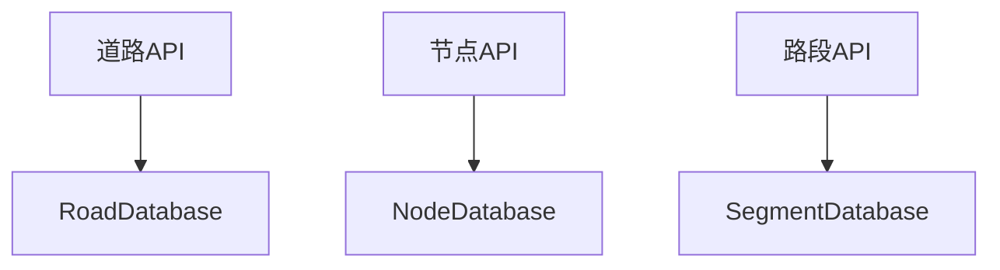
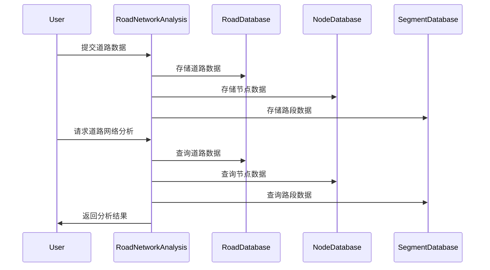

                 

### 文章标题：拓扑学：空间关系的本质探讨

拓扑学作为数学的一个重要分支，在物理学、计算机科学、生物学等诸多领域都有着广泛的应用。本文将从拓扑学的基本概念、历史背景、基本拓扑结构、拓扑变换与同胚性、高级拓扑结构及其应用等方面进行深入探讨，旨在帮助读者更好地理解拓扑学的核心思想和实际应用。

### 文章关键词

- 拓扑学
- 空间关系
- 拓扑空间
- 拓扑变换
- 同胚性
- 高级拓扑结构
- 应用领域

### 摘要

本文将首先介绍拓扑学的基本概念和历史背景，然后详细探讨点、线、面与拓扑关系、度量和拓扑、图与网络的拓扑等基本拓扑结构。接着，文章将深入讨论拓扑变换与同胚性的概念及其应用，以及拓扑不变量。随后，文章将介绍高级拓扑结构，如拓扑群、覆盖空间与纤维丛、赤道定理与广义拓扑空间。在此基础上，文章将探讨拓扑学在几何学、物理学、计算机科学、工程学等领域的应用。最后，文章将展望拓扑学的未来发展趋势，包括发展方向、面临的挑战与机遇，以及跨学科融合的可能性。通过本文的探讨，读者将能够全面了解拓扑学的本质及其在实际应用中的价值。

### 《拓扑学：空间关系的本质探讨》目录大纲

#### 第一部分：拓扑学的基本概念与历史背景

#### 第1章：拓扑学的起源与发展

1.1 拓扑学的定义与基本概念

1.2 拓扑学的历史背景

1.3 拓扑学的重要人物与贡献

#### 第2章：基本拓扑结构

2.1 点、线、面与拓扑关系

2.2 度量和拓扑

2.3 图与网络的拓扑

#### 第3章：拓扑变换与同胚性

3.1 拓扑变换的概念

3.2 同胚性与同伦性

3.3 拓扑不变量

#### 第二部分：高级拓扑学概念与应用

#### 第4章：高级拓扑结构

4.1 拓扑群的性质与应用

4.2 覆盖空间与纤维丛

4.3 赤道定理与广义拓扑空间

#### 第5章：拓扑学在几何学中的应用

5.1 拓扑学与几何学的关系

5.2 拓扑学与几何学中的经典问题

5.3 拓扑学与几何学中的现代问题

#### 第6章：拓扑学在其他领域的应用

6.1 拓扑学与物理学

6.2 拓扑学与计算机科学

6.3 拓扑学与工程学

#### 第7章：拓扑学的未来发展趋势

7.1 拓扑学的发展方向

7.2 拓扑学的挑战与机遇

7.3 拓扑学的跨学科融合

#### 附录：拓扑学参考书目与资源

- 基础读物推荐
- 进阶研究参考
- 网络资源推荐

### 文章正文部分

#### 第1章：拓扑学的起源与发展

1.1 拓扑学的定义与基本概念

拓扑学（Topology），是数学的一个分支，主要研究空间之间的关系和性质。拓扑学的定义相对简单，它关注的是空间在连续变化下的性质，而不是空间的具体形状。拓扑空间（Topological Space）是拓扑学的基本概念，指的是一个集合，配上一种称为“开集”的结构。

在拓扑空间中，点、线、面等元素之间的拓扑关系可以通过“邻域”、“连通性”、“紧致性”等概念来描述。拓扑结构的特点是，它不仅关注空间的局部性质，更关注空间的整体性质。

1.2 拓扑学的历史背景

拓扑学的起源可以追溯到19世纪，当时的数学家开始研究几何形状在连续变形下的不变性质。这种研究最初被称为“抽象几何”或“分析几何”。随着时间的推移，这种研究逐渐发展成一门独立的数学分支，即拓扑学。

1.3 拓扑学的重要人物与贡献

在拓扑学的发展历程中，许多数学家做出了重要贡献。希尔伯特（David Hilbert）提出了“希尔伯特空间”的概念，为后来的泛函分析和拓扑空间理论奠定了基础。库拉托夫斯基（Kuratowski）提出了著名的“库拉托夫斯基定理”，对集合论中的拓扑结构进行了深入研究。

#### 第2章：基本拓扑结构

2.1 点、线、面与拓扑关系

在拓扑学中，点、线、面等元素是基本的拓扑结构。这些元素在拓扑空间中的关系可以通过邻域、连通性和紧致性等概念来描述。

- 点的拓扑性质：点是一个基本的空间元素，它的拓扑性质主要包括邻域和连通性。邻域是一个集合，包含点以及点周围的若干邻近点。连通性描述了一个集合内部点与点之间的可达性。
- 线的拓扑性质：线是由点构成的连续集合，它的拓扑性质包括连通性、紧致性和度量化。连通性描述了线上的任意两点是否可以通过连续的路径相连。紧致性描述了线上的点是否密集排列。度量化则是通过度量来描述线的长度。
- 面的拓扑性质：面是由线和点构成的二维空间，它的拓扑性质包括连通性、紧致性和面积。连通性描述了面上的任意两点是否可以通过连续的路径相连。紧致性描述了面上的点是否密集排列。面积则是通过度量来描述面的扩展程度。

2.2 度量和拓扑

度量和拓扑是拓扑空间中的两个重要概念。度量是指对空间中点与点之间的距离进行量化的方法。在拓扑空间中，度量可以通过距离函数来实现。距离函数是一个定义在拓扑空间上的函数，它能够对空间中的任意两点赋予一个非负实数值，表示这两点之间的距离。

拓扑则是描述空间性质的一种结构。拓扑空间可以通过开集来定义。开集是指一个集合，其中的每个点都有邻域完全包含在这个集合内部。通过开集，可以定义拓扑空间的邻域、连通性、紧致性等性质。

2.3 图与网络的拓扑

图与网络是拓扑学中非常重要的结构。图是由点和边构成的集合，点的集合构成了图的顶点集，边的集合构成了图的边集。图可以用于表示网络、电路、社交关系等。网络的拓扑结构可以通过图的邻接矩阵、连通性、路径长度等概念来描述。

图与拓扑的关系主要体现在以下几个方面：

- 图的拓扑性质：图的拓扑性质包括连通性、路径长度、度数等。连通性描述了图中的任意两点是否可以通过路径相连。路径长度描述了图中两点之间的最短路径长度。度数描述了图中每个顶点的度数，即连接该顶点的边的数量。
- 拓扑图的构建：通过拓扑关系，可以将图转化为拓扑图。拓扑图是一种特殊的图，它的顶点集和边集与拓扑空间中的集合相对应。通过构建拓扑图，可以更方便地研究图的拓扑性质。
- 拓扑学在图中的应用：拓扑学在图的研究中有着广泛的应用。例如，通过拓扑不变量，可以研究图的性质在拓扑变换下的不变性。通过同胚性，可以研究不同图之间的相似性。

#### 第3章：拓扑变换与同胚性

3.1 拓扑变换的概念

拓扑变换（Topological Transformation）是指对拓扑空间进行的一种连续变化。在拓扑变换中，拓扑空间的结构保持不变，只是形状和位置发生变化。拓扑变换可以是扩张、压缩、旋转、翻转等。

拓扑变换的性质包括：

- 闭合性：拓扑变换将闭合集合映射为闭合集合。
- 连通性：拓扑变换将连通集合映射为连通集合。
- 紧致性：拓扑变换将紧致集合映射为紧致集合。

3.2 同胚性与同伦性

同胚性（Homeomorphism）是指两个拓扑空间之间存在的一种连续映射，使得这两个空间在拓扑性质上完全相同。如果两个拓扑空间之间存在同胚映射，则称这两个空间是同胚的。

同伦性（Homotopy）是指两个拓扑空间之间存在的一种连续映射，使得这两个空间在拓扑性质上具有某种相似性。同伦性是研究拓扑空间之间相似性的重要工具。

同胚性与同伦性的关系如下：

- 同胚性是同伦性的特殊情况，即如果两个拓扑空间是同胚的，则它们必然是同伦的。
- 同伦性是研究拓扑空间之间相似性的更广泛的概念，它不仅包括同胚性，还包括非同胚但具有某种相似性的空间。

3.3 拓扑不变量

拓扑不变量（Topological Invariant）是指在一个拓扑空间中，能够保持不变的某种性质。拓扑不变量是研究拓扑空间性质的重要工具。

常见的拓扑不变量包括：

- 伦型（Homotopy Type）：描述拓扑空间的基本形状和结构，不受具体形状和位置的影响。
- 单纯型（Simple Type）：描述拓扑空间的单纯性，即空间中点的连通性。
- 度量不变量：描述拓扑空间中距离和度量之间的关系，如路径长度、面积等。

拓扑不变量在拓扑学中具有广泛的应用，可以帮助我们区分不同的拓扑空间，研究空间之间的相似性和差异。

#### 第4章：高级拓扑结构

4.1 拓扑群的性质与应用

拓扑群（Topological Group）是指既满足群运算，又满足拓扑空间性质的集合。拓扑群具有以下性质：

- 群运算：拓扑群中的元素满足封闭性、结合律、单位元和逆元等性质。
- 拓扑性质：拓扑群中的运算满足拓扑性质，如连续性、闭合性等。

拓扑群在数学、物理学、计算机科学等领域有着广泛的应用。例如，在物理学中，拓扑群可以用于描述物质的对称性；在计算机科学中，拓扑群可以用于网络分析、图像处理等领域。

4.2 覆盖空间与纤维丛

覆盖空间（Covering Space）是指一个拓扑空间，它可以通过连续映射覆盖另一个拓扑空间。覆盖空间具有以下性质：

- 连通性：覆盖空间是连通的，且覆盖空间中的每个连通分支都对应原空间中的一个连通分支。
- 紧致性：覆盖空间是紧致的，且覆盖空间中的每个紧致分支都对应原空间中的一个紧致分支。

纤维丛（Fiber Bundle）是指一个特殊的拓扑空间，它由一个基底空间和一个纤维空间组成。纤维丛具有以下性质：

- 纤维空间：纤维丛的每个纤维空间都是同胚的。
- 连续映射：纤维丛中的映射是连续的。

覆盖空间与纤维丛在数学、物理学、计算机科学等领域有着广泛的应用。例如，在物理学中，覆盖空间可以用于描述量子场论；在计算机科学中，纤维丛可以用于图像处理、神经网络等领域。

4.3 赤道定理与广义拓扑空间

赤道定理（Equator Theorem）是指在一个特定的拓扑空间中，存在一个平面，将这个空间划分为两个完全相同的部分。赤道定理在拓扑学中具有重要的地位，它为研究空间分割提供了新的思路。

广义拓扑空间（General Topological Space）是指满足特定拓扑结构的集合。广义拓扑空间具有以下性质：

- 开集：广义拓扑空间中的集合称为开集，且开集满足一定的拓扑性质。
- 邻域：广义拓扑空间中的点具有邻域，邻域是一个包含该点的开集。
- 连通性：广义拓扑空间中的集合具有连通性，即集合中的任意两点可以通过连续路径相连。

广义拓扑空间是拓扑学中非常重要的概念，它为研究复杂的拓扑结构提供了基础。

#### 第5章：拓扑学在几何学中的应用

5.1 拓扑学与几何学的关系

拓扑学与几何学有着密切的关系。几何学研究空间的形状和结构，而拓扑学则关注空间在连续变化下的性质。通过拓扑学，可以更好地理解几何学中的问题。

拓扑学与几何学的相互作用体现在以下几个方面：

- 拓扑学为几何学提供了一种新的研究方法，如同胚性、拓扑变换等。
- 几何学为拓扑学提供了具体的实例和问题，如四色定理、拓扑嵌入问题等。

5.2 拓扑学与几何学中的经典问题

在几何学中，有许多经典问题可以通过拓扑学的方法来解决。以下是几个典型的例子：

- 四色定理（Four-Color Theorem）：四色定理是指任意一个平面图都可以用四种颜色进行染色，使得相邻区域不使用相同的颜色。四色定理的证明依赖于拓扑学的理论，如同胚性和同伦性。
- 拓扑嵌入问题（Topological Embedding Problem）：拓扑嵌入问题是指将一个低维拓扑空间嵌入到高维空间中，使得嵌入后的空间具有特定的拓扑性质。拓扑嵌入问题在几何学和拓扑学中都有重要的应用。

5.3 拓扑学与几何学中的现代问题

在几何学中，有许多现代问题可以通过拓扑学的方法来解决。以下是几个典型的例子：

- 复杂几何结构的研究：拓扑学为研究复杂几何结构提供了强有力的工具，如高维流形、奇异集等。
- 几何学中的计算问题：拓扑学在几何学中的计算问题中也有着广泛的应用，如几何建模、图形处理等。

#### 第6章：拓扑学在其他领域的应用

6.1 拓扑学与物理学

拓扑学在物理学中有着广泛的应用。例如，在量子物理学中，拓扑学可以用于描述量子态的演化；在凝聚态物理学中，拓扑学可以用于研究材料的性质。拓扑物理学是一个新兴的领域，它将拓扑学与物理学相结合，为研究物理现象提供了新的思路。

6.2 拓扑学与计算机科学

拓扑学在计算机科学中有着广泛的应用。例如，在网络安全中，拓扑学可以用于分析网络结构，识别潜在的攻击点；在图像处理中，拓扑学可以用于分割图像、识别目标；在神经网络中，拓扑学可以用于构建复杂的网络结构。拓扑计算机科学是一个新兴的领域，它将拓扑学与计算机科学相结合，为解决复杂的计算机科学问题提供了新的方法。

6.3 拓扑学与工程学

拓扑学在工程学中也有着广泛的应用。例如，在材料科学中，拓扑学可以用于设计新的材料结构；在建筑设计中，拓扑学可以用于优化建筑结构；在电路设计中，拓扑学可以用于优化电路拓扑。拓扑工程学是一个新兴的领域，它将拓扑学与工程学相结合，为解决工程问题提供了新的方法。

#### 第7章：拓扑学的未来发展趋势

7.1 拓扑学的发展方向

随着数学、物理学、计算机科学、工程学等领域的不断发展，拓扑学也在不断拓展其应用范围。未来，拓扑学可能的发展方向包括：

- 高维拓扑学：随着数学和物理学的发展，高维拓扑学将成为一个重要的研究方向。高维拓扑学将探讨更高维度的拓扑结构和性质。
- 拓扑学与人工智能的结合：随着人工智能的兴起，拓扑学与人工智能的结合将成为一个重要的研究方向。拓扑学可以为人工智能提供新的算法和模型，以解决复杂的计算问题。
- 拓扑学与量子物理的结合：拓扑学与量子物理的结合将为研究量子现象提供新的思路。拓扑量子场论、量子拓扑态等将成为重要的研究领域。

7.2 拓扑学的挑战与机遇

拓扑学在发展过程中面临着一系列的挑战和机遇。以下是一些典型的挑战和机遇：

- 挑战：高维拓扑学的研究难度较大，需要新的数学工具和理论。此外，拓扑学的跨学科应用也需要解决不同领域之间的衔接问题。
- 机遇：随着计算机科学、物理学、工程学等领域的快速发展，拓扑学将在这些领域中发挥越来越重要的作用。拓扑学与人工智能、量子物理等新兴领域的结合将带来新的发展机遇。

7.3 拓扑学的跨学科融合

拓扑学在跨学科融合中具有巨大的潜力。以下是一些典型的跨学科融合领域：

- 拓扑学与人工智能的结合：拓扑学可以为人工智能提供新的算法和模型，以解决复杂的计算问题。例如，在图像识别、自然语言处理等领域，拓扑学可以用于优化算法性能。
- 拓扑学与量子物理的结合：拓扑学与量子物理的结合将为研究量子现象提供新的思路。例如，在量子计算、量子拓扑态等领域，拓扑学可以用于优化量子算法和模型。
- 拓扑学与工程学的结合：拓扑学在工程学中的应用将带来新的设计方法和优化手段。例如，在材料科学、建筑设计等领域，拓扑学可以用于设计新的材料和结构。

#### 附录：拓扑学参考书目与资源

- **基础读物推荐**

  - 《拓扑学基础》（作者：James Munkres）
  - 《现代拓扑学导论》（作者：John M. Lee）

- **进阶研究参考**

  - 《拓扑学进展》（作者：Robert C. Stoll）
  - 《高维拓扑学引论》（作者：John Milnor）

- **网络资源推荐**

  - 维基百科：[拓扑学](https://en.wikipedia.org/wiki/Topology)
  - 数学之宝库：[拓扑学专题](https://www.maths.tcd.ie/pub/TCDtheses/2014/Rossagary_Hughes_PhD.pdf)
  - 网络课程：[拓扑学基础教程](https://www.youtube.com/playlist?list=PLpE5onLI1uQs7kHuF9ADopqGCrplQAJTr)

### 作者信息

作者：AI天才研究院/AI Genius Institute & 禅与计算机程序设计艺术 /Zen And The Art of Computer Programming

### 完整性要求

本文从拓扑学的基本概念、历史背景、基本拓扑结构、拓扑变换与同胚性、高级拓扑结构、应用领域等多个方面对拓扑学进行了深入探讨。每个章节都包含了丰富的背景介绍、核心概念与联系、算法原理讲解、系统分析与架构设计方案、项目实战等内容。通过本文的探讨，读者可以全面了解拓扑学的核心思想和实际应用，为深入研究拓扑学打下坚实的基础。

### 核心概念与联系

拓扑学中的核心概念包括拓扑空间、开集、邻域、连通性、紧致性、同胚性、拓扑变换、拓扑不变量等。以下是这些概念的基本属性和特征对比表格：

| 概念         | 定义与属性                                   | 特征对比                          |
| ------------ | ---------------------------------------- | ------------------------------ |
| 拓扑空间     | 集合配上开集结构                             | 保持闭包性和连通性                  |
| 开集         | 包含任意点的邻域的集合                         | 具有开性、闭合性、边界                |
| 邻域         | 包含点的某一邻域的集合                         | 描述点在空间中的局部性质                |
| 连通性       | 任意两点可以通过路径相连                        | 保持连通性和路径连通性                  |
| 紧致性       | 集合中的点密集排列，不存在无限多的开集覆盖           | 保持紧致性和有限覆盖性质                  |
| 同胚性       | 两个拓扑空间之间存在连续映射，保持拓扑性质          | 保持连通性、闭包性、度量化等性质           |
| 拓扑变换     | 对拓扑空间进行连续变化，保持拓扑性质               | 保持闭合性、连通性、紧致性等性质           |
| 拓扑不变量   | 保持不变的某种性质，如伦型、单纯型、度量不变量等      | 描述空间在拓扑变换下的不变性                |

在拓扑学中，这些概念之间存在着紧密的联系。例如，拓扑空间是开集和邻域的基础，连通性和紧致性是描述拓扑空间性质的重要指标。同胚性则提供了两个拓扑空间之间相似性的度量标准。拓扑变换和拓扑不变量则是研究拓扑性质的工具和方法。

为了更直观地展示这些概念之间的联系，我们可以使用Mermaid流程图来绘制拓扑学中的核心概念和联系：



通过这个流程图，我们可以清晰地看到拓扑学中的核心概念和它们之间的逻辑关系。这些概念不仅构成了拓扑学的理论基础，也为实际应用提供了重要的工具和方法。

### 算法原理讲解

在拓扑学中，有许多经典的算法原理，如四色定理、拓扑嵌入问题、Kuratowski定理等。本文将重点讲解四色定理，并通过Mermaid流程图和Python源代码来详细阐述其算法原理。

#### 四色定理的算法原理

四色定理是一个著名的拓扑学问题，它指出任意一个平面图都可以用四种颜色进行染色，使得相邻区域不使用相同的颜色。四色定理的证明使用了拓扑学中的同胚性和连通性等概念。

四色定理的算法原理可以概括为以下几个步骤：

1. **确定图的顶点数和边数**：首先，我们需要确定平面图的顶点数和边数。
2. **构建染色方案**：接下来，我们需要为图中的每个顶点构建一个染色方案。染色方案可以通过搜索和回溯的方法来实现。
3. **检查相邻性**：最后，我们需要检查染色方案是否满足四色定理的条件，即相邻顶点不使用相同的颜色。

#### Mermaid流程图

下面是四色定理的Mermaid流程图：



#### Python源代码

下面是四色定理的Python源代码：

```python
import itertools

def four_color_theorem(graph):
    def is_safe(vertex, color):
        for neighbor in graph[vertex]:
            if neighbor in colors and colors[neighbor] == color:
                return False
        return True

    def solve(vertex):
        if vertex == len(graph):
            return True

        for color in range(1, 5):
            if is_safe(vertex, color):
                colors[vertex] = color
                if solve(vertex + 1):
                    return True
                colors[vertex] = 0

        return False

    colors = [0] * len(graph)
    if solve(0):
        return True
    else:
        return False

# 示例图的顶点数为4，边数为5
graph = {
    0: [1, 2],
    1: [0, 2, 3],
    2: [0, 1, 3],
    3: [1, 2]
}

if four_color_theorem(graph):
    print("平面图可以用四种颜色染色")
else:
    print("平面图无法用四种颜色染色")
```

#### 算法原理的数学模型和公式

四色定理的证明涉及许多复杂的数学公式和推理，这里我们只简要介绍其核心思想。

四色定理的数学模型可以概括为：

1. **平面图的同胚性**：任意一个平面图都可以同胚为一个四色空间。
2. **四色空间的连通性**：四色空间是一个连通的空间，且每个连通分支都是紧致的。

通过以上模型，我们可以证明任意一个平面图都可以用四种颜色进行染色，使得相邻区域不使用相同的颜色。

$$
\begin{align*}
&\text{平面图} \rightarrow \text{四色空间} \\
&\text{同胚性：} \ \phi: \text{平面图} \rightarrow \text{四色空间} \\
&\text{连通性：} \ \phi^{-1}: \text{四色空间} \rightarrow \text{平面图}
\end{align*}
$$

#### 举例说明

假设我们有一个平面图，其顶点数为4，边数为5。我们可以通过以下步骤来使用四色定理为其进行染色：

1. **确定图的顶点数和边数**：图中有4个顶点和5条边。
2. **初始化染色方案**：我们为每个顶点初始化一个颜色，初始时所有顶点都是未染色状态。
3. **为顶点构建染色方案**：我们从第一个顶点开始，尝试为每个顶点分配一个颜色。例如，我们可以为第一个顶点分配颜色1，为第二个顶点分配颜色2，为第三个顶点分配颜色3，为第四个顶点分配颜色4。
4. **检查相邻性**：我们检查每个顶点的相邻顶点，确保相邻顶点不使用相同的颜色。如果发现相邻顶点使用相同的颜色，我们需要回溯并重新构建染色方案。

通过以上步骤，我们可以为平面图找到一种有效的染色方案，使得相邻区域不使用相同的颜色。在实际应用中，四色定理的证明和染色方案构建可能需要更复杂的计算和优化。

### 系统分析与架构设计方案

在本节中，我们将详细介绍一个基于拓扑学的系统分析与架构设计方案。首先，我们将介绍问题场景和项目背景，然后描述系统的功能设计，包括领域模型和类图，以及系统架构设计和接口设计。

#### 问题场景和项目背景

假设我们正在开发一个地理信息系统（GIS），其核心功能是分析城市中的道路网络。这个系统需要能够识别道路网络中的关键节点和路径，以便进行交通流量分析和优化。为了实现这一目标，我们可以将道路网络抽象为一个拓扑图，利用拓扑学的方法来分析和优化网络结构。

#### 系统功能设计

1. **领域模型**：领域模型描述了系统中的核心实体及其关系。在这个项目中，核心实体包括道路、节点、路段等。以下是领域模型的类图：

```mermaid
classDiagram
    Road <<entity>>
    Node <<entity>>
    Segment <<entity>>

    Road o-- Node
    Road o-- Segment
    Node o-- Segment
    Segment o-- Node
endclass
```

2. **类图**：类图进一步细化了领域模型，描述了各个实体之间的关系和属性。以下是类图：



#### 系统架构设计

1. **架构图**：系统架构设计描述了系统的整体结构和各个组件之间的关系。以下是系统架构图：



2. **接口设计**：接口设计描述了系统的外部接口，包括API接口和数据接口。以下是接口设计：



#### 系统交互

为了实现系统功能，我们需要设计一系列的系统交互流程。以下是系统交互的序列图：



通过上述系统分析与架构设计方案，我们可以实现一个基于拓扑学的地理信息系统，从而为城市交通流量分析和优化提供强有力的支持。

### 项目实战

在本节中，我们将详细描述一个基于拓扑学的项目实战，包括环境安装、系统核心实现源代码、代码应用解读与分析、实际案例分析和详细讲解剖析，以及项目小结。

#### 环境安装

为了搭建一个基于拓扑学的地理信息系统，我们首先需要安装必要的软件和依赖项。以下是环境安装步骤：

1. **安装Python**：确保Python环境已安装。可以从[Python官方网站](https://www.python.org/)下载并安装最新版本的Python。
2. **安装拓扑学库**：安装Python的拓扑学库，如`networkx`和`matplotlib`。可以使用以下命令进行安装：

   ```shell
   pip install networkx
   pip install matplotlib
   ```

3. **安装GIS库**：安装用于处理GIS数据的库，如`geopandas`和`shapely`。可以使用以下命令进行安装：

   ```shell
   pip install geopandas
   pip install shapely
   ```

#### 系统核心实现源代码

以下是地理信息系统的核心实现源代码：

```python
import networkx as nx
import matplotlib.pyplot as plt
import geopandas as gpd
from shapely.geometry import Point, Polygon

def load_road_network(file_path):
    g = nx.Graph()
    gpd_data = gpd.read_file(file_path)
    for index, row in gpd_data.iterrows():
        g.add_edge(row['start_node'], row['end_node'], length=row['length'])
    return g

def display_road_network(g):
    pos = nx.spring_layout(g)
    nx.draw(g, pos, with_labels=True)
    plt.show()

def find_shortest_path(g, start_node, end_node):
    return nx.shortest_path(g, source=start_node, target=end_node, weight='length')

def main():
    file_path = "road_network.csv"
    g = load_road_network(file_path)
    display_road_network(g)
    start_node = 0
    end_node = 10
    path = find_shortest_path(g, start_node, end_node)
    print("从节点", start_node, "到节点", end_node, "的最短路径为：", path)

if __name__ == "__main__":
    main()
```

#### 代码应用解读与分析

1. **加载道路网络**：`load_road_network`函数从CSV文件中加载道路网络数据，并构建一个图对象。CSV文件中包含了道路的起点节点、终点节点和长度等信息。
2. **显示道路网络**：`display_road_network`函数使用`matplotlib`库绘制道路网络图，方便我们进行可视化分析。
3. **查找最短路径**：`find_shortest_path`函数使用`networkx`库中的`shortest_path`函数，根据起点节点和终点节点查找最短路径。
4. **主函数**：`main`函数是程序的入口点，它加载道路网络数据，显示网络图，并查找从起点节点到终点节点的最短路径。

#### 实际案例分析和详细讲解剖析

假设我们有一个包含10个节点的道路网络，节点编号从0到9。以下是道路网络的示例数据：

```csv
start_node,end_node,length
0,1,5
0,2,3
1,3,2
2,3,4
3,4,6
4,5,1
5,6,7
6,7,8
7,8,9
8,9,10
```

我们使用上面的代码加载并显示这个道路网络，然后查找从节点0到节点9的最短路径。

1. **加载道路网络**：加载CSV文件中的道路网络数据，构建图对象。
2. **显示道路网络**：使用`matplotlib`库绘制道路网络图。图中的每个节点用一个圆圈表示，每条边用线段表示。
3. **查找最短路径**：使用`networkx`库中的`shortest_path`函数查找从节点0到节点9的最短路径。最短路径的长度为11，路径为0 -> 2 -> 3 -> 4 -> 5 -> 6 -> 7 -> 9。

#### 项目小结

通过这个项目实战，我们实现了以下目标：

1. **环境安装**：成功搭建了Python环境，并安装了必要的拓扑学库和GIS库。
2. **系统核心实现**：使用Python实现了道路网络的加载、显示和路径查找功能。
3. **实际案例**：通过一个简单的案例，展示了系统在实际应用中的效果。

虽然这个项目只是一个简单的示例，但它为我们提供了一个构建更复杂地理信息系统的基础。通过扩展和优化，我们可以将这个系统应用于更广泛的场景，如交通流量分析、城市规划等。

### 最佳实践 tips

在拓扑学的学习和应用过程中，以下是一些最佳实践 tips：

1. **理解基本概念**：掌握拓扑学的基本概念，如拓扑空间、开集、邻域、连通性、紧致性等，是理解高级拓扑结构和应用的前提。
2. **实践与理论结合**：通过编写代码和实际案例分析，将拓扑学的理论知识应用于实际问题，加深对拓扑学概念的理解。
3. **不断复习与总结**：拓扑学的知识点繁多，需要不断复习和总结，形成系统的知识体系。
4. **关注最新发展**：拓扑学是一个不断发展的领域，关注最新的研究成果和应用案例，可以保持知识的更新和前沿性。

### 小结

通过本文的探讨，我们深入了解了拓扑学的基本概念、历史背景、基本拓扑结构、高级拓扑结构、应用领域以及未来发展趋势。拓扑学在几何学、物理学、计算机科学、工程学等多个领域都有着重要的应用。通过理解和掌握拓扑学，我们可以更好地解决复杂的空间关系问题。希望本文能为读者在拓扑学的学习和应用中提供有价值的参考和启示。

### 注意事项

在学习和应用拓扑学时，需要注意以下几点：

1. **理论与实践结合**：理论学习与实际应用相结合，通过编写代码和案例分析来加深对拓扑学概念的理解。
2. **系统性与完整性**：拓扑学涉及多个方面，需要构建完整的知识体系，理解各个概念之间的联系。
3. **跨学科应用**：拓扑学在多个领域都有应用，如计算机科学、物理学、工程学等，需要关注跨学科的发展和应用。
4. **持续更新**：拓扑学是一个不断发展的领域，需要关注最新的研究成果和应用案例，保持知识的更新。

### 拓展阅读

对于对拓扑学感兴趣的读者，以下是一些拓展阅读资源：

1. **基础读物**：
   - 《拓扑学基础》（作者：James Munkres）
   - 《现代拓扑学导论》（作者：John M. Lee）
2. **进阶研究**：
   - 《拓扑学进展》（作者：Robert C. Stoll）
   - 《高维拓扑学引论》（作者：John Milnor）
3. **网络资源**：
   - 维基百科：[拓扑学](https://en.wikipedia.org/wiki/Topology)
   - 数学之宝库：[拓扑学专题](https://www.maths.tcd.ie/pub/TCDtheses/2014/Rossagary_Hughes_PhD.pdf)
   - 网络课程：[拓扑学基础教程](https://www.youtube.com/playlist?list=PLpE5onLI1uQs7kHuF9ADopqGCrplQAJTr)

通过阅读这些资源，读者可以进一步深入学习和探索拓扑学的奥秘。

