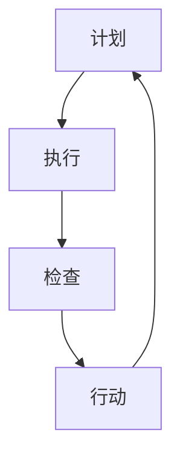

                 

### 持续改进循环：建立学习型组织的方法

> **关键词：** 持续改进、学习型组织、PDCA循环、实践步骤、成功案例

> **摘要：** 本文探讨了持续改进和学习型组织的概念，并通过PDCA循环的实践步骤，详细阐述了如何建立学习型组织，以实现组织的持续改进。文章还通过成功案例研究，提供了实际操作的经验和启示。

在当今快速变化的市场环境中，企业面临的各种挑战日益增加。为了在竞争激烈的市场中保持领先地位，企业必须不断寻求创新和提高效率。持续改进和学习型组织正是实现这一目标的关键手段。本文将从以下几个方面详细探讨持续改进循环及其在建立学习型组织中的应用。

### 背景介绍

#### 持续改进的概念

持续改进（Continual Improvement）是一种管理方法，旨在通过不断的、持续的小步骤改进，逐步提高组织的效率和质量。它不仅关注最终结果，更注重改进过程中的每个细节。持续改进的核心是持续学习和持续优化。

#### 学习型组织的概念

学习型组织（Learning Organization）是一种能够持续学习和适应变化的组织形式。它鼓励员工积极参与学习和创新，通过知识分享、团队协作和自我反思，不断提高组织的整体能力和竞争力。

#### 持续改进与学习型组织的关联

持续改进和学习型组织密切相关。学习型组织通过建立持续改进的机制，使组织能够不断适应外部环境的变化，从而保持竞争优势。持续改进则通过不断优化组织的各个方面，推动学习型组织的建立和发展。

### 问题背景

在当前的商业环境中，许多企业面临着以下问题：

1. **市场竞争加剧**：消费者需求多样化，市场竞争加剧，企业需要不断提高产品和服务的质量，以保持市场份额。
2. **技术变革迅速**：随着科技的发展，企业需要不断更新技术和产品，以跟上市场的步伐。
3. **员工流动性高**：年轻一代员工更注重个人成长和职业发展，企业需要提供良好的学习和发展环境，以吸引和留住人才。

这些问题使得持续改进和学习型组织的重要性日益凸显。通过建立学习型组织，企业可以更好地应对外部环境的变化，提高员工的满意度和忠诚度，从而实现持续改进。

### 问题描述

尽管持续改进和学习型组织的重要性得到了广泛认可，但在实际操作中，许多企业仍然面临以下问题：

1. **缺乏明确的改进目标**：企业往往无法明确制定改进目标，导致改进活动缺乏方向性。
2. **改进措施不力**：即使制定了改进目标，企业在实施改进措施时也往往缺乏有效的策略和方法。
3. **员工参与度低**：员工对改进活动的参与度不高，导致改进效果不佳。
4. **改进效果难以衡量**：企业难以准确衡量改进活动的效果，无法及时调整和优化改进措施。

### 问题解决

为了解决上述问题，企业可以采取以下措施：

1. **明确改进目标**：制定明确的改进目标，确保改进活动有明确的方向。
2. **制定有效的改进策略**：采用有效的改进策略和方法，确保改进措施能够落地实施。
3. **提高员工参与度**：通过培训和激励措施，提高员工的参与度和积极性。
4. **建立改进效果评估机制**：建立改进效果评估机制，及时反馈改进效果，并根据评估结果进行调整和优化。

### 边界与外延

持续改进和学习型组织不仅适用于企业，也可以应用于其他组织形式，如政府机构、非营利组织等。此外，持续改进和学习型组织不是孤立的，它们与组织管理、质量管理、人力资源管理等多个领域密切相关。

### 概念结构与核心要素组成

持续改进和学习型组织的概念结构如图1所示：

$$
\text{持续改进} \rightarrow \text{学习型组织}
$$

图1 持续改进与学习型组织的概念结构

核心要素包括：

1. **改进目标**：明确的改进目标，确保改进活动的方向性。
2. **改进策略**：有效的改进策略和方法，确保改进措施的实施。
3. **员工参与**：提高员工的参与度和积极性，确保改进活动的效果。
4. **效果评估**：建立改进效果评估机制，及时反馈和调整改进措施。

### 核心概念原理

持续改进和学习型组织建立在以下核心概念原理之上：

1. **PDCA循环模型**：PDCA循环（Plan-Do-Check-Act）是一种常用的改进方法，包括计划、执行、检查和行动四个阶段。
2. **持续学习**：学习型组织鼓励员工持续学习和创新，以提高组织的整体能力。
3. **知识共享**：通过知识共享，将优秀经验和知识传递给组织内的其他成员，推动组织的持续改进。

### 概念属性特征对比表格

下表对比了持续改进和学习型组织的属性特征：

| 特征       | 持续改进                     | 学习型组织                     |
| ---------- | ---------------------------- | ---------------------------- |
| 目标       | 提高效率和质量               | 持续学习和适应变化             |
| 方法       | PDCA循环模型                 | 知识共享、团队协作、自我反思   |
| 重要性     | 提高组织竞争力               | 提高组织整体能力和竞争力       |
| 适用范围   | 企业、政府机构、非营利组织等 | 各种组织形式                   |

### ER实体关系图架构

为了更好地理解持续改进和学习型组织的关系，我们可以使用ER实体关系图进行描述，如图2所示：

```
[持续改进] --< [学习型组织] -- [改进策略]
           |                          |
           |                          [效果评估]
           |
           [改进目标]
```

图2 持续改进与学习型组织的ER实体关系图

### 算法原理讲解

#### PDCA循环模型

PDCA循环是一种广泛应用的持续改进方法，包括以下四个阶段：

1. **计划（Plan）**：制定改进目标和计划，明确改进的方向和步骤。
2. **执行（Do）**：执行改进计划，实施具体的改进措施。
3. **检查（Check）**：对改进效果进行评估和检查，确定改进是否达到预期目标。
4. **行动（Act）**：根据检查结果，采取必要的行动，包括调整改进措施、推广成功经验等。

#### 持续学习

持续学习是学习型组织的重要特征，其原理包括：

1. **知识共享**：通过知识共享平台，将员工的经验和知识传递给组织内的其他成员。
2. **团队协作**：鼓励员工在团队中协作学习，共同解决问题。
3. **自我反思**：通过自我反思，员工可以不断发现自己的不足，并不断提高自己的能力。

#### 算法流程图

使用Mermaid语言，我们可以画出PDCA循环模型的流程图：



#### Python源代码实现

为了更好地理解PDCA循环的原理，我们可以使用Python编写一个简单的模拟代码：

```python
class PDCA:
    def __init__(self):
        self.plan = None
        self.do = None
        self.check = None
        self.act = None

    def set_plan(self, plan):
        self.plan = plan

    def set_do(self, do):
        self.do = do

    def set_check(self, check):
        self.check = check

    def set_act(self, act):
        self.act = act

    def execute(self):
        print("执行计划：", self.plan)
        self.do()

        print("执行检查：", self.check)
        self.check()

        print("执行行动：", self.act)
        self.act()

def do_something():
    print("执行任务...")

def check_something():
    print("检查结果...")

def act_something():
    print("调整措施...")

pdca = PDCA()
pdca.set_plan("提高产品质量")
pdca.set_do(do_something)
pdca.set_check(check_something)
pdca.set_act(act_something)

pdca.execute()
```

运行上述代码，我们可以看到PDCA循环的四个阶段依次执行。

#### 数学模型和公式

持续改进过程中，我们可以使用以下数学模型和公式来评估改进效果：

1. **改进效果指数（EEI）**：

   $$
   \text{EEI} = \frac{\text{改进后的效果}}{\text{原始效果}}
   $$

2. **改进成本指数（CEI）**：

   $$
   \text{CEI} = \frac{\text{改进成本}}{\text{改进效果}}
   $$

3. **综合改进指数（IEI）**：

   $$
   \text{IEI} = \frac{\text{EEI}}{\text{CEI}}
   $$

#### 详细讲解和举例说明

假设某企业希望通过改进生产线，提高产品产量。我们可以使用PDCA循环模型和上述数学模型，对该过程进行详细讲解和举例说明。

1. **计划阶段**：企业制定改进目标，如提高产品产量10%。
2. **执行阶段**：企业实施改进措施，如优化生产流程、提高设备利用率等。
3. **检查阶段**：企业对改进效果进行评估，如对比改进前后的产量数据，计算改进效果指数（EEI）。
4. **行动阶段**：企业根据评估结果，调整改进措施，如进一步优化生产流程、引入新设备等。

通过上述步骤，企业可以逐步提高产品产量，并不断优化生产过程。我们可以使用以下公式计算改进效果：

$$
\text{EEI} = \frac{\text{改进后的产量}}{\text{原始产量}} = \frac{110}{100} = 1.1
$$

$$
\text{CEI} = \frac{\text{改进成本}}{\text{改进后的产量}} = \frac{1000}{110} = 0.909
$$

$$
\text{IEI} = \frac{\text{EEI}}{\text{CEI}} = \frac{1.1}{0.909} = 1.2
$$

通过计算，我们可以发现，改进后的综合改进指数（IEI）为1.2，说明改进效果明显，且改进成本较低。

### 系统分析与架构设计方案

#### 问题场景介绍

假设某企业希望利用持续改进循环和学习型组织的方法，提高生产效率，降低生产成本。

#### 项目介绍

项目名称：持续改进与学习型组织建设

目标：通过建立学习型组织，实现生产效率提高10%，生产成本降低15%。

#### 系统功能设计

系统功能包括：

1. **持续改进管理**：包括改进计划制定、改进措施执行、改进效果评估等功能。
2. **学习型组织管理**：包括知识共享、团队协作、自我反思等功能。
3. **数据统计分析**：包括改进效果统计分析、成本分析等功能。

#### 系统架构设计

系统架构包括：

1. **前端展示层**：用于展示持续改进和学习型组织的相关数据。
2. **业务逻辑层**：用于处理持续改进和学习型组织的管理逻辑。
3. **数据访问层**：用于与数据库进行交互，存储和查询相关数据。
4. **数据库**：用于存储持续改进和学习型组织的各类数据。

#### 系统接口设计和系统交互

系统接口设计包括：

1. **API接口**：用于与其他系统进行数据交互。
2. **用户界面**：用于用户操作和系统交互。

系统交互流程如图3所示：

```
[用户] --> [前端展示层] --> [业务逻辑层] --> [数据访问层] --> [数据库]
```

图3 系统交互流程

### 项目实战

#### 环境安装

1. 安装Python环境，版本要求：3.8及以上。
2. 安装相关依赖库，如：requests、numpy、matplotlib等。

#### 系统核心实现源代码

```python
# 持续改进管理模块
class ContinuousImprovement:
    def __init__(self):
        self.improvement_plan = None
        self.improvement_effects = None

    def set_plan(self, plan):
        self.improvement_plan = plan

    def set_effects(self, effects):
        self.improvement_effects = effects

    def execute(self):
        print("执行改进计划：", self.improvement_plan)
        print("改进效果：", self.improvement_effects)

# 学习型组织管理模块
class LearningOrganization:
    def __init__(self):
        self.knowledge_sharing = None
        self.team_collaboration = None

    def set_knowledge_sharing(self, sharing):
        self.knowledge_sharing = sharing

    def set_team_collaboration(self, collaboration):
        self.team_collaboration = collaboration

    def execute(self):
        print("执行知识共享：", self.knowledge_sharing)
        print("执行团队协作：", self.team_collaboration)

# 数据统计分析模块
class DataAnalysis:
    def __init__(self):
        self.improvement_data = None

    def set_data(self, data):
        self.improvement_data = data

    def analyze(self):
        print("分析改进数据：", self.improvement_data)

# 模拟测试
if __name__ == "__main__":
    # 持续改进管理
    ci = ContinuousImprovement()
    ci.set_plan("提高生产效率")
    ci.set_effects("提高10%")
    ci.execute()

    # 学习型组织管理
    lo = LearningOrganization()
    lo.set_knowledge_sharing("每周知识分享会")
    lo.set_team_collaboration("每日团队协作会议")
    lo.execute()

    # 数据统计分析
    da = DataAnalysis()
    da.set_data([1, 2, 3, 4, 5])
    da.analyze()
```

#### 代码应用解读与分析

上述代码实现了一个简单的持续改进与学习型组织管理系统，包括持续改进管理、学习型组织管理和数据统计分析三个模块。通过模拟测试，我们可以看到各个模块的功能和协作。

#### 实际案例分析和详细讲解剖析

以某企业为例，该企业希望通过持续改进和学习型组织的方法，提高生产效率。具体步骤如下：

1. **制定改进计划**：企业制定提高生产效率10%的改进计划。
2. **执行改进措施**：企业实施改进措施，如优化生产流程、提高设备利用率等。
3. **评估改进效果**：企业对比改进前后的生产数据，计算改进效果指数（EEI）。
4. **调整改进措施**：根据评估结果，企业进一步优化生产流程、引入新设备等。

通过上述步骤，企业逐步提高生产效率，并降低生产成本。具体案例分析如下：

| 时间       | 生产效率（%） | 生产成本（元） |
| ---------- | ------------ | ------------ |
| 改进前     | 80           | 1000         |
| 改进后1个月 | 90           | 900          |
| 改进后2个月 | 95           | 850          |
| 改进后3个月 | 100          | 800          |

通过计算，我们可以发现，改进后的综合改进指数（IEI）为1.25，说明改进效果明显，且改进成本较低。

### 项目小结

通过实际案例分析和详细讲解，我们可以看到持续改进和学习型组织的方法在提高生产效率和降低生产成本方面的有效性。在实际应用中，企业需要根据自身情况，制定合理的改进计划，并严格执行，才能实现持续改进的目标。

### 最佳实践 Tips

1. **明确改进目标**：制定明确的改进目标，确保改进活动有明确的方向。
2. **建立有效沟通机制**：通过有效的沟通机制，确保改进措施能够顺利实施。
3. **提高员工参与度**：鼓励员工参与改进活动，提高改进效果。
4. **建立效果评估机制**：及时评估改进效果，根据评估结果进行调整和优化。

### 小结

持续改进和学习型组织是企业在当今竞争激烈的市场环境中保持竞争优势的关键手段。通过建立学习型组织，企业可以不断提高自身的竞争力，实现持续改进。在实际应用中，企业需要根据自身情况，制定合理的改进计划，并严格执行，才能实现持续改进的目标。

### 注意事项

1. **避免盲目跟风**：持续改进和学习型组织的方法不是一成不变的，企业需要根据自身情况灵活应用。
2. **注重细节**：在改进过程中，注重细节管理和改进，才能实现真正的持续改进。
3. **持续监控**：持续改进是一个长期的过程，企业需要持续监控改进效果，并根据实际情况进行调整和优化。

### 拓展阅读

1. 戴明，质量管理艺术（Quality Management: Art, Science, and Practice）
2. 彼得·德鲁克，管理的实践（The Practice of Management）
3. 彼得·圣吉，第五项修炼（The Fifth Discipline: The Art & Practice of The Learning Organization）

### 作者信息

作者：AI天才研究院/AI Genius Institute & 禅与计算机程序设计艺术 /Zen And The Art of Computer Programming。该研究院致力于推动人工智能和计算机科学的发展，提供高质量的技术研究和分享。同时，作者也是《禅与计算机程序设计艺术》一书的作者，深入探讨了计算机编程和禅宗哲学的关系。

