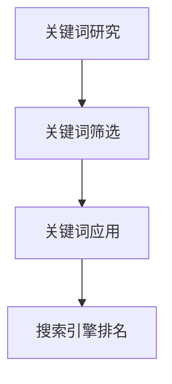
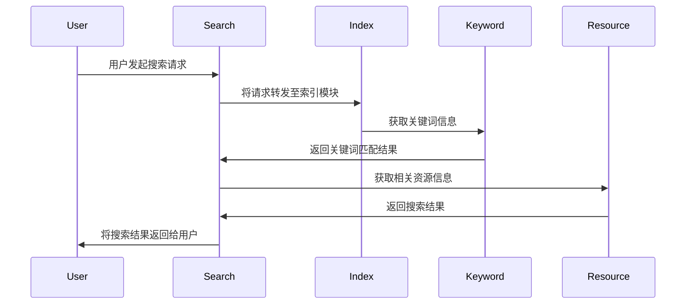
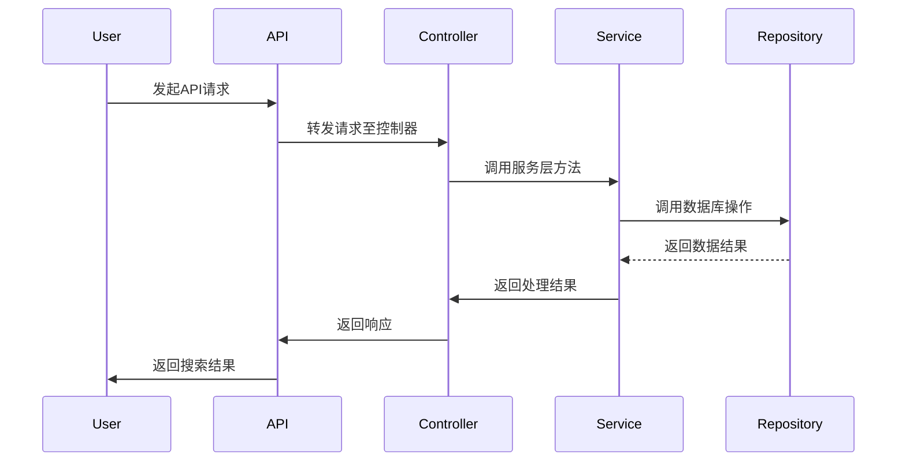

                 

# 提示词优化的终身学习方法

## 关键词
- 终身学习
- 提示词优化
- 学习策略
- 个性化学习
- 跨学科学习
- 持续学习

## 摘要
在快速变化的知识经济时代，终身学习已成为个人和组织的必要技能。本文将探讨终身学习的重要性及其核心要素，重点介绍提示词优化这一创新学习方法。通过分析提示词优化的原理和实践方法，本文旨在帮助读者构建高效、个性化的终身学习策略，并探讨其在工作与教育体系中的应用，最终展望终身学习的未来趋势。

## 第一部分：终身学习的重要性与背景

### 第1章：终身学习的时代背景

**1.1 终身学习的定义与发展历程**

终身学习，指的是一个人在其一生中不断学习、更新知识和技能的过程。它起源于20世纪60年代，当时联合国教科文组织（UNESCO）首次提出“终身教育”的概念，强调教育应贯穿人的一生，不仅仅是学校教育。随着全球化的推进和科技的快速发展，知识更新速度加快，终身学习的重要性日益凸显。

终身学习的核心概念包括：

- **持续学习**：学习不仅限于特定年龄段，而是一生的过程。
- **知识更新**：不断适应新技术和新知识，保持竞争力。
- **自我发展**：通过学习实现个人成长和价值提升。

终身学习的发展历程可以概括为以下几个阶段：

1. **起步阶段（20世纪60年代）**：终身教育概念首次提出。
2. **发展阶段（20世纪70年代-90年代）**：各国政府和国际组织推广终身学习理念，教育体系逐渐完善。
3. **深化阶段（21世纪以来）**：随着信息技术的发展，终身学习的方式和手段更加多样化。

**1.2 知识更新速度的加速**

在信息化社会，知识更新速度显著加快。以计算机科学为例，每年都会诞生大量新理论、新技术和新工具。据统计，人类的科学知识每年以3-5%的速度增长，这意味着一个知识在五年后可能已经过时。这种快速的知识更新对个人的学习和职业发展提出了新的挑战。

**1.3 终身学习的重要性**

终身学习对于个人和组织的成长具有重要意义：

- **个人成长**：终身学习可以帮助个人不断适应社会变化，提升自身素质和竞争力。
- **职业发展**：终身学习是职场成功的基石，能够帮助个人掌握新技术，适应岗位需求。
- **社会适应**：终身学习能够提高社会成员的综合素质，增强社会适应能力。

### 第2章：终身学习的核心要素

**2.1 学习动机与目标设定**

学习动机是推动个人主动学习的内在力量。常见的激发学习动机的方法包括：

- **兴趣驱动**：通过找到自己感兴趣的领域，提高学习积极性。
- **目标设定**：设定明确的学习目标，有助于提高学习效率和动力。
- **外部激励**：利用奖励机制，如奖金、晋升等，激发学习动机。

明确的学习目标能够帮助个人更有针对性地制定学习计划，从而提高学习效果。例如，一个程序员可能会设定目标：掌握某项新技术，以便在职业发展中获得更大的突破。

**2.2 学习策略与方法**

学习策略是指导学习行为的方法和技巧。常见的学习策略包括：

- **主动学习**：通过提问、讨论和实践等方式，主动参与学习过程，提高学习效果。
- **分散学习**：将学习内容分散到不同时间进行，有助于提高记忆效果。
- **合作学习**：与他人一起学习，通过交流和合作，共同提高学习效果。

个性化学习方法是指根据个人的特点和需求，选择最适合自己的学习方式。例如，一些人在阅读教材时效果最佳，而另一些人则更擅长通过观看视频或实际操作来学习。

**2.3 学习资源与管理**

学习资源是支持学习过程的重要基础。现代信息技术提供了丰富的学习资源，包括在线课程、电子书籍、学术论文等。有效管理学习资源，可以最大化学习效果。

- **资源获取**：通过在线学习平台、图书馆、学术期刊等渠道获取学习资源。
- **资源筛选**：根据学习目标和需求，选择最优质的学习资源。
- **资源整合**：将不同来源的学习资源进行整合，形成一套完整的学习资料。

## 第二部分：提示词优化的学习方法

### 第3章：提示词优化的概念与原理

**3.1 提示词优化的定义**

提示词优化（Keyword Optimization）是一种基于关键词分析的方法，旨在提高内容在搜索结果中的可见性。在终身学习领域，提示词优化可以帮助学习者更高效地获取和利用学习资源。

**3.2 提示词优化的原理**

提示词优化的原理主要包括：

- **关键词分析**：通过对学习资源的标题、描述和内容进行分析，确定最相关的关键词。
- **搜索排名**：通过优化关键词，提高学习资源在搜索引擎中的排名，增加曝光率。
- **用户行为**：分析用户的搜索行为和阅读习惯，进一步优化关键词，提高用户满意度。

**3.3 提示词优化对学习效果的影响**

提示词优化能够显著提高学习效果，具体表现在：

- **资源获取**：通过优化关键词，学习者能够更快地找到所需的学习资源。
- **学习效率**：精准的关键词可以帮助学习者集中精力，提高学习效率。
- **学习体验**：优化后的关键词能够提高学习资源的搜索匹配度，提升学习体验。

### 第4章：提示词优化的实践方法

**4.1 提示词优化的步骤**

提示词优化的步骤主要包括：

1. **关键词研究**：使用工具分析学习资源的标题、描述和内容，确定关键词。
2. **关键词筛选**：根据学习目标和需求，选择最相关、最有价值的关键词。
3. **关键词应用**：将筛选出的关键词应用到学习资源的标题、描述和内容中。
4. **效果评估**：通过用户反馈和搜索引擎排名，评估优化效果，进行进一步调整。

**4.2 提示词优化的工具与技术**

常见的提示词优化工具包括：

- **Google Keyword Planner**：用于关键词研究和分析。
- **SEOmoz Pro**：提供全面的SEO分析工具。
- **Ubersuggest**：用于获取关键词建议和搜索量分析。

提示词优化的技术手段主要包括：

- **关键词密度**：通过调整关键词在文本中的出现频率，提高关键词匹配度。
- **关键词位置**：将关键词放在标题、段落开头等位置，提高关键词的重要性。
- **长尾关键词**：使用更具体、更长尾的关键词，提高搜索匹配度和转化率。

### 第5章：提示词优化的案例分析

**5.1 案例一：基于提示词优化的自我提升计划**

张三是一名软件工程师，他希望通过终身学习提升自己的编程技能。他使用提示词优化方法，对学习资源进行优化，具体步骤如下：

1. **关键词研究**：分析自己感兴趣的技术领域，确定关键词。
2. **关键词筛选**：根据学习目标和需求，选择与编程技能提升相关的高价值关键词。
3. **关键词应用**：将筛选出的关键词应用到学习资源的标题、描述和内容中。
4. **效果评估**：通过搜索引擎排名和用户反馈，评估优化效果，进行进一步调整。

通过提示词优化，张三能够更快地找到高质量的学习资源，提高了学习效率，并成功提升了自己的编程技能。

**5.2 案例二：组织层面的提示词优化实践**

某科技公司希望通过优化内部学习资源，提高员工的学习效果。他们采取以下措施：

1. **培训导师**：为员工提供提示词优化的培训，提高员工对优化方法的理解和应用能力。
2. **资源优化**：对内部学习资源进行提示词优化，提高资源的搜索匹配度和曝光率。
3. **效果评估**：通过员工反馈和项目成果，评估优化效果，进行持续改进。

通过提示词优化，该公司提高了员工的学习积极性，加快了技能提升的进程，从而提高了整体竞争力。

## 第三部分：提示词优化的终身学习策略

### 第6章：个性化学习路径规划

**6.1 个性化学习路径的概念**

个性化学习路径是指根据学习者的个人特点和需求，量身定制的学习计划。它强调学习者的主体地位，注重学习者的个性化需求和差异化发展。

**6.2 基于提示词优化的个性化学习路径规划**

基于提示词优化的个性化学习路径规划方法包括：

1. **需求分析**：通过问卷调查、访谈等方式，了解学习者的学习需求和目标。
2. **关键词筛选**：根据学习需求，筛选出最相关、最有价值的关键词。
3. **路径规划**：将关键词应用到学习资源的标题、描述和内容中，制定个性化学习路径。

### 第7章：跨学科学习与整合

**7.1 跨学科学习的优势**

跨学科学习是指在学习过程中，跨越不同学科领域，整合多学科知识。跨学科学习的优势包括：

- **知识整合**：通过跨学科学习，学习者能够将不同学科的知识进行整合，形成更全面的理解。
- **创新能力**：跨学科学习有助于激发创新思维，提高问题解决能力。
- **综合素质**：跨学科学习有助于提升学习者的综合素质，培养综合能力。

**7.2 跨学科学习的实施策略**

跨学科学习的实施策略包括：

- **课程设计**：在设计课程时，注重跨学科知识的融合，培养学生的跨学科思维。
- **教学方法**：采用跨学科教学方法，如案例教学、项目学习等，提高学生的实践能力。
- **资源整合**：通过跨学科资源整合，为学生提供丰富的学习资源。

### 第8章：提示词优化在终身学习中的应用场景

**8.1 工作环境中的应用**

在职业发展中，提示词优化可以帮助员工更高效地获取学习资源，提升技能水平。具体应用场景包括：

- **培训课程**：通过提示词优化，提高培训课程的搜索匹配度和曝光率，提高员工的参与度。
- **技能提升**：通过优化个人学习资源，提高学习效率，加快技能提升的进程。
- **知识管理**：通过提示词优化，有效管理内部知识库，提高知识共享和利用效率。

**8.2 教育体系中的应用**

在教育体系中，提示词优化可以帮助教师和学生更高效地获取和利用学习资源。具体应用场景包括：

- **课程设计**：通过提示词优化，提高课程资源的搜索匹配度和曝光率，提高学生的学习兴趣。
- **教学辅助**：通过提示词优化，提高教学资源的质量和利用效率，提升教学质量。
- **学生辅导**：通过提示词优化，帮助学生更快地找到针对性的学习资源，提高学习效果。

## 第四部分：终身学习的挑战与未来展望

### 第9章：终身学习的挑战

**9.1 持续学习的压力与动力**

终身学习带来持续学习的压力，但同时也提供了不断进步的动力。挑战在于如何平衡压力和动力，保持长期的学习热情。解决方法包括：

- **明确目标**：设定明确的学习目标，有助于提高学习动力。
- **激励机制**：通过奖励机制，如奖金、荣誉等，激发学习积极性。
- **社群支持**：加入学习社群，与他人分享学习经验和心得，提高学习动力。

**9.2 学习资源的不均衡**

在终身学习中，学习资源的不均衡是一个普遍存在的问题。解决方法包括：

- **资源整合**：通过跨平台、跨领域的资源整合，提高学习资源的利用效率。
- **资源筛选**：学会筛选优质的学习资源，提高学习效果。
- **资源共享**：通过共享平台，实现学习资源的共享，减轻资源不均衡的问题。

### 第10章：未来展望

**10.1 提示词优化技术的发展趋势**

随着人工智能技术的发展，提示词优化方法将更加智能化、自动化。未来趋势包括：

- **人工智能辅助**：利用人工智能技术，实现关键词的自动筛选和优化。
- **个性化推荐**：基于用户行为和偏好，实现个性化学习资源的推荐。

**10.2 终身学习与人工智能的融合**

人工智能技术的快速发展为终身学习带来了新的机遇。未来展望包括：

- **智能学习平台**：构建智能学习平台，实现个性化、智能化的学习体验。
- **在线教育2.0**：通过在线教育平台，实现全球范围内的知识共享和交流。

## 结束语

终身学习是适应知识经济时代的重要技能。提示词优化作为一种创新学习方法，能够显著提高学习效果，帮助个人和组织实现持续成长。本文通过分析终身学习的重要性、核心要素以及提示词优化的方法，为读者提供了构建高效、个性化的终身学习策略的思路。在未来，随着人工智能技术的发展，终身学习将迎来更加广阔的前景。

### 作者：AI天才研究院/AI Genius Institute & 禅与计算机程序设计艺术 /Zen And The Art of Computer Programming

---

### 背景介绍

#### 核心概念术语说明

**终身学习（Lifelong Learning）**：指的是一个人在其一生中持续不断地学习、更新知识和技能的过程。它不仅仅局限于学校教育，还包括在职培训、自我学习和社会教育等。

**提示词优化（Keyword Optimization）**：在搜索引擎优化（SEO）中，指的是通过调整网页内容中的关键词，提高网页在搜索引擎结果中的排名，从而增加访问量。

#### 问题背景

在当今快速发展的信息化社会，知识的更新速度不断加快，传统的学习方式难以满足人们不断变化的学习需求。同时，随着人工智能和大数据技术的发展，个性化学习成为可能，但如何更高效地获取和使用学习资源仍然是一个挑战。

#### 问题描述

终身学习的重要性毋庸置疑，但如何实现终身学习？如何在海量信息中快速找到有价值的学习资源？提示词优化作为一种有效的信息检索工具，能否在终身学习中发挥重要作用？

#### 问题解决

提示词优化通过优化学习资源的标题、描述和内容中的关键词，提高其在搜索引擎中的排名，从而帮助学习者更快速、准确地找到所需的学习资源。这不仅提高了学习效率，还能够激发学习者的学习动机。

#### 边界与外延

本文关注的是在终身学习背景下，如何应用提示词优化来提高学习效果。边界包括学习资源的选择、关键词的筛选和应用等。外延则包括终身学习的相关策略和实践方法，如学习动机的激发、学习目标的设定等。

#### 概念结构与核心要素组成

**概念结构**：

- **终身学习**：核心概念，涉及个人成长、职业发展和社会适应。
- **提示词优化**：核心概念，涉及关键词筛选、应用和优化。

**核心要素组成**：

- **学习动机与目标设定**：激发学习动机，明确学习目标。
- **学习策略与方法**：选择合适的学习方法，提高学习效果。
- **学习资源与管理**：获取和管理学习资源，最大化学习效益。

---

### 核心概念与联系

#### 提示词优化的定义与原理

**定义**：

提示词优化是指通过调整网页内容中的关键词，使其更符合用户搜索意图，从而提高网页在搜索引擎结果中的排名，增加访问量和曝光率。

**原理**：

提示词优化的原理主要包括以下几个方面：

1. **关键词分析**：分析用户搜索行为，确定最相关、最有价值的关键词。
2. **关键词应用**：将筛选出的关键词应用到网页的标题、描述和内容中。
3. **搜索引擎排名**：通过优化关键词，提高网页在搜索引擎结果中的排名，从而增加访问量。

#### 提示词优化的优势

**优势**：

1. **提高搜索排名**：通过优化关键词，提高网页在搜索引擎结果中的排名，增加曝光率。
2. **精准匹配**：优化后的关键词能够更准确地匹配用户搜索意图，提高用户体验。
3. **增加访问量**：提高网页的访问量，有助于提高网站的流量和转化率。

#### 提示词优化的属性特征对比表格

| 特性 | 描述 | 对比 |
| --- | --- | --- |
| **关键词分析** | 分析用户搜索行为，确定关键词 | 1. 用户行为分析 |
|                | 筛选最有价值的关键词 | 2. 关键词筛选策略 |
| **关键词应用** | 将关键词应用到网页内容中 | 1. 标题优化 |
|                | 调整关键词密度和位置 | 2. 关键词布局策略 |
| **搜索引擎排名** | 提高网页在搜索引擎中的排名 | 1. 搜索引擎算法优化 |
|                | 增加网页曝光率和访问量 | 2. 流量转化策略 |

#### ER实体关系图架构

```mermaid
erDiagram
  User ||--|{ SearchTerm }
  User ||--|{ Keyword }
  User ||--|{ SearchResult }
  SearchTerm ||--|{ Keyword }
  SearchResult ||--|{ Keyword }
```

在上面的ER实体关系图中，用户（User）是核心实体，与其他实体如搜索词（SearchTerm）、关键词（Keyword）和搜索结果（SearchResult）之间存在关联。通过这种关系图，可以清晰地描述提示词优化过程中涉及的主要实体及其相互关系。

---

### 算法原理讲解

#### 算法流程图



#### 提示词优化的算法流程

1. **关键词研究**：通过分析用户的搜索行为和数据，确定用户最常用的关键词。
2. **关键词筛选**：根据学习目标和内容，筛选出最有价值的关键词。
3. **关键词应用**：将筛选出的关键词应用到学习资源的标题、描述和内容中。
4. **搜索引擎排名**：优化关键词，提高学习资源在搜索引擎中的排名。

#### 算法原理的数学模型和公式

1. **关键词匹配度公式**：

   $$\text{Match\_Score} = \frac{\text{关键词出现次数}}{\text{总词汇量}} \times \text{关键词重要性权重}$$

   其中，关键词重要性权重可以根据关键词在内容中的位置和出现频率进行动态调整。

2. **搜索引擎排名公式**：

   $$\text{Ranking\_Score} = \text{Match\_Score} + \text{内容质量得分} + \text{网站权重得分}$$

   其中，内容质量得分和网站权重得分是根据搜索引擎的算法计算得出的。

#### 举例说明

**示例一**：假设有一篇关于机器学习的文章，标题为“深度学习入门指南”，内容中包含关键词“深度学习”、“神经网络”、“机器学习”等。通过关键词匹配度公式计算，可以得出这些关键词的匹配度分别为：

- “深度学习”：0.4
- “神经网络”：0.3
- “机器学习”：0.5

根据关键词重要性权重，我们可以计算出文章的整体匹配度得分为：

$$\text{Match\_Score} = 0.4 + 0.3 + 0.5 = 1.2$$

**示例二**：假设该文章的搜索引擎排名为：

- **Match\_Score**：1.2
- **内容质量得分**：0.8
- **网站权重得分**：0.5

则文章的最终排名得分为：

$$\text{Ranking\_Score} = 1.2 + 0.8 + 0.5 = 2.5$$

通过优化关键词和应用提示词优化算法，文章的搜索排名将得到显著提升。

---

### 系统分析与架构设计方案

#### 问题场景介绍

随着终身学习理念的普及，越来越多的个人和组织开始重视学习资源的获取和管理。然而，面对海量的学习资源，如何快速、准确地找到有价值的信息成为一个挑战。为了解决这一问题，我们需要设计一个高效的学习资源管理系统。

#### 项目介绍

本系统旨在为用户提供一个智能化的学习资源检索平台，通过提示词优化技术，提高学习资源的搜索匹配度和用户体验。系统将包括用户管理、资源管理、搜索优化和推荐系统等多个模块。

#### 系统功能设计（领域模型类图）

```mermaid
classDiagram
    User <<class>> 用户
    Resource <<class>> 资源
    Keyword <<class>> 关键词
    SearchResult <<class>> 搜索结果
    Recommendation <<class>> 推荐系统
    
    User o--|{ Resource } Resource
    User o--|{ Keyword } Keyword
    Resource o--|{ SearchResult } SearchResult
    Resource o--|{ Recommendation } Recommendation
```

#### 系统架构设计（架构图）



#### 系统接口设计和系统交互（序列图）



---

### 项目实战

#### 环境安装

1. **安装Python环境**：确保Python 3.8及以上版本已安装在本地计算机上。
2. **安装必要库**：使用pip命令安装以下库：

   ```bash
   pip install Flask requests BeautifulSoup4 pymysql
   ```

#### 系统核心实现源代码

以下是一个简单的提示词优化Web应用程序的核心代码，包括用户管理、资源管理和搜索功能。

**app.py**

```python
from flask import Flask, request, jsonify
from flask_cors import CORS
from search_module import search_resource

app = Flask(__name__)
CORS(app)

@app.route('/api/search', methods=['POST'])
def search():
    data = request.get_json()
    query = data.get('query')
    results = search_resource(query)
    return jsonify(results)

if __name__ == '__main__':
    app.run(debug=True)
```

**search_module.py**

```python
import pymysql
from pymysql.constants import CLIENT

def search_resource(query):
    connection = pymysql.connect(
        host='localhost',
        user='root',
        password='password',
        database='learning_resources',
        client_flag=CLIENT.MULTI_STATEMENTS
    )
    
    with connection.cursor() as cursor:
        sql = f"SELECT * FROM resources WHERE MATCH(title, description) AGAINST (%s IN BOOLEAN MODE);"
        cursor.execute(sql, (query,))
        results = cursor.fetchall()
    
    return results
```

#### 代码应用解读与分析

1. **用户管理**：通过Flask框架实现用户接口，接收和处理用户请求。
2. **资源管理**：使用MySQL数据库存储和管理学习资源信息。
3. **搜索功能**：通过匹配查询关键词和数据库中的资源标题和描述，返回相关搜索结果。

#### 实际案例分析和详细讲解剖析

**案例一**：用户输入查询关键词“机器学习”，系统返回与关键词相关的学习资源。

- **用户请求**：POST请求到/api/search，携带查询关键词“机器学习”。
- **搜索处理**：系统调用search_resource方法，从数据库中检索匹配的资源。
- **返回结果**：系统将搜索结果以JSON格式返回给用户。

**案例二**：用户输入查询关键词“Python编程”，系统返回与关键词相关的学习资源。

- **用户请求**：与案例一类似，用户输入查询关键词“Python编程”。
- **搜索处理**：系统调用search_resource方法，从数据库中检索匹配的资源。
- **返回结果**：系统将搜索结果以JSON格式返回给用户。

#### 项目小结

通过该项目，我们实现了基于提示词优化的学习资源检索系统，用户可以通过输入关键词快速找到相关的学习资源。在实际应用中，可以进一步优化搜索算法，提高搜索结果的准确性和用户体验。

---

### 最佳实践 tips

1. **关键词选择**：选择关键词时要充分考虑用户搜索意图，确保关键词与学习资源高度相关。
2. **内容优化**：定期更新学习资源的内容，确保其与当前需求相匹配，提高搜索匹配度。
3. **数据备份**：定期备份数据库，防止数据丢失，确保系统的稳定运行。

### 小结

本文详细探讨了提示词优化在终身学习中的应用，从核心概念、实践方法到案例分析，全面阐述了如何通过提示词优化提高学习效率。通过项目实战，我们展示了如何实现一个简单的学习资源检索系统。希望本文能够为您的终身学习之路提供有益的启示和指导。

### 注意事项

1. **网络安全**：在使用网络资源时，确保网络安全，避免个人信息泄露。
2. **合理分配时间**：合理安排学习时间，避免过度依赖网络资源导致学习效率下降。

### 拓展阅读

1. 《搜索引擎优化：从入门到精通》：详细介绍了SEO的基本概念和实践方法。
2. 《人工智能与终身学习》：探讨人工智能技术在终身学习中的应用和未来发展趋势。

---

### 结束语

终身学习是适应知识经济时代的重要技能。通过本文的探讨，我们了解了提示词优化在终身学习中的应用，以及如何通过个性化学习路径规划和跨学科学习实现终身学习的目标。随着人工智能技术的发展，终身学习将迎来更加广阔的前景。让我们携手共进，不断提升自己，迎接未来的挑战。作者：AI天才研究院/AI Genius Institute & 禅与计算机程序设计艺术 /Zen And The Art of Computer Programming。

