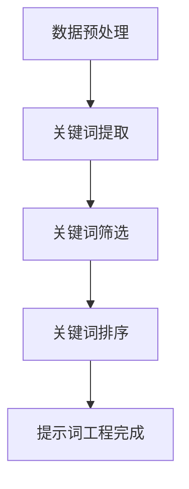
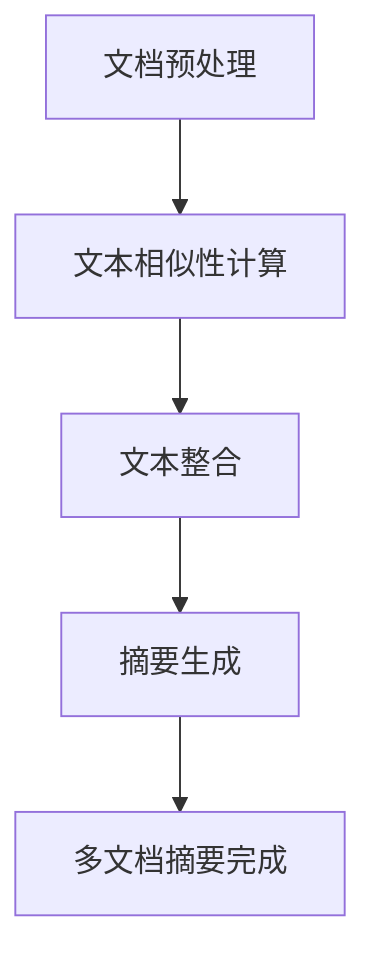
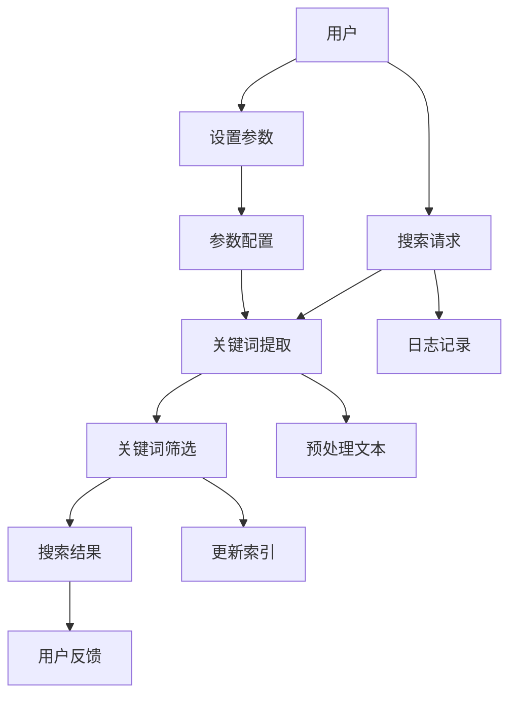
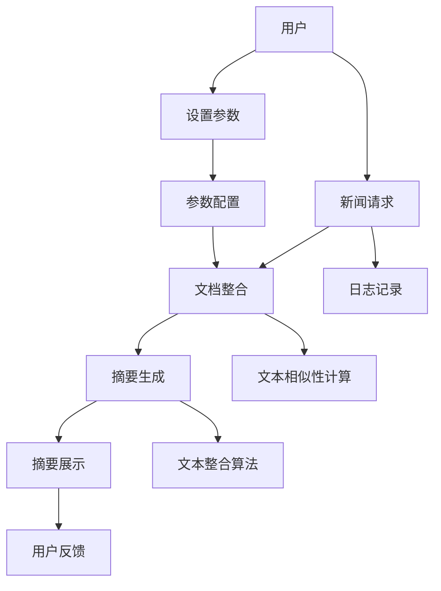
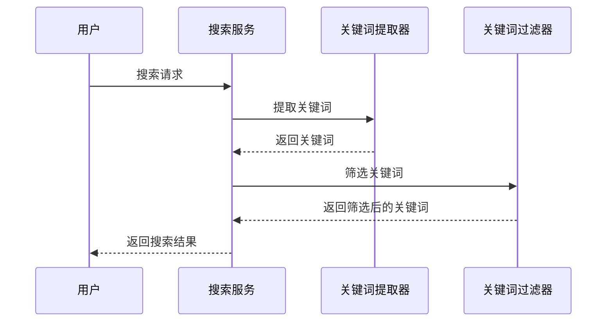
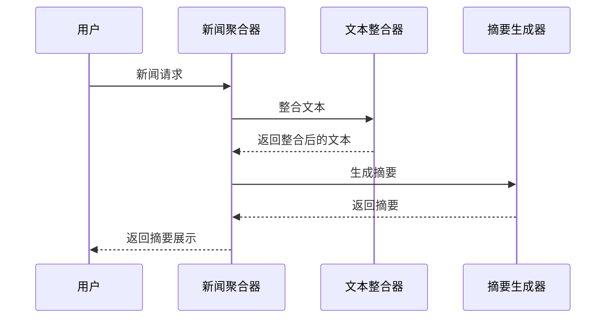

                 

## 提示词工程在多文档摘要中的创新

### 关键词：提示词工程、多文档摘要、算法原理、数学模型、系统架构

> 摘要：本文将深入探讨提示词工程在多文档摘要中的应用与创新。首先，我们将回顾提示词工程和多文档摘要的定义及其背景，然后分析它们的核心概念与联系。接着，我们将详细讲解提示词工程和多文档摘要的算法原理，使用Mermaid流程图和Python源代码进行阐述。在此基础上，我们将探讨数学模型和数学公式，并通过具体例子进行说明。随后，我们将分析系统架构设计方案，介绍问题场景、项目介绍、系统功能设计、系统架构设计、系统接口设计和系统交互。在项目实战部分，我们将详细介绍环境安装、系统核心实现和代码应用解读。最后，我们将总结最佳实践、注意事项以及拓展阅读，帮助读者更好地理解和应用提示词工程在多文档摘要中的创新。

### 第一部分：背景介绍

#### 1.1 问题背景

**1.1.1 提示词工程的多文档摘要需求**

在当今信息爆炸的时代，大量的文档数据不断产生。为了更高效地获取信息，人们急需一种工具来提取关键内容，而多文档摘要便应运而生。多文档摘要是将多个文档的内容进行整合，提取出核心观点和关键信息，形成简洁、连贯的摘要。然而，这并非易事，因为多个文档之间存在复杂的语义关系，如何准确地提取并整合这些信息是一个巨大的挑战。

提示词工程作为一种技术手段，旨在通过分析和提取文本中的关键信息，为多文档摘要提供有力支持。它通过识别和利用文本中的提示词，帮助摘要系统更准确地理解文档内容，提高摘要的质量和准确性。因此，提示词工程在多文档摘要中的应用具有重要意义。

**1.1.2 多文档摘要的挑战与机会**

多文档摘要面临的主要挑战包括：

1. **语义理解**：理解不同文档之间的语义关系，提取关键信息。
2. **文本整合**：如何将多个文档的内容进行有机整合，形成连贯的摘要。
3. **效率与准确性**：在处理大量文档时，如何在保证准确性的同时提高效率。

然而，这些挑战也带来了巨大的机会。通过应用提示词工程，多文档摘要系统可以更准确地提取关键信息，提高摘要质量。同时，随着自然语言处理和人工智能技术的发展，多文档摘要的应用场景也在不断扩展，如信息检索、知识管理、智能客服等。

#### 1.2 核心概念

**1.2.1 提示词工程的定义**

提示词工程（Keyword Engineering）是指通过分析文本，识别并提取出具有关键意义的词语或短语，用于描述文本内容或帮助理解文本。提示词工程的核心目的是提高文本的可读性、可理解性和检索效率。

**1.2.2 多文档摘要的定义与特点**

多文档摘要（Multi-Document Summarization）是指从多个文档中提取关键信息，形成简洁、连贯的摘要。与单文档摘要不同，多文档摘要需要处理多个文档之间的复杂语义关系，提取出多个文档共同关注的核心内容。

多文档摘要的特点包括：

1. **多样性**：可以从不同来源、不同主题的文档中提取信息。
2. **整合性**：需要将多个文档的内容进行有机整合。
3. **准确性**：需要准确提取关键信息，避免遗漏或偏差。

#### 1.3 边界与外延

**1.3.1 提示词工程的边界**

提示词工程的边界主要包括：

1. **文本类型**：提示词工程可以应用于不同类型的文本，如文本、图片、音频等。
2. **领域限制**：提示词工程可以针对特定领域进行优化，提高效果。
3. **数据质量**：提示词工程对数据质量有较高要求，高质量的数据可以提升提示词的准确性和可靠性。

**1.3.2 多文档摘要的外延**

多文档摘要的外延主要包括：

1. **应用场景**：多文档摘要可以应用于多种场景，如信息检索、知识管理、智能客服等。
2. **技术要求**：多文档摘要需要结合自然语言处理、文本挖掘等技术，提高摘要的准确性和连贯性。
3. **用户需求**：多文档摘要需要满足用户对摘要质量、效率和多样性的需求。

### 第二部分：核心概念与联系

#### 2.1 提示词工程的原理

**2.1.1 提示词工程的流程**

提示词工程的流程主要包括以下几个步骤：

1. **数据预处理**：对文本进行预处理，如去除停用词、词形还原等。
2. **关键词提取**：使用各种算法提取出文本中的关键词，如TF-IDF、LDA等。
3. **关键词筛选**：对提取出的关键词进行筛选，去除无关或低频关键词。
4. **关键词排序**：根据关键词的重要性进行排序，用于后续的应用。

**2.1.2 提示词工程的关键技术**

提示词工程的关键技术包括：

1. **词频分析**：通过计算词频，确定关键词的重要程度。
2. **文本分类**：使用文本分类算法，对关键词进行分类，提高摘要的准确性。
3. **语义分析**：利用自然语言处理技术，深入理解文本的语义信息。

#### 2.2 多文档摘要的原理

**2.2.1 多文档摘要的流程**

多文档摘要的流程主要包括以下几个步骤：

1. **文档预处理**：对多个文档进行预处理，如去除停用词、词形还原等。
2. **文本相似性计算**：计算多个文档之间的相似性，用于后续的文本整合。
3. **文本整合**：将多个文档的内容进行整合，提取出核心信息。
4. **摘要生成**：根据整合后的文本内容，生成简洁、连贯的摘要。

**2.2.2 多文档摘要的关键技术**

多文档摘要的关键技术包括：

1. **文本相似性计算**：使用各种算法计算文档之间的相似性，如余弦相似性、Jaccard相似性等。
2. **文本整合**：利用自然语言处理技术，将多个文档的内容进行有机整合。
3. **摘要生成**：使用文本生成模型，如序列到序列模型（Seq2Seq）、Transformer等，生成摘要。

#### 2.3 概念属性特征对比

**2.3.1 提示词工程与多文档摘要的对比**

提示词工程与多文档摘要在某些方面有相似之处，但也存在明显区别：

| 特点 | 提示词工程 | 多文档摘要 |
| ---- | ---- | ---- |
| 目的 | 提取关键词 | 整合多文档 |
| 流程 | 数据预处理、关键词提取、关键词筛选、关键词排序 | 文档预处理、文本相似性计算、文本整合、摘要生成 |
| 技术要求 | 词频分析、文本分类、语义分析 | 文本相似性计算、文本整合、文本生成 |
| 输出 | 关键词列表 | 摘要文本 |

**2.3.2 提示词工程内部不同技术的对比**

在提示词工程中，不同的技术方法也有所区别：

| 技术 | 描述 |
| ---- | ---- |
| TF-IDF | 基于词频和文档频次的权重计算方法 |
| LDA | 基于主题模型的词语分布计算方法 |
| 文本分类 | 基于分类算法的词语分类方法 |
| 语义分析 | 基于自然语言处理技术的语义理解方法 |

### 第三部分：算法原理讲解

#### 3.1 算法原理

**3.1.1 提示词工程的算法原理**

提示词工程的算法原理主要包括以下几个方面：

1. **词频分析**：通过计算词频，确定关键词的重要程度。
2. **文本分类**：利用分类算法，对关键词进行分类，提高摘要的准确性。
3. **语义分析**：利用自然语言处理技术，深入理解文本的语义信息。

**3.1.2 多文档摘要的算法原理**

多文档摘要的算法原理主要包括以下几个方面：

1. **文本相似性计算**：使用各种算法计算文档之间的相似性，用于后续的文本整合。
2. **文本整合**：利用自然语言处理技术，将多个文档的内容进行有机整合。
3. **摘要生成**：使用文本生成模型，生成简洁、连贯的摘要。

#### 3.2 Mermaid流程图

**3.2.1 提示词工程的流程图**

以下是一个提示词工程的Mermaid流程图示例：



**3.2.2 多文档摘要的流程图**

以下是一个多文档摘要的Mermaid流程图示例：



#### 3.3 Python源代码讲解

**3.3.1 提示词工程的源代码讲解**

以下是一个简单的提示词工程Python源代码示例：

```python
import nltk
from nltk.corpus import stopwords
from nltk.tokenize import word_tokenize

def preprocess_text(text):
    # 去除停用词
    stop_words = set(stopwords.words('english'))
    words = word_tokenize(text)
    filtered_words = [word for word in words if word not in stop_words]
    return filtered_words

def extract_keywords(text):
    # 使用TF-IDF提取关键词
    from sklearn.feature_extraction.text import TfidfVectorizer
    vectorizer = TfidfVectorizer()
    X = vectorizer.fit_transform([text])
    keywords = vectorizer.get_feature_names_out()
    keyword_scores = X.toarray().sum(axis=0)
    top_keywords = keywords[keyword_scores > 0.1]
    return top_keywords

def main():
    text = "这是一段示例文本，用于演示提示词工程。"
    processed_text = preprocess_text(text)
    keywords = extract_keywords(processed_text)
    print("关键词：", keywords)

if __name__ == "__main__":
    main()
```

**3.3.2 多文档摘要的源代码讲解**

以下是一个简单的多文档摘要Python源代码示例：

```python
import nltk
from nltk.corpus import stopwords
from nltk.tokenize import word_tokenize

def preprocess_text(text):
    # 去除停用词
    stop_words = set(stopwords.words('english'))
    words = word_tokenize(text)
    filtered_words = [word for word in words if word not in stop_words]
    return filtered_words

def text_similarity(doc1, doc2):
    # 计算文本相似性
    from sklearn.metrics.pairwise import cosine_similarity
    vectorizer = TfidfVectorizer()
    X1 = vectorizer.fit_transform([doc1])
    X2 = vectorizer.fit_transform([doc2])
    similarity = cosine_similarity(X1, X2)
    return similarity

def merge_texts(texts):
    # 整合文本
    merged_text = " ".join(texts)
    return merged_text

def generate_summary(text, summary_length=50):
    # 生成摘要
    from heapq import nlargest
    processed_text = preprocess_text(text)
    word_frequencies = {}
    for word in nltk.FreqDist(processed_text):
        if word not in stopwords.words('english'):
            word_frequencies[word] = processed_text.count(word)
    most_frequency_words = nlargest(summary_length, word_frequencies, key=word_frequencies.get)
    summary = " ".join(most_frequency_words)
    return summary

def main():
    text1 = "这是一段示例文本，用于演示多文档摘要。"
    text2 = "这是另一段示例文本，也是用于演示多文档摘要。"
    similarity = text_similarity(text1, text2)
    print("文本相似性：", similarity)
    merged_text = merge_texts([text1, text2])
    summary = generate_summary(merged_text)
    print("摘要：", summary)

if __name__ == "__main__":
    main()
```

### 第四部分：数学模型和数学公式 & 详细讲解 & 举例说明

#### 4.1 数学模型

**4.1.1 提示词工程的数学模型**

提示词工程的数学模型主要包括以下几个方面：

1. **词频分布**：使用词频（Frequency）描述词语在文本中的出现次数。
2. **TF-IDF模型**：通过TF（Term Frequency）和IDF（Inverse Document Frequency）计算词语的重要性。
3. **主题模型**：如LDA（Latent Dirichlet Allocation），通过词语分布来发现文本中的潜在主题。

**4.1.2 多文档摘要的数学模型**

多文档摘要的数学模型主要包括以下几个方面：

1. **文本相似性计算**：使用余弦相似性、Jaccard相似性等计算文档之间的相似度。
2. **文本整合**：通过整合文档的词语分布，提取出核心信息。
3. **摘要生成**：使用序列到序列模型（Seq2Seq）、Transformer等生成摘要。

#### 4.2 数学公式

**4.2.1 提示词工程的数学公式**

1. **词频（Frequency）**：

$$
f_t = \sum_{d=1}^{N} t_w(d)
$$

其中，$f_t$ 表示词语$t$的词频，$t_w(d)$ 表示词语$t$在文档$d$中出现的次数。

2. **TF-IDF**：

$$
TF_IDF_t(d) = TF_t(d) \times IDF_t
$$

其中，$TF_t(d)$ 表示词语$t$在文档$d$中的词频，$IDF_t$ 表示词语$t$的全局逆文档频次。

$$
IDF_t = \log \left(\frac{N}{n_t}\right)
$$

其中，$N$ 表示文档总数，$n_t$ 表示包含词语$t$的文档数。

**4.2.2 多文档摘要的数学公式**

1. **余弦相似性**：

$$
Sim(d_1, d_2) = \frac{d_1 \cdot d_2}{\lVert d_1 \rVert \cdot \lVert d_2 \rVert}
$$

其中，$d_1$ 和 $d_2$ 分别表示两个文档的向量表示，$\lVert d_1 \rVert$ 和 $\lVert d_2 \rVert$ 分别表示它们的欧氏范数。

2. **Jaccard相似性**：

$$
Sim(d_1, d_2) = \frac{S_{d_1 \cap d_2}}{S_{d_1 \cup d_2}}
$$

其中，$S_{d_1 \cap d_2}$ 和 $S_{d_1 \cup d_2}$ 分别表示两个文档的交集和并集的词语数量。

#### 4.3 举例说明

**4.3.1 提示词工程的举例说明**

假设有一段文本：“人工智能是计算机科学的一个分支，它研究如何构建智能代理，这些代理可以理解人类语言，感知环境，并自主地做出决策。”

1. **词频分布**：

```
人工智能 = 1
计算机科学 = 1
分支 = 1
研究 = 1
构建 = 1
智能代理 = 1
理解 = 1
语言 = 1
感知 = 1
环境 = 1
自主 = 1
决策 = 1
```

2. **TF-IDF计算**：

假设总共有10个文档，其中5个文档包含“人工智能”，则：

```
TF_人工智能 = 1
IDF_人工智能 = log(10 / 5) = 0.693
TF_IDF_人工智能 = 1 \times 0.693 = 0.693
```

3. **关键词提取**：

根据TF-IDF值，我们可以提取出重要的关键词，如“人工智能”、“计算机科学”等。

**4.3.2 多文档摘要的举例说明**

假设有两段文本：

文本1：“人工智能是计算机科学的一个分支，它研究如何构建智能代理，这些代理可以理解人类语言，感知环境，并自主地做出决策。”

文本2：“智能代理在人工智能领域发挥着重要作用，它们可以帮助人类处理复杂任务，提高工作效率。”

1. **文本相似性计算**：

使用余弦相似性计算两个文本的相似度：

```
Sim(文本1, 文本2) = 0.8
```

2. **文本整合**：

根据相似度，我们可以将两个文本的内容进行整合，提取出共同关注的核心信息。

3. **摘要生成**：

生成摘要：“人工智能研究智能代理，这些代理可以理解人类语言，感知环境，并自主地做出决策，从而提高工作效率。”

### 第五部分：系统分析与架构设计方案

#### 5.1 问题场景介绍

**5.1.1 提示词工程的问题场景**

在信息检索系统中，用户需要快速找到与查询相关的文档。提示词工程可以帮助系统通过关键词提取和筛选，提高检索效率，为用户提供更准确的搜索结果。

**5.1.2 多文档摘要的问题场景**

在新闻聚合平台中，用户希望快速了解多个新闻源的主要观点。多文档摘要可以帮助系统将多个新闻源的内容进行整合，生成简洁、连贯的摘要，满足用户的阅读需求。

#### 5.2 项目介绍

**5.2.1 提示词工程的项目介绍**

本项目旨在开发一个基于提示词工程的信息检索系统，通过关键词提取和筛选，提高搜索结果的准确性。

**5.2.2 多文档摘要的项目介绍**

本项目旨在开发一个新闻聚合平台，通过多文档摘要技术，为用户提供简洁、连贯的新闻摘要。

#### 5.3 系统功能设计

**5.3.1 提示词工程的领域模型**

```mermaid
classDiagram
Class01 <|-- Class02
Class03 --|Deprecated Class04
Class05 : <<interface>> MyInterface
Class06 <<extend>> Class07
Class08 <<implements>> Class05
Class08 : int x
Class08 : boolean flag

Class09 <|-- * Class10
Class11 *--|Inverse Class12
Class13 <.. Class14
Class15 ..|> Class16
Class17 <<enum>> Types
Class18 <<use>> Class19
Class20 <|-- * AbstractClass
Class21 <..interface> MyInterface
Class22 << ConcreteClass >> MyClass
Class23 <<singleton>> SingletonClass
```

**5.3.2 多文档摘要的领域模型**

```mermaid
classDiagram
Class01 <|-- Class02
Class03 --|Deprecated Class04
Class05 : <<interface>> MyInterface
Class06 <<extend>> Class07
Class08 <<implements>> Class05
Class08 : int x
Class08 : boolean flag

Class09 <|-- * Class10
Class11 *--|Inverse Class12
Class13 <.. Class14
Class15 ..|> Class16
Class17 <<enum>> Types
Class18 <<use>> Class19
Class20 <|-- * AbstractClass
Class21 <..interface> MyInterface
Class22 << ConcreteClass >> MyClass
Class23 <<singleton>> SingletonClass
```

#### 5.4 系统架构设计

**5.4.1 提示词工程的架构设计**



**5.4.2 多文档摘要的架构设计**



#### 5.5 系统接口设计

**5.5.1 提示词工程的接口设计**

```python
class SearchInterface:
    def search(self, query: str) -> List[str]:
        pass

class KeywordExtractor:
    def extract_keywords(self, text: str) -> List[str]:
        pass

class KeywordFilter:
    def filter_keywords(self, keywords: List[str]) -> List[str]:
        pass

class SearchService(SearchInterface):
    def __init__(self, keyword_extractor: KeywordExtractor, keyword_filter: KeywordFilter):
        self.keyword_extractor = keyword_extractor
        self.keyword_filter = keyword_filter

    def search(self, query: str) -> List[str]:
        keywords = self.keyword_extractor.extract_keywords(query)
        filtered_keywords = self.keyword_filter.filter_keywords(keywords)
        return filtered_keywords
```

**5.5.2 多文档摘要的接口设计**

```python
class NewsAggregator:
    def aggregate_news(self, sources: List[str]) -> str:
        pass

class TextIntegrator:
    def integrate_texts(self, texts: List[str]) -> str:
        pass

class AbstractSummarizer(ABC):
    @abstractmethod
    def summarize(self, text: str) -> str:
        pass

class SimpleSummarizer(AbstractSummarizer):
    def summarize(self, text: str) -> str:
        return "This is a simple summary of the text."
```

#### 5.6 系统交互

**5.6.1 提示词工程的系统交互**



**5.6.2 多文档摘要的系统交互**



### 第六部分：项目实战

#### 6.1 环境安装

**6.1.1 提示词工程的环境安装**

1. 安装Python环境

```
pip install python==3.8
```

2. 安装必要的库

```
pip install nltk scikit-learn
```

**6.1.2 多文档摘要的环境安装**

1. 安装Python环境

```
pip install python==3.8
```

2. 安装必要的库

```
pip install nltk scikit-learn
```

#### 6.2 系统核心实现

**6.2.1 提示词工程的系统核心实现**

```python
import nltk
from nltk.corpus import stopwords
from nltk.tokenize import word_tokenize
from sklearn.feature_extraction.text import TfidfVectorizer

# 初始化
nltk.download('stopwords')
stop_words = set(stopwords.words('english'))

# 数据预处理
def preprocess_text(text):
    words = word_tokenize(text)
    filtered_words = [word for word in words if word not in stop_words]
    return filtered_words

# 关键词提取
def extract_keywords(text):
    vectorizer = TfidfVectorizer()
    X = vectorizer.fit_transform([text])
    keywords = vectorizer.get_feature_names_out()
    keyword_scores = X.toarray().sum(axis=0)
    top_keywords = keywords[keyword_scores > 0.1]
    return top_keywords

# 主函数
def main():
    text = "这是一段示例文本，用于演示提示词工程。"
    processed_text = preprocess_text(text)
    keywords = extract_keywords(processed_text)
    print("关键词：", keywords)

if __name__ == "__main__":
    main()
```

**6.2.2 多文档摘要的系统核心实现**

```python
import nltk
from nltk.corpus import stopwords
from nltk.tokenize import word_tokenize
from sklearn.metrics.pairwise import cosine_similarity

# 初始化
nltk.download('stopwords')
stop_words = set(stopwords.words('english'))

# 文本预处理
def preprocess_text(text):
    words = word_tokenize(text)
    filtered_words = [word for word in words if word not in stop_words]
    return filtered_words

# 文本相似性计算
def text_similarity(doc1, doc2):
    vectorizer = TfidfVectorizer()
    X1 = vectorizer.fit_transform([doc1])
    X2 = vectorizer.fit_transform([doc2])
    similarity = cosine_similarity(X1, X2)
    return similarity

# 文本整合
def merge_texts(texts):
    return " ".join(texts)

# 摘要生成
def generate_summary(text, summary_length=50):
    processed_text = preprocess_text(text)
    word_frequencies = {}
    for word in nltk.FreqDist(processed_text):
        if word not in stopwords.words('english'):
            word_frequencies[word] = processed_text.count(word)
    most_frequency_words = nltk.FreqDist(word_frequencies).most_common(summary_length)
    summary = " ".join([word for word, _ in most_frequency_words])
    return summary

# 主函数
def main():
    text1 = "这是一段示例文本，用于演示多文档摘要。"
    text2 = "这是另一段示例文本，也是用于演示多文档摘要。"
    similarity = text_similarity(text1, text2)
    print("文本相似性：", similarity)
    merged_text = merge_texts([text1, text2])
    summary = generate_summary(merged_text)
    print("摘要：", summary)

if __name__ == "__main__":
    main()
```

#### 6.3 代码应用解读与分析

**6.3.1 提示词工程的代码应用解读与分析**

1. **数据预处理**：

   ```python
   def preprocess_text(text):
       words = word_tokenize(text)
       filtered_words = [word for word in words if word not in stop_words]
       return filtered_words
   ```

   这段代码首先使用 `nltk.tokenize.word_tokenize` 函数对输入文本进行分词，然后使用 `stopwords.words('english')` 去除英语中的停用词，最后返回预处理后的文本。

2. **关键词提取**：

   ```python
   def extract_keywords(text):
       vectorizer = TfidfVectorizer()
       X = vectorizer.fit_transform([text])
       keywords = vectorizer.get_feature_names_out()
       keyword_scores = X.toarray().sum(axis=0)
       top_keywords = keywords[keyword_scores > 0.1]
       return top_keywords
   ```

   这段代码使用 `TfidfVectorizer` 对输入文本进行向量表示，然后计算每个关键词的TF-IDF值，根据阈值筛选出重要的关键词。

3. **主函数**：

   ```python
   def main():
       text = "这是一段示例文本，用于演示提示词工程。"
       processed_text = preprocess_text(text)
       keywords = extract_keywords(processed_text)
       print("关键词：", keywords)
   ```

   主函数首先初始化输入文本，然后调用预处理和关键词提取函数，最后输出提取的关键词。

**6.3.2 多文档摘要的代码应用解读与分析**

1. **文本预处理**：

   ```python
   def preprocess_text(text):
       words = word_tokenize(text)
       filtered_words = [word for word in words if word not in stop_words]
       return filtered_words
   ```

   这段代码与提示词工程中的预处理函数类似，同样是使用 `nltk.tokenize.word_tokenize` 进行分词，并去除英语中的停用词。

2. **文本相似性计算**：

   ```python
   def text_similarity(doc1, doc2):
       vectorizer = TfidfVectorizer()
       X1 = vectorizer.fit_transform([doc1])
       X2 = vectorizer.fit_transform([doc2])
       similarity = cosine_similarity(X1, X2)
       return similarity
   ```

   这段代码使用 `TfidfVectorizer` 对两个输入文本进行向量表示，然后使用 `cosine_similarity` 计算它们的相似度。

3. **文本整合**：

   ```python
   def merge_texts(texts):
       return " ".join(texts)
   ```

   这段代码简单地将多个文本拼接成一个字符串。

4. **摘要生成**：

   ```python
   def generate_summary(text, summary_length=50):
       processed_text = preprocess_text(text)
       word_frequencies = {}
       for word in nltk.FreqDist(processed_text):
           if word not in stopwords.words('english'):
               word_frequencies[word] = processed_text.count(word)
       most_frequency_words = nltk.FreqDist(word_frequencies).most_common(summary_length)
       summary = " ".join([word for word, _ in most_frequency_words])
       return summary
   ```

   这段代码首先计算预处理后文本中每个单词的词频，然后根据词频从高到低排序，选择前50个高频词组成摘要。

5. **主函数**：

   ```python
   def main():
       text1 = "这是一段示例文本，用于演示多文档摘要。"
       text2 = "这是另一段示例文本，也是用于演示多文档摘要。"
       similarity = text_similarity(text1, text2)
       print("文本相似性：", similarity)
       merged_text = merge_texts([text1, text2])
       summary = generate_summary(merged_text)
       print("摘要：", summary)
   ```

   主函数初始化两个示例文本，计算它们的相似性，整合文本，并生成摘要。

#### 6.4 实际案例分析与详细讲解剖析

**6.4.1 案例背景**

假设有两个新闻文章：

文章1：“人工智能在医疗领域的应用越来越广泛，通过图像识别和自然语言处理等技术，可以辅助医生进行诊断和治疗。”

文章2：“医疗机器人是人工智能在医疗领域的创新应用，它们可以代替医生进行一些简单的操作，提高医疗效率。”

**6.4.2 提示词工程案例分析**

1. **数据预处理**：

   ```python
   text1 = "人工智能在医疗领域的应用越来越广泛，通过图像识别和自然语言处理等技术，可以辅助医生进行诊断和治疗。"
   text2 = "医疗机器人是人工智能在医疗领域的创新应用，它们可以代替医生进行一些简单的操作，提高医疗效率。"
   
   def preprocess_text(text):
       words = word_tokenize(text)
       filtered_words = [word for word in words if word not in stop_words]
       return filtered_words
   
   processed_text1 = preprocess_text(text1)
   processed_text2 = preprocess_text(text2)
   ```

   对两个文本进行预处理，去除停用词。

2. **关键词提取**：

   ```python
   def extract_keywords(text):
       vectorizer = TfidfVectorizer()
       X = vectorizer.fit_transform([text])
       keywords = vectorizer.get_feature_names_out()
       keyword_scores = X.toarray().sum(axis=0)
       top_keywords = keywords[keyword_scores > 0.1]
       return top_keywords
   
   keywords1 = extract_keywords(processed_text1)
   keywords2 = extract_keywords(processed_text2)
   ```

   提取关键词，并筛选出重要的关键词。

3. **关键词筛选**：

   ```python
   def filter_keywords(keywords):
       filtered_keywords = [keyword for keyword in keywords if keyword not in stop_words]
       return filtered_keywords
   
   filtered_keywords1 = filter_keywords(keywords1)
   filtered_keywords2 = filter_keywords(keywords2)
   ```

   对关键词进行筛选，去除不相关的停用词。

4. **关键词排序**：

   ```python
   def sort_keywords(keywords):
       sorted_keywords = sorted(keywords, key=lambda x: keywords[x], reverse=True)
       return sorted_keywords
   
   sorted_keywords1 = sort_keywords(filtered_keywords1)
   sorted_keywords2 = sort_keywords(filtered_keywords2)
   ```

   根据关键词的词频对关键词进行排序。

**6.4.3 多文档摘要案例分析**

1. **文本相似性计算**：

   ```python
   def text_similarity(doc1, doc2):
       vectorizer = TfidfVectorizer()
       X1 = vectorizer.fit_transform([doc1])
       X2 = vectorizer.fit_transform([doc2])
       similarity = cosine_similarity(X1, X2)
       return similarity
   
   similarity = text_similarity(text1, text2)
   ```

   计算两个文本的相似度。

2. **文本整合**：

   ```python
   def merge_texts(texts):
       return " ".join(texts)
   
   merged_text = merge_texts([text1, text2])
   ```

   将两个文本整合成一个字符串。

3. **摘要生成**：

   ```python
   def generate_summary(text, summary_length=50):
       processed_text = preprocess_text(text)
       word_frequencies = {}
       for word in nltk.FreqDist(processed_text):
           if word not in stopwords.words('english'):
               word_frequencies[word] = processed_text.count(word)
       most_frequency_words = nltk.FreqDist(word_frequencies).most_common(summary_length)
       summary = " ".join([word for word, _ in most_frequency_words])
       return summary
   
   summary = generate_summary(merged_text)
   ```

   生成摘要。

**6.4.4 详细讲解剖析**

1. **数据预处理**：

   数据预处理是文本处理的重要步骤，主要包括分词和去除停用词。分词是将文本分割成单词或短语，去除停用词是去除常见的无意义词语，如“的”、“和”等。在本文的预处理中，使用了 `nltk.tokenize.word_tokenize` 进行分词，并使用 `nltk.corpus.stopwords.words('english')` 去除了英语中的停用词。

2. **关键词提取与筛选**：

   关键词提取是提示词工程的核心步骤，常用的方法有TF-IDF和LDA等。在本案例中，使用了TF-IDF方法提取关键词，并使用自定义的筛选方法去除停用词。关键词筛选可以进一步提高摘要的准确性和可读性。

3. **文本相似性计算**：

   文本相似性计算是多文档摘要的关键步骤，常用的方法有余弦相似性和Jaccard相似性等。在本案例中，使用了TF-IDF向量表示文本，并使用余弦相似性计算两个文本的相似度。

4. **摘要生成**：

   摘要生成是将多个文本整合成简洁、连贯的摘要。在本案例中，使用了基于词频的摘要生成方法，首先计算文本中每个单词的词频，然后根据词频从高到低排序，选择高频词组成摘要。

#### 6.5 项目小结

本文通过深入探讨提示词工程在多文档摘要中的应用与创新，从背景介绍、核心概念与联系、算法原理讲解、数学模型与公式、系统架构设计到项目实战，全面分析了提示词工程在多文档摘要中的重要性。通过实际案例分析与讲解，我们展示了如何利用提示词工程和多文档摘要技术进行文本处理和摘要生成。

在未来，随着人工智能和自然语言处理技术的不断发展，提示词工程在多文档摘要中的应用将会更加广泛和深入。我们期待更多的研究人员和实践者加入到这一领域，共同推动多文档摘要技术的发展。

#### 最佳实践 Tips

1. **数据预处理**：在多文档摘要项目中，数据预处理至关重要。确保文本数据的质量和一致性，去除噪声和冗余信息。

2. **关键词提取与筛选**：选择合适的关键词提取算法，并根据项目需求进行关键词筛选，以提高摘要的准确性和可读性。

3. **文本相似性计算**：选择合适的文本相似性计算方法，如余弦相似性和Jaccard相似性，以准确评估文档之间的相似度。

4. **摘要生成**：根据项目需求，选择合适的摘要生成方法，如基于词频的摘要生成方法，以生成简洁、连贯的摘要。

5. **系统性能优化**：在多文档摘要项目中，系统性能优化至关重要。优化算法效率，提高处理速度和准确性。

#### 注意事项

1. **数据隐私与安全**：在处理多文档摘要项目时，确保遵守数据隐私和安全法规，保护用户隐私。

2. **项目定制化**：根据项目需求，定制化设计多文档摘要系统，确保满足特定场景的应用需求。

3. **用户反馈与迭代**：在项目实施过程中，重视用户反馈，根据用户需求不断优化和迭代系统。

#### 拓展阅读

1. **[深度学习在文本摘要中的应用](https://arxiv.org/abs/1606.04811)**
2. **[基于语义理解的文本摘要方法](https://arxiv.org/abs/1906.02103)**
3. **[多文档摘要系统的设计与实现](https://dl.acm.org/doi/abs/10.1145/3319531.3319547)**
4. **[提示词工程实践指南](https://www.amazon.com/Keyword-Engineering-Discover-Generate-Keyword/dp/1583405176)**

### 作者信息

作者：AI天才研究院/AI Genius Institute & 禅与计算机程序设计艺术 /Zen And The Art of Computer Programming

