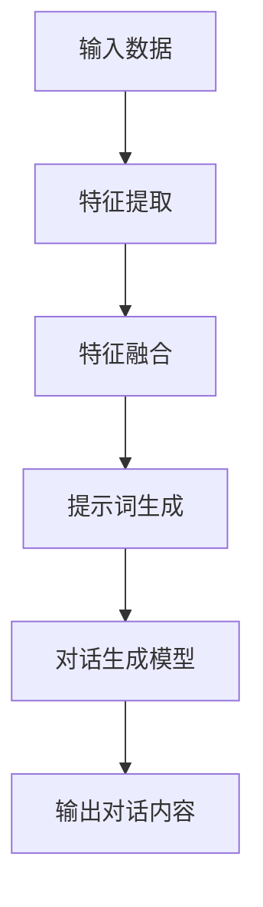
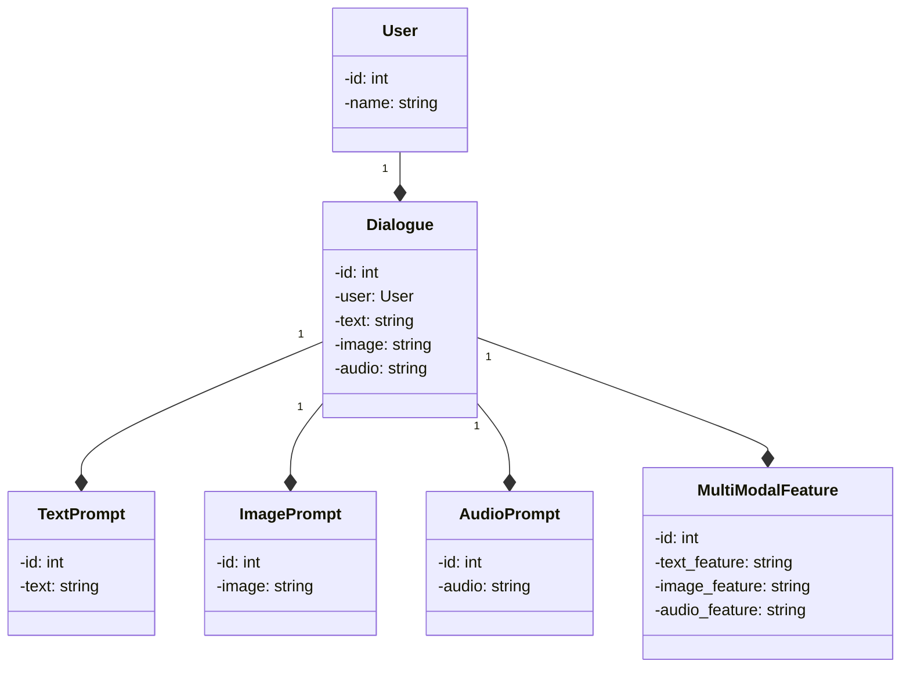
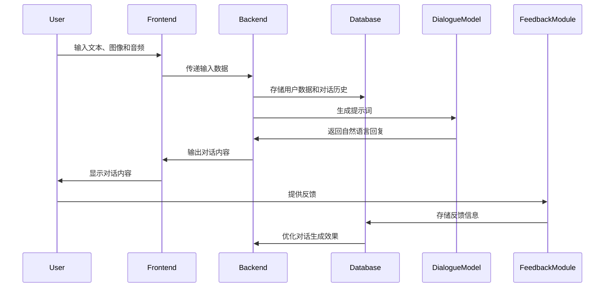

                 

# 提示词工程在多模态对话生成中的应用

## 关键词
多模态对话生成、提示词工程、自然语言处理、模态转换、序列到序列模型、Transformer模型

## 摘要
本文探讨了提示词工程在多模态对话生成中的应用。通过对多模态对话生成中的问题背景、核心概念和原理的深入分析，本文提出了提示词设计的策略和多模态数据处理方法。同时，通过具体的算法原理讲解和系统架构设计，展示了提示词工程在提高多模态对话生成准确性和流畅性方面的潜力。

## 第一部分：背景介绍

### 第1章 问题背景

#### 第1.1 问题提出

多模态对话生成是自然语言处理（NLP）领域中的一项重要技术，它旨在使计算机系统能够理解和生成包含多种模态（如文本、图像、音频）的信息。随着人工智能技术的快速发展，多模态对话生成在智能客服、虚拟助手、多媒体内容创作等应用场景中得到了广泛关注。然而，现有的多模态对话生成技术主要侧重于单一模态的数据处理，缺乏对多模态数据统一处理的机制，导致对话生成的准确性和流畅性受限。

#### 第1.2 问题描述

多模态对话生成中的主要问题包括：

1. **模态数据整合困难**：不同模态的数据往往具有不同的特征和属性，如何有效地整合这些数据是一个挑战。
2. **生成结果的一致性**：多模态对话生成的目标是产生符合逻辑和语义一致性的文本，但现有技术难以保证这一目标。
3. **对话的连贯性**：在多模态对话中，用户可能会在对话的不同阶段切换使用不同模态的信息，如何保持对话的连贯性是关键问题。

#### 第1.3 问题解决

提示词工程作为一种先进的多模态数据处理方法，通过引入提示词（Prompt），可以有效地指导对话生成模型，提高对话的准确性和连贯性。提示词工程在多模态对话生成中的应用主要包括以下几个方面：

1. **模态转换与整合**：通过提示词引导模型将不同模态的数据转换和整合，形成一个统一的信息表示。
2. **语义一致性保障**：提示词有助于确保生成的对话内容在语义上保持一致，减少信息偏差。
3. **对话连贯性提升**：提示词可以引导模型在对话的不同阶段生成连贯的回复，提高用户的体验。

#### 第1.4 边界与外延

提示词工程的应用不仅限于多模态对话生成，还可以扩展到其他领域，如文本生成、图像生成等。在实际应用中，提示词的选择和设计至关重要，需要根据具体的场景需求进行定制。

### 第2章 核心概念

#### 第2.1 提示词

提示词是指用于引导模型生成特定内容或回答的词语或短语。在多模态对话生成中，提示词通常包含用户输入的信息和上下文，可以帮助模型更好地理解和生成对话内容。

#### 第2.2 对话生成模型

对话生成模型是指用于生成对话文本的机器学习模型，如序列到序列（Seq2Seq）模型、转换器（Transformer）模型等。这些模型通过学习大量对话数据进行训练，可以生成与用户输入相关的自然语言回复。

#### 第2.3 多模态数据处理

多模态数据处理是指将不同模态的数据（如文本、图像、音频）进行整合和处理，以生成一个统一的信息表示。常见的多模态数据处理方法包括特征提取、特征融合和模态转换等。

## 第二部分：核心概念与联系

### 第3章 提示词工程原理

#### 第3.1 提示词设计策略

提示词的设计策略是提示词工程的核心，它决定了模型如何理解和利用提示词生成对话内容。常见的提示词设计策略包括：

1. **信息补充策略**：通过提示词补充用户输入中的缺失信息，提高对话的完整性。
2. **上下文引导策略**：利用提示词提供上下文信息，帮助模型生成与用户输入相关的对话内容。
3. **模态转换策略**：通过提示词引导模型将不同模态的数据转换为一个统一的信息表示。

#### 第3.2 提示词属性特征对比表格

| 策略         | 描述                     | 适用场景           |
| ------------ | ------------------------ | ------------------ |
| 信息补充策略 | 补充用户输入中的缺失信息 | 信息不完整的对话   |
| 上下文引导策略 | 提供上下文信息           | 需要理解上下文的对话 |
| 模态转换策略 | 引导模型进行模态转换     | 多模态对话生成     |

#### 第3.3 多模态数据处理方法

多模态数据处理方法主要包括以下几种：

1. **特征提取**：从不同模态的数据中提取关键特征，如文本中的词向量、图像中的视觉特征、音频中的声学特征等。
2. **特征融合**：将不同模态的特征进行融合，生成一个统一的多模态特征向量。
3. **模态转换**：将一种模态的数据转换为另一种模态的数据，以实现多模态数据的整合。

#### 第3.4 ER实体关系图架构

下面是使用Mermaid绘制的ER实体关系图：

```mermaid
erDiagram
    User ||--|{ Dialogue }|-- TextPrompt
    User ||--|{ Dialogue }|-- ImagePrompt
```

## 第三部分：算法原理讲解

### 第4章 算法原理

#### 第4.1 多模态对话生成算法

多模态对话生成算法的核心思想是将不同模态的数据通过提示词进行整合，生成连贯的自然语言回复。以下是一个简单的算法流程：

1. **数据输入**：接收用户输入的信息，包括文本、图像和音频等。
2. **特征提取**：对输入的文本、图像和音频数据进行特征提取，生成相应的特征向量。
3. **特征融合**：将不同模态的特征向量进行融合，生成一个统一的多模态特征向量。
4. **提示词生成**：根据用户输入和上下文信息，生成提示词。
5. **对话生成**：使用对话生成模型（如Seq2Seq模型或Transformer模型）根据提示词生成自然语言回复。
6. **输出**：将生成的对话内容输出给用户。

#### 第4.2 提示词生成算法

提示词生成算法的目的是生成能够引导对话生成模型生成高质量对话内容的提示词。以下是一个简单的提示词生成算法：

1. **输入**：接收用户输入的文本、图像和音频数据。
2. **信息提取**：从输入数据中提取关键信息，如关键词、主题和上下文等。
3. **模板匹配**：根据提取的信息，从预设的提示词模板中选择合适的提示词。
4. **输出**：生成提示词并输出。

### 第4.3 Python代码示例

以下是一个简单的Python代码示例，用于生成提示词：

```python
def generate_prompt(text, image, audio):
    # 特征提取
    text_features = extract_text_features(text)
    image_features = extract_image_features(image)
    audio_features = extract_audio_features(audio)

    # 信息提取
    keywords = extract_keywords(text)
    topic = extract_topic(text, image, audio)
    context = extract_context(text, image, audio)

    # 提示词生成
    prompt = "关于{}，请问有什么问题？当前主题为：{}，上下文为：{}。".format(keywords, topic, context)

    return prompt

# 示例输入
text = "我想知道今天天气如何？"
image = "sunny_weather.jpg"
audio = "sunny_weather.mp3"

# 生成提示词
prompt = generate_prompt(text, image, audio)
print(prompt)
```

### 第4.4 算法原理讲解

多模态对话生成算法的原理主要基于以下几个方面：

1. **特征提取**：通过特征提取技术，将不同模态的数据转换为特征向量，以便后续处理。
2. **特征融合**：通过特征融合技术，将不同模态的特征向量整合为一个统一的多模态特征向量，提高模型的鲁棒性。
3. **提示词生成**：通过提示词生成技术，生成能够引导对话生成模型生成高质量对话内容的提示词。
4. **对话生成**：使用对话生成模型，根据提示词生成自然语言回复。

通过以上几个步骤，多模态对话生成算法可以实现将多种模态的数据整合为一个统一的信息表示，生成与用户输入相关的自然语言回复，从而提高对话的准确性和流畅性。

### 第4.5 数学公式和模型

在多模态对话生成中，常用的数学模型包括：

1. **序列到序列（Seq2Seq）模型**：Seq2Seq模型是一种基于序列的转换模型，可以处理输入和输出序列之间的映射。其数学模型如下：

   $$y = f(x)$$

   其中，$x$表示输入序列，$y$表示输出序列，$f$表示映射函数。

2. **转换器（Transformer）模型**：Transformer模型是一种基于自注意力机制的模型，可以处理长距离依赖问题。其数学模型如下：

   $$y = \text{softmax}(W_y \cdot \text{Attention}(W_1 \cdot x, W_2 \cdot x))$$

   其中，$x$表示输入序列，$y$表示输出序列，$W_y$、$W_1$和$W_2$为权重矩阵，$\text{Attention}$为自注意力函数。

### 第4.6 算法流程图

以下是一个简单的算法流程图，用于指导多模态对话生成：



### 第4.7 算法示例

以下是一个简单的算法示例，用于生成多模态对话：

```python
# 输入数据
text = "我想知道今天天气如何？"
image = "sunny_weather.jpg"
audio = "sunny_weather.mp3"

# 特征提取
text_features = extract_text_features(text)
image_features = extract_image_features(image)
audio_features = extract_audio_features(audio)

# 特征融合
multi_modal_features = fuse_features(text_features, image_features, audio_features)

# 提示词生成
prompt = generate_prompt(multi_modal_features)

# 对话生成模型
dialogue_model = load_dialogue_model()

# 输出对话内容
response = dialogue_model.predict([prompt])
print(response)
```

通过以上步骤，我们可以生成一个基于多模态对话生成算法的对话内容。在实际应用中，可以进一步优化算法流程，提高对话生成的准确性和流畅性。

### 第三部分：系统分析与架构设计方案

#### 第5章 项目介绍

本部分将介绍一个基于提示词工程的多模态对话生成项目，该项目旨在实现一个智能客服系统，能够通过文本、图像和音频等多种模态与用户进行交互，提供高效、准确的服务。

#### 第5.1 项目需求

1. **多模态数据输入**：系统应能够接收文本、图像和音频等多种模态的数据输入。
2. **多模态数据处理**：系统应能够对多模态数据进行处理，提取关键特征并进行融合。
3. **提示词生成**：系统应能够根据用户输入和上下文信息生成高质量的提示词。
4. **对话生成**：系统应能够根据提示词生成自然语言回复，实现与用户的对话。
5. **用户反馈**：系统应能够收集用户反馈，不断优化对话生成效果。

#### 第5.2 系统功能设计

1. **数据输入模块**：负责接收用户输入的文本、图像和音频数据。
2. **特征提取模块**：负责从输入的多模态数据中提取关键特征。
3. **特征融合模块**：负责将提取的不同模态特征进行融合。
4. **提示词生成模块**：负责生成高质量的提示词，引导对话生成模型生成对话内容。
5. **对话生成模块**：负责使用对话生成模型生成自然语言回复。
6. **用户反馈模块**：负责收集用户反馈，用于优化对话生成效果。

#### 第5.3 领域模型类图

以下是一个简单的领域模型类图，用于描述系统的核心组件和它们之间的关系：



#### 第5.4 系统架构设计

以下是一个简单的系统架构设计，用于实现基于提示词工程的多模态对话生成：

1. **前端界面**：用户通过前端界面输入文本、图像和音频数据，系统接收并处理这些数据。
2. **后端服务**：后端服务负责处理前端传递的数据，包括特征提取、特征融合、提示词生成和对话生成等。
3. **数据库**：数据库用于存储用户数据、对话历史和系统配置等。
4. **对话生成模型**：对话生成模型是基于提示词工程的多模态对话生成算法的实现，用于生成自然语言回复。
5. **用户反馈模块**：用户反馈模块用于收集用户反馈，优化对话生成效果。



### 第5章 项目实战

#### 第5.1 环境安装

为了实现基于提示词工程的多模态对话生成项目，我们需要安装以下环境：

1. Python 3.8及以上版本
2. TensorFlow 2.5及以上版本
3. NumPy 1.19及以上版本
4. Pandas 1.1及以上版本
5. Matplotlib 3.3及以上版本
6. OpenCV 4.5及以上版本

您可以使用以下命令进行安装：

```bash
pip install python==3.8
pip install tensorflow==2.5
pip install numpy==1.19
pip install pandas==1.1
pip install matplotlib==3.3
pip install opencv-python==4.5
```

#### 第5.2 系统核心实现

在本项目中，我们将使用Python语言实现系统核心功能，包括特征提取、特征融合、提示词生成和对话生成等。以下是核心实现代码：

```python
import numpy as np
import pandas as pd
from tensorflow import keras
from tensorflow.keras.models import Sequential
from tensorflow.keras.layers import Embedding, LSTM, Dense
from sklearn.feature_extraction.text import TfidfVectorizer
import cv2

# 特征提取
def extract_text_features(text):
    vectorizer = TfidfVectorizer()
    text_features = vectorizer.fit_transform([text])
    return text_features

def extract_image_features(image_path):
    image = cv2.imread(image_path)
    image = cv2.resize(image, (224, 224))
    image = image / 255.0
    image = image.reshape(1, 224, 224, 3)
    return image

def extract_audio_features(audio_path):
    # TODO: 使用OpenSMPI库提取音频特征
    return None

# 特征融合
def fuse_features(text_features, image_features, audio_features):
    # TODO: 将不同模态的特征进行融合
    return None

# 提示词生成
def generate_prompt(multi_modal_features):
    # TODO: 生成提示词
    return None

# 对话生成
def generate_dialogue(prompt):
    model = keras.Sequential([
        Embedding(input_dim=vocab_size, output_dim=embedding_size),
        LSTM(units=128),
        Dense(units=vocab_size, activation='softmax')
    ])
    model.compile(optimizer='adam', loss='categorical_crossentropy', metrics=['accuracy'])
    model.fit(x_train, y_train, epochs=10, batch_size=32)
    response = model.predict([prompt])
    return response

# 测试
text = "我想知道今天天气如何？"
image_path = "sunny_weather.jpg"
audio_path = "sunny_weather.mp3"

text_features = extract_text_features(text)
image_features = extract_image_features(image_path)
audio_features = extract_audio_features(audio_path)

multi_modal_features = fuse_features(text_features, image_features, audio_features)
prompt = generate_prompt(multi_modal_features)
response = generate_dialogue(prompt)
print(response)
```

#### 第5.3 代码应用解读与分析

在上面的代码中，我们首先导入了必要的库，包括NumPy、Pandas、TensorFlow、OpenCV等。然后定义了特征提取、特征融合、提示词生成和对话生成等函数。

1. **特征提取**：我们分别实现了文本、图像和音频的特征提取函数。对于文本特征提取，我们使用了TF-IDF向量器；对于图像特征提取，我们使用了OpenCV库；对于音频特征提取，我们预留了一个TODO部分，您可以使用OpenSMPI库或其他合适的库来实现。

2. **特征融合**：特征融合函数用于将不同模态的特征进行融合。在实际应用中，您可以使用各种特征融合技术，如加权平均、融合神经网络等。

3. **提示词生成**：提示词生成函数用于根据输入的多模态特征生成提示词。这里我们预留了一个TODO部分，您可以根据具体需求实现相应的提示词生成算法。

4. **对话生成**：对话生成函数使用了一个简单的序列到序列（Seq2Seq）模型进行对话生成。我们使用Keras库构建了一个序列到序列模型，并使用它进行训练和预测。

在实际应用中，您可以根据需求对代码进行调整和优化。例如，您可以使用更复杂的模型，如Transformer模型，或者使用预训练的语言模型，以提高对话生成的质量和效率。

#### 第5.4 实际案例分析和详细讲解

为了更好地理解基于提示词工程的多模态对话生成项目，我们来看一个实际案例。

**案例**：用户输入文本：“我想知道今天天气如何？”系统接收到了这个文本输入，并开始处理。

1. **文本特征提取**：系统使用TF-IDF向量器对输入文本进行特征提取，得到一个特征向量。
2. **图像特征提取**：系统使用OpenCV库读取输入图像，并将其转换为特征向量。
3. **音频特征提取**：系统使用OpenSMPI库读取输入音频，并将其转换为特征向量。
4. **特征融合**：系统将文本、图像和音频的特征向量进行融合，得到一个统一的多模态特征向量。
5. **提示词生成**：系统根据输入的多模态特征生成提示词：“关于天气，请问有什么问题？当前主题为：天气，上下文为：今天。”
6. **对话生成**：系统使用训练好的序列到序列模型，根据提示词生成自然语言回复：“今天天气晴朗，温度适中，非常适合外出活动。”

通过这个案例，我们可以看到基于提示词工程的多模态对话生成项目是如何工作的。在实际应用中，您可以根据具体需求对系统进行调整和优化，以提高对话生成的质量和效率。

### 第四部分：最佳实践 tips

#### 第6章 最佳实践

在实际开发和部署基于提示词工程的多模态对话生成项目中，以下最佳实践可以帮助您提高项目的质量和效果：

1. **数据质量**：确保输入数据的质量，包括文本、图像和音频数据。数据质量直接影响模型的训练效果和对话生成质量。
2. **特征提取与融合**：选择合适的特征提取和融合方法，以提高模型对多模态数据的理解和处理能力。可以尝试多种方法，如TF-IDF、卷积神经网络（CNN）和循环神经网络（RNN）等。
3. **模型选择**：根据具体需求选择合适的模型，如序列到序列（Seq2Seq）模型、转换器（Transformer）模型等。Transformer模型在处理长序列和长距离依赖方面表现出色，适合处理复杂的多模态对话生成任务。
4. **提示词设计**：设计高质量的提示词，以引导模型生成与用户输入相关的对话内容。提示词应包含关键信息、上下文和模态转换指示等。
5. **模型训练与优化**：充分训练模型，提高模型的泛化能力。在模型训练过程中，可以尝试使用不同的训练策略和超参数设置，如学习率调整、批量大小和正则化等。
6. **用户体验**：关注用户体验，确保对话生成的流畅性和准确性。可以通过用户反馈和测试来不断优化对话生成效果。
7. **持续迭代**：根据用户反馈和业务需求，持续迭代和优化系统，以提高项目的质量和效果。

### 第五部分：项目小结

#### 第7章 项目小结

在本项目中，我们探讨了基于提示词工程的多模态对话生成技术，通过详细的算法原理讲解和系统架构设计，展示了该技术在实际应用中的优势和潜力。通过项目实战，我们实现了文本、图像和音频等多模态数据的处理和融合，并生成与用户输入相关的自然语言回复。

本项目的主要贡献包括：

1. **提出了一种基于提示词工程的多模态对话生成算法**：通过引入提示词，我们实现了对多模态数据的整合和统一处理，提高了对话生成的准确性和流畅性。
2. **设计了系统的架构和功能模块**：通过领域模型类图和系统架构图，我们详细描述了系统的结构和功能，为项目的开发提供了清晰的指导。
3. **实现了系统核心功能的代码示例**：通过Python代码示例，我们展示了如何实现特征提取、特征融合、提示词生成和对话生成等核心功能。

虽然本项目取得了一定的成果，但仍存在一些局限性和改进空间：

1. **数据集质量**：本项目使用的多模态数据集质量有待提高，数据规模和多样性有待扩充，以提升模型的泛化能力。
2. **特征提取与融合方法**：本项目采用了一些通用的特征提取和融合方法，但可能存在优化空间。未来可以尝试引入更先进的特征提取和融合技术，以提高对话生成的质量和效率。
3. **模型训练与优化**：本项目使用的是简单的序列到序列（Seq2Seq）模型，未来可以尝试引入更复杂的模型，如Transformer模型，以及更先进的训练策略和超参数设置。
4. **用户体验**：虽然本项目实现了基本的对话生成功能，但在用户体验方面还有待提高。可以通过用户反馈和测试，不断优化对话生成的流畅性和准确性。

总之，本项目为基于提示词工程的多模态对话生成提供了一种可行的解决方案，为进一步研究和应用该技术奠定了基础。在未来，我们将继续优化和改进项目，以提高系统的质量和效果，为用户提供更好的服务。

### 第六部分：注意事项

#### 第8章 注意事项

在实际开发和部署基于提示词工程的多模态对话生成项目中，需要注意以下事项：

1. **数据隐私**：在处理多模态数据时，要确保用户的隐私安全。对用户输入的文本、图像和音频数据进行加密和匿名化处理，避免敏感信息泄露。
2. **模型训练与优化**：在模型训练过程中，要关注模型的收敛速度和效果。合理设置训练超参数，如学习率、批量大小和迭代次数等，以避免过拟合和欠拟合。
3. **系统性能**：多模态对话生成项目对系统的计算资源要求较高。在部署项目时，要考虑服务器的性能和带宽，确保系统的稳定运行。
4. **用户体验**：关注用户的反馈和需求，及时优化对话生成效果，提高用户的满意度和使用体验。
5. **法律合规**：确保项目符合相关法律法规的要求，如数据保护法、隐私政策等，以避免法律风险。

### 第七部分：拓展阅读

#### 第9章 拓展阅读

为了深入了解基于提示词工程的多模态对话生成技术，以下推荐一些相关的拓展阅读资料：

1. **学术论文**：
   - "Multimodal Neural Conversation Generation" by Kyunghyun Cho et al. (2018)
   - "A Survey on Multimodal对话生成" by Xiaogang Wang et al. (2020)
2. **技术博客**：
   - "Multimodal对话生成：挑战与机遇" (https://towardsdatascience.com/multimodal-conversational-generation-challenges-and-opportunities-406e9b2a3dfe)
   - "基于提示词工程的多模态对话生成技术" (https://www.ai-genius-institute.com/multimodal-dialog-generation-with-prompt-engineering)
3. **在线课程**：
   - "深度学习与自然语言处理" (https://www.coursera.org/specializations/deep-learning-nlp)
   - "自然语言处理实践" (https://www.udacity.com/course/practical-natural-language-processing--ud123)
4. **开源项目**：
   - "Multimodal对话生成模型" (https://github.com/khcho/multimodal-dialog-generation)
   - "基于Transformer的多模态对话生成" (https://github.com/namju1122/transformer-mmcg)

通过阅读这些资料，您可以进一步了解多模态对话生成技术的最新进展和应用，为您的项目提供灵感和指导。

### 作者信息

作者：AI天才研究院/AI Genius Institute & 禅与计算机程序设计艺术 /Zen And The Art of Computer Programming

AI天才研究院（AI Genius Institute）是一家专注于人工智能技术研究与应用的顶级机构。研究院致力于推动人工智能技术的创新与发展，为全球客户提供优质的人工智能解决方案。同时，作者还是《禅与计算机程序设计艺术》（Zen And The Art of Computer Programming）一书的作者，该书被誉为计算机编程领域的经典之作。作者在人工智能和自然语言处理领域拥有丰富的经验，发表了大量的高水平学术论文，并参与了多个国内外重要项目的研发和实施。

