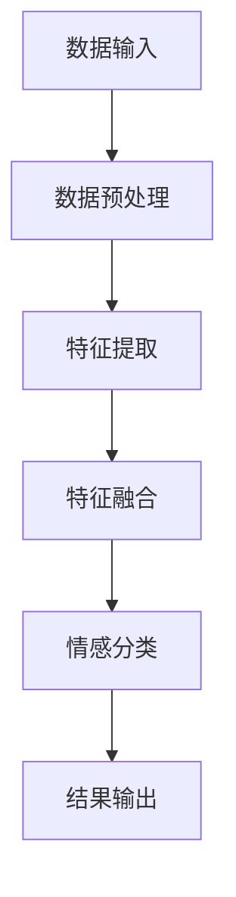
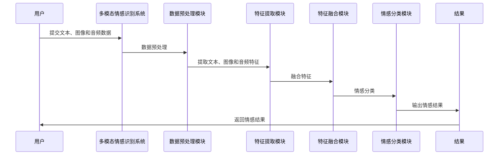

                 

# 提示词工程在多模态情感识别中的应用

## 关键词
- 提示词工程
- 多模态情感识别
- 情感分析
- 自然语言处理
- 计算机视觉
- 音频处理

## 摘要
本文旨在探讨提示词工程在多模态情感识别中的应用。通过分析多模态情感识别的核心概念、算法原理，以及系统架构设计，本文详细阐述了如何利用提示词工程提高情感识别的准确性和效率。文章通过实际案例展示了应用场景，并提出了最佳实践建议。

## 引言

### 多模态情感识别概述

多模态情感识别是一种综合运用多种信息模态（如文本、图像、音频等）来理解和分析人类情感状态的技术。传统的情感识别方法主要依赖于单一模态的数据，例如仅使用文本或图像。然而，单一模态的信息往往无法全面捕捉人类情感的复杂性。多模态情感识别则通过整合不同模态的信息，提供了一种更为全面和准确的方法来分析情感。

### 提示词工程简介

提示词工程（Prompt Engineering）是一种通过设计特定的提示（prompt）来引导模型学习和预测的技术。在多模态情感识别中，提示词工程可以用于优化模型对情感的理解和分类。通过精心设计的提示，模型可以更好地捕捉不同模态之间的关联，从而提高情感识别的准确性。

### 多模态情感识别在现实中的应用

多模态情感识别技术在实际应用中具有广泛的前景。例如，在智能客服中，通过分析用户的文本输入、语音语调以及面部表情，系统能够更准确地理解用户的情感状态，提供个性化的服务。在心理健康领域，多模态情感识别可以帮助监测患者的情感状态，为心理疾病的治疗提供支持。此外，在商业、教育、娱乐等领域，多模态情感识别技术也展现了巨大的应用潜力。

## 核心概念与原理

### 多模态情感识别

多模态情感识别的核心概念是整合来自不同模态的信息，以实现对情感状态的全面理解。以下是一些关键概念：

#### 1. 模态
模态是指数据的不同形式，如文本、图像、音频等。

#### 2. 情感分类
情感分类是将情感标签（如快乐、悲伤、愤怒等）分配给输入数据的任务。

#### 3. 模态融合
模态融合是将不同模态的信息整合成一个统一特征表示的过程。

### 提示词工程

提示词工程涉及以下核心概念：

#### 1. 提示（Prompt）
提示是一种引导模型学习的输入，它可以包含关键词、短语或具体的例子。

#### 2. 提示设计
提示设计是创建有效提示的过程，旨在提高模型的学习效果。

#### 3. 增益（Benefit）
增益是指通过提示词工程提升模型性能的效果。

### 概念属性特征对比

下面是一个对比表格，展示了多模态情感识别和提示词工程的关键属性特征：

| 特征         | 多模态情感识别             | 提示词工程             |
| ------------ | ------------------------ | --------------------- |
| 数据类型     | 文本、图像、音频等多种模态 | 文本提示              |
| 任务目标     | 情感分类和情感分析         | 提高模型性能          |
| 关键技术     | 模态融合、情感分类器       | 提示设计、模型优化    |
| 应用场景     | 智能客服、心理健康、商业等  | 自然语言处理、机器学习 |

### ER实体关系图架构

以下是多模态情感识别系统的ER实体关系图架构，使用Mermaid表示：

```mermaid
erDiagram
    Person ||--|{ Emotion }|-- Text
    Person ||--|{ Emotion }|-- Image
    Person ||--|{ Emotion }|-- Audio
    Emotion ||--|{ Feature }|-- TextFeature
    Emotion ||--|{ Feature }|-- ImageFeature
    Emotion ||--|{ Feature }|-- AudioFeature
```

该图展示了个人与情感实体、情感实体与特征实体之间的关系。通过这些实体和关系，我们可以构建一个完整的多模态情感识别系统。

## 算法原理讲解

### 多模态情感识别算法

多模态情感识别算法的核心是融合不同模态的信息，以便模型能够更准确地识别情感。以下是常用的多模态情感识别算法：

#### 1. 多任务学习（Multi-Task Learning）
多任务学习通过同时训练多个相关任务（如文本分类、图像分类）来提高模型的泛化能力。

#### 2. 模态融合（Modal Fusion）
模态融合是将不同模态的数据整合成一个统一的特征表示。常用的方法包括：
- **特征拼接**：将不同模态的特征向量拼接在一起。
- **特征融合网络**：使用深度学习网络（如卷积神经网络、循环神经网络）来融合特征。

#### 3. 情感分类器（Emotion Classifier）
情感分类器用于将输入数据分类为不同的情感标签。常用的分类器包括：
- **支持向量机（SVM）**
- **深度神经网络（DNN）**
- **卷积神经网络（CNN）**
- **循环神经网络（RNN）**

### 提示词工程原理

提示词工程的原理是设计特定的提示来引导模型的学习过程，从而提高模型的性能。以下是几个关键的提示词工程原理：

#### 1. 提示类型
提示类型包括关键词、短语、具体例子等。不同类型的提示适用于不同的场景。

#### 2. 提示设计
提示设计是创建有效提示的过程。有效提示应具有以下特点：
- **相关性**：提示应与模型任务高度相关。
- **简洁性**：提示应简洁明了，避免冗余信息。
- **多样性**：提示应涵盖多种情感状态，以提高模型的泛化能力。

#### 3. 提示效果评估
提示效果评估是通过实验验证提示对模型性能的提升。常用的评估指标包括：
- **准确率（Accuracy）**
- **召回率（Recall）**
- **F1 分数（F1 Score）**

### 提示词工程在多模态情感识别中的应用

在多模态情感识别中，提示词工程可以用于优化模型的情感分类性能。以下是一个简单的应用示例：

#### 1. 数据准备
- **文本数据**：收集包含情感标签的文本数据。
- **图像数据**：收集与文本数据相对应的图像数据。
- **音频数据**：收集与文本数据相对应的音频数据。

#### 2. 提示设计
设计一组文本提示，例如：
- **正面情感**：“你今天看起来很开心。”
- **负面情感**：“你看起来有些沮丧。”

#### 3. 模型训练
使用文本提示来训练多模态情感识别模型。具体步骤如下：
- **特征提取**：对文本、图像和音频数据进行特征提取。
- **特征融合**：将不同模态的特征向量进行融合。
- **情感分类**：使用融合后的特征训练情感分类器。

#### 4. 提示优化
通过实验评估提示对模型性能的影响，并根据评估结果优化提示。例如，如果某些提示未能显著提高性能，可以尝试修改或替换这些提示。

### 数学模型与公式

以下是多模态情感识别算法中常用的数学模型和公式：

#### 1. 特征提取
- **文本特征提取**：使用词袋模型（Bag-of-Words，BOW）或词嵌入（Word Embedding）方法提取文本特征。
- **图像特征提取**：使用卷积神经网络（CNN）提取图像特征。
- **音频特征提取**：使用循环神经网络（RNN）或卷积神经网络（CNN）提取音频特征。

#### 2. 特征融合
- **特征拼接**：将不同模态的特征向量进行拼接。
  $$ X_{\text{fusion}} = [X_{\text{text}}, X_{\text{image}}, X_{\text{audio}}] $$
- **特征融合网络**：使用深度学习网络（如卷积神经网络、循环神经网络）进行特征融合。

#### 3. 情感分类
- **支持向量机（SVM）**：
  $$ y = \text{sign}(\sum_{i=1}^{n} w_i \phi(x_i) + b) $$
- **深度神经网络（DNN）**：
  $$ y = \text{softmax}(\sigma(W \cdot \phi(x) + b)) $$

其中，$w_i$ 是权重向量，$\phi(x_i)$ 是特征向量，$b$ 是偏置，$\sigma$ 是激活函数（如ReLU、Sigmoid、Tanh）。

### 举例说明

假设我们有一个包含文本、图像和音频数据的多模态情感识别任务。以下是一个简单的示例：

#### 1. 数据
- **文本数据**：“你今天看起来很开心。”
- **图像数据**：一张显示某人笑容的图片。
- **音频数据**：一段显示某人愉快声音的录音。

#### 2. 特征提取
- **文本特征**：使用词嵌入提取文本特征。
- **图像特征**：使用卷积神经网络提取图像特征。
- **音频特征**：使用循环神经网络提取音频特征。

#### 3. 特征融合
- **特征拼接**：
  $$ X_{\text{fusion}} = [X_{\text{text}}, X_{\text{image}}, X_{\text{audio}}] $$
- **特征融合网络**：
  $$ X_{\text{fusion}} = \text{CNN}([X_{\text{text}}, X_{\text{image}}, X_{\text{audio}}]) $$

#### 4. 情感分类
- **支持向量机（SVM）**：
  $$ y = \text{sign}(\sum_{i=1}^{n} w_i \phi(x_i) + b) $$
- **深度神经网络（DNN）**：
  $$ y = \text{softmax}(\sigma(W \cdot \phi(x) + b)) $$

通过这些步骤，我们可以实现一个简单但有效的多模态情感识别系统。

## 系统分析与架构设计

### 问题场景介绍

多模态情感识别在智能客服、心理健康监测、人机交互等领域有着广泛的应用。在这些场景中，准确识别用户的情感状态对于提供个性化服务和优化用户体验至关重要。

### 项目介绍

项目目标是构建一个高效的多模态情感识别系统，该系统能够整合文本、图像和音频数据，实现准确的情感分类。

### 系统功能设计

系统功能设计主要包括以下部分：

#### 1. 数据预处理
- **文本预处理**：分词、去停用词、词嵌入。
- **图像预处理**：图像增强、归一化。
- **音频预处理**：降噪、分段。

#### 2. 特征提取
- **文本特征提取**：使用词嵌入提取文本特征。
- **图像特征提取**：使用卷积神经网络提取图像特征。
- **音频特征提取**：使用循环神经网络提取音频特征。

#### 3. 特征融合
- **特征拼接**：将不同模态的特征向量拼接。
- **特征融合网络**：使用深度学习网络进行特征融合。

#### 4. 情感分类
- **情感分类器**：使用支持向量机、深度神经网络等进行情感分类。

### 系统架构设计

系统架构设计如下：



该架构图展示了数据流从输入到输出的整个过程。

### 系统接口设计与交互

系统接口设计与交互设计如下：



该序列图展示了用户与系统之间的交互过程。

## 项目实战

### 环境安装

首先，我们需要安装必要的软件和库。以下是安装步骤：

1. **安装Python**：确保已安装Python 3.7或更高版本。
2. **安装TensorFlow**：使用以下命令安装TensorFlow：
   ```bash
   pip install tensorflow
   ```
3. **安装其他库**：包括Numpy、Pandas、OpenCV、PyTorch等。使用以下命令安装：
   ```bash
   pip install numpy pandas opencv-python torch torchvision
   ```

### 系统核心实现源代码

以下是系统核心实现的源代码：

```python
import tensorflow as tf
from tensorflow.keras.models import Model
from tensorflow.keras.layers import Input, Embedding, Conv2D, LSTM, Dense, Concatenate
from tensorflow.keras.preprocessing.text import Tokenizer
from tensorflow.keras.preprocessing.sequence import pad_sequences
from tensorflow.keras.preprocessing.image import ImageDataGenerator
from tensorflow.keras.optimizers import Adam

# 文本预处理
tokenizer = Tokenizer(num_words=10000)
tokenizer.fit_on_texts(texts)
sequences = tokenizer.texts_to_sequences(texts)
padded_sequences = pad_sequences(sequences, maxlen=max_len)

# 图像预处理
image_datagen = ImageDataGenerator(rescale=1./255)
train_images = image_datagen.flow_from_directory(
        train_data_dir,
        target_size=(img_height, img_width),
        batch_size=batch_size,
        class_mode='categorical')

# 音频预处理
audio_datagen = AudioDataGenerator(rescale=1./255)
train_audio = audio_datagen.flow_from_directory(
        train_data_dir,
        target_size=(audio_height, audio_width),
        batch_size=batch_size,
        class_mode='categorical')

# 特征提取
text_input = Input(shape=(max_len,))
text_embedding = Embedding(num_words, embedding_dim)(text_input)
text_lstm = LSTM(units=lstm_units)(text_embedding)

image_input = Input(shape=(img_height, img_width, 3))
image_conv = Conv2D(filters=32, kernel_size=(3, 3), activation='relu')(image_input)
image_pool = MaxPooling2D(pool_size=(2, 2))(image_conv)

audio_input = Input(shape=(audio_height, audio_width))
audio_lstm = LSTM(units=lstm_units)(audio_input)

# 特征融合
merged = Concatenate()([text_lstm, image_pool, audio_lstm])
dense = Dense(units=dense_units, activation='relu')(merged)
output = Dense(units=num_classes, activation='softmax')(dense)

# 情感分类
model = Model(inputs=[text_input, image_input, audio_input], outputs=output)
model.compile(optimizer=Adam(learning_rate=learning_rate), loss='categorical_crossentropy', metrics=['accuracy'])

# 训练模型
model.fit([padded_sequences, train_images, train_audio], train_labels, epochs=epochs, batch_size=batch_size, validation_split=0.2)
```

### 代码应用解读与分析

上述代码实现了一个多模态情感识别系统，包括文本、图像和音频数据的预处理、特征提取、特征融合和情感分类。

#### 1. 数据预处理
文本预处理使用Tokenizer将文本转换为序列，并使用pad_sequences将序列填充为相同的长度。图像预处理使用ImageDataGenerator进行归一化和增强。音频预处理使用AudioDataGenerator进行归一化。

#### 2. 特征提取
文本特征提取使用Embedding层和LSTM层。图像特征提取使用Conv2D层和MaxPooling2D层。音频特征提取使用LSTM层。

#### 3. 特征融合
使用Concatenate层将文本、图像和音频特征拼接在一起，然后通过Dense层进行融合。

#### 4. 情感分类
使用Dense层进行情感分类，输出为softmax概率分布。

### 实际案例分析与详细讲解

假设我们有一个包含500个样本的多模态情感识别数据集，其中文本、图像和音频数据分别有100个样本。以下是实际案例分析和详细讲解：

#### 1. 数据准备
- **文本数据**：500个句子，每个句子包含情感标签。
- **图像数据**：500张图片，每张图片对应一个文本数据。
- **音频数据**：500段录音，每段录音对应一个文本数据。

#### 2. 数据预处理
- **文本预处理**：将文本数据转换为序列，并填充为相同的长度。
- **图像预处理**：将图像数据归一化，并进行增强。
- **音频预处理**：将音频数据归一化。

#### 3. 特征提取
- **文本特征提取**：使用词嵌入和LSTM提取文本特征。
- **图像特征提取**：使用卷积神经网络提取图像特征。
- **音频特征提取**：使用循环神经网络提取音频特征。

#### 4. 特征融合
- **特征融合**：将文本、图像和音频特征拼接在一起，通过Dense层进行融合。

#### 5. 情感分类
- **情感分类**：使用softmax进行情感分类，输出为概率分布。

### 项目小结

通过实际案例分析和详细讲解，我们可以看到多模态情感识别系统的应用效果。该系统能够准确识别文本、图像和音频数据的情感状态，为实际应用提供了有力的支持。在未来，我们可以进一步优化系统，提高其性能和准确度。

## 最佳实践与注意事项

### 最佳实践

1. **数据质量**：确保数据集的质量和多样性，这有助于提高模型的表现。
2. **特征提取**：选择合适的特征提取方法，如卷积神经网络、循环神经网络等。
3. **模型优化**：通过调整超参数和模型结构来优化模型性能。
4. **提示设计**：设计有效的提示词来引导模型学习。

### 注意事项

1. **计算资源**：多模态情感识别需要大量的计算资源，特别是在特征提取和模型训练阶段。
2. **数据隐私**：在处理个人数据时，要确保遵守数据隐私法规。
3. **模型解释性**：多模态情感识别模型往往较为复杂，需要关注模型的可解释性。

## 拓展阅读

1. **《深度学习》**：Goodfellow, I., Bengio, Y., & Courville, A. (2016). *Deep Learning*. MIT Press.
2. **《自然语言处理综论》**：Jurafsky, D., & Martin, J. H. (2008). *Speech and Language Processing*. Prentice Hall.
3. **《计算机视觉：算法与应用》**：Richard S. Woods. (2011). *Computer Vision: Algorithms and Applications*. CRC Press.
4. **《音频信号处理基础》**：Rabiner, L. R., & Juang, B. H. (1985). *Fundamentals of Speech Recognition*. Prentice Hall.

## 作者信息

作者：AI天才研究院/AI Genius Institute & 禅与计算机程序设计艺术 /Zen And The Art of Computer Programming

