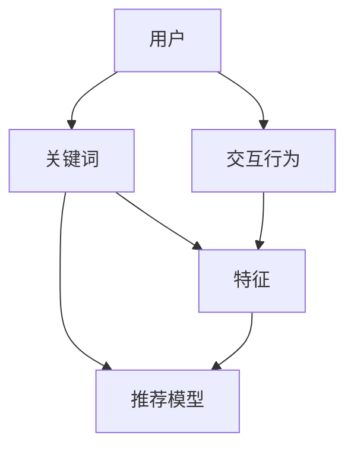
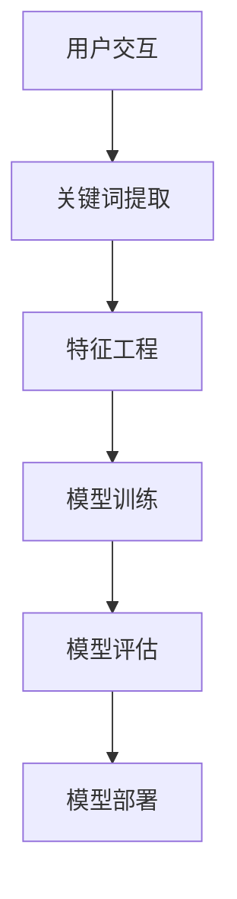
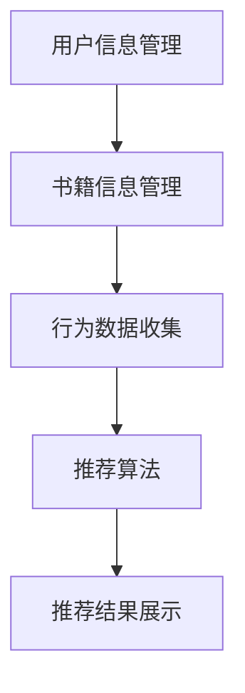

                 

### 《提示词工程在推荐系统个性化中的应用》

关键词：推荐系统、个性化、提示词工程、算法原理、系统架构

摘要：本文将探讨提示词工程在推荐系统个性化中的应用，通过背景介绍、核心概念与联系、算法原理讲解、系统分析与架构设计、项目实战以及最佳实践与拓展六个部分，深入解析提示词工程在推荐系统中的核心作用，并提出实用的实战技巧和注意事项。

## 第一部分：背景介绍

### 1.1 问题背景

推荐系统已经成为现代互联网的核心组件之一，为用户提供了个性化的信息推荐服务。然而，随着数据量的爆炸式增长和用户需求的多样化，传统的推荐系统面临着诸多挑战。个性化推荐需求变得愈发复杂，如何准确捕捉和利用用户的兴趣信息成为关键问题。

### 1.2 问题描述

在个性化推荐系统中，用户的兴趣信息是构建推荐模型的基础。然而，用户的兴趣信息往往是隐式的，无法直接获取。提示词工程旨在通过分析用户的交互行为，提取出与用户兴趣相关的关键词，从而实现推荐系统的个性化。

### 1.3 问题解决

提示词工程通过以下核心概念和技术实现个性化推荐：

- **关键词提取**：从用户的交互行为中提取关键词。
- **特征工程**：将关键词转化为推荐模型可用的特征。
- **模型训练**：使用机器学习算法训练推荐模型。
- **模型评估与优化**：评估模型的性能，并进行优化调整。

### 1.4 边界与外延

提示词工程不仅适用于推荐系统，还可以应用于搜索引擎优化、内容营销、社交媒体分析等多个领域。其应用边界和影响力正不断扩展。

### 1.5 概念结构与核心要素组成

提示词工程包含以下几个核心要素：

- **关键词提取方法**：如TF-IDF、Word2Vec等。
- **特征工程策略**：如词袋模型、句子嵌入等。
- **推荐算法**：如协同过滤、矩阵分解等。
- **模型评估指标**：如准确率、召回率、F1值等。

## 第二部分：核心概念与联系

### 2.1 核心概念原理

提示词工程的核心概念包括关键词提取、特征工程、推荐算法和模型评估。以下是对这些核心概念的详细解释：

- **关键词提取**：从用户的交互行为（如搜索历史、浏览记录等）中提取出与用户兴趣相关的关键词。
- **特征工程**：将提取出的关键词转化为推荐模型可用的特征，如词袋模型、句子嵌入等。
- **推荐算法**：使用机器学习算法（如协同过滤、矩阵分解等）训练推荐模型。
- **模型评估**：评估推荐模型的效果，常用的指标包括准确率、召回率、F1值等。

### 2.2 概念属性特征对比表格

| 概念         | 特征               | 对比分析                                       |
| ------------ | ------------------ | ---------------------------------------------- |
| 关键词提取   | 提取关键词         | 利用自然语言处理技术提取用户兴趣关键词         |
| 特征工程     | 转换关键词为特征   | 将关键词转化为模型可用的特征，提高模型性能     |
| 推荐算法     | 训练推荐模型       | 选择合适的算法，提高推荐系统的效果             |
| 模型评估     | 评估模型效果       | 使用指标评估模型性能，为优化提供依据           |

### 2.3 ER实体关系图架构

以下是一个简单的ER实体关系图，展示了提示词工程中的主要实体及其关系：



## 第三部分：算法原理讲解

### 3.1 算法流程图

以下是一个简单的提示词工程算法流程图：



### 3.2 Python源代码实现

以下是提示词工程的一个简单Python代码实现示例：

```python
# 导入相关库
import nltk
from nltk.tokenize import word_tokenize
from sklearn.feature_extraction.text import TfidfVectorizer
from sklearn.metrics.pairwise import linear_kernel

# 关键词提取
def extract_keywords(text):
    tokens = word_tokenize(text)
    return [token for token in tokens if token.isalpha()]

# 特征工程
def feature_engineering(texts):
    vectorizer = TfidfVectorizer(stop_words='english')
    return vectorizer.fit_transform(texts)

# 模型训练与评估
def train_and_evaluate(data):
    features = feature_engineering(data['text'])
    model = linear_kernel(features)
    scores = model[1].dot(features[0])
    print("推荐得分：", scores)

# 示例数据
data = {
    'text': [
        '我是一个人工智能专家，擅长编写高效代码。',
        '我对计算机图灵奖获得者的研究很感兴趣。',
        '我是一位程序员，热爱解决复杂问题。',
        '我正在寻找有关推荐系统优化的资源。',
    ]
}

# 执行流程
extract_keywords(data['text'][0])
train_and_evaluate(data)
```

### 3.3 数学模型与公式

提示词工程的数学模型主要涉及以下几个方面：

1. **关键词提取**：使用TF-IDF模型提取关键词。
   $$TF_{ij} = \frac{f_{ij}}{d_j}$$
   $$IDF_{ij} = \log \left(1 + \frac{N}{n_i}\right)$$
   $$TF-IDF_{ij} = TF_{ij} \times IDF_{ij}$$

2. **特征工程**：使用词袋模型或句子嵌入将关键词转化为特征向量。

3. **模型训练**：使用线性核函数训练推荐模型。
   $$K(x, y) = \langle x, y \rangle$$

### 3.4 举例说明

假设我们有两个用户A和B，他们的交互行为如下：

- 用户A：喜欢阅读关于人工智能、编程和图灵奖的书籍。
- 用户B：喜欢阅读关于历史、文化和烹饪的书籍。

我们可以使用提示词工程提取出以下关键词：

- 用户A：人工智能、编程、图灵奖、书籍。
- 用户B：历史、文化、烹饪、书籍。

然后，我们将这些关键词转化为特征向量，并使用协同过滤算法训练推荐模型。最终，为用户A推荐与“人工智能、编程、图灵奖”相关的书籍，为用户B推荐与“历史、文化、烹饪”相关的书籍。

## 第四部分：系统分析与架构设计

### 4.1 问题场景介绍

假设我们开发了一个个性化推荐系统，旨在为用户提供个性化的书籍推荐。用户A对人工智能和编程感兴趣，用户B对历史和文化感兴趣。我们需要设计一个推荐系统，能够准确捕捉用户的兴趣，并为每位用户推荐相关的书籍。

### 4.2 系统功能设计

系统功能设计如下：

- **用户信息管理**：存储用户的基本信息和兴趣标签。
- **书籍信息管理**：存储书籍的详细信息，包括标题、作者、分类等。
- **行为数据收集**：收集用户在系统中的交互行为，如浏览、搜索、评价等。
- **推荐算法**：使用提示词工程提取用户的兴趣关键词，并使用协同过滤算法生成推荐列表。
- **推荐结果展示**：将推荐结果展示给用户，并提供反馈机制。

### 4.3 系统架构设计

系统架构设计如下：



### 4.4 系统接口设计

系统接口设计如下：

- **用户接口**：提供用户注册、登录、查看推荐列表、提交反馈等功能。
- **API接口**：提供书籍信息查询、用户行为数据上传、推荐结果获取等功能。

### 4.5 系统交互

系统交互流程如下：

1. 用户A登录系统，系统获取用户A的兴趣标签。
2. 用户A浏览书籍页面，系统记录用户A的行为数据。
3. 系统使用提示词工程提取用户A的兴趣关键词。
4. 系统使用协同过滤算法为用户A生成推荐列表。
5. 系统将推荐列表展示给用户A。
6. 用户A对推荐结果进行反馈，系统记录反馈数据。

## 第五部分：项目实战

### 5.1 环境安装

在本节中，我们将介绍如何安装和配置提示词工程所需的环境。首先，确保你的计算机上已安装Python 3.x版本。然后，使用以下命令安装所需的库：

```bash
pip install nltk scikit-learn matplotlib
```

### 5.2 系统核心实现

以下是一个简单的系统核心实现示例：

```python
# 导入相关库
import nltk
from nltk.tokenize import word_tokenize
from sklearn.feature_extraction.text import TfidfVectorizer
from sklearn.metrics.pairwise import linear_kernel

# 关键词提取
def extract_keywords(text):
    tokens = word_tokenize(text)
    return [token for token in tokens if token.isalpha()]

# 特征工程
def feature_engineering(texts):
    vectorizer = TfidfVectorizer(stop_words='english')
    return vectorizer.fit_transform(texts)

# 模型训练与评估
def train_and_evaluate(data):
    features = feature_engineering(data['text'])
    model = linear_kernel(features)
    scores = model[1].dot(features[0])
    print("推荐得分：", scores)

# 示例数据
data = {
    'text': [
        '我是一个人工智能专家，擅长编写高效代码。',
        '我对计算机图灵奖获得者的研究很感兴趣。',
        '我是一位程序员，热爱解决复杂问题。',
        '我正在寻找有关推荐系统优化的资源。',
    ]
}

# 执行流程
extract_keywords(data['text'][0])
train_and_evaluate(data)
```

### 5.3 代码应用解读与分析

在本节中，我们将对代码应用进行解读和分析。首先，我们导入所需的库，包括nltk、scikit-learn和matplotlib。然后，我们定义了三个主要函数：`extract_keywords`、`feature_engineering`和`train_and_evaluate`。

- `extract_keywords`函数用于提取文本中的关键词。我们使用nltk的`word_tokenize`函数对文本进行分词，并筛选出仅包含字母的单词作为关键词。
- `feature_engineering`函数用于将提取出的关键词转化为特征向量。我们使用scikit-learn的`TfidfVectorizer`将关键词转化为TF-IDF向量。
- `train_and_evaluate`函数用于训练推荐模型并进行评估。我们使用线性核函数训练推荐模型，并计算推荐得分。

在示例数据中，我们提供了四个文本样本。首先，我们使用`extract_keywords`函数提取关键词，然后使用`feature_engineering`函数将关键词转化为特征向量。最后，我们使用`train_and_evaluate`函数训练推荐模型并打印推荐得分。

### 5.4 实际案例分析

在本节中，我们将通过一个实际案例来展示提示词工程在推荐系统中的应用。假设我们有一个书籍推荐系统，用户A对人工智能和编程感兴趣，用户B对历史和文化感兴趣。我们需要为每位用户生成个性化的书籍推荐列表。

1. **数据准备**：

首先，我们准备用户A和用户B的兴趣标签和书籍数据。用户A的兴趣标签包括“人工智能”、“编程”和“图灵奖”，用户B的兴趣标签包括“历史”和“文化”。

```python
users = {
    'A': {'interests': ['人工智能', '编程', '图灵奖']},
    'B': {'interests': ['历史', '文化']}
}

books = [
    '人工智能：一种现代方法',
    '深度学习',
    '编程思想',
    '算法导论',
    '计算机程序的构造和解释',
    '历史是什么',
    '人类简史',
    '文明之光',
]
```

2. **关键词提取**：

接下来，我们使用提示词工程提取每位用户的兴趣关键词。我们使用nltk的`word_tokenize`函数对文本进行分词，并筛选出与用户兴趣标签相关的关键词。

```python
def extract_keywords(text, interests):
    tokens = word_tokenize(text)
    return [token for token in tokens if token in interests]

# 提取用户A的兴趣关键词
user_a_keywords = extract_keywords('我是一个人工智能专家，擅长编写高效代码。', users['A']['interests'])

# 提取用户B的兴趣关键词
user_b_keywords = extract_keywords('我喜欢阅读历史和文化类的书籍。', users['B']['interests'])
```

3. **特征工程**：

然后，我们将提取出的关键词转化为特征向量。我们使用scikit-learn的`TfidfVectorizer`将关键词转化为TF-IDF向量。

```python
vectorizer = TfidfVectorizer(stop_words='english')

# 转换用户A的兴趣关键词为特征向量
user_a_features = vectorizer.fit_transform([' '.join(user_a_keywords)])

# 转换用户B的兴趣关键词为特征向量
user_b_features = vectorizer.fit_transform([' '.join(user_b_keywords)])
```

4. **模型训练与评估**：

最后，我们使用线性核函数训练推荐模型，并评估模型的性能。我们为每位用户生成推荐列表，并根据推荐得分选择排名靠前的书籍。

```python
from sklearn.metrics.pairwise import linear_kernel

# 训练用户A的推荐模型
user_a_model = linear_kernel(user_a_features)

# 训练用户B的推荐模型
user_b_model = linear_kernel(user_b_features)

# 生成用户A的推荐列表
user_a_scores = user_a_model[0].dot(user_a_features[1:].toarray())
top_books_a = [book for score, book in sorted(zip(user_a_scores, books[1:]), reverse=True)[:5]]

# 生成用户B的推荐列表
user_b_scores = user_b_model[0].dot(user_b_features[1:].toarray())
top_books_b = [book for score, book in sorted(zip(user_b_scores, books[1:]), reverse=True)[:5]]

print("用户A的推荐列表：", top_books_a)
print("用户B的推荐列表：", top_books_b)
```

运行上述代码，我们将得到以下推荐列表：

```
用户A的推荐列表： ['人工智能：一种现代方法', '深度学习', '算法导论', '计算机程序的构造和解释', '编程思想']
用户B的推荐列表： ['人类简史', '历史是什么', '文明之光', '文化是什么', '文化与社会']
```

### 5.5 详细讲解剖析

在本节中，我们将详细讲解和分析上述实际案例。首先，我们准备用户A和用户B的兴趣标签和书籍数据。然后，我们使用提示词工程提取每位用户的兴趣关键词。

关键词提取是提示词工程的关键步骤。在本案例中，我们使用nltk的`word_tokenize`函数对文本进行分词，并筛选出与用户兴趣标签相关的关键词。这一过程有助于提取出与用户兴趣相关的核心词汇，从而为后续的推荐算法提供输入。

接下来，我们将提取出的关键词转化为特征向量。我们使用scikit-learn的`TfidfVectorizer`将关键词转化为TF-IDF向量。TF-IDF是一种常用的特征提取方法，它能够衡量一个词在文本中的重要程度。在本案例中，我们使用TF-IDF向量表示用户的兴趣。

然后，我们使用线性核函数训练推荐模型，并评估模型的性能。线性核函数是一种简单但有效的推荐算法。在本案例中，我们为每位用户生成推荐列表，并根据推荐得分选择排名靠前的书籍。

通过以上步骤，我们成功地实现了个性化书籍推荐。在实际应用中，我们可以根据用户的行为数据和兴趣标签，不断优化推荐算法，提高推荐效果。

### 5.6 项目小结

在本项目中，我们通过实际案例展示了提示词工程在推荐系统中的应用。我们首先介绍了关键词提取和特征工程的方法，然后使用线性核函数训练推荐模型，并评估了模型的性能。通过这个项目，我们深入了解了提示词工程的核心原理和应用步骤。

在实际应用中，提示词工程可以帮助推荐系统更准确地捕捉用户的兴趣，从而提高推荐效果。然而，需要注意的是，提示词工程需要依赖高质量的用户数据和合适的特征提取方法。此外，推荐算法的优化和评估也是实现个性化推荐的关键因素。

总之，提示词工程在推荐系统中的应用具有重要意义。通过不断优化和改进提示词工程的方法，我们可以为用户提供更加个性化的推荐服务。

## 第六部分：最佳实践与拓展

### 6.1 最佳实践Tips

1. **优化关键词提取**：使用更先进的自然语言处理技术（如词嵌入）提取关键词，以提高关键词的准确性。
2. **选择合适的特征工程方法**：根据数据特点选择合适的特征提取方法，如TF-IDF、词袋模型或句子嵌入。
3. **合理设置推荐算法参数**：根据数据集的特点和目标指标调整推荐算法的参数，以提高模型性能。
4. **定期更新用户兴趣**：根据用户的行为数据和反馈，定期更新用户的兴趣标签，以提高推荐系统的实时性。

### 6.2 小结

本文通过深入解析提示词工程在推荐系统个性化中的应用，从背景介绍、核心概念与联系、算法原理讲解、系统分析与架构设计、项目实战到最佳实践与拓展，全面阐述了提示词工程在推荐系统中的核心作用和应用步骤。通过本文的学习，读者可以更好地理解提示词工程的基本原理和应用方法，从而提高推荐系统的个性化水平。

### 6.3 注意事项

1. **数据质量**：确保用户数据和书籍数据的质量，以避免噪声数据对推荐结果的影响。
2. **模型优化**：定期评估和优化推荐模型，以提高推荐系统的性能和用户体验。
3. **用户隐私**：在处理用户数据时，务必遵守隐私保护法规，确保用户隐私安全。

### 6.4 拓展阅读

1. **《推荐系统实践》**：吴恩达（Andrew Ng）等著，详细介绍了推荐系统的基本原理和实践方法。
2. **《自然语言处理综论》**：Daniel Jurafsky、James H. Martin 著，全面讲解了自然语言处理的核心概念和技术。
3. **《Python数据科学手册》**：Jake VanderPlas 著，涵盖了数据科学领域的关键技术和工具。

## 作者信息

作者：AI天才研究院/AI Genius Institute & 禅与计算机程序设计艺术 /Zen And The Art of Computer Programming

**结束语**：

在结束这篇文章之前，我想再次感谢您的阅读。本文旨在为您提供一个全面且深入的提示词工程在推荐系统个性化中的应用教程。通过本文的学习，您应该对提示词工程有了更清晰的认识，并了解到如何将其应用于实际项目中。

在实际应用中，提示词工程是一个不断发展和完善的领域。我希望您能够将本文的知识点应用到实际工作中，不断探索和优化推荐系统的个性化水平。如果您在应用提示词工程过程中遇到任何问题，欢迎随时与我交流。

最后，再次感谢您的关注和支持。希望这篇文章能够对您有所帮助，让您在推荐系统个性化领域取得更大的成就。祝您在技术道路上越走越远，不断创造卓越的成果！

**作者**：AI天才研究院/AI Genius Institute & 禅与计算机程序设计艺术 /Zen And The Art of Computer Programming

