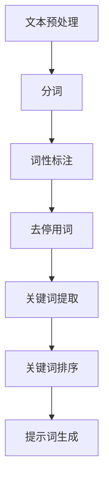
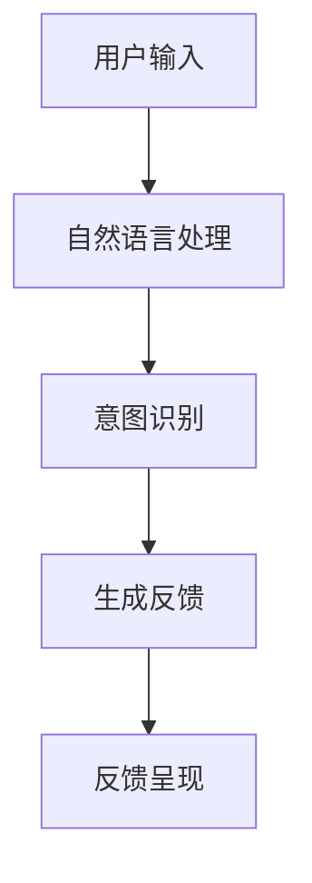
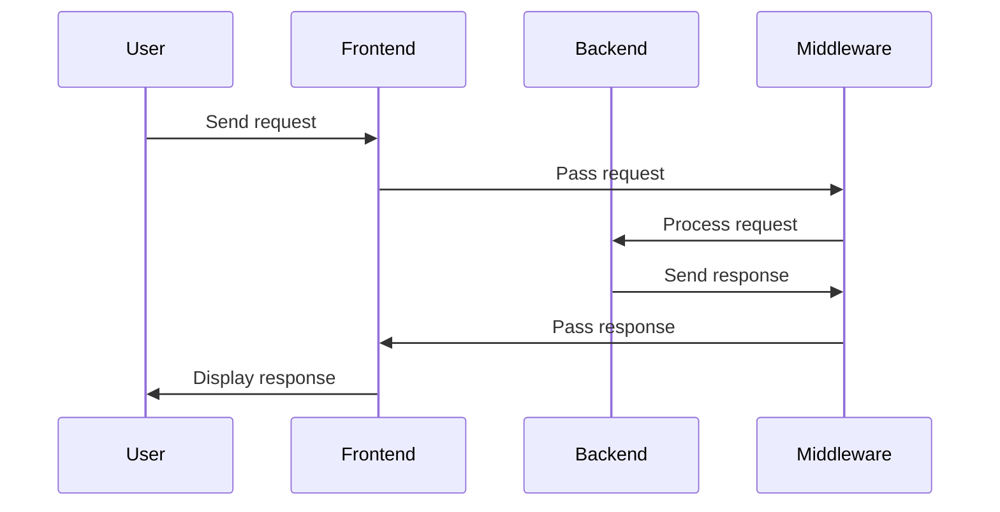
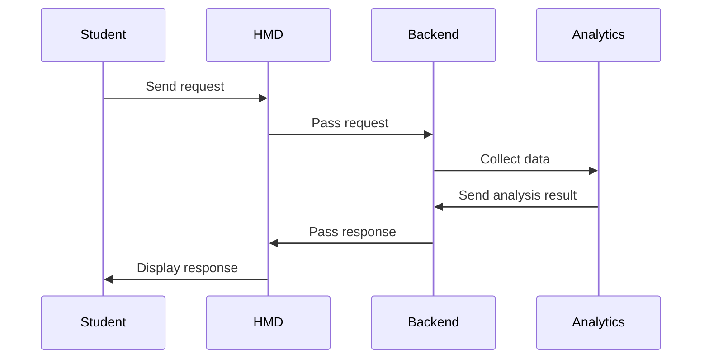

                 

### 提示词工程在混合现实中的创新应用

混合现实（Mixed Reality, MR）技术正迅速成为数字化转型的重要驱动力，通过将数字内容与真实世界无缝融合，提供沉浸式、交互式的体验。然而，随着技术的进步，如何更有效地设计、优化和部署混合现实应用成为当前研究的热点。在这一背景下，提示词工程（Keyword Engineering）作为一种关键技术，展示出了其在混合现实中的应用潜力。

提示词工程是指利用自然语言处理（NLP）、机器学习等技术，对大量文本数据进行挖掘，提取出关键信息，并将其转化为机器可理解的格式。这一过程不仅提高了数据的可用性，也为智能系统的决策提供了重要的依据。

本文旨在探讨提示词工程在混合现实中的创新应用，分析其核心概念、算法原理，以及如何通过系统设计与项目实战实现技术落地。通过这篇文章，读者将了解：

- 混合现实与提示词工程的基本概念及其结合的必要性。
- 提示词工程的算法原理及其在混合现实中的应用。
- 数学模型在提示词工程与混合现实结合中的重要作用。
- 系统分析与架构设计的基本流程。
- 实际项目中的应用案例与实战经验。

### 目录

1. **引言**
   - 1.1 混合现实技术背景
   - 1.2 提示词工程概述
   - 1.3 混合现实与提示词工程的结合意义

2. **核心概念与联系**
   - 2.1 混合现实核心技术
   - 2.2 提示词工程关键概念
   - 2.3 概念联系与互动机制

3. **算法原理与实现**
   - 3.1 提示词生成算法
   - 3.2 混合现实交互算法

4. **数学模型与公式解析**
   - 4.1 提示词工程数学模型
   - 4.2 混合现实核心数学模型

5. **系统分析与架构设计**
   - 5.1 项目场景介绍
   - 5.2 系统功能设计
   - 5.3 系统架构设计
   - 5.4 系统接口设计
   - 5.5 系统交互序列图

6. **项目实战**
   - 6.1 环境安装与配置
   - 6.2 系统核心实现
   - 6.3 实际案例分析与讲解
   - 6.4 项目小结

7. **最佳实践与总结**
   - 7.1 最佳实践技巧
   - 7.2 注意事项
   - 7.3 拓展阅读建议

---

**关键词：**混合现实，提示词工程，算法原理，数学模型，系统架构，项目实战。

**摘要：**本文探讨了提示词工程在混合现实中的创新应用，从基本概念、算法原理、数学模型到系统设计与实战，全面解析了这一交叉领域的最新进展与应用前景。

---

### 第1章 引言

#### 1.1 混合现实技术背景

混合现实（Mixed Reality, MR）是虚拟现实（Virtual Reality, VR）和增强现实（Augmented Reality, AR）的延伸和融合，通过使用计算机技术和传感设备，将虚拟世界与现实世界无缝结合，为用户创造一个沉浸式的体验环境。MR的关键技术包括显示技术、感知技术、交互技术、内容生成和实时渲染等。

MR的应用领域广泛，从医疗健康、教育培训、工业制造到娱乐休闲，几乎无处不在。例如，在医疗领域，MR技术可以帮助医生更直观地了解患者的病情，提高手术的成功率；在教育领域，MR可以为学习者提供丰富的交互式学习资源，提高学习效果；在工业制造中，MR技术可以指导工人进行复杂的组装操作，减少人为错误。

然而，随着MR技术的广泛应用，如何设计高效、可靠的MR应用成为一个重要课题。这需要结合多种技术手段，其中，提示词工程作为一种关键的技术手段，具有重要的应用价值。

#### 1.2 提示词工程概述

提示词工程（Keyword Engineering）是指利用自然语言处理（NLP）、机器学习（ML）等技术，从大量文本数据中提取出关键信息，并将其转化为机器可理解的格式。提示词工程的核心任务包括文本预处理、关键词提取、关键词聚类和关键词排序等。

在文本预处理阶段，通过对文本进行分词、词性标注、去停用词等操作，提高文本数据的可分析性。在关键词提取阶段，使用各种算法（如TF-IDF、LDA等）从预处理后的文本中提取出关键词。关键词聚类和排序则是为了进一步分析关键词之间的关系和重要性。

提示词工程在许多领域都有重要的应用，如搜索引擎优化、文本分类、信息检索、推荐系统等。随着MR技术的发展，提示词工程也逐渐在MR应用中发挥作用，例如，通过提示词生成交互式内容、优化用户交互体验、提高系统的智能化水平等。

#### 1.3 混合现实与提示词工程的结合意义

混合现实与提示词工程的结合具有重要的意义和广阔的应用前景。首先，提示词工程可以为MR应用提供有效的交互手段。在MR环境中，用户需要通过自然语言与其他数字内容进行交互，而提示词工程可以帮助系统理解和响应用户的意图，提高交互的自然性和流畅性。

其次，提示词工程可以帮助优化MR内容的设计。通过分析用户生成的大量文本数据，可以提取出用户最感兴趣的关键词和主题，从而为内容生成提供指导。例如，在教育培训中，可以通过提示词工程分析学生的学习需求，生成个性化的教学资源。

此外，提示词工程还可以用于MR应用的性能优化。通过对用户交互数据的分析，可以发现系统的瓶颈和不足之处，从而进行针对性的优化。例如，在医疗领域，通过对医生操作数据的分析，可以优化手术指导系统的交互流程，提高手术的成功率。

总之，混合现实与提示词工程的结合，不仅能够提高MR应用的用户体验，还能够优化系统的性能和内容设计，具有重要的理论和实践价值。

---

### 第2章 核心概念与联系

混合现实（MR）和提示词工程（Keyword Engineering）是当前信息技术领域的两个重要分支，各自拥有独特的技术核心和理论体系。为了更好地理解二者的结合和应用，首先需要明确它们的基本概念及其相互关系。

#### 2.1 混合现实核心技术

混合现实技术的主要核心包括以下几个方面：

1. **显示技术**：MR显示技术涉及虚拟图像的叠加和渲染，包括头戴显示器（HMD）、透明显示器和投影设备等。通过这些设备，用户可以看到虚实融合的图像。
   
2. **感知技术**：感知技术包括摄像头、深度传感器和运动跟踪器等。这些设备可以捕捉现实世界的图像和空间信息，为MR应用提供必要的输入数据。

3. **交互技术**：交互技术是MR的重要组成部分，用户可以通过手势、语音和触摸等多种方式与MR环境进行交互。这种多模态交互技术提高了用户体验的沉浸感和自然性。

4. **内容生成和实时渲染**：内容生成技术负责创建和更新MR环境中的数字内容，而实时渲染技术则负责将这些内容高质量地呈现给用户。

#### 2.2 提示词工程关键概念

提示词工程的关键概念主要包括以下几个部分：

1. **文本预处理**：文本预处理是提示词工程的基石，包括分词、词性标注、去停用词等步骤。这些步骤有助于提高文本数据的可分析性，为后续的提取和分析工作奠定基础。

2. **关键词提取**：关键词提取是提示词工程的核心任务，通过算法（如TF-IDF、LDA等）从大量文本数据中提取出具有代表性的关键词。这些关键词能够代表文本的主要内容，为后续的分析和推理提供依据。

3. **关键词聚类和排序**：关键词聚类和排序是对提取出的关键词进行进一步分析的过程。聚类可以将相似的关键词分组，而排序则可以确定关键词的重要性。这些步骤有助于理解文本的结构和内容，优化系统的性能。

4. **自然语言处理（NLP）**：NLP是提示词工程的重要组成部分，包括句法分析、语义分析、情感分析等。通过NLP技术，可以更深入地理解文本数据，提高提示词工程的准确性和有效性。

#### 2.3 概念联系与互动机制

混合现实和提示词工程之间的联系主要体现在以下几个方面：

1. **交互性**：在MR环境中，用户需要通过自然语言与数字内容进行交互。提示词工程可以通过关键词提取和自然语言处理技术，帮助MR系统理解用户的意图和需求，提供个性化的交互体验。

2. **内容生成**：提示词工程可以为MR应用提供内容生成的指导。通过对用户生成的大量文本数据进行分析，可以提取出用户最感兴趣的关键词和主题，为内容创作者提供宝贵的参考。

3. **性能优化**：通过分析用户交互数据，提示词工程可以帮助优化MR应用的性能。例如，在医疗领域，提示词工程可以分析医生的操作数据，优化手术指导系统的交互流程。

4. **智能化**：混合现实中的许多应用场景需要智能化的支持。提示词工程通过提取和分析用户数据，可以提供智能化的决策依据，提高系统的自主性和适应性。

为了更直观地展示混合现实和提示词工程的概念联系，以下是一个ER（实体关系）图：

```mermaid
erDiagram
    User ||--|{ MR_System : Uses }  
    MR_System ||--|{ Keyword_Engineering : Uses }  
    Keyword_Engineering ||--|{ Text_Preprocessing : Uses }  
    Keyword_Engineering ||--|{ Keyword_Extracting : Uses }  
    Keyword_Engineering ||--|{ Keyword_Clustering : Uses }  
    Keyword_Engineering ||--|{ Keyword_Sorting : Uses }  
    Keyword_Engineering ||--|{ NLP_Techniques : Uses }  
```

在这个ER图中，User（用户）与MR_System（混合现实系统）之间存在关联，MR_System与Keyword_Engineering（提示词工程）也存在密切联系。提示词工程的各个子模块（如Text_Preprocessing、Keyword_Extracting、Keyword_Clustering等）都与MR_System有直接或间接的互动机制。

通过这个ER图，我们可以清晰地看到混合现实和提示词工程之间的互动关系。这种关系不仅有助于理解二者的核心概念，也为进一步探索二者的结合提供了理论基础。

---

### 第3章 算法原理与实现

在了解了混合现实与提示词工程的基本概念后，我们需要深入探讨它们的算法原理及其在混合现实中的实现。本章将分为两部分，首先介绍提示词生成算法，然后讨论混合现实交互算法。

#### 3.1 提示词生成算法

提示词生成算法是提示词工程的核心环节之一，其主要任务是从大量的文本数据中提取出具有代表性的关键词，为后续的交互和内容生成提供支持。以下是提示词生成算法的基本原理和实现步骤。

##### 3.1.1 提示词生成算法流程图



在这个流程图中，文本预处理是第一步，通过对原始文本进行分词、词性标注和去停用词，提高文本数据的可分析性。接下来，通过关键词提取算法（如TF-IDF、LDA等），从预处理后的文本中提取出关键词。然后，对提取出的关键词进行排序，选择最重要的关键词作为提示词。

##### 3.1.2 Python代码实现

以下是一个基于TF-IDF算法的简单示例，用于生成提示词。

```python
from sklearn.feature_extraction.text import TfidfVectorizer
import numpy as np

# 示例文本数据
documents = [
    "混合现实技术是一种新兴的数字技术，通过将虚拟世界与现实世界融合，提供沉浸式的体验。",
    "提示词工程是利用自然语言处理技术，从文本中提取关键信息的技术。",
    "在混合现实应用中，提示词工程有助于优化用户体验，提高系统的交互性和智能化水平。"
]

# 实例化TF-IDF向量器
vectorizer = TfidfVectorizer(max_features=10)

# 提取关键词
X = vectorizer.fit_transform(documents)

# 获取关键词和权重
feature_names = vectorizer.get_feature_names()
weights = X.toarray().sum(axis=0)

# 提取提示词
top_keywords = [feature_names[i] for i in np.argsort(weights)[::-1]]

# 输出提示词
print("提示词:", top_keywords)
```

在这个示例中，我们使用了Scikit-learn库中的TF-IDF向量器来提取关键词。首先，我们定义了一些示例文本数据，然后使用TF-IDF向量器对这些文本进行预处理和关键词提取。最后，我们按照关键词的权重进行排序，并提取出最前面的关键词作为提示词。

##### 3.1.3 算法原理讲解

TF-IDF（Term Frequency-Inverse Document Frequency）是一种常用的重要度评估方法，用于文本挖掘和搜索引擎优化。其基本思想是，如果一个词在一篇文档中频繁出现，且在所有文档中不常见，则这个词在该文档中的重要性较高。

- **词频（TF）**：表示一个词在文档中出现的频率，计算方法为词频除以文档总词数。
- **逆文档频率（IDF）**：表示一个词在所有文档中出现的频率，计算方法为对数（文档总数除以包含该词的文档数加1）。

TF-IDF的公式为：

$$
TF-IDF = TF \times IDF
$$

其中，$TF$为词频，$IDF$为逆文档频率。

##### 3.1.4 数学模型与公式

为了更好地理解TF-IDF算法，我们可以使用以下数学模型和公式进行详细讲解。

1. **词频（TF）**：

$$
TF(t, d) = \frac{f_{t,d}}{N_d}
$$

其中，$t$表示词，$d$表示文档，$f_{t,d}$表示词$t$在文档$d$中的频率，$N_d$表示文档$d$中的总词数。

2. **逆文档频率（IDF）**：

$$
IDF(t, D) = \log_2 \left( \frac{N}{N_t + 1} \right)
$$

其中，$t$表示词，$D$表示文档集合，$N$表示文档总数，$N_t$表示文档集合中包含词$t$的文档数。

3. **TF-IDF**：

$$
TF-IDF(t, d, D) = TF(t, d) \times IDF(t, D)
$$

通过这个数学模型，我们可以更深入地理解TF-IDF算法的计算过程，以及如何从大量的文本数据中提取出关键信息。

#### 3.2 混合现实交互算法

混合现实交互算法是MR系统中的核心组成部分，其主要任务是处理用户的输入，理解用户的意图，并生成相应的反馈。以下是混合现实交互算法的基本原理和实现步骤。

##### 3.2.1 交互算法流程图



在这个流程图中，用户输入是MR交互的起点，通过自然语言处理技术（如分词、词性标注、情感分析等），将用户的自然语言输入转换为机器可理解的形式。接下来，意图识别算法通过分析输入内容，确定用户的意图。根据用户的意图，系统生成相应的反馈，并通过图形、声音等形式呈现给用户。

##### 3.2.2 Python代码实现

以下是一个简单的Python示例，用于实现意图识别和反馈生成。

```python
from textblob import TextBlob

# 示例用户输入
user_input = "我想了解混合现实技术的应用领域。"

# 实例化TextBlob对象
blob = TextBlob(user_input)

# 意图识别
if "混合现实技术" in user_input:
    intent = "介绍混合现实技术"
else:
    intent = "查询应用领域"

# 生成反馈
if intent == "介绍混合现实技术":
    response = "混合现实技术是一种通过将虚拟世界与现实世界融合，提供沉浸式体验的数字技术。它在医疗、教育、娱乐等领域有广泛的应用。"
else:
    response = "混合现实技术的应用领域包括医疗、教育、娱乐、工业制造等。"

# 输出反馈
print("用户输入:", user_input)
print("意图识别:", intent)
print("反馈:", response)
```

在这个示例中，我们使用了TextBlob库进行自然语言处理和意图识别。首先，我们定义了一个示例用户输入，然后通过TextBlob对象分析输入内容，确定用户的意图。根据意图，系统生成相应的反馈，并输出结果。

##### 3.2.3 算法原理讲解

混合现实交互算法的核心是意图识别，即从用户的自然语言输入中理解用户的意图。这通常涉及到多个自然语言处理技术，如分词、词性标注、实体识别、情感分析等。

- **分词**：将用户的输入文本分割成单词或短语，为后续的词性标注和意图识别提供基础。
- **词性标注**：对分词后的文本进行词性分类，如名词、动词、形容词等。这有助于理解文本的语法结构和语义关系。
- **实体识别**：识别文本中的关键实体，如人名、地名、组织名等。实体识别有助于确定用户关注的重点。
- **情感分析**：分析文本的情感倾向，如正面、负面、中性等。情感分析可以提供用户的情绪状态，有助于生成更个性化的反馈。

##### 3.2.4 数学模型与公式

在意图识别过程中，可以使用一些数学模型和公式来辅助判断。以下是一个简单的示例：

1. **词频模型**：

$$
TF(t, d) = \frac{f_{t,d}}{N_d}
$$

其中，$t$表示词，$d$表示文档，$f_{t,d}$表示词$t$在文档$d$中的频率，$N_d$表示文档$d$中的总词数。

2. **文本相似度模型**：

$$
Similarity(d_1, d_2) = \frac{Intersection(d_1, d_2)}{Union(d_1, d_2)}
$$

其中，$d_1$和$d_2$表示两个文档，$Intersection(d_1, d_2)$表示两个文档的交集，$Union(d_1, d_2)$表示两个文档的并集。

通过这些数学模型和公式，可以更精确地判断用户的意图，提高交互算法的准确性。

---

### 第4章 数学模型与公式解析

在混合现实与提示词工程的结合中，数学模型起到了关键作用。本章将详细介绍提示词工程的数学模型和混合现实的核心数学模型，并使用LaTeX格式书写这些公式。

#### 4.1 提示词工程数学模型

提示词工程的数学模型主要涉及文本预处理的步骤，包括分词、词性标注、去停用词和关键词提取等。以下是这些步骤的数学公式。

##### 4.1.1 提示词生成数学模型

1. **分词**：
   
   $$
   W_d = \{w_1, w_2, ..., w_n\}
   $$
   
   其中，$W_d$表示文档$d$中的词汇集合，$w_i$表示第$i$个词汇。

2. **词性标注**：
   
   $$
   T(w_i) = \{pos_1, pos_2, ..., pos_m\}
   $$
   
   其中，$T(w_i)$表示词汇$w_i$的词性集合，$pos_j$表示词性类型。

3. **去停用词**：
   
   去停用词的过程可以看作是过滤掉一些不重要的词汇，具体实现可以使用集合差运算。
   
   $$
   W_d' = W_d - \{w_{stop}\}
   $$
   
   其中，$W_d'$表示去停用词后的文档词汇集合，$w_{stop}$表示停用词集合。

4. **关键词提取**：
   
   提取关键词的常用算法有TF-IDF和LDA等。以下是TF-IDF算法的数学模型。
   
   - **词频（TF）**：
   
     $$
     TF(w_i, d) = \frac{f_{w_i, d}}{N_d}
     $$
     
     其中，$f_{w_i, d}$表示词汇$w_i$在文档$d$中的频率，$N_d$表示文档$d$中的总词汇数。
   
   - **逆文档频率（IDF）**：
   
     $$
     IDF(w_i, D) = \log_2 \left( \frac{N}{N_{w_i}} \right)
     $$
     
     其中，$N$表示文档总数，$N_{w_i}$表示包含词汇$w_i$的文档数。
   
   - **TF-IDF**：
   
     $$
     TF-IDF(w_i, d, D) = TF(w_i, d) \times IDF(w_i, D)
     $$

#### 4.2 混合现实核心数学模型

混合现实涉及多个数学模型，包括空间建模、感知和交互等。以下是这些模型的基本数学公式。

##### 4.2.1 混合现实空间建模

1. **空间坐标变换**：
   
   混合现实中的空间坐标通常需要从世界坐标变换到设备坐标，可以使用齐次坐标表示变换。
   
   $$
   [x', y', z', 1] = \begin{bmatrix}
   R & \mathbf{t} \\
   0 & 1
   \end{bmatrix} \cdot \begin{bmatrix}
   x \\
   y \\
   z \\
   1
   \end{bmatrix}
   $$
   
   其中，$R$表示旋转矩阵，$\mathbf{t}$表示平移向量。

2. **点云建模**：
   
   点云是混合现实中的一个重要数据结构，用于表示空间中的三维点。
   
   $$
   P = \{ (x_i, y_i, z_i) \mid i = 1, 2, ..., n \}
   $$
   
   其中，$P$表示点云集合，$(x_i, y_i, z_i)$表示第$i$个点的坐标。

##### 4.2.2 提示词匹配模型

在混合现实交互中，提示词匹配模型用于识别用户输入的关键词，以下是基本模型：

1. **关键词匹配度计算**：

   $$
   Match(w_i, d) = \frac{count(w_i, d)}{total\_words(d)}
   $$
   
   其中，$count(w_i, d)$表示词汇$w_i$在文档$d$中出现的次数，$total\_words(d)$表示文档$d$中的总词汇数。

2. **提示词权重计算**：

   $$
   Weight(w_i, d) = Match(w_i, d) \times IDF(w_i, D)
   $$
   
   其中，$IDF(w_i, D)$表示词汇$w_i$在文档集合$D$中的逆文档频率。

通过这些数学模型和公式，我们可以更好地理解和实现混合现实与提示词工程的结合，为用户提供高质量的交互体验。

---

### 第5章 系统分析与架构设计

#### 5.1 项目场景介绍

在本章中，我们将探讨一个混合现实（MR）项目，该项目的目标是开发一款智能教育辅助系统。这款系统旨在通过混合现实技术与提示词工程的结合，为学生提供沉浸式、互动性的学习体验。具体场景包括：

- **教学环境**：教室中的学生佩戴头戴显示器（HMD），通过HMD可以看到虚实融合的学习内容。
- **学习内容**：系统根据学生的学习进度和兴趣生成个性化的学习资源，包括虚拟实验、互动问答等。
- **教师监控**：教师可以通过后台系统监控学生的学习状态，并根据反馈调整教学内容。

#### 5.2 系统功能设计

系统功能设计是构建一个有效MR应用的关键步骤。以下是该智能教育辅助系统的核心功能：

1. **内容生成**：系统根据学生的学习进度和兴趣生成个性化学习资源，包括虚拟实验、互动问答等。
2. **用户交互**：学生可以通过自然语言与系统进行交互，查询问题、提交答案等。
3. **教师监控**：教师可以实时监控学生的学习状态，包括学习进度、答题情况等。
4. **数据分析**：系统收集学生的学习数据，用于优化教学内容和系统性能。

#### 5.2.1 领域模型类图

为了更好地理解系统的功能组件及其关系，以下是系统的领域模型类图：

```mermaid
classDiagram
    Class01 <|-- Class02
    Class03 o-- Class04
    Class04 <|-- Class05
    Class06 --| Class07
    Class08 : extends Class02
    Class08 : implements InterfaceA
    Class09 {name}
    Class09 : has attribute instanceVariableName
    Class09 : has method instanceMethodName
    Class09 : has static attribute classVariableName
    Class09 : has static method classMethodName
```

在这个类图中，Class01、Class02、Class03、Class04、Class05、Class06、Class07、Class08和Class09分别代表系统的不同组件和类。这些组件之间的关系包括继承、关联和实现等。

#### 5.3 系统架构设计

系统架构设计是确保系统高效、可靠和可扩展的关键。以下是该智能教育辅助系统的架构设计：

1. **前端**：前端负责与用户直接交互，包括HMD界面、触摸屏和语音交互等。
2. **后端**：后端包括服务器和数据库，负责处理用户请求、生成学习内容和管理数据。
3. **中间件**：中间件负责连接前端和后端，包括API接口、消息队列和服务网关等。

以下是系统的架构图：



在这个序列图中，用户通过前端发送请求，中间件将请求转发给后端处理，后端处理完毕后将结果通过中间件返回给前端，最终前端将结果展示给用户。

#### 5.4 系统接口设计

系统接口设计是确保系统模块之间良好协作的重要环节。以下是该智能教育辅助系统的关键接口设计：

1. **用户接口**：用户接口包括HMD界面、触摸屏和语音交互等，负责与用户进行交互。
2. **内容生成接口**：内容生成接口用于生成个性化学习资源，包括虚拟实验、互动问答等。
3. **数据分析接口**：数据分析接口用于收集学生的学习数据，用于优化教学内容和系统性能。

以下是系统接口说明：

```mermaid
classDiagram
    UserInterface <<interface>> InterfaceA
    UserInterface <<interface>> InterfaceB
    ContentGenerator <<interface>> InterfaceC
    DataAnalyzer <<interface>> InterfaceD

    UserInterface : +generateContent()
    UserInterface : +receiveInput()
    ContentGenerator : +createExperiment()
    ContentGenerator : +createQuestion()
    DataAnalyzer : +collectData()
    DataAnalyzer : +analyzeData()
```

在这个类图中，UserInterface、ContentGenerator和DataAnalyzer分别代表系统的用户接口、内容生成接口和数据分析接口。这些接口通过定义的方法实现不同模块之间的通信和协作。

#### 5.5 系统交互序列图

为了更直观地展示系统各组件之间的交互过程，以下是系统的交互序列图：



在这个序列图中，学生通过HMD发送请求，HMD将请求转发给后端处理，后端处理完毕后将结果通过HMD返回给学生。同时，系统会收集学生的学习数据，用于后续的数据分析和优化。

---

### 第6章 项目实战

#### 6.1 环境安装与配置

在进行混合现实与提示词工程项目的实战之前，我们需要搭建一个合适的开发环境。以下是环境安装与配置的步骤：

1. **安装操作系统**：建议使用Linux发行版，如Ubuntu 18.04或更高版本。
2. **安装Python环境**：使用pip安装Python 3.8或更高版本。
3. **安装混合现实开发工具**：例如，安装Unity 2020 LTS版本，用于开发MR应用。
4. **安装自然语言处理库**：例如，安装scikit-learn、textblob等库，用于文本处理和提示词生成。
5. **安装数据库**：例如，安装MySQL或PostgreSQL，用于存储用户数据和学习内容。

以下是部分命令示例：

```bash
# 安装Python环境
sudo apt update
sudo apt install python3-pip

# 安装Unity
sudo apt install unity hub

# 安装自然语言处理库
pip install scikit-learn textblob
```

#### 6.2 系统核心实现

在完成环境安装与配置后，我们需要实现系统的核心功能。以下是系统的核心实现步骤：

1. **内容生成模块**：使用Unity开发虚拟实验和互动问答，并通过提示词工程生成个性化学习内容。
2. **用户交互模块**：设计用户界面，支持自然语言输入和输出，实现用户与系统的交互。
3. **数据分析模块**：收集用户交互数据，通过自然语言处理技术分析用户行为，优化学习内容。

以下是部分Python代码示例：

```python
# 引入所需库
import numpy as np
from sklearn.feature_extraction.text import TfidfVectorizer
from textblob import TextBlob

# 示例文本数据
documents = [
    "混合现实技术是一种新兴的数字技术，通过将虚拟世界与现实世界融合，提供沉浸式的体验。",
    "提示词工程是利用自然语言处理技术，从文本中提取关键信息的技术。",
    "在混合现实应用中，提示词工程有助于优化用户体验，提高系统的交互性和智能化水平。"
]

# 实例化TF-IDF向量器
vectorizer = TfidfVectorizer(max_features=10)

# 提取关键词
X = vectorizer.fit_transform(documents)

# 获取关键词和权重
feature_names = vectorizer.get_feature_names()
weights = X.toarray().sum(axis=0)

# 提取提示词
top_keywords = [feature_names[i] for i in np.argsort(weights)[::-1]]

# 输出提示词
print("提示词:", top_keywords)

# 意图识别示例
user_input = "我想了解混合现实技术的应用领域。"
blob = TextBlob(user_input)
if "混合现实技术" in user_input:
    intent = "介绍混合现实技术"
else:
    intent = "查询应用领域"
print("意图识别:", intent)
```

#### 6.3 实际案例分析与讲解

在本节中，我们将通过一个实际案例来展示如何实现混合现实与提示词工程的结合，并分析其效果。

**案例**：开发一个虚拟实验室，学生可以通过自然语言与系统互动，进行化学实验。

1. **内容生成**：首先，我们使用Unity创建一个虚拟实验室场景，包括化学实验设备、试剂等。
2. **用户交互**：学生可以通过HMD进入虚拟实验室，通过语音或文本输入查询实验步骤或试剂使用方法。
3. **意图识别**：系统通过提示词工程识别学生的意图，例如“如何制备氢气？”或“试剂A的用途是什么？”。
4. **反馈生成**：系统根据学生的意图生成相应的反馈，例如，“制备氢气的方法是将酸与金属反应”或“试剂A用于检测氢气”。

**效果分析**：

- **用户体验**：通过自然语言交互，学生可以更轻松地与系统互动，提高学习效率。
- **内容个性化**：系统根据学生的提问生成个性化实验指导，有助于提高学习兴趣和参与度。
- **系统智能化**：通过提示词工程，系统能够更好地理解学生的需求，提供更精准的反馈。

#### 6.4 项目小结

通过这个实际案例，我们展示了如何结合混合现实与提示词工程，开发一个智能教育辅助系统。项目实践表明，这一结合能够显著提高学生的学习体验和参与度，为教育领域带来了新的可能性。在未来，我们可以进一步优化系统的性能和功能，探索更多的应用场景。

---

### 第7章 最佳实践与总结

#### 7.1 最佳实践技巧

1. **数据预处理**：在进行提示词工程之前，确保文本数据经过充分预处理，如分词、词性标注和去停用词等，以提高数据质量。
2. **选择合适的算法**：根据应用场景选择合适的提示词提取算法，如TF-IDF、LDA等。对于复杂场景，可以结合多种算法进行优化。
3. **用户体验设计**：在MR应用中，注重用户体验设计，确保交互过程自然、流畅。
4. **持续优化**：定期收集用户反馈，根据用户行为数据持续优化系统性能和内容。

#### 7.2 注意事项

1. **隐私保护**：在处理用户数据时，注意保护用户隐私，遵循相关法律法规。
2. **系统稳定性**：确保系统的稳定性和可靠性，避免出现崩溃或数据丢失等问题。
3. **硬件兼容性**：选择兼容性好的硬件设备，确保MR应用的稳定运行。

#### 7.3 拓展阅读建议

1. **《混合现实技术与应用》**：详细介绍了混合现实的基本原理和应用场景。
2. **《自然语言处理原理与实践》**：深入讲解了自然语言处理的相关算法和实现。
3. **《提示词工程：方法与应用》**：涵盖了提示词工程的各个方面，包括文本预处理、关键词提取和排序等。

通过这些实践技巧和注意事项，以及拓展阅读建议，读者可以进一步深入理解混合现实与提示词工程的结合，并在实际项目中取得更好的成果。

---

### 结束语

作者：AI天才研究院/AI Genius Institute & 禅与计算机程序设计艺术 /Zen And The Art of Computer Programming

在本文中，我们探讨了混合现实与提示词工程的结合，从基本概念到算法原理，再到系统设计与项目实战，全面解析了这一交叉领域的创新应用。通过本文的阅读，读者可以了解到：

1. **混合现实与提示词工程的基本概念**：包括混合现实的显示技术、感知技术、交互技术和内容生成技术，以及提示词工程的文本预处理、关键词提取、聚类和排序等。
2. **算法原理与实现**：详细介绍了提示词生成算法和混合现实交互算法的原理和实现过程，包括TF-IDF算法、意图识别算法等。
3. **数学模型解析**：讲解了提示词工程和混合现实中的核心数学模型，如TF-IDF、文本相似度模型等，并通过LaTeX格式进行了详细书写。
4. **系统分析与架构设计**：展示了如何通过领域模型类图、架构图和接口设计，构建一个完整的MR与提示词工程结合的系统。
5. **项目实战与最佳实践**：通过实际案例，展示了如何在实际项目中应用这些技术和模型，并提供了一些最佳实践技巧和注意事项。

混合现实与提示词工程的结合为未来的数字化应用带来了无限可能。在医疗、教育、娱乐等领域，这一结合有望带来革命性的变革。未来，随着技术的不断进步，我们将看到更多创新的MR应用涌现，为人们的生活带来更多的便利和乐趣。

感谢您的阅读，希望本文能为您在混合现实与提示词工程领域的研究提供有价值的参考。如果您对此领域有任何疑问或建议，欢迎留言交流。让我们共同探索这一充满机遇和挑战的领域，共创美好未来！作者：AI天才研究院/AI Genius Institute & 禅与计算机程序设计艺术 /Zen And The Art of Computer Programming。

