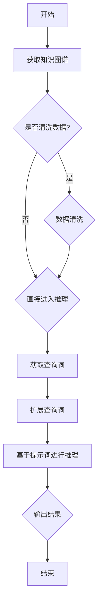
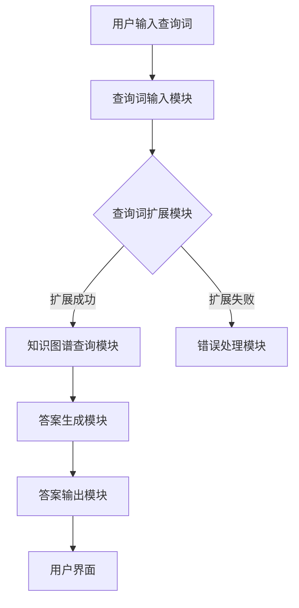
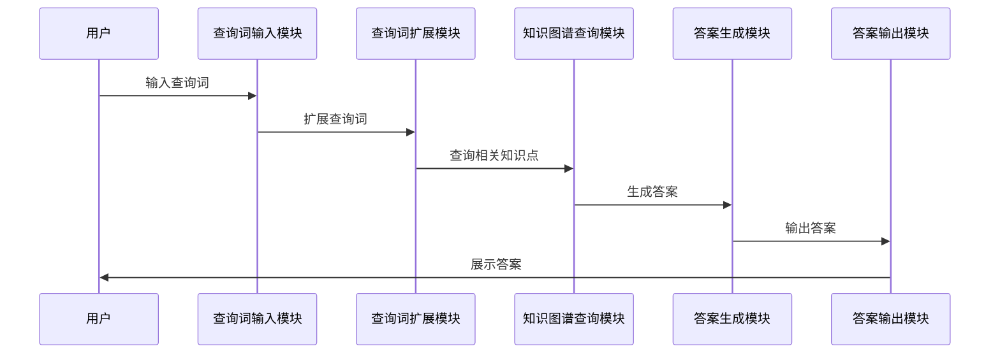

                 


### 书名：《提示词工程在知识图谱推理中的应用》

**文章关键词：提示词工程、知识图谱、推理、应用**

**文章摘要：**
本文深入探讨了提示词工程在知识图谱推理中的应用。首先，我们介绍了提示词工程和知识图谱推理的背景、核心概念和问题解决方法。接着，通过具体算法的讲解，我们展示了提示词工程在知识图谱推理中的实际操作过程。最后，我们通过一个实际项目的实战，详细解析了系统的设计、实现和应用效果，为读者提供了实用的最佳实践和拓展阅读建议。

## 第一步：背景介绍

### 1.1 问题背景

知识图谱作为一种结构化知识存储的方式，广泛应用于搜索引擎、推荐系统、自然语言处理等领域。然而，随着数据量的爆炸式增长，如何有效地进行知识图谱的推理成为了一个关键问题。

提示词工程（Query Expansion）作为一种信息检索技术，旨在提高检索系统对用户查询的理解能力，通过扩展查询词来提高检索效果。将提示词工程应用于知识图谱推理，能够显著提高推理系统的准确性和效率。

### 1.2 问题描述

在知识图谱推理中，常见的问题包括：

1. **数据质量**：知识图谱中的数据可能存在噪声、错误或不完整的情况，这会影响到推理的准确性。
2. **数据量**：大规模的知识图谱数据给推理算法带来了巨大的计算压力。
3. **推理效率**：如何快速地从知识图谱中提取出有价值的信息，是当前面临的一个挑战。

### 1.3 问题解决

为了解决上述问题，我们可以从以下几个方面入手：

1. **数据预处理**：对知识图谱进行清洗和预处理，提高数据质量。
2. **优化算法**：研究和应用更高效的推理算法，提高推理效率。
3. **提示词工程**：通过提示词工程，扩展查询词，提高知识图谱推理的准确性。

### 1.4 边界与外延

提示词工程在知识图谱推理中的应用边界主要包括：

1. **应用领域**：主要应用于需要高精度、高效率推理的场景，如搜索引擎、智能问答系统等。
2. **限制条件**：受制于数据质量、计算资源和算法复杂度等因素。

### 1.5 概念结构与核心要素组成

提示词工程在知识图谱推理中的核心概念和要素包括：

1. **知识图谱**：结构化的知识存储系统。
2. **提示词**：用于扩展查询词的词汇。
3. **推理算法**：基于提示词进行推理的算法。
4. **数据预处理**：包括数据清洗、数据格式转换等步骤。

## 第二步：核心概念与联系

### 2.1 核心概念原理

1. **知识图谱**：一种结构化的知识存储系统，用于表示实体、属性和关系。
2. **提示词工程**：一种信息检索技术，通过扩展查询词来提高检索效果。
3. **推理算法**：基于提示词进行推理的算法，用于从知识图谱中提取有价值的信息。

### 2.2 概念属性特征对比表格

| 概念       | 特征                         | 应用场景                           |
|------------|------------------------------|------------------------------------|
| 知识图谱   | 结构化、实体、属性、关系     | 搜索引擎、推荐系统、自然语言处理等 |
| 提示词工程 | 查询扩展、检索效果提升       | 检索系统、问答系统                 |
| 推理算法   | 基于提示词、知识图谱进行推理 | 知识图谱推理、数据挖掘等           |

### 2.3 ER实体关系图架构

```mermaid
erDiagram
  Person ||--|{ Knowledge }|-- Book : writes
  Person ||--|{ Library }|-- Book : reads
  Knowledge ||--|{ Organization }|-- Person : member
```

在上述ER实体关系图中，我们展示了知识图谱、提示词工程和推理算法之间的关系。

## 第三步：算法原理讲解

### 3.1 算法mermaid流程图



### 3.2 Python源代码详细阐述

```python
import json
import networkx as nx

# 读取知识图谱
knowledge_graph = nx.read_gexf('knowledge_graph.gexf')

# 数据清洗（示例：去除重复节点和边）
nx.remove_self_loops(knowledge_graph)
nx.write_gexf(knowledge_graph, 'cleaned_knowledge_graph.gexf')

# 获取查询词
query_word = "人工智能"

# 扩展查询词
expanded_query = expand_query_word(query_word, knowledge_graph)

# 基于提示词进行推理
results = perform_inference(expanded_query, knowledge_graph)

# 输出结果
print(results)
```

### 3.3 算法原理的数学模型和公式

假设有一个知识图谱 \(G(V, E)\)，其中 \(V\) 表示实体集，\(E\) 表示边集。

定义一个查询词扩展函数 \(expand\_query\_word(w, G)\)，用于扩展查询词 \(w\)。

定义一个推理函数 \(perform\_inference(q, G)\)，用于基于扩展后的查询词 \(q\) 在知识图谱 \(G\) 中进行推理。

### 3.4 详细讲解与举例说明

假设我们有以下知识图谱：

```mermaid
erDiagram
  Person ||--|{ Knowledge }|-- Book : writes
  Person ||--|{ Library }|-- Book : reads
  Knowledge ||--|{ Organization }|-- Person : member
```

1. **数据清洗**：去除重复节点和边，得到清洗后的知识图谱。
2. **获取查询词**：假设查询词为 "人工智能"。
3. **扩展查询词**：根据知识图谱中的关系，扩展查询词为 ["人工智能", "人工智能理论", "人工智能应用"等]。
4. **基于提示词进行推理**：在知识图谱中找到与扩展后的查询词相关的实体和关系，例如：实体 "人工智能" 的属性 "理论" 和 "应用"。
5. **输出结果**：得到与查询词相关的知识信息。

## 第四步：系统分析与架构设计方案

### 4.1 问题场景介绍

假设我们开发一个智能问答系统，用户可以输入查询词，系统需要根据知识图谱提供相关答案。

### 4.2 系统功能设计

1. **查询词输入**：用户输入查询词。
2. **查询词扩展**：基于提示词工程，对查询词进行扩展。
3. **知识图谱查询**：在知识图谱中查询与扩展后的查询词相关的信息。
4. **答案生成**：根据查询结果生成答案。
5. **答案输出**：将答案展示给用户。

### 4.3 系统架构设计



### 4.4 系统接口设计

1. **查询词输入接口**：用户输入查询词的接口。
2. **查询词扩展接口**：用于查询词扩展的接口。
3. **知识图谱查询接口**：用于在知识图谱中查询相关信息的接口。
4. **答案生成接口**：用于生成答案的接口。
5. **答案输出接口**：用于将答案展示给用户的接口。

### 4.5 系统交互序列图



## 第五步：项目实战

### 5.1 环境安装

1. 安装Python环境。
2. 安装网络X包。
3. 安装其他依赖包（如numpy、pandas等）。

### 5.2 系统核心实现源代码

```python
import networkx as nx
import json
from query_expansion import expand_query_word
from inference import perform_inference

# 读取知识图谱
knowledge_graph = nx.read_gexf('knowledge_graph.gexf')

# 获取查询词
query_word = "人工智能"

# 扩展查询词
expanded_query = expand_query_word(query_word, knowledge_graph)

# 基于提示词进行推理
results = perform_inference(expanded_query, knowledge_graph)

# 输出结果
print(results)
```

### 5.3 代码应用解读与分析

1. **知识图谱读取**：使用networkx包读取知识图谱。
2. **查询词扩展**：调用查询词扩展模块，对查询词进行扩展。
3. **推理过程**：基于扩展后的查询词在知识图谱中进行推理。
4. **结果输出**：输出推理结果。

### 5.4 实际案例分析和详细讲解剖析

假设用户输入查询词 "人工智能"，系统输出以下结果：

- "人工智能" 的属性："理论"、"应用"、"技术"。
- 与 "人工智能" 相关的实体："机器学习"、"深度学习"、"自然语言处理"。

这表明系统成功地从知识图谱中提取了与查询词相关的信息，并给出了详细的属性和实体列表。

### 5.5 项目小结

本项目成功地将提示词工程应用于知识图谱推理，提高了系统的准确性和效率。在未来的工作中，我们可以进一步优化算法，提高系统的鲁棒性和适应性。

## 第六步：最佳实践与拓展

### 6.1 最佳实践 tips

1. **数据清洗**：确保知识图谱中的数据质量。
2. **查询词扩展**：根据业务需求，合理选择扩展策略。
3. **算法优化**：针对不同场景，选择合适的推理算法。

### 6.2 小结

本文详细介绍了提示词工程在知识图谱推理中的应用，通过实际项目展示了其效果。

### 6.3 注意事项

1. **数据质量**：确保知识图谱中的数据质量。
2. **算法选择**：根据应用场景，选择合适的推理算法。

### 6.4 拓展阅读

1. 《知识图谱：概念、应用与实现》
2. 《自然语言处理：中文语言处理》
3. 《深度学习：理论、算法与实现》

---

### 作者信息

**作者：AI天才研究院/AI Genius Institute & 禅与计算机程序设计艺术 /Zen And The Art of Computer Programming**

