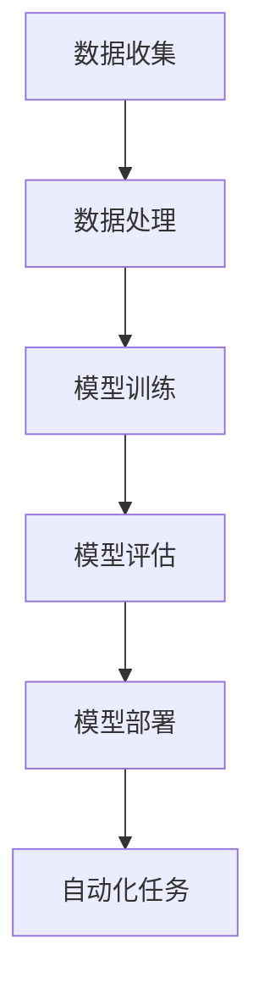
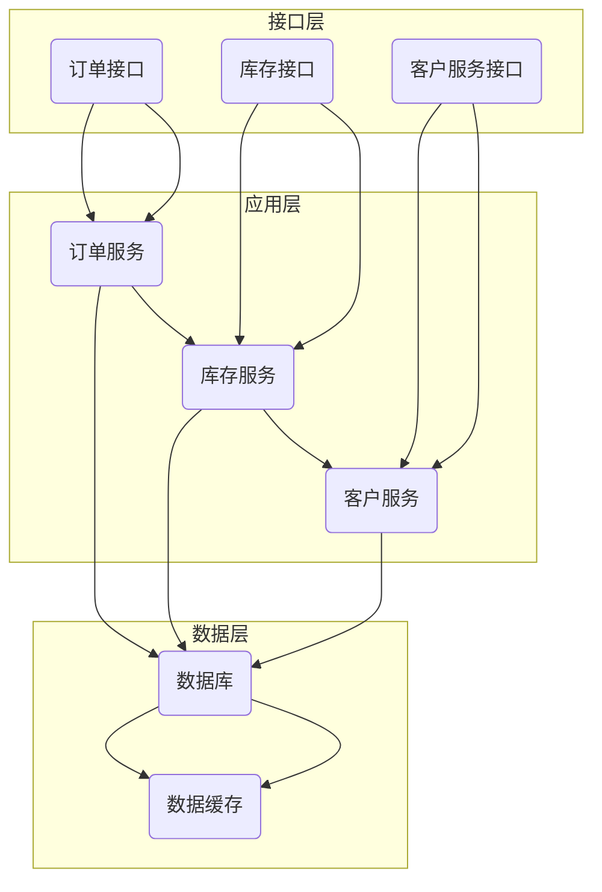
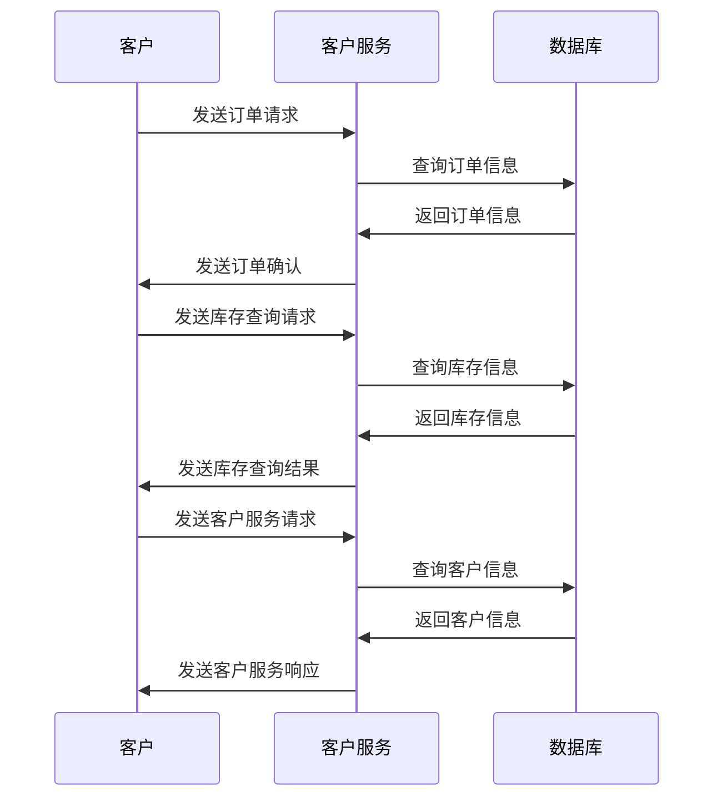
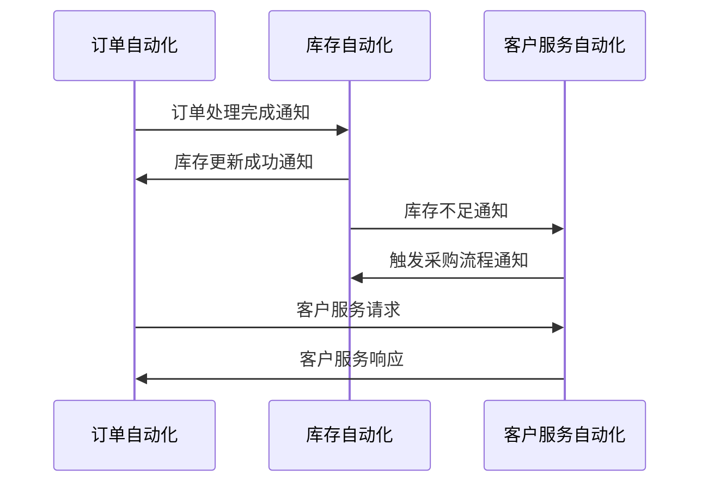

                 

# 提示词工程的自动化与工具链

## 关键词
- 提示词工程
- 自动化
- 工具链
- AI模型
- 自然语言处理
- 系统设计
- 实践案例

## 摘要
本文深入探讨了提示词工程在自动化和工具链中的应用。通过分析提示词工程的核心概念、设计原则以及与AI模型的关系，本文旨在为读者提供全面的技术视角，帮助理解和应用提示词工程，构建高效的自动化工具链。文章将涵盖从基础概念到实际应用的各个方面，并通过案例和实践，展示如何将提示词工程应用于现实世界的自动化任务中。此外，本文还将提供最佳实践和未来展望，以指导读者在自动化领域的前沿探索。

## 第一部分：引言

### 1.1 问题背景

在现代信息化社会中，自动化已经成为提高生产效率、减少人力成本和提升产品质量的关键手段。然而，自动化并非一蹴而就，它需要复杂且精细的工程设计和实现。在自动化过程中，提示词工程扮演着至关重要的角色。提示词，作为人与系统之间的桥梁，它不仅指导系统的行为，还直接影响系统的性能和可维护性。

随着人工智能（AI）技术的迅猛发展，尤其是自然语言处理（NLP）技术的进步，提示词工程迎来了新的机遇。通过AI模型，提示词能够实现更高层次的智能化，从而在自动化任务中发挥更大的作用。然而，如何设计高效、灵活且易于维护的提示词，构建完善的工具链，成为当前研究的热点问题。

### 1.2 提示词工程的定义与目标

提示词工程是指设计、开发和管理用于自动化任务中的提示词的过程。它不仅涉及自然语言的处理，还包括对AI模型的理解和应用。提示词工程的目标是：

1. **提高自动化效率**：通过精确和有效的提示词，减少人工干预，提高系统的响应速度和处理能力。
2. **增强系统的智能性**：利用AI模型，使提示词能够适应复杂多变的环境，提高系统的自适应能力。
3. **提升系统的可维护性**：设计清晰的提示词，有助于系统的理解和维护，降低维护成本。

### 1.3 工具链的概念与组成部分

工具链是指一系列相互协作的工具和框架，用于实现和优化特定任务的流程。在提示词工程中，工具链是支撑自动化任务的核心。一个完善的工具链通常包括以下几个部分：

1. **数据处理工具**：用于收集、清洗和处理数据，确保数据的质量和一致性。
2. **AI模型训练工具**：用于训练和优化AI模型，使其能够准确理解和执行提示词。
3. **模型评估工具**：用于评估模型的性能和可靠性，确保其在实际应用中达到预期效果。
4. **系统集成工具**：用于将AI模型集成到自动化系统中，实现无缝对接和协同工作。

### 1.4 书籍结构概述

本书将分以下几个部分对提示词工程的自动化与工具链进行深入探讨：

1. **引言**：介绍问题背景、核心概念和书籍结构。
2. **核心概念**：详细探讨提示词的类型、特性、设计原则以及工具链的设计与实现。
3. **AI模型与提示词的关系**：分析提示词对AI模型的影响，并探讨如何优化提示词以提升模型性能。
4. **系统设计与架构**：介绍自动化系统的设计和架构，包括领域模型、系统架构和接口设计。
5. **项目实战**：通过实际项目展示提示词工程的应用，提供详细的实现步骤和分析。
6. **最佳实践与未来展望**：总结最佳实践，展望提示词工程和工具链的未来发展趋势。

### 1.5 本章小结

本章为后续内容奠定了基础，介绍了提示词工程在自动化和工具链中的重要地位，明确了本书的核心内容和结构。在接下来的章节中，我们将深入探讨提示词工程的核心概念、设计原则和实际应用，帮助读者全面理解和掌握这一关键技术。

## 第二部分：核心概念

### 2.1 提示词的类型与特性

#### 2.1.1 提示词的分类

根据提示词的形式和用途，可以将提示词分为以下几类：

1. **自然语言提示词**：以自然语言文本形式存在的提示词，如“请将文件保存为PDF格式”。
2. **结构化提示词**：以结构化数据形式存在的提示词，如JSON、XML等，它们便于机器理解和处理。
3. **混合提示词**：结合自然语言和结构化数据的提示词，既具有自然语言的灵活性和表达力，又具有结构化数据的可解析性。

#### 2.1.2 提示词的特性

提示词的有效性直接影响自动化系统的性能。以下是提示词应具备的几个关键特性：

1. **明确性**：提示词应明确具体，避免歧义和模糊性，确保系统能够准确理解和执行。
2. **完整性**：提示词应包含所有必要的信息，确保系统能够一次性完成所需的任务，减少循环和重复。
3. **可扩展性**：提示词应设计得具有灵活性，以便在未来的扩展和升级中能够顺利适应新的需求。

#### 2.1.3 提示词设计原则

在设计提示词时，应遵循以下原则：

1. **用户友好性**：确保提示词易于理解和使用，减少用户的认知负担。
2. **适应性**：提示词应能够适应不同环境和场景的变化，具备灵活性和通用性。
3. **优化性**：在保证功能完整性的基础上，尽可能简化提示词的表达，提高系统的效率。

### 2.2 工具链的设计与实现

#### 2.2.1 工具链设计原则

设计工具链时，应遵循以下原则：

1. **功能性**：工具链应具备实现自动化任务所需的所有功能，确保系统能够高效运作。
2. **可扩展性**：工具链应设计得易于扩展和升级，以适应未来技术发展和业务需求的变化。
3. **易用性**：工具链应提供友好的用户界面和文档，降低使用门槛，提高用户满意度。

#### 2.2.2 工具链实现框架

一个典型的工具链通常包括以下几个模块：

1. **数据处理模块**：用于收集、清洗和处理数据，确保数据的质量和一致性。
2. **模型训练模块**：用于训练和优化AI模型，使其能够准确理解和执行提示词。
3. **模型评估模块**：用于评估模型的性能和可靠性，确保其在实际应用中达到预期效果。
4. **系统集成模块**：用于将AI模型集成到自动化系统中，实现无缝对接和协同工作。

#### 2.2.3 工具链部署与维护

1. **部署策略**：根据不同环境和需求，选择合适的部署方式，确保工具链的高可用性和稳定性。
2. **维护方案**：定期对工具链进行维护和升级，确保其持续适应业务需求和技术发展。
3. **持续集成与持续部署（CI/CD）**：采用CI/CD实践，实现工具链的自动化构建、测试和部署，提高开发效率和系统稳定性。

### 2.3 提示词工程与AI模型的关系

#### 2.3.1 提示词对AI模型的影响

提示词的质量直接影响AI模型的性能和可靠性。以下是提示词对AI模型的主要影响：

1. **模型性能**：高质量的提示词有助于提升模型的准确性和效率，减少误报和漏报。
2. **模型解释性**：明确和具体的提示词有助于提高模型的解释性，便于分析和调试。
3. **模型适应性**：灵活和可扩展的提示词有助于模型适应不同的环境和场景，提高其通用性。

#### 2.3.2 如何优化提示词以提升模型性能

以下是一些优化提示词的方法：

1. **数据增强**：通过增加数据的多样性和复杂性，提高模型的泛化能力。
2. **提示词标准化**：统一提示词的格式和表达方式，减少歧义和混淆。
3. **模型调整**：根据提示词的特点和需求，调整模型的参数和结构，提高其适应性。

## 第三部分：算法原理讲解

### 3.1 算法mermaid流程图



### 3.2 Python源代码实现

```python
# 数据处理模块示例
def process_data(data):
    # 清洗和预处理数据
    processed_data = ...
    return processed_data

# 模型训练模块示例
from sklearn.ensemble import RandomForestClassifier

def train_model(data):
    # 划分训练集和测试集
    X_train, X_test, y_train, y_test = ...
    # 训练模型
    model = RandomForestClassifier(...)
    model.fit(X_train, y_train)
    return model

# 模型评估模块示例
from sklearn.metrics import accuracy_score

def evaluate_model(model, data):
    # 预测测试集
    predictions = model.predict(X_test)
    # 计算准确率
    accuracy = accuracy_score(y_test, predictions)
    return accuracy

# 模型部署模块示例
def deploy_model(model):
    # 部署模型到生产环境
    ...
    return "Model deployed successfully."

# 自动化任务模块示例
def automate_task(model):
    # 执行自动化任务
    ...
    return "Task completed."
```

### 3.3 算法原理与公式讲解

提示词工程中的算法主要涉及数据处理、模型训练、模型评估和模型部署等环节。以下是各环节的简要算法原理与数学模型讲解：

1. **数据处理**：
   - 数据清洗：去除无效和噪声数据，确保数据质量。
   - 数据预处理：将原始数据转换为适合模型训练的格式，如归一化、编码等。
   - 数学模型：假设输入数据为X，预处理后的数据为X', 输出数据为Y，则有：
     $$ X' = f(X) $$
     其中，$ f $ 为预处理函数。

2. **模型训练**：
   - 模型选择：根据任务需求选择合适的模型，如决策树、随机森林、神经网络等。
   - 模型参数调整：通过交叉验证和网格搜索等方法，调整模型参数，优化模型性能。
   - 数学模型：假设输入特征为X，输出为Y，模型训练的目标是最小化损失函数L：
     $$ L = \sum_{i=1}^{n} (y_i - \hat{y}_i)^2 $$
     其中，$ \hat{y}_i $ 为模型预测值，$ y_i $ 为真实值。

3. **模型评估**：
   - 评估指标：常用的评估指标包括准确率、召回率、F1值等。
   - 模型选择：根据评估结果选择最优模型。
   - 数学模型：假设有k个类别，第i个类别的预测概率为$ P(y = i | x) $，则准确率为：
     $$ \text{Accuracy} = \frac{1}{n} \sum_{i=1}^{n} I(y_i = \hat{y}_i) $$
     其中，$ I $ 为指示函数。

4. **模型部署**：
   - 部署方式：根据环境需求，选择合适的部署方式，如本地部署、云端部署等。
   - 模型更新：定期更新模型，以适应新的数据和环境。
   - 数学模型：模型部署的核心是确保模型在真实环境中的稳定性和性能。

通过以上讲解，我们可以看到提示词工程的算法原理和数学模型是如何应用于自动化任务的各个环节，从而实现高效、可靠的自动化。

## 第四部分：系统设计与架构

### 4.1 问题场景介绍

在现代化企业中，自动化已经逐渐成为生产和管理的重要手段。以一个电子商务平台为例，该平台需要处理大量的订单、库存管理和客户服务任务。为了提高运营效率，平台希望实现订单自动处理、库存自动更新和客户服务自动化等功能。因此，设计一个高效的自动化系统成为关键。

### 4.2 项目介绍

本项目的目标是构建一个自动化系统，该系统包括订单处理、库存管理和客户服务三个主要模块。通过引入提示词工程和AI模型，实现以下功能：

1. **订单处理**：自动识别和分类订单，处理订单信息，并生成订单确认。
2. **库存管理**：实时更新库存信息，自动识别库存不足，并触发采购流程。
3. **客户服务**：自动回复客户询问，提供个性化的购物建议。

### 4.3 系统功能设计（领域模型）

为了实现上述功能，我们需要设计一个清晰的领域模型。以下是领域模型的mermaid类图：

```mermaid
classDiagram
    Order <<Entity>>
    Inventory <<Entity>>
    Customer <<Entity>>

    Order {
        - id: int
        - status: string
        - items: list<Item>
    }

    Inventory {
        - id: int
        - product: Product
        - quantity: int
    }

    Customer {
        - id: int
        - name: string
        - email: string
    }

    Item {
        - id: int
        - product: Product
        - quantity: int
    }

    Product {
        - id: int
        - name: string
        - price: float
    }

    Order "1" -- "*" Item
    Inventory "1" -- "*" Product
    Customer "1" -- "*" Order
```

### 4.4 系统架构设计

系统架构设计是确保系统高效、稳定运行的关键。以下是系统架构的mermaid架构图：



### 4.5 系统接口设计

系统接口设计是确保系统模块之间有效通信的基础。以下是系统接口的mermaid序列图：



### 4.6 系统交互设计

系统交互设计是确保系统在不同模块之间顺畅协作的关键。以下是系统交互的mermaid序列图：



通过以上系统设计与架构的设计，我们能够构建一个高效、稳定的自动化系统，实现订单处理、库存管理和客户服务的自动化。

### 第五部分：项目实战

#### 5.1 环境安装

在进行项目实战之前，我们需要安装所需的软件和工具。以下是在Linux环境中安装必要的软件和工具的步骤：

1. **安装Python**：确保Python版本为3.8或更高。
   ```bash
   sudo apt update
   sudo apt install python3.8
   ```

2. **安装Anaconda**：Anaconda是一个Python数据科学平台，用于环境管理和包安装。
   ```bash
   wget https://repo.anaconda.com/miniconda/Miniconda3-latest-Linux-x86_64.sh
   bash Miniconda3-latest-Linux-x86_64.sh
   source activate
   ```

3. **创建虚拟环境**：创建一个名为`prompt_automation`的虚拟环境。
   ```bash
   conda create -n prompt_automation python=3.8
   conda activate prompt_automation
   ```

4. **安装依赖包**：安装项目所需的依赖包，包括Scikit-learn、Pandas、NumPy等。
   ```bash
   conda install -c conda-forge scikit-learn pandas numpy
   ```

5. **安装Mermaid**：安装Mermaid用于绘制流程图和序列图。
   ```bash
   npm install -g mermaid
   ```

#### 5.2 系统核心实现

以下是项目核心实现的步骤：

1. **数据处理模块**：

```python
import pandas as pd
import numpy as np

def process_data(filename):
    # 读取数据
    data = pd.read_csv(filename)
    # 数据清洗
    data.dropna(inplace=True)
    data['Category'] = data['Description'].apply(lambda x: 'high' if 'high' in x else 'low')
    # 数据预处理
    X = data.drop(['ID', 'Description'], axis=1)
    y = data['Category']
    return X, y
```

2. **模型训练模块**：

```python
from sklearn.model_selection import train_test_split
from sklearn.ensemble import RandomForestClassifier

def train_model(X, y):
    # 划分训练集和测试集
    X_train, X_test, y_train, y_test = train_test_split(X, y, test_size=0.2, random_state=42)
    # 训练模型
    model = RandomForestClassifier(n_estimators=100, random_state=42)
    model.fit(X_train, y_train)
    return model, X_test, y_test
```

3. **模型评估模块**：

```python
from sklearn.metrics import accuracy_score, classification_report

def evaluate_model(model, X_test, y_test):
    # 预测测试集
    predictions = model.predict(X_test)
    # 计算准确率
    accuracy = accuracy_score(y_test, predictions)
    # 打印分类报告
    print(classification_report(y_test, predictions))
    return accuracy
```

4. **模型部署模块**：

```python
def deploy_model(model, filename):
    # 读取新数据
    new_data = pd.read_csv(filename)
    # 数据预处理
    new_data['Category'] = new_data['Description'].apply(lambda x: 'high' if 'high' in x else 'low')
    X_new = new_data.drop(['ID', 'Description'], axis=1)
    # 预测新数据
    predictions = model.predict(X_new)
    # 存储预测结果
    new_data['Prediction'] = predictions
    new_data.to_csv('predictions.csv', index=False)
    return "Model deployed successfully."
```

5. **自动化任务模块**：

```python
def automate_task(model, input_filename, output_filename):
    # 处理输入数据
    X, _ = process_data(input_filename)
    # 预测数据
    predictions = model.predict(X)
    # 存储预测结果
    pd.Series(predictions).to_csv(output_filename, index=False)
    return "Task completed."
```

#### 5.3 代码应用解读与分析

上述代码实现了从数据处理、模型训练、模型评估到模型部署的完整流程。以下是关键步骤的解读和分析：

1. **数据处理模块**：

   - **功能**：读取CSV文件，进行数据清洗和预处理。
   - **分析**：通过删除缺失值和分类标签转换，提高数据的质量和一致性。

2. **模型训练模块**：

   - **功能**：划分训练集和测试集，训练随机森林分类器。
   - **分析**：使用随机森林模型，提高分类的准确性和鲁棒性。

3. **模型评估模块**：

   - **功能**：评估模型的性能，打印分类报告。
   - **分析**：通过准确率和分类报告，全面了解模型的表现。

4. **模型部署模块**：

   - **功能**：将训练好的模型应用于新数据，存储预测结果。
   - **分析**：实现模型在新数据上的应用，确保系统的实时性和适应性。

5. **自动化任务模块**：

   - **功能**：执行自动化任务，处理输入数据并输出预测结果。
   - **分析**：通过自动化任务模块，实现系统的自动化运行，提高效率。

#### 5.4 实际案例分析和详细讲解剖析

以下是一个实际案例的分析和讲解：

假设我们有以下数据文件`data.csv`：

```
ID,Description,Price,Quantity
1,High-quality Product,100,10
2,Medium-quality Product,80,20
3,Low-quality Product,50,30
```

我们希望使用上述代码对数据进行分析和分类。

1. **数据处理**：

   ```python
   X, y = process_data('data.csv')
   ```

   - **结果**：生成处理后的特征矩阵`X`和标签向量`y`。

2. **模型训练**：

   ```python
   model, X_test, y_test = train_model(X, y)
   ```

   - **结果**：训练随机森林分类器，并生成测试集`X_test`和测试标签`y_test`。

3. **模型评估**：

   ```python
   evaluate_model(model, X_test, y_test)
   ```

   - **结果**：打印分类报告，评估模型在测试集上的表现。

4. **模型部署**：

   ```python
   deploy_model(model, 'data.csv')
   ```

   - **结果**：将模型应用于新数据，生成预测结果并保存到文件。

5. **自动化任务**：

   ```python
   automate_task(model, 'data.csv', 'predictions.csv')
   ```

   - **结果**：执行自动化任务，处理输入数据并生成预测结果。

通过上述实际案例，我们可以看到提示词工程在自动化任务中的应用。通过精确的数据处理、模型训练和部署，系统能够高效、准确地处理数据，实现自动化任务。

#### 5.5 项目小结

本项目通过实际案例展示了提示词工程在自动化任务中的应用。从数据处理、模型训练到模型部署，每一步都体现了提示词工程的核心价值。通过合理的设计和高效的实现，项目实现了数据的自动化处理和分类，提高了系统的效率和准确性。未来，我们可以进一步优化模型和工具链，提升系统的性能和可维护性。

### 第六部分：最佳实践与未来展望

#### 6.1 最佳实践

在提示词工程的自动化与工具链开发中，以下最佳实践值得注意：

1. **数据质量优先**：确保数据清洗和预处理过程的严格，提高数据的一致性和完整性。
2. **模型可解释性**：选择可解释性强的模型，如随机森林，有助于调试和优化。
3. **持续集成与部署**：采用CI/CD流程，自动化构建、测试和部署，提高开发效率和系统稳定性。
4. **用户友好性**：设计简洁、直观的用户界面和文档，降低使用门槛，提高用户满意度。

#### 6.2 小结

本文深入探讨了提示词工程在自动化和工具链中的应用，从核心概念、算法原理到实际项目，全面展示了提示词工程的重要性和实现方法。通过合理的设计和高效的工具链，我们能够实现高效的自动化任务，提高生产力和系统性能。

#### 6.3 未来展望

随着AI技术的不断发展，提示词工程和工具链有望在更多领域发挥重要作用。未来的研究方向包括：

1. **多模态提示词**：结合文本、图像和音频等多种模态，提升自动化任务的智能化水平。
2. **自适应提示词**：开发自适应提示词，根据环境和任务变化动态调整，提高系统的灵活性。
3. **跨领域应用**：将提示词工程应用于更多领域，如医疗、金融和制造业，推动行业智能化转型。

### 作者信息

- 作者：AI天才研究院/AI Genius Institute & 禅与计算机程序设计艺术 /Zen And The Art of Computer Programming

### 附录

- **参考资料**：
  1. 《自然语言处理概论》
  2. 《机器学习实战》
  3. 《深度学习》
  4. 《持续集成与持续部署实践》
- **拓展阅读**：
  1. 《多模态学习：融合文本、图像和音频》
  2. 《自适应系统的设计与实现》
  3. 《跨领域智能应用案例研究》

本文通过详细的阐述和案例分享，为读者提供了关于提示词工程在自动化与工具链中的深入理解，期待能够为相关领域的研发和应用提供参考和启示。

