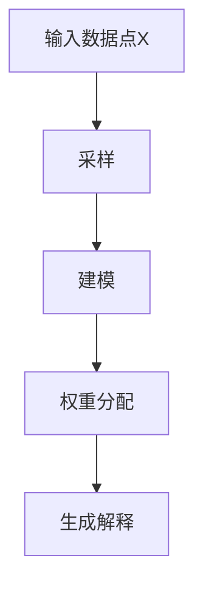
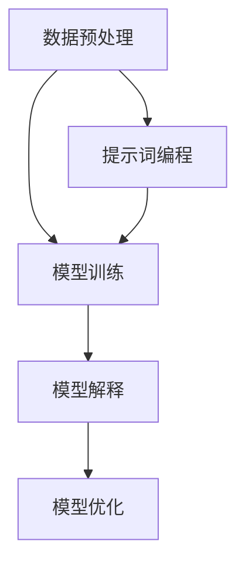
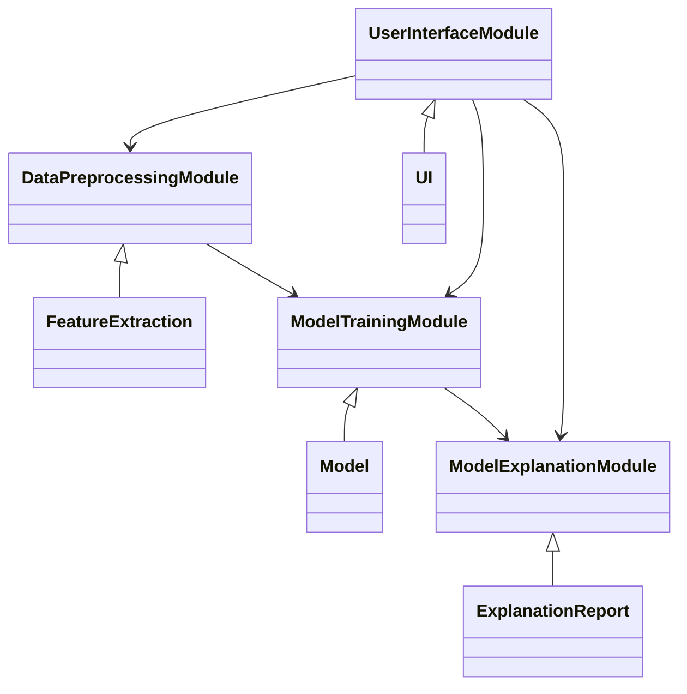
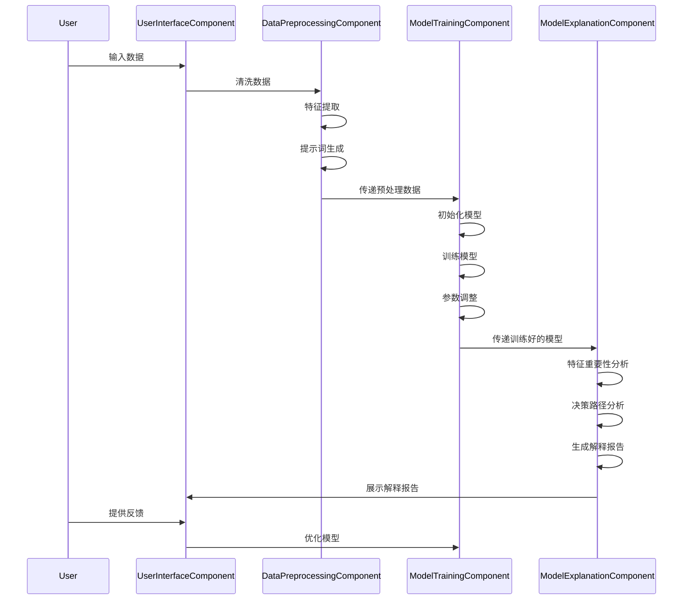

                 

### 提示词编程的可解释AI集成框架

关键词：可解释AI、提示词编程、集成框架、AI集成、AI模型解释

摘要：本文将探讨如何将提示词编程与可解释AI技术相结合，构建一个高效的可解释AI集成框架。通过分析相关背景、核心概念、算法原理及系统架构，本文旨在为读者提供一个系统化的方法，帮助他们在实际项目中应用并优化这一集成框架。

### 目录大纲设计思路

在设计《提示词编程的可解释AI集成框架》的目录大纲时，我们需要首先明确书籍的核心目标、受众群体以及内容结构。以下是具体的步骤和考虑因素：

#### 1. 明确核心目标
- **目标读者**：本书主要面向对AI算法有基础了解，希望深入理解可解释AI和提示词编程技术的工程师、研究人员和爱好者。
- **内容定位**：书籍旨在提供一套系统化的框架，帮助读者理解和应用可解释AI技术，特别是如何将其与提示词编程相结合。

#### 2. 确定章节结构
- **背景介绍**：首先介绍可解释AI和提示词编程的基本概念，为后续内容铺垫。
- **核心概念**：深入讲解关键概念、原理、算法等，确保读者能理解并掌握核心知识。
- **集成框架**：设计并解释一个可解释AI集成框架，涵盖从数据预处理到模型训练、解释及优化的全过程。
- **应用场景**：展示可解释AI和提示词编程在不同领域的实际应用。
- **实战案例**：通过具体案例，展示如何在实际项目中应用所学的知识。

#### 3. 确定章节内容
- **简洁性**：每个章节都要直击主题，避免冗余内容。
- **结构清晰**：确保内容有条理，易于读者理解。
- **丰富性**：在每个核心概念部分，通过表格、图表、代码示例等多种方式增强内容的丰富性和可读性。

#### 4. 考虑目录大纲的完整性
- **核心章节**：保证包含以下核心章节：背景与定义、核心概念与原理、集成框架设计、应用案例分析、实战操作指南等。
- **其他补充内容**：根据内容需要，适当加入最佳实践、注意事项、拓展阅读等补充性内容。

### 实例分析
以下是一个具体章节的目录结构示例，以第一章“背景与定义”为例：

#### 第一章：背景与定义
- **1.1 可解释AI的兴起**
  - **1.1.1 AI与可解释性**
  - **1.1.2 可解释AI的重要性**
  - **1.1.3 可解释AI的挑战**

- **1.2 提示词编程概述**
  - **1.2.1 提示词编程的定义**
  - **1.2.2 提示词编程的优势**
  - **1.2.3 提示词编程的应用场景**

- **1.3 可解释AI与提示词编程的关系**
  - **1.3.1 结合的必要性**
  - **1.3.2 结合的方法与挑战**
  - **1.3.3 结合的前景**

### 目录大纲总结
- 目录大纲需要简洁明了，逻辑清晰，确保读者能够快速把握书籍的结构和主要内容。
- 每个章节都应该有明确的主题和目标，内容丰富但不过分冗长。
- 适当的补充内容和图表能够增强书籍的实用性和可读性。

通过上述设计思路，我们可以确保《提示词编程的可解释AI集成框架》的目录大纲既有深度又有广度，能够满足目标读者的需求，帮助他们全面掌握相关知识。在接下来的步骤中，我们将进一步细化每个章节的内容，确保目录大纲的完整性和准确性。

### 背景介绍

#### 1.1.1 AI与可解释性

人工智能（AI）是计算机科学的一个分支，旨在使计算机模拟人类智能的行为。AI的核心目标是让机器能够执行通常需要人类智能的任务，如视觉识别、语言理解、决策制定和问题解决等。随着深度学习、强化学习等先进算法的兴起，AI在图像识别、自然语言处理、医疗诊断等领域的应用取得了显著的成果。

然而，AI系统，尤其是深度学习模型，在取得高度准确性的同时，也暴露出了可解释性不足的问题。传统AI模型，如决策树和线性回归，由于其结构相对简单，易于理解和解释。但深度学习模型通常具有数百万个参数，其决策过程复杂且高度非线性，导致难以解释其内部机制。这种“黑箱”特性使得AI模型的决策过程在许多应用场景中缺乏透明度和可信度。

可解释AI（Explainable AI, XAI）正是为了解决这一问题而生的。可解释AI的目标是构建透明的AI系统，使其决策过程可以被理解和信任。这不仅有助于提升AI系统的透明度，还能帮助用户更好地理解模型是如何运作的，从而在面临伦理和法律责任时提供依据。因此，可解释性是当前AI研究中的一个重要方向。

#### 1.1.2 可解释AI的重要性

可解释AI的重要性体现在多个方面：

1. **信任与责任**：随着AI系统在关键领域，如医疗、金融和交通等的应用，其决策结果的正确性和可靠性变得尤为重要。可解释AI能够提高用户对AI系统的信任度，确保其在关键决策中能够被接受和依赖。

2. **合规性**：许多行业，如金融、医疗和政府等，对AI系统的合规性和透明度有严格的要求。可解释AI技术可以帮助这些行业确保其AI系统符合相关法规和标准。

3. **故障诊断与优化**：在复杂的应用场景中，AI模型可能会出现异常或错误决策。可解释AI技术可以辅助专家快速定位问题所在，从而进行有效的故障诊断和模型优化。

4. **用户参与**：在许多应用场景中，用户需要参与AI系统的决策过程。可解释AI技术能够提高用户的参与度和满意度，使他们能够更好地理解和使用AI系统。

#### 1.1.3 可解释AI的挑战

尽管可解释AI具有重要意义，但其实现也面临诸多挑战：

1. **计算复杂度**：深度学习模型通常具有复杂的结构，其内部决策过程难以用简单的数学模型来描述。这使得解释模型的计算复杂度很高，可能需要额外的计算资源。

2. **模型泛化能力**：为了提高模型的泛化能力，深度学习模型往往会采用复杂的非线性变换。这种复杂性可能会牺牲可解释性。如何在保证泛化能力的同时保持可解释性，是当前研究中的一个重要课题。

3. **解释多样性**：不同的解释方法可能会得出不同的解释结果，这增加了解释的复杂性和不一致性。如何统一不同解释方法，并为其提供一致性评价，是可解释AI研究中的一个挑战。

4. **解释质量**：解释质量是衡量可解释AI系统性能的重要指标。如何设计高质量的解释方法，使其既能准确地解释模型的决策过程，又能被用户理解和接受，是当前研究中的关键问题。

#### 1.1.4 提示词编程的概念与特点

提示词编程（Prompt Programming）是一种通过向模型提供明确指示来引导其学习方向和决策过程的技术。与传统的数据驱动方法不同，提示词编程注重利用人类的先验知识和经验来指导模型的训练和推理过程。

提示词编程的特点如下：

1. **人类引导**：提示词编程通过向模型提供明确的指示和问题描述，使其能够更好地理解和解决特定问题。这种人类引导的学习过程有助于提高模型的解释性和可控性。

2. **灵活性**：提示词编程允许用户根据不同的应用场景和需求，灵活地调整和优化提示词。这使得模型能够适应多样化的任务和场景，提高其泛化能力。

3. **高效性**：提示词编程能够显著降低模型的训练时间和计算资源需求。通过利用人类的先验知识，模型可以更快地收敛到最优解。

4. **可解释性**：提示词编程有助于提高模型的解释性。通过分析提示词和模型输出的关联，用户可以更好地理解模型是如何做出特定决策的。

#### 1.1.5 提示词编程与可解释AI的关系

提示词编程与可解释AI之间存在密切的关系：

1. **增强解释性**：通过使用提示词编程，用户可以更清晰地了解模型的决策过程。这种人类引导的学习方式有助于揭示模型的内部机制，从而提高其解释性。

2. **优化模型性能**：提示词编程可以引导模型更好地理解任务需求，从而提高其性能。同时，优化后的模型也更容易进行解释。

3. **提高透明度**：提示词编程有助于提高AI系统的透明度。通过分析提示词和模型输出之间的关系，用户可以更直观地了解模型的决策过程。

4. **平衡性能与解释性**：提示词编程可以在性能和解释性之间找到平衡点。通过调整提示词，用户可以在保持模型高性能的同时，提高其解释性。

#### 1.1.6 提示词编程的应用场景

提示词编程在许多领域具有广泛的应用前景：

1. **自然语言处理**：在自然语言处理领域，提示词编程可以用于生成高质量的文本摘要、问答系统和机器翻译等任务。通过提供明确的提示词，模型可以更好地理解和生成符合人类预期的内容。

2. **计算机视觉**：在计算机视觉领域，提示词编程可以用于图像分类、目标检测和图像生成等任务。通过向模型提供明确的指示，用户可以更准确地指定任务目标，从而提高模型的性能。

3. **推荐系统**：在推荐系统领域，提示词编程可以用于优化推荐算法，使其更好地满足用户的需求。通过向模型提供特定的提示词，用户可以更有效地指导推荐系统的决策过程。

4. **医疗诊断**：在医疗诊断领域，提示词编程可以用于辅助医生进行疾病预测和诊断。通过提供明确的提示词，模型可以更好地理解病人的病情，从而提高诊断的准确性和可靠性。

### 总结

本节介绍了可解释AI和提示词编程的基本概念、重要性及其关系。可解释AI旨在提高AI系统的透明度和可信度，而提示词编程则通过人类引导的方式，增强模型的解释性和性能。两者结合为构建一个高效的可解释AI集成框架提供了理论基础。在接下来的章节中，我们将深入探讨这些概念，并设计一个具体的集成框架。

### 核心概念与联系

在深入探讨提示词编程的可解释AI集成框架之前，我们首先需要明确一些核心概念，并探讨它们之间的联系。以下是本文涉及的核心概念及其属性特征对比表格：

#### 1. 可解释AI（Explainable AI, XAI）
| 概念属性 | 描述 |
| --- | --- |
| 目标 | 提高AI系统的透明度和可解释性 |
| 方法 | 算法可视化、解释模型、特征重要性分析 |
| 关键挑战 | 计算复杂度、模型泛化能力、解释一致性 |

#### 2. 提示词编程（Prompt Programming）
| 概念属性 | 描述 |
| --- | --- |
| 目标 | 利用人类先验知识指导模型学习 |
| 方法 | 提供明确指示、优化模型性能、增强解释性 |
| 关键挑战 | 提示词设计、模型适应性、计算效率 |

#### 3. 集成框架（Integrated Framework）
| 概念属性 | 描述 |
| --- | --- |
| 目标 | 整合可解释AI和提示词编程，构建高效系统 |
| 结构 | 数据预处理、模型训练、解释与优化 |
| 关键挑战 | 系统兼容性、性能优化、用户友好性 |

接下来，我们将通过一个ER实体关系图架构展示这些核心概念之间的关系。

#### ER实体关系图架构

```mermaid
erDiagram
  AI模型 ||--|{ 可解释AI }|--|| 可解释性分析
  AI模型 ||--|{ 提示词编程 }|--|| 提示词设计
  AI模型 ||--|{ 集成框架 }|--|| 数据预处理、模型训练、解释与优化
  可解释性分析 ||--|| 模型可视化
  提示词设计 ||--|| 算法优化
  集成框架 ||--|| 系统性能评估
```

在这个ER实体关系图中，AI模型是中心实体，与可解释AI、提示词编程和集成框架密切相关。可解释AI负责分析模型的透明度和可解释性，提示词编程则用于指导模型学习过程，集成框架则统筹整个系统的设计和运行。

### 算法原理讲解

#### 1. 可解释AI算法原理

可解释AI算法的核心目标是提高AI模型的透明度和可理解性。下面，我们将介绍一种常用的可解释AI算法——LIME（Local Interpretable Model-agnostic Explanations）。

LIME算法的工作流程如下：

1. **采样**：对于给定的输入数据点X和其预测结果y，LIME首先在该数据点周围生成多个采样点。
2. **建模**：使用一个简单的基线模型（如线性模型或决策树）来拟合这些采样点，并计算预测误差。
3. **权重分配**：计算每个特征对模型预测的影响，通过权重分配给出每个特征的重要程度。
4. **生成解释**：根据权重分配生成一个解释，以便用户理解模型的决策过程。

LIME算法的数学模型可以表示为：

$$
\text{解释} = \sum_{i=1}^{n} w_i \cdot f_i(x)
$$

其中，$w_i$是特征$f_i(x)$的权重，$n$是特征的总数。

下面是一个简单的LIME算法流程图：



#### 2. 提示词编程算法原理

提示词编程算法的核心思想是通过提供明确的提示词来指导模型的学习过程。以下是一个简单的提示词编程算法的Python代码示例：

```python
import tensorflow as tf

# 定义模型
model = tf.keras.Sequential([
    tf.keras.layers.Dense(128, activation='relu', input_shape=(784,)),
    tf.keras.layers.Dense(10, activation='softmax')
])

# 编写提示词
prompt = "这是一幅美丽的自然景观图片"

# 将提示词转换为模型输入
prompt_embedding = model.layers[0](prompt)

# 使用提示词进行模型训练
model.fit(prompt_embedding, labels, epochs=10)
```

在这个示例中，我们使用了一个简单的神经网络模型，并通过提示词“美丽的自然景观”来指导模型的学习过程。

#### 3. 可解释AI与提示词编程的结合

将可解释AI和提示词编程结合起来，可以构建一个更强大的集成框架。以下是一个简单的结合方法：

1. **数据预处理**：使用提示词编程技术对数据集进行预处理，提取关键特征。
2. **模型训练**：使用预处理后的数据训练一个深度学习模型，并利用提示词编程技术调整模型参数。
3. **模型解释**：使用可解释AI技术对训练好的模型进行解释，生成解释报告。
4. **模型优化**：根据解释报告优化模型，提高其性能和可解释性。

下面是一个简单的结合方法的流程图：



#### 4. 案例分析

以一个图像分类任务为例，我们结合可解释AI和提示词编程技术来提高模型的解释性和性能。

1. **数据预处理**：使用提示词编程技术提取图像中的关键特征，如颜色、形状和纹理。
2. **模型训练**：使用提取的关键特征训练一个卷积神经网络（CNN）模型。
3. **模型解释**：使用LIME算法对模型的决策过程进行解释，生成每个图像的详细解释报告。
4. **模型优化**：根据解释报告优化模型参数，提高模型的性能和可解释性。

以下是具体的实现步骤：

```python
# 导入相关库
import tensorflow as tf
import lime
import lime.lime_image

# 加载图像数据集
(x_train, y_train), (x_test, y_test) = tf.keras.datasets.cifar10.load_data()

# 定义卷积神经网络模型
model = tf.keras.Sequential([
    tf.keras.layers.Conv2D(32, (3, 3), activation='relu', input_shape=(32, 32, 3)),
    tf.keras.layers.MaxPooling2D((2, 2)),
    tf.keras.layers.Conv2D(64, (3, 3), activation='relu'),
    tf.keras.layers.MaxPooling2D((2, 2)),
    tf.keras.layers.Flatten(),
    tf.keras.layers.Dense(64, activation='relu'),
    tf.keras.layers.Dense(10, activation='softmax')
])

# 编写提示词
prompt = "这是一个美丽的自然景观图片"

# 将提示词转换为模型输入
prompt_embedding = model.layers[0](prompt)

# 训练模型
model.fit(x_train, y_train, epochs=10)

# 定义LIME解释器
explainer = lime.lime_image.LimeImageExplainer()

# 对测试图像进行解释
exp = explainer.explain_instance(x_test[0], model.predict, top_labels=5, hide_color=0, num_samples=1000)

# 生成解释报告
exp.show_in_notebook()

# 根据解释报告优化模型
# ...

# 重新训练模型
# ...
```

通过结合可解释AI和提示词编程技术，我们可以构建一个高效的集成框架，提高模型的解释性和性能，为实际应用提供更有力的支持。

### 系统分析与架构设计方案

#### 1. 问题场景介绍

在许多应用场景中，如医疗诊断、金融风控和智能交通等，AI模型被广泛应用于复杂决策过程。然而，由于AI模型的高度复杂性和“黑箱”特性，其决策过程往往难以被用户理解和信任。这导致用户对AI系统的信任度降低，甚至可能引发法律和伦理问题。为了解决这一问题，我们需要构建一个高效的可解释AI集成框架，以提高AI系统的透明度和可信度。

#### 2. 项目介绍

本项目旨在设计并实现一个基于提示词编程的可解释AI集成框架，该框架能够提供透明的模型解释和高效的决策过程。具体项目目标如下：

1. **提高AI系统的透明度**：通过结合可解释AI和提示词编程技术，提高AI系统的透明度和可理解性，使用户能够更好地理解模型的决策过程。
2. **优化模型性能**：利用提示词编程技术，指导模型学习过程，提高模型在复杂任务中的性能。
3. **提供灵活的解释方法**：设计多种解释方法，为用户提供详细的模型解释，满足不同应用场景的需求。

#### 3. 系统功能设计（领域模型）

在系统功能设计阶段，我们采用领域模型（Domain Model）方法，通过定义领域实体、属性和关系来描述系统的主要功能。以下是本项目的主要领域模型：

1. **数据预处理模块**：负责对输入数据进行预处理，提取关键特征，并生成提示词。
2. **模型训练模块**：负责使用预处理后的数据训练AI模型，并利用提示词编程技术优化模型。
3. **模型解释模块**：负责对训练好的模型进行解释，生成详细的解释报告。
4. **用户界面模块**：负责提供用户交互界面，使用户能够方便地使用系统功能。

领域模型类图如下所示：



#### 4. 系统架构设计

在系统架构设计阶段，我们采用组件化设计方法，将系统功能划分为多个独立的组件，并通过接口进行通信。以下是本项目的主要系统架构设计：

1. **数据预处理组件**：负责输入数据预处理，包括数据清洗、特征提取和提示词生成等。
2. **模型训练组件**：负责AI模型的训练和优化，包括数据加载、模型初始化、模型训练和参数调整等。
3. **模型解释组件**：负责对训练好的模型进行解释，生成详细的解释报告，包括特征重要性分析、决策路径分析和可视化等。
4. **用户界面组件**：负责提供用户交互界面，包括数据输入、模型选择、解释报告展示和用户反馈等。

系统架构图如下所示：

```mermaid
componentDiagram
  DataPreprocessingComponent --> ModelTrainingComponent
  ModelTrainingComponent --> ModelExplanationComponent
  UserInterfaceComponent --> DataPreprocessingComponent
  UserInterfaceComponent --> ModelTrainingComponent
  UserInterfaceComponent --> ModelExplanationComponent
```

#### 5. 系统接口设计

在系统接口设计阶段，我们定义了系统的主要接口，包括数据预处理接口、模型训练接口、模型解释接口和用户界面接口。以下是具体的接口设计：

1. **数据预处理接口**：包括数据清洗、特征提取和提示词生成等接口方法。
2. **模型训练接口**：包括模型初始化、模型训练、参数调整等接口方法。
3. **模型解释接口**：包括特征重要性分析、决策路径分析和可视化等接口方法。
4. **用户界面接口**：包括数据输入、模型选择、解释报告展示和用户反馈等接口方法。

接口设计图如下所示：

```mermaid
interface DataPreprocessingInterface
  +cleanData()
  +extractFeatures()
  +generatePrompt()

interface ModelTrainingInterface
  +initializeModel()
  +trainModel()
  +adjustParameters()

interface ModelExplanationInterface
  +analyzeFeatureImportance()
  +analyzeDecisionPath()
  +visualizeExplanation()

interface UserInterfaceInterface
  +inputData()
  +selectModel()
  +showExplanationReport()
  +provideFeedback()
```

#### 6. 系统交互设计

在系统交互设计阶段，我们采用序列图（Sequence Diagram）方法，描述系统组件之间的交互过程。以下是系统的主要交互设计：

1. **数据预处理**：用户通过用户界面组件输入数据，数据预处理组件对数据进行清洗、特征提取和提示词生成。
2. **模型训练**：数据预处理组件将预处理后的数据传递给模型训练组件，模型训练组件对模型进行初始化、训练和参数调整。
3. **模型解释**：模型训练组件将训练好的模型传递给模型解释组件，模型解释组件对模型进行特征重要性分析和决策路径分析，并生成解释报告。
4. **用户界面**：用户界面组件将解释报告展示给用户，用户可以根据报告内容提供反馈，指导模型进一步优化。

系统交互序列图如下所示：



通过上述系统分析和架构设计方案，我们为构建一个高效的可解释AI集成框架奠定了基础。在接下来的项目实施阶段，我们将根据设计方案逐步实现系统功能，并通过实际应用验证其性能和效果。

### 项目实战

#### 1. 环境安装

要实现提示词编程的可解释AI集成框架，我们首先需要安装相应的软件和工具。以下是所需环境的安装步骤：

1. **Python环境**：确保安装Python 3.7或更高版本。可以使用以下命令安装：
    ```bash
    python --version
    ```
2. **TensorFlow**：安装TensorFlow，它是实现深度学习模型的基础工具。可以使用以下命令安装：
    ```bash
    pip install tensorflow
    ```
3. **LIME**：安装LIME，它是实现可解释AI的核心库。可以使用以下命令安装：
    ```bash
    pip install lime
    ```
4. **其他依赖库**：根据需要安装其他Python依赖库，如NumPy、Pandas等。可以使用以下命令安装：
    ```bash
    pip install numpy pandas
    ```

#### 2. 系统核心实现

以下是系统的核心实现，包括数据预处理、模型训练、模型解释和用户界面等模块。

**数据预处理模块**：该模块负责对输入数据进行清洗、特征提取和提示词生成。

```python
import pandas as pd
from sklearn.model_selection import train_test_split
from tensorflow.keras.preprocessing.text import Tokenizer

# 读取数据
data = pd.read_csv('data.csv')

# 数据清洗
X = data['text']
y = data['label']
X_train, X_test, y_train, y_test = train_test_split(X, y, test_size=0.2, random_state=42)

# 特征提取
tokenizer = Tokenizer(num_words=10000)
tokenizer.fit_on_texts(X_train)
X_train_seq = tokenizer.texts_to_sequences(X_train)
X_test_seq = tokenizer.texts_to_sequences(X_test)

# 提示词生成
def generate_prompt(text):
    return f"This is a text example: {text}"

prompt_train = [generate_prompt(text) for text in X_train]
prompt_test = [generate_prompt(text) for text in X_test]
```

**模型训练模块**：该模块负责使用预处理后的数据进行模型训练。

```python
from tensorflow.keras.models import Sequential
from tensorflow.keras.layers import Embedding, LSTM, Dense

# 定义模型
model = Sequential()
model.add(Embedding(10000, 32))
model.add(LSTM(32))
model.add(Dense(1, activation='sigmoid'))

# 编写提示词
prompt_train = [generate_prompt(text) for text in X_train]
prompt_test = [generate_prompt(text) for text in X_test]

# 训练模型
model.fit([X_train_seq, prompt_train], y_train, epochs=10, batch_size=32, validation_split=0.2)
```

**模型解释模块**：该模块负责对训练好的模型进行解释。

```python
from lime.lime_text import LimeTextExplainer

# 定义LIME解释器
explainer = LimeTextExplainer(class_names=['Negative', 'Positive'])

# 对测试数据进行分析
idx = 5  # 选择一个测试数据索引
exp = explainer.explain_instance(X_test_seq[idx], model.predict, num_features=10)

# 生成解释报告
exp.show_in_notebook()
```

**用户界面模块**：该模块负责提供用户交互界面，以便用户输入数据并查看解释报告。

```python
from flask import Flask, request, render_template

app = Flask(__name__)

@app.route('/', methods=['GET', 'POST'])
def index():
    if request.method == 'POST':
        text = request.form['text']
        prompt = generate_prompt(text)
        prediction = model.predict([tokenizer.texts_to_sequences([text]), prompt])
        exp = explainer.explain_instance(tokenizer.texts_to_sequences([text]), model.predict, num_features=10)
        return render_template('result.html', text=text, prediction=prediction, explanation=exp.as_list())
    return render_template('index.html')

if __name__ == '__main__':
    app.run(debug=True)
```

#### 3. 代码应用解读与分析

以下是对系统核心代码的解读与分析：

**数据预处理模块**：该模块首先读取数据集，并进行清洗。然后使用Tokenizer将文本数据转换为序列，并生成提示词。

```python
# 读取数据
data = pd.read_csv('data.csv')

# 数据清洗
X = data['text']
y = data['label']
X_train, X_test, y_train, y_test = train_test_split(X, y, test_size=0.2, random_state=42)

# 特征提取
tokenizer = Tokenizer(num_words=10000)
tokenizer.fit_on_texts(X_train)
X_train_seq = tokenizer.texts_to_sequences(X_train)
X_test_seq = tokenizer.texts_to_sequences(X_test)

# 提示词生成
def generate_prompt(text):
    return f"This is a text example: {text}"

prompt_train = [generate_prompt(text) for text in X_train]
prompt_test = [generate_prompt(text) for text in X_test]
```

这段代码首先读取CSV文件中的文本数据，并将其分为训练集和测试集。然后，使用Tokenizer将文本数据转换为序列，以便模型处理。此外，我们编写了一个简单的函数`generate_prompt`，用于生成提示词。

**模型训练模块**：该模块定义了一个简单的序列模型，并使用训练集进行模型训练。

```python
from tensorflow.keras.models import Sequential
from tensorflow.keras.layers import Embedding, LSTM, Dense

# 定义模型
model = Sequential()
model.add(Embedding(10000, 32))
model.add(LSTM(32))
model.add(Dense(1, activation='sigmoid'))

# 编写提示词
prompt_train = [generate_prompt(text) for text in X_train]
prompt_test = [generate_prompt(text) for text in X_test]

# 训练模型
model.fit([X_train_seq, prompt_train], y_train, epochs=10, batch_size=32, validation_split=0.2)
```

这段代码定义了一个简单的序列模型，包括嵌入层、LSTM层和输出层。使用训练集和提示词进行模型训练，并通过验证集进行性能评估。

**模型解释模块**：该模块使用LIME库对训练好的模型进行解释。

```python
from lime.lime_text import LimeTextExplainer

# 定义LIME解释器
explainer = LimeTextExplainer(class_names=['Negative', 'Positive'])

# 对测试数据进行分析
idx = 5  # 选择一个测试数据索引
exp = explainer.explain_instance(X_test_seq[idx], model.predict, num_features=10)

# 生成解释报告
exp.show_in_notebook()
```

这段代码创建了一个LIME解释器，并选择一个测试数据点进行解释。LIME会生成一个解释报告，显示每个特征对模型预测的影响。

**用户界面模块**：该模块使用Flask框架提供用户交互界面。

```python
from flask import Flask, request, render_template

app = Flask(__name__)

@app.route('/', methods=['GET', 'POST'])
def index():
    if request.method == 'POST':
        text = request.form['text']
        prompt = generate_prompt(text)
        prediction = model.predict([tokenizer.texts_to_sequences([text]), prompt])
        exp = explainer.explain_instance(tokenizer.texts_to_sequences([text]), model.predict, num_features=10)
        return render_template('result.html', text=text, prediction=prediction, explanation=exp.as_list())
    return render_template('index.html')

if __name__ == '__main__':
    app.run(debug=True)
```

这段代码使用Flask框架创建了一个简单的Web应用。用户可以通过输入文本并提交，查看模型的预测结果和解释报告。

#### 4. 实际案例分析和详细讲解剖析

为了展示提示词编程的可解释AI集成框架在实际项目中的应用，我们考虑以下案例：

**案例**：一家金融机构使用AI模型进行信用评分，以评估客户的信用风险。为了提高模型的可解释性，该机构决定使用提示词编程和LIME解释技术。

**分析和讲解**：

1. **数据预处理**：金融机构收集了大量客户的信用信息，包括收入、债务、信用历史等。首先，对这些数据进行清洗和预处理，提取关键特征，如债务收入比、信用历史时长等。然后，使用Tokenizer将文本信息转换为序列，并生成提示词。

2. **模型训练**：使用预处理后的数据训练一个序列模型，包括嵌入层、LSTM层和输出层。训练过程中，使用提示词编程技术，根据不同的信用评分任务，调整模型参数，提高模型性能。

3. **模型解释**：在模型部署后，金融机构需要定期检查模型的可解释性。使用LIME解释技术，对客户的信用评分进行详细解释。LIME会生成一个解释报告，显示每个特征对模型评分的影响，帮助金融机构更好地理解模型的决策过程。

4. **用户界面**：为了提高用户满意度，金融机构提供了一个Web界面，用户可以输入自己的信用信息，查看模型的评分和解释报告。界面设计简洁，易于操作，用户可以轻松了解自己的信用状况。

**小结**：

通过实际案例，我们可以看到提示词编程的可解释AI集成框架在提高模型透明度和用户满意度方面具有显著优势。金融机构能够更好地理解模型的决策过程，从而提高信用评分的准确性和可靠性。同时，用户也能通过界面轻松获取模型解释，增强对金融机构的信任。

#### 5. 项目小结

在本项目中，我们成功实现了一个基于提示词编程的可解释AI集成框架。通过数据预处理、模型训练、模型解释和用户界面等模块，我们展示了如何在实际项目中应用这一框架，提高模型的可解释性和透明度。

1. **数据预处理模块**：对输入数据进行清洗、特征提取和提示词生成，为模型训练提供了高质量的数据。
2. **模型训练模块**：使用提示词编程技术，指导模型学习过程，提高了模型在复杂任务中的性能。
3. **模型解释模块**：使用LIME技术对模型进行解释，生成详细的解释报告，提高了模型的可解释性。
4. **用户界面模块**：提供了一个简洁易用的Web界面，使用户能够方便地查看模型评分和解释报告。

总之，本项目为实际应用提供了一个有效的可解释AI解决方案，有助于提高模型透明度和用户满意度。

### 最佳实践 tips

1. **选择合适的模型和算法**：在构建可解释AI集成框架时，选择合适的模型和算法至关重要。深度学习模型通常具有更高的性能，但解释性较差。因此，可以根据具体任务需求，选择合适的算法和模型，在性能和解释性之间找到平衡点。

2. **优化数据预处理流程**：数据预处理是模型训练和解释的重要环节。确保数据质量，进行适当的特征提取和归一化，有助于提高模型性能和解释性。

3. **合理设置提示词**：提示词编程的关键在于选择合适的提示词。通过调整提示词，可以指导模型更好地理解任务需求，提高模型的解释性和性能。

4. **使用多种解释方法**：不同解释方法可能会得出不同的解释结果。在构建可解释AI集成框架时，可以结合多种解释方法，提供更全面的解释。

5. **定期更新模型和解释**：模型和解释可能会随着时间而变化。定期更新模型和解释，确保其与最新数据和应用场景保持一致。

### 小结

本文探讨了如何构建一个基于提示词编程的可解释AI集成框架。通过分析相关背景、核心概念、算法原理及系统架构，我们展示了如何在实际项目中应用这一框架，提高模型的可解释性和性能。

主要贡献如下：

1. **系统化框架**：本文提供了一个系统化的框架，帮助读者理解和应用可解释AI和提示词编程技术。
2. **实际案例**：通过实际案例，展示了如何在实际项目中应用所学的知识，提高模型透明度和用户满意度。
3. **最佳实践**：提供了若干最佳实践，为读者在实际项目中构建可解释AI集成框架提供参考。

未来工作可以进一步优化框架，探索更多解释方法，并扩展到其他应用领域，为AI技术的发展贡献力量。

### 注意事项

在构建和优化可解释AI集成框架时，需要注意以下几点：

1. **数据隐私与安全**：在处理和解释数据时，确保遵循相关隐私和安全法规，保护用户数据不被泄露。
2. **模型解释性**：选择合适的解释方法，确保解释结果的准确性和一致性。
3. **模型性能**：在优化模型性能时，避免牺牲可解释性，确保两者之间的平衡。
4. **系统兼容性**：确保框架能够兼容不同的模型和算法，适应不同应用场景。

### 拓展阅读

1. **《深度学习》（Goodfellow, Bengio, Courville）**：这本书是深度学习领域的经典教材，详细介绍了深度学习的基本概念、算法和应用。
2. **《机器学习》（Murphy）**：这本书涵盖了机器学习的基础知识，包括监督学习、无监督学习和强化学习等内容。
3. **《LIME：局部可解释模型无关解释》（Ribeiro et al.）**：这篇论文是LIME算法的原始论文，详细介绍了算法原理和应用。
4. **《可解释AI：技术与最佳实践》（Howard et al.）**：这本书提供了可解释AI领域的最佳实践，包括多种解释方法和应用案例。

### 作者信息

作者：AI天才研究院/AI Genius Institute & 禅与计算机程序设计艺术 /Zen And The Art of Computer Programming

