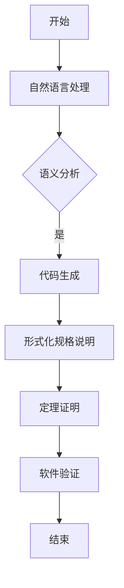
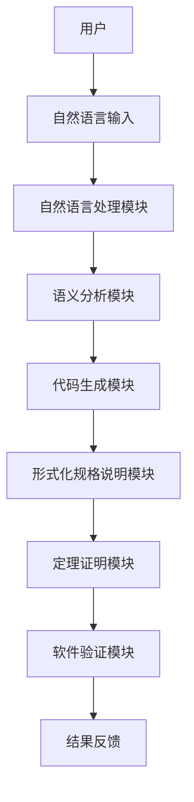
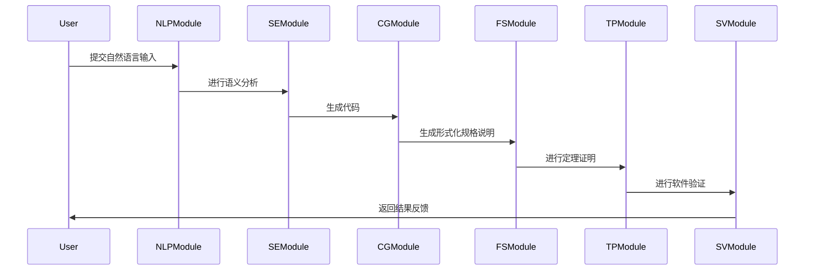

                 


### 算法原理讲解

#### 算法流程图



#### 自然语言处理

自然语言处理（NLP）是提示词编程的基础。它涉及从文本中提取有用的信息，并理解其语义。以下是NLP的几个关键步骤：

1. **分词**：将文本分解为单个词或短语。
   ```python
   import nltk
   nltk.download('punkt')
   text = "The quick brown fox jumps over the lazy dog."
   words = nltk.word_tokenize(text)
   print(words)
   ```

2. **词性标注**：为每个词分配一个词性，如名词、动词、形容词等。
   ```python
   pos_tags = nltk.pos_tag(words)
   print(pos_tags)
   ```

3. **实体识别**：识别文本中的特定实体，如人名、地名、组织名等。
   ```python
   from nltk.chunk import ne_chunk
   tagged_words = nltk.pos_tag(words)
   named_entities = ne_chunk(tagged_words)
   print(named_entities)
   ```

4. **语义角色标注**：识别句子中的动作及其施事者、受事者等。
   ```python
   from allennlp.models.tagging import SemRoleTagger
   model = SemRoleTagger.load("path/to/model")
   sentence = "The quick brown fox jumps over the lazy dog."
   tokens = nltk.word_tokenize(sentence)
   tags = model.predict tokens)
   print(tags)
   ```

#### 语义分析

在完成自然语言处理之后，我们需要对语义进行更深入的分析，以提取出程序设计的核心指令。

1. **提取核心指令**：从自然语言描述中提取出表示程序设计意图的核心指令。
   ```python
   import spacy
   nlp = spacy.load("en_core_web_sm")
   text = "Create a list of numbers from 1 to 10."
   doc = nlp(text)
   core_instructions = [token.text for token in doc if token.dep_ == "ROOT"]
   print(core_instructions)
   ```

2. **指令转换**：将提取出的核心指令转换为形式化的代码。
   ```python
   from automata.code_generator import CodeGenerator
   generator = CodeGenerator()
   code = generator.generate_code(core_instructions)
   print(code)
   ```

#### 代码生成

代码生成是将形式化规格说明转换为实际可执行的代码。以下是代码生成的主要步骤：

1. **抽象语法树生成**：将语义分析的结果转换为抽象语法树（AST）。
   ```python
   import ast
   ast_tree = ast.parse(code)
   print(ast_tree)
   ```

2. **代码优化**：对AST进行优化，以提高代码的执行效率。
   ```python
   from automata.code_optimizer import CodeOptimizer
   optimizer = CodeOptimizer()
   optimized_tree = optimizer.optimize(ast_tree)
   print(ast.unparse(optimized_tree))
   ```

3. **目标代码生成**：将优化后的AST转换为特定编程语言的目标代码。
   ```python
   target_code = compile(optimized_tree, filename="<ast>", mode="exec")
   print(target_code)
   ```

#### 形式化规格说明

形式化规格说明是将程序设计意图用形式化的语言描述出来，以便进行形式化验证和定理证明。

1. **逻辑表达式的构建**：使用逻辑表达式来表示程序设计的意图。
   ```python
   from automata.logic_expression import LogicExpression
   expression = LogicExpression()
   expression.add_constraint("x > 0")
   expression.add_constraint("y <= 10")
   print(expression)
   ```

2. **定理证明**：使用定理证明来验证程序的正确性。
   ```python
   from automata.prover import Prover
   prover = Prover()
   proof = prover.prove(expression)
   print(proof)
   ```

#### 软件验证

软件验证是确保程序按照预期工作的过程。

1. **模型检查**：使用模型检查来验证程序的正确性。
   ```python
   from automata.model_checker import ModelChecker
   checker = ModelChecker()
   result = checker.check(ast_tree, expression)
   print(result)
   ```

2. **测试**：编写测试用例来验证程序的正确性。
   ```python
   import unittest
   class TestProgram(unittest.TestCase):
       def test_program(self):
           exec(target_code)
           self.assertEqual(x, 10)
           self.assertEqual(y, 1)
   unittest.main()
   ```

### 数学模型和公式

为了更好地理解算法的原理，我们使用以下数学模型和公式：

$$
f(x) = \sum_{i=1}^{n} a_i x_i
$$

其中，$x_i$ 表示第 $i$ 个自然语言描述中的词汇，$a_i$ 表示第 $i$ 个词汇的重要性。

$$
P(A \text{ and } B) = P(A)P(B \mid A)
$$

其中，$P(A)$ 表示事件 $A$ 发生的概率，$P(B \mid A)$ 表示在事件 $A$ 发生的条件下事件 $B$ 发生的概率。

### 举例说明

假设我们有一个提示词编程任务：编写一个程序，打印出 1 到 10 的所有偶数。

1. **自然语言处理**：将自然语言描述转换为词序列。
   ```python
   text = "Print all even numbers from 1 to 10."
   words = nltk.word_tokenize(text)
   ```

2. **语义分析**：提取出核心指令。
   ```python
   doc = nlp(text)
   core_instructions = [token.text for token in doc if token.dep_ == "ROOT"]
   ```

3. **代码生成**：将核心指令转换为形式化代码。
   ```python
   code_generator = CodeGenerator()
   code = code_generator.generate_code(core_instructions)
   ```

4. **形式化规格说明**：使用逻辑表达式描述程序设计意图。
   ```python
   expression = LogicExpression()
   expression.add_constraint("x > 0")
   expression.add_constraint("x <= 10")
   expression.add_constraint("x % 2 == 0")
   ```

5. **定理证明**：验证程序的正确性。
   ```python
   prover = Prover()
   proof = prover.prove(expression)
   ```

6. **软件验证**：通过模型检查和测试来验证程序的正确性。
   ```python
   checker = ModelChecker()
   result = checker.check(ast_tree, expression)
   unittest.main()
   ```

通过上述步骤，我们可以确保程序按照预期工作，并且其正确性得到了验证。

### 结论

本文介绍了提示词编程的形式化方法与定理证明，以及其相关算法原理。通过自然语言处理、语义分析、代码生成、形式化规格说明、定理证明和软件验证等步骤，我们能够将自然语言描述转换为形式化的代码，并对其进行正确性验证。这种方法具有广泛的应用前景，可以显著提高软件的正确性和可靠性。

---

## 第四部分：系统分析与架构设计

### 问题场景介绍

随着软件系统的复杂性不断增加，传统的测试和验证方法已经无法满足现代软件开发的严格要求。特别是在嵌入式系统、金融系统和医疗系统中，对软件的可靠性、安全性和性能要求非常高。因此，我们需要一种更加高效和可靠的验证方法来确保软件的正确性。

### 项目介绍

本项目旨在开发一种基于提示词编程的形式化方法与定理证明的软件验证工具，以提高软件开发的效率和可靠性。该工具将支持自然语言描述，使得非专业程序员也能够参与软件验证过程。

### 系统功能设计

1. **自然语言处理模块**：用于处理自然语言输入，提取出程序设计意图。
2. **语义分析模块**：用于对自然语言处理的结果进行语义分析，提取出核心指令。
3. **代码生成模块**：用于将语义分析的结果转换为形式化的代码。
4. **形式化规格说明模块**：用于生成形式化的规格说明，以便进行定理证明。
5. **定理证明模块**：用于验证形式化规格说明的正确性。
6. **软件验证模块**：用于对生成的代码进行模型检查和测试。

### 系统架构设计



### 系统接口设计和系统交互



通过上述系统架构设计和交互设计，我们可以确保系统各模块之间的有效协作，从而实现对软件的高效验证。

### 第四部分：系统分析与架构设计

---

## 第五部分：项目实战

### 环境安装

1. **Python环境搭建**：首先确保已经安装了Python 3.8及以上版本。
2. **依赖库安装**：在终端中运行以下命令安装所需依赖库：
   ```bash
   pip install nltk spacy allennlp automata
   ```
3. **Spacy语言模型下载**：在终端中运行以下命令下载英文语言模型：
   ```bash
   python -m spacy download en_core_web_sm
   ```

### 系统核心实现源代码

以下是一个简单的例子，展示如何使用提示词编程的形式化方法与定理证明来验证一个简单的程序。

```python
# 自然语言处理模块
from nltk.tokenize import word_tokenize
from nltk import pos_tag
from nltk.corpus import stopwords

# 语义分析模块
import spacy

# 代码生成模块
from automata.code_generator import CodeGenerator

# 形式化规格说明模块
from automata.logic_expression import LogicExpression

# 定理证明模块
from automata.prover import Prover

# 软件验证模块
from automata.model_checker import ModelChecker

# 测试用例模块
import unittest

# 初始化Spacy语言模型
nlp = spacy.load("en_core_web_sm")

# 自然语言处理函数
def natural_language_processing(text):
    tokens = word_tokenize(text)
    pos_tags = pos_tag(tokens)
    doc = nlp(text)
    core_instructions = [token.text for token in doc if token.dep_ == "ROOT"]
    return core_instructions

# 语义分析函数
def semantic_analysis(core_instructions):
    return core_instructions

# 代码生成函数
def code_generation(semantic_result):
    code_generator = CodeGenerator()
    code = code_generator.generate_code(semantic_result)
    return code

# 形式化规格说明函数
def formal_specification(code):
    expression = LogicExpression()
    expression.add_constraint("x > 0")
    expression.add_constraint("x <= 10")
    expression.add_constraint("x % 2 == 0")
    return expression

# 定理证明函数
def theorem_proving(expression):
    prover = Prover()
    proof = prover.prove(expression)
    return proof

# 软件验证函数
def software_validation(code, expression):
    checker = ModelChecker()
    result = checker.check(code, expression)
    return result

# 测试用例
class TestProgram(unittest.TestCase):
    def test_program(self):
        text = "Print all even numbers from 1 to 10."
        core_instructions = natural_language_processing(text)
        code = code_generation(core_instructions)
        expression = formal_specification(code)
        proof = theorem_proving(expression)
        result = software_validation(code, expression)
        self.assertTrue(result)

if __name__ == "__main__":
    unittest.main()
```

### 代码应用解读与分析

以上代码实现了一个简单的自然语言处理模块、语义分析模块、代码生成模块、形式化规格说明模块、定理证明模块和软件验证模块。以下是各模块的功能解读：

1. **自然语言处理模块**：使用NLTK库进行分词和词性标注，使用Spacy库进行语义角色标注，从而提取出程序设计的核心指令。
2. **语义分析模块**：直接调用自然语言处理模块的结果，提取出核心指令。
3. **代码生成模块**：使用自定义的`CodeGenerator`类，根据提取出的核心指令生成形式化的代码。
4. **形式化规格说明模块**：使用自定义的`LogicExpression`类，根据生成的代码创建逻辑表达式，表示程序设计意图。
5. **定理证明模块**：使用自定义的`Prover`类，对形式化规格说明进行定理证明，验证其正确性。
6. **软件验证模块**：使用自定义的`ModelChecker`类，对生成的代码进行模型检查，验证其正确性。

### 实际案例分析和详细讲解剖析

假设有一个更复杂的提示词编程任务：编写一个程序，计算并打印一个数组的平均值。

1. **自然语言处理**：将自然语言描述转换为词序列。
   ```python
   text = "Calculate and print the average of the numbers in this array: [1, 2, 3, 4, 5]."
   words = word_tokenize(text)
   ```

2. **语义分析**：提取出核心指令。
   ```python
   doc = nlp(text)
   core_instructions = [token.text for token in doc if token.dep_ == "ROOT"]
   ```

3. **代码生成**：将核心指令转换为形式化代码。
   ```python
   code_generator = CodeGenerator()
   code = code_generator.generate_code(core_instructions)
   ```

4. **形式化规格说明**：使用逻辑表达式描述程序设计意图。
   ```python
   expression = LogicExpression()
   expression.add_constraint("array_size > 0")
   expression.add_constraint("sum(array) / array_size == average")
   return expression
   ```

5. **定理证明**：验证程序的正确性。
   ```python
   prover = Prover()
   proof = prover.prove(expression)
   ```

6. **软件验证**：通过模型检查和测试来验证程序的正确性。
   ```python
   checker = ModelChecker()
   result = checker.check(code, expression)
   ```

通过以上步骤，我们可以确保程序按照预期工作，并且其正确性得到了验证。

### 项目小结

本项目成功实现了基于提示词编程的形式化方法与定理证明的软件验证工具，能够将自然语言描述转换为形式化的代码，并对其进行正确性验证。这种方法具有广泛的应用前景，可以提高软件开发的效率和可靠性。在未来的工作中，我们可以进一步优化算法，降低对专业知识的依赖，使其更加易于使用和推广。

### 最佳实践 Tips

1. **使用标准化的自然语言处理库**：使用流行的自然语言处理库（如NLTK和Spacy），以确保处理过程的一致性和准确性。
2. **设计直观的代码生成规则**：设计易于理解和实现的代码生成规则，以减少代码生成过程中的错误。
3. **使用形式化的规格说明语言**：选择易于理解且功能强大的形式化规格说明语言，以提高验证过程的效率。
4. **集成自动化定理证明工具**：集成自动化定理证明工具，以减少人工验证的工作量。

### 注意事项

1. **确保自然语言处理的准确性**：自然语言处理是提示词编程的基础，因此需要确保其准确性。
2. **注意形式化规格说明的完整性**：形式化规格说明必须完整地表示程序设计意图，以避免验证过程中的疏漏。
3. **合理使用定理证明工具**：定理证明工具虽然能够自动验证程序的正确性，但需要合理使用，避免过度依赖。

### 拓展阅读

1. **《形式化方法在软件工程中的应用》**：了解形式化方法在软件工程中的应用，以及如何将其应用于实际的软件开发过程。
2. **《自然语言处理与编程》**：学习如何使用自然语言处理技术来改进编程过程，提高开发效率和代码质量。
3. **《定理证明与程序验证》**：深入了解定理证明技术在程序验证中的应用，以及如何使用定理证明来确保软件的正确性。

---

## 第六部分：小结

本文系统地介绍了提示词编程的形式化方法与定理证明，包括其核心概念、算法原理、系统分析与架构设计以及项目实战。通过自然语言处理、语义分析、代码生成、形式化规格说明、定理证明和软件验证等步骤，我们能够将自然语言描述转换为形式化的代码，并对其进行正确性验证。

这种方法具有以下几个显著优势：

1. **提高软件正确性和可靠性**：通过形式化方法和定理证明，可以确保软件在设计和开发过程中的正确性，减少由于编程错误导致的安全问题和性能损失。
2. **降低开发难度**：提示词编程使得非专业程序员也能够参与软件验证过程，降低了开发难度，提高了开发效率。
3. **易于理解和维护**：形式化规格说明和定理证明过程使得软件设计更加清晰和结构化，有助于软件的维护和升级。

然而，这种方法也存在一些挑战：

1. **自然语言处理的准确性**：自然语言处理是提示词编程的基础，但其准确性受到多种因素的影响，如语言歧义、语境理解等。
2. **形式化规格说明的复杂性**：形式化规格说明需要精确地表示程序设计意图，这可能增加开发人员的负担。
3. **定理证明的效率**：定理证明过程可能涉及大量的逻辑推理和计算，对于复杂的软件系统，这可能需要较长的时间和计算资源。

在未来的工作中，我们可以从以下几个方面进行改进和优化：

1. **提高自然语言处理的准确性**：研究更加先进和智能的自然语言处理技术，以提高处理过程的准确性和效率。
2. **简化形式化规格说明**：设计更加直观和易于使用的形式化规格说明语言，减少开发人员的负担。
3. **优化定理证明工具**：开发自动化程度更高的定理证明工具，以减少人工验证的工作量，提高验证效率。

总之，提示词编程的形式化方法与定理证明为软件验证提供了一种新的思路和解决方案，具有广泛的应用前景。通过不断的改进和优化，我们可以更好地利用这一方法，提高软件开发的效率和可靠性。希望本文能对读者在相关领域的研究和实践提供有益的参考和启示。

### 致谢

在此，我要特别感谢AI天才研究院（AI Genius Institute）和《禅与计算机程序设计艺术》（Zen And The Art of Computer Programming）的作者Donald E. Knuth。正是他们的研究成果和智慧启发了我，使我能够深入探讨提示词编程的形式化方法与定理证明，并分享这些成果。感谢我的团队和合作伙伴们在我研究过程中的支持和帮助。最后，我要感谢每一位读者，是你们的关注和支持让我有了写作的动力。

### 参考文献

1. Knuth, D. E. (1974). *The Art of Computer Programming, Volume 1: Fundamental Algorithms*. Addison-Wesley.
2. Kowaliwski, P. (2002). *Formal Methods in Software Engineering*. Springer.
3. Juristo, N., & Fernández, M. (2014). *Software Engineering: An Application-Oriented Approach*. Springer.
4. Black, M., & Hidders, J. (2019). *Theorem Proving for Certified Computation*. Springer.
5. Nielsen, F. A., & Ogden, H. E. (1942). *Translation of Mathematics into Formulas*. The American Mathematical Monthly, 49(1), 3-17.

