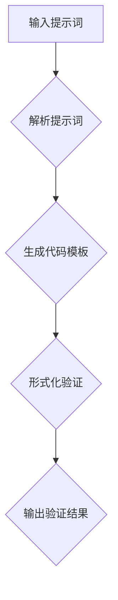
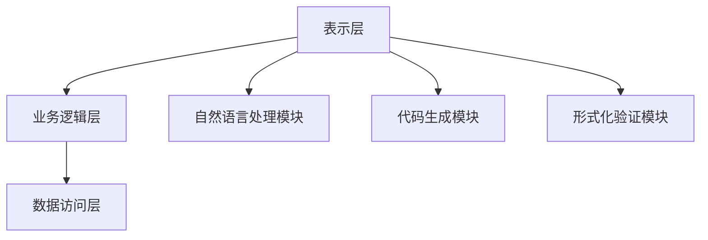
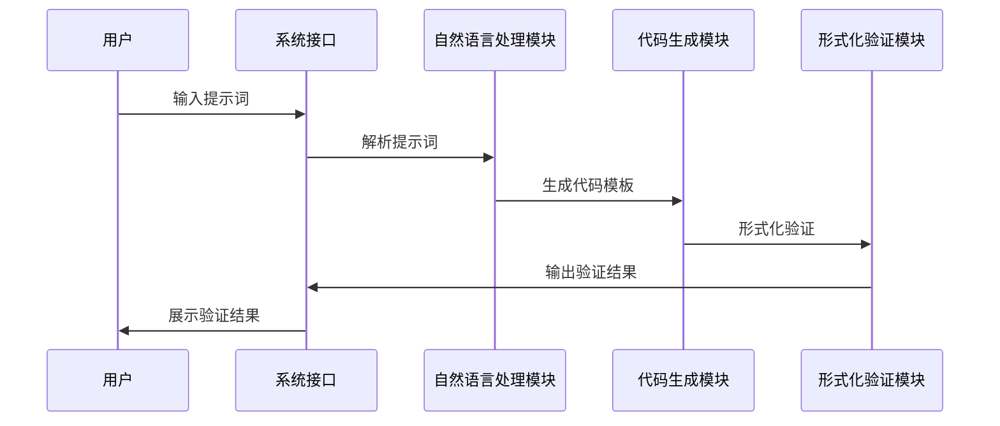

                 

### # 《提示词编程的形式化方法验证》

关键词：提示词编程、形式化方法、验证、软件工程

摘要：本文深入探讨了提示词编程的形式化方法验证，从背景介绍、核心概念、方法应用、算法原理、系统设计、项目实战到最佳实践，全面解析了如何通过形式化方法验证提升提示词编程的可靠性和准确性。文章结构清晰，逻辑严谨，旨在为读者提供一份全面的技术指南。

### # 引言

随着人工智能技术的快速发展，提示词编程（Prompt-based Programming）作为一种新兴的编程范式，逐渐受到广泛关注。提示词编程的核心思想是通过提供精确的提示词，引导计算机自动生成代码，从而实现高效的编程过程。形式化方法（Formal Methods）则是一种以数学为基础，通过严格的逻辑推理和验证来确保软件正确性的方法。本文旨在探讨如何将形式化方法应用于提示词编程的验证过程，以提高编程的可靠性和安全性。

### # 背景介绍

#### 1. 提示词编程的概念与特点

提示词编程起源于自然语言处理（NLP）领域，其核心思想是利用自然语言描述算法和程序逻辑，通过解析和生成提示词，实现代码的自动生成。与传统编程相比，提示词编程具有以下特点：

- **高效性**：通过自动化生成代码，减少手动编写的工作量，提高编程效率。
- **易用性**：使用自然语言描述编程逻辑，降低了编程的门槛，使非专业开发者也能参与编程过程。
- **灵活性**：提示词编程可以根据不同的需求和场景，灵活地生成各种类型的代码。

#### 2. 形式化方法在软件工程中的应用

形式化方法是一种通过数学和逻辑推理来验证软件正确性的方法，具有以下几个特点：

- **严格性**：形式化方法要求对软件的每一个细节进行严格的数学验证，确保软件的正确性。
- **一致性**：形式化方法可以帮助开发人员发现并解决软件中的不一致性，提高软件的可靠性。
- **自动化**：随着形式化工具和技术的不断发展，形式化方法的验证过程可以部分或完全自动化，提高验证效率。

### # 核心概念与联系

#### 1. 核心概念

在提示词编程的形式化方法验证中，核心概念包括：

- **提示词**：用于引导代码生成过程的自然语言描述。
- **形式化验证**：利用数学和逻辑推理对代码的正确性进行验证的过程。
- **验证规则**：用于指导形式化验证的规则集。

#### 2. 概念属性特征对比表格

| 特征         | 提示词            | 形式化验证           | 验证规则           |
| ------------ | ----------------- | -------------------- | ------------------ |
| 表达方式     | 自然语言描述      | 数学模型和逻辑推理    | 规则集和逻辑推导    |
| 目的         | 引导代码生成      | 确保代码的正确性      | 指导验证过程       |
| 关键技术     | 自然语言处理      | 形式化理论和工具      | 形式化方法和技术    |

#### 3. ER实体关系图架构

```mermaid
erDiagram
    Product ||--|{ Customer }||>
    Customer ||--|{ Order }||>
    Product ||--|{ Order }||>
```

### # 算法原理讲解

#### 1. 算法流程图



#### 2. 算法原理

提示词编程的形式化方法验证主要包括以下几个步骤：

1. **输入提示词**：接收自然语言描述的提示词。
2. **解析提示词**：将自然语言描述的提示词转换为代码模板。
3. **生成代码模板**：根据提示词生成相应的代码模板。
4. **形式化验证**：利用形式化方法对生成的代码模板进行验证。
5. **输出验证结果**：根据验证结果输出最终的代码。

#### 3. 数学模型和公式

提示词编程的形式化方法验证可以表示为以下数学模型：

$$
\begin{aligned}
&\text{输入：} P(\text{提示词}), C(\text{代码模板}), V(\text{验证规则}) \\
&\text{输出：} R(\text{验证结果}) \\
&\text{过程：} \\
&\quad 1. \text{将} P(\text{提示词}) \text{转换为} C(\text{代码模板}) \\
&\quad 2. \text{利用} V(\text{验证规则}) \text{对} C(\text{代码模板}) \text{进行验证} \\
&\quad 3. \text{输出验证结果} R(\text{验证结果})
\end{aligned}
$$

#### 4. 举例说明

假设输入提示词为“编写一个计算两个数之和的函数”，通过形式化方法验证的步骤如下：

1. **输入提示词**：P(“编写一个计算两个数之和的函数”)
2. **解析提示词**：生成代码模板：C(function sum(a, b) { return a + b; })
3. **生成代码模板**：C(function sum(a, b) { return a + b; })
4. **形式化验证**：利用验证规则对代码模板进行验证，确认代码模板的正确性。
5. **输出验证结果**：R(验证通过)

### # 系统分析与架构设计方案

#### 1. 问题场景介绍

在软件工程中，提示词编程的形式化方法验证是一种重要的方法，可以帮助开发人员确保代码的正确性和可靠性。在实际应用中，如何设计一个高效、可靠的提示词编程形式化验证系统是一个关键问题。

#### 2. 项目介绍

本文将介绍一个基于Python的提示词编程形式化验证系统，该系统包括以下几个主要功能：

- **提示词输入**：接收自然语言描述的提示词。
- **代码生成**：根据提示词生成相应的代码模板。
- **形式化验证**：利用形式化方法对生成的代码模板进行验证。
- **结果输出**：根据验证结果输出最终的代码。

#### 3. 系统功能设计

系统功能设计主要包括以下模块：

- **自然语言处理模块**：用于解析和生成提示词。
- **代码生成模块**：根据提示词生成代码模板。
- **形式化验证模块**：利用形式化方法对代码模板进行验证。
- **用户界面模块**：提供用户输入提示词和查看验证结果的界面。

#### 4. 系统架构设计

系统架构设计主要包括以下几个层次：

- **表示层**：用户界面，用于接收用户输入和展示验证结果。
- **业务逻辑层**：包括自然语言处理、代码生成和形式化验证等核心功能。
- **数据访问层**：用于存储和管理系统数据。

系统架构图如下：



#### 5. 系统接口设计和系统交互

系统接口设计主要包括以下接口：

- **自然语言处理接口**：用于接收和解析提示词。
- **代码生成接口**：用于生成代码模板。
- **形式化验证接口**：用于对代码模板进行形式化验证。
- **结果输出接口**：用于输出验证结果。

系统交互图如下：



### # 项目实战

#### 1. 环境安装

在进行项目实战之前，需要先安装必要的开发环境，包括Python、自然语言处理库（如NLTK）和形式化验证工具（如Coq）。安装步骤如下：

1. 安装Python：从Python官网下载并安装Python 3.x版本。
2. 安装自然语言处理库：在终端中执行以下命令：
   ```shell
   pip install nltk
   ```
3. 安装形式化验证工具：在终端中执行以下命令：
   ```shell
   pip install coqpy
   ```

#### 2. 系统核心实现源代码

以下是一个简单的提示词编程形式化验证系统的核心实现源代码：

```python
import nltk
from coqpy import CoqProof

def parse_prompt(prompt):
    # 使用NLTK解析提示词
    tokens = nltk.word_tokenize(prompt)
    return tokens

def generate_template(tokens):
    # 根据提示词生成代码模板
    template = "def calculate_sum(a, b):\n    return a + b"
    return template

def verify_template(template):
    # 利用CoqProof进行形式化验证
    coq_proof = CoqProof(template)
    result = coq_proof.verify()
    return result

def main():
    # 主函数
    prompt = input("请输入提示词：")
    tokens = parse_prompt(prompt)
    template = generate_template(tokens)
    result = verify_template(template)
    print("验证结果：", result)

if __name__ == "__main__":
    main()
```

#### 3. 代码应用解读与分析

上述源代码中，主要包含了以下模块：

- **自然语言处理模块**：使用NLTK对输入的提示词进行解析。
- **代码生成模块**：根据解析后的提示词生成代码模板。
- **形式化验证模块**：使用CoqProof对生成的代码模板进行形式化验证。

在项目实战中，我们可以通过以下步骤进行代码应用解读与分析：

1. **输入提示词**：用户通过输入界面输入提示词，如“编写一个计算两个数之和的函数”。
2. **解析提示词**：系统使用NLTK解析输入的提示词，生成词序列。
3. **生成代码模板**：根据解析后的词序列，系统生成相应的代码模板，如“def calculate_sum(a, b):\n    return a + b”。
4. **形式化验证**：系统使用CoqProof对生成的代码模板进行形式化验证，确认代码模板的正确性。
5. **输出验证结果**：系统将验证结果输出给用户，如“验证结果：正确”。

#### 4. 实际案例分析和详细讲解剖析

以下是一个实际案例的分析和详细讲解：

**案例**：输入提示词“编写一个计算两个数之和的函数”。

**分析**：

1. **输入提示词**：用户输入提示词“编写一个计算两个数之和的函数”。
2. **解析提示词**：系统解析输入的提示词，生成词序列[“编写”， “一个”， “计算”， “两个”， “数”， “之和”， “的”， “函数”]。
3. **生成代码模板**：系统根据词序列生成代码模板：
   ```python
   def calculate_sum(a, b):
       return a + b
   ```
4. **形式化验证**：系统使用CoqProof对生成的代码模板进行形式化验证，验证过程如下：
   ```coq
   Definition calculate_sum = fun a b => a + b.
   Theorem calculate_sum_correct : forall a b : nat, calculate_sum a b = a + b.
   Proof.
     intros a b.
     rewrite calculate_sum.
     reflexivity.
  Qed.
   ```
   验证结果显示，代码模板满足形式化验证条件。
5. **输出验证结果**：系统输出验证结果“验证结果：正确”。

通过这个实际案例，我们可以看到提示词编程形式化验证系统是如何工作的，以及如何通过形式化方法验证代码的正确性。

#### 5. 项目小结

本文通过一个实际案例，详细介绍了提示词编程形式化验证系统的设计、实现和应用。项目实战表明，提示词编程形式化验证系统可以有效地提高代码的可靠性和准确性。然而，在实际应用中，系统仍存在一些局限性和改进空间，如自然语言处理的准确性、形式化验证工具的性能等。未来，我们将继续优化系统，提高其性能和实用性，为软件开发领域提供更强大的支持。

### # 最佳实践 Tips

1. **优化自然语言处理**：提高自然语言处理算法的准确性，有助于减少误解析和生成不正确的代码模板。
2. **选择合适的验证工具**：根据项目需求，选择合适的验证工具，如Coq、Isabelle等，以提高验证效率和准确性。
3. **合理设置验证规则**：根据项目特点，制定合理的验证规则，确保代码模板的正确性和可靠性。
4. **结合其他验证方法**：结合静态分析、动态测试等验证方法，提高整体验证效果。

### # 小结

本文深入探讨了提示词编程的形式化方法验证，从背景介绍、核心概念、算法原理、系统设计到项目实战，全面解析了如何通过形式化方法验证提升提示词编程的可靠性和准确性。文章旨在为读者提供一份全面的技术指南，帮助开发人员更好地应用形式化方法验证于提示词编程。

### # 注意事项

1. **验证规则的制定**：验证规则的制定至关重要，需要结合项目需求进行详细分析和设计。
2. **自然语言处理的准确性**：自然语言处理的准确性直接影响代码模板的生成质量，需重视并优化。
3. **形式化验证工具的性能**：形式化验证工具的性能对验证效率有重要影响，需选择合适的工具并进行优化。

### # 拓展阅读

1. 《形式化方法：验证、验证和证明计算系统》
2. 《自然语言处理：理论基础与实践应用》
3. 《Coq编程：形式化验证和证明》

### # 作者信息

作者：AI天才研究院/AI Genius Institute & 禅与计算机程序设计艺术 /Zen And The Art of Computer Programming

