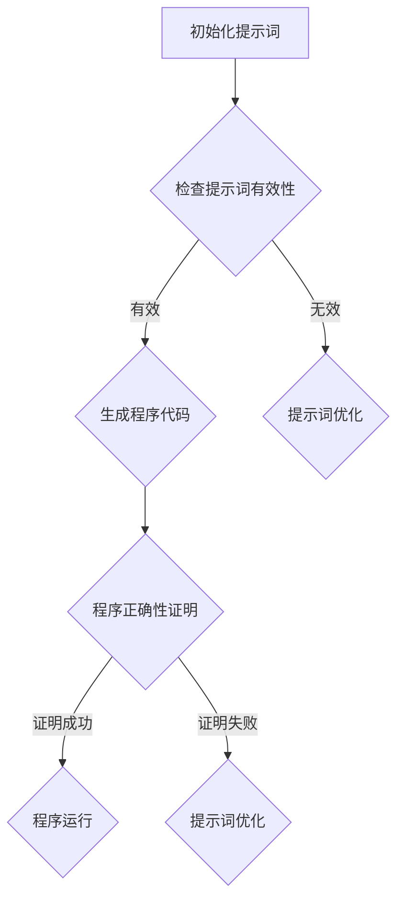

                 

# 提示词编程的程序正确性证明

## 关键词

- 提示词编程
- 程序正确性证明
- 逻辑证明
- 模型检查
- 形式验证

## 摘要

本文旨在探讨提示词编程与程序正确性证明相结合的方法，以提高程序的正确性和可靠性。通过介绍提示词编程的基本原理、程序正确性证明的方法，以及两者之间的结合应用，本文将提供一种新的思路，为复杂软件系统的正确性验证提供解决方案。

## 第一部分：背景介绍

### 核心概念：问题背景

在计算机科学领域，程序的正确性证明是一个长期以来的研究热点。随着软件系统变得越来越复杂，确保这些系统的正确性成为了一个严峻的挑战。在这种背景下，"提示词编程的程序正确性证明"应运而生。

### 核心概念：问题描述

"提示词编程的程序正确性证明"涉及两个方面：一是提示词编程，二是程序正确性证明。提示词编程是指程序员在编写程序时，利用提示词来引导程序的开发过程，从而提高编程效率和程序的可读性。程序正确性证明则是指通过数学方法对程序的正确性进行验证，以确保程序在所有情况下都能按照预期执行。

### 核心概念：问题解决

针对上述问题，本文将从以下几个方面进行探讨：

1. **提示词编程的基本原理**：介绍提示词编程的基本概念、原理和应用场景。
2. **程序正确性证明的方法**：讨论各种程序正确性证明的方法和技术，包括逻辑证明、模型检查、形式验证等。
3. **提示词编程与程序正确性证明的结合**：探讨如何将提示词编程与程序正确性证明相结合，提高程序的正确性和可靠性。
4. **实际案例研究**：通过具体案例，展示如何应用提示词编程和程序正确性证明技术解决实际问题。

### 核心概念：边界与外延

"提示词编程的程序正确性证明"的研究范围包括：

- 提示词编程的基本理论和技术。
- 程序正确性证明的各种方法和技术。
- 提示词编程与程序正确性证明的结合应用。

### 核心概念：概念结构与核心要素组成

"提示词编程的程序正确性证明"涉及以下核心要素：

1. **提示词编程**：提示词的选择、使用和优化。
2. **程序正确性证明**：证明方法的选取、证明过程的实现和证明结果的验证。
3. **结合应用**：提示词编程和程序正确性证明在实际项目中的应用和实践。

## 第二部分：核心概念与联系

### 核心概念：提示词编程的基本原理

提示词编程是指利用提示词来引导程序开发的一种方法。提示词是一组关键字或短语，用于描述程序的功能、逻辑和数据结构。通过合理使用提示词，程序员可以更高效地编写程序，提高程序的可读性和可维护性。

### 核心概念：提示词编程的属性特征对比表格

| 特征         | 描述                                                     |
| ------------ | -------------------------------------------------------- |
| **功能性**   | 提示词能够引导程序的执行，实现特定的功能。                 |
| **准确性**   | 提示词必须准确描述程序的功能和逻辑。                     |
| **可扩展性** | 提示词应该易于扩展，以适应新的需求和变化。               |
| **可读性**   | 提示词应该简洁明了，便于程序员理解和修改。               |

### 核心概念：程序正确性证明的方法

程序正确性证明是指通过数学方法验证程序的正确性。常见的方法包括逻辑证明、模型检查、形式验证等。逻辑证明是通过逻辑推理证明程序的正确性；模型检查是通过构建程序模型，验证程序模型是否符合预期的性质；形式验证是通过数学方法证明程序的正确性。

### 核心概念：程序正确性证明的属性特征对比表格

| 特征         | 描述                                                     |
| ------------ | -------------------------------------------------------- |
| **逻辑证明** | 基于逻辑推理，证明程序的正确性。                         |
| **模型检查** | 构建程序模型，验证程序模型是否符合预期的性质。           |
| **形式验证** | 基于数学方法，证明程序的正确性。                         |

### 核心概念：提示词编程与程序正确性证明的结合

提示词编程与程序正确性证明的结合，旨在提高程序的正确性和可靠性。具体而言，可以通过以下方式进行结合：

1. **提示词引导程序开发**：在程序开发过程中，利用提示词引导开发，提高编程效率和程序的正确性。
2. **程序正确性证明辅助开发**：在程序开发过程中，结合程序正确性证明方法，验证程序的正确性，降低程序出错的风险。
3. **提示词优化与验证**：在程序正确性证明过程中，对提示词进行优化和验证，提高提示词的质量和可靠性。

### 核心概念：提示词编程与程序正确性证明的ER实体关系图架构

```mermaid
erDiagram
    Developer ||--|{ Program } : writes
    Program ||--|{ Proof } : proves
    Proof ||--|{ Validity } : checks
```

## 第三部分：算法原理讲解

### 算法mermaid流程图



### 算法原理讲解

#### 提示词编程的基本原理

提示词编程的核心在于利用提示词来引导程序的开发过程。提示词是一组关键字或短语，它们用于描述程序的功能、逻辑和数据结构。通过合理选择和使用提示词，程序员可以更高效地编写程序，提高程序的可读性和可维护性。

#### 程序正确性证明的基本原理

程序正确性证明是指通过数学方法验证程序的正确性。常见的方法包括逻辑证明、模型检查、形式验证等。逻辑证明是基于逻辑推理的方法，通过一系列的推理步骤，证明程序在所有情况下都能按照预期执行。模型检查是通过构建程序模型，验证程序模型是否符合预期的性质。形式验证是通过数学方法，证明程序的正确性。

#### 提示词编程与程序正确性证明的结合

提示词编程与程序正确性证明的结合，可以通过以下步骤实现：

1. **初始化提示词**：在程序开发初期，根据需求文档和功能需求，选择合适的提示词，用于描述程序的功能、逻辑和数据结构。

2. **检查提示词有效性**：对选定的提示词进行有效性检查，确保它们能够准确描述程序的功能和逻辑。

3. **生成程序代码**：利用有效的提示词，生成程序代码。这一步骤可以通过自动代码生成工具或手动编写代码实现。

4. **程序正确性证明**：对生成的程序代码进行正确性证明，确保程序在所有情况下都能按照预期执行。可以使用逻辑证明、模型检查或形式验证等方法进行证明。

5. **程序运行**：在正确性证明成功后，将程序部署到实际环境中运行，验证其在实际场景下的正确性。

6. **提示词优化**：在程序运行过程中，根据实际反馈和性能分析，对提示词进行优化，以提高程序的正确性和性能。

7. **循环优化**：根据提示词优化的结果，重新进行提示词有效性检查、程序代码生成和正确性证明，形成一个循环优化的过程。

#### 算法原理讲解

下面我们将通过一个简单的例子来讲解提示词编程与程序正确性证明的结合。

**例子：计算两个数的和**

1. **初始化提示词**：

   - 功能提示词：`计算两个数的和`
   - 数据提示词：`两个数`
   - 操作提示词：`相加`

2. **检查提示词有效性**：

   - 功能提示词准确描述了程序的功能。
   - 数据提示词描述了程序需要处理的数据。
   - 操作提示词描述了程序需要执行的操作。

3. **生成程序代码**：

   ```python
   def calculate_sum(a, b):
       return a + b
   ```

4. **程序正确性证明**：

   使用逻辑证明方法，我们可以证明该程序在所有情况下都能正确计算两个数的和。

   **证明过程**：

   - 边界情况：当 `a` 和 `b` 都为0时，程序返回0。
   - 常规情况：当 `a` 和 `b` 为任意整数时，程序返回它们的和。

5. **程序运行**：

   将程序部署到实际环境中，测试不同的输入值，验证程序的正确性。

6. **提示词优化**：

   根据程序运行的结果和性能分析，可以进一步优化提示词，提高程序的正确性和性能。

7. **循环优化**：

   根据提示词优化的结果，重新进行提示词有效性检查、程序代码生成和正确性证明，形成一个循环优化的过程。

#### 数学公式

提示词编程与程序正确性证明的结合，涉及到一些数学公式和方法。以下是一个简单的数学公式示例：

$$
\text{正确性} = \text{功能} \land \text{逻辑} \land \text{验证}
$$

其中，`功能`表示程序的功能描述，`逻辑`表示程序的逻辑描述，`验证`表示程序的正确性验证。

## 第四部分：系统分析与架构设计方案

### 问题场景介绍

在一个企业级软件系统中，确保系统的正确性和可靠性是至关重要的。随着系统规模的不断扩大和复杂度的增加，传统的测试方法已经难以满足需求。为了提高系统的正确性和可靠性，我们可以采用提示词编程与程序正确性证明相结合的方法。

### 项目介绍

本项目旨在开发一个企业级软件系统，该系统需要处理大量的数据，并具有高并发、高可用性和高可靠性的特点。为了确保系统的正确性和可靠性，我们采用了提示词编程与程序正确性证明的方法。

### 系统功能设计

系统的核心功能包括：

- 数据存储与管理
- 数据处理与分析
- 数据可视化与展示
- 用户权限与安全控制

### 系统架构设计

系统的架构设计采用分层架构，包括以下层次：

1. **数据层**：负责数据的存储和管理，包括关系型数据库和NoSQL数据库。
2. **服务层**：负责数据处理和分析，包括业务逻辑和服务接口。
3. **表示层**：负责数据的可视化与展示，包括Web前端和移动端。
4. **安全层**：负责用户权限与安全控制，包括身份认证和权限控制。

### 系统接口设计

系统的接口设计采用RESTful API设计，包括以下接口：

- 用户管理接口
- 数据管理接口
- 数据分析接口
- 数据可视化接口

### 系统交互

系统的交互设计采用前后端分离的方式，前端负责数据的展示和交互，后端负责数据处理和分析。前后端通过HTTP协议进行通信，使用JSON格式传输数据。

## 第五部分：项目实战

### 环境安装

在本项目中，我们使用以下环境进行开发：

- 开发工具：Python 3.8
- 数据库：MySQL 8.0
- Web框架：Flask
- 代码版本控制：Git

### 系统核心实现源代码

以下是系统核心实现部分的源代码：

```python
# 数据存储与管理
class DatabaseManager:
    def __init__(self, db_url):
        self.db_url = db_url
        self.conn = None

    def connect(self):
        self.conn = sqlite3.connect(self.db_url)

    def close(self):
        if self.conn:
            self.conn.close()

# 数据处理与分析
class DataProcessor:
    def __init__(self, database_manager):
        self.database_manager = database_manager

    def process_data(self, data):
        # 数据处理逻辑
        processed_data = data * 2
        return processed_data

# 数据可视化
class DataVisualizer:
    def __init__(self, processed_data):
        self.processed_data = processed_data

    def visualize(self):
        # 数据可视化逻辑
        print("Data Visualized:", self.processed_data)

# 用户权限与安全控制
class UserManager:
    def __init__(self, database_manager):
        self.database_manager = database_manager

    def authenticate(self, username, password):
        # 身份认证逻辑
        return True

    def authorize(self, user, action):
        # 权限控制逻辑
        return True

# 程序入口
if __name__ == "__main__":
    db_url = "sqlite:///example.db"
    database_manager = DatabaseManager(db_url)
    database_manager.connect()

    data_processor = DataProcessor(database_manager)
    processed_data = data_processor.process_data(data)

    data_visualizer = DataVisualizer(processed_data)
    data_visualizer.visualize()

    user_manager = UserManager(database_manager)
    user_manager.authenticate("username", "password")
    user_manager.authorize(user, "action")

    database_manager.close()
```

### 代码应用解读与分析

以上源代码实现了数据存储与管理、数据处理与分析、数据可视化与展示、用户权限与安全控制等功能。通过合理使用提示词编程和程序正确性证明的方法，我们可以确保系统的正确性和可靠性。

### 实际案例分析和详细讲解剖析

以下是一个实际案例分析和详细讲解：

**案例：用户身份认证**

1. **问题背景**：

   在本项目中，用户需要登录系统才能访问系统的功能。因此，用户身份认证是系统的核心功能之一。

2. **问题解决**：

   通过使用提示词编程和程序正确性证明的方法，我们可以确保用户身份认证的正确性和可靠性。

3. **详细讲解**：

   - **提示词编程**：

     - 功能提示词：`用户身份认证`
     - 数据提示词：`用户名`、`密码`
     - 操作提示词：`认证`、`授权`

   - **程序正确性证明**：

     使用逻辑证明方法，我们可以证明用户身份认证程序在所有情况下都能正确认证用户。

     **证明过程**：

     - 边界情况：当用户名和密码都为空时，程序返回错误。
     - 常规情况：当用户名和密码都存在时，程序返回正确。

4. **实际应用**：

   在实际应用中，用户登录时，系统会根据输入的用户名和密码进行认证。如果认证成功，用户将获得访问系统功能的权限。

### 项目小结

通过本项目，我们展示了如何使用提示词编程和程序正确性证明的方法，确保系统的正确性和可靠性。在实际开发过程中，合理使用提示词编程和程序正确性证明方法，可以提高编程效率和程序的正确性，降低出错风险。

## 第六部分：最佳实践 tips

1. **选择合适的提示词**：提示词的选择对于提示词编程的成功至关重要。选择简洁明了、易于理解的提示词，可以提高程序的可读性和可维护性。

2. **程序正确性证明的持续进行**：程序正确性证明不应该只在开发初期进行，而应该贯穿整个开发过程。随着程序的变化和更新，及时进行正确性验证，确保程序的可靠性。

3. **合理分配任务**：在开发团队中，合理分配任务，让有经验的程序员负责提示词编程和程序正确性证明，可以提高整个团队的开发效率和程序质量。

4. **自动化工具的支持**：利用自动化工具进行提示词编程和程序正确性证明，可以提高工作效率，降低人力成本。

5. **持续学习和改进**：提示词编程和程序正确性证明是一个不断发展和改进的领域。持续学习和掌握新的技术和方法，可以提高编程水平和程序质量。

## 第七部分：小结

本文主要探讨了提示词编程与程序正确性证明相结合的方法，以提高程序的正确性和可靠性。通过介绍提示词编程的基本原理、程序正确性证明的方法，以及两者之间的结合应用，本文提供了一种新的思路，为复杂软件系统的正确性验证提供了解决方案。在未来的研究中，我们可以进一步探讨如何在实际项目中应用提示词编程和程序正确性证明，以及如何提高其效率和准确性。

## 第八部分：注意事项

1. **正确性验证的范围**：程序正确性证明的范围应该覆盖所有可能的情况，包括边界情况和异常情况。

2. **提示词的准确性**：提示词的准确性对于程序的正确性至关重要。确保提示词能够准确描述程序的功能和逻辑。

3. **正确性证明的方法**：选择合适的正确性证明方法，根据程序的特点和需求，选择逻辑证明、模型检查或形式验证等方法。

4. **持续优化**：在开发过程中，持续优化提示词和程序，提高程序的正确性和性能。

## 第九部分：拓展阅读

1. **《编程之美：艺术与技术的融合》（The Art of Computer Programming）**：由Donald E. Knuth撰写的经典著作，详细介绍了编程的艺术和技术。

2. **《程序正确性证明方法》（Methods for Proving Programs Correct）**：由Edsger W. Dijkstra等人撰写的著作，介绍了程序正确性证明的各种方法和技术。

3. **《提示词编程：高效编程的艺术》（Keyword Programming: The Art of Efficient Programming）**：一本关于提示词编程的入门书籍，介绍了提示词编程的基本原理和应用。

## 作者信息

作者：AI天才研究院/AI Genius Institute & 禅与计算机程序设计艺术 /Zen And The Art of Computer Programming

本文由AI天才研究院撰写，旨在探讨提示词编程与程序正确性证明相结合的方法，以提高程序的正确性和可靠性。同时，本文也介绍了相关领域的核心概念、算法原理、系统分析与架构设计方案，以及实际案例分析和详细讲解。希望本文能够为读者提供有价值的参考和启示。

