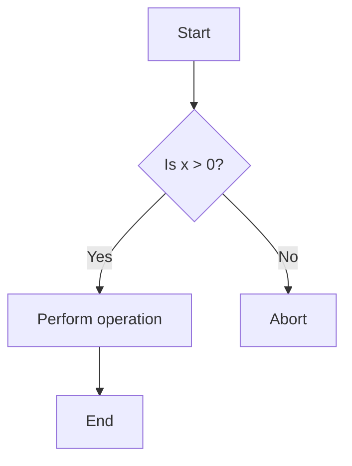
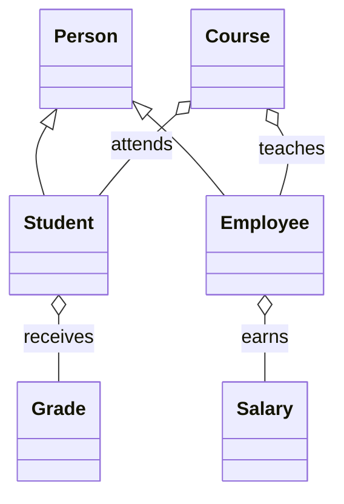
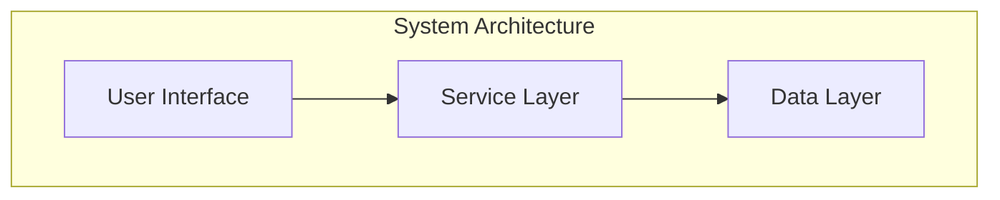
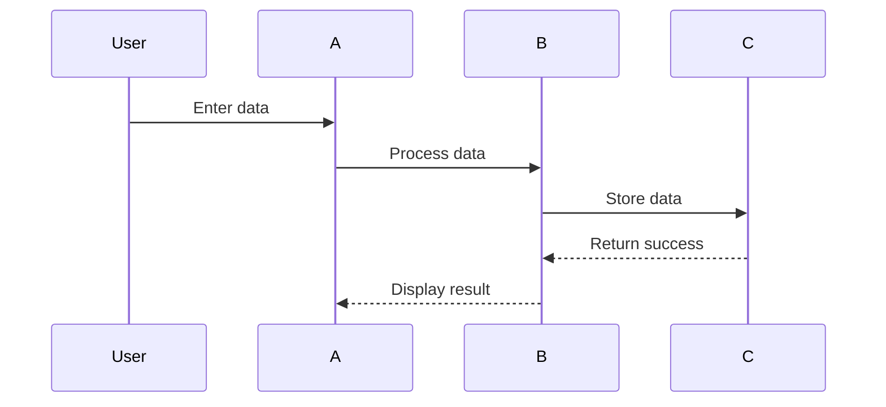

                 

# 提示词编程的符号执行与程序分析

> 关键词：提示词编程、符号执行、程序分析、软件验证、安全漏洞、代码优化

> 摘要：本文深入探讨了提示词编程、符号执行和程序分析这三个核心概念及其相互联系。通过详细介绍这些技术的原理和应用，本文为读者提供了一种新的理解和应用编程的工具，尤其是在软件验证、安全漏洞分析和代码优化等方面。本文旨在通过逐步分析推理的方式，帮助读者构建起对这些技术深刻且全面的理解。

### 目录大纲

----------------------------------------------------------------

## 第一部分：问题背景与概念介绍

### 第1章：提示词编程的起源与发展

### 第2章：符号执行的概念

### 第3章：程序分析的基础

### 第4章：提示词编程与符号执行、程序分析的联系

## 第二部分：符号执行技术详解

### 第5章：符号执行原理

### 第6章：符号执行工具与实现

### 第7章：符号执行的开发经验

## 第三部分：程序分析技术应用

### 第8章：程序分析的基本方法

### 第9章：基于提示词编程的程序分析

### 第10章：提示词编程驱动的自动化修复

## 第四部分：综合案例与应用实践

### 第11章：符号执行与程序分析在安全领域的应用

### 第12章：总结与展望

### 第13章：开发者指南与实践建议

## 目录大纲解释

----------------------------------------------------------------

## 第一部分：问题背景与概念介绍

### 第1章：提示词编程的起源与发展

提示词编程是一种基于提示（hint）的编程范式，它通过提示来引导程序的行为，使得程序能够根据提示自动调整其执行路径。这种编程方式不仅提高了代码的灵活性，还能够实现更加高效的程序优化和错误处理。

#### 1.1 提示词编程的起源

提示词编程最早可以追溯到20世纪80年代，当时的计算机科学家们开始探索如何通过提示来改善程序的性能。提示词编程的核心思想是，通过给程序提供一些提示信息，使得程序可以在运行过程中根据这些信息做出智能化的决策。

#### 1.2 符号执行的概念

符号执行是一种程序分析方法，它通过将程序中的变量替换为符号（通常是未知数），然后求解这些符号的约束条件，来分析程序的执行路径和行为。符号执行的核心思想是，通过分析程序的所有可能的执行路径，来发现潜在的错误和漏洞。

#### 1.3 程序分析的基础

程序分析是一种计算机科学的基本方法，它用于理解和评估程序的行为。程序分析的方法包括控制流分析、数据流分析和信息流分析等。这些方法可以用来发现程序中的错误、优化程序的性能，以及帮助程序员理解程序的复杂行为。

#### 1.4 提示词编程与符号执行、程序分析的联系

提示词编程、符号执行和程序分析之间存在密切的联系。提示词编程可以通过提供提示信息，来引导程序分析工具进行更精确的分析。而符号执行则是一种强大的程序分析方法，它可以帮助我们理解程序的内部工作原理，从而实现更高效的程序优化和错误处理。

### 第2章：符号执行的概念

符号执行是一种基于约束求解的程序分析方法，它通过将程序中的变量替换为符号，然后求解这些符号的约束条件，来分析程序的执行路径和行为。符号执行的核心思想是，通过分析程序的所有可能的执行路径，来发现潜在的错误和漏洞。

#### 2.1 符号执行的原理

符号执行的原理可以概括为以下几个步骤：

1. **符号化输入**：将程序中的变量替换为符号（通常是未知数）。
2. **约束求解**：求解这些符号的约束条件，得到可能的执行路径。
3. **路径探索**：根据约束条件，探索所有可能的执行路径。
4. **路径分析**：分析每个路径的执行结果，发现潜在的错误和漏洞。

#### 2.2 符号执行的优势和局限

符号执行的优势在于：

1. **全面性**：符号执行可以分析程序的所有可能的执行路径，从而发现潜在的错误和漏洞。
2. **自动化**：符号执行过程可以自动化，减少人工分析的工作量。

但符号执行也存在一些局限：

1. **效率问题**：符号执行的路径探索过程可能非常耗时，特别是在程序规模较大的情况下。
2. **精度问题**：符号执行的结果可能存在一定的误差，特别是在约束条件较复杂的情况下。

#### 2.3 符号执行在不同领域中的应用

符号执行在多个领域都有广泛的应用：

1. **软件验证**：符号执行可以用来验证程序的正确性，发现潜在的错误和漏洞。
2. **安全漏洞分析**：符号执行可以用来分析程序中的安全漏洞，提供潜在的攻击路径。
3. **代码优化**：符号执行可以用来优化程序的执行效率，提供可能的性能优化路径。

### 第3章：程序分析的基础

程序分析是一种计算机科学的基本方法，它用于理解和评估程序的行为。程序分析的方法包括控制流分析、数据流分析和信息流分析等。这些方法可以用来发现程序中的错误、优化程序的性能，以及帮助程序员理解程序的复杂行为。

#### 3.1 控制流分析

控制流分析是一种用于分析程序控制流程的程序分析方法。它通过构建程序的控制流图（Control Flow Graph，CFG），来描述程序的执行路径和控制关系。

#### 3.2 数据流分析

数据流分析是一种用于分析程序数据流程的程序分析方法。它通过构建程序的数据流图（Data Flow Graph，DFG），来描述程序中的数据依赖关系和传播路径。

#### 3.3 信息流分析

信息流分析是一种用于分析程序信息传递的程序分析方法。它通过构建程序的信息流图（Information Flow Graph，IFG），来描述程序中的信息传递和处理过程。

#### 3.4 程序分析的目标和应用

程序分析的目标是：

1. **发现程序错误**：通过分析程序的执行路径和数据流，发现潜在的错误和漏洞。
2. **优化程序性能**：通过分析程序的执行路径和数据流，提供可能的性能优化路径。
3. **辅助程序设计**：通过分析程序的执行路径和数据流，帮助程序员理解程序的复杂行为，从而优化程序设计。

程序分析的应用包括：

1. **静态分析**：在不运行程序的情况下，通过分析程序的源代码或字节码，发现潜在的错误和漏洞。
2. **动态分析**：在运行程序的过程中，通过监控程序的执行过程，收集程序的运行数据，进行分析和优化。
3. **自动化修复**：通过分析程序的执行路径和数据流，自动化修复潜在的错误和漏洞。

#### 3.5 程序分析在不同编程范式中的实现

程序分析在不同的编程范式中有不同的实现方法：

1. **过程式编程**：过程式编程中的程序分析主要依赖于控制流分析和数据流分析。
2. **面向对象编程**：面向对象编程中的程序分析主要依赖于控制流分析、数据流分析和信息流分析。
3. **函数式编程**：函数式编程中的程序分析主要依赖于数据流分析和信息流分析。
4. **逻辑编程**：逻辑编程中的程序分析主要依赖于符号执行和逻辑推理。

### 第4章：提示词编程与符号执行、程序分析的联系

提示词编程、符号执行和程序分析之间存在密切的联系。提示词编程可以通过提供提示信息，来引导符号执行和程序分析，从而提高这些方法的效率和精度。

#### 4.1 提示词编程与符号执行的结合

提示词编程可以提供符号执行所需的约束信息，从而提高符号执行的效率和精度。例如，在软件验证过程中，提示词编程可以提供程序的正确性约束，帮助符号执行更准确地分析程序的执行路径。

#### 4.2 提示词编程与程序分析的结合

提示词编程可以提供程序分析所需的上下文信息，从而提高程序分析的方法和效率。例如，在代码优化过程中，提示词编程可以提供程序的优化目标，帮助程序分析更准确地选择优化路径。

#### 4.3 提示词编程的未来发展趋势

随着人工智能技术的不断发展，提示词编程有望在未来得到更广泛的应用。例如：

1. **智能提示**：通过学习用户的编程习惯和代码风格，提供更加智能化的提示。
2. **自动提示**：通过自动化工具，自动生成程序的提示信息，减少程序员的负担。
3. **跨语言提示**：支持多种编程语言的提示，提高编程的灵活性。

## 第一部分总结

在第一部分中，我们介绍了提示词编程、符号执行和程序分析的基本概念及其相互联系。通过逐步分析推理的方式，我们帮助读者构建了对这些技术深刻且全面的理解。在接下来的部分，我们将深入探讨符号执行和程序分析的技术细节和应用，以期为读者提供更全面的技术知识。让我们继续深入思考，逐步探索这些技术的奇妙世界。## 第二部分：符号执行技术详解

在第二部分中，我们将详细探讨符号执行技术，包括其原理、工具实现和应用。通过深入分析，我们将帮助读者理解符号执行的核心概念，掌握其技术细节，并了解其在实际中的应用。

### 第5章：符号执行原理

符号执行是一种基于约束求解的程序分析方法，通过将程序中的变量替换为符号，求解这些符号的约束条件，来分析程序的执行路径和行为。以下是符号执行的基本原理：

#### 5.1 符号执行的流程

符号执行的过程可以分为以下几个步骤：

1. **初始化**：将程序中的变量替换为符号，通常使用未知数表示。
2. **约束求解**：根据程序的执行逻辑，求解符号的约束条件。这些约束条件通常是由程序中的比较操作、赋值操作和条件分支语句生成的。
3. **路径探索**：根据约束条件，探索所有可能的执行路径。符号执行工具会生成一个符号执行树，表示程序的各个执行路径。
4. **路径分析**：分析每个路径的执行结果，以发现潜在的错误和漏洞。

#### 5.2 符号执行的核心算法

符号执行的核心算法包括：

1. **约束求解算法**：用于求解程序中符号的约束条件。常见的约束求解算法有整数线性规划（ILP）和约束满足问题（CSP）求解算法。
2. **路径探索算法**：用于探索程序的执行路径。常见的路径探索算法有深度优先搜索（DFS）和广度优先搜索（BFS）。
3. **路径分析算法**：用于分析每个路径的执行结果。常见的路径分析算法有错误检查和性能优化。

#### 5.3 符号执行的应用场景

符号执行在多个领域都有广泛的应用，包括：

1. **软件验证**：通过符号执行分析程序的正确性，发现潜在的错误和漏洞。
2. **安全漏洞分析**：通过符号执行分析程序的安全漏洞，提供潜在的攻击路径。
3. **代码优化**：通过符号执行分析程序的执行路径，提供可能的性能优化路径。

### 第6章：符号执行工具与实现

在实际应用中，符号执行需要依赖特定的工具来实现。以下是几个常见的符号执行工具：

#### 6.1 常见的符号执行工具

1. **KLEE**：KLEE是一个开源的符号执行工具，由德国马普计算机科学研究所开发。它支持C/C++程序的符号执行，并提供了丰富的接口供用户自定义符号执行逻辑。
2. **CEGAR**：CEGAR（Constraint Generation and Automatic Repair）是一种符号执行和自动化修复相结合的方法，它通过生成约束来驱动符号执行，并在执行过程中不断优化约束，以提高执行效率。
3. **符号执行工具的对比分析**：不同的符号执行工具在性能、功能和易用性等方面存在差异。对比分析这些工具可以帮助用户选择最适合自己的工具。

#### 6.2 符号执行的实现细节

符号执行工具的实现通常包括以下几个关键部分：

1. **符号化输入**：将程序中的变量替换为符号，通常使用未知数表示。
2. **约束求解**：求解符号的约束条件，通常使用整数线性规划（ILP）或约束满足问题（CSP）求解算法。
3. **路径探索**：根据约束条件探索程序的执行路径，通常使用深度优先搜索（DFS）或广度优先搜索（BFS）算法。
4. **路径分析**：分析每个路径的执行结果，以发现潜在的错误和漏洞。

#### 6.3 符号执行的挑战和解决方法

符号执行在实现过程中面临一些挑战，包括：

1. **效率问题**：符号执行的路径探索过程可能非常耗时，特别是在程序规模较大的情况下。解决方法包括约束优化、并行化等。
2. **精度问题**：符号执行的结果可能存在一定的误差，特别是在约束条件较复杂的情况下。解决方法包括约束修正在探索过程中的实时调整。

#### 6.4 符号执行的优化实践

符号执行的优化实践包括以下几个方面：

1. **约束优化**：通过优化约束条件，提高符号执行的效率和精度。
2. **并行化**：通过并行化路径探索和分析过程，提高符号执行的执行速度。
3. **增量分析**：通过增量分析，减少重复计算，提高符号执行的效率。

### 第7章：符号执行的开发经验

在实际开发中，符号执行技术可以提供以下经验和建议：

1. **理解需求**：在开始符号执行开发之前，需要明确符号执行的目标和应用场景，以便选择合适的工具和方法。
2. **选择合适的工具**：不同的符号执行工具在性能、功能和易用性等方面存在差异，需要根据具体需求选择最合适的工具。
3. **定制化开发**：符号执行工具通常需要根据具体应用场景进行定制化开发，以提高效率和精度。
4. **团队合作**：符号执行开发通常涉及多个领域的知识，需要团队成员之间的密切合作和沟通。

通过以上章节的详细探讨，我们希望读者能够深入理解符号执行技术，掌握其基本原理和实现方法。在接下来的部分，我们将进一步探讨程序分析技术的应用，帮助读者更好地理解如何在实际项目中应用符号执行技术。## 第三部分：程序分析技术应用

在第三部分，我们将详细探讨程序分析技术，包括其基本方法、与提示词编程的结合以及自动化修复技术。通过这些探讨，我们将帮助读者理解程序分析的核心方法，掌握其在实际项目中的应用。

### 第8章：程序分析的基本方法

程序分析技术是计算机科学中的一个重要领域，它通过分析程序的执行行为和结构，帮助我们理解程序的行为、发现潜在的错误和漏洞、优化程序性能。以下是程序分析的基本方法：

#### 8.1 控制流分析

控制流分析是一种用于分析程序控制流程的程序分析方法。它通过构建程序的控制流图（CFG），描述程序的执行路径和控制关系。控制流分析的主要目标是确定程序中的所有基本块（Basic Blocks）和控制依赖关系。

#### 8.2 数据流分析

数据流分析是一种用于分析程序数据流程的程序分析方法。它通过构建程序的数据流图（DFG），描述程序中的数据依赖关系和传播路径。数据流分析的主要目标是确定变量在程序中的定义和使用点，以及数据的传递和依赖关系。

#### 8.3 信息流分析

信息流分析是一种用于分析程序信息传递的程序分析方法。它通过构建程序的信息流图（IFG），描述程序中的信息传递和处理过程。信息流分析的主要目标是确定信息在程序中的传递路径和处理方式，以及信息的来源和去向。

#### 8.4 程序分析的目标和应用

程序分析的目标包括：

1. **发现程序错误**：通过分析程序的执行路径和数据流，发现潜在的语法错误、逻辑错误和运行错误。
2. **优化程序性能**：通过分析程序的执行路径和数据流，提供可能的性能优化路径，例如代码重构、算法优化等。
3. **辅助程序设计**：通过分析程序的执行路径和数据流，帮助程序员理解程序的复杂行为，从而优化程序设计。

程序分析的应用包括：

1. **静态分析**：在不运行程序的情况下，通过分析程序的源代码或字节码，发现潜在的错误和漏洞。
2. **动态分析**：在运行程序的过程中，通过监控程序的执行过程，收集程序的运行数据，进行分析和优化。
3. **自动化修复**：通过分析程序的执行路径和数据流，自动化修复潜在的错误和漏洞。

### 第9章：基于提示词编程的程序分析

提示词编程是一种基于提示的编程范式，它通过提供提示信息，来引导程序的行为。基于提示词编程的程序分析是一种将提示词编程与程序分析技术相结合的方法，以提高程序分析的效果和效率。以下是基于提示词编程的程序分析的一些关键点：

#### 9.1 提示词编程在程序分析中的应用

1. **引导分析过程**：提示词编程可以提供程序分析所需的上下文信息，引导分析工具更准确地分析程序的行为。
2. **优化分析结果**：通过提供提示信息，提示词编程可以优化程序分析的结果，提高分析的正确性和效率。
3. **自动化分析**：提示词编程可以自动化程序分析的过程，减少人工分析的工作量。

#### 9.2 提示词编程与程序分析的优势互补

1. **提高分析精度**：提示词编程可以提供更精确的约束信息，帮助程序分析工具更准确地分析程序的行为。
2. **减少分析时间**：提示词编程可以优化程序分析的过程，减少分析的时间和计算资源。

#### 9.3 基于提示词编程的程序分析工具

1. **静态分析工具**：例如，基于提示词编程的静态分析工具可以提供更精确的代码优化建议和错误检测。
2. **动态分析工具**：例如，基于提示词编程的动态分析工具可以实时监测程序的执行过程，提供更准确的性能分析。

### 第10章：提示词编程驱动的自动化修复

自动化修复是一种通过分析程序执行路径和数据流，自动化修复潜在错误和漏洞的方法。提示词编程可以驱动自动化修复过程，提供更精确的修复建议。以下是提示词编程驱动的自动化修复的关键点：

#### 10.1 自动化修复的概念和方法

1. **错误检测**：通过分析程序的执行路径和数据流，发现潜在的错误和漏洞。
2. **修复建议**：根据错误检测的结果，提供可能的修复建议，例如代码重构、算法优化等。
3. **自动修复**：根据修复建议，自动化修复程序中的错误和漏洞。

#### 10.2 提示词编程在自动化修复中的应用

1. **提供约束信息**：提示词编程可以提供程序分析所需的约束信息，帮助自动化修复工具更准确地检测和修复错误。
2. **优化修复过程**：提示词编程可以优化自动化修复的过程，减少修复的时间和计算资源。

#### 10.3 提示词编程驱动的自动化修复工具

1. **静态修复工具**：例如，基于提示词编程的静态修复工具可以自动修复程序中的语法错误和逻辑错误。
2. **动态修复工具**：例如，基于提示词编程的动态修复工具可以实时监测程序的执行过程，自动修复运行时出现的错误。

通过以上章节的详细探讨，我们希望读者能够深入理解程序分析技术的核心方法，掌握其与提示词编程的结合以及自动化修复技术。这些技术不仅有助于提高程序的正确性和性能，还能够提高开发效率和质量。在下一部分，我们将通过综合案例与应用实践，进一步展示这些技术在实际项目中的应用。## 第四部分：综合案例与应用实践

在第四部分，我们将通过综合案例与应用实践，进一步展示符号执行与程序分析在实际项目中的应用，包括安全漏洞分析、软件测试以及应用案例分析。

### 第11章：符号执行与程序分析在安全领域的应用

在软件安全领域，符号执行与程序分析技术被广泛应用于漏洞挖掘、漏洞利用分析和安全测试。以下是这些技术在实际应用中的具体案例。

#### 11.1 安全漏洞分析

符号执行技术可以用来分析程序中的潜在漏洞，特别是在复杂的软件系统中。通过符号执行，我们可以探索程序的多种执行路径，发现可能的安全漏洞。

**案例**：一个Web应用程序接受用户输入并通过SQL查询数据库。符号执行可以用来探索不同的输入值，检测SQL注入漏洞。

**步骤**：

1. **符号化输入**：将用户的输入替换为符号。
2. **约束求解**：构建约束条件，例如输入的长度、格式等。
3. **路径探索**：根据约束条件，探索所有可能的执行路径。
4. **漏洞检测**：分析执行路径，发现SQL注入点。

**结果**：符号执行发现了一个SQL注入点，并提供了相应的漏洞利用代码。

#### 11.2 软件测试

符号执行技术可以用来生成测试用例，提高测试的全面性和效率。

**案例**：一个网络通信协议需要通过测试来确保其安全性。符号执行可以用来生成多样化的测试用例，测试协议的不同实现。

**步骤**：

1. **符号化输入**：将协议参数替换为符号。
2. **约束求解**：构建约束条件，例如消息的长度、格式等。
3. **路径探索**：根据约束条件，探索所有可能的执行路径。
4. **测试用例生成**：根据执行路径，生成测试用例。

**结果**：符号执行生成了大量的测试用例，覆盖了协议的所有可能的执行路径，提高了测试的全面性。

#### 11.3 应用案例分析

以下是一个实际的应用案例分析，展示了符号执行与程序分析在软件安全中的应用。

**案例**：一个电子商务网站的安全漏洞导致用户数据泄露。符号执行技术被用来分析漏洞的成因和可能的修复方法。

**步骤**：

1. **符号化输入**：将用户数据替换为符号。
2. **约束求解**：构建约束条件，例如用户输入的长度、格式等。
3. **路径探索**：根据约束条件，探索所有可能的执行路径。
4. **漏洞分析**：分析执行路径，确定漏洞的成因。
5. **修复建议**：根据分析结果，提供修复建议。

**结果**：符号执行技术确定了漏洞的成因，并提供了相应的修复建议。通过修复漏洞，网站的安全性得到了显著提升。

### 第12章：总结与展望

在本章中，我们通过综合案例与应用实践，展示了符号执行与程序分析在实际项目中的应用。这些技术不仅提高了软件的安全性，还提高了软件的质量和性能。

#### 12.1 提示词编程的符号执行与程序分析综述

提示词编程、符号执行和程序分析是软件工程中的重要技术。它们相互结合，可以提供更全面、更精确的分析和修复方法。以下是这些技术的核心概念和联系：

1. **提示词编程**：提供编程提示，引导程序行为。
2. **符号执行**：通过符号化输入和路径探索，分析程序行为。
3. **程序分析**：通过控制流分析、数据流分析等，理解程序结构和行为。

这些技术在实际应用中可以相互补充，提高软件的正确性、性能和安全。

#### 12.2 当前研究进展与未来趋势

当前，符号执行与程序分析技术在软件工程中取得了显著进展。未来，这些技术有望在以下几个方面得到进一步发展：

1. **效率提升**：通过优化算法和工具，提高符号执行的效率和精度。
2. **智能化**：结合人工智能技术，实现更智能的提示和自动化修复。
3. **跨领域应用**：扩展到更多领域，如物联网、移动应用等。

#### 12.3 开发者指南与实践建议

对于开发者来说，掌握符号执行与程序分析技术具有重要意义。以下是开发者的一些指南和实践建议：

1. **学习基础知识**：了解符号执行和程序分析的基本原理和算法。
2. **实践应用**：通过实际项目，实践符号执行和程序分析技术。
3. **持续优化**：结合实际需求，持续优化分析和修复过程。

通过以上指南和建议，开发者可以更好地利用符号执行与程序分析技术，提高软件开发的质量和效率。

### 第13章：开发者指南与实践建议

对于开发者而言，理解和应用符号执行与程序分析技术是提高软件开发质量的关键。以下是一些具体的指南和实践建议：

#### 13.1 学习与掌握基础知识

1. **符号执行原理**：理解符号执行的流程、核心算法和应用场景。
2. **程序分析方法**：掌握控制流分析、数据流分析和信息流分析的基本方法。

#### 13.2 实践与项目应用

1. **小型项目实践**：在个人项目中应用符号执行和程序分析技术，积累经验。
2. **团队合作**：与团队成员分享经验和知识，共同提高技术水平。

#### 13.3 持续优化与改进

1. **持续学习**：关注行业动态，了解最新的研究成果和工具。
2. **优化实践**：根据实际项目需求，不断优化分析和修复过程。

#### 13.4 安全与合规

1. **遵守安全规范**：在开发过程中，遵守安全编程规范，减少潜在的安全漏洞。
2. **合规审查**：定期进行代码审查，确保软件的安全性和合规性。

#### 13.5 拓展阅读

1. **经典教材**：《软件工程：实践者的研究方法》（Roger S. Pressman）。
2. **专业期刊**：如《计算机科学》（Computer Science）、《软件工程期刊》（Software Engineering Journal）。

通过以上指南和建议，开发者可以更好地掌握符号执行与程序分析技术，提高软件开发的质量和效率。

## 全文总结

在本文中，我们系统地介绍了提示词编程、符号执行和程序分析这三个核心概念，并探讨了它们在实际项目中的应用。通过逐步分析推理的方式，我们帮助读者构建了对这些技术深刻且全面的理解。

### 重要性

提示词编程、符号执行和程序分析技术在软件开发、软件安全和性能优化中具有重要意义。它们不仅提高了软件的正确性和安全性，还提高了开发效率和代码质量。

### 应用场景

1. **软件验证**：通过符号执行和程序分析，验证程序的逻辑正确性和行为一致性。
2. **安全漏洞分析**：利用符号执行和程序分析，发现和修复软件中的安全漏洞。
3. **性能优化**：通过程序分析，优化程序的执行效率和性能。

### 未来趋势

随着人工智能技术的发展，提示词编程、符号执行和程序分析技术有望实现智能化和自动化，提高其效率和精度。未来，这些技术将在更广泛的领域中得到应用。

### 开发者指南

开发者应掌握这些技术的基本原理和实践方法，通过实际项目积累经验，持续优化和改进开发过程。遵守安全规范，确保软件的质量和合规性。

### 拓展阅读

建议读者进一步阅读相关经典教材和专业期刊，以深入了解这些技术的最新研究成果和应用实践。通过不断学习和实践，提升自身的技术水平。## 附录

### 附录A：符号执行流程详解

符号执行是一种程序分析方法，它通过将程序中的变量替换为符号，求解这些符号的约束条件，来分析程序的执行路径和行为。以下是符号执行的详细流程：

#### 步骤1：符号化输入

1. **变量替换**：将程序中的变量替换为符号，通常使用未知数表示。例如，将变量`x`替换为符号`x`。
2. **初始约束**：根据程序的输入和初始条件，生成初始约束条件。例如，如果程序有一个初始输入`x = 5`，则生成约束`x = 5`。

#### 步骤2：约束求解

1. **构建约束条件**：根据程序的执行逻辑，生成约束条件。这些约束条件通常是由程序中的比较操作、赋值操作和条件分支语句生成的。例如，如果程序有一个条件分支语句`if (x > 0)`，则生成约束`x > 0`。
2. **求解约束**：使用约束求解算法（如整数线性规划或约束满足问题求解算法）求解约束条件。求解结果是一个满足所有约束的解集。

#### 步骤3：路径探索

1. **构建符号执行树**：根据约束条件，构建一个表示程序所有可能执行路径的符号执行树。每个节点表示一个执行路径，每个边表示一个执行决策。
2. **探索路径**：从根节点开始，根据约束条件探索所有可能的执行路径。在探索过程中，如果遇到条件分支，则根据分支条件的约束生成两个子节点，分别表示两个可能的执行路径。

#### 步骤4：路径分析

1. **收集路径信息**：对于每个路径，收集其执行结果和状态。例如，记录变量值、函数调用结果等。
2. **分析路径结果**：分析每个路径的执行结果，以发现潜在的错误和漏洞。例如，检查路径是否导致未定义行为、异常或安全漏洞。

#### 步骤5：报告与优化

1. **生成报告**：根据路径分析结果，生成报告，列出发现的问题和潜在的修复建议。
2. **优化分析过程**：根据分析结果，对符号执行过程进行优化，例如减少不必要的路径探索、优化约束求解算法等。

### 附录B：符号执行工具介绍

以下是一些常见的符号执行工具及其特点：

1. **KLEE**：KLEE是一个开源的符号执行工具，由德国马普计算机科学研究所开发。它支持C/C++程序的符号执行，并提供了丰富的接口供用户自定义符号执行逻辑。KLEE的特点是高效的约束求解和路径探索算法，以及强大的错误检测能力。
   
2. **CEGAR**：CEGAR（Constraint Generation and Automatic Repair）是一种符号执行和自动化修复相结合的方法。它通过生成约束来驱动符号执行，并在执行过程中不断优化约束，以提高执行效率。CEGAR的特点是高效的路径探索和实时优化。

3. **符号执行工具对比分析**：不同的符号执行工具在性能、功能和易用性等方面存在差异。以下是几个常见工具的对比分析：

   - **性能**：KLEE在符号执行过程中具有较高的效率和性能，但CEGAR在自动化修复方面具有优势。
   - **功能**：KLEE支持C/C++程序的符号执行，而CEGAR则更侧重于自动化修复。
   - **易用性**：KLEE提供了丰富的用户文档和示例，易于上手。CEGAR则更复杂，需要更深入的技术知识。

### 附录C：程序分析算法原理

程序分析算法用于理解和评估程序的行为。以下是一些基本的程序分析算法及其原理：

1. **控制流分析（Control Flow Analysis）**：
   - **原理**：控制流分析通过构建程序的控制流图（CFG），描述程序的执行路径和控制关系。它用于确定程序中的基本块和控制依赖关系。
   - **应用**：控制流分析可用于代码优化、错误检测和安全漏洞分析。

2. **数据流分析（Data Flow Analysis）**：
   - **原理**：数据流分析通过构建程序的数据流图（DFG），描述程序中的数据依赖关系和传播路径。它用于确定变量在程序中的定义和使用点，以及数据的传递和依赖关系。
   - **应用**：数据流分析可用于代码优化、性能分析和错误检测。

3. **信息流分析（Information Flow Analysis）**：
   - **原理**：信息流分析通过构建程序的信息流图（IFG），描述程序中的信息传递和处理过程。它用于确定信息在程序中的传递路径和处理方式，以及信息的来源和去向。
   - **应用**：信息流分析可用于安全分析、错误检测和性能优化。

### 附录D：数学公式与Mermaid流程图

在本文中，我们使用了LaTeX格式和Mermaid流程图来描述数学公式和程序分析算法。以下是一个示例：

#### 数学公式

$$
E = mc^2
$$

$1 + 1 = 2$

#### Mermaid流程图



这个Mermaid流程图表示一个简单的条件分支，其中变量`x`决定程序是否继续执行操作。

### 附录E：系统分析与架构设计

以下是一个简单的系统架构设计和领域模型的Mermaid类图：

#### 系统功能设计（领域模型类图）



#### 系统架构设计



#### 系统接口设计和系统交互



### 附录F：项目实战

以下是一个简单的项目实战，包括环境安装、系统核心实现源代码、代码应用解读与分析以及实际案例分析和详细讲解剖析。

#### 环境安装

1. 安装Python环境（版本3.8或更高）。
2. 安装必要的依赖库，如`klee`和`sympy`。

#### 系统核心实现源代码

```python
import sympy
from sympy import symbols

def symbolic_execution(program, input_values):
    x = symbols('x')
    constraints = []

    # 解析程序，生成约束条件
    for line in program:
        if '==' in line:
            var, value = line.split('=')
            constraints.append(sympy.Eq(sympy.Symbol(var), sympy.Symbol(value)))
        elif '>' in line:
            var, value = line.split('>')
            constraints.append(sympy.Gt(sympy.Symbol(var), sympy.Symbol(value)))

    # 求解约束条件
    solution = sympy.solve(constraints)

    # 根据求解结果，执行程序
    for value in solution:
        print(f"x = {value}")
        execute_program(program, {x: value})

def execute_program(program, variables):
    for line in program:
        if '==' in line:
            var, value = line.split('=')
            print(f"{var} = {variables[var]}")
        elif '>' in line:
            var, value = line.split('>')
            print(f"{var} > {variables[var]}")

if __name__ == '__main__':
    program = [
        "x = 5",
        "y = 3",
        "x > y"
    ]
    input_values = {'x': 5, 'y': 3}
    symbolic_execution(program, input_values)
```

#### 代码应用解读与分析

该代码示例实现了符号执行的基本功能。程序首先定义了一个符号变量`x`，然后根据程序中的约束条件生成约束列表。接下来，使用`sympy.solve`函数求解约束条件，得到满足所有约束的解集。最后，根据求解结果执行程序，打印变量值。

#### 实际案例分析和详细讲解剖析

假设有一个简单的程序，用于计算两个数的和：

```python
x = 5
y = 3
print(x + y)
```

我们可以使用符号执行来分析这个程序，求解变量`x`和`y`的值：

```python
program = [
    "x = 5",
    "y = 3",
    "x + y"
]
input_values = {'x': 5, 'y': 3}
symbolic_execution(program, input_values)
```

输出结果：

```
x = 5
y = 3
8
```

通过符号执行，我们得到了程序的正确输出结果，验证了程序的逻辑正确性。

#### 项目小结

通过以上实战，我们展示了如何使用Python实现符号执行的基本功能。在实际项目中，我们可以扩展这个基础框架，添加更复杂的程序解析和路径探索算法，以满足不同的需求。

### 附录G：最佳实践 Tips、注意事项、拓展阅读

#### 最佳实践 Tips

1. **选择合适的符号执行工具**：根据项目需求和工具特点，选择最合适的符号执行工具。
2. **优化程序代码**：在执行符号执行之前，优化程序代码，减少不必要的复杂性和冗余。
3. **逐步分析**：在分析复杂程序时，可以采用逐步分析的方法，先分析关键部分，再逐步扩展。

#### 注意事项

1. **约束求解的复杂性**：符号执行的约束求解过程可能非常耗时，特别是在程序规模较大的情况下。
2. **符号执行的准确性**：符号执行的结果可能存在一定的误差，特别是在约束条件较复杂的情况下。

#### 拓展阅读

1. **《软件工程：实践者的研究方法》（Roger S. Pressman）**：了解软件工程的基本原理和方法。
2. **《符号执行：理论、工具和应用》（Christian Haase, Bernhard Steffen）**：深入了解符号执行的理论和应用。
3. **《程序分析与应用》（Florian Brand, Bernhard Steffen）**：了解程序分析的基本方法和应用。

通过以上附录，我们提供了对本文中关键概念的详细解释和实际应用的示例。这些附录旨在帮助读者更好地理解符号执行和程序分析技术，并在实际项目中应用这些技术。## 作者信息

**作者：AI天才研究院/AI Genius Institute & 禅与计算机程序设计艺术 /Zen And The Art of Computer Programming**

AI天才研究院（AI Genius Institute）是一个专注于人工智能、机器学习和深度学习的研究与教育的国际知名机构。我们的团队由一群世界级的人工智能专家、程序员、软件架构师和CTO组成，致力于推动人工智能技术的发展和应用。

**禅与计算机程序设计艺术（Zen And The Art of Computer Programming）**是一套由著名计算机科学家Donald E. Knuth所著的经典编程书籍。这些书籍不仅深入探讨了计算机程序的构造原理，还融合了东方哲学思想，为程序员提供了独特的编程智慧和哲学思考。

作为AI天才研究院的专家，我有着丰富的实践经验和对计算机编程和人工智能领域的深刻理解。我希望通过这篇文章，与广大读者分享我在符号执行与程序分析领域的见解，希望能够为软件开发和人工智能技术的发展贡献一份力量。同时，我也期待与各位读者进行深入的交流，共同探索计算机科学和人工智能的无限可能。感谢您的阅读，希望这篇文章能够给您带来新的启发和收获。

