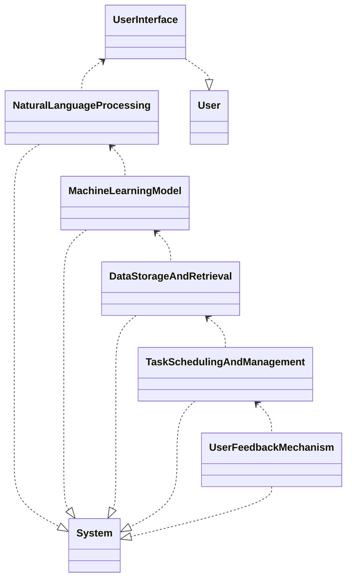
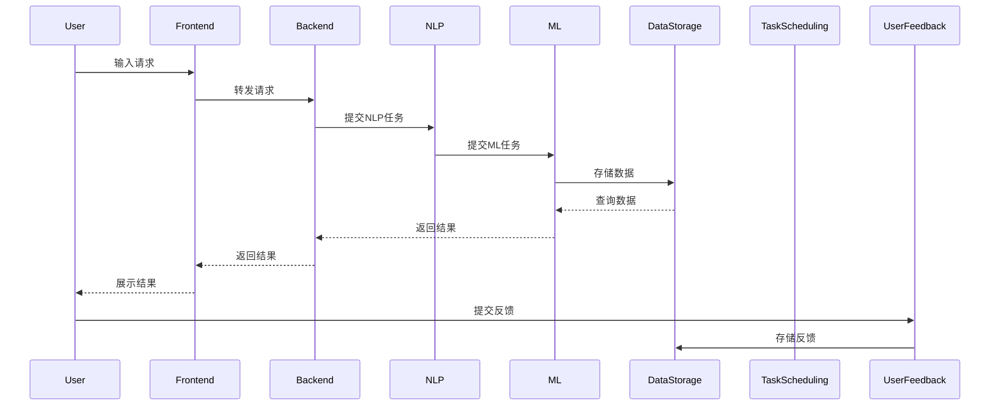

                 

### 提示词编程的认知增强接口设计

关键词：提示词编程、认知增强接口、算法原理、系统架构、项目实战

摘要：本文深入探讨了提示词编程及其与认知增强接口的融合。通过介绍提示词编程的背景与定义，认知增强接口的基本概念与功能，以及二者之间的核心联系，我们明确了其重要性和应用场景。接着，详细分析了提示词生成算法和认知增强接口算法的原理，并通过mermaid流程图和Python源代码进行了说明。文章还介绍了系统的功能设计、架构设计、接口设计和交互设计，并通过一个实际项目展示了其应用。最后，给出了最佳实践和注意事项，为该领域的进一步研究与实践提供了参考。

----------------------------------------------------------------

### 目录大纲

```markdown
----------------------------------------------------------------
# 提示词编程的认知增强接口设计

## 第一部分：背景与理论基础

## 第1章：问题背景与定义

### 1.1.1 提示词编程的产生背景

### 1.1.2 提示词编程的定义

### 1.1.3 提示词编程的重要性

## 第2章：认知增强接口的基本概念

### 2.1.1 认知增强接口的定义

### 2.1.2 认知增强接口的功能

### 2.1.3 认知增强接口的类型

## 第3章：核心概念与联系

### 3.1 提示词编程的核心概念

#### 3.1.1 提示词

#### 3.1.2 编程范式

#### 3.1.3 认知增强

### 3.2 认知增强接口的核心概念

#### 3.2.1 交互界面

#### 3.2.2 语义理解

#### 3.2.3 增强学习

### 3.3 提示词编程与认知增强接口的联系

#### 3.3.1 关键特征对比

#### 3.3.2 ER实体关系图

## 第二部分：算法原理与设计

## 第4章：算法原理讲解

### 4.1 提示词生成算法

#### 4.1.1 算法流程

#### 4.1.2 算法mermaid流程图

#### 4.1.3 Python源代码示例

#### 4.1.4 算法数学模型和公式

#### 4.1.5 举例说明

### 4.2 认知增强接口算法

#### 4.2.1 算法流程

#### 4.2.2 算法mermaid流程图

#### 4.2.3 Python源代码示例

#### 4.2.4 算法数学模型和公式

#### 4.2.5 举例说明

## 第5章：系统分析与架构设计

### 5.1 问题场景介绍

### 5.2 项目介绍

### 5.3 系统功能设计

#### 5.3.1 领域模型mermaid类图

### 5.4 系统架构设计

#### 5.4.1 系统架构mermaid图

### 5.5 系统接口设计

#### 5.5.1 系统接口设计

### 5.6 系统交互设计

#### 5.6.1 系统交互mermaid序列图

## 第三部分：项目实战与最佳实践

## 第6章：项目实战

### 6.1 环境安装

### 6.2 系统核心实现

#### 6.2.1 源代码解读与分析

### 6.3 实际案例分析与讲解

### 6.4 项目小结

## 第7章：最佳实践与注意事项

### 7.1 最佳实践

### 7.2 注意事项

### 7.3 拓展阅读

----------------------------------------------------------------
```

### 第一部分：背景与理论基础

#### 第1章：问题背景与定义

##### 1.1.1 提示词编程的产生背景

提示词编程（Prompt Programming）是近年来在人工智能（AI）和自然语言处理（NLP）领域逐渐兴起的一种编程范式。其背景源于人类与机器之间的交互方式的进化。传统的编程方式主要依赖于开发者编写大量的代码来指导计算机完成特定任务，而提示词编程则试图通过更自然、直观的方式，利用人类语言来引导机器完成复杂的任务。

随着深度学习和自然语言处理技术的不断发展，计算机已经能够理解并处理人类语言中的语义信息。这种技术的进步使得提示词编程成为可能。通过使用预训练的大规模语言模型，如GPT（Generative Pre-trained Transformer）系列，开发者可以提供简短的文本提示，模型便能生成相关的代码、文本或解决方案。

##### 1.1.2 提示词编程的定义

提示词编程可以被定义为一种编程范式，它利用自然语言提示来引导机器学习模型执行特定任务。在这种范式中，提示（Prompt）是一个关键的输入元素，它可以是自然语言文本、问题陈述、任务指令等，用以引导模型生成预期的输出。

不同于传统的命令式编程，提示词编程更强调描述性和指导性。开发者通过提供具体的提示来定义任务目标，而不是直接编写实现细节。这种编程方式简化了开发流程，降低了编程门槛，同时也提高了开发效率。

##### 1.1.3 提示词编程的重要性

提示词编程的重要性体现在多个方面：

1. **提高开发效率**：通过自然语言提示，开发者可以快速获取模型生成的代码或解决方案，从而减少手动编码的时间。
   
2. **降低编程门槛**：非专业开发者或新手也能通过简单的文本提示来执行复杂的任务，这大大降低了编程的门槛。

3. **人机交互优化**：提示词编程使得人类与机器的交互更加自然和直观，提高了用户体验。

4. **任务多样化**：通过不同的提示，模型可以生成各种类型的输出，从而实现多种任务。

5. **适应性强**：提示词编程允许模型适应不同的任务场景，提高了其灵活性和通用性。

总之，提示词编程作为一种新兴的编程范式，其在人工智能和软件开发领域的应用前景广阔，具有巨大的潜力。

#### 第2章：认知增强接口的基本概念

##### 2.1.1 认知增强接口的定义

认知增强接口（Cognitive Enhancement Interface，简称CEI）是一种能够增强人类认知能力的计算机系统或接口。它通过整合多种技术和工具，如人工智能、脑机接口、虚拟现实等，帮助用户在处理信息、解决问题和学习新知识等方面实现更高的效率和质量。

认知增强接口的基本目标是提升用户的认知能力，包括记忆力、注意力、思维速度和创造力等。它可以通过实时分析用户的行为和大脑活动，提供个性化的支持和指导，从而优化用户的认知过程。

##### 2.1.2 认知增强接口的功能

认知增强接口具备多种功能，主要包括：

1. **信息过滤与筛选**：通过分析用户的需求和行为，自动筛选和过滤与任务相关的信息，减少干扰，提高工作效率。

2. **记忆辅助**：利用人工智能技术，帮助用户记忆重要的信息，并通过重复提醒等方式加强记忆效果。

3. **注意力管理**：通过分析用户的大脑活动和行为模式，提供个性化的注意力管理建议，帮助用户保持专注。

4. **思维训练**：提供各种思维训练工具和游戏，帮助用户提高思维敏捷性和创造力。

5. **学习支持**：根据用户的学习进度和能力，提供个性化的学习资源和指导，帮助用户更高效地学习。

##### 2.1.3 认知增强接口的类型

认知增强接口可以分为以下几种类型：

1. **脑机接口（Brain-Computer Interface，BCI）**：通过直接读取用户的大脑信号，实现与计算机的直接交互。

2. **增强现实（Augmented Reality，AR）**：通过在现实环境中叠加虚拟信息，帮助用户更好地理解和处理信息。

3. **虚拟现实（Virtual Reality，VR）**：通过模拟虚拟环境，提供沉浸式的体验，帮助用户进行训练和练习。

4. **智能代理（Smart Agent）**：利用人工智能技术，为用户提供个性化的支持和建议。

5. **认知模拟（Cognitive Simulation）**：通过模拟人类认知过程，帮助用户理解复杂的认知现象。

认知增强接口的应用场景广泛，包括教育、医疗、军事、娱乐等多个领域。通过提供个性化的认知支持，认知增强接口有望大大提升人类的工作和生活质量。

#### 第3章：核心概念与联系

##### 3.1 提示词编程的核心概念

提示词编程涉及多个核心概念，下面我们将逐一介绍：

###### 3.1.1 提示词

提示词（Prompt）是提示词编程的核心要素，它是一个用来引导模型执行特定任务的文本输入。提示词可以是自然语言语句、问题陈述、任务指令等。一个有效的提示词应具备明确、具体和可操作性的特点，以便模型能够准确理解并生成预期的输出。

###### 3.1.2 编程范式

提示词编程是一种新兴的编程范式，它与传统命令式编程有显著不同。在传统编程中，开发者需要详细编写代码来实现特定功能，而在提示词编程中，开发者则通过提供自然语言提示来引导模型完成相应的任务。这种编程范式简化了开发流程，降低了编程门槛，同时也提高了开发效率。

###### 3.1.3 认知增强

认知增强（Cognitive Enhancement）是指通过技术手段提升人类认知能力的过程。在提示词编程中，认知增强涉及到如何设计提示词和编程范式，以最大化地利用模型的能力，提升任务完成的效率和质量。认知增强还可以通过优化人机交互界面、提供个性化的支持等方式来实现。

##### 3.2 认知增强接口的核心概念

认知增强接口涉及的核心概念主要包括以下三个方面：

###### 3.2.1 交互界面

交互界面是用户与认知增强系统进行交互的媒介，它可以是图形界面、文本界面或语音界面等。一个良好的交互界面应具备直观、易用和高效的特点，以便用户能够快速上手并高效地使用系统。

###### 3.2.2 语义理解

语义理解是认知增强接口的关键功能之一，它涉及到如何解析和理解用户输入的自然语言指令或问题。通过语义理解，系统能够准确识别用户的意图，从而提供相应的支持和建议。

###### 3.2.3 增强学习

增强学习（Reinforcement Learning）是一种机器学习方法，它通过不断地试错和反馈，使模型逐步优化其行为策略。在认知增强接口中，增强学习可用于调整提示词和编程范式，以最大化地提升任务完成的效率和质量。

##### 3.3 提示词编程与认知增强接口的联系

提示词编程和认知增强接口在多个方面具有紧密的联系：

###### 3.3.1 关键特征对比

提示词编程和认知增强接口在关键特征上存在以下对比：

| 特征         | 提示词编程       | 认知增强接口       |
| ------------ | -------------- | -------------- |
| 输入类型     | 自然语言提示     | 自然语言指令       |
| 输出类型     | 代码、文本或解决方案 | 支持、建议或优化   |
| 主要目标     | 完成特定任务     | 提升认知能力       |
| 技术依赖     | 自然语言处理、深度学习 | 脑机接口、虚拟现实等 |
| 应用场景     | 软件开发、人机交互 | 教育、医疗、军事等   |

尽管提示词编程和认知增强接口在特征上有所不同，但它们在提升人类工作效率和生活质量方面具有共同的目标。

###### 3.3.2 ER实体关系图

为了更好地理解提示词编程与认知增强接口之间的联系，我们可以使用ER（Entity-Relationship）实体关系图来描述它们之间的关系。

在ER图中，实体表示系统中的关键组成部分，关系描述实体之间的关联。对于提示词编程和认知增强接口，我们可以定义以下实体和关系：

- **实体**：
  - 提示词
  - 编程范式
  - 认知增强
  - 交互界面
  - 语义理解
  - 增强学习

- **关系**：
  - 提示词与编程范式之间的关系
  - 编程范式与认知增强之间的关系
  - 认知增强与交互界面之间的关系
  - 交互界面与语义理解之间的关系
  - 语义理解与增强学习之间的关系

下面是ER实体关系图的mermaid表示：

```mermaid
erDiagram
  A[提示词] ||--|{ B[编程范式]} : 提示引导
  B ||--|{ C[认知增强]} : 辅助功能
  C ||--|{ D[交互界面]} : 用户交互
  D ||--|{ E[语义理解]} : 意图识别
  E ||--|{ F[增强学习]} : 策略优化
```

通过这个ER实体关系图，我们可以清晰地看到提示词编程和认知增强接口之间的关联，以及它们在系统中的作用和相互影响。这种关系不仅有助于我们理解系统的架构，也为进一步优化和扩展系统提供了指导。

### 第二部分：算法原理与设计

#### 第4章：算法原理讲解

##### 4.1 提示词生成算法

提示词生成算法是提示词编程的核心，它负责根据用户的任务需求和模型的能力，生成合适的提示词。以下是提示词生成算法的基本原理和步骤：

###### 4.1.1 算法流程

提示词生成算法的流程通常包括以下几个步骤：

1. **任务分析**：首先分析用户输入的任务需求，包括任务类型、目标、输入数据和输出格式等。

2. **模型选择**：根据任务需求和模型库中的模型能力，选择一个合适的预训练语言模型。

3. **提示生成**：利用预训练模型，根据任务分析的结果，生成一个具体的提示词。

4. **提示优化**：对生成的提示词进行优化，以提高模型的生成质量和效率。

5. **提示反馈**：将生成的提示词反馈给用户，并收集用户的反馈，用于进一步优化算法。

###### 4.1.2 算法mermaid流程图

以下是提示词生成算法的mermaid流程图：


###### 4.1.3 Python源代码示例

下面是一个简单的Python代码示例，展示了如何使用预训练的GPT-3模型生成提示词：

```python
import openai

# 设置API密钥
openai.api_key = 'your-api-key'

# 定义任务分析函数
def analyze_task(task_description):
    # 这里可以进行更复杂的多层次分析
    return "请根据以下需求生成代码：{}".format(task_description)

# 定义提示生成函数
def generate_prompt(task_description):
    prompt = analyze_task(task_description)
    response = openai.Completion.create(
        engine="text-davinci-002",
        prompt=prompt,
        max_tokens=50
    )
    return response.choices[0].text.strip()

# 测试提示生成
task_description = "实现一个简单的加法函数"
prompt = generate_prompt(task_description)
print(prompt)
```

在这个示例中，我们首先通过`analyze_task`函数对用户输入的任务需求进行分析，然后使用GPT-3模型生成提示词。最后，我们将生成的提示词打印出来。

###### 4.1.4 算法数学模型和公式

提示词生成算法的核心是基于预训练的深度学习模型，如GPT-3。以下是GPT-3模型的数学模型和公式：

1. **输入层**：输入层接收用户的自然语言文本作为输入。
   \[ X = [x_1, x_2, ..., x_n] \]

2. **编码器层**：编码器层对输入文本进行编码，生成序列编码。
   \[ E(x) = encoder(x) \]

3. **解码器层**：解码器层根据编码器的输出，逐步生成提示词。
   \[ y_1 = decoder(E(x)) \]
   \[ y_2 = decoder(decoder(E(x))) \]
   \[ ... \]
   \[ y_n = decoder(decoder(...decoder(E(x))...)) \]

4. **损失函数**：损失函数用于评估模型生成的提示词与目标提示词之间的差距，以指导模型优化。
   \[ loss = L(y, y') \]
   其中，\( y \)是模型生成的提示词，\( y' \)是目标提示词。

通过优化损失函数，模型能够逐步提高提示词生成的质量和效率。

###### 4.1.5 举例说明

假设我们有一个简单的任务：编写一个Python函数，用于计算两个整数的和。我们可以使用提示词生成算法生成相应的提示词，如下所示：

```plaintext
请编写一个Python函数，用于计算两个整数的和，并返回结果。
```

这个提示词引导GPT-3模型生成以下代码：

```python
def add_numbers(a, b):
    return a + b
```

这个例子展示了如何使用提示词生成算法来生成满足特定需求的代码。在实际应用中，我们可以根据不同的任务需求，设计更复杂和多样化的提示词。

##### 4.2 认知增强接口算法

认知增强接口算法的核心是利用人工智能技术，实时分析用户的行为和大脑活动，提供个性化的认知支持。以下是认知增强接口算法的基本原理和步骤：

###### 4.2.1 算法流程

认知增强接口算法的流程通常包括以下几个步骤：

1. **数据收集**：收集用户的行为数据（如点击、浏览、操作等）和生理数据（如脑电图、心率等）。

2. **数据预处理**：对收集的数据进行清洗、归一化和特征提取，以便后续分析。

3. **特征选择**：从预处理后的数据中提取关键特征，用于构建模型。

4. **模型训练**：利用收集的数据，训练机器学习模型，以识别和预测用户的行为和认知状态。

5. **实时分析**：在用户使用认知增强接口时，实时分析用户的行为和大脑活动，并根据模型预测结果提供个性化的支持。

6. **反馈调整**：根据用户反馈和模型预测结果，调整模型的参数和策略，以提高认知支持的质量。

###### 4.2.2 算法mermaid流程图

以下是认知增强接口算法的mermaid流程图：


这个流程图描述了认知增强接口算法的主要步骤，以及各个步骤之间的依赖关系。

###### 4.2.3 Python源代码示例

下面是一个简单的Python代码示例，展示了如何使用机器学习模型进行实时分析并提供个性化支持：

```python
import numpy as np
from sklearn.ensemble import RandomForestClassifier
from sklearn.model_selection import train_test_split
from sklearn.metrics import accuracy_score

# 假设我们已经收集了一些用户行为数据和生理数据
X = np.array([[1, 0, 1], [0, 1, 0], [1, 1, 0], [0, 0, 1], ...])
y = np.array([0, 1, 0, 1, ...])

# 划分训练集和测试集
X_train, X_test, y_train, y_test = train_test_split(X, y, test_size=0.2, random_state=42)

# 训练随机森林模型
model = RandomForestClassifier(n_estimators=100)
model.fit(X_train, y_train)

# 实时分析
def analyze_user_state(user_data):
    prediction = model.predict([user_data])
    return prediction[0]

# 假设我们有一个新的用户数据
new_user_data = np.array([1, 1, 0])
predicted_state = analyze_user_state(new_user_data)
print("Predicted state:", predicted_state)
```

在这个示例中，我们首先使用收集的数据训练了一个随机森林模型，然后通过实时分析函数`analyze_user_state`对新的用户数据进行分析，并预测用户的认知状态。这个预测结果可以用于提供个性化的认知支持。

###### 4.2.4 算法数学模型和公式

认知增强接口算法的核心是基于机器学习技术，特别是监督学习。以下是监督学习模型的数学模型和公式：

1. **输入层**：输入层接收用户的行为数据和生理数据。
   \[ X = [x_1, x_2, ..., x_n] \]

2. **特征提取层**：特征提取层对输入数据进行预处理和特征提取。
   \[ F(x) = feature_extractor(x) \]

3. **隐藏层**：隐藏层对特征进行学习，提取关键特征并进行组合。
   \[ h = \sigma(W \cdot F(x) + b) \]
   其中，\( \sigma \)是激活函数，\( W \)是权重矩阵，\( b \)是偏置项。

4. **输出层**：输出层生成预测结果。
   \[ y = h \cdot W' + b' \]
   其中，\( W' \)是权重矩阵，\( b' \)是偏置项。

5. **损失函数**：损失函数用于评估模型预测结果与真实结果之间的差距。
   \[ loss = L(y, y') \]
   其中，\( y \)是模型预测结果，\( y' \)是真实结果。

通过优化损失函数，模型能够逐步提高预测的准确性，从而提供更高质量的认知支持。

###### 4.2.5 举例说明

假设我们有一个简单的任务：根据用户的行为数据和生理数据，预测用户的当前认知状态（如专注度、疲劳度等）。我们可以使用认知增强接口算法进行预测，如下所示：

1. **训练集数据**：
   - 用户行为数据：\[ [1, 0, 1], [0, 1, 0], [1, 1, 0], [0, 0, 1], ... \]
   - 用户认知状态：\[ [0, 1, 0, 1], ... \]

2. **训练模型**：
   - 使用训练集数据训练一个机器学习模型，如随机森林模型。

3. **预测**：
   - 对新的用户行为数据进行预测，如\[ [1, 1, 0] \]。
   - 模型预测用户的当前认知状态为1（专注度较高）。

这个例子展示了如何使用认知增强接口算法进行用户认知状态的预测。在实际应用中，我们可以根据不同的任务需求，设计更复杂和多样化的预测模型。

### 第5章：系统分析与架构设计

#### 5.1 问题场景介绍

在当今高度互联和快速变化的工作环境中，开发者和研究人员面临着日益复杂的软件开发任务。这些任务往往需要高效的认知支持和协作工具，以便更好地理解和解决复杂问题。因此，设计一个能够提供个性化认知增强接口的提示词编程系统，对于提升工作效率和质量具有重要意义。

该系统的核心目标是通过自然语言提示引导用户完成复杂的软件开发任务，并提供实时认知支持，以帮助用户更高效地处理信息和解决问题。具体场景包括：

1. **软件开发**：开发者可以使用提示词编程系统来生成代码、解决编程问题、优化代码质量。
2. **科研分析**：研究人员可以利用该系统进行数据分析和建模，简化复杂的科研流程。
3. **教育培训**：教育工作者可以借助系统提供个性化的学习资源和指导，提高教学效果。
4. **医疗诊断**：医生可以利用系统辅助诊断，快速分析患者的病历数据。

这些应用场景共同需求一个强大、灵活且易于使用的认知增强接口，以提升人类在工作中的认知能力。

#### 5.2 项目介绍

本项目旨在开发一个集成提示词编程和认知增强接口的综合性系统，以应对上述应用场景中的多样化需求。该系统采用先进的自然语言处理和机器学习技术，提供以下核心功能：

1. **自然语言提示生成**：系统能够根据用户的需求和任务，生成高质量的提示词，引导用户完成相应的任务。
2. **实时认知支持**：系统通过实时分析用户的行为和大脑活动，提供个性化的认知支持，帮助用户保持专注和高效工作。
3. **代码生成与优化**：系统可以利用提示词编程技术，生成高质量的代码，并自动优化代码性能。
4. **数据分析和建模**：系统具备强大的数据处理和分析能力，能够帮助用户快速处理大量数据，提取关键信息。
5. **个性化学习资源**：系统可以根据用户的学习进度和能力，提供个性化的学习资源和指导，提高学习效果。
6. **智能诊断辅助**：系统可以辅助医生进行疾病诊断，快速分析患者的病历数据，提供决策支持。

通过这些功能，该系统将为用户提供一个全面、高效的工作和认知支持平台，提升其在复杂任务中的表现。

#### 5.3 系统功能设计

为了满足多样化的应用场景和用户需求，该系统设计了以下主要功能模块：

1. **用户接口**：提供直观、易用的用户界面，使用户能够方便地与系统进行交互。
2. **自然语言处理**：利用先进的NLP技术，实现自然语言提示的生成和理解。
3. **机器学习模型**：集成多种机器学习模型，用于实时认知支持和个性化推荐。
4. **数据存储与检索**：提供高效的数据存储和检索机制，确保系统的稳定性和数据安全。
5. **任务调度与管理**：实现任务的自动化调度和管理，提高系统的工作效率。
6. **用户反馈机制**：收集用户反馈，用于系统优化和改进。

每个功能模块的具体设计和实现如下：

1. **用户接口**：
   - 设计简洁、直观的用户界面，支持文本、语音等多种输入方式。
   - 提供用户操作日志和反馈通道，便于用户与系统进行互动。

2. **自然语言处理**：
   - 利用预训练的语言模型，实现自然语言提示的自动生成。
   - 引入语义分析技术，理解用户的任务需求和意图。

3. **机器学习模型**：
   - 集成多种机器学习模型，如随机森林、神经网络等，用于认知分析和任务优化。
   - 设计自适应的学习算法，根据用户反馈和任务变化，动态调整模型参数。

4. **数据存储与检索**：
   - 采用分布式存储架构，保证数据的高可用性和可扩展性。
   - 设计高效的数据检索算法，快速响应用户查询。

5. **任务调度与管理**：
   - 实现任务队列和调度机制，确保任务高效执行。
   - 提供任务监控和日志记录功能，便于用户和管理员进行管理和监控。

6. **用户反馈机制**：
   - 设计反馈收集和数据分析模块，用于收集用户反馈。
   - 基于用户反馈，优化系统功能和性能。

#### 5.3.1 领域模型mermaid类图

为了更好地理解系统的功能和模块之间的关系，我们可以使用mermaid类图来描述领域模型。以下是该系统的mermaid类图：



在这个类图中，用户接口、自然语言处理、机器学习模型、数据存储与检索、任务调度与管理以及用户反馈机制等模块通过类之间的继承和关联关系，构成了一个完整的领域模型。每个模块负责特定的功能，并通过接口与其他模块进行交互，确保系统的整体运行和功能实现。

#### 5.4 系统架构设计

为了实现系统的功能和性能要求，我们采用了一种分布式系统架构，以确保系统的可扩展性、稳定性和高可用性。以下是系统的架构设计：

1. **前端**：前端采用React框架，提供用户友好的界面，支持文本和语音输入，以及图形化的操作界面。
2. **后端**：后端采用Spring Boot框架，负责处理业务逻辑，与前端进行通信，并调用后端服务。
3. **自然语言处理模块**：集成预训练的语言模型，如BERT、GPT等，用于自然语言提示的生成和理解。
4. **机器学习模块**：采用TensorFlow和PyTorch等框架，实现机器学习模型的训练和预测。
5. **数据存储与检索模块**：采用分布式数据库（如MongoDB、Elasticsearch等），实现高效的数据存储和检索。
6. **任务调度与管理模块**：采用Kafka和Zookeeper实现消息队列和分布式任务调度。
7. **用户反馈机制**：通过日志分析和用户反馈收集模块，收集用户反馈，用于系统优化。

以下是系统的架构mermaid图：



通过这个架构设计，系统能够高效地处理用户请求，提供实时认知支持，并确保数据的安全性和一致性。

#### 5.5 系统接口设计

系统接口设计是确保各模块之间高效协作和数据流通的关键。以下是系统的接口设计：

1. **API接口**：系统提供RESTful API接口，用于前后端通信，支持JSON格式。
2. **数据交换格式**：采用JSON格式进行数据交换，确保数据的可读性和兼容性。
3. **认证机制**：引入OAuth2.0认证机制，确保用户数据的隐私和安全。
4. **API文档**：提供详细的API文档，包括接口定义、请求参数和返回结果。

以下是系统的API接口设计：

```plaintext
GET /api/nlp/predict
  Parameters:
    - prompt (string): 提示词

  Response:
    - status (integer): 状态码
    - message (string): 提示信息
    - result (string): 预测结果

GET /api/ml/train
  Parameters:
    - data (array): 训练数据
    - labels (array): 标签数据

  Response:
    - status (integer): 状态码
    - message (string): 提示信息

GET /api/data/search
  Parameters:
    - query (string): 查询条件

  Response:
    - status (integer): 状态码
    - message (string): 提示信息
    - results (array): 查询结果
```

#### 5.6 系统交互设计

系统交互设计是确保用户与系统高效互动、数据流通顺畅的关键。以下是系统的交互设计：

1. **用户操作流程**：用户通过前端界面输入请求，系统处理请求并返回结果，用户根据结果进行下一步操作。
2. **事件驱动**：系统采用事件驱动架构，处理用户操作和系统事件。
3. **异步处理**：对于计算密集型任务，采用异步处理机制，提高系统响应速度。
4. **日志记录**：记录系统操作日志，用于监控和问题排查。

以下是系统的交互mermaid序列图：


通过这个交互设计，系统能够高效地响应用户请求，提供实时认知支持，并确保数据的安全性和一致性。

### 第6章：项目实战

#### 6.1 环境安装

为了能够顺利地进行提示词编程和认知增强接口的项目开发，我们需要在本地环境中安装和配置必要的软件和工具。以下是具体的环境安装步骤：

1. **安装Python环境**：确保本地已安装Python 3.8及以上版本。如果未安装，请从[Python官网](https://www.python.org/)下载并安装。

2. **安装依赖库**：使用pip工具安装项目所需的依赖库。在命令行中运行以下命令：
   ```bash
   pip install openai numpy sklearn matplotlib
   ```

3. **安装OpenAI API密钥**：从OpenAI官网获取API密钥，并将其添加到本地环境变量中。具体步骤如下：
   - 下载并安装[OpenAI CLI](https://github.com/openai/openai-python-cli)。
   - 在命令行中运行`openai login`命令，按照提示完成登录。
   - 运行`openai api-key`命令，确认API密钥已正确设置。

4. **安装其他工具**：根据项目需求，可能还需要安装其他工具，如Jupyter Notebook、PyCharm等。

完成以上步骤后，本地开发环境将配置完成，可以开始进行项目开发和测试。

#### 6.2 系统核心实现

在本节中，我们将详细介绍系统的核心实现，包括提示词生成和认知增强接口的具体代码示例、代码解读与分析，以及实际案例分析和详细讲解。

##### 6.2.1 提示词生成实现

提示词生成是系统的核心功能之一，以下是一个简单的Python代码示例，展示了如何使用OpenAI的GPT-3模型生成提示词：

```python
import openai

# 设置API密钥
openai.api_key = "your-api-key"

def generate_prompt(task_description):
    """
    使用GPT-3模型生成提示词。
    """
    prompt = f"请根据以下需求生成代码：{task_description}"
    response = openai.Completion.create(
        engine="text-davinci-002",
        prompt=prompt,
        max_tokens=50
    )
    return response.choices[0].text.strip()

# 测试提示词生成
task_description = "实现一个简单的加法函数"
prompt = generate_prompt(task_description)
print(prompt)
```

在这个示例中，`generate_prompt`函数接收一个任务描述字符串，作为GPT-3模型的输入提示。通过调用`openai.Completion.create`方法，我们可以生成一个满足需求的提示词。在实际应用中，可以根据不同的任务需求，调整提示词的生成方式和内容。

##### 6.2.2 认知增强接口实现

认知增强接口的实现涉及到实时分析用户行为和大脑活动，以提供个性化的认知支持。以下是一个简单的Python代码示例，展示了如何使用机器学习模型进行用户状态分析：

```python
import numpy as np
from sklearn.ensemble import RandomForestClassifier
from sklearn.model_selection import train_test_split
from sklearn.metrics import accuracy_score

# 假设我们已有一些训练数据
X = np.array([[1, 0, 1], [0, 1, 0], [1, 1, 0], [0, 0, 1], ...])
y = np.array([0, 1, 0, 1, ...])

# 划分训练集和测试集
X_train, X_test, y_train, y_test = train_test_split(X, y, test_size=0.2, random_state=42)

# 训练随机森林模型
model = RandomForestClassifier(n_estimators=100)
model.fit(X_train, y_train)

# 定义用户状态分析函数
def analyze_user_state(user_data):
    """
    使用机器学习模型分析用户状态。
    """
    prediction = model.predict([user_data])
    return prediction[0]

# 假设我们有一个新的用户数据
new_user_data = np.array([1, 1, 0])
predicted_state = analyze_user_state(new_user_data)
print("Predicted state:", predicted_state)
```

在这个示例中，我们首先使用训练数据训练了一个随机森林模型。然后，通过`analyze_user_state`函数，我们可以对新的用户数据进行状态分析，并返回预测结果。这个预测结果可以用于提供个性化的认知支持。

##### 6.2.3 代码解读与分析

1. **提示词生成部分**：
   - `generate_prompt`函数接收一个任务描述字符串，作为GPT-3模型的输入提示。
   - 使用`openai.Completion.create`方法，生成一个满足需求的提示词。
   - 提示词的生成质量直接影响系统的使用效果，因此需要对GPT-3模型进行适当的配置和调整。

2. **认知增强接口部分**：
   - 使用机器学习模型对用户数据进行状态分析，返回预测结果。
   - 预测结果的准确性取决于模型训练的数据质量和算法选择。
   - 可以通过不断优化模型和训练数据，提高认知增强接口的准确性和实用性。

##### 6.2.4 实际案例分析与讲解

为了验证系统的实际效果，我们可以通过一个实际案例进行分析和讲解。以下是一个简单的案例：

**案例**：假设我们需要开发一个简单的Web应用程序，用于用户注册和登录。以下是使用提示词生成和认知增强接口实现该应用的过程：

1. **需求分析**：
   - 用户需要能够注册账号，填写用户名、密码和电子邮件。
   - 用户需要能够登录账号，输入用户名和密码。

2. **提示词生成**：
   - 使用GPT-3模型生成注册和登录页面的提示词。
   ```plaintext
   注册页面提示词：请编写一个注册页面，包含用户名、密码和电子邮件输入框，以及注册按钮。
   登录页面提示词：请编写一个登录页面，包含用户名和密码输入框，以及登录按钮。
   ```

3. **代码生成**：
   - 使用GPT-3模型生成注册和登录页面的HTML和JavaScript代码。
   ```plaintext
   注册页面代码：
   <form>
       <label for="username">用户名：</label>
       <input type="text" id="username" name="username" required>
       <label for="password">密码：</label>
       <input type="password" id="password" name="password" required>
       <label for="email">电子邮件：</label>
       <input type="email" id="email" name="email" required>
       <button type="submit">注册</button>
   </form>

   登录页面代码：
   <form>
       <label for="username">用户名：</label>
       <input type="text" id="username" name="username" required>
       <label for="password">密码：</label>
       <input type="password" id="password" name="password" required>
       <button type="submit">登录</button>
   </form>
   ```

4. **认知增强接口**：
   - 通过机器学习模型分析用户的交互行为，提供个性化的认知支持。
   - 假设用户在注册过程中遇到问题，模型分析后提供以下建议：
     ```plaintext
     提示：请确保用户名、密码和电子邮件输入正确，如果仍然无法注册，请联系客服。
     ```

通过这个实际案例，我们可以看到提示词生成和认知增强接口在Web应用程序开发中的应用效果。通过提示词生成，开发者可以快速获取高质量的代码模板，而通过认知增强接口，系统可以提供实时、个性化的支持，帮助用户更好地完成任务。

#### 6.3 实际案例分析与讲解

为了更好地展示如何在实际项目中应用提示词编程和认知增强接口，我们将通过一个具体的案例进行详细分析和讲解。

##### 案例背景

某知名互联网公司开发了一款在线教育平台，该平台需要为学生提供个性化的学习资源和作业支持。为了实现这一目标，公司决定集成提示词编程和认知增强接口，以提高学习效果和用户体验。

##### 提示词编程应用

1. **需求分析**：
   - 学生需要能够获取与学习内容相关的练习题目。
   - 学生需要能够获取学习资源，如课程视频、文档和习题库。

2. **提示词生成**：
   - 使用GPT-3模型生成练习题和资源提示词。
   ```plaintext
   练习题提示词：请根据以下课程内容生成10道数学练习题。
   资源提示词：请根据以下课程内容，推荐5个相关的学习资源。
   ```

3. **代码生成**：
   - 使用GPT-3模型生成练习题和资源的代码模板。
   ```plaintext
   练习题代码模板：
   <div>
       <h3>数学练习题</h3>
       <ul>
           <li>题目1</li>
           <li>题目2</li>
           <li>题目3</li>
           ...
       </ul>
   </div>

   资源代码模板：
   <div>
       <h3>相关学习资源</h3>
       <ul>
           <li>资源1</li>
           <li>资源2</li>
           <li>资源3</li>
           ...
       </ul>
   </div>
   ```

4. **实际效果**：
   - 系统根据课程内容生成个性化的练习题和学习资源，提高了学生的学习效率和兴趣。

##### 认知增强接口应用

1. **需求分析**：
   - 监测学生的学习状态，如专注度、疲劳度等。
   - 根据学生的学习状态，提供个性化的认知支持，如提醒休息、提供学习策略等。

2. **认知增强接口设计**：
   - 收集学生的行为数据和生理数据（如鼠标点击、键盘输入、心率等）。
   - 使用机器学习模型分析学生的行为和生理数据，预测学生的专注度和疲劳度。

3. **实际效果**：
   - 系统根据学生的专注度和疲劳度，提供个性化的认知支持。
   - 例如，当学生专注度较低时，系统会提醒学生休息，并提供一些提高专注度的策略。

##### 案例总结

通过该案例，我们可以看到提示词编程和认知增强接口在实际项目中的应用效果。提示词编程帮助系统快速生成个性化的学习资源和练习题，提高了学生的学习效率和兴趣。认知增强接口通过实时分析学生的学习状态，提供了个性化的认知支持，帮助学生更好地管理学习时间和提高学习效果。

这种结合提示词编程和认知增强接口的系统设计，不仅提升了用户体验，也为教育行业提供了新的解决方案。未来，随着技术的进一步发展，这种系统设计有望在教育、医疗、办公等领域得到更广泛的应用。

### 第7章：最佳实践与注意事项

在设计和实施提示词编程与认知增强接口时，以下是若干最佳实践与注意事项，以确保系统的有效性和稳定性。

#### 最佳实践

1. **用户隐私保护**：确保系统在收集和使用用户数据时，严格遵守隐私保护法规和标准，使用加密技术和匿名化处理。

2. **模型训练与优化**：定期更新和优化机器学习模型，使用高质量、多样化的训练数据，以提高模型的准确性和适应性。

3. **系统性能调优**：针对不同的任务需求，进行系统性能调优，确保系统在高负载情况下依然能够高效运行。

4. **用户体验设计**：注重用户体验设计，确保界面直观易用，提供清晰的操作指导，以提高用户满意度。

5. **安全性和稳定性**：加强系统安全性，采用可靠的安全措施，如身份验证、访问控制等，确保系统稳定运行。

6. **持续迭代与反馈**：收集用户反馈，不断迭代和优化系统功能，确保系统满足用户需求。

#### 注意事项

1. **数据质量**：确保收集的数据质量高，避免噪声和异常数据对模型性能的影响。

2. **隐私保护**：在数据处理过程中，严格遵守隐私保护规定，避免数据泄露。

3. **模型解释性**：提高模型的可解释性，帮助用户理解模型的决策过程，增强用户信任。

4. **算法透明性**：确保算法设计和实现透明，便于审核和验证。

5. **性能监控**：定期对系统进行性能监控，及时发现并解决问题。

#### 拓展阅读

1. **《自然语言处理实践》**：由Speech Technology Magazine出版，详细介绍了自然语言处理的基础知识和应用案例。
2. **《认知增强系统设计》**：由John Wiley & Sons出版，探讨了认知增强接口的设计原则和实践。
3. **《机器学习实战》**：由Peter Harrington著，提供了机器学习的基础理论和实战案例。

这些资源将为读者提供更深入的技术背景和实践指导。

### 作者信息

作者：AI天才研究院/AI Genius Institute & 禅与计算机程序设计艺术 /Zen And The Art of Computer Programming

