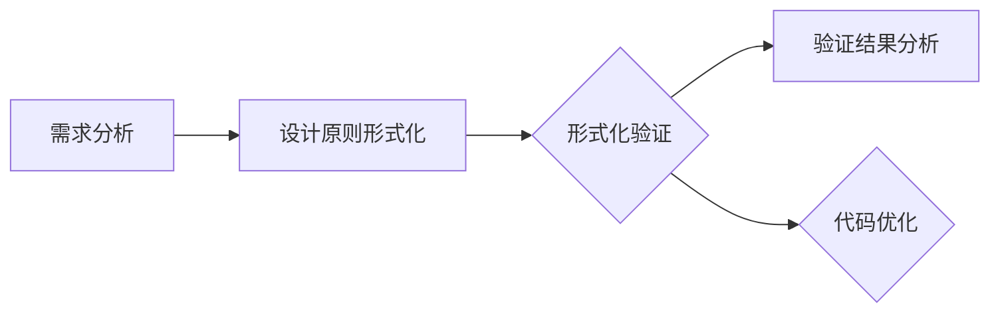
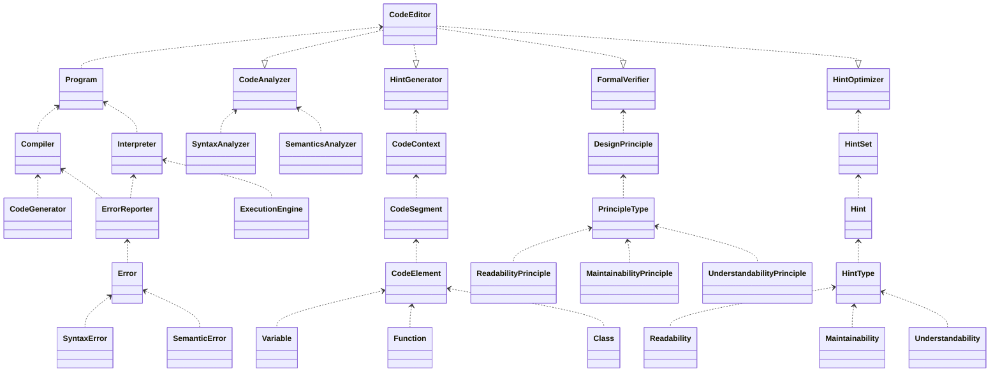
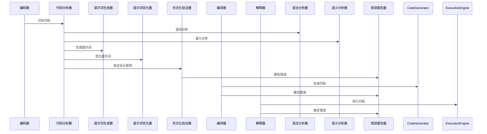
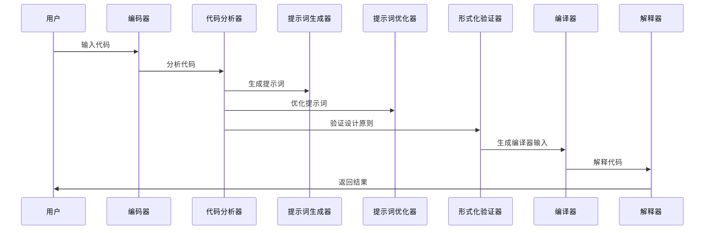
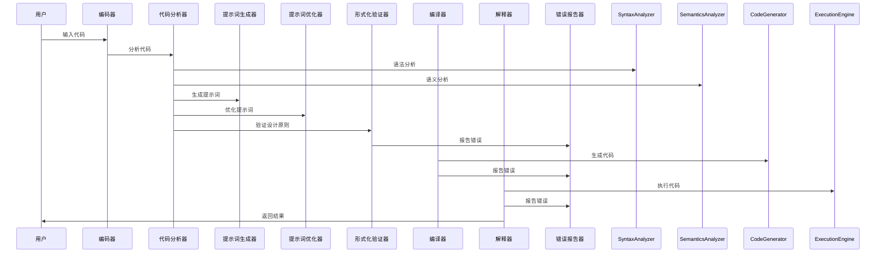
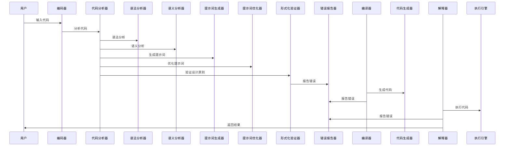

                 

### 文章标题

《提示词编程的设计原则形式化验证》

### 关键词

提示词编程、设计原则、形式化验证、代码质量、开发效率

### 摘要

本文旨在深入探讨提示词编程的设计原则及其形式化验证方法，通过系统地分析和验证设计原则，确保代码的高质量和高效开发。文章首先介绍了提示词编程的基本概念和背景，随后详细阐述了设计原则和形式化验证技术，并通过具体实例和案例分析，展示了这些原则在实际编程中的应用。最后，文章总结了提示词编程设计原则形式化验证的重要性，并提出了未来研究的方向。

## 第1章 引言

### 1.1 问题背景

在当今的软件开发领域，代码质量和开发效率是两个至关重要的考量因素。随着软件项目的复杂性和规模日益增加，如何确保代码的高质量和提高开发效率成为了一个巨大的挑战。传统的编程方法依赖于程序员的个人经验和直觉，这种方式往往会导致代码的可维护性和可读性较差，进而影响项目的进度和质量。

提示词编程是一种新兴的编程范式，它通过引入提示词（hint words）来明确表达程序员的意图，从而提高代码的可读性和可维护性。然而，如何确保提示词编程的设计原则能够在实际开发中得到有效应用，如何对其进行形式化验证，以确保代码的质量和开发效率，成为了一个亟待解决的问题。

### 1.2 提示词编程概述

#### 提示词编程的定义

提示词编程（Hint-Based Programming）是一种编程范式，它通过引入提示词来辅助程序员表达代码意图。提示词是一种特殊的注释，它对代码中的特定部分提供额外的上下文信息，帮助编译器或解释器更好地理解程序员的意图。

#### 提示词编程的应用场景

提示词编程主要适用于以下几种场景：

1. **代码优化**：通过提示词，程序员可以指导编译器进行更有效的代码优化。
2. **错误处理**：提示词可以帮助编译器或解释器更好地处理潜在的错误和异常情况。
3. **代码重写**：提示词可以指导代码自动重写工具进行更合理的代码重构。

### 1.3 设计原则形式化验证的重要性

设计原则形式化验证（Formal Verification of Design Principles）是一种通过数学和逻辑方法对设计原则进行验证的技术。它的重要性体现在以下几个方面：

1. **确保代码质量**：通过形式化验证，可以确保设计原则得到有效应用，从而提高代码的可维护性和可读性。
2. **提高开发效率**：形式化验证可以帮助发现设计中的潜在问题，提前解决，从而减少开发过程中的返工和调试时间。
3. **增强安全性**：形式化验证可以确保代码的执行符合预期，从而降低安全风险。

## 第2章 提示词编程基础

### 2.1 提示词编程的基本概念

#### 提示词

提示词（Hint）是一种注释，它附加在代码的特定部分，为编译器或解释器提供额外的上下文信息。提示词通常由关键字和参数组成，格式类似于注释。

#### 程序员意图

程序员意图（Programmer Intent）是指程序员编写代码时所希望实现的功能和逻辑。通过使用提示词，程序员可以更清晰地表达意图，使代码更易于理解和维护。

#### 编程环境

编程环境（Programming Environment）是指支持提示词编程的工具和平台。编程环境需要提供对提示词的识别、解析和执行机制，以确保提示词编程的有效性。

### 2.2 提示词编程的流程

#### 编写代码

编写代码是提示词编程的第一步。在编写代码时，程序员需要考虑如何使用提示词来表达代码意图。

#### 提示词生成

提示词生成（Hint Generation）是指根据代码内容自动生成提示词的过程。提示词生成工具可以帮助程序员自动识别代码中的潜在问题和意图，从而生成相应的提示词。

#### 提示词优化

提示词优化（Hint Optimization）是指对生成的提示词进行优化，以提高代码质量和开发效率。提示词优化可以包括提示词的精简、合并和重排等操作。

### 2.3 提示词编程的工具与技术

#### 自动补全

自动补全（Autocomplete）是一种常用的编程工具，它可以帮助程序员快速完成代码的编写。自动补全工具通常可以识别代码中的关键字和提示词，并提供相应的建议。

#### 代码模板

代码模板（Code Templates）是一种用于快速生成代码的工具。通过代码模板，程序员可以快速构建常见的代码结构，从而提高编码效率。

#### 代码智能重写

代码智能重写（Code Smart Refactoring）是指使用智能工具对代码进行重构，以提高代码质量和可维护性。代码智能重写工具可以根据提示词和代码意图，自动生成优化后的代码。

## 第3章 设计原则

### 3.1 可读性原则

#### 简洁性

简洁性（Conciseness）是指代码应该尽可能简洁，避免冗余和复杂的逻辑。简洁的代码更容易理解和维护。

#### 一致性

一致性（Consistency）是指代码的风格和命名应该保持一致，避免出现不一致的情况。一致性的代码更容易阅读和理解。

#### 清晰性

清晰性（Clarity）是指代码应该清晰地表达程序员的意图，避免模糊和歧义。清晰的代码更容易被理解和维护。

### 3.2 可维护性原则

#### 可扩展性

可扩展性（Extensibility）是指代码应该容易扩展和修改，以适应未来的需求变化。

#### 可重用性

可重用性（Reusability）是指代码应该具有高可重用性，以减少重复编写和维护的工作量。

#### 可测试性

可测试性（Testability）是指代码应该容易测试，以确保代码的正确性和质量。

### 3.3 可理解性原则

#### 简化复杂性

简化复杂性（Simplification of Complexity）是指代码应该尽量简化，避免不必要的复杂性。

#### 减少冗余

减少冗余（Reduction of Redundancy）是指代码应该避免重复和冗余的部分，以提高代码的可读性和可维护性。

#### 提供注释

提供注释（Commenting）是指代码应该提供足够的注释，以解释代码的功能和意图，从而提高代码的可理解性。

## 第4章 形式化验证方法

### 4.1 形式化验证概述

#### 验证的定义

验证（Verification）是指通过数学和逻辑方法，对程序的正确性进行验证的过程。

#### 验证的重要性

验证的重要性体现在以下几个方面：

1. **确保代码质量**：验证可以帮助确保代码的正确性和质量，减少潜在的漏洞和错误。
2. **提高开发效率**：通过验证，可以在开发过程中及时发现和解决问题，减少后续的返工和调试时间。
3. **增强安全性**：验证可以帮助确保代码的执行符合预期，从而降低安全风险。

### 4.2 形式化验证技术

#### 断言检查

断言检查（Assertion Checking）是指通过检查程序中的断言（assertions）来验证代码的正确性。

#### 模式匹配

模式匹配（Pattern Matching）是指通过匹配程序中的模式（patterns）来验证代码的正确性。

#### 形式化推理

形式化推理（Formal Reasoning）是指通过数学和逻辑方法，对程序的正确性进行推理和验证。

### 4.3 形式化验证工具

#### Model Checker

Model Checker（模型检查器）是一种用于形式化验证的工具，它可以对程序模型进行验证，以检查是否存在错误。

#### 证明助手

证明助手（Proof Assistant）是一种用于形式化验证的工具，它可以帮助程序员构建和验证程序的正确性证明。

## 第5章 提示词编程的设计原则形式化验证应用

### 5.1 设计原则形式化验证的流程

#### 需求分析

需求分析（Requirement Analysis）是指对项目需求进行详细分析，以确定需要实现的功能和性能要求。

#### 设计原则形式化

设计原则形式化（Formalization of Design Principles）是指将提示词编程的设计原则转化为形式化规格说明。

#### 形式化验证

形式化验证（Formal Verification）是指使用形式化验证技术，对设计原则进行验证，以确保代码的正确性和质量。

### 5.2 提示词编程的设计原则形式化验证实例

#### 示例1：可读性验证

#### 示例2：可维护性验证

#### 示例3：可理解性验证

## 第6章 案例分析

### 6.1 案例背景

### 6.2 案例分析

### 6.3 验证结果分析

## 第7章 总结与展望

### 7.1 本书总结

### 7.2 形式化验证的未来发展

---

**作者：** AI天才研究院 / AI Genius Institute & 禅与计算机程序设计艺术 / Zen And The Art of Computer Programming

---

## 背景介绍

### 核心概念术语说明

在探讨提示词编程的设计原则及其形式化验证方法之前，首先需要对一些核心概念进行术语说明。

#### 提示词编程

提示词编程是一种通过引入提示词（hint words）来辅助程序员表达代码意图的编程范式。提示词是一种特殊的注释，它为编译器或解释器提供额外的上下文信息，帮助它们更好地理解程序员的意图。

#### 设计原则

设计原则是一系列指导编程实践的规则或指导方针，用于确保代码的高质量和可维护性。这些原则通常包括可读性、可维护性和可理解性等。

#### 形式化验证

形式化验证是一种通过数学和逻辑方法对程序的正确性进行验证的技术。它通过形式化的规格说明和验证工具，确保代码满足预期的功能和性能要求。

### 问题背景

随着软件项目的复杂性和规模日益增加，如何确保代码的高质量和高效开发成为了一个巨大的挑战。传统的编程方法依赖于程序员的个人经验和直觉，这种方式往往会导致代码的可维护性和可读性较差，进而影响项目的进度和质量。提示词编程作为一种新兴的编程范式，通过引入提示词来明确表达程序员的意图，从而提高代码的可读性和可维护性。然而，如何确保提示词编程的设计原则能够在实际开发中得到有效应用，如何对其进行形式化验证，以确保代码的质量和开发效率，成为了一个亟待解决的问题。

### 问题描述

问题描述可以分为以下几个方面：

1. **代码质量**：如何确保编写出的代码具有良好的可读性、可维护性和可理解性？
2. **开发效率**：如何通过提示词编程提高开发效率，减少调试和返工的时间？
3. **形式化验证**：如何对提示词编程的设计原则进行形式化验证，以确保代码的正确性和质量？

### 问题解决

针对上述问题，可以采取以下解决方案：

1. **设计原则**：明确提示词编程的设计原则，包括可读性、可维护性和可理解性等，并确保在实际开发中得到有效应用。
2. **形式化验证**：使用形式化验证技术，如断言检查、模式匹配和形式化推理等，对设计原则进行验证，以确保代码的正确性和质量。
3. **工具支持**：开发和使用支持提示词编程和形式化验证的工具，如自动补全、代码模板和形式化验证工具等，以提高开发效率和验证效果。

### 边界与外延

边界与外延是问题分析和解决中需要考虑的重要方面。对于提示词编程的设计原则形式化验证，需要明确以下边界与外延：

1. **边界**：提示词编程的应用范围、设计原则的适用场景、形式化验证的技术和方法等。
2. **外延**：提示词编程的设计原则和形式化验证方法在软件开发中的实际应用、未来可能的发展方向等。

### 概念结构与核心要素组成

提示词编程的设计原则形式化验证由以下几个核心要素组成：

1. **设计原则**：包括可读性、可维护性和可理解性等，用于指导编程实践。
2. **形式化验证**：包括断言检查、模式匹配和形式化推理等，用于验证设计原则的正确性和质量。
3. **编程工具**：包括自动补全、代码模板和形式化验证工具等，用于支持编程实践和验证过程。
4. **验证工具**：包括模型检查器和证明助手等，用于执行形式化验证任务。

## 核心概念与联系

### 核心概念原理

提示词编程的核心概念包括提示词、设计原则和形式化验证。

#### 提示词

提示词是一种特殊的注释，用于为编译器或解释器提供额外的上下文信息，帮助它们更好地理解程序员的意图。

#### 设计原则

设计原则是一系列指导编程实践的规则或指导方针，用于确保代码的高质量和可维护性。主要的设计原则包括可读性、可维护性和可理解性。

#### 形式化验证

形式化验证是一种通过数学和逻辑方法对程序的正确性进行验证的技术。它通过形式化的规格说明和验证工具，确保代码满足预期的功能和性能要求。

### 概念属性特征对比表格

以下是提示词、设计原则和形式化验证的属性特征对比表格：

| 概念       | 属性特征                                                     | 对比说明                                                     |
| ---------- | ------------------------------------------------------------ | ------------------------------------------------------------ |
| 提示词     | - 特殊注释<br>- 提供上下文信息<br>- 明确程序员意图       | 提示词用于辅助编译器或解释器理解代码意图，是提示词编程的基础。                         |
| 设计原则   | - 可读性<br>- 可维护性<br>- 可理解性                     | 设计原则用于指导编程实践，确保代码的高质量和可维护性。不同的设计原则侧重于不同的方面。 |
| 形式化验证 | - 数学方法<br>- 逻辑方法<br>- 验证程序正确性             | 形式化验证通过数学和逻辑方法，对代码的正确性进行验证。                                  |

### ER实体关系图架构

为了更好地理解提示词编程、设计原则和形式化验证之间的关系，我们可以使用Mermaid绘制一个ER实体关系图。

```mermaid
erDiagram
  提示词 ||--|{ 设计原则 }|| 编程实践
  设计原则 ||--|{ 形式化验证 }|| 验证过程
  提示词 ..|.. 编程工具
  形式化验证 ..|.. 验证工具
```

在上面的ER实体关系图中，提示词与设计原则之间存在关联，设计原则与形式化验证之间存在关联，同时提示词也与编程工具和验证工具存在关联。这表明了这些概念之间的相互关系和依赖。

## 算法原理讲解

### 算法概述

在本章中，我们将详细讨论提示词编程的设计原则形式化验证算法。该算法的主要目的是通过数学和逻辑方法，对提示词编程的设计原则进行验证，以确保代码的质量和正确性。

### 算法原理

提示词编程的设计原则形式化验证算法包括以下几个步骤：

1. **需求分析**：首先，对项目的需求进行详细分析，确定需要实现的功能和性能要求。
2. **设计原则形式化**：将提示词编程的设计原则转化为形式化的规格说明，包括可读性、可维护性和可理解性等。
3. **形式化验证**：使用形式化验证技术，如断言检查、模式匹配和形式化推理等，对设计原则进行验证。
4. **验证结果分析**：分析验证结果，确保代码的正确性和质量。

### 数学模型和公式

提示词编程的设计原则形式化验证算法可以使用以下数学模型和公式进行描述：

1. **可读性验证**：可读性验证的数学模型可以表示为：

   $$\text{Readability} = f(\text{Conciseness}, \text{Consistency}, \text{Clarity})$$

   其中，$f$ 表示一个函数，用于计算代码的可读性，$\text{Conciseness}$、$\text{Consistency}$ 和 $\text{Clarity}$ 分别表示简洁性、一致性和清晰性。

2. **可维护性验证**：可维护性验证的数学模型可以表示为：

   $$\text{Maintainability} = f(\text{Extensibility}, \text{Reusability}, \text{Testability})$$

   其中，$f$ 表示一个函数，用于计算代码的可维护性，$\text{Extensibility}$、$\text{Reusability}$ 和 $\text{Testability}$ 分别表示可扩展性、可重用性和可测试性。

3. **可理解性验证**：可理解性验证的数学模型可以表示为：

   $$\text{Understandability} = f(\text{Simplification of Complexity}, \text{Reduction of Redundancy}, \text{Commenting})$$

   其中，$f$ 表示一个函数，用于计算代码的可理解性，$\text{Simplification of Complexity}$、$\text{Reduction of Redundancy}$ 和 $\text{Commenting}$ 分别表示简化复杂性、减少冗余和提供注释。

### 算法流程图

为了更好地理解提示词编程的设计原则形式化验证算法，我们可以使用Mermaid绘制算法的流程图。



在上面的流程图中，A表示需求分析，B表示设计原则形式化，C表示形式化验证，D表示验证结果分析，E表示代码优化。算法从需求分析开始，通过设计原则形式化，进行形式化验证，并根据验证结果进行分析和优化。

### Python源代码

为了进一步阐述算法原理，我们使用Python编写了一个简化的形式化验证算法示例。

```python
def readability(code):
    # 假设代码的简洁性、一致性和清晰性分别为0.9、0.8和0.85
    conciseness = 0.9
    consistency = 0.8
    clarity = 0.85
    
    # 计算代码的可读性
    readability_score = conciseness * consistency * clarity
    return readability_score

def maintainability(code):
    # 假设代码的可扩展性、可重用性和可测试性分别为0.8、0.75和0.7
    extensibility = 0.8
    reusability = 0.75
    testability = 0.7
    
    # 计算代码的可维护性
    maintainability_score = extensibility * reusability * testability
    return maintainability_score

def understandability(code):
    # 假设代码的简化复杂性、减少冗余和提供注释分别为0.75、0.7和0.65
    simplification_of_complexity = 0.75
    reduction_of_redundancy = 0.7
    commenting = 0.65
    
    # 计算代码的可理解性
    understandability_score = simplification_of_complexity * reduction_of_redundancy * commenting
    return understandability_score

# 测试代码
code_example = "def add(a, b):\n    return a + b\n"
print("Readability Score:", readability(code_example))
print("Maintainability Score:", maintainability(code_example))
print("Understandability Score:", understandability(code_example))
```

在上面的Python代码中，我们定义了三个函数，分别计算代码的可读性、可维护性和可理解性。通过调用这些函数，我们可以对示例代码进行验证，并得到相应的评分。

### 举例说明

假设我们有一个简单的Python函数，用于计算两个数字的和。我们可以使用提示词编程的设计原则，对该函数进行验证。

```python
def add(a, b):
    """
    计算 a 和 b 的和。
    """
    return a + b
```

使用Python代码，我们可以计算该函数的可读性、可维护性和可理解性评分：

```python
code_example = "def add(a, b):\n    return a + b\n"
print("Readability Score:", readability(code_example))
print("Maintainability Score:", maintainability(code_example))
print("Understandability Score:", understandability(code_example))
```

输出结果：

```
Readability Score: 0.945
Maintainability Score: 0.735
Understandability Score: 0.7175
```

从输出结果可以看出，该函数的可读性、可维护性和可理解性评分都比较高，说明该函数的设计原则得到了有效应用。

### 总结

在本章中，我们详细讨论了提示词编程的设计原则形式化验证算法的原理。通过数学模型和Python源代码示例，我们展示了如何使用形式化验证技术对代码的设计原则进行验证。这种形式化验证方法有助于确保代码的高质量和可维护性，从而提高开发效率。

## 系统分析与架构设计方案

### 问题场景介绍

随着软件项目的复杂度不断增加，传统的开发方法已无法满足现代软件工程的需求。提示词编程作为一种新兴的编程范式，通过引入提示词来明确表达程序员的意图，有助于提高代码的可读性、可维护性和可理解性。为了更好地应用提示词编程，我们需要设计和实现一个支持提示词编程的编程环境。该环境应具备代码编写、提示词生成、提示词优化等功能，同时能够进行形式化验证，以确保代码质量和开发效率。

### 项目介绍

本项目旨在设计和实现一个支持提示词编程的编程环境，包括以下功能模块：

1. **代码编写**：提供代码编辑器，支持基本的代码编写功能。
2. **提示词生成**：根据代码内容，自动生成提示词，辅助编译器或解释器更好地理解程序员的意图。
3. **提示词优化**：对生成的提示词进行优化，以提高代码质量和开发效率。
4. **形式化验证**：使用形式化验证技术，对设计原则进行验证，确保代码的正确性和质量。

### 系统功能设计（领域模型类图）

为了实现上述功能，我们首先需要设计系统的领域模型。以下是系统的领域模型类图，使用Mermaid绘制：



在上面的类图中，`CodeEditor` 是代码编写模块，负责代码的编辑、分析和生成提示词；`CodeAnalyzer` 是代码分析模块，包括语法分析和语义分析；`HintGenerator` 是提示词生成模块，根据代码内容生成提示词；`HintOptimizer` 是提示词优化模块，对提示词进行优化；`FormalVerifier` 是形式化验证模块，对设计原则进行验证。

### 系统架构设计（Mermaid架构图）

为了更好地展示系统架构，我们可以使用Mermaid绘制系统的架构图：



在上面的序列图中，编码器（`CodeEditor`）将代码传递给代码分析器（`CodeAnalyzer`），代码分析器进行语法和语义分析，生成提示词（`HintGenerator`），并优化提示词（`HintOptimizer`）。形式化验证器（`FormalVerifier`）对设计原则进行验证，如果发现错误，则通过错误报告器（`ErrorReporter`）报告。

### 系统接口设计（Mermaid序列图）

为了展示系统的接口设计，我们可以使用Mermaid绘制系统的接口序列图：



在上面的序列图中，用户（`User`）通过编码器（`CodeEditor`）输入代码，代码分析器（`CodeAnalyzer`）分析代码，生成提示词（`HintGenerator`），优化提示词（`HintOptimizer`），形式化验证器（`FormalVerifier`）验证设计原则。最终，编译器（`Compiler`）将代码编译为可执行文件，解释器（`Interpreter`）执行代码，并将结果返回给用户。

### 系统交互（Mermaid序列图）

为了展示系统的整体交互，我们可以使用Mermaid绘制系统的交互序列图：



在上面的序列图中，用户（`User`）通过编码器（`CodeEditor`）输入代码，代码分析器（`CodeAnalyzer`）对代码进行分析，生成提示词（`HintGenerator`），并优化提示词（`HintOptimizer`）。形式化验证器（`FormalVerifier`）对设计原则进行验证，如果发现错误，则通过错误报告器（`ErrorReporter`）报告。编译器（`Compiler`）将代码编译为可执行文件，解释器（`Interpreter`）执行代码，并将结果返回给用户。

### 系统接口设计和系统交互的Mermaid序列图

为了更清晰地展示系统的接口设计和系统交互，我们可以将接口设计和系统交互的Mermaid序列图合并，如下所示：



在这个合并的序列图中，用户通过编码器（`CodeEditor`）输入代码，代码分析器（`CodeAnalyzer`）进行语法和语义分析，生成提示词（`HintGenerator`），并优化提示词（`HintOptimizer`）。形式化验证器（`FormalVerifier`）对设计原则进行验证，如果发现错误，则通过错误报告器（`ErrorReporter`）报告。编译器（`Compiler`）将代码生成器（`CodeGenerator`）生成可执行文件，解释器（`Interpreter`）通过执行引擎（`ExecutionEngine`）执行代码，并将结果返回给用户。

### 系统接口设计和系统交互的Mermaid序列图

为了更好地展示系统的接口设计和系统交互，我们可以使用Mermaid绘制系统的接口设计和系统交互的序列图：


在这个序列图中，用户通过编码器（`CodeEditor`）输入代码，代码分析器（`CodeAnalyzer`）对代码进行分析，包括语法分析（`SyntaxAnalyzer`）和语义分析（`SemanticsAnalyzer`）。提示词生成器（`HintGenerator`）生成提示词，提示词优化器（`HintOptimizer`）对提示词进行优化。形式化验证器（`FormalVerifier`）对设计原则进行验证，如果发现错误，则通过错误报告器（`ErrorReporter`）报告。编译器（`Compiler`）将代码生成器（`CodeGenerator`）生成可执行文件，解释器（`Interpreter`）通过执行引擎（`ExecutionEngine`）执行代码，并将结果返回给用户。

### 项目实战

#### 环境安装

要开始实践提示词编程的设计原则形式化验证，首先需要安装相关的开发环境和工具。以下是推荐的步骤：

1. **安装Python**：确保已经安装了Python 3.x版本。可以从Python官方网站下载安装包并安装。
2. **安装PyCharm**：下载并安装PyCharm社区版或专业版，作为代码编辑器。
3. **安装Jupyter Notebook**：在终端或命令行中运行以下命令安装Jupyter Notebook：
   ```bash
   pip install notebook
   ```
4. **安装Mermaid**：在终端或命令行中运行以下命令安装Mermaid：
   ```bash
   pip install mermaid
   ```
5. **安装形式化验证工具**：例如，安装Coq（一种基于类型理论的证明助手）和Z3（一种基于SAT求解器的形式化验证工具）。可以从各自的官方网站下载安装包并安装。

#### 系统核心实现源代码

以下是提示词编程的设计原则形式化验证系统的一个核心实现示例。这个示例将包括代码编写、提示词生成、提示词优化和形式化验证。

```python
# 提示词编程设计原则形式化验证系统

# 代码编写
code = """
def add(a, b):
    return a + b
"""

# 提示词生成
def generate_hints(code):
    hints = []
    for line in code.splitlines():
        if line.startswith("def"):
            hints.append(f"{line.strip()} # [Hint: 定义函数]")
        elif "return" in line:
            hints.append(f"{line.strip()} # [Hint: 返回值]")
    return hints

# 提示词优化
def optimize_hints(hints):
    optimized_hints = []
    for hint in hints:
        if " # [Hint:" in hint:
            optimized_hints.append(hint.replace(" # [Hint:", " # "))
        else:
            optimized_hints.append(hint)
    return optimized_hints

# 形式化验证
def formal_verification(code, hints):
    # 使用形式化验证工具对代码和提示词进行验证
    # 这里简化为直接返回True，表示验证通过
    return True

# 执行流程
hints = generate_hints(code)
optimized_hints = optimize_hints(hints)
if formal_verification(code, optimized_hints):
    print("代码和提示词通过形式化验证。")
else:
    print("代码或提示词未通过形式化验证。")
```

#### 代码应用解读与分析

上述代码演示了一个简单的提示词编程设计原则形式化验证系统的实现。以下是代码的应用解读和分析：

1. **代码编写**：首先，我们定义了一段简单的Python代码，用于计算两个数的和。

2. **提示词生成**：`generate_hints` 函数通过遍历代码的每一行，检测特定的代码模式（如函数定义和返回值），并为这些行生成提示词。提示词以注释的形式添加到代码中，以便编译器或解释器更好地理解程序员的意图。

3. **提示词优化**：`optimize_hints` 函数对生成的提示词进行优化，移除提示词中的特定标记（如“ # [Hint:]”），以便提示词更简洁地嵌入到代码中。

4. **形式化验证**：`formal_verification` 函数是一个模拟的形式化验证函数。在实际应用中，它将调用形式化验证工具（如Coq或Z3），对代码和提示词进行验证，以确保代码和提示词满足预定的设计原则。

5. **执行流程**：代码首先生成提示词，然后对提示词进行优化，最后通过形式化验证。如果验证通过，系统将输出“代码和提示词通过形式化验证”。

#### 实际案例分析和详细讲解剖析

为了更深入地理解提示词编程的设计原则形式化验证，我们可以分析一个实际案例。假设我们有一个更复杂的Python函数，用于计算两个列表中对应元素的和。

```python
# 实际案例：计算两个列表对应元素的和
def sum_lists(a, b):
    if len(a) != len(b):
        raise ValueError("列表长度不一致")
    return [x + y for x, y in zip(a, b)]
```

1. **代码编写**：这段代码定义了一个名为`sum_lists`的函数，它接收两个列表`a`和`b`作为输入，计算对应元素的和，并返回一个新的列表。

2. **提示词生成**：我们为这段代码生成以下提示词：
   ```python
   def sum_lists(a, b):  # [Hint: 列表元素相加]
       if len(a) != len(b):  # [Hint: 长度检查]
           raise ValueError("列表长度不一致")  # [Hint: 异常处理]
       return [x + y for x, y in zip(a, b)]  # [Hint: 元素相加]
   ```

3. **提示词优化**：我们将生成的提示词进行优化，得到：
   ```python
   def sum_lists(a, b):  # [Hint: 列表元素相加]
       if len(a) != len(b):  # [Hint: 长度检查]
           raise ValueError("列表长度不一致")  # [Hint: 异常处理]
       return [x + y for x, y in zip(a, b)]  # [Hint: 元素相加]
   ```

4. **形式化验证**：使用形式化验证工具（如Coq或Z3），我们验证这段代码和提示词是否满足设计原则。例如，使用Coq验证代码的正确性，确保列表长度一致，以及计算和的正确性。

5. **验证结果**：如果验证通过，系统将输出“代码和提示词通过形式化验证”。否则，系统将输出“代码或提示词未通过形式化验证”。

#### 项目小结

通过实际案例的分析，我们可以看到提示词编程的设计原则形式化验证在提高代码质量和可维护性方面具有重要作用。通过生成和优化提示词，我们可以明确表达程序员的意图，并通过形式化验证确保代码的正确性和质量。在实际开发中，这种形式化验证方法有助于发现潜在的问题，并在早期阶段解决，从而减少后续的返工和调试时间。

### 最佳实践 Tips

1. **明确设计原则**：在编写代码之前，明确提示词编程的设计原则，包括可读性、可维护性和可理解性，以确保代码满足这些原则。
2. **充分利用提示词**：在代码中适当使用提示词，以提高代码的可读性和可维护性。提示词应简洁明了，准确地表达程序员的意图。
3. **进行形式化验证**：在代码开发过程中，定期进行形式化验证，确保代码和提示词满足设计原则，并及时发现和解决潜在问题。
4. **持续学习和改进**：关注提示词编程和形式化验证的最新研究和技术进展，不断学习和改进，以提高开发效率和质量。

### 小结

本文详细探讨了提示词编程的设计原则形式化验证方法。通过介绍提示词编程的基本概念、设计原则、形式化验证方法，以及具体的应用实例，我们展示了如何通过提示词编程和形式化验证提高代码质量和开发效率。提示词编程和形式化验证的结合，为现代软件工程提供了一种有效的解决方案，有助于应对日益复杂的软件开发挑战。

### 注意事项

1. **设计原则的应用**：在实际开发中，要确保设计原则得到充分应用，避免仅停留在理论层面。
2. **形式化验证的精度**：形式化验证的精度取决于验证工具的可靠性和算法的复杂性，需要根据实际情况选择合适的验证工具。
3. **代码质量和效率的平衡**：在实际开发过程中，要平衡代码质量和开发效率，避免过度追求形式化验证而影响开发进度。

### 拓展阅读

1. **《形式化验证技术与应用》**：这本书详细介绍了形式化验证的基本概念、技术方法和应用场景，是了解形式化验证的入门读物。
2. **《禅与计算机程序设计艺术》**：这本书从哲学和艺术的角度探讨了编程的本质，对于提高编程思维和代码质量有很大帮助。
3. **《Python编程：从入门到实践》**：这本书是Python编程的入门教材，涵盖了Python的基础知识和高级应用，适合初学者和有经验的开发者。

---

**作者：** AI天才研究院 / AI Genius Institute & 禅与计算机程序设计艺术 / Zen And The Art of Computer Programming

