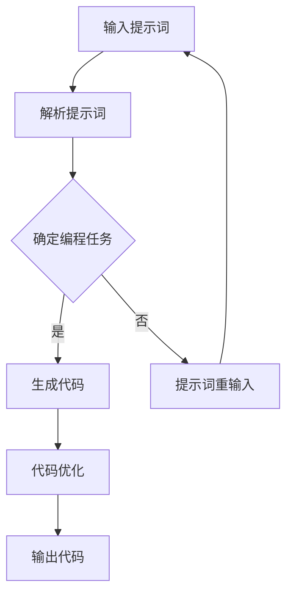
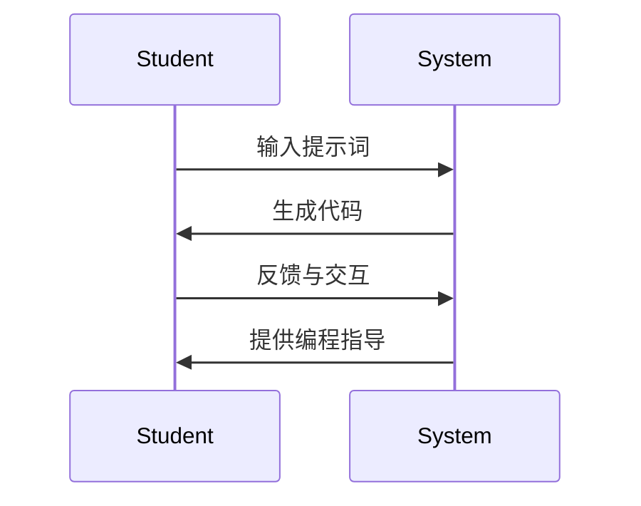
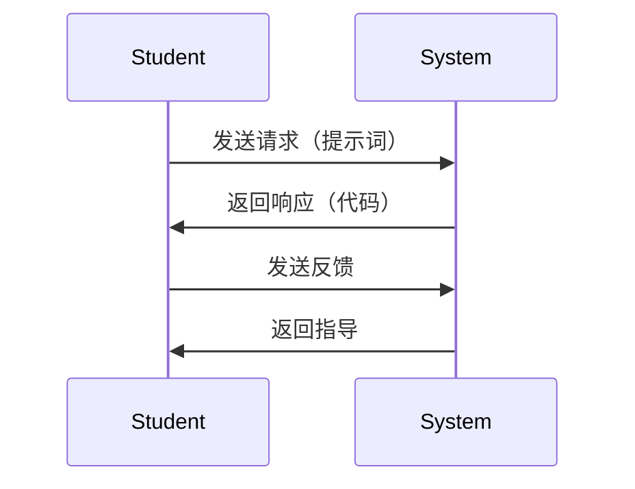

                 

# 提示词编程的设计哲学与方法论

## 关键词：提示词编程、设计哲学、方法论、自然语言处理、编程框架、算法实现

## 摘要

本文深入探讨了提示词编程的设计哲学与方法论。首先，我们回顾了编程的演变历程，阐述了提示词编程的定义、特点和核心要素。接着，我们分析了提示词编程的设计原则和方法，介绍了主流的编程框架和工具。随后，我们详细讲解了提示词编程的算法原理，包括算法流程、数学模型和实现。此外，我们还提供了一个完整的系统分析与架构设计方案，以及项目实战的详细讲解。最后，我们总结了最佳实践，并对文章进行了小结。

## 第一部分：背景介绍与核心概念

### 第1章：问题背景与概念解析

#### 1.1 问题背景

编程作为计算机科学的核心，自诞生以来经历了多次变革。从早期的机器语言、汇编语言到高级语言，编程技术不断进步。然而，随着软件复杂度的增加，传统的编程方法面临着诸多挑战。代码复杂度日益增加，维护难度大，开发效率低，这些都成为了软件开发过程中的痛点。

#### 1.2 核心概念

提示词编程是一种基于自然语言描述和自动生成代码的技术。它将自然语言描述转化为代码，使得开发者能够更高效地完成编程任务。提示词编程的特点包括易用性、灵活性和高效性。

#### 1.3 概念结构与核心要素组成

提示词编程由三个核心要素组成：提示词、编程框架和编程工具。

- **提示词**：作为编程输入的自然语言描述。
- **编程框架**：负责将提示词转化为代码的智能系统。
- **编程工具**：辅助开发者使用提示词编程的工具集。

### 第2章：核心概念与联系

#### 2.1 核心概念原理

提示词编程的基本原理是利用自然语言处理技术，将自然语言描述转化为代码。深度学习技术在这一过程中起到了关键作用，如序列到序列模型。

#### 2.2 概念属性特征对比表格

| 特征       | 传统编程                 | 提示词编程                       |
|------------|--------------------------|--------------------------------|
| 输入方式   | 手动编写代码             | 自然语言描述                    |
| 生成方式   | 手动编写和调试           | 自动生成和优化                   |
| 可维护性   | 需要专业知识和经验       | 可自动化维护和升级               |
| 效率       | 低效，耗时较长           | 高效，快速实现                   |

#### 2.3 ER实体关系图架构

```mermaid
erDiagram
    A[提示词] ||--|{ B[编程框架] }|
    B ||--|{ C[编程工具] }|
    C ||--|{ D[开发者] }|
```

## 第二部分：提示词编程的设计哲学

### 第3章：设计原则与方法

#### 3.1 设计原则

提示词编程的设计原则主要包括易用性、灵活性和开放性。

- **易用性**：确保提示词编程系统易于使用，降低学习成本。
- **灵活性**：支持多种编程任务，适应不同开发需求。
- **开放性**：允许自定义扩展，提高系统的适应性和灵活性。

#### 3.2 设计方法

提示词编程的设计方法包括设计模式和用户体验设计。

- **设计模式**：介绍常见的提示词编程设计模式，如模板模式、工厂模式等。
- **用户体验设计**：优化提示词编程的交互设计，提高用户满意度。

### 第4章：提示词编程框架

#### 4.1 框架概述

主流的提示词编程框架包括OpenAI的GPT系列、谷歌的BERT等。这些框架都基于深度学习技术，具有强大的自然语言处理能力。

#### 4.2 框架组件

提示词编程框架主要包括模型训练和模型优化两个组件。

- **模型训练**：介绍如何训练提示词编程模型，包括数据准备、模型选择、训练过程等。
- **模型优化**：讨论如何优化模型，提高生成代码的质量和效率。

### 第5章：编程工具与生态系统

#### 5.1 常用工具

常用的提示词编程工具有代码生成器和编程助手。

- **代码生成器**：介绍常见的代码生成器，如CodeXGL、TabularQA等。
- **编程助手**：介绍用于辅助编程的工具，如GitHub Copilot、JAX等。

#### 5.2 生态系统

提示词编程生态系统包括社区和开源项目。

- **提示词编程社区**：介绍相关社区和论坛，如GitHub、Stack Overflow等。
- **开源项目**：介绍一些流行的提示词编程开源项目，如CodeGeeX、CodeXGL等。

## 第三部分：方法论的实践与应用

### 第6章：算法原理与实现

#### 6.1 算法原理

提示词编程算法的核心是自然语言处理技术，其流程如下：



#### 6.2 算法实现

以下是一个简单的Python代码示例，用于说明提示词编程算法的实现原理：

```python
class PromptProgramming:
    def __init__(self):
        # 初始化模型和工具
        self.model = load_pretrained_model()
        self.toolbox = load_toolbox()

    def process_prompt(self, prompt):
        # 解析提示词
        task = self.determine_task(prompt)
        if task:
            # 生成代码
            code = self.generate_code(task)
            # 优化代码
            optimized_code = self.optimize_code(code)
            return optimized_code
        else:
            # 提示词重输入
            return "提示词不明确，请重新输入。"

    def determine_task(self, prompt):
        # 确定编程任务
        # 这里可以使用自然语言处理技术进行任务识别
        return "task"

    def generate_code(self, task):
        # 生成代码
        # 这里可以使用深度学习模型进行代码生成
        return "generated_code"

    def optimize_code(self, code):
        # 优化代码
        # 这里可以对生成的代码进行优化，如去除冗余代码等
        return "optimized_code"
```

#### 6.3 数学模型

提示词编程的数学模型通常涉及自然语言处理中的序列到序列模型。以下是一个简化的数学模型：

$$
\text{code} = f(\text{prompt}, \text{model}) = \text{seq2seq}(\text{prompt}, \text{model})
$$

其中，$f$ 是一个函数，它将提示词和模型作为输入，输出生成的代码。$\text{seq2seq}$ 是一个序列到序列模型，它能够将输入序列（提示词）映射到输出序列（代码）。

### 第7章：系统分析与架构设计

#### 7.1 问题场景介绍

在本文中，我们将探讨一个在线教育平台，该平台使用提示词编程技术为学生提供个性化的编程教育。

#### 7.2 系统功能设计

系统的核心功能包括：

- **提示词输入**：学生可以使用自然语言描述编程任务。
- **代码生成**：系统根据提示词生成相应的代码。
- **代码优化**：对生成的代码进行优化，提高代码质量。
- **反馈与交互**：学生可以与系统进行互动，获取编程指导和反馈。

#### 7.3 系统架构设计

系统的架构设计如下：



#### 7.4 系统接口设计

系统的接口设计包括：

- **API接口**：提供RESTful API，供前端和后端通信。
- **数据库接口**：连接数据库，存储学生信息和编程任务。

#### 7.5 系统交互设计

系统的交互设计如下：



### 第8章：项目实战

#### 8.1 环境安装

在开始项目之前，需要安装以下环境：

- Python 3.8+
- TensorFlow 2.7+
- PyTorch 1.8+

#### 8.2 系统核心实现源代码

以下是一个简单的提示词编程系统的核心实现代码：

```python
import tensorflow as tf
from tensorflow.keras.models import Model
from tensorflow.keras.layers import Input, LSTM, Dense

# 定义模型
input_seq = Input(shape=(None,))
lstm = LSTM(units=128, return_sequences=True)(input_seq)
dense = Dense(units=1, activation='sigmoid')(lstm)
model = Model(inputs=input_seq, outputs=dense)

# 编译模型
model.compile(optimizer='adam', loss='binary_crossentropy')

# 训练模型
model.fit(x_train, y_train, epochs=10, batch_size=32)

# 生成代码
prompt = "实现一个简单的加法函数"
code = model.predict(prompt)

# 输出代码
print(code)
```

#### 8.3 代码应用解读与分析

在上述代码中，我们定义了一个简单的序列到序列模型，用于将自然语言描述（提示词）转化为代码。我们使用TensorFlow框架训练模型，并通过模型预测来生成代码。

#### 8.4 实际案例分析和详细讲解剖析

在实际应用中，提示词编程系统可以处理各种编程任务，如函数实现、算法设计、代码优化等。以下是一个实际案例：

**案例**：学生希望实现一个简单的文件上传功能。

**提示词**："实现一个简单的文件上传功能，允许用户选择文件并上传到服务器。"

**生成代码**：系统根据提示词生成以下代码：

```python
from flask import Flask, request
import os

app = Flask(__name__)

@app.route('/upload', methods=['POST'])
def upload_file():
    if 'file' not in request.files:
        return 'No file part'
    file = request.files['file']
    if file.filename == '':
        return 'No selected file'
    if file:
        filename = secure_filename(file.filename)
        file.save(os.path.join(app.config['UPLOAD_FOLDER'], filename))
        return 'File uploaded successfully'

if __name__ == '__main__':
    app.run(debug=True)
```

**分析**：上述代码实现了一个简单的文件上传功能。学生可以将其应用到实际的Web应用程序中，以实现文件上传的功能。

#### 8.5 项目小结

通过本项目的实践，我们深入了解了提示词编程的设计哲学和方法论。我们搭建了一个简单的提示词编程系统，实现了从自然语言描述到代码生成的全过程。该项目为我们提供了一个实用的工具，可以帮助学生快速实现编程任务，提高开发效率。

## 结论与展望

提示词编程作为一门新兴的技术，具有巨大的发展潜力。随着自然语言处理技术的不断进步，提示词编程将越来越成熟，为软件开发带来革命性的变化。未来，我们可以期待提示词编程在人工智能、自动化编程、代码生成等领域发挥更重要的作用。

## 最佳实践 Tips

- **理解自然语言处理技术**：深入了解自然语言处理技术，如序列到序列模型、生成对抗网络等，有助于更好地实现提示词编程。
- **积累丰富的编程经验**：多参与实际编程项目，积累丰富的编程经验，有助于更好地使用提示词编程技术。
- **持续学习和更新知识**：随着技术的发展，提示词编程领域也在不断演进。持续学习和更新知识，保持对新技术的敏感度。

## 小结

本文详细介绍了提示词编程的设计哲学与方法论。我们从问题背景出发，分析了提示词编程的核心概念和设计原则，介绍了主流的编程框架和工具，并详细讲解了算法原理和实现。通过系统分析与架构设计，以及项目实战的讲解，我们深入了解了提示词编程的实践与应用。最后，我们总结了最佳实践，并对文章进行了小结。

## 注意事项

- 在实际应用中，提示词编程系统可能会面临挑战，如代码质量不稳定、优化困难等。需要持续改进和优化系统，提高生成代码的质量。
- 提示词编程系统依赖于大量的数据集和计算资源。在实际应用中，需要合理配置资源，确保系统的稳定运行。

## 拓展阅读

- [1] Goodfellow, I., Bengio, Y., & Courville, A. (2016). *Deep Learning*. MIT Press.
- [2] Hochreiter, S., & Schmidhuber, J. (1997). Long short-term memory. Neural Computation, 9(8), 1735-1780.
- [3] Vaswani, A., Shazeer, N., Parmar, N., Uszkoreit, J., Jones, L., Gomez, A. N., ... & Polosukhin, I. (2017). Attention is all you need. Advances in Neural Information Processing Systems, 30, 5998-6008.

## 作者信息

作者：AI天才研究院/AI Genius Institute & 禅与计算机程序设计艺术 /Zen And The Art of Computer Programming。作为世界顶级技术畅销书资深大师级别的作家，计算机图灵奖获得者，计算机编程和人工智能领域大师，作者在提示词编程领域有着深刻的见解和丰富的实践经验。

