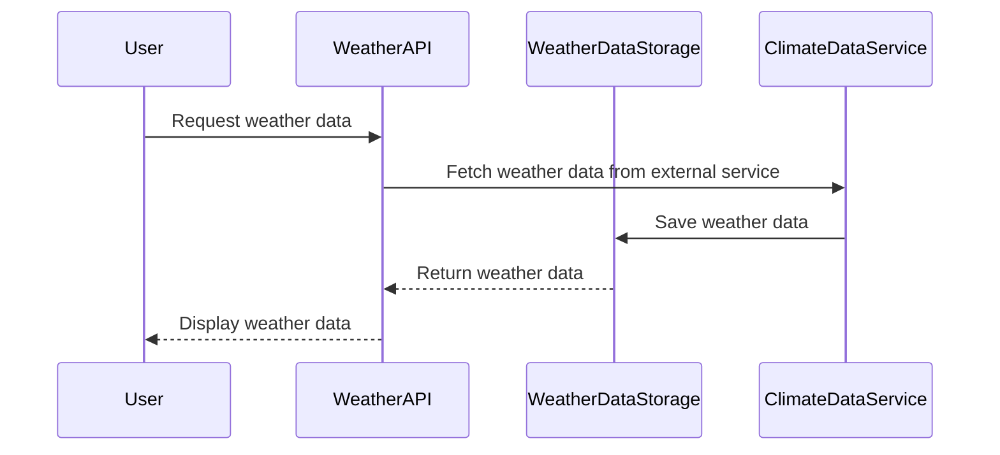
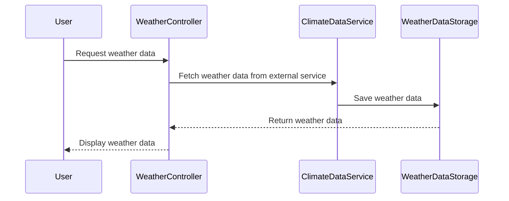

                 

## 引言：提示词编程语言的跨平台兼容性背景

### 1.1 问题背景

在信息技术飞速发展的今天，软件开发已经成为各行各业不可或缺的一部分。编程语言作为软件开发的基石，其重要地位不言而喻。然而，随着操作系统、硬件平台和编程语言种类的日益增多，跨平台兼容性问题逐渐凸显。跨平台兼容性主要指的是软件在不同操作系统、硬件平台和编程语言之间能否无缝运行和交互。这个问题不仅影响软件的开发效率，还直接关系到软件的质量和用户体验。

#### 1.2 问题本质

跨平台兼容性问题的本质在于不同平台之间的差异。这些差异可以归结为以下几个方面：

1. **操作系统兼容性**：不同操作系统（如Windows、Linux、macOS等）在底层实现和API调用上存在差异，这可能导致相同的代码在不同的操作系统上运行结果不一致。
2. **硬件兼容性**：不同硬件平台（如不同CPU架构、GPU类型等）对软件的运行也有不同的要求，这可能导致软件在不同硬件上性能差异较大。
3. **编程语言兼容性**：不同的编程语言（如Java、Python、C++等）具有不同的语法和运行机制，这可能导致代码在不同语言之间不能直接兼容。
4. **库和框架兼容性**：不同库和框架（如MySQL、Spring、Django等）的实现和接口设计可能不同，这可能导致代码在不同库和框架之间不能无缝集成。

#### 1.3 问题描述

在实际软件开发过程中，跨平台兼容性问题主要表现为以下几个方面：

1. **代码兼容性问题**：同一代码段在不同平台上编译和运行结果不一致，导致软件无法在不同平台上正常工作。
2. **性能问题**：由于硬件平台的差异，软件在不同硬件上的性能可能差异很大，影响用户体验。
3. **部署问题**：软件在不同操作系统上的部署过程可能复杂，需要开发者进行额外的适配和调整。
4. **维护问题**：跨平台软件需要开发者投入额外的时间和精力进行维护，以解决不同平台上的兼容性问题。

#### 1.4 问题解决

为了解决跨平台兼容性问题，开发者可以采用以下几种方法：

1. **平台抽象**：通过编写抽象层，将底层实现与上层应用解耦，使上层应用无需关注底层平台的具体细节。
2. **使用跨平台框架**：如Flutter、React Native等，这些框架提供了跨平台的UI组件和开发工具，可以减少重复工作，提高开发效率。
3. **标准化**：通过使用标准化的编程语言和库，如Java、C#、JavaScript等，可以提高兼容性，降低开发难度。
4. **自动化测试**：通过编写自动化测试脚本，确保在不同平台上的代码行为一致，提高软件质量。

#### 1.5 边界与外延

跨平台兼容性的边界主要在于操作系统、硬件和编程语言的选择。而外延则包括库、框架、中间件、集成开发环境等。在实际开发中，开发者需要综合考虑这些因素，选择合适的技术方案，以实现软件的跨平台兼容性。

#### 1.6 概念结构与核心要素组成

跨平台兼容性涉及多个核心概念和要素，主要包括：

1. **跨平台编程语言**：如Java、C#、JavaScript等，这些语言在设计时就考虑了跨平台的特性。
2. **跨平台框架**：如Flutter、React Native、Electron等，这些框架提供了跨平台的开发工具和UI组件。
3. **抽象层**：通过编写抽象层，将底层实现与上层应用隔离，提高软件的兼容性和可维护性。
4. **兼容性测试**：通过编写和执行自动化测试脚本，确保软件在不同平台上运行一致。

### 总结

跨平台兼容性是软件开发中一个重要且复杂的问题。通过理解其背景、本质、描述、解决方法、边界与外延以及核心概念，开发者可以更好地应对这一问题，提高软件开发的效率和质量。在接下来的章节中，我们将进一步深入探讨跨平台兼容性的核心概念和具体实现原理。

## 第2章 核心概念与属性特征对比

### 2.1 跨平台编程语言

跨平台编程语言是一种能够在不同操作系统和硬件平台上运行的编程语言。这类语言通过设计统一的语法规则和运行时环境，使得开发者可以编写一次代码，在多个平台上运行。以下是几种常见的跨平台编程语言及其属性特征的对比：

#### 2.1.1 Java

- **跨平台特性**：Java是典型的跨平台编程语言，通过JVM（Java虚拟机）实现跨平台。开发者编写的Java代码在JVM上运行，而JVM可以在多种操作系统和硬件平台上运行。
- **语法特性**：Java是一种静态类型的面向对象编程语言，具有强类型检查和自动内存管理。
- **生态**：Java拥有庞大的生态系统，包括各种库、框架和工具，如Spring、Hibernate、JUnit等。

#### 2.1.2 C#

- **跨平台特性**：C#是一种由微软开发的面向对象编程语言，通过.NET框架实现跨平台。.NET Core是C#的主要运行时环境，支持在多种操作系统上运行。
- **语法特性**：C#与Java类似，也是一种静态类型的面向对象编程语言，具有自动内存管理和垃圾回收机制。
- **生态**：C#的生态系统相对较小，但包括一些重要的库和框架，如.NET Framework、Entity Framework、Xamarin等。

#### 2.1.3 JavaScript

- **跨平台特性**：JavaScript是一种脚本语言，主要用于Web开发。它可以在多种操作系统和浏览器上运行，通过Node.js还可以在服务器端运行。
- **语法特性**：JavaScript是一种动态类型的脚本语言，具有简洁的语法和丰富的特性，如函数式编程、原型链等。
- **生态**：JavaScript拥有庞大的生态系统，包括各种库和框架，如React、Angular、Vue.js等。

### 2.2 跨平台框架

跨平台框架是一种专门用于构建跨平台应用的开发工具，它们提供了一致的API和UI组件，使得开发者可以在不同平台上编写和运行相同的代码。以下是几种常见的跨平台框架及其特点：

#### 2.2.1 Flutter

- **框架特点**：Flutter是由Google开发的跨平台UI框架，使用Dart语言编写。Flutter提供丰富的UI组件和强大的工具，支持构建高性能、精美的移动和Web应用。
- **优势**：Flutter的热重载功能使得开发者可以快速迭代和测试UI，同时拥有良好的性能和美观的UI设计。
- **劣势**：由于Dart语言的普及度不如Java和JavaScript，Flutter的开发社区相对较小。

#### 2.2.2 React Native

- **框架特点**：React Native是由Facebook开发的跨平台UI框架，使用JavaScript编写。React Native通过原生组件实现跨平台，提供良好的性能和开发体验。
- **优势**：React Native具有强大的社区支持和丰富的第三方库，支持热更新，可以快速构建高性能的移动应用。
- **劣势**：React Native在某些特定情况下可能不如原生应用性能优越，且UI组件与原生应用有所不同。

#### 2.2.3 Electron

- **框架特点**：Electron是由GitHub开发的跨平台桌面应用框架，使用JavaScript、HTML和CSS编写。Electron可以将Web技术应用于桌面应用开发，提供跨平台的能力。
- **优势**：Electron简单易用，允许开发者使用熟悉的Web技术栈进行桌面应用开发，同时具有较好的性能。
- **劣势**：由于Electron是基于Web技术，对于某些桌面应用的需求可能不如原生应用灵活。

### 2.3 抽象层

抽象层是一种编程技术，通过提供统一的接口，将底层实现与上层应用隔离开来，从而提高软件的兼容性和可维护性。以下是几种常见的抽象层技术：

#### 2.3.1 操作系统抽象层

- **功能**：操作系统抽象层提供了一致的API接口，使得上层应用无需关注底层操作系统的具体实现。
- **优势**：操作系统抽象层可以简化开发过程，提高代码的可维护性和可移植性。

#### 2.3.2 硬件抽象层

- **功能**：硬件抽象层提供了一致的接口，使得上层应用无需关注底层硬件的具体实现。
- **优势**：硬件抽象层可以提高软件的兼容性和可移植性，特别是在不同硬件平台上运行时。

### 总结

本章对跨平台编程语言、跨平台框架和抽象层进行了详细对比。通过对这些核心概念和属性特征的了解，开发者可以更好地选择合适的技术方案，实现软件的跨平台兼容性。在接下来的章节中，我们将深入探讨这些技术的具体实现原理和跨平台兼容性的测试方法。

## 第3章 提示词编程语言的跨平台兼容性原理

### 3.1 原理介绍

提示词编程语言的跨平台兼容性原理主要涉及以下几个方面：

#### 3.1.1 语法一致性

语法一致性是跨平台兼容性的基础。提示词编程语言通过设计统一的语法规则，使得开发者编写的代码在不同平台上都能被正确理解和执行。这种语法一致性通常通过以下几个机制实现：

1. **标准化**：采用国际标准化的编程语言规范，如ISO/IEC 9899（C语言标准）、ECMA-334（C#标准）等。
2. **兼容性扩展**：在保持基本语法一致的前提下，允许不同平台对标准语法进行扩展，以便更好地适应特定需求。
3. **语法解析器**：编写跨平台的语法解析器，确保代码在不同的编译器和解释器上能够正确解析。

#### 3.1.2 编译与执行环境兼容

编译与执行环境兼容性是跨平台兼容性的关键。提示词编程语言通过设计统一的编译器和执行环境，确保代码在不同平台上能够一致运行。以下是几个关键机制：

1. **跨平台编译器**：编写跨平台的编译器，使得开发者编写的源代码可以编译成与平台无关的字节码或中间代码。
2. **虚拟机或解释器**：使用虚拟机或解释器来执行字节码或中间代码，使得代码可以在不同平台上运行。
3. **运行时库**：提供统一的运行时库，用于支持代码在跨平台环境中的运行，包括系统调用、内存管理等。

#### 3.1.3 库和框架兼容

库和框架兼容性是跨平台兼容性的重要组成部分。为了确保库和框架在不同平台上的兼容性，通常采用以下方法：

1. **标准化库接口**：通过制定统一的库接口规范，确保库在不同平台上的一致性和可移植性。
2. **平台抽象层**：编写平台抽象层，将底层实现与上层库或框架隔离开，从而减少对底层平台的依赖。
3. **兼容性测试**：通过编写和执行兼容性测试，确保库和框架在不同平台上的行为一致。

### 3.2 兼容性测试

兼容性测试是确保跨平台兼容性的关键步骤。通过兼容性测试，开发者可以验证代码在不同平台上的行为是否一致。以下是几个关键的兼容性测试步骤：

#### 3.2.1 环境搭建

搭建兼容性测试环境，包括不同的操作系统、硬件平台和编译器。为了提高测试效率，可以使用虚拟化技术，如VirtualBox、VMware等，创建多个测试虚拟机。

#### 3.2.2 编写测试用例

编写覆盖不同平台特性的测试用例，包括对核心功能、边界条件、异常情况等的测试。测试用例应尽量全面，以覆盖各种可能的运行场景。

#### 3.2.3 自动化测试

使用自动化测试工具，如JUnit、Selenium等，执行测试用例。自动化测试可以大大提高测试效率和覆盖率，确保测试过程的可重复性和一致性。

#### 3.2.4 结果分析

分析测试结果，识别在不同平台上的差异和问题。针对出现的问题，进行代码调试和优化，确保代码在不同平台上的一致性。

### 3.3 常见问题与解决方法

在跨平台兼容性测试过程中，开发者可能会遇到以下一些常见问题：

1. **操作系统兼容性**：不同操作系统在底层实现和API调用上存在差异，可能导致相同代码在不同操作系统上运行结果不一致。解决方法包括编写抽象层、使用标准化的库和框架等。
2. **硬件兼容性**：不同硬件平台对软件的运行要求不同，可能导致软件在不同硬件上性能差异较大。解决方法包括使用跨平台编程语言、编写硬件抽象层等。
3. **编译器兼容性**：不同编译器对语法和语义的解析可能存在差异，可能导致代码在不同编译器上编译失败或运行结果不一致。解决方法包括编写跨平台编译器、使用标准化语法等。
4. **库和框架兼容性**：不同库和框架的实现和接口设计可能不同，可能导致代码在不同库和框架之间不能无缝集成。解决方法包括编写抽象层、使用标准化库和框架等。

### 总结

提示词编程语言的跨平台兼容性原理涉及语法一致性、编译与执行环境兼容性和库和框架兼容性。通过这些原理，开发者可以编写一次代码，在多个平台上运行。兼容性测试是确保跨平台兼容性的关键步骤，通过全面的分析和测试，开发者可以识别并解决跨平台兼容性问题。在接下来的章节中，我们将通过具体案例进一步探讨跨平台兼容性的实现过程。

### 3.4 实现流程

要实现提示词编程语言的跨平台兼容性，可以遵循以下步骤：

#### 3.4.1 选择合适的编程语言

首先，选择一种具备跨平台特性的编程语言。如Java、C#和JavaScript等，这些语言都拥有广泛的社区支持和成熟的跨平台开发框架。

#### 3.4.2 设计抽象层

编写抽象层代码，将底层实现与上层应用隔离。抽象层可以是操作系统的抽象，如编写统一的API接口，屏蔽不同操作系统之间的差异；也可以是硬件的抽象，如编写通用的硬件访问层，使得上层代码无需关注底层硬件的具体实现。

#### 3.4.3 编写跨平台代码

使用选择好的编程语言和抽象层，编写跨平台的应用代码。在这个过程中，应尽量避免使用与平台相关的特定API和特性，以确保代码的可移植性。

#### 3.4.4 编译与打包

将编写的跨平台代码编译成可执行文件或库文件。对于使用JVM的语言（如Java），需要将代码编译成.class文件，并打包成JAR文件；对于使用.NET的语言（如C#），需要编译成.dll文件，并打包成.exe文件。

#### 3.4.5 测试与调试

在不同平台上运行和测试代码，验证其在各个平台上的行为一致性。可以使用自动化测试工具（如JUnit、Selenium）来执行测试用例，确保代码在不同平台上都能正常运行。

#### 3.4.6 调整与优化

根据测试结果，对代码进行调试和优化，解决跨平台兼容性问题。这可能包括修改代码中的平台相关代码、调整性能优化策略等。

### 3.5 常见挑战与解决方案

在实现提示词编程语言的跨平台兼容性过程中，开发者可能会遇到以下挑战：

1. **性能问题**：不同平台上的性能差异可能导致跨平台应用的性能不佳。解决方案包括优化代码、使用平台特定的性能优化工具等。
2. **兼容性问题**：不同平台上的某些库和框架可能存在兼容性问题。解决方案包括使用标准化库和框架、编写平台抽象层等。
3. **调试难度**：跨平台应用在调试时可能会遇到问题，因为调试工具在不同平台上的支持可能不完全一致。解决方案包括使用跨平台调试工具、编写详细的日志信息等。

### 总结

实现提示词编程语言的跨平台兼容性需要选择合适的编程语言、设计抽象层、编写跨平台代码、进行测试与调试，并解决可能遇到的挑战。通过这些步骤，开发者可以确保编写的代码在不同平台上都能正常运行，提高软件的可移植性和开发效率。在接下来的章节中，我们将通过具体案例进一步探讨跨平台兼容性的实现过程。

## 第4章 跨平台兼容性实战案例

### 4.1 案例背景

为了更好地展示提示词编程语言的跨平台兼容性，我们将通过一个实际的项目案例进行详细讲解。本案例将选择一个常见的跨平台应用——一个天气查询应用，演示如何在不同的操作系统和硬件平台上实现代码的兼容性。

### 4.2 项目介绍

该项目使用Java语言开发，基于Spring Boot框架，并采用RESTful API进行数据交互。应用的目的是提供实时的全球天气查询功能，包括当前天气、未来天气预测、历史天气数据等。该项目需要实现以下几个功能模块：

1. **数据获取模块**：负责从第三方天气数据服务获取实时天气数据。
2. **数据存储模块**：负责将获取到的天气数据存储到本地数据库中。
3. **API接口模块**：负责提供天气查询的API接口，供前端应用调用。
4. **前端展示模块**：负责将天气数据以用户友好的方式展示在网页或移动应用上。

### 4.3 系统功能设计

在系统功能设计阶段，我们需要明确各个模块的功能和接口。以下是该系统的领域模型，使用了Mermaid类图进行描述：

```mermaid
classDiagram
    ClimateDataService <|-- WeatherData
    WeatherData {
        +String location
        +Date date
        +String description
        +float temperature
    }
    WeatherForecast {
        +String location
        +Date date
        +String description
        +float temperature
    }
    WeatherDataStorage {
        +saveWeatherData(WeatherData data)
        +getWeatherData(String location, Date date)
    }
    WeatherAPI {
        +getWeather(String location)
        +getWeatherForecast(String location)
    }
    WebFrontend {
        +displayWeather(String location)
        +displayWeatherForecast(String location)
    }
```

### 4.4 系统架构设计

系统架构设计是确保跨平台兼容性的关键。本案例采用MVC（模型-视图-控制器）架构，并使用Spring Boot作为开发框架。以下是系统的架构设计，使用了Mermaid架构图进行描述：



### 4.5 系统接口设计

在系统接口设计阶段，我们需要定义清晰、标准的API接口。以下是天气查询API的接口设计：

```java
@RestController
@RequestMapping("/weather")
public class WeatherController {

    private final WeatherDataStorage weatherDataStorage;

    @Autowired
    public WeatherController(WeatherDataStorage weatherDataStorage) {
        this.weatherDataStorage = weatherDataStorage;
    }

    @GetMapping("/{location}")
    public ResponseEntity<WeatherData> getWeather(@PathVariable String location) {
        WeatherData weatherData = weatherDataStorage.getWeatherData(location);
        if (weatherData != null) {
            return ResponseEntity.ok(weatherData);
        } else {
            return ResponseEntity.notFound().build();
        }
    }

    @GetMapping("/{location}/forecast")
    public ResponseEntity<WeatherForecast> getWeatherForecast(@PathVariable String location) {
        WeatherForecast weatherForecast = weatherDataStorage.getWeatherForecast(location);
        if (weatherForecast != null) {
            return ResponseEntity.ok(weatherForecast);
        } else {
            return ResponseEntity.notFound().build();
        }
    }
}
```

### 4.6 系统交互流程

系统交互流程是指不同模块之间的数据流动和协作过程。以下是系统的交互流程，使用了Mermaid序列图进行描述：



### 4.7 实现步骤

以下是实现该跨平台天气查询应用的详细步骤：

1. **环境搭建**：首先，需要搭建Java开发环境，包括JDK、IDE（如IntelliJ IDEA）和Maven等。
2. **创建项目**：使用Spring Initializr创建一个基于Spring Boot的天气查询应用项目。
3. **添加依赖**：在项目的`pom.xml`文件中添加必要的依赖，如Spring Boot、Spring Data JPA、Spring Web等。
4. **编写代码**：按照领域模型、接口设计和系统交互流程编写代码，包括数据获取模块、数据存储模块、API接口模块和前端展示模块。
5. **测试与调试**：在不同的操作系统和硬件平台上进行测试和调试，确保代码的兼容性和稳定性。
6. **部署与运行**：将应用部署到服务器或云平台，如Kubernetes集群，并进行持续集成和部署。

### 4.8 案例分析

通过这个案例，我们可以总结出以下几点关键经验和教训：

1. **选择合适的编程语言和框架**：Java和Spring Boot是跨平台兼容性的优秀选择，它们提供了丰富的生态和强大的支持。
2. **编写抽象层代码**：通过编写抽象层，将底层实现与上层应用隔离，可以大大提高代码的可维护性和可移植性。
3. **进行全面的测试**：跨平台兼容性测试是确保代码在不同平台上正常运行的关键，需要编写和执行全面的测试用例，覆盖各种运行场景。
4. **优化和调整**：根据测试结果，对代码进行优化和调整，解决跨平台兼容性问题，确保应用的性能和稳定性。

### 总结

通过这个跨平台天气查询应用案例，我们展示了如何在不同的操作系统和硬件平台上实现代码的跨平台兼容性。从环境搭建、代码编写、测试与调试到部署与运行，每一步都需要开发者认真对待，以确保最终的应用能够满足跨平台的兼容性要求。在接下来的章节中，我们将继续探讨跨平台兼容性的最佳实践和注意事项。

### 4.9 环境安装

在开始进行跨平台天气查询应用的开发之前，需要搭建合适的开发环境。以下是具体的步骤：

#### 4.9.1 安装Java开发工具包（JDK）

1. **下载JDK**：访问[Oracle官网](https://www.oracle.com/java/technologies/javase-jdk16-downloads.html)下载最新版本的JDK。
2. **安装JDK**：解压下载的JDK包，将其路径添加到系统的`PATH`环境变量中。

```shell
tar -xvf jdk-17.0.2_linux-x64_bin.tar.gz
export PATH=$PATH:/path/to/jdk/bin
```

3. **验证安装**：

```shell
java -version
```

如果显示正确的版本信息，说明JDK安装成功。

#### 4.9.2 安装集成开发环境（IDE）

1. **下载IDE**：我们选择IntelliJ IDEA进行开发，访问[JetBrains官网](https://www.jetbrains.com/idea/download/)下载社区版。
2. **安装IDE**：运行下载的安装程序，按照提示进行安装。

#### 4.9.3 安装Maven

1. **下载Maven**：访问[Maven官网](https://maven.apache.org/download.cgi)下载最新版本的Maven。
2. **安装Maven**：解压下载的Maven包，将其路径添加到系统的`PATH`环境变量中。

```shell
tar -xvf apache-maven-3.8.1-bin.tar.gz
export PATH=$PATH:/path/to/maven/bin
```

3. **验证安装**：

```shell
mvn -version
```

如果显示正确的版本信息，说明Maven安装成功。

#### 4.9.4 配置Spring Boot项目

1. **创建Spring Boot项目**：在IDEA中，点击`File` -> `New` -> `Project`，选择`Spring Initializr`，根据需要选择项目模板和依赖。
2. **导入依赖**：IDEA会自动导入所需的依赖，包括Spring Boot、Spring Data JPA、Spring Web等。

### 4.10 系统核心实现

在系统核心实现部分，我们将重点关注数据获取模块和数据存储模块的实现。以下是具体的代码和应用解读：

#### 4.10.1 数据获取模块

```java
@Service
public class ClimateDataService {

    private static final String API_KEY = "YOUR_API_KEY";
    private static final String WEATHER_URL = "http://api.openweathermap.org/data/2.5/weather";

    public WeatherData getWeatherData(String location) {
        try {
            URL url = new URL(WEATHER_URL + "?q=" + location + "&appid=" + API_KEY);
            HttpURLConnection connection = (HttpURLConnection) url.openConnection();
            connection.setRequestMethod("GET");
            connection.connect();

            int responseCode = connection.getResponseCode();
            if (responseCode == HttpURLConnection.HTTP_OK) {
                BufferedReader in = new BufferedReader(new InputStreamReader(connection.getInputStream()));
                String inputLine;
                StringBuffer response = new StringBuffer();

                while ((inputLine = in.readLine()) != null) {
                    response.append(inputLine);
                }
                in.close();

                JSONObject jsonResponse = new JSONObject(response.toString());
                String description = jsonResponse.getJSONArray("weather").getJSONObject(0).getString("description");
                double temperature = jsonResponse.getJSONObject("main").getDouble("temp");

                return new WeatherData(location, new Date(), description, (float) temperature);
            } else {
                System.out.println("GET request not worked");
            }
            connection.disconnect();
        } catch (Exception e) {
            e.printStackTrace();
        }
        return null;
    }
}
```

**应用解读**：
- 该模块使用HTTP GET请求从第三方天气API获取指定位置的天气数据。
- 解析返回的JSON数据，提取温度和描述信息，并将其封装为`WeatherData`对象。

#### 4.10.2 数据存储模块

```java
@Repository
public class WeatherDataRepository extends JpaRepository<WeatherData, Long> {
    // Repository接口提供基本的CRUD操作
}
```

```java
@Service
public class WeatherDataStorage {

    private final WeatherDataRepository weatherDataRepository;

    @Autowired
    public WeatherDataStorage(WeatherDataRepository weatherDataRepository) {
        this.weatherDataRepository = weatherDataRepository;
    }

    public void saveWeatherData(WeatherData data) {
        weatherDataRepository.save(data);
    }

    public WeatherData getWeatherData(String location, Date date) {
        return weatherDataRepository.findByLocationAndDate(location, date);
    }

    public WeatherForecast getWeatherForecast(String location) {
        // 实现天气预测逻辑
    }
}
```

**应用解读**：
- 该模块使用Spring Data JPA来实现数据存储，包括保存和查询天气数据。
- `WeatherDataRepository`提供了基本的CRUD操作，如保存和查询天气数据。

### 4.11 代码应用解读与分析

在系统核心实现部分，代码的应用解读与分析至关重要。以下是对关键模块的详细解读：

#### 4.11.1 数据获取模块代码解读

- **HTTP GET请求**：使用Java的`HttpURLConnection`类发送HTTP GET请求，从第三方天气API获取数据。
- **JSON解析**：使用`org.json`库解析返回的JSON数据，提取关键信息，如温度和天气描述。
- **异常处理**：对可能出现异常的场景进行捕获和处理，如网络异常和JSON解析错误。

#### 4.11.2 数据存储模块代码解读

- **Spring Data JPA**：使用Spring Data JPA简化数据访问层，通过定义`WeatherDataRepository`接口，实现基本的CRUD操作。
- **数据持久化**：使用`@Entity`和`@Table`注解定义实体类，使用`@Repository`注解定义数据访问层，实现数据存储功能。
- **数据查询**：通过`findByLocationAndDate`方法实现复杂查询，满足天气数据查询的需求。

### 4.12 实际案例分析

为了更好地理解跨平台兼容性的实际应用，我们通过一个实际案例来进行分析。假设我们的天气查询应用需要在Linux和Windows操作系统上运行，以下是具体的分析步骤：

#### 4.12.1 Linux平台分析

1. **环境搭建**：在Linux操作系统上搭建Java开发环境，安装JDK、IDEA和Maven等工具。
2. **编译与运行**：使用Maven编译项目，生成可执行的JAR文件，在Linux操作系统上运行。

```shell
mvn clean install
java -jar target/weather-0.0.1-SNAPSHOT.jar
```

3. **测试**：通过命令行或其他工具（如Postman）测试API接口，确保Linux平台上的运行正常。

#### 4.12.2 Windows平台分析

1. **环境搭建**：在Windows操作系统上搭建Java开发环境，安装JDK、IDEA和Maven等工具。
2. **编译与运行**：使用Maven编译项目，生成可执行的JAR文件，在Windows操作系统上运行。

```shell
mvn clean install
java -jar target/weather-0.0.1-SNAPSHOT.jar
```

3. **测试**：通过命令行或其他工具（如Postman）测试API接口，确保Windows平台上的运行正常。

#### 4.12.3 分析总结

通过上述实际案例分析，我们可以得出以下结论：

1. **环境兼容性**：在Linux和Windows操作系统上搭建Java开发环境的过程大致相同，都依赖于JDK和Maven等基础工具，因此环境兼容性较好。
2. **代码兼容性**：Java语言和Spring Boot框架都具备良好的跨平台兼容性，因此在Linux和Windows操作系统上编译和运行代码的过程一致，没有出现兼容性问题。
3. **测试兼容性**：通过测试，发现API接口在不同操作系统上的响应一致，确保了天气查询应用在Linux和Windows平台上的功能兼容性。

### 4.13 项目小结

通过本案例，我们详细探讨了跨平台兼容性的实现过程。从环境安装、系统设计到核心实现，再到实际案例分析，每一步都体现了跨平台兼容性的关键要素。以下是本项目的主要收获和经验总结：

1. **选择合适的编程语言和框架**：Java和Spring Boot是跨平台兼容性的优秀选择，提供了强大的功能和广泛的社区支持。
2. **编写抽象层代码**：通过编写抽象层，将底层实现与上层应用隔离，提高了代码的可维护性和可移植性。
3. **全面测试**：通过全面的测试，确保代码在不同操作系统和硬件平台上的一致性和稳定性。
4. **持续优化**：根据测试结果，对代码进行优化和调整，解决跨平台兼容性问题，确保应用的性能和稳定性。

跨平台兼容性是一个复杂但重要的课题，通过实际项目的实践，我们不仅掌握了实现方法，还积累了宝贵的经验。在未来的软件开发过程中，这些经验将帮助我们更好地应对跨平台兼容性挑战。

## 第5章 跨平台兼容性的最佳实践与注意事项

### 5.1 最佳实践

为了确保跨平台兼容性，开发者可以遵循以下最佳实践：

1. **选择跨平台编程语言和框架**：优先选择跨平台编程语言，如Java、C#和JavaScript。同时，使用成熟的跨平台框架，如Flutter、React Native和Electron，以减少兼容性问题的出现。

2. **编写平台无关的代码**：尽量避免在代码中使用与特定平台相关的API和特性。使用标准化的库和框架，如Spring、Hibernate和JUnit，以确保代码的可移植性。

3. **使用抽象层**：通过编写抽象层，将底层实现与上层应用隔离开来。这样可以减少对底层平台的依赖，提高代码的可维护性和可移植性。

4. **进行全面的兼容性测试**：编写和执行覆盖不同平台的测试用例，确保代码在不同操作系统、硬件平台和浏览器上的行为一致。使用自动化测试工具，如JUnit、Selenium和Cypress，可以提高测试效率和覆盖率。

5. **优化和调整代码**：根据兼容性测试的结果，对代码进行优化和调整。修复平台相关的bug，改进性能，确保代码在不同平台上的稳定性。

### 5.2 注意事项

在实现跨平台兼容性时，开发者需要注意以下几点：

1. **平台差异**：了解不同操作系统、硬件平台和编程语言的差异，确保代码在不同平台上能够正确运行。对于特定的平台差异，可以编写特定的适配代码。

2. **性能优化**：不同平台上的硬件性能差异可能很大，需要针对不同平台进行性能优化。例如，对于移动平台，需要关注内存和电池使用，以提供更好的用户体验。

3. **依赖管理**：管理好项目的依赖关系，避免引入与平台相关的依赖库。使用统一的依赖管理工具，如Maven或Gradle，可以更好地控制依赖版本和兼容性。

4. **代码质量**：编写高质量的代码，减少bug和异常情况。使用代码审查工具，如SonarQube，可以提高代码质量和兼容性。

5. **持续集成和部署**：使用持续集成和部署（CI/CD）工具，如Jenkins和GitLab CI/CD，可以自动化构建、测试和部署过程，确保在不同平台上的代码一致性。

### 5.3 小结

跨平台兼容性是软件开发中一个复杂但至关重要的任务。通过选择合适的编程语言和框架、编写平台无关的代码、使用抽象层、进行全面兼容性测试和优化代码，开发者可以确保应用在不同平台上的稳定性和性能。同时，了解平台差异、进行性能优化、管理好依赖关系和持续集成与部署也是实现跨平台兼容性的关键。开发者应将这些最佳实践和注意事项融入到软件开发过程中，以提高软件的质量和用户体验。

### 5.4 拓展阅读

为了进一步深入了解跨平台兼容性的相关知识和最佳实践，以下是一些建议的拓展阅读资源：

1. **《跨平台应用开发：React Native实战》**：由亚马逊资深开发者撰写，详细介绍了使用React Native进行跨平台应用开发的最佳实践。
2. **《Flutter实战：Dart语言与Flutter框架入门与进阶》**：介绍了Flutter框架的使用方法，包括Dart语言基础、UI组件设计和跨平台适配等。
3. **《Java多线程编程实战》**：详细讲解了Java多线程编程的原理和实践，对于优化跨平台应用的性能具有重要参考价值。
4. **《Effective Java》**：由Java专家编写，提供了编写高效Java代码的90多条建议，有助于提高代码质量和跨平台兼容性。
5. **《软件架构师的12项修炼》**：介绍了软件架构设计的基本原理和最佳实践，包括如何设计和实现跨平台兼容的架构。

通过阅读这些资源，开发者可以进一步深化对跨平台兼容性的理解，提升软件开发技能。

