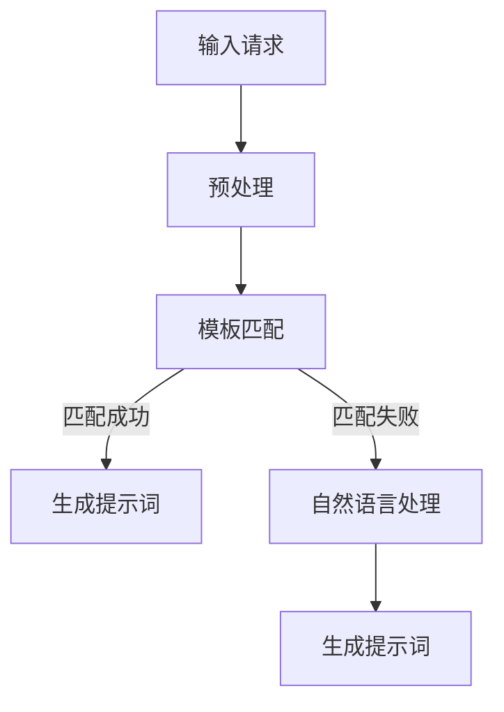
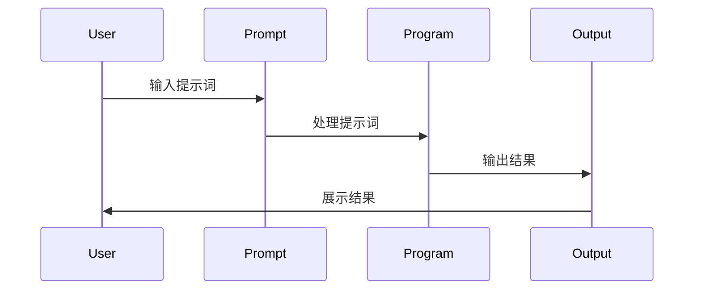

                 

# 提示词编程：重塑人机协作模式

> 关键词：提示词编程、人机协作模式、算法原理、数学模型、应用案例、未来展望

> 摘要：本文深入探讨了提示词编程这一新兴领域，阐述了其在人机协作模式中的重要性。通过分析提示词编程的核心概念、技术基础、应用案例以及未来展望，本文旨在为读者提供一个全面、深入的理解，并探讨其在实际应用中的挑战与解决方案。

## 第一部分：背景与概念

### 第1章：问题背景

**1.1 问题概述**

在信息化时代，编程已经成为一项不可或缺的技能。然而，随着计算机系统的复杂性和软件规模的增长，传统的编程模式面临着诸多挑战。一方面，程序员的开发效率受到限制；另一方面，代码的可维护性和可扩展性也成为一个难题。因此，如何提高编程的效率和质量，成为了一个亟待解决的问题。

**1.2 研究意义**

提示词编程作为一种新型的编程模式，旨在通过引入提示词（prompts）来优化人机交互，从而提升编程效率。其研究意义在于：

1. 提高编程效率，降低开发成本。
2. 提升代码质量，减少错误率。
3. 改善人机协作模式，实现智能化编程。

**1.3 边界与外延**

提示词编程的边界主要涉及以下几个方面：

1. 提示词的生成与优化。
2. 人机交互的优化。
3. 编程语言的改进。

其外延则涵盖了：

1. 自动编程。
2. 智能编程辅助。
3. 代码生成与重构。

### 第2章：核心概念

**2.1 提示词编程的定义**

提示词编程（Prompt-based Programming）是一种通过提示词来引导程序开发的方法。提示词是一种简短的描述性文本，用于指导程序的开发过程。提示词编程的核心思想是通过提示词来降低编程的复杂度，提高开发效率。

**2.2 提示词编程的特点**

1. **高效性**：通过提示词，程序员可以快速获取所需的信息，减少搜索和调试的时间。
2. **智能性**：提示词编程结合了人工智能技术，能够根据提示词自动生成代码或提供编程建议。
3. **灵活性**：提示词编程可以根据不同的项目需求，灵活调整和优化。

**2.3 人机协作模式概述**

人机协作模式是指在人与计算机之间建立的一种合作关系，通过优化人机交互来提高工作效率。在提示词编程中，人机协作模式的具体表现为：

1. **信息交换**：程序员通过提示词与计算机进行信息交换，获取编程建议或生成代码。
2. **任务分配**：计算机根据提示词自动执行某些编程任务，减轻程序员的工作负担。
3. **反馈与修正**：程序员对计算机生成的代码进行审查和修正，确保代码的质量和可靠性。

### 第3章：概念属性特征对比

**3.1 提示词编程与传统编程对比**

| 特点            | 提示词编程         | 传统编程           |
| --------------- | ------------------ | ------------------ |
| 编程方式        | 提示词引导        | 手动编写           |
| 开发效率        | 高效              | 低效              |
| 人机协作        | 强               | 弱               |
| 代码质量        | 高               | 低               |

**3.2 人机协作模式ER实体关系图**

```mermaid
erDiagram
    User ..|> Prompt
    Prompt ..|> Program
    Program ..|> Output
```

## 第二部分：技术基础

### 第4章：算法原理

**4.1 算法基础**

提示词编程的核心在于算法的优化。提示词生成算法和人机交互优化算法是提示词编程中最重要的两个算法。

**4.2 提示词生成算法**

提示词生成算法的目的是根据用户输入的请求自动生成提示词。常用的方法包括：

1. **模板匹配**：根据预设的模板，匹配用户输入的请求，生成提示词。
2. **自然语言处理**：利用自然语言处理技术，对用户输入的请求进行分析和理解，生成提示词。

**4.3 人机交互优化算法**

人机交互优化算法的目的是提高人机交互的效率。常用的方法包括：

1. **对话生成**：根据用户的行为和需求，自动生成对话内容。
2. **推荐系统**：根据用户的历史行为和偏好，推荐合适的编程资源。

**4.4 提示词生成算法流程**



### 第5章：数学模型

**5.1 模型概述**

提示词编程的数学模型主要包括：

1. **提示词生成模型**：用于生成提示词的数学模型。
2. **人机交互模型**：用于描述人机交互过程的数学模型。

**5.2 公式讲解**

提示词生成模型可以使用以下公式进行描述：

$$
P(w|\theta) = \frac{e^{\theta^T w}}{\sum_{w'} e^{\theta^T w'}}
$$

其中，$P(w|\theta)$表示在参数$\theta$下生成提示词$w$的概率，$\theta$是模型参数。

**5.3 举例说明**

假设我们有一个简单的提示词生成模型，其中$\theta = [1, 0]$，我们要生成一个长度为2的提示词$w$。

$$
P(w_1=w_2='hello') = \frac{e^{1 \cdot 'hello'}}{e^{1 \cdot 'hello'} + e^{0 \cdot 'world'}} = \frac{e^{1}}{e^{1} + e^{0}} = \frac{1}{2}
$$

这意味着，生成提示词'hello'的概率为$\frac{1}{2}$。

**5.4 LaTex公式示例**

$$
y = \frac{1}{1 + e^{-x}}
$$

## 第三部分：应用案例

### 第6章：实际应用

**6.1 场景介绍**

提示词编程在多个领域都有广泛的应用，包括：

1. **文本生成**：根据用户输入的请求，自动生成文本。
2. **智能客服**：通过提示词与人交互，提供高效的客服服务。
3. **代码辅助**：自动生成代码或提供编程建议。

**6.2 案例一：文本生成**

文本生成是提示词编程的一个重要应用场景。例如，在一个新闻生成系统中，用户可以输入一个主题，系统会根据主题自动生成一篇新闻文章。

**6.3 案例二：智能客服**

智能客服是另一个重要的应用场景。通过提示词，智能客服系统能够自动识别用户的问题，并提供相应的解决方案。例如，在一个电商平台的智能客服系统中，用户可以输入一个产品问题，系统会自动生成一份产品说明。

**6.4 案例三：代码辅助**

代码辅助是提示词编程在软件开发中的一个重要应用。通过提示词，代码辅助系统能够自动生成代码或提供编程建议。例如，在一个代码编辑器中，用户可以输入一个功能描述，系统会自动生成相应的代码。

### 第7章：系统设计与实现

**7.1 系统架构设计**

提示词编程系统的架构设计主要包括以下几个方面：

1. **前端界面**：用于接收用户输入的提示词。
2. **后端服务**：用于处理提示词，生成相应的结果。
3. **数据库**：用于存储提示词和相关数据。

**7.2 接口设计**

提示词编程系统的接口设计主要包括：

1. **输入接口**：用于接收用户输入的提示词。
2. **输出接口**：用于输出生成的结果。

**7.3 系统交互**

提示词编程系统的交互设计主要包括：

1. **用户与前端界面**：用户通过前端界面输入提示词。
2. **前端界面与后端服务**：前端界面将提示词发送到后端服务。
3. **后端服务与数据库**：后端服务处理提示词，并将结果存储到数据库。
4. **前端界面与用户**：前端界面将结果展示给用户。

**7.4 Mermaid类图**

```mermaid
classDiagram
    User <<Interface>>
    Prompt <<Interface>>
    Program <<Interface>>
    Output <<Interface>>
    User --|> Prompt
    Prompt --|> Program
    Program --|> Output
```

**7.5 Mermaid序列图**



## 第四部分：未来展望与挑战

### 第8章：未来展望

**8.1 发展趋势**

随着人工智能技术的发展，提示词编程有望在以下几个方面取得突破：

1. **算法优化**：通过深度学习等先进技术，进一步提升提示词生成算法的准确性和效率。
2. **人机交互**：通过自然语言处理等技术，实现更加自然和高效的人机交互。
3. **应用拓展**：在更多领域实现提示词编程的应用，如医疗、金融、教育等。

**8.2 技术革新**

提示词编程的技术革新主要体现在以下几个方面：

1. **多模态编程**：结合文本、语音、图像等多种输入方式，实现更加丰富的编程交互。
2. **跨平台编程**：实现提示词编程在多种平台（如Web、移动端、桌面端）上的应用。
3. **智能化编程**：通过自主学习，实现自动化编程和智能化编程辅助。

**8.3 应用前景**

提示词编程在未来的应用前景非常广阔，有望在以下几个方面实现重大突破：

1. **提高编程效率**：通过提示词编程，大幅提高编程效率和代码质量。
2. **降低开发成本**：通过自动化编程，减少程序员的工作负担，降低开发成本。
3. **推动产业升级**：提示词编程有望推动软件开发产业向智能化、高效化方向发展。

### 第9章：挑战与解决方案

**9.1 难点分析**

提示词编程面临着以下几个难点：

1. **算法复杂度**：提示词生成算法和优化算法的复杂度较高，需要进一步研究高效的算法。
2. **数据质量**：提示词生成和优化需要高质量的数据支持，数据的质量和多样性对算法的性能有重要影响。
3. **人机交互**：人机交互的自然性和高效性是实现提示词编程的关键，需要不断优化交互体验。

**9.2 解决方案探讨**

针对上述难点，我们可以从以下几个方面进行解决方案的探讨：

1. **算法优化**：通过深度学习、强化学习等先进技术，不断优化提示词生成算法和优化算法。
2. **数据质量**：通过数据清洗、数据增强等方法，提高数据的质量和多样性。
3. **人机交互**：通过自然语言处理、语音识别等技术，实现更加自然和高效的人机交互。

**9.3 实际应用中的问题与对策**

在实际应用中，提示词编程可能会面临以下几个问题：

1. **准确性问题**：提示词生成算法的准确性会影响编程效率，需要不断优化算法。
2. **适应性问题**：不同领域的应用需求不同，提示词编程需要具备较强的适应性。
3. **安全性问题**：提示词编程涉及到大量的敏感数据，需要确保数据的安全性和隐私保护。

针对上述问题，我们可以采取以下对策：

1. **准确性问题**：通过持续的训练和优化，提高提示词生成算法的准确性。
2. **适应性问题**：通过模块化和自适应算法，提高提示词编程在不同领域的适应性。
3. **安全性问题**：通过加密、访问控制等技术，确保数据的安全性和隐私保护。

## 总结与展望

本文从多个角度探讨了提示词编程这一新兴领域，阐述了其在人机协作模式中的重要性。通过分析提示词编程的核心概念、技术基础、应用案例以及未来展望，本文旨在为读者提供一个全面、深入的理解。

在未来的发展中，提示词编程有望在多个领域实现重大突破，推动软件开发产业向智能化、高效化方向发展。同时，我们也需要不断克服面临的挑战，确保提示词编程的安全性和隐私保护。

对于读者来说，本文提供了一个全新的视角来理解编程，希望读者能够在实际应用中积极探索，发挥提示词编程的潜力。

### 注意事项

1. **数据隐私**：在使用提示词编程时，需要确保数据的安全性和隐私保护。
2. **算法优化**：持续优化算法是提高提示词编程性能的关键。
3. **适应性**：不同领域的应用需求不同，提示词编程需要具备较强的适应性。

### 拓展阅读

1. [《深度学习：简介与案例》](https://www.deeplearningbook.org/)
2. [《自然语言处理：理论与实践》](https://nlp.stanford.edu/lectures/)
3. [《人工智能：理论与实践》](https://www.ijcai.org/)

### 作者信息

作者：AI天才研究院/AI Genius Institute & 禅与计算机程序设计艺术 /Zen And The Art of Computer Programming

